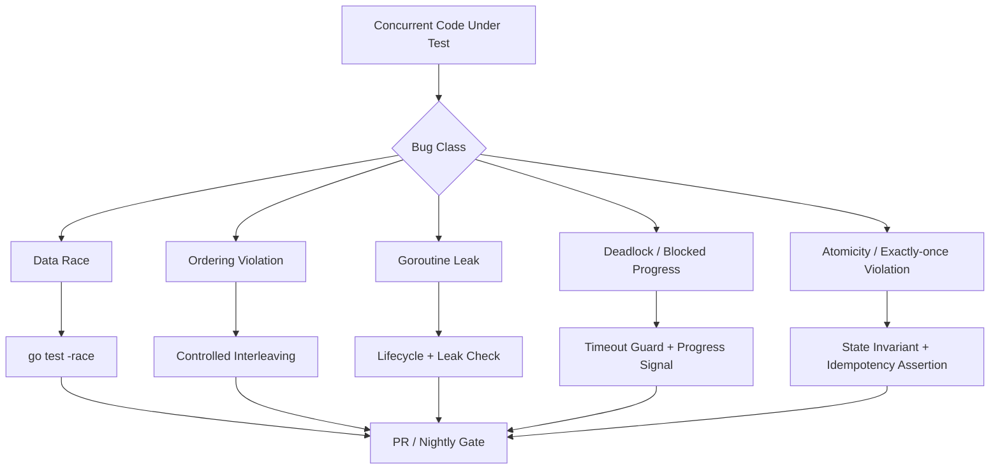
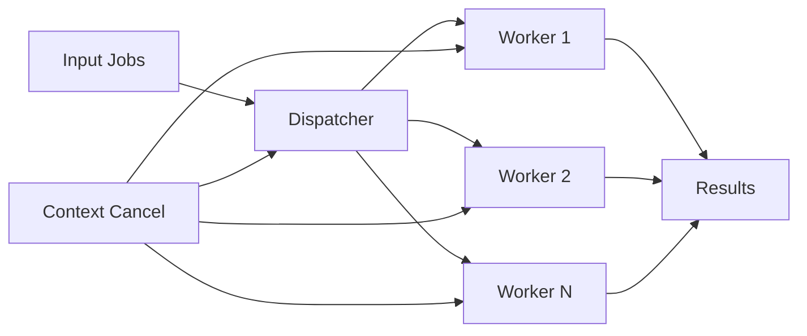
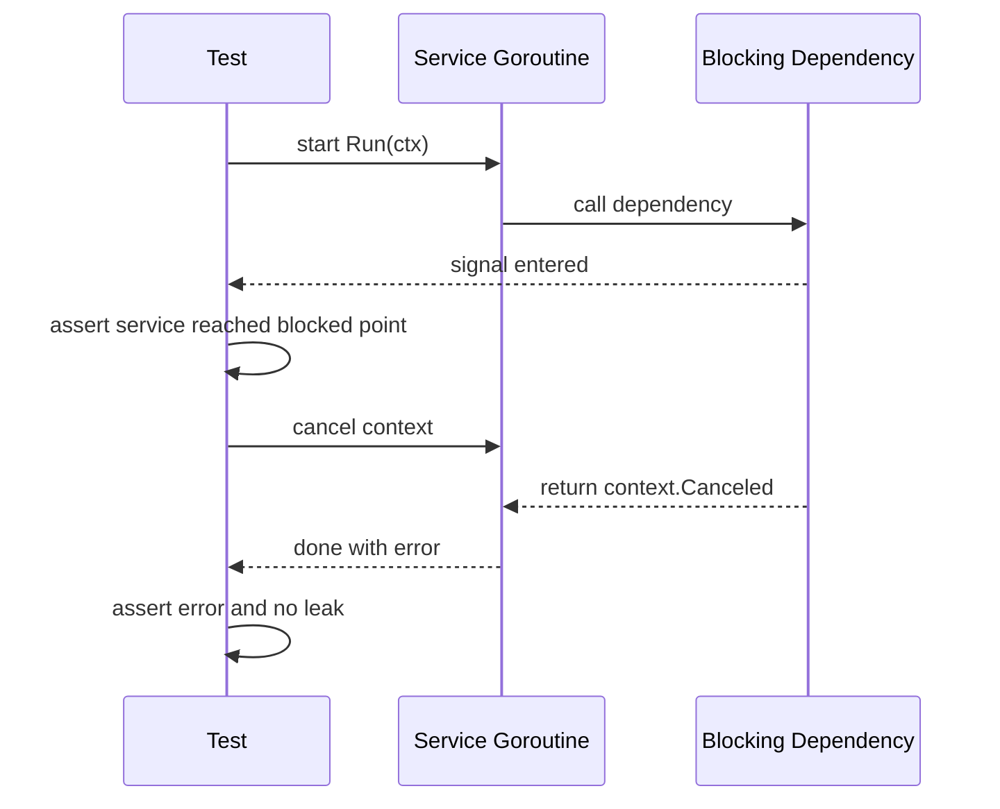

# learn-go-testing-benchmarking-performance-engineering-part-015.md

# Part 015 — Concurrency Testing: Race, Ordering, Goroutine Leaks, Deadlocks & Deterministic Coordination

> Seri: **Go Testing, Benchmarking, Performance Engineering**  
> Target pembaca: Java software engineer / tech lead yang ingin memahami Go testing sampai level production engineering.  
> Fokus part ini: **menguji sistem konkuren secara defensible**, bukan mengulang teori concurrency Go yang sudah dibahas di seri terpisah.

---

## 0. Tujuan pembelajaran

Setelah menyelesaikan bagian ini, kamu harus mampu:

1. Membedakan bug concurrency yang bisa ditemukan dengan unit test biasa, race detector, stress test, fuzz/property test, dan observasi runtime.
2. Mendesain test untuk goroutine lifecycle: start, work, block, cancel, drain, close, cleanup.
3. Membuktikan tidak ada data race pada boundary yang penting dengan `go test -race`.
4. Menghindari test berbasis `time.Sleep` yang flaky.
5. Membuat coordination primitive untuk test: barrier, gate, signal channel, fake clock, controlled dependency, blocking fake, dan deterministic scheduler boundary.
6. Menguji ordering, at-most-once, at-least-once, exactly-once-at-boundary, deduplication, idempotency, backpressure, dan cancellation.
7. Mendeteksi goroutine leak dan deadlock dengan pendekatan engineering yang masuk akal.
8. Menentukan kapan concurrency test layak masuk PR gate, nightly gate, atau stress gate.

---

## 1. Kenapa concurrency testing sulit?

Concurrency bug jarang gagal secara konsisten.

Di code synchronous, bug biasanya deterministic:

```text
input A -> output salah B
```

Di code concurrent, bug sering tergantung interleaving:

```text
Goroutine 1 membaca state sebelum Goroutine 2 menulis
Goroutine 2 menutup channel saat Goroutine 3 masih mengirim
Goroutine 4 gagal exit karena context tidak dipropagasi
```

Masalahnya bukan hanya nilai output, tapi juga:

- urutan kejadian,
- visibility memory,
- ownership state,
- channel lifecycle,
- cancellation path,
- blocked goroutine,
- timing,
- contention,
- scheduling nondeterminism,
- cleanup saat failure.

Mental model penting:

> Concurrency test yang baik tidak “berharap scheduler kebetulan memilih interleaving buruk”. Concurrency test yang baik **memaksa state penting terjadi** dengan koordinasi eksplisit.

---

## 2. Jenis bug concurrency

### 2.1 Data race

Data race terjadi ketika dua goroutine mengakses memory yang sama secara concurrent, minimal satu write, tanpa synchronization yang benar.

Contoh buruk:

```go
package counter

type Counter struct {
	value int
}

func (c *Counter) Inc() {
	c.value++
}

func (c *Counter) Value() int {
	return c.value
}
```

Test biasa mungkin lolos:

```go
func TestCounter(t *testing.T) {
	var c Counter
	c.Inc()
	if c.Value() != 1 {
		t.Fatalf("value = %d, want 1", c.Value())
	}
}
```

Tapi concurrent test dengan race detector akan menemukan masalah:

```go
func TestCounterConcurrentRace(t *testing.T) {
	var c Counter
	var wg sync.WaitGroup

	for i := 0; i < 100; i++ {
		wg.Add(1)
		go func() {
			defer wg.Done()
			c.Inc()
		}()
	}

	wg.Wait()
}
```

Run:

```bash
go test -race ./...
```

Yang penting: test ini mungkin tetap “pass” secara assertion, tapi `-race` melaporkan race. Maka race detector adalah signal terpisah dari pass/fail assertion biasa.

---

### 2.2 Atomicity violation

Tidak semua concurrency bug adalah data race.

Contoh:

```go
if !cache.Exists(key) {
	cache.Put(key, value)
}
```

Jika `Exists` dan `Put` masing-masing thread-safe, tetap bisa ada bug atomicity: dua goroutine bisa sama-sama melihat key belum ada lalu sama-sama melakukan pekerjaan mahal.

Bug seperti ini perlu test behavior, bukan hanya `-race`.

---

### 2.3 Ordering bug

Contoh:

```text
worker mengirim result sebelum metadata siap
publisher publish event sebelum transaction commit
consumer ack sebelum side effect durable
```

Data race detector tidak otomatis menemukan ordering bug.

Test harus membuktikan urutan yang menjadi kontrak.

---

### 2.4 Goroutine leak

Goroutine leak terjadi ketika goroutine yang seharusnya selesai tetap hidup:

- channel receive tanpa sender,
- channel send tanpa receiver,
- context tidak dipropagasi,
- ticker tidak dihentikan,
- worker pool tidak drain,
- background loop tidak punya shutdown signal.

Leak bisa tidak terlihat di unit test pendek, tetapi merusak production melalui memory growth, descriptor retention, queue buildup, atau shutdown lambat.

---

### 2.5 Deadlock

Deadlock adalah kondisi semua jalur progress saling menunggu.

Di Go, deadlock total pada main program bisa menghasilkan runtime panic:

```text
fatal error: all goroutines are asleep - deadlock!
```

Namun partial deadlock dalam service sering tidak menyebabkan panic. Service masih hidup, tapi request tertentu menggantung.

---

### 2.6 Liveness failure

Safety property:

```text
Hal buruk tidak boleh terjadi.
```

Contoh: tidak boleh double close channel.

Liveness property:

```text
Hal baik akhirnya harus terjadi.
```

Contoh: setelah context cancel, worker akhirnya exit.

Concurrency testing harus menguji keduanya.

---

## 3. Race detector: apa yang ia buktikan dan tidak buktikan

Go race detector adalah tool penting. Ia menemukan data race saat program berjalan dengan instrumentation.

Run umum:

```bash
go test -race ./...
```

Run dengan repeated execution:

```bash
go test -race -count=20 ./...
```

Run package tertentu:

```bash
go test -race -run TestWorker ./internal/worker
```

### 3.1 Apa yang race detector bisa bantu

Ia membantu menemukan:

- unsynchronized read/write,
- concurrent map access pattern,
- shared variable capture problem,
- unsafe shared buffer,
- shared error variable,
- non-thread-safe fake dalam test,
- misuse global mutable state.

### 3.2 Apa yang race detector tidak buktikan

Race detector tidak membuktikan:

- tidak ada race pada path yang tidak dieksekusi,
- tidak ada ordering bug,
- tidak ada goroutine leak,
- tidak ada deadlock,
- tidak ada lost update jika semua akses dilindungi lock tapi logic salah,
- tidak ada exactly-once violation,
- tidak ada cancellation bug.

Jadi:

> `go test -race` adalah necessary gate untuk concurrency-sensitive code, tapi bukan sufficient proof untuk correctness.

---

## 4. Prinsip utama concurrency testing

### 4.1 Jangan bergantung pada `time.Sleep` sebagai synchronization

Anti-pattern:

```go
go worker.Run()
time.Sleep(10 * time.Millisecond)
// assume worker has started
```

Masalah:

- di laptop cepat mungkin lolos,
- di CI lambat bisa gagal,
- di mesin loaded bisa flaky,
- sleep yang terlalu panjang memperlambat test suite,
- sleep tidak membuktikan state yang diinginkan sudah terjadi.

Lebih baik gunakan explicit signal:

```go
started := make(chan struct{})

go func() {
	close(started)
	worker.Run()
}()

<-started
```

Untuk menunggu kondisi, gunakan timeout kecil sebagai guard, bukan sebagai mekanisme koordinasi utama.

---

### 4.2 Test harus mengontrol interleaving penting

Alih-alih berharap race terjadi, buat dependency yang bisa diblokir.

Contoh fake repository yang menahan operasi save:

```go
type BlockingRepo struct {
	entered chan struct{}
	release chan struct{}
}

func NewBlockingRepo() *BlockingRepo {
	return &BlockingRepo{
		entered: make(chan struct{}),
		release: make(chan struct{}),
	}
}

func (r *BlockingRepo) Save(ctx context.Context, item Item) error {
	close(r.entered)

	select {
	case <-r.release:
		return nil
	case <-ctx.Done():
		return ctx.Err()
	}
}
```

Test bisa memastikan worker sudah masuk `Save`, lalu cancel context, lalu assert worker exit.

---

### 4.3 Every goroutine must have an owner

Dalam test, setiap goroutine yang dibuat harus jelas siapa yang menunggu atau membatalkan.

Buruk:

```go
go svc.Run(ctx)
// test returns; goroutine may still run
```

Lebih baik:

```go
ctx, cancel := context.WithCancel(context.Background())
t.Cleanup(cancel)

done := make(chan error, 1)
go func() {
	done <- svc.Run(ctx)
}()

t.Cleanup(func() {
	cancel()
	select {
	case err := <-done:
		if err != nil && !errors.Is(err, context.Canceled) {
			t.Errorf("service exit error = %v", err)
		}
	case <-time.After(time.Second):
		t.Errorf("service did not stop")
	}
})
```

Catatan: timeout digunakan sebagai fail-safe agar test tidak hang selamanya, bukan sebagai bukti state utama.

---

### 4.4 Channel ownership harus jelas

Rule sederhana:

> Goroutine yang mengirim biasanya pemilik close channel. Receiver jarang boleh close channel yang tidak ia miliki.

Test concurrency sering gagal karena channel lifecycle tidak eksplisit.

Kamu harus test:

- producer menutup output channel saat selesai,
- producer tidak mengirim setelah channel ditutup,
- consumer exit saat input channel ditutup,
- worker exit saat context cancel,
- error path tetap menutup channel yang menjadi kontrak.

---

## 5. Diagram mental model concurrency test



---

## 6. Testing goroutine lifecycle

Misalnya ada service:

```go
type Worker struct {
	jobs <-chan Job
	handler Handler
}

func (w *Worker) Run(ctx context.Context) error {
	for {
		select {
		case <-ctx.Done():
			return ctx.Err()
		case job, ok := <-w.jobs:
			if !ok {
				return nil
			}
			if err := w.handler.Handle(ctx, job); err != nil {
				return err
			}
		}
	}
}
```

Test normal:

```go
func TestWorkerStopsWhenJobsClosed(t *testing.T) {
	jobs := make(chan Job)
	close(jobs)

	h := HandlerFunc(func(ctx context.Context, job Job) error {
		t.Fatal("handler should not be called")
		return nil
	})

	w := &Worker{jobs: jobs, handler: h}

	err := w.Run(context.Background())
	if err != nil {
		t.Fatalf("Run error = %v, want nil", err)
	}
}
```

Test cancellation:

```go
func TestWorkerStopsOnContextCancel(t *testing.T) {
	jobs := make(chan Job)
	ctx, cancel := context.WithCancel(context.Background())
	cancel()

	w := &Worker{
		jobs: jobs,
		handler: HandlerFunc(func(ctx context.Context, job Job) error {
			t.Fatal("handler should not be called")
			return nil
		}),
	}

	err := w.Run(ctx)
	if !errors.Is(err, context.Canceled) {
		t.Fatalf("Run error = %v, want context.Canceled", err)
	}
}
```

Test cancellation saat handler sedang blocked:

```go
type BlockingHandler struct {
	entered chan struct{}
}

func NewBlockingHandler() *BlockingHandler {
	return &BlockingHandler{entered: make(chan struct{})}
}

func (h *BlockingHandler) Handle(ctx context.Context, job Job) error {
	close(h.entered)
	<-ctx.Done()
	return ctx.Err()
}

func TestWorkerCancelsBlockedHandler(t *testing.T) {
	jobs := make(chan Job, 1)
	jobs <- Job{ID: "case-123"}

	h := NewBlockingHandler()
	w := &Worker{jobs: jobs, handler: h}

	ctx, cancel := context.WithCancel(context.Background())
	done := make(chan error, 1)

	go func() {
		done <- w.Run(ctx)
	}()

	<-h.entered
	cancel()

	select {
	case err := <-done:
		if !errors.Is(err, context.Canceled) {
			t.Fatalf("Run error = %v, want context.Canceled", err)
		}
	case <-time.After(time.Second):
		t.Fatal("worker did not stop after cancellation")
	}
}
```

Kuncinya:

- test tidak sleep untuk menebak handler sudah mulai,
- fake menutup `entered`,
- test cancel setelah state penting terjadi,
- timeout hanya guard.

---

## 7. Testing ordering

Misalnya regulatory case workflow:

```text
1. validate transition
2. persist new state
3. publish audit event
```

Kontrak penting:

> Audit event tidak boleh dipublish sebelum state durable.

Kita bisa buat spy yang merekam urutan:

```go
type Recorder struct {
	mu     sync.Mutex
	events []string
}

func (r *Recorder) Add(event string) {
	r.mu.Lock()
	defer r.mu.Unlock()
	r.events = append(r.events, event)
}

func (r *Recorder) Events() []string {
	r.mu.Lock()
	defer r.mu.Unlock()
	return append([]string(nil), r.events...)
}
```

Fake dependencies:

```go
type SpyRepo struct{ rec *Recorder }

func (r SpyRepo) Save(ctx context.Context, c Case) error {
	r.rec.Add("save")
	return nil
}

type SpyPublisher struct{ rec *Recorder }

func (p SpyPublisher) Publish(ctx context.Context, e Event) error {
	p.rec.Add("publish")
	return nil
}
```

Test:

```go
func TestEscalationPublishesAfterSave(t *testing.T) {
	rec := &Recorder{}

	svc := NewEscalationService(
		SpyRepo{rec: rec},
		SpyPublisher{rec: rec},
	)

	err := svc.Escalate(context.Background(), "case-123")
	if err != nil {
		t.Fatalf("Escalate error = %v", err)
	}

	got := rec.Events()
	want := []string{"save", "publish"}
	if !slices.Equal(got, want) {
		t.Fatalf("events = %v, want %v", got, want)
	}
}
```

Untuk concurrent path, recorder harus concurrency-safe.

---

## 8. Testing at-most-once, at-least-once, and idempotency

Distributed/system code sering tidak bisa menjanjikan exactly-once end-to-end. Yang bisa dibuktikan biasanya:

- at-most-once within local critical section,
- at-least-once delivery with idempotent handler,
- exactly-once effect at durable boundary via idempotency key,
- no duplicate side effect for same command id.

Contoh fake publisher:

```go
type CountingPublisher struct {
	mu    sync.Mutex
	count map[string]int
}

func NewCountingPublisher() *CountingPublisher {
	return &CountingPublisher{count: map[string]int{}}
}

func (p *CountingPublisher) Publish(ctx context.Context, e Event) error {
	p.mu.Lock()
	defer p.mu.Unlock()
	p.count[e.ID]++
	return nil
}

func (p *CountingPublisher) Count(id string) int {
	p.mu.Lock()
	defer p.mu.Unlock()
	return p.count[id]
}
```

Concurrent test:

```go
func TestCommandHandledAtMostOncePerID(t *testing.T) {
	publisher := NewCountingPublisher()
	svc := NewCommandService(publisher)

	ctx := context.Background()
	const commandID = "cmd-123"

	var wg sync.WaitGroup
	for i := 0; i < 50; i++ {
		wg.Add(1)
		go func() {
			defer wg.Done()
			_ = svc.Handle(ctx, Command{ID: commandID})
		}()
	}
	wg.Wait()

	if got := publisher.Count(commandID); got != 1 {
		t.Fatalf("publish count = %d, want 1", got)
	}
}
```

Run dengan race detector dan count:

```bash
go test -race -run TestCommandHandledAtMostOncePerID -count=50 ./internal/command
```

Catatan: test ini baik untuk invariant lokal. Untuk database-backed idempotency, part integration testing dan load testing tetap diperlukan.

---

## 9. Barrier, gate, latch: primitive koordinasi test

### 9.1 Gate

Gate menahan goroutine sampai test mengizinkan lanjut.

```go
type Gate struct {
	entered chan struct{}
	release chan struct{}
}

func NewGate() *Gate {
	return &Gate{
		entered: make(chan struct{}),
		release: make(chan struct{}),
	}
}

func (g *Gate) Enter(ctx context.Context) error {
	close(g.entered)
	select {
	case <-g.release:
		return nil
	case <-ctx.Done():
		return ctx.Err()
	}
}

func (g *Gate) WaitEntered(t *testing.T) {
	t.Helper()
	select {
	case <-g.entered:
	case <-time.After(time.Second):
		t.Fatal("gate was not entered")
	}
}

func (g *Gate) Release() {
	close(g.release)
}
```

Gunakan untuk memaksa interleaving:

```go
func TestCancelWhileDependencyBlocked(t *testing.T) {
	gate := NewGate()
	dep := DependencyFunc(func(ctx context.Context) error {
		return gate.Enter(ctx)
	})

	svc := NewService(dep)
	ctx, cancel := context.WithCancel(context.Background())
	done := make(chan error, 1)

	go func() { done <- svc.Run(ctx) }()

	gate.WaitEntered(t)
	cancel()

	select {
	case err := <-done:
		if !errors.Is(err, context.Canceled) {
			t.Fatalf("err = %v, want context.Canceled", err)
		}
	case <-time.After(time.Second):
		t.Fatal("service did not return")
	}
}
```

---

### 9.2 Start barrier

Start barrier membuat banyak goroutine mulai bersama.

```go
start := make(chan struct{})
var wg sync.WaitGroup

for i := 0; i < 100; i++ {
	wg.Add(1)
	go func() {
		defer wg.Done()
		<-start
		// concurrent work
	}()
}

close(start)
wg.Wait()
```

Ini lebih baik daripada goroutine mulai bertahap dan tidak benar-benar overlap.

---

## 10. Testing channel lifecycle

### 10.1 Producer menutup output channel

Misalnya fungsi:

```go
func Generate(ctx context.Context, n int) <-chan int {
	out := make(chan int)
	go func() {
		defer close(out)
		for i := 0; i < n; i++ {
			select {
			case out <- i:
			case <-ctx.Done():
				return
			}
		}
	}()
	return out
}
```

Test:

```go
func TestGenerateClosesOutput(t *testing.T) {
	out := Generate(context.Background(), 3)

	var got []int
	for v := range out {
		got = append(got, v)
	}

	want := []int{0, 1, 2}
	if !slices.Equal(got, want) {
		t.Fatalf("values = %v, want %v", got, want)
	}
}
```

### 10.2 Producer exit saat context cancel meskipun receiver berhenti

```go
func TestGenerateStopsWhenReceiverCancels(t *testing.T) {
	ctx, cancel := context.WithCancel(context.Background())
	out := Generate(ctx, 1_000_000)

	<-out
	cancel()

	select {
	case _, ok := <-out:
		// If ok is true, one buffered/in-flight value may exist depending implementation.
		// Contract must define whether this is allowed.
		_ = ok
	case <-time.After(time.Second):
		t.Fatal("output did not unblock after cancellation")
	}
}
```

Untuk kontrak yang lebih kuat, expose `done` atau run worker under explicit lifecycle manager agar test bisa menunggu exit.

---

## 11. Testing goroutine leak

### 11.1 Baseline sederhana dengan `runtime.NumGoroutine`

Pendekatan sederhana:

```go
func TestNoGoroutineLeakSmoke(t *testing.T) {
	before := runtime.NumGoroutine()

	ctx, cancel := context.WithCancel(context.Background())
	svc := NewService()
	done := make(chan struct{})

	go func() {
		defer close(done)
		_ = svc.Run(ctx)
	}()

	cancel()
	select {
	case <-done:
	case <-time.After(time.Second):
		t.Fatal("service did not stop")
	}

	// Give finalizers/timers/runtime goroutines a tiny chance to settle.
	// Use carefully: this is not exact proof.
	time.Sleep(10 * time.Millisecond)

	after := runtime.NumGoroutine()
	if after > before+2 {
		t.Fatalf("possible goroutine leak: before=%d after=%d", before, after)
	}
}
```

Ini berguna sebagai smoke, tetapi tidak sempurna karena runtime dan test environment bisa memiliki goroutine lain.

### 11.2 Lebih baik: owned lifecycle assertion

Daripada menghitung semua goroutine global, buat service expose lifecycle yang bisa ditunggu:

```go
type Service struct {
	done chan struct{}
}

func NewService() *Service {
	return &Service{done: make(chan struct{})}
}

func (s *Service) Run(ctx context.Context) error {
	defer close(s.done)
	<-ctx.Done()
	return ctx.Err()
}

func (s *Service) Done() <-chan struct{} {
	return s.done
}
```

Test:

```go
func TestServiceStopsOnCancel(t *testing.T) {
	svc := NewService()
	ctx, cancel := context.WithCancel(context.Background())

	go func() { _ = svc.Run(ctx) }()
	cancel()

	select {
	case <-svc.Done():
	case <-time.After(time.Second):
		t.Fatal("service did not stop")
	}
}
```

Production design yang testable sering membutuhkan lifecycle API yang eksplisit.

---

## 12. Deadlock testing

Deadlock test harus hati-hati. Jangan membuat test yang bisa menggantung CI tanpa timeout guard.

Buruk:

```go
func TestDeadlock(t *testing.T) {
	result := make(chan Result)
	got := <-result // hangs forever
	_ = got
}
```

Lebih baik:

```go
func receiveWithTimeout[T any](t *testing.T, ch <-chan T) T {
	t.Helper()
	select {
	case v := <-ch:
		return v
	case <-time.After(time.Second):
		t.Fatal("timed out waiting for value")
		var zero T
		return zero
	}
}
```

Untuk code production, gunakan context-aware API:

```go
func Receive(ctx context.Context, ch <-chan Result) (Result, error) {
	select {
	case v := <-ch:
		return v, nil
	case <-ctx.Done():
		return Result{}, ctx.Err()
	}
}
```

Test:

```go
func TestReceiveReturnsOnContextCancel(t *testing.T) {
	ctx, cancel := context.WithCancel(context.Background())
	cancel()

	_, err := Receive(ctx, make(chan Result))
	if !errors.Is(err, context.Canceled) {
		t.Fatalf("err = %v, want context.Canceled", err)
	}
}
```

Design lesson:

> API yang tidak punya cancellation boundary sulit dites dan berbahaya di production.

---

## 13. Testing worker pool

Worker pool punya banyak invariant:

- jumlah worker sesuai config,
- job diproses,
- error dipropagasi sesuai kontrak,
- context cancel menghentikan worker,
- input close menghentikan worker,
- output close setelah semua worker selesai,
- tidak ada send after close,
- tidak ada goroutine leak,
- backpressure terjadi sesuai kapasitas.

Diagram:



Example worker pool API:

```go
type Processor interface {
	Process(context.Context, Job) (Result, error)
}

func RunPool(ctx context.Context, workers int, jobs <-chan Job, p Processor) <-chan Result {
	out := make(chan Result)
	var wg sync.WaitGroup

	wg.Add(workers)
	for i := 0; i < workers; i++ {
		go func() {
			defer wg.Done()
			for {
				select {
				case <-ctx.Done():
					return
				case job, ok := <-jobs:
					if !ok {
						return
					}
					res, err := p.Process(ctx, job)
					if err == nil {
						select {
						case out <- res:
						case <-ctx.Done():
							return
						}
					}
				}
			}
		}()
	}

	go func() {
		wg.Wait()
		close(out)
	}()

	return out
}
```

Test all jobs processed:

```go
type EchoProcessor struct{}

func (EchoProcessor) Process(ctx context.Context, j Job) (Result, error) {
	return Result{ID: j.ID}, nil
}

func TestRunPoolProcessesAllJobs(t *testing.T) {
	jobs := make(chan Job)
	ctx := context.Background()

	out := RunPool(ctx, 4, jobs, EchoProcessor{})

	go func() {
		defer close(jobs)
		for i := 0; i < 100; i++ {
			jobs <- Job{ID: strconv.Itoa(i)}
		}
	}()

	seen := map[string]bool{}
	for res := range out {
		seen[res.ID] = true
	}

	if len(seen) != 100 {
		t.Fatalf("processed %d jobs, want 100", len(seen))
	}
}
```

Test cancellation closes output:

```go
func TestRunPoolClosesOutputOnCancel(t *testing.T) {
	jobs := make(chan Job)
	ctx, cancel := context.WithCancel(context.Background())

	out := RunPool(ctx, 4, jobs, BlockingProcessor{})
	cancel()

	select {
	case _, ok := <-out:
		if ok {
			// Depending implementation, may receive in-flight result.
			// Contract must define allowed behavior.
		}
	case <-time.After(time.Second):
		t.Fatal("output did not close after cancel")
	}
}
```

---

## 14. Testing backpressure

Backpressure adalah behavior penting: ketika downstream lambat, upstream tidak boleh terus memproduksi tanpa batas.

Contoh bounded queue:

```go
type Queue struct {
	ch chan Job
}

func NewQueue(capacity int) *Queue {
	return &Queue{ch: make(chan Job, capacity)}
}

func (q *Queue) Enqueue(ctx context.Context, j Job) error {
	select {
	case q.ch <- j:
		return nil
	case <-ctx.Done():
		return ctx.Err()
	}
}
```

Test backpressure:

```go
func TestQueueAppliesBackpressureWhenFull(t *testing.T) {
	q := NewQueue(1)

	if err := q.Enqueue(context.Background(), Job{ID: "1"}); err != nil {
		t.Fatalf("enqueue first: %v", err)
	}

	ctx, cancel := context.WithCancel(context.Background())
	done := make(chan error, 1)

	go func() {
		done <- q.Enqueue(ctx, Job{ID: "2"})
	}()

	select {
	case err := <-done:
		t.Fatalf("enqueue returned early: %v", err)
	case <-time.After(10 * time.Millisecond):
		// It is blocked as expected. This is one rare case where a tiny delay
		// may be acceptable as a negative assertion, but keep it minimal and local.
	}

	cancel()

	select {
	case err := <-done:
		if !errors.Is(err, context.Canceled) {
			t.Fatalf("err = %v, want context.Canceled", err)
		}
	case <-time.After(time.Second):
		t.Fatal("enqueue did not unblock after cancel")
	}
}
```

Negative assertion is inherently harder. Prefer design that exposes state or uses controllable dependency where possible.

---

## 15. Testing context propagation

A common production bug:

```go
func (s *Service) Handle(ctx context.Context, req Request) error {
	return s.repo.Save(context.Background(), req) // BUG: drops caller context
}
```

Test fake:

```go
type ContextCheckingRepo struct {
	got context.Context
}

func (r *ContextCheckingRepo) Save(ctx context.Context, req Request) error {
	r.got = ctx
	return nil
}
```

Test:

```go
func TestServicePropagatesContext(t *testing.T) {
	type key struct{}
	ctx := context.WithValue(context.Background(), key{}, "trace-123")

	repo := &ContextCheckingRepo{}
	svc := NewService(repo)

	if err := svc.Handle(ctx, Request{}); err != nil {
		t.Fatalf("Handle error = %v", err)
	}

	if got := repo.got.Value(key{}); got != "trace-123" {
		t.Fatalf("context value = %v, want trace-123", got)
	}
}
```

Better fake should be concurrency-safe if service can call repo concurrently.

---

## 16. Testing locks without testing implementation detail

Do not test “this method uses mutex”. Test the observable guarantee.

Bad test goal:

```text
Ensure method locks mutex.
```

Good test goal:

```text
Concurrent calls do not corrupt state and do not produce duplicate transition.
```

Example:

```go
func TestCaseStateTransitionIsAtomic(t *testing.T) {
	store := NewInMemoryCaseStore()
	svc := NewCaseService(store)

	const id = "case-123"
	store.Put(Case{ID: id, State: StateOpen})

	var wg sync.WaitGroup
	results := make(chan error, 20)

	start := make(chan struct{})
	for i := 0; i < 20; i++ {
		wg.Add(1)
		go func() {
			defer wg.Done()
			<-start
			results <- svc.Escalate(context.Background(), id)
		}()
	}

	close(start)
	wg.Wait()
	close(results)

	success := 0
	for err := range results {
		if err == nil {
			success++
		}
	}

	if success != 1 {
		t.Fatalf("successful transitions = %d, want 1", success)
	}
}
```

This test verifies invariant, not mutex implementation.

---

## 17. Test fake harus concurrency-safe juga

Banyak race report berasal dari test fake yang tidak safe, bukan production code.

Bad fake:

```go
type FakePublisher struct {
	events []Event
}

func (p *FakePublisher) Publish(ctx context.Context, e Event) error {
	p.events = append(p.events, e)
	return nil
}
```

Jika production code memanggil publisher concurrent, fake ini race.

Better:

```go
type FakePublisher struct {
	mu     sync.Mutex
	events []Event
}

func (p *FakePublisher) Publish(ctx context.Context, e Event) error {
	p.mu.Lock()
	defer p.mu.Unlock()
	p.events = append(p.events, e)
	return nil
}

func (p *FakePublisher) Events() []Event {
	p.mu.Lock()
	defer p.mu.Unlock()
	return append([]Event(nil), p.events...)
}
```

Rule:

> A fake must satisfy the same concurrency contract as the dependency it replaces.

---

## 18. Stressing interleavings

Some bugs require repeated execution.

Useful commands:

```bash
go test -run TestName -count=1000 ./internal/foo
```

With race:

```bash
go test -race -run TestName -count=100 ./internal/foo
```

With parallel package execution disabled for easier diagnosis:

```bash
go test -p=1 -race -run TestName -count=100 ./internal/foo
```

With shuffle:

```bash
go test -shuffle=on -count=50 ./...
```

For CI:

```bash
# PR gate
go test ./...
go test -race ./...

# Nightly stress gate
go test -race -shuffle=on -count=20 ./...
```

Stress tests should not hide nondeterminism. Use them to increase confidence, but still design deterministic interleaving tests for known risk points.

---

## 19. Build tags for slow/stress concurrency tests

Some tests are too expensive for every PR.

Example:

```go
//go:build stress

package worker_test

func TestWorkerStress(t *testing.T) {
	// many iterations, race-sensitive, slow
}
```

Run:

```bash
go test -tags=stress -race -count=20 ./...
```

Use categories:

```text
normal test     -> every PR
-race           -> every PR for critical packages, nightly for all if too slow
-stress tag     -> nightly / pre-release
-load/perf      -> dedicated environment
```

---

## 20. Deterministic concurrency testing and Go 1.26 notes

Go 1.26 continues to improve testing/runtime surfaces relevant for concurrency and performance engineering. Two areas matter for this part:

1. Concurrency testing must increasingly prefer deterministic coordination over timing assumptions.
2. Runtime-level diagnostics and profiles can help catch issues that tests alone miss.

Depending on exact Go 1.26.x toolchain and experiment flags available in your environment, features such as goroutine leak diagnostics may be used as additional signal. Treat runtime diagnostic profiles as evidence supplement, not replacement for explicit lifecycle tests.

Practical stance:

```text
Primary proof   -> lifecycle-aware tests, race detector, deterministic interleaving
Secondary proof -> repeated stress, shuffle, runtime profiles, goroutine dumps
Last resort     -> sleep-based timing assumptions
```

---

## 21. Capturing goroutine dump on timeout

When concurrency test times out, failure message should include useful diagnostics.

```go
func dumpGoroutines(t *testing.T) {
	t.Helper()
	buf := make([]byte, 1<<20)
	n := runtime.Stack(buf, true)
	t.Logf("goroutine dump:\n%s", buf[:n])
}

func waitDone(t *testing.T, done <-chan struct{}, msg string) {
	t.Helper()
	select {
	case <-done:
	case <-time.After(time.Second):
		dumpGoroutines(t)
		t.Fatal(msg)
	}
}
```

Use sparingly: goroutine dumps are noisy, but extremely helpful for deadlock/leak diagnosis.

---

## 22. Concurrency test review checklist

Use this checklist in PR review.

### 22.1 Lifecycle

- Does every goroutine have an owner?
- Is there a cancellation path?
- Does test wait for goroutine exit?
- Are channels closed by clear owners?
- Are tickers/timers stopped?
- Is cleanup registered with `t.Cleanup`?

### 22.2 Synchronization

- Does the test use explicit signal rather than `time.Sleep`?
- Does it control the important interleaving?
- Are fake dependencies concurrency-safe?
- Are global states protected or isolated?

### 22.3 Correctness

- Does the test assert behavior, not implementation detail?
- Does it check both safety and liveness?
- Does it define allowed in-flight behavior after cancellation?
- Does it test duplicate, retry, or concurrent submission if relevant?

### 22.4 Diagnostics

- If test times out, does it say what was being waited for?
- Are goroutine dumps logged for hard deadlock cases?
- Are event/order logs readable?
- Can test be rerun selectively with `-run`?

### 22.5 Gate placement

- Should this run every PR?
- Should this run only with `-race`?
- Should this run in nightly stress?
- Is it too timing-sensitive for normal CI?

---

## 23. Common anti-patterns

### Anti-pattern 1: Sleep as readiness signal

```go
go svc.Run()
time.Sleep(100 * time.Millisecond)
```

Use `started` channel or fake dependency gate.

### Anti-pattern 2: Ignoring goroutine exit

```go
go svc.Run(ctx)
cancel()
// no wait
```

Always wait for `done` or service lifecycle.

### Anti-pattern 3: Non-thread-safe fake

```go
fake.events = append(fake.events, e)
```

Use mutex or channel-based recorder.

### Anti-pattern 4: Only testing happy path sequentially

If production uses concurrent calls, at least one test should exercise concurrent calls for core invariants.

### Anti-pattern 5: Race detector treated as optional forever

Race detector has cost, but concurrency-sensitive packages should regularly run under `-race`.

### Anti-pattern 6: Testing implementation lock behavior

Do not assert that a mutex is used. Assert the invariant protected by synchronization.

### Anti-pattern 7: Unbounded goroutine creation in tests

Stress tests should still have limits and cleanup.

### Anti-pattern 8: Context ignored in fake

If fake blocks but ignores context, cancellation tests may hang.

---

## 24. Decision matrix

| Risk | Best primary test | Supporting tool | Gate |
|---|---:|---:|---:|
| Data race | concurrent test path | `go test -race` | PR/nightly |
| Goroutine leak | lifecycle test | goroutine dump/profile | PR/nightly |
| Deadlock | progress signal + timeout | goroutine dump | PR |
| Ordering violation | spy recorder / controlled fake | repeated run | PR |
| Duplicate side effect | concurrent invariant test | race detector | PR |
| Retry storm | controlled failing dependency | load/stress later | PR/nightly |
| Backpressure failure | bounded queue test | stress/load later | PR/nightly |
| Cancellation ignored | blocking fake + cancel | goroutine dump | PR |
| Flaky scheduling | deterministic gate | `-count`, `-shuffle` | nightly |

---

## 25. Mermaid: lifecycle-oriented concurrency test



---

## 26. Practical command profiles

### Local development

```bash
go test ./...
```

### Local targeted concurrency test

```bash
go test -run TestWorker -count=50 ./internal/worker
```

### Race detector targeted

```bash
go test -race -run TestWorker -count=20 ./internal/worker
```

### Full race gate

```bash
go test -race ./...
```

### Shuffle to detect order dependency

```bash
go test -shuffle=on -count=20 ./...
```

### Single package process for diagnosis

```bash
go test -p=1 -race -run TestName -count=100 ./internal/foo
```

### Stress build tag

```bash
go test -tags=stress -race -count=20 ./...
```

---

## 27. Exercises

### Exercise 1: Worker shutdown

Buat worker yang membaca job dari channel dan memproses via handler. Tulis test untuk:

1. input channel closed,
2. context canceled before start,
3. context canceled while handler blocked,
4. handler returns error,
5. worker does not leak.

### Exercise 2: Idempotent command handler

Buat service `Handle(Command)` yang harus mem-publish event maksimal sekali untuk command ID yang sama. Tulis concurrent test dengan 100 goroutine dan run dengan race detector.

### Exercise 3: Backpressure

Buat bounded queue dengan `Enqueue(ctx, item)`. Tulis test bahwa enqueue kedua blocked saat capacity penuh dan unblock saat context canceled.

### Exercise 4: Ordering

Buat service transition regulatory case:

```text
Validate -> Persist -> Audit -> Notify
```

Tulis spy recorder dan assert urutan event.

### Exercise 5: Flaky test refactor

Ambil test yang memakai `time.Sleep` untuk menunggu goroutine. Refactor menjadi explicit signal dengan channel.

---

## 28. Summary

Concurrency testing bukan tentang membuat test “lebih sering diulang” saja. Repetition membantu, tetapi bukan fondasi.

Fondasi yang benar:

1. desain API punya lifecycle dan cancellation boundary,
2. setiap goroutine punya owner,
3. test mengontrol interleaving penting,
4. fake dependency concurrency-safe,
5. race detector dijalankan secara reguler,
6. timeout hanya guard, bukan synchronization,
7. safety dan liveness sama-sama diuji,
8. diagnostics tersedia saat test gagal.

Kalimat inti part ini:

> Jangan berharap scheduler menemukan bug untukmu. Paksa interleaving yang kamu pedulikan, lalu buktikan invariant-nya.

---

## 29. Referensi

- Go package `testing`: https://pkg.go.dev/testing
- Go race detector article: https://go.dev/doc/articles/race_detector
- Go command `go test`: https://pkg.go.dev/cmd/go
- Go memory model: https://go.dev/ref/mem
- Go blog, subtests and sub-benchmarks: https://go.dev/blog/subtests
- Go 1.26 release notes: https://go.dev/doc/go1.26

---

## Status seri

- Part ini: **part-015**
- Part berikutnya: **part-016 — Fuzz Testing & Property-Based Thinking**
- Seri belum selesai. Masih berlanjut sampai **part-034**.


<!-- NAVIGATION_FOOTER -->
<div class="page-nav">
<a href="./learn-go-testing-benchmarking-performance-engineering-part-014.md">⬅️ Part 014 — Database, Queue, Cache & External Dependency Integration Testing</a>
<a href="./index.md">📚 Kategori</a>
<a href="../../index.md">🏠 Home</a>
<a href="./learn-go-testing-benchmarking-performance-engineering-part-016.md">Part 016 — Fuzz Testing & Property-Based Thinking ➡️</a>
</div>
