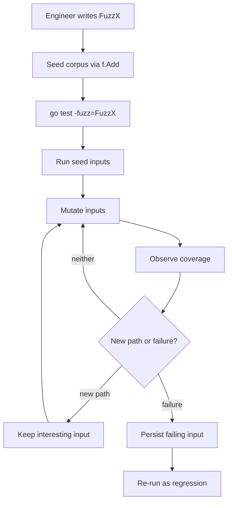
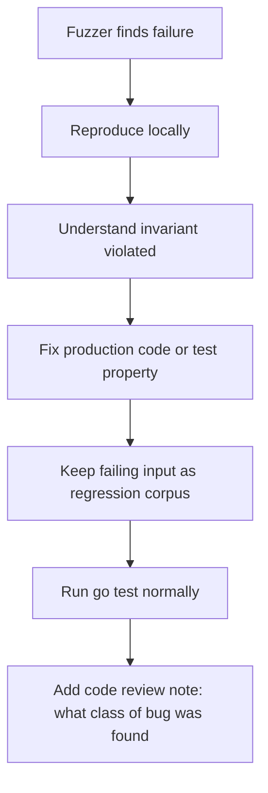
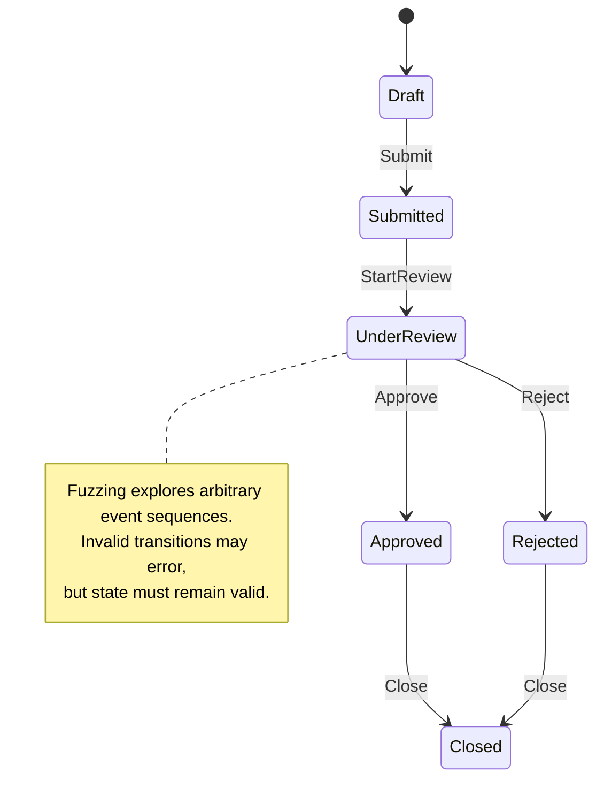
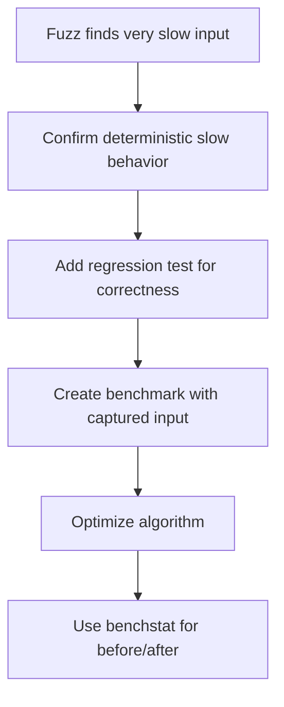
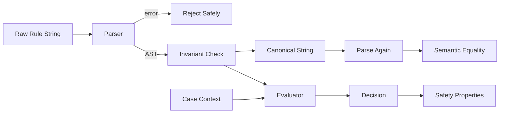

# learn-go-testing-benchmarking-performance-engineering-part-016.md

# Part 016 — Fuzz Testing & Property-Based Thinking

> Series: **Go Testing, Benchmarking, Performance Engineering**  
> Target: **Go 1.26.x**  
> Audience: Java software engineer moving toward senior/staff-level Go engineering  
> Status: **Part 016 of 034**

---

## 0. Tujuan Part Ini

Pada part sebelumnya kita sudah membahas cara menguji boundary deterministik, test double, HTTP, filesystem, integration dependency, dan concurrency behavior. Part ini naik satu level: bagaimana menemukan bug yang **tidak terpikirkan oleh manusia ketika menulis test case manual**.

Topik utamanya adalah:

1. Apa itu fuzz testing dalam Go.
2. Bedanya fuzzing, property-based testing, randomized testing, dan table-driven testing.
3. Mental model coverage-guided fuzzing.
4. Cara menulis fuzz target Go yang benar.
5. Cara memilih input domain yang bernilai.
6. Cara mendesain invariant/property yang kuat.
7. Cara mengelola seed corpus, crash corpus, dan regression corpus.
8. Cara menjalankan fuzzing di local dan CI.
9. Cara menghindari flaky fuzz targets.
10. Cara memakai fuzzing untuk parser, codec, validator, normalizer, auth/permission logic, state machine, dan business rule.
11. Cara membaca hasil fuzzing sebagai engineering evidence.

Part ini tidak akan mengulang detail concurrency, IO, crypto, atau observability. Kita hanya mengambil aspek yang perlu untuk membuat fuzz target yang benar.

---

## 1. Core Idea: Fuzzing Itu Bukan “Random Test” Biasa

Banyak engineer pertama kali menganggap fuzzing sebagai:

> “Test yang generate input random lalu berharap menemukan panic.”

Itu kurang tepat.

Dalam Go modern, fuzzing adalah mekanisme testing yang:

1. menerima seed input dari engineer,
2. menjalankan fungsi target dengan input tersebut,
3. memutasi input untuk mengeksplorasi path baru,
4. menggunakan coverage feedback untuk mencari area kode yang belum banyak dieksplorasi,
5. menyimpan input yang menyebabkan failure,
6. mengubah failure tersebut menjadi regression test reproducible.

Jadi fuzzing bukan hanya random. Fuzzing adalah **search process**.

Perbedaan mental model:

| Teknik | Input | Goal | Kelebihan | Risiko |
|---|---:|---|---|---|
| Table-driven test | Dipilih manual | Membuktikan case yang kita pikirkan | Sangat jelas dan readable | Blind spot besar terhadap input tak terpikirkan |
| Randomized test | Random tanpa feedback | Mencoba banyak variasi | Simple | Banyak noise, sering tidak reproducible jika seed buruk |
| Property-based test | Generated input + invariant | Membuktikan property umum | Menemukan bug konseptual | Sulit jika property lemah |
| Fuzz test | Mutation + coverage guidance | Menemukan input yang membuka path/failure baru | Cocok untuk parser, codec, validator, boundary logic | Bisa boros CPU dan flaky jika target tidak deterministic |

Go fuzzing memakai coverage guidance untuk mengeksplorasi kode yang sedang difuzz. Artinya fuzzer tidak sekadar membuat input random, tetapi memakai informasi coverage untuk menemukan input yang membawa execution ke path baru.

---

## 2. Kapan Fuzzing Bernilai Tinggi?

Fuzzing paling bernilai ketika fungsi Anda memiliki karakteristik berikut:

1. Input space sangat besar.
2. Format input kompleks.
3. Ada banyak edge case.
4. Kesalahan input tidak boleh menyebabkan panic.
5. Ada transformasi data bolak-balik.
6. Ada parser, decoder, validator, normalizer, matcher, router, evaluator, atau policy engine.
7. Ada state machine yang bisa menerima sequence event.
8. Ada security boundary.
9. Ada compatibility requirement.

Contoh yang sangat cocok:

- JSON/XML/custom binary parser.
- CSV parser.
- URL/path/query parser.
- Regex-like matcher.
- Template renderer.
- Authorization expression evaluator.
- Policy DSL parser.
- Token parser.
- Cryptographic wrapper API boundary.
- Compression/decompression wrapper.
- Serialization/deserialization.
- Data normalization.
- Validation rule engine.
- Case status transition evaluator.
- Workflow escalation rule evaluator.

Contoh yang kurang cocok:

- Function yang hanya memanggil database nyata.
- Function yang bergantung pada current time tanpa injection.
- Function yang memanggil network external service.
- Function yang punya side effect tidak terkontrol.
- Function yang behavior-nya inherently nondeterministic.
- Function yang butuh setup besar per input.

Fuzz target yang baik biasanya kecil, deterministic, cepat, dan punya invariant jelas.

---

## 3. Go Fuzz Test Anatomy

Fuzz test di Go berbentuk fungsi:

```go
func FuzzSomething(f *testing.F) {
    f.Add("seed")

    f.Fuzz(func(t *testing.T, input string) {
        // property / invariant assertion
    })
}
```

Struktur dasarnya:

1. Nama fungsi diawali `Fuzz`.
2. Parameter pertama adalah `*testing.F`.
3. Seed corpus ditambahkan dengan `f.Add(...)`.
4. Fuzz target didefinisikan dengan `f.Fuzz(func(t *testing.T, ...args) { ... })`.
5. Argumen target harus tipe yang didukung Go fuzzing.

Secara konseptual:



---

## 4. Supported Fuzz Input Types

Go fuzz target menerima subset tipe yang bisa dimutasi oleh engine fuzzing.

Tipe umum yang penting:

- `string`
- `[]byte`
- integer types
- unsigned integer types
- floating-point types
- `bool`

Prinsip pemilihan tipe:

| Domain | Input Type yang Umum | Alasan |
|---|---|---|
| Text parser | `string` | Natural untuk Unicode/text/path/query |
| Binary parser | `[]byte` | Natural untuk byte-level mutation |
| Number algorithm | `int`, `int64`, `uint64`, `float64` | Direct numeric exploration |
| Codec | `[]byte` atau `string` | Tergantung encoded format |
| Rule evaluator | `string`, `[]byte`, kombinasi number/bool | Representasi policy DSL atau event |
| State transition | `[]byte` lalu dipetakan ke event sequence | Fuzzer mutate sequence compact |

Hindari input target berupa struktur kompleks langsung. Biasanya lebih baik fuzzer menerima `[]byte` atau `string`, lalu test target melakukan decode/parse/mapping secara terkendali.

---

## 5. Command Dasar

Menjalankan semua test biasa:

```bash
go test ./...
```

Menjalankan fuzz target tertentu:

```bash
go test ./... -run='^$' -fuzz=FuzzParseRule
```

Menjalankan fuzz selama durasi tertentu:

```bash
go test ./internal/rules -run='^$' -fuzz=FuzzParseRule -fuzztime=30s
```

Menjalankan seed corpus tanpa fuzzing aktif:

```bash
go test ./internal/rules -run=FuzzParseRule
```

Menjalankan fuzz dengan race detector, biasanya mahal tapi berguna untuk target concurrency-safe:

```bash
go test ./internal/rules -run='^$' -fuzz=FuzzParseRule -race -fuzztime=1m
```

Menjalankan fuzz target tunggal dengan verbose:

```bash
go test ./internal/rules -run='^$' -fuzz='^FuzzParseRule$' -fuzztime=1m -v
```

Catatan penting: `-run='^$'` sering dipakai agar test biasa tidak ikut berjalan saat sesi fuzzing. Ini menjaga fokus dan mengurangi noise.

---

## 6. Property-Based Thinking

Fuzzing menjadi kuat jika target tidak hanya memeriksa “tidak panic”. Target perlu memeriksa **property**.

Property adalah aturan umum yang harus selalu benar untuk seluruh input valid atau seluruh input yang bisa diterima.

Contoh property:

1. Parser tidak boleh panic untuk input apapun.
2. Jika parse sukses, serialize hasilnya harus bisa diparse lagi.
3. Normalize harus idempotent.
4. Encode lalu decode harus round-trip.
5. Decode input invalid boleh error, tapi tidak boleh partial success berbahaya.
6. Authorization evaluator tidak boleh grant permission jika subject/resource/action kosong.
7. State transition evaluator tidak boleh menghasilkan status yang bukan bagian dari state machine.
8. Validation error harus stable dan tidak bocor secret.
9. Sorting output harus deterministic.
10. Function harus preserve invariant tertentu.

Contoh idempotence property:

```go
func NormalizePostalCode(s string) string {
    // implementation
    return s
}

func FuzzNormalizePostalCode(f *testing.F) {
    for _, seed := range []string{"", "123456", " 123456 ", "abc", "１２３４５６"} {
        f.Add(seed)
    }

    f.Fuzz(func(t *testing.T, input string) {
        once := NormalizePostalCode(input)
        twice := NormalizePostalCode(once)

        if once != twice {
            t.Fatalf("NormalizePostalCode not idempotent: input=%q once=%q twice=%q", input, once, twice)
        }
    })
}
```

Property ini kuat karena tidak bergantung pada daftar expected output manual untuk setiap input.

---

## 7. “No Panic” Adalah Property Minimum, Bukan Tujuan Akhir

Target paling sederhana:

```go
func FuzzParse(f *testing.F) {
    f.Add([]byte("valid"))

    f.Fuzz(func(t *testing.T, data []byte) {
        _, _ = Parse(data)
    })
}
```

Ini hanya membuktikan:

> Untuk input yang dicoba fuzzer, `Parse` tidak panic.

Itu berguna, terutama untuk parser boundary, tetapi belum cukup.

Target lebih baik:

```go
func FuzzParseSerializeRoundTrip(f *testing.F) {
    f.Add([]byte(`{"status":"OPEN","priority":3}`))

    f.Fuzz(func(t *testing.T, data []byte) {
        doc, err := ParseDocument(data)
        if err != nil {
            return // invalid input is acceptable
        }

        encoded, err := SerializeDocument(doc)
        if err != nil {
            t.Fatalf("serialize parsed document: %v", err)
        }

        doc2, err := ParseDocument(encoded)
        if err != nil {
            t.Fatalf("parse serialized document: %v; encoded=%q", err, encoded)
        }

        if !DocumentSemanticallyEqual(doc, doc2) {
            t.Fatalf("round trip mismatch: before=%#v after=%#v encoded=%q", doc, doc2, encoded)
        }
    })
}
```

Ini membuktikan property yang lebih bermakna:

- invalid input boleh ditolak,
- valid parsed document harus serializable,
- serialized output harus parseable,
- semantic value harus stabil.

---

## 8. Seed Corpus: Input Awal yang Mengarahkan Fuzzer

Seed corpus adalah contoh input awal yang diberikan engineer.

Seed yang baik bukan sekadar input valid. Seed harus membantu fuzzer menemukan grammar/domain.

Untuk parser policy DSL, seed bisa mencakup:

```go
func FuzzParsePolicy(f *testing.F) {
    seeds := []string{
        "allow user read case",
        "deny user delete case",
        "allow role:officer update case where owner=true",
        "",
        " ",
        "allow",
        "allow user",
        "allow user read",
        "allow user read case where",
        "allow user read case where age >= 18",
        "allow user read case where region in [SG,ID]",
    }

    for _, seed := range seeds {
        f.Add(seed)
    }

    f.Fuzz(func(t *testing.T, src string) {
        _, _ = ParsePolicy(src)
    })
}
```

Seed corpus yang baik mencakup:

1. valid minimal,
2. valid typical,
3. valid complex,
4. empty input,
5. whitespace-only input,
6. malformed prefix,
7. malformed suffix,
8. boundary delimiter,
9. nested structure,
10. Unicode/special characters,
11. very short input,
12. very long-ish input.

Seed terlalu sedikit membuat fuzzer lambat menemukan grammar. Seed terlalu banyak bisa memperbesar maintenance cost. Target awalnya adalah seed yang **representatif**, bukan exhaustive.

---

## 9. Regression Corpus: Bug yang Sudah Ditemukan Harus Menjadi Aset

Ketika fuzzer menemukan failing input, Go menyimpan input tersebut sehingga bisa dijalankan kembali.

Engineering rule:

> Failing fuzz input bukan sampah. Itu adalah artifact regression yang membuktikan blind spot desain/test sebelumnya.

Workflow yang sehat:



Jangan hanya menghapus corpus yang “mengganggu”. Jika input menyebabkan failure karena target fuzz-nya salah, perbaiki target. Jika input menyebabkan bug produksi, perbaiki kode produksi.

---

## 10. Property Patterns yang Paling Berguna

### 10.1 Round-Trip Property

Bentuk umum:

```text
Decode(Encode(x)) == x
```

Atau:

```text
Parse(Serialize(Parse(input))) == Parse(input)
```

Cocok untuk:

- JSON wrapper,
- binary codec,
- URL encoding,
- token format,
- normalized representation,
- config format,
- workflow rule DSL.

Contoh:

```go
func FuzzCaseRuleRoundTrip(f *testing.F) {
    f.Add("status == OPEN && priority >= 3")
    f.Add("assignee == \"officer-1\"")

    f.Fuzz(func(t *testing.T, src string) {
        rule, err := ParseRule(src)
        if err != nil {
            return
        }

        out := rule.String()

        rule2, err := ParseRule(out)
        if err != nil {
            t.Fatalf("canonical output is not parseable: src=%q out=%q err=%v", src, out, err)
        }

        if !RuleEqual(rule, rule2) {
            t.Fatalf("round trip mismatch: src=%q out=%q before=%#v after=%#v", src, out, rule, rule2)
        }
    })
}
```

### 10.2 Idempotence Property

Bentuk umum:

```text
f(f(x)) == f(x)
```

Cocok untuk:

- normalization,
- canonicalization,
- sanitization,
- trimming,
- sorting/dedup,
- permission expansion.

Contoh:

```go
func FuzzCanonicalizeTags(f *testing.F) {
    f.Add("urgent,case,urgent")
    f.Add(" Case , urgent , ")

    f.Fuzz(func(t *testing.T, input string) {
        once := CanonicalizeTags(input)
        twice := CanonicalizeTags(once)
        if once != twice {
            t.Fatalf("not idempotent: input=%q once=%q twice=%q", input, once, twice)
        }
    })
}
```

### 10.3 Inverse Property

Bentuk umum:

```text
g(f(x)) == x
```

Contoh:

```go
func FuzzEscapeUnescape(f *testing.F) {
    f.Add("hello world")
    f.Add("a/b?c=d&e=f")

    f.Fuzz(func(t *testing.T, s string) {
        escaped := Escape(s)
        unescaped, err := Unescape(escaped)
        if err != nil {
            t.Fatalf("unescape escaped input: %v; escaped=%q", err, escaped)
        }
        if unescaped != s {
            t.Fatalf("inverse mismatch: input=%q escaped=%q unescaped=%q", s, escaped, unescaped)
        }
    })
}
```

### 10.4 Monotonicity Property

Bentuk umum:

```text
if x <= y then f(x) <= f(y)
```

Cocok untuk:

- scoring,
- priority ranking,
- fee calculation,
- SLA escalation severity,
- risk scoring.

Contoh:

```go
func FuzzRiskScoreMonotonicity(f *testing.F) {
    f.Add(uint8(1), uint8(2))
    f.Add(uint8(10), uint8(10))

    f.Fuzz(func(t *testing.T, low uint8, high uint8) {
        if low > high {
            low, high = high, low
        }

        s1 := RiskScore(int(low))
        s2 := RiskScore(int(high))

        if s1 > s2 {
            t.Fatalf("risk score not monotonic: low=%d high=%d s1=%d s2=%d", low, high, s1, s2)
        }
    })
}
```

### 10.5 Conservation Property

Bentuk umum:

```text
sum(before) == sum(after)
```

Cocok untuk:

- distribution,
- partitioning,
- batching,
- pagination,
- sharding,
- allocation of work.

Contoh:

```go
func FuzzBatchConservation(f *testing.F) {
    f.Add([]byte{1, 2, 3}, uint8(2))

    f.Fuzz(func(t *testing.T, data []byte, size uint8) {
        n := int(size)
        if n == 0 {
            n = 1
        }

        batches := BatchBytes(data, n)

        var total int
        for _, b := range batches {
            total += len(b)
            if len(b) > n {
                t.Fatalf("batch too large: n=%d batch_len=%d", n, len(b))
            }
        }

        if total != len(data) {
            t.Fatalf("lost or duplicated bytes: input_len=%d total=%d", len(data), total)
        }
    })
}
```

### 10.6 Authorization Safety Property

Bentuk umum:

```text
Invalid/unknown subject/resource/action must not allow access.
```

Contoh:

```go
func FuzzPermissionDefaultDeny(f *testing.F) {
    f.Add("", "case", "read")
    f.Add("user-1", "", "read")
    f.Add("user-1", "case", "")

    f.Fuzz(func(t *testing.T, subject string, resource string, action string) {
        decision := EvaluatePermission(subject, resource, action)

        if subject == "" || resource == "" || action == "" {
            if decision.Allow {
                t.Fatalf("empty authorization dimension must not allow: subject=%q resource=%q action=%q decision=%#v",
                    subject, resource, action, decision)
            }
        }
    })
}
```

Untuk security-sensitive logic, property “default deny” sering lebih penting daripada exhaustive expected output.

---

## 11. Designing Fuzz Targets: Small, Pure, Deterministic, Fast

Fuzz target buruk:

```go
func FuzzCreateCase(f *testing.F) {
    f.Add("case title")

    f.Fuzz(func(t *testing.T, title string) {
        db := connectRealDatabase()
        defer db.Close()

        svc := NewCaseService(db, realEmailClient{}, time.Now)
        _, _ = svc.CreateCase(context.Background(), CreateCaseRequest{Title: title})
    })
}
```

Masalah:

1. Koneksi DB per input.
2. Real email client.
3. Time nondeterministic.
4. Side effect besar.
5. Lambat.
6. Flaky.
7. Failure sulit direproduce.

Fuzz target lebih baik:

```go
func FuzzValidateCreateCaseRequest(f *testing.F) {
    f.Add("valid title", "normal description")
    f.Add("", "")

    validator := NewCaseRequestValidator(ValidationConfig{
        MaxTitleLen:       200,
        MaxDescriptionLen: 5000,
    })

    f.Fuzz(func(t *testing.T, title string, description string) {
        req := CreateCaseRequest{
            Title:       title,
            Description: description,
        }

        result := validator.Validate(req)

        if len(title) == 0 && result.Valid {
            t.Fatalf("empty title must be invalid: result=%#v", result)
        }

        if len(title) > 200 && result.Valid {
            t.Fatalf("oversized title must be invalid: len=%d result=%#v", len(title), result)
        }
    })
}
```

Prinsip:

- fuzz pure validation logic,
- bukan full service dengan dependency nyata,
- invariant jelas,
- no network,
- no DB,
- no current time,
- no global mutable state.

---

## 12. Mapping `[]byte` ke Domain Event Sequence

Kadang property yang ingin dites adalah state machine, bukan single input.

Contoh status case:

```text
Draft -> Submitted -> UnderReview -> Approved
                         |              |
                         v              v
                      Rejected        Closed
```

Kita bisa memakai byte sequence untuk memilih event.

```go
func FuzzCaseStateMachine(f *testing.F) {
    f.Add([]byte{0, 1, 2})
    f.Add([]byte{0, 1, 3})

    f.Fuzz(func(t *testing.T, data []byte) {
        st := NewCaseStateMachine()

        for _, b := range data {
            event := eventFromByte(b)
            _ = st.Apply(event) // invalid transition may return error

            if !IsKnownStatus(st.Status()) {
                t.Fatalf("unknown status after event=%v data=%v status=%v", event, data, st.Status())
            }

            if st.Status() == StatusApproved && st.HasRejectionReason() {
                t.Fatalf("approved case must not carry rejection reason: data=%v state=%#v", data, st)
            }
        }
    })
}

func eventFromByte(b byte) CaseEvent {
    switch b % 5 {
    case 0:
        return EventSubmit
    case 1:
        return EventStartReview
    case 2:
        return EventApprove
    case 3:
        return EventReject
    default:
        return EventClose
    }
}
```

Hal ini membuat fuzzer mengeksplorasi sequence event yang mungkin tidak terpikirkan.

Diagram property:



Invariant penting untuk state machine fuzzing:

1. Status selalu known.
2. Invalid transition tidak boleh mutate state secara partial.
3. Terminal status tidak boleh kembali ke non-terminal kecuali explicit reopen rule.
4. Audit event tidak boleh hilang jika transition sukses.
5. Error tidak boleh menyebabkan inconsistent state.
6. Sensitive state tidak boleh terbuka dari invalid event.

---

## 13. Fuzzing Parser: Invalid Input Boleh Error, Tapi Tidak Boleh Merusak Kontrak

Parser fuzz target sering salah karena engineer menganggap semua input harus valid.

Yang benar:

- input invalid boleh menghasilkan error,
- input invalid tidak boleh panic,
- input valid harus menghasilkan AST/data yang memenuhi invariant,
- canonical output dari AST harus valid,
- error untuk invalid input tidak boleh bocor internal secret atau terlalu besar.

Contoh:

```go
func FuzzParseEscalationRule(f *testing.F) {
    seeds := []string{
        "if age_days >= 14 then escalate_to supervisor",
        "if priority == HIGH then escalate_to manager",
        "",
        "if",
        "if age_days >= then",
    }
    for _, seed := range seeds {
        f.Add(seed)
    }

    f.Fuzz(func(t *testing.T, src string) {
        rule, err := ParseEscalationRule(src)
        if err != nil {
            if strings.Contains(err.Error(), "password") || strings.Contains(err.Error(), "secret") {
                t.Fatalf("error leaks sensitive data: src=%q err=%v", src, err)
            }
            if len(err.Error()) > 1000 {
                t.Fatalf("error too large: src_len=%d err_len=%d", len(src), len(err.Error()))
            }
            return
        }

        if rule.Action.Target == "" {
            t.Fatalf("parsed valid rule has empty escalation target: src=%q rule=%#v", src, rule)
        }

        canonical := rule.String()
        rule2, err := ParseEscalationRule(canonical)
        if err != nil {
            t.Fatalf("canonical rule not parseable: src=%q canonical=%q err=%v", src, canonical, err)
        }
        if !EscalationRuleEqual(rule, rule2) {
            t.Fatalf("canonical mismatch: src=%q canonical=%q before=%#v after=%#v", src, canonical, rule, rule2)
        }
    })
}
```

---

## 14. Fuzzing Validators: Beware Weak Properties

Validator fuzzing sering terlihat benar tapi property-nya lemah.

Property lemah:

```go
func FuzzValidateEmail(f *testing.F) {
    f.Add("a@example.com")
    f.Fuzz(func(t *testing.T, s string) {
        _ = ValidateEmail(s)
    })
}
```

Ini hanya cek no panic.

Property lebih baik:

```go
func FuzzValidateEmail(f *testing.F) {
    f.Add("a@example.com")
    f.Add("")
    f.Add("no-at-symbol")
    f.Add("a@")
    f.Add("@example.com")

    f.Fuzz(func(t *testing.T, s string) {
        result := ValidateEmail(s)

        if strings.TrimSpace(s) != s && result.Valid {
            t.Fatalf("email with leading/trailing whitespace must not be valid: %q", s)
        }

        if !strings.Contains(s, "@") && result.Valid {
            t.Fatalf("email without @ must not be valid: %q", s)
        }

        if result.Valid && len(s) > 254 {
            t.Fatalf("email longer than max length accepted: len=%d", len(s))
        }
    })
}
```

Tapi hati-hati: jangan membuat property palsu berdasarkan asumsi yang tidak sesuai requirement. Misalnya validasi email real-world bisa kompleks. Jika rule business Anda intentionally sederhana, tulis property sesuai business rule, bukan RFC absolut jika sistem tidak menargetkan RFC penuh.

---

## 15. Fuzzing Normalizer dan Canonicalizer

Normalizer sangat cocok untuk fuzzing karena punya property natural:

1. idempotent,
2. output format valid,
3. output tidak lebih panjang dari batas tertentu,
4. output tidak mengandung karakter terlarang,
5. equivalent input menghasilkan same canonical output.

Contoh postal code:

```go
func FuzzPostalCodeNormalize(f *testing.F) {
    seeds := []string{
        "123456",
        " 123456 ",
        "１２３４５６",
        "abc123",
        "",
    }
    for _, seed := range seeds {
        f.Add(seed)
    }

    f.Fuzz(func(t *testing.T, input string) {
        out := NormalizePostalCode(input)

        if out != NormalizePostalCode(out) {
            t.Fatalf("not idempotent: input=%q out=%q out2=%q", input, out, NormalizePostalCode(out))
        }

        if len(out) > 6 {
            t.Fatalf("normalized postal code too long: input=%q out=%q", input, out)
        }

        for _, r := range out {
            if r < '0' || r > '9' {
                t.Fatalf("normalized postal code contains non-digit: input=%q out=%q rune=%q", input, out, r)
            }
        }
    })
}
```

---

## 16. Fuzzing Serialization: Semantic Equality, Not Always Byte Equality

Untuk JSON, map ordering, whitespace, default values, dan representation differences bisa membuat byte equality terlalu kuat.

Buruk:

```go
if string(encodedAgain) != string(encoded) {
    t.Fatalf("mismatch")
}
```

Lebih baik:

```go
if !reflect.DeepEqual(decoded1, decoded2) {
    t.Fatalf("semantic mismatch")
}
```

Atau gunakan semantic equality domain-specific.

Contoh:

```go
func FuzzCaseJSONRoundTrip(f *testing.F) {
    f.Add([]byte(`{"id":"C-1","status":"OPEN","tags":["urgent"]}`))

    f.Fuzz(func(t *testing.T, data []byte) {
        var c Case
        if err := json.Unmarshal(data, &c); err != nil {
            return
        }

        if err := c.ValidateInternalInvariant(); err != nil {
            return
        }

        encoded, err := json.Marshal(c)
        if err != nil {
            t.Fatalf("marshal valid case: %v case=%#v", err, c)
        }

        var c2 Case
        if err := json.Unmarshal(encoded, &c2); err != nil {
            t.Fatalf("unmarshal marshaled case: %v encoded=%q", err, encoded)
        }

        if !CaseEqual(c, c2) {
            t.Fatalf("case JSON roundtrip mismatch: before=%#v after=%#v encoded=%q", c, c2, encoded)
        }
    })
}
```

---

## 17. Fuzzing Security Boundaries

Security fuzzing di Go bisa sangat bernilai jika Anda menulis parser/token/policy logic. Namun property-nya harus didesain hati-hati.

Target security fuzzing biasanya ingin membuktikan:

1. Malformed input tidak panic.
2. Malformed input tidak grant access.
3. Error tidak bocor secret.
4. Parser tidak hang pada input tertentu.
5. Input besar tidak menyebabkan allocation explosion.
6. Canonicalization tidak membuka bypass.
7. Equivalent identity tidak punya ambiguity berbahaya.
8. Signature/token parser reject format aneh.

Contoh token parser:

```go
func FuzzParseBearerToken(f *testing.F) {
    f.Add("Bearer abc.def.ghi")
    f.Add("bearer abc")
    f.Add("")
    f.Add("Basic abc")
    f.Add("Bearer ")

    f.Fuzz(func(t *testing.T, header string) {
        token, err := ParseBearerToken(header)
        if err != nil {
            if token != "" {
                t.Fatalf("error must not return token: header=%q token=%q err=%v", header, token, err)
            }
            return
        }

        if token == "" {
            t.Fatalf("successful parse returned empty token: header=%q", header)
        }

        if strings.ContainsAny(token, " \t\r\n") {
            t.Fatalf("token contains whitespace: header=%q token=%q", header, token)
        }
    })
}
```

Default deny property untuk authorization:

```go
func FuzzPolicyNeverAllowsUnknownAction(f *testing.F) {
    f.Add("officer", "case", "read")
    f.Add("officer", "case", "unknown")

    f.Fuzz(func(t *testing.T, role, resource, action string) {
        decision := EvaluatePolicy(role, resource, action)

        if !KnownAction(action) && decision.Allow {
            t.Fatalf("unknown action allowed: role=%q resource=%q action=%q decision=%#v",
                role, resource, action, decision)
        }
    })
}
```

---

## 18. Fuzzing and Resource Boundaries

Fuzzing bisa menemukan input yang menyebabkan CPU/memory blow-up. Tetapi target fuzz sendiri harus membatasi resource agar tidak menjadi flaky atau membunuh mesin CI.

Hal yang perlu dijaga:

1. Batas ukuran input.
2. Batas output.
3. Batas recursion/depth.
4. Batas loop step.
5. Batas allocation.
6. Batas error size.
7. Tidak melakukan `time.Sleep` per input.
8. Tidak melakukan network/file besar per input.

Contoh guard:

```go
func FuzzParseRuleBounded(f *testing.F) {
    f.Add("if age_days >= 14 then escalate")

    f.Fuzz(func(t *testing.T, src string) {
        if len(src) > 4096 {
            t.Skip("input too large for unit-level fuzz target")
        }

        rule, err := ParseRule(src)
        if err != nil {
            return
        }

        out := rule.String()
        if len(out) > 8192 {
            t.Fatalf("canonical output too large: src_len=%d out_len=%d", len(src), len(out))
        }
    })
}
```

Gunakan `t.Skip` dengan hati-hati. Jangan skip terlalu agresif sampai fuzzer tidak bisa mengeksplorasi input menarik.

---

## 19. Fuzz Target Determinism Checklist

Fuzz target harus deterministic. Jika input sama dijalankan ulang, hasil harus sama.

Checklist:

- Tidak memakai `time.Now()` langsung.
- Tidak memakai random global tanpa seed deterministic.
- Tidak bergantung pada map iteration order untuk assertion order-sensitive.
- Tidak bergantung pada goroutine scheduling.
- Tidak menggunakan external network.
- Tidak menggunakan real database shared.
- Tidak menulis file shared path.
- Tidak memakai global mutable state antar input.
- Tidak menghasilkan assertion berdasarkan elapsed time.
- Tidak punya background goroutine yang bocor antar input.
- Tidak menggunakan environment variable yang berubah antar run.

Jika target butuh clock, inject fixed clock.

```go
fixedClock := func() time.Time { return time.Unix(1700000000, 0).UTC() }
```

Jika target butuh random, inject deterministic source jika domain non-crypto. Untuk crypto-related tests pada Go 1.26, perhatikan perubahan crypto randomness dan gunakan fasilitas deterministic testing yang disediakan untuk crypto jika memang relevan.

---

## 20. Common Failure Types yang Ditemukan Fuzzing

Fuzzing sering menemukan bug seperti:

1. Panic karena slice bounds.
2. Nil pointer dereference.
3. Integer overflow pada length/capacity.
4. Infinite loop parser.
5. Recursion explosion.
6. Allocation explosion.
7. UTF-8/Unicode assumption salah.
8. Invalid state transition.
9. Parser menerima input ambigu.
10. Normalizer tidak idempotent.
11. Round-trip mismatch.
12. Error path membocorkan detail internal.
13. Default allow authorization bug.
14. Case-insensitive/canonicalization bypass.
15. Timeout/cancellation ignored.

Untuk engineer senior, value fuzzing bukan hanya “menemukan crash”. Value utamanya adalah menunjukkan kelas bug apa yang tidak dilindungi oleh desain test manual.

---

## 21. Debugging Fuzz Failure

Ketika fuzzing menemukan failure:

1. Re-run failing input.
2. Pastikan failure deterministic.
3. Baca input minimal yang disimpan.
4. Identifikasi property mana yang dilanggar.
5. Putuskan apakah bug ada di production code atau di test property.
6. Tambahkan regression seed jika perlu.
7. Tambahkan table-driven test manual jika bug conceptually penting.
8. Review apakah property bisa diperkuat.

Jangan langsung “fix sampai hijau” tanpa memahami invariant.

Failure message harus cukup diagnostik:

Buruk:

```go
t.Fatal("failed")
```

Baik:

```go
t.Fatalf("roundtrip mismatch: input=%q canonical=%q before=%#v after=%#v", input, canonical, before, after)
```

Namun untuk input sangat besar atau secret-like input, batasi output:

```go
func preview(s string, n int) string {
    if len(s) <= n {
        return s
    }
    return s[:n] + "..."
}
```

---

## 22. Corpus Governance di Repository

Fuzz corpus harus diperlakukan seperti test artifact.

Praktik baik:

1. Commit failing inputs yang sudah menjadi regression penting.
2. Jangan commit corpus sangat besar tanpa alasan.
3. Beri komentar di PR tentang bug class yang ditemukan.
4. Jangan menyimpan secret/token nyata dalam corpus.
5. Jangan menyimpan data produksi.
6. Review corpus seperti test case.
7. Pisahkan seed minimal dari generated corpus besar jika perlu.

Struktur umum:

```text
internal/rules/
  parser.go
  parser_test.go
  testdata/
    fuzz/
      FuzzParseEscalationRule/
        <corpus files>
```

Catatan: Go mengelola corpus dalam direktori testdata/fuzz untuk fuzz target terkait. Anda tidak perlu membuat format manual, tetapi perlu memahami bahwa file tersebut adalah bagian dari test evidence.

---

## 23. Local Workflow

Workflow local yang praktis:

```bash
# 1. Pastikan test biasa hijau
go test ./...

# 2. Jalankan fuzz target singkat
go test ./internal/rules -run='^$' -fuzz='^FuzzParseEscalationRule$' -fuzztime=30s

# 3. Jika failure, re-run package test biasa
go test ./internal/rules -run=FuzzParseEscalationRule -v

# 4. Fix bug atau target

go test ./internal/rules

# 5. Fuzz ulang lebih lama jika perlu
go test ./internal/rules -run='^$' -fuzz='^FuzzParseEscalationRule$' -fuzztime=2m
```

Untuk package besar:

```bash
go test ./internal/rules ./internal/codec ./internal/policy -run='^$' -fuzz=Fuzz -fuzztime=30s
```

Tetapi biasanya lebih baik fuzz target satu per satu agar diagnosis mudah.

---

## 24. CI Workflow: Jangan Jalankan Fuzzing Panjang di PR Gate Sembarangan

Fuzzing bisa mahal. CI strategy harus bertingkat.

Suggested gate:

| Gate | Command | Goal |
|---|---|---|
| PR fast | `go test ./...` | Run unit + seed corpus regression |
| PR targeted | short fuzz for touched high-risk package | Catch easy failures |
| Nightly | fuzz high-risk targets 5-30 min each | Explore deeper |
| Weekly/security | longer fuzz campaign | Parser/security/policy boundary |
| Release gate | run known corpus + selected fuzz smoke | Prevent regression |

Contoh PR gate:

```bash
go test ./... -race
```

Contoh nightly fuzz:

```bash
go test ./internal/rules -run='^$' -fuzz='^FuzzParseEscalationRule$' -fuzztime=10m

go test ./internal/policy -run='^$' -fuzz='^FuzzPolicyEvaluator$' -fuzztime=10m

go test ./internal/codec -run='^$' -fuzz='^FuzzCaseJSONRoundTrip$' -fuzztime=10m
```

CI principle:

> PR gate should prove known regressions and fast correctness. Long fuzzing should continuously discover unknown risks.

---

## 25. Fuzzing vs Race Detector

Fuzzing explores input space. Race detector detects data races.

Gabungan keduanya bisa berguna, tetapi mahal.

Gunakan `-race` dengan fuzzing jika:

1. Target menggunakan goroutine internal.
2. Target memakai shared cache.
3. Target memakai parser/evaluator concurrent-safe.
4. Target state machine mungkin dipakai parallel.

Namun hindari race fuzz target yang:

- lambat,
- sangat allocation-heavy,
- membuka terlalu banyak goroutine,
- memakai global shared mutable state.

Contoh:

```bash
go test ./internal/cache -run='^$' -fuzz='^FuzzCacheOperations$' -race -fuzztime=1m
```

---

## 26. Fuzzing vs Benchmarking

Fuzzing bukan benchmarking.

Fuzzing bertanya:

> Adakah input yang melanggar invariant?

Benchmarking bertanya:

> Seberapa cepat/stabil behavior untuk workload representatif?

Namun fuzzing bisa memberi sinyal performance risk:

1. Input menyebabkan hang.
2. Input menyebabkan allocation explosion.
3. Input menyebabkan output terlalu besar.
4. Input menyebabkan recursion terlalu dalam.
5. Input menyebabkan quadratic behavior terlihat jelas.

Jika fuzzing menemukan input yang lambat, jangan langsung menjadikan fuzz target sebagai benchmark. Ambil input tersebut dan buat benchmark/regression performance terpisah.

Contoh flow:



---

## 27. Fuzzing API Compatibility

Untuk library atau service yang menjaga backward compatibility, fuzzing bisa dipakai untuk memastikan format lama masih diterima.

Pattern:

1. Seed corpus berisi contoh format lama.
2. Fuzzer mutate sekitar format lama.
3. Property memastikan parser tidak panic.
4. Property memastikan known valid legacy input tetap valid.
5. Property memastikan canonical output tidak melanggar versi baru.

Contoh:

```go
func FuzzLegacyCaseID(f *testing.F) {
    seeds := []string{
        "CASE-2024-00001",
        "C/2024/00001",
        "2024-00001",
        "",
    }
    for _, seed := range seeds {
        f.Add(seed)
    }

    f.Fuzz(func(t *testing.T, id string) {
        parsed, err := ParseCaseID(id)
        if err != nil {
            return
        }

        canonical := parsed.String()
        parsed2, err := ParseCaseID(canonical)
        if err != nil {
            t.Fatalf("canonical case id not parseable: id=%q canonical=%q err=%v", id, canonical, err)
        }
        if parsed != parsed2 {
            t.Fatalf("case id roundtrip mismatch: id=%q canonical=%q parsed=%#v parsed2=%#v", id, canonical, parsed, parsed2)
        }
    })
}
```

---

## 28. Fuzzing Business Rules: Jangan Takut Memfuzz Domain Logic

Fuzzing bukan hanya untuk parser low-level. Banyak bug mahal terjadi di business rule boundary.

Contoh domain regulatory enforcement:

- Case status transition.
- Appeal deadline calculation.
- Penalty fee calculation.
- Escalation rule evaluator.
- Permission matrix.
- Document classification.
- Submission completeness validator.
- Renewal eligibility rule.

Contoh eligibility:

```go
func FuzzRenewalEligibility(f *testing.F) {
    f.Add(int64(0), int64(30), true, false)
    f.Add(int64(365), int64(0), false, true)

    fixedNow := time.Date(2026, 6, 23, 0, 0, 0, 0, time.UTC)

    f.Fuzz(func(t *testing.T, licenseAgeDays int64, daysUntilExpiry int64, hasOpenViolation bool, isSuspended bool) {
        if licenseAgeDays < 0 || licenseAgeDays > 3650 {
            t.Skip()
        }
        if daysUntilExpiry < -365 || daysUntilExpiry > 365 {
            t.Skip()
        }

        req := RenewalEligibilityRequest{
            LicenseStart:     fixedNow.AddDate(0, 0, -int(licenseAgeDays)),
            ExpiryDate:       fixedNow.AddDate(0, 0, int(daysUntilExpiry)),
            HasOpenViolation: hasOpenViolation,
            IsSuspended:      isSuspended,
        }

        result := EvaluateRenewalEligibility(fixedNow, req)

        if isSuspended && result.Eligible {
            t.Fatalf("suspended license must not be eligible: req=%#v result=%#v", req, result)
        }

        if hasOpenViolation && result.Eligible {
            t.Fatalf("license with open violation must not be eligible: req=%#v result=%#v", req, result)
        }
    })
}
```

Ini bukan parser fuzzing. Ini domain invariant fuzzing.

---

## 29. Metamorphic Testing

Metamorphic property adalah property yang membandingkan output beberapa input yang berhubungan.

Contoh:

> Menambahkan whitespace di sekitar input tidak boleh mengubah canonical result.

```go
func FuzzPolicyWhitespaceMetamorphic(f *testing.F) {
    f.Add("allow officer read case")

    f.Fuzz(func(t *testing.T, src string) {
        a, errA := ParsePolicy(src)
        b, errB := ParsePolicy("  \n\t" + src + " \t\n")

        if errA != nil || errB != nil {
            return
        }

        if !PolicyEqual(a, b) {
            t.Fatalf("whitespace changed policy: src=%q a=%#v b=%#v", src, a, b)
        }
    })
}
```

Contoh lain:

- Sorting input order tidak boleh mengubah set output.
- Duplicate tag tidak boleh mengubah canonical tag set.
- Case-insensitive identifier harus equivalent jika requirement menyatakan begitu.
- Adding irrelevant metadata tidak boleh mengubah authorization decision.
- Reordering independent rules tidak boleh mengubah evaluator decision.

Metamorphic testing sangat berguna ketika expected output sulit diketahui, tetapi hubungan antar output jelas.

---

## 30. Fuzzing Stateful Components dengan Model Reference

Kadang Anda punya implementasi optimized dan implementasi simple/reference.

Property:

```text
optimized(input) == reference(input)
```

Contoh permission evaluator:

```go
func FuzzPermissionEvaluatorAgainstReference(f *testing.F) {
    f.Add([]byte{1, 2, 3, 4})

    optimized := NewCompiledPolicyEvaluator(samplePolicy())
    reference := NewInterpretedPolicyEvaluator(samplePolicy())

    f.Fuzz(func(t *testing.T, data []byte) {
        req := requestFromBytes(data)

        got := optimized.Evaluate(req)
        want := reference.Evaluate(req)

        if got.Allow != want.Allow || got.ReasonCode != want.ReasonCode {
            t.Fatalf("optimized/reference mismatch: req=%#v got=%#v want=%#v", req, got, want)
        }
    })
}
```

Reference implementation boleh lebih lambat, selama fuzz target masih cukup cepat. Ini pattern kuat untuk:

- optimized parser vs simple parser,
- compiled rule evaluator vs interpreted evaluator,
- cache layer vs direct implementation,
- fast path vs slow path,
- custom algorithm vs standard library behavior.

---

## 31. Handling Unicode and Invalid UTF-8

`string` di Go bisa menyimpan byte sequence yang tidak valid UTF-8. Banyak code salah mengasumsikan semua string valid UTF-8.

Jika function Anda membutuhkan valid UTF-8, property harus explicit.

```go
func FuzzNormalizeDisplayName(f *testing.F) {
    f.Add("Fajar")
    f.Add("名前")
    f.Add("🙂")

    f.Fuzz(func(t *testing.T, input string) {
        out, err := NormalizeDisplayName(input)
        if err != nil {
            return
        }

        if !utf8.ValidString(out) {
            t.Fatalf("normalized display name is invalid UTF-8: input=%q out=%q", input, out)
        }

        if strings.TrimSpace(out) != out {
            t.Fatalf("normalized display name has surrounding whitespace: input=%q out=%q", input, out)
        }
    })
}
```

Jika function menerima binary data, gunakan `[]byte`, bukan `string`.

---

## 32. Fuzzing Time-Dependent Logic

Time-dependent logic harus difuzz dengan time sebagai input atau fixed clock.

Buruk:

```go
func FuzzDeadline(f *testing.F) {
    f.Fuzz(func(t *testing.T, days int) {
        got := IsOverdue(time.Now(), days)
        _ = got
    })
}
```

Lebih baik:

```go
func FuzzDeadline(f *testing.F) {
    f.Add(int64(0), int64(14))
    f.Add(int64(-1), int64(0))

    base := time.Date(2026, 6, 23, 0, 0, 0, 0, time.UTC)

    f.Fuzz(func(t *testing.T, submittedOffsetDays int64, slaDays int64) {
        if submittedOffsetDays < -3650 || submittedOffsetDays > 3650 {
            t.Skip()
        }
        if slaDays < 0 || slaDays > 365 {
            t.Skip()
        }

        submittedAt := base.AddDate(0, 0, int(submittedOffsetDays))
        dueAt := CalculateDueAt(submittedAt, int(slaDays))

        if dueAt.Before(submittedAt) {
            t.Fatalf("due date before submitted date: submitted=%v sla=%d due=%v", submittedAt, slaDays, dueAt)
        }
    })
}
```

---

## 33. Fuzzing With Build Tags

Tidak semua fuzz target harus ikut package test default jika mahal atau environment-specific. Namun seed regression sebaiknya tetap jalan di `go test ./...` jika memungkinkan.

Pattern build tag:

```go
//go:build fuzzheavy

package rules
```

Command:

```bash
go test -tags=fuzzheavy ./internal/rules -run='^$' -fuzz=FuzzHeavyRule -fuzztime=10m
```

Gunakan build tags untuk:

- target fuzz berat,
- target dengan dependency optional,
- long-running campaign,
- security-focused deep fuzzing.

Jangan menyembunyikan regression penting di balik tag yang jarang jalan.

---

## 34. Anti-Patterns

### 34.1 Fuzz Target Dengan Side Effect Nyata

```go
f.Fuzz(func(t *testing.T, email string) {
    SendEmail(email)
})
```

Ini berbahaya. Gunakan fake/simulator.

### 34.2 Fuzz Target Lambat

Jika satu input butuh ratusan ms, fuzzer tidak efektif.

### 34.3 Property Terlalu Lemah

```go
_, _ = Parse(input)
```

No panic berguna, tapi sering belum cukup.

### 34.4 Property Terlalu Kuat dan Salah

```go
if strings.ToLower(input) != Normalize(input) { fail }
```

Ini mungkin salah jika normalizer juga trim, unicode normalize, atau reject input.

### 34.5 Nondeterministic Assertion

```go
if got.Timestamp != time.Now() { fail }
```

Tidak cocok.

### 34.6 Menghapus Failing Corpus Tanpa Analisis

Ini membuang evidence.

### 34.7 Fuzzing Full Application Stack

Fuzzing sebaiknya target boundary kecil. Full-stack random input lebih cocok untuk scenario/load/chaos testing, bukan unit fuzz target.

### 34.8 Tidak Membatasi Input Besar

Parser recursive bisa mati karena input besar. Beri bound yang masuk akal.

### 34.9 Menganggap Fuzzing Menggantikan Unit Test

Fuzzing melengkapi, bukan menggantikan.

---

## 35. Review Checklist untuk Fuzz Target

Gunakan checklist ini saat code review.

### 35.1 Target Quality

- [ ] Target deterministic.
- [ ] Target cepat.
- [ ] Tidak memakai external service nyata.
- [ ] Tidak memakai real shared database.
- [ ] Tidak ada global mutable state bocor antar input.
- [ ] Tidak ada real sleep.
- [ ] Ada bound untuk input/resource jika perlu.

### 35.2 Property Quality

- [ ] Property lebih kuat dari sekadar no panic jika memungkinkan.
- [ ] Invalid input boleh error secara eksplisit.
- [ ] Valid input punya invariant jelas.
- [ ] Failure message diagnostik.
- [ ] Property sesuai requirement, bukan asumsi pribadi.

### 35.3 Corpus Quality

- [ ] Seed mencakup valid minimal.
- [ ] Seed mencakup valid complex.
- [ ] Seed mencakup empty/malformed.
- [ ] Seed mencakup boundary delimiter/Unicode jika relevan.
- [ ] Failing corpus tidak mengandung secret/data produksi.

### 35.4 CI Quality

- [ ] Seed corpus berjalan di normal `go test`.
- [ ] Fuzz campaign panjang tidak membebani PR gate sembarangan.
- [ ] High-risk target punya nightly/periodic fuzzing.
- [ ] Failure artifact disimpan dan mudah direproduce.

---

## 36. Engineering Decision Matrix

| Scenario | Recommended Fuzz Strategy |
|---|---|
| Parser custom DSL | Round-trip + canonical parse property |
| JSON wrapper | Decode/marshal/decode semantic equality |
| Normalizer | Idempotence + output format invariant |
| Validator | Invalid class must not be accepted |
| Authorization | Default deny + unknown action/resource must not allow |
| State machine | Event sequence from bytes + state invariant |
| Optimized algorithm | Compare optimized vs reference implementation |
| Legacy format | Seed old examples + compatibility property |
| Security token parser | Malformed input no panic/no partial token/no default allow |
| Batch/pagination | Conservation + ordering + no duplicate/loss |

---

## 37. Worked Example: Regulatory Escalation Rule Engine

Bayangkan ada rule engine kecil:

```text
if age_days >= 14 and priority == HIGH then escalate_to SUPERVISOR
```

Risiko:

1. Parser panic pada input aneh.
2. Parser menerima rule tanpa target escalation.
3. Canonical string tidak parseable.
4. Evaluator default allow/escalate pada condition invalid.
5. Normalizer tidak idempotent.
6. Rule order mengubah result padahal harus deterministic.

Fuzz targets:

```go
func FuzzEscalationRuleParseRoundTrip(f *testing.F) {
    seeds := []string{
        "if age_days >= 14 then escalate_to SUPERVISOR",
        "if priority == HIGH then escalate_to MANAGER",
        "",
        "if",
        "if age_days >= then escalate_to",
    }
    for _, seed := range seeds {
        f.Add(seed)
    }

    f.Fuzz(func(t *testing.T, src string) {
        if len(src) > 4096 {
            t.Skip()
        }

        rule, err := ParseEscalationRule(src)
        if err != nil {
            return
        }

        if rule.Target == "" {
            t.Fatalf("parsed rule has empty target: src=%q rule=%#v", src, rule)
        }

        canonical := rule.String()
        rule2, err := ParseEscalationRule(canonical)
        if err != nil {
            t.Fatalf("canonical not parseable: src=%q canonical=%q err=%v", src, canonical, err)
        }

        if !EscalationRuleEqual(rule, rule2) {
            t.Fatalf("roundtrip mismatch: src=%q canonical=%q before=%#v after=%#v", src, canonical, rule, rule2)
        }
    })
}
```

Evaluator property:

```go
func FuzzEscalationEvaluatorSafety(f *testing.F) {
    f.Add(int64(0), "LOW", "")
    f.Add(int64(14), "HIGH", "SUPERVISOR")

    rule := MustParseEscalationRule("if age_days >= 14 and priority == HIGH then escalate_to SUPERVISOR")

    f.Fuzz(func(t *testing.T, ageDays int64, priority string, currentOwner string) {
        if ageDays < -365 || ageDays > 3650 {
            t.Skip()
        }

        ctx := EscalationContext{
            AgeDays:      ageDays,
            Priority:     priority,
            CurrentOwner: currentOwner,
        }

        decision := EvaluateEscalation(rule, ctx)

        if ageDays < 14 && decision.Escalate {
            t.Fatalf("case younger than SLA threshold escalated: ctx=%#v decision=%#v", ctx, decision)
        }

        if priority != "HIGH" && decision.Escalate {
            t.Fatalf("non-HIGH priority escalated: ctx=%#v decision=%#v", ctx, decision)
        }

        if decision.Escalate && decision.Target == "" {
            t.Fatalf("escalation without target: ctx=%#v decision=%#v", ctx, decision)
        }
    })
}
```

System view:



---

## 38. Relationship to Previous and Next Parts

Part ini bergantung pada:

- Part 004: `testing` package lifecycle.
- Part 005: assertion quality.
- Part 006: table-driven matrix thinking.
- Part 007: determinism/flakiness control.
- Part 010: deterministic time/randomness/env.
- Part 011: fakes/test doubles.
- Part 015: concurrency testing when fuzzing concurrent targets.

Part berikutnya akan membahas **coverage engineering**. Fuzzing dan coverage berhubungan, tetapi tidak sama:

- Fuzzing menggunakan coverage guidance untuk eksplorasi.
- Coverage engineering menggunakan instrumentation/reporting untuk memahami test reach.
- Coverage percentage bukan bukti correctness.
- Fuzzing bisa menemukan path baru, tetapi property tetap menentukan kualitas evidence.

---

## 39. Exercises

### Exercise 1 — Normalizer Fuzz Target

Buat function `NormalizeIdentifier(string) string` dengan rule:

1. trim whitespace,
2. lower-case ASCII letters,
3. replace spaces with `-`,
4. remove duplicate `-`,
5. max length 64.

Tulis fuzz target dengan property:

- idempotent,
- output length <= 64,
- no leading/trailing `-`,
- no duplicate `--`.

### Exercise 2 — Parser Round Trip

Buat parser sederhana untuk rule:

```text
field operator value
```

Contoh:

```text
age >= 18
status == OPEN
```

Tulis fuzz target:

- invalid input boleh error,
- valid parsed rule harus punya field/operator/value non-empty,
- canonical output harus parseable,
- parsed canonical harus semantic equal.

### Exercise 3 — Authorization Default Deny

Buat `Evaluate(subject, resource, action string) Decision`.

Tulis fuzz target yang membuktikan:

- empty subject/resource/action tidak allow,
- unknown action tidak allow,
- unknown resource tidak allow,
- successful allow harus punya reason code.

### Exercise 4 — State Machine Sequence

Buat state machine case:

```text
Draft -> Submitted -> Reviewing -> Approved/Rejected -> Closed
```

Map `[]byte` menjadi event sequence. Tulis fuzz target untuk invariant:

- status selalu known,
- invalid transition tidak mutate state,
- terminal state tidak berubah kecuali close allowed,
- approved case tidak punya rejection reason.

### Exercise 5 — Captured Fuzz Failure to Benchmark

Jika fuzzing menemukan input yang menyebabkan parser lambat, buat:

1. regression test correctness,
2. benchmark khusus dengan input tersebut,
3. before/after comparison menggunakan `benchstat` pada part benchmark nanti.

---

## 40. Summary

Fuzzing adalah tool untuk mengeksplorasi input space yang terlalu besar untuk table-driven test manual. Nilainya bukan hanya menemukan panic, tetapi menemukan pelanggaran invariant yang tidak terpikirkan.

Mental model utama:

1. Fuzzing adalah guided search, bukan random test biasa.
2. Property lebih penting daripada jumlah input.
3. Target harus kecil, deterministic, cepat, dan bebas side effect nyata.
4. Invalid input boleh error, tetapi tidak boleh panic atau merusak kontrak.
5. Seed corpus mengarahkan fuzzer; regression corpus menyimpan evidence bug.
6. Fuzzing cocok untuk parser, codec, normalizer, validator, authorization, state machine, dan domain rule evaluator.
7. CI fuzzing harus bertingkat: PR untuk known regression, nightly untuk discovery.
8. Fuzzing tidak menggantikan unit test, integration test, coverage, atau benchmark.
9. Failing fuzz input harus menjadi learning artifact, bukan noise yang dihapus.

Jika Anda memakai fuzzing dengan property yang kuat, Anda mulai bergerak dari “saya mengetes contoh yang saya pikirkan” ke “saya mendesain sistem agar invariant-nya bertahan terhadap input yang belum saya bayangkan”.

---

## 41. References

- Go documentation: Fuzzing — https://go.dev/doc/security/fuzz/
- Go package documentation: `testing` — https://pkg.go.dev/testing
- Go command documentation: `go test` — https://pkg.go.dev/cmd/go
- Go 1.26 release notes — https://go.dev/doc/go1.26
- Go Wiki: Fuzzing trophy case — https://go.dev/wiki/Fuzzing-trophy-case

---

## 42. Next Part

Next: `learn-go-testing-benchmarking-performance-engineering-part-017.md`

Topic: **Coverage Engineering: Statement Coverage, Integration Coverage, Meaningful Quality Gates**

Kita akan membahas coverage bukan sebagai angka vanity metric, tetapi sebagai evidence system: `go test -cover`, `-coverprofile`, `-coverpkg`, integration coverage, `GOCOVERDIR`, `go tool covdata`, blind spots, quality gates, dan cara menjadikan coverage berguna tanpa tertipu persentase.

<!-- NAVIGATION_FOOTER -->
<div class="page-nav">
<a href="./learn-go-testing-benchmarking-performance-engineering-part-015.md">⬅️ Part 015 — Concurrency Testing: Race, Ordering, Goroutine Leaks, Deadlocks & Deterministic Coordination</a>
<a href="./index.md">📚 Kategori</a>
<a href="../../index.md">🏠 Home</a>
<a href="./learn-go-testing-benchmarking-performance-engineering-part-017.md">Part 017 — Coverage Engineering: Statement Coverage, Integration Coverage, Meaningful Quality Gates ➡️</a>
</div>
