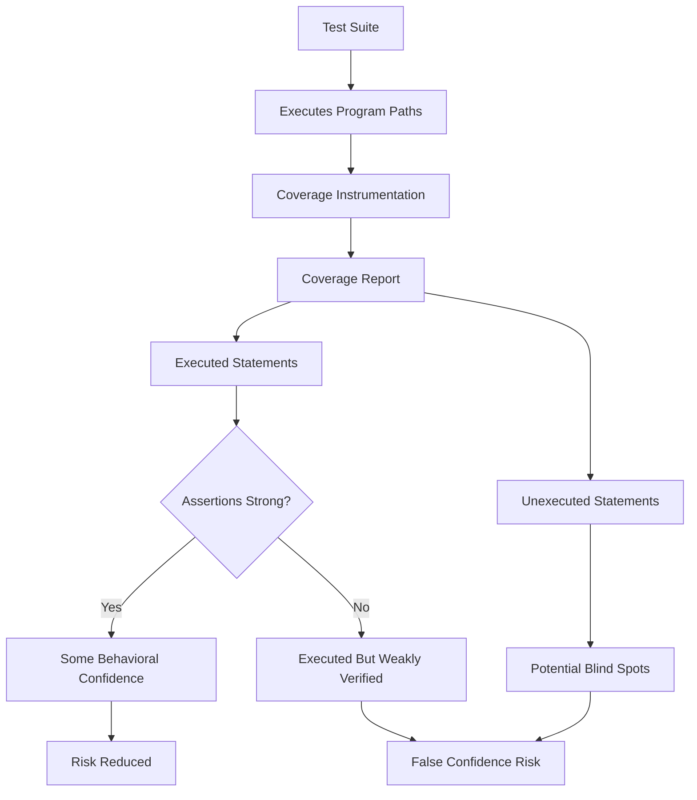
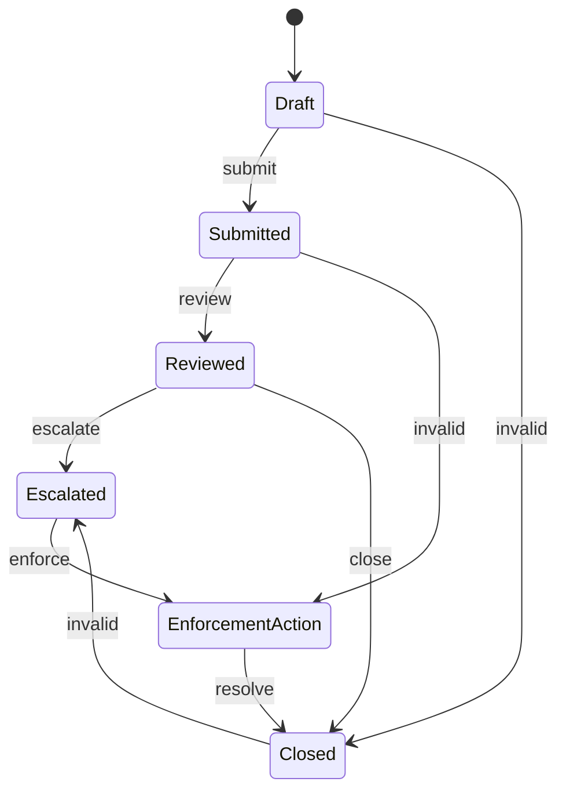
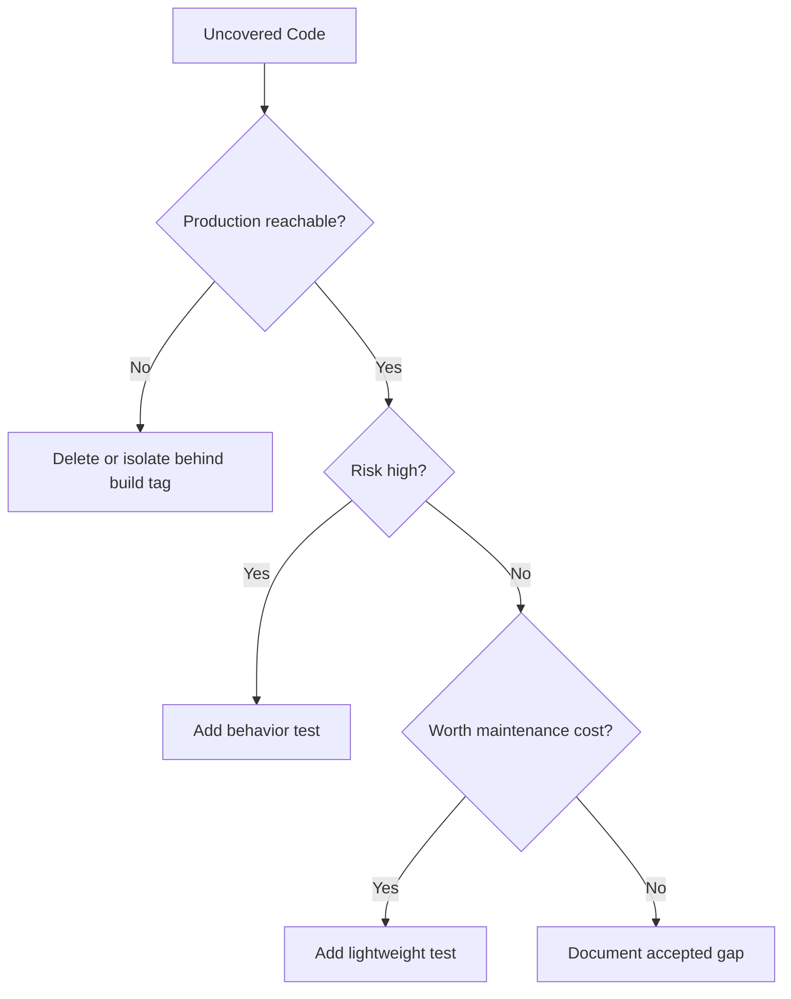
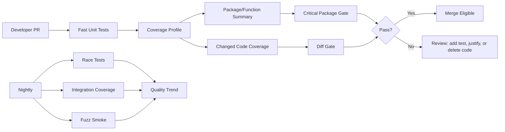
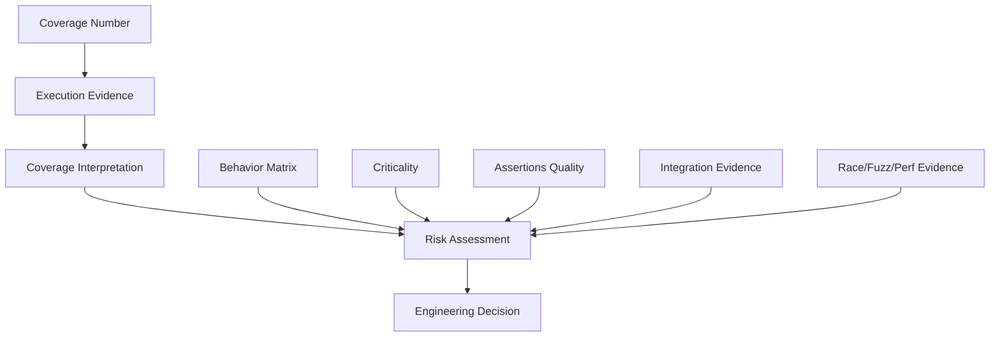

# learn-go-testing-benchmarking-performance-engineering-part-017.md

# Part 017 — Coverage Engineering: Statement Coverage, Integration Coverage, Meaningful Quality Gates

> Seri: **Go Testing, Benchmarking, Performance Engineering**  
> Target pembaca: **Java software engineer / tech lead** yang ingin membangun kualitas engineering level production-grade  
> Target Go: **Go 1.26.x**  
> Fokus part ini: memahami coverage sebagai **risk signal**, bukan vanity metric.

---

## 0. Posisi Part Ini Dalam Seri

Sampai titik ini kita sudah membahas:

1. bagaimana `go test` mengeksekusi test,
2. taxonomy test,
3. testable design,
4. package `testing`,
5. assertion strategy,
6. table-driven test,
7. parallel/shuffle/isolation,
8. golden tests,
9. error/panic/timeout/cancellation,
10. deterministic testing,
11. test doubles,
12. HTTP testing,
13. filesystem/process/CLI testing,
14. integration testing,
15. concurrency testing,
16. fuzz testing.

Sekarang kita membahas **coverage engineering**.

Coverage bukan jawaban atas pertanyaan:

> “Apakah sistem saya benar?”

Coverage hanya membantu menjawab pertanyaan yang lebih terbatas:

> “Bagian kode mana yang sudah pernah dieksekusi oleh test tertentu, dengan instrumentation tertentu, dalam run tertentu?”

Itu penting, tetapi tidak cukup.

Coverage adalah **observability untuk test execution**, bukan bukti correctness.

---

## 1. Mental Model: Coverage Adalah Peta Eksekusi, Bukan Peta Kebenaran

Bayangkan regulatory workflow:

```text
Draft Case -> Submitted -> Reviewed -> Escalated -> Enforcement Action -> Closed
```

Coverage bisa menunjukkan bahwa line-line dalam fungsi `EscalateCase` pernah dieksekusi. Tetapi coverage tidak otomatis membuktikan:

- escalation hanya boleh dilakukan oleh role yang benar,
- deadline SLA dihitung benar,
- case tidak bisa lompat state ilegal,
- audit event selalu tertulis,
- idempotency aman saat retry,
- race tidak terjadi saat dua reviewer melakukan action bersamaan,
- error dari downstream tidak menyebabkan partial commit,
- sensitive data tidak bocor ke response.

Coverage mengatakan:

> “Kode ini dilewati.”

Bukan:

> “Behavior ini benar.”

Diagram mentalnya:



The top 1% engineering mindset:

> Coverage is useful when interpreted as a **risk discovery tool**, not as a **quality trophy**.

---

## 2. Apa Yang Diukur Oleh Go Coverage?

Go coverage standard pada umumnya adalah **statement coverage** berbasis instrumentation.

Saat menjalankan:

```bash
go test -cover ./...
```

Go menginstrumentasi package yang dites dan menghitung berapa bagian statement yang dieksekusi oleh test.

Contoh output:

```text
ok      example.com/app/case      0.243s  coverage: 82.4% of statements
ok      example.com/app/authz     0.120s  coverage: 91.7% of statements
```

Interpretasi benar:

- `82.4%` artinya sekitar 82.4% statement terinstrumentasi dalam package tersebut dieksekusi.
- Itu tidak berarti 82.4% behavior benar.
- Itu tidak berarti 82.4% branch/condition benar.
- Itu tidak berarti 82.4% risiko sudah tertutup.

---

## 3. Statement Coverage vs Branch Coverage vs Behavior Coverage

Go built-in coverage bukan full branch coverage seperti beberapa tooling Java.

### 3.1 Statement coverage

Contoh:

```go
func CanEscalate(role string, overdue bool) bool {
    if role == "manager" || overdue {
        return true
    }
    return false
}
```

Test:

```go
func TestCanEscalate(t *testing.T) {
    if !CanEscalate("manager", false) {
        t.Fatal("manager should escalate")
    }
}
```

Coverage bisa terlihat tinggi karena `if` dan `return true` dieksekusi.

Tetapi test belum membuktikan:

- `overdue == true` untuk non-manager,
- non-manager non-overdue harus false,
- role kosong harus false,
- role case-sensitive atau normalized,
- policy default-deny.

### 3.2 Branch/condition coverage

Behavior matrix yang lebih baik:

| Role | Overdue | Expected |
|---|---:|---:|
| manager | false | true |
| manager | true | true |
| officer | true | true/false tergantung policy |
| officer | false | false |
| empty | false | false |

Coverage statement tidak akan memberi tahu apakah seluruh kombinasi ini sudah diuji.

### 3.3 Behavior coverage

Behavior coverage adalah pertanyaan desain test:

> “Apakah invariant domain penting sudah diuji?”

Ini tidak bisa disimpulkan dari angka coverage saja.

Contoh invariant:

- case tidak boleh closed tanpa final decision,
- only assigned reviewer can approve,
- escalation must create audit trail,
- retry must be idempotent,
- failed notification must not rollback committed decision jika policy demikian,
- cancellation must stop downstream IO.

Coverage report membantu menemukan kode yang tidak pernah tersentuh, tetapi behavior coverage harus dirancang dari domain model.

---

## 4. Coverage Mode di Go

Go menyediakan beberapa mode coverage melalui `-covermode`.

Umumnya:

```bash
go test -covermode=set ./...
go test -covermode=count ./...
go test -covermode=atomic ./...
```

### 4.1 `set`

Mencatat apakah statement pernah dieksekusi minimal sekali.

Cocok untuk:

- coverage sederhana,
- local feedback,
- PR quick gate.

Kelemahan:

- tidak tahu berapa kali statement dieksekusi,
- tidak cocok untuk concurrent precision.

### 4.2 `count`

Mencatat jumlah eksekusi statement.

Cocok untuk:

- melihat hot-ish path dalam test,
- membedakan statement yang dieksekusi sekali vs berkali-kali.

Kelemahan:

- counter tidak atomic,
- kurang aman untuk concurrent test yang memodifikasi counter bersamaan.

### 4.3 `atomic`

Counter coverage menggunakan operasi atomic.

Cocok untuk:

- test dengan concurrency,
- race-safe coverage counting,
- CI gate yang menjalankan banyak parallel test.

Kelemahan:

- overhead lebih tinggi,
- bisa memengaruhi timing test/benchmark.

Rule of thumb:

| Situation | Suggested mode |
|---|---|
| Local quick check | `set` |
| Inspect execution frequency | `count` |
| Concurrent test suite / race-sensitive coverage | `atomic` |
| Performance benchmark | Jangan campur dengan coverage |

---

## 5. Coverage Profile: Dari Angka ke Evidence

Basic command:

```bash
go test -coverprofile=coverage.out ./...
go tool cover -func=coverage.out
go tool cover -html=coverage.out
```

`-func` memberi ringkasan per function.

`-html` membuka visualisasi line-level.

Contoh workflow:

```bash
go test -covermode=atomic -coverprofile=coverage.out ./...
go tool cover -func=coverage.out | tee coverage.txt
go tool cover -html=coverage.out -o coverage.html
```

File `coverage.out` adalah artifact penting di CI.

Treat seperti evidence:

- simpan sebagai artifact,
- tampilkan per package/function,
- bandingkan trend,
- jangan hanya tampilkan total global.

---

## 6. Total Coverage Bisa Menipu

Misalnya codebase:

| Package | Risk | Coverage |
|---|---:|---:|
| `internal/stringsx` | Low | 100% |
| `internal/caseworkflow` | High | 55% |
| `internal/authz` | Critical | 62% |
| `internal/reportformat` | Medium | 95% |

Global coverage mungkin 85% karena package utility besar fully covered.

Tetapi area paling berisiko justru rendah.

Coverage engineering yang sehat melihat:

1. global trend,
2. package-level coverage,
3. function-level coverage,
4. risk-weighted coverage,
5. changed-code coverage,
6. critical-path coverage.

Jangan berhenti di angka global.

---

## 7. Risk-Weighted Coverage

Tidak semua line sama nilainya.

Line di formatter mungkin tidak sepenting line di authorization decision.

Contoh risk weighting:

| Area | Risk | Coverage expectation |
|---|---:|---:|
| Authorization policy | Critical | Sangat tinggi + property tests + negative tests |
| State transition | Critical | Sangat tinggi + invalid transition matrix |
| Money/penalty calculation | Critical | Sangat tinggi + boundary tests |
| Audit trail writing | High | Tinggi + failure tests |
| HTTP DTO mapping | Medium | Cukup + golden/table tests |
| Logging formatting | Low | Selektif |
| Boilerplate main wiring | Low/Medium | Bisa via smoke/integration |

Coverage threshold yang sama untuk semua package sering tidak rasional.

Lebih baik:

```text
critical packages: 90%+ plus behavior checklist
normal packages: 75–85%
generated/wiring packages: exclude or lower threshold with justification
```

Tetapi angka ini harus dilengkapi review behavior, bukan berdiri sendiri.

---

## 8. Changed-Code Coverage

Untuk PR gate, changed-code coverage sering lebih berguna daripada global coverage.

Pertanyaan yang lebih tajam:

> “Kode yang berubah di PR ini sudah ditest tidak?”

Global coverage bisa tetap 80% walaupun PR menambahkan path kritikal tanpa test.

Changed-code coverage melihat coverage pada diff.

Contoh policy:

```text
Global project coverage must not decrease more than 0.5%.
Changed code coverage should be >= 80%.
Critical changed code must include explicit behavior tests.
```

Untuk Go, changed-code coverage biasanya dibangun lewat tooling CI eksternal yang membaca:

- coverage profile,
- git diff,
- line mapping.

Jangan jadikan angka changed-code coverage sebagai satu-satunya gate. Ia tetap statement-level.

---

## 9. Package Coverage Dengan `-coverpkg`

Default `go test -cover` mengukur package yang dites.

Masalah muncul ketika test package A mengeksekusi code package B.

Contoh:

```text
internal/app        integration-style tests
internal/workflow   business logic
internal/authz      policy logic
```

Jika test berada di `internal/app`, coverage untuk `workflow` dan `authz` mungkin tidak masuk sesuai harapan kecuali instrumentation mencakup package tersebut.

Gunakan:

```bash
go test -coverpkg=./... -coverprofile=coverage.out ./...
```

Artinya:

- instrument package dalam `./...`,
- jalankan test `./...`,
- laporkan coverage lintas package.

Namun hati-hati:

1. `-coverpkg=./...` bisa menginstrumentasi terlalu banyak package.
2. Coverage package bisa terlihat rendah karena package yang tidak relevan ikut masuk.
3. Generated code, main package, mocks, test fixtures bisa mencemari angka.
4. Build time dan test time bisa meningkat.

Better practice:

```bash
go list ./... | grep -v '/cmd/' | grep -v '/mocks' > coverpkgs.txt
PKGS=$(paste -sd, coverpkgs.txt)
go test -coverpkg="$PKGS" -coverprofile=coverage.out ./...
```

Dalam CI production, buat daftar package coverage secara eksplisit dan direview.

---

## 10. Exclusion Strategy: Jangan Sembarangan Menghapus Dari Coverage

Go tidak menyediakan built-in annotation seperti:

```text
// coverage:ignore
```

Ini secara desain mendorong kesederhanaan.

Tetapi real codebase punya area yang mungkin tidak layak dihitung:

- generated code,
- mocks,
- wire/bootstrap code,
- `cmd` entrypoint sederhana,
- platform-specific unreachable path,
- defensive fallback yang hanya bisa diuji dengan intrusive harness,
- legacy migration shim.

Cara umum mengelola exclusion:

1. pisahkan package generated/mocks,
2. jangan masukkan ke `-coverpkg`,
3. gunakan build tags untuk test-specific variants,
4. dokumentasikan exception,
5. review exception secara berkala.

Anti-pattern:

```text
“Kita exclude package authz karena sulit dites.”
```

Itu bukan exclusion. Itu risk acceptance besar.

---

## 11. Integration Coverage: Coverage Dari Program Yang Dijalankan

Sejak Go 1.20, Go mendukung coverage untuk program yang dibuild dengan instrumentation:

```bash
go build -cover -o ./bin/app ./cmd/app
GOCOVERDIR=./covdata ./bin/app
```

Program instrumented akan menulis coverage data ke direktori `GOCOVERDIR`.

Ini sangat berguna untuk integration/E2E test yang menjalankan binary nyata.

Contoh:

```bash
rm -rf covdata
mkdir covdata

go build -cover -coverpkg=./... -o ./bin/case-api ./cmd/case-api
GOCOVERDIR=$PWD/covdata ./bin/case-api &
APP_PID=$!

# run integration tests or external scenario runner here
# curl / k6 / custom Go integration driver / Postman-like runner

kill $APP_PID

go tool covdata percent -i=covdata
go tool covdata textfmt -i=covdata -o=integration-coverage.out
go tool cover -func=integration-coverage.out
```

Mengapa ini penting?

Unit tests sering tidak melewati:

- real main wiring,
- config loading,
- HTTP route registration,
- middleware order,
- dependency initialization,
- graceful shutdown,
- real serialization path,
- real auth middleware integration.

Integration coverage membantu menjawab:

> “Scenario integration saya benar-benar melewati production wiring atau hanya mengetes helper?”

---

## 12. `go tool covdata`: Coverage Data Generasi Baru

Untuk coverage binary/integration, Go menghasilkan data dalam format direktori, bukan hanya satu profile text.

Tool:

```bash
go tool covdata percent -i=covdata
go tool covdata func -i=covdata
go tool covdata textfmt -i=covdata -o=coverage.out
go tool covdata merge -i=dir1,dir2 -o=merged
```

Use case:

- menggabungkan coverage dari beberapa integration scenario,
- menggabungkan coverage dari beberapa binary,
- membuat text profile agar bisa dipakai `go tool cover`,
- melihat percent/function summary.

Contoh multi-scenario:

```bash
mkdir -p cov/login cov/escalation cov/report

GOCOVERDIR=$PWD/cov/login ./bin/app --scenario=login
GOCOVERDIR=$PWD/cov/escalation ./bin/app --scenario=escalation
GOCOVERDIR=$PWD/cov/report ./bin/app --scenario=report

mkdir -p cov/merged
go tool covdata merge -i=cov/login,cov/escalation,cov/report -o=cov/merged
go tool covdata textfmt -i=cov/merged -o=integration.out
go tool cover -func=integration.out
```

---

## 13. Unit Coverage + Integration Coverage: Jangan Dicampur Tanpa Berpikir

Ada dua jenis coverage evidence:

1. Unit/component coverage dari `go test`.
2. Integration coverage dari instrumented binary.

Keduanya menjawab pertanyaan berbeda.

| Coverage Type | Question Answered |
|---|---|
| Unit coverage | Apakah package/function dieksekusi oleh automated test lokal? |
| Integration coverage | Apakah production-like binary path dieksekusi oleh scenario? |
| Combined coverage | Apakah total execution evidence meningkat? |

Combined coverage bisa berguna, tetapi bisa juga menipu.

Misalnya:

- integration scenario melewati line tanpa assertion kuat,
- unit test punya assertion kuat tapi tidak melewati real wiring,
- combined angka tinggi menyembunyikan bahwa critical negative paths belum dites.

Best practice:

```text
Report separately:
- unit coverage
- integration coverage
- combined coverage
- critical package coverage
- changed-code coverage
```

---

## 14. Coverage Blind Spots Yang Sering Terjadi

### 14.1 Covered but not asserted

Kode dieksekusi, tetapi output tidak diperiksa.

```go
func TestEscalate(t *testing.T) {
    _ = svc.Escalate(ctx, caseID)
}
```

Coverage naik. Confidence hampir tidak naik.

### 14.2 Happy path dominates

Test hanya sukses path:

- valid input,
- authorized user,
- downstream success,
- no timeout,
- no retry,
- no partial failure.

Coverage bisa tinggi, tetapi resilience rendah.

### 14.3 Condition not fully explored

```go
if user.IsAdmin || user.HasPermission("case:approve") {
    return nil
}
```

Satu test admin bisa mengeksekusi branch true, tetapi permission path belum diuji.

### 14.4 Error mapping not tested

HTTP handler covered, tetapi mapping error ke status code tidak lengkap.

### 14.5 Empty input not tested

Parser/validator covered dengan normal input, tetapi empty/malformed/oversized input belum.

### 14.6 Concurrent path not covered under concurrency

Function covered single-thread, tetapi race muncul saat concurrent access.

### 14.7 Build tag path not covered

Platform-specific code:

```text
file_linux.go
file_windows.go
```

CI hanya Linux, Windows path tidak tersentuh.

### 14.8 Generated code inflates or deflates numbers

Generated code bisa membuat angka tidak representatif.

---

## 15. Coverage Dalam Fuzzing

Fuzzing Go menggunakan coverage-guided instrumentation saat `-fuzz` aktif.

Tetapi fuzz coverage tidak sama dengan normal coverage report yang biasa dipakai PR gate.

Fuzzing menjawab:

> “Apakah input mutation bisa menemukan path baru dan crash/property violation?”

Coverage dalam fuzzing adalah feedback engine untuk eksplorasi input.

Prinsip:

- seed corpus harus mencakup bentuk input penting,
- property harus kuat,
- fuzz target harus cepat dan deterministic,
- failure corpus harus dipromosikan menjadi regression test.

Jangan mengatakan:

```text
“Fuzz sudah jalan, coverage aman.”
```

Lebih tepat:

```text
“Fuzz target membantu eksplorasi parser/validator boundary; coverage report tetap perlu dilihat terpisah.”
```

---

## 16. Coverage dan Race Detector

Race detector dan coverage sama-sama instrumentation.

Command sering dipakai:

```bash
go test -race ./...
go test -cover ./...
```

Bisa juga:

```bash
go test -race -covermode=atomic -coverprofile=coverage.out ./...
```

Tetapi overhead meningkat.

Dalam CI besar, lebih sehat membuat gate terpisah:

```text
PR quick:
  go test ./...
  go test -cover ./critical/...

PR strong / nightly:
  go test -race ./...
  go test -covermode=atomic -coverpkg=<selected> -coverprofile=coverage.out ./...
```

Coverage tidak membuktikan race-free.

Race detector tidak membuktikan full behavior coverage.

Keduanya saling melengkapi.

---

## 17. Coverage dan Benchmark: Jangan Dicampur

Jangan menjalankan benchmark performance dengan coverage instrumentation untuk mengambil keputusan performance.

Coverage mengubah program:

- menambah counter,
- menambah write ke coverage state,
- bisa mengubah inlining/optimization behavior,
- menambah overhead,
- mengubah timing.

Bad:

```bash
go test -bench=. -cover ./...
```

Untuk performance engineering:

```bash
go test -bench=. -benchmem -count=10 ./...
```

Untuk coverage:

```bash
go test -coverprofile=coverage.out ./...
```

Pisahkan evidence.

---

## 18. Coverage Threshold: Kapan Berguna, Kapan Berbahaya

Threshold berguna untuk mencegah regresi coverage.

Tetapi threshold buruk bisa menyebabkan:

- test trivial hanya demi angka,
- assertion lemah,
- over-testing boilerplate,
- under-testing critical behavior,
- developer memanipulasi exclusion,
- false security.

### 18.1 Bad policy

```text
All packages must be >= 90% coverage.
```

Masalah:

- package berbeda punya risk berbeda,
- generated/wiring code tidak sama dengan policy engine,
- angka tinggi bisa dicapai dengan weak assertions.

### 18.2 Better policy

```text
1. Global coverage must not decrease significantly.
2. Changed-code coverage should be >= 80% unless justified.
3. Critical packages have explicit thresholds and behavior checklist.
4. Coverage exceptions require written rationale.
5. New critical behavior must include positive, negative, and failure-mode tests.
```

### 18.3 Example threshold table

| Package Category | Coverage Gate | Additional Gate |
|---|---:|---|
| Authz/policy | >= 90% | negative matrix + default deny |
| State machine | >= 90% | invalid transition table |
| Calculation | >= 90% | boundary/property tests |
| Adapter | >= 75% | contract tests |
| HTTP handler | >= 80% | status/error mapping |
| CLI | >= 70% | subprocess smoke |
| Main wiring | best effort | integration coverage |
| Generated | excluded | generator tests |

---

## 19. Function-Level Coverage Review

`go tool cover -func=coverage.out` bisa menghasilkan:

```text
internal/authz/policy.go:12:      CanApprove          100.0%
internal/authz/policy.go:41:      CanEscalate         66.7%
internal/authz/policy.go:80:      ExplainDenial       20.0%
total:                          (statements)         84.2%
```

Review function-level membantu menemukan blind spot.

Pertanyaan reviewer:

1. Apakah low coverage function memang low risk?
2. Apakah function high risk punya low coverage?
3. Apakah uncovered function adalah fallback/error path?
4. Apakah uncovered path harus diuji atau dihapus?
5. Apakah function covered tetapi behavior assertion lemah?

Function coverage bukan hanya angka. Ia adalah daftar investigasi.

---

## 20. HTML Coverage Review

Command:

```bash
go tool cover -html=coverage.out -o coverage.html
```

HTML report sangat berguna untuk:

- melihat branch yang tidak disentuh,
- menemukan default clause tidak diuji,
- melihat error path kosong,
- melihat validation path tidak diuji,
- menemukan kode mati.

Cara review efektif:

1. Buka package critical.
2. Lihat function dengan coverage rendah.
3. Fokus pada red/orange line di:
   - authz,
   - state transition,
   - error handling,
   - timeout/cancellation,
   - idempotency,
   - data validation.
4. Jangan habiskan waktu pada boilerplate low-risk terlebih dahulu.

---

## 21. Coverage Untuk State Machine

Regulatory systems sering stateful.

Coverage line-level tidak cukup.

Misalnya transition:

```text
Draft -> Submitted
Submitted -> Reviewed
Reviewed -> Escalated
Reviewed -> Closed
Escalated -> EnforcementAction
```

State machine coverage harus mempertimbangkan:

1. valid transitions,
2. invalid transitions,
3. role restrictions,
4. side effects,
5. audit events,
6. idempotency,
7. concurrent attempts,
8. rollback/failure path.

Diagram:



Coverage matrix:

| From | Action | To | Expected | Test Type |
|---|---|---|---|---|
| Draft | submit | Submitted | allowed | unit/component |
| Draft | close | - | denied | table test |
| Submitted | review | Reviewed | allowed | unit/component |
| Submitted | enforce | - | denied | table test |
| Reviewed | escalate | Escalated | allowed + audit | component/integration |
| Closed | escalate | - | denied | table test |

Statement coverage mungkin 90%, tetapi state transition coverage bisa 40%.

Untuk domain penting, buat coverage matrix eksplisit.

---

## 22. Coverage Untuk Authorization

Authorization adalah area yang sering terlihat covered tetapi sebenarnya lemah.

Contoh policy:

```go
func CanApprove(user User, c Case) bool {
    if user.Role == RoleAdmin {
        return true
    }
    if user.Role == RoleReviewer && c.AssignedTo == user.ID && c.Status == StatusSubmitted {
        return true
    }
    return false
}
```

Test satu admin path bisa memberi coverage tinggi.

Behavior matrix yang benar:

| Role | Assigned | Status | Expected |
|---|---:|---|---:|
| Admin | false | Draft | true/depending policy |
| Reviewer | true | Submitted | true |
| Reviewer | false | Submitted | false |
| Reviewer | true | Draft | false |
| Officer | true | Submitted | false |
| Unknown | false | Submitted | false |

Coverage engineering untuk authz:

- default deny harus diuji,
- unknown role harus diuji,
- wrong owner harus diuji,
- wrong state harus diuji,
- privilege escalation attempt harus diuji,
- policy explanation harus diuji jika ada,
- HTTP status mapping harus diuji di boundary.

---

## 23. Coverage Untuk Error Paths

Error path sering under-covered karena lebih sulit dipicu.

Contoh:

```go
func Process(ctx context.Context, repo Repo, notifier Notifier, id string) error {
    c, err := repo.Find(ctx, id)
    if err != nil {
        return fmt.Errorf("find case: %w", err)
    }
    if err := c.Validate(); err != nil {
        return fmt.Errorf("validate case: %w", err)
    }
    if err := repo.Save(ctx, c); err != nil {
        return fmt.Errorf("save case: %w", err)
    }
    if err := notifier.Notify(ctx, c); err != nil {
        return fmt.Errorf("notify case: %w", err)
    }
    return nil
}
```

Happy path coverage tinggi, tetapi error semantics belum.

Minimum matrix:

| Failure Point | Expected |
|---|---|
| `Find` fails | wrapped `find case`, no save, no notify |
| `Validate` fails | wrapped `validate case`, no save, no notify |
| `Save` fails | wrapped `save case`, no notify |
| `Notify` fails | wrapped `notify case`, save already happened |
| context canceled | cancellation preserved |

Coverage number harus ditafsirkan bersama side-effect assertion.

---

## 24. Coverage Untuk Concurrency

Coverage line-level tidak memberi tahu interleaving.

Function ini bisa 100% covered:

```go
type Counter struct {
    n int
}

func (c *Counter) Inc() {
    c.n++
}
```

Tetapi tidak race-free.

Coverage untuk concurrent behavior butuh:

- race detector,
- parallel test,
- controlled coordination,
- stress count,
- lifecycle assertion,
- goroutine cleanup.

Command:

```bash
go test -race -count=50 ./internal/counter
```

Coverage dan race detector harus dilihat sebagai evidence berbeda.

---

## 25. Coverage Untuk Generated Code

Generated code perlu strategi.

Jenis generated code:

- protobuf generated,
- mock generated,
- OpenAPI generated client/server,
- SQL generated query layer,
- stringer generated code,
- internal codegen.

Policy umum:

| Generated Type | Coverage Strategy |
|---|---|
| Third-party generated | exclude dari threshold |
| Internal generator output | test generator behavior |
| Generated adapter used in production | integration/contract coverage |
| Mock generated | exclude |
| OpenAPI server stubs | cover implemented handlers, bukan generated scaffold |

Jangan membuang generated code dari coverage jika generated code berisi business logic. Lebih baik jangan letakkan business logic di generated code.

---

## 26. Coverage Untuk Build Tags dan Platform

Go sering memakai build tags:

```go
//go:build linux
```

atau:

```go
//go:build windows
```

Coverage Linux CI tidak mencakup Windows file.

Strategi:

```bash
GOOS=linux go test ./...
GOOS=windows go test ./...
```

Tidak semua test bisa cross-run jika butuh execution binary di OS target. Tetapi package compile test tetap membantu.

Untuk platform-specific behavior:

- pisahkan pure logic dari syscall boundary,
- test pure logic di semua platform,
- test syscall boundary dengan platform CI matrix,
- gunakan build tags untuk isolasi.

---

## 27. Coverage Untuk CLI dan Binary

Unit test package CLI bisa menutupi parser command.

Tetapi coverage binary integration menjawab apakah real executable path berjalan.

Recommended layering:

```text
cmd/app/main.go        thin only
internal/cli           testable command runner
internal/app           business wiring
```

Test:

1. unit test `internal/cli`,
2. subprocess test untuk exit code/stdout/stderr,
3. instrumented binary integration coverage via `go build -cover`,
4. smoke test production-like config.

---

## 28. Coverage dan Code Deletion

Uncovered code sering memberi sinyal:

- kode mati,
- feature lama tidak dipakai,
- fallback tidak reachable,
- defensive branch tanpa trigger,
- abstraction terlalu general,
- config mode tidak digunakan.

Coverage review harus bertanya:

> “Apakah kode ini perlu dites, atau perlu dihapus?”

Top 1% engineer tidak otomatis menambah test untuk semua uncovered code. Kadang keputusan terbaik adalah menghapus code path.

Decision tree:



---

## 29. Coverage Quality Gate Architecture

CI coverage architecture yang sehat:



Suggested gates:

### PR gate

- `go test ./...`
- unit coverage for selected packages,
- changed-code coverage,
- critical package threshold,
- race maybe selected packages only if too slow.

### Nightly gate

- full `-race`,
- integration coverage,
- fuzz smoke,
- platform matrix,
- full coverage report.

### Release gate

- stable coverage trend,
- critical-path scenario coverage,
- risk acceptance reviewed,
- no unexplained drop.

---

## 30. Example CI Script: Practical Baseline

### 30.1 Local script

```bash
#!/usr/bin/env bash
set -euo pipefail

mkdir -p .artifacts/coverage

go test ./...

go test \
  -covermode=atomic \
  -coverpkg=./... \
  -coverprofile=.artifacts/coverage/unit.out \
  ./...

go tool cover -func=.artifacts/coverage/unit.out \
  | tee .artifacts/coverage/unit.txt

go tool cover -html=.artifacts/coverage/unit.out \
  -o .artifacts/coverage/unit.html
```

### 30.2 Extract total coverage

```bash
total=$(go tool cover -func=.artifacts/coverage/unit.out | awk '/^total:/ {print substr($3, 1, length($3)-1)}')
echo "total coverage: $total%"
```

### 30.3 Simple threshold check

```bash
required=80.0
awk -v got="$total" -v req="$required" 'BEGIN {
  if (got + 0 < req + 0) {
    printf("coverage %.1f%% is below required %.1f%%\n", got, req)
    exit 1
  }
}'
```

Ini baseline sederhana. Untuk organisasi besar, gunakan tool yang mendukung diff coverage dan package policy.

---

## 31. Example Makefile Targets

```makefile
.PHONY: test cover cover-html race

test:
	go test ./...

cover:
	mkdir -p .artifacts/coverage
	go test -covermode=atomic -coverpkg=./... -coverprofile=.artifacts/coverage/unit.out ./...
	go tool cover -func=.artifacts/coverage/unit.out | tee .artifacts/coverage/unit.txt

cover-html: cover
	go tool cover -html=.artifacts/coverage/unit.out -o .artifacts/coverage/unit.html

race:
	go test -race ./...
```

---

## 32. Example PowerShell Targets untuk Windows

Karena banyak engineer Windows memakai PowerShell:

```powershell
$ErrorActionPreference = "Stop"

New-Item -ItemType Directory -Force -Path ".artifacts/coverage" | Out-Null

go test ./...

go test `
  -covermode=atomic `
  -coverpkg=./... `
  -coverprofile=.artifacts/coverage/unit.out `
  ./...

go tool cover -func=.artifacts/coverage/unit.out | Tee-Object .artifacts/coverage/unit.txt

go tool cover -html=.artifacts/coverage/unit.out -o .artifacts/coverage/unit.html
```

---

## 33. Coverage Report Interpretation Checklist

Saat melihat report, jangan hanya baca total.

Checklist:

1. Apakah critical packages punya coverage memadai?
2. Apakah uncovered lines berada di happy path atau failure path?
3. Apakah authorization/state transition negative paths tercakup?
4. Apakah error wrapping/mapping paths tercakup?
5. Apakah cancellation/timeout paths tercakup?
6. Apakah code baru di PR tercakup?
7. Apakah ada generated/mocks mencemari angka?
8. Apakah integration coverage melewati production wiring?
9. Apakah coverage naik karena weak test tanpa assertion?
10. Apakah uncovered code lebih baik dihapus?

---

## 34. Anti-Patterns

### 34.1 “Coverage 90%, berarti aman”

Salah. Bisa saja 90% happy path tanpa negative tests.

### 34.2 Test tanpa assertion

Coverage naik, confidence tidak.

### 34.3 Mengejar threshold dengan trivial tests

Test seperti ini buruk:

```go
func TestNewService(t *testing.T) {
    _ = NewService(nil, nil, nil)
}
```

Jika tidak ada assertion behavior, nilainya rendah.

### 34.4 Menggabungkan semua coverage menjadi satu angka

Unit, integration, fuzz, E2E punya makna berbeda.

### 34.5 Excluding hard-to-test critical code

Sulit dites biasanya tanda desain perlu diperbaiki.

### 34.6 Menggunakan coverage untuk benchmark decision

Coverage instrumentation mengubah performance.

### 34.7 Tidak menyimpan coverage artifact

Tanpa artifact, sulit review dan trend analysis.

### 34.8 Menyamakan generated code dengan business code

Generated scaffold tidak boleh mengaburkan risiko business logic.

---

## 35. Coverage Engineering Untuk Regulatory Case Management

Misalkan ada service:

```go
type CaseService struct {
    repo     CaseRepository
    authz    Authorizer
    audit    AuditWriter
    notifier Notifier
}

func (s *CaseService) Escalate(ctx context.Context, actor Actor, caseID string) error {
    c, err := s.repo.Find(ctx, caseID)
    if err != nil {
        return fmt.Errorf("find case: %w", err)
    }
    if !s.authz.CanEscalate(actor, c) {
        return ErrForbidden
    }
    if c.Status != StatusReviewed {
        return ErrInvalidTransition
    }
    c.Status = StatusEscalated
    if err := s.repo.Save(ctx, c); err != nil {
        return fmt.Errorf("save case: %w", err)
    }
    if err := s.audit.Write(ctx, AuditEvent{CaseID: caseID, Action: "escalate"}); err != nil {
        return fmt.Errorf("write audit: %w", err)
    }
    if err := s.notifier.NotifyEscalated(ctx, c); err != nil {
        return fmt.Errorf("notify escalation: %w", err)
    }
    return nil
}
```

Coverage matrix:

| Scenario | Expected | Evidence |
|---|---|---|
| repo find fails | wrapped find error | unit |
| actor unauthorized | `ErrForbidden`, no save/audit/notify | unit |
| invalid state | `ErrInvalidTransition`, no save/audit/notify | unit |
| save fails | wrapped save error, no audit/notify | unit |
| audit fails | wrapped audit error, save happened, no notify | unit/component |
| notify fails | wrapped notify error, save+audit happened | unit/component |
| success | status escalated, audit+notify | unit/component |
| HTTP unauthorized | 403 mapping | HTTP test |
| integration route | real middleware/wiring path | integration coverage |
| concurrent escalation | no double escalation / policy-defined idempotency | concurrency test |

Statement coverage alone is insufficient. The matrix creates behavior confidence.

---

## 36. How to Review a Coverage Drop

Jika coverage turun dari 84% ke 82%, jangan otomatis reject tanpa konteks.

Review steps:

1. Apa package yang turun?
2. Apakah package itu critical?
3. Apakah penurunan karena code baru tanpa test?
4. Apakah code baru adalah wiring/generated/low-risk?
5. Apakah behavior test ada di integration suite, bukan unit suite?
6. Apakah coverage profile exclude/include berubah?
7. Apakah test cache atau package list berubah?
8. Apakah PR menghapus test?
9. Apakah ada risk acceptance tertulis?

Possible decisions:

| Finding | Decision |
|---|---|
| Critical behavior untested | block PR |
| Low-risk generated code added | allow with exclusion policy |
| Integration test covers path | require integration coverage artifact |
| Dead code added | reject or delete |
| Threshold too coarse | adjust package policy |

---

## 37. Coverage Trend Governance

Coverage harus dilihat sebagai trend.

Track:

- total coverage,
- critical package coverage,
- changed-code coverage,
- integration coverage,
- number of uncovered critical functions,
- number of coverage exceptions,
- flaky test count,
- mutation/property/fuzz findings if available.

Monthly review example:

```text
Coverage did not drop globally, but authz package went from 94% to 86% due to new delegation rules. Add negative matrix before release.
```

Ini jauh lebih berguna daripada:

```text
Coverage masih di atas 80%.
```

---

## 38. Coverage and Mutation Testing

Go standard toolchain tidak menyediakan built-in mutation testing.

Tetapi secara konsep, mutation testing menjawab:

> “Jika kode saya sengaja dirusak sedikit, apakah test gagal?”

Coverage tinggi tetapi mutation score rendah berarti test mengeksekusi kode tanpa assertion kuat.

Contoh mutation:

```go
if amount > limit {
```

menjadi:

```go
if amount >= limit {
```

Jika test tetap pass, boundary assertion lemah.

Untuk engineering maturity tinggi, mutation testing bisa dipakai selektif pada:

- authorization,
- state transition,
- calculation,
- validation,
- security-sensitive code.

Jangan jalankan mutation testing di seluruh monorepo tanpa strategi, karena mahal.

---

## 39. Coverage Maturity Model

### Level 0 — No coverage

Test ada, tetapi tidak ada coverage report.

### Level 1 — Global coverage

Ada total angka coverage. Masih raw.

### Level 2 — Package/function coverage

Team melihat package critical dan function-level gaps.

### Level 3 — Changed-code coverage

PR melihat coverage pada diff.

### Level 4 — Risk-weighted coverage

Critical area punya policy berbeda.

### Level 5 — Integration coverage

Production-like binary scenario menghasilkan coverage evidence.

### Level 6 — Behavior matrix governance

Coverage dikaitkan dengan state/authz/error/failure matrix.

### Level 7 — Continuous quality intelligence

Coverage digabung dengan fuzz findings, race checks, perf regression, flakiness, incident learning.

Target top-tier team minimal berada di Level 4–6.

---

## 40. Practical Coverage Policy Template

```text
Coverage Policy

1. Coverage is a risk signal, not proof of correctness.
2. Every PR must run unit tests.
3. Changed production code should have relevant test evidence.
4. Critical packages have package-specific coverage targets.
5. Critical behavior must include positive, negative, and failure-mode tests.
6. Coverage drops require explanation.
7. Coverage exclusions must be explicit and reviewed.
8. Generated code and mocks are excluded by package selection, not hidden silently.
9. Integration coverage is reported separately from unit coverage.
10. Benchmark results must never be collected with coverage instrumentation.
```

---

## 41. Exercises

### Exercise 1 — Coverage report review

Ambil salah satu Go module dan jalankan:

```bash
go test -covermode=atomic -coverpkg=./... -coverprofile=coverage.out ./...
go tool cover -func=coverage.out
```

Tulis:

1. tiga function dengan coverage terendah,
2. apakah function tersebut high-risk,
3. apakah perlu test, deletion, atau accepted gap.

### Exercise 2 — Critical package policy

Pilih package domain paling kritikal.

Buat policy:

```text
Package: internal/authorization
Threshold: 90%
Required behavior tests:
- default deny
- unknown role
- wrong owner
- wrong state
- admin override
- policy explanation
```

### Exercise 3 — Integration coverage

Buat binary kecil:

```bash
go build -cover -o ./bin/app ./cmd/app
GOCOVERDIR=./cov ./bin/app
```

Konversi:

```bash
go tool covdata textfmt -i=./cov -o=integration.out
go tool cover -func=integration.out
```

Bandingkan dengan unit coverage.

### Exercise 4 — Coverage blind spot

Cari satu test yang menaikkan coverage tetapi assertion-nya lemah.

Perbaiki menjadi behavior assertion.

### Exercise 5 — State transition matrix

Buat matrix valid/invalid transition untuk satu domain workflow dan mapping ke test.

---

## 42. Final Mental Model

Coverage engineering yang baik selalu memisahkan empat hal:



Coverage number adalah input kecil dalam decision system yang lebih besar.

Top-tier engineer tidak bertanya hanya:

> “Coverage berapa?”

Mereka bertanya:

> “Risiko apa yang masih tidak terlihat walaupun coverage terlihat bagus?”

---

## 43. Ringkasan

Key takeaways:

1. Go coverage umumnya statement coverage, bukan proof of correctness.
2. Coverage tinggi bisa tetap lemah jika assertions buruk.
3. Total coverage mudah menipu; lihat package/function/changed-code/critical-path coverage.
4. `-coverpkg` penting untuk cross-package coverage, tetapi harus dikontrol.
5. Integration coverage dengan `go build -cover` dan `GOCOVERDIR` sangat berguna untuk production-like binary paths.
6. `go tool covdata` membantu mengelola coverage data dari integration test.
7. Coverage tidak boleh dicampur dengan benchmark performance decision.
8. Coverage policy harus risk-weighted.
9. Uncovered code bisa berarti perlu test, perlu deletion, atau accepted gap.
10. Coverage engineering terbaik menggabungkan coverage dengan behavior matrix, test quality, fuzz/race evidence, dan domain risk.

---

## 44. Referensi Resmi dan Lanjutan

- Go command documentation: `go help test`, `go help testflag`, `go help build`
- Package `testing`: `https://pkg.go.dev/testing`
- Coverage for integration tests: `https://go.dev/doc/build-cover`
- Go blog — Integration test coverage: `https://go.dev/blog/integration-test-coverage`
- `cmd/covdata`: `https://pkg.go.dev/cmd/covdata`
- `cmd/cover`: `https://pkg.go.dev/cmd/cover`
- Go 1.20 release notes for build coverage introduction
- Go 1.26 release notes for current runtime/toolchain context

---

## 45. Status Seri

Part ini adalah:

```text
learn-go-testing-benchmarking-performance-engineering-part-017.md
```

Status:

```text
Part 017 dari 034 — BELUM SELESAI
```

Part berikutnya:

```text
learn-go-testing-benchmarking-performance-engineering-part-018.md
```

Topik berikutnya:

```text
Test Suite Architecture for Large Go Codebases
```


<!-- NAVIGATION_FOOTER -->
<div class="page-nav">
<a href="./learn-go-testing-benchmarking-performance-engineering-part-016.md">⬅️ Part 016 — Fuzz Testing & Property-Based Thinking</a>
<a href="./index.md">📚 Kategori</a>
<a href="../../index.md">🏠 Home</a>
<a href="./learn-go-testing-benchmarking-performance-engineering-part-018.md">Part 018 — Test Suite Architecture for Large Go Codebases ➡️</a>
</div>
