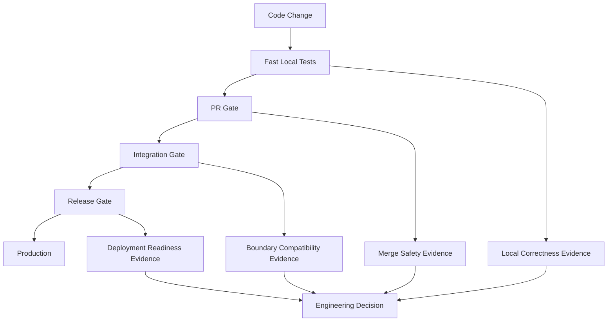
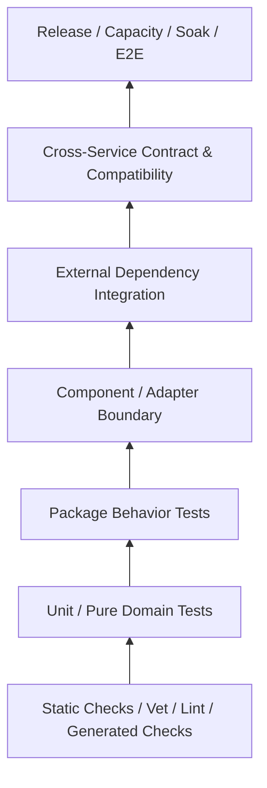
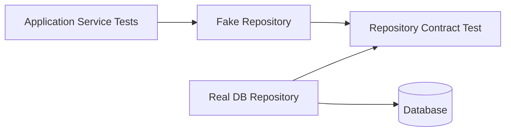
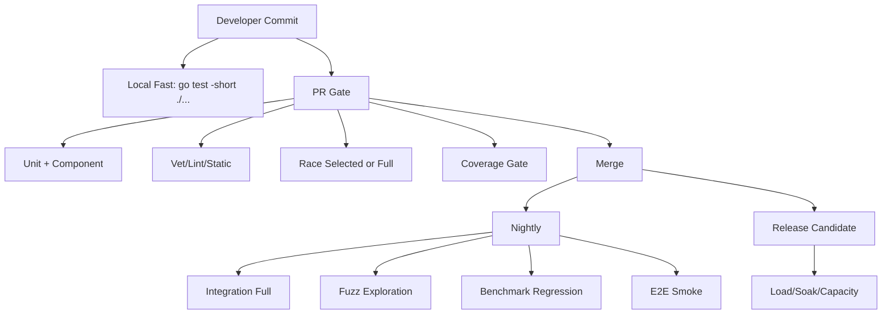
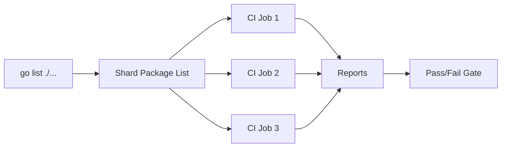
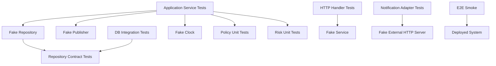
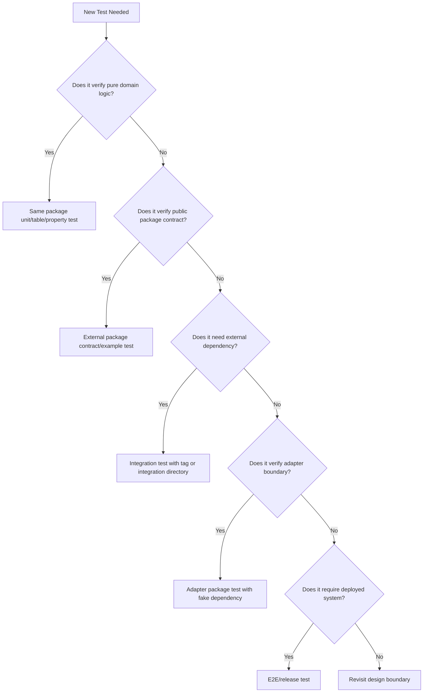

# learn-go-testing-benchmarking-performance-engineering-part-018.md

# Part 018 — Test Suite Architecture for Large Go Codebases

> Seri: **Go Testing, Benchmarking, Performance Engineering**  
> Target: Go hingga **1.26.x**  
> Audiens: Java software engineer / tech lead yang ingin membangun engineering discipline level production-grade  
> Fokus bagian ini: bagaimana menyusun test suite Go besar agar cepat, stabil, terukur, dapat dirawat, dan tidak berubah menjadi beban organisasi.

---

## 0. Posisi Part Ini Dalam Seri

Kita sudah membahas:

- model eksekusi `go test`,
- taxonomy test,
- desain kode yang testable,
- package `testing`,
- assertion strategy,
- table-driven tests,
- isolation/flakiness,
- golden tests,
- error/timeout/cancellation testing,
- deterministic testing,
- test doubles,
- HTTP testing,
- filesystem/process testing,
- dependency integration testing,
- concurrency testing,
- fuzz testing,
- coverage engineering.

Bagian ini menjawab pertanyaan yang lebih besar:

> Setelah semua teknik itu tersedia, bagaimana kita menyusun test suite untuk codebase Go besar agar tetap sustainable?

Masalah di codebase besar biasanya bukan kurang teknik. Masalahnya adalah **arsitektur test suite**:

- test terlalu lambat sehingga developer jarang menjalankan,
- test terlalu flaky sehingga orang mulai mengabaikan hasilnya,
- test terlalu coupled dengan implementasi sehingga refactor mahal,
- test tersebar tanpa pola sehingga susah menemukan coverage intent,
- test tidak punya ownership sehingga failure menjadi “punya semua orang”,
- integration test bercampur dengan unit test sehingga PR feedback lambat,
- package boundary buruk sehingga test memakai internal detail secara berlebihan,
- helper test menjadi framework tersembunyi yang lebih sulit dari production code.

Di Java enterprise, test suite sering dibangun dengan layer framework berat: Spring test context, JUnit extensions, Mockito, Testcontainers, fixture factory, object mother, abstract base class, custom runner, profiles, dynamic properties, dan sejenisnya.

Di Go, pendekatan yang lebih sehat biasanya:

- package-oriented,
- explicit,
- small helper,
- low ceremony,
- isolated by default,
- dependency boundary jelas,
- test cost terlihat dari command,
- test category dikendalikan dengan naming, flags, build tags, atau directory boundary.

---

## 1. Core Thesis

Arsitektur test suite yang baik bukan yang memiliki test terbanyak.

Arsitektur test suite yang baik adalah yang membuat organisasi mampu menjawab lima pertanyaan dengan cepat:

1. **Apa yang rusak?**
2. **Di boundary mana rusaknya?**
3. **Apakah ini bug produk, bug test, atau bug environment?**
4. **Siapa owner yang paling tepat memperbaiki?**
5. **Apakah aman untuk ship?**

Test suite bukan hanya kumpulan file `_test.go`. Ia adalah **evidence system**.



Jika test suite tidak membantu membuat keputusan, ia hanya ritual.

---

## 2. What Makes Large Go Test Suites Hard?

### 2.1 Package Boundary Menjadi Unit Arsitektur

Di Go, package bukan hanya namespace. Package adalah:

- compilation unit,
- test execution unit,
- visibility boundary,
- ownership boundary,
- API design pressure point,
- dependency boundary.

Perintah:

```bash
go test ./...
```

menjalankan test per package. Karena itu struktur package sangat memengaruhi struktur test suite.

Jika package terlalu besar:

- test lambat,
- setup berat,
- helper membesar,
- failure tidak spesifik,
- unrelated change memicu banyak test.

Jika package terlalu kecil:

- test terlalu banyak tersebar,
- API internal bocor,
- refactor package mahal,
- test harus banyak memakai exported surface.

Targetnya bukan package kecil atau besar secara dogmatis. Targetnya adalah **cohesive package dengan test boundary yang natural**.

---

### 2.2 Go Tidak Punya “Test Framework Container” Default

Go standard library memberikan package `testing`, bukan application test container.

Artinya, tim harus sengaja menentukan:

- bagaimana dependency test dibuat,
- di mana fixtures disimpan,
- apakah integration test pakai build tag,
- apakah slow test dipisah,
- bagaimana test helper dipakai,
- bagaimana external dependency di-start,
- bagaimana test data dibersihkan,
- bagaimana test suite dibagi di CI.

Ini lebih sedikit magic, tapi juga berarti disiplin arsitektur harus jelas.

---

### 2.3 Test Cost Sering Tidak Terlihat

Test suite besar gagal ketika biaya tidak eksplisit.

Contoh biaya tersembunyi:

- satu unit test diam-diam membuka database,
- helper test membuat HTTP server untuk setiap row table,
- `TestMain` melakukan migration berat untuk semua test package,
- test berjalan serial karena global state,
- golden file besar dibaca berulang,
- test memakai sleep 5 detik,
- fuzz regression corpus sangat besar masuk PR gate,
- integration container dibuat per test, bukan per package.

Arsitektur test suite harus membuat cost terlihat dari struktur.

---

## 3. The Testing Architecture Stack

Untuk codebase besar, pikirkan test suite sebagai stack berikut:



Semakin ke atas:

- confidence terhadap sistem nyata lebih tinggi,
- cost lebih tinggi,
- feedback lebih lambat,
- flakiness risk lebih besar,
- ownership lebih lintas tim,
- diagnostik root cause lebih sulit.

Karena itu jangan memaksa semua test masuk PR gate.

---

## 4. Core Layout Options in Go

Tidak ada satu layout mutlak. Tetapi ada beberapa pola utama.

---

## 4.1 Same-Package Tests

Contoh:

```text
case/
  evaluator.go
  evaluator_test.go   // package case
```

Isi file test:

```go
package casepkg

import "testing"

func TestEvaluatorApprovesEligibleCase(t *testing.T) {
    // can access unexported identifiers in same package
}
```

### Kapan Dipakai

Same-package tests cocok untuk:

- testing behavior package yang sebagian besar internal,
- state machine internal,
- parser internal,
- algorithm internal,
- package dengan unexported helper yang memang penting,
- refactor safety di dalam package.

### Kelebihan

- bisa access unexported identifiers,
- setup lebih mudah,
- cocok untuk low-level package,
- failure dekat dengan implementation.

### Risiko

- test terlalu implementation-coupled,
- test bisa menguji private detail alih-alih behavior,
- refactor internal bisa mahal karena banyak test pecah walau behavior tetap benar.

### Rule of Thumb

Gunakan same-package test ketika internal behavior memang bagian dari correctness risk.

Jangan gunakan same-package test hanya karena malas mendesain exported API yang bersih.

---

## 4.2 External Package Tests

Contoh:

```text
case/
  evaluator.go
  evaluator_external_test.go // package casepkg_test
```

Isi:

```go
package casepkg_test

import (
    "testing"

    "example.com/aceas/casepkg"
)

func TestEvaluatorPublicContract(t *testing.T) {
    evaluator := casepkg.NewEvaluator(...)
    _ = evaluator
}
```

### Kapan Dipakai

External tests cocok untuk:

- public API contract,
- package library,
- adapter package,
- consumer-facing behavior,
- preventing accidental reliance on internals.

### Kelebihan

- memaksa test memakai package seperti consumer nyata,
- mengurangi coupling ke implementation detail,
- bagus sebagai executable documentation,
- menjaga exported API ergonomics.

### Risiko

- sulit setup jika API terlalu tertutup,
- bisa mendorong export hanya demi test,
- kurang cocok untuk behavior internal yang kompleks.

### Rule of Thumb

Gunakan external tests untuk memastikan **public contract** benar.

Jika external tests sulit ditulis, jangan langsung export internal detail. Evaluasi apakah package boundary/design salah.

---

## 4.3 Mixed Same-Package and External Tests

Banyak package sehat memakai kombinasi:

```text
case/
  evaluator.go
  evaluator_test.go          // package casepkg
  evaluator_contract_test.go // package casepkg_test
```

Pola ini bagus ketika:

- ada invariant internal penting,
- ada public API contract penting,
- package cukup kritikal.

Pembagian intent:

| Test Type | Package | Intent |
|---|---|---|
| Internal behavior | same package | protect implementation-level invariant |
| Public contract | external package | protect consumer-visible semantics |
| Example test | external package | executable documentation |

---

## 4.4 Internal Test Packages

Go memiliki directory `internal/` untuk membatasi import ke parent tree.

Contoh:

```text
internal/
  testkit/
    clock.go
    http.go
    db.go
```

Import hanya bisa dilakukan oleh package dalam parent module tree.

### Kapan Dipakai

Cocok untuk shared test utilities yang:

- dipakai banyak package,
- tidak ingin dipublikasikan sebagai API,
- cukup umum tapi masih domain-specific,
- butuh menjaga boundary agar tidak dipakai consumer eksternal.

### Risiko

`internal/testkit` mudah berubah menjadi framework internal besar.

Atur dengan ketat:

- helper kecil,
- explicit dependency,
- tidak menyembunyikan failure,
- tidak membuat DSL berlebihan,
- tidak mengatur global state diam-diam.

---

## 4.5 Dedicated Integration Test Directory

Contoh:

```text
integration/
  db/
    case_repository_test.go
  queue/
    notification_worker_test.go
```

Atau:

```text
tests/
  integration/
  e2e/
  contract/
```

### Kapan Dipakai

Cocok ketika test:

- butuh multi-package orchestration,
- butuh external dependency,
- tidak natural berada di satu package,
- mahal untuk dijalankan,
- punya CI stage terpisah.

### Risiko

- bisa menjadi “dumping ground”,
- import graph bisa aneh,
- test jauh dari package owner,
- failure ownership kurang jelas.

### Rule

Jika integration test berada di top-level `integration/`, metadata ownership harus eksplisit:

- nama package/domain,
- dependency yang dibutuhkan,
- command untuk run,
- expected runtime,
- owner.

---

## 5. Recommended Large Codebase Layout

Untuk service Go besar, layout yang sehat bisa seperti ini:

```text
repo/
  cmd/
    api/
      main.go
    worker/
      main.go

  internal/
    caseapp/
      service.go
      service_test.go
      service_contract_test.go
    casepolicy/
      evaluator.go
      evaluator_test.go
    caseadapter/
      db/
        repository.go
        repository_test.go
      http/
        client.go
        client_test.go
    testkit/
      clock/
      httptestx/
      dbtest/
      asserttest/

  api/
    openapi.yaml
    contract_test.go

  testdata/
    shared-fixtures/

  integration/
    db/
    queue/
    external/

  e2e/
    smoke/
    release/

  go.mod
  Makefile
```

Namun layout ini bukan template universal. Yang penting adalah intent-nya:

| Area | Purpose |
|---|---|
| `internal/<domain>` | domain/application behavior tests |
| `internal/<adapter>` | adapter boundary tests |
| `internal/testkit` | reusable test helpers |
| `integration/` | external dependency orchestration |
| `e2e/` | deployed/system-level scenarios |
| `testdata/` | stable input/expected files |
| `api/contract_test.go` | API compatibility evidence |

---

## 6. Naming Conventions That Scale

Nama test adalah indexing system.

Test suite besar harus searchable.

### 6.1 File Naming

Gunakan nama file yang menunjukkan scope:

```text
evaluator_test.go
repository_test.go
handler_test.go
client_test.go
policy_matrix_test.go
contract_test.go
integration_test.go
fuzz_test.go
benchmark_test.go
example_test.go
```

Hindari:

```text
test.go
common_test.go
test_utils_test.go
all_test.go
misc_test.go
```

Nama buruk menyebabkan ownership buruk.

---

### 6.2 Function Naming

Gunakan nama behavior:

```go
func TestEvaluatorRejectsExpiredLicense(t *testing.T) {}
func TestRepositoryReturnsNotFoundForMissingCase(t *testing.T) {}
func TestHandlerMapsValidationErrorToBadRequest(t *testing.T) {}
```

Hindari:

```go
func TestEvaluator(t *testing.T) {}
func TestCase1(t *testing.T) {}
func TestHappyPath(t *testing.T) {}
```

Di suite besar, `TestHappyPath` tidak searchable.

---

### 6.3 Subtest Naming

Subtest name harus menjadi diagnostic path.

```go
t.Run("expired_license/default_denied", func(t *testing.T) {})
t.Run("active_license/approved", func(t *testing.T) {})
t.Run("missing_permission/forbidden", func(t *testing.T) {})
```

Saat gagal:

```text
--- FAIL: TestEvaluateCase/expired_license/default_denied
```

Ini langsung memberi konteks.

---

## 7. Build Tags for Test Architecture

Build tags berguna untuk memisahkan kategori test yang tidak seharusnya selalu berjalan.

Contoh file:

```go
//go:build integration

package db_test

import "testing"

func TestRepositoryWithPostgres(t *testing.T) {
    // requires real database/container
}
```

Run:

```bash
go test -tags=integration ./...
```

### 7.1 Kapan Build Tags Cocok

Cocok untuk test yang:

- butuh dependency eksternal,
- lambat,
- membutuhkan credential lokal,
- membutuhkan platform tertentu,
- tidak aman masuk PR fast gate,
- punya CI stage khusus.

### 7.2 Kapan Build Tags Tidak Cocok

Tidak cocok untuk menyembunyikan test flaky.

Jika test penting tapi flaky, solve flakiness. Jangan hanya pindahkan ke tag `slow` lalu dilupakan.

---

## 8. Short Tests vs Long Tests

Go menyediakan convention `testing.Short()`.

Contoh:

```go
func TestLargeCorpus(t *testing.T) {
    if testing.Short() {
        t.Skip("skipping large corpus test in short mode")
    }

    // expensive test
}
```

Run fast mode:

```bash
go test -short ./...
```

### 8.1 Good Use

`testing.Short()` cocok untuk:

- large corpus,
- longer randomized test,
- expensive integration scenario,
- repeated stress path,
- test yang masih deterministic tapi mahal.

### 8.2 Bad Use

Jangan gunakan `testing.Short()` untuk:

- test yang kadang gagal,
- test yang bergantung external service tanpa deklarasi,
- test yang failure-nya tidak dipahami,
- test yang seharusnya cepat tapi lambat karena desain buruk.

---

## 9. Test Categories and Command Profiles

Codebase besar butuh command profile yang jelas.

### 9.1 Local Fast

```bash
go test -short ./...
```

Tujuan:

- feedback cepat,
- dipakai sebelum commit,
- tidak butuh dependency eksternal.

### 9.2 Local Full Unit/Component

```bash
go test ./...
```

Tujuan:

- full deterministic package tests,
- masih tidak butuh external infra berat.

### 9.3 Race Gate

```bash
go test -race ./...
```

Tujuan:

- concurrency safety,
- bisa lebih lambat,
- biasanya PR atau nightly tergantung cost.

### 9.4 Integration Gate

```bash
go test -tags=integration ./...
```

Tujuan:

- verify adapter/dependency behavior,
- bisa butuh container atau test env.

### 9.5 Fuzz Regression

```bash
go test ./... -run=Fuzz
```

Tujuan:

- run existing fuzz regression corpus sebagai normal test.

Actual fuzz exploration:

```bash
go test ./... -fuzz=Fuzz -fuzztime=30s
```

Biasanya tidak dijalankan penuh di setiap PR.

### 9.6 Benchmark Smoke

```bash
go test ./... -run='^$' -bench=. -benchtime=100ms
```

Tujuan:

- memastikan benchmark compile dan tidak panic,
- bukan untuk decision performance final.

---

## 10. Test Ownership Model

Test tanpa owner akan membusuk.

Ownership bisa per:

- package,
- domain,
- service,
- adapter,
- CI stage,
- external contract.

Contoh metadata sederhana di `README.md` per test area:

```markdown
# integration/db

Owner: Platform Persistence Team
Dependencies: PostgreSQL test container
Run: go test -tags=integration ./integration/db/...
Expected runtime: < 3 minutes
Failure means: repository/schema/transaction compatibility may be broken
```

Untuk tim kecil, metadata bisa cukup di docs. Untuk tim besar, bisa dipantau di CI config.

---

## 11. Avoiding Test Cycles

Go melarang import cycle. Ini bagus, tapi test bisa mendorong struktur buruk.

Contoh masalah:

```text
internal/caseapp imports internal/caseadapter/db
internal/caseadapter/db tests want to import internal/caseapp test helper
```

Jika helper di package application dipakai adapter test, dependency arah menjadi kacau.

### 11.1 Rule

Shared test helper harus ditempatkan di boundary yang tidak menciptakan arah dependency salah.

Contoh:

```text
internal/testkit/casefixture
internal/testkit/dbtest
```

Namun jangan semua fixture domain disatukan menjadi monster package.

---

## 12. Test Helper Architecture

Helper test adalah production code untuk test. Ia perlu desain.

### 12.1 Good Helper

Good helper:

- kecil,
- explicit,
- gagal dengan pesan jelas,
- memakai `t.Helper()`,
- menerima `testing.TB`,
- tidak menyembunyikan side effect,
- tidak global mutable state,
- tidak membuat dependency mahal tanpa terlihat.

Contoh:

```go
func MustParseTime(t testing.TB, value string) time.Time {
    t.Helper()

    parsed, err := time.Parse(time.RFC3339, value)
    if err != nil {
        t.Fatalf("parse test time %q: %v", value, err)
    }
    return parsed
}
```

### 12.2 Bad Helper

```go
func SetupEverything(t *testing.T) *App {
    // starts db, queue, http server, background workers,
    // loads env, mutates globals, runs migrations,
    // creates users, suppresses errors
}
```

Masalah:

- cost tidak terlihat,
- failure sulit didiagnosis,
- semua test bergantung ke setup besar,
- refactor helper memecahkan banyak test,
- test menjadi integration test tanpa sadar.

### 12.3 Helper Layering

Buat helper bertingkat tetapi explicit:

```text
asserttest/   -> assertion helpers
fixture/      -> domain object builders
clocktest/    -> fake clock
dbtest/       -> database harness
httptestx/    -> HTTP helper
queuetest/    -> queue harness
```

Jangan buat satu package `testutil` yang berisi semuanya.

---

## 13. Fixture Architecture

Fixture adalah salah satu sumber test rot terbesar.

### 13.1 Fixture Types

| Fixture Type | Example | Risk |
|---|---|---|
| Inline literal | struct in test | verbose but clear |
| Builder | `NewCaseBuilder().Expired()` | can hide defaults |
| Golden file | expected JSON | drift risk |
| SQL fixture | seed data | cleanup/isolation risk |
| Object mother | `Mother.ValidCase()` | becomes global implicit state |
| Factory | creates unique data | complexity |

### 13.2 Prefer Intent-Revealing Fixtures

Bad:

```go
caseRecord := Case{
    ID: "C-001",
    Status: "A",
    Type: "X",
    Field1: "Y",
    Field2: 123,
    Field3: true,
}
```

Better:

```go
caseRecord := fixture.Case().
    WithStatus(casepkg.StatusSubmitted).
    WithExpiredLicense().
    Build()
```

But only if builder does not hide too much.

### 13.3 Fixture Defaults Must Be Documented

A builder with invisible defaults can become dangerous.

Good builder exposes intent:

```go
func ValidSubmittedCase() Case {
    return Case{
        ID:        "case-001",
        Status:    StatusSubmitted,
        License:   ActiveLicense(),
        Applicant: ValidApplicant(),
    }
}
```

Then tests override only relevant dimensions.

---

## 14. Test Data Management

### 14.1 Use `testdata` for Stable Inputs

Go tooling ignores directories named `testdata` for package compilation.

Good uses:

- golden files,
- sample payloads,
- certificates for tests,
- invalid input corpus,
- fuzz seed corpus,
- CLI expected output,
- compatibility samples.

Example:

```text
internal/caseparser/
  parser.go
  parser_test.go
  testdata/
    valid-case.json
    invalid-missing-id.json
    golden-normalized.json
```

### 14.2 Keep Test Data Local When Possible

Prefer package-local `testdata` over global `testdata` if data is specific to one package.

Global testdata is acceptable for:

- shared protocol samples,
- public contract examples,
- large compatibility corpus.

### 14.3 Avoid Mutable Testdata

Tests should not modify checked-in testdata.

If mutation needed:

- copy into `t.TempDir()`,
- mutate temp copy,
- keep original immutable.

---

## 15. Package-Level Test Design Patterns

### 15.1 Domain Package

Example:

```text
internal/casepolicy/
  policy.go
  policy_test.go
```

Test style:

- table-driven,
- pure inputs/outputs,
- no external dependency,
- extensive boundary cases,
- fast and parallelizable.

Command expectation:

```bash
go test ./internal/casepolicy
```

should finish quickly.

---

### 15.2 Application Service Package

Example:

```text
internal/caseapp/
  service.go
  service_test.go
```

Test style:

- fake repositories,
- fake clock,
- fake event publisher,
- verify state transition and side effects,
- no real DB unless integration tag.

---

### 15.3 Adapter Package

Example:

```text
internal/caseadapter/db/
  repository.go
  repository_test.go
  repository_integration_test.go //go:build integration
```

Test style:

- pure unit tests for SQL generation if applicable,
- integration tests for real DB behavior,
- contract tests shared with fake repository.

---

### 15.4 HTTP Handler Package

Example:

```text
internal/caseadapter/http/
  handler.go
  handler_test.go
```

Test style:

- `httptest`,
- fake application service,
- request/response matrix,
- auth context injection,
- error mapping.

---

### 15.5 Worker Package

Example:

```text
internal/caseworker/
  worker.go
  worker_test.go
```

Test style:

- fake queue,
- fake clock,
- controlled context,
- retry/backoff without real sleep,
- ack/nack assertions,
- goroutine lifecycle checks.

---

## 16. Contract Tests as Architecture Glue

Contract tests prevent fake and real implementations from drifting.

Example interface:

```go
type CaseRepository interface {
    Save(ctx context.Context, c Case) error
    Find(ctx context.Context, id CaseID) (Case, error)
}
```

Shared contract test:

```go
type RepositoryHarness struct {
    Name string
    New  func(t testing.TB) CaseRepository
}

func TestCaseRepositoryContract(t *testing.T, h RepositoryHarness) {
    t.Helper()

    t.Run(h.Name+"/save_then_find", func(t *testing.T) {
        repo := h.New(t)

        want := ValidSubmittedCase()
        if err := repo.Save(context.Background(), want); err != nil {
            t.Fatalf("Save() error = %v", err)
        }

        got, err := repo.Find(context.Background(), want.ID)
        if err != nil {
            t.Fatalf("Find() error = %v", err)
        }

        if got.ID != want.ID {
            t.Fatalf("Find() ID = %v, want %v", got.ID, want.ID)
        }
    })
}
```

Fake repo test:

```go
func TestFakeRepositoryContract(t *testing.T) {
    TestCaseRepositoryContract(t, RepositoryHarness{
        Name: "fake",
        New: func(t testing.TB) CaseRepository {
            return NewFakeRepository()
        },
    })
}
```

Real repo integration test:

```go
//go:build integration

func TestPostgresRepositoryContract(t *testing.T) {
    TestCaseRepositoryContract(t, RepositoryHarness{
        Name: "postgres",
        New: func(t testing.TB) CaseRepository {
            return NewPostgresRepository(dbtest.Open(t))
        },
    })
}
```

This pattern is powerful because it aligns:

- unit fake behavior,
- real adapter behavior,
- service expectations.



---

## 17. Avoiding Over-Centralized Test Frameworks

A common failure mode:

```text
internal/testframework/
  app.go
  database.go
  queue.go
  auth.go
  fixtures.go
  assertions.go
  everything.go
```

Then every test starts with:

```go
app := testframework.New(t)
```

This feels productive at first. Later it causes:

- hidden cost,
- accidental integration tests,
- global coupling,
- slow startup,
- hard-to-understand failures,
- impossible parallelism,
- hard refactoring.

Prefer small test kits:

```text
internal/testkit/dbtest
internal/testkit/httptestx
internal/testkit/clocktest
internal/testkit/asserttest
internal/testkit/fixture
```

The test should assemble what it needs explicitly.

---

## 18. Test Parallelism Strategy at Suite Level

Parallelism is not just `t.Parallel()`.

Suite-level parallelism includes:

- packages run in parallel by `go test`,
- tests inside package can use `t.Parallel`,
- CI can shard package lists,
- integration dependencies may limit concurrency,
- database/schema isolation may determine safe parallelism.

### 18.1 Package-Level Parallelism

`go test ./...` can test multiple packages. Package-level independence matters.

If many packages share global external resource, package parallelism becomes dangerous.

### 18.2 Test-Level Parallelism

Use `t.Parallel()` for tests that:

- do not mutate globals,
- do not share env vars,
- use isolated temp dir,
- use unique DB schema/namespace,
- use unique ports or `httptest.Server`,
- do not depend on order.

### 18.3 Integration Test Parallelism

For integration tests, prefer explicit control.

Example:

```bash
go test -tags=integration -p=2 ./integration/...
```

`-p` controls number of packages tested in parallel.

This can prevent DB/container overload.

---

## 19. CI-Aware Test Suite Architecture

A mature Go codebase usually has multiple CI lanes.



### 19.1 PR Gate

Should be:

- fast,
- deterministic,
- high signal,
- low external dependency,
- owner-clear.

Typical:

```bash
go test -short ./...
go test -race ./internal/...    # maybe selected
```

### 19.2 Nightly Gate

Can include:

- full integration,
- fuzz exploration,
- long-running regression,
- benchmark comparison,
- race full suite.

### 19.3 Release Gate

Can include:

- deployment smoke,
- E2E,
- contract compatibility,
- load/stress/soak,
- migration tests,
- rollback tests.

---

## 20. Test Sharding Strategy

As repository grows, `go test ./...` may become too slow.

Sharding can be done by package list.

Example:

```bash
go list ./... > packages.txt
```

Then split package list across CI jobs.

Important constraints:

- shard by package, not individual tests, unless necessary,
- keep package logs separate,
- aggregate coverage carefully,
- avoid shared external resource collision,
- preserve deterministic package ordering where needed.

A simple architecture:



---

## 21. Large Monorepo Considerations

In monorepo, test architecture needs more structure.

### 21.1 Module Boundaries

Options:

- one Go module,
- multiple Go modules,
- Go workspace (`go.work`) for local development.

Each affects:

- `go test ./...` scope,
- dependency versioning,
- CI package discovery,
- test helper sharing,
- module cache behavior.

### 21.2 Changed Package Testing

For large repo, run:

- changed package tests,
- reverse dependency package tests,
- full nightly tests.

But be careful: behavior can break in packages not directly changed due to shared contracts/config/generated files.

### 21.3 Avoid Cross-Service Test Coupling

If service A tests require service B internals, boundary is wrong.

Use:

- contract tests,
- API fixtures,
- fake external service,
- deployed E2E only where necessary.

---

## 22. Handling Generated Code

Generated code appears in:

- protobuf,
- OpenAPI clients,
- SQL query builders,
- mocks,
- stringers,
- templated code.

Testing strategy:

1. Do not unit test generated code line-by-line.
2. Test generator input/output contract.
3. Test integration behavior at boundary.
4. Keep generated code deterministic.
5. Add CI check that generated files are up-to-date.

Example command:

```bash
go generate ./...
git diff --exit-code
```

This is a test of repository consistency.

---

## 23. Build Tags and Platform Matrix

Go tests may behave differently across:

- Linux,
- Windows,
- macOS,
- amd64,
- arm64,
- cgo enabled/disabled,
- race supported/not supported,
- filesystem semantics.

Use file suffixes and build tags intentionally:

```text
file_unix_test.go
file_windows_test.go
lock_linux_test.go
integration_test.go //go:build integration
```

Platform-specific tests should make the reason obvious.

---

## 24. Avoiding Test Pollution from Globals

Global state includes:

- env vars,
- current working directory,
- package-level variables,
- default logger,
- default HTTP client,
- default mux,
- global random source,
- time zone,
- process signal handlers,
- temporary OS state,
- singleton caches.

Architecture rule:

> Production code may have globals only at the outer composition root. Testable packages should accept dependencies explicitly.

In tests:

- use `t.Setenv`,
- avoid `os.Chdir` unless wrapped with cleanup,
- avoid `http.DefaultServeMux`,
- avoid mutating package globals,
- prefer constructor-scoped dependencies.

---

## 25. Test Suite Documentation

Large suite needs docs, but docs should be operational.

Minimum docs:

```markdown
# Testing

## Local Fast
`go test -short ./...`

## Full Local
`go test ./...`

## Race
`go test -race ./...`

## Integration
`go test -tags=integration ./...`

## Fuzz Regression
`go test ./... -run=Fuzz`

## Benchmark Smoke
`go test ./... -run='^$' -bench=. -benchtime=100ms`

## Test Categories
- Unit/component: default
- Integration: build tag `integration`
- Slow deterministic tests: skip under `testing.Short()`
- E2E: `/e2e`, release gate only
```

Docs must answer:

- how to run,
- expected runtime,
- required dependency,
- what failure means,
- who owns failures.

---

## 26. Test Review Checklist for Large Codebases

When reviewing a PR, ask:

### 26.1 Placement

- Is the test in the right package?
- Is it same-package because internal detail matters, or just convenience?
- Should this be external package contract test?
- Should this be integration-tagged?

### 26.2 Cost

- Does the test use network/database/filesystem unnecessarily?
- Does it sleep?
- Does it create expensive setup per row?
- Can it run in parallel?

### 26.3 Isolation

- Does it mutate global env/state?
- Does it use unique temp dir/schema/namespace?
- Does cleanup always run?
- Is it order-independent?

### 26.4 Diagnostic Quality

- Would failure tell us what broke?
- Are subtest names meaningful?
- Are assertion messages specific?
- Does helper use `t.Helper()`?

### 26.5 Maintenance

- Is fixture intent visible?
- Is test coupled to implementation detail?
- Is a fake drifting from real implementation?
- Should contract tests be added?

---

## 27. Anti-Patterns

### 27.1 One Giant Test Utility Package

```text
internal/testutil
```

with hundreds of functions.

Problem:

- no ownership,
- unclear cost,
- import soup,
- hidden coupling.

Better: small focused packages.

---

### 27.2 Integration Tests Masquerading as Unit Tests

A test named unit test but it opens DB, queue, and network.

Problem:

- local feedback slow,
- CI flaky,
- developer loses trust.

Better: tag integration or refactor boundary.

---

### 27.3 TestMain as Global Application Bootstrap

`TestMain` should not become mini production boot.

Bad:

```go
func TestMain(m *testing.M) {
    StartEverything()
    os.Exit(m.Run())
}
```

Better:

- setup only what all tests in package need,
- prefer per-test setup with cleanup,
- keep dependencies explicit.

---

### 27.4 Tests That Require Specific Local Machine State

Examples:

- assumes timezone,
- assumes `/tmp/foo`,
- assumes port 8080 free,
- assumes local PostgreSQL running,
- assumes env var from developer laptop.

Better:

- explicit config,
- temp resources,
- `httptest.Server`,
- build tags,
- container/test harness.

---

### 27.5 Over-Mocking Across Package Boundaries

If every package mocks every other package, tests validate interaction scripts, not behavior.

Better:

- mock external boundary,
- fake stable domain port,
- contract test fake vs real,
- use real pure domain code.

---

## 28. Case Study: Regulatory Case Management Service

Suppose we have workflow:

- case submitted,
- eligibility checked,
- risk scored,
- officer assigned,
- SLA timer started,
- notification emitted,
- audit event persisted.

### 28.1 Package Layout

```text
internal/
  casepolicy/
    eligibility.go
    eligibility_test.go
  risk/
    scorer.go
    scorer_test.go
  caseapp/
    submit_service.go
    submit_service_test.go
  caseadapter/
    db/
      repository.go
      repository_integration_test.go
    notification/
      publisher.go
      publisher_test.go
    http/
      submit_handler.go
      submit_handler_test.go
  testkit/
    fixture/
    clocktest/
    dbtest/
    asserttest/
```

### 28.2 Test Architecture



### 28.3 Gate Placement

| Test | Gate |
|---|---|
| `casepolicy` tests | PR fast |
| `risk` tests | PR fast |
| `caseapp` with fakes | PR fast |
| handler tests | PR fast |
| repository contract fake | PR fast |
| DB repository integration | PR or nightly depending cost |
| notification adapter with fake server | PR fast |
| deployed E2E | release/nightly |
| load/soak | release/perf gate |

This gives broad confidence without making every PR depend on the full world.

---

## 29. How to Decide Where a Test Belongs

Use this decision tree:



If you cannot place a test cleanly, your package boundary may be unclear.

---

## 30. Practical Baseline Commands

Put these in `Makefile`, `Taskfile`, or script.

```makefile
.PHONY: test-fast
test-fast:
	go test -short ./...

.PHONY: test-full
test-full:
	go test ./...

.PHONY: test-race
test-race:
	go test -race ./...

.PHONY: test-integration
test-integration:
	go test -tags=integration ./...

.PHONY: test-coverage
test-coverage:
	go test -coverprofile=coverage.out ./...
	go tool cover -func=coverage.out

.PHONY: test-fuzz-regression
test-fuzz-regression:
	go test ./... -run=Fuzz

.PHONY: bench-smoke
bench-smoke:
	go test ./... -run='^$$' -bench=. -benchtime=100ms
```

For Windows PowerShell users, similar commands:

```powershell
go test -short ./...
go test ./...
go test -race ./...
go test -tags=integration ./...
go test -coverprofile=coverage.out ./...
go tool cover -func=coverage.out
go test ./... -run=Fuzz
go test ./... -run='^$' -bench=. -benchtime=100ms
```

---

## 31. What “Good” Looks Like

A good large Go test suite has these traits:

1. Most tests are fast and deterministic.
2. Expensive tests are explicitly categorized.
3. Package boundary and test boundary reinforce each other.
4. Test names explain behavior.
5. Helper packages are small and explicit.
6. Fixtures reveal intent.
7. Fakes are contract-tested against real implementations.
8. Integration tests own external lifecycle cleanly.
9. CI gates are staged by confidence/cost.
10. Flaky tests are treated as production defects in the evidence system.

---

## 32. Exercises

### Exercise 1 — Classify Test Suite

Take an existing Go package and classify every test into:

- pure unit,
- package behavior,
- component,
- adapter,
- integration,
- contract,
- E2E,
- benchmark,
- fuzz regression.

Then ask:

- Is its placement correct?
- Is its command profile clear?
- Is its owner clear?

---

### Exercise 2 — Refactor `testutil`

If you have a large `testutil` package, split it into:

- `asserttest`,
- `fixture`,
- `clocktest`,
- `httptestx`,
- `dbtest`,
- `queuetest`.

Document which one is allowed in fast tests and which one is integration-only.

---

### Exercise 3 — Add Contract Tests

Pick one interface with both fake and real implementation.

Create shared contract tests and run them against:

- fake implementation,
- in-memory implementation,
- real database/external implementation.

Observe drift.

---

### Exercise 4 — Design CI Lanes

Create command profiles:

- local fast,
- PR full,
- race,
- integration,
- nightly fuzz,
- benchmark smoke,
- release E2E.

For each, define:

- expected runtime,
- owner,
- failure meaning,
- retry policy.

---

## 33. Key Takeaways

- In Go, package architecture and test suite architecture are tightly coupled.
- Same-package tests protect internal invariants; external-package tests protect public contracts.
- Test categories should be visible from structure, command, tag, or docs.
- `internal/testkit` is useful but must not become hidden framework.
- Build tags and `testing.Short()` are architectural tools, not dumping grounds.
- Test data should be local, stable, immutable, and intent-revealing.
- Contract tests are one of the best tools for preventing fake/real drift.
- CI should stage evidence by cost and confidence.
- A large test suite is healthy when failure is diagnostic, ownership is clear, and local feedback remains fast.

---

## 34. Preview Part 019

Part berikutnya akan membahas:

# CI/CD Test Strategy: Fast Feedback, Quarantine, Sharding, Caching & Quality Gates

Kita akan masuk lebih dalam ke:

- PR gate design,
- nightly gate,
- release gate,
- test caching,
- flaky quarantine,
- sharding,
- artifact retention,
- coverage report,
- race/fuzz schedule,
- test cost governance,
- engineering policy untuk quality gates.

---

## 35. References

Referensi utama untuk bagian ini:

- Go package `testing` documentation.
- `go help test` and `go help testflag`.
- Go command documentation for package patterns and test cache behavior.
- Go documentation on build constraints.
- Go documentation on coverage integration.
- Go fuzzing documentation.
- Go race detector documentation.
- Go project conventions around `testdata` directories.

<!-- NAVIGATION_FOOTER -->
<div class="page-nav">
<a href="./learn-go-testing-benchmarking-performance-engineering-part-017.md">⬅️ Part 017 — Coverage Engineering: Statement Coverage, Integration Coverage, Meaningful Quality Gates</a>
<a href="./index.md">📚 Kategori</a>
<a href="../../index.md">🏠 Home</a>
<a href="./learn-go-testing-benchmarking-performance-engineering-part-019.md">Part 019 — CI/CD Test Strategy: Fast Feedback, Quarantine, Sharding, Caching & Quality Gates ➡️</a>
</div>
