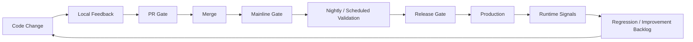
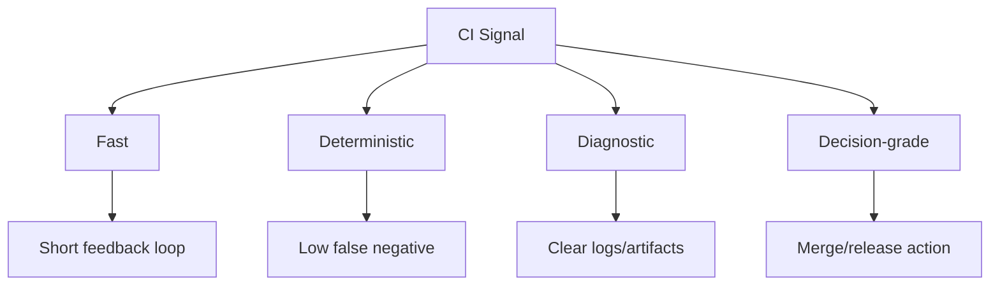
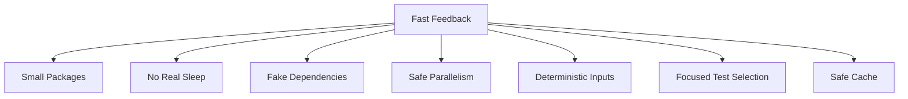
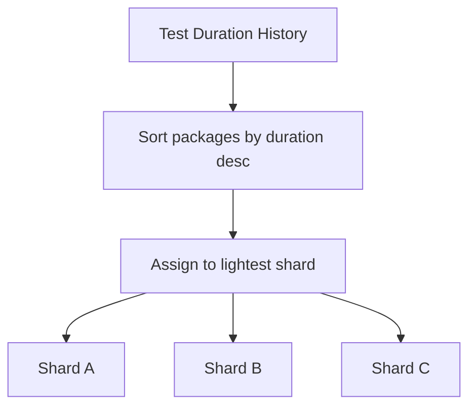
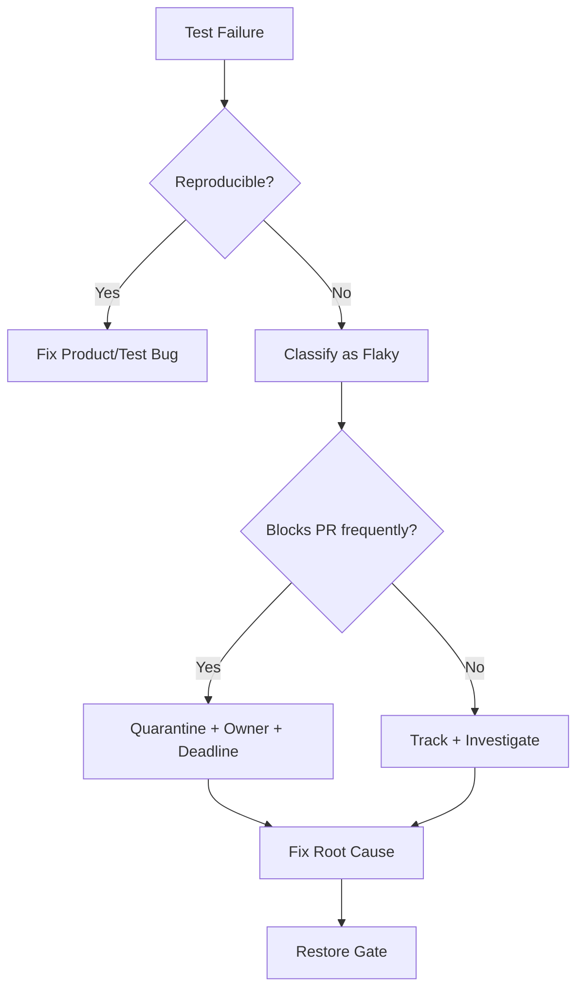
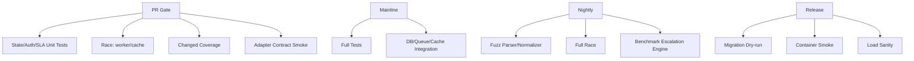

# learn-go-testing-benchmarking-performance-engineering-part-019.md

# Part 019 — CI/CD Test Strategy: Fast Feedback, Quarantine, Sharding, Caching & Quality Gates

> Seri: **Go Testing, Benchmarking, Performance Engineering**  
> Target pembaca: **Java software engineer / tech lead yang ingin membangun quality engineering program Go tingkat production-grade**  
> Target Go: **Go 1.26.x**  
> Fokus part ini: **bagaimana menempatkan test, race, fuzz, coverage, integration test, benchmark, dan quality gate ke dalam pipeline CI/CD yang cepat, stabil, dan defensible**.

---

## 0. Posisi Part Ini Dalam Seri

Pada part sebelumnya kita sudah membahas:

- desain kode agar testable;
- primitive `testing`;
- assertion;
- table-driven test;
- subtests dan parallelism;
- golden tests;
- error/timeout/cancellation tests;
- deterministic tests;
- test doubles;
- HTTP/OS/integration/concurrency/fuzz/coverage testing;
- arsitektur test suite untuk codebase besar.

Part ini menjawab pertanyaan berikut:

> “Setelah semua jenis test itu ada, bagaimana kita menjalankannya dalam CI/CD agar memberi feedback cepat, tidak flaky, tidak terlalu mahal, tapi tetap cukup kuat untuk melindungi production?”

Ini bukan sekadar membuat YAML GitHub Actions/GitLab CI/Jenkins.

Yang jauh lebih penting adalah **test execution policy**:

- test apa yang wajib jalan di setiap PR;
- test apa yang boleh nightly;
- test apa yang hanya pre-release;
- test apa yang boleh fail-open;
- test apa yang wajib fail-closed;
- kapan test dianggap flaky;
- kapan test harus dikarantina;
- bagaimana sharding dilakukan;
- bagaimana cache aman dipakai;
- bagaimana hasil test menjadi decision signal, bukan noise.

---

## 1. Mental Model: CI/CD Bukan “Tempat Menjalankan Semua Test”

CI/CD bukan tempat membuang semua test lalu berharap quality naik.

CI/CD adalah **risk filtering system**.



Setiap stage punya trade-off:

| Stage | Tujuan | Harus cepat? | Harus lengkap? | Contoh |
|---|---:|---:|---:|---|
| Local | developer feedback | sangat | tidak | package unit test, focused run |
| PR gate | prevent obvious regression | sangat | cukup | unit, component, selected integration, lint/vet |
| Mainline | protect branch utama | cepat | lebih luas | all package test, race subset, coverage |
| Nightly | deep validation | tidak terlalu | luas | full integration, fuzz, race full, slow tests |
| Release | deploy confidence | sedang | risk-based | E2E, smoke, migration, perf sanity |
| Production | real behavior | real-time | real | SLO, errors, latency, saturation |

Kesalahan umum:

> “Semakin banyak test di PR gate, semakin aman.”

Tidak selalu.

Kalau PR gate terlalu lambat:

- developer batch change lebih besar;
- feedback terlambat;
- rerun meningkat;
- flaky test makin sering diabaikan;
- tim mulai menekan tombol “rerun” sebagai ritual;
- CI kehilangan kredibilitas.

Quality gate yang baik harus **cepat, relevan, deterministik, dan actionable**.

---

## 2. CI/CD Quality Signal Harus Punya Empat Sifat

Sebuah sinyal CI yang baik harus:

1. **Fast** — cukup cepat agar developer masih ingat perubahan yang dibuat.
2. **Deterministic** — hasil sama untuk input yang sama.
3. **Diagnostic** — saat gagal, root cause bisa dipersempit.
4. **Decision-grade** — hasilnya bisa dipakai untuk keputusan merge/release.



Jika test lambat tapi penting, jangan otomatis dibuang. Letakkan di stage berbeda.

Jika test cepat tapi flaky, jangan dibiarkan di PR gate.

Jika test penting tapi tidak diagnostik, perbaiki harness/log/artifact-nya.

---

## 3. Go-Specific CI Reality

Go punya beberapa sifat yang membuat CI strategy berbeda dari Java/Maven/Gradle ecosystem.

### 3.1 Package adalah unit eksekusi utama

`go test ./...` menjalankan test per package. Ini berbeda dari model test suite global seperti banyak proyek Java.

Implikasi:

- package boundary memengaruhi parallelism;
- test helper harus tidak menciptakan import cycle;
- slow package akan menjadi bottleneck;
- package dengan banyak integration test bisa mendominasi waktu pipeline;
- package naming dan layout memengaruhi sharding.

### 3.2 Go test punya build cache dan test cache

Go command punya build cache dan test cache. Hasil test yang sukses dapat di-cache dalam kondisi tertentu. `go clean -testcache` dapat menghapus cached test result. Flag seperti `-count=1` lazim dipakai saat kita ingin memaksa test benar-benar dijalankan.

Prinsipnya:

- cache mempercepat feedback;
- cache bisa menipu jika test punya hidden dependency ke env, waktu, file eksternal, network, atau service state;
- deterministic test aman dengan cache;
- nondeterministic test berbahaya dengan cache.

### 3.3 Race detector mahal tapi berharga

`go test -race` mengubah karakteristik runtime dan memperlambat test. Jangan asal menjalankannya untuk semua package di setiap PR jika cost terlalu tinggi. Namun untuk package concurrency-heavy, race detector adalah gate penting.

### 3.4 Fuzzing bukan PR gate reguler

Go fuzzing bagus untuk menemukan input yang memperluas coverage dan crash. Tetapi fuzzing eksploratif dengan durasi panjang biasanya lebih cocok untuk scheduled job, bukan setiap PR.

PR gate lebih cocok menjalankan:

```bash
 go test ./... -run=Fuzz -fuzz=FuzzXxx -fuzztime=5s
```

atau sekadar memastikan corpus regression tetap pass via normal `go test`.

### 3.5 Benchmark bukan pass/fail test biasa

Benchmark hasilnya noisy. Jangan membuat PR fail karena benchmark satu kali naik 3% di shared runner.

Benchmark perlu:

- repeated runs;
- controlled environment;
- baseline;
- statistical comparison;
- threshold;
- dedicated runner jika serius.

---

## 4. CI Stage Design Untuk Go Codebase

Satu pipeline yang sehat biasanya dibagi menjadi beberapa layer.

```mermaid
flowchart TD
    PR[Pull Request] --> Lint[Format / Vet / Static Checks]
    PR --> Unit[Fast Unit + Component Tests]
    PR --> IntS[Selected Integration Tests]
    PR --> Cov[Changed Coverage / Risk Coverage]

    Merge[Merge to Main] --> All[All Tests]
    Merge --> RaceSubset[Race Subset]
    Merge --> Build[Build Artifacts]

    Nightly[Nightly] --> RaceFull[Full Race]
    Nightly --> Fuzz[Fuzzing]
    Nightly --> Slow[Slow Integration / E2E]
    Nightly --> Perf[Benchmark Regression]

    Release[Release Gate] --> Smoke[Smoke]
    Release --> Mig[Migration/Compatibility]
    Release --> Capacity[Perf Sanity / Capacity Check]
```



---

## 5. Recommended Gate Matrix

Berikut matrix awal yang bisa dipakai untuk Go service/library besar.

| Check | Local | PR | Main | Nightly | Release | Fail policy |
|---|---:|---:|---:|---:|---:|---|
| `gofmt` / `go fmt` | yes | yes | yes | no | yes | fail-closed |
| `go vet` | optional | yes | yes | no | yes | fail-closed |
| `go test ./...` fast | yes | yes | yes | yes | yes | fail-closed |
| `go test -short ./...` | yes | yes | yes | no | no | fail-closed |
| selected integration | optional | yes | yes | yes | yes | fail-closed if deterministic |
| full integration | no | maybe | yes | yes | yes | fail-closed main/release |
| `go test -race` subset | optional | yes for risky packages | yes | yes | maybe | fail-closed for owned package |
| `go test -race ./...` | no | usually no | maybe | yes | maybe | fail-closed nightly if stable |
| fuzz regression corpus | yes | yes | yes | yes | yes | fail-closed |
| active fuzzing | no | no/short | no | yes | no | fail-open initially, then policy-based |
| coverage threshold | optional | yes | yes | yes | yes | fail-closed if calibrated |
| benchmark smoke | optional | no/maybe | maybe | yes | yes | fail-open or threshold-based |
| load/stress | no | no | no | scheduled | release | risk-based |
| security scan | optional | yes | yes | scheduled | yes | fail-closed for high severity |

Key point:

> Tidak semua test harus berada di PR gate. Tetapi semua risiko penting harus punya tempat validasi yang jelas.

---

## 6. Local Developer Feedback

Local feedback harus memudahkan developer menjalankan subset test secara cepat.

Contoh command lokal:

```bash
# Test package saat ini.
go test ./...

# Test cepat saja jika suite memakai testing.Short().
go test -short ./...

# Jalankan satu test/subtest.
go test ./internal/caseflow -run 'TestEscalation/expired_sla'

# Paksa tidak memakai cached result.
go test -count=1 ./...

# Jalankan dengan race untuk package tertentu.
go test -race ./internal/worker ./internal/caseflow
```

Untuk Windows PowerShell:

```powershell
# Test semua package.
go test ./...

# Force rerun.
go test -count=1 ./...

# Focused run.
go test ./internal/caseflow -run 'TestEscalation/expired_sla'
```

Local target yang baik:

- tidak butuh Docker untuk unit/component test;
- tidak butuh secret production;
- tidak butuh network eksternal;
- bisa dijalankan dari fresh clone;
- error message jelas;
- punya dokumentasi command minimal.

---

## 7. PR Gate: Apa Yang Wajib Ada?

PR gate harus melindungi main branch dari regression paling umum.

Baseline PR gate:

```bash
go test -short ./...
go vet ./...
```

Jika memakai coverage:

```bash
go test -short -coverprofile=coverage.out ./...
go tool cover -func=coverage.out
```

Jika package tertentu critical dan concurrency-heavy:

```bash
go test -race ./internal/worker ./internal/scheduler ./internal/cache
```

Jika ada integration test cepat:

```bash
go test -tags=integration ./internal/adapters/postgres ./internal/adapters/redis
```

Prinsip PR gate:

- maksimal menangkap defect yang dekat dengan change;
- tidak menjalankan test yang bergantung pada environment rapuh;
- tidak menjalankan soak/load test;
- tidak menjalankan fuzzing panjang;
- tidak menjalankan benchmark noisy sebagai hard gate kecuali di runner khusus.

---

## 8. Mainline Gate

Setelah merge ke branch utama, kita boleh menjalankan validasi lebih berat.

Contoh:

```bash
go test ./...
go test -race ./internal/... ./pkg/...
go test -tags=integration ./...
```

Mainline gate biasanya punya lebih banyak waktu dibanding PR, tetapi tetap harus dijaga agar tidak menjadi bottleneck release.

Tujuannya:

- memastikan semua package lintas repo/module tetap kompatibel;
- menjalankan integration test lebih luas;
- menangkap race yang mungkin tidak dijalankan di PR;
- membuat artifact build;
- menghasilkan coverage/quality artifact.

---

## 9. Nightly / Scheduled Validation

Nightly bukan tempat sampah untuk semua test lambat. Nightly adalah tempat untuk **deep validation**.

Isi nightly yang sehat:

```bash
# Full normal tests.
go test -count=1 ./...

# Full race detector jika cost masih masuk akal.
go test -race -count=1 ./...

# Full integration.
go test -tags=integration -count=1 ./...

# Fuzz selected targets.
go test ./internal/parser -fuzz=FuzzParseCaseID -fuzztime=10m

# Benchmark repeated run.
go test ./internal/caseflow -bench=. -run='^$' -count=10 -benchmem
```

Nightly harus menghasilkan:

- failure summary;
- artifact log;
- coverage data;
- fuzz corpus failure;
- benchmark result;
- trend report;
- owner assignment.

Nightly failure yang dibiarkan tanpa owner akan berubah menjadi noise.

---

## 10. Release Gate

Release gate bukan sekadar mengulang semua CI.

Release gate fokus pada:

- build artifact yang sama dengan yang akan deploy;
- smoke test;
- migration compatibility;
- config validation;
- contract compatibility;
- dependency readiness;
- performance sanity;
- rollback readiness.

Contoh release-oriented Go checks:

```bash
# Build target artifact.
go build ./cmd/server

# Test tanpa cache.
go test -count=1 ./...

# Integration test dengan release config profile.
go test -tags=integration,release ./...

# Smoke executable.
./server --version
./server --check-config ./config/release.yaml
```

Untuk service:

- run container image;
- call `/healthz`;
- call `/readyz`;
- run contract smoke;
- verify migration dry-run;
- verify rollback script.

---

## 11. Tagging Test: Build Tags vs `testing.Short()` vs Env Flag

Go menyediakan beberapa cara memisahkan test.

### 11.1 `testing.Short()`

Gunakan untuk test yang valid tapi terlalu lambat untuk fast mode.

```go
func TestSlowReconciliation(t *testing.T) {
    if testing.Short() {
        t.Skip("slow reconciliation test")
    }

    // slow but deterministic test
}
```

Command:

```bash
go test -short ./...
```

Cocok untuk:

- test lambat tapi tidak butuh dependency eksternal;
- algorithmic exhaustive test;
- long-running deterministic scenario.

### 11.2 Build tags

Gunakan untuk test yang butuh dependency/environment khusus.

```go
//go:build integration

package postgres_test
```

Command:

```bash
go test -tags=integration ./...
```

Cocok untuk:

- DB integration;
- queue integration;
- cache integration;
- OS-specific test;
- external service simulator.

### 11.3 Env flag

Gunakan untuk konfigurasi runtime, bukan untuk menyembunyikan test sembarangan.

```go
dsn := os.Getenv("TEST_POSTGRES_DSN")
if dsn == "" {
    t.Skip("TEST_POSTGRES_DSN is required")
}
```

Cocok untuk:

- DSN;
- endpoint simulator;
- feature-specific test config;
- optional test environment.

Anti-pattern:

```go
if os.Getenv("CI") == "" {
    t.Skip("only run in CI")
}
```

Kenapa buruk?

Karena developer tidak bisa mereproduksi failure lokal dengan mudah.

Lebih baik:

```go
if os.Getenv("TEST_POSTGRES_DSN") == "" {
    t.Skip("set TEST_POSTGRES_DSN to run postgres integration tests")
}
```

---

## 12. Fast Feedback Architecture

Fast feedback bukan hanya memilih command cepat. Ia butuh desain suite.



Cara mempercepat test suite Go:

1. pecah package yang terlalu besar;
2. jangan taruh integration test berat di package hot path;
3. gunakan fake clock, bukan `time.Sleep`;
4. gunakan `httptest`/fake transport, bukan network eksternal;
5. pakai `t.Parallel()` hanya jika isolation aman;
6. jangan membuat global shared fixture mutable;
7. pakai build tags untuk dependency test;
8. gunakan `-short` secara konsisten;
9. sharding berdasarkan package/test duration;
10. simpan artifact test duration historis.

---

## 13. Test Sharding

Sharding adalah membagi test suite ke beberapa runner agar total waktu turun.

Ada beberapa strategi.

### 13.1 Package-based sharding

Paling cocok untuk Go karena `go test` natural unit-nya package.

Contoh sederhana:

```bash
go list ./... > packages.txt
```

Lalu bagi daftar package ke N shard.

Pseudo:

```text
shard 0: package index % N == 0
shard 1: package index % N == 1
shard 2: package index % N == 2
```

Masalah:

- package duration tidak sama;
- satu package lambat bisa mendominasi shard;
- ordering package list bisa berubah jika package baru ditambah.

### 13.2 Duration-aware sharding

Lebih baik: gunakan historical test duration.



Algoritma sederhana:

1. kumpulkan durasi package dari hasil CI sebelumnya;
2. sort package dari paling lambat ke paling cepat;
3. assign package ke shard dengan total durasi paling kecil;
4. jalankan shard paralel.

### 13.3 Test-name sharding

Lebih sulit di Go karena `go test` beroperasi package-level. Bisa dilakukan dengan `-run` regex, tapi maintenance lebih kompleks.

Biasanya cukup package-based atau duration-aware package sharding.

---

## 14. Contoh Script Sharding Sederhana

### 14.1 Bash

```bash
#!/usr/bin/env bash
set -euo pipefail

SHARD_INDEX=${SHARD_INDEX:?required}
SHARD_TOTAL=${SHARD_TOTAL:?required}

mapfile -t packages < <(go list ./...)
selected=()

for i in "${!packages[@]}"; do
  if (( i % SHARD_TOTAL == SHARD_INDEX )); then
    selected+=("${packages[$i]}")
  fi
done

if (( ${#selected[@]} == 0 )); then
  echo "no packages for shard ${SHARD_INDEX}/${SHARD_TOTAL}"
  exit 0
fi

go test "${selected[@]}"
```

### 14.2 PowerShell

```powershell
$ErrorActionPreference = "Stop"

if (-not $env:SHARD_INDEX) { throw "SHARD_INDEX is required" }
if (-not $env:SHARD_TOTAL) { throw "SHARD_TOTAL is required" }

$shardIndex = [int]$env:SHARD_INDEX
$shardTotal = [int]$env:SHARD_TOTAL
$packages = go list ./...
$selected = @()

for ($i = 0; $i -lt $packages.Count; $i++) {
    if (($i % $shardTotal) -eq $shardIndex) {
        $selected += $packages[$i]
    }
}

if ($selected.Count -eq 0) {
    Write-Host "no packages for shard $shardIndex/$shardTotal"
    exit 0
}

go test @selected
```

Untuk production-grade, script ini perlu ditingkatkan dengan duration-aware assignment dan artifact upload.

---

## 15. Cache Strategy

Cache membantu, tetapi cache yang salah membuat CI tidak bisa dipercaya.

Ada beberapa cache:

| Cache | Isi | Risiko |
|---|---|---|
| Go build cache | compiled packages | umumnya aman |
| Go module cache | downloaded modules | aman jika key tepat |
| Go test cache | successful test results | bisa menipu jika test tidak deterministic |
| Fuzz cache | coverage-expanding corpus | berguna untuk fuzzing, perlu policy |
| Tool cache | linters/tools | aman jika version-pinned |
| Docker layer cache | image layers | hati-hati dengan stale dependency |

### 15.1 Cache key untuk Go module/build

Key sebaiknya mempertimbangkan:

- OS;
- architecture;
- Go version;
- `go.sum`;
- optional tool version.

Contoh conceptual key:

```text
go-${os}-${arch}-${go-version}-${hash(go.sum)}
```

### 15.2 Kapan memakai `-count=1`

Gunakan `-count=1` untuk:

- nightly validation;
- flaky test reproduction;
- integration tests;
- tests yang membaca external dependency;
- tests dengan time-sensitive behavior;
- release gate.

Jangan selalu memakai `-count=1` di semua PR kalau build/test cache sangat membantu dan test suite sudah deterministic.

### 15.3 Jangan cache state dependency test sembarangan

Misalnya:

- database volume;
- Redis dump;
- queue state;
- generated fixture yang tidak versioned;
- local object storage data.

Untuk integration test, lebih baik recreate state deterministik daripada mewarisi state lama.

---

## 16. Flaky Test Policy

Flaky test adalah test yang kadang pass, kadang fail, untuk input kode yang sama.

Flaky test merusak trust lebih cepat daripada test yang tidak ada.



### 16.1 Flaky test classification

| Type | Example | Fix direction |
|---|---|---|
| time-based | `time.Sleep(100ms)` sometimes not enough | fake clock / condition wait |
| order-based | depends on map iteration/order | sort/canonicalize |
| shared state | global var/env/db reused | isolate/reset |
| resource contention | port conflict/temp dir conflict | unique resource allocation |
| concurrency | goroutine leak/race | lifecycle control |
| external dependency | real network/API | fake/simulator/contract test |
| performance timing | benchmark threshold too strict | statistical gate |

### 16.2 Quarantine bukan tempat pembuangan

Quarantine harus punya:

- owner;
- ticket;
- reason;
- first detected date;
- reproduction evidence;
- deadline;
- restore condition.

Contoh metadata:

```yaml
quarantine:
  test: TestCaseEscalationConcurrentWorkers
  package: ./internal/caseflow
  owner: platform-quality
  reason: intermittent timeout under CI load
  first_detected: 2026-06-23
  deadline: 2026-07-07
  restore_condition: passes 100x with -race and -shuffle
```

Tanpa deadline, quarantine menjadi kuburan test.

### 16.3 Fail-open vs fail-closed

| Signal | Fail policy |
|---|---|
| unit test deterministic | fail-closed |
| compile/build | fail-closed |
| vet/static high confidence | fail-closed |
| flaky non-critical test | quarantine/fail-open temporarily |
| benchmark on shared runner | fail-open initially |
| benchmark on dedicated runner with threshold | fail-closed possible |
| fuzz exploratory | usually fail-open until crash found |
| fuzz regression corpus | fail-closed |
| release smoke | fail-closed |

---

## 17. Rerun Policy

“Just rerun CI” adalah smell.

Rerun boleh untuk:

- infrastructure outage;
- known transient runner issue;
- external dependency outage;
- after recording flakiness evidence.

Rerun tidak boleh menjadi default response.

Policy yang sehat:

1. first failure: inspect failure;
2. if infra: rerun with label;
3. if test flaky: create flaky record;
4. if product bug: fix;
5. if unknown: rerun once, but record if pass after rerun;
6. repeated rerun without investigation is forbidden.

CI harus menghitung flaky rate:

```text
flaky_rate = tests_that_pass_after_rerun / total_failed_tests
```

Jika flaky rate naik, pipeline credibility turun.

---

## 18. Coverage Gates di CI

Coverage gate harus didesain hati-hati.

Bad gate:

```text
global coverage must be >= 85%
```

Kenapa bisa buruk?

- legacy code menahan semua PR;
- generated code memengaruhi angka;
- low-risk code dipaksa test berlebihan;
- high-risk code bisa tetap kurang test;
- developer menulis test trivial untuk menaikkan angka.

Better gate:

1. global floor minimal;
2. changed-code coverage;
3. critical package coverage;
4. behavior checklist untuk high-risk changes;
5. no coverage decrease beyond threshold.

Contoh policy:

```yaml
coverage_policy:
  global_minimum: 70
  changed_code_minimum: 85
  critical_packages:
    ./internal/authz: 90
    ./internal/caseflow: 85
    ./internal/migration: 80
  allow_decrease_percent: 0.5
  excluded:
    - generated
    - cmd/bootstrap
```

Coverage harus dilengkapi review:

- apakah failure path dites?
- apakah boundary case dites?
- apakah authorization deny path dites?
- apakah cancellation path dites?
- apakah concurrency path dites?

---

## 19. Race Detector Strategy

Race detector sebaiknya risk-based.

Package yang cocok masuk PR race subset:

- worker pool;
- cache;
- scheduler;
- in-memory state;
- pub/sub handler;
- background jobs;
- connection/session manager;
- batching/aggregation;
- anything using goroutine/channel/mutex/atomic.

Contoh:

```bash
go test -race ./internal/worker ./internal/cache ./internal/scheduler
```

Nightly:

```bash
go test -race ./...
```

Jika full `-race ./...` terlalu lambat, gunakan:

- changed-package race;
- risk-package race;
- rotating race schedule;
- nightly full race.

---

## 20. Fuzzing Strategy di CI

Fuzzing punya dua mode.

### 20.1 Regression corpus mode

Normal `go test` akan menjalankan seed corpus untuk fuzz target sebagai regression tests.

Ini cocok untuk PR gate.

```bash
go test ./...
```

### 20.2 Active fuzzing mode

Active fuzzing mencari input baru.

Cocok untuk nightly/scheduled.

```bash
go test ./internal/parser -fuzz=FuzzParseCaseID -fuzztime=10m
```

Policy:

- fuzz target harus deterministic;
- no external dependency;
- no unbounded memory growth;
- no real network;
- generated failing input harus masuk corpus;
- crash harus menjadi regression test.

---

## 21. Benchmark / Performance CI Strategy

Benchmark di CI harus diperlakukan sebagai experiment, bukan unit test.

PR benchmark hard gate hanya masuk akal jika:

- runner dedicated;
- environment stable;
- repeated samples;
- baseline tersedia;
- threshold realistis;
- statistical comparison dipakai;
- benchmark workload representatif.

Minimal nightly benchmark:

```bash
go test ./internal/caseflow -bench=. -benchmem -run='^$' -count=10 > bench-new.txt
```

Lalu bandingkan dengan baseline menggunakan `benchstat`.

Policy awal:

- regression < 5%: ignore/noise unless repeated;
- 5–10%: warn/investigate;
- >10%: require owner review;
- allocation regression: more strict if hot path;
- latency/cost regression: compare with business impact.

Jangan jadikan benchmark noisy sebagai blocking PR di shared VM.

---

## 22. Test Artifacts

CI failure tanpa artifact yang cukup akan membuang waktu engineer.

Artifact yang perlu disimpan:

| Artifact | Kapan | Manfaat |
|---|---|---|
| test log | always | diagnosis |
| coverage profile | PR/main | review |
| coverage HTML | PR/main | visual inspection |
| race log | race jobs | root cause |
| fuzz crashers | fuzz jobs | regression corpus |
| benchmark output | perf jobs | trend |
| junit XML | all jobs | CI UI integration |
| dependency logs | integration | external failure diagnosis |
| container logs | integration/release | service startup diagnosis |
| config snapshot | release | reproducibility |

CI harus membuat failure mudah dijawab:

- package mana gagal?
- test mana gagal?
- seed/shuffle apa?
- command apa?
- environment apa?
- dependency logs apa?
- apakah failure baru atau historis?

---

## 23. CI Command Profiles

Buat command profile eksplisit, bukan command ad-hoc tersebar.

Contoh `Makefile`:

```makefile
.PHONY: test test-short test-race test-integration test-cover test-fuzz-smoke

test:
	go test ./...

test-short:
	go test -short ./...

test-race:
	go test -race ./...

test-integration:
	go test -tags=integration -count=1 ./...

test-cover:
	go test -coverprofile=coverage.out ./...
	go tool cover -func=coverage.out

test-fuzz-smoke:
	go test ./... -run=Fuzz
```

PowerShell alternative:

```powershell
param(
    [ValidateSet("short", "all", "race", "integration", "cover")]
    [string]$Mode = "short"
)

$ErrorActionPreference = "Stop"

switch ($Mode) {
    "short" { go test -short ./... }
    "all" { go test ./... }
    "race" { go test -race ./... }
    "integration" { go test -tags=integration -count=1 ./... }
    "cover" {
        go test -coverprofile=coverage.out ./...
        go tool cover -func=coverage.out
    }
}
```

Prinsip:

- local dan CI memakai command yang sama;
- script versioned di repo;
- jangan menyembunyikan command penting hanya di YAML;
- output harus cukup jelas.

---

## 24. Example GitHub Actions Pipeline

Contoh sederhana, bukan template final universal:

```yaml
name: ci

on:
  pull_request:
  push:
    branches: [main]

jobs:
  test:
    runs-on: ubuntu-latest
    strategy:
      matrix:
        go-version: ['1.26.x']
    steps:
      - uses: actions/checkout@v4
      - uses: actions/setup-go@v5
        with:
          go-version: ${{ matrix.go-version }}
          cache: true
      - name: Verify format
        run: |
          test -z "$(gofmt -l .)"
      - name: Vet
        run: go vet ./...
      - name: Test short
        run: go test -short ./...
      - name: Coverage
        run: |
          go test -short -coverprofile=coverage.out ./...
          go tool cover -func=coverage.out
      - name: Upload coverage
        uses: actions/upload-artifact@v4
        with:
          name: coverage
          path: coverage.out
```

Race subset:

```yaml
  race:
    runs-on: ubuntu-latest
    steps:
      - uses: actions/checkout@v4
      - uses: actions/setup-go@v5
        with:
          go-version: '1.26.x'
          cache: true
      - name: Race critical packages
        run: go test -race ./internal/worker ./internal/cache ./internal/scheduler
```

Nightly fuzz:

```yaml
name: nightly

on:
  schedule:
    - cron: '0 18 * * *'

jobs:
  fuzz:
    runs-on: ubuntu-latest
    steps:
      - uses: actions/checkout@v4
      - uses: actions/setup-go@v5
        with:
          go-version: '1.26.x'
          cache: true
      - name: Fuzz parser
        run: go test ./internal/parser -fuzz=FuzzParseCaseID -fuzztime=10m
```

---

## 25. Example GitLab CI Sketch

```yaml
stages:
  - verify
  - test
  - race
  - integration

variables:
  GO_VERSION: "1.26"

format:
  stage: verify
  image: golang:${GO_VERSION}
  script:
    - test -z "$(gofmt -l .)"

vet:
  stage: verify
  image: golang:${GO_VERSION}
  script:
    - go vet ./...

unit:
  stage: test
  image: golang:${GO_VERSION}
  script:
    - go test -short ./...

race:
  stage: race
  image: golang:${GO_VERSION}
  script:
    - go test -race ./internal/worker ./internal/cache

integration:
  stage: integration
  image: golang:${GO_VERSION}
  script:
    - go test -tags=integration -count=1 ./...
  rules:
    - if: '$CI_COMMIT_BRANCH == "main"'
```

---

## 26. Quality Gate Design

Quality gate harus menjawab:

> “Apakah change ini cukup aman untuk maju ke stage berikutnya?”

Bukan:

> “Apakah semua hal di dunia sudah sempurna?”

### 26.1 Gate attributes

Setiap gate sebaiknya punya:

- objective;
- command;
- owner;
- timeout;
- artifact;
- fail policy;
- exception policy;
- remediation path.

Contoh:

```yaml
quality_gates:
  pr_unit:
    objective: catch deterministic correctness regression
    command: go test -short ./...
    owner: all engineers
    timeout: 10m
    fail_policy: fail_closed
    artifact: test-log

  pr_race_critical:
    objective: catch data race in concurrency-heavy packages
    command: go test -race ./internal/worker ./internal/cache
    owner: platform team
    timeout: 15m
    fail_policy: fail_closed
    artifact: race-log

  nightly_fuzz_parser:
    objective: discover parser crashers
    command: go test ./internal/parser -fuzz=FuzzParseCaseID -fuzztime=10m
    owner: api team
    timeout: 15m
    fail_policy: fail_open_with_ticket
    artifact: fuzz-crashers
```

### 26.2 Avoid performative gates

Performative gates terlihat serius tapi tidak menambah confidence.

Contoh:

- coverage 95% global tapi failure path tidak dites;
- E2E test besar yang sering flaky;
- benchmark satu kali di shared runner;
- lint rule terlalu banyak tapi low signal;
- test yang selalu di-skip di CI;
- integration test yang tidak assert apa pun selain “no panic”.

---

## 27. Timeout Strategy

CI job harus punya timeout, tetapi timeout tidak boleh menjadi sumber flakiness.

Layer timeout:

1. test-level timeout via context;
2. `go test -timeout`;
3. CI job timeout;
4. external dependency startup timeout.

Contoh:

```bash
go test -timeout=2m ./...
```

Untuk integration:

```bash
go test -tags=integration -timeout=10m ./...
```

Aturan:

- timeout test harus lebih kecil dari job timeout;
- failure karena timeout harus mencetak diagnostic state;
- jangan memperbaiki flaky timeout hanya dengan menaikkan timeout;
- cari root cause: sleep, dependency startup, deadlock, resource contention.

---

## 28. Handling Secrets and External Dependencies

CI test tidak boleh butuh secret production.

Prinsip:

- unit/component test: no secret;
- integration test: local/container/test credential;
- external provider: fake/simulator/sandbox;
- release smoke: restricted credential;
- production credential: never used in PR from untrusted branch.

Untuk Go test:

```go
func TestExternalSandbox(t *testing.T) {
    token := os.Getenv("TEST_PROVIDER_TOKEN")
    if token == "" {
        t.Skip("TEST_PROVIDER_TOKEN is required for sandbox provider tests")
    }
}
```

Jangan:

- hardcode token di golden file;
- dump full env saat test gagal;
- upload logs berisi secret;
- membiarkan PR fork mengakses secret;
- call production provider dari CI reguler.

---

## 29. Dependency Startup Strategy

Integration CI sering flaky karena dependency startup tidak siap.

Bad pattern:

```bash
sleep 10
```

Better pattern:

```bash
until pg_isready -h localhost -p 5432; do
  sleep 1
done
```

Lebih baik lagi: test harness punya readiness wait dengan timeout dan diagnostic log.

```go
func waitUntilReady(ctx context.Context, check func(context.Context) error) error {
    ticker := time.NewTicker(200 * time.Millisecond)
    defer ticker.Stop()

    for {
        if err := check(ctx); err == nil {
            return nil
        }

        select {
        case <-ctx.Done():
            return ctx.Err()
        case <-ticker.C:
        }
    }
}
```

Dalam CI, simpan log dependency:

- DB startup log;
- migration log;
- queue log;
- service simulator log;
- container health status.

---

## 30. Test Result Reporting

Human-readable log saja tidak cukup untuk codebase besar.

Idealnya CI menghasilkan:

- machine-readable report;
- human summary;
- package duration;
- failure category;
- trend.

Go default output bisa diproses dengan `go test -json`.

```bash
go test -json ./... > test-report.json
```

Dari sini bisa dibuat:

- flaky detection;
- duration histogram;
- slowest package list;
- failed test summary;
- artifact dashboard.

Minimal summary yang berguna:

```text
Failed packages:
- ./internal/caseflow: TestEscalation/expired_sla
- ./internal/cache: TestConcurrentGetSet/race_like_interleaving

Slowest packages:
- ./internal/integration/postgres: 45s
- ./internal/e2e: 39s
- ./internal/caseflow: 12s

Likely category:
- deterministic failure: 1
- timeout: 1
- flaky suspected: 0
```

---

## 31. Slow Test Governance

Slow tests harus terlihat.

Policy contoh:

| Duration | Action |
|---:|---|
| < 1s | fine |
| 1–5s | acceptable if useful |
| 5–30s | review if in PR gate |
| > 30s | usually nightly/release unless critical |
| > 2m | must have owner and justification |

Slow test bukan selalu buruk.

Test lambat bisa layak jika:

- menangkap defect mahal;
- release-critical;
- tidak flaky;
- artifact-nya diagnostik;
- ditempatkan di stage tepat.

Tetapi slow test di PR gate harus sangat dipertahankan nilainya.

---

## 32. CI Untuk Monorepo / Multi-Module Go

Jika repo punya banyak module:

```text
repo/
  services/case-api/go.mod
  services/worker/go.mod
  libraries/authz/go.mod
  libraries/testkit/go.mod
```

Jangan asumsikan `go test ./...` dari root cukup jika root bukan module/workspace.

Strategi:

1. gunakan `go work` untuk developer workflow;
2. discover module:

```bash
find . -name go.mod -not -path '*/vendor/*'
```

3. jalankan test per module;
4. cache per module atau shared module cache;
5. sharding berdasarkan module + package duration;
6. detect changed module untuk selective PR test;
7. main/nightly tetap full.

Pseudo:

```bash
for mod in $(find . -name go.mod -not -path '*/vendor/*' -exec dirname {} \;); do
  echo "testing $mod"
  (cd "$mod" && go test ./...)
done
```

Selective testing boleh dipakai di PR, tetapi hati-hati dengan shared library impact.

---

## 33. Changed-Based Test Selection

Changed-based testing mempercepat PR, tapi punya risiko miss.

Aman untuk:

- docs-only change;
- package-local change dengan dependency graph jelas;
- generated file non-runtime;
- isolated tooling.

Berbahaya untuk:

- shared interface;
- common library;
- config/migration;
- build tag;
- go.mod/go.sum;
- codegen template;
- auth/security path.

Untuk Go, gunakan dependency graph:

```bash
go list -deps ./...
```

Konsep:

- jika package A berubah, test A dan reverse dependencies-nya;
- jika `go.mod` berubah, test semua;
- jika `internal/testkit` berubah, test semua yang memakai;
- jika build config berubah, test semua relevant platforms.

PR gate bisa selective, tetapi mainline/nightly harus full.

---

## 34. Matrix Testing: OS, Architecture, Go Version

Tidak semua PR perlu semua matrix.

Matrix umum:

| Dimension | PR | Main | Nightly | Release |
|---|---:|---:|---:|---:|
| Linux amd64 | yes | yes | yes | yes |
| Linux arm64 | maybe | yes | yes | yes if target |
| Windows | maybe | maybe | yes | if supported |
| macOS | no/maybe | maybe | yes | if supported |
| Go latest patch | yes | yes | yes | yes |
| Go previous minor | maybe | yes | yes | if library supports |
| Race | subset | broader | full | risk-based |

Untuk service internal, target OS biasanya Linux. Untuk library open-source, matrix lebih penting.

Go version policy harus eksplisit:

```text
Supported Go: 1.26.x
CI mandatory: 1.26.x latest patch
Compatibility: no promise for older minor unless stated
```

---

## 35. CI Resource Model

CI bukan gratis. Test strategy harus memperhitungkan cost.

Cost dimensions:

- runner minutes;
- queue time;
- developer waiting time;
- rerun cost;
- artifact storage;
- external dependency cost;
- maintenance cost;
- opportunity cost.

Satu test yang flaky 2% di PR gate bisa sangat mahal jika jumlah PR tinggi.

Formula kasar:

```text
monthly_flake_events = PR_count * gate_runs_per_PR * flaky_probability
```

Jika:

```text
PR_count = 300/month
gate_runs_per_PR = 2
flaky_probability = 2%
```

Maka:

```text
300 * 2 * 0.02 = 12 flaky events/month
```

Jika setiap event membuang 20 menit engineer:

```text
12 * 20 = 240 minutes/month
```

Itu baru satu flaky test.

---

## 36. Quality Dashboard Metrics

Metric yang berguna:

| Metric | Makna |
|---|---|
| median PR CI time | feedback speed |
| p95 PR CI time | tail pain |
| rerun rate | flakiness/infra noise |
| flaky tests count | trust risk |
| quarantined tests age | governance debt |
| test failures by category | improvement target |
| slowest packages | sharding/optimization target |
| coverage trend | confidence trend |
| changed-code coverage | PR risk |
| race failures | concurrency risk |
| fuzz crashers | input robustness |
| benchmark regression count | perf health |

Bad metrics:

- total test count as success metric;
- global coverage without risk context;
- CI green percentage without rerun rate;
- average duration without p95;
- benchmark single-run delta.

---

## 37. Case Study: Regulatory Case Management Go Service

Misal service Go untuk enforcement lifecycle:

- case creation;
- SLA escalation;
- officer assignment;
- document validation;
- audit trail;
- notification;
- approval state machine.

Risk areas:

| Area | Risk | CI test strategy |
|---|---|---|
| state transition | illegal transition | PR unit/table/property |
| authorization | privilege bypass | PR unit + contract |
| SLA escalation | wrong timing | PR deterministic clock tests |
| notification | duplicate/missing event | integration nightly + component PR |
| audit trail | missing evidence | PR unit + integration |
| DB migration | data loss | release migration test |
| worker concurrency | race/duplicate processing | race subset PR + nightly full |
| parser/normalizer | malformed input | fuzz nightly + corpus PR |
| performance | backlog under load | nightly benchmark + release load sanity |

Pipeline:



---

## 38. Anti-Patterns

### 38.1 One giant CI job

Semua test dalam satu job:

- sulit diagnosis;
- tidak parallel;
- artifact campur;
- rerun mahal;
- timeout besar.

Lebih baik pisah job berdasarkan signal.

### 38.2 Every test in PR gate

PR gate jadi lambat dan flaky.

Lebih baik stage-based.

### 38.3 Flaky test dibiarkan karena “kadang hijau”

Ini merusak trust.

### 38.4 Benchmark sebagai hard gate tanpa statistik

Ini menghasilkan false alarm.

### 38.5 Integration test memakai production service

Berbahaya dan tidak reproducible.

### 38.6 Test hanya hijau karena cache

Gunakan `-count=1` di stage yang butuh real rerun.

### 38.7 Secret bocor di log

Test failure tidak boleh dump full config/env.

### 38.8 Coverage angka tinggi tapi behavior risk rendah

Coverage harus risk-aware.

### 38.9 Skip tanpa alasan

```go
t.Skip("skip for now")
```

Ini technical debt tanpa metadata.

### 38.10 CI YAML menjadi satu-satunya dokumentasi

Developer harus bisa menjalankan command lokal.

---

## 39. Review Checklist: CI/CD Test Strategy

Gunakan checklist ini untuk review quality pipeline.

### 39.1 PR gate

- [ ] Apakah PR gate selesai cukup cepat?
- [ ] Apakah semua failure deterministic?
- [ ] Apakah unit/component test jalan?
- [ ] Apakah critical integration test jalan?
- [ ] Apakah race detector dijalankan untuk package berisiko?
- [ ] Apakah coverage gate risk-aware?
- [ ] Apakah artifact failure cukup diagnostik?

### 39.2 Nightly

- [ ] Apakah full integration test jalan?
- [ ] Apakah fuzzing target penting jalan?
- [ ] Apakah full/broader race detector jalan?
- [ ] Apakah benchmark trend dikumpulkan?
- [ ] Apakah failure punya owner?
- [ ] Apakah flaky test direkam?

### 39.3 Release

- [ ] Apakah artifact yang dites sama dengan yang dideploy?
- [ ] Apakah smoke test mencakup readiness?
- [ ] Apakah migration/rollback diuji?
- [ ] Apakah config divalidasi?
- [ ] Apakah perf sanity cukup?
- [ ] Apakah secret handling aman?

### 39.4 Governance

- [ ] Apakah quarantine punya deadline?
- [ ] Apakah rerun rate dimonitor?
- [ ] Apakah slowest package terlihat?
- [ ] Apakah cache policy eksplisit?
- [ ] Apakah CI command versioned di repo?
- [ ] Apakah developer bisa reproduce failure lokal?

---

## 40. Practical Exercise

Bangun CI strategy untuk project Go berikut:

```text
case-platform/
  cmd/server/
  internal/caseflow/
  internal/authz/
  internal/escalation/
  internal/notification/
  internal/adapters/postgres/
  internal/adapters/redis/
  internal/adapters/email/
  internal/worker/
  internal/testkit/
```

Tentukan:

1. PR gate command;
2. mainline command;
3. nightly command;
4. release command;
5. package yang masuk race subset;
6. integration test yang boleh di PR;
7. integration test yang hanya nightly;
8. coverage policy;
9. quarantine policy;
10. benchmark/performance policy.

Contoh jawaban ringkas:

```yaml
pr:
  - go vet ./...
  - go test -short ./...
  - go test -race ./internal/worker ./internal/escalation
  - go test -tags=integration ./internal/adapters/postgres -run 'TestContract'

main:
  - go test -count=1 ./...
  - go test -tags=integration -count=1 ./...

nightly:
  - go test -race -count=1 ./...
  - go test ./internal/caseflow -fuzz=FuzzCaseTransition -fuzztime=10m
  - go test ./internal/escalation -bench=. -benchmem -count=10 -run '^$'

release:
  - go build ./cmd/server
  - go test -tags=integration,release -count=1 ./...
  - ./server --check-config ./config/release.yaml
```

---

## 41. Key Takeaways

1. CI/CD test strategy adalah risk filtering system, bukan tempat menjalankan semua test tanpa desain.
2. PR gate harus cepat, deterministic, diagnostik, dan decision-grade.
3. Mainline, nightly, dan release gate harus punya fungsi berbeda.
4. Go package model membuat package-based sharding natural.
5. Test cache berguna, tetapi hanya aman untuk deterministic tests.
6. `-count=1` penting untuk stage yang butuh real rerun.
7. Race detector sebaiknya risk-based di PR dan lebih luas di nightly.
8. Fuzzing punya dua mode: regression corpus untuk PR, active fuzzing untuk scheduled jobs.
9. Benchmark tidak boleh menjadi hard gate tanpa statistik dan runner stabil.
10. Flaky test harus punya policy, owner, quarantine deadline, dan restore condition.
11. Coverage gate harus risk-aware, bukan sekadar angka global.
12. Artifact dan reporting sama pentingnya dengan test itu sendiri.

---

## 42. Referensi

- Go package `testing`: https://pkg.go.dev/testing
- Go command documentation: https://pkg.go.dev/cmd/go
- Go coverage for integration tests: https://go.dev/doc/build-cover
- `cmd/covdata`: https://pkg.go.dev/cmd/covdata
- Go fuzzing documentation: https://go.dev/doc/security/fuzz/
- Data Race Detector: https://go.dev/doc/articles/race_detector
- Profile-guided optimization: https://go.dev/doc/pgo
- `go help test`, `go help testflag`, `go help cache`

---

## 43. Penutup

Part ini membangun mental model dan blueprint CI/CD quality strategy untuk Go codebase besar. Setelah ini, kita masuk ke area performance-oriented execution secara lebih detail.

Part berikutnya:

```text
learn-go-testing-benchmarking-performance-engineering-part-020.md
```

Topik:

```text
Benchmarking Fundamentals: What Go Benchmarks Actually Measure
```

Di sana kita akan membedah `testing.B`, `go test -bench`, timer semantics, `-benchtime`, `-count`, `-cpu`, setup exclusion, output interpretation, dan kenapa benchmark bukan load test.

<!-- NAVIGATION_FOOTER -->
<div class="page-nav">
<a href="./learn-go-testing-benchmarking-performance-engineering-part-018.md">⬅️ Part 018 — Test Suite Architecture for Large Go Codebases</a>
<a href="./index.md">📚 Kategori</a>
<a href="../../index.md">🏠 Home</a>
<a href="./learn-go-testing-benchmarking-performance-engineering-part-020.md">Part 020 — Benchmarking Fundamentals: What Go Benchmarks Actually Measure ➡️</a>
</div>
