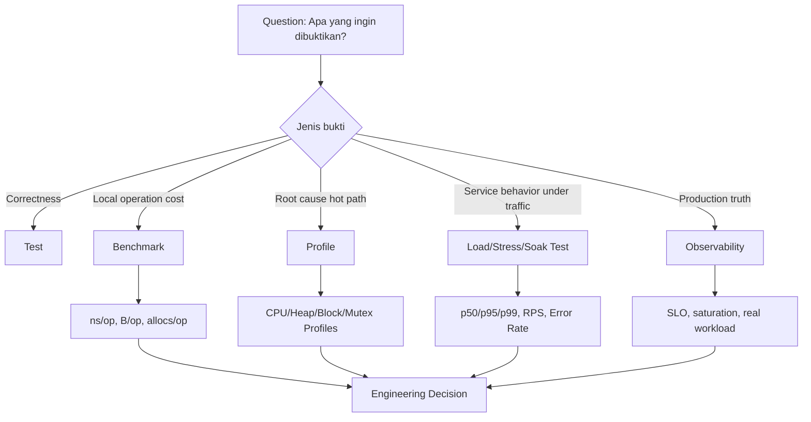
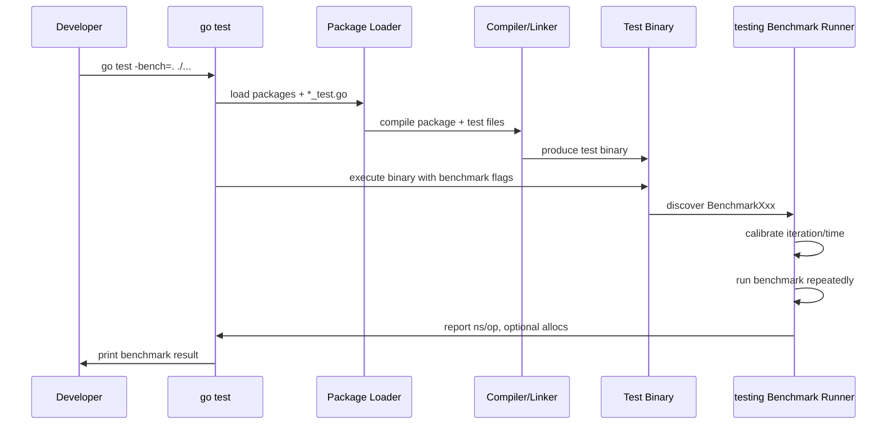
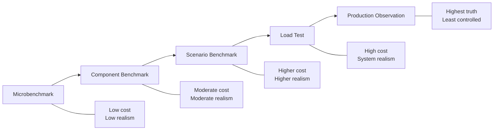
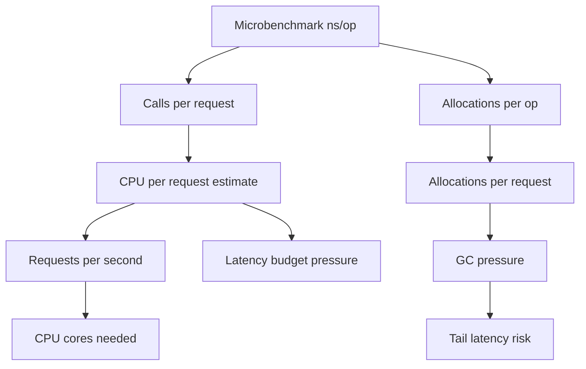

# learn-go-testing-benchmarking-performance-engineering-part-020.md

# Part 020 — Benchmarking Fundamentals: What Go Benchmarks Actually Measure

> Seri: **Go Testing, Benchmarking, Performance Engineering**  
> Target pembaca: **Java Software Engineer → Go Performance-Capable Engineer**  
> Target Go: **Go 1.26.x**  
> Status seri: **Part 020 dari 034**  
> Prasyarat: Part 000–019, terutama test execution model, CI strategy, deterministic testing, concurrency testing, dan coverage engineering.

---

## 0. Tujuan Part Ini

Part ini menjawab pertanyaan dasar tetapi sering disalahpahami:

> Ketika kita menjalankan `go test -bench`, sebenarnya apa yang sedang diukur?

Banyak engineer bisa menulis:

```go
func BenchmarkXxx(b *testing.B) {
	for i := 0; i < b.N; i++ {
		DoSomething()
	}
}
```

atau versi modern:

```go
func BenchmarkXxx(b *testing.B) {
	for b.Loop() {
		DoSomething()
	}
}
```

Tetapi jauh lebih sedikit yang bisa menjawab dengan akurat:

1. Apakah angka `ns/op` berarti latency request?
2. Apakah `allocs/op` berarti jumlah object Go yang dibuat?
3. Apakah benchmark Go otomatis cukup untuk membuktikan performance production?
4. Mengapa benchmark bisa membaik padahal production memburuk?
5. Mengapa benchmark yang sama bisa berbeda antar mesin?
6. Mengapa `go test -bench=. ./...` bukan performance test suite yang ideal?
7. Mengapa benchmark kecil sering lebih berbahaya daripada tidak punya benchmark?
8. Kapan benchmark harus gagal di CI?
9. Kapan hasil benchmark boleh dipercaya untuk keputusan arsitektur?
10. Kapan hasil benchmark harus dianggap hanya sinyal awal?

Part ini adalah **fondasi mental model** sebelum kita masuk ke:

- `B.Loop` secara mendalam di Part 021
- allocation benchmarking di Part 022
- parallel benchmarking di Part 023
- statistical benchmarking dengan `benchstat` di Part 024
- compiler trap dan microbenchmark anti-pattern di Part 025
- macro/scenario benchmark di Part 026
- performance engineering, PGO, perf budgets, regression gates, load/stress/soak di part berikutnya

---

## 1. Satu Kalimat Inti

> Benchmark Go mengukur biaya menjalankan fungsi benchmark berulang kali di dalam test binary, di bawah kontrol package `testing`, pada environment tertentu, dengan asumsi workload benchmark cukup representatif dan tidak terkena jebakan compiler/runtime/environment.

Artinya:

- benchmark Go **bukan** bukti production latency
- benchmark Go **bukan** load test
- benchmark Go **bukan** capacity test
- benchmark Go **bukan** observability
- benchmark Go **bukan** profiling
- benchmark Go **bukan** replacement untuk design review
- benchmark Go adalah **controlled measurement instrument**

Seperti semua instrument, hasilnya hanya valid kalau:

1. pertanyaan yang diukur jelas,
2. workload sesuai,
3. setup/timer benar,
4. noise dikendalikan,
5. hasil dibandingkan secara statistik,
6. interpretasi tidak melewati batas data.

---

## 2. Benchmark vs Test vs Profiling vs Load Test

Sebelum bicara `testing.B`, kita harus bedakan beberapa aktivitas yang sering tercampur.

| Aktivitas | Pertanyaan Utama | Output | Contoh |
|---|---|---|---|
| Unit test | Apakah behavior benar? | pass/fail | `TestValidatePostalCode` |
| Integration test | Apakah boundary nyata bekerja? | pass/fail + diagnostics | DB transaction test |
| Benchmark | Berapa biaya operasi dalam kondisi terkontrol? | `ns/op`, `B/op`, `allocs/op`, throughput custom | `BenchmarkParseCaseID` |
| Profiling | Di mana waktu/memori habis? | profile, flamegraph, call stack | CPU/heap/block/mutex profile |
| Load test | Apa behavior service di bawah traffic? | latency distribution, throughput, error rate | 500 RPS selama 30 menit |
| Stress test | Di mana titik jenuh dan kegagalannya? | saturation curve, failure mode | naikkan RPS sampai error |
| Soak test | Apakah ada leak/degradation jangka panjang? | trend waktu | 12 jam beban stabil |
| Capacity test | Berapa kapasitas aman dan headroom? | capacity envelope | p95 < 200 ms di 70% CPU |
| Performance regression test | Apakah versi baru lebih lambat/boros? | delta + decision | PR benchmark gate |

Benchmark menempati posisi penting tetapi sempit: ia memberi **pengukuran lokal yang repeatable**.

---

## 3. Diagram: Posisi Benchmark di Performance Engineering



Benchmark adalah salah satu bukti. Engineer level senior/top-tier tidak memperlakukan benchmark sebagai kebenaran tunggal.

---

## 4. Apa Itu Go Benchmark?

Go benchmark adalah function dengan bentuk:

```go
func BenchmarkXxx(b *testing.B)
```

Function ini ditemukan oleh `go test`, dikompilasi ke test binary, lalu dijalankan oleh benchmark runner dari package `testing`.

Contoh minimal modern:

```go
package normalize

import "testing"

func BenchmarkNormalizePostalCode(b *testing.B) {
	input := "  123456\n"

	for b.Loop() {
		_ = NormalizePostalCode(input)
	}
}
```

Contoh legacy:

```go
func BenchmarkNormalizePostalCode_Legacy(b *testing.B) {
	input := "  123456\n"

	for i := 0; i < b.N; i++ {
		_ = NormalizePostalCode(input)
	}
}
```

Mulai Go 1.24, benchmark baru direkomendasikan menggunakan `B.Loop` karena lebih robust dan mengurangi beberapa jebakan benchmark lama. Di seri ini, kita akan memakai `B.Loop` sebagai default, tetapi tetap memahami `b.N` karena banyak codebase masih memakainya.

---

## 5. Apa yang Terjadi Saat `go test -bench`?

Ketika menjalankan:

```bash
go test -bench=. ./...
```

secara konseptual Go melakukan:



Hal penting:

- benchmark berjalan di **test binary**
- benchmark bukan bagian dari normal application binary
- benchmark bisa dipengaruhi compiler flags test
- benchmark bisa dipengaruhi test package layout
- benchmark bisa dipengaruhi environment test
- benchmark bisa memakai dependency yang berbeda dari production jika tidak hati-hati
- benchmark output adalah hasil dari runner, bukan observasi production

---

## 6. Output Benchmark Dasar

Contoh output:

```text
goos: linux
goarch: amd64
pkg: example.com/aceas/internal/postal
cpu: Intel(R) Xeon(R) Platinum 8375C CPU @ 2.90GHz
BenchmarkNormalizePostalCode-8    158492310    7.412 ns/op
PASS
ok      example.com/aceas/internal/postal    2.105s
```

Maknanya:

| Field | Arti |
|---|---|
| `goos` | OS target saat test dijalankan |
| `goarch` | arsitektur CPU |
| `pkg` | package yang dibenchmark |
| `cpu` | CPU yang dilaporkan runtime/platform |
| `BenchmarkNormalizePostalCode-8` | nama benchmark dan GOMAXPROCS saat run |
| `158492310` | jumlah iterasi benchmark yang dipilih runner |
| `7.412 ns/op` | rata-rata waktu per operasi benchmark |
| `PASS` | benchmark binary selesai tanpa failure |
| `ok ... 2.105s` | total waktu command/package |

`-8` pada nama benchmark umumnya merepresentasikan nilai `GOMAXPROCS` yang dipakai untuk run tersebut, bukan jumlah goroutine benchmark.

---

## 7. `ns/op`: Apa Artinya?

`ns/op` adalah:

> total waktu terukur dibagi jumlah operasi benchmark menurut runner.

Kalau output:

```text
BenchmarkNormalizePostalCode-8    158492310    7.412 ns/op
```

itu berarti dalam benchmark tersebut, satu “operation” yang didefinisikan oleh body benchmark rata-rata memakan sekitar 7.412 nanosecond.

Tetapi “operation” adalah definisi benchmark author.

Misalnya:

```go
func BenchmarkOneCall(b *testing.B) {
	for b.Loop() {
		_ = NormalizePostalCode("123456")
	}
}
```

Satu operation = satu call `NormalizePostalCode`.

Tetapi:

```go
func BenchmarkTenCalls(b *testing.B) {
	for b.Loop() {
		for i := 0; i < 10; i++ {
			_ = NormalizePostalCode("123456")
		}
	}
}
```

Satu operation = sepuluh call `NormalizePostalCode`.

Jadi `ns/op` tidak bermakna tanpa memahami isi benchmark.

---

## 8. Benchmark Operation Harus Didefinisikan Eksplisit

Kesalahan umum: benchmark diberi nama seolah mengukur satu hal, tetapi operation-nya sebenarnya mencakup banyak hal lain.

Buruk:

```go
func BenchmarkAuthorize(b *testing.B) {
	for b.Loop() {
		policy := LoadPolicyFromJSON(bigJSON)
		user := BuildUser()
		req := BuildRequest()
		_ = Authorize(policy, user, req)
	}
}
```

Nama benchmark mengatakan “Authorize”, tetapi yang diukur:

- JSON parsing
- allocation object policy
- user construction
- request construction
- authorize evaluation

Lebih jelas:

```go
func BenchmarkAuthorizePrecompiledPolicy(b *testing.B) {
	policy := mustLoadPolicyFromJSON(bigJSON)
	user := testUser()
	req := testRequest()

	b.ResetTimer()
	for b.Loop() {
		_ = Authorize(policy, user, req)
	}
}
```

Atau pisah:

```go
func BenchmarkLoadPolicyFromJSON(b *testing.B) {
	for b.Loop() {
		_ = mustLoadPolicyFromJSON(bigJSON)
	}
}

func BenchmarkAuthorizePrecompiledPolicy(b *testing.B) {
	policy := mustLoadPolicyFromJSON(bigJSON)
	user := testUser()
	req := testRequest()

	b.ResetTimer()
	for b.Loop() {
		_ = Authorize(policy, user, req)
	}
}
```

Principle:

> Benchmark name must match measured operation.

---

## 9. Benchmark Adalah Eksperimen, Bukan Dekorasi

Benchmark yang baik selalu punya pertanyaan.

Contoh pertanyaan buruk:

> Seberapa cepat function ini?

Terlalu umum.

Pertanyaan lebih baik:

> Apakah normalisasi postal code tanpa regexp lebih cepat dan lebih sedikit allocation dibanding implementasi regexp untuk input 6 digit yang valid?

Dari pertanyaan ini muncul desain benchmark:

- compare implementation A vs B
- input harus jelas
- metric: `ns/op`, `B/op`, `allocs/op`
- run multiple times
- gunakan `benchstat`
- putuskan berdasarkan effect size

---

## 10. Benchmark Question Template

Gunakan template ini sebelum menulis benchmark:

```text
Question:
  Apa keputusan engineering yang ingin dibantu benchmark ini?

Operation:
  Satu op merepresentasikan apa?

Workload:
  Input apa yang digunakan?
  Apakah input merepresentasikan production/common/worst-case?

Control:
  Apa yang sengaja dikeluarkan dari timer?
  Apa dependency yang difake/disimulasikan?

Metrics:
  Metric utama apa?
  ns/op? B/op? allocs/op? throughput? custom bytes/sec?

Comparison:
  Dibandingkan dengan apa?
  Baseline lama? Implementasi alternatif? Budget?

Noise:
  Bagaimana benchmark dijalankan agar noise rendah?

Decision:
  Delta sebesar apa yang dianggap meaningful?
```

---

## 11. Benchmark Itu Bukan Latency Production

`ns/op` sering disalahartikan sebagai latency.

Contoh:

```text
BenchmarkAuthorize-8    10000000    120 ns/op
```

Itu **bukan** berarti endpoint authorization production punya latency 120 ns.

Kenapa?

Karena production request mungkin mencakup:

- network
- TLS
- JSON decode
- auth token parsing
- cache lookup
- DB lookup
- lock contention
- queueing
- GC pressure dari request lain
- logging
- tracing
- kernel scheduling
- CPU steal time
- noisy neighbor
- dependency latency
- request fan-out
- load balancer overhead
- slow client
- retry
- timeout budget
- container CPU quota

Benchmark lokal hanya mengukur body benchmark dalam kondisi terkontrol.

---

## 12. Benchmark Itu Bukan Throughput Service

Benchmark bisa menghitung `ops/sec` secara kasar:

```text
ops/sec = 1e9 / nsPerOp
```

Jika `100 ns/op`, secara matematis `10,000,000 ops/sec`.

Tetapi itu bukan berarti service bisa melayani 10 juta request/sec.

Kenapa?

Karena service throughput dipengaruhi:

- parallelism
- contention
- memory bandwidth
- GC
- kernel/network
- serialization
- DB/cache/queue
- backpressure
- tail latency
- deployment resource limit
- autoscaling
- connection pool
- load distribution
- queueing model

Benchmark lokal membantu memahami **component cost**, bukan total service capacity.

---

## 13. Benchmark Itu Bukan Profiling

Benchmark menjawab:

> Berapa biaya operasi ini?

Profiling menjawab:

> Bagian mana yang menyumbang biaya?

Contoh:

```text
BenchmarkBuildCaseSummary-8    20000    62134 ns/op
```

Benchmark menunjukkan `BuildCaseSummary` mahal.

Tetapi tidak menjawab apakah penyebabnya:

- sorting
- map lookup
- JSON encoding
- reflection
- string concatenation
- allocation
- time formatting
- lock contention
- regex

Untuk itu perlu profiling. Namun profiling sudah punya seri sendiri; di seri ini kita hanya akan membahas boundary-nya agar tidak overlap.

---

## 14. Benchmark Itu Bukan Regression Gate Otomatis

Benchmark bisa dipakai untuk regression gate, tetapi tidak otomatis aman untuk fail CI.

Alasannya:

- CI runner sering noisy
- CPU berbeda antar job
- thermal/power state tidak stabil
- VM scheduling bisa berubah
- benchmark kecil sangat sensitif noise
- perubahan compiler/runtime bisa mengubah baseline
- dependency background bisa berubah
- cache state berbeda

Performance regression gate yang sehat butuh:

- repeated runs
- stable runner
- baseline history
- statistical comparison
- threshold
- classification
- manual override policy
- artifact retention
- owner

Ini dibahas detail di Part 030.

---

## 15. Benchmark Granularity

Ada beberapa level benchmark.

### 15.1 Microbenchmark

Mengukur operasi kecil.

Contoh:

```go
func BenchmarkParseCaseID(b *testing.B) {
	for b.Loop() {
		_, _ = ParseCaseID("CASE-2026-000001")
	}
}
```

Cocok untuk:

- parser kecil
- normalization
- encoding
- hashing
- data structure operation
- allocation-sensitive helper
- hot-path primitive

Risiko:

- terlalu synthetic
- compiler trap
- tidak representatif
- over-optimizing bagian yang bukan bottleneck

### 15.2 Component Benchmark

Mengukur module internal.

```go
func BenchmarkDecisionEngineEvaluate(b *testing.B) {
	engine := newBenchmarkDecisionEngine()
	input := benchmarkCaseInput()

	b.ResetTimer()
	for b.Loop() {
		_, _ = engine.Evaluate(input)
	}
}
```

Cocok untuk:

- policy engine
- rules engine
- mapper
- validator
- serializer
- report builder
- authorization evaluator

Risiko:

- setup tidak representatif
- fake dependency terlalu murah
- data fixture terlalu kecil

### 15.3 Scenario Benchmark

Mengukur flow lebih realistis tanpa seluruh service production.

```go
func BenchmarkCaseSubmissionScenario(b *testing.B) {
	app := newBenchmarkApp()
	req := benchmarkSubmissionRequest()

	b.ResetTimer()
	for b.Loop() {
		_ = app.SubmitCase(context.Background(), req)
	}
}
```

Cocok untuk:

- end-to-end internal module flow
- comparing architecture variants
- regression detection
- capacity model input

Risiko:

- sulit isolate penyebab
- lebih noisy
- bisa jadi mini load test yang buruk jika tidak dirancang

### 15.4 Load Benchmark / External Load Test

Biasanya bukan `testing.B`, melainkan tool load test.

Cocok untuk:

- service RPS
- tail latency
- dependency saturation
- autoscaling
- timeout/retry/backpressure

---

## 16. Diagram: Benchmark Granularity



Engineering decision yang matang sering memakai beberapa level bukti.

---

## 17. Anatomi Benchmark yang Baik

Benchmark yang baik biasanya punya struktur:

```go
func BenchmarkSomething(b *testing.B) {
	// 1. Define workload.
	input := buildRepresentativeInput()

	// 2. Build system under test.
	sut := NewSomething(Config{
		Mode: "production-like",
	})

	// 3. Optional validation before timer.
	got, err := sut.Do(input)
	if err != nil {
		b.Fatal(err)
	}
	if !isValid(got) {
		b.Fatalf("invalid result: %#v", got)
	}

	// 4. Reset timer after setup.
	b.ResetTimer()

	// 5. Run measured operation.
	for b.Loop() {
		_, _ = sut.Do(input)
	}
}
```

Properties:

- setup tidak ikut diukur kecuali memang ingin diukur
- output divalidasi agar compiler tidak menghapus/mengubah meaningful work
- input representatif
- nama benchmark jelas
- tidak pakai real dependency kecuali memang integration/scenario benchmark
- tidak melakukan logging berlebihan
- tidak menulis file global
- tidak bergantung jam/randomness tanpa kontrol
- tidak memakai `time.Sleep` sebagai workload palsu

---

## 18. Benchmark Harus Tetap Memeriksa Correctness

Benchmark bukan test correctness, tetapi benchmark yang tidak memvalidasi hasil bisa mengukur operasi yang salah.

Buruk:

```go
func BenchmarkNormalize(b *testing.B) {
	for b.Loop() {
		Normalize(" 123456 ")
	}
}
```

Jika compiler menyadari hasil tidak dipakai, atau implementasi berubah menjadi no-op, benchmark bisa tetap “cepat”.

Lebih baik:

```go
func BenchmarkNormalize(b *testing.B) {
	input := " 123456 "
	want := "123456"

	got := Normalize(input)
	if got != want {
		b.Fatalf("Normalize(%q)=%q, want %q", input, got, want)
	}

	for b.Loop() {
		got = Normalize(input)
	}

	if got != want {
		b.Fatalf("Normalize(%q)=%q, want %q", input, got, want)
	}
}
```

Catatan:

- jangan assertion berat di dalam hot loop kecuali memang bagian dari operation
- validasi sebelum/atau sesudah loop
- untuk mutable result, hati-hati reuse object

---

## 19. Timer Semantics

Package `testing.B` punya timer internal.

Method penting:

| Method | Fungsi |
|---|---|
| `b.ResetTimer()` | reset elapsed time dan allocation count setelah setup |
| `b.StopTimer()` | pause timer untuk work yang tidak ingin diukur |
| `b.StartTimer()` | resume timer |
| `b.ReportAllocs()` | laporkan allocation metrics |
| `b.SetBytes(n)` | laporkan throughput bytes/sec |
| `b.ReportMetric(v, unit)` | metric custom |
| `b.Run(name, fn)` | sub-benchmark |
| `b.RunParallel(fn)` | parallel benchmark |
| `b.SetParallelism(p)` | atur goroutine multiplier untuk `RunParallel` |
| `b.Loop()` | loop benchmark modern |

Dengan `B.Loop`, beberapa aspek timer lebih otomatis. Namun `ResetTimer`, `StopTimer`, dan `StartTimer` tetap penting untuk setup/teardown yang bukan bagian dari measurement.

---

## 20. Contoh: Setup Tidak Boleh Ikut Diukur

Misalnya ingin mengukur lookup policy, bukan parsing policy.

Buruk:

```go
func BenchmarkPolicyLookup_Bad(b *testing.B) {
	for b.Loop() {
		policy := mustParsePolicy(policyJSON)
		_ = policy.Lookup("case.submit")
	}
}
```

Ini mengukur parse + lookup.

Baik:

```go
func BenchmarkPolicyLookup(b *testing.B) {
	policy := mustParsePolicy(policyJSON)

	b.ResetTimer()
	for b.Loop() {
		_ = policy.Lookup("case.submit")
	}
}
```

Kalau ingin mengukur parsing, buat benchmark terpisah:

```go
func BenchmarkParsePolicy(b *testing.B) {
	for b.Loop() {
		_ = mustParsePolicy(policyJSON)
	}
}
```

---

## 21. Contoh: Setup Per Iterasi Kadang Memang Perlu

Ada operasi yang memang butuh input baru setiap op.

Contoh: mengukur parse JSON dari bytes baru tidak perlu membuat bytes baru, tetapi kalau function mutate input, input harus di-copy.

```go
func BenchmarkNormalizeMutableBuffer(b *testing.B) {
	original := []byte("  123456  ")

	buf := make([]byte, len(original))

	b.ResetTimer()
	for b.Loop() {
		copy(buf, original)
		_ = NormalizeInPlace(buf)
	}
}
```

Tetapi sekarang operation = copy + normalize.

Kalau ingin isolate normalize saja, desain API harus memungkinkan input non-mutating atau setup khusus.

Lesson:

> Benchmark sering mengungkap masalah desain API, bukan hanya masalah performa.

---

## 22. Sub-benchmarks

Sub-benchmark membantu membuat matrix.

```go
func BenchmarkNormalizePostalCode(b *testing.B) {
	cases := []struct {
		name  string
		input string
	}{
		{"valid", "123456"},
		{"spaces", " 123456 "},
		{"newline", "\n123456\r\n"},
		{"invalidLetters", "12A456"},
	}

	for _, tc := range cases {
		b.Run(tc.name, func(b *testing.B) {
			for b.Loop() {
				_ = NormalizePostalCode(tc.input)
			}
		})
	}
}
```

Output:

```text
BenchmarkNormalizePostalCode/valid-8             9.1 ns/op
BenchmarkNormalizePostalCode/spaces-8           18.4 ns/op
BenchmarkNormalizePostalCode/newline-8          25.7 ns/op
BenchmarkNormalizePostalCode/invalidLetters-8   12.0 ns/op
```

Manfaat:

- membandingkan input classes
- selective run
- lebih mudah dianalisis dengan `benchstat`
- menghindari benchmark function explosion

Selective run:

```bash
go test -bench='BenchmarkNormalizePostalCode/spaces$' ./internal/postal
```

---

## 23. Benchmark Naming Convention

Nama benchmark harus memuat:

1. operation,
2. variant,
3. input class,
4. relevant size jika perlu.

Contoh baik:

```go
BenchmarkAuthorize/RBAC_10Roles_Allowed
BenchmarkAuthorize/RBAC_100Roles_Denied
BenchmarkAuthorize/ABAC_10Attrs_Allowed
BenchmarkAuthorize/ABAC_100Attrs_Denied
BenchmarkJSONEncode/SmallCase
BenchmarkJSONEncode/LargeCase
BenchmarkDedup/100Items_10PercentDuplicates
```

Contoh buruk:

```go
BenchmarkFast
BenchmarkNew
BenchmarkOld
BenchmarkTest
BenchmarkCase
BenchmarkProcess
BenchmarkService
```

Nama buruk membuat hasil benchmark tidak bisa dipakai dalam review.

---

## 24. Flags Benchmark Dasar

### 24.1 Run Semua Benchmark di Package

```bash
go test -bench=. ./internal/postal
```

### 24.2 Run Benchmark Tertentu

```bash
go test -bench='BenchmarkNormalizePostalCode$' ./internal/postal
```

### 24.3 Run Sub-benchmark Tertentu

```bash
go test -bench='BenchmarkNormalizePostalCode/spaces$' ./internal/postal
```

### 24.4 Skip Unit Test Saat Benchmark

Secara default, `go test -bench` tetap menjalankan test biasa. Untuk benchmark-only:

```bash
go test -run='^$' -bench=. ./internal/postal
```

Makna:

- `-run='^$'` mencocokkan tidak ada test biasa
- `-bench=.` menjalankan benchmark

### 24.5 Tampilkan Allocation

```bash
go test -run='^$' -bench=. -benchmem ./internal/postal
```

Output:

```text
BenchmarkNormalizePostalCode-8    158492310    7.412 ns/op    0 B/op    0 allocs/op
```

### 24.6 Repeat Runs

```bash
go test -run='^$' -bench=. -benchmem -count=10 ./internal/postal
```

Penting untuk statistik.

### 24.7 Benchtime Durasi

```bash
go test -run='^$' -bench=. -benchtime=3s ./internal/postal
```

### 24.8 Benchtime Iterasi Tetap

```bash
go test -run='^$' -bench=. -benchtime=100000x ./internal/postal
```

`x` berarti exact iteration count. Berguna untuk operasi mahal atau eksperimen tertentu, tetapi harus digunakan hati-hati.

### 24.9 CPU Matrix

```bash
go test -run='^$' -bench=. -cpu=1,2,4,8 ./internal/postal
```

Berguna untuk melihat scaling atau sensitivity terhadap `GOMAXPROCS`.

---

## 25. Output dengan `-benchmem`

Contoh:

```text
BenchmarkBuildCaseSummary-8    52431    22814 ns/op    8192 B/op    124 allocs/op
```

Makna:

| Metric | Arti |
|---|---|
| `22814 ns/op` | rata-rata waktu per operation |
| `8192 B/op` | rata-rata bytes allocated per operation |
| `124 allocs/op` | rata-rata jumlah allocation events per operation |

Allocation metrics penting karena di Go:

- allocation dapat meningkatkan GC pressure
- allocation bisa mengubah tail latency
- allocation bisa mengurangi cache locality
- allocation regression sering muncul sebelum latency regression terlihat

Namun `B/op` dan `allocs/op` juga perlu hati-hati:

- tidak semua allocation sama mahal
- stack allocation tidak dihitung seperti heap allocation
- escape analysis bisa berubah antar versi Go
- benchmark input kecil bisa menyembunyikan allocation production
- pooling bisa mengurangi allocation tetapi menambah complexity/retention risk

Allocation benchmarking akan dibahas detail di Part 022.

---

## 26. `b.ReportAllocs()` vs `-benchmem`

Ada dua cara memunculkan allocation:

```go
func BenchmarkX(b *testing.B) {
	b.ReportAllocs()
	for b.Loop() {
		_ = X()
	}
}
```

atau command:

```bash
go test -bench=. -benchmem ./...
```

Praktik umum:

- gunakan `-benchmem` saat run manual/CI
- gunakan `b.ReportAllocs()` untuk benchmark yang allocation-sensitive dan harus selalu menampilkan allocation

---

## 27. `b.SetBytes`: Throughput untuk Byte-Oriented Work

Untuk operasi yang memproses byte, gunakan `SetBytes`.

```go
func BenchmarkCompress1MiB(b *testing.B) {
	input := bytes.Repeat([]byte("a"), 1<<20)

	b.SetBytes(int64(len(input)))
	b.ResetTimer()

	for b.Loop() {
		_, _ = Compress(input)
	}
}
```

Output bisa mencakup MB/s.

Cocok untuk:

- encoding/decoding
- compression
- hashing
- serialization
- parsing
- buffer transform
- streaming transform

Tetapi hati-hati:

- bytes/sec bukan request/sec
- input harus representatif
- compressibility input sangat memengaruhi hasil
- CPU cache dan memory bandwidth bisa mendominasi

---

## 28. `b.ReportMetric`: Custom Metric

Go benchmark bisa melaporkan metric custom.

Contoh:

```go
func BenchmarkBatchValidate(b *testing.B) {
	batch := buildBatch(1000)

	for b.Loop() {
		result := ValidateBatch(batch)
		if result.InvalidCount < 0 {
			b.Fatal("invalid count cannot be negative")
		}
	}

	b.ReportMetric(float64(len(batch)), "items/op")
}
```

Namun custom metric harus hati-hati. Jangan melaporkan metric yang tidak benar-benar terukur.

Contoh lebih valid:

```go
func BenchmarkBatchValidate(b *testing.B) {
	batch := buildBatch(1000)

	b.ResetTimer()
	for b.Loop() {
		_ = ValidateBatch(batch)
	}

	b.ReportMetric(float64(len(batch)), "items/op")
}
```

Untuk throughput:

```text
items/sec = items/op / seconds/op
```

Sering lebih baik gunakan `SetBytes` untuk byte-oriented operation.

---

## 29. Benchmark dengan Error

Benchmark harus fail jika operation gagal.

```go
func BenchmarkParseCaseID(b *testing.B) {
	input := "CASE-2026-000001"

	for b.Loop() {
		_, err := ParseCaseID(input)
		if err != nil {
			b.Fatal(err)
		}
	}
}
```

Tetapi `if err != nil` ikut diukur. Biasanya itu acceptable karena production juga harus check error.

Namun jika error path impossible dalam benchmark dan ingin mengurangi overhead check, validasi bisa dilakukan sebelum loop:

```go
func BenchmarkParseCaseID(b *testing.B) {
	input := "CASE-2026-000001"

	if _, err := ParseCaseID(input); err != nil {
		b.Fatal(err)
	}

	for b.Loop() {
		_, _ = ParseCaseID(input)
	}
}
```

Trade-off:

- check inside loop lebih aman terhadap nondeterministic failure
- check outside loop lebih minimal overhead
- untuk pure deterministic function, outside loop biasanya cukup
- untuk operation dengan dependency/fake state, check inside loop lebih aman

---

## 30. Benchmark dengan Context

Jangan membuat context dengan timeout di setiap iteration kecuali itu memang bagian operation.

Buruk jika ingin mengukur `Authorize` saja:

```go
func BenchmarkAuthorize_Bad(b *testing.B) {
	engine := newEngine()

	for b.Loop() {
		ctx, cancel := context.WithTimeout(context.Background(), time.Second)
		_ = engine.Authorize(ctx, req)
		cancel()
	}
}
```

Ini mengukur context allocation/timer juga.

Lebih baik:

```go
func BenchmarkAuthorize(b *testing.B) {
	engine := newEngine()
	ctx := context.Background()

	for b.Loop() {
		_ = engine.Authorize(ctx, req)
	}
}
```

Jika production memang membuat context per request, ukur di scenario benchmark terpisah.

---

## 31. Benchmark dengan Logging

Logging dalam benchmark hampir selalu merusak hasil jika bukan operation yang diukur.

Buruk:

```go
func BenchmarkProcess(b *testing.B) {
	for b.Loop() {
		log.Printf("processing")
		_ = Process()
	}
}
```

Jika ingin mengukur logging overhead, buat benchmark khusus:

```go
func BenchmarkProcessWithDiscardLogger(b *testing.B) {
	svc := NewService(discardLogger())

	for b.Loop() {
		_ = svc.Process(req)
	}
}
```

Jika production service selalu logging, scenario benchmark bisa memasukkan logger yang realistic tetapi output-nya diarahkan ke discard atau buffer terkontrol.

---

## 32. Benchmark dengan Real Network/DB/Cache

Secara default, microbenchmark tidak boleh melakukan real network/DB/cache.

Buruk:

```go
func BenchmarkGetUserFromRedis(b *testing.B) {
	client := redis.NewClient(...)
	for b.Loop() {
		_, _ = client.Get(ctx, "user:123").Result()
	}
}
```

Masalah:

- network noise
- Redis state
- connection pool
- server load
- kernel scheduling
- CI instability
- hasil sulit direproduksi

Kalau memang ingin benchmark dependency integration:

- beri nama jelas: `BenchmarkRedisGetIntegration`
- pakai build tag: `//go:build integration`
- kontrol environment
- laporkan dependency version/config
- jangan jadikan microbenchmark PR gate default
- pertimbangkan load test lebih tepat

---

## 33. Benchmark dengan Random Input

Random input membuat benchmark tidak repeatable.

Buruk:

```go
func BenchmarkNormalizeRandom(b *testing.B) {
	for b.Loop() {
		input := randomPostalCode()
		_ = NormalizePostalCode(input)
	}
}
```

Masalah:

- random generation ikut diukur
- input distribution berubah
- hasil sulit dibandingkan
- allocation random generator ikut masuk

Lebih baik:

```go
func BenchmarkNormalizeCorpus(b *testing.B) {
	inputs := []string{
		"123456",
		" 123456 ",
		"\n123456\r\n",
		"12A456",
	}

	i := 0
	for b.Loop() {
		_ = NormalizePostalCode(inputs[i%len(inputs)])
		i++
	}
}
```

Atau sub-benchmark per input class.

---

## 34. Benchmark Input Size

Performance sering berubah terhadap size.

Contoh:

```go
func BenchmarkDedupCases(b *testing.B) {
	sizes := []int{10, 100, 1000, 10000}

	for _, size := range sizes {
		b.Run(fmt.Sprintf("n=%d", size), func(b *testing.B) {
			input := buildCases(size)

			b.ResetTimer()
			for b.Loop() {
				_ = DedupCases(input)
			}
		})
	}
}
```

Ini membantu melihat complexity.

Output mungkin:

```text
BenchmarkDedupCases/n=10-8        200 ns/op
BenchmarkDedupCases/n=100-8       2300 ns/op
BenchmarkDedupCases/n=1000-8      31000 ns/op
BenchmarkDedupCases/n=10000-8     520000 ns/op
```

Dari output terlihat scaling. Tetapi jangan langsung menyimpulkan Big-O tanpa analisis.

---

## 35. Benchmark Dataset Harus Representatif

Dataset benchmark perlu mendekati workload nyata.

Untuk regulatory case management, dataset mungkin punya:

- case dengan 1 applicant
- case dengan banyak applicant
- case dengan banyak attachment metadata
- case dengan long audit history
- case dengan escalation chain
- case dengan multiple agency review
- case dengan invalid/missing fields
- case dengan mixed permission rules
- case dengan large correspondence history

Benchmark yang hanya memakai “happy small case” akan memberi rasa aman palsu.

---

## 36. Representative Workload Matrix

Contoh matrix:

| Workload | Tujuan |
|---|---|
| `SmallHappyPath` | baseline fast common path |
| `SmallInvalid` | validation fail fast |
| `LargeValid` | scaling normal case |
| `LargeInvalidLate` | worst validation path |
| `ManyPermissionsAllowed` | authz positive path |
| `ManyPermissionsDenied` | authz negative path |
| `DeepEscalationChain` | state transition/history path |
| `LargeAuditMetadata` | serialization/mapping pressure |
| `MixedRealisticCorpus` | blended workload |

Dalam benchmark:

```go
func BenchmarkCaseValidation(b *testing.B) {
	workloads := map[string]CaseSubmission{
		"SmallHappyPath":      smallHappyPath(),
		"LargeValid":          largeValidCase(),
		"LargeInvalidLate":    largeInvalidLate(),
		"DeepEscalationChain": deepEscalationChain(),
	}

	for name, input := range workloads {
		b.Run(name, func(b *testing.B) {
			validator := NewValidator(defaultRules())

			b.ResetTimer()
			for b.Loop() {
				_ = validator.Validate(input)
			}
		})
	}
}
```

---

## 37. Cache Effects

Microbenchmark sering berjalan dalam kondisi cache sangat hangat.

Misalnya:

```go
func BenchmarkLookup(b *testing.B) {
	m := buildMap(100)
	for b.Loop() {
		_ = m["key-1"]
	}
}
```

Ini mengukur lookup key yang sama berulang kali. CPU cache dan branch predictor sangat optimal.

Production mungkin lookup random keys dari map besar.

Lebih realistis:

```go
func BenchmarkLookupMixedKeys(b *testing.B) {
	m := buildMap(100_000)
	keys := buildKeyCorpus(10_000)

	i := 0
	for b.Loop() {
		_ = m[keys[i%len(keys)]]
		i++
	}
}
```

Tetapi ini masih deterministic.

---

## 38. Branch Predictor Effects

Benchmark yang selalu memakai input sama bisa overestimate performance jika branch selalu sama.

Contoh:

```go
func BenchmarkAuthorizeAllowed(b *testing.B) {
	req := allowedRequest()

	for b.Loop() {
		_ = Authorize(req)
	}
}
```

Jika production 70% allowed, 30% denied, branch behavior berbeda.

Buat sub-benchmark:

```go
func BenchmarkAuthorize(b *testing.B) {
	b.Run("Allowed", func(b *testing.B) {
		req := allowedRequest()
		for b.Loop() {
			_ = Authorize(req)
		}
	})

	b.Run("Denied", func(b *testing.B) {
		req := deniedRequest()
		for b.Loop() {
			_ = Authorize(req)
		}
	})

	b.Run("Mixed70Allowed30Denied", func(b *testing.B) {
		reqs := mixedRequests(70, 30)
		i := 0

		for b.Loop() {
			_ = Authorize(reqs[i%len(reqs)])
			i++
		}
	})
}
```

---

## 39. Benchmark dan Compiler Optimization

Compiler bisa:

- inline function
- eliminate dead code
- fold constants
- allocate on stack
- remove unused result
- specialize escape behavior
- optimize loops

Ini baik untuk production, tetapi bisa membuat benchmark misleading jika benchmark tidak memaksa kerja yang meaningful.

Contoh berbahaya:

```go
func BenchmarkAdd(b *testing.B) {
	for b.Loop() {
		_ = 1 + 2
	}
}
```

Compiler bisa mengoptimalkan ini habis-habisan.

`B.Loop` membantu mengurangi beberapa jebakan, tetapi tidak membuat semua benchmark otomatis valid.

Part 025 akan membahas ini detail.

---

## 40. Global Sink: Kapan Perlu, Kapan Berbahaya

Di benchmark lama, orang sering memakai global sink:

```go
var sink string

func BenchmarkNormalize(b *testing.B) {
	for i := 0; i < b.N; i++ {
		sink = Normalize("123456")
	}
}
```

Tujuannya mencegah dead-code elimination.

Dengan `B.Loop`, kebutuhan ini berkurang, tetapi bukan berarti hilang untuk semua kasus.

Masalah global sink:

- menambah global write
- bisa mengubah escape behavior
- bisa menambah contention jika parallel
- bisa membuat benchmark mengukur assignment global
- bisa menyembunyikan semantic issue

Lebih baik validasi hasil dan gunakan `B.Loop` dengan desain yang benar.

---

## 41. Benchmark dan Inlining

Inlining bisa membuat benchmark lebih cepat karena function call overhead hilang.

Itu bukan selalu masalah. Production juga bisa mendapat manfaat inlining.

Yang bermasalah adalah benchmark yang membandingkan dua desain tetapi satu desain inline-friendly dan yang lain tidak karena benchmark shape, bukan karena production shape.

Contoh:

```go
func BenchmarkTinyWrapper(b *testing.B) {
	for b.Loop() {
		_ = TinyWrapper(1)
	}
}
```

Mungkin semua inline.

Kalau production memanggil lewat interface:

```go
type Evaluator interface {
	Evaluate(int) bool
}
```

benchmark direct call tidak merepresentasikan dispatch cost.

Maka buat benchmark sesuai call path:

```go
func BenchmarkEvaluateDirect(b *testing.B) { ... }
func BenchmarkEvaluateViaInterface(b *testing.B) { ... }
```

---

## 42. Benchmark dan Escape Analysis

Benchmark shape bisa mengubah apakah object escape ke heap.

Contoh:

```go
func BenchmarkBuildDecision(b *testing.B) {
	for b.Loop() {
		_ = BuildDecision()
	}
}
```

Jika result tidak keluar, compiler mungkin stack allocate atau eliminate sebagian.

Jika production menyimpan result ke interface/slice/channel, behavior berbeda.

Benchmark lebih representatif:

```go
func BenchmarkBuildDecisionStore(b *testing.B) {
	results := make([]Decision, 1024)
	i := 0

	for b.Loop() {
		results[i&1023] = BuildDecision()
		i++
	}
}
```

Tetapi ini mengukur store juga. Itulah trade-off benchmark design.

---

## 43. Benchmark dan GC

Benchmark dengan allocation akan memicu GC sesuai runtime.

Namun GC behavior benchmark bisa berbeda dari production karena:

- heap size benchmark kecil
- object lifetime berbeda
- no concurrent workload
- GOGC berbeda
- memory limit berbeda
- benchmark process pendek
- cache/pool tidak dalam steady state
- no traffic burst

Allocation metrics membantu, tetapi tidak cukup untuk tail latency production.

Untuk GC-sensitive code:

- benchmark allocation
- run with different `GOGC`
- run scenario benchmark
- profile heap/alloc
- load test service
- observe production

---

## 44. Environment Matters

Benchmark hasilnya tergantung environment.

Faktor:

| Faktor | Dampak |
|---|---|
| CPU model | instruction throughput, cache, branch predictor |
| OS | scheduler, syscall cost |
| architecture | amd64 vs arm64 |
| GOMAXPROCS | parallelism/runtime scheduling |
| CPU governor | frequency scaling |
| thermal state | throttling |
| VM/container | noisy neighbor |
| background process | CPU/cache noise |
| Go version | compiler/runtime changes |
| dependency version | behavior/perf changes |
| build flags | optimization/instrumentation |
| race/coverage | overhead besar |
| cgo | call overhead/platform behavior |

Jangan membandingkan benchmark dari laptop developer A dengan CI runner B secara langsung.

---

## 45. Baseline Command Profiles

### 45.1 Local Quick Benchmark

```bash
go test -run='^$' -bench=. -benchmem ./internal/postal
```

Tujuan:

- quick sanity
- lihat output awal
- tidak untuk keputusan final

### 45.2 Local Repeated Benchmark

```bash
go test -run='^$' -bench=. -benchmem -count=10 ./internal/postal > new.txt
```

Tujuan:

- data untuk `benchstat`
- local confidence lebih baik

### 45.3 Compare Old vs New

```bash
git checkout main
go test -run='^$' -bench=. -benchmem -count=10 ./internal/postal > old.txt

git checkout feature/perf-change
go test -run='^$' -bench=. -benchmem -count=10 ./internal/postal > new.txt

benchstat old.txt new.txt
```

### 45.4 CPU Matrix

```bash
go test -run='^$' -bench=. -benchmem -count=5 -cpu=1,2,4,8 ./internal/decision > cpu.txt
```

### 45.5 Longer Benchtime

```bash
go test -run='^$' -bench=. -benchmem -count=5 -benchtime=3s ./internal/decision > long.txt
```

### 45.6 Avoid Test Cache Confusion

Benchmark results are not cached like normal test success in the same way, but build/test cache behavior can still confuse workflow perception. For clean experiments:

```bash
go clean -testcache
```

Or simply structure benchmark commands with explicit `-count`.

---

## 46. Reading Benchmark Output Carefully

Example:

```text
BenchmarkAuthorize/RBAC_10Roles_Allowed-8          8421932     141.2 ns/op       0 B/op    0 allocs/op
BenchmarkAuthorize/RBAC_100Roles_Allowed-8         1230412     972.4 ns/op       0 B/op    0 allocs/op
BenchmarkAuthorize/ABAC_10Attrs_Allowed-8          3221440     372.0 ns/op     128 B/op    4 allocs/op
BenchmarkAuthorize/ABAC_100Attrs_Allowed-8          318442    3781.0 ns/op    2048 B/op   31 allocs/op
```

Interpretasi:

- RBAC scaling dari 10 ke 100 roles sekitar 6.9x, bukan 10x
- ABAC jauh lebih allocation-heavy
- ABAC 100 attrs mungkin punya GC pressure
- zero allocation RBAC bisa lebih predictable
- tetapi belum tahu production impact
- perlu workload distribution
- perlu authorization call frequency per request
- perlu compare dengan budget

Jangan langsung menyimpulkan “ABAC buruk”. Bisa jadi ABAC diperlukan secara domain dan 3.7 µs masih acceptable.

---

## 47. Budget-Based Interpretation

Benchmark lebih berguna jika ada budget.

Contoh:

```text
Case submission request budget:
  p95 end-to-end: 300 ms
  application CPU budget: 50 ms
  validation budget: 5 ms
  authorization budget: 1 ms
  mapping budget: 3 ms
  audit construction budget: 2 ms
```

Jika benchmark:

```text
BenchmarkAuthorize/ABAC_100Attrs_Allowed-8    3781 ns/op
```

3.781 µs jauh di bawah 1 ms budget. Mungkin tidak perlu optimasi.

Jika endpoint memanggil authorization 500 kali per request:

```text
3.781 µs * 500 = 1.8905 ms
```

Melewati 1 ms authorization budget.

Jadi benchmark harus dikaitkan dengan call frequency.

---

## 48. Call Frequency Matters

Microbenchmark cost kecil bisa menjadi besar jika dipanggil banyak.

```text
Operation cost: 200 ns
Calls per request: 100,000
Total CPU per request: 20 ms
```

Sebaliknya:

```text
Operation cost: 10 µs
Calls per request: 1
Total CPU per request: 10 µs
```

Maka benchmark harus menjawab:

- hot path atau cold path?
- berapa kali dipanggil per request?
- berapa request/sec?
- apakah cost CPU, allocation, lock, syscall, atau IO?
- apakah cost muncul di p99 path?

---

## 49. Diagram: Micro Cost ke Service Impact



---

## 50. Benchmark and Performance Budget Example

Misalnya service punya:

```text
Target:
  200 RPS steady
  p95 < 250 ms
  CPU target < 60%
  4 vCPU pod
```

Function `BuildAuditEvent` dipanggil 20 kali/request.

Benchmark:

```text
BenchmarkBuildAuditEvent-8    12000 ns/op    4096 B/op    42 allocs/op
```

Estimate CPU:

```text
12 µs/op * 20 = 240 µs/request
240 µs/request * 200 RPS = 48 ms CPU/s
= 0.048 CPU core
```

CPU mungkin OK.

Estimate allocation:

```text
4096 B/op * 20 = 81920 B/request
81920 B/request * 200 RPS = 16,384,000 B/s
≈ 15.6 MiB/s allocation rate
```

Allocation may be meaningful. GC pressure mungkin lebih penting daripada CPU.

---

## 51. `PASS` Tidak Berarti Benchmark Bagus

Output:

```text
PASS
ok example.com/foo 2.1s
```

hanya berarti:

- benchmark function tidak fail
- test binary selesai
- tidak panic
- tidak timeout

Itu tidak berarti:

- benchmark valid
- benchmark representatif
- hasil statistically significant
- tidak ada compiler trap
- tidak ada environment noise
- performance acceptable
- tidak ada production regression

---

## 52. Benchmark Timeout

`go test` punya timeout default untuk test binary. Benchmark yang terlalu lama bisa timeout.

Command:

```bash
go test -run='^$' -bench=. -timeout=30m ./...
```

Hati-hati menaikkan timeout. Benchmark yang terlalu lama di PR gate bisa merusak developer feedback loop.

Rule praktis:

- PR benchmark: sangat terbatas, cepat, stable
- nightly benchmark: lebih luas, repeated
- release benchmark: representative, longer, statistical
- manual benchmark: investigasi khusus

---

## 53. Benchmark dengan Race Detector

Jangan membandingkan benchmark normal dengan benchmark `-race`.

```bash
go test -race -run='^$' -bench=. ./...
```

Race detector menambah overhead besar. Benchmark dengan `-race` berguna untuk menemukan race saat benchmark menjalankan concurrent path, tetapi hasil performance-nya bukan baseline normal.

Gunakan `-race` untuk correctness signal, bukan performance number.

---

## 54. Benchmark dengan Coverage

Jangan memakai benchmark coverage-instrumented sebagai performance baseline.

```bash
go test -cover -run='^$' -bench=. ./...
```

Coverage instrumentation mengubah performance.

Coverage untuk quality signal. Benchmark untuk performance signal. Jangan campur kecuali eksperimen spesifik.

---

## 55. Benchmark dengan CPU Profile

Go benchmark bisa menghasilkan profile:

```bash
go test -run='^$' -bench=BenchmarkBuildCaseSummary -cpuprofile=cpu.out ./internal/report
```

Ini menjalankan benchmark dan menyimpan CPU profile.

Tapi ketika profiling, tujuannya berubah:

- dari “angka benchmark stabil”
- menjadi “hotspot apa yang dominan”

Benchmark untuk profiling biasanya butuh benchtime lebih panjang:

```bash
go test -run='^$' -bench=BenchmarkBuildCaseSummary -benchtime=10s -cpuprofile=cpu.out ./internal/report
```

Detail profiling tidak dibahas di sini karena sudah ada seri observability/profiling/troubleshooting. Di part ini cukup pahami bahwa benchmark sering menjadi harness untuk profiling.

---

## 56. Benchmark dengan Memory Profile

```bash
go test -run='^$' -bench=BenchmarkBuildCaseSummary -benchmem -memprofile=mem.out ./internal/report
```

Hati-hati:

- allocation benchmark memberi angka agregat
- memory profile memberi lokasi allocation
- heap profile tidak sama dengan allocation profile
- object lifetime matters

---

## 57. Benchmark Package Placement

Benchmark biasanya diletakkan di `_test.go`.

Pilihan:

```text
internal/postal/normalize_test.go
internal/postal/normalize_bench_test.go
```

Praktik baik:

- test correctness dan benchmark bisa dipisah file
- suffix `_bench_test.go` membantu discoverability
- benchmark tetap di package yang tepat
- jangan buat package `benchmarks` global tanpa alasan kuat

Same package:

```go
package postal
```

External package:

```go
package postal_test
```

Same package bisa akses unexported function, cocok untuk internal hot path.

External package mengukur public API, cocok untuk consumer-facing behavior.

---

## 58. Same-Package vs External-Package Benchmark

### Same-package benchmark

```go
package authorize

func BenchmarkEvaluateRule(b *testing.B) {
	// can access unexported evaluateRule
}
```

Cocok untuk:

- internal hot primitive
- algorithm comparison
- unexported data structure
- narrow optimization

Risiko:

- benchmark implementation detail
- refactor bisa memecah benchmark
- tidak mencerminkan public API overhead

### External-package benchmark

```go
package authorize_test

func BenchmarkEngineEvaluate(b *testing.B) {
	engine := authorize.NewEngine(...)
}
```

Cocok untuk:

- public API cost
- consumer perspective
- stable benchmark across refactor

Risiko:

- kurang bisa isolate hot function
- setup public API lebih berat

Top-tier codebase biasanya punya keduanya:

- internal benchmark untuk engineering tuning
- external benchmark untuk public/contract cost

---

## 59. Build Tags untuk Benchmark Mahal

Benchmark mahal jangan selalu ikut default.

```go
//go:build perf

package decision

import "testing"

func BenchmarkLargePolicyEvaluation(b *testing.B) {
	// expensive benchmark
}
```

Run:

```bash
go test -tags=perf -run='^$' -bench=. ./internal/decision
```

Gunakan tag untuk:

- large datasets
- dependency integration benchmark
- long-running scenario benchmark
- platform-specific benchmark
- experimental benchmark

Jangan berlebihan. Terlalu banyak tag membuat suite sulit ditemukan.

---

## 60. Benchmark Data Files

Gunakan `testdata`.

```text
internal/report/
  report.go
  report_bench_test.go
  testdata/
    small_case.json
    large_case.json
    realistic_case_corpus.jsonl
```

Go tooling mengabaikan direktori `testdata` sebagai package. Ini cocok untuk fixture benchmark.

Prinsip:

- data file deterministic
- ukuran masuk akal untuk repo
- data bebas PII/secrets
- format terdokumentasi
- fixture versioned
- update fixture direview seperti kode

---

## 61. Benchmark Fixture Governance

Fixture benchmark bisa membuat hasil berubah drastis. Maka fixture harus punya governance.

Checklist:

- Apakah fixture mewakili workload?
- Apakah fixture terlalu kecil?
- Apakah fixture terlalu bersih?
- Apakah fixture punya worst-case?
- Apakah fixture punya mixed-case?
- Apakah fixture mengandung data sensitif?
- Apakah perubahan fixture dijelaskan di PR?
- Apakah benchmark result sebelum/sesudah disertakan?

---

## 62. Benchmark and Determinism

Benchmark harus deterministic sebanyak mungkin.

Kendalikan:

- time
- randomness
- input order
- map iteration if output matters
- environment variables
- global config
- file path
- locale/timezone
- network dependency
- CPU/GOMAXPROCS for comparison
- Go version

Tidak semua bisa dikendalikan, tetapi yang tidak dikendalikan harus diketahui.

---

## 63. Benchmark Smell: Terlalu Cepat

Benchmark dengan `0.2 ns/op` atau `0.0001 ns/op` hampir pasti tidak valid.

Kemungkinan:

- work optimized away
- operation terlalu kecil
- benchmark mengukur nothing
- compiler constant-folded
- result unused
- wrong loop placement
- `b.Loop`/`b.N` salah

Contoh smell:

```text
BenchmarkSomething-8    1000000000    0.000001 ns/op
```

Angka seperti itu harus dicurigai.

---

## 64. Benchmark Smell: Terlalu Noisy

Jika run repeated menghasilkan variasi besar:

```text
100 ns/op
180 ns/op
95 ns/op
230 ns/op
```

Kemungkinan:

- benchmark terlalu kecil
- environment noisy
- real IO/network involved
- GC variance besar
- background goroutine
- lock contention nondeterministic
- random input
- CPU frequency scaling
- thermal throttling

Solusi:

- increase benchtime
- run on stable machine
- isolate benchmark
- reduce external dependency
- inspect allocation
- use benchstat
- design benchmark better

---

## 65. Benchmark Smell: Terlalu Bagus Setelah Refactor

Jika performance membaik drastis, jangan langsung percaya.

Cek:

- apakah correctness masih sama?
- apakah result masih digunakan?
- apakah setup berubah?
- apakah operation berubah?
- apakah input berubah?
- apakah error path hilang?
- apakah logging/fake dependency berubah?
- apakah compiler menghapus work?
- apakah benchmark membandingkan hal yang sama?

---

## 66. Benchmark Smell: Terlalu Banyak dalam PR Gate

Kalau PR gate menjalankan semua benchmark dengan `-count=10`, feedback loop bisa buruk.

Benchmark suite harus diklasifikasikan:

| Class | Gate |
|---|---|
| Tiny stable regression benchmark | PR optional/limited |
| Package microbenchmark full | Nightly |
| Scenario benchmark | Nightly/release |
| Integration benchmark | Release/manual |
| Load/stress/soak | Dedicated pipeline |
| PGO validation | Release/perf pipeline |

---

## 67. Benchmark File Organization Example

```text
internal/authorization/
  engine.go
  policy.go
  evaluator.go

  engine_test.go
  policy_test.go
  evaluator_test.go

  engine_bench_test.go
  policy_bench_test.go
  evaluator_bench_test.go

  testdata/
    policy_small.json
    policy_large.json
    policy_mixed.json
```

Inside `engine_bench_test.go`:

```go
func BenchmarkEngineEvaluate(b *testing.B) {
	benchmarks := []struct {
		name   string
		policy string
		req    Request
	}{
		{"SmallPolicyAllowed", "policy_small.json", allowedRequest()},
		{"LargePolicyAllowed", "policy_large.json", allowedRequest()},
		{"LargePolicyDenied", "policy_large.json", deniedRequest()},
	}

	for _, bm := range benchmarks {
		b.Run(bm.name, func(b *testing.B) {
			engine := mustLoadEngine(bm.policy)

			if _, err := engine.Evaluate(context.Background(), bm.req); err != nil {
				b.Fatal(err)
			}

			b.ResetTimer()
			for b.Loop() {
				_, _ = engine.Evaluate(context.Background(), bm.req)
			}
		})
	}
}
```

---

## 68. Case Study: Postal Code Normalization

### 68.1 Problem

Production menerima postal code dari form dan external API.

Rules:

- trim spaces
- allow only 6 digits
- reject letters
- reject wrong length
- preserve canonical string

Two implementations:

- regexp-based
- manual loop

Question:

> Apakah manual loop lebih cepat dan zero-allocation dibanding regexp untuk common and invalid input, tanpa mengorbankan readability?

### 68.2 Benchmark Design

```go
func BenchmarkNormalizePostalCode(b *testing.B) {
	impls := map[string]func(string) (string, bool){
		"Regexp": NormalizePostalCodeRegexp,
		"Manual": NormalizePostalCodeManual,
	}

	inputs := []struct {
		name string
		in   string
	}{
		{"Valid", "123456"},
		{"Spaces", " 123456 "},
		{"Newline", "\n123456\r\n"},
		{"Letters", "12A456"},
		{"Short", "12345"},
		{"Long", "1234567"},
	}

	for implName, impl := range impls {
		for _, input := range inputs {
			b.Run(implName+"/"+input.name, func(b *testing.B) {
				got, _ := impl(input.in)
				if input.name == "Valid" && got != "123456" {
					b.Fatalf("unexpected result: %q", got)
				}

				b.ReportAllocs()
				b.ResetTimer()

				for b.Loop() {
					_, _ = impl(input.in)
				}
			})
		}
	}
}
```

### 68.3 Run

```bash
go test -run='^$' -bench=BenchmarkNormalizePostalCode -benchmem -count=10 ./internal/postal > postal.txt
```

### 68.4 Analyze

Use `benchstat` when comparing branches:

```bash
benchstat old.txt new.txt
```

### 68.5 Decision

Do not decide only from `ns/op`.

Consider:

- readability
- correctness
- invalid input behavior
- allocation
- maintainability
- frequency of call
- whether regexp is precompiled
- whether this path matters in production

---

## 69. Case Study: Authorization Engine Benchmark

### 69.1 Problem

Regulatory case management has permission checks across:

- user role
- module
- case state
- agency ownership
- assignment
- delegation
- feature flag
- operation

Question:

> Is the authorization engine evaluation cost acceptable when called repeatedly during case listing and detail rendering?

### 69.2 Workload

```text
Small:
  5 roles
  10 permissions
  1 agency
  simple state

Medium:
  20 roles
  100 permissions
  3 agencies
  5 states

Large:
  100 roles
  1000 permissions
  10 agencies
  complex delegation
```

### 69.3 Benchmark Shape

```go
func BenchmarkAuthorizationEngineEvaluate(b *testing.B) {
	workloads := []struct {
		name string
		env  AuthzBenchmarkEnv
	}{
		{"SmallAllowed", buildSmallAllowed()},
		{"MediumAllowed", buildMediumAllowed()},
		{"MediumDenied", buildMediumDenied()},
		{"LargeAllowed", buildLargeAllowed()},
		{"LargeDenied", buildLargeDenied()},
	}

	for _, wl := range workloads {
		b.Run(wl.name, func(b *testing.B) {
			engine := NewEngine(wl.env.Policy)
			req := wl.env.Request

			decision, err := engine.Evaluate(context.Background(), req)
			if err != nil {
				b.Fatal(err)
			}
			if decision == DecisionUnknown {
				b.Fatal("unknown decision")
			}

			b.ReportAllocs()
			b.ResetTimer()

			for b.Loop() {
				_, _ = engine.Evaluate(context.Background(), req)
			}
		})
	}
}
```

### 69.4 Interpretation

If result:

```text
SmallAllowed    200 ns/op       0 B/op     0 allocs/op
MediumAllowed   1.5 µs/op     128 B/op     2 allocs/op
LargeAllowed    15 µs/op     4096 B/op    40 allocs/op
LargeDenied     8 µs/op      1024 B/op    10 allocs/op
```

Ask:

- How many checks per request?
- Is large workload common?
- Does denied path short-circuit?
- Does listing page check 100 cases × 10 actions?
- Is allocation from decision object, context, slice building, map copy?
- Is caching safe?
- Would precompilation help?
- Is the bottleneck actually DB before authz?

---

## 70. Benchmark Review Checklist

Before accepting benchmark into codebase:

### 70.1 Question

- [ ] Does benchmark state what decision it supports?
- [ ] Is operation clearly defined?
- [ ] Is benchmark name accurate?

### 70.2 Workload

- [ ] Is input representative?
- [ ] Are input sizes meaningful?
- [ ] Are common/worst/error cases separated?
- [ ] Is random input avoided or controlled?

### 70.3 Timer

- [ ] Is setup outside measured region?
- [ ] Is per-iteration setup intentional?
- [ ] Are `ResetTimer`, `StopTimer`, `StartTimer` used correctly?
- [ ] Is `B.Loop` used for new benchmark?

### 70.4 Correctness

- [ ] Does benchmark validate result?
- [ ] Is compiler prevented from eliminating meaningful work?
- [ ] Is error handled?

### 70.5 Metrics

- [ ] Is `-benchmem` or `ReportAllocs` used where needed?
- [ ] Is `SetBytes` used for byte processing?
- [ ] Are custom metrics valid?

### 70.6 Environment

- [ ] Is benchmark free from real network unless intentional?
- [ ] Is dependency state controlled?
- [ ] Is data from `testdata` safe and deterministic?
- [ ] Are build tags used for expensive benchmarks?

### 70.7 Interpretation

- [ ] Is result compared with baseline?
- [ ] Is repeated run used for decision?
- [ ] Is `benchstat` used for A/B comparison?
- [ ] Is decision tied to budget or call frequency?

---

## 71. Common Anti-Patterns

### 71.1 Benchmarking Too Early

Optimizing function before knowing it matters.

Fix:

- connect benchmark to profile/load/production evidence
- or label benchmark as exploratory

### 71.2 Benchmarking Wrong Operation

Name says `Authorize`, body measures JSON parse + authorize + logging.

Fix:

- split benchmarks
- rename operation accurately

### 71.3 Measuring Setup Accidentally

Creating large object inside loop.

Fix:

- move setup outside loop
- use `ResetTimer`

### 71.4 Hiding Real Cost Accidentally

Precomputing too much outside loop.

Fix:

- define operation honestly
- create scenario benchmark if needed

### 71.5 Ignoring Allocation

Only reading `ns/op`.

Fix:

- always use `-benchmem` for important benchmark
- interpret allocation separately

### 71.6 Using Real Services in Microbenchmark

Network/DB/cache makes benchmark unstable.

Fix:

- fake for microbenchmark
- separate integration/scenario benchmark

### 71.7 Trusting Single Run

One run is not enough for decision.

Fix:

- `-count=10`
- `benchstat`

### 71.8 Comparing Different Machines

Laptop vs CI vs cloud runner.

Fix:

- compare same environment
- store machine metadata

### 71.9 Benchmark Without Budget

“Faster” but irrelevant.

Fix:

- define performance budget
- estimate call frequency

### 71.10 Over-Optimizing Readability Away

Manual micro-optimization makes code fragile while saving irrelevant nanoseconds.

Fix:

- require impact justification
- prefer simple code unless hot path proven

---

## 72. Practical Benchmark Command Cheatsheet

```bash
# Run all benchmarks in one package.
go test -run='^$' -bench=. ./internal/foo

# Include allocation metrics.
go test -run='^$' -bench=. -benchmem ./internal/foo

# Repeat 10 times for statistical comparison.
go test -run='^$' -bench=. -benchmem -count=10 ./internal/foo > result.txt

# Run one benchmark.
go test -run='^$' -bench='BenchmarkAuthorize$' -benchmem ./internal/authz

# Run one sub-benchmark.
go test -run='^$' -bench='BenchmarkAuthorize/LargeDenied$' -benchmem ./internal/authz

# Longer benchmark time.
go test -run='^$' -bench=. -benchmem -benchtime=3s ./internal/foo

# Fixed iteration count.
go test -run='^$' -bench=. -benchmem -benchtime=100000x ./internal/foo

# CPU matrix.
go test -run='^$' -bench=. -benchmem -cpu=1,2,4,8 ./internal/foo

# Perf-tagged benchmarks.
go test -tags=perf -run='^$' -bench=. -benchmem ./...

# Capture CPU profile from benchmark.
go test -run='^$' -bench=BenchmarkX -benchtime=10s -cpuprofile=cpu.out ./internal/foo

# Capture memory profile from benchmark.
go test -run='^$' -bench=BenchmarkX -benchmem -memprofile=mem.out ./internal/foo

# Clear test cache when needed.
go clean -testcache
```

---

## 73. Mental Model dari Java ke Go

Sebagai Java engineer, beberapa transisi penting:

### 73.1 JMH vs Go Benchmark

Java performance engineering sering memakai JMH karena JVM punya:

- warmup tiered compilation
- JIT optimization
- dead-code elimination concerns
- forked JVM isolation
- blackhole
- GC/JIT phase complexity

Go berbeda:

- ahead-of-time compilation
- tidak ada JIT warmup seperti JVM
- benchmark runner built-in
- compiler optimization tetap penting
- allocation/escape tetap penting
- runtime GC/scheduler tetap penting
- environment noise tetap penting

Go benchmark lebih sederhana secara tooling, tetapi bukan berarti lebih mudah diinterpretasi.

### 73.2 Warmup Mindset

Di Java, warmup JIT adalah isu besar.

Di Go, “warmup” lebih sering berarti:

- CPU cache
- branch predictor
- allocator state
- GC state
- connection/pool warmup
- lazy initialization
- OS page cache
- dependency warmup

Jangan memindahkan mental model JMH secara mentah, tetapi tetap bawa disiplin eksperimentalnya.

### 73.3 Blackhole Mindset

Di JMH, `Blackhole` umum untuk mencegah dead-code elimination.

Di Go, gunakan:

- `B.Loop`
- result validation
- realistic consumption
- careful benchmark shape
- sometimes package-level sink, with caution

---

## 74. Engineering Contract untuk Benchmark di Seri Ini

Mulai part ini, setiap benchmark serius harus memenuhi kontrak:

```text
Benchmark Contract:
  1. Has a named decision.
  2. Defines one operation.
  3. Uses representative deterministic workload.
  4. Separates setup from measurement unless intentional.
  5. Validates correctness enough to avoid measuring nonsense.
  6. Reports allocations when relevant.
  7. Is repeatable under the same environment.
  8. Can be compared against a baseline.
  9. Is not interpreted beyond its scope.
  10. Has an owner and review expectation if used in CI.
```

---

## 75. Mini Exercise 1: Fix the Benchmark

Original:

```go
func BenchmarkCase(b *testing.B) {
	for b.Loop() {
		rules := LoadRules("rules.json")
		req := RandomRequest()
		log.Println(req.ID)
		Process(req, rules)
	}
}
```

Problems:

- name unclear
- file loading measured
- random request
- logging measured
- no correctness validation
- error ignored
- operation undefined
- dependency unclear

Better:

```go
func BenchmarkProcessCaseWithPreloadedRules(b *testing.B) {
	rules, err := LoadRules("testdata/rules_large.json")
	if err != nil {
		b.Fatal(err)
	}

	req := benchmarkRequestLargeValid()

	if err := Process(req, rules); err != nil {
		b.Fatal(err)
	}

	b.ReportAllocs()
	b.ResetTimer()

	for b.Loop() {
		if err := Process(req, rules); err != nil {
			b.Fatal(err)
		}
	}
}
```

If file loading matters:

```go
func BenchmarkLoadRulesLargeJSON(b *testing.B) {
	for b.Loop() {
		rules, err := LoadRules("testdata/rules_large.json")
		if err != nil {
			b.Fatal(err)
		}
		if len(rules) == 0 {
			b.Fatal("empty rules")
		}
	}
}
```

---

## 76. Mini Exercise 2: Design Benchmark Matrix

Scenario:

> Case listing page displays 100 cases. For each case, system computes allowed actions.

Potential benchmark matrix:

```text
BenchmarkAllowedActions/
  10Cases_5Actions_SimpleRole
  100Cases_5Actions_SimpleRole
  100Cases_20Actions_MultiRole
  500Cases_20Actions_MultiRole
  100Cases_20Actions_WithDelegation
  100Cases_20Actions_MostlyDenied
```

Operation choice:

- one operation = compute actions for one case?
- one operation = compute actions for one page?
- both?

Better:

```go
BenchmarkAllowedActionsPerCase
BenchmarkAllowedActionsForListingPage
```

This separates primitive cost and scenario cost.

---

## 77. Mini Exercise 3: Estimate Impact

Benchmark:

```text
BenchmarkNormalizeField-8    80 ns/op    16 B/op    1 allocs/op
```

Usage:

```text
Fields per request: 500
Requests per second: 300
```

Estimate:

```text
CPU per request:
  80 ns * 500 = 40,000 ns = 40 µs

CPU per second:
  40 µs * 300 = 12,000 µs = 12 ms CPU/s
  ≈ 0.012 CPU core

Allocation per request:
  16 B * 500 = 8,000 B

Allocation per second:
  8,000 B * 300 = 2,400,000 B/s
  ≈ 2.29 MiB/s
```

Interpretation:

- CPU likely irrelevant
- allocation modest but not zero
- optimization may not be worth readability cost unless this is p99 path or multiplied elsewhere

---

## 78. What to Remember

1. Go benchmark measures a benchmark-defined operation inside a test binary.
2. `ns/op` is not production latency.
3. `allocs/op` and `B/op` are often as important as time.
4. Benchmark name must match the measured operation.
5. Setup must be intentionally included or excluded.
6. Benchmark workload must be deterministic and representative.
7. Single benchmark run is not enough for decisions.
8. Use `-benchmem` early.
9. Use `benchstat` for comparison.
10. Do not mix benchmark performance interpretation with race/coverage overhead.
11. Microbenchmarks help, but can mislead.
12. Benchmark results need budget, call frequency, and production context.
13. New Go benchmarks should prefer `B.Loop`.
14. Benchmark is an engineering instrument, not a trophy.

---

## 79. References

Official and primary sources:

- Go `testing` package documentation: <https://pkg.go.dev/testing>
- Go blog — More predictable benchmarking with `testing.B.Loop`: <https://go.dev/blog/testing-b-loop>
- Go blog — Using Subtests and Sub-benchmarks: <https://go.dev/blog/subtests>
- Go command documentation: <https://pkg.go.dev/cmd/go>
- Go source — `testing/benchmark.go`: <https://go.dev/src/testing/benchmark.go>
- Go release notes: <https://go.dev/doc/devel/release>
- `benchstat`: <https://pkg.go.dev/golang.org/x/perf/cmd/benchstat>

---

## 80. Next Part

Part berikutnya:

```text
learn-go-testing-benchmarking-performance-engineering-part-021.md
```

Judul:

```text
Modern Go Benchmark Style with B.Loop
```

Kita akan membahas `B.Loop` secara detail:

- kenapa `B.Loop` diperkenalkan,
- perbedaannya dengan `b.N`,
- timer semantics,
- compiler optimization protection,
- migration pattern,
- setup/cleanup,
- pitfalls,
- dan bagaimana menulis benchmark modern Go 1.26 yang robust.

---

## Status Seri

```text
Part 020 dari 034 selesai.
Seri belum selesai.
```

<!-- NAVIGATION_FOOTER -->
<div class="page-nav">
<a href="./learn-go-testing-benchmarking-performance-engineering-part-019.md">⬅️ Part 019 — CI/CD Test Strategy: Fast Feedback, Quarantine, Sharding, Caching & Quality Gates</a>
<a href="./index.md">📚 Kategori</a>
<a href="../../index.md">🏠 Home</a>
<a href="./learn-go-testing-benchmarking-performance-engineering-part-021.md">Part 021 — Modern Go Benchmark Style with `B.Loop` ➡️</a>
</div>
