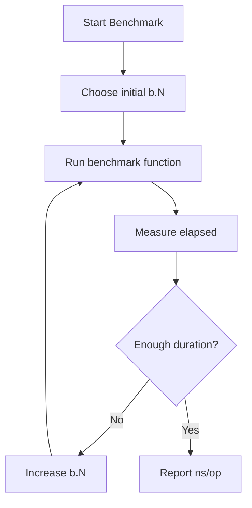
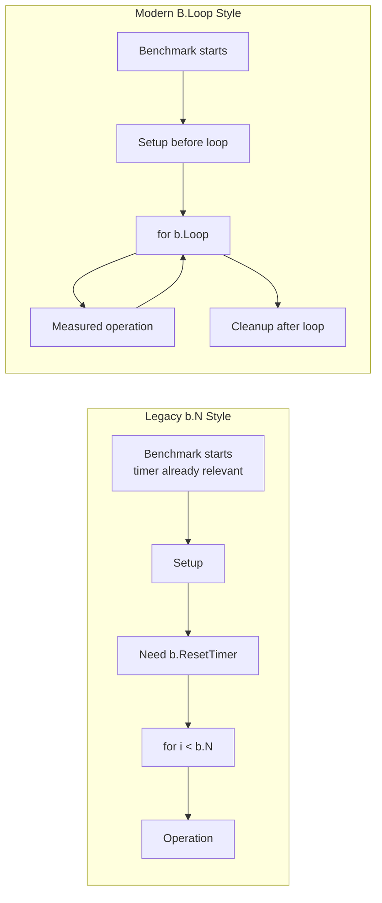
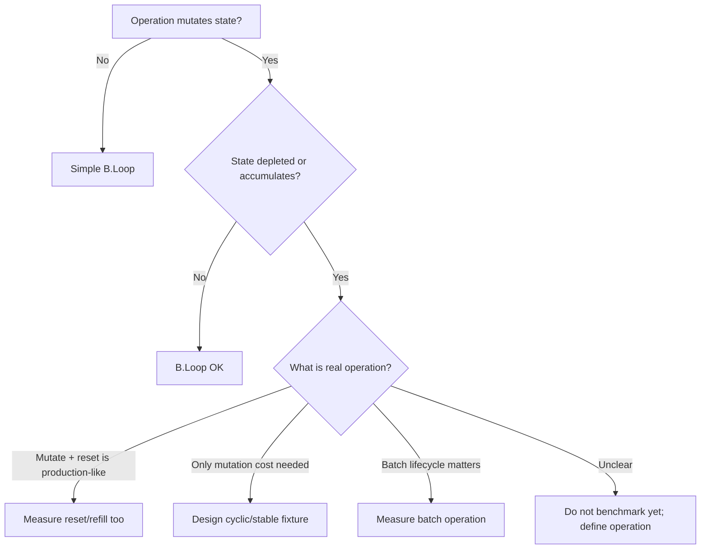
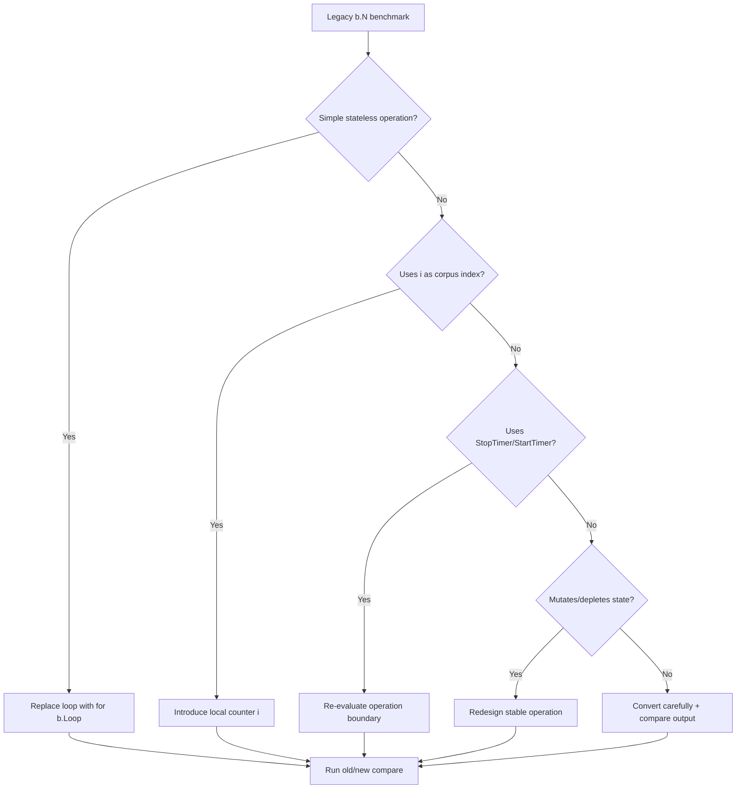
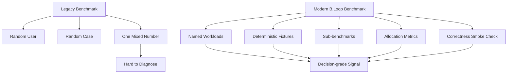

# learn-go-testing-benchmarking-performance-engineering-part-021.md

# Part 021 — Modern Go Benchmark Style with `B.Loop`

> Seri: **Go Testing, Benchmarking, Performance Engineering**  
> Target pembaca: **Java Software Engineer → Go Performance-Capable Engineer**  
> Target Go: **Go 1.26.x**  
> Status seri: **Part 021 dari 034**  
> Prasyarat: Part 020 — Benchmarking Fundamentals

---

## 0. Tujuan Part Ini

Part ini membahas **style benchmark modern di Go** menggunakan:

```go
for b.Loop() {
	// operation
}
```

Kita akan membahas bukan hanya “cara pakai”, tetapi **kenapa `B.Loop` ada**, apa problem yang ia selesaikan, apa yang masih tetap harus engineer pikirkan, dan bagaimana migrate benchmark lama berbasis `b.N`.

Setelah part ini, Anda harus bisa:

1. Menulis benchmark baru dengan `B.Loop`.
2. Memahami perbedaan mental model `B.Loop` vs `b.N`.
3. Menghindari timer misuse.
4. Mengatur setup dan cleanup dengan benar.
5. Memahami batas perlindungan `B.Loop` terhadap compiler optimization.
6. Membuat benchmark yang lebih readable, reviewable, dan sulit salah.
7. Memigrasi benchmark legacy dengan aman.
8. Mendesain benchmark matrix modern dengan sub-benchmarks.
9. Memahami kapan `b.N` masih muncul dan bagaimana membacanya.
10. Membuat review checklist untuk benchmark Go 1.26.

---

## 1. Satu Kalimat Inti

> `B.Loop` membuat benchmark Go lebih deklaratif: “jalankan body ini sebagai operasi yang diukur”, sehingga engineer tidak perlu lagi mengelola iteration counter `b.N` secara manual dan lebih sedikit terkena jebakan timer/compiler.

Tetapi:

> `B.Loop` tidak membuat benchmark otomatis benar; ia hanya mengurangi beberapa class error umum.

Benchmark tetap bisa salah jika:

- workload tidak representatif,
- operation tidak jelas,
- setup salah masuk timer,
- result tidak divalidasi,
- fake terlalu murah,
- environment noisy,
- benchmark dibandingkan tanpa statistik,
- microbenchmark ditafsirkan sebagai production latency.

---

## 2. Recap: Benchmark Legacy dengan `b.N`

Sebelum `B.Loop`, style umum:

```go
func BenchmarkNormalizePostalCode(b *testing.B) {
	input := " 123456 "

	for i := 0; i < b.N; i++ {
		_ = NormalizePostalCode(input)
	}
}
```

`b.N` adalah jumlah iterasi yang dipilih benchmark runner.

Benchmark runner akan menjalankan benchmark beberapa kali dengan nilai `b.N` berbeda sampai mencapai target measurement time.

Secara sederhana:



Masalahnya: benchmark author harus selalu ingat bahwa `b.N` adalah kontrak khusus.

---

## 3. Problem dengan Style `b.N`

Style `b.N` terlihat sederhana, tetapi punya beberapa jebakan.

### 3.1 Salah Loop

Buruk:

```go
func BenchmarkX(b *testing.B) {
	for i := 0; i < 1000; i++ {
		X()
	}
}
```

Ini bukan benchmark yang benar karena mengabaikan `b.N`.

Runner tidak bisa mengkalibrasi jumlah iterasi.

### 3.2 Setup Masuk Timer

Buruk:

```go
func BenchmarkAuthorize(b *testing.B) {
	for i := 0; i < b.N; i++ {
		engine := NewEngine(loadPolicy())
		_ = engine.Authorize(req)
	}
}
```

Mungkin yang ingin diukur adalah authorization, tetapi benchmark mengukur setup engine juga.

### 3.3 `ResetTimer` Terlupa

```go
func BenchmarkAuthorize(b *testing.B) {
	engine := NewEngine(loadPolicy())

	for i := 0; i < b.N; i++ {
		_ = engine.Authorize(req)
	}
}
```

Pada style `b.N`, setup sebelum loop umumnya tidak dihitung? Secara detail, timer sudah berjalan ketika benchmark function mulai, sehingga setup bisa ikut waktu benchmark kecuali runner/usage tertentu atau engineer memanggil `ResetTimer`.

Maka praktik lama:

```go
func BenchmarkAuthorize(b *testing.B) {
	engine := NewEngine(loadPolicy())

	b.ResetTimer()
	for i := 0; i < b.N; i++ {
		_ = engine.Authorize(req)
	}
}
```

Banyak benchmark lupa melakukan ini.

### 3.4 `StopTimer` / `StartTimer` Overuse

Beberapa benchmark legacy memakai timer manual di dalam loop:

```go
func BenchmarkX(b *testing.B) {
	for i := 0; i < b.N; i++ {
		b.StopTimer()
		input := makeInput(i)
		b.StartTimer()

		X(input)
	}
}
```

Ini bisa valid, tetapi:

- overhead timer manipulation bisa besar,
- benchmark lebih sulit dibaca,
- operation menjadi ambigu,
- sering menyembunyikan bahwa API kurang benchmarkable.

### 3.5 Dead Code Elimination dan Constant Folding

```go
func BenchmarkAdd(b *testing.B) {
	for i := 0; i < b.N; i++ {
		_ = 1 + 2
	}
}
```

Compiler bisa menghapus/mengoptimalkan work.

Style `b.N` tidak memberi perlindungan khusus.

### 3.6 Loop Body Sulit Direview

Dalam benchmark kompleks:

```go
func BenchmarkProcess(b *testing.B) {
	fixtures := loadFixtures()

	for i := 0; i < b.N; i++ {
		idx := i % len(fixtures)
		req := fixtures[idx]
		res, err := Process(req)
		if err != nil {
			b.Fatal(err)
		}
		if res.ID == "" {
			b.Fatal("empty id")
		}
	}
}
```

Reviewer harus berpikir:

- apakah `i` dipakai sebagai part of workload?
- apakah modulo overhead diukur?
- apakah validation overhead acceptable?
- apakah fixture rotation realistic?
- apakah operation = process one fixture?

Tidak salah, tetapi sering rawan ambiguity.

---

## 4. Apa Itu `B.Loop`?

`B.Loop` adalah method pada `*testing.B` yang dipakai seperti:

```go
func BenchmarkX(b *testing.B) {
	for b.Loop() {
		X()
	}
}
```

Mental model:

> Benchmark runner mengontrol berapa kali loop berjalan; benchmark author cukup menaruh operation di body loop.

Secara konseptual:

```mermaid
flowchart TD
    A[Benchmark function starts] --> B[Setup before loop]
    B --> C[for b.Loop()]
    C -->|true| D[Run measured operation]
    D --> C
    C -->|false| E[Cleanup after loop]
    E --> F[Report metrics]
```

`B.Loop` membuat benchmark terlihat lebih seperti:

```text
measure this operation repeatedly
```

bukan:

```text
manually loop from 0 to b.N
```

---

## 5. Minimal `B.Loop` Benchmark

```go
func BenchmarkNormalizePostalCode(b *testing.B) {
	input := " 123456 "

	for b.Loop() {
		_ = NormalizePostalCode(input)
	}
}
```

Dengan allocation metrics:

```go
func BenchmarkNormalizePostalCode(b *testing.B) {
	input := " 123456 "

	b.ReportAllocs()
	for b.Loop() {
		_ = NormalizePostalCode(input)
	}
}
```

Run:

```bash
go test -run='^$' -bench=BenchmarkNormalizePostalCode -benchmem ./internal/postal
```

---

## 6. `B.Loop` dan Timer Semantics

Salah satu manfaat besar `B.Loop` adalah timer handling yang lebih predictable.

Secara praktis, code sebelum loop dianggap setup, body loop adalah measured operation, dan code setelah loop adalah cleanup/validation akhir.

Contoh:

```go
func BenchmarkAuthorize(b *testing.B) {
	policy := mustLoadPolicy("testdata/policy_large.json")
	engine := NewEngine(policy)
	req := benchmarkRequest()

	for b.Loop() {
		_, _ = engine.Authorize(context.Background(), req)
	}
}
```

Di style modern, ini lebih natural daripada:

```go
func BenchmarkAuthorize_Legacy(b *testing.B) {
	policy := mustLoadPolicy("testdata/policy_large.json")
	engine := NewEngine(policy)
	req := benchmarkRequest()

	b.ResetTimer()
	for i := 0; i < b.N; i++ {
		_, _ = engine.Authorize(context.Background(), req)
	}
}
```

Namun jangan salah paham:

- `B.Loop` membantu timer boundary,
- tetapi jika Anda membuat setup di dalam loop, setup tetap diukur.

```go
func BenchmarkAuthorize_Bad(b *testing.B) {
	for b.Loop() {
		policy := mustLoadPolicy("testdata/policy_large.json")
		engine := NewEngine(policy)
		_, _ = engine.Authorize(context.Background(), req)
	}
}
```

Ini tetap mengukur load policy + construct engine + authorize.

---

## 7. Diagram: Legacy Timer vs `B.Loop`



---

## 8. Apakah `b.ResetTimer()` Masih Diperlukan?

Dengan `B.Loop`, sering tidak perlu untuk setup sederhana sebelum loop.

```go
func BenchmarkX(b *testing.B) {
	sut := NewSUT()

	for b.Loop() {
		sut.X()
	}
}
```

Tetapi `ResetTimer` masih bisa digunakan dalam beberapa kasus:

1. Anda punya setup kompleks dan ingin eksplisit.
2. Anda melakukan warmup sebelum measurement.
3. Anda mencampur API timer manual.
4. Anda menulis benchmark yang tetap memakai `b.N`.
5. Anda ingin kompatibilitas style internal tertentu.

Contoh eksplisit:

```go
func BenchmarkX(b *testing.B) {
	sut := NewSUT()
	warmUp(sut)

	b.ResetTimer()
	for b.Loop() {
		sut.X()
	}
}
```

Prinsip:

> Dengan `B.Loop`, default-nya jangan reflexively menambah `ResetTimer`. Tambahkan hanya jika ada alasan yang bisa dijelaskan.

---

## 9. `StopTimer` dan `StartTimer` dalam `B.Loop`

Kadang operation membutuhkan per-iteration setup yang tidak ingin diukur.

Contoh: operasi mutate input sehingga input harus disalin tiap iterasi, tetapi Anda ingin mengukur transform saja. Ini tricky.

```go
func BenchmarkNormalizeInPlace(b *testing.B) {
	original := []byte(" 123456 ")

	for b.Loop() {
		buf := append([]byte(nil), original...)
		NormalizeInPlace(buf)
	}
}
```

Ini mengukur copy + normalize.

Jika ingin exclude copy:

```go
func BenchmarkNormalizeInPlace_TransformOnly(b *testing.B) {
	original := []byte(" 123456 ")

	for b.Loop() {
		b.StopTimer()
		buf := append([]byte(nil), original...)
		b.StartTimer()

		NormalizeInPlace(buf)
	}
}
```

Tapi benchmark ini punya trade-off:

- timer overhead,
- allocation/copy tidak dihitung,
- operation bukan production path kalau production juga butuh copy,
- bisa menghasilkan angka yang terlalu optimis.

Alternatif desain:

```go
func BenchmarkNormalizePure(b *testing.B) {
	input := []byte(" 123456 ")

	for b.Loop() {
		_ = Normalize(input)
	}
}
```

Atau buat dua benchmark:

```go
BenchmarkNormalizeInPlace_WithCopy
BenchmarkNormalizeInPlace_TransformOnly
```

Nama harus jujur.

---

## 10. Pattern: Setup Once, Measure Operation

Ini pattern paling umum.

```go
func BenchmarkDecisionEngineEvaluate(b *testing.B) {
	engine := newBenchmarkEngine()
	req := benchmarkRequest()

	if _, err := engine.Evaluate(context.Background(), req); err != nil {
		b.Fatal(err)
	}

	b.ReportAllocs()
	for b.Loop() {
		_, _ = engine.Evaluate(context.Background(), req)
	}
}
```

Properties:

- engine construction tidak diukur,
- request construction tidak diukur,
- correctness smoke check dilakukan sebelum loop,
- operation jelas: evaluate one request,
- allocation dilaporkan.

---

## 11. Pattern: Measure Construction

Jika yang ingin diukur adalah construction:

```go
func BenchmarkNewDecisionEngine(b *testing.B) {
	policy := benchmarkPolicy()

	b.ReportAllocs()
	for b.Loop() {
		engine := NewDecisionEngine(policy)
		if engine == nil {
			b.Fatal("nil engine")
		}
	}
}
```

Operation = construct engine from preloaded policy.

Jika ingin mengukur parse + construction:

```go
func BenchmarkLoadDecisionEngineFromJSON(b *testing.B) {
	data := mustReadFile("testdata/policy_large.json")

	b.ReportAllocs()
	for b.Loop() {
		engine, err := LoadDecisionEngineFromJSON(data)
		if err != nil {
			b.Fatal(err)
		}
		if engine == nil {
			b.Fatal("nil engine")
		}
	}
}
```

Jangan beri nama `BenchmarkAuthorize` jika operation-nya construction.

---

## 12. Pattern: Measure Parsing

```go
func BenchmarkParseCaseID(b *testing.B) {
	input := "CASE-2026-000001"

	want := CaseID{
		Prefix: "CASE",
		Year:   2026,
		Seq:    1,
	}

	got, err := ParseCaseID(input)
	if err != nil {
		b.Fatal(err)
	}
	if got != want {
		b.Fatalf("got %#v, want %#v", got, want)
	}

	b.ReportAllocs()
	for b.Loop() {
		_, _ = ParseCaseID(input)
	}
}
```

Jika error check di loop terlalu mahal dibanding parsing, bisa validasi setelah loop via last result:

```go
func BenchmarkParseCaseID_LastResult(b *testing.B) {
	input := "CASE-2026-000001"
	var got CaseID
	var err error

	b.ReportAllocs()
	for b.Loop() {
		got, err = ParseCaseID(input)
	}

	if err != nil {
		b.Fatal(err)
	}
	if got.Year != 2026 {
		b.Fatalf("unexpected year: %d", got.Year)
	}
}
```

Trade-off:

- last-result check hanya mendeteksi final iteration,
- untuk deterministic pure function cukup,
- untuk stateful/nondeterministic operation kurang aman.

---

## 13. Pattern: Measure Error Path

Error path juga perlu benchmark jika hot atau attacker-controlled.

```go
func BenchmarkParseCaseID_Invalid(b *testing.B) {
	input := "not-a-case-id"

	b.ReportAllocs()
	for b.Loop() {
		_, err := ParseCaseID(input)
		if err == nil {
			b.Fatal("expected error")
		}
	}
}
```

Mengapa error path penting?

- invalid input bisa dominan di public endpoint,
- error construction bisa allocate besar,
- wrapping stack/context bisa mahal,
- attacker bisa exploit expensive invalid path,
- validation fail-fast harus terbukti.

---

## 14. Pattern: Sub-benchmark Matrix

```go
func BenchmarkParseCaseID(b *testing.B) {
	cases := []struct {
		name string
		in   string
	}{
		{"Valid", "CASE-2026-000001"},
		{"WrongPrefix", "TASK-2026-000001"},
		{"Short", "CASE-2026-1"},
		{"NoYear", "CASE-XXXX-000001"},
		{"Long", "CASE-2026-000001-EXTRA"},
	}

	for _, tc := range cases {
		b.Run(tc.name, func(b *testing.B) {
			b.ReportAllocs()
			for b.Loop() {
				_, _ = ParseCaseID(tc.in)
			}
		})
	}
}
```

Output yang bagus:

```text
BenchmarkParseCaseID/Valid-8
BenchmarkParseCaseID/WrongPrefix-8
BenchmarkParseCaseID/Short-8
BenchmarkParseCaseID/NoYear-8
BenchmarkParseCaseID/Long-8
```

Sub-benchmark membuat `benchstat` lebih useful.

---

## 15. Pattern: Variant Comparison

Membandingkan dua implementasi:

```go
func BenchmarkNormalizePostalCodeVariants(b *testing.B) {
	variants := []struct {
		name string
		fn   func(string) (string, bool)
	}{
		{"Regexp", NormalizePostalCodeRegexp},
		{"Manual", NormalizePostalCodeManual},
	}

	inputs := []struct {
		name string
		in   string
	}{
		{"Valid", "123456"},
		{"Spaces", " 123456 "},
		{"Invalid", "12A456"},
	}

	for _, variant := range variants {
		for _, input := range inputs {
			b.Run(variant.name+"/"+input.name, func(b *testing.B) {
				b.ReportAllocs()
				for b.Loop() {
					_, _ = variant.fn(input.in)
				}
			})
		}
	}
}
```

Review question:

- Apakah kedua implementation punya correctness test yang sama?
- Apakah input representatif?
- Apakah comparison fair?
- Apakah regexp precompiled?
- Apakah operation sama?
- Apakah result dipakai/validated?

---

## 16. Pattern: Size Scaling

```go
func BenchmarkDeduplicateCases(b *testing.B) {
	for _, n := range []int{10, 100, 1000, 10000} {
		b.Run(fmt.Sprintf("n=%d", n), func(b *testing.B) {
			input := buildCaseIDs(n)

			b.ReportAllocs()
			for b.Loop() {
				_ = DeduplicateCases(input)
			}
		})
	}
}
```

Ini membantu melihat scaling.

Jika function mengembalikan slice baru, pastikan hasil tidak optimized away:

```go
func BenchmarkDeduplicateCases(b *testing.B) {
	var got []CaseID

	for _, n := range []int{10, 100, 1000, 10000} {
		b.Run(fmt.Sprintf("n=%d", n), func(b *testing.B) {
			input := buildCaseIDs(n)

			b.ReportAllocs()
			for b.Loop() {
				got = DeduplicateCases(input)
			}

			if len(got) == 0 && n > 0 {
				b.Fatal("empty result")
			}
		})
	}
}
```

But beware package-level/global sinks. Prefer meaningful validation.

---

## 17. Pattern: Mixed Corpus

```go
func BenchmarkValidateSubmissionMixedCorpus(b *testing.B) {
	corpus := []Submission{
		smallValidSubmission(),
		largeValidSubmission(),
		invalidMissingApplicant(),
		invalidLateFailure(),
		deepEscalationSubmission(),
	}

	validator := NewSubmissionValidator(defaultRules())

	i := 0
	b.ReportAllocs()
	for b.Loop() {
		sub := corpus[i%len(corpus)]
		_ = validator.Validate(sub)
		i++
	}
}
```

Operation = validate one submission from deterministic rotating corpus.

Pros:

- more representative than single input,
- deterministic,
- includes branch diversity.

Cons:

- modulo overhead measured,
- mixed result hides per-class cost,
- branch predictor still deterministic,
- harder to diagnose regression.

Better: use both.

```text
BenchmarkValidateSubmission/SmallValid
BenchmarkValidateSubmission/LargeValid
BenchmarkValidateSubmission/InvalidLate
BenchmarkValidateSubmission/MixedCorpus
```

---

## 18. `B.Loop` and Result Validation

Ada tiga common styles.

### 18.1 Validate Before Loop

```go
got := Normalize(input)
if got != want {
	b.Fatalf("got %q, want %q", got, want)
}

for b.Loop() {
	_ = Normalize(input)
}
```

Cocok untuk pure deterministic operation.

### 18.2 Validate Inside Loop

```go
for b.Loop() {
	got := Normalize(input)
	if got != want {
		b.Fatalf("got %q, want %q", got, want)
	}
}
```

Cocok jika correctness bisa berubah per iteration karena state.

Trade-off: assertion cost ikut diukur.

### 18.3 Validate Last Result

```go
var got string
for b.Loop() {
	got = Normalize(input)
}

if got != want {
	b.Fatalf("got %q, want %q", got, want)
}
```

Cocok untuk pure deterministic operation dan ingin mencegah unused result.

Namun jangan overuse jika operation bisa fail intermittent.

---

## 19. `B.Loop` and Error Handling

Untuk deterministic no-error expected:

```go
func BenchmarkParseValid(b *testing.B) {
	input := "CASE-2026-000001"

	var err error
	for b.Loop() {
		_, err = ParseCaseID(input)
	}

	if err != nil {
		b.Fatal(err)
	}
}
```

Untuk operation yang bisa fail secara stateful:

```go
func BenchmarkQueueAck(b *testing.B) {
	q := newFakeQueueWithMessages(b)

	for b.Loop() {
		if err := q.AckNext(context.Background()); err != nil {
			b.Fatal(err)
		}
	}
}
```

Tetapi ini punya state depletion problem. Setelah messages habis, benchmark fail atau mengukur behavior berbeda.

Better:

```go
func BenchmarkQueueAckPreloadedCycle(b *testing.B) {
	q := newCyclicFakeQueue(b, 1024)

	for b.Loop() {
		if err := q.AckNext(context.Background()); err != nil {
			b.Fatal(err)
		}
	}
}
```

Operation must be stable across iterations.

---

## 20. State Mutation Problem

Benchmark loop menjalankan operation berkali-kali. Jika operation mutate state, hati-hati.

Buruk:

```go
func BenchmarkPop(b *testing.B) {
	q := NewQueue()
	for i := 0; i < 1000; i++ {
		q.Push(i)
	}

	for b.Loop() {
		_, _ = q.Pop()
	}
}
```

Setelah 1000 iteration, queue kosong. Benchmark berubah dari pop success ke pop empty.

Solusi:

### 20.1 Refill Inside Loop

Measures refill + pop.

```go
for b.Loop() {
	q.Push(1)
	_, _ = q.Pop()
}
```

Operation = push+pop.

### 20.2 Cyclic Data Structure

```go
q := NewCyclicQueue(1024)
for b.Loop() {
	_, _ = q.Next()
}
```

Operation = next from non-depleting structure.

### 20.3 Batch Operation

```go
func BenchmarkPopBatch(b *testing.B) {
	const batch = 1024

	for b.Loop() {
		q := NewQueue()
		for i := 0; i < batch; i++ {
			q.Push(i)
		}
		for i := 0; i < batch; i++ {
			_, _ = q.Pop()
		}
	}
}
```

Operation = full batch lifecycle. Then report custom metric if needed.

### 20.4 Use `b.N`? Not necessary.

Do not fall back to `b.N` just because stateful operation is hard. The problem is operation definition, not loop API.

---

## 21. Stateful Benchmark Diagram



---

## 22. Allocation Metrics with `B.Loop`

```go
func BenchmarkBuildAuditEvent(b *testing.B) {
	req := benchmarkRequest()

	b.ReportAllocs()
	for b.Loop() {
		_ = BuildAuditEvent(req)
	}
}
```

Run:

```bash
go test -run='^$' -bench=BenchmarkBuildAuditEvent -benchmem ./internal/audit
```

`b.ReportAllocs()` ensures allocations appear even if command forgets `-benchmem`.

For benchmark suites intended for regression tracking, prefer including `b.ReportAllocs()` in allocation-sensitive benchmarks.

---

## 23. `B.Loop` with `SetBytes`

```go
func BenchmarkEncodeCaseJSON(b *testing.B) {
	input := largeCase()
	estimatedBytes := len(mustMarshalJSON(input))

	b.SetBytes(int64(estimatedBytes))
	b.ReportAllocs()

	for b.Loop() {
		_, _ = json.Marshal(input)
	}
}
```

Caution:

- If output size changes per iteration, `SetBytes` is approximate.
- If benchmark includes compression, input size vs output size must be clear.
- For decode, bytes should usually be input bytes.
- For encode, bytes can be output bytes or input model size, but document it.

---

## 24. `B.Loop` with Custom Metrics

```go
func BenchmarkValidateBatch(b *testing.B) {
	batch := buildBatch(1000)
	validator := NewValidator()

	b.ReportAllocs()
	for b.Loop() {
		_ = validator.ValidateBatch(batch)
	}

	b.ReportMetric(float64(len(batch)), "items/op")
}
```

If wanting items/sec, you can calculate externally. Keep custom metrics simple and honest.

Bad:

```go
b.ReportMetric(999999, "confidence/op")
```

Metric must be measurable and meaningful.

---

## 25. `B.Loop` with Parallel Benchmarks

`B.Loop` is for ordinary benchmark loops. Parallel benchmark uses `b.RunParallel`.

```go
func BenchmarkCacheGetParallel(b *testing.B) {
	cache := newBenchmarkCache()

	b.ReportAllocs()
	b.RunParallel(func(pb *testing.PB) {
		for pb.Next() {
			_, _ = cache.Get("case:123")
		}
	})
}
```

Do not try to nest `b.Loop` inside `RunParallel`.

Parallel benchmarks are discussed deeply in Part 023.

---

## 26. `B.Loop` with Sub-benchmarks and Setup

```go
func BenchmarkPolicyEngine(b *testing.B) {
	policies := []struct {
		name string
		file string
	}{
		{"Small", "testdata/policy_small.json"},
		{"Large", "testdata/policy_large.json"},
	}

	for _, p := range policies {
		b.Run(p.name, func(b *testing.B) {
			engine := mustLoadEngine(p.file)
			req := allowedRequest()

			b.ReportAllocs()
			for b.Loop() {
				_, _ = engine.Evaluate(context.Background(), req)
			}
		})
	}
}
```

Important:

- setup inside `b.Run` but before `b.Loop` belongs to sub-benchmark setup.
- each sub-benchmark gets its own `*testing.B`.
- do not share mutable state unsafely across sub-benchmarks.

---

## 27. `B.Loop` and Cleanup

Use `b.Cleanup` for resource cleanup.

```go
func BenchmarkWithTempStore(b *testing.B) {
	dir := b.TempDir()
	store := NewFileStore(dir)
	b.Cleanup(func() {
		_ = store.Close()
	})

	for b.Loop() {
		_ = store.Put("key", []byte("value"))
	}
}
```

But this benchmark mutates file store each iteration. Is that intended?

If measuring `Put` into growing store, yes. If measuring steady-state put, maybe need reset strategy.

Cleanup after loop is not part of measurement. But resource side effects during loop are part of measurement.

---

## 28. `B.Loop` with `b.TempDir`

Good for file operation benchmark if operation includes file system.

```go
func BenchmarkWriteSmallFile(b *testing.B) {
	dir := b.TempDir()
	payload := []byte("hello")

	b.SetBytes(int64(len(payload)))
	b.ReportAllocs()

	for b.Loop() {
		name := filepath.Join(dir, "file-"+strconv.Itoa(randStableCounter()))
		if err := os.WriteFile(name, payload, 0o600); err != nil {
			b.Fatal(err)
		}
	}
}
```

But this includes:

- filename generation,
- OS file creation,
- filesystem cache behavior,
- directory growth effect.

If not intended, redesign.

For pure encoding, do not write file. Use `io.Discard` or buffer.

---

## 29. `B.Loop` and Context Allocation

Avoid creating context per iteration unless it is part of operation.

```go
func BenchmarkAuthorize_ContextOutside(b *testing.B) {
	engine := newEngine()
	ctx := context.Background()

	for b.Loop() {
		_, _ = engine.Authorize(ctx, req)
	}
}
```

If production creates timeout context per request:

```go
func BenchmarkAuthorize_WithTimeoutContext(b *testing.B) {
	engine := newEngine()

	for b.Loop() {
		ctx, cancel := context.WithTimeout(context.Background(), time.Second)
		_, _ = engine.Authorize(ctx, req)
		cancel()
	}
}
```

Name must say context cost is included.

---

## 30. `B.Loop` and Time

Do not use real time as operation control inside benchmark.

Bad:

```go
func BenchmarkRetry(b *testing.B) {
	for b.Loop() {
		time.Sleep(10 * time.Millisecond)
		_ = Retry()
	}
}
```

This measures sleep and makes benchmark slow.

Use fake clock or no sleep.

If measuring timer creation itself:

```go
func BenchmarkNewTimerStop(b *testing.B) {
	for b.Loop() {
		timer := time.NewTimer(time.Hour)
		if !timer.Stop() {
			<-timer.C
		}
	}
}
```

But be explicit.

---

## 31. `B.Loop` and Randomness

Bad:

```go
func BenchmarkRandomInput(b *testing.B) {
	for b.Loop() {
		in := randomString()
		_ = Parse(in)
	}
}
```

Better:

```go
func BenchmarkCorpusInput(b *testing.B) {
	corpus := buildDeterministicCorpus(1024)

	i := 0
	for b.Loop() {
		_ = Parse(corpus[i%len(corpus)])
		i++
	}
}
```

Or sub-benchmark per input class.

---

## 32. Migration from `b.N` to `B.Loop`

### 32.1 Simple Migration

Before:

```go
func BenchmarkNormalize(b *testing.B) {
	for i := 0; i < b.N; i++ {
		_ = Normalize("123456")
	}
}
```

After:

```go
func BenchmarkNormalize(b *testing.B) {
	for b.Loop() {
		_ = Normalize("123456")
	}
}
```

### 32.2 With Setup

Before:

```go
func BenchmarkAuthorize(b *testing.B) {
	engine := newEngine()
	req := request()

	b.ResetTimer()
	for i := 0; i < b.N; i++ {
		_, _ = engine.Authorize(context.Background(), req)
	}
}
```

After:

```go
func BenchmarkAuthorize(b *testing.B) {
	engine := newEngine()
	req := request()

	for b.Loop() {
		_, _ = engine.Authorize(context.Background(), req)
	}
}
```

### 32.3 With Index

Before:

```go
func BenchmarkValidateCorpus(b *testing.B) {
	corpus := loadCorpus()

	for i := 0; i < b.N; i++ {
		_ = Validate(corpus[i%len(corpus)])
	}
}
```

After:

```go
func BenchmarkValidateCorpus(b *testing.B) {
	corpus := loadCorpus()

	i := 0
	for b.Loop() {
		_ = Validate(corpus[i%len(corpus)])
		i++
	}
}
```

### 32.4 With Stop/Start Timer

Before:

```go
func BenchmarkTransform(b *testing.B) {
	for i := 0; i < b.N; i++ {
		b.StopTimer()
		input := makeInput()
		b.StartTimer()

		Transform(input)
	}
}
```

After:

```go
func BenchmarkTransform(b *testing.B) {
	for b.Loop() {
		b.StopTimer()
		input := makeInput()
		b.StartTimer()

		Transform(input)
	}
}
```

But migration should ask:

> Is excluding `makeInput` honest?

Often better to define a different benchmark.

---

## 33. Migration Decision Tree



---

## 34. Compare After Migration

Migration should not blindly change benchmark semantics.

Recommended:

```bash
# before migration
go test -run='^$' -bench=. -benchmem -count=10 ./internal/foo > old.txt

# after migration
go test -run='^$' -bench=. -benchmem -count=10 ./internal/foo > new.txt

benchstat old.txt new.txt
```

If numbers change significantly, investigate:

- timer boundary changed,
- setup no longer measured,
- result now optimized differently,
- validation changed,
- loop index overhead changed,
- benchmark semantics changed.

Some change is expected if legacy benchmark was wrong. Document that.

---

## 35. Common Migration Bugs

### 35.1 Forgetting Manual Counter

Before:

```go
for i := 0; i < b.N; i++ {
	_ = inputs[i%len(inputs)]
}
```

Bad after:

```go
for b.Loop() {
	_ = inputs[i%len(inputs)] // i undefined
}
```

Correct:

```go
i := 0
for b.Loop() {
	_ = inputs[i%len(inputs)]
	i++
}
```

### 35.2 Keeping Unnecessary `ResetTimer`

Not fatal, but noisy:

```go
b.ResetTimer()
for b.Loop() {
	X()
}
```

Maybe okay, but ask whether needed.

### 35.3 Moving Setup into Loop

Bad:

```go
for b.Loop() {
	sut := NewSUT()
	sut.X()
}
```

Unless operation includes construction.

### 35.4 Changing Operation Meaning

Before operation = `X`.

After accidentally operation = `prepare + X`.

Review carefully.

---

## 36. `B.Loop` and Compiler Optimization Protection

`B.Loop` improves benchmark robustness against some compiler optimizations, particularly around loop body treatment. But it is not magic.

Still bad:

```go
func BenchmarkConstant(b *testing.B) {
	for b.Loop() {
		_ = 1 + 2
	}
}
```

Still suspicious:

```go
func BenchmarkPureUnused(b *testing.B) {
	for b.Loop() {
		PureFunction(123)
	}
}
```

Better:

```go
func BenchmarkPureUsed(b *testing.B) {
	var got int

	for b.Loop() {
		got = PureFunction(123)
	}

	if got == 0 {
		b.Fatal("unexpected zero")
	}
}
```

But package-level sink may be needed in some micro cases. Use carefully.

---

## 37. Global Sink Revisited with `B.Loop`

Sometimes:

```go
var sink int

func BenchmarkPureFunction(b *testing.B) {
	for b.Loop() {
		sink = PureFunction(123)
	}
}
```

This prevents elimination but adds global store cost.

Alternative:

```go
func BenchmarkPureFunction(b *testing.B) {
	var got int
	for b.Loop() {
		got = PureFunction(123)
	}
	if got == -1 {
		b.Fatal(got)
	}
}
```

Which is better depends on compiler behavior and operation size.

Rules:

- prefer meaningful validation,
- avoid package-level sinks in parallel benchmark,
- document sink use if needed,
- do not cargo-cult sink everywhere.

---

## 38. Benchmarking Interface vs Concrete Call

`B.Loop` does not solve call path mismatch.

```go
func BenchmarkEvaluateConcrete(b *testing.B) {
	engine := NewEngine(policy)

	for b.Loop() {
		_, _ = engine.Evaluate(ctx, req)
	}
}
```

If production uses interface:

```go
type Evaluator interface {
	Evaluate(context.Context, Request) (Decision, error)
}
```

Also benchmark:

```go
func BenchmarkEvaluateViaInterface(b *testing.B) {
	var evaluator Evaluator = NewEngine(policy)

	for b.Loop() {
		_, _ = evaluator.Evaluate(ctx, req)
	}
}
```

The difference may be small or large depending on inlining, escape, and call path.

---

## 39. Benchmarking Generic vs Interface Variant

Example:

```go
func BenchmarkSetContainsString_Generic(b *testing.B) {
	set := NewSet[string]("a", "b", "c")

	for b.Loop() {
		_ = set.Contains("b")
	}
}

func BenchmarkSetContainsString_Interface(b *testing.B) {
	set := NewAnySet("a", "b", "c")

	for b.Loop() {
		_ = set.Contains("b")
	}
}
```

Use benchmark to compare:

- generic specialization,
- interface dispatch,
- boxing/allocation,
- map strategy,
- readability trade-off.

But decision needs workload and budget.

---

## 40. Benchmarking Allocation-Free Claims

If you claim zero allocation, enforce it with benchmark.

```go
func BenchmarkNormalizePostalCode_NoAlloc(b *testing.B) {
	input := "123456"

	b.ReportAllocs()
	for b.Loop() {
		_ = NormalizePostalCode(input)
	}
}
```

Run:

```bash
go test -run='^$' -bench=BenchmarkNormalizePostalCode_NoAlloc -benchmem ./internal/postal
```

Expected:

```text
0 B/op    0 allocs/op
```

But remember:

- zero allocation in benchmark may not mean zero allocation in production path,
- wrapper/interface/logging may allocate,
- different input may allocate,
- future Go compiler may change escape behavior.

---

## 41. Benchmarking `sync.Pool`

`sync.Pool` benchmark often misleading.

Bad:

```go
func BenchmarkPoolGetPut(b *testing.B) {
	var p sync.Pool
	p.New = func() any { return new(bytes.Buffer) }

	for b.Loop() {
		buf := p.Get().(*bytes.Buffer)
		buf.Reset()
		p.Put(buf)
	}
}
```

This measures hot pool get/put in a tight loop, not real lifecycle.

More useful:

```go
func BenchmarkEncodeWithPool(b *testing.B) {
	encoder := NewPooledEncoder()
	input := largeCase()

	b.ReportAllocs()
	for b.Loop() {
		_, _ = encoder.Encode(input)
	}
}
```

Even then, need:

- parallel benchmark,
- memory retention analysis,
- GC behavior,
- production validation.

---

## 42. Benchmarking Maps and Slices

`B.Loop` makes loop clean, but benchmark still must avoid unrealistic key access.

Bad:

```go
func BenchmarkMapLookupSameKey(b *testing.B) {
	m := buildMap(1_000_000)

	for b.Loop() {
		_ = m["case-1"]
	}
}
```

Better:

```go
func BenchmarkMapLookupCorpus(b *testing.B) {
	m := buildMap(1_000_000)
	keys := buildKeys(10_000)

	i := 0
	for b.Loop() {
		_ = m[keys[i%len(keys)]]
		i++
	}
}
```

Also benchmark miss path:

```go
func BenchmarkMapLookupMiss(b *testing.B) {
	m := buildMap(1_000_000)
	keys := buildMissingKeys(10_000)

	i := 0
	for b.Loop() {
		_ = m[keys[i%len(keys)]]
		i++
	}
}
```

---

## 43. Benchmarking Serialization

```go
func BenchmarkMarshalCaseSummaryJSON(b *testing.B) {
	summary := largeCaseSummary()

	b.ReportAllocs()
	for b.Loop() {
		out, err := json.Marshal(summary)
		if err != nil {
			b.Fatal(err)
		}
		if len(out) == 0 {
			b.Fatal("empty output")
		}
	}
}
```

For decode:

```go
func BenchmarkUnmarshalCaseSummaryJSON(b *testing.B) {
	data := mustReadFile("testdata/case_summary_large.json")

	b.SetBytes(int64(len(data)))
	b.ReportAllocs()

	for b.Loop() {
		var summary CaseSummary
		if err := json.Unmarshal(data, &summary); err != nil {
			b.Fatal(err)
		}
	}
}
```

This includes allocation for target object per iteration. That may be desired.

If target reuse matters:

```go
func BenchmarkUnmarshalCaseSummaryJSON_ReuseTarget(b *testing.B) {
	data := mustReadFile("testdata/case_summary_large.json")
	var summary CaseSummary

	b.ReportAllocs()
	for b.Loop() {
		summary = CaseSummary{}
		if err := json.Unmarshal(data, &summary); err != nil {
			b.Fatal(err)
		}
	}
}
```

Name must say reuse.

---

## 44. Benchmarking HTTP Handlers with `B.Loop`

Handler benchmark:

```go
func BenchmarkCaseHandlerGet(b *testing.B) {
	handler := newBenchmarkHandler()
	req := httptest.NewRequest(http.MethodGet, "/cases/CASE-2026-000001", nil)

	b.ReportAllocs()
	for b.Loop() {
		rr := httptest.NewRecorder()
		handler.ServeHTTP(rr, req)

		if rr.Code != http.StatusOK {
			b.Fatalf("status=%d", rr.Code)
		}
	}
}
```

This measures:

- recorder allocation,
- handler execution,
- response writing,
- maybe request reuse effects.

If request body is consumed, cannot reuse same request without resetting body.

For handler benchmark, often operation should include request/recorder setup because production has per-request objects. But be explicit.

---

## 45. Benchmarking Client Code with Fake Transport

```go
type roundTripFunc func(*http.Request) (*http.Response, error)

func (f roundTripFunc) RoundTrip(req *http.Request) (*http.Response, error) {
	return f(req)
}

func BenchmarkExternalClientLookup(b *testing.B) {
	client := &http.Client{
		Transport: roundTripFunc(func(req *http.Request) (*http.Response, error) {
			body := io.NopCloser(strings.NewReader(`{"status":"ok"}`))
			return &http.Response{
				StatusCode: http.StatusOK,
				Body:       body,
				Header:     make(http.Header),
			}, nil
		}),
	}

	svc := NewExternalClient(client)

	b.ReportAllocs()
	for b.Loop() {
		got, err := svc.Lookup(context.Background(), "123456")
		if err != nil {
			b.Fatal(err)
		}
		if got.Status != "ok" {
			b.Fatal(got)
		}
	}
}
```

This measures client code, JSON decode, response handling, but not real network.

Name accordingly.

---

## 46. Benchmarking with `httptest.Server`

```go
func BenchmarkClientAgainstHTTPServer(b *testing.B) {
	server := httptest.NewServer(http.HandlerFunc(func(w http.ResponseWriter, r *http.Request) {
		_, _ = w.Write([]byte(`{"status":"ok"}`))
	}))
	defer server.Close()

	client := NewClient(server.URL, server.Client())

	b.ReportAllocs()
	for b.Loop() {
		got, err := client.Lookup(context.Background(), "123456")
		if err != nil {
			b.Fatal(err)
		}
		if got.Status != "ok" {
			b.Fatal(got)
		}
	}
}
```

This includes real local HTTP stack:

- net/http client,
- TCP loopback,
- server handler,
- JSON handling,
- scheduling.

Useful as scenario benchmark, not microbenchmark.

---

## 47. Benchmarking Database-Like Adapters

Prefer fake for microbenchmark:

```go
func BenchmarkRepositoryMapFakeGet(b *testing.B) {
	repo := newMapFakeRepository(100_000)

	b.ReportAllocs()
	for b.Loop() {
		_, _ = repo.Get(context.Background(), "case-123")
	}
}
```

For real DB:

```go
//go:build integration

func BenchmarkRepositoryPostgresGet(b *testing.B) {
	db := openBenchmarkDB(b)
	repo := NewRepository(db)

	b.ReportAllocs()
	for b.Loop() {
		_, _ = repo.Get(context.Background(), "case-123")
	}
}
```

But real DB benchmark is environment-sensitive. It belongs in controlled pipeline.

---

## 48. `B.Loop` in CI

For quick PR benchmark smoke:

```bash
go test -run='^$' -bench='BenchmarkCriticalSmall$' -benchmem -count=3 ./internal/foo
```

For nightly:

```bash
go test -run='^$' -bench=. -benchmem -count=10 ./... > nightly.txt
```

For regression comparison:

```bash
benchstat baseline.txt candidate.txt
```

Do not make all benchmarks fail PR gate by default without stable infrastructure.

---

## 49. `B.Loop` and `benchstat`

`B.Loop` improves benchmark authoring, but statistical comparison still needs repeated runs.

```bash
go test -run='^$' -bench=. -benchmem -count=10 ./internal/authz > old.txt
go test -run='^$' -bench=. -benchmem -count=10 ./internal/authz > new.txt
benchstat old.txt new.txt
```

Interpretation belongs to Part 024, but remember:

- one run is not decision-grade,
- small delta may be noise,
- large delta may be benchmark bug,
- allocation delta often easier to trust than tiny time delta.

---

## 50. Review: `B.Loop` Does Not Replace Thinking

`B.Loop` helps with:

- benchmark readability,
- iteration control,
- timer predictability,
- some compiler optimization issues,
- reducing `b.N` boilerplate,
- making setup/operation boundary clearer.

`B.Loop` does not solve:

- poor workload,
- wrong operation,
- real dependency noise,
- state depletion,
- benchmark not linked to decision,
- absent correctness validation,
- misuse of statistics,
- production interpretation errors,
- concurrency benchmark complexity,
- load/capacity testing.

---

## 51. Case Study: Migrating Legacy Benchmark in Regulatory Workflow

### 51.1 Legacy Benchmark

```go
func BenchmarkBuildAllowedActions(b *testing.B) {
	engine := NewActionEngine(loadPolicy())

	b.ResetTimer()
	for i := 0; i < b.N; i++ {
		caseObj := randomCase()
		user := randomUser()
		_ = engine.BuildAllowedActions(context.Background(), user, caseObj)
	}
}
```

Problems:

- random input,
- random generation maybe not measured but affects determinism,
- operation unclear,
- no correctness validation,
- policy load hidden,
- only one mixed benchmark,
- no workload classes,
- no allocation reporting.

### 51.2 Modern Benchmark

```go
func BenchmarkBuildAllowedActions(b *testing.B) {
	engine := NewActionEngine(mustLoadPolicy("testdata/action_policy_large.json"))

	workloads := []struct {
		name string
		user User
		caze Case
		wantMinActions int
	}{
		{
			name: "AssignedOfficer_OpenCase",
			user: assignedOfficer(),
			caze: openCaseAssignedToOfficer(),
			wantMinActions: 3,
		},
		{
			name: "Supervisor_EscalatedCase",
			user: supervisor(),
			caze: escalatedCase(),
			wantMinActions: 5,
		},
		{
			name: "ExternalUser_ClosedCase",
			user: externalUser(),
			caze: closedCase(),
			wantMinActions: 0,
		},
	}

	for _, wl := range workloads {
		b.Run(wl.name, func(b *testing.B) {
			got := engine.BuildAllowedActions(context.Background(), wl.user, wl.caze)
			if len(got) < wl.wantMinActions {
				b.Fatalf("actions=%d, want at least %d", len(got), wl.wantMinActions)
			}

			b.ReportAllocs()
			for b.Loop() {
				_ = engine.BuildAllowedActions(context.Background(), wl.user, wl.caze)
			}
		})
	}
}
```

### 51.3 Better: Last Result Validation

```go
func BenchmarkBuildAllowedActions(b *testing.B) {
	engine := NewActionEngine(mustLoadPolicy("testdata/action_policy_large.json"))
	user := supervisor()
	caze := escalatedCase()

	var got []Action

	b.ReportAllocs()
	for b.Loop() {
		got = engine.BuildAllowedActions(context.Background(), user, caze)
	}

	if len(got) < 5 {
		b.Fatalf("actions=%d, want at least 5", len(got))
	}
}
```

Use if function deterministic and want lower validation overhead.

---

## 52. Case Study Diagram



---

## 53. Style Guide: Preferred Benchmark Template

Use this as default for new benchmark:

```go
func BenchmarkOperationVariant(b *testing.B) {
	// 1. Build deterministic workload.
	input := benchmarkInput()

	// 2. Build SUT.
	sut := newBenchmarkSUT()

	// 3. Validate correctness once.
	got, err := sut.Operation(context.Background(), input)
	if err != nil {
		b.Fatal(err)
	}
	if !valid(got) {
		b.Fatalf("invalid result: %#v", got)
	}

	// 4. Report allocation if relevant.
	b.ReportAllocs()

	// 5. Measure operation.
	for b.Loop() {
		_, _ = sut.Operation(context.Background(), input)
	}
}
```

For matrix:

```go
func BenchmarkOperation(b *testing.B) {
	for _, tc := range benchmarkCases() {
		b.Run(tc.Name, func(b *testing.B) {
			sut := newBenchmarkSUT(tc.Config)

			b.ReportAllocs()
			for b.Loop() {
				_, _ = sut.Operation(context.Background(), tc.Input)
			}
		})
	}
}
```

---

## 54. Style Guide: Naming

Prefer:

```text
BenchmarkParseCaseID/Valid
BenchmarkParseCaseID/InvalidWrongPrefix
BenchmarkAuthorize/RBAC_10Roles_Allowed
BenchmarkAuthorize/ABAC_100Attrs_Denied
BenchmarkBuildAllowedActions/ListingPage_100Cases_20Actions
BenchmarkMarshalCaseSummary/Large
BenchmarkUnmarshalCaseSummary/Large_ReuseTarget
```

Avoid:

```text
BenchmarkFast
BenchmarkSlow
BenchmarkOld
BenchmarkNew
BenchmarkTest
BenchmarkService
BenchmarkProcess
```

---

## 55. Style Guide: File Naming

Suggested:

```text
foo_test.go
foo_bench_test.go
foo_integration_test.go
foo_fuzz_test.go
```

Example:

```text
internal/authz/
  engine.go
  engine_test.go
  engine_bench_test.go
  policy.go
  policy_test.go
  policy_bench_test.go
  testdata/
    policy_small.json
    policy_large.json
```

---

## 56. Style Guide: Comments

Benchmarks should include comments when the operation boundary is non-obvious.

```go
func BenchmarkAuthorizeListingPage(b *testing.B) {
	// One operation represents computing allowed actions for one listing page
	// containing 100 cases and 20 possible actions per case.
	page := benchmarkListingPage(100)
	engine := benchmarkActionEngine(20)

	b.ReportAllocs()
	for b.Loop() {
		_ = engine.BuildAllowedActionsForPage(context.Background(), page)
	}
}
```

Do not over-comment obvious microbenchmarks.

---

## 57. Checklist: New `B.Loop` Benchmark Review

### 57.1 Semantics

- [ ] Does the benchmark use `for b.Loop()`?
- [ ] Is one operation clearly defined?
- [ ] Does benchmark name match operation?
- [ ] Is setup outside the measured loop unless intentional?
- [ ] Is per-iteration setup intentional?

### 57.2 Correctness

- [ ] Is result validated before, inside, or after loop?
- [ ] Are errors handled?
- [ ] Is the operation meaningful and not optimized away?

### 57.3 Workload

- [ ] Is input deterministic?
- [ ] Is input representative?
- [ ] Are size/error/worst cases covered where relevant?
- [ ] Are random/time/env dependencies controlled?

### 57.4 Metrics

- [ ] Is `b.ReportAllocs()` used if allocation matters?
- [ ] Is `b.SetBytes()` used for byte throughput?
- [ ] Are custom metrics meaningful?

### 57.5 State

- [ ] Does operation mutate state?
- [ ] If state mutates, does it remain stable across iterations?
- [ ] If state grows/depletes, is that intended and named?

### 57.6 Comparison

- [ ] Is this benchmark comparable with previous baseline?
- [ ] Are migration effects documented if converting from `b.N`?
- [ ] Will repeated runs and `benchstat` be used for decisions?

---

## 58. Anti-Patterns Specific to `B.Loop`

### 58.1 Treating `B.Loop` as Magic

```go
func BenchmarkX(b *testing.B) {
	for b.Loop() {
		_ = 1 + 2
	}
}
```

Still nonsense.

### 58.2 Hiding Setup in Loop

```go
for b.Loop() {
	sut := NewSUT()
	sut.X()
}
```

Unless measuring construction, this is wrong.

### 58.3 State Depletion

```go
for b.Loop() {
	q.Pop()
}
```

If queue eventually empty, benchmark changes behavior mid-run.

### 58.4 Random Corpus Per Iteration

```go
for b.Loop() {
	_ = Validate(randomSubmission())
}
```

Not repeatable.

### 58.5 Assertion Heavy Loop Without Intent

```go
for b.Loop() {
	got := X()
	if diff := cmp.Diff(want, got); diff != "" {
		b.Fatal(diff)
	}
}
```

This measures `cmp.Diff` in every operation. Validate outside/after unless intended.

### 58.6 Benchmarking External Service Accidentally

```go
for b.Loop() {
	http.Get("https://real-service")
}
```

Not a microbenchmark.

---

## 59. Mini Exercise 1: Convert to `B.Loop`

Legacy:

```go
func BenchmarkNormalize(b *testing.B) {
	input := " 123456 "
	b.ResetTimer()
	for i := 0; i < b.N; i++ {
		_ = Normalize(input)
	}
}
```

Modern:

```go
func BenchmarkNormalize(b *testing.B) {
	input := " 123456 "

	for b.Loop() {
		_ = Normalize(input)
	}
}
```

Optional:

```go
func BenchmarkNormalize(b *testing.B) {
	input := " 123456 "

	got := Normalize(input)
	if got != "123456" {
		b.Fatalf("got %q", got)
	}

	b.ReportAllocs()
	for b.Loop() {
		_ = Normalize(input)
	}
}
```

---

## 60. Mini Exercise 2: Fix Stateful Benchmark

Bad:

```go
func BenchmarkDeleteCase(b *testing.B) {
	store := newStoreWithCases(1000)

	for b.Loop() {
		_ = store.Delete("case-1")
	}
}
```

Problem:

- first delete succeeds,
- later delete may be no-op/not found,
- operation changes after first iteration.

Fix option A: benchmark idempotent delete-not-found explicitly.

```go
func BenchmarkDeleteCase_NotFound(b *testing.B) {
	store := newStoreWithCases(1000)

	_ = store.Delete("case-1")

	for b.Loop() {
		_ = store.Delete("case-1")
	}
}
```

Fix option B: benchmark delete with insert.

```go
func BenchmarkDeleteCase_InsertThenDelete(b *testing.B) {
	store := newStoreWithCases(1000)

	i := 0
	for b.Loop() {
		id := fmt.Sprintf("case-bench-%d", i)
		store.Insert(id, Case{})
		_ = store.Delete(id)
		i++
	}
}
```

Fix option C: benchmark batch lifecycle.

```go
func BenchmarkDeleteCase_BatchLifecycle(b *testing.B) {
	for b.Loop() {
		store := newStoreWithCases(1000)
		for i := 0; i < 1000; i++ {
			_ = store.Delete(fmt.Sprintf("case-%d", i))
		}
	}
}
```

Different operations, different names.

---

## 61. Mini Exercise 3: Design `B.Loop` Benchmark Matrix

Requirement:

> Measure performance of `BuildCaseTimeline` for cases with different audit history size.

Benchmark:

```go
func BenchmarkBuildCaseTimeline(b *testing.B) {
	sizes := []int{10, 100, 1000, 10000}

	for _, n := range sizes {
		b.Run(fmt.Sprintf("events=%d", n), func(b *testing.B) {
			events := benchmarkAuditEvents(n)

			var timeline Timeline
			b.ReportAllocs()
			for b.Loop() {
				timeline = BuildCaseTimeline(events)
			}

			if len(timeline.Items) == 0 && n > 0 {
				b.Fatal("empty timeline")
			}
		})
	}
}
```

Review:

- operation = build timeline from prebuilt events,
- event generation not measured,
- output validated,
- size scaling visible,
- allocation reported.

---

## 62. What to Remember

1. Prefer `B.Loop` for new Go benchmarks.
2. `B.Loop` makes operation boundary clearer.
3. Setup before loop is easier to reason about.
4. Do not put setup in loop unless measuring setup.
5. `B.Loop` does not make bad workload good.
6. State mutation remains a major benchmark hazard.
7. Result validation is still necessary.
8. Allocation reporting remains necessary.
9. Parallel benchmark still uses `RunParallel` and `PB.Next`.
10. Migration from `b.N` requires semantic review, not mechanical replacement.
11. Always compare before/after migration if benchmark numbers matter.
12. Benchmark name must honestly describe measured operation.

---

## 63. References

Official and primary sources:

- Go `testing` package documentation: <https://pkg.go.dev/testing>
- Go blog — More predictable benchmarking with `testing.B.Loop`: <https://go.dev/blog/testing-b-loop>
- Go blog — Using Subtests and Sub-benchmarks: <https://go.dev/blog/subtests>
- Go command documentation: <https://pkg.go.dev/cmd/go>
- Go source — `testing/benchmark.go`: <https://go.dev/src/testing/benchmark.go>
- Go release notes: <https://go.dev/doc/devel/release>
- `benchstat`: <https://pkg.go.dev/golang.org/x/perf/cmd/benchstat>

---

## 64. Next Part

Part berikutnya:

```text
learn-go-testing-benchmarking-performance-engineering-part-022.md
```

Judul:

```text
Allocation Benchmarking: ReportAllocs, AllocsPerRun, Escape-Aware Interpretation
```

Kita akan membahas:

- `B/op`,
- `allocs/op`,
- `ReportAllocs`,
- `testing.AllocsPerRun`,
- escape analysis,
- stack vs heap,
- allocation budgets,
- pool trade-off,
- allocation regression,
- dan cara membaca allocation benchmark tanpa salah kesimpulan.

---

## Status Seri

```text
Part 021 dari 034 selesai.
Seri belum selesai.
```

<!-- NAVIGATION_FOOTER -->
<div class="page-nav">
<a href="./learn-go-testing-benchmarking-performance-engineering-part-020.md">⬅️ Part 020 — Benchmarking Fundamentals: What Go Benchmarks Actually Measure</a>
<a href="./index.md">📚 Kategori</a>
<a href="../../index.md">🏠 Home</a>
<a href="./learn-go-testing-benchmarking-performance-engineering-part-022.md">Part 022 — Allocation Benchmarking: `ReportAllocs`, `AllocsPerRun`, Escape-Aware Interpretation ➡️</a>
</div>
