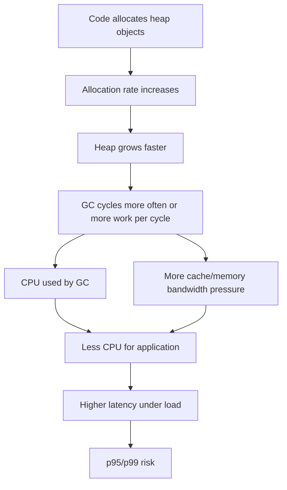
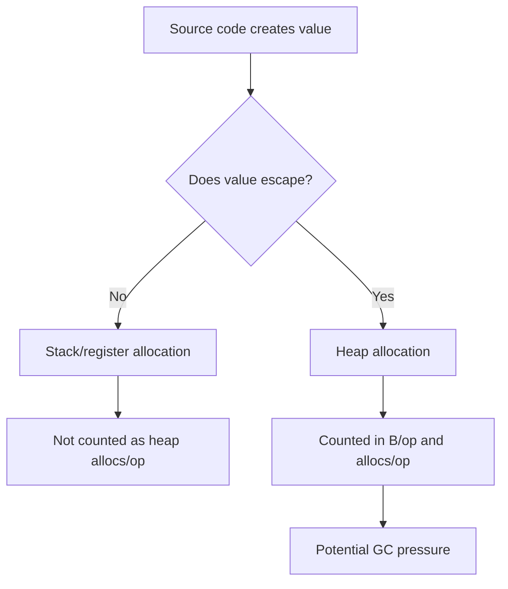
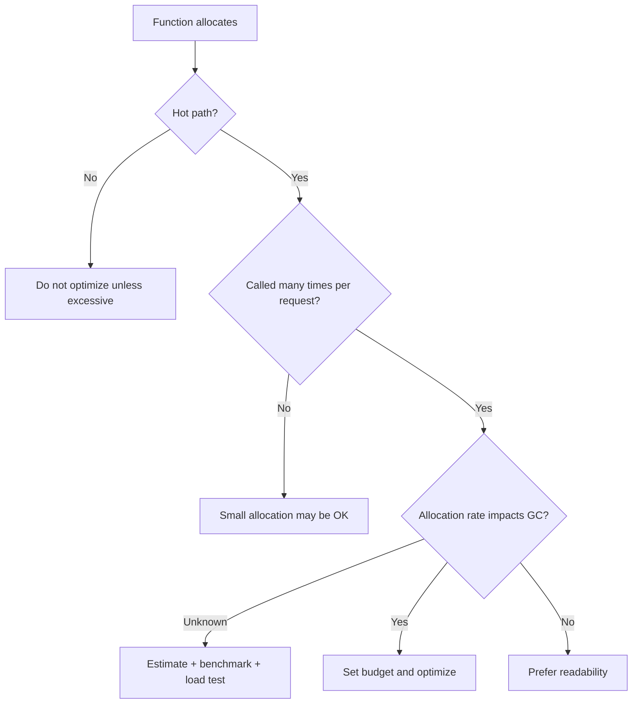
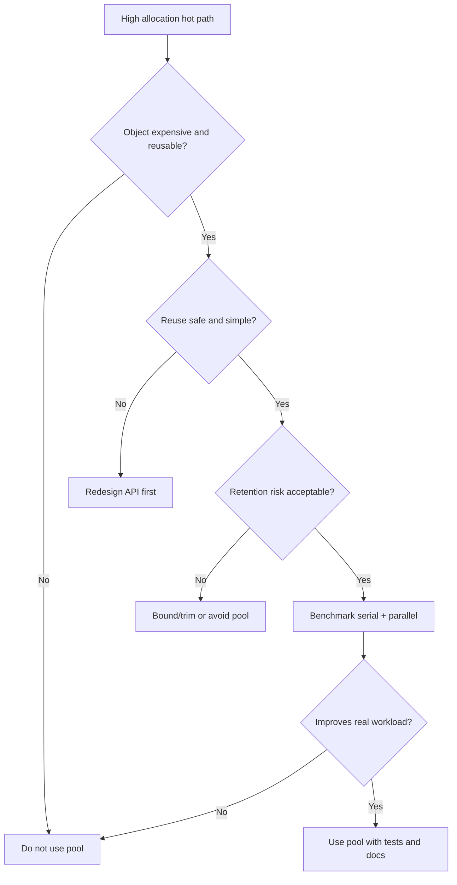
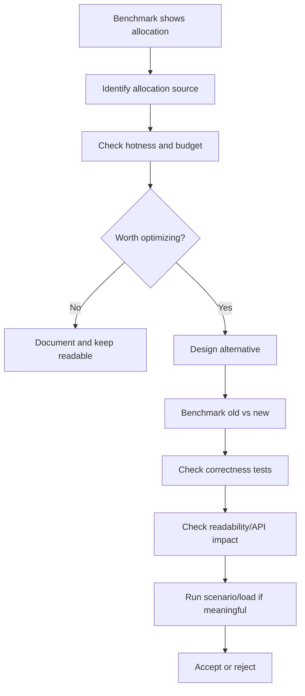

# learn-go-testing-benchmarking-performance-engineering-part-022.md

# Part 022 — Allocation Benchmarking: `ReportAllocs`, `AllocsPerRun`, Escape-Aware Interpretation

> Seri: **Go Testing, Benchmarking, Performance Engineering**  
> Target pembaca: **Java Software Engineer → Go Performance-Capable Engineer**  
> Target Go: **Go 1.26.x**  
> Status seri: **Part 022 dari 034**  
> Prasyarat: Part 020–021, Go memory system series, dan pemahaman dasar GC/escape analysis.

---

## 0. Tujuan Part Ini

Part ini membahas **allocation benchmarking** di Go.

Fokusnya bukan sekadar membaca:

```text
128 B/op    4 allocs/op
```

Tetapi memahami:

1. Apa arti `B/op` dan `allocs/op`.
2. Apa yang dihitung dan tidak dihitung.
3. Kenapa allocation sering lebih penting daripada `ns/op`.
4. Bagaimana memakai `b.ReportAllocs()`.
5. Bagaimana memakai `testing.AllocsPerRun`.
6. Bagaimana escape analysis memengaruhi hasil benchmark.
7. Kenapa stack allocation tidak sama dengan heap allocation.
8. Kenapa `0 allocs/op` bisa benar tetapi tetap misleading.
9. Kenapa pooling bisa memperbaiki benchmark tetapi merusak sistem.
10. Bagaimana membuat allocation budget.
11. Bagaimana mendeteksi allocation regression.
12. Bagaimana menghubungkan allocation benchmark dengan GC pressure dan tail latency.
13. Bagaimana melakukan review benchmark allocation secara engineering-grade.

---

## 1. Satu Kalimat Inti

> Allocation benchmark mengukur heap allocation pressure per benchmark operation, bukan seluruh biaya memori program, dan harus dibaca bersama workload, escape behavior, lifetime object, GC pressure, dan call frequency.

Allocation metric berguna karena Go punya garbage collector. Semakin banyak heap allocation:

- semakin banyak object perlu dilacak,
- semakin sering GC bekerja,
- semakin besar memory bandwidth pressure,
- semakin besar cache pressure,
- semakin besar tail latency risk,
- semakin mungkin terjadi memory growth,
- semakin besar cost per request pada load tinggi.

Tetapi allocation metric juga mudah disalahartikan. Tidak semua allocation buruk, dan tidak semua zero-allocation optimization layak.

---

## 2. Kenapa Allocation Penting di Go?

Go membuat allocation sangat mudah.

```go
return &Decision{
	Allowed: true,
	Reason:  "role matched",
}
```

```go
return fmt.Sprintf("%s-%d", prefix, seq)
```

```go
return append([]Action(nil), actions...)
```

```go
return map[string]any{
	"id": caseID,
}
```

Semua bisa membuat heap allocation tergantung context.

Allocation penting karena:

1. allocation sendiri butuh kerja allocator,
2. object di heap perlu di-scan atau minimal dikelola GC,
3. object lifetime pendek bisa menciptakan allocation rate tinggi,
4. allocation rate tinggi bisa menaikkan frekuensi GC,
5. GC bisa memengaruhi latency distribution,
6. allocation bisa mengindikasikan API shape yang boros,
7. allocation regression sering muncul lebih stabil daripada tiny `ns/op` regression.

---

## 3. Diagram: Dari Allocation ke Tail Latency



Microbenchmark allocation bukan tail latency measurement, tetapi bisa menjadi early warning.

---

## 4. Apa Itu `B/op`?

Output:

```text
BenchmarkBuildAuditEvent-8    500000    2400 ns/op    1024 B/op    12 allocs/op
```

`1024 B/op` berarti:

> Rata-rata bytes heap-allocated per benchmark operation.

Jika benchmark operation = satu call `BuildAuditEvent`, maka interpretasinya:

```text
BuildAuditEvent allocates around 1024 bytes per call in this benchmark shape.
```

Tetapi jika benchmark operation = satu batch 100 items:

```go
for b.Loop() {
	_ = BuildBatch(items100)
}
```

Maka:

```text
1024 B/op = 1024 bytes per batch, not per item
```

Jika ingin per item:

```text
1024 B/op / 100 items = 10.24 B/item
```

Jangan membaca `B/op` tanpa mengetahui definisi operation.

---

## 5. Apa Itu `allocs/op`?

`allocs/op` berarti:

> Rata-rata jumlah heap allocation events per benchmark operation.

Contoh:

```text
1024 B/op    12 allocs/op
```

Artinya rata-rata satu operation melakukan sekitar 12 heap allocations dengan total sekitar 1024 bytes.

Perbedaan penting:

| Metric | Fokus |
|---|---|
| `B/op` | total bytes allocated |
| `allocs/op` | jumlah allocation events |

Dua function bisa punya total bytes sama tetapi allocation count berbeda:

```text
A: 1024 B/op    1 allocs/op
B: 1024 B/op    64 allocs/op
```

Biasanya `B` lebih buruk karena banyak object kecil:

- lebih banyak allocator metadata/work,
- lebih banyak pointer/object header,
- lebih banyak GC bookkeeping,
- lebih buruk cache locality.

Tetapi konteks tetap penting.

---

## 6. Cara Menampilkan Allocation Metrics

### 6.1 Dengan Command `-benchmem`

```bash
go test -run='^$' -bench=. -benchmem ./internal/audit
```

Output:

```text
BenchmarkBuildAuditEvent-8    500000    2400 ns/op    1024 B/op    12 allocs/op
```

### 6.2 Dengan `b.ReportAllocs()`

```go
func BenchmarkBuildAuditEvent(b *testing.B) {
	req := benchmarkRequest()

	b.ReportAllocs()
	for b.Loop() {
		_ = BuildAuditEvent(req)
	}
}
```

Meskipun command lupa `-benchmem`, allocation tetap dilaporkan untuk benchmark ini.

### 6.3 Praktik yang Disarankan

Untuk benchmark allocation-sensitive:

```go
b.ReportAllocs()
```

Untuk exploratory/manual:

```bash
-benchmem
```

Untuk CI/perf history:

- pakai keduanya untuk important benchmark,
- simpan output raw,
- bandingkan dengan `benchstat`.

---

## 7. Allocation Benchmark Minimal

```go
func BenchmarkNormalizePostalCode(b *testing.B) {
	input := " 123456 "

	b.ReportAllocs()
	for b.Loop() {
		_ = NormalizePostalCode(input)
	}
}
```

Expected ideal untuk normalizer kecil:

```text
0 B/op    0 allocs/op
```

Jika hasil:

```text
32 B/op    2 allocs/op
```

investigate:

- `strings.TrimSpace` behavior,
- substring/string allocation,
- regexp usage,
- `fmt.Sprintf`,
- conversion `[]byte(input)`,
- error construction,
- interface boxing,
- escape caused by result handling.

---

## 8. Allocation Metric Bukan Semua Memory Cost

`B/op` tidak berarti:

- peak RSS,
- retained heap,
- stack memory,
- memory mapped file,
- OS page cache,
- native/cgo allocation,
- kernel buffer,
- object lifetime,
- GC pause time,
- cache miss rate,
- fragmentation.

Allocation benchmark mengukur heap allocations recorded by Go benchmark machinery for the operation.

Jadi:

```text
0 B/op
```

tidak berarti program tidak menggunakan memori.

---

## 9. Stack vs Heap Allocation

Go compiler memutuskan apakah value bisa berada di stack atau harus escape ke heap.

Contoh:

```go
func MakeDecision() Decision {
	return Decision{Allowed: true}
}
```

Kemungkinan no heap allocation.

```go
func MakeDecisionPtr() *Decision {
	return &Decision{Allowed: true}
}
```

Bisa heap allocation jika pointer escape. Tetapi compiler bisa melakukan optimasi tertentu tergantung caller.

Benchmark shape bisa memengaruhi escape.

---

## 10. Diagram: Escape Analysis dan Allocation Benchmark



---

## 11. Benchmark Shape Bisa Mengubah Escape

Contoh:

```go
func BuildDecision() Decision {
	return Decision{Allowed: true}
}
```

Benchmark:

```go
func BenchmarkBuildDecisionUnused(b *testing.B) {
	for b.Loop() {
		_ = BuildDecision()
	}
}
```

Compiler bisa sangat mengoptimalkan.

Benchmark yang lebih representatif:

```go
func BenchmarkBuildDecisionStored(b *testing.B) {
	var got Decision

	for b.Loop() {
		got = BuildDecision()
	}

	if !got.Allowed {
		b.Fatal("unexpected decision")
	}
}
```

Jika production menyimpan ke interface:

```go
func BenchmarkBuildDecisionAsInterface(b *testing.B) {
	var got any

	for b.Loop() {
		got = BuildDecision()
	}

	if got == nil {
		b.Fatal("nil")
	}
}
```

Ini bisa menyebabkan boxing/escape berbeda.

Lesson:

> Allocation benchmark mengukur code + call shape, bukan function in isolation secara absolut.

---

## 12. Escape Analysis Command

Untuk melihat escape analysis:

```bash
go test -run='^$' -bench=BenchmarkBuildDecision -gcflags='all=-m=2' ./internal/decision
```

Output bisa panjang, tetapi cari:

```text
escapes to heap
moved to heap
does not escape
```

Gunakan untuk investigasi, bukan sebagai final truth tunggal.

Praktik:

```bash
go test -run='^$' -bench=BenchmarkX -benchmem ./internal/foo
go test -run='^$' -bench=BenchmarkX -gcflags='all=-m=2' ./internal/foo 2> escape.txt
```

Lalu cocokkan:

- allocation metric,
- escape report,
- source line,
- benchmark shape.

---

## 13. `testing.AllocsPerRun`

Selain benchmark output, Go menyediakan:

```go
testing.AllocsPerRun(runs int, f func()) float64
```

Contoh unit test untuk memastikan zero allocation:

```go
func TestNormalizePostalCodeAllocations(t *testing.T) {
	allocs := testing.AllocsPerRun(1000, func() {
		_ = NormalizePostalCode("123456")
	})

	if allocs != 0 {
		t.Fatalf("allocs/run=%v, want 0", allocs)
	}
}
```

Ini bukan benchmark output, tetapi test assertion terhadap allocation.

---

## 14. Kapan Memakai `AllocsPerRun`?

Cocok untuk:

- memastikan hot path zero allocation,
- guarding accidental allocation regression,
- small deterministic pure function,
- API contract internal,
- parser/normalizer critical path,
- allocation-sensitive library.

Tidak cocok untuk:

- large scenario with noisy allocation,
- code dengan runtime-dependent allocation,
- code dengan maps yang grow,
- code dengan sync.Pool,
- code dengan background goroutine,
- code dengan IO/network,
- code yang allocation-nya legitimate tapi berubah dengan Go version.

---

## 15. `AllocsPerRun` sebagai Quality Gate

Contoh:

```go
func TestParseCaseIDAllocs(t *testing.T) {
	allocs := testing.AllocsPerRun(1000, func() {
		_, err := ParseCaseID("CASE-2026-000001")
		if err != nil {
			t.Fatal(err)
		}
	})

	if allocs > 0 {
		t.Fatalf("ParseCaseID allocs/run=%v, want 0", allocs)
	}
}
```

Caveat:

- test ini bisa brittle jika compiler/runtime berubah,
- zero allocation harus benar-benar bernilai,
- jangan pakai untuk semua function,
- gunakan hanya untuk hot path yang memang punya budget.

Better for non-zero budget:

```go
if allocs > 2 {
	t.Fatalf("allocs/run=%v, want <= 2", allocs)
}
```

Tapi threshold non-zero allocation bisa flaky tergantung implementation.

---

## 16. Difference: Benchmark Allocation vs `AllocsPerRun`

| Aspect | Benchmark `-benchmem` | `testing.AllocsPerRun` |
|---|---|---|
| Purpose | measurement/reporting | test assertion |
| Output | benchmark result | pass/fail if asserted |
| Best use | compare performance | guard strict allocation contract |
| Works with `benchstat` | yes | no |
| Risk | misinterpretation | brittle tests |
| Typical target | benchmark files | unit test for hot path |

Keduanya bisa dipakai bersama.

---

## 17. Allocation Budget

Allocation budget adalah batas eksplisit untuk operation.

Contoh:

```text
ParseCaseID:
  target: 0 allocs/op
  reason: called for every request and log event

BuildAuditEvent:
  target: <= 8 allocs/op, <= 2 KiB/op
  reason: called multiple times per case transition

BuildCaseTimeline:
  target: O(n) allocations, <= 3 allocations per event
  reason: case history page can include thousands of events
```

Budget harus dikaitkan dengan:

- call frequency,
- request rate,
- latency budget,
- GC budget,
- readability trade-off,
- production workload.

---

## 18. Allocation Budget Decision Tree



---

## 19. Estimating Allocation Rate

Benchmark:

```text
BenchmarkBuildAuditEvent-8    2048 B/op    12 allocs/op
```

Production:

```text
20 audit events per request
200 RPS
```

Estimate bytes/sec:

```text
2048 B/op * 20 op/request * 200 request/sec
= 8,192,000 B/sec
≈ 7.8 MiB/sec
```

Estimate allocs/sec:

```text
12 allocs/op * 20 op/request * 200 request/sec
= 48,000 allocs/sec
```

This may be meaningful.

If 1000 RPS:

```text
2048 * 20 * 1000 = 40,960,000 B/sec
≈ 39 MiB/sec
```

Much more meaningful.

---

## 20. Allocation Rate vs Retained Memory

High allocation rate does not always mean high retained memory.

Example:

```go
func BuildTempBuffer() []byte {
	buf := make([]byte, 1024)
	// use buf briefly
	return nil
}
```

High allocation, low retention.

But GC still processes allocation churn.

Low allocation rate can still lead to high retained memory:

```go
globalCache[key] = largeValue
```

Few allocations, huge retention.

Benchmark allocation measures churn, not retention.

---

## 21. Allocation and GC Pressure

Go GC cost roughly relates to live heap and allocation rate, but exact behavior depends on runtime, object graph, pointer density, GOGC, GOMEMLIMIT, workload, and Go version.

Allocation benchmark gives signal:

- high `B/op` = possible allocation rate issue,
- high `allocs/op` = many object issue,
- zero alloc = likely lower GC pressure for that operation.

But to confirm system impact:

- run scenario benchmark,
- profile heap/alloc,
- run load test,
- inspect runtime metrics,
- observe production.

---

## 22. Object Count vs Byte Count

Which is worse?

```text
A: 64 KiB/op    1 allocs/op
B: 4 KiB/op     200 allocs/op
```

Depends.

`A`:

- large buffer,
- memory bandwidth,
- possible large object behavior,
- maybe easier for GC if pointer-free.

`B`:

- many small objects,
- allocator overhead,
- GC metadata,
- pointer graph,
- cache misses.

In Go, many small pointer-rich objects are often expensive for GC.

But do not assume; measure and profile.

---

## 23. Pointer-Free vs Pointer-Rich Allocation

Allocation bytes are not equal.

```go
make([]byte, 1<<20)
```

Large but pointer-free.

```go
make([]*Node, 100_000)
```

Pointer-rich.

GC scanning cost differs.

Benchmark `B/op` does not directly show pointer density.

For GC-sensitive code, inspect:

- type layout,
- pointer fields,
- heap profile,
- runtime metrics,
- production behavior.

---

## 24. Common Allocation Sources

### 24.1 `fmt`

```go
fmt.Sprintf("CASE-%d", n)
```

Often allocates.

Alternative:

```go
strconv.AppendInt(buf, int64(n), 10)
```

But only optimize if needed.

### 24.2 String/Byte Conversion

```go
[]byte(s)
string(b)
```

Often copies/allocates.

### 24.3 `encoding/json`

JSON encode/decode commonly allocates.

### 24.4 Interface Boxing

```go
var x any = value
```

Can cause escape depending on context.

### 24.5 Closure Capture

```go
return func() { use(x) }
```

Can allocate.

### 24.6 `append` Growth

```go
var out []T
for _, x := range in {
	out = append(out, f(x))
}
```

Can allocate repeatedly if capacity not pre-sized.

### 24.7 Map Growth

```go
m := map[string]T{}
```

Can allocate/grow repeatedly.

### 24.8 Error Formatting

```go
fmt.Errorf("invalid case %s: %w", id, err)
```

Allocates; okay on cold/error path, maybe issue on hot invalid path.

### 24.9 Regex

Regexp can allocate depending usage.

### 24.10 Reflection

Reflection-heavy code often allocates.

---

## 25. Example: Slice Preallocation

Bad:

```go
func BuildActions(perms []Permission) []Action {
	var actions []Action
	for _, p := range perms {
		if p.Allowed {
			actions = append(actions, Action{Name: p.Name})
		}
	}
	return actions
}
```

Benchmark may show:

```text
2048 B/op    8 allocs/op
```

Better if upper bound acceptable:

```go
func BuildActions(perms []Permission) []Action {
	actions := make([]Action, 0, len(perms))
	for _, p := range perms {
		if p.Allowed {
			actions = append(actions, Action{Name: p.Name})
		}
	}
	return actions
}
```

May show:

```text
1024 B/op    1 allocs/op
```

Trade-off:

- prealloc full len may overallocate if few allowed,
- prealloc improves allocation count,
- memory footprint can increase,
- choose based on distribution.

---

## 26. Benchmark for Preallocation

```go
func BenchmarkBuildActions(b *testing.B) {
	workloads := []struct {
		name  string
		perms []Permission
	}{
		{"10_AllAllowed", permissions(10, 1.0)},
		{"100_10PercentAllowed", permissions(100, 0.1)},
		{"100_AllAllowed", permissions(100, 1.0)},
		{"1000_10PercentAllowed", permissions(1000, 0.1)},
	}

	for _, wl := range workloads {
		b.Run(wl.name, func(b *testing.B) {
			b.ReportAllocs()
			for b.Loop() {
				_ = BuildActions(wl.perms)
			}
		})
	}
}
```

This shows whether prealloc strategy fits workload distribution.

---

## 27. Example: Map Preallocation

Bad:

```go
func IndexCases(cases []Case) map[CaseID]Case {
	m := make(map[CaseID]Case)
	for _, c := range cases {
		m[c.ID] = c
	}
	return m
}
```

Better:

```go
func IndexCases(cases []Case) map[CaseID]Case {
	m := make(map[CaseID]Case, len(cases))
	for _, c := range cases {
		m[c.ID] = c
	}
	return m
}
```

Benchmark:

```go
func BenchmarkIndexCases(b *testing.B) {
	for _, n := range []int{10, 100, 1000, 10000} {
		b.Run(fmt.Sprintf("n=%d", n), func(b *testing.B) {
			cases := benchmarkCases(n)

			b.ReportAllocs()
			for b.Loop() {
				_ = IndexCases(cases)
			}
		})
	}
}
```

Preallocation can reduce allocation and time, especially for large maps.

---

## 28. Example: Avoiding `fmt.Sprintf` in Hot Path

```go
func BuildCaseKeyFmt(module string, seq int64) string {
	return fmt.Sprintf("%s:%d", module, seq)
}
```

Alternative:

```go
func BuildCaseKeyAppend(module string, seq int64) string {
	buf := make([]byte, 0, len(module)+1+20)
	buf = append(buf, module...)
	buf = append(buf, ':')
	buf = strconv.AppendInt(buf, seq, 10)
	return string(buf)
}
```

Benchmark:

```go
func BenchmarkBuildCaseKey(b *testing.B) {
	for _, fn := range []struct {
		name string
		fn   func(string, int64) string
	}{
		{"Fmt", BuildCaseKeyFmt},
		{"Append", BuildCaseKeyAppend},
	} {
		b.Run(fn.name, func(b *testing.B) {
			b.ReportAllocs()
			for b.Loop() {
				_ = fn.fn("case", 123456)
			}
		})
	}
}
```

But caution:

- alternative may be less readable,
- `string(buf)` still allocates/copies,
- result string must exist, so zero allocation may be impossible,
- optimize only if hot path.

---

## 29. Example: Returning Slice vs Filling Caller Buffer

Allocation-heavy API:

```go
func AllowedActions(user User, c Case) []Action {
	var actions []Action
	// append...
	return actions
}
```

Lower-allocation API:

```go
func AppendAllowedActions(dst []Action, user User, c Case) []Action {
	// append to dst...
	return dst
}
```

Benchmark:

```go
func BenchmarkAllowedActions(b *testing.B) {
	user := benchmarkUser()
	caze := benchmarkCase()

	b.Run("ReturnSlice", func(b *testing.B) {
		b.ReportAllocs()
		for b.Loop() {
			_ = AllowedActions(user, caze)
		}
	})

	b.Run("AppendToCallerBuffer", func(b *testing.B) {
		buf := make([]Action, 0, 16)

		b.ReportAllocs()
		for b.Loop() {
			buf = buf[:0]
			buf = AppendAllowedActions(buf, user, caze)
		}

		if len(buf) == 0 {
			b.Fatal("no actions")
		}
	})
}
```

Trade-off:

- caller-buffer API is less ergonomic,
- can leak buffer retention,
- harder to use safely,
- valuable in very hot path.

---

## 30. API Design and Allocation

Allocation performance is often API design.

Examples:

| API Shape | Allocation Tendency |
|---|---|
| return new slice/map each call | allocates |
| append to caller-provided buffer | can reduce allocation |
| return `string` built from parts | allocates |
| write to `io.Writer` | can reduce intermediate allocation |
| accept `[]byte` and return `[]byte` | can reuse buffer |
| use `interface{}`/`any` | can box/escape |
| use reflection | often allocates |
| use typed structs | easier to optimize |
| immutable object graph | safer but can allocate |
| pooling | reduces churn but increases complexity |

Do not make API ugly for hypothetical performance. Use benchmark + budget.

---

## 31. `sync.Pool`: Allocation Silver Bullet?

`sync.Pool` can reduce allocation churn for temporary objects.

Example:

```go
var bufferPool = sync.Pool{
	New: func() any {
		return new(bytes.Buffer)
	},
}

func EncodeWithPool(v any) ([]byte, error) {
	buf := bufferPool.Get().(*bytes.Buffer)
	buf.Reset()
	defer bufferPool.Put(buf)

	if err := json.NewEncoder(buf).Encode(v); err != nil {
		return nil, err
	}

	out := append([]byte(nil), buf.Bytes()...)
	return out, nil
}
```

But this still allocates output copy.

Common pool risks:

- retaining large buffers,
- memory bloat,
- unsafe reuse,
- data leakage,
- hidden coupling,
- worse cache locality,
- no benefit if object cheap,
- benchmark improvement but production memory worse.

---

## 32. Benchmark Pool Carefully

Bad:

```go
func BenchmarkPoolGetPut(b *testing.B) {
	var p sync.Pool
	p.New = func() any { return new(bytes.Buffer) }

	b.ReportAllocs()
	for b.Loop() {
		buf := p.Get().(*bytes.Buffer)
		buf.Reset()
		p.Put(buf)
	}
}
```

This only measures pool overhead.

Better:

```go
func BenchmarkEncodeCaseSummary(b *testing.B) {
	summary := largeCaseSummary()

	b.Run("NoPool", func(b *testing.B) {
		b.ReportAllocs()
		for b.Loop() {
			_, _ = EncodeNoPool(summary)
		}
	})

	b.Run("WithPool", func(b *testing.B) {
		b.ReportAllocs()
		for b.Loop() {
			_, _ = EncodeWithPool(summary)
		}
	})
}
```

Then also test:

- parallel benchmark,
- large/small payload mix,
- memory retention,
- race safety,
- production load.

---

## 33. Pool Decision Tree



---

## 34. Allocation and Error Paths

Error path allocation can matter if invalid inputs are common or attacker-controlled.

```go
func ParseCaseID(s string) (CaseID, error) {
	if len(s) != expectedLen {
		return CaseID{}, fmt.Errorf("invalid case id length: %d", len(s))
	}
	...
}
```

Benchmark:

```go
func BenchmarkParseCaseID(b *testing.B) {
	inputs := []struct {
		name string
		in   string
	}{
		{"Valid", "CASE-2026-000001"},
		{"InvalidLength", "CASE-1"},
		{"InvalidYear", "CASE-XXXX-000001"},
	}

	for _, input := range inputs {
		b.Run(input.name, func(b *testing.B) {
			b.ReportAllocs()
			for b.Loop() {
				_, _ = ParseCaseID(input.in)
			}
		})
	}
}
```

If invalid path allocates heavily, consider:

- typed sentinel error,
- cheaper error construction,
- fail-fast before expensive formatting,
- rate limiting at boundary,
- do not sacrifice diagnostics blindly.

---

## 35. Allocation and Logging

Logging often allocates depending logger and field construction.

Bad hot path:

```go
logger.Info("case processed",
	"case_id", fmt.Sprintf("%s-%d", prefix, seq),
	"user", user.String(),
)
```

Even if logger drops level, argument construction may allocate.

Benchmark isolated:

```go
func BenchmarkBuildLogFields(b *testing.B) {
	event := benchmarkEvent()

	b.ReportAllocs()
	for b.Loop() {
		_ = []any{
			"case_id", event.CaseID.String(),
			"state", event.State,
			"user_id", event.UserID,
		}
	}
}
```

But real logger behavior needs separate measurement. Avoid overlap with logging series; here focus on allocation awareness.

---

## 36. Allocation and JSON

JSON is common allocation source.

```go
func BenchmarkMarshalCaseSummary(b *testing.B) {
	summary := largeCaseSummary()

	b.ReportAllocs()
	for b.Loop() {
		out, err := json.Marshal(summary)
		if err != nil {
			b.Fatal(err)
		}
		if len(out) == 0 {
			b.Fatal("empty output")
		}
	}
}
```

Decode:

```go
func BenchmarkUnmarshalCaseSummary(b *testing.B) {
	data := mustReadFile("testdata/case_summary_large.json")

	b.SetBytes(int64(len(data)))
	b.ReportAllocs()
	for b.Loop() {
		var summary CaseSummary
		if err := json.Unmarshal(data, &summary); err != nil {
			b.Fatal(err)
		}
	}
}
```

If using custom decoder/reuse, benchmark separately and name honestly.

---

## 37. Allocation and Maps in Hot Path

Map allocation can dominate if created per request/operation.

Example:

```go
func BuildAttributes(c Case) map[string]string {
	return map[string]string{
		"state":  c.State,
		"module": c.Module,
		"agency": c.Agency,
	}
}
```

This is ergonomic but allocates map and strings maybe.

Alternative:

```go
type Attributes struct {
	State  string
	Module string
	Agency string
}
```

Benchmark:

```go
func BenchmarkBuildAttributes(b *testing.B) {
	caze := benchmarkCase()

	b.Run("Map", func(b *testing.B) {
		b.ReportAllocs()
		for b.Loop() {
			_ = BuildAttributesMap(caze)
		}
	})

	b.Run("Struct", func(b *testing.B) {
		b.ReportAllocs()
		for b.Loop() {
			_ = BuildAttributesStruct(caze)
		}
	})
}
```

Trade-off:

- map flexible,
- struct type-safe and allocation-friendly,
- domain stability matters.

---

## 38. Allocation and Interfaces

Interface can cause allocation indirectly.

```go
func LogValue(v any) {
	// ...
}
```

Passing value to interface may box or escape depending use.

Benchmark both call paths:

```go
func BenchmarkDecisionConcrete(b *testing.B) {
	d := Decision{Allowed: true}

	b.ReportAllocs()
	for b.Loop() {
		ConsumeDecision(d)
	}
}

func BenchmarkDecisionInterface(b *testing.B) {
	d := Decision{Allowed: true}

	b.ReportAllocs()
	for b.Loop() {
		ConsumeAny(d)
	}
}
```

Do not assume interface always allocates. Measure with exact call path.

---

## 39. Allocation and Closures

```go
func MakePredicate(state string) func(Case) bool {
	return func(c Case) bool {
		return c.State == state
	}
}
```

This can allocate closure.

Benchmark:

```go
func BenchmarkMakePredicate(b *testing.B) {
	b.ReportAllocs()
	for b.Loop() {
		_ = MakePredicate("OPEN")
	}
}
```

If predicate constructed once and reused, allocation irrelevant.

If predicate constructed per row in listing, could matter.

---

## 40. Allocation and Generics

Generics can avoid interface boxing in some designs.

Compare:

```go
func ContainsAny(xs []any, target any) bool { ... }

func Contains[T comparable](xs []T, target T) bool { ... }
```

Benchmark:

```go
func BenchmarkContains(b *testing.B) {
	strings := benchmarkStrings()
	anys := make([]any, len(strings))
	for i, s := range strings {
		anys[i] = s
	}

	b.Run("Any", func(b *testing.B) {
		b.ReportAllocs()
		for b.Loop() {
			_ = ContainsAny(anys, "target")
		}
	})

	b.Run("Generic", func(b *testing.B) {
		b.ReportAllocs()
		for b.Loop() {
			_ = Contains(strings, "target")
		}
	})
}
```

Caution:

- conversion to `[]any` already happened outside loop,
- production may pay conversion cost,
- benchmark operation must match production path.

---

## 41. Allocation in Concurrent Code

Allocations in concurrent hot path can be worse because:

- more goroutines allocate simultaneously,
- allocator contention can matter,
- GC sees aggregate allocation rate,
- pooling contention can appear,
- per-goroutine buffers may help.

Serial benchmark:

```go
func BenchmarkEncodeSerial(b *testing.B) { ... }
```

Parallel benchmark:

```go
func BenchmarkEncodeParallel(b *testing.B) {
	encoder := NewEncoder()

	b.ReportAllocs()
	b.RunParallel(func(pb *testing.PB) {
		for pb.Next() {
			_, _ = encoder.Encode(benchmarkValue())
		}
	})
}
```

Parallel benchmarking is Part 023, but allocation interpretation must consider concurrency.

---

## 42. Allocation Regression

Example old:

```text
BenchmarkBuildAllowedActions-8    1200 ns/op    256 B/op    4 allocs/op
```

New:

```text
BenchmarkBuildAllowedActions-8    1150 ns/op    2048 B/op    20 allocs/op
```

Time improved slightly, allocation worsened massively.

Should this pass?

Not automatically. Ask:

- Is time improvement statistically significant?
- Why did allocations increase?
- Is this hot path?
- Does increased allocation impact GC under load?
- Is readability/feature worth it?
- Are allocations on rare path or common path?
- Did benchmark operation change?
- Is new output more complete/correct?

Allocation regression may be unacceptable even if `ns/op` improves.

---

## 43. Comparing Allocation with `benchstat`

Run:

```bash
go test -run='^$' -bench=BenchmarkBuildAllowedActions -benchmem -count=10 ./internal/authz > old.txt
go test -run='^$' -bench=BenchmarkBuildAllowedActions -benchmem -count=10 ./internal/authz > new.txt

benchstat old.txt new.txt
```

`benchstat` compares:

- time/op,
- bytes/op,
- allocs/op.

Allocation metrics often have less run-to-run noise than time metrics, especially if deterministic.

But allocations can still vary due to:

- map growth thresholds,
- sync.Pool,
- runtime changes,
- benchmark input,
- hidden global state.

---

## 44. Allocation Noise Sources

| Source | Symptom |
|---|---|
| map growth | occasional extra allocation |
| slice growth | allocation jumps with capacity |
| sync.Pool | unstable allocation count |
| lazy initialization | first iteration different |
| global caches | allocation decreases over time |
| randomized input | variable allocation |
| error formatting | only some paths allocate |
| reflection cache | first-use allocation |
| regex compile | accidental setup in loop |
| JSON map decode | map allocation varies |

Design benchmark to avoid uncontrolled first-use effects.

---

## 45. Warmup and Lazy Initialization

If function lazily initializes internal tables:

```go
func Normalize(s string) string {
	once.Do(initTables)
	...
}
```

Benchmark:

```go
func BenchmarkNormalize(b *testing.B) {
	input := "123456"

	_ = Normalize(input) // warm lazy init

	b.ReportAllocs()
	for b.Loop() {
		_ = Normalize(input)
	}
}
```

If you want to measure first-use cost:

```go
func BenchmarkNormalizeColdStart(b *testing.B) {
	for b.Loop() {
		resetTablesForBenchmarkOnly()
		_ = Normalize("123456")
	}
}
```

Name honestly. Cold-start benchmark often needs special harness.

---

## 46. `0 allocs/op` Can Be Misleading

Example:

```go
func BenchmarkAuthorizeCached(b *testing.B) {
	engine := newEngine()
	req := benchmarkRequest()

	_, _ = engine.Authorize(ctx, req) // populates cache

	b.ReportAllocs()
	for b.Loop() {
		_, _ = engine.Authorize(ctx, req)
	}
}
```

Output:

```text
0 B/op    0 allocs/op
```

But production may see:

- cold cache,
- many different keys,
- cache misses,
- eviction,
- concurrent access,
- cache value allocation.

Create separate benchmark:

```text
BenchmarkAuthorize/HotCache
BenchmarkAuthorize/ColdCache
BenchmarkAuthorize/MixedCache_90Hit10Miss
```

---

## 47. Measuring Cold vs Hot Path

```go
func BenchmarkAuthorizeCache(b *testing.B) {
	b.Run("HotCache", func(b *testing.B) {
		engine := newEngine()
		req := benchmarkRequest()
		_, _ = engine.Authorize(ctx, req)

		b.ReportAllocs()
		for b.Loop() {
			_, _ = engine.Authorize(ctx, req)
		}
	})

	b.Run("ColdCache", func(b *testing.B) {
		policy := benchmarkPolicy()

		b.ReportAllocs()
		for b.Loop() {
			engine := NewEngine(policy)
			_, _ = engine.Authorize(ctx, benchmarkRequest())
		}
	})
}
```

But `ColdCache` includes engine construction. If you want cache miss without engine construction, design fake cache with reset/miss corpus.

---

## 48. Allocation and Retained Buffers

Optimization:

```go
var pool = sync.Pool{
	New: func() any {
		return make([]byte, 0, 1<<20)
	},
}
```

Benchmark may show fewer allocations. Production may retain many 1 MiB buffers.

Mitigation:

```go
if cap(buf) > maxRetain {
	buf = nil
} else {
	buf = buf[:0]
	pool.Put(buf)
}
```

Benchmark should include large/small mix:

```text
BenchmarkEncodeWithPool/SmallOnly
BenchmarkEncodeWithPool/LargeOnly
BenchmarkEncodeWithPool/Mixed99Small1Large
```

The mixed case often reveals retention risk.

---

## 49. Allocation and Security

Reducing allocation must not compromise security.

Dangerous:

- reusing buffers containing sensitive data without clearing,
- pooling auth tokens,
- retaining PII in buffers,
- exposing mutable buffer to caller,
- returning slice backed by pooled memory,
- logging benchmark data with sensitive fixture.

If buffer contains sensitive data:

```go
clear(buf)
```

But clearing costs CPU. Benchmark honestly if security requires it.

---

## 50. Case Study: Case ID Parser

### 50.1 Initial Implementation

```go
func ParseCaseID(s string) (CaseID, error) {
	parts := strings.Split(s, "-")
	if len(parts) != 3 {
		return CaseID{}, fmt.Errorf("invalid case id: %q", s)
	}

	year, err := strconv.Atoi(parts[1])
	if err != nil {
		return CaseID{}, fmt.Errorf("invalid year: %w", err)
	}

	seq, err := strconv.Atoi(parts[2])
	if err != nil {
		return CaseID{}, fmt.Errorf("invalid sequence: %w", err)
	}

	return CaseID{Prefix: parts[0], Year: year, Seq: seq}, nil
}
```

Potential allocations:

- `strings.Split` returns slice,
- error formatting,
- prefix string may share original string,
- conversion behavior.

### 50.2 Benchmark

```go
func BenchmarkParseCaseID(b *testing.B) {
	inputs := []struct {
		name string
		in   string
	}{
		{"Valid", "CASE-2026-000001"},
		{"InvalidShape", "CASE-2026"},
		{"InvalidYear", "CASE-XXXX-000001"},
	}

	for _, input := range inputs {
		b.Run(input.name, func(b *testing.B) {
			b.ReportAllocs()
			for b.Loop() {
				_, _ = ParseCaseID(input.in)
			}
		})
	}
}
```

### 50.3 Manual Parser Alternative

```go
func ParseCaseIDManual(s string) (CaseID, error) {
	// parse by index positions, avoid Split
	// validate shape and digits manually
	// use strconv.Atoi on substrings or manual digit parse
	return CaseID{}, nil
}
```

Benchmark variants:

```go
func BenchmarkParseCaseIDVariants(b *testing.B) {
	variants := []struct {
		name string
		fn   func(string) (CaseID, error)
	}{
		{"Split", ParseCaseIDSplit},
		{"Manual", ParseCaseIDManual},
	}

	inputs := []struct {
		name string
		in   string
	}{
		{"Valid", "CASE-2026-000001"},
		{"InvalidShape", "CASE-2026"},
		{"InvalidYear", "CASE-XXXX-000001"},
	}

	for _, variant := range variants {
		for _, input := range inputs {
			b.Run(variant.name+"/"+input.name, func(b *testing.B) {
				b.ReportAllocs()
				for b.Loop() {
					_, _ = variant.fn(input.in)
				}
			})
		}
	}
}
```

### 50.4 Decision

Manual parser may reduce allocations, but ask:

- Is parser hot?
- Is input external/attacker-controlled?
- Is manual parser correct and tested?
- Is readability acceptable?
- Are invalid paths important?
- Does zero allocation justify complexity?

---

## 51. Case Study: Allowed Actions Builder

### 51.1 Initial API

```go
func BuildAllowedActions(user User, c Case, rules []Rule) []Action {
	var actions []Action
	for _, r := range rules {
		if r.Matches(user, c) {
			actions = append(actions, r.Action)
		}
	}
	return actions
}
```

Benchmark:

```text
BenchmarkBuildAllowedActions/20Rules-8      900 ns/op    512 B/op    5 allocs/op
BenchmarkBuildAllowedActions/100Rules-8    4200 ns/op   2048 B/op   9 allocs/op
```

### 51.2 Preallocation

```go
func BuildAllowedActions(user User, c Case, rules []Rule) []Action {
	actions := make([]Action, 0, len(rules))
	for _, r := range rules {
		if r.Matches(user, c) {
			actions = append(actions, r.Action)
		}
	}
	return actions
}
```

New:

```text
20Rules     880 ns/op    640 B/op    1 allocs/op
100Rules   3900 ns/op   3200 B/op    1 allocs/op
```

Alloc count improved, bytes worsened for sparse matches.

### 51.3 Smarter Preallocation

If average matches are 10–20%:

```go
capHint := min(len(rules), 16)
actions := make([]Action, 0, capHint)
```

Benchmark with distributions:

```text
100Rules_10PercentMatch
100Rules_90PercentMatch
100Rules_AllDenied
100Rules_AllAllowed
```

This is engineering, not micro-optimization guesswork.

---

## 52. Case Study Diagram: Allocation Optimization Loop



---

## 53. Allocation Review Checklist

### 53.1 Benchmark Validity

- [ ] Is operation clearly defined?
- [ ] Is `b.ReportAllocs()` used?
- [ ] Is setup outside the loop?
- [ ] Is result used or validated?
- [ ] Is input deterministic?
- [ ] Is benchmark using `B.Loop`?

### 53.2 Interpretation

- [ ] Is `B/op` per operation understood?
- [ ] Is `allocs/op` per operation understood?
- [ ] Is call frequency known?
- [ ] Is allocation rate estimated?
- [ ] Is this hot path or cold path?
- [ ] Is allocation on success path or error path?

### 53.3 Optimization

- [ ] Is optimization justified by budget?
- [ ] Does optimization reduce bytes, alloc count, or both?
- [ ] Does it harm readability?
- [ ] Does it change API ergonomics?
- [ ] Does it introduce pooling/retention risk?
- [ ] Does it preserve security?
- [ ] Is behavior covered by tests?

### 53.4 Regression

- [ ] Is old vs new compared with repeated runs?
- [ ] Is `benchstat` used?
- [ ] Are allocation deltas explained?
- [ ] Is CI threshold appropriate?
- [ ] Is Go version change considered?

---

## 54. Anti-Patterns

### 54.1 Chasing Zero Allocation Everywhere

Zero allocation is not always worth it.

Bad outcome:

- unreadable code,
- unsafe buffer reuse,
- premature pooling,
- brittle tests,
- worse latency under concurrency,
- retention bugs.

### 54.2 Ignoring Allocation Completely

Only checking `ns/op` misses GC pressure.

### 54.3 Pooling Everything

`sync.Pool` is not a general memory management strategy.

### 54.4 Trusting `0 allocs/op` Blindly

Could be hot-cache, unrealistic input, compiler optimization, or benchmark shape artifact.

### 54.5 Allocating in Assertion Inside Loop

```go
if diff := cmp.Diff(want, got); diff != "" {
	b.Fatal(diff)
}
```

This measures diff machinery if inside loop.

### 54.6 Benchmarking Cold Path as Hot Path

If error happens rarely, do not distort design for error allocation unless invalid traffic is common or attacker-controlled.

### 54.7 Breaking API for Tiny Allocation Win

An API that saves 1 allocation but spreads complexity everywhere may be net negative.

---

## 55. Command Cheatsheet

```bash
# Run benchmark with allocation metrics.
go test -run='^$' -bench=. -benchmem ./internal/foo

# Repeat for statistical comparison.
go test -run='^$' -bench=. -benchmem -count=10 ./internal/foo > result.txt

# Compare old and new.
benchstat old.txt new.txt

# Escape analysis.
go test -run='^$' -bench=BenchmarkX -gcflags='all=-m=2' ./internal/foo 2> escape.txt

# Specific benchmark.
go test -run='^$' -bench='BenchmarkBuildAllowedActions$' -benchmem ./internal/authz

# Sub-benchmark.
go test -run='^$' -bench='BenchmarkParseCaseID/Manual/Valid$' -benchmem ./internal/caseid

# Longer run.
go test -run='^$' -bench=. -benchmem -benchtime=3s ./internal/foo

# CPU matrix with allocation.
go test -run='^$' -bench=. -benchmem -cpu=1,2,4,8 ./internal/foo
```

---

## 56. Practical Rules of Thumb

These are not laws, but useful starting points.

1. Use `-benchmem` by default.
2. Put `b.ReportAllocs()` in benchmarks where allocation matters.
3. Treat allocation regression seriously on hot paths.
4. Estimate allocation rate, not only per-op allocation.
5. Optimize allocation only when connected to budget or evidence.
6. Prefer preallocation before pooling.
7. Prefer API shape improvement before pooling.
8. Avoid `fmt` in proven hot paths.
9. Avoid map/slice creation per item in tight loops if avoidable.
10. Benchmark success and error paths separately.
11. Benchmark common, worst, and mixed workloads.
12. Use escape analysis to explain, not to replace measurement.
13. Be skeptical of `0 allocs/op` on unrealistic benchmarks.
14. Do not trade security for allocation reduction.
15. Re-run benchmarks after Go version upgrades.

---

## 57. Mini Exercise 1: Allocation Rate Estimate

Benchmark:

```text
BenchmarkBuildDecisionContext-8    1500 ns/op    768 B/op    9 allocs/op
```

Usage:

```text
80 calls/request
250 RPS
```

Estimate:

```text
Bytes/request:
  768 * 80 = 61,440 B/request ≈ 60 KiB/request

Bytes/sec:
  61,440 * 250 = 15,360,000 B/sec ≈ 14.65 MiB/sec

Allocs/request:
  9 * 80 = 720 allocs/request

Allocs/sec:
  720 * 250 = 180,000 allocs/sec
```

Interpretation:

- allocation likely meaningful,
- check whether function is hot,
- inspect allocation source,
- consider preallocation/API change,
- verify with scenario/load test.

---

## 58. Mini Exercise 2: Fix Benchmark with Hidden Allocation

Bad benchmark:

```go
func BenchmarkAuthorize(b *testing.B) {
	engine := newEngine()

	for b.Loop() {
		req := Request{
			Attributes: map[string]string{
				"state": "OPEN",
				"agency": "CEA",
			},
		}
		_, _ = engine.Authorize(context.Background(), req)
	}
}
```

This measures map allocation per operation.

If production request already has map:

```go
func BenchmarkAuthorizePrebuiltRequest(b *testing.B) {
	engine := newEngine()
	req := Request{
		Attributes: map[string]string{
			"state": "OPEN",
			"agency": "CEA",
		},
	}

	b.ReportAllocs()
	for b.Loop() {
		_, _ = engine.Authorize(context.Background(), req)
	}
}
```

If production builds map per request, create scenario benchmark:

```go
func BenchmarkAuthorizeWithRequestConstruction(b *testing.B) {
	engine := newEngine()

	b.ReportAllocs()
	for b.Loop() {
		req := buildRequestWithAttributes()
		_, _ = engine.Authorize(context.Background(), req)
	}
}
```

Different benchmarks, different names.

---

## 59. Mini Exercise 3: `AllocsPerRun` Guard

Use only if zero allocation is a real contract:

```go
func TestParseCaseIDZeroAlloc(t *testing.T) {
	allocs := testing.AllocsPerRun(1000, func() {
		id, err := ParseCaseID("CASE-2026-000001")
		if err != nil {
			t.Fatal(err)
		}
		if id.Year != 2026 {
			t.Fatal(id)
		}
	})

	if allocs != 0 {
		t.Fatalf("allocs/run=%v, want 0", allocs)
	}
}
```

Before adding such test, ask:

- Is this function truly hot?
- Is zero allocation important?
- Will this test be stable across Go upgrades?
- Is failure actionable?
- Will it block good refactors?

---

## 60. What to Remember

1. `B/op` = average heap bytes allocated per benchmark operation.
2. `allocs/op` = average heap allocation events per benchmark operation.
3. Always define what one operation means.
4. Use `-benchmem` and/or `b.ReportAllocs()`.
5. Allocation benchmark measures churn, not retained memory.
6. Stack allocation does not appear as heap allocation.
7. Escape analysis explains why values allocate.
8. Benchmark shape can change escape behavior.
9. `testing.AllocsPerRun` is useful for strict allocation contracts.
10. Allocation budget must connect to call frequency and load.
11. Pooling is a last-mile optimization, not default design.
12. Zero allocation can be misleading.
13. Allocation regression can matter even when `ns/op` improves.
14. Use `benchstat` for old/new comparison.
15. Never sacrifice correctness/security for allocation wins.

---

## 61. References

Official and primary sources:

- Go `testing` package documentation: <https://pkg.go.dev/testing>
- `testing.B.ReportAllocs`: <https://pkg.go.dev/testing#B.ReportAllocs>
- `testing.AllocsPerRun`: <https://pkg.go.dev/testing#AllocsPerRun>
- Go command documentation: <https://pkg.go.dev/cmd/go>
- Go diagnostics — Optimization guide: <https://go.dev/doc/diagnostics>
- Go memory model and runtime docs: <https://pkg.go.dev/runtime>
- Go blog — More predictable benchmarking with `testing.B.Loop`: <https://go.dev/blog/testing-b-loop>
- `benchstat`: <https://pkg.go.dev/golang.org/x/perf/cmd/benchstat>

---

## 62. Next Part

Part berikutnya:

```text
learn-go-testing-benchmarking-performance-engineering-part-023.md
```

Judul:

```text
Parallel Benchmarks: RunParallel, SetParallelism, GOMAXPROCS, Contention & Throughput
```

Kita akan membahas:

- `b.RunParallel`,
- `testing.PB`,
- `pb.Next`,
- `SetParallelism`,
- `-cpu`,
- `GOMAXPROCS`,
- throughput vs latency,
- shared-state contention,
- per-goroutine state,
- allocation under concurrency,
- lock/channel/atomic benchmark pitfalls,
- dan cara membaca parallel benchmark tanpa salah interpretasi.

---

## Status Seri

```text
Part 022 dari 034 selesai.
Seri belum selesai.
```


<!-- NAVIGATION_FOOTER -->
<div class="page-nav">
<a href="./learn-go-testing-benchmarking-performance-engineering-part-021.md">⬅️ Part 021 — Modern Go Benchmark Style with `B.Loop`</a>
<a href="./index.md">📚 Kategori</a>
<a href="../../index.md">🏠 Home</a>
<a href="./learn-go-testing-benchmarking-performance-engineering-part-023.md">Part 023 — Parallel Benchmarks: `RunParallel`, `SetParallelism`, `GOMAXPROCS`, Contention & Throughput ➡️</a>
</div>
