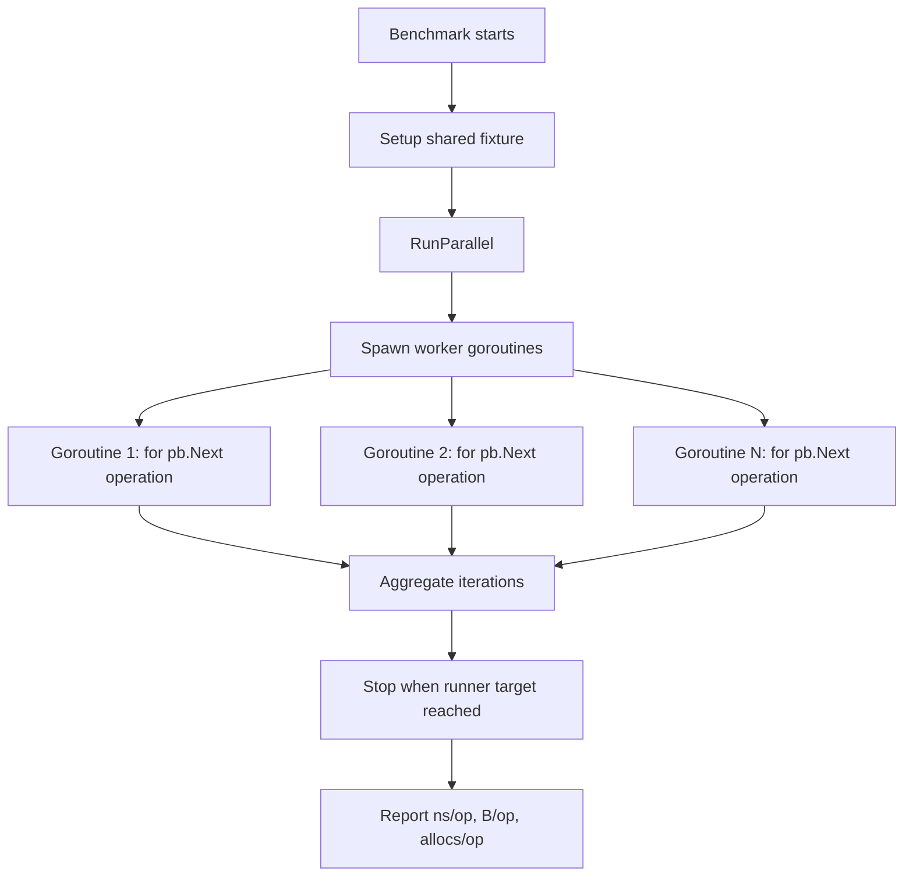
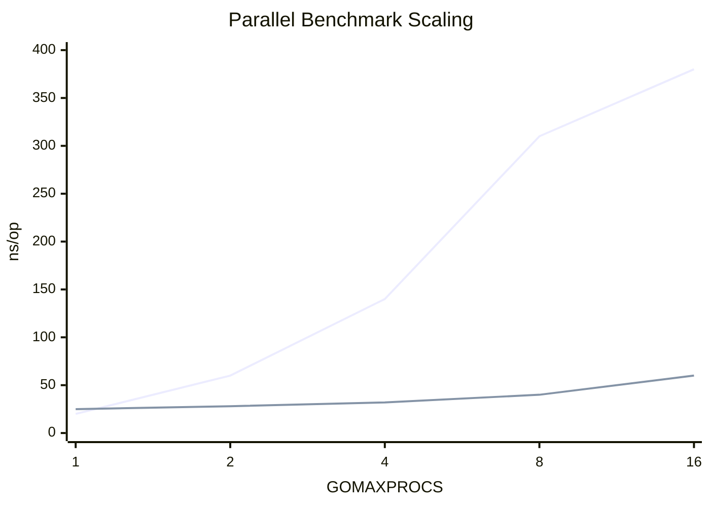
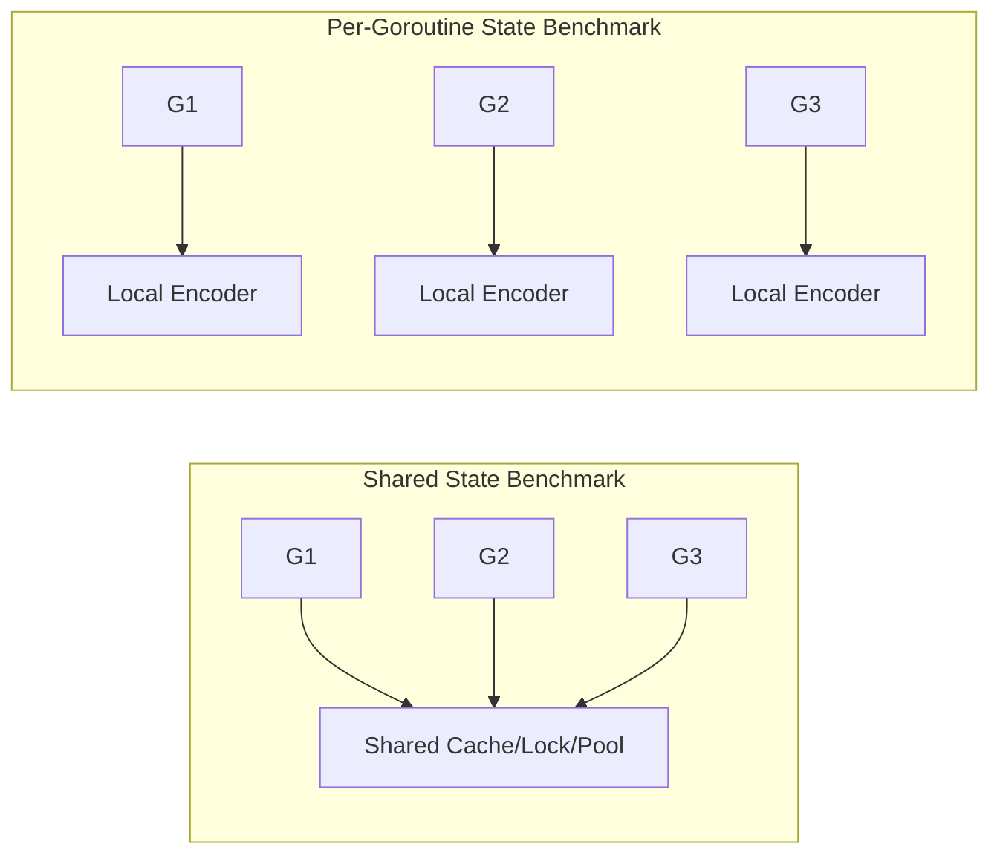

# learn-go-testing-benchmarking-performance-engineering-part-023.md

# Part 023 — Parallel Benchmarks: `RunParallel`, `SetParallelism`, `GOMAXPROCS`, Contention & Throughput

> Seri: **Go Testing, Benchmarking, Performance Engineering**  
> Target pembaca: **Java Software Engineer → Go Performance-Capable Engineer**  
> Target Go: **Go 1.26.x**  
> Status seri: **Part 023 dari 034**  
> Prasyarat: Part 020–022, seri Go concurrency, seri Go memory system.

---

## 0. Tujuan Part Ini

Part ini membahas **parallel benchmark** di Go.

Kita akan membahas:

1. Apa beda benchmark serial dan parallel benchmark.
2. Kapan memakai `b.RunParallel`.
3. Cara kerja `testing.PB` dan `pb.Next`.
4. Hubungan `RunParallel`, `SetParallelism`, `GOMAXPROCS`, dan flag `-cpu`.
5. Kenapa parallel benchmark bukan load test.
6. Cara membaca `ns/op` pada benchmark parallel.
7. Cara menulis benchmark untuk lock, atomic, channel, map, cache, pool, worker, dan queue.
8. Cara menghindari false sharing, shared fixture bottleneck, dan fake dependency yang terlalu murah.
9. Cara membedakan CPU scalability, contention, throughput, dan latency.
10. Bagaimana membuat benchmark parallel yang berguna untuk decision-making.

---

## 1. Satu Kalimat Inti

> Parallel benchmark Go mengukur biaya operasi ketika banyak goroutine menjalankan operation yang sama secara bersamaan di dalam satu benchmark process; hasilnya berguna untuk melihat scalability dan contention, tetapi bukan pengganti load test atau production capacity test.

Parallel benchmark cocok untuk menjawab:

- Apakah lock menjadi bottleneck ketika dipakai banyak goroutine?
- Apakah cache implementation scale dengan `GOMAXPROCS`?
- Apakah atomic counter lebih baik dari mutex untuk workload ini?
- Apakah object pool menyebabkan contention?
- Apakah shared map dengan `RWMutex` cukup?
- Apakah channel queue bisa sustain producer/consumer pressure?
- Apakah encoder/stateless validator aman dan efisien saat parallel?
- Apakah allocation per op berubah saat concurrent?

Parallel benchmark tidak cocok untuk membuktikan:

- endpoint p95/p99 production,
- capacity service,
- autoscaling behavior,
- database/network saturation,
- retry storm behavior,
- real user traffic behavior.

---

## 2. Serial Benchmark Recap

Serial benchmark:

```go
func BenchmarkCacheGet(b *testing.B) {
	cache := newBenchmarkCache()

	b.ReportAllocs()
	for b.Loop() {
		_, _ = cache.Get("case:123")
	}
}
```

Satu goroutine benchmark menjalankan operasi berulang.

Ini menjawab:

> Berapa biaya `cache.Get` dalam single goroutine tight loop?

Tetapi production mungkin punya ratusan goroutine/request handler mengakses cache bersamaan.

Untuk itu:

```go
func BenchmarkCacheGetParallel(b *testing.B) {
	cache := newBenchmarkCache()

	b.ReportAllocs()
	b.RunParallel(func(pb *testing.PB) {
		for pb.Next() {
			_, _ = cache.Get("case:123")
		}
	})
}
```

---

## 3. Apa Itu `b.RunParallel`?

`RunParallel` menjalankan benchmark body dalam beberapa goroutine.

Signature konseptual:

```go
func (b *B) RunParallel(body func(*PB))
```

Di dalam body, loop menggunakan:

```go
for pb.Next() {
	// operation
}
```

Bukan:

```go
for b.Loop() {
	// wrong inside RunParallel
}
```

`testing.PB` mengontrol pembagian iterasi antar goroutine.

---

## 4. Minimal Parallel Benchmark

```go
func BenchmarkAtomicCounterParallel(b *testing.B) {
	var counter atomic.Int64

	b.RunParallel(func(pb *testing.PB) {
		for pb.Next() {
			counter.Add(1)
		}
	})
}
```

Run:

```bash
go test -run='^$' -bench=BenchmarkAtomicCounterParallel -benchmem ./internal/counter
```

Output:

```text
BenchmarkAtomicCounterParallel-8    100000000    12.3 ns/op    0 B/op    0 allocs/op
```

Interpretasi awal:

- benchmark berjalan dengan `GOMAXPROCS=8`,
- banyak goroutine melakukan `counter.Add(1)`,
- `ns/op` adalah average time per operation across total operations,
- ini bukan latency per goroutine secara langsung,
- ini menunjukkan aggregate throughput under contention.

---

## 5. Diagram: `RunParallel` Execution Model



---

## 6. `RunParallel` vs `B.Loop`

| Aspect | `B.Loop` | `RunParallel` |
|---|---|---|
| Loop primitive | `for b.Loop()` | `for pb.Next()` |
| Goroutine count | benchmark goroutine | multiple goroutines |
| Use case | serial/local operation | concurrent operation |
| Best for | parser, mapper, encode, single operation cost | lock/cache/pool/shared state scalability |
| Measures contention | no, unless operation internally concurrent | yes |
| Uses `SetParallelism` | no | yes |
| Sensitive to `-cpu` | yes but less direct | strongly |

Do not mix:

```go
b.RunParallel(func(pb *testing.PB) {
	for b.Loop() { // wrong mental model
		X()
	}
})
```

Use:

```go
b.RunParallel(func(pb *testing.PB) {
	for pb.Next() {
		X()
	}
})
```

---

## 7. What Does `ns/op` Mean in Parallel Benchmark?

This is often misunderstood.

If output:

```text
BenchmarkCacheGetParallel-8    200000000    8.0 ns/op
```

It does not mean each goroutine experiences exactly 8 ns latency.

It means:

```text
elapsed wall-clock time / total completed operations = 8 ns/op
```

Equivalent aggregate throughput:

```text
ops/sec = 1e9 / nsPerOp
        = 125,000,000 ops/sec
```

But per-goroutine latency distribution is not reported.

Parallel benchmark output is closer to **aggregate throughput per operation under concurrency**, not request latency histogram.

---

## 8. Throughput vs Latency

Parallel benchmark can show throughput:

```text
lower ns/op = higher aggregate throughput
```

It does not show:

- p50 latency,
- p95 latency,
- p99 latency,
- queue wait distribution,
- per-goroutine fairness,
- long-tail stalls,
- coordinated omission,
- request timeout.

If you need latency distribution, write custom measurement carefully or use scenario/load test.

---

## 9. `GOMAXPROCS` and Benchmark Suffix

Output:

```text
BenchmarkCacheGetParallel-8
```

The `-8` indicates `GOMAXPROCS` for the benchmark run.

Run with CPU matrix:

```bash
go test -run='^$' -bench=BenchmarkCacheGetParallel -benchmem -cpu=1,2,4,8,16 ./internal/cache
```

Output:

```text
BenchmarkCacheGetParallel      100000000    10.0 ns/op
BenchmarkCacheGetParallel-2    180000000     6.0 ns/op
BenchmarkCacheGetParallel-4    250000000     5.0 ns/op
BenchmarkCacheGetParallel-8    260000000     5.1 ns/op
BenchmarkCacheGetParallel-16   240000000     5.5 ns/op
```

Interpretation:

- scales from 1 to 4,
- saturates around 4–8,
- degrades at 16,
- possible contention/cache/memory bandwidth overhead.

---

## 10. `-cpu` Is Essential for Parallel Benchmark

Serial benchmark often uses default `GOMAXPROCS`.

Parallel benchmark should frequently use:

```bash
-cpu=1,2,4,8,16
```

Why?

Because scalability is not a single number.

A cache might be fast at `GOMAXPROCS=1` but collapse at 16.

Example:

```text
BenchmarkMutexCounter       20 ns/op
BenchmarkMutexCounter-2     60 ns/op
BenchmarkMutexCounter-4    140 ns/op
BenchmarkMutexCounter-8    310 ns/op
```

The important result is not the first number but the scaling curve.

---

## 11. Diagram: Scalability Curve



Mermaid rendering support can vary, but the concept is important: **look at curve, not one point**.

---

## 12. `SetParallelism`

`SetParallelism` controls the number of goroutines used by `RunParallel` relative to `GOMAXPROCS`.

Typical:

```go
func BenchmarkXParallel(b *testing.B) {
	b.SetParallelism(4)
	b.RunParallel(func(pb *testing.PB) {
		for pb.Next() {
			X()
		}
	})
}
```

Conceptually:

```text
goroutines ≈ GOMAXPROCS * parallelism
```

Default parallelism is usually enough for many CPU-bound benchmarks.

Use `SetParallelism` when:

- modeling many goroutines per P,
- stress-testing contention,
- operation blocks,
- simulating high fan-in to shared object,
- benchmarking queue/channel under more goroutines than CPU.

Do not use huge parallelism blindly.

---

## 13. `GOMAXPROCS` vs Goroutine Count

Important distinction:

| Concept | Meaning |
|---|---|
| `GOMAXPROCS` | maximum number of OS threads executing Go code simultaneously |
| goroutine count | number of concurrent logical tasks |
| `SetParallelism` | multiplier for goroutines in `RunParallel` |
| `-cpu` | benchmark flag that runs benchmark with different `GOMAXPROCS` values |

Example:

```bash
go test -bench=. -cpu=4
```

and:

```go
b.SetParallelism(8)
```

may produce roughly:

```text
4 * 8 = 32 worker goroutines
```

But only around 4 can execute Go code simultaneously.

This matters for blocking workloads.

---

## 14. When to Use `SetParallelism`

Use default first.

Then add `SetParallelism` when the question requires it.

### Good

```go
func BenchmarkRateLimiterHighConcurrency(b *testing.B) {
	limiter := NewLimiter(...)

	b.SetParallelism(32)
	b.RunParallel(func(pb *testing.PB) {
		for pb.Next() {
			_ = limiter.Allow()
		}
	})
}
```

Question:

> What happens when many goroutines hit one limiter concurrently?

### Bad

```go
func BenchmarkEverything(b *testing.B) {
	b.SetParallelism(1000)
	...
}
```

No question, no model, just chaos.

---

## 15. Shared State vs Per-Goroutine State

Parallel benchmark must decide:

- is state shared across goroutines?
- or does each goroutine get its own state?

Shared state measures contention.

```go
func BenchmarkSharedCacheGet(b *testing.B) {
	cache := newCache()

	b.RunParallel(func(pb *testing.PB) {
		for pb.Next() {
			_, _ = cache.Get("key")
		}
	})
}
```

Per-goroutine state measures parallel independent work.

```go
func BenchmarkPerGoroutineEncoder(b *testing.B) {
	input := largeCaseSummary()

	b.RunParallel(func(pb *testing.PB) {
		encoder := NewEncoder() // per goroutine

		for pb.Next() {
			_, _ = encoder.Encode(input)
		}
	})
}
```

Both can be valid, but answer different questions.

---

## 16. Diagram: Shared vs Per-Goroutine State



Shared state exposes contention. Per-goroutine state exposes embarrassingly parallel throughput.

---

## 17. Per-Goroutine Setup in `RunParallel`

This setup happens once per worker goroutine:

```go
b.RunParallel(func(pb *testing.PB) {
	buf := make([]byte, 0, 4096)

	for pb.Next() {
		buf = buf[:0]
		buf = EncodeInto(buf, input)
	}
})
```

This is often useful.

But if production allocates buffer per request, this benchmark is optimistic.

Name it honestly:

```text
BenchmarkEncodeInto_PerGoroutineBuffer
BenchmarkEncodeInto_AllocatePerOperation
```

---

## 18. Benchmarking Mutex Counter

```go
type MutexCounter struct {
	mu sync.Mutex
	n  int64
}

func (c *MutexCounter) Add(delta int64) {
	c.mu.Lock()
	c.n += delta
	c.mu.Unlock()
}

func BenchmarkMutexCounterAddParallel(b *testing.B) {
	var c MutexCounter

	b.ReportAllocs()
	b.RunParallel(func(pb *testing.PB) {
		for pb.Next() {
			c.Add(1)
		}
	})
}
```

Run:

```bash
go test -run='^$' -bench=BenchmarkMutexCounterAddParallel -benchmem -cpu=1,2,4,8,16 ./internal/counter
```

Expected pattern:

- okay at low CPU,
- worse as concurrency increases due to lock contention.

---

## 19. Benchmarking Atomic Counter

```go
func BenchmarkAtomicCounterAddParallel(b *testing.B) {
	var c atomic.Int64

	b.ReportAllocs()
	b.RunParallel(func(pb *testing.PB) {
		for pb.Next() {
			c.Add(1)
		}
	})
}
```

Atomic may outperform mutex, but under high contention atomic also degrades due to cache-line bouncing.

Do not assume atomic scales linearly.

---

## 20. Benchmarking Sharded Counter

```go
type ShardedCounter struct {
	shards []atomic.Int64
}

func NewShardedCounter(n int) *ShardedCounter {
	return &ShardedCounter{shards: make([]atomic.Int64, n)}
}

func (c *ShardedCounter) Add(shard int, delta int64) {
	c.shards[shard%len(c.shards)].Add(delta)
}

func BenchmarkShardedCounterAddParallel(b *testing.B) {
	c := NewShardedCounter(64)

	b.ReportAllocs()
	b.RunParallel(func(pb *testing.PB) {
		shard := int(randShardForGoroutine())
		for pb.Next() {
			c.Add(shard, 1)
		}
	})
}
```

Better per-goroutine shard assignment:

```go
func BenchmarkShardedCounterAddParallel(b *testing.B) {
	c := NewShardedCounter(64)
	var next atomic.Int64

	b.ReportAllocs()
	b.RunParallel(func(pb *testing.PB) {
		shard := int(next.Add(1))

		for pb.Next() {
			c.Add(shard, 1)
		}
	})
}
```

Question:

> Does sharding reduce contention enough to justify complexity?

---

## 21. False Sharing

False sharing occurs when independent variables share a cache line and different CPUs update them concurrently.

Example risk:

```go
type shard struct {
	n atomic.Int64
}

type Counter struct {
	shards []shard
}
```

Adjacent shards may share cache line. Atomic updates on different shards can still fight at cache line level.

Padding:

```go
type paddedShard struct {
	n atomic.Int64
	_ [56]byte // illustrative only; not portable guarantee
}
```

Be careful:

- padding is architecture-sensitive,
- can waste memory,
- may not be needed,
- benchmark with CPU matrix.

Parallel benchmark can reveal false sharing but not prove it alone.

---

## 22. Benchmarking `sync.RWMutex` Map

```go
type SafeMap struct {
	mu sync.RWMutex
	m  map[string]Case
}

func (s *SafeMap) Get(k string) (Case, bool) {
	s.mu.RLock()
	v, ok := s.m[k]
	s.mu.RUnlock()
	return v, ok
}

func BenchmarkSafeMapGetParallel(b *testing.B) {
	s := newSafeMap(100_000)
	keys := benchmarkKeys(10_000)

	var idx atomic.Int64

	b.ReportAllocs()
	b.RunParallel(func(pb *testing.PB) {
		for pb.Next() {
			i := idx.Add(1)
			_, _ = s.Get(keys[int(i)%len(keys)])
		}
	})
}
```

But this includes atomic index contention. Better per-goroutine local counter:

```go
b.RunParallel(func(pb *testing.PB) {
	i := 0
	for pb.Next() {
		_, _ = s.Get(keys[i%len(keys)])
		i++
	}
})
```

Each goroutine follows same key sequence, but no shared atomic overhead.

---

## 23. Key Distribution Matters

Bad:

```go
cache.Get("same-key")
```

This measures hot-key behavior.

Maybe production has:

- hot key,
- uniform keys,
- Zipf distribution,
- mostly misses,
- mixed hit/miss.

Use matrix:

```text
BenchmarkCacheGetParallel/
  SameHotKey
  UniformKeys_10k
  ZipfKeys_10k
  Misses_10k
  Mixed_90Hit10Miss
```

Example:

```go
func BenchmarkCacheGetParallel(b *testing.B) {
	cache := newCacheWithItems(100_000)

	workloads := []struct {
		name string
		keys []string
	}{
		{"SameHotKey", []string{"case:1"}},
		{"UniformKeys10k", uniformKeys(10_000)},
		{"Misses10k", missingKeys(10_000)},
	}

	for _, wl := range workloads {
		b.Run(wl.name, func(b *testing.B) {
			b.ReportAllocs()
			b.RunParallel(func(pb *testing.PB) {
				i := 0
				for pb.Next() {
					_, _ = cache.Get(wl.keys[i%len(wl.keys)])
					i++
				}
			})
		})
	}
}
```

---

## 24. Benchmarking `sync.Map`

```go
func BenchmarkSyncMapLoadParallel(b *testing.B) {
	var m sync.Map
	for i := 0; i < 100_000; i++ {
		m.Store(fmt.Sprintf("case:%d", i), Case{ID: i})
	}

	keys := uniformKeys(10_000)

	b.ReportAllocs()
	b.RunParallel(func(pb *testing.PB) {
		i := 0
		for pb.Next() {
			_, _ = m.Load(keys[i%len(keys)])
			i++
		}
	})
}
```

Compare against:

- `map + RWMutex`,
- sharded map,
- immutable map with atomic pointer,
- local cache.

But benchmark must reflect workload:

- read-heavy,
- write-heavy,
- disjoint keys,
- hot keys,
- churn.

---

## 25. Read-Heavy vs Write-Heavy Map Benchmark

```go
func BenchmarkConcurrentMap(b *testing.B) {
	workloads := []struct {
		name       string
		writeEvery int
	}{
		{"ReadOnly", 0},
		{"Write1Percent", 100},
		{"Write10Percent", 10},
		{"Write50Percent", 2},
	}

	for _, wl := range workloads {
		b.Run(wl.name, func(b *testing.B) {
			m := newConcurrentMap()
			keys := uniformKeys(10_000)

			b.ReportAllocs()
			b.RunParallel(func(pb *testing.PB) {
				i := 0
				for pb.Next() {
					k := keys[i%len(keys)]
					if wl.writeEvery > 0 && i%wl.writeEvery == 0 {
						m.Store(k, Case{})
					} else {
						_, _ = m.Load(k)
					}
					i++
				}
			})
		})
	}
}
```

Caution:

- per-goroutine `i` means write distribution per goroutine,
- no global operation mix guarantee,
- still useful but document it.

---

## 26. Benchmarking Channels

Channel operation benchmark:

```go
func BenchmarkChannelPingPong(b *testing.B) {
	ch := make(chan int)

	go func() {
		for v := range ch {
			ch <- v
		}
	}()

	b.ReportAllocs()
	for b.Loop() {
		ch <- 1
		<-ch
	}
}
```

This is serial ping-pong.

Parallel send benchmark:

```go
func BenchmarkChannelSendParallel(b *testing.B) {
	ch := make(chan int, 1024)
	done := make(chan struct{})

	go func() {
		for {
			select {
			case <-ch:
			case <-done:
				return
			}
		}
	}()
	b.Cleanup(func() { close(done) })

	b.ReportAllocs()
	b.RunParallel(func(pb *testing.PB) {
		for pb.Next() {
			ch <- 1
		}
	})
}
```

Caution:

- receiver goroutine can bottleneck,
- buffered channel capacity matters,
- benchmark may measure backpressure,
- cleanup must avoid goroutine leak.

---

## 27. Channel Benchmark Questions

Before writing channel benchmark, define:

- one producer or many producers?
- one consumer or many consumers?
- buffered or unbuffered?
- operation = send only, receive only, round trip, or process?
- should blocking be included?
- is backpressure desired?
- what is expected production pattern?
- is channel the right abstraction?

---

## 28. Benchmarking Worker Pool

Bad:

```go
func BenchmarkWorkerPoolSubmit(b *testing.B) {
	pool := NewWorkerPool(8)

	for b.Loop() {
		pool.Submit(func() {})
	}
}
```

This may only measure enqueue, not completion.

Better:

```go
func BenchmarkWorkerPoolSubmitAndWait(b *testing.B) {
	pool := NewWorkerPool(8)
	b.Cleanup(pool.Close)

	b.ReportAllocs()
	for b.Loop() {
		var wg sync.WaitGroup
		wg.Add(1)
		pool.Submit(func() {
			wg.Done()
		})
		wg.Wait()
	}
}
```

But this measures per-op wait group allocation/cost too.

Scenario benchmark:

```go
func BenchmarkWorkerPoolBatch(b *testing.B) {
	pool := NewWorkerPool(8)
	b.Cleanup(pool.Close)

	const batch = 1024

	b.ReportAllocs()
	for b.Loop() {
		var wg sync.WaitGroup
		wg.Add(batch)

		for i := 0; i < batch; i++ {
			pool.Submit(func() {
				doSmallWork()
				wg.Done()
			})
		}

		wg.Wait()
	}

	b.ReportMetric(batch, "tasks/op")
}
```

Operation = process one batch.

---

## 29. Benchmarking Rate Limiter

```go
func BenchmarkRateLimiterAllowParallel(b *testing.B) {
	limiter := NewRateLimiter(1_000_000)

	b.SetParallelism(16)
	b.ReportAllocs()
	b.RunParallel(func(pb *testing.PB) {
		for pb.Next() {
			_ = limiter.Allow()
		}
	})
}
```

Questions:

- are we measuring allowed path only?
- denied path?
- time-based refill?
- lock contention?
- atomics?
- time.Now cost?
- many keys or one limiter?
- per-user limiter map?

Matrix:

```text
GlobalLimiterAllowed
GlobalLimiterDenied
PerUserLimiterUniformKeys
PerUserLimiterHotKey
```

---

## 30. Benchmarking `sync.Pool` Under Concurrency

Serial pool benchmark can be misleading. Use parallel:

```go
func BenchmarkBufferPoolParallel(b *testing.B) {
	var pool sync.Pool
	pool.New = func() any {
		return new(bytes.Buffer)
	}

	input := largePayload()

	b.ReportAllocs()
	b.RunParallel(func(pb *testing.PB) {
		for pb.Next() {
			buf := pool.Get().(*bytes.Buffer)
			buf.Reset()

			_, _ = buf.Write(input)

			pool.Put(buf)
		}
	})
}
```

But still incomplete:

- output not copied,
- buffer retention not measured,
- production may have variable payload,
- pool hit/miss behavior depends on GC.

Compare with no pool and scenario benchmark.

---

## 31. Benchmarking Encoder with Per-Goroutine Buffer

```go
func BenchmarkEncodeParallel_PerGoroutineBuffer(b *testing.B) {
	input := largeCaseSummary()

	b.ReportAllocs()
	b.RunParallel(func(pb *testing.PB) {
		buf := make([]byte, 0, 64*1024)

		for pb.Next() {
			buf = buf[:0]
			buf, _ = EncodeCaseSummaryInto(buf, input)
		}

		if len(buf) == 0 {
			b.Fatal("empty output")
		}
	})
}
```

This can show best-case throughput when caller reuses buffer.

Also benchmark allocate-per-op:

```go
func BenchmarkEncodeParallel_AllocatePerOp(b *testing.B) {
	input := largeCaseSummary()

	b.ReportAllocs()
	b.RunParallel(func(pb *testing.PB) {
		for pb.Next() {
			out, _ := EncodeCaseSummary(input)
			if len(out) == 0 {
				b.Fatal("empty output")
			}
		}
	})
}
```

Compare to understand trade-off.

---

## 32. Avoid Shared Atomic Index in Parallel Benchmark

Bad:

```go
var idx atomic.Int64

b.RunParallel(func(pb *testing.PB) {
	for pb.Next() {
		i := idx.Add(1)
		_ = Process(inputs[int(i)%len(inputs)])
	}
})
```

This benchmark includes contention on `idx`.

Better:

```go
b.RunParallel(func(pb *testing.PB) {
	i := 0
	for pb.Next() {
		_ = Process(inputs[i%len(inputs)])
		i++
	}
})
```

If you need distinct global distribution, atomic index may be acceptable, but name/understand it.

Alternative: per-goroutine offset.

```go
var next atomic.Int64

b.RunParallel(func(pb *testing.PB) {
	offset := int(next.Add(1)) * 997
	i := offset

	for pb.Next() {
		_ = Process(inputs[i%len(inputs)])
		i++
	}
})
```

Atomic used once per goroutine, not per operation.

---

## 33. Avoid Shared Random Generator

Bad:

```go
r := rand.New(rand.NewSource(1))

b.RunParallel(func(pb *testing.PB) {
	for pb.Next() {
		x := r.Intn(1000) // not safe without lock; lock would distort benchmark
		_ = Process(inputs[x])
	}
})
```

Better:

```go
var seed atomic.Int64

b.RunParallel(func(pb *testing.PB) {
	localSeed := seed.Add(1)
	r := rand.New(rand.NewSource(localSeed))

	for pb.Next() {
		x := r.Intn(len(inputs))
		_ = Process(inputs[x])
	}
})
```

But random generation is measured. If not intended, precompute corpus.

---

## 34. Parallel Benchmark and Allocation Metrics

Allocation metrics in parallel benchmark are still per operation.

```text
BenchmarkEncodeParallel-8    1000000    1200 ns/op    2048 B/op    10 allocs/op
```

Meaning:

- average per operation,
- aggregated across goroutines,
- not per goroutine total,
- allocation rate under production depends on ops/sec.

Estimate allocation rate:

```text
ops/sec = 1e9 / 1200 ≈ 833,333 ops/sec
bytes/sec = 833,333 * 2048 ≈ 1.59 GiB/sec
```

This is huge allocation churn if real workload reaches that throughput.

---

## 35. Parallel Benchmark and GC

Parallel allocation-heavy benchmarks may trigger GC more aggressively.

Compare:

```text
BenchmarkEncodeSerial-8      2000 ns/op    2048 B/op    10 allocs/op
BenchmarkEncodeParallel-8    3000 ns/op    2048 B/op    10 allocs/op
```

Same allocation per op, worse time under parallel due to:

- allocator contention,
- GC CPU,
- cache pressure,
- memory bandwidth,
- scheduler overhead.

To investigate:

- CPU profile,
- heap/alloc profile,
- runtime metrics,
- compare GOGC,
- benchmark no-allocation variant,
- run load/scenario test.

---

## 36. Parallel Benchmark with `b.ReportMetric`

For batch/queue benchmark, custom metrics can help.

```go
func BenchmarkQueueBatchParallel(b *testing.B) {
	q := NewQueue()

	const batch = 100

	b.ReportAllocs()
	b.RunParallel(func(pb *testing.PB) {
		items := make([]Item, batch)

		for pb.Next() {
			q.EnqueueBatch(items)
		}
	})

	b.ReportMetric(batch, "items/op")
}
```

Be careful: if multiple goroutines call batch operation, one op = one batch enqueue, not one item.

---

## 37. Parallel Benchmark with Blocking Operations

If operation blocks, `ns/op` includes blocking time.

Example:

```go
func BenchmarkLimiterWaitParallel(b *testing.B) {
	limiter := NewLimiter(1000)

	b.RunParallel(func(pb *testing.PB) {
		for pb.Next() {
			limiter.Wait(context.Background())
		}
	})
}
```

This might benchmark rate limit waiting, not limiter overhead.

If you want overhead of decision only:

```go
limiter.Allow()
```

If you want behavior under rate limit, a load/scenario test may be more appropriate.

---

## 38. Parallel Benchmark and Backpressure

Backpressure can be desirable.

Example queue:

```go
q := NewBoundedQueue(1024)
```

Parallel submit benchmark can show:

- enqueue overhead when queue has room,
- blocking behavior when full,
- drop behavior if non-blocking,
- consumer bottleneck.

Name benchmark accordingly:

```text
BenchmarkQueueSubmit/EmptyQueue
BenchmarkQueueSubmit/FullQueueDrop
BenchmarkQueueSubmit/WithConsumer
BenchmarkQueueSubmit/ManyProducersOneConsumer
```

---

## 39. Benchmarking Lock Granularity

Compare global lock vs sharded lock.

```go
func BenchmarkCaseStoreGetParallel(b *testing.B) {
	implementations := []struct {
		name string
		new  func() CaseStore
	}{
		{"GlobalRWMutex", NewGlobalLockStore},
		{"Sharded64", func() CaseStore { return NewShardedStore(64) }},
	}

	for _, impl := range implementations {
		b.Run(impl.name, func(b *testing.B) {
			store := impl.new()
			loadStore(store, 100_000)
			keys := uniformKeys(10_000)

			b.ReportAllocs()
			b.RunParallel(func(pb *testing.PB) {
				i := 0
				for pb.Next() {
					_, _ = store.Get(keys[i%len(keys)])
					i++
				}
			})
		})
	}
}
```

Run with CPU matrix:

```bash
go test -run='^$' -bench=BenchmarkCaseStoreGetParallel -benchmem -cpu=1,2,4,8,16 ./internal/store
```

Decision should consider:

- read/write mix,
- memory overhead,
- complexity,
- correctness risk,
- real workload.

---

## 40. Benchmarking Atomic vs Mutex vs Channel

```go
func BenchmarkCounterParallel(b *testing.B) {
	b.Run("Mutex", func(b *testing.B) {
		var c MutexCounter
		b.RunParallel(func(pb *testing.PB) {
			for pb.Next() {
				c.Add(1)
			}
		})
	})

	b.Run("Atomic", func(b *testing.B) {
		var c atomic.Int64
		b.RunParallel(func(pb *testing.PB) {
			for pb.Next() {
				c.Add(1)
			}
		})
	})

	b.Run("Channel", func(b *testing.B) {
		ch := make(chan int64, 1024)
		done := make(chan struct{})

		go func() {
			var n int64
			for {
				select {
				case x := <-ch:
					n += x
				case <-done:
					return
				}
			}
		}()
		b.Cleanup(func() { close(done) })

		b.RunParallel(func(pb *testing.PB) {
			for pb.Next() {
				ch <- 1
			}
		})
	})
}
```

This benchmark compares mechanisms, but verify fairness:

- channel has receiver goroutine,
- channel may block,
- mutex updates one memory location,
- atomic updates one memory location,
- all share a single counter, so high contention.

If production can shard, benchmark sharded designs too.

---

## 41. Parallel Benchmark and Scheduler Effects

Parallel benchmark includes Go scheduler behavior.

Effects:

- goroutine scheduling,
- preemption,
- run queue,
- blocking/unblocking,
- syscalls if any,
- GC assists,
- `GOMAXPROCS`.

If benchmark uses too many goroutines with tiny operations, scheduler overhead can dominate.

That may be useful if production also creates many goroutines. Otherwise, reduce parallelism or redesign benchmark.

---

## 42. Benchmarking Goroutine Creation

Goroutine creation benchmark:

```go
func BenchmarkGoroutineCreateAndJoin(b *testing.B) {
	for b.Loop() {
		done := make(chan struct{})
		go func() {
			close(done)
		}()
		<-done
	}
}
```

This measures:

- channel allocation,
- goroutine creation,
- scheduling,
- synchronization.

Not equivalent to worker pool throughput.

If comparing worker pool:

```go
BenchmarkGoroutinePerTask
BenchmarkWorkerPoolSubmitAndWait
BenchmarkWorkerPoolBatch
```

---

## 43. Parallel Benchmark and Data Races

Benchmark code must be race-free.

Bad:

```go
var n int

b.RunParallel(func(pb *testing.PB) {
	for pb.Next() {
		n++
	}
})
```

Run with race detector:

```bash
go test -race -run='^$' -bench=BenchmarkX ./internal/foo
```

But do not interpret `-race` benchmark speed as normal performance.

Use `-race` for correctness signal only.

---

## 44. Testing Correctness in Parallel Benchmark

Avoid heavy assertion inside hot loop if it distorts measurement.

Options:

### 44.1 Validate before loop

```go
got, ok := cache.Get("key")
if !ok || got.ID == "" {
	b.Fatal("invalid setup")
}
```

### 44.2 Lightweight check inside loop

```go
if _, ok := cache.Get(key); !ok {
	b.Fatal("missing")
}
```

This check is part of operation.

### 44.3 Aggregate check after loop

For counter:

```go
var c atomic.Int64

b.RunParallel(func(pb *testing.PB) {
	for pb.Next() {
		c.Add(1)
	}
})

if c.Load() == 0 {
	b.Fatal("counter not updated")
}
```

You cannot easily know exact operation count unless you count, which adds overhead. Usually smoke check enough.

---

## 45. Parallel Benchmark and Operation Counting

If you need exact custom count:

```go
var ops atomic.Int64

b.RunParallel(func(pb *testing.PB) {
	for pb.Next() {
		X()
		ops.Add(1)
	}
})
```

But now benchmark includes atomic increment overhead.

Prefer benchmark runner's operation count unless custom measurement is necessary.

---

## 46. Parallel Benchmark and `b.N`

In `RunParallel`, do not use `b.N` manually inside goroutines.

Wrong:

```go
b.RunParallel(func(pb *testing.PB) {
	for i := 0; i < b.N; i++ {
		X()
	}
})
```

Correct:

```go
b.RunParallel(func(pb *testing.PB) {
	for pb.Next() {
		X()
	}
})
```

`PB.Next` coordinates total iteration work.

---

## 47. Parallel Benchmark and Shared Fixture Mutation

Bad:

```go
items := make([]Item, 1024)

b.RunParallel(func(pb *testing.PB) {
	i := 0
	for pb.Next() {
		items[i%len(items)].Count++ // race
		i++
	}
})
```

Fix:

- use per-goroutine local data,
- use synchronization if synchronization is part of operation,
- use immutable input,
- copy if needed and intended.

---

## 48. Parallel Benchmark for Pure Function

For pure/stateless function, parallel benchmark may show CPU scaling but often not necessary.

```go
func BenchmarkParseCaseIDParallel(b *testing.B) {
	inputs := []string{
		"CASE-2026-000001",
		"CASE-2026-000002",
		"CASE-2026-000003",
	}

	b.ReportAllocs()
	b.RunParallel(func(pb *testing.PB) {
		i := 0
		for pb.Next() {
			_, _ = ParseCaseID(inputs[i%len(inputs)])
			i++
		}
	})
}
```

Useful if parser is very hot and called by many goroutines. Otherwise serial benchmark enough.

---

## 49. Parallel Benchmark for Authorization Listing

Scenario:

- listing page has 100 cases,
- each case computes 20 allowed actions,
- many request handlers run concurrently.

Benchmark:

```go
func BenchmarkAllowedActionsForListingParallel(b *testing.B) {
	engine := benchmarkActionEngine()
	pages := benchmarkListingPages(64)

	b.ReportAllocs()
	b.RunParallel(func(pb *testing.PB) {
		i := 0
		for pb.Next() {
			page := pages[i%len(pages)]
			_ = engine.BuildAllowedActionsForPage(context.Background(), page)
			i++
		}
	})
}
```

This measures shared engine under concurrent reads.

Add variants:

```text
ImmutableEngine
MutexProtectedEngine
ShardedCacheEngine
NoCacheEngine
```

---

## 50. Parallel Benchmark for Cache Hit/Miss

```go
func BenchmarkPermissionCacheParallel(b *testing.B) {
	workloads := []struct {
		name string
		keys []string
	}{
		{"HotHit", []string{"perm:hot"}},
		{"UniformHits", uniformPermissionKeys(10_000)},
		{"UniformMisses", missingPermissionKeys(10_000)},
		{"Mixed90Hit10Miss", mixedPermissionKeys(9000, 1000)},
	}

	for _, wl := range workloads {
		b.Run(wl.name, func(b *testing.B) {
			cache := newPermissionCache()
			preloadPermissionCache(cache)

			b.ReportAllocs()
			b.RunParallel(func(pb *testing.PB) {
				i := 0
				for pb.Next() {
					_, _ = cache.Get(wl.keys[i%len(wl.keys)])
					i++
				}
			})
		})
	}
}
```

This reveals:

- hot-key contention,
- miss allocation,
- cache lock strategy,
- read path scalability.

---

## 51. Parallel Benchmark for Request Object Construction

Sometimes object construction is parallel hot path.

```go
func BenchmarkBuildRequestContextParallel(b *testing.B) {
	headers := benchmarkHeaders()

	b.ReportAllocs()
	b.RunParallel(func(pb *testing.PB) {
		for pb.Next() {
			ctx := BuildRequestContext(headers)
			if ctx.UserID == "" {
				b.Fatal("missing user id")
			}
		}
	})
}
```

If function uses global parser/cache, parallel benchmark can reveal contention.

---

## 52. Reading Parallel Benchmark Result

Example:

```text
BenchmarkPermissionCacheParallel/HotHit       300000000    4.2 ns/op     0 B/op    0 allocs/op
BenchmarkPermissionCacheParallel/UniformHits  120000000    9.8 ns/op     0 B/op    0 allocs/op
BenchmarkPermissionCacheParallel/Misses        20000000   60.0 ns/op    64 B/op    2 allocs/op
```

Interpretation:

- hot hit is extremely fast, maybe due to same key/cache line/path,
- uniform hits slower, more realistic,
- misses allocate and are much slower,
- if production has 10% misses, mixed benchmark needed,
- allocation rate on misses may matter.

---

## 53. Scaling Result Example

```text
BenchmarkSafeMapGetParallel       100 ns/op
BenchmarkSafeMapGetParallel-2      80 ns/op
BenchmarkSafeMapGetParallel-4      70 ns/op
BenchmarkSafeMapGetParallel-8      90 ns/op
BenchmarkSafeMapGetParallel-16    160 ns/op
```

Interpretation:

- improves from 1 to 4,
- contention/scheduler/memory effects start at 8,
- worsens at 16,
- maybe map lock, cache line, memory bandwidth, or CPU topology.

Do not claim “not scalable” without comparing alternative and workload.

---

## 54. Throughput Estimate from Parallel Benchmark

If:

```text
BenchmarkX-8    50 ns/op
```

Then:

```text
ops/sec ≈ 1e9 / 50 = 20,000,000 ops/sec
```

If operation called:

```text
100 times/request
```

Theoretical CPU-local max:

```text
200,000 request/sec equivalent for that operation alone
```

But this ignores:

- other work,
- latency,
- dependencies,
- GC,
- service overhead,
- IO,
- tail behavior,
- deployment limits.

Use only as component estimate.

---

## 55. Common Parallel Benchmark Smells

### 55.1 Shared Atomic Index

Benchmark measures index contention.

### 55.2 Same Key Only

Benchmark only hot-key path.

### 55.3 State Depletion

Queue/cache/input changes behavior mid-benchmark.

### 55.4 Data Race in Benchmark

Invalid result.

### 55.5 Fake Dependency Too Cheap

All contention moves away from real bottleneck.

### 55.6 Excessive `SetParallelism`

Measures scheduler chaos, not intended operation.

### 55.7 Blocking Hidden in Operation

Benchmark becomes wait-time measurement.

### 55.8 Assertion Too Heavy

Benchmark measures assertion/diff.

### 55.9 Ignoring `-cpu`

One number hides scalability curve.

### 55.10 Treating `ns/op` as p99 Latency

Incorrect.

---

## 56. Parallel Benchmark Review Checklist

### 56.1 Question

- [ ] What concurrency question does this benchmark answer?
- [ ] Is the benchmark about shared-state contention or independent parallel work?
- [ ] Is operation clearly defined?

### 56.2 Mechanics

- [ ] Uses `b.RunParallel`.
- [ ] Uses `pb.Next`.
- [ ] Does not use `b.Loop` inside `RunParallel`.
- [ ] Does not manually loop over `b.N` inside goroutines.
- [ ] Uses `b.ReportAllocs()` if relevant.

### 56.3 State

- [ ] Shared state is intentional.
- [ ] Per-goroutine state is initialized inside `RunParallel` body.
- [ ] No unintended data race.
- [ ] Mutable fixtures are safe.
- [ ] State does not deplete or grow unintentionally.

### 56.4 Workload

- [ ] Key/input distribution is realistic.
- [ ] Hot/miss/mixed cases are separated.
- [ ] Randomness is controlled or precomputed.
- [ ] Blocking behavior is intentional.

### 56.5 Scalability

- [ ] Run with `-cpu=1,2,4,8,...`.
- [ ] Compare scaling curve, not one value.
- [ ] Use `SetParallelism` only with a reason.
- [ ] Consider CPU count of deployment environment.

### 56.6 Interpretation

- [ ] `ns/op` is interpreted as aggregate throughput signal.
- [ ] Not treated as latency distribution.
- [ ] Compared with baseline using repeated runs.
- [ ] Allocation under concurrency is considered.
- [ ] Follow-up profiling/load test planned if needed.

---

## 57. Command Cheatsheet

```bash
# Run one parallel benchmark.
go test -run='^$' -bench=BenchmarkCacheGetParallel -benchmem ./internal/cache

# CPU scaling matrix.
go test -run='^$' -bench=BenchmarkCacheGetParallel -benchmem -cpu=1,2,4,8,16 ./internal/cache

# Repeat for benchstat.
go test -run='^$' -bench=BenchmarkCacheGetParallel -benchmem -cpu=1,2,4,8 -count=10 ./internal/cache > result.txt

# Compare old/new.
benchstat old.txt new.txt

# Run with race detector for correctness only.
go test -race -run='^$' -bench=BenchmarkCacheGetParallel ./internal/cache

# Longer benchtime for noisy concurrent benchmark.
go test -run='^$' -bench=BenchmarkCacheGetParallel -benchmem -benchtime=5s -count=5 ./internal/cache

# Specific sub-benchmark.
go test -run='^$' -bench='BenchmarkPermissionCacheParallel/Mixed90Hit10Miss$' -benchmem -cpu=1,4,8 ./internal/authz
```

---

## 58. Case Study: Permission Cache

### 58.1 Context

A regulatory case management service computes permissions for case actions. Permission decisions are cached.

Production workload:

- many request handlers concurrently read cache,
- some misses trigger computation,
- hot permissions exist,
- most accesses are read,
- occasional invalidation on policy update.

### 58.2 Implementations

```text
A. map + RWMutex
B. sync.Map
C. sharded map
D. immutable snapshot with atomic pointer
```

### 58.3 Benchmark Matrix

```text
BenchmarkPermissionCacheParallel/
  GlobalRWMutex/HotHit
  GlobalRWMutex/UniformHits
  GlobalRWMutex/Mixed90Hit10Miss
  SyncMap/HotHit
  SyncMap/UniformHits
  SyncMap/Mixed90Hit10Miss
  Sharded64/HotHit
  Sharded64/UniformHits
  Sharded64/Mixed90Hit10Miss
  AtomicSnapshot/HotHit
  AtomicSnapshot/UniformHits
  AtomicSnapshot/Mixed90Hit10Miss
```

### 58.4 Benchmark Skeleton

```go
func BenchmarkPermissionCacheParallel(b *testing.B) {
	impls := []struct {
		name string
		new  func() PermissionCache
	}{
		{"GlobalRWMutex", NewGlobalRWMutexCache},
		{"SyncMap", NewSyncMapCache},
		{"Sharded64", func() PermissionCache { return NewShardedCache(64) }},
		{"AtomicSnapshot", NewAtomicSnapshotCache},
	}

	workloads := []struct {
		name string
		keys []string
	}{
		{"HotHit", []string{"perm:case:view"}},
		{"UniformHits", uniformPermissionKeys(10_000)},
		{"Mixed90Hit10Miss", mixedPermissionKeys(9000, 1000)},
	}

	for _, impl := range impls {
		for _, wl := range workloads {
			b.Run(impl.name+"/"+wl.name, func(b *testing.B) {
				cache := impl.new()
				preload(cache)

				b.ReportAllocs()
				b.RunParallel(func(pb *testing.PB) {
					i := 0
					for pb.Next() {
						_, _ = cache.Get(wl.keys[i%len(wl.keys)])
						i++
					}
				})
			})
		}
	}
}
```

### 58.5 Run

```bash
go test -run='^$' -bench=BenchmarkPermissionCacheParallel -benchmem -cpu=1,2,4,8,16 -count=10 ./internal/authz > cache.txt
```

### 58.6 Decision Questions

- Which implementation wins under read-heavy uniform hits?
- Which degrades under hot key?
- Which handles misses with least allocation?
- Which has simplest correctness model?
- Which supports invalidation safely?
- Which fits production update frequency?
- Does benchmark include write/update path?
- Do we need scenario benchmark for policy reload?

---

## 59. Case Study: Rate Limiter

### 59.1 Context

OneMap-like external API limit: many goroutines ask limiter if they can call external dependency.

Questions:

- Is global limiter lock a bottleneck?
- Should limiter be sharded by key?
- Is `time.Now` cost dominant?
- What happens under high goroutine count?

### 59.2 Benchmark

```go
func BenchmarkRateLimiterAllowParallel(b *testing.B) {
	impls := []struct {
		name string
		new  func() Limiter
	}{
		{"MutexTokenBucket", NewMutexTokenBucket},
		{"AtomicWindow", NewAtomicWindowLimiter},
		{"ShardedByKey", NewShardedLimiter},
	}

	for _, impl := range impls {
		b.Run(impl.name, func(b *testing.B) {
			limiter := impl.new()
			keys := uniformKeys(1000)

			b.SetParallelism(16)
			b.ReportAllocs()
			b.RunParallel(func(pb *testing.PB) {
				i := 0
				for pb.Next() {
					_ = limiter.Allow(keys[i%len(keys)])
					i++
				}
			})
		})
	}
}
```

### 59.3 Interpretation

If `Allow` uses real `time.Now`, benchmark includes time call. That may be production-realistic.

If you want isolate limiter state update, inject clock.

Create two benchmark classes:

```text
AllowWithRealClock
AllowWithFakeMonotonicClock
```

---

## 60. Mini Exercise 1: Fix Atomic Index Bottleneck

Bad:

```go
func BenchmarkValidateParallel(b *testing.B) {
	inputs := benchmarkInputs()
	var idx atomic.Int64

	b.RunParallel(func(pb *testing.PB) {
		for pb.Next() {
			i := idx.Add(1)
			_ = Validate(inputs[int(i)%len(inputs)])
		}
	})
}
```

Better:

```go
func BenchmarkValidateParallel(b *testing.B) {
	inputs := benchmarkInputs()
	var next atomic.Int64

	b.RunParallel(func(pb *testing.PB) {
		offset := int(next.Add(1)) * 997
		i := offset

		for pb.Next() {
			_ = Validate(inputs[i%len(inputs)])
			i++
		}
	})
}
```

Atomic once per goroutine instead of once per operation.

---

## 61. Mini Exercise 2: Design Read/Write Cache Benchmark

Requirements:

```text
95% reads
5% writes
10,000 keys
parallel request handlers
```

Benchmark sketch:

```go
func BenchmarkCacheReadWriteParallel(b *testing.B) {
	cache := newCache()
	keys := uniformKeys(10_000)
	preload(cache, keys)

	b.ReportAllocs()
	b.RunParallel(func(pb *testing.PB) {
		i := 0
		for pb.Next() {
			key := keys[i%len(keys)]
			if i%20 == 0 {
				cache.Set(key, Value{})
			} else {
				_, _ = cache.Get(key)
			}
			i++
		}
	})
}
```

Review:

- 1 write per 20 ops = 5% per goroutine,
- key distribution deterministic,
- no shared atomic per operation,
- run with `-cpu`,
- compare implementations.

---

## 62. Mini Exercise 3: Interpret Result

Result:

```text
BenchmarkStoreGetParallel/GlobalLock       80 ns/op
BenchmarkStoreGetParallel/GlobalLock-2     95 ns/op
BenchmarkStoreGetParallel/GlobalLock-4    160 ns/op
BenchmarkStoreGetParallel/GlobalLock-8    330 ns/op

BenchmarkStoreGetParallel/Sharded64        90 ns/op
BenchmarkStoreGetParallel/Sharded64-2      60 ns/op
BenchmarkStoreGetParallel/Sharded64-4      42 ns/op
BenchmarkStoreGetParallel/Sharded64-8      38 ns/op
```

Interpretation:

- global lock is slightly faster at 1 CPU,
- sharded version scales much better,
- if production uses multi-core and concurrent access, sharded likely better,
- if simplicity matters and low concurrency, global lock may be enough,
- also compare memory overhead and write path,
- run mixed read/write workload before decision.

---

## 63. What to Remember

1. Use `RunParallel` for concurrent benchmark.
2. Use `pb.Next`, not `b.Loop`, inside `RunParallel`.
3. `ns/op` in parallel benchmark is aggregate operation cost, not p99 latency.
4. Always run parallel benchmarks with `-cpu` matrix.
5. `SetParallelism` increases worker goroutines; use it with a reason.
6. Decide shared vs per-goroutine state deliberately.
7. Avoid shared atomic counters/indexes unless they are part of operation.
8. Key/input distribution matters.
9. Hot key, uniform key, miss, and mixed workloads can tell different stories.
10. Parallel benchmark can expose contention but not replace load test.
11. Allocation metrics under concurrency can reveal GC pressure risk.
12. Race detector is for correctness, not performance numbers.
13. Compare scaling curves, not isolated numbers.
14. Benchmark must match production concurrency shape.

---

## 64. References

Official and primary sources:

- Go `testing` package documentation: <https://pkg.go.dev/testing>
- `testing.B.RunParallel`: <https://pkg.go.dev/testing#B.RunParallel>
- `testing.B.SetParallelism`: <https://pkg.go.dev/testing#B.SetParallelism>
- Go blog — More predictable benchmarking with `testing.B.Loop`: <https://go.dev/blog/testing-b-loop>
- Go blog — Using Subtests and Sub-benchmarks: <https://go.dev/blog/subtests>
- Go race detector documentation: <https://go.dev/doc/articles/race_detector>
- Go runtime package: <https://pkg.go.dev/runtime>
- `sync` package: <https://pkg.go.dev/sync>
- `sync/atomic` package: <https://pkg.go.dev/sync/atomic>
- `benchstat`: <https://pkg.go.dev/golang.org/x/perf/cmd/benchstat>

---

## 65. Next Part

Part berikutnya:

```text
learn-go-testing-benchmarking-performance-engineering-part-024.md
```

Judul:

```text
Benchmark Statistics: Noise, Variance, Confidence, benchstat, A/B Experiments
```

Kita akan membahas:

- noise,
- variance,
- repeated runs,
- confidence,
- effect size,
- `benchstat`,
- A/B benchmark design,
- environment control,
- statistical significance,
- interpreting time/op vs B/op vs allocs/op,
- dan cara membuat benchmark comparison yang layak dipakai untuk keputusan engineering.

---

## Status Seri

```text
Part 023 dari 034 selesai.
Seri belum selesai.
```


<!-- NAVIGATION_FOOTER -->
<div class="page-nav">
<a href="./learn-go-testing-benchmarking-performance-engineering-part-022.md">⬅️ Part 022 — Allocation Benchmarking: `ReportAllocs`, `AllocsPerRun`, Escape-Aware Interpretation</a>
<a href="./index.md">📚 Kategori</a>
<a href="../../index.md">🏠 Home</a>
<a href="./learn-go-testing-benchmarking-performance-engineering-part-024.md">Part 024 — Benchmark Statistics: Noise, Variance, Confidence, `benchstat`, A/B Experiments ➡️</a>
</div>
