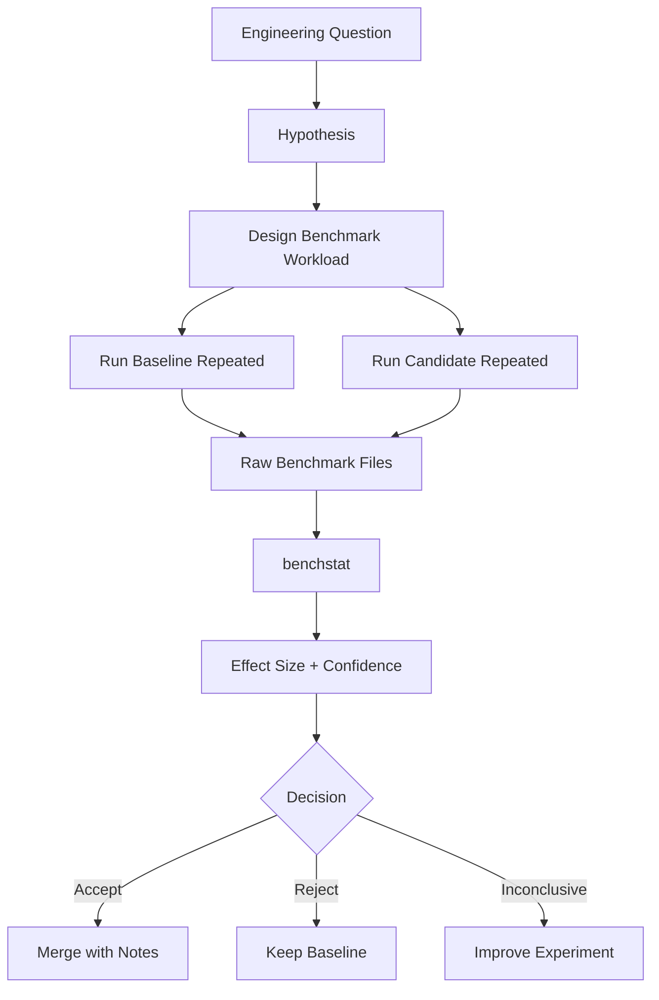
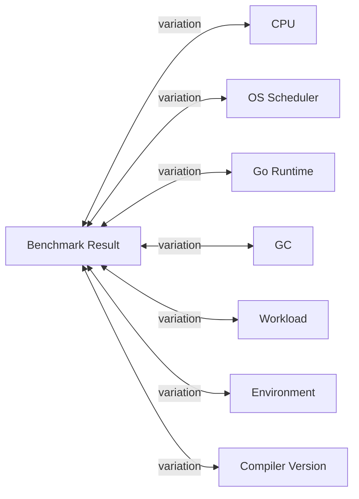
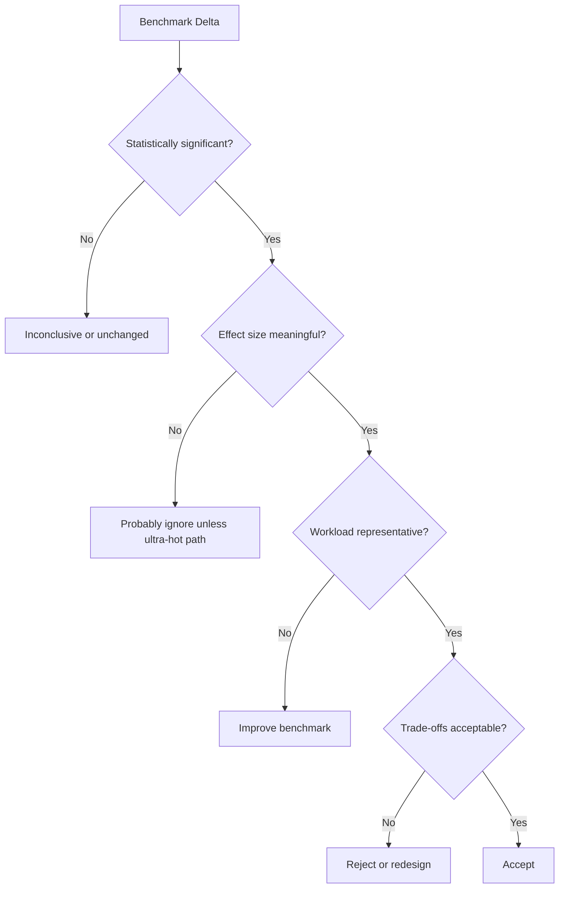
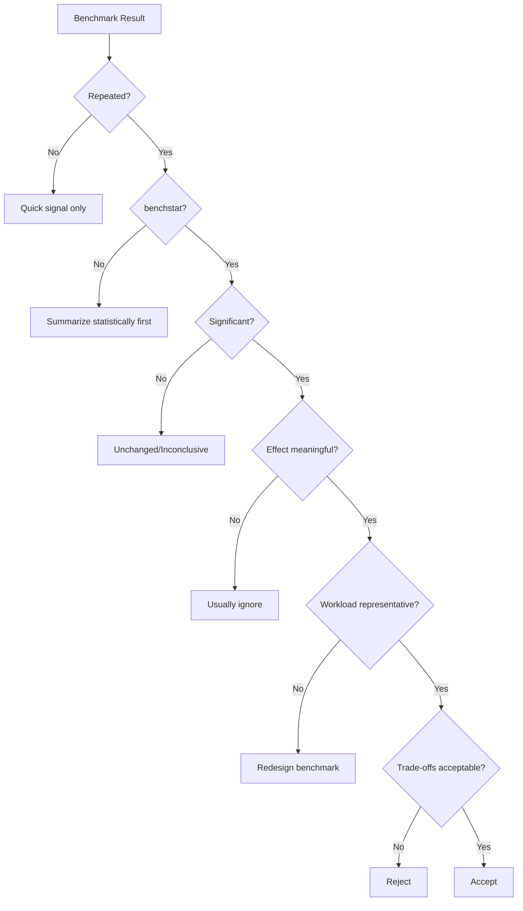

# learn-go-testing-benchmarking-performance-engineering-part-024.md

# Part 024 — Benchmark Statistics: Noise, Variance, Confidence, `benchstat`, A/B Experiments

> Seri: **Go Testing, Benchmarking, Performance Engineering**  
> Target pembaca: **Java Software Engineer → Go Performance-Capable Engineer**  
> Target Go: **Go 1.26.x**  
> Status seri: **Part 024 dari 034**  
> Prasyarat: Part 020–023

---

## 0. Tujuan Part Ini

Part ini membahas **statistik benchmark**.

Di part sebelumnya kita sudah membahas:

- apa yang diukur benchmark Go,
- style modern dengan `B.Loop`,
- allocation benchmarking,
- parallel benchmarking.

Sekarang kita masuk ke pertanyaan yang lebih berbahaya:

> Kapan hasil benchmark boleh dipercaya untuk mengambil keputusan engineering?

Karena benchmark yang benar secara sintaks belum tentu benar secara statistik.

Contoh:

```text
old: 100.2 ns/op
new:  97.9 ns/op
```

Apakah new lebih cepat?

Mungkin iya. Mungkin tidak.

Tanpa repeated runs, noise control, dan statistical comparison, angka itu belum cukup.

Part ini akan membahas:

1. Kenapa benchmark noisy.
2. Apa itu variance dan effect size.
3. Kenapa single run tidak cukup.
4. Bagaimana menjalankan repeated benchmark.
5. Bagaimana memakai `benchstat`.
6. Bagaimana membaca confidence interval dan p-value secara praktis.
7. Cara mendesain A/B benchmark yang fair.
8. Cara membandingkan `ns/op`, `B/op`, dan `allocs/op`.
9. Cara menghindari benchmark theater di PR/CI.
10. Cara membuat performance experiment yang defensible.

---

## 1. Satu Kalimat Inti

> Benchmark result baru bernilai engineering jika dibandingkan terhadap baseline yang fair, dijalankan berulang, dianalisis secara statistik, dan diinterpretasikan sesuai effect size, workload, serta performance budget.

Tanpa itu, benchmark sering hanya menjadi angka dekoratif.

---

## 2. Problem: Benchmark Terlihat Presisi, Tetapi Belum Tentu Akurat

Output Go benchmark bisa terlihat sangat presisi:

```text
BenchmarkAuthorize-8    12345678    83.42 ns/op    0 B/op    0 allocs/op
```

Angka `83.42` terlihat meyakinkan.

Tetapi:

- run berikutnya bisa `85.10`,
- run berikutnya bisa `81.90`,
- laptop bisa berbeda dengan CI,
- CPU frequency bisa berubah,
- background process bisa mengganggu,
- Go version bisa berubah,
- branch predictor/cache state bisa berubah,
- GC bisa terjadi di waktu berbeda,
- VM noisy neighbor bisa muncul,
- thermal throttling bisa terjadi,
- OS scheduler bisa memindahkan thread.

Presisi formatting bukan berarti confidence tinggi.

---

## 3. Benchmark Sebagai Eksperimen

Benchmark bukan “print speed”.

Benchmark adalah eksperimen.

Eksperimen punya:

| Elemen | Contoh |
|---|---|
| Hypothesis | Manual parser lebih cepat dari regexp parser |
| Baseline | Implementasi regexp |
| Candidate | Implementasi manual |
| Controlled variables | Go version, CPU, OS, input, command |
| Measurement | `ns/op`, `B/op`, `allocs/op` |
| Repetition | `-count=10` atau lebih |
| Analysis | `benchstat` |
| Decision rule | accept jika >10% faster dan allocation tidak naik |
| Scope | parser valid/invalid input only |

Tanpa elemen ini, benchmark mudah berubah menjadi opini yang diberi angka.

---

## 4. Diagram: Benchmark Experiment Pipeline



---

## 5. Noise: Sumber Variasi Benchmark

Benchmark noise bisa berasal dari banyak layer.

### 5.1 Hardware

- CPU model
- turbo boost
- frequency scaling
- thermal throttling
- cache size
- NUMA topology
- memory bandwidth
- SMT/hyperthreading
- power mode

### 5.2 OS

- scheduler
- background process
- interrupts
- kernel version
- file system cache
- timer behavior
- power management

### 5.3 Runtime

- GC timing
- goroutine scheduling
- stack growth
- allocator state
- lazy initialization
- map/random iteration effects
- runtime version

### 5.4 Tooling

- Go version
- compiler optimizations
- build flags
- race/coverage instrumentation
- benchmark command flags
- test cache/build cache perception

### 5.5 Workload

- random input
- mutable fixture
- cache hot/cold
- map growth
- sync.Pool state
- external dependency
- shared state contention

### 5.6 Environment

- laptop on battery
- CI VM noisy neighbor
- container CPU quota
- cloud instance stealing
- antivirus/indexer
- other tests running

---

## 6. Noise Diagram



The engineer's job is not to eliminate all noise. It is to **control enough noise** so the decision is reliable.

---

## 7. Single Run Is Not Decision-Grade

Command:

```bash
go test -run='^$' -bench=BenchmarkParseCaseID -benchmem ./internal/caseid
```

Output:

```text
BenchmarkParseCaseID-8    20000000    60.1 ns/op    0 B/op    0 allocs/op
```

This is useful for quick feedback.

It is not enough to say:

> This implementation is 3% faster.

For decision:

```bash
go test -run='^$' -bench=BenchmarkParseCaseID -benchmem -count=10 ./internal/caseid > result.txt
```

Repeated runs give sample distribution.

---

## 8. Repeated Runs

Use:

```bash
-count=10
```

Example:

```bash
go test -run='^$' -bench=BenchmarkParseCaseID -benchmem -count=10 ./internal/caseid > old.txt
```

Then candidate:

```bash
go test -run='^$' -bench=BenchmarkParseCaseID -benchmem -count=10 ./internal/caseid > new.txt
```

Why 10?

The official `benchstat` documentation recommends benchmark samples be run at least 10 times to gather statistically useful results. `benchstat` computes summaries and A/B comparisons for Go benchmark output, including median and confidence interval for median. See the official command documentation.  

In practice:

- 5 runs: quick directional signal
- 10 runs: common minimum for comparison
- 20+ runs: better for noisy benchmark
- longer `-benchtime`: better for tiny/noisy operations
- stable dedicated machine: more important than huge count

---

## 9. `benchstat`

Install:

```bash
go install golang.org/x/perf/cmd/benchstat@latest
```

Use:

```bash
benchstat old.txt new.txt
```

`benchstat` reads Go benchmark output files and computes statistical summaries and comparisons.

Typical flow:

```bash
git checkout main
go test -run='^$' -bench=. -benchmem -count=10 ./internal/authz > old.txt

git checkout feature/authz-optimization
go test -run='^$' -bench=. -benchmem -count=10 ./internal/authz > new.txt

benchstat old.txt new.txt
```

---

## 10. Example `benchstat` Output

Example:

```text
goos: linux
goarch: amd64
pkg: example.com/app/internal/caseid
cpu: Intel(R) Xeon(R) Platinum

                     │   old.txt   │   new.txt   │
                     │   sec/op    │   sec/op    │
ParseCaseID/Valid-8    65.20n ± 2%    42.10n ± 1%   -35.43% (p=0.000 n=10)
ParseCaseID/Invalid-8  80.10n ± 3%    78.90n ± 4%    -1.50% (p=0.315 n=10)

                     │   old.txt   │   new.txt   │
                     │    B/op     │    B/op     │
ParseCaseID/Valid-8    16.00 ± 0%     0.00 ± 0%   -100.00% (p=0.000 n=10)
ParseCaseID/Invalid-8  64.00 ± 0%    64.00 ± 0%       ~ (p=1.000 n=10)

                     │   old.txt   │   new.txt   │
                     │ allocs/op   │ allocs/op   │
ParseCaseID/Valid-8     1.000 ± 0%    0.000 ± 0%   -100.00% (p=0.000 n=10)
ParseCaseID/Invalid-8   2.000 ± 0%    2.000 ± 0%       ~ (p=1.000 n=10)
```

Interpretation:

- valid path improved significantly,
- invalid path time did not meaningfully change,
- valid path allocation eliminated,
- invalid path allocation unchanged.

This is decision-grade if workload is relevant.

---

## 11. Median, Not Just Mean

Benchmark samples often contain outliers.

Example:

```text
100 ns
101 ns
99 ns
102 ns
300 ns
```

Mean:

```text
140.4 ns
```

Median:

```text
101 ns
```

The outlier heavily affects mean.

`benchstat` focuses on robust summaries such as median and confidence intervals.

Engineering implication:

- do not eyeball one number,
- do not use average from manual spreadsheet blindly,
- use tool designed for benchmark comparison.

---

## 12. Variance

Variance tells how spread out measurements are.

Low variance:

```text
100, 101, 100, 99, 100
```

High variance:

```text
80, 120, 95, 160, 70
```

High variance means benchmark result is less reliable.

Symptoms:

- wide `±`,
- inconsistent direction,
- p-value not significant,
- `benchstat` shows `~`,
- repeated runs feel random.

High variance requires:

- better environment,
- longer `-benchtime`,
- better benchmark design,
- removing external dependency,
- controlling randomness,
- isolating background work.

---

## 13. Effect Size

Effect size is the magnitude of change.

Examples:

```text
-1.2%
-5.0%
-35.0%
+120.0%
```

A statistically significant 1% improvement may not matter.

A 30% improvement usually matters, but only if benchmark is relevant and correctness/readability are acceptable.

Decision requires both:

1. statistical confidence,
2. practical significance.

---

## 14. Statistical Significance vs Practical Significance

| Result | Meaning |
|---|---|
| statistically significant, tiny effect | real but may not matter |
| statistically insignificant, large apparent effect | may be noise or too few samples |
| statistically significant, large effect | likely meaningful |
| statistically insignificant, tiny effect | ignore |

Example:

```text
Authorize     100.0 ns ± 1% -> 99.2 ns ± 1%  -0.8% (p=0.01)
```

Statistically significant, but probably not worth complexity unless extremely hot.

Example:

```text
BuildReport   10 ms ± 30% -> 7 ms ± 30%  -30% (p=0.20)
```

Large apparent improvement, but noisy/inconclusive. Improve experiment.

---

## 15. p-value Practical Reading

Do not become a p-value cargo-cult engineer.

Practical interpretation:

- low p-value: observed difference unlikely due to random sampling alone under the test assumptions
- high p-value: benchmark data does not provide strong evidence of difference
- p-value does not prove causality
- p-value does not prove production impact
- p-value does not fix bad benchmark design
- p-value does not replace effect size

If benchmark workload is wrong, statistically significant result is still useless.

---

## 16. Confidence Interval

If output shows:

```text
100 ns ± 2%
```

It means the central estimate has uncertainty.

Narrow interval:

```text
100 ns ± 1%
```

More stable.

Wide interval:

```text
100 ns ± 25%
```

Noisy.

If old and new intervals overlap heavily, difference may be inconclusive.

But do not manually over-interpret intervals; let `benchstat` help.

---

## 17. A/B Benchmark Design

A/B benchmark means comparing baseline and candidate.

A good A/B benchmark controls:

| Variable | Must be Same? |
|---|---|
| Go version | yes |
| OS/arch | yes |
| CPU/machine | yes |
| benchmark command | yes |
| package/test files | mostly yes |
| input fixture | yes |
| environment variables | yes |
| build tags | yes |
| `GOMAXPROCS`/`-cpu` | yes |
| dependency versions | yes |
| background load | as much as possible |

The only intended difference should be the code/config being tested.

---

## 18. A/B Workflow: Branch Switching

Simple workflow:

```bash
git checkout main
go test -run='^$' -bench=BenchmarkX -benchmem -count=10 ./internal/foo > old.txt

git checkout feature
go test -run='^$' -bench=BenchmarkX -benchmem -count=10 ./internal/foo > new.txt

benchstat old.txt new.txt
```

Potential issue:

- first run may warm machine,
- branch switch may leave build cache differences,
- ordering can bias result.

Better:

- run A/B/A,
- alternate order,
- use dedicated perf runner,
- ensure clean environment.

---

## 19. A/B/A Pattern

Run:

```bash
git checkout main
go test -run='^$' -bench=BenchmarkX -benchmem -count=10 ./internal/foo > old1.txt

git checkout feature
go test -run='^$' -bench=BenchmarkX -benchmem -count=10 ./internal/foo > new.txt

git checkout main
go test -run='^$' -bench=BenchmarkX -benchmem -count=10 ./internal/foo > old2.txt
```

Compare:

```bash
benchstat old1.txt new.txt
benchstat old2.txt new.txt
benchstat old1.txt old2.txt
```

If `old1` vs `old2` differs significantly, environment is unstable.

---

## 20. Interleaving Runs

For noisy environments, interleaving is better:

```text
old run 1
new run 1
old run 2
new run 2
...
```

Manual branch switching is cumbersome.

A script can automate:

```bash
for i in $(seq 1 10); do
  git checkout main
  go test -run='^$' -bench=BenchmarkX -benchmem ./internal/foo >> old.txt

  git checkout feature
  go test -run='^$' -bench=BenchmarkX -benchmem ./internal/foo >> new.txt
done
```

But build costs and branch switching can interfere. For serious benchmarking, use tooling or dedicated workflow.

---

## 21. Environment Control

Ideal benchmark machine:

- same CPU every run,
- plugged in,
- performance power mode,
- low background processes,
- no heavy disk/network activity,
- stable temperature,
- same Go version,
- same OS/kernel,
- no race/coverage,
- no container CPU throttling unless that is the target,
- isolated CI runner for perf.

For local developer laptop:

- close heavy apps,
- plug into power,
- avoid browser/video calls,
- run repeated count,
- treat small deltas skeptically.

---

## 22. CPU Frequency and Thermal Effects

Modern CPUs change frequency.

A benchmark may run faster when CPU turbo is high and slower after heating.

Symptoms:

- first runs faster,
- later runs slower,
- long benchmark drifts,
- laptop on battery much slower,
- CI VM inconsistent.

Mitigations:

- stable power profile,
- warmup before measurement,
- longer repeated runs,
- compare A/B close in time,
- use dedicated machine.

---

## 23. Go Version Matters

Go compiler/runtime improvements can change benchmark results.

Do not compare:

```text
old result from Go 1.25
new result from Go 1.26
```

unless the experiment is specifically:

> What changed from Go 1.25 to Go 1.26?

For code change benchmarking, keep Go version fixed.

For Go upgrade benchmarking, benchmark old Go vs new Go with same code and same workload.

---

## 24. Race/Coverage Instrumentation Invalidates Perf Baseline

Do not compare normal benchmark with:

```bash
-race
-cover
```

Race detector and coverage instrumentation add overhead.

Valid uses:

```bash
go test -race ...
```

for correctness signal.

```bash
go test -cover ...
```

for coverage signal.

Benchmark performance baseline should be without race/coverage unless measuring their overhead intentionally.

---

## 25. Benchmark Cache and Build Cache

Benchmark execution itself produces fresh measurement, but build/test caching can confuse workflows.

Use explicit `-count` for repeated measurement.

If needed:

```bash
go clean -testcache
```

For rigorous experiments, also record:

```bash
go version
go env GOOS GOARCH GOMAXPROCS
```

and benchmark output already includes some metadata.

---

## 26. Workload Control

Bad A/B:

- old benchmark uses small fixture,
- new benchmark uses large fixture,
- old uses hot cache,
- new uses cold cache,
- old uses valid inputs,
- new uses mixed invalid inputs.

Good A/B:

- same fixture,
- same corpus,
- same benchmark function,
- same command,
- only implementation changes.

If benchmark changes too, separate the changes:

1. first migrate benchmark,
2. compare old benchmark vs migrated benchmark,
3. then compare implementation.

---

## 27. Comparing `ns/op`, `B/op`, `allocs/op`

Time can improve while allocation worsens.

Example:

```text
name     old time/op  new time/op  delta
Build    1000ns       900ns        -10%

name     old B/op     new B/op     delta
Build    512B         4096B        +700%

name     old allocs/op new allocs/op delta
Build    4            25           +525%
```

Decision:

- maybe reject if hot path,
- maybe accept if cold path and code simpler,
- maybe investigate allocation source,
- maybe run load test.

Never look at time alone.

---

## 28. Allocation Metrics Are Often Deterministic

For deterministic benchmark, `B/op` and `allocs/op` often show `± 0%`.

A change from:

```text
0 allocs/op -> 1 allocs/op
```

is usually real.

Even if `ns/op` is noisy, allocation regression may be meaningful.

But caveat:

- sync.Pool,
- map growth,
- lazy initialization,
- random input,
- runtime changes,
- concurrency.

---

## 29. Reading `~` in `benchstat`

`benchstat` may show `~`.

Example:

```text
Authorize  100ns ± 3%  101ns ± 2%  ~ (p=0.42 n=10)
```

Practical meaning:

- no statistically meaningful difference found,
- treat as unchanged,
- do not claim improvement/regression,
- if expected change is important, improve experiment.

---

## 30. Regression Thresholds

A CI/perf gate needs threshold.

Examples:

```text
Reject if:
  time/op regression > 10% and p < 0.05
  B/op regression > 20% on hot benchmark
  allocs/op increases from 0 to >0 on zero-alloc contract
```

But thresholds must be per benchmark class.

| Benchmark Class | Time Threshold | Allocation Threshold |
|---|---:|---:|
| micro hot path | 5–10% | strict |
| scenario benchmark | 10–20% | moderate |
| noisy integration benchmark | manual review | manual review |
| cold path benchmark | high tolerance | high tolerance |
| security/validation hot invalid path | strict | strict |

Do not use one global rule for all benchmarks.

---

## 31. Effect Size Decision Matrix



---

## 32. Benchmark Result Comment in PR

Bad PR comment:

```text
This is faster.
```

Better:

```text
Benchmark result:
  Command:
    go test -run='^$' -bench=BenchmarkParseCaseID -benchmem -count=10 ./internal/caseid

  Summary:
    Valid path: 65.2ns -> 42.1ns (-35.4%, p=0.000)
    Allocation: 1 alloc/op -> 0 alloc/op

  Scope:
    Applies to valid case IDs only.
    Invalid paths unchanged.

  Decision:
    Accept because ParseCaseID is called on every request and log event.
```

This is reviewable.

---

## 33. Benchmark Evidence Template

Use this template:

```text
Performance Experiment:
  Question:
  Hypothesis:
  Baseline:
  Candidate:
  Benchmark:
  Workload:
  Command:
  Environment:
  Samples:
  Result:
  Allocation impact:
  Correctness tests:
  Trade-offs:
  Decision:
  Follow-up:
```

This prevents benchmark theater.

---

## 34. Benchmark Result Storage

For serious projects, store:

- raw benchmark output,
- branch/commit SHA,
- Go version,
- OS/arch,
- CPU,
- command,
- date/time,
- benchmark fixture version,
- `benchstat` summary,
- decision notes.

Do not store only screenshots.

Raw text allows re-analysis.

---

## 35. CI Benchmark Levels

| Level | Purpose | Example |
|---|---|---|
| PR quick benchmark | smoke for critical hot path | selected `-count=3` |
| Nightly benchmark | broad repeated suite | `-count=10` |
| Release benchmark | decision-grade baseline | dedicated runner |
| Manual experiment | architecture comparison | custom matrix |
| Historical trend | detect gradual drift | stored time series |

Part 030 will cover regression gates deeply. Here focus on statistical validity.

---

## 36. Noisy CI Runners

Shared CI runners often produce noisy benchmark data.

Symptoms:

- high variance,
- random regressions,
- inconsistent reruns,
- CPU metadata changes,
- p-values unstable.

Options:

- do not fail PR based on noisy benchmark,
- use dedicated perf runner,
- use nightly trend,
- require large effect size,
- use manual review for small deltas,
- store historical data,
- compare against same runner class.

---

## 37. Dedicated Perf Runner

A better perf runner has:

- stable machine type,
- fixed Go version,
- minimal background tasks,
- pinned OS image,
- consistent CPU/power config,
- no concurrent jobs,
- artifact upload,
- benchmark history.

Even then, benchmark remains an experiment, not production truth.

---

## 38. A/B Benchmark with Build Tags

If benchmark is expensive:

```go
//go:build perf
```

Run:

```bash
go test -tags=perf -run='^$' -bench=. -benchmem -count=10 ./internal/authz > result.txt
```

A/B comparison must use same tags.

Bad:

```bash
old: go test -bench=. ...
new: go test -tags=perf -bench=. ...
```

Not comparable.

---

## 39. A/B Benchmark with CPU Matrix

Run:

```bash
go test -run='^$' -bench=BenchmarkCache -benchmem -cpu=1,2,4,8 -count=10 ./internal/cache > old.txt
go test -run='^$' -bench=BenchmarkCache -benchmem -cpu=1,2,4,8 -count=10 ./internal/cache > new.txt
benchstat old.txt new.txt
```

Read per CPU.

Candidate may improve single CPU but regress high concurrency.

Example:

```text
CacheGet       -10%
CacheGet-2      -5%
CacheGet-4      +2% ~
CacheGet-8     +25%
```

Decision depends on deployment concurrency.

---

## 40. A/B Benchmark with Multiple Workloads

Suppose parser improves valid path but regresses invalid path.

```text
Valid       -40%
Invalid      +80%
Mixed        -20%
```

If invalid path is attacker-controlled or common, regression may matter.

Always include:

- common case,
- worst case,
- error case,
- mixed representative case.

---

## 41. Simpson's Paradox in Benchmark

Mixed benchmark can hide regressions.

Example:

```text
Workload A: new faster by 50%
Workload B: new slower by 100%
Mixed: new faster by 10%
```

If production has more B than benchmark mix, decision wrong.

Therefore:

- benchmark separated workloads,
- also benchmark mixed workload,
- document production distribution assumption.

---

## 42. Distribution Assumption

Write explicitly:

```text
Assumption:
  90% valid case IDs
  9% invalid shape
  1% invalid year

Mixed benchmark:
  corpus reflects this distribution.
```

If no production data, say:

```text
No production distribution available.
This benchmark is exploratory.
```

Do not pretend.

---

## 43. Benchmarking Small Deltas

Small deltas are hard.

If expected improvement is 1–3%:

- need stable machine,
- many samples,
- longer benchtime,
- low-noise benchmark,
- maybe hardware counters/profile,
- high confidence,
- strong reason.

For most product code, a 2% microbenchmark win is not worth readability risk unless the operation dominates CPU.

---

## 44. Benchmarking Large Deltas

Large deltas are easier but still need validation.

If new is 10x faster:

Check:

- did it still do same work?
- was result optimized away?
- did benchmark change setup?
- was input changed?
- did candidate skip error handling?
- did cache become hot?
- did old benchmark include setup accidentally?
- did new benchmark exclude necessary work?

Large improvement can be real, but also often indicates measurement bug.

---

## 45. Benchmark Result Under Go Upgrade

Experiment:

```text
Question:
  How does Go 1.26 affect our service hot benchmarks compared with Go 1.25?
```

Control:

- same code,
- same benchmark,
- same machine,
- same command,
- different Go version.

Commands:

```bash
go1.25 test -run='^$' -bench=. -benchmem -count=10 ./... > go125.txt
go1.26 test -run='^$' -bench=. -benchmem -count=10 ./... > go126.txt
benchstat go125.txt go126.txt
```

Interpretation:

- compiler/runtime changed,
- allocation/escape may change,
- GC behavior may change,
- verify correctness suite,
- run scenario/load tests for critical services.

---

## 46. Benchmark with PGO

PGO changes compiler optimization based on profile.

Experiment:

```text
old: no PGO
new: with PGO
```

Commands conceptually:

```bash
go test -run='^$' -bench=. -benchmem -count=10 -pgo=off ./internal/foo > nopgo.txt
go test -run='^$' -bench=. -benchmem -count=10 -pgo=auto ./internal/foo > pgo.txt
benchstat nopgo.txt pgo.txt
```

But PGO must use representative profile. Otherwise benchmark improvement may not translate to production.

PGO workflow is covered in Part 029.

---

## 47. Benchmarking With Profiles

Using `-cpuprofile` during benchmark can alter execution slightly and changes purpose.

For comparison, do not mix:

```text
old without profile
new with profile
```

Use profiles for diagnosis after benchmark shows meaningful difference.

---

## 48. Statistical Anti-Patterns

### 48.1 Cherry-Picking Best Run

Bad:

```text
I ran it 10 times and picked the fastest.
```

This is invalid unless explicitly measuring best-case and saying so.

### 48.2 Ignoring Failed Runs

If benchmark sometimes fails, that is evidence.

### 48.3 Comparing Different Machines

Invalid for small deltas.

### 48.4 Comparing Different Commands

Invalid unless command difference is intentional.

### 48.5 Claiming Improvement from `~`

If `benchstat` says `~`, do not claim faster.

### 48.6 Treating p-value as Business Value

A statistically real improvement can be irrelevant.

### 48.7 Hiding Allocation Regression

Do not show only `ns/op`.

### 48.8 No Workload Explanation

Without workload, result lacks meaning.

### 48.9 Overfitting to Benchmark

Optimizing benchmark input while production differs.

### 48.10 Benchmarking After Code Change Only

Need baseline.

---

## 49. `benchstat` Workflow Script Example

Linux/macOS shell:

```bash
#!/usr/bin/env bash
set -euo pipefail

PKG="./internal/authz"
BENCH="BenchmarkAuthorize"
COUNT="${COUNT:-10}"

git checkout main
go test -run='^$' -bench="${BENCH}" -benchmem -count="${COUNT}" "${PKG}" > old.txt

git checkout feature/authz-optimization
go test -run='^$' -bench="${BENCH}" -benchmem -count="${COUNT}" "${PKG}" > new.txt

benchstat old.txt new.txt
```

PowerShell:

```powershell
$Pkg = "./internal/authz"
$Bench = "BenchmarkAuthorize"
$Count = 10

git checkout main
go test -run='^$' -bench=$Bench -benchmem -count=$Count $Pkg | Tee-Object -FilePath old.txt

git checkout feature/authz-optimization
go test -run='^$' -bench=$Bench -benchmem -count=$Count $Pkg | Tee-Object -FilePath new.txt

benchstat old.txt new.txt
```

---

## 50. Benchstat Input Hygiene

Raw benchmark file should include only relevant outputs if possible.

Good:

```bash
go test -run='^$' -bench=BenchmarkParseCaseID -benchmem -count=10 ./internal/caseid > old.txt
```

Avoid mixing unrelated logs into benchmark output.

If tests log heavily, use benchmark-only:

```bash
-run='^$'
```

If multiple packages, benchstat can handle benchmark names, but files become larger. For focused decision, narrow benchmark.

---

## 51. Benchmark Names and `benchstat`

Stable benchmark names matter.

If old:

```text
BenchmarkAuthorize/RBAC
```

and new renamed to:

```text
BenchmarkAuthorize/RBACFast
```

`benchstat` may not compare them directly.

When changing benchmark names, preserve old comparable names or document mapping.

---

## 52. Comparing Multiple Implementations in Same Run

Alternative:

```go
func BenchmarkParserVariants(b *testing.B) {
	b.Run("Regexp", ...)
	b.Run("Manual", ...)
}
```

Then one run contains both variants.

Pros:

- same process/environment,
- easy local comparison.

Cons:

- order effects,
- shared runtime state,
- not same as branch A/B,
- one implementation can warm caches,
- fixture shared state risks.

For final decision, branch A/B with `benchstat` is still better.

---

## 53. Order Effects

If benchmark order is always:

```text
Old
New
```

New might benefit from warm caches or suffer from thermal slowdown.

Mitigation:

- run A/B/A,
- interleave,
- randomize benchmark order? `go test` benchmark order is deterministic by function/subtest order,
- use separate processes,
- inspect old1 vs old2.

---

## 54. Confidence Tiers

Use tiers:

| Tier | Evidence | Use |
|---|---|---|
| Tier 0 | single local run | quick sanity |
| Tier 1 | `-count=5` local | directional |
| Tier 2 | `-count=10` + `benchstat` same machine | PR evidence |
| Tier 3 | dedicated perf runner + history | regression gate |
| Tier 4 | scenario/load + production data | capacity decision |

Do not use Tier 0 evidence for Tier 4 decisions.

---

## 55. Engineering Decision Examples

### 55.1 Accept

```text
Manual parser:
  Valid path -35%, p=0.000
  Allocation 1 -> 0 alloc/op
  Invalid path unchanged
  Parser called on every request
  Code still readable and tested
Decision: accept
```

### 55.2 Reject

```text
Custom unsafe conversion:
  Encode path -4%, p=0.02
  Allocation 1 -> 0 alloc/op
  Introduces unsafe and subtle lifetime risk
  Path not hot enough
Decision: reject
```

### 55.3 Inconclusive

```text
Cache change:
  p=0.2, ±20% variance
  Shared CI runner noisy
  Effect differs across -cpu
Decision: rerun on dedicated runner and add workload split
```

### 55.4 Accept with Follow-up

```text
New sharded cache:
  -30% at -cpu=8
  +5% at -cpu=1
  Production pods use 4–8 vCPU
  Write path not yet benchmarked
Decision: accept for read-heavy cache, add write-mix benchmark before release
```

---

## 56. Benchmark Statistics for Parallel Benchmarks

Parallel benchmarks are often noisier.

Use:

```bash
go test -run='^$' -bench=BenchmarkCacheParallel -benchmem -cpu=1,2,4,8 -count=10 ./internal/cache > result.txt
```

Compare per `-cpu`.

Important:

- high concurrency increases scheduler/GC variability,
- shared contention can amplify noise,
- throughput curve matters more than one value,
- use longer `-benchtime` if needed.

---

## 57. Benchmark Statistics for Allocation

Allocation metrics often stable.

Example:

```text
B/op       1024 ± 0% -> 2048 ± 0%
allocs/op 8 ± 0%    -> 16 ± 0%
```

This is strong evidence of allocation regression.

Even if time:

```text
100ns ± 10% -> 98ns ± 10% ~
```

allocation regression still requires review.

---

## 58. Benchmark Statistics for `sync.Pool`

`sync.Pool` benchmarks can be unstable because pool state interacts with GC.

If benchmarking pool:

- run repeated,
- include serial and parallel,
- include mixed payload sizes,
- maybe force GC only if the experiment is about GC interaction,
- do not compare pool benchmark without thinking about retention.

---

## 59. Benchmark Statistics for Maps

Map benchmarks can be sensitive to:

- map size,
- key distribution,
- hash seed,
- growth,
- iteration order,
- hit/miss ratio.

Use deterministic keys and stable setup.

Do not benchmark map iteration order-dependent behavior unless intended.

---

## 60. Benchmark Statistics for IO-Like Operations

If benchmark touches filesystem/network:

- variance higher,
- OS cache matters,
- device state matters,
- external load matters,
- benchmark may be scenario/integration benchmark.

Use more samples and treat small deltas skeptically.

For real service IO, load test may be more appropriate.

---

## 61. Performance Experiment Report Example

```text
Performance Experiment:
  Question:
    Should ParseCaseID switch from strings.Split to manual parser?

  Hypothesis:
    Manual parser reduces allocation and improves valid-path latency.

  Baseline:
    strings.Split implementation on main@abc123.

  Candidate:
    manual parser on feature/manual-caseid@def456.

  Benchmark:
    BenchmarkParseCaseID/{Valid,InvalidShape,InvalidYear}

  Workload:
    deterministic strings from production-like case ID format.

  Command:
    go test -run='^$' -bench=BenchmarkParseCaseID -benchmem -count=10 ./internal/caseid

  Environment:
    Go 1.26.x, linux/amd64, same dedicated runner.

  Result:
    Valid: 65.2ns -> 42.1ns (-35.4%, p=0.000)
    InvalidShape: ~
    InvalidYear: ~

  Allocation:
    Valid: 1 alloc/op -> 0 alloc/op.
    Invalid paths unchanged.

  Correctness:
    table-driven tests + fuzz target passed.

  Trade-offs:
    Manual parser is longer but still readable.
    No unsafe.

  Decision:
    Accept.
```

---

## 62. Mermaid: Evidence-to-Decision



---

## 63. Review Checklist

### 63.1 Experiment Design

- [ ] Is there a clear question?
- [ ] Is there a hypothesis?
- [ ] Is baseline identified?
- [ ] Is candidate identified?
- [ ] Is only one intended variable changed?

### 63.2 Command

- [ ] Same Go version?
- [ ] Same OS/arch?
- [ ] Same machine?
- [ ] Same benchmark command?
- [ ] Same build tags?
- [ ] Same `-cpu`?
- [ ] `-run='^$'` used when appropriate?
- [ ] `-benchmem` used?

### 63.3 Samples

- [ ] At least 10 samples for decision-grade comparison?
- [ ] More samples for noisy benchmark?
- [ ] Longer `-benchtime` if needed?
- [ ] A/B/A used for critical result?

### 63.4 Analysis

- [ ] `benchstat` used?
- [ ] Time/op reviewed?
- [ ] B/op reviewed?
- [ ] allocs/op reviewed?
- [ ] Effect size reviewed?
- [ ] Statistical significance reviewed?
- [ ] Noise/variance reviewed?

### 63.5 Interpretation

- [ ] Workload representative?
- [ ] Result tied to call frequency?
- [ ] Result tied to performance budget?
- [ ] Trade-offs reviewed?
- [ ] Production impact not overstated?
- [ ] Follow-up profile/load test identified if needed?

---

## 64. Anti-Patterns

### 64.1 “I Ran It Once”

One run is a sanity check, not evidence.

### 64.2 “It Looks Faster”

Use `benchstat`.

### 64.3 “Only Show Faster Benchmark”

Show all relevant benchmark results, including regressions.

### 64.4 “Ignore Allocation”

Allocation can regress even when time improves.

### 64.5 “Benchmark on Different Machines”

Invalid for small/medium deltas.

### 64.6 “Statistically Significant Means We Must Merge”

No. Practical value and trade-offs matter.

### 64.7 “No Significant Difference Means Equal”

No. It means insufficient evidence of difference under this experiment.

### 64.8 “Benchmark Uses Production Data Without Sanitization”

Do not use sensitive data.

### 64.9 “CI Red Because 1% Benchmark Regression”

Bad gate design unless ultra-stable and ultra-hot.

### 64.10 “Benchmark Result Without Workload Description”

Not reviewable.

---

## 65. Practical Rules of Thumb

1. Use `-count=10` minimum for serious comparison.
2. Use `benchstat` for old/new comparison.
3. Treat single runs as directional only.
4. Keep Go version fixed.
5. Keep machine/environment fixed.
6. Use `-benchmem`.
7. Compare allocation as seriously as time.
8. Be skeptical of changes under 5% unless benchmark is very stable.
9. Be skeptical of noisy results with wide intervals.
10. Be skeptical of huge wins until correctness and operation boundary are verified.
11. Use A/B/A for important decisions.
12. Record command and environment.
13. Do not fail CI on noisy small deltas.
14. Tie benchmark result to workload and budget.
15. Prefer clarity over micro-wins unless hot path is proven.

---

## 66. Command Cheatsheet

```bash
# Install benchstat.
go install golang.org/x/perf/cmd/benchstat@latest

# One quick run.
go test -run='^$' -bench=BenchmarkX -benchmem ./internal/foo

# Baseline repeated.
go test -run='^$' -bench=BenchmarkX -benchmem -count=10 ./internal/foo > old.txt

# Candidate repeated.
go test -run='^$' -bench=BenchmarkX -benchmem -count=10 ./internal/foo > new.txt

# Compare.
benchstat old.txt new.txt

# Longer benchmark.
go test -run='^$' -bench=BenchmarkX -benchmem -benchtime=3s -count=10 ./internal/foo > result.txt

# CPU matrix.
go test -run='^$' -bench=BenchmarkX -benchmem -cpu=1,2,4,8 -count=10 ./internal/foo > result.txt

# A/B/A check.
benchstat old1.txt old2.txt
benchstat old1.txt new.txt
benchstat old2.txt new.txt

# Record Go version.
go version

# Record environment.
go env GOOS GOARCH
```

---

## 67. Mini Exercise 1: Interpret `benchstat`

Result:

```text
Authorize/RBAC-8    100.0ns ± 1%   97.8ns ± 1%   -2.2% (p=0.01 n=10)
```

Interpretation:

- statistically significant small improvement,
- practical value depends on hotness,
- probably not worth complex code by itself,
- acceptable if change is simple and no regressions.

---

## 68. Mini Exercise 2: Allocation Regression

Result:

```text
BuildActions-8    1200ns ± 2%  1150ns ± 2%  -4.2% (p=0.03)
B/op              512 ± 0%     4096 ± 0%    +700%
allocs/op         4 ± 0%       20 ± 0%      +400%
```

Decision:

- do not accept blindly,
- allocation regression large,
- estimate allocation rate,
- inspect source,
- decide based on hotness/budget,
- maybe reject despite time improvement.

---

## 69. Mini Exercise 3: Inconclusive Result

Result:

```text
CacheGetParallel-8    50ns ± 25%   42ns ± 30%   ~ (p=0.18 n=10)
```

Interpretation:

- apparent improvement but high noise,
- no strong evidence,
- run longer benchtime,
- use dedicated runner,
- inspect benchmark for contention/randomness,
- compare CPU matrix.

---

## 70. Mini Exercise 4: A/B/A

Result:

```text
old1 vs old2: 100ns -> 120ns, +20%, p=0.01
old1 vs new:  100ns -> 105ns, +5%, p=0.02
old2 vs new:  120ns -> 105ns, -12%, p=0.02
```

Interpretation:

- baseline unstable,
- environment/order effect likely,
- cannot conclude candidate improvement/regression,
- rerun in controlled environment.

---

## 71. What to Remember

1. Benchmark numbers need statistical treatment.
2. Single run is not decision-grade.
3. Use repeated runs, commonly at least 10 for serious comparison.
4. Use `benchstat` for A/B comparisons.
5. Read effect size and uncertainty together.
6. Statistical significance does not imply practical importance.
7. Practical importance depends on workload, call frequency, and budget.
8. Compare `ns/op`, `B/op`, and `allocs/op`.
9. Keep environment and command stable.
10. Use A/B/A for important decisions.
11. Treat noisy CI benchmark gates carefully.
12. Store raw outputs and environment metadata.
13. Do not overstate benchmark scope.
14. Benchmark is evidence, not truth by itself.

---

## 72. References

Official and primary sources:

- Go `testing` package documentation: <https://pkg.go.dev/testing>
- `benchstat` command documentation: <https://pkg.go.dev/golang.org/x/perf/cmd/benchstat>
- Go performance tools module: <https://pkg.go.dev/golang.org/x/perf>
- Go command documentation: <https://pkg.go.dev/cmd/go>
- Go blog — More predictable benchmarking with `testing.B.Loop`: <https://go.dev/blog/testing-b-loop>
- Go blog — Using Subtests and Sub-benchmarks: <https://go.dev/blog/subtests>
- Go source — `testing/benchmark.go`: <https://go.dev/src/testing/benchmark.go>

---

## 73. Next Part

Part berikutnya:

```text
learn-go-testing-benchmarking-performance-engineering-part-025.md
```

Judul:

```text
Microbenchmark Anti-Patterns & Compiler Trap Avoidance
```

Kita akan membahas:

- dead-code elimination,
- constant folding,
- unrealistic input,
- branch predictor artifacts,
- cache warmth,
- tiny loop pitfalls,
- global sink trade-off,
- interface/direct-call mismatch,
- escape behavior mismatch,
- overfitting benchmark,
- dan cara membuat microbenchmark yang tidak menipu.

---

## Status Seri

```text
Part 024 dari 034 selesai.
Seri belum selesai.
```


<!-- NAVIGATION_FOOTER -->
<div class="page-nav">
<a href="./learn-go-testing-benchmarking-performance-engineering-part-023.md">⬅️ Part 023 — Parallel Benchmarks: `RunParallel`, `SetParallelism`, `GOMAXPROCS`, Contention & Throughput</a>
<a href="./index.md">📚 Kategori</a>
<a href="../../index.md">🏠 Home</a>
<a href="./learn-go-testing-benchmarking-performance-engineering-part-025.md">Part 025 — Microbenchmark Anti-Patterns & Compiler Trap Avoidance ➡️</a>
</div>
