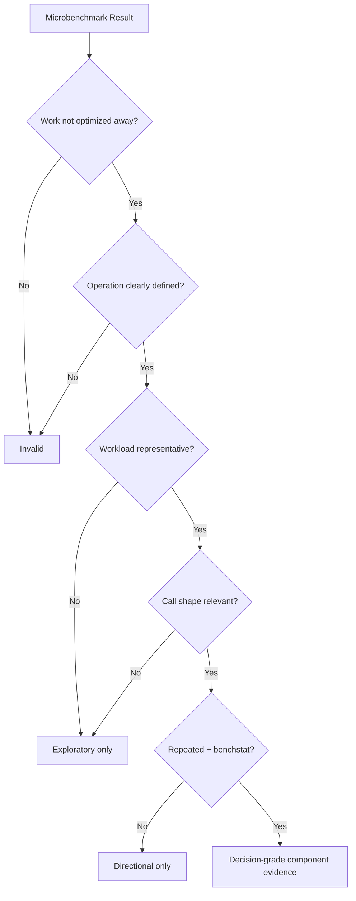
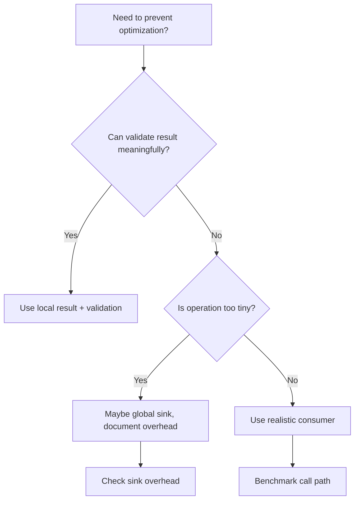
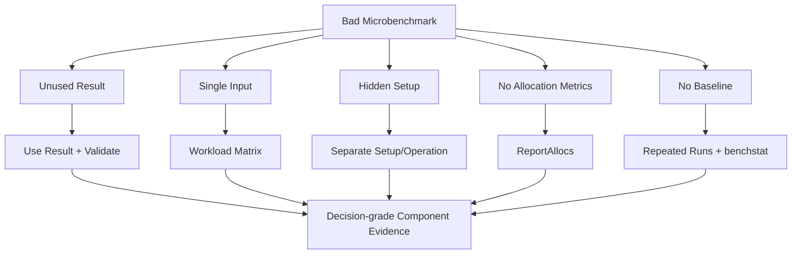

# learn-go-testing-benchmarking-performance-engineering-part-025.md

# Part 025 — Microbenchmark Anti-Patterns & Compiler Trap Avoidance

> Seri: **Go Testing, Benchmarking, Performance Engineering**  
> Target pembaca: **Java Software Engineer → Go Performance-Capable Engineer**  
> Target Go: **Go 1.26.x**  
> Status seri: **Part 025 dari 034**  
> Prasyarat: Part 020–024, Go memory system, Go compiler/escape analysis basics.

---

## 0. Tujuan Part Ini

Part ini membahas salah satu area paling berbahaya dalam performance engineering:

> Microbenchmark yang terlihat ilmiah, tetapi sebenarnya mengukur hal yang salah.

Microbenchmark adalah benchmark kecil yang mengukur operation sempit seperti:

- parsing string,
- map lookup,
- slice append,
- JSON encode kecil,
- lock/atomic operation,
- hashing,
- normalization,
- validation,
- allocation pattern,
- small data structure operation.

Microbenchmark sangat berguna karena:

- cepat,
- repeatable,
- mudah dibandingkan,
- bagus untuk hot primitive,
- cocok untuk regression detection,
- membantu memahami compiler/runtime behavior.

Tetapi microbenchmark juga mudah menipu karena:

- compiler menghapus work,
- constant folding,
- result tidak digunakan,
- input terlalu unrealistic,
- branch predictor terlalu ideal,
- cache terlalu hangat,
- benchmark call path berbeda dari production,
- escape behavior berubah,
- setup masuk/keluar timer secara salah,
- operation terlalu kecil sehingga noise mendominasi,
- engineer overfit ke benchmark.

Part ini memberi mental model dan checklist agar microbenchmark tidak menjadi “angka palsu dengan formatting resmi”.

---

## 1. Satu Kalimat Inti

> Microbenchmark hanya valid jika operation yang diukur tetap meaningful setelah optimasi compiler, workload merepresentasikan pertanyaan nyata, dan call shape benchmark cukup dekat dengan call shape production atau setidaknya batasnya dijelaskan.

Dengan kata lain:

```text
Fast benchmark != fast production
Low ns/op != valid measurement
Zero allocation != no memory concern
Compiler-friendly benchmark != production-friendly code
```

---

## 2. Microbenchmark Itu Pisau Tajam

Microbenchmark bagus untuk:

| Use Case | Contoh |
|---|---|
| Hot primitive | `ParseCaseID`, `NormalizePostalCode` |
| Implementation comparison | regexp vs manual parser |
| Allocation regression | `0 allocs/op` contract |
| Data structure operation | map vs sharded map |
| Encoding helper | append-based builder vs `fmt.Sprintf` |
| Lock strategy | mutex vs atomic vs shard |
| API shape exploration | return slice vs append-to-buffer |
| Compiler/runtime investigation | interface vs generic call |

Microbenchmark buruk untuk:

| Bad Use | Kenapa |
|---|---|
| Membuktikan endpoint latency | tidak ada network/DB/queueing |
| Membuktikan system capacity | tidak ada full workload |
| Mengukur p99 | tidak ada latency distribution |
| Mengambil keputusan arsitektur besar sendirian | scope terlalu kecil |
| Membenarkan unsafe/complexity tanpa hotness | local win bisa global loss |
| Menggantikan profiling | tidak tahu hotspot production |
| Menggantikan load test | tidak ada saturation behavior |

---

## 3. Diagram: Validity Funnel Microbenchmark



---

## 4. Trap 1: Dead-Code Elimination

Dead-code elimination terjadi ketika compiler menyadari hasil computation tidak dipakai dan menghapus work.

Bad:

```go
func BenchmarkNormalize(b *testing.B) {
	for b.Loop() {
		NormalizePostalCode(" 123456 ")
	}
}
```

Jika return value tidak dipakai dan function pure/inlinable, compiler mungkin menghapus sebagian atau seluruh work.

Better:

```go
func BenchmarkNormalize(b *testing.B) {
	var got string

	for b.Loop() {
		got = NormalizePostalCode(" 123456 ")
	}

	if got != "123456" {
		b.Fatalf("got %q", got)
	}
}
```

Atau:

```go
func BenchmarkNormalize(b *testing.B) {
	input := " 123456 "
	want := "123456"

	got := NormalizePostalCode(input)
	if got != want {
		b.Fatalf("got %q, want %q", got, want)
	}

	for b.Loop() {
		got = NormalizePostalCode(input)
	}

	if got != want {
		b.Fatalf("got %q, want %q", got, want)
	}
}
```

---

## 5. Trap 2: Constant Folding

Compiler bisa menghitung constant expression saat compile time.

Bad:

```go
func BenchmarkAdd(b *testing.B) {
	for b.Loop() {
		_ = 1 + 2
	}
}
```

Bad:

```go
func BenchmarkParseConst(b *testing.B) {
	for b.Loop() {
		_, _ = strconv.Atoi("123456")
	}
}
```

`strconv.Atoi("123456")` tidak selalu constant-folded seperti arithmetic literal, tetapi input constant dan result unused membuat benchmark sangat compiler-friendly dan potentially misleading.

Better:

```go
func BenchmarkParseCorpus(b *testing.B) {
	inputs := []string{"123456", "000001", "987654", "42"}
	var got int
	var err error

	i := 0
	for b.Loop() {
		got, err = strconv.Atoi(inputs[i%len(inputs)])
		i++
	}

	if err != nil {
		b.Fatal(err)
	}
	if got < 0 {
		b.Fatal(got)
	}
}
```

Even better if production has realistic input distribution.

---

## 6. Trap 3: Result Used in Unrealistic Way

Using result incorrectly can distort benchmark.

Example with global sink:

```go
var sink string

func BenchmarkNormalize(b *testing.B) {
	for b.Loop() {
		sink = NormalizePostalCode("123456")
	}
}
```

This prevents elimination, but now benchmark includes global write.

If operation is very small, global write can dominate.

Alternative:

```go
func BenchmarkNormalize(b *testing.B) {
	var got string

	for b.Loop() {
		got = NormalizePostalCode("123456")
	}

	if got != "123456" {
		b.Fatal(got)
	}
}
```

But local variable may still allow compiler optimization depending context. `B.Loop` helps reduce some optimization issues, but not all.

Rule:

> Use meaningful result validation first. Use global sink only when necessary and document why.

---

## 7. Global Sink Decision Tree



---

## 8. Trap 4: Benchmark Measures the Sink

Bad for tiny operations:

```go
var sinkInt int

func BenchmarkTiny(b *testing.B) {
	for b.Loop() {
		sinkInt = 1
	}
}
```

This measures global assignment more than operation.

If comparing two tiny functions, sink overhead may hide difference.

Better:

- increase operation batch size,
- benchmark higher-level operation,
- use realistic consumer,
- interpret tiny deltas skeptically.

Example batched operation:

```go
func BenchmarkTinyBatch(b *testing.B) {
	inputs := []int{1, 2, 3, 4, 5, 6, 7, 8}
	var sum int

	for b.Loop() {
		local := 0
		for _, x := range inputs {
			local += TinyTransform(x)
		}
		sum = local
	}

	if sum == 0 {
		b.Fatal(sum)
	}
}
```

Operation is now one batch. Name accordingly.

---

## 9. Trap 5: Unrealistic Single Input

Bad:

```go
func BenchmarkAuthorizeAllowed(b *testing.B) {
	req := allowedRequest()

	for b.Loop() {
		_ = Authorize(req)
	}
}
```

This only measures one branch.

Production may have:

- allowed,
- denied,
- missing role,
- expired delegation,
- cross-agency case,
- closed case,
- invalid state,
- feature flag disabled,
- large permission set.

Better:

```go
func BenchmarkAuthorize(b *testing.B) {
	workloads := []struct {
		name string
		req  Request
	}{
		{"AllowedSimple", allowedSimpleRequest()},
		{"DeniedNoRole", deniedNoRoleRequest()},
		{"DeniedClosedCase", deniedClosedCaseRequest()},
		{"AllowedDelegated", allowedDelegatedRequest()},
		{"LargePermissionSet", largePermissionSetRequest()},
	}

	for _, wl := range workloads {
		b.Run(wl.name, func(b *testing.B) {
			for b.Loop() {
				_ = Authorize(wl.req)
			}
		})
	}
}
```

---

## 10. Trap 6: Branch Predictor Artifact

CPU branch predictor learns repeated branches.

Benchmark:

```go
func BenchmarkValidateAlwaysValid(b *testing.B) {
	req := validRequest()

	for b.Loop() {
		_ = Validate(req)
	}
}
```

If validation has many branches, always-valid path becomes extremely predictable.

Production mixed valid/invalid workload may behave differently.

Better:

```go
func BenchmarkValidateMixed(b *testing.B) {
	reqs := []Request{
		validRequest(),
		validRequest(),
		validRequest(),
		invalidMissingApplicant(),
		invalidBadState(),
	}

	i := 0
	for b.Loop() {
		_ = Validate(reqs[i%len(reqs)])
		i++
	}
}
```

Also keep separated benchmarks:

```text
BenchmarkValidate/Valid
BenchmarkValidate/InvalidMissingApplicant
BenchmarkValidate/InvalidBadState
BenchmarkValidate/Mixed
```

---

## 11. Trap 7: Cache Warmth Artifact

Microbenchmarks often repeatedly access the same data.

Bad:

```go
func BenchmarkMapLookup(b *testing.B) {
	m := buildMap(1_000_000)

	for b.Loop() {
		_ = m["case-1"]
	}
}
```

This measures hot key, hot cache, predictable hash path.

Better:

```go
func BenchmarkMapLookupUniformKeys(b *testing.B) {
	m := buildMap(1_000_000)
	keys := buildExistingKeys(10_000)

	i := 0
	for b.Loop() {
		_ = m[keys[i%len(keys)]]
		i++
	}
}
```

Add:

```text
SameHotKey
Uniform10k
Misses10k
Mixed90Hit10Miss
```

---

## 12. Trap 8: Benchmark Dataset Too Small

Bad:

```go
func BenchmarkDedup(b *testing.B) {
	input := []string{"a", "b", "a"}

	for b.Loop() {
		_ = Dedup(input)
	}
}
```

This says nothing about 10k items.

Better:

```go
func BenchmarkDedup(b *testing.B) {
	for _, n := range []int{3, 10, 100, 1000, 10000} {
		b.Run(fmt.Sprintf("n=%d", n), func(b *testing.B) {
			input := buildDedupInput(n, 0.1)

			for b.Loop() {
				_ = Dedup(input)
			}
		})
	}
}
```

Scale matters.

---

## 13. Trap 9: Benchmark Dataset Too Clean

Production data is messy.

Bad:

```go
BenchmarkParse/ValidOnly
```

Better include:

- valid common,
- valid with whitespace,
- invalid length,
- invalid character,
- invalid unicode,
- empty,
- very long,
- mixed.

Especially for external input, invalid path can be security-relevant.

---

## 14. Trap 10: Setup Accidentally Measured

Bad:

```go
func BenchmarkEvaluatePolicy(b *testing.B) {
	for b.Loop() {
		policy := mustLoadPolicy("testdata/policy.json")
		engine := NewEngine(policy)
		_, _ = engine.Evaluate(req)
	}
}
```

This measures file read + parse + construct + evaluate.

Better:

```go
func BenchmarkEvaluatePolicy(b *testing.B) {
	policy := mustLoadPolicy("testdata/policy.json")
	engine := NewEngine(policy)

	for b.Loop() {
		_, _ = engine.Evaluate(req)
	}
}
```

If construction matters:

```go
BenchmarkLoadPolicy
BenchmarkNewEngine
BenchmarkEvaluatePolicy
```

Separate operation boundaries.

---

## 15. Trap 11: Setup Accidentally Excluded

Sometimes setup is production cost.

Bad if production builds request per operation:

```go
func BenchmarkAuthorize(b *testing.B) {
	req := prebuiltRequest()

	for b.Loop() {
		_ = Authorize(req)
	}
}
```

If production path includes request attribute extraction:

```go
func BenchmarkAuthorizeWithRequestBuild(b *testing.B) {
	raw := benchmarkHTTPRequest()

	for b.Loop() {
		req := BuildAuthzRequest(raw)
		_ = Authorize(req)
	}
}
```

Both are useful but answer different questions:

```text
BenchmarkAuthorizePrebuiltRequest
BenchmarkAuthorizeWithRequestBuild
```

---

## 16. Trap 12: Mutable State Changes Over Time

Bad:

```go
func BenchmarkQueuePop(b *testing.B) {
	q := NewQueue()
	for i := 0; i < 1000; i++ {
		q.Push(i)
	}

	for b.Loop() {
		_, _ = q.Pop()
	}
}
```

After 1000 pops, behavior changes.

Fix options:

- benchmark push+pop,
- benchmark cyclic queue,
- benchmark batch lifecycle,
- benchmark empty pop explicitly.

Example:

```go
func BenchmarkQueuePushPop(b *testing.B) {
	q := NewQueue()

	for b.Loop() {
		q.Push(1)
		_, _ = q.Pop()
	}
}
```

Operation = push+pop.

---

## 17. Trap 13: Growing State During Benchmark

Bad:

```go
func BenchmarkCacheSet(b *testing.B) {
	cache := NewCache()
	i := 0

	for b.Loop() {
		cache.Set(fmt.Sprintf("key-%d", i), Value{})
		i++
	}
}
```

This measures:

- key formatting,
- cache insertion,
- map growth,
- memory growth,
- possibly eviction,
- different state over time.

Maybe intended, but name should say:

```text
BenchmarkCacheSetGrowing
```

If measuring steady-state update:

```go
func BenchmarkCacheSetExistingKeys(b *testing.B) {
	cache := NewCache()
	keys := preloadedKeys(10_000)
	preload(cache, keys)

	i := 0
	for b.Loop() {
		cache.Set(keys[i%len(keys)], Value{})
		i++
	}
}
```

---

## 18. Trap 14: Hidden Allocation in Benchmark Harness

Bad:

```go
func BenchmarkAuthorize(b *testing.B) {
	engine := newEngine()

	for b.Loop() {
		req := Request{
			Attributes: map[string]string{
				"state": "OPEN",
				"agency": "CEA",
			},
		}
		_ = engine.Authorize(req)
	}
}
```

Maybe you wanted to measure `Authorize`, but map allocation is included.

If production has prebuilt map, move setup out.

If production builds map per request, benchmark name should include request construction.

---

## 19. Trap 15: Hidden Formatting Cost

Bad:

```go
func BenchmarkStoreGet(b *testing.B) {
	store := newStore()

	for b.Loop() {
		key := fmt.Sprintf("case:%d", 123)
		_, _ = store.Get(key)
	}
}
```

This measures `fmt.Sprintf`.

Better:

```go
func BenchmarkStoreGet(b *testing.B) {
	store := newStore()
	key := "case:123"

	for b.Loop() {
		_, _ = store.Get(key)
	}
}
```

If key construction matters:

```go
BenchmarkBuildKey
BenchmarkStoreGetPrebuiltKey
BenchmarkStoreGetWithKeyBuild
```

---

## 20. Trap 16: Measuring Logging Instead of Logic

Bad:

```go
func BenchmarkProcess(b *testing.B) {
	for b.Loop() {
		log.Printf("processing")
		_ = Process()
	}
}
```

This is mostly logging.

If production logging matters, use explicit scenario benchmark:

```go
func BenchmarkProcessWithDiscardLogger(b *testing.B) {
	svc := NewService(discardLogger())

	for b.Loop() {
		_ = svc.Process(req)
	}
}
```

Or isolate:

```go
BenchmarkProcessNoLogger
BenchmarkProcessWithStructuredLoggerDiscard
```

---

## 21. Trap 17: Real IO in Microbenchmark

Bad:

```go
func BenchmarkFetchConfig(b *testing.B) {
	for b.Loop() {
		resp, _ := http.Get("https://config-service")
		_ = resp.Body.Close()
	}
}
```

This is not a microbenchmark.

Use fake transport:

```go
func BenchmarkFetchConfigClientLogic(b *testing.B) {
	client := &http.Client{
		Transport: roundTripFunc(func(req *http.Request) (*http.Response, error) {
			return &http.Response{
				StatusCode: http.StatusOK,
				Body: io.NopCloser(strings.NewReader(`{"enabled":true}`)),
				Header: make(http.Header),
			}, nil
		}),
	}

	svc := NewConfigClient(client)

	for b.Loop() {
		_, _ = svc.Fetch(context.Background())
	}
}
```

For real network, use integration/scenario/load test.

---

## 22. Trap 18: Randomness in Hot Loop

Bad:

```go
func BenchmarkValidateRandom(b *testing.B) {
	for b.Loop() {
		req := randomRequest()
		_ = Validate(req)
	}
}
```

This measures random generation and makes result variable.

Better:

```go
func BenchmarkValidateCorpus(b *testing.B) {
	corpus := deterministicCorpus()

	i := 0
	for b.Loop() {
		_ = Validate(corpus[i%len(corpus)])
		i++
	}
}
```

If random generation is part of production, benchmark separately.

---

## 23. Trap 19: Time Dependency

Bad:

```go
func BenchmarkExpire(b *testing.B) {
	for b.Loop() {
		_ = IsExpired(time.Now(), deadline)
	}
}
```

This measures `time.Now`.

If production calls `time.Now`, maybe acceptable. But name should say so or isolate:

```go
func BenchmarkIsExpiredPrecomputedNow(b *testing.B) {
	now := time.Unix(1_700_000_000, 0)
	deadline := now.Add(-time.Hour)

	for b.Loop() {
		_ = IsExpired(now, deadline)
	}
}
```

And:

```go
func BenchmarkIsExpiredWithTimeNow(b *testing.B) {
	deadline := time.Now().Add(-time.Hour)

	for b.Loop() {
		_ = IsExpired(time.Now(), deadline)
	}
}
```

---

## 24. Trap 20: Interface vs Concrete Call Mismatch

Benchmark:

```go
func BenchmarkEvaluateConcrete(b *testing.B) {
	engine := NewEngine(policy)

	for b.Loop() {
		_, _ = engine.Evaluate(ctx, req)
	}
}
```

Production:

```go
var evaluator Evaluator = engine
evaluator.Evaluate(ctx, req)
```

Interface dispatch can affect inlining/escape.

Benchmark both if relevant:

```go
func BenchmarkEvaluateViaInterface(b *testing.B) {
	var evaluator Evaluator = NewEngine(policy)

	for b.Loop() {
		_, _ = evaluator.Evaluate(ctx, req)
	}
}
```

---

## 25. Trap 21: Generic vs Interface Benchmark Mismatch

Generic benchmark:

```go
func BenchmarkContainsGeneric(b *testing.B) {
	xs := []string{"a", "b", "c"}

	for b.Loop() {
		_ = Contains(xs, "b")
	}
}
```

Production may convert to `[]any` or use interface-based API.

Benchmark production call shape too.

```go
func BenchmarkContainsAnyProductionShape(b *testing.B) {
	xs := []any{"a", "b", "c"}

	for b.Loop() {
		_ = ContainsAny(xs, "b")
	}
}
```

---

## 26. Trap 22: Escape Behavior Mismatch

Benchmark:

```go
func BenchmarkBuildDecision(b *testing.B) {
	for b.Loop() {
		_ = BuildDecision()
	}
}
```

Production:

```go
decisions = append(decisions, BuildDecision())
```

or:

```go
var v any = BuildDecision()
```

Benchmark may show zero allocation, production may allocate due to storage/interface.

Better:

```go
func BenchmarkBuildDecisionAppend(b *testing.B) {
	buf := make([]Decision, 0, 1024)

	for b.Loop() {
		buf = append(buf[:0], BuildDecision())
	}

	if len(buf) == 0 {
		b.Fatal("empty")
	}
}
```

Or:

```go
func BenchmarkBuildDecisionAsAny(b *testing.B) {
	var v any

	for b.Loop() {
		v = BuildDecision()
	}

	if v == nil {
		b.Fatal("nil")
	}
}
```

---

## 27. Trap 23: Benchmarking a Function, Not the Contract

Function-level benchmark may miss contract cost.

Example:

```go
func Normalize(s string) string
```

Production contract:

- validate,
- normalize,
- return typed error,
- log invalid attempt,
- map error to API response.

Microbenchmark only measures normalize.

Need layered benchmarks:

```text
BenchmarkNormalizeOnly
BenchmarkValidateAndNormalize
BenchmarkParseRequestField
BenchmarkSubmitCaseScenario
```

Each answers different question.

---

## 28. Trap 24: Tiny Operation Below Measurement Resolution

If benchmark result is extremely tiny:

```text
0.3 ns/op
```

Be suspicious.

Potential issues:

- work optimized away,
- operation too small,
- timer overhead dominates,
- CPU pipeline artifact,
- benchmark not meaningful.

Solution:

- batch operations,
- benchmark higher-level operation,
- use result aggregation,
- interpret carefully.

Example:

```go
func BenchmarkTinyTransformBatch(b *testing.B) {
	inputs := [16]int{1, 2, 3, 4, 5, 6, 7, 8, 9, 10, 11, 12, 13, 14, 15, 16}
	var sum int

	for b.Loop() {
		local := 0
		for _, x := range inputs {
			local += TinyTransform(x)
		}
		sum = local
	}

	if sum == 0 {
		b.Fatal(sum)
	}
}
```

Operation = batch of 16 transforms. Report per item manually if needed.

---

## 29. Trap 25: Over-Batching Hides Cost

Batching can reduce measurement noise but may hide per-call overhead.

Example:

```go
for b.Loop() {
	for i := 0; i < 1000; i++ {
		X()
	}
}
```

`ns/op` now means 1000 calls, not one call.

Use `b.ReportMetric`:

```go
const batch = 1000

for b.Loop() {
	for i := 0; i < batch; i++ {
		X()
	}
}

b.ReportMetric(float64(batch), "calls/op")
```

Or name:

```text
BenchmarkXBatch1000
```

Be explicit.

---

## 30. Trap 26: Comparing Unfair Implementations

Bad:

```go
BenchmarkRegexpCompileAndMatch
BenchmarkManualMatchOnly
```

This makes manual look better.

Fair comparison:

```go
BenchmarkRegexpPrecompiledMatch
BenchmarkManualMatch
BenchmarkRegexpCompileAndMatch // separate if compile cost matters
```

For regexp:

```go
var postalRe = regexp.MustCompile(`^\d{6}$`)

func BenchmarkRegexpPrecompiled(b *testing.B) {
	for b.Loop() {
		_ = postalRe.MatchString("123456")
	}
}
```

Compile cost:

```go
func BenchmarkRegexpCompile(b *testing.B) {
	for b.Loop() {
		_ = regexp.MustCompile(`^\d{6}$`)
	}
}
```

Different operations.

---

## 31. Trap 27: Ignoring Error Path

Optimizing valid path but making invalid path expensive can be dangerous.

Example:

```text
Valid: -30%
Invalid: +500%
```

If invalid inputs are attacker-controlled, this may be a security/performance regression.

Benchmark invalid cases:

```text
InvalidShort
InvalidLong
InvalidUnicode
InvalidBadDigit
InvalidWrongPrefix
```

---

## 32. Trap 28: Panic Path in Benchmark

Benchmark should not panic unless measuring panic/recover cost.

Bad:

```go
func BenchmarkMustParse(b *testing.B) {
	for b.Loop() {
		_ = MustParse(input)
	}
}
```

If input accidentally invalid, benchmark panics and fails.

If measuring panic cost:

```go
func BenchmarkPanicRecover(b *testing.B) {
	for b.Loop() {
		func() {
			defer func() { _ = recover() }()
			panic("x")
		}()
	}
}
```

But such benchmark is rare and should be explicitly named.

---

## 33. Trap 29: `defer` in Hot Loop

Example:

```go
func BenchmarkWithDefer(b *testing.B) {
	for b.Loop() {
		func() {
			mu.Lock()
			defer mu.Unlock()
			work()
		}()
	}
}
```

This measures defer overhead as part of operation.

Maybe production uses defer; then valid.

But if comparing lock strategies:

```go
func BenchmarkMutexManualUnlock(b *testing.B) { ... }
func BenchmarkMutexDeferUnlock(b *testing.B) { ... }
```

Name and intent matter.

---

## 34. Trap 30: Cleanup Hidden in `defer` Outside Loop

Bad for resource benchmark:

```go
func BenchmarkOpenFile(b *testing.B) {
	for b.Loop() {
		f, _ := os.Open("file")
		defer f.Close()
	}
}
```

Defers pile up until benchmark ends.

Correct:

```go
func BenchmarkOpenFile(b *testing.B) {
	for b.Loop() {
		f, err := os.Open("file")
		if err != nil {
			b.Fatal(err)
		}
		_ = f.Close()
	}
}
```

Or if measuring defer cost, say so.

---

## 35. Trap 31: Benchmarking With `fmt.Println`

Never print inside hot benchmark unless measuring printing.

Bad:

```go
for b.Loop() {
	fmt.Println(X())
}
```

This measures IO and destroys benchmark.

---

## 36. Trap 32: `b.Fatal` Heavy Check Inside Loop

Bad:

```go
for b.Loop() {
	got := X()
	if diff := cmp.Diff(want, got); diff != "" {
		b.Fatal(diff)
	}
}
```

This measures `cmp.Diff`.

Better:

```go
var got T
for b.Loop() {
	got = X()
}
if diff := cmp.Diff(want, got); diff != "" {
	b.Fatal(diff)
}
```

For stateful operations, maybe lightweight check inside loop and full check outside.

---

## 37. Trap 33: Benchmark Uses Production Secrets/Data

Do not use production PII/secrets as benchmark fixture.

Bad:

```text
testdata/prod_case_dump.json
```

Use:

- synthetic data,
- sanitized data,
- generated fixtures,
- documented distribution.

Performance data can still leak business-sensitive structure. Be careful.

---

## 38. Trap 34: Overfitting to Benchmark

A developer may optimize for benchmark fixture:

- special-case common string,
- precompute benchmark input,
- change branch order for benchmark distribution,
- use unsafe for narrow case,
- ignore production edge cases.

Prevent with:

- multiple workloads,
- fuzz/property tests,
- scenario benchmark,
- code review,
- production profile validation.

---

## 39. Trap 35: Ignoring Readability and Risk

Microbenchmark win:

```text
-3% ns/op
0 allocs unchanged
```

Candidate code:

- unsafe,
- complex,
- hard to audit,
- subtle lifetime dependency,
- poor error messages.

Decision: likely reject.

Performance engineering is not “make number smaller”. It is optimizing system under constraints.

---

## 40. Trap 36: Misusing `unsafe`

Unsafe optimizations can reduce allocation but introduce severe risks.

Example:

```go
func bytesToStringNoCopy(b []byte) string {
	return unsafe.String(unsafe.SliceData(b), len(b))
}
```

Potential risks:

- string observes mutable bytes,
- buffer reused/pool corruption,
- data leak,
- lifetime bugs,
- future maintenance hazards.

Only consider unsafe when:

- path is proven hot,
- benchmark win is meaningful,
- safe alternative insufficient,
- invariants documented,
- tests/fuzzing cover behavior,
- ownership/lifetime airtight,
- security review acceptable.

---

## 41. Trap 37: Ignoring Compiler Version

A microbenchmark optimization may be useful in Go 1.22, irrelevant in Go 1.26, harmful in Go 1.27.

Go compiler improves.

Rules:

- benchmark on target Go version,
- rerun after Go upgrade,
- avoid clever code that fights compiler unless needed,
- prefer idiomatic code when performance equal.

---

## 42. Trap 38: Benchmarking With Race/Coverage

Do not use:

```bash
go test -race -bench=.
go test -cover -bench=.
```

for performance baseline.

These are correctness/coverage modes with instrumentation overhead.

Use them for separate signals.

---

## 43. Trap 39: Comparing Different Build Tags

Bad:

```bash
old: go test -bench=. ./...
new: go test -tags=fast -bench=. ./...
```

Unless build tag is part of experiment, invalid comparison.

---

## 44. Trap 40: Using External Libraries Differently

Comparing:

```text
json.Marshal with validation
third-party encoder without validation
```

is unfair.

Ensure same semantics:

- escaping,
- field tags,
- zero values,
- unknown fields,
- error behavior,
- ordering if relevant,
- security properties.

---

## 45. Trap 41: Ignoring Allocation Lifetime

Benchmark:

```text
0 allocs/op with pool
```

Production:

- pool retains huge buffers,
- memory footprint grows,
- p99 worsens due to GC/live heap,
- PII retained longer.

Allocation count is not enough. Consider retention and lifetime.

---

## 46. Trap 42: Parallel Microbenchmark Hides Per-Request Latency

Parallel benchmark:

```text
BenchmarkCacheParallel-8    5 ns/op
```

Looks excellent. But maybe one goroutine starves while others dominate throughput.

Parallel benchmark gives throughput signal, not latency distribution.

For fairness/tail, use scenario/load tests or custom latency measurement with care.

---

## 47. Trap 43: Microbenchmark Without Profile Context

Optimizing function that is not hot:

```text
Function improved 50%, but function is 0.1% of CPU.
```

Overall win negligible.

Use microbenchmark when:

- profiling shows hotspot,
- code is library primitive,
- function is obviously high-frequency,
- allocation contract matters,
- algorithmic comparison needed.

---

## 48. Trap 44: Benchmarking Cold Start as Steady State

Bad:

```go
func BenchmarkRegexMatch(b *testing.B) {
	for b.Loop() {
		re := regexp.MustCompile(pattern)
		_ = re.MatchString(input)
	}
}
```

This is compile+match, not match steady-state.

If production compiles once:

```go
func BenchmarkRegexMatchPrecompiled(b *testing.B) {
	re := regexp.MustCompile(pattern)

	for b.Loop() {
		_ = re.MatchString(input)
	}
}
```

If production compiles per request, fix production first or benchmark that explicitly.

---

## 49. Trap 45: Ignoring Initialization/Warmup Cost

Opposite problem: excluding initialization that matters for startup/serverless/CLI.

Need both:

```text
BenchmarkPolicyLoadCold
BenchmarkPolicyEvaluateHot
BenchmarkServiceStartup
```

Cold-start matters for:

- CLI tools,
- serverless,
- short-lived jobs,
- auto-scaling startup,
- test tools,
- migration scripts.

---

## 50. Trap 46: Hidden Contention in Benchmark Harness

Bad:

```go
var idx atomic.Int64

b.RunParallel(func(pb *testing.PB) {
	for pb.Next() {
		i := idx.Add(1)
		_ = Process(inputs[i%len(inputs)])
	}
})
```

You measure `idx` contention too.

Use per-goroutine counter or one-time offset.

---

## 51. Trap 47: Synthetic Concurrency

Parallel benchmark with:

```go
b.SetParallelism(10000)
```

may measure scheduler overhead unrelated to production.

Use production-like concurrency model:

- goroutines per request?
- workers per pod?
- CPU limit?
- queue depth?
- expected concurrency?

---

## 52. Trap 48: Misleading `SetBytes`

Bad:

```go
b.SetBytes(1024)
```

without relation to actual input/output.

Use `SetBytes` only when byte count means something:

- input bytes processed,
- output bytes generated,
- compressed bytes input,
- decompressed bytes output.

Document if ambiguous.

---

## 53. Trap 49: Custom Metrics Without Meaning

Bad:

```go
b.ReportMetric(100, "quality/op")
```

Custom metric must be measurable and useful.

Good:

```go
b.ReportMetric(float64(len(items)), "items/op")
```

For batch benchmark.

---

## 54. Trap 50: Benchmarking Under Different Semantic Guarantees

Example:

- version A validates UTF-8,
- version B assumes ASCII,
- A returns typed error,
- B returns bool,
- A is concurrency-safe,
- B is not.

Performance comparison invalid unless semantics are intentionally changed and documented.

---

## 55. Microbenchmark Validity Checklist

### 55.1 Operation

- [ ] One operation is clearly defined.
- [ ] Benchmark name matches operation.
- [ ] Setup is intentionally included/excluded.
- [ ] State does not mutate into different behavior unintentionally.

### 55.2 Compiler

- [ ] Result is used or validated.
- [ ] Work is not trivially constant-folded.
- [ ] Dead-code elimination risk considered.
- [ ] Interface/concrete/generic call shape considered.
- [ ] Escape behavior relevant to production.

### 55.3 Workload

- [ ] Input is representative.
- [ ] Input size matrix included if scaling matters.
- [ ] Branch distribution considered.
- [ ] Cache/hot-key behavior considered.
- [ ] Error path included where relevant.
- [ ] Randomness controlled.

### 55.4 Measurement

- [ ] Uses `B.Loop` for serial benchmark.
- [ ] Uses `RunParallel`/`PB.Next` for parallel benchmark.
- [ ] Uses `ReportAllocs` or `-benchmem`.
- [ ] Repeated runs used for decision.
- [ ] `benchstat` used for A/B.

### 55.5 Interpretation

- [ ] Result tied to call frequency.
- [ ] Result tied to budget.
- [ ] Trade-off reviewed.
- [ ] Not overstated as production latency.
- [ ] Follow-up profile/scenario/load test identified if needed.

---

## 56. Microbenchmark Design Pattern

Use this pattern:

```go
func BenchmarkOperation(b *testing.B) {
	workloads := []struct {
		name string
		in   Input
		want Want
	}{
		{"Common", commonInput()},
		{"Worst", worstInput()},
		{"Invalid", invalidInput()},
	}

	for _, wl := range workloads {
		b.Run(wl.name, func(b *testing.B) {
			got, err := Operation(wl.in)
			if err != nil && wl.want.Valid {
				b.Fatal(err)
			}
			if !validResult(got, wl.want) {
				b.Fatalf("invalid result")
			}

			b.ReportAllocs()
			for b.Loop() {
				got, _ = Operation(wl.in)
			}

			if !validResult(got, wl.want) {
				b.Fatalf("invalid result")
			}
		})
	}
}
```

For pure function, last-result validation often enough.

For stateful function, validate more carefully.

---

## 57. Case Study: Postal Code Normalizer

### 57.1 Bad Benchmark

```go
func BenchmarkPostal(b *testing.B) {
	for b.Loop() {
		NormalizePostalCode("123456")
	}
}
```

Problems:

- result unused,
- only valid path,
- constant input,
- no allocation report,
- name vague,
- no invalid/whitespace path.

### 57.2 Better Benchmark

```go
func BenchmarkNormalizePostalCode(b *testing.B) {
	cases := []struct {
		name string
		in   string
		want string
		ok   bool
	}{
		{"Valid", "123456", "123456", true},
		{"Whitespace", " 123456\n", "123456", true},
		{"InvalidLetter", "12A456", "", false},
		{"Short", "12345", "", false},
		{"Long", "1234567", "", false},
	}

	for _, tc := range cases {
		b.Run(tc.name, func(b *testing.B) {
			got, ok := NormalizePostalCode(tc.in)
			if got != tc.want || ok != tc.ok {
				b.Fatalf("got (%q,%v), want (%q,%v)", got, ok, tc.want, tc.ok)
			}

			b.ReportAllocs()
			for b.Loop() {
				got, ok = NormalizePostalCode(tc.in)
			}

			if got != tc.want || ok != tc.ok {
				b.Fatalf("got (%q,%v), want (%q,%v)", got, ok, tc.want, tc.ok)
			}
		})
	}
}
```

---

## 58. Case Study: Authorization Check

### 58.1 Bad Benchmark

```go
func BenchmarkAuthorize(b *testing.B) {
	engine := NewEngine(loadPolicy())

	for b.Loop() {
		req := randomRequest()
		_ = engine.Authorize(context.Background(), req)
	}
}
```

Problems:

- random request measured,
- nondeterministic,
- no workload names,
- no correctness,
- no allocation,
- no allowed/denied split.

### 58.2 Better Benchmark

```go
func BenchmarkAuthorize(b *testing.B) {
	engine := NewEngine(mustLoadPolicy("testdata/policy_large.json"))

	workloads := []struct {
		name string
		req  Request
		want Decision
	}{
		{"AllowedAssignedOfficer", assignedOfficerOpenCase()},
		{"DeniedClosedCase", deniedClosedCase()},
		{"AllowedSupervisorEscalated", supervisorEscalatedCase()},
		{"DeniedCrossAgency", deniedCrossAgencyCase()},
	}

	for _, wl := range workloads {
		b.Run(wl.name, func(b *testing.B) {
			got, err := engine.Authorize(context.Background(), wl.req)
			if err != nil {
				b.Fatal(err)
			}
			if got.Allowed != wl.want.Allowed {
				b.Fatalf("got %#v, want %#v", got, wl.want)
			}

			b.ReportAllocs()
			for b.Loop() {
				got, _ = engine.Authorize(context.Background(), wl.req)
			}

			if got.Allowed != wl.want.Allowed {
				b.Fatalf("got %#v, want %#v", got, wl.want)
			}
		})
	}
}
```

---

## 59. Case Study: Key Builder

### 59.1 Bad Comparison

```go
func BenchmarkFmt(b *testing.B) {
	for b.Loop() {
		_ = fmt.Sprintf("case:%d", 123)
	}
}

func BenchmarkAppend(b *testing.B) {
	buf := make([]byte, 0, 32)
	for b.Loop() {
		buf = strconv.AppendInt(buf[:0], 123, 10)
	}
}
```

Unfair:

- `fmt` builds full key,
- append only appends int,
- one returns string, one returns bytes,
- semantics differ.

### 59.2 Fairer Comparison

```go
func BuildKeyFmt(id int64) string {
	return fmt.Sprintf("case:%d", id)
}

func BuildKeyAppend(id int64) string {
	buf := make([]byte, 0, len("case:")+20)
	buf = append(buf, "case:"...)
	buf = strconv.AppendInt(buf, id, 10)
	return string(buf)
}

func BenchmarkBuildKey(b *testing.B) {
	variants := []struct {
		name string
		fn   func(int64) string
	}{
		{"Fmt", BuildKeyFmt},
		{"Append", BuildKeyAppend},
	}

	for _, variant := range variants {
		b.Run(variant.name, func(b *testing.B) {
			var got string
			b.ReportAllocs()

			for b.Loop() {
				got = variant.fn(123)
			}

			if got != "case:123" {
				b.Fatal(got)
			}
		})
	}
}
```

Even then, ask whether key building is hot.

---

## 60. Case Study Diagram: Fixing Misleading Microbenchmark



---

## 61. Practical Command Pattern

Quick:

```bash
go test -run='^$' -bench=BenchmarkNormalizePostalCode -benchmem ./internal/postal
```

Decision-grade:

```bash
go test -run='^$' -bench=BenchmarkNormalizePostalCode -benchmem -count=10 ./internal/postal > old.txt
go test -run='^$' -bench=BenchmarkNormalizePostalCode -benchmem -count=10 ./internal/postal > new.txt
benchstat old.txt new.txt
```

With CPU matrix:

```bash
go test -run='^$' -bench=BenchmarkCacheGetParallel -benchmem -cpu=1,2,4,8 -count=10 ./internal/cache > result.txt
```

Escape investigation:

```bash
go test -run='^$' -bench=BenchmarkBuildDecision -benchmem -gcflags='all=-m=2' ./internal/decision 2> escape.txt
```

---

## 62. Review Questions for PR

Ask:

1. What decision does this benchmark support?
2. What is one operation?
3. Is result used?
4. Could compiler remove the work?
5. Is input representative?
6. Is branch/cache behavior realistic?
7. Is setup included intentionally?
8. Does benchmark match production call path?
9. Are allocation metrics included?
10. Is error path benchmarked?
11. Is there repeated run + `benchstat`?
12. Is improvement practically meaningful?
13. What complexity/risk was introduced?
14. Is a scenario/load test needed?

---

## 63. Anti-Pattern Catalog Summary

| Anti-Pattern | Symptom | Fix |
|---|---|---|
| Dead-code elimination | impossible tiny ns/op | use/validate result |
| Constant folding | constant input, unused result | corpus, result validation |
| Single happy input | over-optimistic | workload matrix |
| Hot cache only | same key repeatedly | key distribution |
| Branch predictor artifact | same branch always | valid/invalid/mixed |
| Setup measured accidentally | benchmark slower than expected | move setup out or rename |
| Setup excluded accidentally | benchmark too optimistic | scenario benchmark |
| Mutable state depletion | behavior changes | stable fixture/batch |
| Growing state | increasing cost | steady-state variant |
| Hidden allocation | `B/op` from harness | prebuild or rename |
| Real IO | high variance | fake or scenario test |
| Random in loop | noisy | deterministic corpus |
| Interface mismatch | production differs | benchmark call shape |
| Escape mismatch | zero alloc only in benchmark | benchmark storage/interface path |
| Global sink overhead | tiny operation distorted | validate result/batch |
| Over-batching | `ns/op` misread | name/report metric |
| Unfair variants | apples vs oranges | equal semantics |
| Ignoring allocation | hidden GC risk | `-benchmem` |
| Overfitting | production no benefit | profile/scenario validation |

---

## 64. What to Remember

1. Microbenchmarks are useful but easy to misuse.
2. The compiler is allowed to optimize aggressively.
3. Always use or validate benchmark results.
4. `B.Loop` helps but does not make benchmarks automatically valid.
5. Avoid constant/unrealistic input unless that is the workload.
6. Benchmark input distribution matters.
7. Cache and branch predictor artifacts are real.
8. Setup must be intentionally included or excluded.
9. State must remain stable across iterations.
10. Call shape affects inlining, interface dispatch, and escape.
11. Allocation metrics are essential.
12. Compare fair semantics.
13. Use repeated runs and `benchstat`.
14. Do not over-optimize non-hot paths.
15. Treat microbenchmark as component evidence, not production truth.

---

## 65. References

Official and primary sources:

- Go `testing` package documentation: <https://pkg.go.dev/testing>
- Go blog — More predictable benchmarking with `testing.B.Loop`: <https://go.dev/blog/testing-b-loop>
- Go source — `testing/benchmark.go`: <https://go.dev/src/testing/benchmark.go>
- Go command documentation: <https://pkg.go.dev/cmd/go>
- `benchstat`: <https://pkg.go.dev/golang.org/x/perf/cmd/benchstat>
- Go diagnostics documentation: <https://go.dev/doc/diagnostics>
- Go optimization guide and compiler flags via `cmd/compile`: <https://pkg.go.dev/cmd/compile>
- Go race detector documentation: <https://go.dev/doc/articles/race_detector>

---

## 66. Next Part

Part berikutnya:

```text
learn-go-testing-benchmarking-performance-engineering-part-026.md
```

Judul:

```text
Macrobenchmark, Scenario Benchmark & Workload Modeling
```

Kita akan membahas:

- benchmark level service/module,
- workload distribution,
- request mix,
- payload mix,
- concurrency model,
- cold/warm path,
- dependency simulation,
- tail-latency proxy,
- saturation curve,
- dan bagaimana membuat benchmark yang lebih dekat ke keputusan arsitektur.

---

## Status Seri

```text
Part 025 dari 034 selesai.
Seri belum selesai.
```

<!-- NAVIGATION_FOOTER -->
<div class="page-nav">
<a href="./learn-go-testing-benchmarking-performance-engineering-part-024.md">⬅️ Part 024 — Benchmark Statistics: Noise, Variance, Confidence, `benchstat`, A/B Experiments</a>
<a href="./index.md">📚 Kategori</a>
<a href="../../index.md">🏠 Home</a>
<a href="./learn-go-testing-benchmarking-performance-engineering-part-026.md">Part 026 — Macrobenchmark, Scenario Benchmark & Workload Modeling ➡️</a>
</div>
