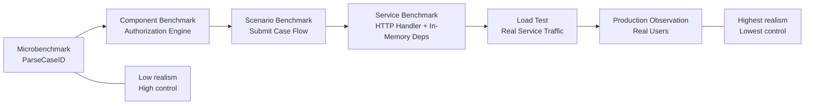
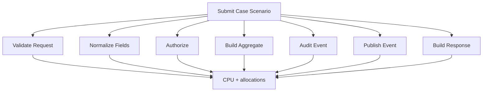
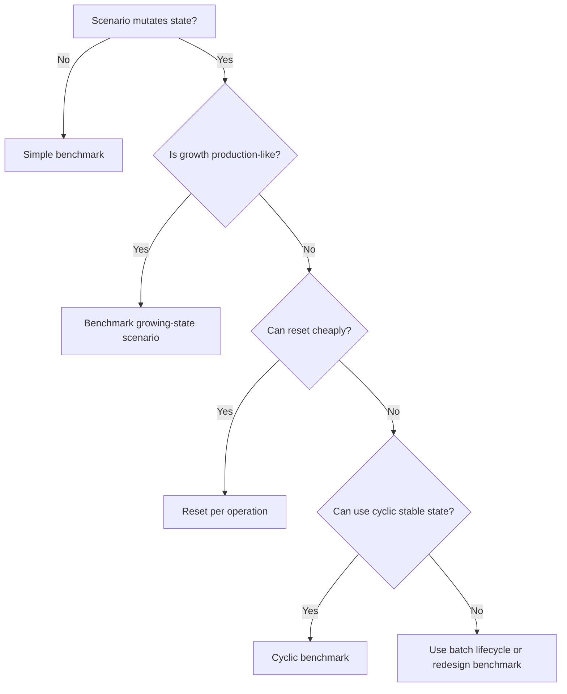
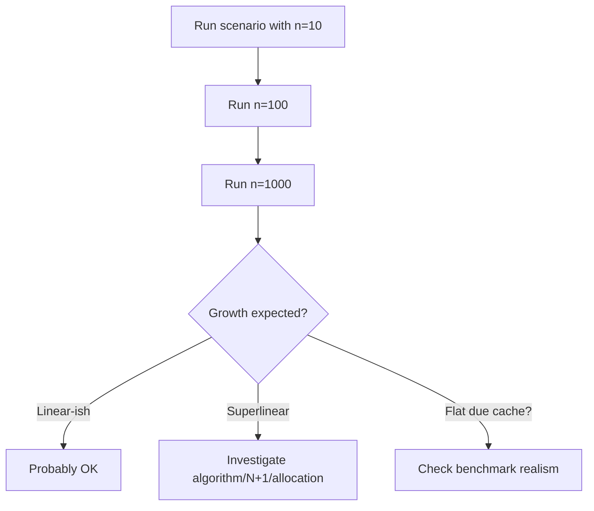
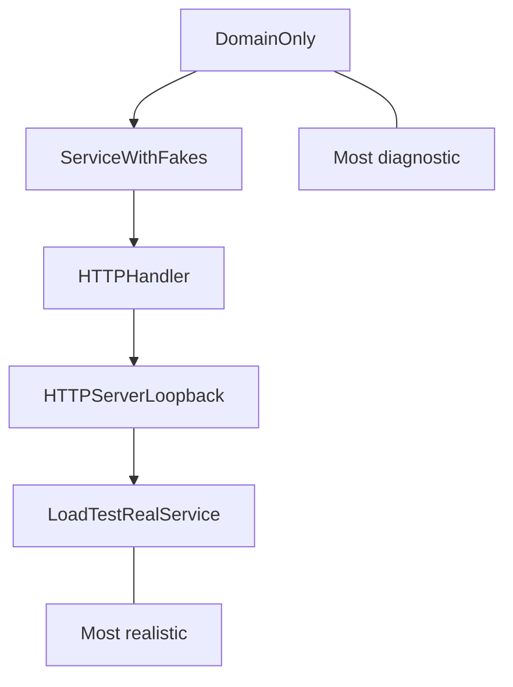
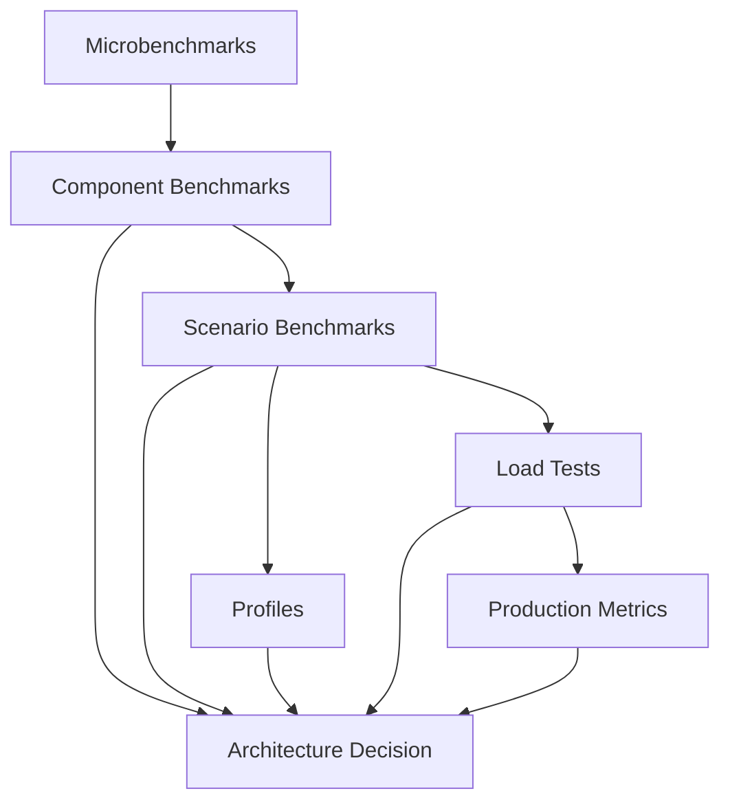

# learn-go-testing-benchmarking-performance-engineering-part-026.md

# Part 026 — Macrobenchmark, Scenario Benchmark & Workload Modeling

> Seri: **Go Testing, Benchmarking, Performance Engineering**  
> Target pembaca: **Java Software Engineer → Go Performance-Capable Engineer**  
> Target Go: **Go 1.26.x**  
> Status seri: **Part 026 dari 034**  
> Prasyarat: Part 020–025, terutama benchmark fundamentals, `B.Loop`, allocation benchmarking, parallel benchmarking, dan benchmark statistics.

---

## 0. Tujuan Part Ini

Part sebelumnya membahas **microbenchmark**: operasi kecil, sempit, dan mudah diisolasi.

Part ini naik level ke:

- macrobenchmark,
- scenario benchmark,
- workload modeling,
- request mix,
- payload mix,
- dependency simulation,
- cold/warm path,
- concurrency model,
- saturation signal awal,
- dan cara membuat benchmark yang lebih dekat ke keputusan arsitektur.

Pertanyaan utama part ini:

> Bagaimana membuat benchmark Go yang cukup realistis untuk membantu keputusan sistem, tanpa berpura-pura bahwa benchmark tersebut adalah load test production?

Setelah part ini, Anda harus bisa:

1. Membedakan microbenchmark, macrobenchmark, scenario benchmark, dan load test.
2. Mendesain workload model yang eksplisit.
3. Membuat scenario benchmark dengan `testing.B`.
4. Memisahkan operation cost, flow cost, dan dependency cost.
5. Membuat benchmark untuk request mix dan payload mix.
6. Menangani cold path vs warm path.
7. Mensimulasikan dependency secara jujur.
8. Menghindari benchmark yang terlalu synthetic atau terlalu integration-heavy.
9. Membaca scenario benchmark sebagai evidence, bukan truth absolut.
10. Menggunakan benchmark untuk architectural decision.

---

## 1. Satu Kalimat Inti

> Scenario benchmark mengukur biaya satu flow atau workload representatif dalam environment terkontrol; ia lebih realistis daripada microbenchmark, tetapi tetap bukan load test dan bukan production truth.

Scenario benchmark adalah jembatan antara:

```text
microbenchmark → component benchmark → scenario benchmark → load test → production observation
```

---

## 2. Recap: Microbenchmark vs Macrobenchmark

Microbenchmark:

```go
func BenchmarkParseCaseID(b *testing.B) {
	for b.Loop() {
		_, _ = ParseCaseID("CASE-2026-000001")
	}
}
```

Macro/scenario benchmark:

```go
func BenchmarkSubmitCaseScenario(b *testing.B) {
	app := newBenchmarkApplication()
	req := benchmarkCaseSubmission()

	for b.Loop() {
		_, _ = app.SubmitCase(context.Background(), req)
	}
}
```

Perbedaan:

| Aspect | Microbenchmark | Scenario/Macrobenchmark |
|---|---|---|
| Scope | satu fungsi/primitive | flow/module/service slice |
| Realism | rendah–sedang | sedang–tinggi |
| Diagnosis | mudah | lebih sulit |
| Noise | rendah | lebih tinggi |
| Cost | murah | lebih mahal |
| Cocok untuk | hot primitive, alloc regression | architectural trade-off, flow cost |
| Output | operation cost sempit | workload cost |
| Risiko | terlalu synthetic | terlalu banyak faktor |

---

## 3. Benchmark Spectrum



Performance engineer perlu memilih level evidence yang sesuai dengan keputusan.

---

## 4. Apa Itu Macrobenchmark?

Dalam konteks seri ini, **macrobenchmark** adalah benchmark yang mengukur operasi besar, misalnya:

- build full case summary,
- evaluate all permissions for listing page,
- process one case submission,
- generate report for 1000 cases,
- rebuild search index batch,
- consume and transform one queue message,
- apply state transition with audit event,
- validate full application form,
- serialize full API response.

Macrobenchmark masih bisa berjalan dalam `go test -bench`, tetapi operation-nya bukan primitive kecil.

Contoh:

```go
func BenchmarkBuildCaseDetailResponse(b *testing.B) {
	builder := newBenchmarkCaseDetailBuilder()
	caze := benchmarkLargeCase()

	b.ReportAllocs()
	for b.Loop() {
		resp, err := builder.Build(context.Background(), caze)
		if err != nil {
			b.Fatal(err)
		}
		if resp.ID == "" {
			b.Fatal("empty response id")
		}
	}
}
```

---

## 5. Apa Itu Scenario Benchmark?

Scenario benchmark mengukur flow yang punya domain meaning.

Contoh:

```text
Scenario:
  Officer submits new case with 3 applicants and 5 attachments.

Operation:
  Validate request
  Normalize fields
  Evaluate permissions
  Create case aggregate
  Generate audit event
  Publish domain event to fake bus
  Return response
```

Benchmark:

```go
func BenchmarkSubmitCaseScenario(b *testing.B) {
	app := newBenchmarkCaseApplication()
	req := benchmarkSubmissionRequest()

	b.ReportAllocs()
	for b.Loop() {
		resp, err := app.SubmitCase(context.Background(), req)
		if err != nil {
			b.Fatal(err)
		}
		if resp.CaseID == "" {
			b.Fatal("empty case id")
		}
	}
}
```

Scenario benchmark harus punya cerita workload.

---

## 6. Scenario Benchmark Bukan Load Test

Scenario benchmark biasanya:

- single process,
- controlled fake dependencies,
- no real network unless intentional,
- no real production traffic distribution unless modeled,
- no autoscaling,
- no real DB saturation,
- no real client behavior,
- no p95/p99 latency distribution.

Load test:

- real service/process,
- concurrent clients,
- open/closed workload model,
- latency histogram,
- RPS,
- error rate,
- saturation,
- dependencies closer to real.

Scenario benchmark memberi **component/system-slice cost**, bukan production capacity.

---

## 7. Why Scenario Benchmark Matters

Microbenchmark bisa berkata:

```text
ParseCaseID: 40 ns/op
Authorize: 2 µs/op
BuildAuditEvent: 4 µs/op
```

Tetapi flow actual mungkin:

```text
SubmitCase:
  300 field validations
  80 authorization checks
  20 normalization calls
  5 audit events
  1 event publish
  1 response build
```

Scenario benchmark membantu memahami **composition cost**.

---

## 8. Composition Cost Diagram



---

## 9. Scenario Benchmark Design Template

Gunakan template ini:

```text
Scenario Name:
  Apa flow yang diukur?

Operation:
  Satu benchmark op merepresentasikan apa?

Workload:
  Request/input seperti apa?
  Ukuran payload?
  Distribution?

Dependencies:
  Dependency nyata/fake/simulator?
  Latency disimulasikan atau tidak?
  State dependency stabil atau berubah?

State:
  Apakah operation mutates state?
  Apakah state reset per op?
  Apakah benchmark mengukur growing state?

Metrics:
  ns/op
  B/op
  allocs/op
  bytes/sec if relevant
  custom items/op if batch

Exclusions:
  Apa yang tidak diukur?

Decision:
  Keputusan apa yang akan dibantu?
```

---

## 10. Example: Case Submission Scenario Contract

```text
Scenario:
  SubmitCase_SmallHappyPath

Operation:
  One application submission through application service.

Workload:
  1 applicant
  1 license type
  2 attachments metadata
  valid postal code
  valid authorization

Dependencies:
  In-memory repository fake
  In-memory event bus spy
  Fake clock
  Fake ID generator
  No real DB/network

State:
  Repository is reset per operation? No.
  Uses deterministic unique ID generator.
  Growing repository is intentional? No.
  Therefore benchmark uses overwrite-safe fake or reset strategy.

Metrics:
  time/op, B/op, allocs/op

Decision:
  Detect application-layer CPU/allocation regression.
```

---

## 11. State Mutation Is the Hardest Part

Scenario flows often mutate state:

- insert case,
- publish event,
- update cache,
- append audit,
- consume queue,
- change status.

If benchmark loops repeatedly, state can grow or change.

Bad:

```go
func BenchmarkSubmitCase(b *testing.B) {
	app := newApp()
	req := benchmarkRequest()

	for b.Loop() {
		_, _ = app.SubmitCase(context.Background(), req)
	}
}
```

Problems:

- same case ID conflict?
- repository grows?
- cache warms?
- event bus grows?
- audit list grows?
- validation path changes?

You must decide state model.

---

## 12. State Model Options

| Model | Meaning | Use Case |
|---|---|---|
| Immutable/read-only | same input, no mutation | response building, validation |
| Reset per operation | fresh state each op | full lifecycle cost |
| Stable overwrite | same key overwritten | update cost |
| Unique key growing | state grows intentionally | index growth test |
| Cyclic state | fixed-size rotating data | steady-state simulation |
| Batch lifecycle | setup/process batch per op | batch scenario |
| Preloaded warm state | hot cache/data | steady-state service path |
| Cold state | first-use/cache miss | startup/cold path |

---

## 13. State Model Decision Tree



---

## 14. Reset Per Operation

This measures full setup + operation if reset happens inside loop.

```go
func BenchmarkSubmitCase_ResetPerOp(b *testing.B) {
	req := benchmarkRequest()

	b.ReportAllocs()
	for b.Loop() {
		app := newBenchmarkApplication()
		resp, err := app.SubmitCase(context.Background(), req)
		if err != nil {
			b.Fatal(err)
		}
		if resp.CaseID == "" {
			b.Fatal("empty case id")
		}
	}
}
```

This includes app construction/reset cost.

If that is too expensive or unrealistic, separate:

```text
BenchmarkNewApplication
BenchmarkSubmitCaseSteadyState
```

---

## 15. Stable State with Unique IDs

```go
func BenchmarkSubmitCase_UniqueIDs(b *testing.B) {
	app := newBenchmarkApplication()
	req := benchmarkRequest()
	ids := newDeterministicIDGenerator()

	b.ReportAllocs()
	for b.Loop() {
		req.CorrelationID = ids.Next()
		resp, err := app.SubmitCase(context.Background(), req)
		if err != nil {
			b.Fatal(err)
		}
		if resp.CaseID == "" {
			b.Fatal("empty case id")
		}
	}
}
```

But repository grows every op.

If growth is not intended, this is bad.

---

## 16. Cyclic State

Use fixed key range.

```go
func BenchmarkSubmitCase_CyclicState(b *testing.B) {
	app := newBenchmarkApplication()
	reqs := benchmarkRequests(1024)

	i := 0
	b.ReportAllocs()
	for b.Loop() {
		req := reqs[i%len(reqs)]
		i++

		resp, err := app.SubmitCaseOrReplace(context.Background(), req)
		if err != nil {
			b.Fatal(err)
		}
		if resp.CaseID == "" {
			b.Fatal("empty case id")
		}
	}
}
```

Operation semantics must be honest: submit-or-replace is not same as real submit if duplicate case behavior differs.

---

## 17. Batch Lifecycle Scenario

For batch process:

```go
func BenchmarkProcessQueueBatch(b *testing.B) {
	const batchSize = 1000

	b.ReportAllocs()
	for b.Loop() {
		app := newBenchmarkConsumer()
		msgs := benchmarkMessages(batchSize)

		for _, msg := range msgs {
			if err := app.ProcessMessage(context.Background(), msg); err != nil {
				b.Fatal(err)
			}
		}
	}

	b.ReportMetric(batchSize, "messages/op")
}
```

One operation = process one batch.

This is useful for batch jobs, queue consumers, migration tools.

---

## 18. Per-Item vs Per-Batch Interpretation

If output:

```text
BenchmarkProcessQueueBatch-8    20 ms/op    10 MB/op    50000 allocs/op
```

and batch size = 1000:

```text
time per item ≈ 20 µs/item
bytes per item ≈ 10 KiB/item
allocs per item ≈ 50 allocs/item
```

But `ns/op` is per batch.

Report custom metric or document.

---

## 19. Workload Modeling

Workload model answers:

> What inputs and operation mix represent the thing we care about?

A workload model should include:

- operation types,
- operation frequencies,
- payload sizes,
- valid/invalid ratio,
- read/write ratio,
- hit/miss ratio,
- cold/warm ratio,
- concurrency level,
- dependency behavior,
- data distribution,
- state size.

---

## 20. Example Workload Model: Case Listing

```text
Operation:
  Build listing page response.

Distribution:
  70% normal officer list
  20% supervisor list with escalated cases
  10% admin cross-agency list

Payload:
  20, 50, 100 cases per page

Per case:
  compute allowed actions
  map status
  include latest audit summary
  include assignment summary

Cache:
  90% permission cache hit
  10% miss

Dependencies:
  repository fake returns preloaded cases
  permission cache fake/simulator
```

---

## 21. Scenario Benchmark for Listing Page

```go
func BenchmarkBuildCaseListingPage(b *testing.B) {
	app := newBenchmarkListingApp()

	workloads := []struct {
		name string
		req  ListingRequest
	}{
		{"Officer_20Cases", officerListingRequest(20)},
		{"Officer_100Cases", officerListingRequest(100)},
		{"Supervisor_100EscalatedCases", supervisorEscalatedListingRequest(100)},
		{"Admin_CrossAgency_100Cases", adminCrossAgencyListingRequest(100)},
	}

	for _, wl := range workloads {
		b.Run(wl.name, func(b *testing.B) {
			resp, err := app.BuildListingPage(context.Background(), wl.req)
			if err != nil {
				b.Fatal(err)
			}
			if len(resp.Cases) == 0 {
				b.Fatal("empty listing")
			}

			b.ReportAllocs()
			for b.Loop() {
				resp, err = app.BuildListingPage(context.Background(), wl.req)
				if err != nil {
					b.Fatal(err)
				}
			}

			if len(resp.Cases) == 0 {
				b.Fatal("empty listing")
			}
		})
	}
}
```

---

## 22. Mixed Workload Benchmark

Separated sub-benchmarks are diagnostic. Mixed benchmark approximates aggregate workload.

```go
func BenchmarkBuildCaseListingPage_Mixed(b *testing.B) {
	app := newBenchmarkListingApp()

	reqs := []ListingRequest{
		officerListingRequest(20),
		officerListingRequest(20),
		officerListingRequest(50),
		supervisorEscalatedListingRequest(50),
		adminCrossAgencyListingRequest(100),
	}

	i := 0
	b.ReportAllocs()
	for b.Loop() {
		req := reqs[i%len(reqs)]
		i++

		resp, err := app.BuildListingPage(context.Background(), req)
		if err != nil {
			b.Fatal(err)
		}
		if len(resp.Cases) == 0 {
			b.Fatal("empty listing")
		}
	}
}
```

Document distribution:

```text
This mixed benchmark is illustrative, not derived from production telemetry.
```

If production data exists, use sanitized distribution.

---

## 23. Request Mix vs Payload Mix

Request mix:

```text
70% list
20% detail
10% submit
```

Payload mix:

```text
list page sizes: 20, 50, 100
case detail sizes: small, medium, large
submit payload: 1 applicant, 3 applicants, 10 applicants
```

Do not confuse them.

A workload model often needs both.

---

## 24. Scenario Benchmark With Request Mix

```go
func BenchmarkCaseServiceMixedRequests(b *testing.B) {
	app := newBenchmarkCaseService()

	ops := []func(context.Context) error{
		func(ctx context.Context) error {
			_, err := app.ListCases(ctx, officerListingRequest(20))
			return err
		},
		func(ctx context.Context) error {
			_, err := app.ListCases(ctx, officerListingRequest(50))
			return err
		},
		func(ctx context.Context) error {
			_, err := app.GetCaseDetail(ctx, detailRequestMedium())
			return err
		},
		func(ctx context.Context) error {
			_, err := app.SubmitCase(ctx, submitRequestSmall())
			return err
		},
	}

	i := 0
	b.ReportAllocs()
	for b.Loop() {
		if err := ops[i%len(ops)](context.Background()); err != nil {
			b.Fatal(err)
		}
		i++
	}
}
```

This is a mixed operation benchmark.

Downside:

- one `ns/op` blends different operations,
- harder to diagnose,
- distribution must be documented.

Keep separate benchmarks too.

---

## 25. Weighted Mix

Instead of repeating functions manually, create weighted corpus:

```go
type weightedOp struct {
	name   string
	weight int
	fn     func(context.Context) error
}

func expandWeightedOps(ops []weightedOp) []weightedOp {
	var out []weightedOp
	for _, op := range ops {
		for i := 0; i < op.weight; i++ {
			out = append(out, op)
		}
	}
	return out
}
```

Benchmark:

```go
func BenchmarkCaseServiceWeightedMix(b *testing.B) {
	app := newBenchmarkCaseService()

	ops := expandWeightedOps([]weightedOp{
		{"List20", 50, func(ctx context.Context) error {
			_, err := app.ListCases(ctx, officerListingRequest(20))
			return err
		}},
		{"DetailMedium", 30, func(ctx context.Context) error {
			_, err := app.GetCaseDetail(ctx, detailRequestMedium())
			return err
		}},
		{"SubmitSmall", 20, func(ctx context.Context) error {
			_, err := app.SubmitCase(ctx, submitRequestSmall())
			return err
		}},
	})

	i := 0
	b.ReportAllocs()
	for b.Loop() {
		op := ops[i%len(ops)]
		i++
		if err := op.fn(context.Background()); err != nil {
			b.Fatal(err)
		}
	}
}
```

---

## 26. Randomized Mix vs Deterministic Mix

Do not use random inside hot loop unless randomness is part of operation.

Bad:

```go
op := ops[rand.Intn(len(ops))]
```

Better:

- deterministic expanded corpus,
- shuffled once before benchmark,
- fixed seed before loop if needed.

```go
ops := expandWeightedOps(...)
rng := rand.New(rand.NewSource(1))
rng.Shuffle(len(ops), func(i, j int) {
	ops[i], ops[j] = ops[j], ops[i]
})
```

Then deterministic iteration.

---

## 27. Cold Path vs Warm Path

Warm path:

- caches populated,
- lazy init done,
- connection pool ready,
- regex compiled,
- policy loaded,
- templates parsed.

Cold path:

- first request,
- cache miss,
- policy load,
- template parse,
- connection establishment,
- JIT not relevant in Go, but runtime/system caches still matter.

Benchmark both when relevant.

---

## 28. Warm Path Benchmark

```go
func BenchmarkAuthorizeWarmCache(b *testing.B) {
	app := newBenchmarkAuthzApp()
	req := benchmarkAuthzRequest()

	_, _ = app.Authorize(context.Background(), req) // warm cache

	b.ReportAllocs()
	for b.Loop() {
		_, _ = app.Authorize(context.Background(), req)
	}
}
```

---

## 29. Cold Path Benchmark

```go
func BenchmarkAuthorizeColdCache(b *testing.B) {
	req := benchmarkAuthzRequest()

	b.ReportAllocs()
	for b.Loop() {
		app := newBenchmarkAuthzApp()
		_, _ = app.Authorize(context.Background(), req)
	}
}
```

This includes app construction. If that is not the intended cold path, design better:

```go
func BenchmarkAuthorizeCacheMiss(b *testing.B) {
	app := newBenchmarkAuthzApp()
	reqs := uniqueAuthzRequests(1024)

	i := 0
	b.ReportAllocs()
	for b.Loop() {
		req := reqs[i%len(reqs)]
		i++
		app.ResetCacheEntry(req.CacheKey)

		_, _ = app.Authorize(context.Background(), req)
	}
}
```

---

## 30. Dependency Simulation

Scenario benchmark often needs dependency simulation.

Options:

| Strategy | Use |
|---|---|
| fake dependency | deterministic, no latency |
| spy dependency | verify call count/output |
| simulator | emulate latency/error/cache |
| in-memory implementation | realistic behavior without network |
| local test server | HTTP stack included |
| real dependency | integration/perf environment only |

---

## 31. Dependency Simulation Honesty

A fake dependency can make benchmark too optimistic.

Example:

```go
type FakeRepository struct {
	data map[string]Case
}

func (r *FakeRepository) Get(ctx context.Context, id string) (Case, error) {
	return r.data[id], nil
}
```

This excludes:

- SQL query,
- network,
- connection pool,
- serialization,
- lock contention,
- DB latency,
- transaction overhead.

That may be okay if benchmark scope is application CPU.

Name:

```text
BenchmarkBuildCaseDetail_InMemoryRepo
```

Not:

```text
BenchmarkCaseDetailProduction
```

---

## 32. Dependency Simulator

```go
type RepositorySimulator struct {
	data    map[string]Case
	latency time.Duration
	errEvery int
	count atomic.Int64
}

func (r *RepositorySimulator) Get(ctx context.Context, id string) (Case, error) {
	if r.latency > 0 {
		timer := time.NewTimer(r.latency)
		select {
		case <-ctx.Done():
			timer.Stop()
			return Case{}, ctx.Err()
		case <-timer.C:
		}
	}

	if r.errEvery > 0 && r.count.Add(1)%int64(r.errEvery) == 0 {
		return Case{}, ErrTemporary
	}

	return r.data[id], nil
}
```

But including real `time.Sleep`/timer in benchmark can make it slow and noisy.

For latency/failure behavior, scenario test/load test may be better. Use fake clock if possible.

---

## 33. Simulated Latency in Benchmark: Use Carefully

If you add:

```go
time.Sleep(5 * time.Millisecond)
```

inside benchmark, result dominated by sleep.

Sometimes useful to test timeout/retry overhead, but not for CPU performance.

Separate:

```text
BenchmarkServiceCPUOnly
BenchmarkServiceWithDependencyLatencySimulator
LoadTestServiceWithRealLatency
```

Do not mix silently.

---

## 34. Dependency Call Count as Metric

Scenario benchmark can report dependency calls per operation.

```go
func BenchmarkBuildCaseDetail(b *testing.B) {
	repo := newSpyRepository()
	app := NewCaseApp(repo)

	b.ReportAllocs()
	for b.Loop() {
		repo.ResetCounts()
		_, err := app.GetCaseDetail(context.Background(), detailRequest())
		if err != nil {
			b.Fatal(err)
		}

		if repo.GetCount() > 5 {
			b.Fatalf("too many repo calls: %d", repo.GetCount())
		}
	}
}
```

But resetting/checking inside loop adds overhead.

Alternative:

- correctness/invariant test for call count,
- benchmark for performance separately.

---

## 35. Scenario Benchmark and N+1 Detection

N+1 problems often show in scenario benchmarks with size scaling.

```go
func BenchmarkBuildListingPageScaling(b *testing.B) {
	for _, n := range []int{10, 50, 100, 500} {
		b.Run(fmt.Sprintf("cases=%d", n), func(b *testing.B) {
			app := newBenchmarkListingApp()
			req := listingRequest(n)

			b.ReportAllocs()
			for b.Loop() {
				_, err := app.BuildListingPage(context.Background(), req)
				if err != nil {
					b.Fatal(err)
				}
			}
		})
	}
}
```

If time grows worse than expected, investigate.

Add spy test:

```go
func TestBuildListingPageRepositoryCallCount(t *testing.T) {
	repo := newSpyRepo()
	app := NewListingApp(repo)

	_, err := app.BuildListingPage(context.Background(), listingRequest(100))
	if err != nil {
		t.Fatal(err)
	}

	if repo.QueryCount() > 3 {
		t.Fatalf("query count=%d, want <= 3", repo.QueryCount())
	}
}
```

Benchmark + invariant test work together.

---

## 36. Size Scaling and Complexity

Scenario benchmark can reveal algorithmic scaling.

Example output:

```text
cases=10      100 µs/op
cases=100     1.2 ms/op
cases=1000    180 ms/op
```

100x input leads to 1800x time. Maybe O(n²), N+1, sorting issue, or allocation blowup.

Do not just optimize blindly. Investigate with profiles and code review.

---

## 37. Scaling Diagram



---

## 38. Concurrency Model in Scenario Benchmark

Scenario benchmark can be serial or parallel.

Serial scenario:

```go
func BenchmarkSubmitCaseScenario(b *testing.B) {
	app := newBenchmarkApp()
	req := benchmarkSubmitRequest()

	for b.Loop() {
		_, _ = app.SubmitCase(context.Background(), req)
	}
}
```

Parallel scenario:

```go
func BenchmarkSubmitCaseScenarioParallel(b *testing.B) {
	app := newBenchmarkApp()
	reqs := benchmarkSubmitRequests(1024)

	b.RunParallel(func(pb *testing.PB) {
		i := 0
		for pb.Next() {
			req := reqs[i%len(reqs)]
			i++

			_, _ = app.SubmitCase(context.Background(), req)
		}
	})
}
```

Parallel scenario can reveal shared app contention.

But still not load test.

---

## 39. Parallel Scenario Benchmark Caveats

- no client network,
- no real request arrival distribution,
- no latency histogram,
- shared fake dependencies may distort contention,
- per-goroutine local state may be too optimistic,
- error handling may be missing,
- state mutation can race,
- repository fake may not behave like DB.

Use it as component concurrency evidence.

---

## 40. Open vs Closed Workload

`testing.B` benchmarks are more like closed-loop:

```text
next operation starts after previous operation completes
```

Load tests can be:

- closed workload: fixed number of clients loop,
- open workload: requests arrive at target rate independent of completion.

Open workload reveals queueing/saturation differently.

Scenario benchmark cannot fully model open arrival process. Do not use it to claim RPS capacity.

---

## 41. Saturation Signal

Scenario benchmark with `RunParallel` and `-cpu` can show rough saturation.

```bash
go test -run='^$' -bench=BenchmarkSubmitCaseScenarioParallel -benchmem -cpu=1,2,4,8,16 -count=10 ./internal/case
```

If scaling curve worsens after 4 CPUs:

- lock contention,
- allocation/GC,
- shared fake,
- cache line bouncing,
- scheduler,
- memory bandwidth,
- single dependency bottleneck.

But this is not full service saturation.

---

## 42. Latency Proxy: Be Careful

`ns/op` in scenario benchmark is average operation cost.

It is not p95/p99.

For tail-like behavior, you need:

- repeated operation timing distribution,
- load test,
- production metrics.

You can write custom latency histogram benchmark, but it often becomes a load test harness. Prefer proper load tooling when tail matters.

---

## 43. Custom Timing Inside Benchmark

Sometimes useful:

```go
func BenchmarkScenarioLatencySample(b *testing.B) {
	app := newBenchmarkApp()
	reqs := benchmarkRequests(1024)
	samples := make([]time.Duration, 0, 10_000)

	i := 0
	for b.Loop() {
		start := time.Now()
		_, err := app.SubmitCase(context.Background(), reqs[i%len(reqs)])
		elapsed := time.Since(start)
		i++

		if err != nil {
			b.Fatal(err)
		}
		if len(samples) < cap(samples) {
			samples = append(samples, elapsed)
		}
	}

	// Analyze samples outside benchmark if needed.
}
```

But this measures `time.Now` and sampling overhead. Use sparingly.

---

## 44. Scenario Benchmark and Allocation

Scenario benchmark allocation often reveals composition problems.

Example:

```text
BenchmarkBuildCaseListingPage/100Cases-8    2.5 ms/op    4 MB/op    60000 allocs/op
```

This may indicate:

- per-case map allocations,
- repeated JSON marshal/unmarshal,
- string formatting in loop,
- reflection mapping,
- N+1 DTO construction,
- no preallocation,
- excessive interface conversion.

Use allocation benchmark and profile to diagnose.

---

## 45. Scenario Benchmark and `SetBytes`

If scenario processes bytes, use `SetBytes`.

Example report generation:

```go
func BenchmarkGenerateReportCSV(b *testing.B) {
	report := benchmarkReport(10_000)
	estimatedInputBytes := report.EstimatedInputBytes()

	b.SetBytes(int64(estimatedInputBytes))
	b.ReportAllocs()

	for b.Loop() {
		out, err := GenerateCSV(report)
		if err != nil {
			b.Fatal(err)
		}
		if len(out) == 0 {
			b.Fatal("empty output")
		}
	}
}
```

Clarify whether bytes are input or output.

---

## 46. Scenario Benchmark and `ReportMetric`

For batch:

```go
func BenchmarkScreeningBatch(b *testing.B) {
	const casesPerBatch = 1000
	engine := newScreeningEngine()
	batch := benchmarkScreeningBatch(casesPerBatch)

	b.ReportAllocs()
	for b.Loop() {
		result, err := engine.ScreenBatch(context.Background(), batch)
		if err != nil {
			b.Fatal(err)
		}
		if result.Count == 0 {
			b.Fatal("empty result")
		}
	}

	b.ReportMetric(float64(casesPerBatch), "cases/op")
}
```

You can compute cases/sec externally.

---

## 47. Scenario Benchmark for Queue Consumer

```go
func BenchmarkConsumeCaseEvent(b *testing.B) {
	consumer := newBenchmarkConsumer()
	msg := benchmarkCaseSubmittedMessage()

	b.ReportAllocs()
	for b.Loop() {
		if err := consumer.Handle(context.Background(), msg); err != nil {
			b.Fatal(err)
		}
	}
}
```

But if handler is idempotent and mutates store, same message repeated may become duplicate path.

Variants:

```text
HandleNewMessage
HandleDuplicateMessage
HandleMixedNewDuplicate
HandleInvalidMessage
```

---

## 48. Scenario Benchmark for State Transition

```go
func BenchmarkCaseStateTransition(b *testing.B) {
	service := newBenchmarkCaseService()
	cases := benchmarkCasesInState("PENDING_REVIEW", 1024)

	i := 0
	b.ReportAllocs()
	for b.Loop() {
		caze := cases[i%len(cases)]
		i++

		err := service.Transition(context.Background(), caze.ID, Approve)
		if err != nil {
			b.Fatal(err)
		}

		service.ResetCaseState(caze.ID, "PENDING_REVIEW")
	}
}
```

This includes reset if inside loop. Maybe okay, maybe not.

Better if reset is cheap but not measured:

```go
for b.Loop() {
	b.StopTimer()
	service.ResetCaseState(caze.ID, "PENDING_REVIEW")
	b.StartTimer()

	err := service.Transition(...)
}
```

But timer manipulation can distort. Prefer stable fake or operation that naturally cycles.

---

## 49. Scenario Benchmark for API Handler

```go
func BenchmarkSubmitCaseHTTPHandler(b *testing.B) {
	handler := newBenchmarkHTTPHandler()
	body := mustReadFile("testdata/submit_case_small.json")

	b.ReportAllocs()
	for b.Loop() {
		req := httptest.NewRequest(http.MethodPost, "/cases", bytes.NewReader(body))
		req.Header.Set("Content-Type", "application/json")
		rr := httptest.NewRecorder()

		handler.ServeHTTP(rr, req)

		if rr.Code != http.StatusCreated {
			b.Fatalf("status=%d body=%s", rr.Code, rr.Body.String())
		}
	}
}
```

This includes:

- request construction,
- body reader,
- handler routing if included,
- JSON decode,
- validation,
- service call,
- response encode,
- recorder.

This is closer to HTTP-layer cost, not just service cost.

---

## 50. Handler Benchmark Variants

```text
BenchmarkSubmitCaseServiceOnly
BenchmarkSubmitCaseHTTPHandler
BenchmarkSubmitCaseHTTPHandler_InvalidPayload
BenchmarkSubmitCaseHTTPHandler_LargePayload
BenchmarkSubmitCaseHTTPHandler_Unauthorized
```

Why?

- unauthorized may be cheaper due fail-fast,
- invalid payload may be expensive if error reporting huge,
- large payload may trigger allocations,
- service-only isolates domain cost,
- handler includes HTTP/JSON cost.

---

## 51. Scenario Benchmark With `httptest.Server`

```go
func BenchmarkSubmitCaseHTTPServer(b *testing.B) {
	server := httptest.NewServer(newBenchmarkRouter())
	defer server.Close()

	client := server.Client()
	body := mustReadFile("testdata/submit_case_small.json")

	b.ReportAllocs()
	for b.Loop() {
		req, err := http.NewRequest(http.MethodPost, server.URL+"/cases", bytes.NewReader(body))
		if err != nil {
			b.Fatal(err)
		}
		req.Header.Set("Content-Type", "application/json")

		resp, err := client.Do(req)
		if err != nil {
			b.Fatal(err)
		}
		_ = resp.Body.Close()

		if resp.StatusCode != http.StatusCreated {
			b.Fatalf("status=%d", resp.StatusCode)
		}
	}
}
```

This includes real local HTTP stack. It is more scenario/integration-like and noisier.

Use name:

```text
BenchmarkSubmitCaseHTTPServerLoopback
```

---

## 52. Dependency Boundary Layers

For one use case, you may create benchmark layers:

```text
BenchmarkSubmitCase_DomainOnly
BenchmarkSubmitCase_ServiceWithFakes
BenchmarkSubmitCase_HTTPHandler
BenchmarkSubmitCase_HTTPServerLoopback
LoadTest_SubmitCase_RealService
```

Each layer answers a different question.

---

## 53. Layered Benchmark Diagram



---

## 54. Workload Model From Production Data

If production telemetry exists, use it carefully.

Examples:

```text
Case listing page size:
  p50: 20
  p90: 50
  p99: 100

Submission applicants:
  p50: 1
  p90: 3
  p99: 8

Permission cache:
  hit rate: 93%
```

Convert to benchmark:

```text
Small = p50
Large = p90
Worst = p99
Mixed = approximate distribution
```

Never use raw production PII/secrets. Generate synthetic fixtures matching shape.

---

## 55. Synthetic Data Generation

Good synthetic data:

- realistic sizes,
- realistic field lengths,
- realistic optional/missing fields,
- realistic invalid cases,
- no PII,
- deterministic,
- versioned,
- documented.

Bad synthetic data:

- all fields `"test"`,
- one item only,
- no optional fields,
- no invalid data,
- too small,
- random uncontrolled.

---

## 56. Fixture Governance

Scenario benchmark fixtures must be reviewed.

Checklist:

- Does fixture represent workload?
- Does fixture encode assumptions?
- Is it sanitized?
- Is size appropriate?
- Is update reason documented?
- Does fixture change invalidate baseline?
- Are p50/p90/p99 variants included?
- Are invalid/error variants included?

---

## 57. Scenario Benchmark and Regression

Scenario benchmark is useful for regression detection.

Example:

```text
BenchmarkBuildListingPage/100Cases:
  old: 2.1 ms/op, 2 MB/op
  new: 3.5 ms/op, 8 MB/op
```

This catches regressions microbenchmark may miss.

But diagnosis requires:

- sub-benchmarks,
- profiles,
- allocation breakdown,
- code diff,
- test invariants.

---

## 58. Scenario Benchmark and Architecture Decision

Example decision:

> Should allowed actions be computed per case on demand, precomputed per listing page, or cached?

Benchmark variants:

```text
BenchmarkListingActions/ComputePerCase
BenchmarkListingActions/PrecomputePerPage
BenchmarkListingActions/PermissionCache
BenchmarkListingActions/MixedCache90Hit
```

Metrics:

- time/op,
- B/op,
- allocs/op,
- complexity,
- correctness risk,
- staleness risk,
- cache invalidation cost.

Performance is one axis.

---

## 59. Architecture Trade-Off Table

| Option | Benchmark Speed | Allocation | Complexity | Correctness Risk | Operational Risk |
|---|---:|---:|---|---|---|
| compute each time | slower | lower/moderate | low | low | low |
| cache per permission | fast hit | low hit/high miss | medium | stale risk | invalidation |
| precompute page | fast listing | memory cost | medium | sync risk | refresh |
| async materialized view | fastest read | high system cost | high | eventual consistency | pipeline ops |

Scenario benchmark informs the table, not replaces it.

---

## 60. Scenario Benchmark for Capacity Input

Scenario benchmark can estimate CPU cost per operation.

Example:

```text
BenchmarkSubmitCase_ServiceWithFakes:
  2 ms/op
```

If service target:

```text
100 RPS submit
```

CPU estimate:

```text
2 ms/op * 100 ops/sec = 200 ms CPU/sec ≈ 0.2 core
```

But this excludes:

- DB latency,
- network,
- JSON if not included,
- GC under real load,
- contention,
- logging/tracing,
- dependency retries.

Use as lower-bound CPU estimate.

---

## 61. Allocation Rate Estimate from Scenario Benchmark

```text
BenchmarkSubmitCase_ServiceWithFakes:
  256 KiB/op
```

At 100 RPS:

```text
256 KiB * 100 = 25 MiB/sec allocation rate
```

This may be significant.

At 1000 RPS:

```text
256 MiB/sec
```

Likely serious GC pressure.

Scenario benchmark allocation can be highly useful.

---

## 62. Scenario Benchmark and Performance Budget

Define budget:

```text
SubmitCase application CPU budget:
  p50-ish service CPU: <= 5 ms/op
  allocation: <= 512 KiB/op
  allocs: <= 10k allocs/op
```

Benchmark result:

```text
3.2 ms/op
300 KiB/op
7k allocs/op
```

Within budget.

If result:

```text
8 ms/op
2 MiB/op
60k allocs/op
```

Needs investigation.

Budget should come from system goals, not arbitrary preference.

---

## 63. Scenario Benchmark CI Placement

| Benchmark Type | PR Gate | Nightly | Release |
|---|---|---|---|
| small scenario | maybe selected | yes | yes |
| large scenario | no | yes | yes |
| HTTP loopback | no or limited | yes | yes |
| dependency integration | no | maybe | yes/manual |
| load/stress/soak | no | scheduled | release/perf env |

Do not destroy PR feedback loop with huge scenario benchmarks.

---

## 64. Scenario Benchmark Command Patterns

```bash
# One scenario benchmark.
go test -run='^$' -bench=BenchmarkSubmitCaseScenario -benchmem ./internal/case

# Repeated for comparison.
go test -run='^$' -bench=BenchmarkSubmitCaseScenario -benchmem -count=10 ./internal/case > old.txt

# Longer benchtime for noisy scenario.
go test -run='^$' -bench=BenchmarkSubmitCaseScenario -benchmem -benchtime=5s -count=10 ./internal/case > result.txt

# CPU matrix for parallel scenario.
go test -run='^$' -bench=BenchmarkSubmitCaseScenarioParallel -benchmem -cpu=1,2,4,8 -count=10 ./internal/case > result.txt

# Perf-tagged scenario benchmark.
go test -tags=perf -run='^$' -bench=BenchmarkLargeReportScenario -benchmem -count=5 ./internal/report
```

---

## 65. Scenario Benchmark Review Checklist

### 65.1 Scenario Definition

- [ ] Scenario name is domain meaningful.
- [ ] One operation is defined.
- [ ] Included steps are documented.
- [ ] Excluded steps are documented.
- [ ] Benchmark is not mislabeled as production.

### 65.2 Workload

- [ ] Payload size is realistic.
- [ ] Request mix is documented.
- [ ] Payload mix is documented.
- [ ] Error/invalid cases included where relevant.
- [ ] p50/p90/p99 sizes considered if available.
- [ ] Synthetic data is safe and deterministic.

### 65.3 Dependencies

- [ ] Fake/simulator/real dependency choice is explicit.
- [ ] Dependency latency is included only intentionally.
- [ ] Dependency behavior is representative enough for question.
- [ ] Call count/N+1 invariants tested separately if needed.

### 65.4 State

- [ ] Mutation model is explicit.
- [ ] State does not grow unintentionally.
- [ ] Cache warm/cold state is explicit.
- [ ] Duplicate/idempotent path not accidentally measured.

### 65.5 Measurement

- [ ] `B.Loop` or `RunParallel` used correctly.
- [ ] `ReportAllocs` used.
- [ ] Custom metrics documented.
- [ ] Repeated runs and `benchstat` used for decisions.
- [ ] Scenario benchmark placed in correct CI tier.

### 65.6 Interpretation

- [ ] Result tied to budget.
- [ ] Result tied to call frequency/RPS estimate.
- [ ] Not interpreted as p95/p99 latency.
- [ ] Not interpreted as full capacity.
- [ ] Follow-up profile/load test defined if needed.

---

## 66. Anti-Patterns

### 66.1 “Scenario Benchmark” with No Scenario

Name is vague:

```text
BenchmarkService
BenchmarkProcess
```

Fix:

```text
BenchmarkSubmitCaseSmallHappyPath
BenchmarkBuildListingPage100Cases
```

### 66.2 Fake Dependency Too Cheap

Benchmark says app is fast, but real DB dominates.

Fix:

- name fake dependency,
- add integration/load test,
- use dependency simulator if useful.

### 66.3 State Growth Accidentally Measured

Repository grows every op unintentionally.

Fix:

- reset/cyclic/stable state.

### 66.4 Mixed Benchmark Only

One mixed number hides regression.

Fix:

- separated workload sub-benchmarks + mixed.

### 66.5 No Workload Assumption

No one knows what input means.

Fix:

- document p50/p90/p99 or assumptions.

### 66.6 Real Sleep in Benchmark

Benchmark dominated by sleep.

Fix:

- fake clock,
- separate latency scenario,
- load test.

### 66.7 Treating Scenario `ns/op` as p99

Incorrect.

### 66.8 Benchmark Too Large for PR

Bad developer feedback.

Fix:

- tiering.

### 66.9 Production Data Leakage

Bad fixture governance.

### 66.10 Architecture Decision From One Benchmark

Performance is only one dimension.

---

## 67. Case Study: Regulatory Case Submission Program

### 67.1 Goal

Measure application-layer cost of submit case flow.

### 67.2 Flow

```text
SubmitCase:
  decode already done? no for handler benchmark, yes for service benchmark
  validate application fields
  normalize postal code
  authorize submit action
  assign initial state
  create case aggregate
  build audit event
  store case in fake repo
  publish domain event to fake bus
  return response
```

### 67.3 Benchmark Layers

```text
BenchmarkSubmitCaseDomainOnly
BenchmarkSubmitCaseServiceWithFakes
BenchmarkSubmitCaseHTTPHandler
BenchmarkSubmitCaseHTTPServerLoopback
```

### 67.4 Service Benchmark

```go
func BenchmarkSubmitCaseServiceWithFakes(b *testing.B) {
	app := newBenchmarkSubmitCaseApp()
	reqs := []SubmitCaseRequest{
		submitCaseSmall(),
		submitCaseMedium(),
		submitCaseLarge(),
	}

	for _, req := range reqs {
		b.Run(req.Name, func(b *testing.B) {
			b.ReportAllocs()
			for b.Loop() {
				resp, err := app.SubmitCase(context.Background(), req)
				if err != nil {
					b.Fatal(err)
				}
				if resp.CaseID == "" {
					b.Fatal("empty case id")
				}
			}
		})
	}
}
```

Potential issue: app state grows.

Better if repo supports replace/cyclic IDs, or app reset is part of operation and benchmark named accordingly.

---

## 68. Case Study: Listing Page Allowed Actions

### 68.1 Question

> Should allowed actions be computed per case at request time or cached?

### 68.2 Benchmarks

```text
BenchmarkListingAllowedActions/ComputePerCase_20Cases
BenchmarkListingAllowedActions/ComputePerCase_100Cases
BenchmarkListingAllowedActions/Cached_20Cases_90Hit
BenchmarkListingAllowedActions/Cached_100Cases_90Hit
BenchmarkListingAllowedActions/Cached_100Cases_50Hit
```

### 68.3 Interpretation

If cache wins but misses are expensive:

- production hit rate matters,
- invalidation correctness matters,
- stale permissions risk matters,
- memory footprint matters,
- operational complexity matters.

Benchmark informs but does not decide alone.

---

## 69. Mermaid: Scenario Benchmark Evidence Stack



---

## 70. Mini Exercise 1: Define Scenario

Request:

```text
Benchmark "case approval"
```

Poor because unclear.

Better:

```text
Scenario:
  Supervisor approves an escalated case with 3 prior audit events and 2 pending tasks.

Operation:
  One call to ApproveCase service method.

Includes:
  authorization
  state transition validation
  task completion
  audit event creation
  fake repository update
  fake event publish

Excludes:
  HTTP decode
  real DB
  real queue
  logging/tracing
```

---

## 71. Mini Exercise 2: State Problem

Bad:

```go
func BenchmarkApproveCase(b *testing.B) {
	app := newApp()
	id := createPendingCase(app)

	for b.Loop() {
		_ = app.ApproveCase(ctx, id)
	}
}
```

After first approval, case no longer pending.

Fix options:

1. reset state per iteration,
2. use cyclic cases,
3. approve different pending case and allow growth intentionally,
4. benchmark idempotent already-approved path separately.

---

## 72. Mini Exercise 3: Workload Model

For listing page:

```text
70% officer page with 20 cases
20% supervisor page with 50 cases
10% admin page with 100 cases
permission cache hit rate 90%
```

Benchmark plan:

```text
Separated:
  Officer20
  Supervisor50
  Admin100

Mixed:
  Weighted corpus 7 Officer20, 2 Supervisor50, 1 Admin100

Cache:
  HotHit
  Mixed90Hit10Miss
```

---

## 73. What to Remember

1. Scenario benchmark measures a domain flow, not a primitive.
2. It is more realistic than microbenchmark but not production truth.
3. Define operation, workload, dependencies, state, and exclusions.
4. State mutation must be handled deliberately.
5. Use separated workload benchmarks plus mixed benchmark.
6. Document request mix and payload mix.
7. Fake dependencies must be named honestly.
8. Cold and warm paths are different scenarios.
9. Scenario benchmark can reveal composition cost and allocation pressure.
10. It can provide CPU/allocation estimates, not full capacity.
11. Do not treat `ns/op` as p95/p99 latency.
12. Use `benchstat` for comparisons.
13. Keep huge scenario benchmarks out of fast PR gate.
14. Use scenario benchmarks as part of evidence stack with profiling, load test, and production metrics.

---

## 74. References

Official and primary sources:

- Go `testing` package documentation: <https://pkg.go.dev/testing>
- `testing.B.Loop`: <https://pkg.go.dev/testing#B.Loop>
- `testing.B.RunParallel`: <https://pkg.go.dev/testing#B.RunParallel>
- Go blog — More predictable benchmarking with `testing.B.Loop`: <https://go.dev/blog/testing-b-loop>
- Go blog — Using Subtests and Sub-benchmarks: <https://go.dev/blog/subtests>
- `benchstat`: <https://pkg.go.dev/golang.org/x/perf/cmd/benchstat>
- Go diagnostics documentation: <https://go.dev/doc/diagnostics>
- Go command documentation: <https://pkg.go.dev/cmd/go>

---

## 75. Next Part

Part berikutnya:

```text
learn-go-testing-benchmarking-performance-engineering-part-027.md
```

Judul:

```text
Performance Engineering Mental Model: Latency, Throughput, Utilization, Saturation, Cost
```

Kita akan membahas:

- latency vs throughput,
- p50/p95/p99,
- utilization,
- saturation,
- queueing effect,
- Little’s Law,
- headroom,
- capacity envelope,
- cost-performance trade-off,
- dan cara menghubungkan benchmark dengan performance engineering sistem.

---

## Status Seri

```text
Part 026 dari 034 selesai.
Seri belum selesai.
```


<!-- NAVIGATION_FOOTER -->
<div class="page-nav">
<a href="./learn-go-testing-benchmarking-performance-engineering-part-025.md">⬅️ Part 025 — Microbenchmark Anti-Patterns & Compiler Trap Avoidance</a>
<a href="./index.md">📚 Kategori</a>
<a href="../../index.md">🏠 Home</a>
<a href="./learn-go-testing-benchmarking-performance-engineering-part-027.md">Part 027 — Performance Engineering Mental Model: Latency, Throughput, Utilization, Saturation, Cost ➡️</a>
</div>
