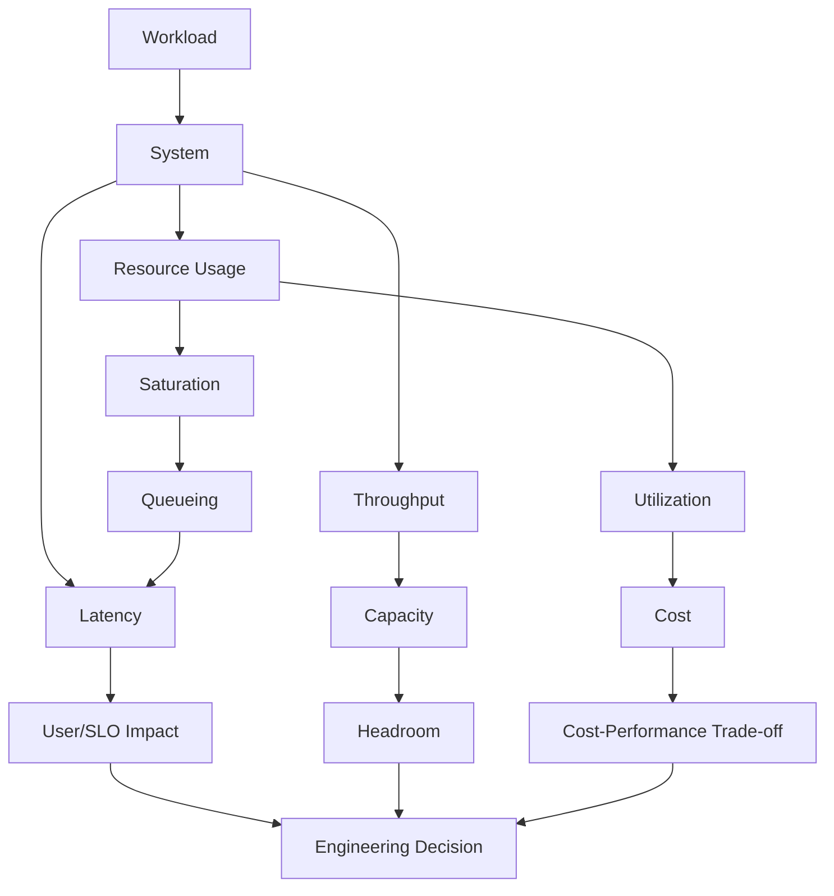
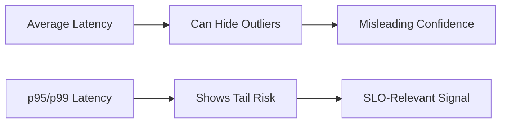
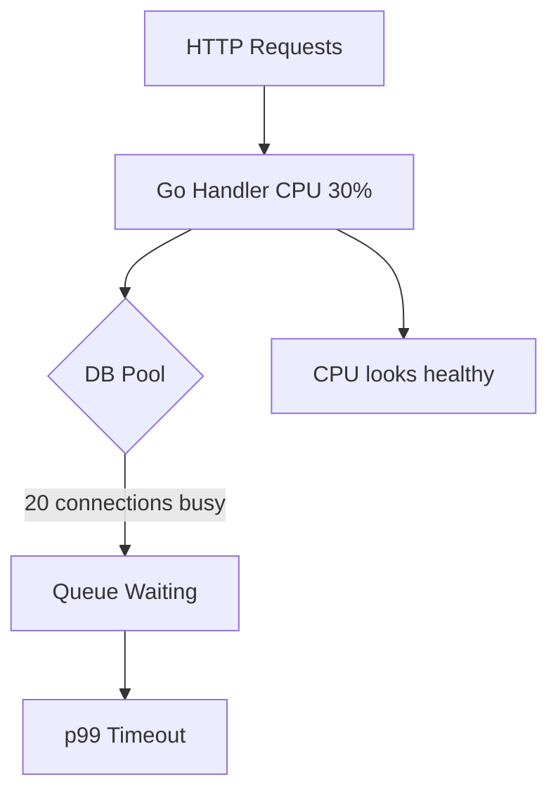
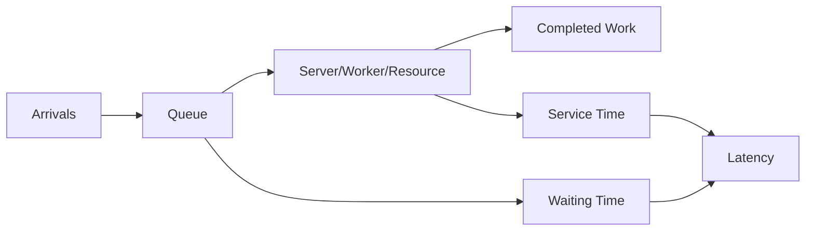
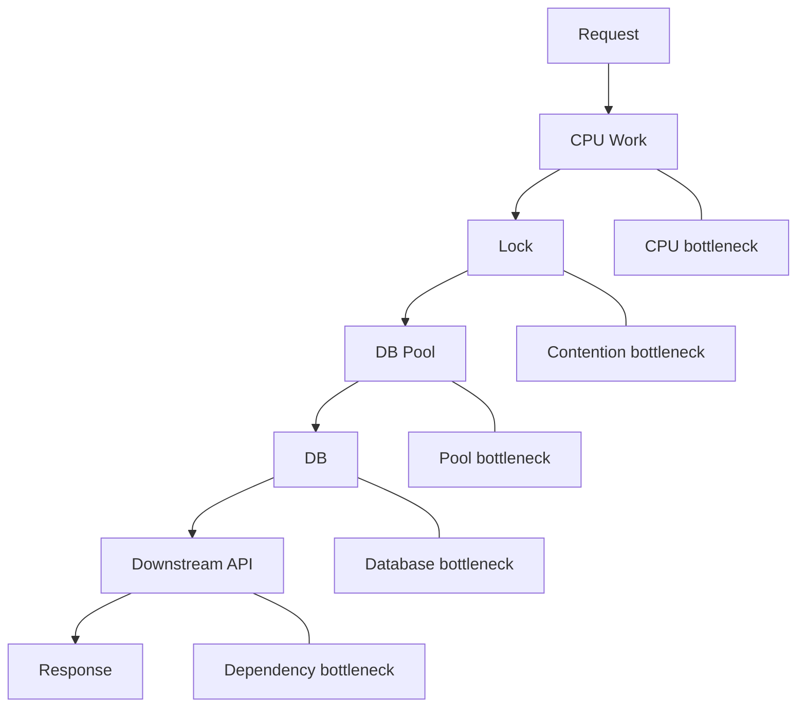
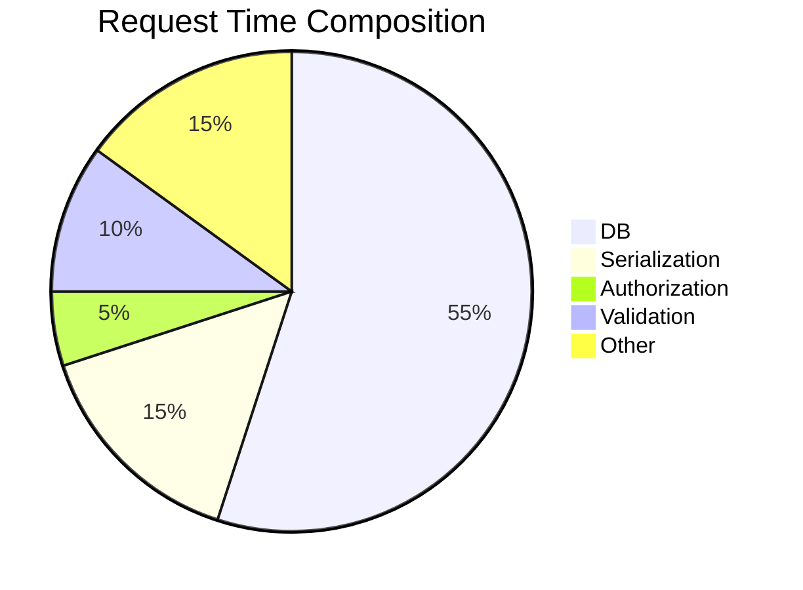
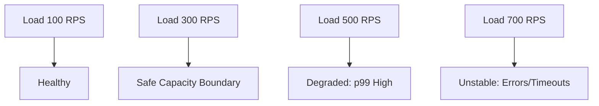
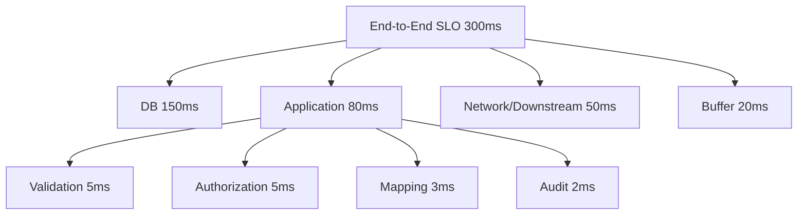
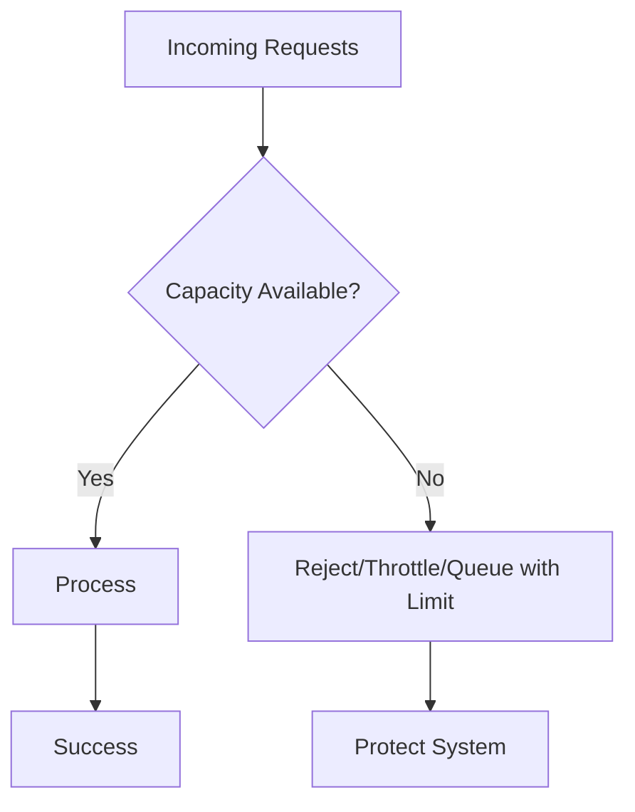
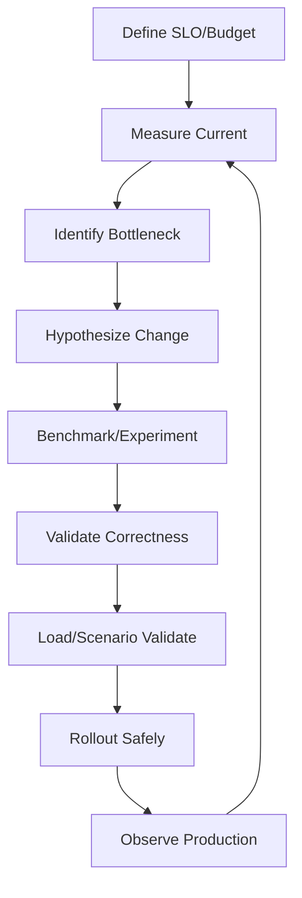

# learn-go-testing-benchmarking-performance-engineering-part-027.md

# Part 027 — Performance Engineering Mental Model: Latency, Throughput, Utilization, Saturation, Cost

> Seri: **Go Testing, Benchmarking, Performance Engineering**  
> Target pembaca: **Java Software Engineer → Go Performance-Capable Engineer**  
> Target Go: **Go 1.26.x**  
> Status seri: **Part 027 dari 034**  
> Prasyarat: Part 020–026, seri concurrency, seri observability/profiling/troubleshooting, dan dasar distributed systems.

---

## 0. Tujuan Part Ini

Part sebelumnya membahas bagaimana membuat benchmark, dari microbenchmark sampai scenario benchmark. Sekarang kita masuk ke lapisan yang lebih penting:

> Bagaimana menerjemahkan angka benchmark menjadi reasoning performance engineering sistem?

Benchmark memberi angka seperti:

```text
BenchmarkSubmitCaseService-8    2.4 ms/op    320 KiB/op    9000 allocs/op
```

Tetapi engineer harus bisa menjawab:

1. Apakah 2.4 ms/op itu baik atau buruk?
2. Berapa CPU core yang dibutuhkan untuk 100 RPS?
3. Apakah 320 KiB/op akan menekan GC?
4. Apakah throughput naik linear jika CPU ditambah?
5. Apa hubungan latency, utilization, dan saturation?
6. Kenapa p99 bisa buruk walau average bagus?
7. Apa itu headroom?
8. Kenapa sistem dengan CPU 60% bisa tetap timeout?
9. Apa bedanya bottleneck CPU, memory, lock, DB pool, queue, dan downstream?
10. Bagaimana performance menjadi trade-off biaya, reliability, dan complexity?

Part ini adalah mental model utama agar Anda tidak menjadi engineer yang hanya “menjalankan benchmark”, tetapi engineer yang bisa membuat keputusan kapasitas dan desain.

---

## 1. Satu Kalimat Inti

> Performance engineering adalah proses mengelola hubungan antara latency, throughput, utilization, saturation, reliability, dan cost di bawah workload nyata dan constraint sistem.

Benchmark adalah input. Load test adalah input. Production telemetry adalah input. Tetapi keputusan performance membutuhkan model.

---

## 2. Vocabulary Utama

| Istilah | Makna Praktis |
|---|---|
| Latency | waktu yang dibutuhkan satu operasi/request selesai |
| Throughput | jumlah operasi/request selesai per unit waktu |
| Utilization | seberapa banyak resource dipakai |
| Saturation | seberapa banyak demand melebihi service capacity sehingga menunggu |
| Capacity | throughput maksimum yang masih memenuhi target |
| Headroom | jarak aman antara load saat ini dan titik jenuh |
| Efficiency | output per resource/cost |
| Tail latency | latency percentile tinggi seperti p95/p99 |
| Bottleneck | resource atau stage yang membatasi throughput |
| Backpressure | mekanisme memperlambat/menolak input saat downstream penuh |
| Queueing | request menunggu sebelum diproses |
| Cost-performance | trade-off antara resource spend dan target performance |

---

## 3. Diagram: Performance Engineering System



---

## 4. Latency

Latency adalah durasi satu operasi.

Contoh:

```text
SubmitCase HTTP request:
  p50 = 80 ms
  p95 = 220 ms
  p99 = 900 ms
```

Dalam benchmark:

```text
BenchmarkSubmitCaseService:
  2.4 ms/op
```

Itu bukan endpoint latency penuh, tetapi service-layer operation cost.

Latency bisa dibagi:

```text
total latency =
  queue wait
  network
  request decode
  authn/authz
  application logic
  database
  downstream call
  response encode
  logging/tracing overhead
  client/network return
```

---

## 5. Average Latency Berbahaya

Average latency bisa menipu.

Contoh dua sistem:

```text
System A:
  99 requests = 10 ms
  1 request = 1000 ms
  average ≈ 19.9 ms

System B:
  100 requests = 20 ms
  average = 20 ms
```

Average hampir sama, tetapi System A punya tail buruk.

Production biasanya peduli percentile:

| Percentile | Meaning |
|---|---|
| p50 | median user experience |
| p90 | high-ish latency |
| p95 | common SLO boundary |
| p99 | tail latency |
| p99.9 | extreme tail |

Benchmark Go standar melaporkan average per operation, bukan percentile.

---

## 6. Diagram: Average vs Tail



---

## 7. Throughput

Throughput adalah jumlah operasi selesai per waktu.

Contoh:

```text
200 requests/sec
50,000 messages/sec
1.2 GB/sec encoding throughput
```

Dari benchmark:

```text
1000 ns/op
```

Rough throughput:

```text
1e9 / 1000 = 1,000,000 ops/sec
```

Tetapi ini hanya throughput operation benchmark, bukan service throughput.

---

## 8. Latency vs Throughput

Latency dan throughput terkait tetapi tidak sama.

Sistem bisa punya:

- low latency, low throughput,
- high latency, high throughput,
- low average latency, bad p99,
- high throughput until saturation then collapse.

Example:

```text
Single request service time: 10 ms
With 1 worker:
  max throughput ≈ 100 req/sec if no think time
With 10 workers:
  max throughput ≈ 1000 req/sec if no shared bottleneck
```

But if DB pool has 20 connections and each DB query is 50 ms:

```text
DB capacity ≈ 20 / 0.05 = 400 queries/sec
```

DB can cap service regardless of CPU.

---

## 9. Utilization

Utilization adalah seberapa sibuk resource.

Examples:

```text
CPU utilization: 70%
DB connection pool usage: 95%
Queue worker utilization: 85%
Memory usage: 60%
Network bandwidth: 40%
```

High utilization is not automatically bad. But as utilization approaches saturation, queueing delay rises non-linearly.

---

## 10. Saturation

Saturation terjadi ketika demand lebih tinggi daripada capacity sehingga work menunggu.

Signs:

- queue length grows,
- request waits for connection,
- goroutines blocked,
- thread/worker pool full,
- CPU run queue grows,
- channel buffer full,
- memory pressure,
- retries increase,
- timeouts increase,
- p99 explodes.

Resource can be utilized but not saturated. Saturation means **there is waiting or backlog**.

---

## 11. Utilization vs Saturation

| Condition | Meaning |
|---|---|
| low utilization, low saturation | overprovisioned or low traffic |
| high utilization, low saturation | efficient and still stable |
| high utilization, high saturation | danger zone |
| low utilization, high saturation | hidden bottleneck, lock, pool, dependency, quota |

Low CPU does not mean no performance problem.

Example:

```text
CPU = 30%
p99 = 5 seconds
DB pool wait = 4.8 seconds
```

CPU low, but DB pool saturated.

---

## 12. Diagram: Hidden Bottleneck



---

## 13. Queueing

Queueing is the missing mental model for many performance bugs.

Even if service time is stable, waiting time increases as utilization approaches capacity.

Simplified intuition:

```text
At 50% utilization: little waiting
At 70% utilization: some waiting
At 85% utilization: noticeable tail
At 95% utilization: p99 can explode
At 100%+: unbounded queue growth
```

This applies to:

- CPU,
- DB pool,
- worker pool,
- channel buffer,
- queue consumers,
- downstream API,
- lock,
- rate limiter,
- disk IO.

---

## 14. Queueing Diagram



```text
Latency = queue wait + service time
```

Benchmark often measures service time, not queue wait.

Load test/production telemetry reveals queue wait.

---

## 15. Little's Law

Little's Law:

```text
L = λ * W
```

Where:

```text
L = average number of items in system
λ = arrival rate
W = average time in system
```

Practical form:

```text
concurrency ≈ throughput * latency
```

Example:

```text
throughput = 100 req/sec
latency = 200 ms = 0.2 sec

concurrency ≈ 100 * 0.2 = 20 in-flight requests
```

If latency rises to 1 second at same throughput:

```text
concurrency ≈ 100 * 1 = 100 in-flight requests
```

This means more memory, goroutines, connections, queues.

---

## 16. Applying Little's Law to Go Service

If endpoint target:

```text
RPS = 500
p95 latency = 200 ms
```

Approx in-flight at p95:

```text
500 * 0.2 = 100 requests
```

If each in-flight request uses:

```text
200 KiB heap live/transient
```

Then rough memory pressure:

```text
100 * 200 KiB = 20 MiB transient/live-ish
```

But if p99 becomes 2 seconds:

```text
500 * 2 = 1000 in-flight
1000 * 200 KiB = 200 MiB
```

Tail latency increases concurrency and memory pressure.

---

## 17. Benchmark to CPU Core Estimate

If scenario benchmark:

```text
BenchmarkSubmitCaseService:
  2 ms/op
```

At:

```text
200 requests/sec
```

CPU seconds per second:

```text
2 ms * 200 = 400 ms CPU/sec ≈ 0.4 CPU core
```

This assumes:

- benchmark op approximates CPU service time,
- no waiting,
- no dependency latency,
- no contention,
- no GC difference,
- no logging/tracing overhead,
- same hardware.

Use as lower-bound estimate.

---

## 18. CPU Core Estimate Formula

```text
cores_needed ≈ RPS * CPU_seconds_per_request
```

If benchmark result is in `ns/op`:

```text
CPU_seconds_per_request = ns_per_op / 1e9
```

Example:

```text
5,000,000 ns/op = 5 ms/op = 0.005 sec/op
RPS = 300

cores ≈ 300 * 0.005 = 1.5 cores
```

Add headroom:

```text
target utilization 60%
required cores ≈ 1.5 / 0.60 = 2.5 cores
```

Round up and validate with load test.

---

## 19. Allocation Rate Estimate

If benchmark:

```text
BenchmarkSubmitCase:
  512 KiB/op
```

At:

```text
200 RPS
```

Allocation rate:

```text
512 KiB * 200 = 102,400 KiB/sec ≈ 100 MiB/sec
```

This matters.

High allocation rate can:

- increase GC CPU,
- increase memory bandwidth,
- worsen tail latency,
- cause higher pod memory request/limit,
- reduce cost efficiency.

---

## 20. Go GC and Allocation Rate

Go GC is concurrent, but not free.

Higher allocation rate usually means:

- more frequent GC cycles,
- more GC CPU,
- more memory bandwidth,
- more GC assists,
- potential tail latency impact,
- higher memory footprint.

Benchmark `B/op` helps estimate allocation churn.

But real impact needs:

- scenario benchmark,
- heap/alloc profile,
- load test,
- runtime metrics,
- production observation.

---

## 21. Memory Limit and Headroom

In containerized Go services, memory limit matters.

If allocation rate and live heap grow:

- GC may run more aggressively,
- memory limit can cause pressure,
- process can be OOMKilled,
- GC CPU may rise,
- latency may worsen.

A service with low CPU but high allocation can still be expensive and unstable.

---

## 22. Bottleneck Types

| Bottleneck | Symptom |
|---|---|
| CPU | high CPU, run queue, throughput capped |
| GC/allocation | high GC CPU, high alloc rate, p99 spikes |
| lock contention | blocked goroutines, mutex profile |
| DB pool | connection wait, low CPU, high latency |
| downstream API | timeout/retry, queue buildup |
| queue workers | backlog grows |
| channel buffer | senders blocked |
| memory bandwidth | CPU not fully utilized but throughput capped |
| network | high RTT, bandwidth cap |
| disk IO | high wait, slow fs ops |
| rate limit | throttling, denied/waiting |
| scheduler/goroutine | many blocked/runnable goroutines |

Benchmark can expose some bottlenecks, but not all.

---

## 23. Bottleneck Diagram



The slowest saturated stage controls throughput.

---

## 24. Bottleneck Moves

Optimizing one bottleneck can move bottleneck elsewhere.

Example:

```text
Before:
  CPU authz = bottleneck

After optimizing authz:
  DB pool becomes bottleneck
```

This is normal.

Performance engineering is iterative:

```text
measure → identify bottleneck → optimize → remeasure → identify next bottleneck
```

---

## 25. Amdahl's Law

If you optimize only a small part of total time, total improvement is limited.

Example:

```text
Authorization = 5% of request time
You make authorization 10x faster
```

Total improvement:

```text
old total = 100 ms
authz old = 5 ms
authz new = 0.5 ms
new total = 95.5 ms
improvement = 4.5%
```

A 10x microbenchmark win yields 4.5% total improvement.

Use profiling/scenario benchmarks to know contribution.

---

## 26. Amdahl Diagram



Optimizing the 5% slice has limited system impact.

---

## 27. Headroom

Headroom is spare capacity before failure/saturation.

Example:

```text
Measured safe capacity: 1000 RPS
Current peak: 600 RPS
Headroom: 400 RPS or 40%
```

But safe headroom depends on:

- p95/p99 SLO,
- error rate,
- CPU,
- memory,
- DB pool,
- downstream limits,
- burst behavior,
- failover scenario,
- deployment rollout capacity,
- traffic growth.

Headroom is not just CPU unused.

---

## 28. Why 100% Utilization Is Bad for Online Systems

At 100% utilization:

- no room for bursts,
- queues grow,
- p99 explodes,
- retries amplify load,
- GC/OS noise hurts,
- failover impossible,
- rolling deploy reduces capacity,
- downstream slowness cascades.

Online services often target 50–70% utilization at peak depending criticality and scaling behavior.

Batch systems may target higher utilization if latency less critical.

---

## 29. Capacity Envelope

Capacity envelope describes safe operating region.

Example:

```text
SubmitCase service safe envelope:
  up to 300 RPS:
    p95 < 250 ms
    p99 < 1s
    error < 0.1%
    CPU < 65%
    memory < 70%
    DB pool wait p95 < 20 ms
```

Beyond this, system may still work but not within SLO.

---

## 30. Capacity Envelope Diagram



Scenario benchmarks can estimate CPU/allocation lower bound. Load tests define envelope.

---

## 31. Cost-Performance Trade-Off

Performance is never free.

Options:

| Option | Performance | Cost | Complexity |
|---|---|---|---|
| add CPU/memory | improves capacity | higher infra cost | low |
| optimize code | improves efficiency | engineering time | medium |
| cache | improves read latency | memory/staleness | medium |
| async processing | improves request latency | eventual consistency | high |
| precompute | fast reads | freshness/storage | medium |
| shard | scale writes/reads | operational complexity | high |
| pool buffers | reduce allocation | retention/safety risk | medium |
| rewrite algorithm | big win possible | correctness risk | medium/high |

Engineering decision must balance all.

---

## 32. When to Optimize Code vs Add Resource

Optimize code when:

- hot path proven,
- cost impact high,
- latency SLO at risk,
- allocation/GC pressure high,
- scaling resource is expensive,
- algorithmic inefficiency obvious,
- optimization is maintainable.

Add resource when:

- bottleneck is resource capacity,
- code is already efficient enough,
- time-to-fix matters,
- traffic spike immediate,
- cost acceptable,
- optimization risk high.

Do both when necessary.

---

## 33. Performance Budget

Performance budget is explicit limit for operation/resource.

Example:

```text
SubmitCase budget:
  service CPU: <= 5 ms/op
  HTTP handler: <= 8 ms/op excluding DB
  allocation: <= 512 KiB/op
  DB calls: <= 5
  permission checks: <= 100
```

Benchmark results should be compared to budget.

Without budget, “fast” has no meaning.

---

## 34. Budget Hierarchy

```text
Business/SLO:
  Submit case p95 < 300 ms

System budget:
  DB p95 < 150 ms
  Application p95 < 80 ms
  Network/downstream < 50 ms
  Buffer/headroom < 20 ms

Code budget:
  validation <= 5 ms
  authorization <= 5 ms
  mapping <= 3 ms
  audit <= 2 ms
```

Budget forces architecture clarity.

---

## 35. Budget Diagram



---

## 36. Latency Budget vs CPU Budget

Latency budget is wall-clock. CPU budget is CPU time.

A request can have:

```text
CPU time: 5 ms
Wall latency: 200 ms
```

because waiting for DB/downstream.

CPU benchmark estimates CPU budget, not wall latency.

A service can have low CPU per request but high latency due to waiting.

---

## 37. Throughput Collapse

Under overload, throughput may not just plateau; it can collapse.

Causes:

- retry storm,
- timeout work not cancelled,
- queue memory explosion,
- GC pressure,
- lock contention,
- connection pool thrash,
- downstream overload,
- context cancellation ignored.

Performance engineering must include overload behavior, not only normal path.

This connects to Part 032: resilience-oriented performance testing.

---

## 38. Retry Amplification

Example:

```text
Normal traffic: 100 RPS
Downstream slow causes 20% timeouts
Each timeout retries 3 times

Additional load = 100 * 20% * 3 = 60 RPS
Total attempted downstream load = 160 RPS
```

If downstream already saturated, retries worsen it.

Benchmarking retry loop without failure scenario misses this.

---

## 39. Backpressure

Backpressure means system refuses/slows input rather than accepting infinite work.

Examples:

- bounded queue,
- rate limiter,
- semaphore,
- DB pool timeout,
- circuit breaker,
- context deadline,
- HTTP 429/503,
- load shedding.

Performance without backpressure can look fine until catastrophic collapse.

---

## 40. Backpressure Diagram



---

## 41. Queue Size and Memory

Unbounded queues are memory risks.

If request work item uses 100 KiB and queue grows to 10,000:

```text
100 KiB * 10,000 = 1,000,000 KiB ≈ 976 MiB
```

Even if CPU is low, memory can kill the service.

Benchmark should not only test fast path. Test overload/backpressure later.

---

## 42. Go-Specific Performance Axes

For Go services, watch:

- goroutine count,
- heap allocation rate,
- live heap,
- GC CPU,
- `GOMAXPROCS`,
- mutex/block contention,
- channel blocking,
- scheduler latency,
- cgo calls,
- syscalls,
- memory limit,
- context cancellation,
- connection pool waits.

Benchmark can isolate some. Observability/load test confirms.

---

## 43. GOMAXPROCS and CPU Limits

In containers, CPU quota affects actual parallelism. Modern Go adjusts default `GOMAXPROCS` in container-aware ways in recent Go releases, but engineers should still verify runtime behavior and deployment settings.

Performance tests should record:

```text
GOMAXPROCS
CPU request/limit
node CPU type
container runtime
Go version
```

A benchmark on laptop with 16 CPUs may not reflect pod with 2 CPU limit.

---

## 44. Connection Pool as Capacity Gate

Example DB pool:

```text
MaxOpenConns = 20
DB query p95 = 50 ms
```

Approx max queries/sec:

```text
20 / 0.05 = 400 qps
```

If one request does 4 queries:

```text
max request/sec ≈ 400 / 4 = 100 RPS
```

Even if Go CPU can handle 1000 RPS, DB pool caps at 100 RPS.

Benchmark app CPU alone will miss this.

---

## 45. Worker Pool Capacity

If worker count:

```text
workers = 16
task service time = 100 ms
```

Capacity:

```text
16 / 0.1 = 160 tasks/sec
```

If arrival rate 200 tasks/sec, backlog grows.

Benchmark task handler CPU does not prove worker system capacity.

---

## 46. Channel Buffer Misconception

A bigger channel buffer does not increase sustainable throughput if consumer is bottleneck.

It only absorbs bursts.

If producer rate > consumer rate, any finite buffer eventually fills.

Benchmark both:

- steady-state consumer throughput,
- burst absorption,
- full buffer behavior.

---

## 47. Cost Model

Cost model connects performance to money.

Example:

```text
Service CPU cost:
  2 cores per pod
  4 pods peak
  8 cores total

Optimization saves 25% CPU:
  8 cores -> 6 cores
```

But if service must still run 4 pods for HA, CPU saving may not reduce infra cost. It may increase headroom instead.

Optimization value can be:

- lower cost,
- more headroom,
- lower latency,
- fewer incidents,
- smaller blast radius,
- better user experience.

---

## 48. Engineering Decision Matrix

| Question | Evidence Needed |
|---|---|
| Is function hot? | profile/telemetry |
| Is operation costly? | benchmark |
| Does cost matter in flow? | scenario benchmark |
| Does system meet SLO? | load test/production |
| What is bottleneck? | profile + metrics |
| Should we optimize? | cost/risk/budget |
| Did optimization help? | A/B benchmark + load validation |
| Is deployment safe? | canary/monitoring |

---

## 49. Performance Engineering Loop



---

## 50. Case Study: Authorization Hot Path

### 50.1 Evidence

Benchmark:

```text
Authorize:
  2 µs/op
  512 B/op
```

Production:

```text
case listing computes 100 cases * 20 actions = 2000 authz checks/request
peak listing = 20 RPS
```

CPU estimate:

```text
2 µs * 2000 = 4 ms/request
4 ms * 20 RPS = 80 ms CPU/sec = 0.08 core
```

Allocation estimate:

```text
512 B * 2000 = 1 MiB/request
1 MiB * 20 RPS = 20 MiB/sec
```

CPU fine, allocation maybe meaningful.

### 50.2 Decision

Focus on allocation reduction or request-level caching, not CPU micro-optimization.

But check:

- p99 listing latency,
- GC pressure,
- permission correctness,
- cache invalidation risk.

---

## 51. Case Study: Report Generation

Benchmark:

```text
GenerateReport10000Rows:
  800 ms/op
  300 MiB/op
```

Use:

```text
5 reports/minute
```

CPU:

```text
0.8 sec * 5/min = 4 sec CPU/min = 0.067 core average
```

Allocation:

```text
300 MiB * 5/min = 1500 MiB/min = 25 MiB/sec
```

CPU average fine, but latency and memory spike may matter.

If reports run concurrently:

```text
10 concurrent reports * 300 MiB = 3 GiB transient pressure
```

Need concurrency limit/backpressure more than micro-optimization.

---

## 52. Case Study: DB Pool Bottleneck

Benchmark service CPU:

```text
SubmitCaseServiceWithFakes:
  3 ms/op
```

Load test:

```text
p95 = 1.2s
CPU = 35%
DB pool wait p95 = 900ms
```

Conclusion:

- Go application CPU not bottleneck,
- DB pool/query/dependency is bottleneck,
- optimizing Go validation will not fix p95,
- need DB query optimization, pool sizing, transaction scope, caching, or async design.

---

## 53. Performance Requirements Template

```text
Operation:
  SubmitCase

SLO:
  p95 < 300 ms
  p99 < 1 s
  error rate < 0.1%

Traffic:
  average 50 RPS
  peak 200 RPS
  burst 400 RPS for 1 minute

Resource:
  target CPU < 60%
  memory < 70%
  DB pool wait p95 < 20 ms
  queue backlog drains within 2 minutes

Benchmark Budget:
  service CPU <= 5 ms/op
  allocation <= 512 KiB/op
  DB calls <= 5
```

---

## 54. Performance Review Checklist

### 54.1 Latency

- [ ] Are p50/p95/p99 separated?
- [ ] Is benchmark result not confused with latency percentile?
- [ ] Is queue wait considered?
- [ ] Are timeout budgets clear?

### 54.2 Throughput

- [ ] Is target RPS/message rate known?
- [ ] Is operation frequency known?
- [ ] Is throughput limited by CPU or dependency?
- [ ] Is open vs closed workload considered?

### 54.3 Utilization/Saturation

- [ ] CPU utilization checked?
- [ ] Memory/GC checked?
- [ ] DB pool wait checked?
- [ ] Queue backlog checked?
- [ ] Lock/channel blocking checked?
- [ ] Downstream saturation checked?

### 54.4 Benchmark Connection

- [ ] Benchmark maps to operation budget?
- [ ] CPU estimate computed?
- [ ] Allocation rate estimated?
- [ ] Scenario benchmark used when composition matters?
- [ ] Load test planned for capacity?

### 54.5 Cost/Risk

- [ ] Is optimization cheaper than adding resource?
- [ ] Does optimization add complexity?
- [ ] Does caching add correctness/staleness risk?
- [ ] Is backpressure needed?
- [ ] Is headroom sufficient?

---

## 55. Anti-Patterns

### 55.1 Average-Only Thinking

Ignoring p95/p99.

### 55.2 CPU-Only Thinking

Ignoring DB pool, queues, locks, memory, downstream.

### 55.3 Benchmark-to-Production Leap

Claiming endpoint capacity from microbenchmark.

### 55.4 No Budget

Calling something slow/fast without target.

### 55.5 100% Utilization Goal

Online systems need headroom.

### 55.6 Infinite Queue

Accepting work beyond capacity until memory collapse.

### 55.7 Retry Storm

Retrying without budget/backoff/backpressure.

### 55.8 Optimize Non-Bottleneck

Improves benchmark, not system.

### 55.9 Cache Without Correctness Model

Fast but wrong/stale.

### 55.10 No Cost Model

Spending engineering time or infrastructure blindly.

---

## 56. Practical Rules of Thumb

1. Benchmark measures service time, not queue wait.
2. p99 matters more than average for user-facing systems.
3. High utilization near saturation causes nonlinear latency.
4. Low CPU does not mean system is healthy.
5. Connection pools and queues are capacity gates.
6. Allocation rate matters because GC is not free.
7. Estimate CPU core need from scenario benchmark, then validate.
8. Estimate allocation rate from `B/op`, then validate.
9. Keep headroom for bursts, deploys, failover, and GC.
10. Optimize bottlenecks, not random code.
11. Use caching only with invalidation correctness.
12. Add resource when it is safer and cheaper.
13. Optimize code when hotness/cost/risk justify it.
14. Backpressure is a performance feature.
15. Performance engineering is an iterative control loop.

---

## 57. Mini Exercise 1: CPU Estimate

Benchmark:

```text
BenchmarkBuildListingPage100Cases:
  4 ms/op
```

Traffic:

```text
50 RPS listing
```

CPU:

```text
4 ms * 50 = 200 ms CPU/sec = 0.2 core
```

At target 60% utilization:

```text
0.2 / 0.6 = 0.33 core
```

Application CPU likely fine, unless other endpoints share same pod.

---

## 58. Mini Exercise 2: Allocation Estimate

Benchmark:

```text
BenchmarkBuildListingPage100Cases:
  2 MiB/op
```

Traffic:

```text
50 RPS
```

Allocation rate:

```text
2 MiB * 50 = 100 MiB/sec
```

This is meaningful. Investigate allocation source.

---

## 59. Mini Exercise 3: DB Pool Capacity

DB pool:

```text
MaxOpenConns = 30
Average query latency = 60 ms
Queries per request = 3
```

DB query capacity:

```text
30 / 0.06 = 500 qps
```

Request capacity from DB:

```text
500 / 3 ≈ 166 RPS
```

If target is 300 RPS, DB pool/query path is insufficient unless query latency improves, query count drops, pool safely increases, caching added, or architecture changes.

---

## 60. Mini Exercise 4: Little’s Law

Traffic:

```text
200 RPS
average latency = 250 ms
```

In-flight:

```text
200 * 0.25 = 50 requests
```

If p99 latency spikes to 2s:

```text
200 * 2 = 400 requests
```

This can multiply memory/goroutine pressure.

---

## 61. What to Remember

1. Benchmark is input to performance engineering, not the whole discipline.
2. Latency, throughput, utilization, saturation, and cost are connected.
3. Queueing delay rises sharply near saturation.
4. `ns/op` is service-time evidence, not p99 latency.
5. Allocation rate can translate to GC/tail risk.
6. CPU estimate requires call frequency/RPS.
7. DB pools, queues, locks, and downstreams often dominate.
8. Low CPU can coexist with severe latency.
9. Headroom is a reliability requirement.
10. Performance budget makes benchmark interpretation meaningful.
11. Amdahl’s Law limits micro-optimization impact.
12. Backpressure prevents overload collapse.
13. Optimize the bottleneck or improve the system model.
14. Cost-performance trade-off must be explicit.

---

## 62. References

Official and primary sources:

- Go `testing` package documentation: <https://pkg.go.dev/testing>
- Go diagnostics documentation: <https://go.dev/doc/diagnostics>
- Go runtime package: <https://pkg.go.dev/runtime>
- Go execution tracer documentation: <https://pkg.go.dev/runtime/trace>
- Go blog — More predictable benchmarking with `testing.B.Loop`: <https://go.dev/blog/testing-b-loop>
- `benchstat`: <https://pkg.go.dev/golang.org/x/perf/cmd/benchstat>
- Little’s Law background: John D. C. Little, “A Proof for the Queuing Formula L = λW”
- Amdahl’s Law background: Gene Amdahl, “Validity of the Single Processor Approach to Achieving Large Scale Computing Capabilities”

---

## 63. Next Part

Part berikutnya:

```text
learn-go-testing-benchmarking-performance-engineering-part-028.md
```

Judul:

```text
Go Runtime Performance Variables for Testers: GC, Scheduler, cgo, Stack, Memory Limit
```

Kita akan membahas:

- `GOMAXPROCS`,
- `GOGC`,
- `GOMEMLIMIT`,
- GC overhead,
- scheduler effects,
- stack growth,
- cgo/syscall overhead,
- runtime environment variables,
- container CPU/memory constraints,
- dan cara mengontrol variabel runtime saat benchmark/performance experiment.

---

## Status Seri

```text
Part 027 dari 034 selesai.
Seri belum selesai.
```


<!-- NAVIGATION_FOOTER -->
<div class="page-nav">
<a href="./learn-go-testing-benchmarking-performance-engineering-part-026.md">⬅️ Part 026 — Macrobenchmark, Scenario Benchmark & Workload Modeling</a>
<a href="./index.md">📚 Kategori</a>
<a href="../../index.md">🏠 Home</a>
<a href="./learn-go-testing-benchmarking-performance-engineering-part-028.md">Part 028 — Go Runtime Performance Variables for Testers: GC, Scheduler, cgo, Stack, Memory Limit ➡️</a>
</div>
