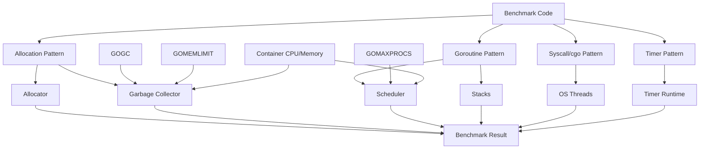
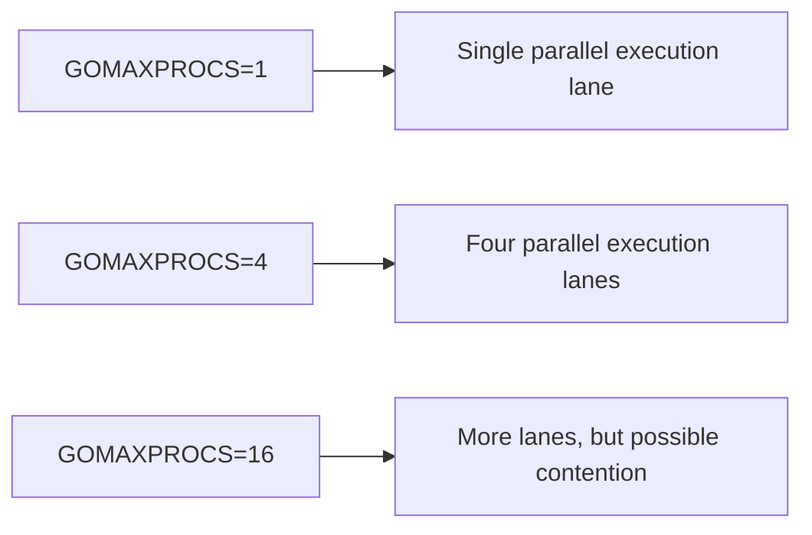
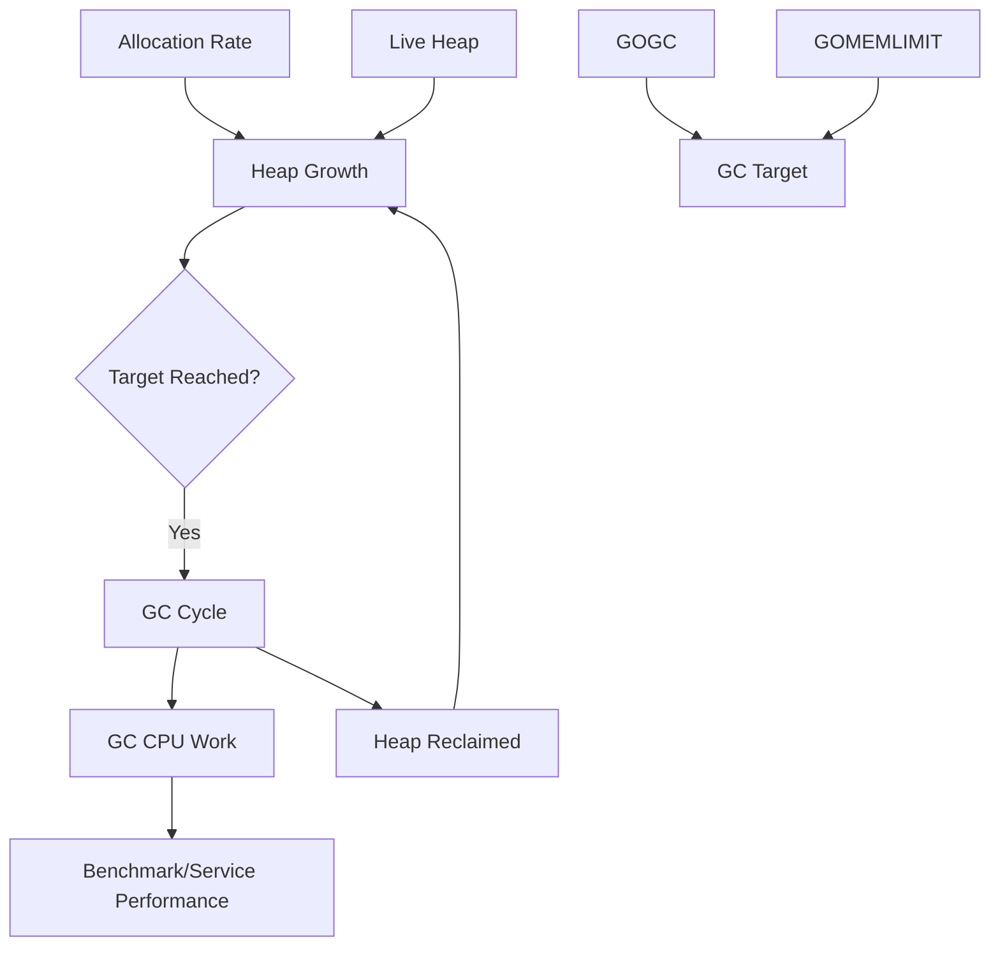

# learn-go-testing-benchmarking-performance-engineering-part-028.md

# Part 028 — Go Runtime Performance Variables for Testers: GC, Scheduler, cgo, Stack, Memory Limit

> Seri: **Go Testing, Benchmarking, Performance Engineering**  
> Target pembaca: **Java Software Engineer → Go Performance-Capable Engineer**  
> Target Go: **Go 1.26.x**  
> Status seri: **Part 028 dari 034**  
> Prasyarat: Part 020–027, seri Go memory system, seri concurrency, seri observability/profiling/troubleshooting.

---

## 0. Tujuan Part Ini

Benchmark dan performance experiment di Go tidak berjalan dalam ruang hampa. Ia dipengaruhi oleh runtime:

- garbage collector,
- scheduler,
- `GOMAXPROCS`,
- `GOGC`,
- `GOMEMLIMIT`,
- stack growth,
- goroutine scheduling,
- cgo,
- syscall,
- timer,
- memory allocator,
- container CPU/memory limit,
- environment variables,
- Go version.

Part ini menjawab:

> Variabel runtime apa yang harus dipahami dan dikontrol agar hasil benchmark/performance test tidak salah dibaca?

Setelah part ini, Anda harus bisa:

1. Menjelaskan peran `GOMAXPROCS`.
2. Menjelaskan dampak `GOGC`.
3. Menjelaskan dampak `GOMEMLIMIT`.
4. Menghubungkan allocation benchmark dengan GC behavior.
5. Memahami scheduler effects dalam benchmark.
6. Memahami stack growth dan goroutine memory.
7. Memahami cgo/syscall overhead dalam eksperimen.
8. Mengontrol environment runtime untuk benchmark.
9. Membaca benchmark dalam konteks container CPU/memory.
10. Membuat runtime experiment yang repeatable dan defensible.

---

## 1. Satu Kalimat Inti

> Hasil benchmark Go adalah hasil interaksi antara kode, workload, compiler, runtime, OS, hardware, dan deployment constraints; runtime variables seperti `GOMAXPROCS`, `GOGC`, dan `GOMEMLIMIT` dapat mengubah hasil secara signifikan.

Jadi saat membandingkan benchmark:

```text
old vs new
```

pastikan runtime context tidak diam-diam berubah.

---

## 2. Mental Model: Go Runtime sebagai Execution Substrate

Aplikasi Go berjalan di atas runtime yang mengelola:

- goroutine scheduling,
- network poller,
- memory allocation,
- garbage collection,
- stack growth,
- timers,
- synchronization primitives,
- panic/recover mechanics,
- cgo interaction,
- profiling/tracing hooks.

Benchmark mengukur kode Anda **plus runtime cost yang muncul akibat kode tersebut**.

Contoh:

```text
High allocation code → allocator + GC cost
Many goroutines → scheduler + stack + synchronization cost
Many timers → timer heap/runtime cost
cgo calls → transition + thread behavior
Blocking syscalls → scheduler handoff behavior
```

---

## 3. Diagram: Runtime Variables Affect Benchmark



---

## 4. `GOMAXPROCS`

`GOMAXPROCS` menentukan jumlah maksimum logical processors, yaitu jumlah thread OS yang dapat menjalankan Go code secara simultan.

Praktis:

```text
GOMAXPROCS = parallel execution capacity for Go code
```

Jika:

```text
GOMAXPROCS=1
```

maka hanya satu thread menjalankan Go code pada satu waktu, walau goroutine banyak.

Jika:

```text
GOMAXPROCS=8
```

runtime dapat menjalankan Go code paralel sampai sekitar 8 P.

---

## 5. `GOMAXPROCS` dan Benchmark Output

Benchmark output:

```text
BenchmarkCacheGetParallel-8
```

Suffix `-8` menunjukkan `GOMAXPROCS`.

Gunakan flag:

```bash
go test -run='^$' -bench=BenchmarkX -cpu=1,2,4,8 ./internal/foo
```

`-cpu` membuat benchmark dijalankan dengan berbagai nilai `GOMAXPROCS`.

---

## 6. Kapan `GOMAXPROCS` Penting?

Penting untuk:

- parallel benchmark,
- lock contention,
- atomic contention,
- scheduler-heavy workload,
- CPU-bound code,
- worker pool,
- concurrent cache,
- goroutine fan-out,
- runtime GC CPU share,
- containerized services.

Kurang penting untuk:

- pure serial microbenchmark,
- IO-bound benchmark yang fake,
- single goroutine parser,
- very small local function.

Namun tetap catat `GOMAXPROCS` agar comparison fair.

---

## 7. `GOMAXPROCS` vs CPU Quota

Di container, CPU limit/request dapat berbeda dari host CPU count.

Misalnya:

```text
Node CPU: 32 cores
Container CPU limit: 2 cores
```

Jika runtime memakai terlalu banyak P, scheduling bisa tidak ideal. Go versi modern semakin container-aware, tetapi engineer tetap harus memverifikasi environment.

Di benchmark/perf report, catat:

```text
Go version:
GOMAXPROCS:
CPU quota/limit:
CPU request:
Node type:
OS/arch:
```

---

## 8. `GOMAXPROCS` Experiment

```bash
go test -run='^$' -bench=BenchmarkAuthorizeParallel -benchmem -cpu=1,2,4,8,16 -count=10 ./internal/authz > cpu.txt
```

Interpretasi:

```text
- improves until 4: parallel scaling
- flat after 4: saturation
- worse after 8: contention/scheduler/cache/GC
```

Jangan hanya melihat default.

---

## 9. Diagram: `GOMAXPROCS` Scaling



---

## 10. Scheduler

Go scheduler memetakan goroutine ke OS threads via P/M/G model secara konseptual:

- G = goroutine,
- M = machine / OS thread,
- P = processor / execution context.

Anda tidak harus menghafal internal detail untuk benchmark, tetapi harus paham dampaknya:

- goroutine tidak selalu langsung running,
- blocking bisa memindahkan work,
- banyak goroutine bisa menambah scheduling overhead,
- `GOMAXPROCS` membatasi parallel Go execution,
- preemption dapat memengaruhi latency,
- goroutine wakeup/park/unpark punya cost.

---

## 11. Scheduler-Sensitive Benchmark

Benchmark ini scheduler-heavy:

```go
func BenchmarkGoroutinePerTask(b *testing.B) {
	for b.Loop() {
		done := make(chan struct{})
		go func() {
			close(done)
		}()
		<-done
	}
}
```

Ini mengukur:

- channel allocation,
- goroutine creation,
- scheduling,
- synchronization.

Valid jika ingin mengukur goroutine-per-task cost. Tidak valid untuk business logic performance.

---

## 12. Benchmark Worker Pool vs Goroutine Per Task

```go
func BenchmarkGoroutinePerTask(b *testing.B) {
	for b.Loop() {
		done := make(chan struct{})
		go func() {
			doSmallWork()
			close(done)
		}()
		<-done
	}
}

func BenchmarkWorkerPoolTask(b *testing.B) {
	pool := NewWorkerPool(runtime.GOMAXPROCS(0))
	defer pool.Close()

	for b.Loop() {
		done := make(chan struct{})
		pool.Submit(func() {
			doSmallWork()
			close(done)
		})
		<-done
	}
}
```

Caveat:

- channel per op may dominate both,
- worker pool submit/wait semantics matter,
- batch benchmark may be more representative.

---

## 13. Scheduler and Blocking

Blocking operations:

- channel send/receive,
- mutex lock,
- network poll,
- syscall,
- time.Sleep,
- select,
- condition wait,
- semaphore acquire.

Benchmark with blocking often measures scheduler and queueing.

Example:

```go
func BenchmarkSemaphoreAcquireReleaseParallel(b *testing.B) {
	sem := make(chan struct{}, 10)

	b.SetParallelism(100)
	b.RunParallel(func(pb *testing.PB) {
		for pb.Next() {
			sem <- struct{}{}
			<-sem
		}
	})
}
```

This measures semaphore contention/backpressure, not just channel operation.

---

## 14. GC: Garbage Collector

Go GC reclaims heap memory.

GC cost depends on:

- allocation rate,
- live heap size,
- pointer density,
- object graph,
- `GOGC`,
- `GOMEMLIMIT`,
- CPU availability,
- workload concurrency,
- Go version/runtime changes.

Benchmark allocation metrics help estimate GC pressure, but GC behavior in production depends on full workload.

---

## 15. Allocation Benchmark to GC Impact

Benchmark:

```text
BenchmarkBuildResponse:
  1 MiB/op
```

Traffic:

```text
100 RPS
```

Allocation rate:

```text
100 MiB/sec
```

High allocation rate likely increases GC work.

But if live heap small and objects die quickly, impact may be manageable. Confirm with load test/runtime metrics.

---

## 16. `GOGC`

`GOGC` controls target heap growth before next GC cycle. Default commonly `100`.

Conceptually:

```text
GOGC=100 → allow heap to grow roughly 100% over live heap before next GC target
GOGC=50  → collect more often, lower memory, more GC CPU
GOGC=200 → collect less often, higher memory, less frequent GC
```

`GOGC=off` disables GC unless memory limit forces collection behavior in modern Go contexts; use only for controlled experiment, not normal service.

---

## 17. `GOGC` Trade-Off

| Lower `GOGC` | Higher `GOGC` |
|---|---|
| lower memory footprint | higher memory footprint |
| more frequent GC | less frequent GC |
| more GC CPU | potentially less GC CPU |
| lower heap growth | higher heap growth |
| may improve memory limit safety | may improve throughput if memory ample |

No universally correct value.

---

## 18. `GOGC` Benchmark Experiment

```bash
GOGC=50 go test -run='^$' -bench=BenchmarkBuildListingPage -benchmem -count=10 ./internal/listing > gogc50.txt
GOGC=100 go test -run='^$' -bench=BenchmarkBuildListingPage -benchmem -count=10 ./internal/listing > gogc100.txt
GOGC=200 go test -run='^$' -bench=BenchmarkBuildListingPage -benchmem -count=10 ./internal/listing > gogc200.txt

benchstat gogc50.txt gogc100.txt gogc200.txt
```

Use when evaluating GC-sensitive workload.

Caveat:

- microbenchmark process may not represent service heap,
- scenario/load test is better for GC tuning,
- don't tune `GOGC` blindly from one benchmark.

---

## 19. `GOMEMLIMIT`

`GOMEMLIMIT` sets a soft memory limit for the Go runtime. It helps runtime adjust GC behavior to keep memory usage around a limit.

Useful in containers where memory limit matters.

Example:

```bash
GOMEMLIMIT=512MiB go test -run='^$' -bench=BenchmarkLargeReport -benchmem ./internal/report
```

In services:

```bash
GOMEMLIMIT=900MiB
```

when container memory limit is 1GiB, leaving room for non-Go memory and overhead.

---

## 20. `GOMEMLIMIT` Trade-Off

If memory limit is tight:

- GC may run more aggressively,
- CPU overhead may rise,
- throughput may drop,
- latency may worsen,
- but OOM risk reduces.

If memory limit too high or unset:

- memory footprint may grow,
- OOM risk in container,
- less GC CPU maybe,
- but worse memory predictability.

---

## 21. `GOMEMLIMIT` Experiment

```bash
GOMEMLIMIT=256MiB go test -run='^$' -bench=BenchmarkLargeReport -benchmem -count=5 ./internal/report > mem256.txt
GOMEMLIMIT=512MiB go test -run='^$' -bench=BenchmarkLargeReport -benchmem -count=5 ./internal/report > mem512.txt
GOMEMLIMIT=1GiB go test -run='^$' -bench=BenchmarkLargeReport -benchmem -count=5 ./internal/report > mem1g.txt

benchstat mem256.txt mem512.txt mem1g.txt
```

Interpret with:

- memory footprint,
- GC CPU,
- benchmark time,
- load test behavior,
- OOM safety margin.

---

## 22. `GOGC` and `GOMEMLIMIT` Interaction

Conceptually:

- `GOGC` defines heap growth target,
- `GOMEMLIMIT` caps memory target pressure,
- runtime balances GC behavior with these constraints.

In memory-constrained container, `GOMEMLIMIT` can dominate.

Performance experiment should record both.

---

## 23. GC Diagram



---

## 24. Measuring GC Influence in Benchmark

Basic benchmark output doesn't show GC cycles.

Options:

- run with `GODEBUG=gctrace=1`,
- use runtime metrics,
- CPU profile,
- heap/alloc profile,
- execution trace,
- load test telemetry.

Example:

```bash
GODEBUG=gctrace=1 go test -run='^$' -bench=BenchmarkLargeReport -benchmem ./internal/report
```

This prints GC traces. It is useful for investigation but noisy for automated benchmark comparison.

---

## 25. `GODEBUG=gctrace=1`

Example output shape:

```text
gc 1 @0.012s 3%: ...
```

Use to see:

- GC frequency,
- heap sizes,
- CPU fraction-ish,
- timing.

Do not parse manually for regular CI unless you build tooling.

For systematic metrics, use runtime metrics/load observability.

---

## 26. Stack Growth

Goroutines start with small stacks that grow/shrink as needed.

Performance implications:

- many goroutines consume stack memory,
- deep recursion can cause stack growth,
- stack growth has cost,
- large stack frames can increase memory,
- goroutine leaks retain stacks.

Benchmarking deep recursion or many goroutines should consider stack behavior.

---

## 27. Stack Growth Benchmark

```go
func recursive(n int) int {
	if n == 0 {
		return 0
	}
	var buf [128]byte
	buf[0] = byte(n)
	return int(buf[0]) + recursive(n-1)
}

func BenchmarkRecursiveDepth(b *testing.B) {
	for _, depth := range []int{10, 100, 1000} {
		b.Run(fmt.Sprintf("depth=%d", depth), func(b *testing.B) {
			for b.Loop() {
				_ = recursive(depth)
			}
		})
	}
}
```

This benchmark may include stack growth effects.

But recursion-heavy Go code should be reviewed carefully anyway.

---

## 28. Goroutine Count and Memory

Many goroutines:

- stack memory,
- scheduler overhead,
- GC root scanning,
- synchronization overhead,
- leak risk.

Benchmark with many goroutines may look okay short-term but production leak can kill memory.

Use tests for goroutine lifecycle and observability for production.

---

## 29. Timers

Timers are runtime-managed.

Heavy timer usage:

- `time.After` in loop,
- `context.WithTimeout` per operation,
- retry timers,
- rate limiter timers,
- scheduled jobs.

Bad hot loop:

```go
for b.Loop() {
	select {
	case <-time.After(time.Millisecond):
	case <-ctx.Done():
	}
}
```

This allocates/creates timers and waits.

If measuring timeout context overhead:

```go
func BenchmarkContextWithTimeout(b *testing.B) {
	for b.Loop() {
		ctx, cancel := context.WithTimeout(context.Background(), time.Second)
		cancel()
		_ = ctx
	}
}
```

If not measuring timer cost, create context outside loop.

---

## 30. `context.WithTimeout` Benchmark Trap

Bad if measuring service logic:

```go
func BenchmarkAuthorize(b *testing.B) {
	engine := newEngine()

	for b.Loop() {
		ctx, cancel := context.WithTimeout(context.Background(), time.Second)
		_, _ = engine.Authorize(ctx, req)
		cancel()
	}
}
```

This includes timeout context/timer cost.

Better:

```go
ctx := context.Background()
for b.Loop() {
	_, _ = engine.Authorize(ctx, req)
}
```

Also create explicit benchmark:

```text
BenchmarkAuthorizeWithTimeoutContext
```

if production creates timeout per operation.

---

## 31. cgo

cgo allows Go to call C. It has performance implications:

- call transition overhead,
- thread affinity concerns,
- blocking behavior,
- stack switching,
- scheduler interaction,
- pointer passing rules,
- memory outside Go heap,
- profiling complexity.

Benchmark cgo call separately if used in hot path.

---

## 32. cgo Benchmark Shape

Conceptual:

```go
func BenchmarkCgoCall(b *testing.B) {
	for b.Loop() {
		C.some_function()
	}
}
```

But cgo setup requires actual C import. Key point:

- isolate call overhead,
- benchmark realistic batch sizes,
- avoid crossing Go/C boundary per tiny item if batch possible.

If production can batch:

```text
BenchmarkCgoPerItem
BenchmarkCgoBatch100
BenchmarkPureGo
```

Crossing boundary per item often expensive.

---

## 33. Syscalls

Syscalls cross user/kernel boundary.

Examples:

- file read/write,
- socket operations,
- clock calls,
- process operations,
- environment operations,
- random device reads.

Syscall-heavy benchmark is OS-dependent and noisier.

If measuring pure CPU logic, avoid syscalls in loop.

---

## 34. Network Poller

Go network IO uses runtime network poller.

Benchmark with `httptest.Server` or real sockets includes:

- netpoll,
- goroutine scheduling,
- kernel loopback,
- socket buffers,
- HTTP parsing,
- TLS if enabled.

Use this intentionally for scenario benchmark, not microbenchmark.

---

## 35. Memory Allocator

Allocation-heavy code hits Go allocator.

Patterns that affect allocator:

- many small objects,
- large object allocations,
- per-P caches,
- pointer-rich objects,
- sync.Pool,
- slice/map growth,
- string/byte conversion.

Allocation benchmark captures some signals. But allocator behavior under concurrency can differ.

Use serial + parallel benchmarks when allocation hot path is concurrent.

---

## 36. Map Runtime Behavior

Maps involve hashing, buckets, growth, randomized seed/iteration behavior.

Benchmark map operations carefully:

- size matters,
- hit/miss ratio matters,
- key distribution matters,
- growth must be controlled,
- iteration order not stable,
- concurrent map requires synchronization.

Map-heavy code may show different behavior with different input sizes.

---

## 37. Strings and UTF-8

String operations can differ depending:

- ASCII vs Unicode,
- byte length vs rune count,
- normalization,
- case folding,
- allocation,
- substring retention,
- conversion to `[]byte`.

Benchmark valid ASCII only if production is ASCII-only. Otherwise include Unicode/invalid cases.

---

## 38. Environment Variables for Runtime Experiments

Important variables:

| Variable | Use |
|---|---|
| `GOMAXPROCS` | control parallel execution |
| `GOGC` | GC target percentage |
| `GOMEMLIMIT` | soft memory limit |
| `GODEBUG` | runtime debug knobs/traces |
| `GOTRACEBACK` | traceback detail |
| `GOOS`, `GOARCH` | target platform via build/env |
| `CGO_ENABLED` | cgo on/off |
| `GOFLAGS` | global go command flags, dangerous if hidden |

Always check hidden `GOFLAGS`.

```bash
go env GOFLAGS
```

---

## 39. Hidden `GOFLAGS`

If developer has:

```bash
GOFLAGS=-race
```

or:

```bash
GOFLAGS=-tags=debug
```

benchmark comparison can be invalid.

Record:

```bash
go env GOFLAGS
```

For controlled scripts, unset or explicitly set environment.

---

## 40. Runtime Experiment Report Template

```text
Runtime Experiment:
  Question:
  Benchmark:
  Go version:
  OS/arch:
  CPU:
  Container CPU/memory:
  GOMAXPROCS:
  GOGC:
  GOMEMLIMIT:
  GODEBUG:
  Command:
  Samples:
  Result:
  Interpretation:
  Decision:
```

---

## 41. Container-Aware Benchmarking

Benchmark in container if production runs in container and resource constraints matter.

But container benchmark can be noisy.

Record:

- CPU quota,
- memory limit,
- cgroup version,
- node type,
- container runtime,
- whether other workloads share node,
- pod CPU request/limit,
- Go version.

For performance-critical services, use dedicated perf environment.

---

## 42. CPU Limit and Throttling

Container CPU limit can cause throttling.

Symptoms:

- latency spikes,
- throughput lower than expected,
- CPU usage appears at limit,
- run queue/wait,
- benchmark noisy.

Benchmark on unconstrained laptop can overestimate production capacity.

---

## 43. Memory Limit and OOM

If Go heap grows beyond container memory:

- GC may fight memory pressure,
- process may OOMKill,
- latency may spike,
- benchmark may pass locally but fail in pod.

Use `GOMEMLIMIT` and load tests for memory-sensitive workloads.

---

## 44. Go Version as Runtime Variable

Go version changes:

- compiler optimization,
- inlining,
- escape analysis,
- GC behavior,
- scheduler behavior,
- standard library performance,
- runtime defaults,
- benchmark APIs.

Do not compare benchmark across Go versions unless Go version is the experiment.

---

## 45. Go 1.26 Runtime Notes for This Series

For Go 1.26.x target, pay attention to release notes relevant to:

- runtime GC behavior,
- scheduler/runtime changes,
- benchmark tooling changes,
- `testing` package changes,
- profile/diagnostic additions,
- standard library performance changes.

When upgrading Go minor/major version:

1. run correctness suite,
2. run benchmark suite,
3. compare with `benchstat`,
4. run scenario/load test for critical services,
5. review runtime release notes.

---

## 46. Runtime Variables and PGO

PGO can change compiler decisions:

- inlining,
- devirtualization opportunities,
- hot path layout,
- call cost.

If benchmarking PGO, runtime variables must still be stable.

Compare:

```bash
go test -run='^$' -bench=. -benchmem -count=10 -pgo=off ./... > nopgo.txt
go test -run='^$' -bench=. -benchmem -count=10 -pgo=auto ./... > pgo.txt
benchstat nopgo.txt pgo.txt
```

PGO is covered in Part 029.

---

## 47. Runtime Variables and Race Detector

Race detector changes execution dramatically.

Use:

```bash
go test -race
```

for correctness. Do not use `-race` benchmark as performance baseline.

If race detector finds issue in benchmark, benchmark result was invalid.

---

## 48. Runtime Variables and Coverage

Coverage instrumentation changes execution.

Do not compare coverage benchmark with normal benchmark.

Use coverage for test quality, not performance.

---

## 49. Runtime Variables and Profiles

CPU/heap profiles can add overhead and change behavior slightly.

Use profile run for diagnosis:

```bash
go test -run='^$' -bench=BenchmarkX -benchtime=10s -cpuprofile=cpu.out ./internal/foo
```

Use benchmark run without profile for final comparison.

---

## 50. Practical Runtime Control Commands

```bash
# Check Go version.
go version

# Check core env.
go env GOOS GOARCH GOFLAGS

# Run with specific GOMAXPROCS.
GOMAXPROCS=4 go test -run='^$' -bench=BenchmarkX -benchmem ./internal/foo

# CPU matrix via go test.
go test -run='^$' -bench=BenchmarkX -benchmem -cpu=1,2,4,8 ./internal/foo

# Run with GC target.
GOGC=50 go test -run='^$' -bench=BenchmarkX -benchmem ./internal/foo

# Run with memory limit.
GOMEMLIMIT=512MiB go test -run='^$' -bench=BenchmarkX -benchmem ./internal/foo

# GC trace.
GODEBUG=gctrace=1 go test -run='^$' -bench=BenchmarkX -benchmem ./internal/foo

# Disable cgo if comparing pure-Go build, if supported.
CGO_ENABLED=0 go test -run='^$' -bench=. -benchmem ./...
```

PowerShell examples:

```powershell
$env:GOMAXPROCS="4"
go test -run='^$' -bench=BenchmarkX -benchmem ./internal/foo
Remove-Item Env:\GOMAXPROCS
```

```powershell
$env:GOGC="50"
go test -run='^$' -bench=BenchmarkX -benchmem ./internal/foo
Remove-Item Env:\GOGC
```

---

## 51. Runtime Matrix Experiment

For GC-sensitive benchmark:

```bash
for gc in 50 100 200; do
  GOGC=$gc go test -run='^$' -bench=BenchmarkLargeResponse -benchmem -count=10 ./internal/response > "gogc_${gc}.txt"
done

benchstat gogc_50.txt gogc_100.txt gogc_200.txt
```

For CPU scaling:

```bash
go test -run='^$' -bench=BenchmarkCacheParallel -benchmem -cpu=1,2,4,8,16 -count=10 ./internal/cache > cpu_matrix.txt
```

For memory limit:

```bash
for limit in 256MiB 512MiB 1GiB; do
  GOMEMLIMIT=$limit go test -run='^$' -bench=BenchmarkReport -benchmem -count=5 ./internal/report > "mem_${limit}.txt"
done
```

---

## 52. Case Study: High Allocation Listing Page

Benchmark:

```text
BenchmarkBuildListingPage100Cases:
  3 ms/op
  5 MiB/op
  80k allocs/op
```

Experiment:

```bash
GOGC=50
GOGC=100
GOGC=200
```

Possible results:

```text
GOGC=50:  3.8 ms/op, memory lower
GOGC=100: 3.0 ms/op
GOGC=200: 2.7 ms/op, memory higher
```

Interpretation:

- higher GOGC improves benchmark time by reducing GC frequency,
- but memory footprint may be unacceptable,
- better fix may be allocation reduction,
- validate with load test under pod memory limit.

---

## 53. Case Study: Parallel Cache Scaling

Benchmark:

```bash
go test -run='^$' -bench=BenchmarkPermissionCacheParallel -benchmem -cpu=1,2,4,8,16 ./internal/authz
```

Result:

```text
1 CPU: 20 ns/op
2 CPU: 18 ns/op
4 CPU: 30 ns/op
8 CPU: 80 ns/op
16 CPU: 150 ns/op
```

Interpretation:

- cache has contention,
- adding CPU worsens due to lock/cache line bouncing,
- investigate shared lock/hot key,
- benchmark sharded/immutable alternative,
- run production-like workload.

---

## 54. Case Study: Container Mismatch

Local benchmark:

```text
GOMAXPROCS=16
BenchmarkSubmitCaseParallel:
  1 ms/op
```

Production pod:

```text
CPU limit = 2
GOMAXPROCS effective = 2
```

Benchmark with:

```bash
go test -run='^$' -bench=BenchmarkSubmitCaseParallel -benchmem -cpu=2 ./internal/case
```

Maybe:

```text
3 ms/op
```

Do not size production from 16-core laptop result.

---

## 55. Runtime Variable Checklist

### 55.1 Before Benchmark

- [ ] `go version` recorded.
- [ ] `go env GOOS GOARCH GOFLAGS` recorded.
- [ ] `GOMAXPROCS` known.
- [ ] `GOGC` known.
- [ ] `GOMEMLIMIT` known.
- [ ] container CPU/memory known if relevant.
- [ ] race/coverage disabled unless intentional.
- [ ] cgo state known if relevant.
- [ ] benchmark workload deterministic.

### 55.2 During Benchmark

- [ ] Use `-benchmem`.
- [ ] Use `-count` for comparison.
- [ ] Use `-cpu` for parallel/scaling.
- [ ] Avoid changing runtime env between old/new unless intentional.
- [ ] Record command.

### 55.3 After Benchmark

- [ ] Interpret allocation with GC context.
- [ ] Interpret parallel result with `GOMAXPROCS`.
- [ ] Check whether runtime variable caused observed delta.
- [ ] Validate important changes with scenario/load test.
- [ ] Document runtime context in PR/perf report.

---

## 56. Anti-Patterns

### 56.1 Comparing Different `GOMAXPROCS`

Invalid unless experiment is CPU scaling.

### 56.2 Ignoring Container Limits

Laptop benchmark used for pod sizing.

### 56.3 Tuning `GOGC` Instead of Fixing Allocation

Sometimes valid, often masking bad allocation.

### 56.4 Setting `GOGC=off` and Claiming Performance

Not production-realistic for services.

### 56.5 Forgetting Hidden `GOFLAGS`

Accidental `-race`, tags, or flags.

### 56.6 Treating GC Trace as Benchmark Result

GC trace is diagnostic, not benchmark summary.

### 56.7 Benchmarking With Profiles and Comparing to Non-Profile Runs

Invalid.

### 56.8 Ignoring Go Version

Compiler/runtime changes matter.

### 56.9 Using `time.Sleep` to Simulate Latency in CPU Benchmark

Dominates measurement.

### 56.10 Ignoring cgo/syscall Boundary

Cross-boundary cost can dominate tiny operations.

---

## 57. Practical Rules of Thumb

1. Always record Go version and runtime environment.
2. Use `-cpu` for parallel benchmark.
3. Treat `GOMAXPROCS` as part of benchmark configuration.
4. Use `GOGC` experiments only when allocation/GC is relevant.
5. Use `GOMEMLIMIT` experiments for container memory-sensitive workloads.
6. Do not compare benchmark with different runtime env unless that is the experiment.
7. Benchmark under production-like CPU/memory constraints for capacity decisions.
8. Use GC traces/profiles for diagnosis, not final benchmark comparison.
9. Avoid syscalls/cgo/timers in microbenchmark unless intentional.
10. Validate runtime tuning with load test before production.
11. Prefer reducing unnecessary allocation over simply raising memory/GC thresholds.
12. Avoid magic runtime settings without documented reason.

---

## 58. Mini Exercise 1: Detect Invalid Comparison

Old:

```bash
GOMAXPROCS=8 go test -bench=BenchmarkCache -benchmem -count=10 ./internal/cache > old.txt
```

New:

```bash
GOMAXPROCS=2 go test -bench=BenchmarkCache -benchmem -count=10 ./internal/cache > new.txt
```

Can we compare?

No, unless question is specifically about `GOMAXPROCS` difference. For code change comparison, invalid.

---

## 59. Mini Exercise 2: Allocation and GOGC

Benchmark:

```text
BenchmarkBuildReport:
  500 MiB/op
```

Options:

1. Increase `GOGC`.
2. Add `GOMEMLIMIT`.
3. Reduce allocation.
4. Limit concurrency.

Best answer likely combines:

- reduce allocation if possible,
- limit concurrent reports,
- set sensible `GOMEMLIMIT`,
- validate `GOGC`,
- load test memory behavior.

---

## 60. Mini Exercise 3: CPU Matrix Interpretation

Result:

```text
BenchmarkX      100 ns/op
BenchmarkX-2     60 ns/op
BenchmarkX-4     40 ns/op
BenchmarkX-8     45 ns/op
BenchmarkX-16    80 ns/op
```

Interpretation:

- scales until 4,
- saturates/worsens beyond 4,
- likely contention/memory bandwidth/scheduler overhead,
- production pod with 4 CPU may be sweet spot,
- investigate before scaling to 16 CPU.

---

## 61. What to Remember

1. Runtime variables are part of benchmark context.
2. `GOMAXPROCS` controls parallel Go execution.
3. Use `-cpu` for scalability analysis.
4. `GOGC` trades memory for GC frequency/CPU.
5. `GOMEMLIMIT` matters in containers.
6. Allocation benchmark must be interpreted with GC behavior.
7. Scheduler effects matter for goroutine-heavy benchmarks.
8. Stack growth and goroutine count affect memory/performance.
9. cgo/syscalls can dominate small operations.
10. Race/coverage/profile modes are not normal performance baselines.
11. Go version changes compiler/runtime behavior.
12. Container CPU/memory constraints must be represented for capacity decisions.
13. Runtime tuning is not substitute for good workload/code design.
14. Always document runtime env in performance reports.

---

## 62. References

Official and primary sources:

- Go `runtime` package documentation: <https://pkg.go.dev/runtime>
- Go `testing` package documentation: <https://pkg.go.dev/testing>
- Go command documentation: <https://pkg.go.dev/cmd/go>
- Go diagnostics documentation: <https://go.dev/doc/diagnostics>
- Go garbage collector guide: <https://go.dev/doc/gc-guide>
- Go runtime environment variables: <https://pkg.go.dev/runtime#hdr-Environment_Variables>
- Go execution tracer: <https://pkg.go.dev/runtime/trace>
- Go blog — More predictable benchmarking with `testing.B.Loop`: <https://go.dev/blog/testing-b-loop>
- `benchstat`: <https://pkg.go.dev/golang.org/x/perf/cmd/benchstat>

---

## 63. Next Part

Part berikutnya:

```text
learn-go-testing-benchmarking-performance-engineering-part-029.md
```

Judul:

```text
Profile-Guided Optimization / PGO in Engineering Workflow
```

Kita akan membahas:

- apa itu PGO,
- representative profile,
- `default.pgo`,
- `-pgo`,
- benchmark before/after,
- stale profile risk,
- CI validation,
- rollout strategy,
- dan kapan PGO layak atau tidak layak dipakai.

---

## Status Seri

```text
Part 028 dari 034 selesai.
Seri belum selesai.
```


<!-- NAVIGATION_FOOTER -->
<div class="page-nav">
<a href="./learn-go-testing-benchmarking-performance-engineering-part-027.md">⬅️ Part 027 — Performance Engineering Mental Model: Latency, Throughput, Utilization, Saturation, Cost</a>
<a href="./index.md">📚 Kategori</a>
<a href="../../index.md">🏠 Home</a>
<a href="./learn-go-testing-benchmarking-performance-engineering-part-029.md">Part 029 — Profile-Guided Optimization / PGO in Engineering Workflow ➡️</a>
</div>
