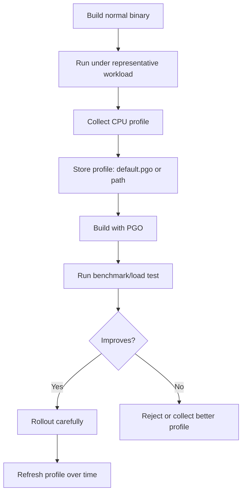
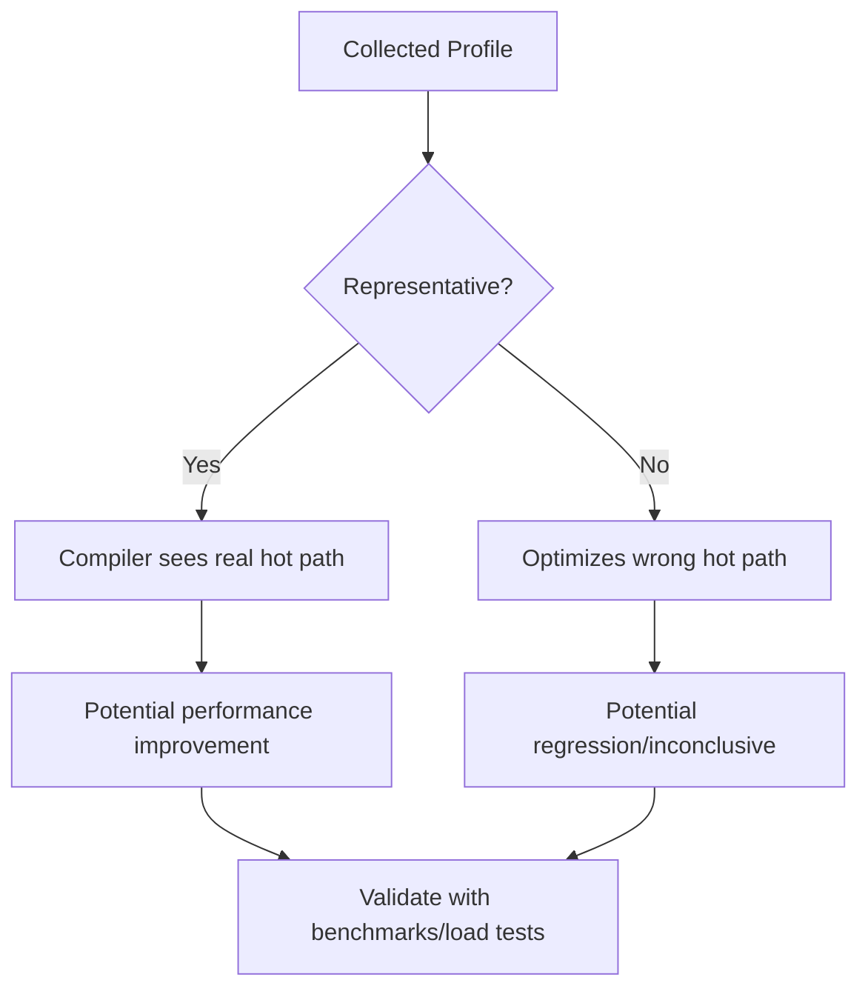
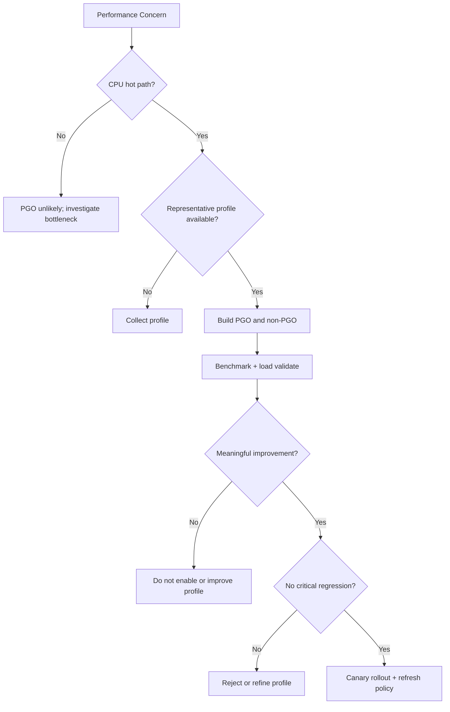

# learn-go-testing-benchmarking-performance-engineering-part-029.md

# Part 029 — Profile-Guided Optimization / PGO in Engineering Workflow

> Seri: **Go Testing, Benchmarking, Performance Engineering**  
> Target pembaca: **Java Software Engineer → Go Performance-Capable Engineer**  
> Target Go: **Go 1.26.x**  
> Status seri: **Part 029 dari 034**  
> Prasyarat: Part 020–028, seri observability/profiling/troubleshooting, dan pemahaman dasar CPU profiling.

---

## 0. Tujuan Part Ini

Part ini membahas **Profile-Guided Optimization (PGO)** dalam workflow engineering Go.

PGO sering terdengar seperti “compiler magic”: ambil profile, build ulang, binary lebih cepat.

Tetapi engineer senior harus memahami:

1. Apa itu PGO.
2. Apa yang PGO optimalkan.
3. Apa yang PGO tidak bisa selesaikan.
4. Bagaimana mendapatkan profile representatif.
5. Bagaimana memakai `default.pgo`.
6. Bagaimana memakai flag `-pgo`.
7. Bagaimana membandingkan build PGO vs non-PGO.
8. Apa risiko stale atau biased profile.
9. Bagaimana menaruh PGO dalam CI/CD.
10. Bagaimana rollout PGO secara aman.
11. Kapan PGO layak dipakai.
12. Kapan PGO hanya menambah complexity tanpa value.

Part ini bukan pengganti profiling series. Di sini fokusnya adalah **PGO as engineering workflow**.

---

## 1. Satu Kalimat Inti

> PGO menggunakan profile runtime yang representatif untuk membantu compiler mengoptimalkan hot path, tetapi kualitas hasilnya sangat bergantung pada kualitas profile dan validasi benchmark/load test setelah build.

PGO bukan:

- pengganti algoritma yang baik,
- pengganti profiling,
- pengganti load test,
- solusi untuk bottleneck DB/downstream,
- solusi untuk allocation buruk secara otomatis,
- solusi untuk correctness bug,
- alasan mengabaikan benchmark statistik.

PGO adalah optimization layer.

---

## 2. Apa Itu PGO?

Profile-Guided Optimization adalah teknik compiler optimization yang memakai data runtime profile untuk mengetahui bagian program yang sering dieksekusi.

Compiler biasa mengoptimalkan berdasarkan source code dan heuristik.

Dengan PGO, compiler mendapat tambahan informasi:

```text
Function/method mana yang hot?
Call edge mana yang sering terjadi?
Interface call mana yang sering menuju concrete type tertentu?
Path mana yang penting untuk di-inline/devirtualize?
```

Dengan informasi itu, compiler dapat membuat keputusan lebih baik.

---

## 3. Diagram: PGO Loop



---

## 4. Go PGO Support: Practical Overview

Go supports profile-guided optimization through the `-pgo` flag on build-related commands. The Go documentation describes `-pgo=auto` behavior: when a `default.pgo` file is present in the main package directory, the Go command can use it automatically; `-pgo=off` disables PGO; and a specific profile path can be passed directly with `-pgo=/path/to/profile.pprof`.

Typical:

```bash
go build ./cmd/api
```

If `./cmd/api/default.pgo` exists and `-pgo=auto` applies, build can use it.

Explicit:

```bash
go build -pgo=./profiles/api.pprof ./cmd/api
```

Disable:

```bash
go build -pgo=off ./cmd/api
```

---

## 5. Historical Context

PGO was introduced as a preview in Go 1.20, became ready for general use in Go 1.21, and has continued improving in later releases, including build overhead improvements and devirtualization/inlining improvements. Go 1.22 release notes mention PGO builds improving devirtualization and typical runtime improvements for representative programs, and Go 1.23 release notes mention significantly reduced build-time overhead for PGO builds.

Practical lesson:

> PGO behavior is tied to Go version. Re-benchmark after Go upgrades.

---

## 6. What PGO Can Optimize

PGO can help with:

- better inlining decisions,
- devirtualization of hot interface calls,
- call graph hot path prioritization,
- code layout decisions,
- reducing overhead in frequently executed paths,
- making compiler heuristics closer to actual workload.

Example:

```go
type Authorizer interface {
	Authorize(context.Context, Request) (Decision, error)
}
```

Without PGO, compiler may not know which concrete implementation is hot.

With PGO, if profile shows most calls go to `*RBACAuthorizer`, compiler may optimize that path better.

---

## 7. What PGO Usually Cannot Fix

PGO will not fix:

- N+1 database query,
- bad algorithmic complexity,
- huge allocation from bad API design,
- DB pool saturation,
- network latency,
- lock contention caused by poor design,
- missing cache invalidation,
- excessive JSON payload,
- slow downstream dependency,
- unbounded queue,
- memory leak,
- data race,
- correctness bug.

If bottleneck is outside CPU hot path, PGO may not help much.

---

## 8. PGO as Last-Mile Optimization

PGO is often best after:

1. correctness is solid,
2. profiling identifies CPU-heavy code,
3. obvious algorithmic issues fixed,
4. unnecessary allocation reduced,
5. workload model understood,
6. benchmark/load test exists,
7. deployment can validate binary safely.

Do not start with PGO if you have not measured bottleneck.

---

## 9. PGO vs Manual Optimization

Manual optimization:

- redesign algorithm,
- reduce allocations,
- precompute,
- change data structure,
- remove reflection,
- avoid unnecessary parsing,
- reduce lock contention.

PGO:

- helps compiler optimize existing code layout/hot paths,
- often low source-code risk,
- can improve performance without manual code complexity,
- but requires profile management.

In many cases, PGO is a safer first attempt than complex unsafe micro-optimization.

---

## 10. PGO Workflow Overview

```text
1. Choose binary/main package.
2. Collect representative CPU profile.
3. Store as default.pgo or profile path.
4. Build with PGO.
5. Benchmark PGO vs non-PGO.
6. Run correctness tests.
7. Run scenario/load tests.
8. Roll out with monitoring/canary.
9. Refresh profile periodically.
```

---

## 11. Representative Profile

Representative profile is the heart of PGO.

Bad profile:

```text
Only startup
Only health check
Only admin endpoint
Only synthetic tiny request
Only one rare flow
Only local developer traffic
Only warm cache when production has misses
```

Good profile:

```text
Production-like endpoint mix
Realistic payload sizes
Common + expensive paths
Representative cache hit/miss
Representative concurrency
Enough duration
Sanitized/no sensitive data concerns
Collected from stable version
```

PGO optimizes what the profile says is hot, not what you wish were hot.

---

## 12. Profile Bias

If profile is biased, PGO may optimize wrong path.

Example:

```text
Profile:
  90% case listing
  10% submit case

Production:
  40% listing
  40% detail
  20% submit
```

PGO build may improve listing but not submit/detail, or even slightly regress other paths.

This is why validation must include all critical scenarios.

---

## 13. Diagram: Profile Quality



---

## 14. How to Collect CPU Profile

Common ways:

1. production/debug endpoint with `net/http/pprof`,
2. load test environment with pprof enabled,
3. benchmark harness with `-cpuprofile`,
4. controlled performance environment.

Example benchmark profile:

```bash
go test -run='^$' -bench=BenchmarkCaseServiceMixedRequests -benchtime=30s -cpuprofile=cpu.pprof ./internal/case
```

This creates a CPU profile from benchmark execution.

But benchmark profile may not represent production. Use it for PGO only if benchmark workload is intentionally representative.

---

## 15. Collecting Profile from Service

Common service setup:

```go
import _ "net/http/pprof"
```

Then expose pprof on internal/debug server only.

Example conceptual:

```go
go func() {
	_ = http.ListenAndServe("127.0.0.1:6060", nil)
}()
```

Collect:

```bash
go tool pprof -seconds=60 http://127.0.0.1:6060/debug/pprof/profile
```

This downloads CPU profile.

Security warning:

- do not expose pprof publicly,
- restrict network access,
- ensure profile collection policy,
- beware sensitive function names/paths in profiles,
- production profiling has overhead but often acceptable when controlled.

---

## 16. Profile Duration

Too short:

```text
5 seconds
```

may miss important paths.

Common starting point:

```text
30–120 seconds
```

Depends on workload.

For low-traffic service, collect during load test or longer window.

Profile should capture enough samples for hot path signal.

---

## 17. CPU Profile, Not Heap Profile

PGO primarily uses CPU profiles.

Heap profiles answer memory questions, but PGO expects profile data relevant to CPU hot paths.

Do not feed random profile type and expect useful optimization.

---

## 18. `default.pgo`

The simplest workflow:

```text
cmd/api/
  main.go
  default.pgo
```

Build:

```bash
go build ./cmd/api
```

With default PGO auto behavior, the Go command can use `default.pgo`.

Benefits:

- simple,
- profile versioned with source,
- build command unchanged in many workflows,
- profile colocated with main package.

Risks:

- profile file can be large,
- stale profile can remain unnoticed,
- one profile may not fit all deployment modes,
- source repo may not want generated binary artifacts,
- profile review/governance needed.

---

## 19. Explicit `-pgo` Path

If you do not want profile in main package:

```bash
go build -pgo=./profiles/api-prod.pprof ./cmd/api
```

Benefits:

- separate profile artifact,
- can select per environment,
- easier CI artifact management,
- avoid committing profile to source.

Risks:

- build command more complex,
- profile path must be available,
- reproducibility requires artifact governance.

---

## 20. Disable PGO

```bash
go build -pgo=off ./cmd/api
```

Useful for:

- comparison,
- debugging,
- isolating PGO-related regression,
- emergency rollback,
- CI A/B experiment.

---

## 21. PGO A/B Benchmark

Compare same code, same Go version, same workload:

```bash
go test -run='^$' -bench=. -benchmem -count=10 -pgo=off ./internal/case > nopgo.txt
go test -run='^$' -bench=. -benchmem -count=10 -pgo=auto ./internal/case > pgo.txt

benchstat nopgo.txt pgo.txt
```

Caveat:

- package benchmark PGO behavior depends on available profile and package/main context,
- for final binary, benchmark built binary or use scenario/load test against built artifact.

For application binary:

```bash
go build -pgo=off -o api-nopgo ./cmd/api
go build -pgo=./profiles/api.pprof -o api-pgo ./cmd/api
```

Then run same load/scenario tests against both.

---

## 22. PGO Build Verification

Log build mode in CI:

```bash
go version
go env GOOS GOARCH GOFLAGS
go build -x -pgo=./profiles/api.pprof ./cmd/api
```

You do not always need `-x`, but for debugging build behavior it helps.

Also ensure:

- profile file exists,
- correct main package,
- expected `-pgo` flag,
- no hidden `GOFLAGS=-pgo=off`,
- reproducible artifact metadata.

---

## 23. PGO and Tests

Run correctness tests with and without PGO if risk-sensitive:

```bash
go test -pgo=off ./...
go test -pgo=auto ./...
```

In principle PGO should not change semantics. But compiler optimizations can expose latent undefined-ish unsafe assumptions, races, or brittle tests.

If PGO build changes behavior, treat as serious bug.

---

## 24. PGO and Benchmarks

PGO can change benchmark results by:

- improving hot path,
- changing inlining,
- changing escape behavior,
- changing code layout,
- changing interface call optimization,
- sometimes regressing cold paths.

Always compare:

```text
time/op
B/op
allocs/op
```

Do not assume PGO only affects time. Inlining and escape changes may affect allocation.

---

## 25. PGO and Interface Dispatch

PGO can help when profile identifies hot concrete types behind interface calls.

Example:

```go
type PolicyEvaluator interface {
	Evaluate(context.Context, Request) (Decision, error)
}

func Check(ctx context.Context, e PolicyEvaluator, req Request) (Decision, error) {
	return e.Evaluate(ctx, req)
}
```

If profile shows `*RBACEvaluator` dominates, compiler may optimize hot call better.

Benchmark:

```text
BenchmarkCheckViaInterface/RBAC
BenchmarkCheckViaInterface/ABAC
BenchmarkCheckViaInterface/Mixed
```

Validate mixed workloads because profile bias can favor one concrete type.

---

## 26. PGO and Inlining

Inlining is often beneficial because it enables:

- removing call overhead,
- constant propagation,
- better bounds check elimination,
- better escape analysis,
- simpler hot path.

PGO can guide compiler to inline hot functions that are worth it and avoid less useful choices.

But too much inlining can increase binary size or shift performance.

Trust measurement, not assumption.

---

## 27. PGO and Binary Size

PGO may affect binary size.

Track:

```bash
ls -lh api-nopgo api-pgo
```

Large binary size changes can affect:

- deployment artifact size,
- cold start,
- instruction cache behavior,
- container image size,
- memory mapping.

Usually not the main concern, but record if significant.

---

## 28. PGO and Build Time

PGO can affect build time. Later Go releases improved PGO build overhead, but CI should still track build time if it matters.

Metrics:

```text
build time no PGO
build time PGO
binary size no PGO
binary size PGO
runtime benchmark/load result
```

A small runtime improvement with large build complexity may not be worth it.

---

## 29. PGO and Stale Profiles

A profile becomes stale when code/workload changes.

Examples:

- new endpoint added,
- authorization engine rewritten,
- traffic mix changed,
- feature flag flips,
- cache behavior changes,
- DB query moved,
- old hot path removed,
- service split,
- Go version changed.

Stale profile may still work, but benefit can disappear or become biased.

---

## 30. Profile Refresh Policy

Define:

```text
Refresh PGO profile:
  every major release,
  after major traffic/workload change,
  after major performance-sensitive refactor,
  after Go version upgrade,
  when benchmark benefit drops,
  quarterly for critical services.
```

Do not refresh blindly from one anomalous traffic period.

---

## 31. Profile Governance

If committing `default.pgo`:

- who approves profile update?
- how was it collected?
- from what commit?
- what workload?
- how long?
- what environment?
- does it contain sensitive metadata?
- what benchmark/load test proves benefit?
- how large is the file?

Add metadata file:

```text
cmd/api/default.pgo.meta.md
```

Example:

```text
Source:
  collected from staging load test 2026-06-20
  commit abc123
  duration 120s
  workload: listing 50%, detail 30%, submit 20%
  Go version: go1.26.x
Validation:
  benchstat nopgo vs pgo attached
  load test p95 improved 7%
```

---

## 32. PGO Profile Security

Profiles may contain:

- function names,
- package paths,
- endpoints indirectly,
- internal architecture hints,
- sometimes labels if used,
- workload shape.

They should not contain request body by default CPU profile, but treat profile artifacts as internal engineering artifacts.

Do not publish profiles carelessly.

---

## 33. PGO in Monorepo

For monorepo with multiple binaries:

```text
cmd/api/default.pgo
cmd/worker/default.pgo
cmd/admin/default.pgo
```

Each binary needs its own representative profile.

Do not use API profile for worker binary unless intentionally shared and validated.

---

## 34. PGO for Libraries

PGO applies at build of final binary. Library packages do not usually carry their own independent production profile unless part of build context.

For library-heavy codebase:

- collect profile from application using library,
- build application with PGO,
- benchmark library through application-representative workload,
- avoid optimizing library for one consumer if library has many different usage patterns unless documented.

---

## 35. PGO with Multiple Workload Modes

One binary may serve different modes:

```text
API mode
batch mode
admin/report mode
```

A single profile may not represent all.

Options:

1. one blended profile,
2. separate binaries,
3. explicit `-pgo` profile per deployment,
4. no PGO if profile conflict too high,
5. validate all critical modes.

---

## 36. Blended Profile

Blended profile should approximate production mix.

Example:

```text
60% API listing/detail
30% submit/update
10% report/admin
```

If rare report path has strict latency needs, ensure benchmark validates it even if profile underrepresents it.

---

## 37. PGO Experiment Design

Template:

```text
Question:
  Does PGO improve API binary under representative workload?

Profile:
  Source:
  Duration:
  Workload:
  Commit:
  Go version:

Builds:
  nopgo:
  pgo:

Validation:
  unit/integration tests:
  microbenchmarks:
  scenario benchmarks:
  load test:
  binary size:
  build time:

Decision:
  enable/disable/collect better profile
```

---

## 38. PGO Benchmark Matrix

For service:

```text
BenchmarkCaseService/
  ListingSmall
  ListingLarge
  DetailSmall
  DetailLarge
  SubmitSmall
  SubmitLarge
  AuthorizationMixed
  JSONEncodeLarge
```

Run:

```bash
go test -run='^$' -bench=BenchmarkCaseService -benchmem -count=10 -pgo=off ./internal/case > nopgo.txt
go test -run='^$' -bench=BenchmarkCaseService -benchmem -count=10 -pgo=auto ./internal/case > pgo.txt
benchstat nopgo.txt pgo.txt
```

If PGO improves listing but worsens submit, decide based on workload and SLO.

---

## 39. PGO Load Test Matrix

Build binaries:

```bash
go build -pgo=off -o api-nopgo ./cmd/api
go build -pgo=./profiles/api.pprof -o api-pgo ./cmd/api
```

Run same load test:

```text
nopgo:
  RPS fixed
  p50/p95/p99
  CPU
  memory
  GC
  error rate

pgo:
  same
```

Compare:

- p95/p99,
- CPU utilization,
- throughput capacity,
- error rate,
- memory,
- GC,
- startup time.

---

## 40. PGO and Canary Rollout

Even after benchmark/load test, rollout carefully.

Suggested:

```text
1. deploy PGO build to canary pod
2. compare against non-PGO pods
3. monitor:
   p50/p95/p99
   CPU
   memory
   GC
   error rate
   panic/crash
   business metrics
4. expand gradually
5. keep rollback path
```

PGO should be safe, but operational discipline still applies.

---

## 41. PGO Rollback

Rollback options:

- build with `-pgo=off`,
- remove/ignore `default.pgo`,
- revert profile artifact,
- use previous container image,
- feature flag build pipeline.

Have clear rollback before enabling PGO for critical service.

---

## 42. PGO in CI/CD

Pipeline stages:

```text
test:
  go test ./...

benchmark:
  go test -bench selected -benchmem -count=10 -pgo=off
  go test -bench selected -benchmem -count=10 -pgo=auto
  benchstat

build:
  go build -pgo=auto ./cmd/api

validate:
  smoke test binary
  scenario/load test if release pipeline

publish:
  attach metadata:
    Go version
    PGO profile hash
    build flags
```

---

## 43. Profile Artifact Hash

Record profile hash:

```bash
sha256sum cmd/api/default.pgo
```

In build metadata:

```text
pgo_profile_sha256=...
```

This helps reproduce performance and debug regressions.

---

## 44. PGO and Reproducibility

For reproducible builds, record:

- Go version,
- `-pgo` mode,
- profile hash,
- source commit,
- build tags,
- GOOS/GOARCH,
- CGO_ENABLED,
- GOFLAGS.

A binary built with different profile is a different performance artifact.

---

## 45. PGO and Observability

After PGO rollout, observe:

- CPU per request,
- p95/p99 latency,
- allocation rate,
- GC CPU,
- binary startup,
- error rate,
- downstream pressure.

PGO may reduce CPU but not latency if bottleneck is DB. That still can be valuable as cost/headroom improvement.

---

## 46. When PGO Is Worth Trying

Good candidates:

- CPU-bound service,
- hot interface-heavy code,
- stable workload,
- mature benchmark/load test,
- profile collection is easy,
- performance/cost matters,
- low appetite for risky manual optimization,
- high traffic service where small % CPU win matters.

Less attractive:

- DB/network-bound service,
- highly unstable workload,
- low traffic service,
- no benchmark/load test,
- profile governance impossible,
- binary built in many modes with conflicting workloads,
- performance not a problem.

---

## 47. PGO vs Caching Decision

If endpoint slow because repeated CPU-heavy calculation:

- PGO might improve CPU 2–10%.
- caching might improve 90% but adds staleness/invalidation.
- algorithm change might improve 50%.
- precomputation might improve read path but complicates writes.

PGO is often low-risk but limited. Choose based on bottleneck and correctness risk.

---

## 48. PGO vs More CPU

If PGO saves 5% CPU:

```text
100 cores fleet → 5 cores saved
```

May be worth it.

If service uses 0.5 core:

```text
5% = 0.025 core
```

Probably not worth workflow complexity unless latency critical.

Cost context matters.

---

## 49. PGO Anti-Patterns

### 49.1 Profile from Health Check Only

Optimizes meaningless path.

### 49.2 Stale `default.pgo`

Profile no longer represents code/workload.

### 49.3 No A/B Validation

Assuming PGO helps without measurement.

### 49.4 One Profile for All Binaries

Usually wrong.

### 49.5 PGO as First Optimization

Ignoring algorithmic/DB bottlenecks.

### 49.6 No Rollback

Operational risk.

### 49.7 Ignoring Regressions in Cold Path

PGO improves hot path but hurts rare critical path.

### 49.8 Committing Huge Profile Without Metadata

Unreviewable artifact.

### 49.9 Comparing Different Go Versions

Invalid if testing PGO effect.

### 49.10 Treating PGO as Magic

PGO is compiler assistance, not system design.

---

## 50. PGO Review Checklist

### 50.1 Profile Quality

- [ ] Profile source documented.
- [ ] Workload representative.
- [ ] Duration sufficient.
- [ ] Commit/version known.
- [ ] Go version known.
- [ ] Sensitive artifact policy considered.
- [ ] Profile not stale.

### 50.2 Build

- [ ] Correct main package.
- [ ] `default.pgo` location or `-pgo` path correct.
- [ ] `-pgo=off` comparison available.
- [ ] Build tags same.
- [ ] GOOS/GOARCH same.
- [ ] Profile hash recorded.

### 50.3 Validation

- [ ] Correctness tests pass.
- [ ] Benchmark A/B with `benchstat`.
- [ ] Scenario benchmarks include critical paths.
- [ ] Load test for important service.
- [ ] Binary size checked.
- [ ] Build time checked if relevant.

### 50.4 Rollout

- [ ] Canary plan.
- [ ] Monitoring metrics defined.
- [ ] Rollback plan.
- [ ] Profile refresh policy.
- [ ] Owner assigned.

---

## 51. Command Cheatsheet

```bash
# Build without PGO.
go build -pgo=off -o api-nopgo ./cmd/api

# Build with default auto PGO.
go build -pgo=auto -o api-pgo ./cmd/api

# Build with explicit profile.
go build -pgo=./profiles/api.pprof -o api-pgo ./cmd/api

# Run benchmarks without PGO.
go test -run='^$' -bench=. -benchmem -count=10 -pgo=off ./internal/case > nopgo.txt

# Run benchmarks with PGO auto.
go test -run='^$' -bench=. -benchmem -count=10 -pgo=auto ./internal/case > pgo.txt

# Compare.
benchstat nopgo.txt pgo.txt

# Collect CPU profile from benchmark.
go test -run='^$' -bench=BenchmarkCaseServiceMixed -benchtime=30s -cpuprofile=cpu.pprof ./internal/case

# Collect CPU profile from pprof endpoint.
go tool pprof -seconds=60 http://127.0.0.1:6060/debug/pprof/profile

# Hash profile.
sha256sum cmd/api/default.pgo

# Check environment.
go version
go env GOOS GOARCH GOFLAGS
```

PowerShell:

```powershell
go build -pgo=off -o api-nopgo.exe ./cmd/api
go build -pgo=auto -o api-pgo.exe ./cmd/api

go test -run='^$' -bench=. -benchmem -count=10 -pgo=off ./internal/case | Tee-Object -FilePath nopgo.txt
go test -run='^$' -bench=. -benchmem -count=10 -pgo=auto ./internal/case | Tee-Object -FilePath pgo.txt

benchstat nopgo.txt pgo.txt
```

---

## 52. Case Study: API Service PGO

### 52.1 Context

Service handles:

```text
50% case listing
30% case detail
15% submit/update
5% admin/report
```

CPU profile collected from staging load test:

```text
duration: 120s
traffic mix: same as above
commit: abc123
Go: 1.26.x
```

### 52.2 Build

```bash
go build -pgo=off -o api-nopgo ./cmd/api
go build -pgo=./profiles/api-staging-20260620.pprof -o api-pgo ./cmd/api
```

### 52.3 Benchmark

```text
Listing100Cases: -8%
DetailLarge:     -5%
SubmitSmall:      ~
AdminReport:     +3% ~
B/op: mostly unchanged
```

### 52.4 Load Test

```text
CPU at 300 RPS:
  nopgo: 68%
  pgo:   62%

p95:
  nopgo: 210 ms
  pgo:   202 ms

p99:
  nopgo: 780 ms
  pgo:   760 ms
```

### 52.5 Decision

Enable PGO because:

- CPU improvement meaningful,
- latency slight improvement,
- no critical regression,
- workload stable,
- canary/rollback available.

---

## 53. Case Study: Bad PGO Profile

### 53.1 Profile

Collected from:

```text
developer local run
mostly health check and one listing page
duration 10s
```

### 53.2 Result

```text
HealthCheck: -20%
Listing: -3%
Submit: +8%
Report: +15%
```

### 53.3 Decision

Reject profile.

Collect representative profile under staging load.

---

## 54. PGO Decision Tree



---

## 55. Mini Exercise 1: Is PGO Appropriate?

Service:

```text
p95 latency 1.2s
CPU 20%
DB pool wait p95 800ms
```

Is PGO likely to fix latency?

No. Bottleneck is DB pool/wait. PGO may reduce CPU slightly but will not fix p95.

---

## 56. Mini Exercise 2: Profile Bias

Profile collected during report generation only. Production traffic is mostly API listing/detail.

Risk:

- PGO optimizes report path,
- API path no benefit or regression,
- profile not representative.

Fix:

- collect blended profile,
- separate report binary if possible,
- validate API benchmarks and load test.

---

## 57. Mini Exercise 3: PGO Benefit Evaluation

Benchmark:

```text
time/op: -4%, p=0.01
B/op: unchanged
allocs/op: unchanged
binary size: +8%
build time: +5%
```

High-traffic CPU-bound service?

Likely worth considering.

Low-traffic admin tool?

Probably not worth workflow complexity unless latency/cost matters.

---

## 58. What to Remember

1. PGO uses runtime profile to guide compiler optimization.
2. Profile quality determines PGO value.
3. Go build supports `-pgo`; `-pgo=auto` can use `default.pgo`, and `-pgo=off` disables PGO.
4. PGO was previewed in Go 1.20 and became generally available in Go 1.21.
5. PGO can improve hot CPU paths, especially via inlining/devirtualization.
6. PGO does not fix DB/network/algorithmic/system bottlenecks.
7. Always compare PGO vs non-PGO with repeated benchmarks and `benchstat`.
8. Validate with scenario/load tests for services.
9. Watch for stale or biased profiles.
10. Record profile metadata and hash.
11. Use canary rollout and rollback.
12. Refresh profile when workload/code/Go version changes.
13. PGO is an optimization workflow, not magic.

---

## 59. References

Official and primary sources:

- Go documentation — Profile-guided optimization: <https://go.dev/doc/pgo>
- Go blog — Profile-guided optimization in Go 1.21: <https://go.dev/blog/pgo>
- Go blog — Profile-guided optimization preview: <https://go.dev/blog/pgo-preview>
- Go 1.20 release notes: <https://go.dev/doc/go1.20>
- Go 1.21 release notes: <https://go.dev/doc/go1.21>
- Go 1.22 release notes: <https://go.dev/doc/go1.22>
- Go 1.23 release notes: <https://go.dev/doc/go1.23>
- Go command documentation: <https://pkg.go.dev/cmd/go>
- Go diagnostics documentation: <https://go.dev/doc/diagnostics>
- `benchstat`: <https://pkg.go.dev/golang.org/x/perf/cmd/benchstat>

---

## 60. Next Part

Part berikutnya:

```text
learn-go-testing-benchmarking-performance-engineering-part-030.md
```

Judul:

```text
Performance Regression Gates in CI/CD
```

Kita akan membahas:

- benchmark gates,
- thresholds,
- noisy CI,
- baseline management,
- trend-based regression,
- PR vs nightly vs release gates,
- quarantine,
- artifact retention,
- dashboard,
- dan governance agar performance regression gate membantu, bukan menghambat.

---

## Status Seri

```text
Part 029 dari 034 selesai.
Seri belum selesai.
```


<!-- NAVIGATION_FOOTER -->
<div class="page-nav">
<a href="./learn-go-testing-benchmarking-performance-engineering-part-028.md">⬅️ Part 028 — Go Runtime Performance Variables for Testers: GC, Scheduler, cgo, Stack, Memory Limit</a>
<a href="./index.md">📚 Kategori</a>
<a href="../../index.md">🏠 Home</a>
<a href="./learn-go-testing-benchmarking-performance-engineering-part-030.md">Part 030 — Performance Regression Gates in CI/CD ➡️</a>
</div>
