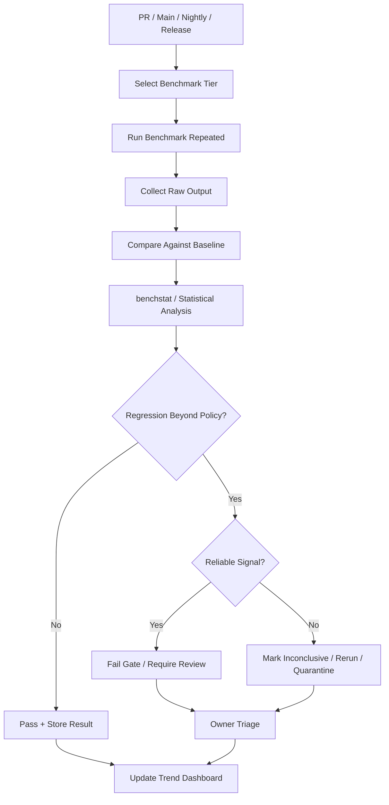
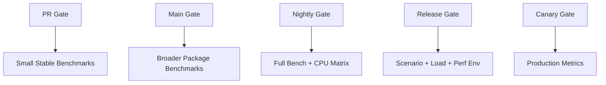
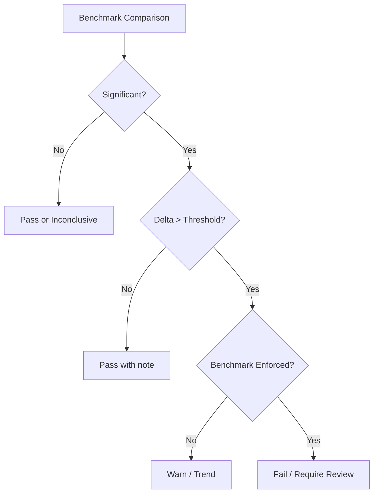
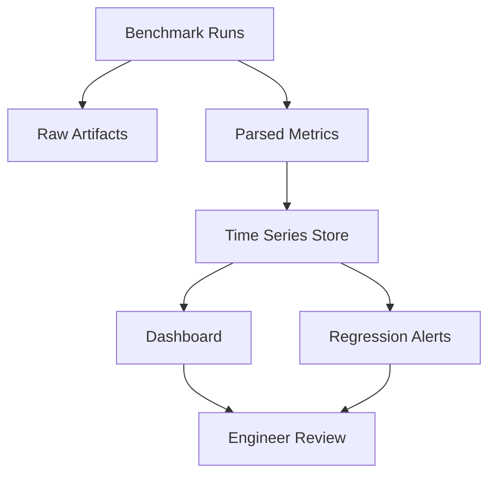
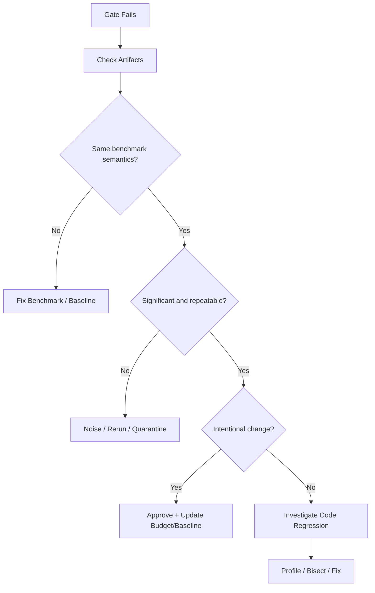

# learn-go-testing-benchmarking-performance-engineering-part-030.md

# Part 030 — Performance Regression Gates in CI/CD

> Seri: **Go Testing, Benchmarking, Performance Engineering**  
> Target pembaca: **Java Software Engineer → Go Performance-Capable Engineer**  
> Target Go: **Go 1.26.x**  
> Status seri: **Part 030 dari 034**  
> Prasyarat: Part 020–029, terutama benchmark statistics, scenario benchmark, runtime variables, dan PGO workflow.

---

## 0. Tujuan Part Ini

Part ini membahas cara membuat **performance regression gate** di CI/CD.

Banyak tim ingin:

```text
Kalau PR membuat performance memburuk, CI harus gagal.
```

Ide ini terdengar bagus, tetapi implementasinya sering gagal karena:

- benchmark noisy,
- runner CI tidak stabil,
- threshold asal-asalan,
- baseline tidak jelas,
- microbenchmark ditafsirkan berlebihan,
- semua benchmark dijalankan di PR sehingga lambat,
- false positive membuat developer membenci performance gate,
- false negative membuat gate tidak dipercaya,
- tidak ada ownership,
- tidak ada artifact/raw data,
- tidak ada quarantine policy,
- tidak ada dashboard/trend.

Goal part ini:

> Membuat performance regression gate yang membantu engineering decision, bukan menjadi ritual CI yang noisy dan tidak dipercaya.

---

## 1. Satu Kalimat Inti

> Performance gate yang baik bukan sekadar “jalankan benchmark dan fail jika lebih lambat”, tetapi sistem governance yang mengelola baseline, noise, threshold, artifact, ownership, tiering, dan review process.

Performance gate harus punya:

1. benchmark yang valid,
2. runner yang cukup stabil,
3. baseline yang jelas,
4. repeated runs,
5. statistical comparison,
6. threshold yang masuk akal,
7. policy untuk noisy result,
8. artifact untuk debugging,
9. owner untuk triage,
10. fallback/quarantine,
11. dashboard/trend,
12. link ke performance budget.

---

## 2. Kenapa Performance Gate Sulit?

Correctness test biasanya deterministik:

```text
pass/fail
```

Benchmark tidak selalu deterministik:

```text
old: 100 ns ± 3%
new: 104 ns ± 4%
```

Apakah regresi 4%?

Mungkin iya. Mungkin noise.

CI runner bisa noisy:

- shared VM,
- CPU throttling,
- different machine class,
- noisy neighbor,
- thermal/power state,
- background process,
- virtualization overhead,
- container CPU quota,
- unstable memory bandwidth,
- network/disk variance.

Jadi performance gate harus didesain sebagai statistical decision system.

---

## 3. Diagram: Performance Gate Pipeline



---

## 4. Gate Types

Tidak semua gate sama.

| Gate | Tujuan | Sifat |
|---|---|---|
| PR gate | cepat, mencegah regresi besar di hot path | strict tapi kecil |
| Main branch gate | validasi setelah merge | lebih luas |
| Nightly gate | deteksi regresi luas/tren | lebih lengkap |
| Release gate | decision-grade sebelum release | paling serius |
| Manual perf gate | eksperimen arsitektur | ad hoc |
| Canary gate | validasi production rollout | observability-based |

Satu gate untuk semua kebutuhan biasanya gagal.

---

## 5. PR Gate

PR gate harus cepat dan minim false positive.

Cocok untuk:

- benchmark kecil dan stabil,
- zero-allocation contract,
- critical hot path,
- regression besar,
- smoke performance check.

Tidak cocok untuk:

- full scenario benchmark besar,
- load test,
- noisy integration benchmark,
- long-running `-count=20` semua package,
- benchmark dengan real DB/network.

Example PR gate:

```bash
go test -run='^$' -bench='BenchmarkParseCaseID|BenchmarkAuthorizeHotPath' -benchmem -count=5 ./internal/... > pr-bench.txt
```

Policy:

```text
Fail if:
  allocs/op increases from 0 to >0 for zero-alloc benchmarks
  B/op increases > 50% on selected hot path
  time/op regression > 20% with significant benchstat result
```

---

## 6. Nightly Gate

Nightly gate bisa lebih berat.

Cocok untuk:

- semua microbenchmarks,
- scenario benchmarks,
- parallel benchmarks,
- CPU matrix,
- PGO comparison,
- trend tracking,
- broader regression detection.

Example:

```bash
go test -run='^$' -bench=. -benchmem -count=10 ./... > nightly-bench.txt
```

For selected packages:

```bash
go test -run='^$' -bench=. -benchmem -cpu=1,2,4,8 -count=10 ./internal/cache ./internal/authz > nightly-parallel.txt
```

Nightly gate bisa create issue rather than block all work.

---

## 7. Release Gate

Release gate harus dekat dengan production decision.

Cocok untuk:

- scenario benchmark,
- load test,
- PGO/no-PGO validation,
- runtime variable validation,
- memory/GC tests,
- critical workload distribution,
- dependency integration performance.

Release gate output:

- pass/fail,
- raw artifacts,
- trend comparison,
- capacity envelope,
- sign-off.

---

## 8. Gate Tiering Diagram



---

## 9. Baseline Management

A performance gate needs baseline.

Baseline options:

| Baseline | Description | Pros | Cons |
|---|---|---|---|
| main branch latest | compare PR vs current main | fresh | needs running both |
| stored golden result | compare against committed artifact | simple | can get stale |
| rolling median | compare against recent history | stable | needs storage/dashboard |
| last successful run | easy | can drift |
| release baseline | compare against last release | product meaningful | may be old |
| budget threshold | compare against absolute budget | simple | needs meaningful budget |

Best systems often combine:

```text
PR: compare against main on same runner
Nightly: compare against rolling historical baseline
Release: compare against previous release and budget
```

---

## 10. Compare PR Against Main

Workflow:

```text
1. checkout main
2. run selected benchmarks
3. checkout PR
4. run selected benchmarks
5. benchstat main.txt pr.txt
6. apply policy
```

Pros:

- same runner/time window,
- fairer than stored old result,
- catches PR-specific regression.

Cons:

- slower,
- branch switching/build time,
- main benchmark itself can be noisy,
- baseline can change frequently.

---

## 11. Stored Baseline

Example:

```text
performance/baselines/linux-amd64/go1.26/authz.txt
```

Pros:

- fast,
- no need to run main every PR.

Cons:

- baseline can be stale,
- environment mismatch,
- difficult after Go/hardware changes,
- may create false alarms.

Use for stable dedicated runner and update policy.

---

## 12. Rolling Baseline

Rolling baseline:

```text
median of last 20 successful nightly runs
```

Pros:

- reduces noise,
- detects trend,
- less sensitive to one outlier.

Cons:

- needs data store,
- more tooling,
- drift can hide gradual regression unless budget also exists.

Good for mature teams.

---

## 13. Budget-Based Gate

Example:

```text
BenchmarkParseCaseID/Valid:
  allocs/op must be 0
  time/op must be <= 100 ns
```

Pros:

- simple,
- tied to engineering target,
- avoids false alarms from tiny changes below budget.

Cons:

- budget must be meaningful,
- absolute time depends on machine,
- hardware changes break time budget.

Allocation budget more portable than time budget.

---

## 14. Baseline Strategy Recommendation

For most teams:

```text
Stage 1:
  PR: no automatic time fail, only zero-alloc and huge regression on selected benchmark.
  Nightly: full benchmark with benchstat vs main/recent baseline.
  Release: scenario/load validation.

Stage 2:
  Dedicated runner.
  PR: selected benchstat gates.
  Nightly: trend dashboard.
  Release: budget + load gate.

Stage 3:
  Rolling baseline + automated regression issue + owner triage.
```

Do not start with a strict noisy gate.

---

## 15. Threshold Design

Bad threshold:

```text
Fail if any benchmark slower by > 1%.
```

This creates false positives.

Better threshold per benchmark class:

| Class | Time Regression | Allocation Regression |
|---|---:|---:|
| zero-alloc hot primitive | maybe 10–20% | 0 → >0 fail |
| stable microbenchmark | 5–10% | 10–20% |
| noisy microbenchmark | 15–25% | 20–50% |
| scenario benchmark | 10–20% | 20–50% |
| integration benchmark | manual review | manual review |
| load test | SLO/budget | memory/GC budget |

---

## 16. Statistical + Practical Threshold

A good policy uses both:

```text
regression is actionable if:
  statistical signal exists
  AND delta exceeds practical threshold
  AND benchmark is in enforced class
```

Example:

```text
time/op regression > 10%
AND p < 0.05
AND n >= 10
```

For allocation:

```text
allocs/op increase from 0 to >0
```

or:

```text
B/op increase > 25%
AND benchmark marked allocation-sensitive
```

---

## 17. Delta Without Significance

Example:

```text
+15%, p=0.20
```

Do not auto-fail. Mark inconclusive or rerun.

---

## 18. Significance Without Meaningful Delta

Example:

```text
+1.2%, p=0.001
```

Usually do not fail unless ultra-hot path.

---

## 19. Threshold Decision Diagram



---

## 20. Allocation Gate

Allocation gates are often more reliable than time gates.

Examples:

```text
ParseCaseID:
  allocs/op must stay 0

BuildAllowedActions:
  B/op must not increase > 25%
  allocs/op must not increase > 20%

SubmitCaseScenario:
  B/op must stay under 512 KiB/op budget
```

Be careful:

- Go version can change escape behavior,
- benchmark shape matters,
- sync.Pool can make allocation unstable,
- map growth can be noisy.

---

## 21. Zero-Allocation Contract

Good candidate:

```go
func TestParseCaseIDAllocs(t *testing.T) {
	allocs := testing.AllocsPerRun(1000, func() {
		_, err := ParseCaseID("CASE-2026-000001")
		if err != nil {
			t.Fatal(err)
		}
	})

	if allocs != 0 {
		t.Fatalf("allocs/run=%v, want 0", allocs)
	}
}
```

This is a correctness-style gate for allocation.

Use only when zero allocation is a real contract.

---

## 22. Benchmark Selection for Gates

Do not gate every benchmark equally.

Tag/classify benchmarks:

```text
critical
stable
noisy
exploratory
manual
integration
scenario
load
```

Possible naming convention:

```go
// Benchmark class: critical, stable, allocation-sensitive.
func BenchmarkParseCaseID(b *testing.B) { ... }
```

Or maintain manifest:

```yaml
benchmarks:
  - name: BenchmarkParseCaseID/Valid
    package: ./internal/caseid
    class: critical
    time_regression_pct: 10
    allocation_regression_pct: 0
    pr_gate: true

  - name: BenchmarkBuildListingPage/100Cases
    package: ./internal/listing
    class: scenario
    time_regression_pct: 20
    allocation_regression_pct: 50
    pr_gate: false
    nightly_gate: true
```

---

## 23. Benchmark Manifest

A manifest avoids hardcoding policy in scripts.

Example:

```yaml
version: 1
go_version: "1.26.x"
benchmarks:
  - id: caseid-parse-valid
    package: ./internal/caseid
    regex: '^BenchmarkParseCaseID/Valid$'
    gate:
      pr: true
      nightly: true
    thresholds:
      time_regression_pct: 10
      b_per_op_regression_pct: 10
      allocs_per_op_max: 0
    notes: "Called on every request and log event."

  - id: listing-100-cases
    package: ./internal/listing
    regex: '^BenchmarkBuildListingPage/100Cases$'
    gate:
      pr: false
      nightly: true
    thresholds:
      time_regression_pct: 20
      b_per_op_regression_pct: 50
    notes: "Scenario benchmark; noisy on shared runners."
```

This is more maintainable.

---

## 24. Script-Based Gate

Simple script flow:

```bash
set -euo pipefail

PKG="./internal/caseid"
BENCH="BenchmarkParseCaseID"
COUNT=10

git checkout main
go test -run='^$' -bench="${BENCH}" -benchmem -count="${COUNT}" "${PKG}" > old.txt

git checkout "$PR_BRANCH"
go test -run='^$' -bench="${BENCH}" -benchmem -count="${COUNT}" "${PKG}" > new.txt

benchstat old.txt new.txt > benchstat.txt
cat benchstat.txt

# parse benchstat or require human review in early maturity stage
```

Parsing `benchstat` output robustly requires care. For early teams, produce artifact and warn rather than auto-fail.

---

## 25. GitHub Actions Sketch

```yaml
name: perf-pr

on:
  pull_request:
    paths:
      - '**/*.go'
      - 'go.mod'
      - 'go.sum'

jobs:
  perf-smoke:
    runs-on: ubuntu-latest
    steps:
      - uses: actions/checkout@v4
        with:
          fetch-depth: 0

      - uses: actions/setup-go@v5
        with:
          go-version: '1.26.x'

      - name: Install benchstat
        run: go install golang.org/x/perf/cmd/benchstat@latest

      - name: Benchmark base
        run: |
          git checkout origin/main
          go test -run='^$' -bench='BenchmarkParseCaseID|BenchmarkAuthorizeHotPath' -benchmem -count=5 ./internal/... > old.txt

      - name: Benchmark PR
        run: |
          git checkout ${{ github.sha }}
          go test -run='^$' -bench='BenchmarkParseCaseID|BenchmarkAuthorizeHotPath' -benchmem -count=5 ./internal/... > new.txt

      - name: Compare
        run: |
          benchstat old.txt new.txt | tee benchstat.txt

      - name: Upload artifacts
        uses: actions/upload-artifact@v4
        with:
          name: perf-pr-results
          path: |
            old.txt
            new.txt
            benchstat.txt
```

For strict fail, add policy parser after maturity improves.

---

## 26. GitLab CI Sketch

```yaml
perf_pr:
  image: golang:1.26
  stage: test
  script:
    - go install golang.org/x/perf/cmd/benchstat@latest
    - git fetch origin main
    - git checkout origin/main
    - go test -run='^$' -bench='BenchmarkParseCaseID|BenchmarkAuthorizeHotPath' -benchmem -count=5 ./internal/... > old.txt
    - git checkout "$CI_COMMIT_SHA"
    - go test -run='^$' -bench='BenchmarkParseCaseID|BenchmarkAuthorizeHotPath' -benchmem -count=5 ./internal/... > new.txt
    - benchstat old.txt new.txt | tee benchstat.txt
  artifacts:
    when: always
    paths:
      - old.txt
      - new.txt
      - benchstat.txt
```

---

## 27. Dedicated Perf Runner

For strict gate, use dedicated runner.

Characteristics:

- stable CPU,
- stable OS image,
- fixed Go version,
- no concurrent jobs,
- controlled power/performance mode,
- same machine class,
- artifact retention,
- benchmark history.

Shared hosted CI can be useful for smoke but often too noisy for strict gates.

---

## 28. Noisy CI Policy

When using noisy runner:

```text
PR:
  do not fail on small time regressions
  fail only on deterministic allocation contract
  warn on large time regression
  upload artifacts

Nightly:
  run repeated benchmark
  create issue if trend persists 2–3 days

Release:
  run on dedicated/stable environment
```

This avoids developer fatigue.

---

## 29. Rerun Policy

If gate detects regression:

1. rerun benchmark once automatically,
2. compare result,
3. if both fail, fail gate,
4. if inconsistent, mark inconclusive and upload artifacts,
5. owner reviews.

Do not allow infinite reruns until pass. That hides real issues.

---

## 30. Quarantine Policy

Flaky/noisy benchmarks may need quarantine.

Quarantine does not mean delete.

Quarantine means:

- not blocking PR,
- still run nightly/manual,
- owner assigned,
- reason documented,
- fix deadline,
- replacement signal if needed.

Manifest:

```yaml
status: quarantined
reason: "High variance on shared runner due filesystem dependency."
owner: "@perf-team"
review_by: "2026-07-15"
```

---

## 31. Benchmark Ownership

Every enforced benchmark needs owner.

Owner responsibilities:

- maintain workload,
- update threshold,
- triage regression,
- approve baseline changes,
- fix flaky benchmark,
- document budget,
- review benchmark relevance.

Unowned performance gates rot.

---

## 32. Baseline Update Policy

Baseline update should require:

- benchmark result evidence,
- reason for change,
- owner approval,
- no hidden regression,
- updated artifact,
- linked PR/issue.

Bad:

```text
Update baseline because CI red.
```

Good:

```text
Update baseline after intentional algorithm change.
Scenario benchmark + load test show acceptable performance.
Budget adjusted due new feature requirement.
```

---

## 33. Artifact Retention

Always keep:

- raw old benchmark output,
- raw new benchmark output,
- `benchstat` output,
- Go version,
- environment info,
- commit SHA,
- benchmark command,
- profile if used,
- logs for failure.

Artifacts allow triage.

Without artifacts, a failed gate becomes guesswork.

---

## 34. Artifact Metadata

Create `perf-metadata.txt`:

```text
commit_base:
commit_candidate:
go_version:
goos:
goarch:
cpu:
gomaxprocs:
gogc:
gomemlimit:
goflags:
command_old:
command_new:
runner:
timestamp:
```

Generate:

```bash
{
  echo "go_version=$(go version)"
  echo "goos=$(go env GOOS)"
  echo "goarch=$(go env GOARCH)"
  echo "goflags=$(go env GOFLAGS)"
  echo "gomaxprocs=${GOMAXPROCS:-default}"
  echo "gogc=${GOGC:-default}"
  echo "gomemlimit=${GOMEMLIMIT:-default}"
} > perf-metadata.txt
```

---

## 35. Trend Dashboard

A mature gate stores results over time.

Metrics:

- time/op,
- B/op,
- allocs/op,
- p-value/delta,
- Go version,
- commit,
- benchmark class,
- runner,
- branch,
- profile hash if PGO.

Dashboard helps detect:

- gradual drift,
- sudden regression,
- noisy benchmark,
- Go upgrade effect,
- runner instability.

---

## 36. Trend-Based Regression

Sometimes one PR does not exceed threshold, but gradual drift accumulates.

Example:

```text
Week 1: 100 ns
Week 2: 103 ns
Week 3: 106 ns
Week 4: 110 ns
Week 5: 116 ns
```

No single PR > 10%, but total +16%.

Nightly trend detects this.

---

## 37. Dashboard Diagram



---

## 38. Performance Budget Dashboard

Better than raw metric dashboard:

```text
BenchmarkBuildListingPage100Cases:
  budget: <= 5 ms/op
  current: 3.2 ms/op
  headroom: 36%

BenchmarkParseCaseID:
  budget: 0 allocs/op
  current: 0 allocs/op
  status: OK
```

Budgets make metrics meaningful.

---

## 39. PR Comment Bot

Helpful PR comment:

```text
Performance benchmark summary:

BenchmarkParseCaseID/Valid:
  time/op: 42.1ns -> 43.0ns (+2.1%, not significant)
  allocs/op: 0 -> 0

BenchmarkBuildAllowedActions/100Rules:
  time/op: 1.20µs -> 1.55µs (+29.1%, significant)
  B/op: 512B -> 2048B (+300%)

Policy:
  Regression exceeds threshold for critical benchmark.
  Owner review required: @authz-owner

Artifacts:
  old.txt, new.txt, benchstat.txt
```

Avoid only saying “CI failed”.

---

## 40. Human Override

Sometimes performance regression is intentional.

Examples:

- stronger security validation,
- more accurate error reporting,
- new mandatory feature,
- changed semantics,
- audit/compliance requirement.

Override should require:

- explanation,
- owner approval,
- updated budget/baseline if needed,
- follow-up optimization issue if applicable.

Performance gate should support engineering judgement.

---

## 41. Security and Compliance Trade-Off

If performance worsens because of security fix:

```text
+20% time/op
+1 allocation/op
```

Maybe acceptable.

Document:

```text
Regression accepted because token validation now checks issuer/audience/key rotation.
Security correctness outweighs hot-path cost.
Follow-up: cache parsed JWKS safely.
```

Performance is not the only quality attribute.

---

## 42. Regression Classification

Classify:

| Class | Meaning | Action |
|---|---|---|
| real regression | benchmark valid, delta significant | fix or approve |
| noise | inconsistent, high variance | rerun/improve env |
| benchmark bug | benchmark changed semantics | fix benchmark |
| expected regression | intentional feature/security | approve/update budget |
| baseline drift | old baseline invalid | update with review |
| environment issue | runner changed | fix infra |
| Go/runtime change | Go upgrade effect | evaluate release impact |

---

## 43. Triage Flow



---

## 44. Bisecting Performance Regression

If nightly detects regression:

```bash
git bisect start
git bisect bad HEAD
git bisect good <known-good-commit>
```

For each commit:

```bash
go test -run='^$' -bench=BenchmarkX -benchmem -count=5 ./internal/foo > result.txt
```

Automated bisect performance is tricky due noise. Use stable runner and clear threshold.

---

## 45. Regression Debug Toolkit

When gate fails:

1. compare benchmark output,
2. inspect code diff,
3. run benchmark locally with `-count=10`,
4. run on dedicated runner,
5. inspect allocation delta,
6. run CPU/heap profile,
7. run escape analysis if allocation changed,
8. check Go version/env,
9. check benchmark fixture changes,
10. run scenario benchmark,
11. run load test if system impact unclear.

---

## 46. Benchmark Change Review

Changing benchmark code can change baseline.

Benchmark PR review should ask:

- Did operation definition change?
- Did input size/distribution change?
- Did setup move in/out of timer?
- Did validation change?
- Did build tags change?
- Did dependency fake change?
- Are old/new results comparable?
- Should baseline reset?

Benchmark changes need same rigor as production code.

---

## 47. Golden Baseline vs Performance Budget

Golden baseline:

```text
old result from previous run
```

Performance budget:

```text
maximum acceptable cost
```

Use both.

Example:

```text
Current: 3 ms/op
Budget: 5 ms/op
Regression: +20% to 3.6 ms/op
```

Does it fail?

Maybe warn, not fail, if still under budget and not critical.

But if trend continues, alert.

---

## 48. PR Gate Policy Example

```text
PR performance gate policy:

Enforced:
  - zero allocation contracts via tests
  - critical microbenchmark >20% regression with p<0.05
  - B/op >50% regression in critical benchmark

Warn only:
  - time regression 5–20%
  - scenario benchmark regression
  - noisy benchmark result

Not run in PR:
  - integration benchmarks
  - large scenario benchmarks
  - load tests
```

---

## 49. Nightly Gate Policy Example

```text
Nightly performance policy:

Run:
  - all package benchmarks
  - selected CPU matrix parallel benchmarks
  - scenario benchmarks with -tags=perf
  - PGO/no-PGO comparison weekly

Alert:
  - critical benchmark regression >10%
  - scenario benchmark regression >20%
  - allocation regression >25%
  - budget violation
  - trend regression >10% over 7 days

Action:
  - create issue with owner
  - quarantine if noisy
  - block release if unresolved critical
```

---

## 50. Release Gate Policy Example

```text
Release performance policy:

Required:
  - benchmark suite vs previous release
  - scenario benchmark vs budget
  - load test for top endpoints
  - memory/GC validation
  - PGO validation if enabled
  - canary plan

Block release if:
  - SLO violated in load test
  - capacity envelope reduced >20% without approval
  - critical endpoint p95/p99 regression
  - memory exceeds budget
  - unresolved critical performance issue
```

---

## 51. Load Test Gate vs Benchmark Gate

Benchmark gate:

- cheap,
- code-level,
- controlled,
- good for early detection.

Load test gate:

- expensive,
- system-level,
- realistic,
- required for capacity/SLO.

Do not replace load test with benchmark gate for release decisions.

---

## 52. PGO Gate

If using PGO:

```text
Gate:
  PGO build must not regress critical benchmarks.
  PGO profile hash recorded.
  PGO vs non-PGO compared weekly/release.
  Stale profile check required after major workload change.
```

Command:

```bash
go test -run='^$' -bench=. -benchmem -count=10 -pgo=off ./internal/case > nopgo.txt
go test -run='^$' -bench=. -benchmem -count=10 -pgo=auto ./internal/case > pgo.txt
benchstat nopgo.txt pgo.txt
```

---

## 53. Runtime Variable Gate

If service is containerized:

- benchmark under expected `GOMAXPROCS`,
- validate memory under `GOMEMLIMIT`,
- record `GOGC`,
- compare Go versions separately.

Do not let hidden runtime change look like code regression.

---

## 54. Governance Model

Performance gate governance:

| Role | Responsibility |
|---|---|
| benchmark owner | maintain benchmark and thresholds |
| service owner | approve regressions affecting service |
| platform/CI owner | maintain runner stability |
| release owner | enforce release gate |
| reviewer | inspect benchmark evidence in PR |
| incident owner | connect production issue to benchmark gaps |

---

## 55. Maturity Model

### Level 0 — Manual

- developers run benchmarks manually,
- no CI gate,
- no baseline.

### Level 1 — Artifact Only

- CI runs selected benchmarks,
- uploads output,
- no automatic fail.

### Level 2 — Warning Gate

- CI comments benchstat,
- warns on threshold,
- no hard block except allocation tests.

### Level 3 — Selective Blocking

- critical stable benchmarks block PR,
- dedicated runner for performance.

### Level 4 — Trend + Release Gate

- dashboard,
- rolling baseline,
- nightly alerts,
- release load gate.

### Level 5 — Full Performance Governance

- budgets,
- capacity envelope,
- automatic issue creation,
- profile/PGO governance,
- canary validation,
- performance culture.

Most teams should progress gradually.

---

## 56. Case Study: ParseCaseID Gate

Function:

```text
ParseCaseID called for every request, audit event, and log correlation.
```

Policy:

```text
allocs/op must remain 0
time/op regression > 15% blocks PR if significant
```

Implementation:

- `AllocsPerRun` unit test for zero allocation,
- benchmark in PR with `-count=5`,
- nightly with `-count=10`,
- benchstat artifact.

This is good gate candidate.

---

## 57. Case Study: Listing Page Scenario Gate

Scenario:

```text
Build listing page with 100 cases.
```

Policy:

```text
PR: not blocking, artifact only
Nightly: alert if >20% regression or >50% B/op regression
Release: must stay under 5 ms/op service budget and load p95 target
```

Because scenario benchmark is noisier and more expensive.

---

## 58. Case Study: Bad Gate

Bad policy:

```text
Run go test -bench=. ./...
Fail if any benchmark slower.
```

Problems:

- no repeated runs,
- no baseline,
- no benchstat,
- no threshold,
- no classification,
- all benchmarks equal,
- noisy benchmarks block PR,
- developer trust collapses.

---

## 59. Case Study: Better Gate

Better:

```text
PR:
  run 5 critical stable benchmarks
  compare PR vs main on same runner
  fail only on allocation contract or >20% significant regression
  upload artifacts

Nightly:
  run full benchmark suite count=10
  compare rolling baseline
  create issues for persistent regression

Release:
  run scenario/load test in perf env
  block on SLO/budget violation
```

---

## 60. Performance Gate Checklist

### 60.1 Benchmark

- [ ] Valid benchmark design.
- [ ] Stable enough for gate.
- [ ] Classified by importance/noise.
- [ ] Owner assigned.
- [ ] Workload documented.
- [ ] Budget/threshold defined.

### 60.2 Baseline

- [ ] Baseline strategy defined.
- [ ] Same environment or adjusted policy.
- [ ] Update process documented.
- [ ] History retained.

### 60.3 Execution

- [ ] Repeated runs.
- [ ] `-benchmem`.
- [ ] `benchstat`.
- [ ] Runtime env recorded.
- [ ] Artifacts uploaded.

### 60.4 Policy

- [ ] Statistical and practical thresholds.
- [ ] Allocation gates.
- [ ] Rerun policy.
- [ ] Quarantine policy.
- [ ] Override policy.
- [ ] Release blocking criteria.

### 60.5 Governance

- [ ] Owner.
- [ ] Dashboard/trend.
- [ ] Triage process.
- [ ] Baseline update approval.
- [ ] Periodic benchmark review.

---

## 61. Anti-Patterns

### 61.1 Strict Gate on Noisy Runner

False alarms.

### 61.2 No Artifacts

Impossible to debug.

### 61.3 No Owner

Gate rots.

### 61.4 One Global Threshold

Different benchmarks need different thresholds.

### 61.5 Time Only

Allocation regressions ignored.

### 61.6 PR Runs Everything

Slow CI and developer frustration.

### 61.7 Baseline Auto-Update Without Review

Regressions become new normal.

### 61.8 Ignoring Go Version/Runtime

False comparisons.

### 61.9 No Quarantine

Flaky benchmarks either block forever or get deleted.

### 61.10 No Budget

No one knows what “bad” means.

---

## 62. Practical Rules of Thumb

1. Start with artifact/warning gate before hard fail.
2. Hard-fail only stable critical benchmarks.
3. Allocation gates are safer than tiny time gates.
4. Use `benchstat`, not eyeballing.
5. Use repeated runs.
6. Compare PR against main on same runner when possible.
7. Use dedicated runner for strict performance gate.
8. Keep PR gate small.
9. Run full suite nightly.
10. Use release gate for scenario/load test.
11. Store raw output and metadata.
12. Assign owners.
13. Quarantine noisy benchmarks, do not delete silently.
14. Update baselines only with evidence.
15. Tie gates to performance budgets.

---

## 63. Mini Exercise 1: Design PR Gate

Service has:

```text
ParseCaseID: stable zero alloc hot path
BuildListingPage: scenario benchmark, noisy
PermissionCacheParallel: stable only on dedicated runner
```

PR policy:

```text
Enforce:
  ParseCaseID allocation and >15% time regression.

Warn:
  BuildListingPage if run cheaply, but do not block.

Not PR:
  PermissionCacheParallel unless dedicated runner available.
```

---

## 64. Mini Exercise 2: Interpret Gate Failure

Result:

```text
BenchmarkAuthorize/RBAC:
  +4%, p=0.001
```

Threshold:

```text
10%
```

Action:

```text
Pass with note.
Statistically significant but below practical threshold.
```

---

## 65. Mini Exercise 3: Allocation Regression

Result:

```text
BenchmarkParseCaseID/Valid:
  0 allocs/op -> 1 allocs/op
```

Policy:

```text
zero allocation contract
```

Action:

```text
Fail.
Investigate escape/allocation source.
```

---

## 66. Mini Exercise 4: Noisy Scenario

Result:

```text
BenchmarkBuildListingPage/100Cases:
  +25%, p=0.18, ±30%
```

Action:

```text
Do not hard fail.
Rerun or mark inconclusive.
Investigate benchmark noise.
Nightly trend may alert if persistent.
```

---

## 67. What to Remember

1. Performance gates need governance, not just scripts.
2. PR gates must be fast and low-noise.
3. Nightly gates can be broad and trend-oriented.
4. Release gates should include scenario/load validation.
5. Baseline strategy matters.
6. Thresholds need both statistical and practical meaning.
7. Allocation gates are often more reliable than time gates.
8. Store raw artifacts and metadata.
9. Every enforced benchmark needs an owner.
10. Quarantine noisy benchmarks with review policy.
11. Do not update baselines casually.
12. Use dashboards/trends to catch gradual drift.
13. Human override is valid but must be documented.
14. Performance gates should build trust, not fear.

---

## 68. References

Official and primary sources:

- Go `testing` package documentation: <https://pkg.go.dev/testing>
- `benchstat` documentation: <https://pkg.go.dev/golang.org/x/perf/cmd/benchstat>
- Go command documentation: <https://pkg.go.dev/cmd/go>
- Go diagnostics documentation: <https://go.dev/doc/diagnostics>
- Go PGO documentation: <https://go.dev/doc/pgo>
- Go blog — More predictable benchmarking with `testing.B.Loop`: <https://go.dev/blog/testing-b-loop>
- Go blog — Using Subtests and Sub-benchmarks: <https://go.dev/blog/subtests>

---

## 69. Next Part

Part berikutnya:

```text
learn-go-testing-benchmarking-performance-engineering-part-031.md
```

Judul:

```text
Load, Stress, Spike & Soak Testing for Go Services
```

Kita akan membahas:

- load test,
- stress test,
- spike test,
- soak test,
- open vs closed workload,
- RPS target,
- latency percentiles,
- error budget,
- coordinated omission,
- dependency saturation,
- backpressure validation,
- dan bagaimana menghubungkan benchmark Go dengan service-level performance test.

---

## Status Seri

```text
Part 030 dari 034 selesai.
Seri belum selesai.
```


<!-- NAVIGATION_FOOTER -->
<div class="page-nav">
<a href="./learn-go-testing-benchmarking-performance-engineering-part-029.md">⬅️ Part 029 — Profile-Guided Optimization / PGO in Engineering Workflow</a>
<a href="./index.md">📚 Kategori</a>
<a href="../../index.md">🏠 Home</a>
<a href="./learn-go-testing-benchmarking-performance-engineering-part-031.md">Part 031 — Load, Stress, Spike & Soak Testing for Go Services ➡️</a>
</div>
