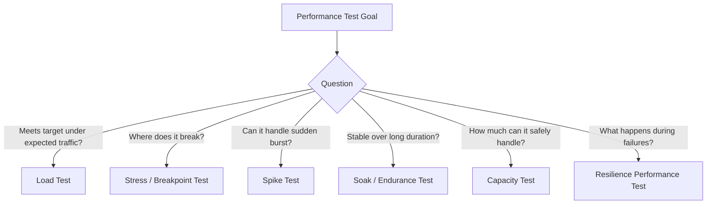
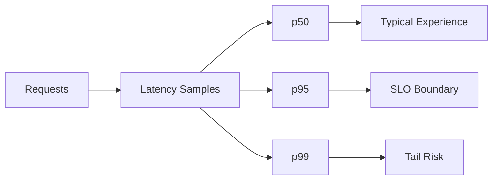
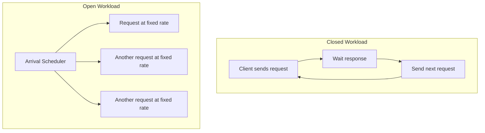
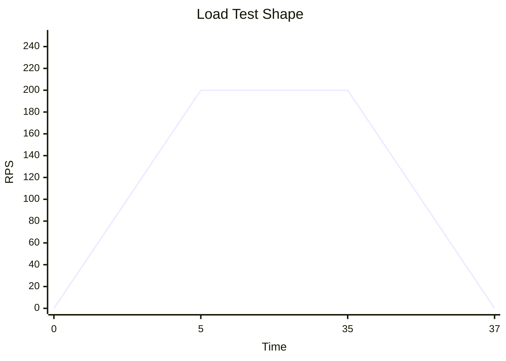
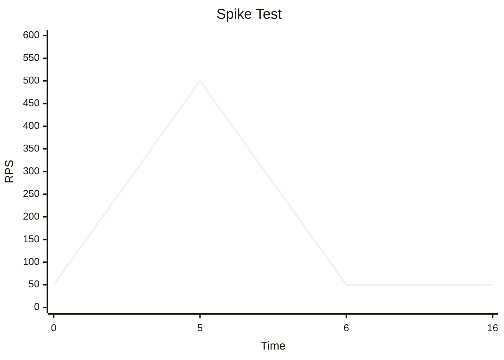
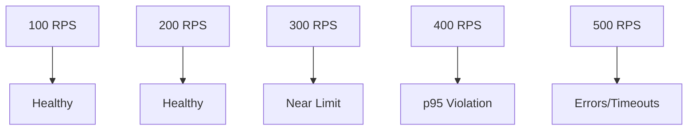

# learn-go-testing-benchmarking-performance-engineering-part-031.md

# Part 031 — Load, Stress, Spike & Soak Testing for Go Services

> Seri: **Go Testing, Benchmarking, Performance Engineering**  
> Target pembaca: **Java Software Engineer → Go Performance-Capable Engineer**  
> Target Go: **Go 1.26.x**  
> Status seri: **Part 031 dari 034**  
> Prasyarat: Part 020–030, seri observability/profiling/troubleshooting, seri HTTP/networking, seri concurrency, dan dasar deployment/container.

---

## 0. Tujuan Part Ini

Benchmark Go memberi sinyal tentang biaya operasi internal:

```text
ns/op
B/op
allocs/op
```

Tetapi service production dinilai dari:

```text
RPS
latency percentile
error rate
saturation
availability
cost
capacity
stability under time
```

Part ini membahas **service-level performance testing**:

- load test,
- stress test,
- spike test,
- soak test,
- endurance test,
- capacity test,
- backpressure validation,
- dependency saturation test,
- failure-aware performance test.

Pertanyaan utama:

> Bagaimana menguji service Go di bawah traffic agar kita tahu batas kapasitas, latency, error behavior, dan reliability-nya?

Setelah part ini, Anda harus bisa:

1. Membedakan load, stress, spike, soak, capacity, dan endurance test.
2. Mendesain test objective yang jelas.
3. Memahami open vs closed workload model.
4. Memahami coordinated omission.
5. Mengukur p50/p95/p99, throughput, error rate, saturation.
6. Menentukan ramp-up, steady-state, spike, dan duration.
7. Menghubungkan benchmark Go dengan load test.
8. Menyiapkan environment dan dependency yang valid.
9. Menguji backpressure, timeout, retry, dan degradation.
10. Membuat report load test yang actionable.

---

## 1. Satu Kalimat Inti

> Load testing mengukur behavior service sebagai sistem di bawah traffic, bukan hanya biaya fungsi; fokusnya latency distribution, throughput, error rate, saturation, dan stability.

Benchmark menjawab:

```text
Berapa biaya operasi internal?
```

Load test menjawab:

```text
Apa yang terjadi saat banyak request nyata datang ke service?
```

---

## 2. Test Type Vocabulary

| Test Type | Pertanyaan | Contoh |
|---|---|---|
| Load test | Apakah service memenuhi SLO di load target? | 300 RPS selama 30 menit |
| Stress test | Di mana batas jenuh/failure mode? | naikkan RPS sampai error/p99 collapse |
| Spike test | Apa yang terjadi saat traffic melonjak tiba-tiba? | 50 → 500 RPS dalam 10 detik |
| Soak test | Apakah service stabil dalam durasi panjang? | 100 RPS selama 8 jam |
| Endurance test | Apakah ada leak/degradation jangka panjang? | 24 jam workload normal |
| Capacity test | Berapa kapasitas aman? | cari max RPS p95 < 300 ms |
| Breakpoint test | Titik collapse sistem? | terus naik sampai failure |
| Resilience perf test | Bagaimana performance saat dependency lambat/error? | DB p95 500 ms, downstream 5% error |

---

## 3. Diagram: Test Types by Load and Time



---

## 4. Load Test vs Benchmark

| Aspect | Go Benchmark | Load Test |
|---|---|---|
| Level | function/package/process | service/system |
| Tool | `go test -bench` | k6, vegeta, wrk, hey, Locust, JMeter, custom |
| Output | ns/op, B/op, allocs/op | p50/p95/p99, RPS, errors |
| Dependencies | fake or limited | real/simulated service deps |
| Concurrency | benchmark-controlled | client traffic model |
| Queueing | mostly absent | visible |
| Saturation | partial | primary concern |
| Use | code-level optimization | capacity/SLO validation |

Benchmark and load test complement each other.

---

## 5. Why Load Test Matters for Go Services

A Go service can pass all benchmarks but fail load test because:

- DB pool is too small,
- downstream dependency slow,
- context cancellation ignored,
- retry storm,
- unbounded queue,
- logging blocks,
- GC under real allocation rate,
- lock contention only appears with traffic,
- p99 worsens under concurrency,
- autoscaling too slow,
- CPU throttling,
- memory limit,
- goroutine leak,
- connection leak,
- file descriptor exhaustion,
- rate limiter misconfigured,
- handler uses one global mutex.

Load test exposes **system interactions**.

---

## 6. Load Test Metrics

Minimum metrics:

| Metric | Meaning |
|---|---|
| request rate | attempted and successful RPS |
| latency p50/p90/p95/p99 | distribution |
| error rate | HTTP 5xx/4xx depending scenario |
| timeout rate | client/server timeout |
| throughput bytes/sec | if payload-heavy |
| CPU | service and dependency |
| memory | RSS/heap/container |
| GC | cycles, CPU, heap |
| goroutines | leak/blocking |
| DB pool | open/in-use/wait |
| queue depth | backlog |
| downstream latency | dependency behavior |
| saturation signals | waits, throttling, backlog |

---

## 7. Percentiles

Latency distribution matters.

Example:

```text
p50 = 80 ms
p95 = 250 ms
p99 = 2.5 s
```

Median user may be fine, but tail users suffer.

For service SLO:

```text
p95 < 300 ms
p99 < 1 s
error rate < 0.1%
```

Do not rely on average.

---

## 8. Diagram: Latency Distribution



---

## 9. Throughput

Throughput can mean:

- attempted RPS,
- successful RPS,
- completed requests/sec,
- messages/sec,
- bytes/sec.

Distinguish:

```text
attempted RPS = what load generator sends
successful RPS = what service successfully completes
```

Under overload:

```text
attempted RPS: 1000
successful RPS: 600
error/timeout: 400
```

Throughput may plateau or collapse.

---

## 10. Error Rate

Classify errors:

| Error | Meaning |
|---|---|
| HTTP 5xx | server failure |
| HTTP 429 | throttling/rate limiting |
| HTTP 4xx | may be expected invalid input |
| client timeout | service too slow or network issue |
| connection reset | overload/crash/network |
| context deadline exceeded | timeout path |
| dependency error | downstream issue |
| validation error | workload input issue |

Do not treat all 4xx as performance failure if test intentionally includes invalid input.

---

## 11. Saturation Signals

Saturation is often more important than raw CPU.

Watch:

- CPU near target limit,
- container throttling,
- DB pool wait,
- queue backlog,
- goroutine count rising,
- heap rising,
- GC CPU rising,
- channel send blocking,
- mutex/block profile,
- downstream p95 rising,
- retry count rising,
- rate limiter rejects,
- file descriptors high.

---

## 12. Open vs Closed Workload

### Closed workload

Fixed number of clients. Each client sends next request after previous completes.

```text
concurrency = 100 users
```

If service slows down, request rate drops.

### Open workload

Requests arrive at target rate independent of completion.

```text
arrival rate = 500 RPS
```

If service slows down, in-flight grows and queueing appears.

Both are useful, but answer different questions.

---

## 13. Diagram: Closed vs Open Workload



---

## 14. Why Open Workload Matters

Production traffic is often closer to open workload:

```text
users/events arrive regardless of whether service is slow
```

If service slows:

- closed model reduces send rate,
- open model reveals queueing and overload.

For capacity/SLO test, open workload is often more realistic.

---

## 15. Coordinated Omission

Coordinated omission occurs when a load generator waits for a slow response before sending next request, thereby omitting latency that would have happened for requests that should have arrived during the wait.

Example:

```text
Target: 100 RPS
Service pauses for 1 second
Closed client sends no requests during pause
Latency report misses 100 delayed arrivals
```

This underreports tail latency.

Use load tools/configurations that support constant arrival rate or account for coordinated omission when SLO matters.

---

## 16. Coordinated Omission Diagram

```mermaid
sequenceDiagram
    participant LoadGen
    participant Service

    LoadGen->>Service: Request 1
    Service-->>LoadGen: Slow response after 1s
    Note over LoadGen: Closed client waits; no new requests sent
    LoadGen->>Service: Request 2
```

In real open traffic, many requests would arrive during that 1 second.

---

## 17. Test Objective

Bad:

```text
Run load test.
```

Good:

```text
Validate that SubmitCase endpoint handles 200 RPS for 30 minutes with:
  p95 < 300 ms
  p99 < 1 s
  error rate < 0.1%
  CPU < 65%
  memory < 70%
  DB pool wait p95 < 20 ms
```

A test without objective cannot pass/fail meaningfully.

---

## 18. Load Test Plan Template

```text
Test Name:
  SubmitCase_Load_200RPS_30m

Objective:
  Validate expected peak traffic.

Workload:
  80% small submit
  15% medium submit
  5% large submit

Arrival Model:
  open constant arrival rate 200 RPS

Duration:
  ramp-up 5m
  steady 30m
  ramp-down 2m

Environment:
  staging perf env
  service version
  Go version
  pod resources
  DB size/config
  dependency versions

Success Criteria:
  p95 < 300 ms
  p99 < 1s
  error < 0.1%
  CPU < 65%
  memory stable
  no goroutine leak
  DB pool wait p95 < 20 ms

Artifacts:
  load generator report
  service metrics
  logs
  profiles if collected
```

---

## 19. Environment Fidelity

Load test environment should be close enough to answer the question.

Consider:

- same binary/build flags,
- same Go version,
- same container resources,
- same autoscaling or fixed replicas,
- realistic DB size/indexes,
- realistic cache state,
- realistic network path,
- realistic dependency latency,
- realistic secrets/config,
- similar logging/tracing settings,
- same `GOMAXPROCS`, `GOGC`, `GOMEMLIMIT`.

If environment differs, document it.

---

## 20. Data Fidelity

Good test data:

- realistic size,
- realistic relationships,
- realistic optional fields,
- realistic invalid cases,
- no PII/secrets,
- deterministic enough,
- can be reset,
- supports idempotency,
- includes p50/p90/p99 payloads.

Bad test data:

- one user,
- one record,
- all values `"test"`,
- empty database,
- no indexes like prod,
- no cache misses,
- no invalid inputs.

---

## 21. Dependency Fidelity

Options:

| Dependency Mode | Use |
|---|---|
| fake | application CPU/load only |
| simulator | latency/error modeling |
| real staging dependency | integration capacity |
| production shadow | advanced, risky |
| stub always-fast | useful but optimistic |
| chaos/failure injection | resilience perf |

Document dependency mode clearly.

---

## 22. Load Generator Placement

Load generator must not be the bottleneck.

Check:

- load generator CPU,
- network bandwidth,
- connection limits,
- file descriptors,
- DNS overhead,
- TLS overhead,
- client timeout,
- result buffer memory.

Use distributed load generators if needed.

If load generator is saturated, test result is invalid.

---

## 23. Warmup

Warmup matters:

- connection pools,
- caches,
- lazy initialization,
- JIT not relevant like JVM, but runtime/system caches matter,
- DB buffer cache,
- TLS session reuse,
- DNS/cache,
- application internal cache.

Plan:

```text
warmup 5 minutes
ignore warmup metrics for pass/fail
then steady-state measurement
```

---

## 24. Ramp-Up

Avoid instant unrealistic load unless spike test.

Ramp-up:

```text
0 → 200 RPS over 5 minutes
```

Benefits:

- avoids cold shock unless intended,
- lets autoscaling react,
- reveals gradual saturation,
- separates startup from steady-state.

For spike test, intentionally sudden.

---

## 25. Steady-State

Steady-state phase is where pass/fail is evaluated.

Example:

```text
30 minutes at 200 RPS
```

During steady-state observe:

- latency percentiles,
- errors,
- CPU/memory,
- GC,
- DB pool,
- queues,
- downstream.

---

## 26. Ramp-Down and Recovery

After load stops, observe recovery:

- queues drain,
- goroutines return,
- memory stabilizes,
- DB pool recovers,
- error rate returns to zero,
- circuit breakers reset.

A system that survives load but cannot recover cleanly is not healthy.

---

## 27. Load Test Shape Diagram



---

## 28. Stress Test

Stress test intentionally increases load until service degrades.

Objective:

```text
Find bottleneck and failure mode.
```

Example:

```text
100 RPS 5m
200 RPS 5m
300 RPS 5m
400 RPS 5m
500 RPS 5m
continue until p95/error threshold breached
```

Success is not “no failure”. Success is learning:

- capacity boundary,
- degradation mode,
- bottleneck,
- whether failure is graceful.

---

## 29. Stress Test Success Criteria

A good stress test asks:

- Does service shed load with 429/503?
- Does queue remain bounded?
- Does memory avoid runaway?
- Do timeouts cancel work?
- Are retries controlled?
- Does service recover after overload?
- Does dependency survive?
- Are alerts triggered?
- Is bottleneck identifiable?

---

## 30. Spike Test

Spike test simulates sudden traffic jump.

Example:

```text
50 RPS baseline 5m
500 RPS spike 1m
50 RPS recovery 10m
```

Questions:

- Does autoscaling react too slowly?
- Does service queue explode?
- Does DB pool saturate?
- Does cache stampede happen?
- Does rate limiter protect downstream?
- Does p99 recover?

---

## 31. Spike Test Diagram



---

## 32. Soak Test

Soak test runs moderate load for long duration.

Example:

```text
100 RPS for 8 hours
```

Looks for:

- memory leaks,
- goroutine leaks,
- connection leaks,
- slow heap growth,
- cache unbounded growth,
- log disk issues,
- file descriptor leak,
- performance degradation over time,
- GC behavior drift,
- retry accumulation.

---

## 33. Soak Test Metrics

Track over time:

- RSS,
- Go heap,
- live objects,
- goroutine count,
- file descriptors,
- DB connections,
- queue depth,
- GC frequency,
- p95/p99 latency,
- error rate,
- CPU trend.

Flat/stable is good. Slow upward trend is warning.

---

## 34. Capacity Test

Capacity test finds max safe RPS.

Process:

1. define success criteria,
2. choose environment,
3. ramp load stepwise,
4. find highest RPS satisfying criteria,
5. confirm with steady run,
6. record headroom.

Example success:

```text
p95 < 300 ms
p99 < 1 s
error < 0.1%
CPU < 70%
memory < 75%
DB pool wait p95 < 20 ms
```

Capacity result:

```text
Safe capacity: 320 RPS
Recommended operating peak: <= 220 RPS
Headroom: ~30%
```

---

## 35. Capacity Envelope



---

## 36. Backpressure Validation

Backpressure test asks:

> When overloaded, does service protect itself and dependencies?

Test cases:

- queue full,
- DB pool exhausted,
- downstream slow,
- rate limit exceeded,
- worker pool saturated.

Expected:

- bounded queue,
- fast rejection,
- context deadlines,
- retry budget,
- no memory runaway,
- no goroutine leak,
- downstream protected.

---

## 37. Backpressure Metrics

- 429/503 rate,
- queue length bounded,
- queue wait time,
- DB pool wait,
- goroutine count,
- memory growth,
- request timeout,
- retry count,
- downstream RPS,
- recovery time.

Backpressure is successful if failure is controlled and recovery is clean.

---

## 38. Timeout and Cancellation

Load tests should verify:

- client timeout,
- server read/write timeout,
- request context deadline,
- DB query timeout,
- downstream call timeout,
- work cancellation when client disconnects.

Bad service keeps doing expensive work after timeout.

Test:

```text
inject downstream latency > timeout
verify:
  request fails within timeout
  goroutines do not accumulate
  downstream calls cancel
  CPU/memory recover
```

---

## 39. Retry Behavior

Retry can improve transient reliability but worsen overload.

Test scenarios:

- downstream 1% error,
- downstream 10% error,
- downstream slow,
- downstream timeout,
- rate limit response.

Metrics:

- original request rate,
- attempted downstream rate,
- retry count,
- success after retry,
- latency p99,
- error rate,
- downstream saturation.

---

## 40. Retry Budget

Define:

```text
max retries per request
max retry duration
backoff strategy
jitter
global retry budget
```

Load test should confirm retry does not amplify failure uncontrollably.

---

## 41. Dependency Saturation Test

Example DB pool:

```text
reduce DB pool to small size or add DB latency
run expected load
observe:
  DB pool wait
  p95/p99
  errors
  CPU
  queue
```

Goal:

- understand failure mode,
- validate timeouts,
- tune pool,
- prevent cascading failure.

---

## 42. Cache Stampede Test

Scenario:

```text
cache empty or key expired
many requests hit same key
```

Expected:

- singleflight/in-flight dedup,
- bounded backend calls,
- controlled latency,
- no backend storm.

Metrics:

- cache hit/miss,
- backend calls,
- duplicate calls,
- p99 latency,
- error rate.

---

## 43. Rate Limit Test

If service calls external API with limit:

```text
300 requests/minute
```

Test:

- traffic near limit,
- traffic above limit,
- burst,
- token refresh,
- 429 handling,
- backoff.

Expected:

- service limits outbound rate,
- no token storm,
- retries bounded,
- user response graceful.

---

## 44. Load Test and Observability

Before load test, ensure dashboards exist:

- service latency,
- error rate,
- RPS,
- CPU/memory,
- GC,
- goroutines,
- DB pool,
- HTTP client metrics,
- queue depth,
- downstream latency,
- logs with correlation IDs,
- pprof endpoint secured if profiling needed.

Without observability, load test failure is hard to diagnose.

---

## 45. Profile During Load Test

When load test reveals CPU issue:

- collect CPU profile during steady state,
- collect heap profile if memory issue,
- collect goroutine/block/mutex profiles if contention/leak,
- collect trace for scheduler/latency complex issue.

Do not profile every test by default if overhead/risk matters. Use targeted profiling.

---

## 46. Go Runtime Metrics During Load

Track:

- heap allocation rate,
- heap live,
- GC cycles,
- GC CPU,
- goroutines,
- `GOMAXPROCS`,
- memory limit,
- scheduler/trace if needed.

This connects benchmark `B/op` to real GC behavior.

---

## 47. Load Test Report Template

```text
Test:
  SubmitCase_Load_200RPS_30m

Build:
  commit:
  Go version:
  image:
  PGO profile:
  config:

Environment:
  cluster:
  pod replicas:
  CPU/memory:
  DB config:
  dependencies:

Workload:
  arrival model:
  RPS:
  duration:
  request mix:
  payload mix:
  data setup:

Success Criteria:
  p95:
  p99:
  error:
  CPU:
  memory:
  DB pool wait:

Results:
  achieved RPS:
  p50/p95/p99:
  error rate:
  CPU:
  memory:
  GC:
  DB pool:
  queue:
  downstream:

Findings:
  bottleneck:
  saturation:
  anomalies:

Decision:
  pass/fail:
  capacity:
  follow-up:
```

---

## 48. Pass/Fail Criteria

Bad:

```text
Load test looks okay.
```

Good:

```text
PASS if during 30m steady-state:
  achieved RPS >= 200
  p95 < 300 ms
  p99 < 1s
  HTTP 5xx < 0.1%
  timeout < 0.05%
  CPU average < 65%
  memory stable and < 75%
  DB pool wait p95 < 20 ms
  no goroutine leak after ramp-down
```

---

## 49. Avoiding Test Pollution

Load test can pollute environment:

- test data grows DB,
- cache warmed unrealistically,
- queues filled,
- logs huge,
- downstream calls billed,
- rate limits consumed,
- email/SMS sent accidentally.

Use:

- isolated test tenant,
- fake external side effects,
- cleanup scripts,
- idempotent data,
- rate limit controls,
- no real user notifications.

---

## 50. Data Reset Strategy

Options:

| Strategy | Pros | Cons |
|---|---|---|
| truncate/reset DB | clean | expensive |
| unique tenant per run | isolation | data growth |
| transactional rollback | clean | may distort behavior |
| generated IDs with cleanup | practical | cleanup needed |
| ephemeral environment | best isolation | cost/time |
| synthetic in-memory dependency | fast | lower fidelity |

---

## 51. Tooling Options

Common categories:

- HTTP load generators,
- browser/user journey tools,
- queue/message load tools,
- custom Go load generator,
- cloud/distributed load platforms.

Popular open-source examples include:

- k6,
- vegeta,
- wrk,
- hey,
- Locust,
- JMeter,
- Gatling.

Tool choice matters less than workload correctness and measurement discipline.

---

## 52. Custom Go Load Generator

Custom Go load generator may be useful when:

- protocol is custom,
- auth/signing complex,
- stateful workflow,
- queue/message workload,
- need domain-specific data generation.

But beware:

- load generator can have bugs,
- coordinated omission,
- client bottleneck,
- poor latency histogram,
- missing open workload model.

Use mature tools when possible.

---

## 53. Open Workload Pseudocode

Conceptual:

```go
ticker := time.NewTicker(time.Second / time.Duration(targetRPS))
defer ticker.Stop()

for {
	select {
	case <-ctx.Done():
		return
	case <-ticker.C:
		go sendOneRequest()
	}
}
```

Caveats:

- goroutine explosion under slow service,
- need max in-flight limit,
- accurate timing difficult at high RPS,
- histogram needed,
- load generator resource limits.

This illustrates model, not production-grade tool.

---

## 54. Closed Workload Pseudocode

```go
for user := 0; user < concurrency; user++ {
	go func() {
		for ctx.Err() == nil {
			sendOneRequest()
			time.Sleep(thinkTime)
		}
	}()
}
```

Useful for user simulation. But if service slows, RPS naturally drops.

---

## 55. Coordinated Omission Mitigation

Use tools/modes that support:

- constant arrival rate,
- scheduled request timestamps,
- corrected latency,
- open model,
- max in-flight safety,
- reporting dropped/skipped arrivals.

If using closed model, report it honestly.

---

## 56. Load Test for Go HTTP Handler Locally

Before full environment, local smoke:

```bash
go run ./cmd/api
```

Then use simple tool:

```bash
hey -z 1m -q 100 http://localhost:8080/health
```

This is not capacity test. It is local smoke.

For real capacity, use environment closer to production.

---

## 57. Load Test and Autoscaling

If HPA/autoscaling involved, test:

- scale-up latency,
- scale-down behavior,
- cold pod readiness,
- startup time,
- warmup,
- DB connection storm,
- cache warmup,
- p99 during scaling.

Autoscaling can improve steady capacity but worsen spike tail.

---

## 58. Deployment Rollout Impact

During rolling deployment, capacity may drop.

If replicas:

```text
4 pods
maxUnavailable=1
```

capacity during rollout may be 75% of normal.

Load test release scenario:

```text
run 70% peak traffic while rolling deploy
verify SLO
```

---

## 59. Multi-Tenant Effects

If service is multi-tenant:

- one tenant can consume capacity,
- cache key distribution differs,
- rate limits per tenant,
- noisy tenant impacts p99,
- fairness matters.

Load test should include tenant mix if relevant.

---

## 60. Security/Auth in Load Test

Auth can dominate performance:

- token validation,
- JWKS fetching/cache,
- session lookup,
- permission checks,
- mTLS,
- signing.

Test with realistic auth:

- cached valid tokens,
- token expiry,
- invalid tokens,
- multiple users/roles,
- authorization mix.

Avoid bypassing auth unless objective is application logic only.

---

## 61. Load Test with PGO

If PGO enabled:

- test PGO and non-PGO builds under same load,
- compare CPU, latency, throughput,
- ensure no critical path regression,
- record profile hash.

Benchmark can show CPU improvement, but load test confirms system effect.

---

## 62. Load Test with Runtime Variables

Test relevant runtime configs:

- `GOMAXPROCS`,
- `GOGC`,
- `GOMEMLIMIT`,
- CPU/memory limits,
- replica count,
- DB pool size.

Do not tune many variables at once. Change one axis per experiment.

---

## 63. DB Pool Load Test

Experiment:

```text
MaxOpenConns: 10, 20, 40
Load: 200 RPS
```

Metrics:

- p95/p99 latency,
- DB pool wait,
- DB CPU,
- DB locks,
- app CPU,
- errors.

Increasing pool may help app but hurt DB. Optimize system, not just app.

---

## 64. Queue Consumer Load Test

For async consumer:

Metrics:

- messages/sec,
- processing latency,
- backlog,
- retry/dead-letter count,
- consumer CPU/memory,
- downstream calls,
- ack latency,
- redelivery,
- poison message behavior.

Soak test is especially important for consumers.

---

## 65. Load Test Anti-Patterns

### 65.1 No Objective

No pass/fail.

### 65.2 Load Generator Bottleneck

Invalid result.

### 65.3 Empty Database

Unrealistic.

### 65.4 Bypassing Auth Accidentally

Misses major cost.

### 65.5 Testing Only Happy Path

No invalid/error behavior.

### 65.6 Closed Model Misread as Capacity

Underreports overload.

### 65.7 No Observability

Cannot diagnose.

### 65.8 No Ramp/Recovery

Misses warmup and cleanup behavior.

### 65.9 Ignoring Dependencies

App looks fast but real dependencies fail.

### 65.10 No Data Cleanup

Environment pollution.

---

## 66. Load Test Review Checklist

### 66.1 Objective

- [ ] Test type clear.
- [ ] Success criteria defined.
- [ ] RPS/concurrency target defined.
- [ ] Duration defined.
- [ ] SLO/budget connected.

### 66.2 Workload

- [ ] Request mix realistic.
- [ ] Payload mix realistic.
- [ ] Auth realistic.
- [ ] Data realistic and safe.
- [ ] Invalid/error cases included if relevant.
- [ ] Open/closed model specified.

### 66.3 Environment

- [ ] Production-like enough.
- [ ] Resource limits documented.
- [ ] DB/dependency state documented.
- [ ] Load generator capacity verified.
- [ ] Observability ready.

### 66.4 Metrics

- [ ] p50/p95/p99.
- [ ] achieved RPS.
- [ ] error/timeout rate.
- [ ] CPU/memory/GC.
- [ ] DB pool/queue/downstream.
- [ ] saturation signals.
- [ ] recovery metrics.

### 66.5 Analysis

- [ ] Bottleneck identified.
- [ ] Capacity envelope estimated.
- [ ] Headroom calculated.
- [ ] Follow-up actions created.
- [ ] Artifacts stored.

---

## 67. Case Study: SubmitCase Load Test

### 67.1 Objective

```text
Validate SubmitCase endpoint handles 200 RPS for 30 minutes.
```

### 67.2 Workload

```text
80% small request
15% medium request
5% large request
valid auth tokens
realistic roles
synthetic safe data
```

### 67.3 Success Criteria

```text
p95 < 300 ms
p99 < 1 s
5xx < 0.1%
timeout < 0.05%
CPU < 65%
memory stable < 75%
DB pool wait p95 < 20 ms
no goroutine leak after recovery
```

### 67.4 Findings Example

```text
At 200 RPS:
  p95 = 260 ms
  p99 = 850 ms
  error = 0.02%
  CPU = 58%
  memory stable
  DB pool wait p95 = 12 ms

PASS
```

At 300 RPS stress:

```text
p95 = 700 ms
p99 = 4s
DB pool wait p95 = 500 ms
CPU = 45%

Bottleneck: DB pool/query path
```

---

## 68. Case Study: Cache Stampede

### 68.1 Scenario

Permission cache expires. 1000 requests hit same permission key.

### 68.2 Expected

- one backend recomputation,
- other requests wait or use stale value,
- no backend storm,
- p99 bounded,
- no memory/goroutine explosion.

### 68.3 Metrics

- backend recomputation count,
- cache miss count,
- p99,
- goroutine count,
- backend CPU,
- error rate.

### 68.4 Failure

```text
1000 backend calls for one key
DB CPU spike
p99 10s
timeouts 30%
```

Fix:

- singleflight,
- stale-while-revalidate,
- jittered TTL,
- per-key lock,
- backpressure.

---

## 69. Case Study: Soak Test Goroutine Leak

### 69.1 Test

```text
100 RPS for 8 hours
```

### 69.2 Observed

```text
goroutines:
  start: 200
  after 1h: 5,000
  after 4h: 40,000
  after 8h: 90,000

memory rising
p99 rising
```

### 69.3 Likely Causes

- response body not closed,
- context not cancelled,
- channel receiver leak,
- retry goroutine leak,
- ticker not stopped,
- worker not exiting,
- blocked send.

### 69.4 Follow-Up

- goroutine profile,
- code review lifecycle,
- leak tests,
- soak rerun.

---

## 70. From Benchmark to Load Test

Example benchmark:

```text
BenchmarkSubmitCaseService:
  3 ms/op
  400 KiB/op
```

Estimate:

```text
200 RPS => 0.6 CPU core app logic
200 RPS => 80 MiB/sec allocation
```

Load test validates:

- actual latency with DB/auth/HTTP,
- GC under full request mix,
- DB pool behavior,
- p95/p99,
- error rate,
- memory stability.

Benchmark guides expectation. Load test verifies system.

---

## 71. What to Remember

1. Load test validates service behavior under traffic.
2. Benchmark is not load test.
3. Use p95/p99, not average only.
4. Distinguish attempted vs successful RPS.
5. Open vs closed workload matters.
6. Coordinated omission can hide tail latency.
7. Define pass/fail before running.
8. Environment/data/dependency fidelity matters.
9. Load generator must not be bottleneck.
10. Test ramp-up, steady-state, and recovery.
11. Stress test should reveal graceful degradation.
12. Spike test reveals burst/autoscaling/backpressure behavior.
13. Soak test reveals leaks and degradation.
14. Backpressure is part of performance.
15. Observability is required for diagnosis.
16. Use benchmark + load test + production metrics as evidence stack.

---

## 72. References

Official and primary sources:

- Go `net/http/pprof` package: <https://pkg.go.dev/net/http/pprof>
- Go diagnostics documentation: <https://go.dev/doc/diagnostics>
- Go runtime package: <https://pkg.go.dev/runtime>
- Go execution tracer: <https://pkg.go.dev/runtime/trace>
- Go `testing` package documentation: <https://pkg.go.dev/testing>
- `benchstat`: <https://pkg.go.dev/golang.org/x/perf/cmd/benchstat>
- k6 documentation: <https://grafana.com/docs/k6/latest/>
- Vegeta documentation: <https://github.com/tsenart/vegeta>
- wrk repository: <https://github.com/wg/wrk>
- hey repository: <https://github.com/rakyll/hey>

---

## 73. Next Part

Part berikutnya:

```text
learn-go-testing-benchmarking-performance-engineering-part-032.md
```

Judul:

```text
Resilience-Oriented Performance Testing: Timeout, Retry, Backpressure, Degradation
```

Kita akan membahas:

- performance under failure,
- timeout budget,
- retry amplification,
- circuit breaker,
- bulkhead,
- load shedding,
- graceful degradation,
- queue bounding,
- dependency slowness,
- cancellation correctness,
- dan bagaimana memastikan service tetap stabil saat dunia tidak ideal.

---

## Status Seri

```text
Part 031 dari 034 selesai.
Seri belum selesai.
```


<!-- NAVIGATION_FOOTER -->
<div class="page-nav">
<a href="./learn-go-testing-benchmarking-performance-engineering-part-030.md">⬅️ Part 030 — Performance Regression Gates in CI/CD</a>
<a href="./index.md">📚 Kategori</a>
<a href="../../index.md">🏠 Home</a>
<a href="./learn-go-testing-benchmarking-performance-engineering-part-032.md">Part 032 — Resilience-Oriented Performance Testing: Timeout, Retry, Backpressure, Degradation ➡️</a>
</div>
