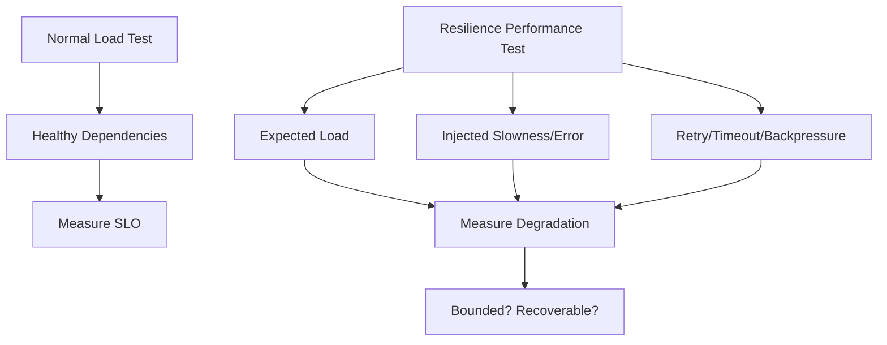
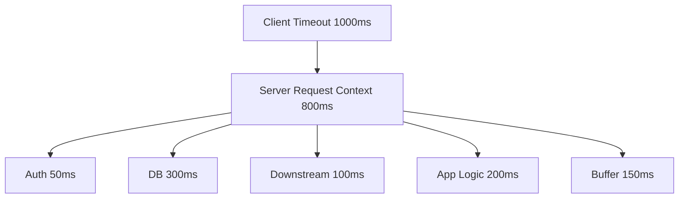
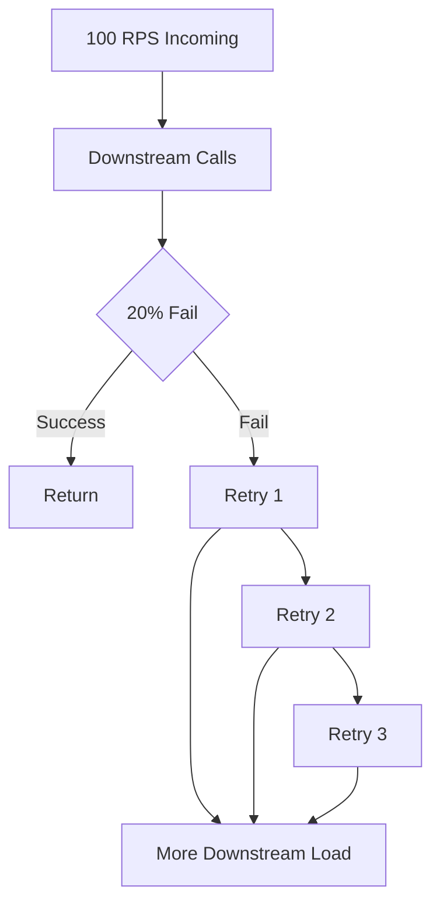
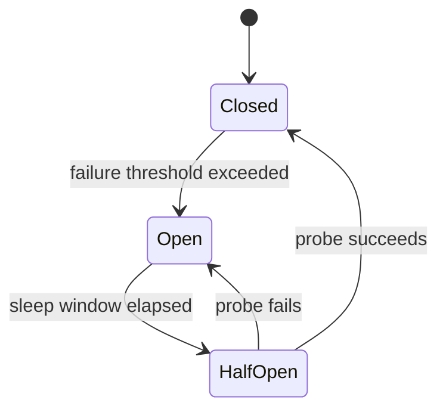
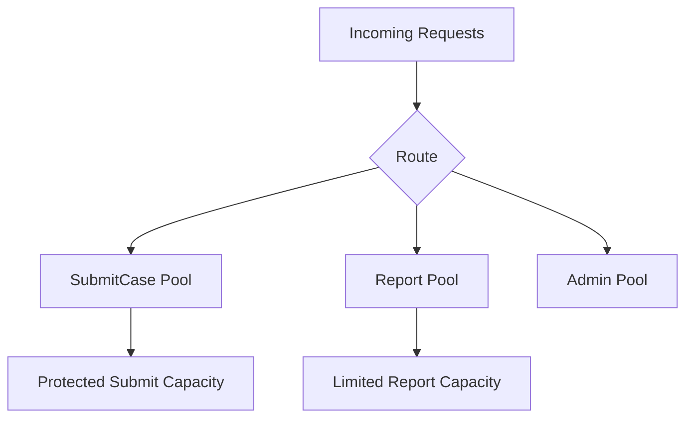
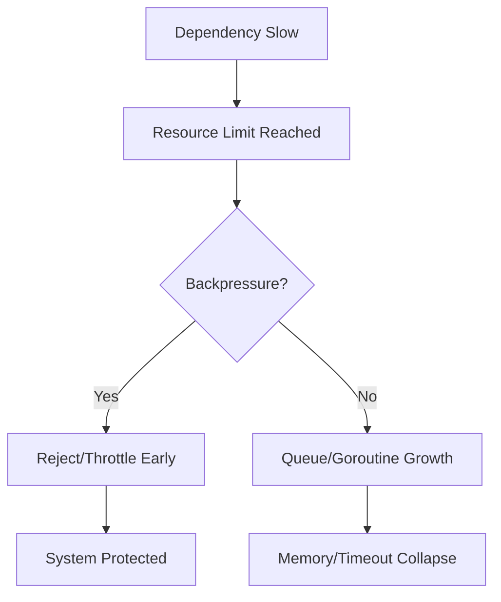
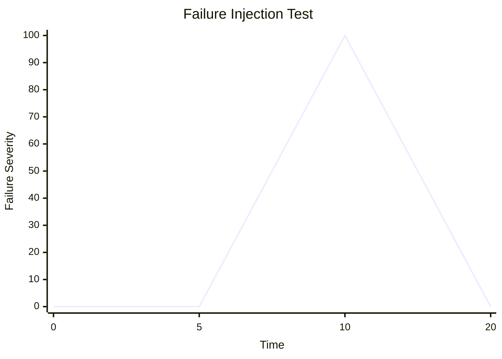

# learn-go-testing-benchmarking-performance-engineering-part-032.md

# Part 032 — Resilience-Oriented Performance Testing: Timeout, Retry, Backpressure, Degradation

> Seri: **Go Testing, Benchmarking, Performance Engineering**  
> Target pembaca: **Java Software Engineer → Go Performance-Capable Engineer**  
> Target Go: **Go 1.26.x**  
> Status seri: **Part 032 dari 034**  
> Prasyarat: Part 020–031, seri reliability/error handling, seri concurrency, seri HTTP/networking, seri observability/profiling/troubleshooting.

---

## 0. Tujuan Part Ini

Part sebelumnya membahas load, stress, spike, dan soak testing. Tetapi sistem production jarang gagal dalam kondisi “normal dan rapi”. Sistem gagal ketika:

- dependency lambat,
- downstream error,
- DB pool penuh,
- queue backlog,
- retry storm,
- cache stampede,
- timeout tidak dihormati,
- goroutine menumpuk,
- memory naik,
- request dibatalkan tetapi work tetap jalan,
- rate limit eksternal kena,
- partial outage,
- traffic spike bersamaan dengan dependency degradation.

Part ini membahas **resilience-oriented performance testing**:

> Menguji performance sistem bukan hanya saat semua dependency sehat, tetapi saat dunia sedang tidak ideal.

Tujuan akhirnya:

1. Service tidak collapse saat dependency lambat.
2. Retry tidak memperburuk overload.
3. Timeout benar-benar membatalkan work.
4. Queue bounded.
5. Backpressure bekerja.
6. Circuit breaker/load shedding mengurangi damage.
7. Degradation mode terkontrol.
8. Recovery setelah failure bersih.
9. Capacity envelope mencakup failure scenario.
10. Performance testing menjadi bagian dari reliability engineering.

---

## 1. Satu Kalimat Inti

> Resilience-oriented performance testing mengukur apakah service tetap bounded, predictable, dan recoverable ketika workload tinggi bertemu failure mode.

Bukan hanya:

```text
Berapa RPS saat semua sehat?
```

Tetapi:

```text
Apa yang terjadi pada RPS, latency, error rate, queue, memory, goroutine, dan downstream saat dependency lambat/error?
```

---

## 2. Mengapa Normal Load Test Tidak Cukup?

Normal load test:

```text
200 RPS
dependencies healthy
cache warm
DB normal
network normal
```

Bisa lulus.

Tetapi production incident sering terjadi karena kombinasi:

```text
200 RPS
DB latency naik 10x
retry aktif
queue tidak bounded
timeout terlalu panjang
client reconnect
autoscaling lambat
```

Jika tidak diuji, desain resilience hanya asumsi.

---

## 3. Failure Mode yang Harus Diuji

| Failure Mode | Risiko |
|---|---|
| downstream slow | p99 naik, goroutine menumpuk |
| downstream error | retry storm, error amplification |
| DB pool exhausted | low CPU but high latency |
| queue full | memory growth or blocking |
| cache miss storm | backend overload |
| token refresh storm | auth dependency overload |
| rate limit exceeded | 429 flood, retry loop |
| partial dependency failure | uneven routing, tail spikes |
| timeout ignored | work continues after client gone |
| cancellation ignored | wasted CPU/DB/downstream |
| circuit breaker absent | cascading failure |
| bulkhead absent | one dependency consumes all resources |
| load shedding absent | service dies instead of rejecting |
| unbounded retry | traffic amplification |
| unbounded concurrency | memory/goroutine explosion |

---

## 4. Diagram: Normal Load vs Failure-Aware Load



---

## 5. Core Principle: Boundedness

A resilient service keeps critical things bounded:

- request latency,
- in-flight requests,
- goroutine count,
- memory,
- queue length,
- retry attempts,
- downstream concurrency,
- DB connections,
- work after cancellation,
- failure propagation.

If any of these can grow without bound, overload can become outage.

---

## 6. Boundedness Checklist

```text
Do we bound:
  inbound request body size?
  handler duration?
  DB query duration?
  downstream call duration?
  retry count?
  retry total time?
  queue size?
  worker count?
  goroutines per request?
  memory per request?
  concurrent downstream calls?
  cache rebuild concurrency?
```

If not bounded, test failure mode.

---

## 7. Timeout Budget

Timeout budget is not one number. It is a hierarchy.

Example endpoint SLO:

```text
SubmitCase p95 < 300 ms
server timeout = 1 s
```

Budget:

```text
request context total: 800 ms
authz: 50 ms
DB transaction: 300 ms
downstream notification: async or 100 ms
response encode: 50 ms
buffer: 300 ms
```

Bad design:

```text
HTTP client timeout = 30s
DB timeout = none
server timeout = 60s
client timeout = 5s
```

Work continues long after client gave up.

---

## 8. Timeout Budget Diagram



---

## 9. Timeout Test

Test scenario:

```text
Downstream latency = 2 seconds
Service timeout for downstream = 200 ms
Load = 100 RPS
Duration = 10 minutes
```

Expected:

- service returns controlled error/degraded response around timeout,
- goroutine count stable,
- downstream concurrency bounded,
- memory stable,
- no retry storm,
- p99 bounded near timeout + overhead,
- recovery after downstream normalizes.

---

## 10. Timeout Test Metrics

- request p95/p99,
- timeout count,
- downstream in-flight calls,
- goroutine count,
- memory,
- HTTP client connection pool,
- DB pool if involved,
- retry count,
- error rate,
- recovery time.

---

## 11. Context Cancellation Correctness

In Go, cancellation usually flows through `context.Context`.

Correct:

```go
func (s *Service) Handle(ctx context.Context, req Request) error {
	ctx, cancel := context.WithTimeout(ctx, 300*time.Millisecond)
	defer cancel()

	return s.repo.Save(ctx, req)
}
```

But cancellation only works if downstream honors context.

Bad:

```go
func (r *Repo) Save(ctx context.Context, req Request) error {
	// ctx ignored
	_, err := r.db.Exec("INSERT ...")
	return err
}
```

Better:

```go
_, err := r.db.ExecContext(ctx, "INSERT ...")
```

Test cancellation under load.

---

## 12. Cancellation Test

Unit/component test:

```go
func TestRepoSaveHonorsContextCancellation(t *testing.T) {
	ctx, cancel := context.WithCancel(context.Background())
	cancel()

	err := repo.Save(ctx, req)
	if !errors.Is(err, context.Canceled) {
		t.Fatalf("err=%v, want context canceled", err)
	}
}
```

Performance/failure test:

```text
100 RPS
client timeout 200 ms
downstream sleeps 2s
verify goroutines/in-flight downstream do not grow
```

---

## 13. Retry Amplification

Retry can multiply traffic.

Example:

```text
Incoming traffic: 100 RPS
Downstream failure rate: 20%
Retries: 3
Worst additional attempts: 100 * 20% * 3 = 60 RPS
Downstream attempted RPS: 160
```

If downstream is already overloaded, retries worsen it.

---

## 14. Retry Amplification Diagram



---

## 15. Retry Budget

A retry budget bounds retries.

Example:

```text
max attempts: 2
max total retry time: 300 ms
backoff: exponential with jitter
retry only idempotent operations
do not retry validation/auth errors
respect context deadline
global retry budget per service
```

Retry policy must be tested under failure.

---

## 16. Retry Test

Scenario:

```text
Downstream returns 503 for 30% requests.
Service load = 200 RPS.
Retry max attempts = 2.
```

Measure:

- inbound RPS,
- downstream attempted RPS,
- retry count,
- final success rate,
- p95/p99,
- error rate,
- downstream saturation,
- recovery.

Expected:

- downstream attempted RPS bounded,
- retry stops when context expires,
- no unbounded goroutine/memory growth.

---

## 17. Jitter

Without jitter, retries synchronize.

Bad:

```text
all clients retry after exactly 100ms
```

This creates retry waves.

Better:

```text
exponential backoff + jitter
```

Test spike/failure scenario to see whether retries create periodic load waves.

---

## 18. Circuit Breaker

Circuit breaker stops calling failing dependency temporarily.

States:

```text
closed → open → half-open → closed
```

Purpose:

- reduce load on failing dependency,
- fail fast,
- protect resources,
- allow recovery probe.

Circuit breaker performance test:

```text
dependency error 100% for 2 minutes
load 100 RPS
expect:
  calls to dependency drop after breaker opens
  service fails fast/degrades
  p99 bounded
  recovery after dependency healthy
```

---

## 19. Circuit Breaker Diagram



---

## 20. Circuit Breaker Metrics

- breaker state,
- dependency calls/sec,
- rejected/fail-fast count,
- half-open probe count,
- success/failure rate,
- latency p95/p99,
- recovery time,
- error classification.

---

## 21. Bulkhead

Bulkhead isolates resources.

Example:

```text
Report generation should not consume all DB connections needed by SubmitCase.
```

Bulkhead patterns:

- separate worker pools,
- separate DB pools,
- separate queues,
- per-dependency concurrency limits,
- per-tenant limits,
- endpoint-specific rate limits.

Test:

```text
heavy report traffic + normal submit traffic
expect submit remains within SLO
```

---

## 22. Bulkhead Diagram



---

## 23. Load Shedding

Load shedding rejects work when capacity is insufficient.

Examples:

- HTTP 429 Too Many Requests,
- HTTP 503 Service Unavailable,
- reject low-priority requests,
- skip optional enrichment,
- use stale cache,
- degrade response detail.

Load shedding is better than collapse.

Test:

```text
load > capacity
expect:
  controlled 429/503
  p99 bounded for accepted requests
  memory stable
  service recovers
```

---

## 24. Graceful Degradation

Graceful degradation means service provides reduced functionality rather than total failure.

Examples:

- return case detail without optional recommendation,
- use stale permission cache for read-only page,
- disable expensive report preview,
- async email instead of synchronous send,
- skip non-critical audit enrichment but keep core audit.

Must be safe for domain/compliance.

Performance test should validate degraded path.

---

## 25. Degradation Policy

Define:

```text
If dependency X slow:
  optional enrichment disabled
  response includes degraded flag
  core transaction still works

If DB unavailable:
  write endpoints fail fast
  read endpoints may serve stale cache for <= 5 minutes if allowed

If queue full:
  reject new background jobs
  do not accept work silently
```

Do not invent degradation under incident. Design and test it.

---

## 26. Bounded Queue

Unbounded queue is a common outage source.

Bad:

```go
jobs := make(chan Job) // unbuffered may block; unbounded often custom slice grows
```

If custom queue grows without limit, memory can explode.

Better:

```go
jobs := make(chan Job, 1000)
```

But bounded queue needs policy:

- block?
- reject?
- drop oldest?
- drop low priority?
- backpressure upstream?
- return 429?

Test full queue behavior.

---

## 27. Queue Full Test

Scenario:

```text
worker processing slowed to 1 job/sec
incoming jobs = 100 jobs/sec
queue capacity = 1000
duration = 2 minutes
```

Expected:

- queue fills,
- service starts rejecting/throttling,
- memory stable,
- no goroutine leak,
- accepted jobs processed eventually or timeout,
- clear metrics/alerts.

---

## 28. Semaphore / Concurrency Limit

Limit expensive operations:

```go
type Limiter struct {
	sem chan struct{}
}

func NewLimiter(n int) *Limiter {
	return &Limiter{sem: make(chan struct{}, n)}
}

func (l *Limiter) Do(ctx context.Context, fn func(context.Context) error) error {
	select {
	case l.sem <- struct{}{}:
		defer func() { <-l.sem }()
		return fn(ctx)
	case <-ctx.Done():
		return ctx.Err()
	default:
		return ErrTooManyRequests
	}
}
```

Performance test:

- accepted latency,
- rejected count,
- memory/goroutine stability,
- fairness,
- recovery.

---

## 29. Semaphore Anti-Pattern

Bad:

```go
l.sem <- struct{}{} // blocks forever if full
```

Under overload, goroutines pile up.

Prefer context-aware acquire or fail-fast.

---

## 30. Backpressure End-to-End

Backpressure should propagate.

Example:

```text
DB slow → DB pool wait rises → service rejects non-critical requests → client backs off
```

Bad:

```text
DB slow → service queues all requests → memory grows → pod OOM → retries → outage
```

Test end-to-end.

---

## 31. Backpressure Diagram



---

## 32. Cache Stampede

Cache stampede occurs when many requests miss same key and all recompute/fetch.

Test:

```text
cache key expires
1000 concurrent requests hit key
```

Expected mitigation:

- singleflight/in-flight dedup,
- per-key lock,
- stale-while-revalidate,
- jittered TTL,
- bounded recomputation.

Metrics:

- backend calls per key,
- p99,
- error rate,
- goroutine count,
- backend saturation.

---

## 33. Token Refresh Storm

Auth/external API token refresh often causes incidents.

Scenario:

```text
token expires
many goroutines detect expired token
all refresh simultaneously
```

Expected:

- only one refresh in flight,
- others wait or use old token if safe,
- refresh timeout bounded,
- 401 retry bounded,
- no credential endpoint storm.

Test with concurrency and forced token expiry.

---

## 34. Rate Limit External API

If external API limit:

```text
300 requests/minute
```

Test:

- normal traffic below limit,
- burst above limit,
- sustained above limit,
- external 429 responses,
- token expiry during load.

Expected:

- local limiter caps outbound calls,
- queue/backpressure bounded,
- retry honors `Retry-After` if applicable,
- user-facing degradation controlled.

---

## 35. Hedging and Duplicate Requests

Hedged requests can reduce tail latency but increase load.

If used, test:

- normal tail improvement,
- dependency overload amplification,
- cancellation of loser requests,
- max hedge rate,
- effect on downstream.

Hedging without cancellation/backpressure can be dangerous.

---

## 36. Timeout Hierarchy Test

Test mismatch:

```text
client timeout = 1s
server handler timeout = 5s
DB timeout = 10s
```

Expected bad behavior:

- client gives up,
- server keeps DB work,
- goroutines and DB queries accumulate.

Correct hierarchy:

```text
client timeout >= server timeout >= dependency timeout
```

or at least consistent with desired ownership.

---

## 37. Cancellation After Client Disconnect

For HTTP handlers, test client disconnect.

Expected:

- request context canceled,
- DB/downstream calls cancel,
- background goroutines not leaked,
- no write after cancel panic/noise,
- resources released.

This often requires integration-style test or load test with early disconnects.

---

## 38. Slowloris / Slow Client

Performance resilience also includes slow clients.

Test:

- slow request body upload,
- slow response reader,
- many idle connections,
- header timeout.

Expected:

- read header timeout,
- max body size,
- read timeout,
- write timeout,
- connection limits.

This overlaps security/performance.

---

## 39. Large Payload Degradation

Test oversized payload:

- large JSON body,
- many fields,
- deeply nested data,
- huge arrays,
- invalid large payload.

Expected:

- max body size enforced,
- validation fails early,
- memory bounded,
- error response controlled,
- no CPU blowup.

---

## 40. Resilience Performance Test Matrix

Example matrix:

| Scenario | Load | Failure | Expected |
|---|---:|---|---|
| baseline | 200 RPS | none | SLO pass |
| downstream slow | 200 RPS | p95 2s | fail fast/degrade |
| downstream 50% 503 | 200 RPS | errors | retry bounded |
| DB pool small | 200 RPS | pool saturation | wait bounded/reject |
| cache stampede | burst 1000 | key expires | singleflight |
| queue full | 100 RPS | workers slow | bounded queue |
| spike | 50→500 RPS | none | controlled p99 |
| soak | 100 RPS 8h | none | no leaks |
| token refresh | 200 RPS | token expires | one refresh |
| rate limit | 500 RPS | external limit | local throttle |

---

## 41. Metrics for Resilience Perf

Track:

- p50/p95/p99,
- error classification,
- timeout count,
- retry count,
- rejected count,
- degraded response count,
- queue depth,
- queue wait,
- downstream calls/sec,
- downstream in-flight,
- circuit breaker state,
- rate limiter permits/denies,
- goroutine count,
- memory/heap,
- GC CPU,
- DB pool wait,
- worker utilization,
- recovery time.

---

## 42. Recovery Time

Failure test must include recovery phase.

Example:

```text
0–5m baseline
5–10m downstream failure
10–20m downstream healthy
```

Measure:

- how fast p95 returns,
- queue drains,
- breaker closes,
- goroutines stabilize,
- memory stabilizes,
- error rate returns to normal.

A system that cannot recover is not resilient.

---

## 43. Resilience Test Shape



Metrics should show bounded degradation and recovery.

---

## 44. Testing Retry With Context

Go code should check context before retrying.

Bad:

```go
for i := 0; i < maxRetries; i++ {
	err := call()
	if err == nil {
		return nil
	}
	time.Sleep(backoff(i))
}
```

Better:

```go
for i := 0; i < maxRetries; i++ {
	err := call(ctx)
	if err == nil {
		return nil
	}

	timer := time.NewTimer(backoff(i))
	select {
	case <-ctx.Done():
		timer.Stop()
		return ctx.Err()
	case <-timer.C:
	}
}
```

Test context cancellation under retry.

---

## 45. Testing Goroutine Leaks Under Failure

Failure paths often leak goroutines.

Test pattern:

```text
run failure scenario for 10m
stop load
wait 2m
goroutine count should return near baseline
```

Use goroutine profile if not.

Common leaks:

- ticker not stopped,
- response body not closed,
- goroutine blocked sending to channel,
- context not canceled,
- retry loop still sleeping,
- worker not exiting,
- subscription not closed.

---

## 46. Testing Memory Stability Under Failure

Memory can grow due to:

- queued requests,
- retry buffers,
- response body retained,
- error objects,
- cache growth,
- logs buffering,
- goroutine stacks,
- unclosed connections.

Measure:

- RSS,
- heap live,
- heap objects,
- allocation rate,
- GC cycles,
- memory after recovery.

---

## 47. Testing DB Pool Exhaustion

Scenario:

```text
DB query latency injected = 1s
DB pool max = 20
incoming = 100 RPS
```

Expected:

- pool wait rises,
- service times out/rejects,
- in-flight DB queries bounded by pool,
- goroutines do not grow unbounded,
- p99 bounded by timeout,
- recovery clean.

Bad:

- no DB timeout,
- goroutines wait forever,
- p99 grows,
- memory grows,
- retries amplify.

---

## 48. Testing Worker Pool Saturation

Scenario:

```text
worker pool = 10
task duration = 1s
incoming = 100 jobs/sec
queue = 1000
```

Expected:

- queue fills in about 11 seconds,
- service starts rejecting or throttling,
- memory stable,
- clear metrics,
- no accepted job lost silently.

---

## 49. Testing Async Degradation

If write endpoint enqueues background work:

```text
Submit succeeds only if durable core write succeeds.
Email/notification can degrade.
```

Failure test:

```text
notification queue full
SubmitCase load normal
```

Expected:

- core transaction still works if domain allows,
- notification failure recorded,
- retry/dead-letter bounded,
- user response policy clear,
- queue does not block critical path indefinitely.

---

## 50. Safety of Degradation

Some domains cannot degrade certain actions.

Example:

- audit trail cannot be silently skipped,
- authorization cannot use stale data beyond policy,
- payment cannot be “best effort”,
- compliance notification may be mandatory.

Performance resilience must respect domain invariants.

Document:

```text
degradable:
  optional recommendation
  UI enrichment
  email notification delay

non-degradable:
  authorization
  audit write
  core transaction consistency
```

---

## 51. Resilience Performance Report Template

```text
Test:
  SubmitCase_DownstreamSlow_200RPS

Objective:
  Validate bounded behavior when downstream notification service is slow.

Workload:
  200 RPS SubmitCase
  80% small, 15% medium, 5% large

Failure Injection:
  notification service latency = 2s
  duration = 5m failure, 10m recovery

Expected:
  core submit p95 < 400ms
  notification degraded count increases
  downstream in-flight <= 50
  goroutines stable
  memory stable
  no retry storm

Results:
  p95:
  p99:
  error:
  degraded:
  retry:
  downstream calls:
  goroutines:
  memory:
  recovery time:

Decision:
  pass/fail
  follow-up
```

---

## 52. Case Study: One External API Rate Limit

Scenario:

```text
External API limit = 300/minute
Service receives burst requiring 1000 lookups/minute
```

Bad design:

- all requests call external API,
- external returns 429,
- service retries immediately,
- token refresh also retried,
- p99 explodes.

Good design:

- local rate limiter at 250/minute,
- exact-key cache,
- in-flight dedup,
- bounded queue,
- retry respects 429/backoff,
- degraded response or async retry if allowed.

Test:

```text
burst 1000/minute for 5m
external 429 above 300/min
```

Metrics:

- outbound calls/min,
- 429 count,
- local rejects/degraded,
- cache hit,
- queue depth,
- p99,
- recovery.

---

## 53. Case Study: Cache Stampede in Permission Engine

Failure:

```text
permission cache expires for popular module
500 concurrent listing requests
each recomputes permissions
DB overloaded
```

Test:

```text
force cache expiry
send 500 concurrent requests
```

Expected:

- one recomputation per key,
- others wait/use stale if allowed,
- DB calls bounded,
- p99 acceptable,
- memory stable.

If not, add:

- singleflight,
- stale-while-revalidate,
- jittered TTL,
- per-key lock.

---

## 54. Case Study: Retry Storm

Failure:

```text
downstream returns 503 for 1 minute
service retries 3 times immediately
```

Observed:

```text
inbound 200 RPS
downstream attempted 800 RPS
downstream collapses
service p99 10s
timeouts 40%
```

Fix:

- retry only idempotent,
- max attempts 2,
- exponential backoff with jitter,
- circuit breaker,
- context deadline,
- global retry budget.

Retest to verify bounded downstream attempted RPS.

---

## 55. Integrating With CI/CD

Resilience perf tests are usually too heavy for PR gate.

Recommended:

```text
PR:
  unit/component tests for timeout/cancellation/retry policy
  small benchmark for critical hot path

Nightly:
  selected failure scenario tests in staging/perf env

Release:
  resilience performance test matrix for critical flows

GameDay:
  manual/automated chaos + performance scenarios
```

---

## 56. Unit Tests Supporting Resilience Perf

Examples:

- retry stops on context cancellation,
- backoff uses jitter,
- circuit breaker opens after threshold,
- semaphore acquire honors context,
- queue rejects when full,
- HTTP client timeout configured,
- response body closed,
- DB calls use context,
- singleflight deduplicates.

These make load failure tests easier to trust.

---

## 57. Component Test Example: Queue Full

```go
func TestQueueRejectsWhenFull(t *testing.T) {
	q := NewBoundedQueue(1)

	if err := q.Enqueue(Job{}); err != nil {
		t.Fatal(err)
	}

	err := q.Enqueue(Job{})
	if !errors.Is(err, ErrQueueFull) {
		t.Fatalf("err=%v, want ErrQueueFull", err)
	}
}
```

Then performance test validates behavior under load.

---

## 58. Component Test Example: Retry Honors Context

```go
func TestRetryStopsOnContextCancel(t *testing.T) {
	ctx, cancel := context.WithCancel(context.Background())
	cancel()

	attempts := 0
	err := Retry(ctx, RetryConfig{MaxAttempts: 3}, func(ctx context.Context) error {
		attempts++
		return ErrTemporary
	})

	if !errors.Is(err, context.Canceled) {
		t.Fatalf("err=%v, want context canceled", err)
	}
	if attempts > 1 {
		t.Fatalf("attempts=%d, want <= 1", attempts)
	}
}
```

---

## 59. Anti-Patterns

### 59.1 Only Testing Healthy Dependencies

Misses incident behavior.

### 59.2 Infinite Retry

Amplifies outage.

### 59.3 Timeout Longer Than Client Deadline

Wasted work.

### 59.4 Unbounded Queue

Memory collapse.

### 59.5 Blocking Semaphore Acquire Without Context

Goroutine pile-up.

### 59.6 Circuit Breaker Without Metrics

Cannot observe state.

### 59.7 Degradation Without Domain Approval

Fast but wrong.

### 59.8 Cache Stampede Ignored

Backend overload.

### 59.9 No Recovery Phase

Cannot know if system heals.

### 59.10 No Error Classification

All errors lumped together.

---

## 60. Review Checklist

### 60.1 Failure Scenario

- [ ] Failure mode explicit.
- [ ] Load level explicit.
- [ ] Duration explicit.
- [ ] Recovery phase included.
- [ ] Expected degraded behavior defined.

### 60.2 Bounds

- [ ] Timeout budget defined.
- [ ] Retry budget defined.
- [ ] Queue size bounded.
- [ ] Concurrency limit defined.
- [ ] Downstream calls bounded.
- [ ] Memory/goroutine growth bounded.

### 60.3 Metrics

- [ ] p95/p99.
- [ ] error classification.
- [ ] retry count.
- [ ] rejection/degraded count.
- [ ] queue depth.
- [ ] downstream in-flight/RPS.
- [ ] DB pool wait.
- [ ] goroutine count.
- [ ] memory/GC.
- [ ] recovery time.

### 60.4 Correctness

- [ ] Degradation respects domain invariants.
- [ ] Non-degradable actions fail safely.
- [ ] Cancellations honored.
- [ ] Idempotency considered for retry.
- [ ] No silent data loss.

### 60.5 Operations

- [ ] Alerts would fire.
- [ ] Dashboard supports diagnosis.
- [ ] Runbook clear.
- [ ] Rollback/mitigation known.

---

## 61. Practical Rules of Thumb

1. Test failure under load, not only success under load.
2. Every external call needs timeout.
3. Every retry needs budget and jitter.
4. Every queue needs bound and full policy.
5. Every expensive dependency needs concurrency limit.
6. Every degradation path needs domain approval.
7. Every timeout/cancellation must release resources.
8. Every overload scenario should recover.
9. Every failure test needs error classification.
10. Backpressure is better than collapse.
11. Retry without backpressure is dangerous.
12. Circuit breakers need metrics and validation.
13. Cache stampede needs explicit test.
14. Resilience performance belongs in release/nightly, not only incident retrospectives.

---

## 62. What to Remember

1. Healthy load test is necessary but insufficient.
2. Failure + load reveals real resilience.
3. Boundedness is the core property.
4. Timeout budgets must be hierarchical and enforced.
5. Retry can amplify failure.
6. Backpressure protects service and dependencies.
7. Circuit breakers fail fast when dependency is unhealthy.
8. Bulkheads isolate critical capacity.
9. Load shedding is a controlled failure mode.
10. Graceful degradation must respect business/domain invariants.
11. Recovery phase is part of the test.
12. Observe goroutines, memory, queues, retries, dependency calls.
13. Unit/component tests should support resilience policies.
14. Resilience performance testing is reliability engineering.

---

## 63. References

Official and primary sources:

- Go `context` package documentation: <https://pkg.go.dev/context>
- Go `net/http` package documentation: <https://pkg.go.dev/net/http>
- Go `database/sql` package documentation: <https://pkg.go.dev/database/sql>
- Go diagnostics documentation: <https://go.dev/doc/diagnostics>
- Go runtime package: <https://pkg.go.dev/runtime>
- Go `net/http/pprof`: <https://pkg.go.dev/net/http/pprof>
- Go blog — Context: <https://go.dev/blog/context>
- Go blog — Pipelines and cancellation: <https://go.dev/blog/pipelines>
- `singleflight` package: <https://pkg.go.dev/golang.org/x/sync/singleflight>
- `errgroup` package: <https://pkg.go.dev/golang.org/x/sync/errgroup>

---

## 64. Next Part

Part berikutnya:

```text
learn-go-testing-benchmarking-performance-engineering-part-033.md
```

Judul:

```text
Performance Debugging Playbook: From Regression Signal to Root Cause
```

Kita akan membahas:

- triage regression,
- benchmark vs profile vs load metrics,
- CPU/heap/mutex/block/goroutine profile decision tree,
- bisecting,
- escape analysis,
- trace,
- runtime metrics,
- dependency diagnosis,
- dan playbook praktis dari “p95 naik” sampai root cause.

---

## Status Seri

```text
Part 032 dari 034 selesai.
Seri belum selesai.
```


<!-- NAVIGATION_FOOTER -->
<div class="page-nav">
<a href="./learn-go-testing-benchmarking-performance-engineering-part-031.md">⬅️ Part 031 — Load, Stress, Spike & Soak Testing for Go Services</a>
<a href="./index.md">📚 Kategori</a>
<a href="../../index.md">🏠 Home</a>
<a href="./learn-go-testing-benchmarking-performance-engineering-part-033.md">Part 033 — Performance Debugging Playbook: From Regression Signal to Root Cause ➡️</a>
</div>
