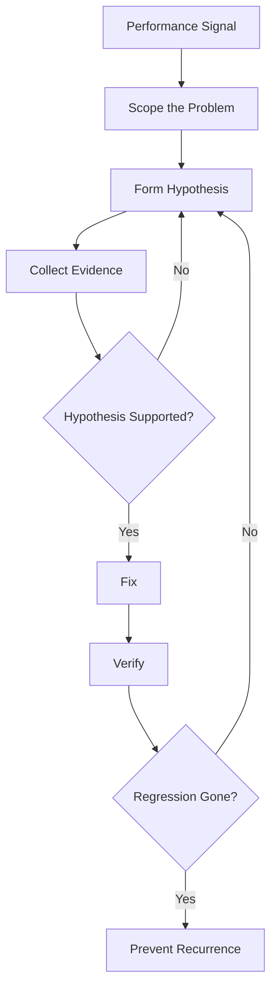
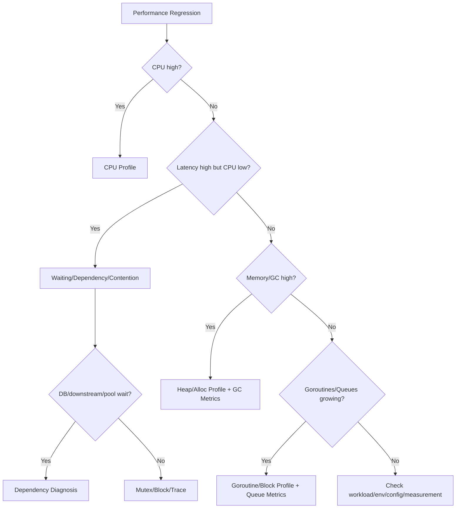

# learn-go-testing-benchmarking-performance-engineering-part-033.md

# Part 033 — Performance Debugging Playbook: From Regression Signal to Root Cause

> Seri: **Go Testing, Benchmarking, Performance Engineering**  
> Target pembaca: **Java Software Engineer → Go Performance-Capable Engineer**  
> Target Go: **Go 1.26.x**  
> Status seri: **Part 033 dari 034**  
> Prasyarat: Part 020–032, seri observability/profiling/troubleshooting, seri memory system, seri concurrency, seri SQL/database integration.

---

## 0. Tujuan Part Ini

Part ini adalah **playbook investigasi performance**.

Sampai sekarang kita sudah membahas:

- testing,
- benchmark,
- allocation benchmark,
- parallel benchmark,
- benchmark statistics,
- microbenchmark traps,
- scenario benchmark,
- performance mental model,
- runtime variables,
- PGO,
- CI regression gates,
- load/stress/spike/soak test,
- resilience-oriented performance testing.

Sekarang pertanyaan praktisnya:

> Ketika sinyal performance buruk muncul, bagaimana cara bergerak dari “ada regresi” ke “ini root cause-nya dan ini fix yang tepat”?

Part ini membahas:

1. Jenis sinyal performance.
2. Triage awal.
3. Decision tree CPU vs memory vs contention vs dependency.
4. Cara memakai benchmark output.
5. Cara memakai CPU profile.
6. Cara memakai heap/alloc profile.
7. Cara memakai mutex/block/goroutine profile.
8. Cara memakai execution trace.
9. Cara memakai runtime metrics.
10. Cara memakai escape analysis.
11. Cara memakai bisect.
12. Cara mendiagnosis DB/downstream bottleneck.
13. Cara membuat hypothesis-driven investigation.
14. Cara menutup investigasi dengan evidence, bukan tebakan.

---

## 1. Satu Kalimat Inti

> Performance debugging yang baik bukan mencari optimisasi acak, tetapi mengubah sinyal menjadi hipotesis, menguji hipotesis dengan data yang tepat, memperbaiki bottleneck yang terbukti, lalu memverifikasi ulang.

Debugging performance harus seperti scientific investigation:

```text
signal → scope → hypothesis → measurement → root cause → fix → verification → prevention
```

---

## 2. Diagram: Performance Debugging Loop



---

## 3. Performance Signals

Common signals:

| Signal | Possible Meaning |
|---|---|
| benchmark `ns/op` regression | code hot path slower |
| benchmark `B/op` regression | allocation increased |
| benchmark `allocs/op` regression | object count increased |
| p95/p99 latency regression | queueing, dependency, GC, contention |
| throughput drop | bottleneck or resource cap |
| CPU increase | more work, GC, spin, bad algorithm |
| CPU low + latency high | waiting: DB/downstream/pool/lock |
| memory growth | leak, cache, queue, retained heap |
| GC CPU increase | allocation/live heap pressure |
| goroutine count growth | leak/blocking/backlog |
| DB pool wait | pool saturation/query latency |
| queue backlog | consumers slower than producers |
| retry count increase | dependency instability |
| error/timeout increase | overload or failure |

---

## 4. First Rule: Do Not Optimize Yet

When you see:

```text
p99 increased from 500ms to 2s
```

Do not immediately:

- rewrite code,
- add cache,
- increase pool,
- increase replicas,
- tune `GOGC`,
- add goroutines,
- add retry.

First:

```text
What changed?
Where is time spent?
Is it CPU, waiting, memory, contention, dependency, or load?
```

Premature fixes often move the bottleneck or hide the signal.

---

## 5. Triage Questions

Ask:

1. Is this benchmark, load test, or production signal?
2. When did it start?
3. What changed: code, config, traffic, data, dependency, Go version, infra?
4. Which endpoint/operation?
5. Is it p50, p95, p99, or all?
6. Did throughput change?
7. Did error rate change?
8. Did CPU change?
9. Did memory/GC change?
10. Did goroutine count change?
11. Did DB pool wait change?
12. Did downstream latency/error change?
13. Is it reproducible?
14. Is it environment-specific?
15. Is it tied to deploy?

---

## 6. Debugging Decision Tree



---

## 7. Scope First: Benchmark vs Scenario vs Production

### Benchmark regression

Use:

- `benchstat`,
- inspect benchmark code,
- compare benchmark semantics,
- profile benchmark if needed,
- escape analysis if allocation changed.

### Scenario/load regression

Use:

- load generator report,
- service metrics,
- profiles during steady-state,
- dependency metrics,
- runtime metrics.

### Production regression

Use:

- deploy timeline,
- traffic shift,
- dashboards,
- distributed tracing,
- logs,
- profiles if safe,
- canary comparison.

Do not use one tool for all.

---

## 8. Benchmark Regression Playbook

Signal:

```text
BenchmarkBuildAllowedActions/100Rules:
  time/op +35%
  B/op +200%
  allocs/op +300%
```

Steps:

1. Confirm repeated with `benchstat`.
2. Check benchmark code changed?
3. Check Go version/runtime changed?
4. Check workload fixture changed?
5. Inspect code diff.
6. Run focused benchmark locally.
7. If allocation changed, run `-benchmem`, heap/alloc profile, escape analysis.
8. If time changed without allocation, CPU profile.
9. If parallel benchmark changed, run `-cpu` matrix.
10. Fix root cause.
11. Verify old vs new with `benchstat`.
12. Add regression test/gate if critical.

---

## 9. Benchmark Regression Commands

```bash
# Reproduce with count.
go test -run='^$' -bench=BenchmarkBuildAllowedActions -benchmem -count=10 ./internal/authz > result.txt

# Compare old/new.
benchstat old.txt new.txt

# CPU profile.
go test -run='^$' -bench=BenchmarkBuildAllowedActions -benchtime=10s -cpuprofile=cpu.out ./internal/authz

# Heap profile.
go test -run='^$' -bench=BenchmarkBuildAllowedActions -benchtime=10s -memprofile=mem.out ./internal/authz

# Escape analysis.
go test -run='^$' -bench=BenchmarkBuildAllowedActions -benchmem -gcflags='all=-m=2' ./internal/authz 2> escape.txt
```

---

## 10. CPU Profile Playbook

Use CPU profile when:

- CPU is high,
- `ns/op` regressed but allocation unchanged,
- load test CPU increased,
- service throughput CPU-bound,
- profile needed to rank hot functions.

Collect from benchmark:

```bash
go test -run='^$' -bench=BenchmarkX -benchtime=10s -cpuprofile=cpu.out ./internal/foo
```

Inspect:

```bash
go tool pprof cpu.out
```

Useful commands inside pprof:

```text
top
top -cum
list FunctionName
web
peek regexp
```

---

## 11. CPU Profile Interpretation

`top` shows functions with high flat CPU.

`top -cum` shows cumulative cost including callees.

Flat CPU high:

```text
function itself doing CPU work
```

Cumulative high but flat low:

```text
function calls expensive children
```

Common causes:

- algorithmic regression,
- repeated parsing,
- reflection,
- JSON encode/decode,
- regexp,
- crypto/hashing,
- excessive sorting,
- string conversions,
- logging formatting,
- compression,
- lock spin/contention indirectly,
- GC CPU in runtime.

---

## 12. CPU Profile Example

Before:

```text
flat   cum
20%    25%   encoding/json.Marshal
10%    15%   BuildAllowedActions
```

After:

```text
flat   cum
45%    55%   regexp.(*Regexp).doExecute
20%    60%   ValidateRule
```

Hypothesis:

```text
New validation calls regexp per rule per case.
```

Fix:

- precompile regexp,
- avoid regexp if simple parser enough,
- validate once,
- cache compiled policy.

Verify with benchmark/load.

---

## 13. Heap / Allocation Profile Playbook

Use heap/alloc profile when:

- `B/op` increased,
- `allocs/op` increased,
- GC CPU high,
- memory grows,
- RSS high,
- p99 worsens with allocation rate.

Collect:

```bash
go test -run='^$' -bench=BenchmarkX -benchtime=10s -memprofile=mem.out ./internal/foo
go tool pprof -alloc_space mem.out
go tool pprof -alloc_objects mem.out
go tool pprof -inuse_space mem.out
go tool pprof -inuse_objects mem.out
```

Different views answer different questions.

---

## 14. `alloc_space` vs `inuse_space`

| Profile View | Meaning | Use |
|---|---|---|
| `alloc_space` | total allocated over time | allocation churn |
| `alloc_objects` | total objects allocated | object count churn |
| `inuse_space` | live retained heap | memory retention |
| `inuse_objects` | live object count | leak/retention object count |

If GC pressure high:

```text
alloc_space / alloc_objects
```

If memory leak/retention:

```text
inuse_space / inuse_objects
```

---

## 15. Allocation Regression Example

Before:

```text
BuildResponse:
  256 KiB/op
```

After:

```text
BuildResponse:
  2 MiB/op
```

`alloc_space` shows:

```text
60% bytes.Buffer.String
20% fmt.Sprintf
10% map[string]any construction
```

Hypotheses:

- new response builder converts buffer to string repeatedly,
- new logging formats per item,
- new generic map mapping creates many objects.

Fix based on confirmed source.

---

## 16. Escape Analysis Playbook

Use escape analysis when:

- allocation appears unexpected,
- `allocs/op` changes after refactor,
- interface/generic call shape changed,
- pointer return introduced,
- closure/goroutine capture introduced.

Command:

```bash
go test -run='^$' -bench=BenchmarkX -gcflags='all=-m=2' ./internal/foo 2> escape.txt
```

Search:

```text
escapes to heap
moved to heap
does not escape
```

Do not overreact to every escape. Focus on hot path allocation confirmed by benchmark/profile.

---

## 17. Escape Root Causes

Common causes:

- returning pointer,
- storing in interface,
- closure capture,
- goroutine capture,
- `fmt`/reflection,
- map/slice allocation,
- large value escape,
- assigning to global,
- `append` causing heap allocation,
- taking address and keeping beyond call,
- method value capture.

Fixes:

- change API shape,
- preallocate,
- avoid unnecessary interface,
- avoid closure in hot loop,
- pass buffer,
- return value not pointer if appropriate,
- avoid reflection in hot path.

---

## 18. Mutex Profile Playbook

Use mutex profile when:

- CPU not fully high but throughput poor,
- parallel benchmark worsens with `-cpu`,
- p99 high under concurrency,
- suspected lock contention.

Enable in code/test:

```go
runtime.SetMutexProfileFraction(1)
```

In benchmark/test:

```bash
go test -run='^$' -bench=BenchmarkX -mutexprofile=mutex.out ./internal/foo
go tool pprof mutex.out
```

Mutex profile shows time goroutines spend waiting on contended mutexes.

---

## 19. Block Profile Playbook

Use block profile when goroutines block on:

- channel send/receive,
- select,
- mutex-like primitives,
- condition variables,
- semaphores.

Enable:

```go
runtime.SetBlockProfileRate(1)
```

Command:

```bash
go test -run='^$' -bench=BenchmarkX -blockprofile=block.out ./internal/foo
go tool pprof block.out
```

Useful for:

- channel bottlenecks,
- queue full,
- worker pool waits,
- semaphore waits,
- pipeline stalls.

---

## 20. Goroutine Profile Playbook

Use goroutine profile when:

- goroutine count grows,
- service doesn't recover after load,
- suspected leak,
- deadlock,
- many goroutines waiting.

Collect from pprof endpoint:

```bash
go tool pprof http://host/debug/pprof/goroutine
```

Or get stack dump:

```bash
curl http://host/debug/pprof/goroutine?debug=2
```

Look for repeated stack patterns:

- blocked on channel send,
- waiting on mutex,
- sleeping retry,
- stuck in DB call,
- reading response body,
- ticker loop,
- context not canceled.

---

## 21. Execution Trace Playbook

Use execution trace when:

- scheduler behavior complex,
- latency spikes unexplained,
- goroutine blocking/wakeup matters,
- network/syscall interactions,
- GC/scheduler interplay,
- parallelism underutilized.

Collect from benchmark:

```bash
go test -run='^$' -bench=BenchmarkX -trace=trace.out ./internal/foo
go tool trace trace.out
```

Trace is detailed but more complex than profiles.

Use when profiles are insufficient.

---

## 22. Runtime Metrics Playbook

Runtime metrics help correlate:

- allocation rate,
- heap live,
- GC cycles,
- goroutine count,
- scheduler,
- memory limit,
- CPU.

In production, expose via metrics stack.

Look for:

```text
heap live rising
alloc rate rising
GC CPU rising
goroutines rising
memory limit pressure
```

Use benchmark `B/op` to estimate expected allocation rate, then compare production.

---

## 23. Dependency Diagnosis Playbook

If CPU low and latency high:

Check dependencies:

- DB query latency,
- DB pool wait,
- downstream HTTP latency,
- downstream error rate,
- queue wait,
- cache miss rate,
- external rate limits,
- DNS/TLS/connect latency,
- connection pool exhaustion.

Symptoms:

```text
CPU 30%
p99 5s
DB pool wait p95 4s
```

Root cause likely not Go CPU.

---

## 24. DB Diagnosis

Check:

- connection pool in-use,
- wait count/time,
- query latency,
- slow query logs,
- locks,
- index usage,
- transaction duration,
- rows scanned,
- result size,
- N+1 queries,
- connection max lifetime,
- context deadlines,
- retry behavior.

Go side:

- `database/sql` stats,
- use `QueryContext`/`ExecContext`,
- close rows,
- scan cost,
- transaction scope,
- pool config.

---

## 25. Downstream HTTP Diagnosis

Check:

- connection pool reuse,
- max idle connections,
- per-host limit,
- TLS handshake,
- DNS latency,
- request timeout,
- response body close,
- retry count,
- circuit breaker,
- rate limit,
- downstream p95/p99.

Common Go bug:

```go
resp, err := client.Do(req)
if err != nil { ... }
defer resp.Body.Close()
```

If body not fully read/closed appropriately, connection reuse can suffer.

---

## 26. Queue Diagnosis

If backlog grows:

```text
arrival rate > service rate
```

Check:

- producer rate,
- consumer throughput,
- worker count,
- handler time,
- downstream bottleneck,
- retry/dead-letter,
- poison messages,
- ack behavior,
- prefetch,
- queue partitioning.

Benchmark handler cost helps estimate consumer capacity, but load/queue metrics confirm.

---

## 27. Lock/Contention Diagnosis

Symptoms:

- parallel benchmark worsens with more CPU,
- CPU not fully used,
- p99 high,
- mutex/block profile hotspots,
- goroutines waiting.

Fix options:

- reduce critical section,
- avoid lock in hot path,
- shard lock,
- immutable snapshot,
- atomic where appropriate,
- per-goroutine/local state,
- copy-on-write,
- queue ownership model.

Do not replace mutex with atomic blindly.

---

## 28. GC Diagnosis

Symptoms:

- GC CPU high,
- allocation rate high,
- p99 spikes correlate with GC,
- heap grows,
- memory limit pressure,
- benchmark `B/op` high.

Investigation:

- allocation profile,
- heap live profile,
- scenario benchmark allocation,
- `GODEBUG=gctrace=1`,
- runtime metrics,
- check recent code for allocation.

Fix:

- reduce allocation,
- reduce live heap,
- preallocate,
- avoid per-item maps/strings,
- pool carefully,
- tune `GOGC`/`GOMEMLIMIT` only with evidence.

---

## 29. Algorithmic Regression Diagnosis

Symptoms:

- latency grows superlinearly with input size,
- benchmark size matrix reveals O(n²),
- CPU profile points to loops/sort/search,
- DB query count grows with rows.

Use size benchmark:

```go
func BenchmarkBuildListingScaling(b *testing.B) {
	for _, n := range []int{10, 100, 1000, 10000} {
		b.Run(fmt.Sprintf("n=%d", n), func(b *testing.B) {
			...
		})
	}
}
```

Plot or inspect growth.

---

## 30. N+1 Diagnosis

Symptoms:

- scenario benchmark time grows with item count,
- DB query count grows linearly with rows,
- DB pool wait high,
- CPU low.

Test invariant:

```go
if repo.QueryCount() > 3 {
	t.Fatalf("query count=%d, want <=3", repo.QueryCount())
}
```

Fix:

- batch query,
- prefetch,
- join/materialized view,
- caching,
- data loader pattern,
- API shape change.

---

## 31. Bisect Playbook

Use when regression introduced somewhere in commit range.

```bash
git bisect start
git bisect bad HEAD
git bisect good <known-good>
```

Automated script concept:

```bash
#!/usr/bin/env bash
set -euo pipefail

go test -run='^$' -bench=BenchmarkX -benchmem -count=5 ./internal/foo > result.txt

# Parse result and exit 0 for good, 1 for bad.
```

Caveat:

- benchmark noise can break bisect,
- use stable runner,
- clear threshold,
- repeat enough,
- prefer large regression.

---

## 32. Compare Code, Config, Data, Environment

Performance regression may not be code.

Check:

| Category | Examples |
|---|---|
| code | algorithm, allocation, lock, retry |
| config | pool size, timeout, GOGC, feature flag |
| data | table size, payload size, skew, cache miss |
| traffic | endpoint mix, tenant mix, spike |
| dependency | DB index, downstream latency |
| infra | CPU quota, memory limit, node type |
| Go version | compiler/runtime changes |
| observability | logging/tracing overhead |
| security | new validation/auth checks |

---

## 33. Logging/Tracing Overhead Diagnosis

Symptoms:

- CPU increase after adding logs/traces,
- allocation increase,
- p99 worsens,
- IO/log pipeline backpressure.

Check:

- log level,
- formatting cost,
- structured field allocation,
- synchronous appender,
- trace sampling rate,
- span attribute size,
- baggage propagation,
- log volume under error.

Fix:

- lazy logging,
- reduce high-cardinality fields,
- sample traces,
- avoid formatting disabled logs,
- async/bounded logging pipeline,
- drop/limit debug logs.

---

## 34. Feature Flag Diagnosis

Feature flags can change performance.

Check:

- new feature enabled?
- flag evaluation cost?
- remote config latency?
- per-request flag fetch?
- experiment branch causing extra work?
- partial rollout causing mixed metrics?

Benchmark both flag states.

---

## 35. Profile Diffing

When comparing profiles:

```text
old CPU profile
new CPU profile
```

Use pprof diff mode conceptually:

```bash
go tool pprof -base old_cpu.out new_cpu.out
```

This helps identify what grew.

Same for heap profiles.

Profile diff is powerful for regressions.

---

## 36. Root Cause Evidence Quality

Weak:

```text
I think JSON is slow.
```

Better:

```text
CPU profile during 200 RPS load shows encoding/json.Marshal increased from 12% to 38% cumulative after commit abc123. Benchmark BuildResponseLarge regressed +42% and allocation increased 3x. Diff shows new per-case map[string]any mapping before JSON encode.
```

Evidence should connect signal to code.

---

## 37. Fix Verification

After fix:

1. rerun focused benchmark,
2. rerun scenario benchmark,
3. rerun load test if system-level,
4. compare with `benchstat`,
5. check allocation,
6. check profiles if needed,
7. ensure correctness tests pass,
8. monitor production/canary.

Do not stop at “code looks better”.

---

## 38. Prevention

After root cause:

- add benchmark gate,
- add unit test invariant,
- add metric/alert,
- add dashboard panel,
- document performance budget,
- update runbook,
- improve code review checklist,
- add load test scenario,
- add regression fixture.

The goal is not only to fix once, but to prevent repeat.

---

## 39. Incident-Style Performance Report

Template:

```text
Summary:
  p99 for SubmitCase increased from 800ms to 3s after release 2026.06.23.

Impact:
  12% requests exceeded SLO for 40 minutes.

Detection:
  Alert on p99 latency and DB pool wait.

Timeline:
  ...

Root Cause:
  New audit enrichment introduced N+1 query per applicant.
  DB query count increased from 4 to 4+N.

Evidence:
  DB pool wait p95 20ms -> 900ms.
  Scenario benchmark SubmitCaseLarge regressed 2.5x.
  Spy repo test showed query count increased.
  Trace showed per-applicant query.

Fix:
  Batch fetch enrichment data.
  Added query count invariant test.
  Added scenario benchmark gate.

Verification:
  Load test 200 RPS p95 back to 260ms.
  DB pool wait p95 12ms.
```

---

## 40. Playbook: p99 Up, CPU Low

Likely waiting.

Steps:

1. Check DB pool wait.
2. Check downstream latency.
3. Check queue depth.
4. Check goroutine profile.
5. Check block profile.
6. Check locks/semaphores.
7. Check retries/timeouts.
8. Check request context deadlines.
9. Check network/connect/TLS.
10. Check load generator/client.

Do not start with CPU micro-optimization.

---

## 41. Playbook: p99 Up, CPU High

Likely CPU/GC.

Steps:

1. CPU profile during issue.
2. Check GC CPU/alloc rate.
3. Heap/alloc profile.
4. Compare recent code.
5. Benchmark hot path.
6. Check logging/tracing.
7. Check input size/traffic mix.
8. Check algorithm scaling.
9. Check PGO/Go version/runtime changes.
10. Fix and verify.

---

## 42. Playbook: Memory Rising

Steps:

1. Is RSS or Go heap rising?
2. Is heap live rising or allocation churn?
3. Check inuse heap profile.
4. Check goroutine count.
5. Check queues/caches.
6. Check response body closure.
7. Check map/slice retention.
8. Check sync.Pool retention.
9. Check large buffers.
10. Run soak test.
11. Verify after fix.

---

## 43. Playbook: Throughput Drops

Steps:

1. Check error/timeout rate.
2. Check CPU.
3. Check DB/downstream capacity.
4. Check queue backlog.
5. Check rate limiter/circuit breaker.
6. Check lock contention.
7. Check GC.
8. Check autoscaling/pod count.
9. Check load generator.
10. Check recent config/deploy.

---

## 44. Playbook: Allocation Regression

Steps:

1. Confirm `B/op`/`allocs/op` with `benchstat`.
2. Run allocation profile.
3. Run escape analysis if needed.
4. Inspect code diff for maps/slices/fmt/json/reflect/closures.
5. Check benchmark harness allocation.
6. Fix source.
7. Add `AllocsPerRun` if zero-alloc contract.
8. Verify with benchmark.

---

## 45. Playbook: Parallel Benchmark Regression

Steps:

1. Run `-cpu=1,2,4,8,16`.
2. Compare scaling curve.
3. Check shared state/atomic index in benchmark.
4. Run mutex/block profile.
5. Check false sharing/hot key.
6. Check allocation under concurrency.
7. Check scheduler/goroutine behavior.
8. Compare sharded/local designs.
9. Verify with production-like workload.

---

## 46. Playbook: DB Pool Wait Regression

Steps:

1. Check pool stats: in-use, wait count/time.
2. Check query latency.
3. Check query count per request.
4. Check transaction duration.
5. Check rows scanned/index plan.
6. Check connection leaks.
7. Check context timeouts.
8. Check retry behavior.
9. Check DB CPU/locks.
10. Fix query/pool/architecture.

---

## 47. Playbook: Retry Storm

Steps:

1. Measure inbound vs downstream attempted RPS.
2. Measure retry count by reason.
3. Check retry policy/idempotency.
4. Check backoff and jitter.
5. Check context deadline.
6. Check circuit breaker.
7. Check global retry budget.
8. Reproduce with failure load test.
9. Fix and verify bounded attempts.

---

## 48. Tool Selection Matrix

| Symptom | First Tools |
|---|---|
| benchmark time regression | benchstat, CPU profile |
| benchmark allocation regression | benchmem, memprofile, escape analysis |
| high CPU production | CPU profile, runtime metrics |
| high memory | heap profile, goroutine profile |
| p99 high CPU low | traces, DB/downstream metrics, block profile |
| lock contention | mutex profile, block profile |
| goroutine leak | goroutine profile, trace |
| scheduler mystery | execution trace |
| DB bottleneck | DB metrics, sql stats, traces |
| retry storm | metrics/logs, failure load test |
| Go upgrade regression | benchmark suite, release notes, profile diff |

---

## 49. Debugging Anti-Patterns

### 49.1 Optimizing Before Measuring

Wastes time.

### 49.2 Looking Only at CPU

Many latency issues are waiting.

### 49.3 Looking Only at Average

Tail matters.

### 49.4 Ignoring Allocation

GC pressure hides in p99.

### 49.5 Ignoring Benchmark Validity

Benchmark regression may be benchmark bug.

### 49.6 Ignoring Environment Change

CPU quota/Go version/config can be root cause.

### 49.7 Fixing Symptom Not Cause

Increasing timeout hides downstream slowness.

### 49.8 Adding Retry to Fix Timeout

Can amplify outage.

### 49.9 Tuning GC First

Often allocation/design is the real issue.

### 49.10 No Verification

Fix not proven.

---

## 50. Investigation Checklist

### 50.1 Scope

- [ ] Signal identified.
- [ ] Affected endpoint/operation identified.
- [ ] Start time known.
- [ ] Recent changes listed.
- [ ] Environment/runtime known.

### 50.2 Metrics

- [ ] p50/p95/p99.
- [ ] RPS.
- [ ] errors/timeouts.
- [ ] CPU.
- [ ] memory/GC.
- [ ] goroutines.
- [ ] DB pool/wait.
- [ ] downstream latency/errors.
- [ ] queue depth.
- [ ] retry count.

### 50.3 Evidence

- [ ] benchmark comparison if code-level.
- [ ] CPU profile if CPU high.
- [ ] heap profile if memory/allocation high.
- [ ] block/mutex profile if waiting/contended.
- [ ] goroutine profile if leak/block.
- [ ] trace if scheduler/complex blocking.
- [ ] dependency metrics if CPU low.

### 50.4 Resolution

- [ ] root cause stated.
- [ ] fix tied to evidence.
- [ ] correctness tests pass.
- [ ] benchmark/load verification.
- [ ] regression prevention added.
- [ ] report written.

---

## 51. Case Study: Listing Page Regression

### 51.1 Signal

Nightly benchmark:

```text
BenchmarkBuildListingPage/100Cases:
  2.1ms -> 5.8ms
  2MiB/op -> 12MiB/op
```

Production:

```text
listing p95 250ms -> 900ms
CPU 55% -> 80%
GC CPU increased
```

### 51.2 Investigation

Allocation profile:

```text
map[string]any construction 45%
encoding/json.Marshal 25%
fmt.Sprintf 10%
```

Code diff:

```text
new generic mapper builds map[string]any per case before DTO construction
```

### 51.3 Fix

Replace per-case map mapper with typed struct mapping and preallocated slice.

### 51.4 Verification

```text
benchmark back to 2.4ms
B/op 2.5MiB
production canary p95 back to 280ms
GC CPU normalized
```

### 51.5 Prevention

- benchmark gate for listing scenario,
- allocation threshold,
- code review checklist for per-item map/reflection.

---

## 52. Case Study: p99 Timeout with Low CPU

### 52.1 Signal

```text
p99 SubmitCase = 5s
CPU = 35%
error timeout = 8%
```

### 52.2 Metrics

```text
DB pool wait p95 = 3.8s
DB query latency p95 = 80ms
pool in-use = max
```

### 52.3 Root Cause

New transaction scope held connection while calling external notification service.

### 52.4 Fix

Move external call outside transaction; make notification async.

### 52.5 Verification

```text
DB pool wait p95 = 15ms
p99 = 700ms
CPU unchanged
```

Lesson:

> CPU low + latency high often means waiting.

---

## 53. Case Study: Retry Storm

### 53.1 Signal

Downstream outage caused app CPU and outbound calls to spike.

```text
inbound: 200 RPS
downstream attempted: 900 RPS
p99: 12s
timeouts: 40%
```

### 53.2 Root Cause

Immediate retry 3 times, no jitter, context ignored during sleep.

### 53.3 Fix

- max attempts 2,
- exponential backoff with jitter,
- context-aware sleep,
- circuit breaker,
- downstream concurrency limit.

### 53.4 Verification

Failure load test:

```text
downstream attempted <= 260 RPS
p99 bounded
service recovers after downstream healthy
```

---

## 54. Case Study: Goroutine Leak in Soak Test

### 54.1 Signal

8-hour soak:

```text
goroutines 300 -> 80,000
memory rising
p99 rising
```

### 54.2 Goroutine Profile

Repeated stack:

```text
goroutine ... blocked on channel send
  eventPublisher.PublishAsync.func1
```

### 54.3 Root Cause

Async publisher spawned goroutine per event and sent to full channel without context/select.

### 54.4 Fix

- bounded worker pool,
- context-aware enqueue,
- drop/reject policy,
- metrics for queue full.

### 54.5 Verification

Soak rerun:

```text
goroutines stable 400–600
memory stable
queue full metric visible under overload
```

---

## 55. Practical Command Cheatsheet

```bash
# Benchmark with stats.
go test -run='^$' -bench=BenchmarkX -benchmem -count=10 ./internal/foo > result.txt

# Compare.
benchstat old.txt new.txt

# CPU profile benchmark.
go test -run='^$' -bench=BenchmarkX -benchtime=10s -cpuprofile=cpu.out ./internal/foo
go tool pprof cpu.out

# Heap profile benchmark.
go test -run='^$' -bench=BenchmarkX -benchtime=10s -memprofile=mem.out ./internal/foo
go tool pprof -alloc_space mem.out
go tool pprof -inuse_space mem.out

# Mutex profile.
go test -run='^$' -bench=BenchmarkX -mutexprofile=mutex.out ./internal/foo
go tool pprof mutex.out

# Block profile.
go test -run='^$' -bench=BenchmarkX -blockprofile=block.out ./internal/foo
go tool pprof block.out

# Trace.
go test -run='^$' -bench=BenchmarkX -trace=trace.out ./internal/foo
go tool trace trace.out

# Escape analysis.
go test -run='^$' -bench=BenchmarkX -gcflags='all=-m=2' ./internal/foo 2> escape.txt

# GC trace.
GODEBUG=gctrace=1 go test -run='^$' -bench=BenchmarkX -benchmem ./internal/foo
```

---

## 56. What to Remember

1. Start with signal and scope.
2. Do not optimize before measuring.
3. CPU high → CPU profile.
4. Allocation/GC high → heap/alloc profile and escape analysis.
5. Latency high with CPU low → dependency/wait/lock/queue.
6. Goroutine growth → goroutine profile and cancellation/lifecycle review.
7. Parallel regression → CPU matrix + contention profiles.
8. DB pool wait often explains low CPU/high latency.
9. Retry storms are visible by comparing inbound vs downstream attempts.
10. Use benchmark, profile, trace, metrics, and load test as complementary evidence.
11. Root cause statement must connect data to code/config.
12. Fix must be verified with the same signal that failed.
13. Add prevention after fix.

---

## 57. References

Official and primary sources:

- Go diagnostics documentation: <https://go.dev/doc/diagnostics>
- Go `runtime/pprof` package: <https://pkg.go.dev/runtime/pprof>
- Go `net/http/pprof` package: <https://pkg.go.dev/net/http/pprof>
- Go execution tracer: <https://pkg.go.dev/runtime/trace>
- Go `testing` package documentation: <https://pkg.go.dev/testing>
- Go command documentation: <https://pkg.go.dev/cmd/go>
- Go garbage collector guide: <https://go.dev/doc/gc-guide>
- `benchstat`: <https://pkg.go.dev/golang.org/x/perf/cmd/benchstat>
- Go blog — Profiling Go Programs: <https://go.dev/blog/pprof>
- Go blog — Execution Tracer: <https://go.dev/blog/execution-traces-2024>

---

## 58. Next Part

Part berikutnya:

```text
learn-go-testing-benchmarking-performance-engineering-part-034.md
```

Judul:

```text
Capstone: Building a Production-Grade Go Quality & Performance Strategy
```

Kita akan menyatukan seluruh seri:

- test pyramid,
- benchmark suite,
- scenario/load/resilience test,
- CI gates,
- observability,
- profiling,
- performance budget,
- team workflow,
- review checklist,
- release readiness,
- dan roadmap implementasi production-grade.

---

## Status Seri

```text
Part 033 dari 034 selesai.
Seri belum selesai.
```


<!-- NAVIGATION_FOOTER -->
<div class="page-nav">
<a href="./learn-go-testing-benchmarking-performance-engineering-part-032.md">⬅️ Part 032 — Resilience-Oriented Performance Testing: Timeout, Retry, Backpressure, Degradation</a>
<a href="./index.md">📚 Kategori</a>
<a href="../../index.md">🏠 Home</a>
<a href="./learn-go-testing-benchmarking-performance-engineering-part-034.md">Part 034 — Capstone: Building a Production-Grade Go Quality & Performance Strategy ➡️</a>
</div>
