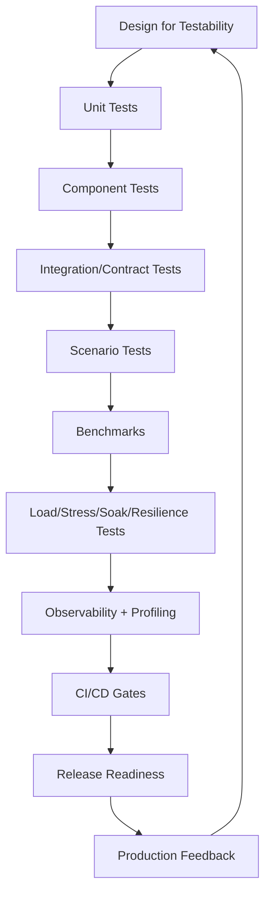
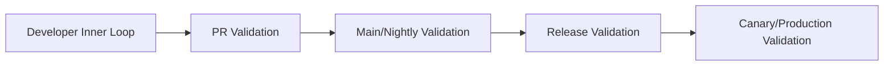
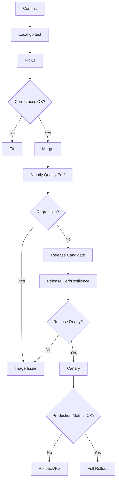
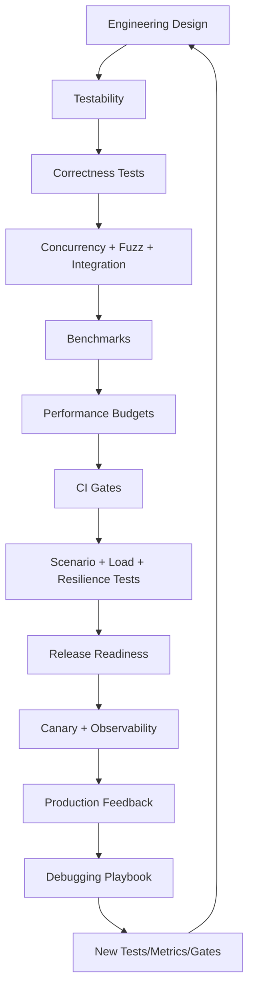

# learn-go-testing-benchmarking-performance-engineering-part-034.md

# Part 034 — Capstone: Building a Production-Grade Go Quality & Performance Strategy

> Seri: **Go Testing, Benchmarking, Performance Engineering**  
> Target pembaca: **Java Software Engineer → Go Performance-Capable Engineer**  
> Target Go: **Go 1.26.x**  
> Status seri: **Part 034 dari 034 — FINAL**  
> Prasyarat: seluruh Part 000–033.

---

## 0. Tujuan Part Ini

Ini adalah bagian terakhir dari seri **Go Testing, Benchmarking, Performance Engineering**.

Tujuannya bukan menambah satu teknik baru, tetapi menyatukan semua teknik menjadi strategi engineering yang bisa diterapkan di sistem production.

Kita akan membangun mental model:

```text
Quality & performance bukan aktivitas satu kali.
Quality & performance adalah operating system engineering team.
```

Seri ini sudah membahas:

- test execution model,
- test taxonomy,
- testable design,
- package `testing`,
- assertions,
- table-driven tests,
- subtests,
- parallel tests,
- golden tests,
- error/panic/timeout/cancellation tests,
- deterministic testing,
- mocks/fakes/stubs/spies/simulators,
- HTTP/handler/client tests,
- filesystem/process/CLI tests,
- DB/queue/cache integration tests,
- concurrency/race/deadlock/goroutine leak tests,
- fuzz/property-based testing,
- coverage engineering,
- test suite architecture,
- CI/CD test strategy,
- benchmarking fundamentals,
- `B.Loop`,
- allocation benchmarking,
- parallel benchmarks,
- benchmark statistics,
- microbenchmark traps,
- scenario benchmark,
- performance mental model,
- Go runtime performance variables,
- PGO,
- performance gates,
- load/stress/spike/soak tests,
- resilience performance tests,
- performance debugging playbook.

Sekarang kita jawab pertanyaan final:

> Bagaimana menyusun semua ini menjadi strategi production-grade yang realistis untuk tim Go?

---

## 1. Satu Kalimat Inti

> Production-grade quality & performance strategy adalah sistem berlapis yang menggabungkan design-for-testability, automated correctness tests, benchmark evidence, service-level performance tests, observability, debugging playbooks, CI/CD gates, ownership, dan continuous improvement.

Bukan sekadar:

```text
go test ./...
```

Bukan juga:

```text
punya load test sekali sebelum release
```

Tetapi sistem kerja berkelanjutan.

---

## 2. Final Mental Model: Evidence Stack



Setiap lapisan menjawab pertanyaan berbeda.

---

## 3. Quality Strategy Bukan Test Pyramid Saja

Test pyramid berguna, tetapi tidak cukup.

Classic:

```text
many unit tests
some integration tests
few end-to-end tests
```

Production-grade Go strategy perlu lebih kaya:

```text
correctness
determinism
concurrency safety
API contract
external dependency behavior
failure behavior
performance budget
benchmark regression
load capacity
resilience under degradation
observability
debuggability
release confidence
```

Jadi bentuknya lebih seperti **quality matrix**.

---

## 4. Quality Matrix

| Dimension | Evidence |
|---|---|
| pure logic correctness | unit tests, table-driven tests |
| boundary correctness | component/integration tests |
| API behavior | handler/client/contract tests |
| data correctness | DB/cache/queue integration tests |
| concurrency safety | race tests, deterministic coordination tests |
| error behavior | error/panic/timeout/cancellation tests |
| input robustness | fuzz/property-based tests |
| output stability | golden/snapshot tests |
| coverage awareness | coverage engineering |
| hot path performance | microbenchmarks |
| flow performance | scenario benchmarks |
| production capacity | load/stress tests |
| long-term stability | soak tests |
| failure stability | resilience performance tests |
| regression prevention | CI gates |
| diagnosis | profiling/tracing/metrics |
| release confidence | readiness checklist |

---

## 5. Strategy Layers



Each layer has different goals.

---

## 6. Developer Inner Loop

Goal:

```text
fast feedback while coding
```

Typical commands:

```bash
go test ./...
go test -race ./internal/concurrency/...
go test -run TestSpecific ./internal/foo
go test -run='^$' -bench=BenchmarkSpecific -benchmem ./internal/foo
```

Characteristics:

- fast,
- local,
- focused,
- developer-owned,
- not exhaustive,
- useful for TDD/debugging.

---

## 7. PR Validation

Goal:

```text
prevent obvious correctness and critical regression before merge
```

Run:

- unit tests,
- component tests,
- selected integration tests,
- race tests on selected packages,
- fuzz smoke for selected targets,
- coverage threshold where meaningful,
- selected stable benchmarks,
- zero-allocation contracts,
- static checks/lint/security checks if used.

Avoid:

- huge load tests,
- noisy scenario benchmarks as hard blockers,
- all benchmarks with strict threshold,
- tests requiring fragile shared environment.

---

## 8. Main/Nightly Validation

Goal:

```text
detect broader regressions that PR gate cannot afford
```

Run:

- full integration suite,
- longer race test,
- fuzz duration,
- full benchmark suite,
- scenario benchmarks,
- CPU matrix benchmarks,
- PGO comparison,
- coverage reports,
- test flake detection,
- dependency compatibility tests,
- trend dashboard update.

Nightly can alert/create issue rather than block every developer.

---

## 9. Release Validation

Goal:

```text
decide whether artifact is production-ready
```

Run:

- full correctness suite,
- migration tests,
- scenario benchmarks vs budget,
- load test,
- stress/capacity test if needed,
- soak test for critical services,
- resilience performance matrix,
- security/auth relevant tests,
- PGO validation if enabled,
- canary readiness.

Release validation should produce a report.

---

## 10. Canary/Production Validation

Goal:

```text
validate real behavior safely
```

Observe:

- latency p50/p95/p99,
- error rate,
- throughput,
- CPU/memory,
- GC,
- goroutines,
- DB pool wait,
- queue backlog,
- downstream errors,
- business KPIs,
- logs/traces,
- alerting.

Canary is not “deploy and pray”. It is controlled validation.

---

## 11. Complete Pipeline Diagram



---

## 12. Test Suite Architecture Final Recommendation

A large Go codebase should structure tests intentionally.

Example:

```text
internal/
  authz/
    evaluator.go
    evaluator_test.go
    evaluator_bench_test.go
    testdata/
  case/
    service.go
    service_test.go
    service_integration_test.go
    service_bench_test.go
  testkit/
    fake_clock.go
    fake_repo.go
    spy_event_bus.go
    golden.go

tests/
  integration/
    db/
    queue/
  contract/
  scenario/
  load/
  resilience/
```

Use build tags for expensive tests:

```go
//go:build integration
```

```go
//go:build perf
```

```go
//go:build e2e
```

Commands:

```bash
go test ./...
go test -tags=integration ./tests/integration/...
go test -tags=perf -run='^$' -bench=. -benchmem ./tests/scenario/...
```

---

## 13. Package-Level Test Strategy

For each package, define:

```text
Package purpose:
  What does it own?

Correctness tests:
  table-driven, edge cases, error cases.

Boundary tests:
  fake dependency, contract, integration if needed.

Concurrency tests:
  race/leak/deadlock if concurrent.

Fuzz/property tests:
  parsers, validators, codecs.

Benchmarks:
  hot primitives and scenario operations.

Test data:
  deterministic, safe, documented.

Owner:
  who maintains tests and budgets.
```

---

## 14. Example Package Strategy: `internal/caseid`

```text
Purpose:
  Parse and validate case IDs.

Tests:
  table-driven valid/invalid
  fuzz parser
  zero-allocation AllocsPerRun
  golden? no

Benchmarks:
  ParseCaseID/Valid
  ParseCaseID/InvalidShape
  ParseCaseID/Mixed

Gates:
  PR: zero allocation + critical benchmark
  Nightly: all benchmarks

Budget:
  Valid parse: 0 allocs/op
```

---

## 15. Example Package Strategy: `internal/authz`

```text
Purpose:
  Authorization decision engine.

Tests:
  table-driven decision matrix
  property tests for monotonic permission rules if applicable
  fake policy repository
  concurrency test for shared evaluator
  race test

Benchmarks:
  Authorize/RBAC
  Authorize/LargePolicy
  BuildAllowedActions/100Cases
  PermissionCacheParallel

Scenario:
  Listing allowed actions 20/100/500 cases

Gates:
  PR: hot decision benchmark + allocation threshold
  Nightly: parallel cache CPU matrix
  Release: listing scenario under load
```

---

## 16. Example Package Strategy: `internal/report`

```text
Purpose:
  Generate reports/export files.

Tests:
  golden outputs
  large fixture tests
  error handling
  filesystem test with `t.TempDir`

Benchmarks:
  GenerateCSV/1kRows
  GenerateCSV/10kRows
  GenerateCSV/100kRows
  EncodeStreamingVsBuffer

Load/soak:
  concurrent report generation with bounded workers

Budgets:
  memory per report
  max concurrent reports
  no unbounded buffer
```

---

## 17. Test Data Governance

Test data should be:

- deterministic,
- safe,
- no production PII/secrets,
- realistic shape,
- versioned,
- documented,
- small enough for PR,
- large variants available for perf/integration,
- easy to regenerate.

Create:

```text
testdata/README.md
```

Include:

```text
source:
  synthetic
shape:
  p50/p90/p99 payload sizes
sensitive:
  no PII
update process:
  run go generate ./internal/testdata
```

---

## 18. Fake/Mock/Simulator Governance

Test doubles must not lie silently.

Use:

| Double | Use |
|---|---|
| fake | deterministic in-memory behavior |
| stub | fixed response |
| spy | verify calls/events |
| mock | strict interaction when necessary |
| simulator | latency/error/rate-limit behavior |
| real dependency | integration/release validation |

Document fake limitations.

Example:

```text
FakeRepo does not simulate DB transaction isolation or query latency.
Do not use it to claim DB performance.
```

---

## 19. Coverage Strategy Final View

Coverage is useful, but not sufficient.

Good coverage strategy:

- package-level meaningful coverage,
- changed-code coverage,
- branch/edge-case awareness manually,
- coverage exceptions documented,
- integration coverage where useful,
- no obsession with 100%,
- risk-based gates.

Coverage should answer:

```text
Are critical behaviors exercised?
```

Not:

```text
Did we hit arbitrary line percentage?
```

---

## 20. Fuzz Strategy

Use fuzzing for:

- parsers,
- validators,
- decoders,
- normalizers,
- state transition input,
- security-sensitive input,
- serialization/deserialization,
- protocol parsing.

Workflow:

```text
PR:
  seed corpus smoke

Nightly:
  longer fuzz duration

Release/security:
  targeted fuzz campaign
```

Fuzz findings become regression tests.

---

## 21. Concurrency Strategy

For concurrent Go code, require:

- race detector in CI for selected packages,
- deterministic tests for ordering,
- leak checks for goroutines,
- context cancellation tests,
- bounded queue tests,
- parallel benchmarks for contention,
- block/mutex profile for issues,
- code review checklist.

Concurrency correctness and performance are inseparable.

---

## 22. Benchmark Suite Strategy

Classify benchmarks:

| Class | Purpose | Gate |
|---|---|---|
| micro hot path | primitive regression | PR/nightly |
| allocation contract | zero alloc/hot path | PR |
| parallel contention | scalability | nightly/dedicated |
| scenario | flow cost | nightly/release |
| exploratory | investigation | manual |
| runtime matrix | Go/runtime tuning | release/manual |
| PGO comparison | build optimization | release/weekly |

Not all benchmarks should hard-fail PR.

---

## 23. Benchmark Naming Convention

Use descriptive names:

```text
BenchmarkParseCaseID/Valid
BenchmarkParseCaseID/InvalidShape
BenchmarkBuildListingPage/100Cases
BenchmarkPermissionCacheParallel/Mixed90Hit10Miss
BenchmarkSubmitCaseHTTPHandler/LargePayload
BenchmarkReportGeneration/100kRows
```

Avoid:

```text
BenchmarkFast
BenchmarkNew
BenchmarkService
BenchmarkTest
```

Names should encode workload.

---

## 24. Performance Budget Strategy

Every important operation should have budget.

Example:

```yaml
operations:
  SubmitCase:
    service_cpu_ms: 5
    handler_cpu_ms: 8
    allocation_kib: 512
    p95_ms: 300
    p99_ms: 1000
    error_rate_pct: 0.1
    db_calls_max: 5

  BuildListingPage100Cases:
    service_cpu_ms: 5
    allocation_mib: 4
    permission_checks_max: 2000
```

Budgets connect benchmark to product reality.

---

## 25. Budget Types

| Budget | Example |
|---|---|
| latency budget | p95 < 300 ms |
| CPU budget | service CPU <= 5 ms/op |
| allocation budget | <= 512 KiB/op |
| DB call budget | <= 5 queries/request |
| concurrency budget | max 50 downstream calls |
| memory budget | heap stable < 700 MiB |
| queue budget | queue <= 1000 |
| retry budget | max 2 attempts |
| error budget | 5xx < 0.1% |

---

## 26. Observability Strategy

Production-grade performance requires observability.

Minimum:

- request rate,
- latency percentiles,
- error rate,
- CPU,
- memory,
- heap,
- GC,
- goroutine count,
- DB pool stats,
- queue depth,
- downstream latency/errors,
- retry count,
- timeout count,
- circuit breaker state,
- rate limiter rejects,
- deployment version,
- feature flag state.

Without observability, performance debugging becomes guesswork.

---

## 27. Profiling Strategy

Enable safe profiling strategy:

- local benchmark profiles,
- staging pprof,
- production pprof restricted/internal,
- CPU profile during load test,
- heap profile during memory issue,
- goroutine profile during leak,
- mutex/block profile during contention,
- trace for complex scheduler issues.

Governance:

```text
who can profile production?
how long?
where artifacts stored?
security restrictions?
how profiles tied to incident?
```

---

## 28. CI/CD Strategy Summary

```text
PR:
  correctness + selected critical perf

Nightly:
  broad tests + benchmark trend

Release:
  scenario/load/resilience + budget

Production:
  canary + SLO + observability
```

This is sustainable.

---

## 29. Release Readiness Checklist

### 29.1 Correctness

- [ ] Unit/component tests pass.
- [ ] Integration tests pass.
- [ ] Contract tests pass.
- [ ] Race-sensitive tests pass.
- [ ] Fuzz corpus regression tests pass.
- [ ] Golden outputs updated intentionally.
- [ ] Error/cancellation paths tested.

### 29.2 Performance

- [ ] Critical benchmarks within budget.
- [ ] Scenario benchmarks within budget.
- [ ] No unexplained allocation regression.
- [ ] PGO validated if enabled.
- [ ] Runtime variables recorded.
- [ ] Benchmark artifacts stored.

### 29.3 Load/Resilience

- [ ] Load test meets SLO.
- [ ] Capacity envelope known.
- [ ] Spike behavior acceptable.
- [ ] Soak test stable for critical service.
- [ ] Resilience matrix passed for critical dependencies.
- [ ] Backpressure validated.
- [ ] Timeout/retry budget validated.

### 29.4 Operations

- [ ] Dashboards ready.
- [ ] Alerts ready.
- [ ] Runbook updated.
- [ ] Rollback plan ready.
- [ ] Canary criteria defined.
- [ ] Owner assigned.

---

## 30. Team Workflow

A mature team workflow:

1. Feature design includes testability/performance considerations.
2. Developer writes unit/component tests.
3. Critical package adds benchmark if hot path affected.
4. PR includes benchmark evidence for performance-sensitive changes.
5. CI runs correctness and selected perf gates.
6. Nightly catches broader drift.
7. Release validates scenario/load/resilience.
8. Production canary validates real metrics.
9. Incidents feed new tests/benchmarks/runbooks.

This creates learning loop.

---

## 31. PR Template for Performance-Sensitive Changes

```text
Performance Impact:
  [ ] Not performance-sensitive
  [ ] Hot path changed
  [ ] Allocation behavior changed
  [ ] Concurrency behavior changed
  [ ] DB/query behavior changed
  [ ] External dependency behavior changed

Evidence:
  Benchmark command:
  benchstat summary:
  Allocation impact:
  Scenario/load test:
  Budget impact:

Risk:
  Timeout/retry/backpressure affected?
  Rollback plan?
```

---

## 32. Code Review Checklist

Ask:

- Does this change affect hot path?
- Does it allocate in loops?
- Does it add reflection/map/string formatting?
- Does it add DB calls?
- Does it change transaction scope?
- Does it add retry?
- Does it respect context cancellation?
- Does it introduce unbounded concurrency/queue?
- Does it add global lock?
- Does it change cache behavior?
- Does benchmark/test evidence match risk?
- Does observability cover new behavior?

---

## 33. Performance Incident Feedback Loop

After incident:

```text
incident → root cause → missing test/benchmark/metric/gate → add prevention
```

Examples:

| Incident | Prevention |
|---|---|
| N+1 query | query count invariant + scenario benchmark |
| allocation blowup | allocation gate |
| retry storm | resilience test |
| goroutine leak | soak test + goroutine lifecycle test |
| cache stampede | singleflight test + spike test |
| DB pool timeout | DB pool metrics alert + load test |
| p99 regression | release load gate |

---

## 34. Roadmap: From Basic to Production-Grade

### Phase 1 — Foundation

- `go test ./...`
- table-driven tests
- package-level test organization
- basic CI
- race detector for selected packages
- testdata hygiene

### Phase 2 — Robustness

- fakes/spies/simulators
- integration tests with build tags
- cancellation/error tests
- fuzzing for parsers
- coverage reports
- golden tests

### Phase 3 — Benchmark Discipline

- microbenchmarks for hot path
- allocation benchmarks
- `benchstat`
- benchmark manifest
- critical PR gates
- nightly benchmark suite

### Phase 4 — Service Performance

- scenario benchmarks
- load/stress/spike/soak tests
- performance budgets
- dashboards
- profiling workflow

### Phase 5 — Resilience & Governance

- failure-aware performance tests
- CI/CD performance gates
- release readiness
- PGO workflow
- canary validation
- incident feedback loop

---

## 35. Example 90-Day Implementation Plan

### Days 1–15

- inventory critical packages,
- define test categories,
- add missing table-driven tests,
- add `go test ./...` CI,
- identify hot paths.

### Days 16–30

- add fakes/testkit,
- add integration build tags,
- add race detector job,
- add first benchmarks for hot paths,
- add `benchstat` workflow.

### Days 31–45

- define performance budgets,
- add allocation contracts,
- add benchmark manifest,
- add nightly benchmark artifacts,
- add dashboards for service metrics.

### Days 46–60

- add scenario benchmarks,
- add load test plan,
- run first capacity test,
- add profiling runbook,
- add pprof access policy.

### Days 61–75

- add resilience test matrix,
- test timeout/retry/backpressure,
- add soak test for critical consumers,
- add CI warning gate.

### Days 76–90

- convert stable gates to selective blocking,
- add release readiness checklist,
- add canary validation,
- evaluate PGO if CPU-bound,
- document governance and ownership.

---

## 36. Common Failure Modes of Quality Strategy

### 36.1 Too Many Slow Tests in PR

Developers bypass/ignore CI.

Fix:

- tiering,
- build tags,
- nightly jobs.

### 36.2 Coverage Theater

High coverage but bugs remain.

Fix:

- risk-based tests,
- behavior coverage,
- fuzz/property tests.

### 36.3 Benchmark Theater

Benchmarks exist but no decisions.

Fix:

- budgets,
- `benchstat`,
- gates,
- ownership.

### 36.4 Load Test Theater

One annual load test with unrealistic data.

Fix:

- release gates,
- realistic workload,
- observability.

### 36.5 No Owner

Tests rot.

Fix:

- assign package/benchmark owners.

### 36.6 No Incident Feedback

Same class of issue repeats.

Fix:

- convert incidents to tests/metrics/gates.

---

## 37. Top 1% Engineer Mental Model

A top-tier engineer does not merely ask:

```text
Does it work?
```

They ask:

```text
Does it work under expected input?
Does it fail safely under bad input?
Does it remain correct under concurrency?
Does it respect cancellation?
Does it stay within latency budget?
Does it stay within allocation/memory budget?
Does it scale with workload size?
Does it degrade gracefully?
Can we observe it?
Can we debug it?
Can CI prevent regression?
Can production validate rollout?
Can the team maintain this strategy?
```

This is the mindset this series is trying to build.

---

## 38. Final System Diagram



---

## 39. Final Checklist: Production-Grade Go Quality & Performance

### 39.1 Design

- [ ] Dependencies are injectable.
- [ ] Time/randomness/env are controllable.
- [ ] Context cancellation flows through boundaries.
- [ ] External dependencies have explicit interfaces.
- [ ] Concurrency ownership is clear.
- [ ] Queues/concurrency are bounded.
- [ ] Error semantics are explicit.

### 39.2 Tests

- [ ] Unit tests cover core behavior.
- [ ] Table-driven tests cover edge cases.
- [ ] Subtests organized clearly.
- [ ] Parallel tests are isolated.
- [ ] Golden tests stable.
- [ ] Integration tests use build tags.
- [ ] Fuzz targets exist for risky input.
- [ ] Race/concurrency tests exist where needed.
- [ ] Cancellation/timeout tests exist.
- [ ] Testdata is safe and realistic.

### 39.3 Benchmarks

- [ ] Hot path benchmarks exist.
- [ ] Allocation metrics included.
- [ ] Parallel benchmarks for shared state.
- [ ] Scenario benchmarks for critical flows.
- [ ] Benchmarks have workload names.
- [ ] Repeated runs and `benchstat` used.
- [ ] Benchmarks tied to budgets.
- [ ] Gates classify benchmark noise/importance.

### 39.4 Performance Tests

- [ ] Load test plan exists.
- [ ] Stress/capacity boundary known.
- [ ] Spike behavior tested.
- [ ] Soak stability tested for critical services.
- [ ] Resilience matrix covers major dependencies.
- [ ] Backpressure validated.
- [ ] Retry/timeout budget tested.
- [ ] Recovery phase measured.

### 39.5 Observability

- [ ] Latency percentiles.
- [ ] Error classification.
- [ ] RPS/throughput.
- [ ] CPU/memory/GC.
- [ ] Goroutine count.
- [ ] DB pool stats.
- [ ] Queue depth.
- [ ] Downstream metrics.
- [ ] Retry/circuit breaker/rate limiter metrics.
- [ ] Profiling access policy.

### 39.6 CI/CD

- [ ] PR gate fast.
- [ ] Nightly broad validation.
- [ ] Release performance validation.
- [ ] Artifacts retained.
- [ ] Baseline policy.
- [ ] Quarantine policy.
- [ ] Override policy.
- [ ] Owners assigned.
- [ ] Dashboard/trend.

### 39.7 Operations

- [ ] Release readiness checklist.
- [ ] Canary criteria.
- [ ] Rollback plan.
- [ ] Runbooks.
- [ ] Incident feedback loop.
- [ ] Performance budgets reviewed periodically.

---

## 40. What to Do After This Series

Recommended next learning/practice sequence:

1. Build a small Go service with:
   - HTTP handler,
   - DB repository,
   - cache,
   - queue consumer,
   - authz layer.

2. Add:
   - unit tests,
   - integration tests,
   - fuzz tests,
   - race tests,
   - benchmarks,
   - scenario benchmarks.

3. Add:
   - load test,
   - spike test,
   - soak test,
   - failure injection.

4. Add:
   - metrics,
   - pprof,
   - dashboards,
   - CI gates,
   - performance budget.

5. Create one intentional regression:
   - allocation regression,
   - lock contention,
   - DB N+1,
   - retry storm,
   - goroutine leak.

6. Use the playbook to detect, diagnose, fix, and prevent it.

This converts knowledge into skill.

---

## 41. Final Summary of the Series

This series taught that Go quality and performance engineering is not one tool or one command.

It is a layered practice:

```text
Design code so it can be tested.
Test behavior deterministically.
Use fakes and simulators honestly.
Test boundaries and failure paths.
Use fuzzing for input robustness.
Use coverage as signal, not trophy.
Use benchmarks carefully and statistically.
Use allocation metrics to predict GC pressure.
Use parallel benchmarks to reveal contention.
Use scenario benchmarks to measure composition.
Use load tests to validate service capacity.
Use resilience tests to validate failure behavior.
Use profiling to find root cause.
Use CI gates to prevent regression.
Use observability to close the production loop.
```

If you internalize this, you are no longer only “writing tests”.

You are building an engineering system that protects correctness, performance, reliability, and maintainability over time.

---

## 42. References

Official and primary sources used across the series:

- Go `testing` package documentation: <https://pkg.go.dev/testing>
- Go command documentation: <https://pkg.go.dev/cmd/go>
- Go diagnostics documentation: <https://go.dev/doc/diagnostics>
- Go garbage collector guide: <https://go.dev/doc/gc-guide>
- Go `runtime` package documentation: <https://pkg.go.dev/runtime>
- Go `runtime/pprof` documentation: <https://pkg.go.dev/runtime/pprof>
- Go `net/http/pprof` documentation: <https://pkg.go.dev/net/http/pprof>
- Go execution tracer: <https://pkg.go.dev/runtime/trace>
- Go fuzzing documentation: <https://go.dev/doc/security/fuzz>
- Go race detector documentation: <https://go.dev/doc/articles/race_detector>
- Go PGO documentation: <https://go.dev/doc/pgo>
- Go blog — More predictable benchmarking with `testing.B.Loop`: <https://go.dev/blog/testing-b-loop>
- Go blog — Using Subtests and Sub-benchmarks: <https://go.dev/blog/subtests>
- Go blog — Profiling Go Programs: <https://go.dev/blog/pprof>
- Go blog — Context: <https://go.dev/blog/context>
- Go blog — Pipelines and cancellation: <https://go.dev/blog/pipelines>
- `benchstat`: <https://pkg.go.dev/golang.org/x/perf/cmd/benchstat>
- `singleflight`: <https://pkg.go.dev/golang.org/x/sync/singleflight>
- `errgroup`: <https://pkg.go.dev/golang.org/x/sync/errgroup>

---

## 43. Status Seri

```text
Part 034 dari 034 selesai.
Seri Go Testing, Benchmarking, Performance Engineering SELESAI.
```

Selamat. Anda sekarang memiliki fondasi konseptual dan praktis untuk membangun quality & performance strategy Go yang jauh melampaui sekadar “bisa menulis unit test”.


<!-- NAVIGATION_FOOTER -->
<div class="page-nav">
<a href="./learn-go-testing-benchmarking-performance-engineering-part-033.md">⬅️ Part 033 — Performance Debugging Playbook: From Regression Signal to Root Cause</a>
<a href="./index.md">📚 Kategori</a>
<a href="../../index.md">🏠 Home</a>
<span></span>
</div>
