# learn-go-io-buffer-byte-stream-file-network-data-transfer-part-000.md

# Part 000 — Orientation: Mental Model Go IO untuk Java Engineer

> Seri: **Go IO, Buffer, Byte & Stream, Serialization, Console IO, File & FileSystem, Compression, Networking, Data Transfer**  
> Target versi: **Go 1.26.x**  
> Target pembaca: **Java software engineer** yang ingin naik ke level desain dan implementasi sistem IO production-grade.  
> Status seri: **Belum selesai**. Ini adalah **Part 000 dari 034**.

---

## 0. Ringkasan Besar

Seri ini bukan sekadar belajar package `io`, `os`, `bufio`, `net`, atau `net/http` secara terpisah. Seri ini membahas satu masalah inti:

> Bagaimana data bergerak secara benar, efisien, aman, observable, dan tahan gagal dari satu boundary ke boundary lain.

Dalam sistem nyata, data jarang hanya “dibaca” atau “ditulis”. Data biasanya:

1. datang dari sumber yang tidak sepenuhnya kita kontrol,
2. masuk dalam bentuk byte stream atau packet,
3. harus dibatasi ukurannya,
4. harus diparse tanpa menghabiskan memory,
5. mungkin perlu didecode, didecompress, divalidasi, diframe, atau diverifikasi,
6. mungkin perlu disimpan secara durable,
7. mungkin perlu dikirim ulang, diteruskan, atau diproxy,
8. bisa gagal sebagian,
9. bisa timeout,
10. bisa corrupt,
11. bisa lambat,
12. bisa diputus di tengah jalan,
13. bisa disalahgunakan oleh client jahat atau input malformed.

Di Java, Anda mungkin familiar dengan `InputStream`, `OutputStream`, `Reader`, `Writer`, `ByteBuffer`, `FileChannel`, `SocketChannel`, `Files`, `Path`, `NIO`, `Netty`, `ServletInputStream`, atau HTTP client/server framework. Go punya filosofi berbeda: **abstraksi kecil, komposisi eksplisit, dan interface sempit**.

Di Go, pusat gravitasinya adalah:

```go
io.Reader
io.Writer
error
context.Context
timeout/deadline
Close
```

Mental model paling penting:

> Go IO adalah komposisi kontrak byte stream. File, socket, HTTP body, gzip stream, JSON decoder, tar reader, buffer memory, stdin, stdout, dan pipe semuanya dapat dipikirkan sebagai variasi dari `Reader` dan `Writer`.

---

## 1. Referensi Resmi yang Menjadi Basis Seri

Materi ini dirancang berdasarkan dokumentasi resmi Go dan release notes Go 1.26.x. Beberapa fakta penting yang memengaruhi seri ini:

- Package `io` menyediakan interface dasar untuk primitive I/O, dengan tujuan membungkus implementasi seperti `os` ke dalam public interface bersama. Dokumentasi `io` juga mengingatkan bahwa client tidak boleh mengasumsikan primitive tersebut aman untuk eksekusi paralel kecuali dinyatakan demikian.
- Package `bufio` membungkus `io.Reader` atau `io.Writer` menjadi reader/writer lain yang tetap mengimplementasikan interface, tetapi menambahkan buffering dan bantuan untuk textual I/O.
- Package `io/fs` mendefinisikan interface dasar filesystem yang bisa disediakan oleh OS atau package lain.
- Package `os` menyediakan interface platform-independent ke fungsi OS, dengan desain mirip Unix tetapi error handling khas Go.
- Go 1.26 memperbaiki performa `io.ReadAll`: lebih sedikit intermediate allocation, final slice lebih minimal, sering sekitar 2x lebih cepat, dan total allocation sering sekitar setengah untuk input besar.
- Go 1.26 menambah typed dialing methods pada `net.Dialer`, seperti `DialIP`, `DialTCP`, `DialUDP`, dan `DialUnix` dengan context.
- Go 1.26 mendepresiasi `httputil.ReverseProxy.Director` untuk mendorong penggunaan `Rewrite` karena isu keamanan hop-by-hop header.
- Per 2 Juni 2026, Go 1.26.4 sudah rilis dan mencakup security fixes untuk `crypto/x509`, `mime`, dan `net/textproto`.

Referensi langsung ada di bagian akhir file.

---

## 2. Mengapa IO adalah Topik yang Dalam

Banyak engineer menganggap IO sebagai “kode pinggiran”: baca file, kirim request, decode JSON, tulis response. Itu asumsi yang berbahaya.

Dalam sistem produksi, IO sering menjadi sumber utama:

- latency spike,
- memory spike,
- file descriptor leak,
- goroutine leak,
- retry storm,
- slowloris vulnerability,
- corrupted data,
- partial write,
- duplicated transfer,
- stuck deployment,
- disk full incident,
- failed backup,
- broken upload,
- stuck reverse proxy,
- hidden security bug.

IO bukan hanya API. IO adalah boundary antara program dan dunia luar.

Boundary selalu berbahaya karena dunia luar tidak mengikuti invariant program Anda.

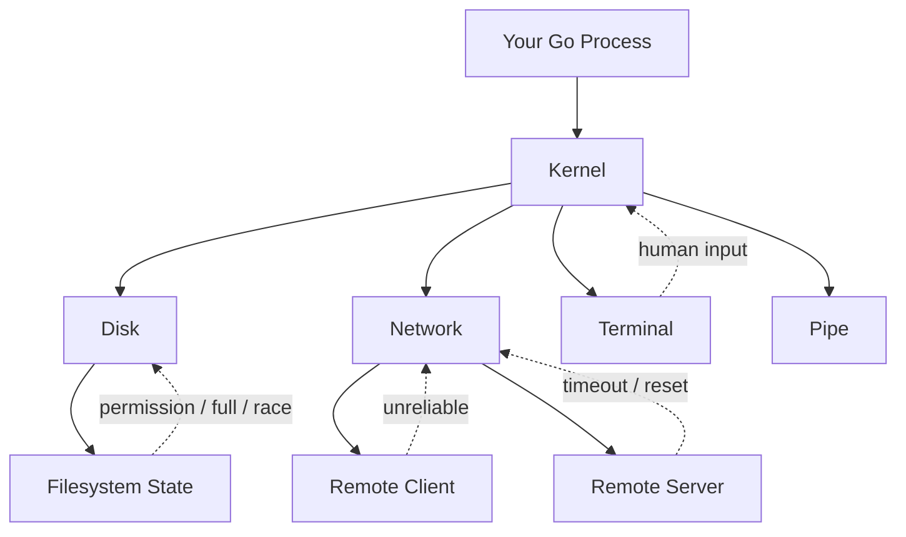

Di dalam proses, kita bisa menjaga invariant. Begitu melewati boundary IO, invariant berubah menjadi kontrak probabilistik:

- file mungkin hilang,
- permission mungkin berubah,
- disk mungkin penuh,
- network mungkin lambat,
- peer mungkin menutup koneksi,
- response mungkin malformed,
- byte bisa datang sebagian,
- `Read` bisa mengembalikan `n > 0` sekaligus `err != nil`,
- `Write` bisa menulis sebagian lalu gagal,
- `Close` juga bisa gagal,
- deadline bisa tercapai setelah sebagian data berpindah.

Top 1% engineer tidak hanya bertanya “bagaimana cara membaca data?”, tetapi:

> Apa invariant transfer ini? Apa yang terjadi bila data hanya berpindah sebagian? Di mana batas memory? Di mana batas waktu? Siapa pemilik resource? Bagaimana sistem tahu bahwa transfer sukses secara durable?

---

## 3. Scope Seri Ini

Seri ini mencakup seluruh jalur data berikut:

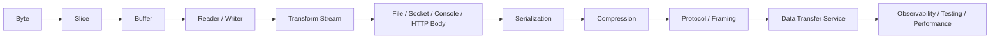

Topik utama:

1. byte, slice, buffer, dan stream,
2. `io.Reader` / `io.Writer` sebagai core contract,
3. buffered IO dengan `bufio`,
4. console IO,
5. file dan filesystem,
6. path handling dan virtual filesystem,
7. durable write dan crash consistency,
8. binary/text serialization,
9. JSON/XML/CSV/gob/base64/hex,
10. protocol framing,
11. compression dan archive,
12. network IO: TCP, UDP, Unix sockets,
13. HTTP streaming client/server,
14. upload/download/multipart,
15. reverse proxy dan transfer gateway,
16. performance engineering,
17. observability,
18. testing dan fault injection,
19. capstone design.

---

## 4. Non-Scope agar Tidak Mengulang Seri Sebelumnya

Karena Anda sudah menyelesaikan beberapa seri Go lain, bagian ini sengaja tidak mengulang detail berikut:

| Area | Tidak Diulang | Dipakai di Seri Ini Sebagai |
|---|---|---|
| Go basic syntax | variable, function, struct dasar | alat untuk contoh kode |
| Error handling dasar | `if err != nil` basic | IO-specific error semantics |
| Concurrency basic | goroutine/channel/mutex detail | accept loop, cancellation, backpressure |
| Memory system | escape analysis/GC detail | buffer allocation, pooling, copy cost |
| Data structure | algorithm umum | queue/buffer framing ringan |
| Design pattern umum | factory/strategy/etc | pipeline/adapter/composition idiom Go |
| Reflection/generics | type system deep dive | hanya bila perlu untuk serializer/test helper |
| Cryptography | primitive crypto detail | hanya checksum/TLS boundary secara praktis |

Fokus seri ini adalah **IO correctness + transfer architecture**.

---

## 5. Java Engineer Mental Shift

### 5.1 Dari Class Hierarchy ke Interface Shape

Di Java, banyak API IO dibentuk melalui class hierarchy:

```text
InputStream
  ├── FileInputStream
  ├── ByteArrayInputStream
  ├── BufferedInputStream
  └── ObjectInputStream
```

Go tidak mendorong hierarki besar. Go mendorong interface kecil:

```go
type Reader interface {
    Read(p []byte) (n int, err error)
}

type Writer interface {
    Write(p []byte) (n int, err error)
}
```

Konsekuensinya besar:

- suatu tipe tidak perlu “extends” apapun,
- selama punya method `Read`, ia adalah `io.Reader`,
- selama punya method `Write`, ia adalah `io.Writer`,
- wrapper bisa dibuat sangat ringan,
- pipeline bisa dikomposisi tanpa inheritance,
- package standard library saling interoperable.

Java-style thinking:

```text
What concrete class should I use?
```

Go-style thinking:

```text
What behavior contract do I need here?
Reader? Writer? Closer? Seeker? ReaderAt? WriterTo?
```

### 5.2 Dari Exception ke Explicit Progress + Error

Di Java, banyak IO failure dilempar sebagai exception.

Di Go, fungsi IO biasanya mengembalikan:

```go
n, err := r.Read(buf)
```

Ini bukan hanya “return value biasa”. Ini adalah kontrak penting:

- `n` menyatakan progress yang sudah terjadi,
- `err` menyatakan kondisi setelah atau selama progress,
- caller wajib memproses `n > 0` sebelum memperlakukan `err`,
- `io.EOF` bukan “crash”; ia sinyal akhir stream,
- partial read/write adalah kondisi normal di banyak boundary.

Top 1% mindset:

> Error tidak membatalkan fakta bahwa sebagian data mungkin sudah berpindah.

### 5.3 Dari Blocking Call ke Deadline dan Context Boundary

Di Java enterprise, timeout sering diset di framework, driver, atau client library.

Di Go, Anda lebih sering menyentuh boundary langsung:

- `context.Context` untuk cancellation request-scoped,
- `net.Conn.SetDeadline` untuk socket-level deadline,
- `http.Client.Timeout` dan `http.Transport` untuk HTTP client,
- server timeouts untuk melawan slow client,
- explicit close untuk menghentikan blocked reader/writer.

Go tidak menyembunyikan fakta bahwa IO bisa blocking. Anda harus mendesain pembatalan dan deadline sebagai bagian dari kontrak.

---

## 6. Core Mental Model: Source, Sink, Transform, Control

Setiap sistem IO dapat dipecah menjadi empat elemen:

| Elemen | Pertanyaan | Contoh Go |
|---|---|---|
| Source | Dari mana byte berasal? | `io.Reader`, `os.File`, `net.Conn`, `http.Request.Body` |
| Sink | Ke mana byte pergi? | `io.Writer`, `os.File`, `net.Conn`, `http.ResponseWriter` |
| Transform | Apa yang terjadi di tengah? | gzip, JSON decoder, checksum, limiter, tee, buffer |
| Control | Bagaimana transfer dihentikan/dibatasi? | error, EOF, Close, context, deadline, limit |

Diagram:

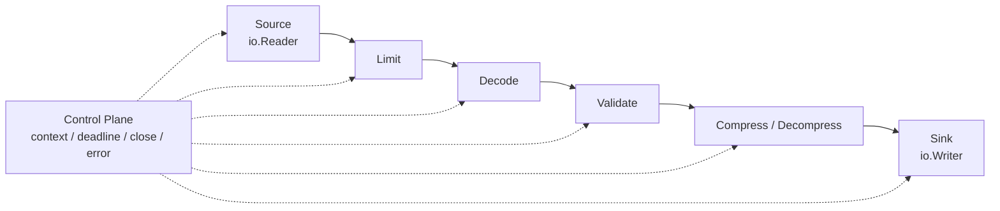

Contoh nyata: upload file HTTP yang disimpan ke disk.

```text
HTTP request body
  -> max byte limiter
  -> multipart reader
  -> file content reader
  -> checksum tee
  -> temp file writer
  -> fsync
  -> atomic rename
```

Yang membuat sistem itu production-grade bukan hanya `io.Copy`. Yang membuatnya benar adalah:

- ukuran request dibatasi,
- body ditutup,
- temp file dibersihkan kalau gagal,
- partial write ditangani,
- checksum dihitung selama streaming,
- `fsync` dipertimbangkan bila durable write dibutuhkan,
- rename dilakukan sebagai commit point,
- error dicatat dengan konteks,
- cancellation dihormati,
- observability tersedia.

---

## 7. Apa Itu Byte, Buffer, dan Stream?

### 7.1 Byte

Byte adalah unit data paling praktis di IO. File, socket, gzip stream, HTTP body, dan JSON encoded payload pada akhirnya adalah byte.

Di Go:

```go
var b byte // alias untuk uint8
```

Tapi jangan keliru: byte bukan character. Text encoding seperti UTF-8 membutuhkan interpretasi. Satu karakter manusia bisa memakai lebih dari satu byte.

### 7.2 Slice of Byte

Sebagian besar API IO Go memakai `[]byte`.

```go
buf := make([]byte, 32*1024)
n, err := r.Read(buf)
process(buf[:n])
```

`[]byte` bukan buffer ajaib. Ia adalah view ke backing array:

- punya length,
- punya capacity,
- bisa di-slice,
- bisa menunjuk backing array yang sama,
- bisa menyebabkan data lama tetap hidup bila referensi kecil menahan array besar.

Dalam IO, `[]byte` adalah “working area” untuk perpindahan data.

### 7.3 Buffer

Buffer adalah tempat penampungan sementara.

Buffer dipakai untuk:

- mengurangi syscall,
- mengumpulkan potongan kecil menjadi batch,
- memungkinkan parser melihat data lebih dari satu byte,
- menyediakan staging area antara producer dan consumer,
- menghindari alokasi berulang bila reused.

Tapi buffer juga punya risiko:

- memory spike,
- stale data,
- flush terlupa,
- latency meningkat karena data menunggu penuh,
- ownership tidak jelas,
- data sensitif tertahan lebih lama.

### 7.4 Stream

Stream adalah urutan data yang dibaca/ditulis bertahap.

Stream berbeda dari “load all into memory”.

```text
Load all:
file -> memory huge []byte -> process

Stream:
file -> small buffer -> process chunk -> next chunk
```

Streaming adalah default mental model untuk data besar, network, upload, download, log processing, compression, archive, dan proxy.

---

## 8. Load-All vs Streaming

Pertanyaan desain pertama dalam IO:

> Apakah data ini aman dibaca seluruhnya ke memory?

Jawaban tidak boleh berdasarkan harapan. Jawaban harus berdasarkan batas.

| Situasi | Load-All Masuk Akal | Streaming Lebih Tepat |
|---|---|---|
| Config kecil | Ya | Tidak perlu |
| JSON API kecil dan terkontrol | Ya, dengan limit | Bisa bila payload besar |
| Upload user | Hampir tidak | Ya |
| File log multi-GB | Tidak | Ya |
| Proxy response | Tidak | Ya |
| Archive besar | Tidak | Ya |
| Cryptographic hash file | Tidak perlu load-all | Ya |
| Download ke disk | Tidak | Ya |

Prinsip:

```text
If size is untrusted, limit it.
If size can be large, stream it.
If data must be durable, define commit point.
If transfer crosses network, define timeout and retry boundary.
```

Contoh anti-pattern:

```go
body, err := io.ReadAll(r.Body)
```

Kode di atas tidak selalu salah. Ia salah bila:

- body tidak dibatasi,
- sumber tidak trusted,
- data bisa besar,
- latency/memory penting,
- operasi bisa dilakukan streaming.

Pattern yang lebih aman:

```go
limited := io.LimitReader(r.Body, 10<<20) // 10 MiB
body, err := io.ReadAll(limited)
```

Namun `LimitReader` sendiri tidak selalu cukup untuk membedakan payload yang tepat di bawah limit vs payload yang dipotong. Untuk validasi batas keras, sering dibutuhkan limit + read extra byte atau `http.MaxBytesReader` di HTTP server. Detailnya akan masuk part lanjutan.

---

## 9. Kontrak `io.Reader` secara Konseptual

Signature:

```go
Read(p []byte) (n int, err error)
```

Maknanya:

- caller menyediakan buffer `p`,
- reader mengisi maksimal `len(p)` byte,
- reader mengembalikan jumlah byte yang valid di `p[:n]`,
- reader bisa mengembalikan `n > 0` dan `err != nil` sekaligus,
- `io.EOF` berarti tidak ada data lagi,
- caller tidak boleh memakai `p[n:]` sebagai data valid,
- caller tidak boleh mengasumsikan satu `Read` menghasilkan satu “message”.

Hal yang sering salah:

```go
n, err := r.Read(buf)
if err != nil {
    return err
}
process(buf[:n])
```

Masalahnya: bila `n > 0` dan `err == io.EOF`, data terakhir hilang.

Pola konseptual yang lebih benar:

```go
for {
    n, err := r.Read(buf)
    if n > 0 {
        process(buf[:n])
    }
    if err != nil {
        if err == io.EOF {
            break
        }
        return err
    }
}
```

Tidak semua kode harus manual seperti itu karena `io.Copy`, decoder, scanner, dan helper lain sudah mengenkapsulasi pattern. Namun Anda harus paham kontrak dasarnya agar bisa debug saat helper tidak sesuai.

---

## 10. Kontrak `io.Writer` secara Konseptual

Signature:

```go
Write(p []byte) (n int, err error)
```

Maknanya:

- caller meminta writer menulis `len(p)` byte,
- writer mengembalikan jumlah byte yang berhasil diterima/ditulis,
- bila `n < len(p)`, harus ada error non-nil,
- caller tidak boleh mengasumsikan data sudah durable hanya karena `Write` sukses,
- untuk buffered writer, `Write` bisa hanya menulis ke buffer memory,
- untuk file, `Write` sukses belum tentu sudah flush ke storage fisik,
- untuk network, `Write` sukses berarti data diterima OS buffer, bukan berarti remote application sudah memprosesnya.

Distingsi penting:

```text
accepted by API ≠ flushed from buffer ≠ accepted by kernel ≠ durable on disk ≠ received by peer ≠ processed by peer
```

Diagram:

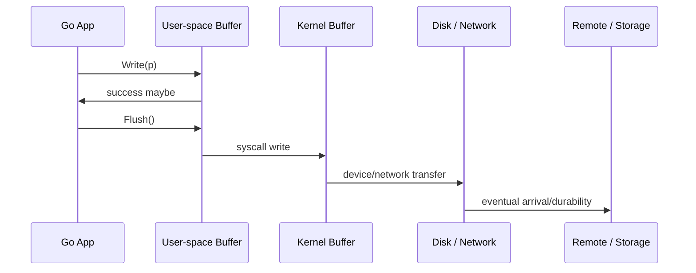

Top 1% engineer selalu bertanya: “sukses di level mana?”

---

## 11. EOF Bukan Error Biasa

`io.EOF` sering membingungkan engineer yang datang dari exception-style API.

`EOF` berarti stream selesai. Dalam banyak loop, `EOF` adalah kondisi normal.

Tetapi `EOF` bisa bermakna berbeda tergantung layer:

| Context | EOF Bisa Berarti |
|---|---|
| File read | akhir file normal |
| HTTP body | body selesai |
| TCP read | peer menutup sisi tulis koneksi |
| Framed protocol | bisa normal jika frame lengkap, bisa corrupt jika frame belum lengkap |
| JSON decoder | input habis; bisa normal untuk single value, bisa error bila token belum lengkap |
| gzip reader | compressed stream selesai; bisa error bila checksum/footer invalid |

Jadi EOF harus diinterpretasikan dengan state mesin pembaca.

Contoh:

```text
Length-prefixed frame says: 100 bytes expected.
Reader returns EOF after 60 bytes.

This is not normal EOF.
This is truncated frame.
```

---

## 12. IO adalah State Machine

Setiap operasi IO serius adalah state machine.

Contoh upload file:

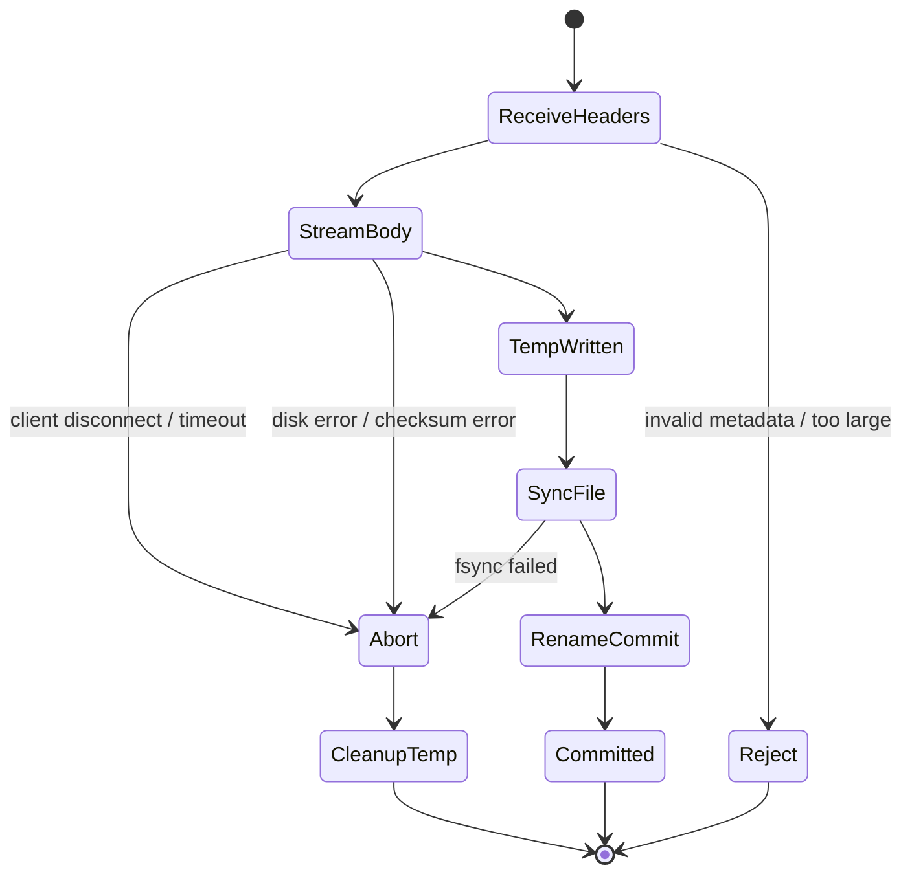

Jika Anda tidak mendefinisikan state, state tetap ada, hanya tersembunyi di bug.

Pertanyaan desain:

1. Kapan transfer dianggap dimulai?
2. Kapan transfer dianggap sukses?
3. Apa commit point?
4. Jika gagal sebelum commit, apa cleanup-nya?
5. Jika gagal setelah commit, apa kompensasinya?
6. Apakah operasi idempotent?
7. Apakah retry aman?
8. Apakah partial output bisa terlihat oleh consumer lain?

---

## 13. Package Map: Apa Dipakai untuk Apa?

### 13.1 Core Primitive

| Package | Peran |
|---|---|
| `io` | interface dan helper dasar stream |
| `bytes` | operasi byte slice dan in-memory byte buffer |
| `strings` | operasi string dan string reader |
| `bufio` | buffered reader/writer/scanner |
| `os` | file, process, env, stdin/stdout/stderr, OS-level operation |
| `io/fs` | abstraksi filesystem |
| `path` | slash-separated path, biasanya URL/archive/internal path |
| `path/filepath` | path sesuai OS |

### 13.2 Encoding / Serialization

| Package | Peran |
|---|---|
| `encoding/json` | JSON encode/decode |
| `encoding/xml` | XML encode/decode |
| `encoding/csv` | CSV read/write |
| `encoding/gob` | Go-specific binary serialization |
| `encoding/binary` | fixed-width binary encoding dan varint |
| `encoding/base64` | binary-to-text base64 |
| `encoding/hex` | binary-to-text hexadecimal |

### 13.3 Compression / Archive

| Package | Peran |
|---|---|
| `compress/gzip` | gzip stream |
| `compress/zlib` | zlib stream |
| `compress/flate` | DEFLATE |
| `compress/lzw` | LZW |
| `archive/tar` | tar archive stream |
| `archive/zip` | zip archive |

### 13.4 Networking / HTTP

| Package | Peran |
|---|---|
| `net` | TCP, UDP, Unix socket, DNS, address types |
| `net/http` | HTTP client/server |
| `net/url` | URL parsing |
| `net/textproto` | text protocol utilities |
| `mime` | media type handling |
| `mime/multipart` | multipart form/upload |
| `net/http/httputil` | reverse proxy, dump helpers |
| `crypto/tls` | TLS transport boundary |

### 13.5 Testing / Diagnostics yang Relevan

| Package/Tool | Peran |
|---|---|
| `testing` | unit test, benchmark, fuzz |
| `testing/iotest` | fake reader untuk IO test |
| `net/http/httptest` | HTTP test server/client |
| `runtime/pprof` | profiling |
| `runtime/trace` | tracing runtime |
| `expvar` / metrics stack | observability sederhana |

---

## 14. Layering Model: Dari API sampai Kernel

Saat Anda memanggil `Read` atau `Write`, Anda tidak langsung berbicara dengan disk atau network device dalam bentuk yang sederhana. Ada layer.

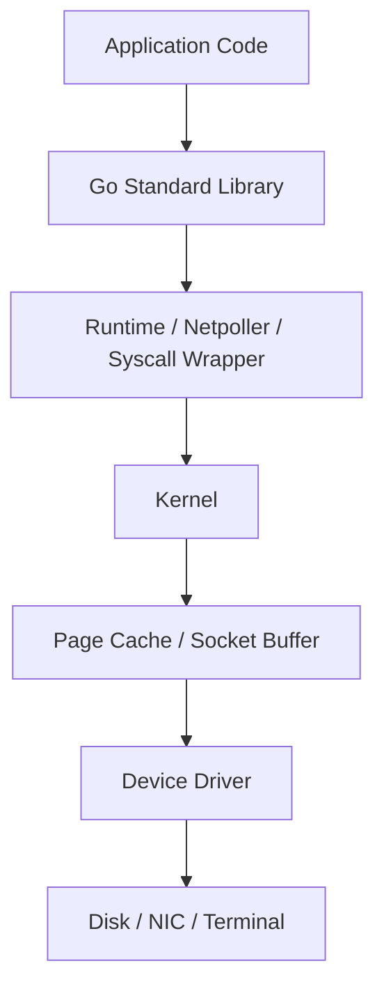

Konsekuensi:

- `Write` ke file bisa masuk page cache dulu.
- `Write` ke socket bisa masuk kernel socket buffer dulu.
- `Read` dari file bisa dilayani dari page cache.
- `Read` dari network bisa blocking sampai data datang atau deadline tercapai.
- Buffering bisa terjadi di user-space dan kernel-space.
- Flush di satu layer belum tentu flush di layer lain.

### 14.1 User-Space Buffer vs Kernel Buffer

User-space buffer:

- `bytes.Buffer`,
- `bufio.Writer`,
- temporary `[]byte`,
- JSON encoder internal state,
- gzip writer buffer.

Kernel buffer:

- file page cache,
- socket send buffer,
- socket receive buffer,
- pipe buffer.

Kesalahan umum:

```text
Saya sudah Flush bufio.Writer, berarti data sudah durable.
```

Tidak selalu. `Flush` hanya mendorong data dari buffer `bufio` ke underlying writer. Bila underlying writer adalah file, data masih bisa berada di kernel page cache. Durability membutuhkan disk semantics yang lebih kuat seperti `Sync`, dan itu pun bergantung filesystem/storage.

---

## 15. Ownership Resource

IO selalu membawa resource:

- file descriptor,
- socket,
- response body,
- request body,
- temp file,
- directory handle,
- gzip reader/writer,
- tar/zip reader state,
- goroutine yang sedang blocked,
- buffer besar,
- pooled object.

Pertanyaan ownership:

1. Siapa yang membuka resource?
2. Siapa yang wajib menutup resource?
3. Kapan resource ditutup?
4. Apakah close bisa gagal?
5. Apakah close harus dilakukan walau read/write gagal?
6. Apakah resource boleh dipakai setelah diserahkan ke fungsi lain?
7. Apakah caller atau callee pemilik buffer?

Pattern yang sering benar:

```go
f, err := os.Open(name)
if err != nil {
    return err
}
defer f.Close()
```

Namun untuk write path durable, pattern close buta bisa kurang cukup karena error saat close bisa penting. Beberapa writer melaporkan error final saat `Close`, misalnya compressor yang harus menulis footer.

Contoh prinsip:

```text
For readers: Close usually releases resource.
For writers: Close may be part of completing the data format.
For buffered writers: Flush may be required before Close of underlying resource.
For durable files: Sync/Close error can matter.
```

---

## 16. Composition di Go IO

Keindahan Go IO muncul saat wrapper dikomposisi.

Contoh pipeline read:

```go
file, _ := os.Open("data.json.gz")
defer file.Close()

gz, _ := gzip.NewReader(file)
defer gz.Close()

dec := json.NewDecoder(gz)
```

Konseptual:

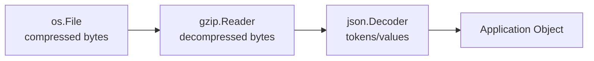

Contoh pipeline write:

```go
file, _ := os.Create("out.json.gz")
defer file.Close()

gz := gzip.NewWriter(file)
enc := json.NewEncoder(gz)

_ = enc.Encode(value)
_ = gz.Close()
_ = file.Sync()
```

Konseptual:

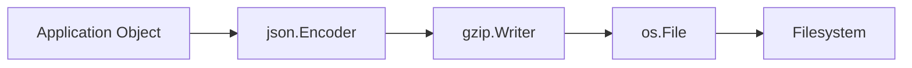

Urutan close/flush penting. Untuk writer pipeline, biasanya close dari layer paling atas/terluar dulu agar footer/flush internal ditulis ke layer bawah.

---

## 17. IO Failure Taxonomy

Kita butuh bahasa yang rapi untuk membahas failure.

### 17.1 Source Failure

Source gagal menyediakan data:

- file not found,
- permission denied,
- short read,
- corrupted archive,
- invalid encoding,
- peer reset,
- timeout,
- DNS failure,
- TLS handshake failure,
- malformed HTTP response.

### 17.2 Sink Failure

Sink gagal menerima data:

- disk full,
- permission denied,
- broken pipe,
- connection reset,
- short write,
- timeout,
- buffered writer flush error,
- compressor close error,
- remote server closed body.

### 17.3 Transform Failure

Transform gagal mengubah data:

- invalid JSON,
- invalid UTF-8 policy,
- gzip checksum mismatch,
- tar header invalid,
- base64 invalid byte,
- binary frame length impossible,
- schema mismatch.

### 17.4 Control Failure

Control plane gagal menjaga batas:

- tidak ada timeout,
- context tidak dihormati,
- input tidak dibatasi,
- goroutine blocked selamanya,
- temp file tidak dibersihkan,
- resource tidak ditutup,
- cancellation hanya menghentikan caller tapi tidak menghentikan underlying IO.

---

## 18. Invariants Production-Grade IO

Gunakan checklist invariants berikut untuk setiap desain IO.

### 18.1 Size Invariant

```text
No untrusted source may be read without a maximum bound.
```

Contoh:

- HTTP body harus punya max size.
- JSON payload besar harus streaming atau dibatasi.
- archive extraction harus membatasi total uncompressed size.
- line scanner harus mengatur max token bila line bisa besar.

### 18.2 Time Invariant

```text
Every external IO operation must have a timeout, deadline, or cancellation path.
```

Contoh:

- HTTP client timeout.
- TCP read/write deadline.
- server read header timeout.
- context untuk request lifecycle.
- shutdown path yang menutup listener/koneksi.

### 18.3 Resource Invariant

```text
Every opened resource has exactly one clear owner responsible for closing it.
```

Contoh:

- `resp.Body.Close()` wajib.
- file harus ditutup.
- gzip reader/writer harus ditutup.
- temp file harus dibersihkan pada gagal.

### 18.4 Progress Invariant

```text
Partial progress must be either committed, resumed, or rolled back intentionally.
```

Contoh:

- partial download ke `.part` file,
- upload belum rename sampai lengkap,
- frame parser tidak expose incomplete frame,
- retry hanya jika operasi idempotent.

### 18.5 Durability Invariant

```text
A successful write must define what level of durability it means.
```

Level:

1. accepted by function,
2. flushed from user buffer,
3. accepted by kernel,
4. synced to storage,
5. directory entry persisted,
6. replicated/acknowledged by remote system.

### 18.6 Observability Invariant

```text
Every important transfer should expose bytes, duration, result, and failure reason.
```

Minimal metrics/log dimensions:

- bytes read,
- bytes written,
- duration,
- source/sink type,
- status,
- error class,
- timeout/cancel indicator,
- retry count,
- checksum mismatch,
- truncated input.

### 18.7 Security Invariant

```text
External bytes are hostile until parsed, bounded, and validated.
```

Contoh:

- path traversal,
- zip-slip,
- decompression bomb,
- malformed MIME header,
- CRLF injection,
- hop-by-hop proxy header issue,
- oversized line,
- JSON unknown field policy,
- archive symlink extraction.

---

## 19. Blocking, Backpressure, dan Boundedness

IO mempertemukan producer dan consumer.

Jika producer lebih cepat dari consumer, data harus ditahan di suatu tempat.

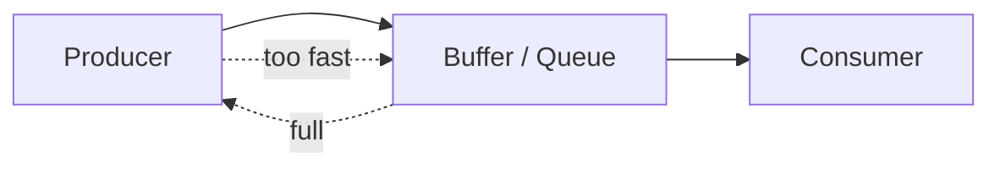

Pilihan desain:

| Pilihan | Konsekuensi |
|---|---|
| Buffer tak terbatas | memory spike, OOM |
| Buffer terbatas | producer bisa blocked/rejected |
| Drop data | perlu semantic loss |
| Spool ke disk | latency/disk pressure |
| Backpressure ke network | peer melambat |
| Reject request | perlu error contract |

Dalam Go, backpressure sering muncul natural karena `Write` blocking ketika downstream lambat. Tapi tidak semua pipeline otomatis aman. Jika Anda menaruh channel tak terbatas, goroutine fan-out tak terbatas, atau `io.ReadAll` sebelum validasi, backpressure hilang dan memory menjadi shock absorber.

Prinsip:

```text
Memory must not be the default place where unbounded external data accumulates.
```

---

## 20. Framing: Stream Bukan Message

TCP, file, pipe, dan banyak body HTTP adalah stream. Stream tidak punya batas message bawaan.

Kesalahan umum:

```text
One Read == one message
```

Ini salah.

`Read` boleh mengembalikan:

- setengah message,
- satu message,
- beberapa message,
- header saja,
- payload saja,
- data dengan EOF,
- data dengan timeout.

Agar ada message, Anda perlu framing:

| Framing | Contoh | Trade-off |
|---|---|---|
| Delimiter | newline protocol | mudah, escaping/line limit perlu diperhatikan |
| Length-prefix | binary protocol | efisien, harus validasi length |
| Fixed-size | record tetap | sederhana, kurang fleksibel |
| Chunked | HTTP chunked-like | streaming, parser lebih kompleks |
| Self-describing | JSON token stream | mudah dibaca, parsing cost lebih tinggi |

Diagram length-prefixed:

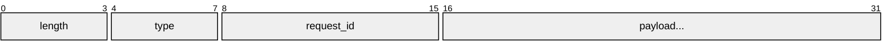

Pada part protocol design, kita akan membangun parser yang tahan:

- partial read,
- malicious length,
- truncated frame,
- unknown version,
- invalid checksum,
- resynchronization decision.

---

## 21. Text vs Binary IO

Text IO tampak mudah tetapi memiliki jebakan:

- encoding,
- newline convention,
- CRLF,
- invalid UTF-8,
- normalization,
- line length,
- delimiter escaping,
- locale assumptions,
- terminal behavior.

Binary IO tampak sulit tetapi sering lebih eksplisit:

- fixed width,
- endian,
- varint,
- magic number,
- version,
- length,
- checksum.

Perbandingan:

| Aspek | Text | Binary |
|---|---|---|
| Debug manusia | mudah | sulit |
| Size | lebih besar | lebih kecil |
| Parsing | tergantung format | eksplisit |
| Compatibility | bisa fleksibel | harus didesain |
| Corruption detection | perlu field/checksum | sering built-in desain |
| Performance | sering cukup | bisa lebih optimal |

Top 1% engineer tidak fanatik text atau binary. Mereka memilih berdasarkan contract:

- siapa producer/consumer,
- butuh human-debuggable atau tidak,
- data size,
- schema evolution,
- latency,
- compatibility,
- safety.

---

## 22. Serialization: Data Structure Menjadi Byte Contract

Serialization bukan hanya “convert struct to JSON”. Serialization adalah kontrak antar boundary.

Pertanyaan desain:

1. Apakah field optional?
2. Apakah unknown field diterima atau ditolak?
3. Bagaimana schema evolve?
4. Bagaimana default value dibedakan dari missing value?
5. Apakah order field penting?
6. Apakah format canonical dibutuhkan?
7. Apakah streaming decode dibutuhkan?
8. Apakah harus tahan input malicious?
9. Apakah angka besar aman?
10. Apakah timezone dan timestamp jelas?

Contoh JSON issue:

```json
{"amount": 1000000000000000000000}
```

Apakah ini aman menjadi `float64`? Mungkin tidak.

Contoh missing vs zero:

```json
{"retry": 0}
```

Berbeda dari:

```json
{}
```

Kalau `retry` punya default 3, missing dan zero harus dibedakan. Ini bukan masalah syntax Go; ini masalah contract.

---

## 23. Compression: Trade-off, Bukan Free Lunch

Compression mengubah IO cost profile.

```text
Without compression:
more network/disk bytes, less CPU

With compression:
fewer network/disk bytes, more CPU, buffering, flush complexity
```

Compression cocok bila:

- network bandwidth mahal,
- data sangat compressible,
- storage cost penting,
- latency total turun karena transfer lebih kecil,
- CPU tersedia.

Compression buruk bila:

- data sudah compressed,
- latency kecil lebih penting daripada ratio,
- CPU bottleneck,
- streaming flush terlalu sering,
- payload kecil,
- decompression bomb tidak dibatasi.

Di Go, compression sering berbentuk wrapper:

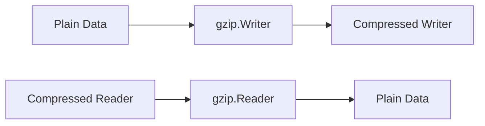

Close/flush penting karena compressed format sering punya footer/checksum.

---

## 24. Filesystem Bukan Database, tapi Punya Semantics

Banyak bug terjadi karena engineer memperlakukan filesystem sebagai map sederhana:

```text
path -> bytes
```

Padahal filesystem punya semantics:

- path resolution,
- permissions,
- symlink,
- hardlink,
- rename behavior,
- directory entry,
- file descriptor lifetime,
- page cache,
- fsync,
- atomicity tertentu,
- platform differences,
- race antara check dan use,
- case sensitivity berbeda,
- path separator berbeda,
- reserved names di Windows.

Contoh TOCTOU:

```text
Check file is safe
attacker changes symlink
open file
```

Contoh partial output:

```text
write directly to final.json
process crashes halfway
consumer reads corrupt final.json
```

Safer pattern:

```text
write final.json.tmp
flush/sync as needed
rename final.json.tmp -> final.json
```

Tetapi detail rename, fsync file, fsync directory, dan cross-filesystem move punya nuance. Ini akan dibahas di part durable writes.

---

## 25. Network IO: Tidak Ada Jaminan yang Tidak Anda Desain

Network adalah boundary yang lebih liar daripada file.

Masalah umum:

- DNS lambat/gagal,
- connect timeout,
- TLS handshake timeout,
- read timeout,
- write timeout,
- idle timeout,
- peer close,
- half-close,
- packet loss,
- NAT timeout,
- connection reuse bug,
- load balancer reset,
- proxy header issue,
- server slow response,
- client slow upload.

TCP memberi reliable byte stream, bukan reliable application transaction.

HTTP memberi request/response abstraction, tetapi tetap perlu:

- body close,
- timeout,
- max body size,
- streaming strategy,
- retry policy,
- idempotency semantics,
- connection pool control,
- backpressure,
- shutdown behavior.

Diagram request lifecycle:

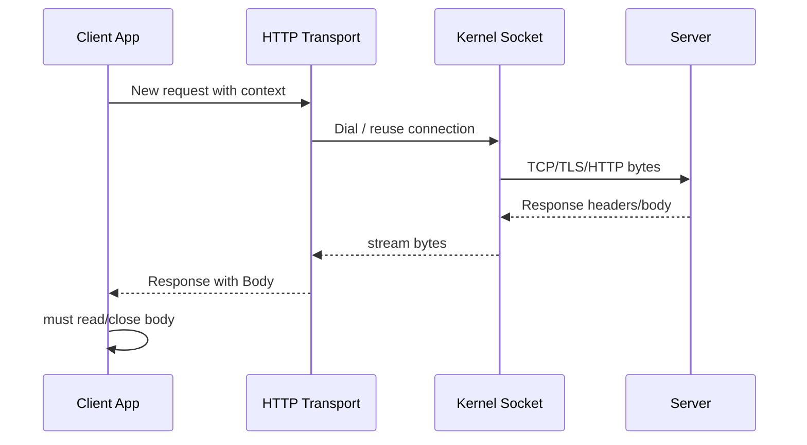

Jika body tidak ditutup, connection reuse bisa terganggu dan resource bocor.

---

## 26. Transfer Semantics: At-Least Once, At-Most Once, Exactly Once?

Data transfer sering terlihat sederhana:

```text
send file A to service B
```

Tetapi failure membuatnya kompleks.

Pertanyaan:

1. Jika client timeout, apakah server masih memproses?
2. Jika retry dilakukan, apakah file bisa tersimpan dua kali?
3. Jika upload putus setelah 90%, apakah bisa resume?
4. Jika checksum mismatch, siapa yang menghapus partial object?
5. Jika server return 500 setelah commit, retry aman atau duplikat?
6. Jika response hilang, bagaimana client tahu status final?

Semantic umum:

| Semantics | Makna | Contoh |
|---|---|---|
| At-most once | operasi tidak diulang sembarangan | non-idempotent payment-like command |
| At-least once | retry sampai diterima, duplikat mungkin | event delivery dengan dedup |
| Effectively once | idempotency key + dedup + commit record | upload object dengan content hash |

Untuk file/data transfer, production design biasanya butuh:

- idempotency key,
- content hash,
- temp object,
- finalization step,
- resumable offset,
- manifest,
- retry boundary,
- deduplication.

---

## 27. `context.Context` dan IO

`context.Context` adalah kontrol request lifecycle, tetapi tidak semua `io.Reader` atau `io.Writer` otomatis tahu context.

Contoh:

```go
func do(ctx context.Context, r io.Reader) error {
    // r.Read tidak otomatis berhenti hanya karena ctx canceled,
    // kecuali r berasal dari API yang memang menghubungkan context ke IO.
}
```

Context efektif bila:

- API menerima context secara eksplisit,
- underlying operation memonitor context,
- cancellation menutup koneksi/resource,
- deadline diset di transport/socket,
- goroutine blocked punya escape path.

Untuk network, deadline sering lebih dekat ke IO actual:

```go
conn.SetReadDeadline(time.Now().Add(5 * time.Second))
```

Untuk HTTP client, context pada request bisa membatalkan request.

Untuk generic `io.Reader`, kadang perlu wrapper atau desain khusus.

Prinsip:

```text
Context cancellation is not magic. It must be connected to the blocking operation.
```

---

## 28. Buffer Size: Tidak Ada Angka Sakral

Anda akan sering melihat buffer 4 KiB, 8 KiB, 32 KiB, 64 KiB.

Tidak ada angka sakral. Buffer size dipilih berdasarkan:

- syscall overhead,
- cache locality,
- throughput,
- latency,
- memory concurrency,
- network/file characteristics,
- downstream chunk size,
- compression window,
- application protocol.

Contoh trade-off:

```text
1 KiB buffer:
more syscalls, lower per-connection memory

1 MiB buffer:
fewer syscalls, higher memory pressure for many connections
```

Jika ada 10.000 koneksi dan masing-masing memakai 1 MiB buffer, potensi memory 10 GiB hanya untuk buffer.

Formula sederhana:

```text
total_buffer_memory = concurrent_streams × buffers_per_stream × buffer_size
```

Jangan optimasi berdasarkan feeling. Ukur dengan benchmark, pprof, dan production metrics.

---

## 29. Copy Cost dan Zero-Copy Reality

“Zero-copy” sering dipakai sebagai buzzword. Dalam Go production, pertanyaannya harus lebih presisi:

- copy dari mana ke mana?
- user-space ke user-space?
- kernel-space ke user-space?
- kernel buffer ke NIC?
- file ke socket?
- TLS aktif atau tidak?
- compression aktif atau tidak?
- transform perlu inspect byte atau tidak?

Jika Anda melakukan gzip, JSON parsing, checksum, encryption, atau application-level transform, zero-copy penuh biasanya tidak mungkin karena data harus disentuh CPU.

Banyak kasus cukup optimal dengan:

- streaming,
- buffer reuse,
- menghindari `ReadAll`,
- menghindari string conversion tidak perlu,
- `io.Copy` / `io.CopyBuffer`,
- menghindari double buffering,
- memilih boundary yang benar.

Prinsip:

```text
Avoid unnecessary copies before chasing mythical zero-copy.
```

---

## 30. Observability untuk IO

IO bug sulit tanpa observability karena gejalanya sering tidak langsung.

Contoh gejala:

- latency p99 naik,
- memory naik perlahan,
- goroutine blocked meningkat,
- FD count naik,
- response body tidak ditutup,
- disk usage naik karena temp file tertinggal,
- retry storm,
- downstream timeout,
- upload lambat tapi CPU rendah.

Minimal instrumentasi transfer:

```text
operation=upload
source=http_request
sink=temp_file
bytes_read=104857600
bytes_written=104857600
duration_ms=3820
status=success
checksum=match
```

Untuk failure:

```text
operation=download
source=remote_http
sink=file
bytes_read=73400320
bytes_written=73400320
duration_ms=30000
status=failed
error_class=timeout
stage=read_body
retryable=true
```

Stage sangat penting. “IO error” saja tidak cukup.

Stage taxonomy:

- open source,
- open sink,
- read header,
- read body,
- decode,
- transform,
- write temp,
- flush,
- sync,
- rename,
- close,
- cleanup.

---

## 31. Testing IO: Jangan Hanya Test Happy Path

IO code harus dites dengan fault injection.

Test cases yang harus ada:

1. source returns EOF immediately,
2. source returns partial data then EOF,
3. source returns `n > 0` and error,
4. source returns temporary error,
5. writer short write,
6. writer fails after partial write,
7. close fails,
8. flush fails,
9. malformed input,
10. oversized input,
11. timeout/cancellation,
12. temp cleanup,
13. concurrent close,
14. retry duplicates,
15. corrupted checksum,
16. path traversal,
17. archive entry escape,
18. slow reader,
19. slow writer.

Fake reader sederhana:

```go
type chunkReader struct {
    chunks [][]byte
    err    error
}

func (r *chunkReader) Read(p []byte) (int, error) {
    if len(r.chunks) == 0 {
        if r.err != nil {
            return 0, r.err
        }
        return 0, io.EOF
    }
    n := copy(p, r.chunks[0])
    r.chunks[0] = r.chunks[0][n:]
    if len(r.chunks[0]) == 0 {
        r.chunks = r.chunks[1:]
    }
    return n, nil
}
```

Kita akan pakai pattern seperti ini di part testing.

---

## 32. Security Lens untuk IO

IO adalah attack surface.

Contoh kelas vulnerability:

| Area | Risiko |
|---|---|
| HTTP body | oversized body, slowloris, request smuggling edge |
| MIME/header | malformed header, resource exhaustion |
| Path | traversal, symlink race, unsafe join |
| Archive | zip-slip, tar symlink/hardlink abuse, decompression bomb |
| JSON/XML | deep nesting, entity expansion policy, unknown field confusion |
| Compression | decompression bomb, checksum ignored |
| Proxy | hop-by-hop header abuse, header spoofing |
| Logging | log injection, sensitive data leak |
| Temp file | predictable path, permission leak |

Prinsip:

```text
Never parse or store external bytes without size, time, and semantic validation.
```

Untuk reverse proxy, Go 1.26 release notes secara eksplisit mendepresiasi `ReverseProxy.Director` karena desainnya bisa bermasalah dengan hop-by-hop header; seri ini akan mengikuti pola `Rewrite` untuk desain proxy modern.

---

## 33. Peta Roadmap 35 Part

```mermaid
flowchart TD
    P0[000 Orientation]
    P1[001 Data Movement Model]
    P2[002 Core IO Contracts]
    P3[003 Advanced io Helpers]
    P4[004 Buffer Fundamentals]
    P5[005 bufio Deep Dive]
    P6[006 Text IO]
    P7[007 Console IO]
    P8[008 IO Error Semantics]
    P9[009 File Basics]
    P10[010 Filesystem Ops]
    P11[011 Path Handling]
    P12[012 io/fs]
    P13[013 Large File Processing]
    P14[014 Durable Writes]
    P15[015 Binary Encoding]
    P16[016 Standard Serialization]
    P17[017 JSON Production Patterns]
    P18[018 Protocol Design]
    P19[019 Compression]
    P20[020 Archives]
    P21[021 Pipeline Composition]
    P22[022 Networking Foundation]
    P23[023 TCP Servers]
    P24[024 TCP Clients]
    P25[025 UDP]
    P26[026 Unix Sockets]
    P27[027 HTTP Client Internals]
    P28[028 HTTP Server Internals]
    P29[029 Multipart/MIME]
    P30[030 Reverse Proxy]
    P31[031 Performance]
    P32[032 Observability]
    P33[033 Testing]
    P34[034 Capstone]

    P0 --> P1 --> P2 --> P3 --> P4 --> P5 --> P6 --> P7 --> P8
    P8 --> P9 --> P10 --> P11 --> P12 --> P13 --> P14
    P14 --> P15 --> P16 --> P17 --> P18 --> P19 --> P20 --> P21
    P21 --> P22 --> P23 --> P24 --> P25 --> P26 --> P27 --> P28 --> P29 --> P30
    P30 --> P31 --> P32 --> P33 --> P34
```

---

## 34. Cara Membaca Seri Ini

Agar efektif, baca setiap part dengan tiga mode:

### 34.1 Mode Contract

Tanyakan:

- Apa kontrak API ini?
- Apa yang dijamin?
- Apa yang tidak dijamin?
- Apa yang terjadi pada partial progress?
- Siapa pemilik resource?
- Kapan error muncul?

### 34.2 Mode Failure

Tanyakan:

- Bagaimana bila input terlalu besar?
- Bagaimana bila source lambat?
- Bagaimana bila sink gagal setelah sebagian write?
- Bagaimana bila close gagal?
- Bagaimana bila context canceled?
- Bagaimana bila retry terjadi?

### 34.3 Mode Production

Tanyakan:

- Apa batas memory?
- Apa batas waktu?
- Apa metric-nya?
- Apa log-nya?
- Apa cleanup-nya?
- Apa test fault injection-nya?
- Apa security invariant-nya?

---

## 35. Setup Minimum untuk Latihan

Gunakan Go terbaru 1.26.x.

Cek versi:

```bash
go version
```

Buat workspace:

```bash
mkdir learn-go-io
cd learn-go-io
go mod init example.com/learn-go-io
```

Struktur yang akan dipakai sepanjang seri:

```text
learn-go-io/
  go.mod
  cmd/
    playground/
      main.go
  internal/
    transfer/
    fileutil/
    netutil/
    testutil/
  testdata/
  artifacts/
```

Catatan:

- `testdata/` adalah konvensi Go untuk data test.
- `artifacts/` bisa dipakai untuk output eksperimen lokal.
- Untuk Windows, path handling akan selalu dibahas hati-hati menggunakan `filepath` bila berhubungan dengan OS path.

---

## 36. Warm-Up Example: Copy Stream dengan Batas

Contoh awal ini bukan final production helper, tapi menggambarkan bentuk pikiran.

```go
package transfer

import (
    "fmt"
    "io"
)

func CopyLimited(dst io.Writer, src io.Reader, maxBytes int64) (int64, error) {
    if maxBytes < 0 {
        return 0, fmt.Errorf("maxBytes must be non-negative")
    }

    limited := io.LimitReader(src, maxBytes+1)
    n, err := io.Copy(dst, limited)
    if err != nil {
        return n, fmt.Errorf("copy stream: %w", err)
    }
    if n > maxBytes {
        return maxBytes, fmt.Errorf("copy stream: input exceeds max size %d", maxBytes)
    }
    return n, nil
}
```

Apa yang diajarkan contoh ini?

1. Fungsi menerima interface, bukan concrete type.
2. Source dan sink dipisahkan.
3. Ukuran dibatasi.
4. Error diberi konteks.
5. Return `n` tetap diberikan agar caller tahu progress.
6. Limit dibaca `maxBytes+1` agar bisa mendeteksi input yang melewati batas.

Apa yang belum ditangani?

- deadline/cancellation,
- close ownership,
- durable write,
- checksum,
- temp file,
- retry,
- observability,
- malicious slow source,
- short write detail manual.

Ini akan dibangun bertahap.

---

## 37. Warm-Up Example: Reader yang Menghitung Byte

Wrapper seperti ini sering dipakai untuk observability.

```go
package transfer

import "io"

type CountingReader struct {
    R io.Reader
    N int64
}

func (c *CountingReader) Read(p []byte) (int, error) {
    n, err := c.R.Read(p)
    c.N += int64(n)
    return n, err
}
```

Pemakaian:

```go
cr := &CountingReader{R: src}
n, err := io.Copy(dst, cr)
_ = n
_ = err
fmt.Println("bytes read:", cr.N)
```

Kenapa ini powerful?

Karena Go IO composition membuat observability bisa ditambahkan tanpa mengubah source atau sink asli.

---

## 38. Warm-Up Example: Tee untuk Hash + Write

Misalnya kita ingin menulis stream ke file sambil menghitung hash.

```go
h := sha256.New()
tee := io.TeeReader(src, h)

n, err := io.Copy(dstFile, tee)
if err != nil {
    return err
}

sum := h.Sum(nil)
_ = n
_ = sum
```

Konseptual:

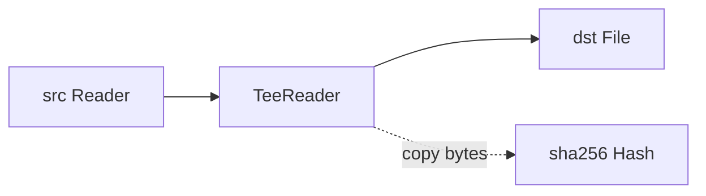

Catatan penting:

- hash dihitung atas byte yang berhasil dibaca dari source,
- bila write ke destination gagal di tengah, hash mungkin sudah menghitung data yang belum sepenuhnya committed,
- untuk integrity final, checksum harus dibandingkan dengan semantic commit, bukan hanya stream progress.

---

## 39. Latihan Mental untuk Part 000

Jawab pertanyaan berikut sebelum lanjut ke part 001.

### 39.1 Pertanyaan Konsep

1. Mengapa `io.Reader` menerima buffer dari caller, bukan mengembalikan `[]byte` baru setiap kali?
2. Mengapa `Read` bisa mengembalikan `n > 0` dan `err != nil`?
3. Apa perbedaan `EOF` pada file biasa dan EOF di tengah length-prefixed frame?
4. Mengapa `Write` sukses ke network tidak berarti remote application sudah memproses data?
5. Mengapa `Flush` pada `bufio.Writer` tidak sama dengan durable write ke disk?
6. Mengapa `context.Context` tidak otomatis membatalkan semua `io.Reader`?
7. Apa risiko `io.ReadAll` pada HTTP body tanpa limit?
8. Mengapa satu `Read` tidak boleh dianggap satu message?
9. Mengapa temp-write-rename lebih aman daripada write langsung ke final path?
10. Apa hubungan buffer size dengan concurrency?

### 39.2 Mini Design Review

Desain awal:

```text
User upload file lewat HTTP.
Server membaca seluruh body dengan io.ReadAll.
Server menulis langsung ke /uploads/final-name.
Jika error, server return 500.
```

Cari masalah:

- ukuran body tidak dibatasi,
- memory bisa spike,
- write langsung ke final path bisa expose partial file,
- tidak ada checksum,
- tidak ada temp cleanup,
- tidak ada timeout/slow client protection,
- tidak jelas apakah body ditutup,
- tidak ada idempotency,
- tidak ada observability bytes/duration,
- tidak ada policy path safety.

Versi lebih sehat:

```text
HTTP body
  -> max bytes reader
  -> stream multipart part
  -> validate filename metadata
  -> write to temp file in same directory/filesystem
  -> compute checksum while streaming
  -> flush/sync according to durability requirement
  -> atomic rename to final path
  -> record metadata
  -> respond success
  -> cleanup temp on any pre-commit failure
```

---

## 40. Engineering Heuristics

Simpan heuristics ini sepanjang seri.

### 40.1 Interface Heuristic

```text
Accept io.Reader/io.Writer when you only need stream behavior.
Accept concrete type only when you need concrete capability.
```

Contoh:

- perlu `Read` saja → `io.Reader`,
- perlu `Read` + `Close` → `io.ReadCloser`,
- perlu random access → `io.ReaderAt` atau `io.Seeker`,
- perlu file metadata → mungkin `*os.File` atau `fs.FileInfo`.

### 40.2 Limit Heuristic

```text
Every untrusted reader must be bounded before decoding.
```

Jangan decode JSON/XML/archive dari untrusted stream tanpa limit.

### 40.3 Close Heuristic

```text
The function that opens usually closes, unless ownership is explicitly transferred.
```

Kalau ownership transfer, dokumentasikan.

### 40.4 Flush Heuristic

```text
If you wrap a writer, know which layer requires Flush or Close.
```

Contoh:

- `bufio.Writer.Flush`,
- `gzip.Writer.Close`,
- `json.Encoder` tidak punya close,
- `os.File.Sync` untuk durability tertentu.

### 40.5 Retry Heuristic

```text
Retry only at boundaries with known idempotency semantics.
```

Jangan retry write command tanpa idempotency key atau dedup.

### 40.6 Observability Heuristic

```text
Log stage, not only error.
```

Buruk:

```text
upload failed: timeout
```

Lebih baik:

```text
upload failed stage=write_temp bytes_read=73400320 duration=30s error=timeout
```

---

## 41. Apa yang Harus Anda Kuasai Setelah Part 000

Setelah part ini, Anda belum harus hafal semua package. Tetapi Anda harus punya mental model berikut:

1. IO adalah boundary, bukan utilitas kecil.
2. `Reader` dan `Writer` adalah kontrak progress + error.
3. Partial progress adalah kondisi normal.
4. EOF harus ditafsirkan berdasarkan state.
5. Stream bukan message; framing harus didesain.
6. Buffer adalah trade-off memory/syscall/latency.
7. Load-all harus dibatasi dan dipilih sadar.
8. Close/Flush/Sync punya semantic berbeda.
9. File dan network punya failure model berbeda.
10. Production IO membutuhkan size, time, resource, progress, durability, observability, dan security invariant.

---

## 42. Preview Part 001

Part berikutnya:

```text
learn-go-io-buffer-byte-stream-file-network-data-transfer-part-001.md
```

Judul:

```text
Data Movement Model: byte, slice, stream, descriptor, socket, file
```

Kita akan membahas lebih dalam:

- apa yang sebenarnya berpindah saat IO,
- hubungan `byte`, `[]byte`, backing array, dan buffer,
- kenapa Go API mendorong caller-provided buffer,
- file descriptor vs Go object,
- stream vs block vs packet,
- kernel boundary,
- syscall count,
- page cache dan socket buffer secara konseptual,
- mental model data movement untuk file, network, terminal, dan memory.

---

## 43. Referensi Resmi

- Go 1.26 Release Notes: https://go.dev/doc/go1.26
- Go Release History: https://go.dev/doc/devel/release
- Package `io`: https://pkg.go.dev/io
- Package `bufio`: https://pkg.go.dev/bufio
- Package `os`: https://pkg.go.dev/os
- Package `io/fs`: https://pkg.go.dev/io/fs
- Package `net`: https://pkg.go.dev/net
- Package `net/http`: https://pkg.go.dev/net/http
- Package `net/http/httputil`: https://pkg.go.dev/net/http/httputil
- Package `encoding/json`: https://pkg.go.dev/encoding/json
- Package `compress/gzip`: https://pkg.go.dev/compress/gzip
- Package `archive/tar`: https://pkg.go.dev/archive/tar
- Package `archive/zip`: https://pkg.go.dev/archive/zip

---

## 44. Status Seri

- Part saat ini: **000**
- Total rencana: **034**
- Status: **Seri belum selesai**
- Lanjut berikutnya: **Part 001 — Data Movement Model**

<!-- NAVIGATION_FOOTER -->
<div class="page-nav">
<a href="./learn-go-io-buffer-byte-stream-file-network-data-transfer-MANIFEST.md">⬅️ Go IO, Buffer, Byte, Stream, File, Networking, Data Transfer</a>
<a href="./index.md">📚 Kategori</a>
<a href="../../index.md">🏠 Home</a>
<a href="./learn-go-io-buffer-byte-stream-file-network-data-transfer-part-001.md">Part 001 — Data Movement Model: Byte, Slice, Stream, Descriptor, Socket, File ➡️</a>
</div>
