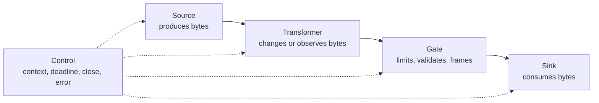
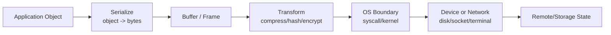
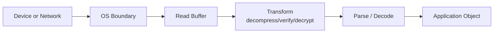
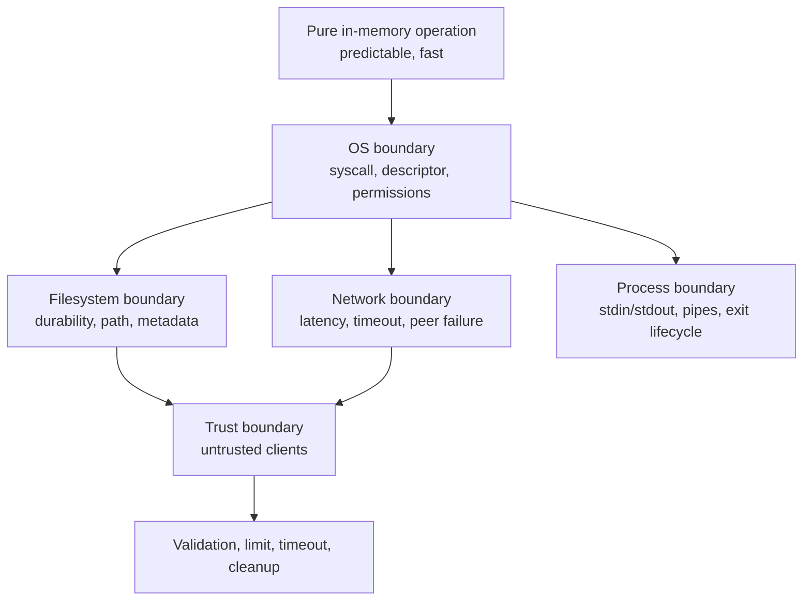
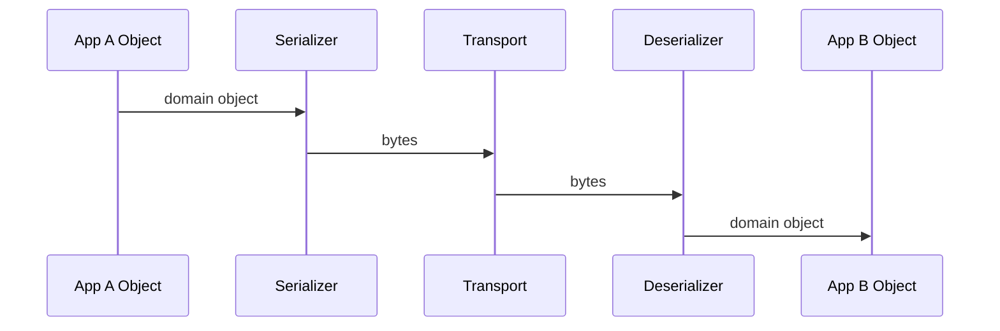
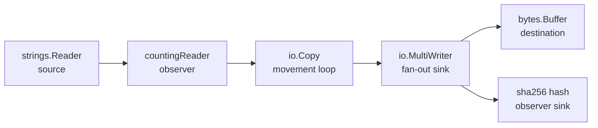

# learn-go-io-buffer-byte-stream-file-network-data-transfer-part-001.md

# Part 001 — Data Movement Model: Byte, Slice, Stream, Descriptor, Socket, File

> Seri: **Go IO, Buffer, Byte & Stream, Serialization, Console IO, File & FileSystem, Compression, Networking, Data Transfer**  
> Target: **Go 1.26.x**  
> Audience utama: **Java software engineer yang ingin memahami Go IO sampai level production engineering**  
> Status seri: **Part 001 dari 034 — belum selesai**

---

## 0. Tujuan Part Ini

Part ini membangun mental model dasar sebelum kita masuk ke API detail seperti `io.Reader`, `io.Writer`, `bufio.Reader`, `os.File`, `net.Conn`, `http.Request.Body`, `gzip.Reader`, `json.Decoder`, dan seterusnya.

Di Java, banyak engineer memahami IO lewat class hierarchy:

```text
InputStream / OutputStream
Reader / Writer
FileInputStream / BufferedInputStream
SocketChannel / FileChannel
ByteBuffer
```

Di Go, pola berpikirnya berbeda. Go tidak menempatkan IO sebagai hierarki kelas besar. Go menempatkan IO sebagai **komposisi kontrak kecil**:

```go
Read(p []byte) (n int, err error)
Write(p []byte) (n int, err error)
Close() error
```

Dari kontrak kecil ini, Go menyusun hampir semua data movement:

- file read/write,
- network connection,
- HTTP body,
- compression stream,
- JSON streaming decoder,
- tar/zip archive,
- process stdin/stdout,
- memory buffer,
- pipes,
- proxying,
- upload/download service,
- streaming ETL,
- log processing,
- binary protocol.

Target setelah part ini:

1. Memahami bahwa IO bukan “membaca file” atau “mengirim network request”, melainkan **memindahkan byte antar boundary**.
2. Bisa membedakan **byte**, **slice**, **buffer**, **stream**, **descriptor**, **file**, dan **socket**.
3. Bisa melihat semua operasi IO sebagai kombinasi dari **source**, **sink**, **transformer**, **boundary**, dan **control signal**.
4. Mulai berpikir dengan invariant production-grade: **partial progress**, **backpressure**, **bounded memory**, **ownership**, **deadline**, **cancellation**, **corruption**, dan **cleanup**.
5. Siap masuk ke Part 002: kontrak detail `io.Reader`, `io.Writer`, `Closer`, `Seeker`, `ReaderAt`, dan `WriterAt`.

---

## 1. Core Thesis: IO Adalah Data Movement, Bukan Sekadar API

Ketika program melakukan IO, program sedang melakukan satu dari beberapa hal berikut:

1. **Mengambil byte dari sumber**.
2. **Menaruh byte ke tujuan**.
3. **Mengubah byte ketika lewat**.
4. **Membatasi byte yang boleh lewat**.
5. **Menjadwalkan kapan byte boleh lewat**.
6. **Memverifikasi byte yang lewat**.
7. **Membersihkan resource setelah aliran selesai atau gagal**.

Contoh sederhana:

```go
n, err := io.Copy(dst, src)
```

Secara surface-level, ini hanya “copy”. Secara production-level, ini adalah operasi data movement dengan banyak pertanyaan:

| Pertanyaan | Kenapa Penting |
|---|---|
| `src` dari mana? | Memory, file, socket, HTTP body, pipe, compressed stream punya failure model berbeda. |
| `dst` ke mana? | Disk, network, buffer, hash writer, temp file, response body punya durability dan blocking behavior berbeda. |
| Berapa besar data? | 1 KB, 10 MB, 10 GB, infinite stream tidak boleh diperlakukan sama. |
| Siapa pemilik resource? | Salah owner berarti leak, double close, atau premature close. |
| Boleh partial? | Network dan file write dapat berhasil sebagian sebelum error. |
| Ada timeout? | Tanpa timeout, request dapat menggantung selamanya. |
| Ada limit? | Tanpa limit, malicious input dapat menghabiskan memory/disk. |
| Ada transform? | Compression, encryption, JSON decoding, checksum, logging mengubah semantic data flow. |
| Apa yang terjadi saat error? | Harus tahu data sudah berapa jauh berpindah dan apakah state tujuan sudah corrupt. |

Dalam sistem nyata, bug IO jarang muncul karena `Read`/`Write` tidak dipanggil. Bug IO muncul karena engineer lupa bahwa IO memiliki **progress**, **state**, **boundary**, dan **failure after partial success**.

---

## 2. Peta Besar Data Movement di Go

Go menyediakan banyak package IO-related, tetapi semuanya bisa ditempatkan di peta ini:

```mermaid
flowchart TB
    A[In-memory byte data<br/>[]byte, string, bytes.Buffer] --> B[Generic IO contract<br/>io.Reader / io.Writer]
    B --> C[Buffered IO<br/>bufio.Reader / bufio.Writer]
    B --> D[File & OS<br/>os.File, os.ReadFile, os.OpenFile]
    B --> E[Filesystem abstraction<br/>io/fs, embed.FS]
    B --> F[Network IO<br/>net.Conn, net.Listener]
    B --> G[HTTP IO<br/>Request.Body, Response.Body, ResponseWriter]
    B --> H[Serialization<br/>json.Decoder, xml.Decoder, csv.Reader, binary]
    B --> I[Compression<br/>gzip, zlib, flate]
    B --> J[Archives<br/>tar, zip]
    B --> K[Process IO<br/>stdin, stdout, stderr, os/exec pipes]

    D --> L[Durability, permissions, paths]
    F --> M[Deadlines, backpressure, partial transfer]
    G --> N[Streaming request/response, proxy, multipart]
    H --> O[Schema, framing, malformed input]
    I --> P[CPU vs bandwidth, streaming transform]
```

Yang menarik: banyak kotak di atas tidak perlu tahu satu sama lain. `gzip.NewReader` hanya perlu sumber yang bisa dibaca. `json.NewDecoder` hanya perlu `io.Reader`. `io.Copy` hanya butuh `io.Writer` dan `io.Reader`.

Inilah kenapa Go IO terasa sangat composable.

---

## 3. Vocabulary Fundamental

Sebelum belajar API, kita harus menyepakati istilah.

### 3.1 Byte

Byte adalah unit data mentah.

Di Go:

```go
var b byte = 65 // alias untuk uint8
```

`byte` adalah alias untuk `uint8`. Ia tidak otomatis berarti karakter. Byte `65` bisa berarti:

- huruf `A` dalam ASCII/UTF-8,
- bagian dari integer binary,
- bagian dari PNG file,
- satu byte dari TCP payload,
- compressed data,
- encrypted data,
- protobuf payload,
- arbitrary binary blob.

Kesalahan mental model umum:

```text
byte == character
```

Ini salah untuk Go dan hampir semua sistem modern.

Karakter teks modern umumnya direpresentasikan sebagai Unicode code point dan di-encode ke byte, sering memakai UTF-8. Satu karakter bisa menggunakan lebih dari satu byte.

Contoh:

```go
s := "é"
fmt.Println(len(s))         // jumlah byte, bukan jumlah karakter visual
fmt.Println([]byte(s))      // byte UTF-8
fmt.Println([]rune(s))      // rune/code point
```

Part 006 akan membahas text IO, UTF-8, rune boundary, line protocol, dan malformed input lebih dalam. Untuk sekarang cukup pegang invariant ini:

> IO Go bergerak dalam byte. Interpretasi byte menjadi teks, record, object, command, atau file format adalah layer di atasnya.

---

### 3.2 Slice `[]byte`

`[]byte` adalah view atas array byte.

Ia memiliki:

- pointer ke backing array,
- length,
- capacity.

Mental model:

```text
slice = window over byte storage
```

Bukan berarti setiap slice punya memory sendiri. Banyak slice dapat menunjuk backing array yang sama.

```go
buf := make([]byte, 1024)
a := buf[:100]
b := buf[100:200]
```

`a` dan `b` adalah dua view terhadap backing storage yang sama.

Dalam IO, `[]byte` sering menjadi:

1. **read buffer** — tempat `Read` menaruh data,
2. **write payload** — data yang diberikan ke `Write`,
3. **scratch buffer** — area kerja reusable,
4. **frame buffer** — buffer untuk satu record/protocol frame,
5. **accumulation buffer** — buffer yang bertambah ukurannya sampai data lengkap.

Production invariant:

> Siapa pun yang menerima `[]byte` harus tahu apakah ia boleh menyimpan, mengubah, atau hanya membaca sementara.

Contoh bug ownership:

```go
func badStore(chunks [][]byte, buf []byte, n int) [][]byte {
    // BUG: menyimpan slice yang menunjuk buffer reusable.
    // Pada read berikutnya, isi buffer bisa berubah.
    return append(chunks, buf[:n])
}
```

Versi aman:

```go
func safeStore(chunks [][]byte, buf []byte, n int) [][]byte {
    copied := append([]byte(nil), buf[:n]...)
    return append(chunks, copied)
}
```

Trade-off:

| Pilihan | Kelebihan | Risiko |
|---|---|---|
| Simpan slice langsung | Nol copy | Data bisa berubah, lifetime tidak jelas |
| Copy byte | Aman | Allocation dan CPU lebih tinggi |
| Pool/reuse buffer | Allocation lebih rendah | Ownership makin sulit |

Ini akan sering muncul di IO performance engineering.

---

### 3.3 Buffer

Buffer adalah memory sementara untuk menahan byte.

Buffer dipakai untuk:

- mengurangi syscall,
- mengubah ukuran batch,
- menghubungkan producer dan consumer dengan kecepatan berbeda,
- parsing data yang belum lengkap,
- menyusun response sebelum dikirim,
- menyimpan data sementara sebelum durably written,
- menghindari terlalu banyak allocation kecil.

Namun buffer bukan gratis.

Buffer terlalu kecil:

- syscall banyak,
- throughput rendah,
- CPU overhead tinggi.

Buffer terlalu besar:

- memory boros,
- GC pressure naik jika on-heap,
- latency bisa naik karena menunggu penuh,
- lebih sulit mengontrol max input.

Mental model:

```text
buffer is a queue, not a magic performance button
```

Buffer memperhalus perbedaan kecepatan. Buffer tidak menghilangkan bottleneck. Jika disk lambat, network lambat, atau downstream macet, buffer hanya menunda masalah.

---

### 3.4 Stream

Stream adalah aliran byte yang dibaca atau ditulis bertahap.

Stream bisa:

- finite: file kecil, HTTP response dengan `Content-Length`, archive entry,
- unknown length: chunked HTTP response, stdin, TCP connection,
- effectively infinite: log tail, message feed, socket long-lived,
- replayable: file dengan seek, memory buffer,
- non-replayable: network body, stdin, pipe.

Stream bukan array. Stream tidak selalu punya ukuran total. Stream tidak selalu bisa diulang.

Kesalahan umum:

```go
body, _ := io.ReadAll(r.Body)
```

Kadang benar untuk payload kecil yang sudah dibatasi. Tetapi berbahaya untuk upload besar, streaming API, proxy, dan input tidak terpercaya.

Pertanyaan wajib untuk setiap stream:

| Pertanyaan | Implikasi |
|---|---|
| Apakah stream finite? | Jika tidak, `ReadAll` bisa tidak pernah selesai. |
| Apakah size diketahui? | Bisa preallocate atau enforce limit. |
| Apakah replayable? | Retry strategy berbeda. |
| Apakah boleh dibaca lebih dari sekali? | HTTP body biasanya tidak. |
| Apakah bisa dibatalkan? | Butuh context/deadline/close. |
| Apakah source terpercaya? | Butuh limit, validation, timeout. |
| Apakah data record-based? | Butuh framing/tokenization. |

---

### 3.5 Descriptor / Handle

Descriptor adalah referensi OS-level ke resource IO.

Di Unix-like system, file descriptor adalah integer kecil yang merepresentasikan resource seperti:

- file,
- socket,
- pipe,
- device,
- terminal.

Di Windows, konsepnya lebih dekat ke handle.

Go menyembunyikan detail OS lewat tipe seperti:

```go
*os.File
net.Conn
net.Listener
```

Tetapi resource OS tetap nyata. Jika tidak ditutup, resource leak.

Contoh:

```go
f, err := os.Open("data.txt")
if err != nil {
    return err
}
defer f.Close()
```

Di aplikasi kecil, `defer Close()` terlihat cukup. Di aplikasi production yang memproses ribuan file/koneksi, ownership Close harus dirancang eksplisit.

Descriptor punya keterbatasan:

- jumlah descriptor per process terbatas,
- descriptor leak dapat membuat service tidak bisa menerima koneksi baru,
- descriptor bisa menunjuk resource yang sudah berubah di filesystem,
- socket descriptor bisa hidup walaupun peer tidak sehat,
- close bisa gagal, terutama untuk write path tertentu.

Invariant:

> Setiap resource IO yang punya `Close` harus punya owner yang jelas.

---

### 3.6 File

File adalah named object dalam filesystem. Tetapi dari sudut pandang IO, file adalah byte sequence dengan beberapa properti tambahan:

- path,
- metadata,
- permission,
- owner/group,
- size,
- modification time,
- directory entry,
- link/hardlink/symlink behavior,
- durability semantics,
- seekability,
- filesystem-specific behavior.

`os.File` di Go dapat merepresentasikan file biasa, directory, pipe, atau device bergantung OS dan cara dibuka.

File sering dianggap sederhana, padahal file IO production-grade penuh edge case:

- path traversal,
- symlink race,
- permission mismatch,
- rename atomicity beda filesystem,
- write buffering OS,
- fsync discipline,
- partial write,
- disk full,
- file replaced while open,
- newline differences,
- temp file cleanup,
- directory walk dengan permission error,
- large file > memory.

Part 009 sampai 014 akan masuk ke file dan filesystem secara mendalam.

---

### 3.7 Socket

Socket adalah endpoint komunikasi network atau local IPC.

Di Go, abstraction umum socket stream adalah:

```go
type Conn interface {
    Read(b []byte) (n int, err error)
    Write(b []byte) (n int, err error)
    Close() error
    LocalAddr() Addr
    RemoteAddr() Addr
    SetDeadline(t time.Time) error
    SetReadDeadline(t time.Time) error
    SetWriteDeadline(t time.Time) error
}
```

`net.Conn` terlihat seperti file karena sama-sama bisa `Read` dan `Write`. Tetapi semantic-nya berbeda.

| Aspek | File | TCP Socket |
|---|---|---|
| Ukuran total | Biasanya bisa diketahui | Tidak inherent |
| Seek | Biasanya bisa untuk regular file | Tidak bisa |
| Replay | Bisa reopen/seek | Tidak bisa tanpa protocol support |
| EOF | End of file | Peer closed write side / connection ends |
| Latency | Disk/cache dependent | Network + peer dependent |
| Failure | Disk full, permission, path | timeout, reset, half-open, packet loss |
| Backpressure | Disk throughput | Peer receive window / network / kernel buffer |
| Deadline | Tidak selalu meaningful untuk file biasa | Sangat penting |

Karena itu, walaupun API `Read`/`Write` mirip, design decision-nya berbeda.

---

## 4. The Five Roles in Go IO

Hampir semua desain IO bisa dipahami melalui lima role.



### 4.1 Source

Source menghasilkan byte.

Contoh:

- `*os.File` yang dibaca,
- `net.Conn` sisi read,
- `http.Request.Body`,
- `bytes.Reader`,
- `strings.Reader`,
- `gzip.Reader`,
- `tar.Reader`,
- `json.Decoder` secara konseptual menghasilkan object dari byte,
- `os.Stdin`,
- pipe reader.

Pertanyaan source:

1. Apakah source finite?
2. Apakah source trustworthy?
3. Apakah source bisa blocking?
4. Apakah source bisa dibatalkan?
5. Apakah source perlu ditutup?
6. Apakah source replayable?
7. Apakah source menghasilkan raw bytes atau decoded bytes?

---

### 4.2 Sink

Sink menerima byte.

Contoh:

- `*os.File` yang ditulis,
- `net.Conn` sisi write,
- `http.ResponseWriter`,
- `bytes.Buffer`,
- `gzip.Writer`,
- `tar.Writer`,
- hash writer seperti `sha256.New()` via `io.Writer`,
- `os.Stdout`,
- pipe writer.

Pertanyaan sink:

1. Apakah sink bisa menerima semua data?
2. Apakah sink bisa partial write?
3. Apakah sink durably stores data?
4. Apakah sink perlu `Flush`?
5. Apakah sink perlu `Close` untuk finalization?
6. Apakah sink bisa blocking karena downstream lambat?
7. Apa yang terjadi jika error setelah sebagian data tertulis?

---

### 4.3 Transformer

Transformer membaca dari satu sisi dan menulis ke sisi lain sambil mengubah representasi.

Contoh:

- gzip compression/decompression,
- base64 encoding/decoding,
- JSON decoding,
- CSV parsing,
- encryption/decryption,
- newline normalization,
- checksum calculation,
- rate limiter,
- progress meter,
- logging wrapper,
- protocol frame decoder.

Transformer dapat bersifat:

| Jenis | Contoh | Karakteristik |
|---|---|---|
| Stateless | uppercase ASCII byte | Mudah streaming |
| Stateful | gzip, JSON decoder, CSV parser | Butuh internal state |
| Expanding | decompression | Output bisa jauh lebih besar |
| Shrinking | compression | Output lebih kecil tapi CPU lebih tinggi |
| Framing | length-prefix decoder | Perlu batas record |
| Observing | hash writer, progress reader | Tidak mengubah data utama |

Transformer yang buruk sering menjadi sumber bug karena ia menyembunyikan state.

Contoh: `gzip.Writer` harus di-`Close` agar footer/checksum ditulis. `bufio.Writer` harus di-`Flush` agar buffered data keluar. `json.Decoder` bisa menyisakan token setelah decode pertama.

---

### 4.4 Gate

Gate mengontrol apa yang boleh lewat.

Gate bisa berupa:

- size limit,
- rate limit,
- timeout,
- schema validation,
- checksum verification,
- magic number check,
- MIME sniffing,
- allowlist extension,
- max line length,
- max nesting depth,
- max decompressed size,
- path safety validation.

Gate adalah bagian yang sering tidak ada di tutorial, tetapi wajib di production.

Contoh gate sederhana:

```go
const maxUpload = 10 << 20 // 10 MiB
limited := io.LimitReader(r.Body, maxUpload+1)
```

Jika hasil baca lebih dari `maxUpload`, request harus ditolak. Part 003 dan part HTTP upload akan membahas detailnya.

---

### 4.5 Control

Control mengatur lifecycle dan failure.

Control signal dalam IO meliputi:

- `error`,
- `io.EOF`,
- `Close`,
- `Flush`,
- `context.Context`,
- read/write deadline,
- cancellation by closing connection,
- retry policy,
- cleanup temp file,
- transaction boundary,
- fsync boundary.

Di Java, control sering tersebar dalam exception, closeable, future cancellation, thread interruption, NIO selector, dan framework timeout. Di Go, control sering lebih eksplisit, tetapi juga lebih mudah terlewat karena `error` harus dicek manual.

---

## 5. Data Movement Pipeline: Dari Memory ke Boundary

Program Go biasanya memindahkan data melewati beberapa boundary:



Sebaliknya saat membaca:



Di setiap tahap, ada pertanyaan:

| Tahap | Pertanyaan |
|---|---|
| Serialize | Apakah encoding stabil/versioned? |
| Buffer | Siapa pemilik byte? Berapa max size? |
| Transform | Apakah output bisa lebih besar? Perlu close/flush? |
| OS boundary | Berapa syscall? Apakah blocking? |
| Device/network | Apakah reliable? Durable? Ordered? |
| Decode | Apakah malformed input ditangani? |
| Object | Apakah valid secara domain? |

---

## 6. Java IO/NIO vs Go IO: Mapping Mental Model

Karena kamu datang dari Java, bagian ini penting.

### 6.1 Mapping Kasar

| Java | Go | Catatan |
|---|---|---|
| `InputStream` | `io.Reader` | Sama-sama byte-oriented pull read. |
| `OutputStream` | `io.Writer` | Sama-sama byte-oriented write. |
| `Reader` / `Writer` | Tidak ada padanan universal | Go memisahkan byte IO dari text interpretation. |
| `BufferedInputStream` | `bufio.Reader` | Wrapper buffering. |
| `BufferedOutputStream` | `bufio.Writer` | Perlu `Flush`. |
| `FileInputStream` | `*os.File` | `os.File` bisa read/write/seek tergantung open flag. |
| `FileChannel` | `*os.File` + methods / `io.ReaderAt` / `io.WriterAt` | Go tidak memusatkan semua di Channel abstraction. |
| `ByteBuffer` | `[]byte`, `bytes.Buffer`, custom buffer | Go lebih sering memakai slice. |
| `Socket` | `net.Conn` | Interface read/write + deadline. |
| `ServerSocket` | `net.Listener` | Accept loop. |
| `Path` / `Files` | `path/filepath`, `os`, `io/fs` | Go memisahkan path ops, OS ops, FS abstraction. |
| checked exception | `(n, err)` | Error eksplisit di return value. |
| try-with-resources | `defer Close()` + explicit ownership | Harus hati-hati di loop. |

---

### 6.2 Perbedaan Filosofi

Java IO sering terasa seperti memilih class yang tepat dari hierarchy.

Go IO lebih seperti memilih bentuk kontrak terkecil yang cukup.

```go
func process(r io.Reader, w io.Writer) error
```

Fungsi di atas bisa dipakai untuk:

- file ke file,
- HTTP body ke response,
- memory buffer ke gzip writer,
- TCP conn ke file,
- stdin ke stdout,
- test fake reader ke fake writer.

Go menghindari over-specification.

Buruk:

```go
func processFile(f *os.File) error
```

Jika sebenarnya hanya perlu membaca byte, gunakan:

```go
func process(r io.Reader) error
```

Tetapi jangan juga terlalu abstrak. Jika butuh seek, gunakan kontrak yang mencerminkan kebutuhan:

```go
func parseHeader(r io.ReaderAt) error
```

Aturan desain:

> Terima interface sekecil mungkin, tetapi jangan hilangkan requirement semantic.

Jika fungsi butuh `Read` dan `Close`, jangan hanya menerima `io.Reader` jika ownership close ada di fungsi tersebut.

---

## 7. IO Is About Boundaries

Boundary adalah tempat data keluar dari kontrol murni program.

Boundary utama:

1. Memory boundary.
2. OS boundary.
3. Filesystem boundary.
4. Network boundary.
5. Process boundary.
6. Format/protocol boundary.
7. Trust boundary.

Setiap boundary menambah risiko.



### 7.1 Memory Boundary

Memory boundary terjadi saat data berpindah antara object/slice/buffer.

Risikonya:

- allocation spike,
- retaining large backing array,
- accidental mutation,
- data race,
- copying terlalu banyak,
- holding byte lebih lama dari perlu.

Contoh retaining backing array:

```go
func firstLine(data []byte) []byte {
    i := bytes.IndexByte(data, '\n')
    if i < 0 {
        return data
    }
    return data[:i]
}
```

Jika `data` adalah 100 MB dan hasilnya hanya 20 byte, return slice tetap menahan backing array 100 MB tetap live. Versi aman bila ingin menyimpan lama:

```go
func firstLineCopy(data []byte) []byte {
    i := bytes.IndexByte(data, '\n')
    if i < 0 {
        return append([]byte(nil), data...)
    }
    return append([]byte(nil), data[:i]...)
}
```

---

### 7.2 OS Boundary

OS boundary terjadi saat program meminta kernel melakukan sesuatu:

- read file,
- write file,
- accept socket,
- send bytes,
- receive bytes,
- stat path,
- rename file,
- open directory.

Risikonya:

- permission denied,
- file not found,
- disk full,
- interrupted operation,
- blocking,
- descriptor exhaustion,
- platform-specific semantics.

Go package `os` memberikan interface platform-independent yang Unix-like, tetapi error handling tetap Go-style: operasi gagal mengembalikan `error`, sering dengan informasi lebih kaya seperti `*PathError`.

---

### 7.3 Filesystem Boundary

Filesystem bukan hanya byte store.

Filesystem punya semantic:

- directory tree,
- path resolution,
- symlink,
- permissions,
- metadata,
- mount point,
- atomicity properties,
- caching,
- durability.

Contoh: rename biasanya atomic dalam filesystem yang sama, tetapi tidak bisa diasumsikan sama untuk cross-device rename. Safe update file biasanya menggunakan pola:

```text
write temp file -> flush data -> close -> rename -> fsync directory where needed
```

Detailnya akan masuk Part 014.

---

### 7.4 Network Boundary

Network boundary lebih liar daripada file.

Network memiliki:

- latency variatif,
- partial delivery,
- peer lambat,
- peer disconnect,
- half-open connection,
- timeout,
- DNS failure,
- connection reset,
- backpressure,
- congestion,
- protocol mismatch.

TCP memberikan ordered reliable byte stream, tetapi bukan message boundary. Jika kamu menulis dua pesan:

```text
Write("hello")
Write("world")
```

Receiver tidak dijamin membaca sebagai dua `Read` terpisah. Receiver bisa melihat:

```text
"helloworld"
```

atau:

```text
"he" + "llo wor" + "ld"
```

Maka protocol TCP butuh framing.

---

### 7.5 Format Boundary

Format boundary terjadi saat byte diinterpretasikan sebagai:

- JSON,
- XML,
- CSV,
- gzip,
- tar,
- zip,
- protobuf,
- image,
- custom binary frame,
- line protocol.

Risikonya:

- malformed input,
- schema drift,
- version mismatch,
- decompression bomb,
- parser ambiguity,
- integer overflow saat length-prefix,
- unexpected trailing data,
- duplicate field,
- encoding mismatch.

Format boundary selalu butuh validation.

---

### 7.6 Trust Boundary

Trust boundary adalah titik ketika data berasal dari luar kontrol sistem:

- user upload,
- HTTP request body,
- webhook,
- archive file,
- external API,
- message queue,
- CLI arg,
- config file editable manual,
- shared filesystem.

Trust boundary wajib memiliki:

- maximum size,
- timeout/deadline,
- format validation,
- schema validation,
- path safety,
- checksum/signature bila perlu,
- observability,
- failure classification.

---

## 8. Sequential, Random, Message, and Object IO

Tidak semua IO sama. Minimal ada empat model.

### 8.1 Sequential Byte Stream

Data dibaca dari awal ke akhir.

Contoh:

- file log,
- HTTP body,
- TCP stream,
- gzip stream,
- stdin.

Properti:

- cocok untuk `io.Reader`,
- hemat memory,
- tidak butuh tahu total size,
- sulit retry dari tengah kecuali ada checkpoint,
- parser harus handle record partial.

---

### 8.2 Random Access

Data bisa dibaca dari offset tertentu.

Contoh:

- database file,
- SSTable,
- large binary file,
- index file,
- media file,
- object store range request secara konseptual.

Go abstraction:

```go
ReadAt(p []byte, off int64) (n int, err error)
WriteAt(p []byte, off int64) (n int, err error)
Seek(offset int64, whence int) (int64, error)
```

Random access lebih cocok untuk parser format yang punya header/index/footer.

---

### 8.3 Message-Oriented IO

Data dikirim sebagai message terpisah.

Contoh:

- UDP datagram,
- message queue,
- WebSocket message,
- length-prefixed protocol,
- framed RPC.

TCP sendiri bukan message-oriented, tetapi kita bisa membangun message-oriented protocol di atas TCP dengan framing.

---

### 8.4 Object-Oriented Data Transfer

Object-oriented di sini bukan OOP, tetapi data application-level.

Contoh:

```json
{"id":"123","status":"APPROVED"}
```

Object harus diubah ke byte sebelum ditransfer:

```text
object -> serialization -> byte stream -> transport -> byte stream -> deserialization -> object
```

Bug sering terjadi ketika engineer lupa bahwa object boundary berbeda dari transport boundary.

Contoh: satu HTTP request body bisa berisi:

- satu JSON object,
- banyak JSON object newline-delimited,
- satu JSON array besar,
- multipart file + metadata,
- compressed JSON,
- encrypted binary payload.

Masing-masing memerlukan strategi berbeda.

---

## 9. Pull vs Push Model

Go IO standard library dominan memakai pull model:

```go
n, err := r.Read(buf)
```

Consumer meminta data dari source.

Dalam push model, producer mendorong data ke consumer:

```go
func onData(chunk []byte) { ... }
```

Keduanya bisa dikonversi, tetapi failure model berbeda.

| Model | Kelebihan | Risiko |
|---|---|---|
| Pull | Backpressure natural: consumer membaca sesuai kemampuan | Source bisa blocking saat read |
| Push | Cocok event/callback | Backpressure harus dirancang eksplisit |

`io.Reader` memberi backpressure natural. Jika writer/consumer lambat, reader tidak terus menghasilkan data kecuali ada buffering/pipeline tambahan.

Namun saat kamu membuat goroutine pipeline, kamu bisa secara tidak sadar mengubah pull model menjadi push model dan kehilangan backpressure.

Contoh risiko:

```go
chunks := make(chan []byte, 100000) // buffer terlalu besar, bisa jadi memory bomb
```

Lebih baik desain bounded queue dan cancellation.

---

## 10. Finite vs Infinite Data

Banyak bug IO berasal dari memperlakukan infinite/unknown stream seperti finite data.

### 10.1 Finite Data

Contoh:

- small config file,
- known-size upload,
- archive entry dengan size jelas,
- fixed-size binary header.

Boleh dipertimbangkan untuk load-all jika:

- ukuran kecil,
- sudah dibatasi,
- trust boundary aman,
- memory impact diterima,
- parsing butuh seluruh data.

---

### 10.2 Unknown-Length Data

Contoh:

- HTTP chunked body,
- stdin,
- TCP connection,
- streaming API,
- compressed input sebelum decompressed size diketahui.

Harus diproses streaming atau diberi limit.

---

### 10.3 Infinite or Long-Lived Data

Contoh:

- log tail,
- persistent socket,
- event stream,
- server-sent events,
- replication feed.

Wajib punya:

- cancellation,
- heartbeat/idle timeout,
- max buffer,
- recovery point,
- reconnect strategy,
- observability per session.

---

## 11. Replayable vs Non-Replayable

Replayability menentukan strategi retry dan error recovery.

| Source | Replayable? | Catatan |
|---|---:|---|
| `bytes.Reader` | Ya | Bisa `Seek` atau recreate dari byte. |
| Regular file | Biasanya ya | Bisa reopen atau seek jika file stabil. |
| HTTP request body server-side | Tidak secara default | Setelah dibaca, data hilang kecuali disimpan. |
| TCP stream | Tidak | Perlu protocol-level replay. |
| stdin | Tidak | Tergantung source. |
| gzip stream | Tidak mudah | Bisa replay jika compressed source replayable. |
| Object store range | Secara konsep ya | Butuh remote support dan consistency assumption. |

Retry tanpa replayability adalah bug.

Contoh:

```go
func sendWithRetry(body io.Reader) error {
    for i := 0; i < 3; i++ {
        err := sendOnce(body)
        if err == nil {
            return nil
        }
    }
    return errors.New("failed")
}
```

Jika `sendOnce` sudah membaca sebagian `body`, retry berikutnya mulai dari posisi setelah data yang sudah dikonsumsi. Ini bisa mengirim payload rusak/kosong.

Desain lebih benar:

```go
type BodyFactory func() (io.ReadCloser, error)

func sendWithRetry(newBody BodyFactory) error {
    for i := 0; i < 3; i++ {
        body, err := newBody()
        if err != nil {
            return err
        }
        err = sendOnce(body)
        closeErr := body.Close()
        if err == nil && closeErr == nil {
            return nil
        }
        if err == nil {
            err = closeErr
        }
        if !isRetryable(err) {
            return err
        }
    }
    return errors.New("failed after retries")
}
```

Part HTTP client akan membahas ini lebih detail.

---

## 12. Partial Progress: Konsep Paling Penting di IO

Operasi IO bisa gagal setelah sebagian data berhasil dipindahkan.

Contoh:

```go
n, err := w.Write(p)
```

Kemungkinan:

| `n` | `err` | Arti Umum |
|---:|---|---|
| `len(p)` | `nil` | Semua byte diterima oleh writer abstraction. |
| `< len(p)` | non-nil | Sebagian byte berhasil, lalu error. |
| `0` | non-nil | Tidak ada progress. |
| `> 0` | non-nil | Progress dan failure bersamaan. Jangan buang `n`. |

Untuk `Read`, sama:

```go
n, err := r.Read(buf)
```

Jika `n > 0`, byte itu harus diproses sebelum memperlakukan `err`, termasuk saat `err == io.EOF` dalam beberapa implementasi.

Ini berbeda dari banyak contoh tutorial yang langsung return saat `err != nil` tanpa memproses `n`.

Mental rule:

> Dalam IO, progress dan error dapat muncul di operasi yang sama.

Part 002 akan membahas kontrak ini secara presisi.

---

## 13. Backpressure

Backpressure berarti downstream yang lambat memperlambat upstream agar sistem tidak meledak.

Tanpa backpressure:

```text
fast producer -> unbounded buffer -> slow consumer -> memory explosion
```

Dengan backpressure:

```text
fast producer -> bounded path -> slow consumer causes producer to slow down
```

Go IO dengan `Reader`/`Writer` secara natural cenderung backpressure-friendly karena data bergerak saat fungsi dipanggil. Tetapi backpressure bisa rusak oleh:

- `io.ReadAll` tanpa limit,
- unbounded channel,
- buffering terlalu besar,
- membaca seluruh request sebelum menulis downstream,
- goroutine producer yang terus append ke memory,
- queue tanpa capacity policy,
- decompression tanpa max output limit.

Contoh anti-pattern upload proxy:

```go
body, err := io.ReadAll(r.Body) // memory spike untuk upload besar
if err != nil {
    return err
}
_, err = downstream.Write(body)
```

Lebih baik streaming:

```go
_, err := io.Copy(downstream, r.Body)
```

Tetapi streaming pun belum cukup. Masih perlu:

- max size,
- timeout,
- cancellation,
- error classification,
- cleanup downstream jika partial.

---

## 14. Boundedness: Semua Input Harus Punya Batas

Production rule:

> Any untrusted input without a limit is a resource exhaustion bug waiting to happen.

Limit bisa berupa:

- max bytes,
- max records,
- max line length,
- max header size,
- max decompressed size,
- max nested JSON depth,
- max archive entries,
- max files extracted,
- max wall-clock time,
- max idle time,
- max open descriptors,
- max concurrent streams.

Batas bukan hanya security. Batas membuat sistem bisa diprediksi.

Contoh limit byte:

```go
func readSmallConfig(r io.Reader) ([]byte, error) {
    const max = 1 << 20 // 1 MiB
    lr := io.LimitReader(r, max+1)

    data, err := io.ReadAll(lr)
    if err != nil {
        return nil, err
    }
    if len(data) > max {
        return nil, fmt.Errorf("config too large: limit %d bytes", max)
    }
    return data, nil
}
```

Ini bukan pattern untuk semua kasus. Untuk file besar, lebih baik streaming. Tetapi untuk config kecil, bounded `ReadAll` bisa tepat.

---

## 15. Ownership and Lifetime

IO selalu punya ownership problem.

### 15.1 Ownership Resource

Pertanyaan:

- Siapa membuka file?
- Siapa menutup file?
- Fungsi yang menerima `io.Reader` boleh menutupnya atau tidak?
- Jika error di tengah pipeline, siapa membersihkan temp file?
- Jika writer perlu flush dan close, siapa memanggilnya?

Aturan praktis:

| Function menerima | Boleh Close? | Catatan |
|---|---:|---|
| `io.Reader` | Tidak | Tidak ada kontrak close. |
| `io.ReadCloser` | Mungkin | Harus dokumentasikan ownership. |
| `*os.File` | Tergantung | Jika fungsi yang open, fungsi yang close. |
| `net.Conn` | Tergantung | Banyak fungsi protocol mengambil ownership conn. |
| `io.Writer` | Tidak | Tidak ada kontrak flush/close. |
| `interface{ io.Writer; Close() error }` | Mungkin | Dokumentasikan finalization. |

Jangan diam-diam menutup resource yang tidak kamu buka kecuali kontrak fungsi jelas.

Buruk:

```go
func parse(r io.Reader) error {
    if c, ok := r.(io.Closer); ok {
        defer c.Close() // mengejutkan caller
    }
    // ...
    return nil
}
```

Lebih jelas:

```go
func parse(r io.Reader) error {
    // caller owns r
    return parseOnly(r)
}

func parseAndClose(r io.ReadCloser) error {
    defer r.Close()
    return parseOnly(r)
}
```

---

### 15.2 Ownership Byte

Pertanyaan:

- Apakah callee boleh menyimpan slice setelah function return?
- Apakah callee boleh mutate buffer?
- Apakah buffer berasal dari pool?
- Apakah byte mengandung sensitive data?
- Apakah harus zeroing sebelum reuse?

Untuk API internal production, dokumentasi ownership sering lebih penting daripada tipe.

Contoh kontrak:

```go
// Handle processes p before returning.
// It does not retain p.
// The caller may reuse p after Handle returns.
func Handle(p []byte) error
```

Atau:

```go
// Store retains a copy of p.
// The caller may reuse or mutate p after Store returns.
func Store(p []byte) error
```

---

## 16. Time: Blocking, Timeout, Deadline, Cancellation

IO membutuhkan model waktu.

Tanpa model waktu, sistem bisa menggantung.

### 16.1 Blocking

Operasi IO bisa blocking karena:

- disk lambat,
- network lambat,
- peer tidak membaca,
- peer tidak menulis,
- DNS lambat,
- pipe penuh,
- stdout diarahkan ke consumer lambat,
- filesystem remote bermasalah.

Go membuat blocking IO mudah ditulis, tetapi mudah juga lupa timeout.

---

### 16.2 Timeout vs Deadline

Timeout adalah durasi relatif:

```text
5 seconds from now
```

Deadline adalah waktu absolut:

```text
2026-06-23T10:00:00Z
```

`net.Conn` memakai deadline absolut:

```go
conn.SetReadDeadline(time.Now().Add(5 * time.Second))
```

Untuk long-lived protocol, deadline biasanya diperbarui setiap sukses read/write.

---

### 16.3 Context

`context.Context` umum dipakai di operasi high-level:

- HTTP request,
- dial network,
- DB query,
- worker pipeline,
- application cancellation.

Tetapi `io.Reader` sendiri tidak menerima context. Maka cancellation pada generic reader sering dilakukan dengan:

- closing underlying resource,
- deadline pada `net.Conn`,
- wrapper yang memeriksa context antar read,
- goroutine bridging dengan hati-hati,
- framework-specific request context.

Ini penting: jangan mengira semua `Read` otomatis berhenti saat context canceled.

---

## 17. Copy Count: Berapa Kali Byte Disalin?

Performance IO sering bergantung pada jumlah copy.

Contoh upload proxy buruk:

```text
kernel socket buffer -> Go read buffer -> big []byte -> downstream write buffer -> kernel socket buffer
```

Jika membaca semua ke memory, byte mungkin disalin beberapa kali dan ditahan lama.

Streaming lebih baik:

```text
kernel socket buffer -> small reusable Go buffer -> downstream kernel socket buffer
```

Tetapi “zero-copy” bukan selalu mungkin atau perlu.

Pertanyaan realistis:

1. Apakah copy ini ada di hot path?
2. Apakah data besar?
3. Apakah copy mengurangi kompleksitas ownership?
4. Apakah copy diperlukan untuk safety?
5. Apakah bottleneck sebenarnya network/disk, bukan CPU?
6. Apakah compression/encryption membuat zero-copy tidak relevan?

Ingat:

> Copy yang mahal adalah copy besar, sering, dan tidak perlu. Copy kecil untuk safety sering lebih murah daripada bug ownership.

---

## 18. Syscall Count: Boundary Crossing Itu Mahal

Setiap read/write OS-level bisa menjadi syscall atau operasi runtime yang berinteraksi dengan OS/kernel.

Banyak operasi kecil bisa mahal.

Buruk:

```go
for _, b := range data {
    _, err := w.Write([]byte{b})
    if err != nil {
        return err
    }
}
```

Lebih baik batch:

```go
_, err := w.Write(data)
```

Atau gunakan `bufio.Writer` jika pattern-nya banyak write kecil.

Namun batching punya trade-off:

- latency bisa naik,
- data tertahan sampai flush,
- error muncul terlambat,
- memory naik.

Part 005 akan membahas `bufio` dengan detail.

---

## 19. File and Socket Look Similar, But Are Not the Same

Karena `*os.File` dan `net.Conn` sama-sama bisa `Read` dan `Write`, Go memungkinkan generic code.

Contoh:

```go
func copyAll(dst io.Writer, src io.Reader) error {
    _, err := io.Copy(dst, src)
    return err
}
```

Fungsi ini bisa copy file ke file, socket ke file, file ke HTTP response, gzip reader ke file.

Tetapi caller tetap harus tahu semantic.

### 19.1 File Semantic

- Bisa punya size.
- Bisa seek.
- Bisa di-read ulang.
- Bisa cached oleh OS.
- Bisa gagal karena disk full.
- Bisa butuh fsync untuk durability.
- Path bisa berubah setelah open.

### 19.2 Socket Semantic

- Tidak punya fixed size.
- Tidak seekable.
- Tidak replayable.
- Bisa idle selamanya.
- Bisa half-close.
- Bisa reset.
- Butuh deadline.
- TCP tidak preserve message boundary.

Generic IO bagus untuk composition. Tetapi production design tetap harus memahami concrete boundary.

---

## 20. File Descriptor Is Not File Path

Ini subtle tetapi penting.

Path adalah nama dalam filesystem. Descriptor adalah handle ke opened resource.

Setelah file dibuka:

```go
f, err := os.Open("data.txt")
```

`f` mengacu ke opened file object. Path `data.txt` bisa saja kemudian:

- dihapus,
- di-rename,
- diganti file baru,
- permission berubah,
- symlink target berubah.

Descriptor lama tetap bisa menunjuk object lama, tergantung OS/filesystem.

Implication:

- Jangan mengandalkan path check lalu open tanpa memikirkan race.
- Jangan berpikir `os.Stat(path)` dan `os.Open(path)` selalu melihat object yang sama jika ada attacker/concurrent modifier.
- Untuk security-sensitive file operation, perlu pola khusus.

Part filesystem safety akan membahas ini lebih dalam.

---

## 21. TCP Is Byte Stream, Not Packet Stream

Ini salah satu konsep terpenting untuk network IO.

TCP memberi ordered reliable byte stream. TCP tidak memberi boundary message aplikasi.

Jika sender:

```go
conn.Write([]byte("A"))
conn.Write([]byte("B"))
conn.Write([]byte("C"))
```

Receiver bisa membaca:

```text
ABC
```

atau:

```text
A
BC
```

atau:

```text
AB
C
```

atau pola lain.

Maka parser protocol TCP tidak boleh berasumsi satu `Read` sama dengan satu message.

Protocol harus punya framing:

1. delimiter-based: `\n`, `\r\n`, null byte,
2. length-prefix: 4 byte length + payload,
3. fixed-size record,
4. self-delimiting format,
5. chunked format,
6. higher-level framing seperti HTTP/2 frames.

Part 018 akan membahas protocol framing secara detail.

---

## 22. HTTP Body Is Stream

Di Go, HTTP request/response body umumnya berupa stream:

```go
type Body io.ReadCloser
```

Server-side:

```go
func handler(w http.ResponseWriter, r *http.Request) {
    defer r.Body.Close()
    // read from r.Body
}
```

Client-side:

```go
resp, err := http.DefaultClient.Do(req)
if err != nil {
    return err
}
defer resp.Body.Close()
// read from resp.Body
```

Mental model penting:

- Body belum tentu ada di memory.
- Body belum tentu punya size jelas.
- Body bisa lambat.
- Body bisa malicious.
- Body harus ditutup.
- Body biasanya hanya bisa dibaca sekali.
- Membaca body sampai selesai bisa memengaruhi connection reuse pada HTTP client.

Part 027 sampai 030 akan membahas HTTP IO detail.

---

## 23. Serialization Is Not Transport

Serialization mengubah object menjadi byte. Transport memindahkan byte.

Keduanya berbeda.



Bug umum:

1. Mengira JSON object boundary sama dengan TCP read boundary.
2. Mengira compressed data size sama dengan decompressed size.
3. Mengira schema validation otomatis dilakukan serializer.
4. Mengira `Content-Type` selalu benar.
5. Mengira `Content-Length` selalu cukup untuk security.
6. Mengira field hilang sama dengan zero value yang valid.

Di Go, `encoding/json.Decoder` bisa membaca dari stream; `json.Unmarshal` butuh seluruh byte. Ini bukan sekadar preferensi API. Ini design choice memory dan failure model.

---

## 24. Compression Changes the Threat Model

Compression bukan hanya optimasi ukuran.

Compression mengubah:

- CPU cost,
- latency,
- memory behavior,
- size predictability,
- streaming finalization,
- corruption detection,
- attack surface.

Compressed input kecil bisa menghasilkan output sangat besar.

```text
small compressed bytes -> huge decompressed bytes
```

Maka limit harus diterapkan pada decompressed output, bukan hanya compressed input.

Contoh pipeline aman secara konsep:

```text
untrusted compressed body
    -> limit compressed input
    -> gzip reader
    -> limit decompressed output
    -> parser
    -> validation
```

Part 019 akan membahas detail compression.

---

## 25. Archive Is Filesystem-in-a-File

Archive seperti zip/tar bukan sekadar compressed file. Ia bisa membawa struktur filesystem:

- path,
- directory,
- symlink,
- permission,
- file mode,
- modified time,
- multiple entries.

Ekstraksi archive berarti menerima instruksi untuk menulis filesystem.

Risiko:

- zip-slip/path traversal,
- overwrite file penting,
- symlink escape,
- decompression bomb,
- terlalu banyak entry,
- file sangat besar,
- metadata spoofing,
- duplicate path.

Part 020 akan membahas archive handling secara production-grade.

---

## 26. A Production IO Operation Has Two Results: Data Result and System State

Ketika IO sukses, kita mendapat data atau data terkirim. Tetapi ketika IO gagal, sistem tetap berubah.

Contoh write file gagal di tengah:

```text
input 100 MB
write 60 MB succeeded
error: disk full
```

Hasilnya:

- ada file partial 60 MB,
- disk mungkin penuh,
- temp file perlu cleanup,
- metadata mungkin sudah terlihat,
- caller harus tahu operasi tidak atomic.

Contoh network write gagal:

```text
sent 20 KB of command
connection reset
```

Tidak jelas apakah peer:

- menerima 0 byte,
- menerima 20 KB,
- memproses command sebagian,
- memproses command penuh tapi response hilang.

Karena itu retry harus domain-aware.

Rule:

> IO retry is not just transport retry. It is state retry.

---

## 27. Idempotence and Resumability

Untuk transfer data besar, dua konsep penting:

### 27.1 Idempotence

Operasi idempotent dapat diulang tanpa mengubah hasil akhir lebih dari sekali.

Contoh:

```text
PUT object with key X and checksum Y
```

Lebih idempotent daripada:

```text
append this payload to current file
```

Dalam IO/data transfer, idempotence membantu retry.

---

### 27.2 Resumability

Resumability berarti transfer bisa dilanjutkan dari offset/checkpoint.

Butuh:

- stable identity object,
- total size atau chunk plan,
- offset tracking,
- checksum per chunk atau final checksum,
- destination state inspection,
- protocol support.

Contoh resumable design:

```text
file 10 GB
chunk size 64 MiB
upload chunk N with checksum
server records completed chunks
client retries missing chunks
finalize only after all chunks verified
```

Ini jauh berbeda dari `io.Copy` sederhana, tetapi mental model-nya tetap data movement.

---

## 28. Data Integrity

Memindahkan byte bukan berarti byte benar.

Integrity checks:

- byte count,
- checksum,
- hash,
- MAC/signature,
- length-prefix consistency,
- archive entry size,
- content-type verification,
- magic number,
- schema validation,
- final commit marker.

Contoh: copy file sambil hash:

```go
func copyAndHash(dst io.Writer, src io.Reader) ([32]byte, int64, error) {
    h := sha256.New()
    mw := io.MultiWriter(dst, h)

    n, err := io.Copy(mw, src)
    var sum [32]byte
    copy(sum[:], h.Sum(nil))
    return sum, n, err
}
```

Catatan: hash di atas menghitung byte yang berhasil ditulis ke `mw` sebelum error. Jika `dst` partial fail, semantic-nya harus dipahami.

---

## 29. Observability Begins at the Boundary

IO bug sulit ditemukan jika tidak ada observability.

Minimal untuk operasi data movement production:

| Metric/Log | Manfaat |
|---|---|
| bytes read | Deteksi partial/progress. |
| bytes written | Deteksi mismatch. |
| duration | Latency dan throughput. |
| error class | Timeout vs EOF vs reset vs validation. |
| source/destination type | File/network/archive/object. |
| retry count | Stability signal. |
| active streams | Leak/backpressure detection. |
| open descriptors | Resource leak detection. |
| buffer size | Tuning/performance. |
| queue depth | Backpressure. |

Jangan log raw payload sembarangan. Payload bisa berisi PII, secret, token, atau data sensitif.

Observability yang baik menyimpan metadata transfer, bukan isi data.

---

## 30. Testing Data Movement

IO code harus dites bukan hanya happy path.

Kategori test:

1. small successful read/write,
2. empty input,
3. partial read,
4. partial write,
5. read returns `n > 0` and `err != nil`,
6. writer returns short write,
7. timeout/cancellation,
8. malformed input,
9. oversized input,
10. slow reader,
11. slow writer,
12. close error,
13. flush error,
14. corrupted compressed data,
15. path traversal,
16. descriptor leak,
17. retry with non-replayable body,
18. concurrent close.

Go membuat fake reader/writer sangat mudah karena interface kecil.

Contoh fake reader yang mengembalikan chunk kecil:

```go
type chunkReader struct {
    data []byte
    size int
}

func (r *chunkReader) Read(p []byte) (int, error) {
    if len(r.data) == 0 {
        return 0, io.EOF
    }
    n := r.size
    if n > len(r.data) {
        n = len(r.data)
    }
    if n > len(p) {
        n = len(p)
    }
    copy(p, r.data[:n])
    r.data = r.data[n:]
    return n, nil
}
```

Ini membantu memastikan parser tidak bergantung pada chunk size tertentu.

---

## 31. Decision Framework: ReadAll, Stream, Buffer, or Spool?

Salah satu keputusan paling sering:

```text
Apakah data harus dibaca semua ke memory?
Diproses streaming?
Dibuffer sebagian?
Ditulis dulu ke temp file?
```

### 31.1 Use `ReadAll` Bila

- ukuran kecil,
- limit jelas,
- finite,
- butuh seluruh data untuk parsing,
- source terpercaya atau sudah dibatasi,
- memory impact diterima.

Contoh:

- config file 50 KB,
- small JSON metadata,
- test fixture,
- short command output.

---

### 31.2 Use Streaming Bila

- data besar,
- size tidak diketahui,
- latency penting,
- ingin backpressure,
- transform bisa incremental,
- tidak perlu random access.

Contoh:

- file upload,
- HTTP proxy,
- log processing,
- compression pipeline,
- CSV large file,
- tar extraction.

---

### 31.3 Use Buffered Streaming Bila

- banyak read/write kecil,
- format line/token based,
- syscall count tinggi,
- parser perlu lookahead kecil,
- writer perlu batch.

Contoh:

- line protocol,
- CSV,
- text logs,
- generated output banyak bagian kecil.

---

### 31.4 Use Temp File / Spooling Bila

- data terlalu besar untuk memory,
- butuh replay/retry,
- butuh random access setelah receive,
- butuh virus scan / validation sebelum forward,
- butuh transaction-like staging,
- downstream mungkin retry.

Contoh:

- large upload sebelum commit,
- archive inspection,
- multi-step processing,
- upload to remote with retry requiring replay.

---

## 32. Four Canonical IO Scenarios

### 32.1 Small Config Load

Karakteristik:

- finite,
- small,
- local file,
- trusted-ish but can be malformed,
- must fail fast.

Desain:

```text
open -> limit -> read all -> parse -> validate -> close
```

Key risks:

- missing file,
- invalid permission,
- malformed content,
- accidentally huge file,
- default zero value interpreted as valid.

---

### 32.2 Large Log Processing

Karakteristik:

- large,
- sequential,
- line/record based,
- must not load all,
- tolerate malformed lines depending policy.

Desain:

```text
open -> buffered read -> scan/read records -> parse -> aggregate/write -> close
```

Key risks:

- line too long,
- memory retention,
- partial last line,
- encoding issue,
- slow output sink.

---

### 32.3 Upload Proxy

Karakteristik:

- untrusted input,
- unknown/large size,
- network source and network sink,
- backpressure critical,
- cancellation important.

Desain:

```text
request body -> size gate -> optional hash/progress -> downstream request body stream -> response mapping
```

Key risks:

- memory explosion,
- slowloris,
- downstream partial receive,
- retry unsafe,
- client disconnect,
- content-type spoof,
- missing close.

---

### 32.4 Custom TCP Protocol

Karakteristik:

- long-lived connection,
- byte stream without message boundary,
- peer can be malicious/buggy,
- deadlines required.

Desain:

```text
accept -> per-conn lifecycle -> buffered read -> frame decode -> validate -> handle -> frame encode -> write -> close
```

Key risks:

- no framing,
- unbounded frame length,
- idle connection leak,
- write block,
- partial message,
- half-close,
- connection reset.

---

## 33. Anti-Patterns yang Harus Dihindari Sejak Awal

### 33.1 `io.ReadAll` pada Untrusted Stream

```go
body, err := io.ReadAll(r.Body)
```

Tanpa limit, ini berbahaya.

---

### 33.2 Mengabaikan `n` Saat `err != nil`

```go
n, err := r.Read(buf)
if err != nil {
    return err
}
process(buf[:n])
```

Jika `n > 0` dan `err != nil`, data bisa hilang.

---

### 33.3 Asumsi Satu `Read` Sama Dengan Satu Message

```go
n, _ := conn.Read(buf)
handleMessage(buf[:n])
```

TCP tidak preserve message boundary.

---

### 33.4 Tidak Menutup Body/Connection/File

```go
resp, _ := http.Get(url)
// BUG: resp.Body tidak ditutup
```

Resource leak dapat menghabiskan descriptor dan connection pool.

---

### 33.5 Flush Dilupakan

```go
w := bufio.NewWriter(file)
w.WriteString("hello")
// BUG: data mungkin masih di buffer
```

Perlu `Flush` dan error handling.

---

### 33.6 Close Error Diabaikan untuk Write Path

Pada beberapa writer, error final bisa muncul saat close/flush.

Contoh conceptual:

```go
zw := gzip.NewWriter(dst)
zw.Write(data)
// BUG: tidak Close, stream gzip tidak final
```

---

### 33.7 Buffer Pool Tanpa Ownership Discipline

```go
buf := pool.Get().([]byte)
defer pool.Put(buf)
asyncUse(buf) // BUG: buffer dipakai setelah dikembalikan ke pool
```

---

### 33.8 Retry Non-Replayable Body

```go
retry(func() error { return send(body) })
```

Jika `body` sudah terbaca sebagian, retry rusak.

---

### 33.9 Menganggap File Write Atomic

```go
os.WriteFile("config.json", data, 0644)
```

Ini sederhana dan sering cukup untuk tool kecil. Tetapi untuk config critical, crash consistency butuh strategi temp file + rename + fsync discipline.

---

### 33.10 Archive Extraction Tanpa Path Safety

```go
target := filepath.Join(dest, header.Name)
```

Jika `header.Name` berisi `../../etc/passwd`, bisa keluar dari destination directory jika tidak divalidasi.

---

## 34. Minimal Production Checklist for Any IO Flow

Gunakan checklist ini saat melihat atau mendesain IO flow.

### 34.1 Data Shape

- Apa bentuk data: raw bytes, text, records, object, frames, archive?
- Apakah finite, unknown, atau infinite?
- Apakah replayable?
- Apakah seekable?
- Apakah compressed/encrypted/framed?

### 34.2 Boundary

- Source-nya memory, file, network, process, archive, external API?
- Sink-nya memory, file, network, terminal, downstream service?
- Ada trust boundary?
- Ada OS/filesystem semantic yang penting?

### 34.3 Resource

- Siapa membuka?
- Siapa menutup?
- Apakah close/flush error dicek?
- Apakah descriptor bisa leak?
- Apakah temp file dibersihkan?

### 34.4 Limits

- Max bytes?
- Max record size?
- Max decompressed size?
- Max duration?
- Max idle time?
- Max concurrency?
- Max open files/connections?

### 34.5 Failure

- Apa yang terjadi saat partial read/write?
- Apakah retry aman?
- Apakah operasi idempotent?
- Apakah destination bisa corrupt/partial?
- Apakah perlu cleanup/rollback?
- Apakah error diklasifikasi?

### 34.6 Performance

- Berapa copy count?
- Berapa syscall count?
- Apakah buffer size masuk akal?
- Apakah allocation per record tinggi?
- Apakah perlu pooling?
- Apakah bottleneck CPU, disk, network, atau downstream?

### 34.7 Observability

- Bytes read/written tercatat?
- Duration tercatat?
- Error class tercatat?
- Active stream/connection terlihat?
- Timeout/retry terlihat?
- Payload sensitif tidak bocor ke log?

---

## 35. Small Code Lab: Seeing Data Movement

Kode berikut bukan final production library, tetapi membantu melihat model source-transform-sink.

```go
package main

import (
    "bytes"
    "crypto/sha256"
    "fmt"
    "io"
    "strings"
)

type countingReader struct {
    r     io.Reader
    total int64
}

func (c *countingReader) Read(p []byte) (int, error) {
    n, err := c.r.Read(p)
    c.total += int64(n)
    return n, err
}

type countingWriter struct {
    w     io.Writer
    total int64
}

func (c *countingWriter) Write(p []byte) (int, error) {
    n, err := c.w.Write(p)
    c.total += int64(n)
    return n, err
}

func main() {
    src := strings.NewReader("hello data movement")
    cr := &countingReader{r: src}

    var dst bytes.Buffer
    cw := &countingWriter{w: &dst}

    h := sha256.New()
    sink := io.MultiWriter(cw, h)

    n, err := io.Copy(sink, cr)
    if err != nil {
        panic(err)
    }

    fmt.Printf("copied=%d read=%d written=%d value=%q sha256=%x\n",
        n, cr.total, cw.total, dst.String(), h.Sum(nil))
}
```

Pipeline-nya:



Hal penting:

- `strings.Reader` adalah source in-memory.
- `countingReader` tidak mengubah byte, hanya mengobservasi.
- `io.Copy` adalah loop data movement.
- `io.MultiWriter` menulis ke dua sink.
- `bytes.Buffer` menyimpan hasil.
- `sha256` menghitung integrity metadata.

Ini adalah bentuk kecil dari pipeline production yang lebih besar.

---

## 36. Design Exercise

Coba desain empat fungsi berikut tanpa implementasi penuh dulu. Fokus pada signature dan ownership.

### 36.1 Parse Config

Requirement:

- input dari file atau memory,
- max 1 MiB,
- caller owns reader,
- parse JSON,
- reject unknown fields.

Pertanyaan:

- Signature menerima `io.Reader` atau `io.ReadCloser`?
- Di mana limit diterapkan?
- Apakah return error membedakan too large vs malformed?

---

### 36.2 Copy Upload to Temp File

Requirement:

- source dari HTTP body,
- max 500 MiB,
- tulis ke temp file,
- hitung sha256,
- return path, size, checksum,
- cleanup jika gagal.

Pertanyaan:

- Siapa close request body?
- Siapa close temp file?
- Apakah temp file langsung terlihat final?
- Bagaimana jika disk full setelah 300 MiB?

---

### 36.3 TCP Frame Reader

Requirement:

- baca dari `net.Conn`,
- setiap message length-prefix 4 byte big endian,
- max frame 1 MiB,
- idle timeout 30 detik,
- return satu frame.

Pertanyaan:

- Bagaimana handle partial read?
- Bagaimana jika length = 4 GiB?
- Apakah satu `Read` cukup?
- Di mana deadline diset?

---

### 36.4 Streaming Gzip JSON Lines

Requirement:

- input gzip-compressed NDJSON,
- setiap line JSON object,
- max decompressed bytes 5 GiB,
- max line 1 MiB,
- process record satu per satu,
- skip atau fail pada malformed line tergantung policy.

Pertanyaan:

- Limit diterapkan sebelum atau sesudah gzip?
- Perlu `bufio.Scanner` atau `bufio.Reader.ReadSlice`?
- Bagaimana observability record count dan byte count?
- Apa yang terjadi jika gzip footer corrupt?

---

## 37. Mental Model Summary

Part ini bisa diringkas menjadi beberapa invariant:

1. **Go IO adalah byte stream composition.**
2. **`[]byte` adalah view, bukan selalu owner memory.**
3. **Buffer adalah alat batching/backpressure, bukan solusi bottleneck otomatis.**
4. **File dan socket mirip di API, berbeda di semantic.**
5. **TCP tidak punya message boundary.**
6. **HTTP body adalah stream, bukan otomatis byte array.**
7. **Serialization bukan transport.**
8. **Compression mengubah size, CPU, latency, dan threat model.**
9. **Archive adalah filesystem-in-a-file.**
10. **Partial progress adalah normal dalam IO.**
11. **Untrusted input wajib punya limit.**
12. **Resource ownership harus eksplisit.**
13. **Retry butuh replayability atau idempotence.**
14. **Observability harus mulai dari boundary.**
15. **Production IO design selalu memikirkan data result dan system state.**

---

## 38. Preview Part 002

Part 002 akan masuk ke kontrak inti Go IO:

```go
type Reader interface {
    Read(p []byte) (n int, err error)
}

type Writer interface {
    Write(p []byte) (n int, err error)
}
```

Kita akan bahas:

- kontrak formal `Read`,
- kontrak formal `Write`,
- `io.EOF`,
- short read,
- short write,
- `io.ErrShortWrite`,
- `io.ErrUnexpectedEOF`,
- kapan memproses `n` sebelum `err`,
- `Closer`, `ReadCloser`, `WriteCloser`,
- `Seeker`, `ReaderAt`, `WriterAt`,
- interface composition,
- API design menerima interface kecil,
- fake reader/writer untuk testing,
- common bugs yang muncul karena salah memahami contract.

---

## 39. Referensi Resmi

Referensi utama untuk seri ini:

1. Go 1.26 Release Notes — https://go.dev/doc/go1.26
2. Go `io` package — https://pkg.go.dev/io
3. Go `bufio` package — https://pkg.go.dev/bufio
4. Go `os` package — https://pkg.go.dev/os
5. Go `io/fs` package — https://pkg.go.dev/io/fs
6. Go `net` package — https://pkg.go.dev/net
7. Go `net/http` package — https://pkg.go.dev/net/http
8. Go `net/http/httputil` package — https://pkg.go.dev/net/http/httputil
9. Go `encoding/json` package — https://pkg.go.dev/encoding/json
10. Go `compress/gzip` package — https://pkg.go.dev/compress/gzip
11. Go `archive/tar` package — https://pkg.go.dev/archive/tar
12. Go `archive/zip` package — https://pkg.go.dev/archive/zip

---

## 40. Status Seri

- Part saat ini: **Part 001**
- Total rencana: **Part 000 sampai Part 034**
- Status: **Belum selesai**
- Part berikutnya: **Part 002 — Core IO Contracts: `io.Reader`, `io.Writer`, `Closer`, `Seeker`, `ReaderAt`, `WriterAt`**


<!-- NAVIGATION_FOOTER -->
<div class="page-nav">
<a href="./learn-go-io-buffer-byte-stream-file-network-data-transfer-part-000.md">⬅️ Part 000 — Orientation: Mental Model Go IO untuk Java Engineer</a>
<a href="./index.md">📚 Kategori</a>
<a href="../../index.md">🏠 Home</a>
<a href="./learn-go-io-buffer-byte-stream-file-network-data-transfer-part-002.md">Part 002 — Core IO Contracts: `Reader`, `Writer`, `Closer`, `Seeker`, `ReaderAt`, `WriterAt` ➡️</a>
</div>
