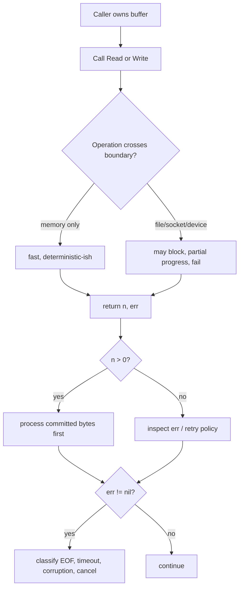
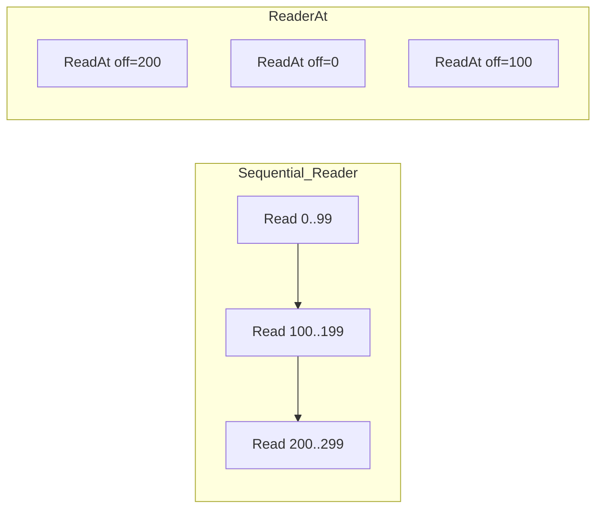
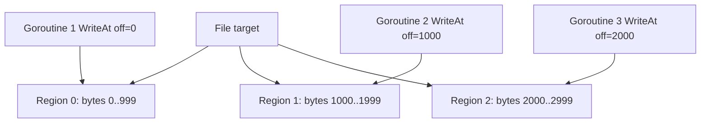
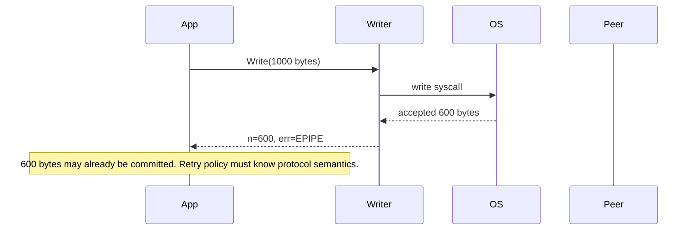
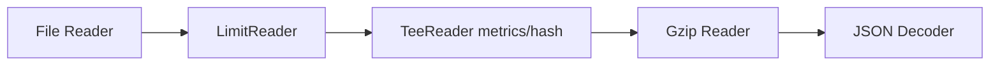
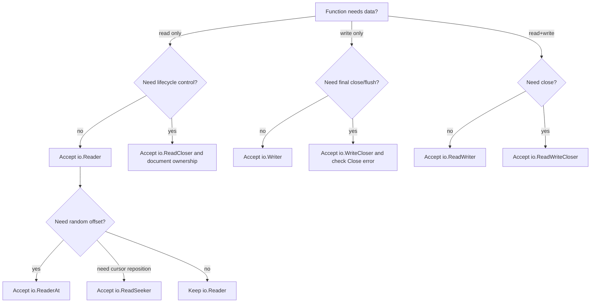

# learn-go-io-buffer-byte-stream-file-network-data-transfer-part-002.md

# Part 002 — Core IO Contracts: `Reader`, `Writer`, `Closer`, `Seeker`, `ReaderAt`, `WriterAt`

> Series: **Go IO, Buffer, Byte & Stream, Serialization, Console IO, File & FileSystem, Compression, Networking, Data Transfer**  
> Target: **Go 1.26.x**  
> Audience: **Java software engineer menuju production-grade Go engineer**  
> Status: **Part 002 dari 034**

---

## 0. Tujuan Part Ini

Pada part sebelumnya, kita membangun mental model bahwa IO adalah **pergerakan data melewati boundary**: memory, file descriptor, socket, terminal, HTTP body, archive, compressor, parser, dan storage.

Part ini masuk ke kontrak paling fundamental Go IO:

- `io.Reader`
- `io.Writer`
- `io.Closer`
- `io.Seeker`
- `io.ReaderAt`
- `io.WriterAt`
- kombinasi interface seperti `ReadCloser`, `ReadWriter`, `ReadWriteCloser`, `ReadSeeker`, `ReadSeekCloser`, `ReadWriterAt`, dan lain-lain

Fokus utama bukan “apa method signature-nya”, karena itu sangat pendek. Fokus utamanya adalah:

1. Apa **semantic contract** yang harus dipenuhi implementasi.
2. Apa **hak dan kewajiban caller**.
3. Bagaimana membaca `n`, `err`, `EOF`, `short read`, `short write` dengan benar.
4. Kapan stream bersifat sequential, random-access, reusable, closeable, atau offset-addressable.
5. Bagaimana interface kecil Go berbeda dari Java `InputStream`, `OutputStream`, `Reader`, `Writer`, `Channel`, dan `ByteBuffer`.
6. Apa failure mode yang sering membuat sistem IO production rusak.

Setelah part ini, kamu harus bisa membaca signature kecil seperti ini:

```go
Read(p []byte) (n int, err error)
```

lalu langsung memahami konsekuensi production-nya:

- data bisa sebagian berhasil walaupun error terjadi,
- `n > 0` harus diproses sebelum error,
- `EOF` bukan selalu error fatal,
- zero-length read punya aturan khusus,
- caller memiliki buffer `p`, bukan callee,
- callee hanya boleh menulis ke `p[:n]`,
- return value menentukan progress, retry, loop, dan corruption boundary.

---

## 1. Sumber Resmi yang Relevan

Materi ini disusun berdasarkan dokumentasi resmi dan perilaku standar Go sampai Go 1.26.x:

- `io` package documentation: https://pkg.go.dev/io
- Go source for `io`: https://go.dev/src/io/io.go
- `bufio` package documentation: https://pkg.go.dev/bufio
- `os` package documentation: https://pkg.go.dev/os
- `net` package documentation: https://pkg.go.dev/net
- Go 1.26 release notes: https://go.dev/doc/go1.26
- Go release history: https://go.dev/doc/devel/release

Catatan penting Go 1.26.x:

- Go 1.26 mempertahankan Go 1 compatibility promise.
- `io.ReadAll` di Go 1.26 mendapat improvement alokasi/performa untuk input besar, tetapi kontrak dasar `Reader` tetap sama.
- Beberapa patch 1.26.x menyentuh paket IO/network/security-adjacent seperti `net`, `net/http`, `mime`, `net/textproto`, `os`, dan `syscall`; karena itu seri ini memakai target 1.26.x, bukan hanya konsep generik lama.

---

## 2. Konsep Besar: Go IO adalah Kontrak Minimal, Bukan Class Hierarchy

Di Java, kamu sering melihat hirarki:

```text
InputStream
  ├── FileInputStream
  ├── ByteArrayInputStream
  ├── BufferedInputStream
  ├── ObjectInputStream
  └── ...

OutputStream
  ├── FileOutputStream
  ├── ByteArrayOutputStream
  ├── BufferedOutputStream
  ├── ObjectOutputStream
  └── ...
```

Ada juga NIO:

```text
Channel
  ├── FileChannel
  ├── SocketChannel
  └── DatagramChannel

ByteBuffer
  ├── heap buffer
  └── direct buffer
```

Di Go, pendekatannya lebih kecil dan compositional:

```go
type Reader interface {
    Read(p []byte) (n int, err error)
}

type Writer interface {
    Write(p []byte) (n int, err error)
}

type Closer interface {
    Close() error
}

type Seeker interface {
    Seek(offset int64, whence int) (int64, error)
}

type ReaderAt interface {
    ReadAt(p []byte, off int64) (n int, err error)
}

type WriterAt interface {
    WriteAt(p []byte, off int64) (n int, err error)
}
```

Go tidak memaksa semua object IO masuk ke satu inheritance tree. Satu tipe cukup punya method yang cocok, maka secara implisit ia memenuhi interface.

Contoh:

```go
var _ io.Reader = (*bytes.Buffer)(nil)
var _ io.Writer = (*bytes.Buffer)(nil)
var _ io.Reader = (*os.File)(nil)
var _ io.Writer = (*os.File)(nil)
var _ io.Closer = (*os.File)(nil)
var _ io.Seeker = (*os.File)(nil)
var _ io.ReaderAt = (*os.File)(nil)
var _ io.WriterAt = (*os.File)(nil)
```

Yang penting bukan “class apa ini?”, tetapi:

> Object ini mendukung kontrak apa?

---

## 3. Diagram Mental Model Kontrak IO



Prinsip terpenting:

> Dalam Go IO, `n` adalah fakta progress. `err` adalah status setelah progress itu.

Banyak bug terjadi karena developer mengecek `err` dulu lalu membuang `n`.

---

## 4. `io.Reader`: Kontrak Sequential Read

### 4.1 Signature

```go
type Reader interface {
    Read(p []byte) (n int, err error)
}
```

`Read` membaca sampai `len(p)` byte ke dalam `p` dan mengembalikan jumlah byte yang benar-benar dibaca.

Namun, kontraknya bukan “selalu penuh”. Kontraknya adalah:

- `0 <= n <= len(p)`
- jika `n > 0`, bytes valid ada di `p[:n]`
- `p[n:]` tidak boleh dianggap valid
- `Read` boleh mengembalikan `n < len(p)` tanpa error
- `Read` boleh mengembalikan `n > 0` bersama `err != nil`
- caller harus memproses `n > 0` sebelum menangani `err`
- ketika stream habis, convention-nya return `0, io.EOF`

### 4.2 Analogi untuk Java Engineer

Java `InputStream.read(byte[])` mengembalikan jumlah byte atau `-1` untuk EOF, sedangkan Go memisahkan jumlah byte dan error:

```text
Java:
  int n = in.read(buf)
  if n == -1 => EOF

Go:
  n, err := r.Read(buf)
  if n > 0 => process buf[:n]
  if err == io.EOF => EOF
```

Go lebih eksplisit untuk kasus penting:

```text
Some bytes were read, and then the stream reached EOF.
```

Dalam Go, itu bisa diekspresikan sebagai:

```go
n, err := r.Read(p) // n > 0, err == io.EOF possible
```

Walaupun banyak implementasi memilih mengembalikan `n > 0, nil` dulu, lalu `0, io.EOF` pada panggilan berikutnya, caller production tetap harus siap terhadap `n > 0 && err != nil`.

---

## 5. Cara Membaca dari `io.Reader` dengan Benar

### 5.1 Loop Basic yang Benar

```go
func Drain(r io.Reader, handle func([]byte) error) error {
    buf := make([]byte, 32*1024)

    for {
        n, err := r.Read(buf)
        if n > 0 {
            if handle(buf[:n]) != nil {
                return err
            }
        }

        if err != nil {
            if errors.Is(err, io.EOF) {
                return nil
            }
            return err
        }
    }
}
```

Bug pada contoh di atas: `handle(buf[:n]) != nil` dipanggil dua kali secara logika salah karena error-nya tidak ditampung. Yang benar:

```go
func Drain(r io.Reader, handle func([]byte) error) error {
    buf := make([]byte, 32*1024)

    for {
        n, err := r.Read(buf)
        if n > 0 {
            if hErr := handle(buf[:n]); hErr != nil {
                return hErr
            }
        }

        if err != nil {
            if errors.Is(err, io.EOF) {
                return nil
            }
            return err
        }
    }
}
```

### 5.2 Anti-Pattern: Mengecek Error Dulu

```go
// Salah untuk general Reader.
for {
    n, err := r.Read(buf)
    if err != nil {
        return err
    }
    process(buf[:n])
}
```

Masalah:

- Jika `n > 0 && err == io.EOF`, data terakhir hilang.
- Jika `n > 0 && err` adalah network error, partial data valid dibuang.
- Untuk parser framed protocol, ini bisa menyebabkan corruption karena frame terakhir tidak diproses.

Yang benar:

```go
for {
    n, err := r.Read(buf)
    if n > 0 {
        process(buf[:n])
    }
    if err != nil {
        if errors.Is(err, io.EOF) {
            break
        }
        return err
    }
}
```

### 5.3 Anti-Pattern: Menganggap Short Read sebagai EOF

```go
n, err := r.Read(buf)
if n < len(buf) {
    // Salah: belum tentu EOF.
    return io.ErrUnexpectedEOF
}
```

Short read bisa terjadi karena:

- network packet availability,
- pipe writer belum menulis lagi,
- buffered reader punya data parsial,
- OS read kembali lebih cepat,
- decompressor menghasilkan chunk parsial,
- rate limit atau deadline.

Jika kamu butuh persis `len(buf)` byte, gunakan `io.ReadFull`.

```go
buf := make([]byte, 8)
if _, err := io.ReadFull(r, buf); err != nil {
    return fmt.Errorf("read frame header: %w", err)
}
```

---

## 6. EOF: Bukan Error Fatal, tetapi State Transition

`io.EOF` berarti tidak ada input lagi dari stream.

Mental model yang lebih tepat:

```text
EOF is not "the operation failed".
EOF is "the source has reached terminal state".
```

Namun EOF bisa berarti hal yang berbeda tergantung konteks.

| Konteks | EOF berarti | Biasanya normal? |
|---|---|---:|
| baca file sampai habis | file selesai | ya |
| baca HTTP response body | body selesai | ya |
| baca line protocol sebelum delimiter wajib | input terpotong | tidak |
| baca length-prefixed frame header | peer closed sebelum header lengkap | tidak |
| baca archive | archive selesai | ya, jika struktur lengkap |
| baca JSON stream | bisa normal jika semua token selesai | tergantung parser |
| baca TCP socket | peer half/full close | tergantung protocol |

Karena itu, EOF tidak boleh ditangani secara buta. EOF harus diinterpretasi oleh **protocol state**.

### 6.1 EOF pada Raw Stream

```go
for {
    n, err := r.Read(buf)
    if n > 0 {
        consume(buf[:n])
    }
    if errors.Is(err, io.EOF) {
        return nil
    }
    if err != nil {
        return err
    }
}
```

### 6.2 EOF pada Fixed-Length Read

```go
func ReadHeader(r io.Reader) ([16]byte, error) {
    var header [16]byte
    if _, err := io.ReadFull(r, header[:]); err != nil {
        return header, fmt.Errorf("incomplete header: %w", err)
    }
    return header, nil
}
```

Jika hanya 10 dari 16 byte tersedia lalu EOF, `io.ReadFull` mengembalikan `io.ErrUnexpectedEOF`, bukan `io.EOF` biasa. Itu semantic yang lebih cocok: stream selesai terlalu cepat untuk kontrak protocol.

---

## 7. Zero-Length Read: Edge Case yang Harus Dipahami

Panggilan:

```go
n, err := r.Read(nil)
```

atau:

```go
buf := make([]byte, 0)
n, err := r.Read(buf)
```

Secara umum, jika `len(p) == 0`, `Read` harus mengembalikan `0`. Error-nya bisa bervariasi tergantung implementasi dan state, tetapi caller tidak boleh memakai zero-length read sebagai cara portable untuk mendeteksi EOF.

Anti-pattern:

```go
_, err := r.Read(nil)
if err == io.EOF {
    // Salah sebagai readiness/EOF check umum.
}
```

Gunakan read nyata, parser state, atau API spesifik jika ingin readiness/deadline.

---

## 8. `io.Writer`: Kontrak Sequential Write

### 8.1 Signature

```go
type Writer interface {
    Write(p []byte) (n int, err error)
}
```

Kontrak utama:

- `0 <= n <= len(p)`
- `Write` harus mengembalikan non-nil error jika `n < len(p)`
- caller tidak boleh menganggap seluruh `p` tertulis kecuali `n == len(p) && err == nil`
- `Write` tidak boleh memodifikasi `p`, bahkan sementara
- `p` hanya valid selama call berlangsung; writer tidak boleh menyimpan reference ke `p` kecuali mendokumentasikan ownership/copy contract khusus

### 8.2 Java Comparison

Di Java `OutputStream.write(byte[])` biasanya melempar exception jika gagal, dan contract-nya tidak mengembalikan jumlah byte tertulis. Di Go, partial write adalah bagian eksplisit dari API.

```text
Java:
  out.write(buf) // success or exception

Go:
  n, err := w.Write(buf) // progress and error are separate
```

Ini cocok untuk sistem yang harus tahu:

- berapa byte sudah committed,
- apakah retry aman,
- apakah stream/protocol sudah corrupt,
- apakah perlu resume dari offset tertentu.

---

## 9. Cara Menulis ke `io.Writer` dengan Benar

### 9.1 Single Write Tidak Selalu Cukup

```go
n, err := w.Write(data)
if err != nil {
    return err
}
if n != len(data) {
    return io.ErrShortWrite
}
```

Namun pola ini hanya cocok bila kamu ingin satu write attempt dan gagal jika partial.

Untuk memastikan semua data tertulis, buat helper `WriteFull`:

```go
func WriteFull(w io.Writer, p []byte) error {
    for len(p) > 0 {
        n, err := w.Write(p)
        if n > 0 {
            p = p[n:]
        }
        if err != nil {
            return err
        }
        if n == 0 {
            return io.ErrShortWrite
        }
    }
    return nil
}
```

Kenapa perlu `n == 0` guard?

Karena jika writer mengembalikan `0, nil`, loop tidak maju dan bisa infinite loop. Implementasi writer yang baik tidak melakukan ini untuk `len(p) > 0`, tetapi caller defensif tetap sebaiknya menjaga progress invariant.

### 9.2 Anti-Pattern: Mengabaikan `n`

```go
_, err := w.Write(data)
return err
```

Ini sering terlihat, tetapi secara general tidak aman jika writer custom/network/limited/transform bisa short write.

Lebih baik:

```go
n, err := w.Write(data)
if err != nil {
    return err
}
if n != len(data) {
    return io.ErrShortWrite
}
return nil
```

Atau gunakan helper yang memastikan semua data tertulis.

### 9.3 `io.Copy` sebagai Primitive Write Loop

Untuk transfer stream, Go menyediakan:

```go
written, err := io.Copy(dst, src)
```

`io.Copy` menangani loop read/write, tetapi kontrak error tetap penting. Jika error terjadi setelah sebagian data terkirim, `written` memberi tahu progress.

```go
n, err := io.Copy(file, response.Body)
if err != nil {
    return fmt.Errorf("download failed after %d bytes: %w", n, err)
}
```

---

## 10. `io.Closer`: Kontrak Resource Finalization

### 10.1 Signature

```go
type Closer interface {
    Close() error
}
```

`Close` terlihat sederhana, tetapi semantic-nya sangat penting.

Resource yang perlu `Close`:

- file descriptor,
- socket,
- HTTP response body,
- pipe endpoint,
- archive reader/writer tertentu,
- compressor writer,
- database rows/result set,
- object yang melakukan flush final saat close.

### 10.2 `Close` Bukan Hanya “Free Memory”

Di Go, memory dikelola GC, tetapi OS resource tidak boleh menunggu GC.

`Close` bisa berarti:

- release file descriptor,
- send FIN pada TCP,
- flush buffer akhir,
- write checksum/footer pada gzip/tar/zip,
- unblock goroutine lain,
- commit atau abort stream,
- detach handle dari kernel object.

### 10.3 `defer Close` Basic

```go
f, err := os.Open("input.dat")
if err != nil {
    return err
}
defer f.Close()
```

Ini cukup untuk read-only file sederhana.

Namun untuk writer, terutama file/compressor, error dari `Close` bisa penting.

### 10.4 Writer Close Error Harus Dicek

```go
func WriteGzipFile(path string, data []byte) (err error) {
    f, err := os.Create(path)
    if err != nil {
        return err
    }
    defer func() {
        if closeErr := f.Close(); err == nil && closeErr != nil {
            err = closeErr
        }
    }()

    gz := gzip.NewWriter(f)
    defer func() {
        if closeErr := gz.Close(); err == nil && closeErr != nil {
            err = closeErr
        }
    }()

    if _, err = gz.Write(data); err != nil {
        return err
    }
    return nil
}
```

Kenapa `gzip.Writer.Close` penting?

Karena writer kompresi sering menulis footer/checksum/final block pada close. Kalau close gagal dan kamu abaikan, file bisa corrupt tetapi fungsi mengembalikan success.

### 10.5 Close Ownership

Pertanyaan desain:

> Jika function menerima `io.Reader`, apakah function boleh menutupnya?

Jawaban default:

- Jika parameter bertipe `io.Reader`, function **tidak memiliki hak Close**.
- Jika parameter bertipe `io.ReadCloser`, function mungkin bertanggung jawab menutup, tetapi harus didokumentasikan.

Contoh:

```go
func Parse(r io.Reader) error {
    // Jangan Close. Tidak punya hak ownership.
    return parseStream(r)
}

func Consume(rc io.ReadCloser) error {
    defer rc.Close()
    return parseStream(rc)
}
```

Prinsip:

```text
Interface type communicates ownership.
Reader means data access only.
ReadCloser means data access + lifecycle control may be involved.
```

---

## 11. `io.Seeker`: Kontrak Offset Mutable

### 11.1 Signature

```go
type Seeker interface {
    Seek(offset int64, whence int) (int64, error)
}
```

`Seek` memindahkan posisi read/write berikutnya.

`whence`:

- `io.SeekStart` — offset dari awal
- `io.SeekCurrent` — offset dari posisi saat ini
- `io.SeekEnd` — offset dari akhir

Contoh:

```go
pos, err := f.Seek(0, io.SeekStart)
if err != nil {
    return err
}
fmt.Println("position:", pos)
```

### 11.2 Sequential vs Seekable

Tidak semua `Reader` seekable.

| Source | `Reader` | `Seeker` | Catatan |
|---|---:|---:|---|
| `*os.File` regular file | ya | ya | random access file |
| `*bytes.Reader` | ya | ya | memory-backed immutable-ish reader |
| `*strings.Reader` | ya | ya | string-backed reader |
| `net.Conn` | ya | tidak | stream socket tidak bisa mundur |
| `http.Response.Body` | ya | tidak | body stream satu arah |
| `gzip.Reader` | ya | tidak | decompressed stream sequential |
| `bufio.Reader` | ya | tidak | buffer wrapper sequential |

### 11.3 Seek Mengubah Cursor Global Object

`Seek` mengubah posisi internal object. Ini berarti pada object yang dipakai bersama, `Seek` + `Read` bukan operasi atomic.

Bug:

```go
// Dua goroutine berbagi *os.File yang sama dan memakai Seek+Read.
f.Seek(offsetA, io.SeekStart)
f.Read(bufA)

f.Seek(offsetB, io.SeekStart)
f.Read(bufB)
```

Jika interleaving terjadi, goroutine A bisa membaca offset B.

Untuk random access concurrent, gunakan `ReaderAt`, bukan `Seek` + `Read`.

---

## 12. `io.ReaderAt`: Kontrak Random-Access Read Tanpa Cursor

### 12.1 Signature

```go
type ReaderAt interface {
    ReadAt(p []byte, off int64) (n int, err error)
}
```

`ReadAt` membaca dari offset tertentu tanpa mengubah cursor object.

Kontrak penting:

- `ReadAt` harus membaca tepat `len(p)` byte jika memungkinkan.
- Jika `n < len(p)`, harus mengembalikan non-nil error.
- Pada akhir input, error biasanya `io.EOF` jika tidak cukup data.
- Karena tidak memakai shared cursor, `ReaderAt` cocok untuk parallel random reads.

### 12.2 Kenapa `ReaderAt` Berbeda dari `Reader`

`Reader` sequential:

```text
Read -> advances internal cursor
```

`ReaderAt` offset-addressed:

```text
ReadAt(p, off) -> reads from explicit offset, does not advance cursor
```

Diagram:



### 12.3 Concurrent Random Read Example

```go
func ReadChunksAt(r io.ReaderAt, size int64, chunkSize int) ([][]byte, error) {
    if chunkSize <= 0 {
        return nil, fmt.Errorf("invalid chunk size")
    }

    chunks := int((size + int64(chunkSize) - 1) / int64(chunkSize))
    out := make([][]byte, chunks)
    errCh := make(chan error, chunks)

    for i := 0; i < chunks; i++ {
        i := i
        go func() {
            off := int64(i * chunkSize)
            n := chunkSize
            if remaining := size - off; remaining < int64(n) {
                n = int(remaining)
            }

            buf := make([]byte, n)
            read, err := r.ReadAt(buf, off)
            if err != nil && !(errors.Is(err, io.EOF) && read == n) {
                errCh <- fmt.Errorf("chunk %d: read at %d: %w", i, off, err)
                return
            }
            out[i] = buf[:read]
            errCh <- nil
        }()
    }

    for i := 0; i < chunks; i++ {
        if err := <-errCh; err != nil {
            return nil, err
        }
    }
    return out, nil
}
```

Catatan: contoh ini untuk memahami semantic. Dalam produksi, gunakan worker pool/bounded concurrency, context cancellation, dan error coordination.

### 12.4 `io.NewSectionReader`

`io.NewSectionReader` membuat `SectionReader` dari `ReaderAt`, offset, dan panjang tertentu.

```go
sr := io.NewSectionReader(file, offset, length)
```

`SectionReader` berguna untuk:

- membaca subrange file,
- parsing container format,
- membatasi akses reader ke region tertentu,
- membuat reader yang juga seekable atas section tertentu.

---

## 13. `io.WriterAt`: Kontrak Random-Access Write Tanpa Cursor

### 13.1 Signature

```go
type WriterAt interface {
    WriteAt(p []byte, off int64) (n int, err error)
}
```

`WriteAt` menulis ke offset tertentu tanpa mengubah cursor global.

Kontrak penting:

- Jika `n < len(p)`, harus mengembalikan non-nil error.
- Cocok untuk parallel writes ke region berbeda.
- Caller harus menjamin region tidak overlap kecuali ada semantic yang jelas.
- Untuk file sparse, write at offset jauh bisa membuat hole tergantung filesystem/OS.

### 13.2 Parallel Write Region



Ini bisa aman jika:

- region tidak overlap,
- file preallocation/size handling jelas,
- error dikumpulkan,
- fsync/commit dilakukan setelah semua write sukses,
- metadata/checksum ditulis dalam fase terkontrol.

### 13.3 Anti-Pattern: Concurrent Overlapping `WriteAt`

```go
// Berbahaya jika tidak ada protocol khusus.
go f.WriteAt([]byte("AAAA"), 100)
go f.WriteAt([]byte("BBBB"), 102)
```

Result bisa tidak deterministik:

```text
AAAABB?  ABBA?  AABBBB?  tergantung interleaving dan OS behavior
```

Production rule:

> `WriterAt` gives you offset control, not conflict resolution.

---

## 14. Kombinasi Interface: Baca Capability, Jangan Over-Specify

Go `io` punya banyak composite interface.

| Interface | Komposisi | Makna |
|---|---|---|
| `io.ReadCloser` | `Reader + Closer` | stream bisa dibaca dan ditutup |
| `io.WriteCloser` | `Writer + Closer` | stream bisa ditulis dan ditutup/flush final |
| `io.ReadWriter` | `Reader + Writer` | full-duplex atau memory buffer |
| `io.ReadWriteCloser` | `Reader + Writer + Closer` | koneksi/socket umum |
| `io.ReadSeeker` | `Reader + Seeker` | sequential read plus reposition |
| `io.WriteSeeker` | `Writer + Seeker` | sequential write plus reposition |
| `io.ReadWriteSeeker` | `Reader + Writer + Seeker` | file-like mutable cursor |
| `io.ReaderAt` | offset read | random access read |
| `io.WriterAt` | offset write | random access write |

Prinsip desain API:

> Terima interface sekecil mungkin yang benar-benar dibutuhkan.

Buruk:

```go
func HashFile(f *os.File) ([32]byte, error) {
    // Padahal hanya perlu Read.
}
```

Lebih baik:

```go
func Hash(r io.Reader) ([32]byte, error) {
    h := sha256.New()
    if _, err := io.Copy(h, r); err != nil {
        return [32]byte{}, err
    }
    var sum [32]byte
    copy(sum[:], h.Sum(nil))
    return sum, nil
}
```

Buruk:

```go
func ParseConfig(rc io.ReadCloser) (*Config, error) {
    defer rc.Close()
    // Padahal parser tidak seharusnya punya ownership close.
}
```

Lebih baik:

```go
func ParseConfig(r io.Reader) (*Config, error) {
    // Caller tetap mengelola lifecycle.
}
```

Kecuali memang fungsi bernama `ConsumeAndClose` atau dokumentasi jelas menyatakan ownership.

---

## 15. Contract Matrix: Interface vs Property

| Property | `Reader` | `Writer` | `Closer` | `Seeker` | `ReaderAt` | `WriterAt` |
|---|---:|---:|---:|---:|---:|---:|
| Sequential | ya | ya | n/a | cursor-based | tidak wajib | tidak wajib |
| Random access | tidak | tidak | n/a | ya via cursor | ya | ya |
| Mutates cursor | ya | ya | n/a | ya | tidak | tidak |
| Caller owns buffer | ya | ya | n/a | n/a | ya | ya |
| Partial progress possible | ya | ya | n/a | n/a | ya | ya |
| EOF relevant | ya | tidak langsung | n/a | n/a | ya | tidak langsung |
| Lifecycle control | tidak | tidak | ya | tidak | tidak | tidak |
| Concurrency friendly by default | tergantung impl | tergantung impl | tergantung impl | hati-hati | lebih cocok | lebih cocok |

---

## 16. Buffer Ownership dan Lifetime

### 16.1 Reader: Caller Memberi Buffer

```go
buf := make([]byte, 4096)
n, err := r.Read(buf)
```

Caller menyediakan memory. Reader menulis hasil ke dalam buffer itu.

Reader tidak boleh menyimpan `buf` untuk digunakan setelah `Read` return, kecuali kontraknya eksplisit dan tidak mengikuti `io.Reader` normal.

### 16.2 Writer: Caller Memberi Data

```go
_, err := w.Write(data)
```

Writer membaca dari `data` selama call. Writer tidak boleh menyimpan `data` untuk async write setelah return tanpa copy/kontrak eksplisit.

Kenapa penting?

```go
data := []byte("hello")
w.Write(data)
data[0] = 'H'
```

Jika writer menyimpan reference dan menulis nanti, output bisa berubah. Itu melanggar ekspektasi umum `io.Writer`.

### 16.3 Slice Reuse Bug

```go
buf := make([]byte, 4096)
var chunks [][]byte

for {
    n, err := r.Read(buf)
    if n > 0 {
        chunks = append(chunks, buf[:n]) // BUG: semua menunjuk backing array sama
    }
    if err != nil {
        break
    }
}
```

Yang benar jika perlu menyimpan:

```go
chunk := append([]byte(nil), buf[:n]...)
chunks = append(chunks, chunk)
```

Atau proses streaming tanpa menyimpan.

---

## 17. Partial Progress: Invariant Terpenting IO Production

Production IO harus selalu menjawab:

1. Berapa byte sudah dikonsumsi?
2. Berapa byte sudah ditulis?
3. Apakah operasi bisa diulang?
4. Jika diulang, apakah akan duplikasi?
5. Jika gagal di tengah, boundary recovery-nya apa?

### 17.1 Read Partial Progress

```text
Read returns n=512, err=connection reset
```

Makna:

- 512 byte valid sudah diterima.
- Stream setelah itu error.
- Untuk raw byte copy, 512 byte bisa ditulis dulu lalu error dilaporkan.
- Untuk framed protocol, 512 byte mungkin membuat state parser incomplete/corrupt.

### 17.2 Write Partial Progress

```text
Write returns n=512, err=broken pipe
```

Makna:

- 512 byte mungkin sudah diterima kernel/peer boundary.
- Sisa belum tertulis.
- Retry seluruh buffer bisa menggandakan 512 byte pertama jika protocol tidak idempotent.
- Retry dari `p[n:]` mungkin benar untuk same stream jika masih usable, tetapi broken pipe biasanya stream tidak usable.

### 17.3 Commit Boundary



---

## 18. Error Classification untuk IO Contracts

Tidak semua error sama.

| Error Type | Contoh | Implikasi |
|---|---|---|
| terminal normal | `io.EOF` | selesai, bukan fatal |
| incomplete data | `io.ErrUnexpectedEOF` | protocol/input terpotong |
| short write | `io.ErrShortWrite` | writer gagal memenuhi kontrak full write |
| closed resource | `os.ErrClosed`, net closed err | lifecycle bug atau shutdown |
| timeout | `net.Error` timeout, context deadline | retry mungkin bisa, tergantung state |
| permission | `EACCES`, `EPERM` | config/security issue |
| not found | `ENOENT` | input/config/path issue |
| broken pipe/reset | `EPIPE`, `ECONNRESET` | peer/lifecycle/network failure |
| invalid argument | `EINVAL` | programming/config bug |
| disk full | `ENOSPC` | capacity incident; partial write risk |

Dalam Go modern, gunakan `errors.Is` dan `errors.As` saat error dibungkus.

```go
if errors.Is(err, io.EOF) {
    return nil
}

var pathErr *os.PathError
if errors.As(err, &pathErr) {
    return fmt.Errorf("path operation %s on %s failed: %w", pathErr.Op, pathErr.Path, err)
}
```

---

## 19. Designing Your Own `Reader`

### 19.1 Reader dari Slice

Contoh custom reader sederhana:

```go
type SliceReader struct {
    data []byte
    off  int
}

func NewSliceReader(data []byte) *SliceReader {
    return &SliceReader{data: data}
}

func (r *SliceReader) Read(p []byte) (int, error) {
    if len(p) == 0 {
        return 0, nil
    }
    if r.off >= len(r.data) {
        return 0, io.EOF
    }

    n := copy(p, r.data[r.off:])
    r.off += n

    if r.off >= len(r.data) {
        return n, nil // allowed; EOF may come next call
    }
    return n, nil
}
```

Ini valid. EOF boleh muncul pada call berikutnya.

Alternatif juga valid:

```go
if r.off >= len(r.data) {
    return 0, io.EOF
}
n := copy(p, r.data[r.off:])
r.off += n
if r.off >= len(r.data) {
    return n, io.EOF // caller must process n first
}
return n, nil
```

Keduanya bisa valid, tetapi behavior pertama lebih umum untuk menghindari caller buruk yang salah memproses `n > 0 && EOF`. Namun caller production tetap harus benar.

### 19.2 Reader yang Salah: `0, nil` Tanpa Progress

```go
func (r *BadReader) Read(p []byte) (int, error) {
    return 0, nil
}
```

Ini membuat caller loop selamanya.

Jika belum ada data tapi mungkin nanti ada data, behavior tergantung tipe:

- blocking reader: tunggu sampai data/error,
- non-blocking abstraction: biasanya bukan pure `io.Reader`, butuh API readiness/deadline,
- context-aware reader: `Read` sendiri tidak punya context, sehingga cancellation harus disediakan via wrapper/resource-specific mechanism.

---

## 20. Designing Your Own `Writer`

### 20.1 Writer ke Slice Buffer

```go
type CountingWriter struct {
    N int64
}

func (w *CountingWriter) Write(p []byte) (int, error) {
    w.N += int64(len(p))
    return len(p), nil
}
```

Ini writer valid karena menerima semua bytes.

### 20.2 Limited Writer

```go
type LimitedWriter struct {
    W io.Writer
    N int64
}

func (lw *LimitedWriter) Write(p []byte) (int, error) {
    if lw.N <= 0 {
        return 0, io.ErrShortWrite
    }
    if int64(len(p)) > lw.N {
        p = p[:lw.N]
    }

    n, err := lw.W.Write(p)
    lw.N -= int64(n)

    if err != nil {
        return n, err
    }
    if n < len(p) {
        return n, io.ErrShortWrite
    }
    return n, nil
}
```

Catatan: contoh ini menunjukkan kontrak partial write. Untuk produksi, hati-hati dengan konversi `int64` ke index slice; pastikan aman untuk arsitektur dan batas ukuran.

### 20.3 Writer yang Salah: Short Write Tanpa Error

```go
func (w *BadWriter) Write(p []byte) (int, error) {
    return len(p) / 2, nil // melanggar kontrak
}
```

Jika `n < len(p)`, writer harus return non-nil error. Kalau tidak, caller bisa mengira data lengkap tertulis.

---

## 21. `ReaderFrom` dan `WriterTo`: Optimized Copy Path

Walaupun part ini fokus interface inti, kamu perlu tahu dua interface tambahan karena `io.Copy` memakainya untuk optimasi.

```go
type WriterTo interface {
    WriteTo(w Writer) (n int64, err error)
}

type ReaderFrom interface {
    ReadFrom(r Reader) (n int64, err error)
}
```

`io.Copy(dst, src)` secara konseptual melakukan:

1. Jika `src` punya `WriteTo`, pakai `src.WriteTo(dst)`.
2. Jika `dst` punya `ReadFrom`, pakai `dst.ReadFrom(src)`.
3. Jika tidak, pakai buffer loop biasa.

Kenapa penting?

- `*os.File`, `*bytes.Buffer`, network/file types tertentu bisa punya path lebih efisien.
- Copy mungkin tidak memakai buffer yang kamu ekspektasikan jika optimized path tersedia.
- Wrapper bisa menghilangkan optimized path jika tidak meneruskan interface tambahan.

Contoh wrapper yang hanya expose `Read`:

```go
type MeteredReader struct {
    R io.Reader
    N int64
}

func (m *MeteredReader) Read(p []byte) (int, error) {
    n, err := m.R.Read(p)
    m.N += int64(n)
    return n, err
}
```

Wrapper ini menyembunyikan `WriterTo` dari underlying reader. Untuk banyak kasus tidak masalah, tetapi pada path performa tinggi bisa signifikan.

Production lesson:

> Small interfaces compose well, but wrappers can accidentally remove capabilities.

---

## 22. Capability Detection dengan Type Assertion

Kadang fungsi menerima `io.Reader`, tetapi bisa memanfaatkan capability tambahan jika tersedia.

```go
func SizeAwareRead(r io.Reader) error {
    if s, ok := r.(io.Seeker); ok {
        pos, err := s.Seek(0, io.SeekCurrent)
        if err == nil {
            end, err := s.Seek(0, io.SeekEnd)
            if err == nil {
                _, _ = s.Seek(pos, io.SeekStart)
                fmt.Println("remaining-ish:", end-pos)
            }
        }
    }

    _, err := io.Copy(io.Discard, r)
    return err
}
```

Hati-hati:

- `Seek` mengubah cursor, sehingga harus restore.
- Jika object shared, ini bisa mengganggu caller lain.
- Jangan melakukan type assertion untuk capability yang tidak benar-benar dibutuhkan.

Lebih baik bila API memang butuh seek:

```go
func ParseIndex(r io.ReadSeeker) error {
    // jelas butuh Read dan Seek
    return nil
}
```

---

## 23. Interface Choice: API Design Decision Table

| Function Need | Parameter yang Tepat | Jangan Pakai |
|---|---|---|
| baca sequential | `io.Reader` | `*os.File`, `io.ReadCloser` |
| baca lalu function bertanggung jawab close | `io.ReadCloser` | `io.Reader` tanpa doc ownership |
| tulis sequential | `io.Writer` | `*bytes.Buffer`, `*os.File` jika tidak perlu |
| tulis dan finalisasi/flush | `io.WriteCloser` | `io.Writer` jika close wajib |
| baca dan tulis duplex | `io.ReadWriter` / `io.ReadWriteCloser` | dua parameter jika lifecycle sama |
| butuh reposition | `io.ReadSeeker` | `io.Reader` + type assertion tersembunyi |
| parallel random read | `io.ReaderAt` | `Seek` + `Read` shared |
| parallel region write | `io.WriterAt` | `Seek` + `Write` shared |
| ukuran/metadata file | mungkin `interface { Stat() (fs.FileInfo, error) }` atau `*os.File` | memaksakan `io.Reader` |

---

## 24. Pattern: Function Tidak Menutup Reader yang Tidak Ia Buka

Rule praktis:

```text
Who opens, closes.
Who creates, owns lifecycle.
Who accepts only Reader, does not close.
```

Contoh benar:

```go
func LoadConfigFile(path string) (*Config, error) {
    f, err := os.Open(path)
    if err != nil {
        return nil, err
    }
    defer f.Close()

    return ParseConfig(f)
}

func ParseConfig(r io.Reader) (*Config, error) {
    // no close here
    var cfg Config
    if err := json.NewDecoder(r).Decode(&cfg); err != nil {
        return nil, err
    }
    return &cfg, nil
}
```

Ini membuat parser bisa dipakai untuk:

- file,
- HTTP body,
- string,
- bytes buffer,
- embedded FS,
- test fake reader.

---

## 25. Pattern: Decorator IO

Karena interface kecil, Go IO mudah didekorasi.



Contoh hash sambil copy:

```go
func CopyWithSHA256(dst io.Writer, src io.Reader) ([32]byte, int64, error) {
    h := sha256.New()
    tee := io.TeeReader(src, h)

    n, err := io.Copy(dst, tee)
    if err != nil {
        return [32]byte{}, n, err
    }

    var sum [32]byte
    copy(sum[:], h.Sum(nil))
    return sum, n, nil
}
```

Catatan semantic:

- `TeeReader` menulis ke hash saat data dibaca.
- Jika downstream berhenti sebelum EOF, hash hanya untuk prefix yang terbaca.
- Jangan klaim hash seluruh input jika copy gagal di tengah.

---

## 26. Pattern: Limit Input untuk Safety

Banyak vulnerability IO berasal dari unbounded read.

Buruk:

```go
body, err := io.ReadAll(r)
```

Lebih aman jika input dari user/network:

```go
const maxConfigSize = 1 << 20 // 1 MiB
limited := io.LimitReader(r, maxConfigSize+1)
body, err := io.ReadAll(limited)
if err != nil {
    return err
}
if len(body) > maxConfigSize {
    return fmt.Errorf("input too large")
}
```

Kenapa `max+1`?

Agar bisa membedakan “tepat limit” vs “melebihi limit”.

Untuk HTTP server, ada juga `http.MaxBytesReader`, yang akan dibahas di part HTTP.

---

## 27. Pattern: Exact Frame Read

Banyak protocol memakai header fixed-size lalu body length-prefixed.

```go
func ReadFrame(r io.Reader, maxBody uint32) ([]byte, error) {
    var header [4]byte
    if _, err := io.ReadFull(r, header[:]); err != nil {
        return nil, fmt.Errorf("read frame length: %w", err)
    }

    n := binary.BigEndian.Uint32(header[:])
    if n > maxBody {
        return nil, fmt.Errorf("frame too large: %d > %d", n, maxBody)
    }

    body := make([]byte, n)
    if _, err := io.ReadFull(r, body); err != nil {
        return nil, fmt.Errorf("read frame body: %w", err)
    }
    return body, nil
}
```

Key points:

- `ReadFull` untuk exact bytes.
- max size sebelum allocation.
- endian explicit.
- error dibungkus dengan phase context.
- EOF di header/body berarti protocol incomplete, bukan normal stream selesai.

---

## 28. Pattern: Safe Copy with Context via Resource-Specific Deadline

`io.Reader` tidak punya `context.Context` di method signature. Ini deliberate: interface tetap kecil.

Untuk network connection, cancellation biasanya lewat deadline/close.

```go
func CopyWithConnDeadline(dst io.Writer, src net.Conn, timeout time.Duration) (int64, error) {
    if err := src.SetReadDeadline(time.Now().Add(timeout)); err != nil {
        return 0, err
    }
    defer src.SetReadDeadline(time.Time{})

    return io.Copy(dst, src)
}
```

Untuk generic `io.Reader`, kamu tidak bisa memaksa cancellation tanpa wrapper yang punya mekanisme sendiri. Beberapa pilihan:

- close underlying `ReadCloser`,
- set deadline jika `net.Conn`,
- gunakan context-aware API sebelum membentuk reader,
- jalankan di goroutine dan abandon result dengan hati-hati, tapi ini bisa leak jika `Read` tetap blocking.

Production warning:

> Goroutine wrapper cannot magically cancel a blocking `Read` unless the underlying resource is interrupted.

---

## 29. Testing IO Contracts

### 29.1 Reader yang Menghasilkan Chunk Kecil

Untuk memastikan kode tidak salah asumsi full read:

```go
type OneByteReader struct {
    R io.Reader
}

func (r OneByteReader) Read(p []byte) (int, error) {
    if len(p) > 1 {
        p = p[:1]
    }
    return r.R.Read(p)
}
```

Test:

```go
func TestParserHandlesShortReads(t *testing.T) {
    input := strings.NewReader("hello world")
    r := OneByteReader{R: input}

    got, err := ParseSomething(r)
    if err != nil {
        t.Fatal(err)
    }
    if got != "hello world" {
        t.Fatalf("got %q", got)
    }
}
```

### 29.2 Writer yang Menghasilkan Short Write

```go
type ShortWriter struct {
    W     io.Writer
    Limit int
}

func (w ShortWriter) Write(p []byte) (int, error) {
    if len(p) > w.Limit {
        p = p[:w.Limit]
    }
    return w.W.Write(p)
}
```

Namun writer ini akan melanggar kontrak jika return `n < original len(p)` tanpa error. Untuk test caller resilience, lebih baik eksplisit:

```go
type FailingShortWriter struct {
    Limit int
}

func (w FailingShortWriter) Write(p []byte) (int, error) {
    if len(p) > w.Limit {
        return w.Limit, io.ErrShortWrite
    }
    return len(p), nil
}
```

### 29.3 Error After N Bytes Reader

```go
type ErrorAfterReader struct {
    R         io.Reader
    Remaining int
    Err       error
}

func (r *ErrorAfterReader) Read(p []byte) (int, error) {
    if r.Remaining <= 0 {
        return 0, r.Err
    }
    if len(p) > r.Remaining {
        p = p[:r.Remaining]
    }
    n, err := r.R.Read(p)
    r.Remaining -= n
    if err != nil {
        return n, err
    }
    if r.Remaining <= 0 {
        return n, r.Err
    }
    return n, nil
}
```

Gunakan untuk test apakah caller memproses `n > 0` sebelum `err`.

---

## 30. Common Production Bugs

### 30.1 Data Terakhir Hilang Karena `err` Dicek Dulu

```go
n, err := r.Read(buf)
if err != nil {
    return err
}
consume(buf[:n])
```

Perbaikan: process `n` dulu.

### 30.2 Infinite Loop Karena Tidak Cek Progress

```go
for {
    n, err := r.Read(buf)
    if err != nil { return err }
    if n == 0 { continue }
}
```

Untuk reader buruk atau zero-length buffer, ini bisa spin.

### 30.3 File Descriptor Leak

```go
for _, path := range paths {
    f, _ := os.Open(path)
    defer f.Close() // buruk dalam loop besar
    process(f)
}
```

`defer` berjalan di akhir fungsi, bukan akhir iterasi. Untuk ribuan file, descriptor bisa habis.

Perbaikan:

```go
for _, path := range paths {
    if err := processOne(path); err != nil {
        return err
    }
}

func processOne(path string) error {
    f, err := os.Open(path)
    if err != nil {
        return err
    }
    defer f.Close()
    return process(f)
}
```

### 30.4 Mengabaikan Close Error pada Writer

```go
f, _ := os.Create(path)
defer f.Close()
f.Write(data)
return nil
```

Masalah:

- write bisa partial,
- close bisa gagal,
- data belum tentu durable,
- untuk buffered/compressed writer, close bisa final flush.

### 30.5 `ReadAll` pada Input Tak Terpercaya

```go
body, err := io.ReadAll(req.Body)
```

Tanpa limit, client bisa menyebabkan memory blow-up.

### 30.6 `Seek` pada Shared File

```go
// shared file, multiple goroutines
f.Seek(off, io.SeekStart)
f.Read(buf)
```

Gunakan `ReadAt`.

### 30.7 Wrapper Menghilangkan Capability

```go
metered := &MeteredReader{R: file}
io.Copy(dst, metered)
```

Jika `file` punya optimized `WriteTo`, wrapper bisa menyembunyikannya. Ini bukan correctness bug, tapi bisa jadi performance regression.

---

## 31. Production Checklist untuk Core IO Contracts

Sebelum menulis function IO, jawab:

1. Apakah function hanya butuh `Reader`, atau juga butuh `Closer`?
2. Siapa yang memiliki lifecycle resource?
3. Apakah input bounded?
4. Apakah short read valid?
5. Apakah function butuh exact byte count?
6. Apakah EOF normal atau error protocol?
7. Apakah write harus all-or-nothing?
8. Apakah partial write bisa terjadi?
9. Apakah retry aman setelah partial progress?
10. Apakah resource bisa block selamanya?
11. Apakah ada deadline/cancellation?
12. Apakah ada buffer reuse yang bisa corrupt data?
13. Apakah offset shared cursor bisa race?
14. Apakah close error perlu dipropagasikan?
15. Apakah wrapper mempertahankan capability penting?

---

## 32. Mapping ke Java Concepts

| Java | Go | Catatan |
|---|---|---|
| `InputStream` | `io.Reader` | Go return `n, err`, bukan `-1` EOF |
| `OutputStream` | `io.Writer` | Go explicit partial write |
| `Closeable` | `io.Closer` | close error sering penting |
| `RandomAccessFile` | `io.ReaderAt`, `WriterAt`, `Seeker` | pisah capability cursor vs offset |
| `FileChannel.read(ByteBuffer, position)` | `ReaderAt` | explicit offset, tidak ubah cursor |
| `FileChannel.write(ByteBuffer, position)` | `WriterAt` | explicit offset write |
| `BufferedInputStream` | `bufio.Reader` | wrapper atas `io.Reader` |
| `ByteArrayInputStream` | `bytes.Reader` | memory-backed reader |
| `ByteArrayOutputStream` | `bytes.Buffer` | memory-backed writer |
| `Channels` utility | `io.Copy`, adapters | Go lebih interface-driven |

Perbedaan mindset terbesar:

```text
Java often exposes concrete stream/channel classes.
Go encourages functions to declare the smallest behavioral contract.
```

---

## 33. Mini Case Study: Download ke File dengan Kontrak yang Benar

Contoh naive:

```go
func Download(url, path string) error {
    resp, err := http.Get(url)
    if err != nil {
        return err
    }
    defer resp.Body.Close()

    f, err := os.Create(path)
    if err != nil {
        return err
    }
    defer f.Close()

    _, err = io.Copy(f, resp.Body)
    return err
}
```

Masalah production:

- tidak cek HTTP status,
- tidak limit ukuran,
- jika copy gagal, file partial tertinggal dengan nama final,
- tidak cek close error,
- tidak fsync,
- tidak pakai temp file + rename,
- tidak menangani context/timeout,
- tidak membuat parent dir,
- tidak validasi content length/checksum.

Versi lebih disiplin:

```go
func DownloadToFile(ctx context.Context, client *http.Client, url, finalPath string, maxBytes int64) (err error) {
    req, err := http.NewRequestWithContext(ctx, http.MethodGet, url, nil)
    if err != nil {
        return err
    }

    resp, err := client.Do(req)
    if err != nil {
        return err
    }
    defer resp.Body.Close()

    if resp.StatusCode < 200 || resp.StatusCode >= 300 {
        return fmt.Errorf("unexpected HTTP status: %s", resp.Status)
    }

    tmpPath := finalPath + ".tmp"
    f, err := os.OpenFile(tmpPath, os.O_CREATE|os.O_WRONLY|os.O_TRUNC, 0o600)
    if err != nil {
        return err
    }

    removeTmp := true
    defer func() {
        closeErr := f.Close()
        if err == nil && closeErr != nil {
            err = closeErr
        }
        if removeTmp {
            _ = os.Remove(tmpPath)
        }
    }()

    limited := io.LimitReader(resp.Body, maxBytes+1)
    written, copyErr := io.Copy(f, limited)
    if copyErr != nil {
        return fmt.Errorf("copy after %d bytes: %w", written, copyErr)
    }
    if written > maxBytes {
        return fmt.Errorf("response too large: %d > %d", written, maxBytes)
    }

    if err := f.Sync(); err != nil {
        return fmt.Errorf("sync temp file: %w", err)
    }
    if err := f.Close(); err != nil {
        return fmt.Errorf("close temp file: %w", err)
    }

    if err := os.Rename(tmpPath, finalPath); err != nil {
        return fmt.Errorf("rename temp file: %w", err)
    }
    removeTmp = false
    return nil
}
```

Catatan:

- Ini masih belum sempurna untuk semua OS/filesystem karena durability parent directory perlu perhatian khusus.
- Part durable write akan membahas `fsync`, rename, directory sync, dan crash consistency lebih dalam.
- Tujuan contoh ini adalah menunjukkan bagaimana kontrak `Reader`, `Writer`, `Closer`, dan partial progress memengaruhi desain.

---

## 34. Diagram: Decision Tree Interface



---

## 35. Latihan Part 002

### Latihan 1 — Fix Read Loop

Perbaiki kode berikut:

```go
func CountBytes(r io.Reader) (int64, error) {
    var total int64
    buf := make([]byte, 4096)
    for {
        n, err := r.Read(buf)
        if err != nil {
            return total, err
        }
        total += int64(n)
    }
}
```

Target:

- EOF normal return `total, nil`.
- `n > 0` diproses sebelum error.
- tidak infinite loop jika reader buruk.

### Latihan 2 — Write Full

Buat helper:

```go
func WriteFull(w io.Writer, p []byte) error
```

Requirement:

- menulis sampai seluruh byte terkirim,
- menggeser slice berdasarkan `n`,
- return error jika writer gagal,
- return `io.ErrShortWrite` jika tidak ada progress.

### Latihan 3 — Close Ownership

Desain dua function:

```go
func ParseUsers(r io.Reader) ([]User, error)
func LoadUsersFile(path string) ([]User, error)
```

Requirement:

- parser tidak close reader,
- loader membuka dan menutup file,
- error dibungkus dengan context operation.

### Latihan 4 — ReaderAt vs Seek

Jelaskan kenapa kode ini berbahaya jika dipakai concurrent:

```go
func ReadBlock(f *os.File, off int64, buf []byte) error {
    if _, err := f.Seek(off, io.SeekStart); err != nil {
        return err
    }
    _, err := io.ReadFull(f, buf)
    return err
}
```

Lalu ubah menjadi versi berbasis `ReaderAt`.

### Latihan 5 — Fault Injection

Buat `io.Reader` test double yang:

- membaca normal sampai N byte,
- lalu mengembalikan `n > 0` dan error pada read yang sama,
- digunakan untuk membuktikan parser tidak membuang bytes terakhir.

---

## 36. Ringkasan Mental Model

Kontrak inti Go IO bisa diringkas sebagai berikut:

```text
Reader:
  caller gives buffer
  callee fills prefix
  n is progress
  err is state after progress

Writer:
  caller gives bytes
  callee consumes prefix/all
  n is committed progress
  err explains incomplete/failed progress

Closer:
  lifecycle boundary
  may flush, finalize, release, unblock, or report late error

Seeker:
  mutable cursor reposition
  dangerous with shared concurrent access

ReaderAt / WriterAt:
  explicit offset
  no cursor mutation
  suitable for region-based random access
```

The top-level production rule:

> Always design IO code around progress, ownership, boundedness, lifecycle, and failure state — not around happy-path method names.

---

## 37. Apa yang Tidak Dibahas Mendalam di Part Ini

Agar tidak mengulang dan agar alur tetap rapi:

- `bufio.Reader` dan `bufio.Writer` detail: Part 005.
- `io.Copy`, `TeeReader`, `Pipe`, `MultiReader`, `LimitReader` detail: Part 003.
- File flags, permissions, descriptor lifecycle: Part 009.
- Durable write dan fsync: Part 014.
- Binary framing: Part 015 dan 018.
- Networking deadlines dan `net.Conn`: Part 022–024.
- HTTP body streaming: Part 027–030.
- Performance allocation/syscall/zero-copy: Part 031.
- IO testing and fuzzing: Part 033.

---

## 38. Preview Part 003

Part berikutnya akan membahas **Advanced `io` Composition**:

- `io.Copy`
- `io.CopyBuffer`
- `io.ReadAll`
- `io.ReadFull`
- `io.ReadAtLeast`
- `io.LimitReader`
- `io.MultiReader`
- `io.MultiWriter`
- `io.TeeReader`
- `io.Pipe`
- `io.Discard`
- `io.NopCloser`
- `io.SectionReader`

Fokusnya adalah membangun pipeline data tanpa membuat abstraksi berlebihan:

```text
source -> limit -> tee/hash -> decompress -> parse -> validate -> write/store
```

Kita akan melihat kapan helper `io` membuat kode lebih aman, dan kapan helper itu bisa menutupi failure mode penting.

---

## 39. Status Seri

- Part ini: **Part 002 dari 034**
- Status: **belum selesai**
- Next: `learn-go-io-buffer-byte-stream-file-network-data-transfer-part-003.md`


<!-- NAVIGATION_FOOTER -->
<div class="page-nav">
<a href="./learn-go-io-buffer-byte-stream-file-network-data-transfer-part-001.md">⬅️ Part 001 — Data Movement Model: Byte, Slice, Stream, Descriptor, Socket, File</a>
<a href="./index.md">📚 Kategori</a>
<a href="../../index.md">🏠 Home</a>
<a href="./learn-go-io-buffer-byte-stream-file-network-data-transfer-part-003.md">Part 003 — Advanced `io`: Copy, CopyBuffer, CopyN, LimitReader, MultiReader, MultiWriter, TeeReader, Pipe, ReadFull, SectionReader ➡️</a>
</div>
