# learn-go-io-buffer-byte-stream-file-network-data-transfer-part-003

# Part 003 — Advanced `io`: Copy, CopyBuffer, CopyN, LimitReader, MultiReader, MultiWriter, TeeReader, Pipe, ReadFull, SectionReader

> Seri: `learn-go-io-buffer-byte-stream-file-network-data-transfer`  
> Bagian: `003 / 034`  
> Target versi: Go 1.26.x  
> Audiens: Java software engineer yang ingin memahami Go IO pada level production/internal engineering handbook.

---

## 0. Posisi Part Ini Dalam Seri

Pada part sebelumnya kita membangun kontrak inti:

- `io.Reader`
- `io.Writer`
- `io.Closer`
- `io.Seeker`
- `io.ReaderAt`
- `io.WriterAt`
- partial read/write
- `EOF`
- ownership dan lifecycle

Part ini naik satu level: **bagaimana primitive IO itu dikomposisi menjadi pipeline**.

Di Go, banyak solusi IO production-grade tidak dimulai dari inheritance hierarchy atau framework besar. Banyak solusi dimulai dari bentuk sederhana:

```go
n, err := io.Copy(dst, src)
```

Namun baris sederhana itu menyembunyikan banyak keputusan:

- apakah sumber bounded atau unbounded?
- apakah destination bisa lambat?
- apakah copy harus dibatasi?
- apakah buffer allocation boleh terjadi di hot path?
- apakah data perlu diinspeksi saat lewat?
- apakah satu stream perlu dipecah ke banyak writer?
- apakah beberapa stream perlu digabung?
- apakah producer dan consumer berjalan serempak?
- apakah error harus dipropagasi dari satu sisi pipeline ke sisi lain?
- apakah perlu fast path seperti `WriterTo` atau `ReaderFrom`?

Part ini membahas paket `io` sebagai **bahasa komposisi stream**.

Bukan sekadar API list, tetapi cara berpikir:

> `io` package adalah toolkit kecil untuk membentuk dataflow graph dari `Reader` dan `Writer`.

---

## 1. Tujuan Pembelajaran

Setelah part ini, kamu harus bisa:

1. Menggunakan `io.Copy`, `io.CopyBuffer`, dan `io.CopyN` dengan benar.
2. Memahami kenapa `io.Copy` bukan sekadar loop manual `Read` lalu `Write`.
3. Membedakan load-all, copy-stream, bounded-copy, dan exact-copy.
4. Menggunakan `io.LimitReader` sebagai guardrail terhadap input tidak terpercaya.
5. Menggunakan `io.MultiReader` untuk menyusun stream berurutan tanpa menggabungkan byte ke memory.
6. Menggunakan `io.MultiWriter` untuk broadcast write dengan memahami failure semantics.
7. Menggunakan `io.TeeReader` untuk observability, hashing, audit, metering, atau side-effect sink.
8. Menggunakan `io.Pipe` untuk menghubungkan producer dan consumer streaming tanpa intermediate file/buffer besar.
9. Memahami `ReadFull`, `ReadAtLeast`, `SectionReader`, `NopCloser`, dan `Discard`.
10. Mendesain pipeline IO yang bounded, debuggable, cancellable, dan failure-aware.

---

## 2. Mental Model: Dari Method Call ke Dataflow

Banyak Java engineer terbiasa berpikir dalam bentuk:

```text
InputStream -> BufferedInputStream -> ObjectInputStream
OutputStream -> BufferedOutputStream -> FileOutputStream
```

Go mirip dalam semangat, tapi berbeda dalam gaya.

Go tidak menekankan class hierarchy. Go menekankan **behavior kecil**:

```go
type Reader interface {
    Read(p []byte) (n int, err error)
}

type Writer interface {
    Write(p []byte) (n int, err error)
}
```

Setelah ada dua kontrak ini, banyak komposisi bisa dibangun.

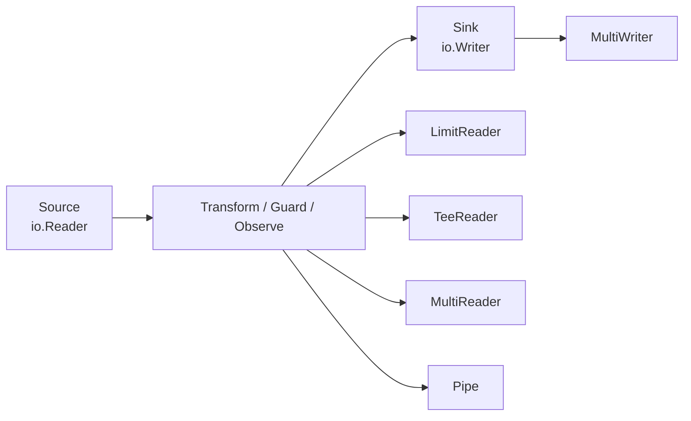

Kuncinya:

> Go IO composition biasanya tidak membuat object model besar. Ia membentuk jalur byte.

---

## 3. Empat Mode Transfer Data

Sebelum masuk fungsi, pisahkan empat mode transfer yang sering tercampur.

### 3.1 Load-All

Contoh:

```go
data, err := io.ReadAll(r)
```

Karakteristik:

- semua data dibaca ke memory
- cocok untuk input kecil dan bounded
- tidak cocok untuk file/request body besar atau untrusted input tanpa limit
- sederhana, tetapi mudah menyebabkan memory spike

Gunakan ketika:

- ukuran diketahui kecil
- kamu benar-benar butuh semua byte sekaligus
- data akan diparse sebagai satu dokumen kecil
- limit sudah diberlakukan sebelumnya

Jangan gunakan langsung terhadap:

- request body publik
- socket stream
- file besar
- decompressed stream yang bisa membesar ekstrem
- stream yang tidak punya EOF cepat

### 3.2 Stream Copy

Contoh:

```go
written, err := io.Copy(dst, src)
```

Karakteristik:

- membaca sebagian demi sebagian
- memory tetap relatif bounded
- cocok untuk file transfer, proxying, download/upload
- lebih production-friendly untuk data besar

### 3.3 Bounded Stream Copy

Contoh:

```go
r := io.LimitReader(src, maxBytes)
written, err := io.Copy(dst, r)
```

Karakteristik:

- tetap streaming
- jumlah byte dibatasi
- penting untuk input untrusted
- mencegah resource exhaustion

### 3.4 Exact Copy / Fixed-Length Copy

Contoh:

```go
written, err := io.CopyN(dst, src, n)
```

Karakteristik:

- harus menyalin tepat `n` byte
- error kalau source selesai sebelum `n`
- cocok untuk protocol frame, length-prefix, fixed-size payload

---

## 4. `io.Copy`: Primitive Transfer Paling Penting

Signature:

```go
func Copy(dst Writer, src Reader) (written int64, err error)
```

Makna:

- baca dari `src`
- tulis ke `dst`
- ulangi sampai `src` mencapai EOF atau terjadi error
- return total byte berhasil ditulis
- `EOF` dari source yang normal tidak dianggap error akhir

Contoh dasar:

```go
func CopyFile(dst io.Writer, src io.Reader) (int64, error) {
    return io.Copy(dst, src)
}
```

Namun production code tidak cukup hanya tahu bentuk itu.

---

## 5. Kenapa Tidak Menulis Loop Sendiri?

Loop manual sering tampak begini:

```go
buf := make([]byte, 32*1024)
for {
    n, readErr := src.Read(buf)
    if n > 0 {
        _, writeErr := dst.Write(buf[:n])
        if writeErr != nil {
            return writeErr
        }
    }
    if readErr != nil {
        if errors.Is(readErr, io.EOF) {
            return nil
        }
        return readErr
    }
}
```

Masalahnya:

1. Loop manual sering salah menangani partial write.
2. Loop manual sering salah menangani `n > 0 && err != nil`.
3. Loop manual sering mengabaikan jumlah byte sukses.
4. Loop manual sering tidak memanfaatkan fast path `WriterTo` / `ReaderFrom`.
5. Loop manual sering tidak jelas ownership buffer-nya.
6. Loop manual sering lupa guardrail size.

`io.Copy` sudah mengenkapsulasi banyak detail ini.

---

## 6. Kontrak Penting `io.Copy`

### 6.1 EOF Normal Tidak Dikembalikan Sebagai Error

Jika transfer selesai karena source mengembalikan `io.EOF`, maka `io.Copy` mengembalikan `err == nil`.

Artinya:

```go
n, err := io.Copy(dst, src)
if err != nil {
    // transfer gagal secara abnormal
}
// selesai normal
```

Jangan menulis:

```go
if errors.Is(err, io.EOF) {
    // normally not needed after io.Copy
}
```

### 6.2 `written` Adalah Byte yang Berhasil Ditulis

Jika error terjadi di tengah, `written` tetap penting.

Contoh use case:

- logging partial upload
- resumable transfer
- billing/metering
- audit trail
- retry analysis
- progress reporting

```go
written, err := io.Copy(dst, src)
if err != nil {
    return fmt.Errorf("copy failed after %d bytes: %w", written, err)
}
```

### 6.3 Destination Error Menghentikan Transfer

Jika `dst.Write` gagal, transfer berhenti.

Ini terlihat sederhana, tapi penting untuk pipeline:

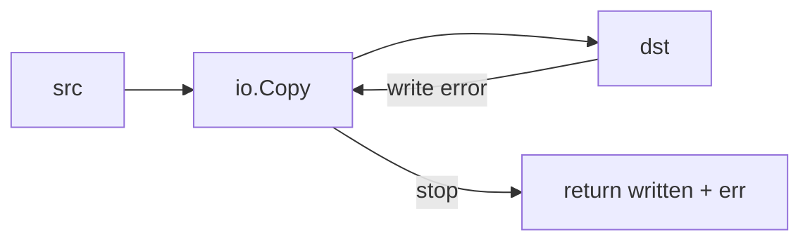

Kalau destination adalah network socket dan peer disconnect, `io.Copy` tidak terus membaca source tanpa tujuan.

### 6.4 Source Error Setelah Partial Data Harus Tetap Dihormati

Reader boleh return:

```go
n > 0, err != nil
```

Artinya ada byte valid sekaligus ada error yang harus diproses setelah byte itu.

`io.Copy` menangani pola ini.

---

## 7. Fast Path: `WriterTo` dan `ReaderFrom`

`io.Copy` tidak selalu memakai buffer internal biasa.

Ia dapat memakai optimasi jika source atau destination mendukung interface tambahan.

```go
type WriterTo interface {
    WriteTo(w Writer) (n int64, err error)
}

type ReaderFrom interface {
    ReadFrom(r Reader) (n int64, err error)
}
```

Secara konseptual:

```mermaid
flowchart TD
    A[io.Copy(dst, src)] --> B{src implements WriterTo?}
    B -->|yes| C[src.WriteTo(dst)]
    B -->|no| D{dst implements ReaderFrom?}
    D -->|yes| E[dst.ReadFrom(src)]
    D -->|no| F[generic copy loop]
```

Mengapa ini penting?

Karena implementasi tertentu bisa lebih efisien daripada generic loop.

Contoh:

- `bytes.Buffer` dapat menulis langsung ke writer.
- `os.File` pada platform tertentu bisa memanfaatkan mekanisme yang lebih dekat ke kernel.
- network/file transfer tertentu bisa punya optimasi internal.

Pelajaran penting:

> Jangan buru-buru mengganti `io.Copy` dengan loop custom demi performance. Kamu bisa kehilangan fast path.

---

## 8. `io.CopyBuffer`: Kontrol Buffer Allocation

Signature:

```go
func CopyBuffer(dst Writer, src Reader, buf []byte) (written int64, err error)
```

`io.CopyBuffer` mirip `io.Copy`, tetapi kamu memberikan buffer sendiri.

Gunakan ketika:

- copy terjadi di hot path
- kamu ingin menghindari allocation berulang
- kamu punya buffer pool
- kamu ingin mengontrol ukuran buffer
- kamu ingin menjaga memory profile stabil

Contoh:

```go
func CopyWithBuffer(dst io.Writer, src io.Reader) (int64, error) {
    buf := make([]byte, 64*1024)
    return io.CopyBuffer(dst, src, buf)
}
```

Dengan `sync.Pool`:

```go
var copyBufPool = sync.Pool{
    New: func() any {
        b := make([]byte, 64*1024)
        return &b
    },
}

func CopyPooled(dst io.Writer, src io.Reader) (int64, error) {
    bp := copyBufPool.Get().(*[]byte)
    defer copyBufPool.Put(bp)

    buf := *bp
    return io.CopyBuffer(dst, src, buf)
}
```

### 8.1 Hati-Hati Dengan Buffer Pool

Pool bukan magic.

Risiko:

- buffer terlalu besar membuat RSS naik
- buffer tertahan lama oleh goroutine lambat
- pool dapat menyimpan memory lebih lama dari yang kamu kira
- pooling kecil-kecil bisa lebih buruk daripada allocation biasa
- data sensitif bisa tertinggal di buffer jika tidak di-zero-kan

Untuk data sensitif:

```go
func zero(b []byte) {
    for i := range b {
        b[i] = 0
    }
}
```

Lalu:

```go
bp := pool.Get().(*[]byte)
defer func() {
    zero(*bp)
    pool.Put(bp)
}()
```

Namun zeroing juga punya cost. Jadi gunakan untuk kasus yang memang perlu.

### 8.2 Ukuran Buffer: Tidak Ada Angka Universal

Common starting point:

- 16 KiB
- 32 KiB
- 64 KiB
- 128 KiB

Tapi ukuran optimal bergantung pada:

- filesystem
- network latency
- throughput target
- syscall overhead
- compression stage
- TLS layer
- CPU cache
- number of concurrent transfers
- memory budget

Rule of thumb:

> Pilih buffer cukup besar untuk mengurangi syscall overhead, tetapi cukup kecil agar concurrency tidak meledakkan memory.

Contoh memory budget:

```text
10_000 concurrent transfer × 64 KiB = ~640 MiB just for copy buffers
10_000 concurrent transfer × 256 KiB = ~2.5 GiB just for copy buffers
```

Production system tidak boleh memilih buffer size tanpa menghitung concurrency.

---

## 9. `io.CopyN`: Transfer Tepat N Byte

Signature:

```go
func CopyN(dst Writer, src Reader, n int64) (written int64, err error)
```

Gunakan untuk:

- protocol frame length
- fixed-size header/body
- multipart boundary segment tertentu
- range response
- upload chunk
- resumable transfer

Contoh:

```go
func CopyPayload(dst io.Writer, src io.Reader, size int64) error {
    written, err := io.CopyN(dst, src, size)
    if err != nil {
        return fmt.Errorf("copy payload: wrote %d/%d bytes: %w", written, size, err)
    }
    if written != size {
        return fmt.Errorf("copy payload: wrote %d/%d bytes", written, size)
    }
    return nil
}
```

### 9.1 `CopyN` Bukan `LimitReader + Copy` yang Sama Persis

Keduanya mirip, tapi semantics berbeda.

```go
io.CopyN(dst, src, n)
```

Artinya:

> Saya mengharapkan ada tepat `n` byte untuk disalin.

Sedangkan:

```go
io.Copy(dst, io.LimitReader(src, n))
```

Artinya:

> Saya akan menyalin maksimal `n` byte dari source.

Perbedaan penting:

| Skenario | `CopyN` | `LimitReader + Copy` |
|---|---|---|
| Source punya 100 byte, n=50 | sukses 50 | sukses 50 |
| Source punya 40 byte, n=50 | error `EOF`/`UnexpectedEOF` style | sukses 40, err nil jika EOF normal |
| Maksud semantic | exact requirement | upper bound |

Untuk protocol dengan length-prefix, gunakan `CopyN` atau `ReadFull`, bukan sekadar `LimitReader`.

---

## 10. `io.LimitReader`: Guardrail Terhadap Resource Exhaustion

Signature:

```go
func LimitReader(r Reader, n int64) Reader
```

`LimitReader` mengembalikan reader yang berhenti setelah `n` byte.

Contoh:

```go
const maxBody = 10 << 20 // 10 MiB

func ReadSmallBody(r io.Reader) ([]byte, error) {
    limited := io.LimitReader(r, maxBody+1)
    data, err := io.ReadAll(limited)
    if err != nil {
        return nil, err
    }
    if int64(len(data)) > maxBody {
        return nil, fmt.Errorf("body too large")
    }
    return data, nil
}
```

Kenapa `maxBody+1`?

Karena kalau hanya limit `maxBody`, kamu tidak tahu apakah source sebenarnya lebih besar. Dengan `maxBody+1`, kamu bisa mendeteksi overflow.

### 10.1 Anti-Pattern: `ReadAll` Tanpa Limit

```go
body, err := io.ReadAll(r.Body)
```

Untuk request publik, ini berbahaya.

Masalah:

- attacker bisa mengirim body besar
- decompression bomb bisa memperbesar data
- koneksi lambat bisa menahan resource
- memory spike menyebabkan GC pressure
- satu request bisa mengganggu seluruh process

Pola lebih aman:

```go
func ReadRequestBody(r *http.Request, max int64) ([]byte, error) {
    limited := io.LimitReader(r.Body, max+1)
    body, err := io.ReadAll(limited)
    if err != nil {
        return nil, err
    }
    if int64(len(body)) > max {
        return nil, fmt.Errorf("request body exceeds %d bytes", max)
    }
    return body, nil
}
```

Catatan HTTP server juga punya `http.MaxBytesReader`, yang akan dibahas di part HTTP server.

### 10.2 `LimitReader` Tidak Menutup Reader Asli

`LimitReader` hanya membungkus read behavior. Ia tidak memiliki ownership close.

```go
limited := io.LimitReader(file, 1024)
// close tetap pada file
_ = limited
```

Kalau source perlu ditutup, penutupannya tetap dilakukan pada owner original.

---

## 11. `io.MultiReader`: Menyusun Stream Secara Berurutan

Signature:

```go
func MultiReader(readers ...Reader) Reader
```

`MultiReader` membaca dari reader pertama sampai EOF, lalu reader kedua, dan seterusnya.

Contoh:

```go
r := io.MultiReader(
    strings.NewReader("header\n"),
    file,
    strings.NewReader("\nfooter\n"),
)

_, err := io.Copy(dst, r)
```

Ini tidak menggabungkan semua data ke memory.

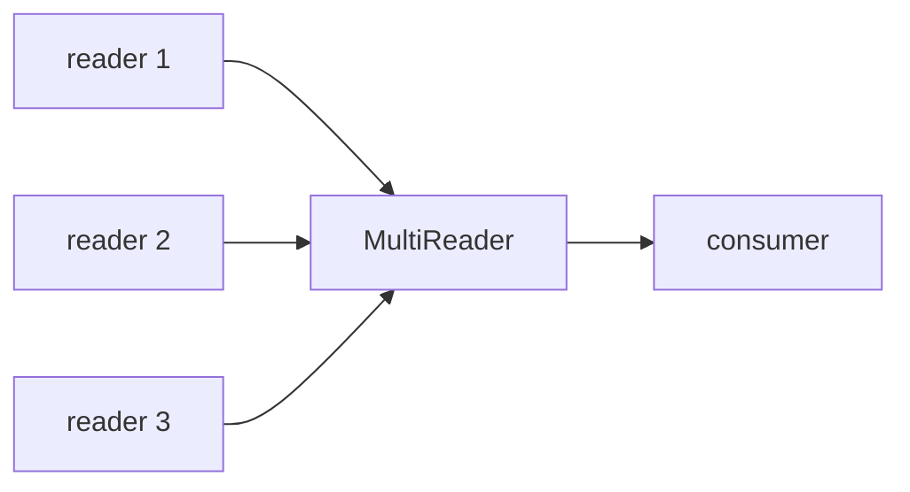

### 11.1 Use Case

- prepend header tanpa membuat buffer besar
- append checksum footer
- menyusun protocol frame
- menggabungkan beberapa file kecil menjadi satu output stream
- menyisipkan delimiter antar stream
- membuat synthetic stream untuk testing

### 11.2 Contoh: Streaming Envelope

```go
func EnvelopeReader(payload io.Reader, contentType string) io.Reader {
    header := fmt.Sprintf("Content-Type: %s\n\n", contentType)
    return io.MultiReader(
        strings.NewReader(header),
        payload,
        strings.NewReader("\n--end--\n"),
    )
}
```

### 11.3 Failure Semantics

Jika reader pertama return error non-EOF, `MultiReader` berhenti dan mengembalikan error.

Ia hanya pindah ke reader berikutnya ketika reader saat ini selesai normal dengan EOF.

### 11.4 Jangan Gunakan Untuk Parallel Merge

`MultiReader` bukan fan-in parallel.

Ia sequential.

Kalau kamu butuh membaca banyak source secara concurrent lalu menggabungkan hasil, itu bukan tanggung jawab `MultiReader`.

---

## 12. `io.MultiWriter`: Broadcast Write ke Banyak Writer

Signature:

```go
func MultiWriter(writers ...Writer) Writer
```

Setiap `Write(p)` akan ditulis ke semua writer.

Contoh:

```go
mw := io.MultiWriter(file, hasher)
_, err := io.Copy(mw, src)
```

Use case:

- tulis file sekaligus hitung hash
- tulis response sekaligus meter byte
- tulis log ke beberapa sink
- duplicate stream ke buffer audit
- test writer behavior

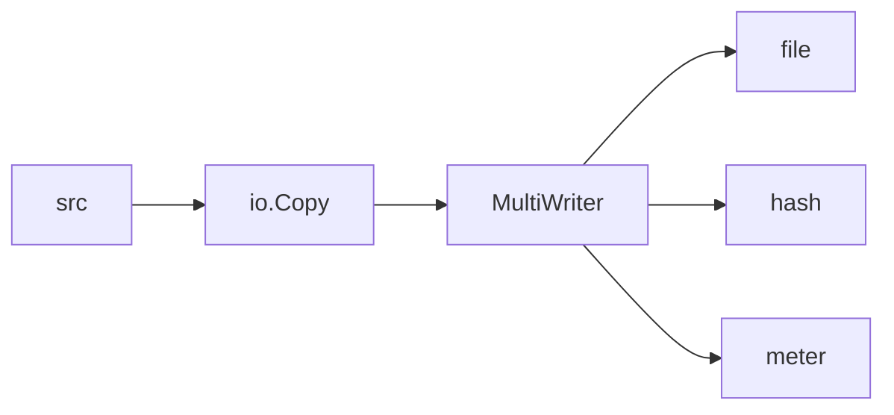

### 12.1 Failure Semantics Penting

`MultiWriter` menulis ke writer satu per satu.

Jika salah satu writer gagal, `Write` gagal dan writer setelahnya mungkin tidak dipanggil.

Implikasi:

- ini bukan transactional broadcast
- tidak ada rollback untuk writer yang sudah menerima data
- urutan writer bisa penting
- jika audit writer gagal, apakah transfer utama harus gagal?

Pertanyaan desain:

```text
Jika sink sekunder gagal, apakah operasi utama harus gagal?
```

Kalau jawabannya “tidak”, `MultiWriter` langsung mungkin bukan pilihan tepat.

### 12.2 Anti-Pattern: Logging Sink Membunuh Main Transfer

Misal:

```go
mw := io.MultiWriter(clientConn, auditFile)
_, err := io.Copy(mw, upstream)
```

Jika `auditFile` gagal karena disk penuh, client transfer ikut gagal.

Mungkin itu memang diinginkan untuk regulated audit system. Tapi sering tidak.

Alternatif:

- tee ke best-effort writer custom
- logging asynchronous dengan bounded queue
- metrics counter bukan full audit copy
- pisahkan critical vs non-critical sink

Contoh best-effort writer:

```go
type BestEffortWriter struct {
    W   io.Writer
    Log func(error)
}

func (b BestEffortWriter) Write(p []byte) (int, error) {
    n, err := b.W.Write(p)
    if err != nil && b.Log != nil {
        b.Log(err)
    }
    // Claim success to avoid breaking primary pipeline.
    // Only safe when this sink is explicitly non-critical.
    return len(p), nil
}
```

Gunakan dengan hati-hati, karena ini menyembunyikan failure.

---

## 13. `io.TeeReader`: Membaca Sambil Menulis ke Side Sink

Signature:

```go
func TeeReader(r Reader, w Writer) Reader
```

Setiap byte yang dibaca dari `r` juga ditulis ke `w`.

Contoh hashing:

```go
func CopyAndHash(dst io.Writer, src io.Reader) ([]byte, int64, error) {
    h := sha256.New()
    tr := io.TeeReader(src, h)

    n, err := io.Copy(dst, tr)
    if err != nil {
        return nil, n, err
    }
    return h.Sum(nil), n, nil
}
```

Dataflow:

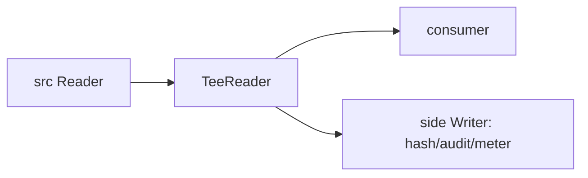

### 13.1 TeeReader Bekerja Pada Saat Read

`TeeReader` tidak melakukan background copy.

Side write terjadi ketika consumer membaca dari tee reader.

Artinya:

- jika consumer lambat, side write juga lambat
- jika consumer berhenti membaca, side writer tidak menerima sisa data
- jika side writer error, read dari tee reader mengembalikan error

### 13.2 TeeReader vs MultiWriter

Keduanya bisa terlihat mirip.

| Kebutuhan | Pilihan |
|---|---|
| Satu source dibaca lalu ditulis ke main destination dan side sink | `MultiWriter` sebagai destination |
| Ingin mengobservasi stream saat dibaca sebelum destination tertentu | `TeeReader` |
| Hash input sebelum transform | `TeeReader` sebelum transform |
| Hash output setelah transform | `MultiWriter` atau `TeeReader` setelah transform |

Contoh perbedaan:

```go
// Hash original input.
h := sha256.New()
r := io.TeeReader(src, h)
_, err := io.Copy(compressor, r)
```

```go
// Hash compressed output.
h := sha256.New()
w := io.MultiWriter(dst, h)
_, err := io.Copy(w, compressedReader)
```

### 13.3 Metering Dengan TeeReader

```go
type CountingWriter struct {
    N int64
}

func (c *CountingWriter) Write(p []byte) (int, error) {
    c.N += int64(len(p))
    return len(p), nil
}

func MeteredCopy(dst io.Writer, src io.Reader) (int64, error) {
    counter := &CountingWriter{}
    r := io.TeeReader(src, counter)

    n, err := io.Copy(dst, r)
    if counter.N != n {
        return n, fmt.Errorf("meter mismatch: counted=%d copied=%d", counter.N, n)
    }
    return n, err
}
```

---

## 14. `io.Pipe`: Streaming Antara Producer dan Consumer

Signature:

```go
func Pipe() (*PipeReader, *PipeWriter)
```

`io.Pipe` membuat reader dan writer yang terhubung secara memory-synchronous.

Data yang ditulis ke `PipeWriter` dapat dibaca dari `PipeReader`.

Namun ini bukan buffer besar. Ia lebih mirip handoff sinkron.

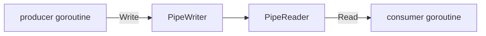

Use case:

- streaming compression ke HTTP request body
- streaming tar/zip generation ke upload sink
- menghubungkan API yang butuh `Reader` dengan code yang menghasilkan data lewat `Writer`
- menghindari temporary file besar
- transform pipeline producer/consumer

### 14.1 Contoh: Streaming Compress Tanpa Buffer Besar

```go
func GzipStream(src io.Reader) (io.Reader, <-chan error) {
    pr, pw := io.Pipe()
    errCh := make(chan error, 1)

    go func() {
        defer close(errCh)

        gz := gzip.NewWriter(pw)
        _, copyErr := io.Copy(gz, src)
        closeErr := gz.Close()

        if copyErr != nil {
            _ = pw.CloseWithError(copyErr)
            errCh <- copyErr
            return
        }
        if closeErr != nil {
            _ = pw.CloseWithError(closeErr)
            errCh <- closeErr
            return
        }

        errCh <- pw.Close()
    }()

    return pr, errCh
}
```

Consumer:

```go
r, errCh := GzipStream(file)
_, err := io.Copy(dst, r)
if err != nil {
    return err
}
if err := <-errCh; err != nil {
    return err
}
```

### 14.2 Pipe Error Propagation

`CloseWithError` sangat penting.

Jika producer gagal, consumer harus tahu.

```go
_ = pw.CloseWithError(err)
```

Jika consumer gagal, producer juga perlu berhenti. Dalam desain nyata, gunakan context/cancellation dan close sisi reader/writer.

### 14.3 Deadlock Pattern

Anti-pattern:

```go
pr, pw := io.Pipe()
_, _ = pw.Write([]byte("hello")) // can block
_, _ = io.ReadAll(pr)
```

Masalah:

- write ke pipe bisa menunggu reader
- reader belum jalan
- deadlock

Biasanya pipe butuh goroutine terpisah:

```go
pr, pw := io.Pipe()

go func() {
    defer pw.Close()
    _, _ = pw.Write([]byte("hello"))
}()

data, err := io.ReadAll(pr)
```

### 14.4 Pipe Bukan Queue Tak Terbatas

`io.Pipe` memberi backpressure natural.

Jika reader lambat, writer ikut lambat.

Ini bagus untuk mencegah memory blow-up, tapi bisa menyebabkan pipeline stall kalau tidak didesain dengan benar.

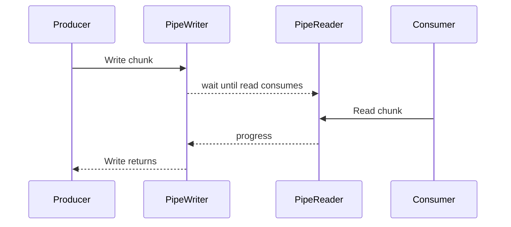

### 14.5 Pipe Dengan Context

`io.Pipe` sendiri tidak menerima `context.Context`.

Kamu harus mengintegrasikan cancellation secara eksplisit.

Contoh skeleton:

```go
func PipeWithContext(ctx context.Context, produce func(io.Writer) error) io.Reader {
    pr, pw := io.Pipe()

    go func() {
        errCh := make(chan error, 1)

        go func() {
            errCh <- produce(pw)
        }()

        select {
        case <-ctx.Done():
            _ = pw.CloseWithError(ctx.Err())
        case err := <-errCh:
            if err != nil {
                _ = pw.CloseWithError(err)
            } else {
                _ = pw.Close()
            }
        }
    }()

    return pr
}
```

Catatan: skeleton di atas harus disesuaikan agar tidak meninggalkan goroutine jika `produce` blocking di `Write`. Part HTTP/network akan membahas cancellation lebih detail.

---

## 15. `io.ReadAll`: Kapan Boleh, Kapan Bahaya

Signature:

```go
func ReadAll(r Reader) ([]byte, error)
```

`ReadAll` membaca sampai EOF.

Go 1.26 meningkatkan efisiensi `io.ReadAll` untuk input besar, tetapi perubahan performance tidak mengubah aturan desain:

> Lebih cepat bukan berarti aman untuk input tidak terbatas.

Gunakan `ReadAll` untuk:

- config kecil
- test fixture
- small JSON bounded
- embedded resource kecil
- response kecil dengan explicit limit

Jangan langsung gunakan untuk:

- public request body
- file besar
- socket stream
- decompressed stream
- unbounded CLI stdin

Pola aman:

```go
func ReadAllLimited(r io.Reader, max int64) ([]byte, error) {
    lr := io.LimitReader(r, max+1)
    b, err := io.ReadAll(lr)
    if err != nil {
        return nil, err
    }
    if int64(len(b)) > max {
        return nil, fmt.Errorf("input exceeds max size %d", max)
    }
    return b, nil
}
```

---

## 16. `io.ReadFull` dan `io.ReadAtLeast`: Exact Read Semantics

### 16.1 `io.ReadFull`

Signature:

```go
func ReadFull(r Reader, buf []byte) (n int, err error)
```

Membaca sampai `buf` penuh.

Jika reader selesai sebelum buffer penuh, error.

Use case:

- fixed-size header
- magic bytes
- binary protocol field
- nonce/IV size tertentu
- length-prefix integer

Contoh:

```go
func ReadHeader(r io.Reader) ([8]byte, error) {
    var header [8]byte
    if _, err := io.ReadFull(r, header[:]); err != nil {
        return header, fmt.Errorf("read header: %w", err)
    }
    return header, nil
}
```

### 16.2 `io.ReadAtLeast`

Signature:

```go
func ReadAtLeast(r Reader, buf []byte, min int) (n int, err error)
```

Membaca minimal `min` byte, selama buffer cukup.

Use case lebih jarang daripada `ReadFull`, tapi berguna saat:

- parser butuh minimal prefix
- protocol punya variable payload tetapi minimal header
- ingin mengisi buffer sebanyak mungkin setelah minimum terpenuhi

### 16.3 Perbedaan Dengan `Read`

`Read` biasa tidak menjamin buffer penuh.

```go
n, err := r.Read(buf)
```

Bahkan jika `len(buf) == 8`, `n` bisa 1, 2, 3, atau angka lain.

Untuk fixed-size data, gunakan `ReadFull`.

---

## 17. `io.SectionReader`: Membatasi View Pada ReaderAt

Signature:

```go
func NewSectionReader(r ReaderAt, off int64, n int64) *SectionReader
```

`SectionReader` membuat reader untuk membaca section tertentu dari source yang mendukung `ReaderAt`.

Use case:

- baca range file
- parsing file format dengan segment/table
- HTTP range response
- random access archive
- membatasi parser pada region tertentu
- concurrent reads dari file berbeda offset

Contoh:

```go
func CopyRange(dst io.Writer, f *os.File, off, size int64) error {
    sr := io.NewSectionReader(f, off, size)
    written, err := io.Copy(dst, sr)
    if err != nil {
        return fmt.Errorf("copy range: %w", err)
    }
    if written != size {
        return fmt.Errorf("copy range: wrote %d/%d", written, size)
    }
    return nil
}
```

### 17.1 Kenapa Bukan Seek Lalu Read?

Dengan `Seek + Read`, offset file shared berubah.

Jika dipakai concurrent, bisa kacau.

Dengan `ReaderAt` + `SectionReader`, offset eksplisit.

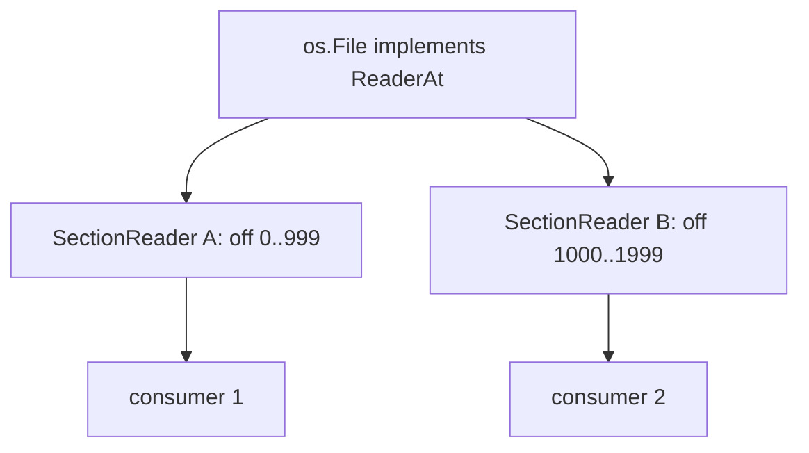

### 17.2 SectionReader Bukan Security Boundary Lengkap

Ia membatasi read pada section, tetapi parser di atas tetap harus:

- validasi length
- validasi offset overflow
- validasi record count
- handle corrupt input
- hindari integer overflow saat `off + n`

---

## 18. `io.NopCloser`: Adapter Ownership

Signature:

```go
func NopCloser(r Reader) ReadCloser
```

Use case:

- API membutuhkan `io.ReadCloser`
- kamu hanya punya `io.Reader`
- tidak ada resource yang perlu ditutup

Contoh:

```go
body := io.NopCloser(strings.NewReader("hello"))
```

Sering dipakai di test HTTP:

```go
req.Body = io.NopCloser(strings.NewReader(`{"name":"fajar"}`))
```

### 18.1 Jangan Gunakan Untuk Menyembunyikan Resource Close

Salah:

```go
f, _ := os.Open("data.txt")
body := io.NopCloser(f) // pointless and can obscure real close semantics
_ = body
```

Jika reader asli punya close, jangan bungkus dengan nop close sehingga ownership jadi membingungkan.

---

## 19. `io.Discard`: Sink Yang Membuang Semua Byte

`io.Discard` adalah writer yang menerima write dan membuang datanya.

Use case:

- drain response body
- benchmark read path
- validate stream can be read
- count bytes via `io.Copy(io.Discard, r)`
- skip payload

Contoh:

```go
n, err := io.Copy(io.Discard, r)
```

### 19.1 Drain vs Close

Dalam HTTP client/server, kadang body perlu di-drain agar connection dapat reuse. Detailnya akan dibahas di part HTTP client/server.

Yang penting sekarang:

> `io.Discard` berguna untuk mengonsumsi stream tanpa menyimpan byte.

---

## 20. `io.WriteString`: Avoid Unnecessary Conversion

Signature:

```go
func WriteString(w Writer, s string) (n int, err error)
```

Gunakan untuk menulis string ke writer.

```go
_, err := io.WriteString(w, "hello\n")
```

Jika writer punya optimized string path melalui `StringWriter`, Go dapat memanfaatkannya.

Jangan otomatis lakukan:

```go
w.Write([]byte(s))
```

karena itu bisa membuat allocation tergantung konteks.

---

## 21. Pattern: Hash Saat Copy

Production use case umum:

- upload file
- tulis ke disk
- hitung checksum
- return checksum ke caller

```go
func SaveAndSHA256(dst io.Writer, src io.Reader) (sum [32]byte, written int64, err error) {
    h := sha256.New()
    w := io.MultiWriter(dst, h)

    written, err = io.Copy(w, src)
    if err != nil {
        return sum, written, fmt.Errorf("save and hash after %d bytes: %w", written, err)
    }

    copy(sum[:], h.Sum(nil))
    return sum, written, nil
}
```

Invariant:

```text
Hash dihitung atas byte yang berhasil ditulis ke dst.
```

Kalau ingin hash atas byte input sebelum transform, tempatkan hasher sebelum transform dengan `TeeReader`.

---

## 22. Pattern: Limit + Hash + Copy

Untuk input untrusted:

```go
func SaveLimitedAndHash(dst io.Writer, src io.Reader, max int64) ([32]byte, int64, error) {
    var zero [32]byte

    limited := io.LimitReader(src, max+1)
    h := sha256.New()
    w := io.MultiWriter(dst, h)

    written, err := io.Copy(w, limited)
    if err != nil {
        return zero, written, fmt.Errorf("copy limited: %w", err)
    }
    if written > max {
        return zero, written, fmt.Errorf("input too large: limit=%d got_at_least=%d", max, written)
    }

    var sum [32]byte
    copy(sum[:], h.Sum(nil))
    return sum, written, nil
}
```

Caveat:

Kode di atas menulis byte ke-`max+1` ke destination sebelum mendeteksi too large. Untuk beberapa sistem itu tidak boleh.

Versi lebih ketat harus membatasi write ke max dan mendeteksi overflow dengan read-ahead terpisah atau staging.

Contoh strict pattern:

```go
func SaveLimitedStrict(dst io.Writer, src io.Reader, max int64) (int64, error) {
    lr := &io.LimitedReader{R: src, N: max}

    written, err := io.Copy(dst, lr)
    if err != nil {
        return written, err
    }

    if lr.N == 0 {
        var one [1]byte
        n, readErr := src.Read(one[:])
        if n > 0 {
            return written, fmt.Errorf("input too large: max=%d", max)
        }
        if readErr != nil && !errors.Is(readErr, io.EOF) {
            return written, fmt.Errorf("check overflow: %w", readErr)
        }
    }

    return written, nil
}
```

Trade-off:

- strict check reads one extra byte from source
- for protocol streams, consuming one extra byte may or may not be acceptable
- for HTTP request body, it is usually okay because body is one payload
- for multiplexed protocol, be careful

---

## 23. Pattern: Framed Payload Copy

Misal protocol punya frame:

```text
[4-byte big-endian length][payload bytes]
```

Parser:

```go
func ReadFrame(r io.Reader, max uint32) ([]byte, error) {
    var lenBuf [4]byte
    if _, err := io.ReadFull(r, lenBuf[:]); err != nil {
        return nil, fmt.Errorf("read frame length: %w", err)
    }

    n := binary.BigEndian.Uint32(lenBuf[:])
    if n > max {
        return nil, fmt.Errorf("frame too large: %d > %d", n, max)
    }

    payload := make([]byte, n)
    if _, err := io.ReadFull(r, payload); err != nil {
        return nil, fmt.Errorf("read frame payload: %w", err)
    }

    return payload, nil
}
```

Streaming version:

```go
func CopyFrame(dst io.Writer, r io.Reader, max uint32) (uint32, error) {
    var lenBuf [4]byte
    if _, err := io.ReadFull(r, lenBuf[:]); err != nil {
        return 0, fmt.Errorf("read frame length: %w", err)
    }

    n := binary.BigEndian.Uint32(lenBuf[:])
    if n > max {
        return 0, fmt.Errorf("frame too large: %d > %d", n, max)
    }

    written, err := io.CopyN(dst, r, int64(n))
    if err != nil {
        return n, fmt.Errorf("copy frame payload %d/%d: %w", written, n, err)
    }
    return n, nil
}
```

Key invariant:

```text
Length-prefix is not trusted until validated against max.
```

---

## 24. Pattern: Streaming Transform Dengan Pipe

Misal kamu harus membuat tar.gz on the fly untuk dikirim ke HTTP response atau upload client.

```go
func TarGzipStream(files []string) (io.Reader, <-chan error) {
    pr, pw := io.Pipe()
    errCh := make(chan error, 1)

    go func() {
        defer close(errCh)

        gz := gzip.NewWriter(pw)
        tw := tar.NewWriter(gz)

        var err error
        defer func() {
            if err != nil {
                _ = pw.CloseWithError(err)
                errCh <- err
                return
            }

            if closeErr := tw.Close(); closeErr != nil {
                _ = pw.CloseWithError(closeErr)
                errCh <- closeErr
                return
            }
            if closeErr := gz.Close(); closeErr != nil {
                _ = pw.CloseWithError(closeErr)
                errCh <- closeErr
                return
            }
            errCh <- pw.Close()
        }()

        for _, name := range files {
            err = addFileToTar(tw, name)
            if err != nil {
                return
            }
        }
    }()

    return pr, errCh
}
```

Catatan:

- urutan close penting: tar writer dulu, gzip writer, lalu pipe writer
- error harus dipropagasi via `CloseWithError`
- consumer harus membaca reader dan juga memeriksa `errCh`
- jangan menyimpan seluruh archive di memory

---

## 25. Pipeline Design: Source, Guard, Observe, Transform, Sink

Desain pipeline yang baik biasanya eksplisit membagi tanggung jawab.

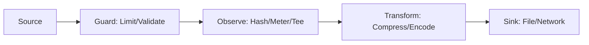

Contoh konseptual:

```go
func Pipeline(dst io.Writer, src io.Reader, max int64) error {
    // Guard
    limited := io.LimitReader(src, max)

    // Observe
    h := sha256.New()
    observed := io.TeeReader(limited, h)

    // Transform could be another reader/writer adapter.
    written, err := io.Copy(dst, observed)
    if err != nil {
        return fmt.Errorf("pipeline copy after %d bytes: %w", written, err)
    }

    _ = h.Sum(nil)
    return nil
}
```

Namun production implementation perlu mempertimbangkan:

- limit overflow detection
- context cancellation
- close order
- side sink criticality
- partial write behavior
- metric cardinality
- cleanup on error

---

## 26. Error Model Pada Pipeline

Dalam pipeline, error bisa berasal dari banyak titik:

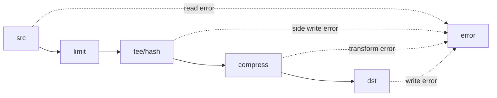

Pertanyaan desain:

1. Error mana yang fatal?
2. Error mana yang bisa best-effort?
3. Error mana yang harus membatalkan upstream?
4. Error mana yang perlu cleanup destination?
5. Apakah partial output valid atau harus dihapus?
6. Apakah bisa retry? Dari offset berapa?

### 26.1 Partial Output Policy

Saat transfer gagal di tengah, destination mungkin berisi partial data.

Untuk file:

- hapus temp file
- jangan expose partial file sebagai final output
- gunakan temp-write-rename

Untuk network:

- tutup koneksi
- jangan mengirim response sukses
- signal error status jika protocol masih memungkinkan

Untuk object storage:

- abort multipart upload
- jangan commit manifest

Untuk database BLOB:

- rollback transaction
- gunakan staging row

---

## 27. Close Ordering

Close bukan detail kecil.

Pada streaming encoder/compressor, close sering menulis footer/trailer.

Contoh gzip:

```go
gz := gzip.NewWriter(dst)
_, err := io.Copy(gz, src)
if closeErr := gz.Close(); err == nil {
    err = closeErr
}
return err
```

Kenapa `Close` dicek?

Karena gzip close menulis trailer. Kalau gagal, output corrupt.

Pattern:

```go
func CopyGzip(dst io.Writer, src io.Reader) error {
    gz := gzip.NewWriter(dst)

    _, copyErr := io.Copy(gz, src)
    closeErr := gz.Close()

    if copyErr != nil {
        return copyErr
    }
    if closeErr != nil {
        return closeErr
    }
    return nil
}
```

Jika `dst` juga `Closer`, close urutannya biasanya:

1. tutup wrapper/encoder/compressor agar trailer flush
2. flush buffered writer jika ada
3. close underlying sink

---

## 28. Buffering Layer: Jangan Tumpuk Tanpa Alasan

Contoh tumpukan yang bisa terjadi:

```text
bufio.Writer -> gzip.Writer -> bufio.Writer -> os.File
```

Ini belum tentu salah, tetapi harus ada alasan.

Masalah:

- latency flush tidak jelas
- memory bertambah
- close/flush ordering rawan salah
- debugging sulit
- partial output makin kompleks

Rule:

> Setiap buffering layer harus punya tujuan eksplisit.

Tujuan buffering bisa:

- mengurangi syscall
- mengurangi small write ke network
- menyediakan `ReadString`/`ReadBytes`
- staging token parser
- batch compression input

Jika tidak ada tujuan, hapus layer.

---

## 29. Backpressure Model

Stream copy adalah mekanisme backpressure natural.

Jika destination lambat, `Write` lambat. Karena `io.Copy` sequential, source tidak terus dibaca tak terbatas.

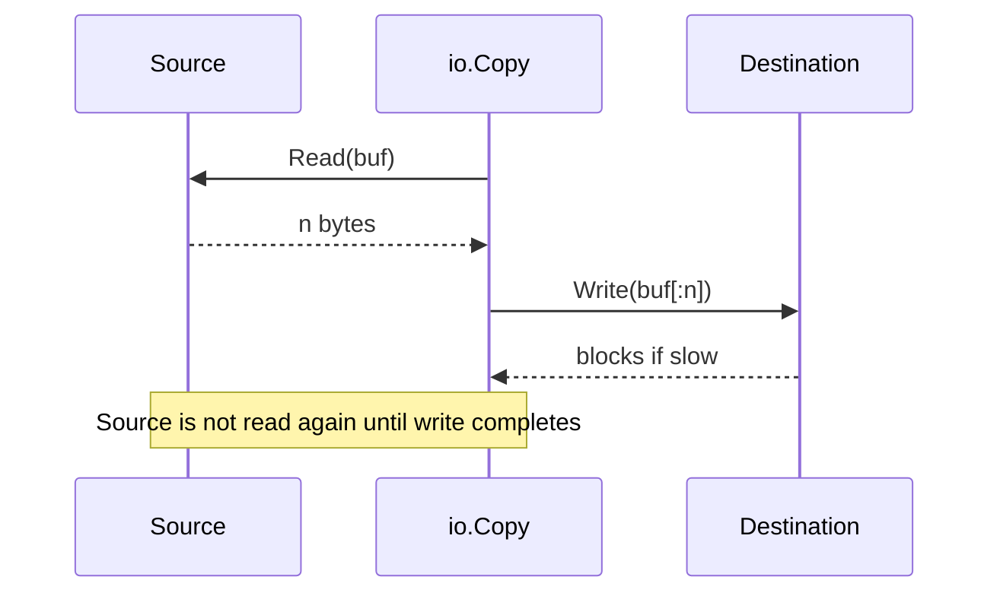

Ini bagus untuk memory.

Namun ada trade-off:

- throughput mungkin terbatas jika source dan sink bisa overlap
- slow sink membuat entire transfer lambat
- deadline/cancellation tetap diperlukan untuk menghindari hang

Part networking akan membahas deadline dan cancellation lebih dalam.

---

## 30. Decision Matrix

| Kebutuhan | Primitive |
|---|---|
| Salin stream sampai EOF | `io.Copy` |
| Salin stream dengan buffer reusable | `io.CopyBuffer` |
| Salin tepat N byte | `io.CopyN` |
| Baca semua byte kecil | `io.ReadAll` |
| Baca semua byte kecil tapi aman | `LimitReader + ReadAll` |
| Batasi reader maksimum N byte | `io.LimitReader` / `io.LimitedReader` |
| Gabungkan beberapa stream berurutan | `io.MultiReader` |
| Tulis ke banyak writer sekaligus | `io.MultiWriter` |
| Observasi stream saat dibaca | `io.TeeReader` |
| Hubungkan writer producer ke reader consumer | `io.Pipe` |
| Baca fixed-size field | `io.ReadFull` |
| Baca minimal sejumlah byte | `io.ReadAtLeast` |
| Baca range dari `ReaderAt` | `io.SectionReader` |
| Adapter reader menjadi read closer | `io.NopCloser` |
| Buang byte | `io.Discard` |
| Tulis string ke writer | `io.WriteString` |

---

## 31. Anti-Pattern Checklist

### 31.1 `ReadAll` Pada Input Publik

```go
body, _ := io.ReadAll(r.Body)
```

Perbaiki dengan limit.

### 31.2 Mengabaikan `written` Saat Error

```go
_, err := io.Copy(dst, src)
return err
```

Lebih baik:

```go
n, err := io.Copy(dst, src)
if err != nil {
    return fmt.Errorf("copy failed after %d bytes: %w", n, err)
}
```

### 31.3 Menganggap `Read` Mengisi Buffer Penuh

```go
buf := make([]byte, 8)
r.Read(buf) // wrong for fixed header
```

Gunakan:

```go
io.ReadFull(r, buf)
```

### 31.4 Menggunakan `MultiWriter` Untuk Sink Non-Critical

Jika audit/log sink gagal dan operasi utama tidak boleh gagal, jangan pakai `MultiWriter` secara langsung.

### 31.5 Pipe Tanpa Goroutine / Cancellation

```go
pr, pw := io.Pipe()
pw.Write(data)
io.ReadAll(pr)
```

Rawan deadlock.

### 31.6 Tidak Mengecek Close Error Pada Compressor/Encoder

```go
gz.Close() // ignored
```

Bisa menghasilkan corrupt output tanpa diketahui.

### 31.7 Buffer Pool Tanpa Memory Budget

```go
pool of 1MiB buffers × many concurrent requests
```

Bisa membuat RSS meledak.

---

## 32. Production Checklist

Sebelum merge code IO pipeline, jawab:

1. Apakah input bounded?
2. Jika input untrusted, di mana limit diberlakukan?
3. Apakah `ReadAll` benar-benar diperlukan?
4. Apakah copy harus exact N byte atau sampai EOF?
5. Apakah partial output boleh tersisa?
6. Apakah destination perlu staging/temp file?
7. Apakah side sink critical atau best-effort?
8. Apakah close/flush error dicek?
9. Apakah pipeline bisa hang tanpa deadline/cancellation?
10. Apakah buffer size sesuai concurrency budget?
11. Apakah data sensitif tertinggal di pooled buffer?
12. Apakah metrics mencatat byte copied dan duration?
13. Apakah error message menyertakan byte progress?
14. Apakah retry aman secara semantic?
15. Apakah source/destination ownership jelas?

---

## 33. Mini Case Study: Upload File ke Disk Dengan Hash dan Limit

Requirement:

- menerima stream upload
- maksimum 100 MiB
- tulis ke temp file dulu
- hitung SHA-256
- jika sukses rename atomik ke final path
- jika gagal hapus temp file
- jangan load semua ke memory

Skeleton:

```go
func SaveUpload(src io.Reader, finalPath string, max int64) ([32]byte, int64, error) {
    var zero [32]byte

    dir := filepath.Dir(finalPath)
    tmp, err := os.CreateTemp(dir, ".upload-*")
    if err != nil {
        return zero, 0, fmt.Errorf("create temp: %w", err)
    }

    tmpName := tmp.Name()
    committed := false
    defer func() {
        _ = tmp.Close()
        if !committed {
            _ = os.Remove(tmpName)
        }
    }()

    limited := &io.LimitedReader{R: src, N: max}
    h := sha256.New()
    w := io.MultiWriter(tmp, h)

    written, err := io.Copy(w, limited)
    if err != nil {
        return zero, written, fmt.Errorf("copy upload after %d bytes: %w", written, err)
    }

    if limited.N == 0 {
        var one [1]byte
        n, readErr := src.Read(one[:])
        if n > 0 {
            return zero, written, fmt.Errorf("upload too large: max=%d", max)
        }
        if readErr != nil && !errors.Is(readErr, io.EOF) {
            return zero, written, fmt.Errorf("check upload overflow: %w", readErr)
        }
    }

    if err := tmp.Sync(); err != nil {
        return zero, written, fmt.Errorf("sync temp: %w", err)
    }
    if err := tmp.Close(); err != nil {
        return zero, written, fmt.Errorf("close temp: %w", err)
    }

    if err := os.Rename(tmpName, finalPath); err != nil {
        return zero, written, fmt.Errorf("rename temp to final: %w", err)
    }

    committed = true

    var sum [32]byte
    copy(sum[:], h.Sum(nil))
    return sum, written, nil
}
```

Catatan penting:

- Ini masih simplified.
- Directory fsync untuk durability rename akan dibahas pada part durable writes.
- Path traversal dan permission akan dibahas pada part filesystem/path safety.
- HTTP body max handling akan dibahas pada part HTTP server.

Namun skeleton ini menunjukkan komposisi:

```text
src -> LimitedReader -> MultiWriter(tempFile, hash) -> atomic commit
```

---

## 34. Mini Case Study: Proxy Stream Dengan Metering

Requirement:

- baca dari upstream
- tulis ke downstream
- catat byte count
- jangan buffer semua
- error harus menyertakan progress

```go
type ByteCounter struct {
    N int64
}

func (c *ByteCounter) Write(p []byte) (int, error) {
    c.N += int64(len(p))
    return len(p), nil
}

func ProxyStream(downstream io.Writer, upstream io.Reader) error {
    counter := &ByteCounter{}
    src := io.TeeReader(upstream, counter)

    written, err := io.Copy(downstream, src)
    if err != nil {
        return fmt.Errorf("proxy failed after written=%d observed=%d: %w", written, counter.N, err)
    }
    return nil
}
```

Caveat:

`counter.N` menghitung byte yang berhasil dibaca dari upstream dan berhasil ditulis ke tee writer. `written` menghitung byte yang berhasil ditulis ke downstream. Jika downstream gagal, angka bisa membantu debugging.

---

## 35. Latihan

### Latihan 1 — Exact Header Reader

Buat function:

```go
func ReadMagicAndVersion(r io.Reader) ([4]byte, uint16, error)
```

Format:

```text
[4 bytes magic][2 bytes big-endian version]
```

Requirement:

- gunakan `io.ReadFull`
- error harus membedakan gagal baca magic dan gagal baca version
- jangan gunakan `ReadAll`

### Latihan 2 — Safe ReadAll

Buat:

```go
func ReadAllMax(r io.Reader, max int64) ([]byte, error)
```

Requirement:

- fail jika input lebih besar dari max
- jangan menerima input `max+1` sebagai sukses
- jelaskan apakah function boleh mengonsumsi byte ekstra dari reader

### Latihan 3 — Hash Original vs Hash Output

Buat dua pipeline:

1. Hash sebelum gzip.
2. Hash setelah gzip.

Gunakan `TeeReader` atau `MultiWriter` yang sesuai.

Jelaskan perbedaan semantic checksum-nya.

### Latihan 4 — MultiWriter Failure

Buat dua writer:

- writer A selalu sukses
- writer B gagal setelah 10 byte

Gunakan `io.MultiWriter(A, B)`.

Observasi:

- berapa byte masuk ke A?
- error kapan muncul?
- apakah ada rollback?

### Latihan 5 — Pipe Deadlock

Buat contoh `io.Pipe` yang deadlock, lalu perbaiki dengan goroutine.

Tambahkan `CloseWithError` pada producer failure.

---

## 36. Ringkasan Mental Model

Part ini bisa diringkas sebagai berikut:

```text
io.Copy        = stream transfer sampai EOF
io.CopyBuffer  = stream transfer dengan explicit buffer ownership
io.CopyN       = exact N-byte transfer
LimitReader    = upper-bound guardrail
MultiReader    = sequential stream composition
MultiWriter    = broadcast write with failure coupling
TeeReader      = observe while reading
Pipe           = connect writer-style producer to reader-style consumer
ReadFull       = exact buffer fill
SectionReader  = bounded view over random-access source
```

Production-grade IO bukan soal memilih API paling keren.

Production-grade IO adalah menjaga invariant:

```text
bounded memory
explicit ownership
clear close order
correct partial progress handling
trusted limits
observable transfer
safe failure cleanup
```

---

## 37. Referensi Resmi

- Go `io` package: https://pkg.go.dev/io
- Go 1.26 release notes: https://go.dev/doc/go1.26
- Go `bytes` package: https://pkg.go.dev/bytes
- Go `os` package: https://pkg.go.dev/os
- Go `net/http` package: https://pkg.go.dev/net/http
- Go `compress/gzip` package: https://pkg.go.dev/compress/gzip
- Go `archive/tar` package: https://pkg.go.dev/archive/tar

---

## 38. Preview Part Berikutnya

Part berikutnya:

```text
learn-go-io-buffer-byte-stream-file-network-data-transfer-part-004.md
```

Topik:

```text
Buffer fundamentals: bytes.Buffer, bytes.Reader, strings.Reader, slice-backed IO
```

Kita akan membedah:

- `bytes.Buffer` sebagai growable byte buffer
- `bytes.Reader` sebagai immutable-ish read/seek view atas slice
- `strings.Reader` untuk string-backed stream
- perbedaan buffer sebagai storage vs reader sebagai cursor
- zero-copy illusion dan kapan copy tetap terjadi
- aliasing hazard pada slice-backed IO
- reset/reuse pattern
- buffer ownership contract
- memory retention trap
- perbandingan dengan Java `ByteArrayInputStream`, `ByteBuffer`, dan `StringReader`


<!-- NAVIGATION_FOOTER -->
<div class="page-nav">
<a href="./learn-go-io-buffer-byte-stream-file-network-data-transfer-part-002.md">⬅️ Part 002 — Core IO Contracts: `Reader`, `Writer`, `Closer`, `Seeker`, `ReaderAt`, `WriterAt`</a>
<a href="./index.md">📚 Kategori</a>
<a href="../../index.md">🏠 Home</a>
<a href="./learn-go-io-buffer-byte-stream-file-network-data-transfer-part-004.md">Part 004 — Buffer Fundamentals: `bytes.Buffer`, `bytes.Reader`, `strings.Reader`, dan Slice-Backed IO ➡️</a>
</div>
