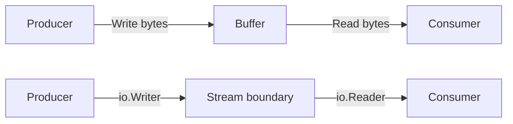

# learn-go-io-buffer-byte-stream-file-network-data-transfer-part-004.md

# Part 004 — Buffer Fundamentals: `bytes.Buffer`, `bytes.Reader`, `strings.Reader`, dan Slice-Backed IO

> Series: `learn-go-io-buffer-byte-stream-file-network-data-transfer`  
> Target Go: Go 1.26.x  
> Audience: Java software engineer yang ingin membangun mental model Go IO hingga level production-grade engineering handbook  
> Fokus part ini: buffer in-memory, reader berbasis slice/string, ownership, aliasing, copying, cursor, growth, reuse, dan boundary antara byte slice, stream, dan immutable string.

---

## 0. Posisi Part Ini dalam Series

Pada part sebelumnya kita membahas komposisi `io` tingkat lanjut: `io.Copy`, `CopyBuffer`, `LimitReader`, `TeeReader`, `Pipe`, `ReadFull`, `SectionReader`, dan lain-lain.

Part ini turun satu level ke fondasi yang sangat sering menjadi sumber bug performa dan correctness di Go:

```text
memory bytes
  ↓
[]byte / string
  ↓
bytes.Buffer / bytes.Reader / strings.Reader
  ↓
io.Reader / io.Writer / io.ReaderAt / io.Seeker
  ↓
file, network, compression, serialization, HTTP body, tests
```

Di Java, Anda sering berpikir dengan objek seperti:

- `byte[]`
- `ByteBuffer`
- `ByteArrayInputStream`
- `ByteArrayOutputStream`
- `StringReader`
- `InputStream`
- `OutputStream`
- `Reader` / `Writer` untuk character stream
- Netty `ByteBuf`

Di Go, ekosistem standarnya lebih kecil, tetapi kontraknya lebih eksplisit:

- `[]byte` adalah mutable byte view.
- `string` adalah immutable byte sequence yang biasanya UTF-8, tetapi secara teknis bisa berisi arbitrary bytes.
- `bytes.Buffer` adalah growable mutable in-memory buffer dengan read cursor.
- `bytes.Reader` adalah read-only cursor over immutable `[]byte` snapshot/view.
- `strings.Reader` adalah read-only cursor over immutable `string`.
- `io.Reader`/`io.Writer` adalah stream contract, bukan container.

Bagian ini penting karena banyak sistem IO Go yang lambat atau salah bukan karena socket/file-nya, tetapi karena salah memperlakukan buffer:

- membaca semua data tanpa batas,
- mengembalikan slice yang masih alias ke buffer internal,
- memakai `bytes.Buffer` untuk payload raksasa,
- tidak mengerti bedanya `Len()` dan `Cap()`,
- menyimpan `Bytes()` setelah buffer di-`Reset`,
- mengonversi `[]byte` ke `string` berulang-ulang,
- memakai `ReadAll` di boundary yang seharusnya streaming,
- memakai `Scanner` untuk data besar,
- gagal membedakan append-only builder vs readable buffer.

Part ini membangun mental model untuk menghindari itu.

---

## 1. Tujuan Pembelajaran

Setelah menyelesaikan part ini, Anda harus bisa:

1. Menjelaskan perbedaan `[]byte`, `string`, `bytes.Buffer`, `bytes.Reader`, dan `strings.Reader`.
2. Membedakan **container**, **cursor**, **stream**, dan **view**.
3. Menentukan kapan memakai `bytes.Buffer`, kapan cukup `[]byte`, kapan memakai `bytes.Reader`, dan kapan sebaiknya streaming langsung.
4. Menjelaskan aliasing risk dari `Bytes()`, `Next()`, `AvailableBuffer()`, dan slice reuse.
5. Mendesain API yang jelas soal ownership: apakah caller boleh mutate, retain, atau reuse buffer.
6. Menghindari memory retention bug akibat buffer besar yang di-reset tetapi masih memegang backing array besar.
7. Menulis slice-backed reader/writer sederhana untuk test, protocol parser, dan serialization boundary.
8. Menghubungkan buffer decision dengan performance: allocation, copy count, syscall boundary, dan GC pressure.

---

## 2. Mental Model Utama: Buffer Bukan Stream

Kesalahan paling umum: menganggap buffer sama dengan stream.

Buffer adalah **tempat sementara data berada**.

Stream adalah **kontrak data mengalir**.



Dalam Go, `bytes.Buffer` menarik karena ia bisa menjadi keduanya:

- sebagai `io.Writer`, ia menerima data;
- sebagai `io.Reader`, ia mengeluarkan data;
- sebagai container, ia menyimpan unread bytes di memory.

Tetapi ini membuatnya berbahaya bila mental model Anda kabur.

Contoh:

```go
var b bytes.Buffer
b.WriteString("hello")
b.WriteString(" world")

p := make([]byte, 5)
n, _ := b.Read(p) // reads "hello"
fmt.Println(string(p[:n]))
fmt.Println(b.String()) // " world" -- only unread portion
```

`bytes.Buffer.String()` bukan selalu “semua data yang pernah ditulis”. Ia mengembalikan unread portion. `bytes.Buffer` punya read cursor.

Untuk Java engineer: `bytes.Buffer` lebih dekat ke kombinasi `ByteArrayOutputStream` + `ByteArrayInputStream` dengan cursor internal, bukan sekadar append-only builder.

---

## 3. Empat Bentuk Data In-Memory

### 3.1 `[]byte`: mutable byte view

`[]byte` adalah slice, bukan array penuh. Slice berisi pointer ke backing array, length, dan capacity.

```text
[]byte header
+---------+-----+-----+
| pointer | len | cap |
+---------+-----+-----+
     |
     v
backing array: [b0 b1 b2 b3 b4 ...]
```

Sifat penting:

- mutable;
- bisa alias ke slice lain;
- append bisa memakai backing array lama atau membuat backing array baru;
- bisa mereferensikan sebagian kecil dari array besar, menyebabkan array besar tetap hidup;
- cocok untuk binary data, network payload, file chunk, serialization buffer.

Contoh aliasing:

```go
x := []byte("abcdef")
y := x[:3]
y[0] = 'X'
fmt.Println(string(x)) // "Xbcdef"
```

Ini bukan bug. Ini desain. Tetapi di API boundary, ini harus eksplisit.

### 3.2 `string`: immutable byte sequence

Di Go, `string` adalah immutable byte sequence. Biasanya dipakai untuk UTF-8 text, tetapi tidak dipaksa harus valid UTF-8.

Sifat penting:

- immutable;
- length dalam byte, bukan rune;
- indexing menghasilkan byte, bukan character;
- konversi `[]byte` → `string` biasanya copy;
- konversi `string` → `[]byte` copy karena hasilnya mutable;
- cocok untuk stable text, keys, messages, protocol names, path-like logical values.

```go
s := "é"
fmt.Println(len(s))        // 2 bytes
fmt.Println([]rune(s))     // [233]
fmt.Println(s[0], s[1])    // raw UTF-8 bytes
```

### 3.3 `bytes.Buffer`: mutable growable buffer dengan read cursor

`bytes.Buffer` menyimpan unread bytes dan bisa tumbuh.

Sifat penting:

- zero value siap pakai;
- implements `io.Reader`, `io.Writer`, `io.ByteReader`, `io.ByteWriter`, `io.RuneReader`, `io.StringWriter`, dan lainnya;
- punya konsep unread portion;
- `Read` memajukan cursor;
- `Write` append ke end;
- `Bytes()` expose unread bytes sebagai slice yang alias ke internal storage;
- `String()` expose unread bytes sebagai string;
- `Reset()` mengosongkan buffer tetapi dapat mempertahankan backing storage;
- bukan thread-safe.

### 3.4 `bytes.Reader`: read-only cursor atas `[]byte`

`bytes.Reader` membaca dari `[]byte` yang sudah ada.

Sifat penting:

- implements `io.Reader`, `io.ReaderAt`, `io.WriterTo`, `io.ByteReader`, `io.RuneReader`, `io.Seeker`;
- tidak meng-copy input pada `bytes.NewReader(b)`;
- reader cursor dapat berpindah dengan `Seek`;
- `ReadAt` tidak mengubah cursor;
- cocok untuk test, parsing, random access over memory, retryable body kecil, signature verification, dan decoder input.

Karena `bytes.Reader` tidak meng-copy `[]byte`, bila slice asli dimutasi, hasil baca reader bisa berubah.

### 3.5 `strings.Reader`: read-only cursor atas `string`

`strings.Reader` mirip `bytes.Reader`, tetapi sumbernya `string`.

Sifat penting:

- immutable source;
- good for stable text input;
- implements banyak interface yang sama dengan `bytes.Reader`;
- cocok untuk test text protocol, JSON kecil, template input, request body kecil berbasis string.

---

## 4. Package Map: `bytes`, `strings`, `bufio`, `io`

```mermaid
flowchart TD
    A[[]byte] --> B[bytes functions]
    A --> C[bytes.Buffer]
    A --> D[bytes.Reader]

    E[string] --> F[strings functions]
    E --> G[strings.Reader]

    C --> H[io.Reader]
    C --> I[io.Writer]
    D --> H
    G --> H

    H --> J[bufio.Reader]
    I --> K[bufio.Writer]
```

Perbedaan ringkas:

| Tool | Sumber/Sink | Mutable? | Cursor? | Grow? | Use case utama |
|---|---:|---:|---:|---:|---|
| `[]byte` | memory | yes | no | via append | binary data, chunk, scratch buffer |
| `string` | memory | no | no | no | stable text |
| `bytes.Buffer` | memory | yes | yes | yes | build payload, capture output, intermediate buffer |
| `bytes.Reader` | `[]byte` | source may be mutable externally | yes | no | read/seek over byte slice |
| `strings.Reader` | `string` | no | yes | no | read/seek over string |
| `bufio.Reader` | wraps stream | internal buffer | yes | bounded | reduce read calls, parse text/protocol |
| `bufio.Writer` | wraps stream | internal buffer | yes | bounded | batch writes, reduce syscall/write calls |

Part ini membahas `bytes.*`, `strings.Reader`, dan slice-backed IO. `bufio` sudah mendapat part khusus berikutnya karena buffered IO punya semantics sendiri: peeking, unread, scanner limit, flush, dan line protocol.

---

## 5. `bytes.Buffer` Deep Dive

### 5.1 Zero value siap dipakai

```go
var b bytes.Buffer
_, _ = b.WriteString("hello")
_, _ = b.Write([]byte(" world"))
fmt.Println(b.String()) // hello world
```

Anda tidak perlu `new(bytes.Buffer)` kecuali ingin pointer.

```go
func buildPayload() []byte {
    var b bytes.Buffer
    b.WriteString("id=")
    b.WriteString("123")
    return b.Bytes() // WARNING: see ownership section
}
```

Contoh di atas secara teknis bisa berjalan, tetapi return `b.Bytes()` sering bukan pola API terbaik karena slice yang dikembalikan alias ke internal buffer. Setelah function return, buffer object tidak dipakai lagi, sehingga relatif aman selama caller memahami bahwa slice itu miliknya secara efektif. Tetapi pola yang lebih eksplisit sering memakai `append([]byte(nil), b.Bytes()...)` bila ingin detached copy.

### 5.2 `Len()` adalah unread length

```go
var b bytes.Buffer
b.WriteString("abcdef")

p := make([]byte, 2)
b.Read(p)

fmt.Println(b.Len())    // 4
fmt.Println(b.String()) // cdef
```

`Len()` bukan total bytes ever written. Ini unread bytes.

### 5.3 `Cap()` adalah kapasitas internal unread+free storage

`Cap()` memberi kapasitas underlying byte slice milik buffer. Nilainya berguna untuk debugging dan observasi allocation, tetapi jangan dijadikan business logic.

```go
var b bytes.Buffer
b.Grow(1024)
fmt.Println(b.Len()) // 0
fmt.Println(b.Cap()) // at least 1024-ish, exact not contract for business semantics
```

### 5.4 `Grow(n)` untuk mengurangi repeated allocation

Jika Anda tahu ukuran final kira-kira, `Grow` membantu.

```go
func buildLine(fields []string) string {
    var b bytes.Buffer

    // Estimate: sum len + separators.
    total := 0
    for _, f := range fields {
        total += len(f)
    }
    if len(fields) > 1 {
        total += len(fields) - 1
    }

    b.Grow(total)

    for i, f := range fields {
        if i > 0 {
            b.WriteByte(',')
        }
        b.WriteString(f)
    }

    return b.String()
}
```

Tetapi `Grow` bukan license untuk load payload tak terbatas. Untuk untrusted input, bound tetap harus eksplisit.

### 5.5 `Reset()` mengosongkan, bukan selalu melepas memory

```go
var b bytes.Buffer
b.Grow(10 << 20) // 10 MiB
b.Write(make([]byte, 10<<20))
b.Reset()

fmt.Println(b.Len()) // 0
fmt.Println(b.Cap()) // may still be large
```

Ini bagus untuk reuse buffer dengan ukuran stabil. Tetapi berbahaya bila buffer kadang menerima payload sangat besar, lalu dimasukkan ke pool. Anda bisa membuat memory retention.

Pola mitigasi:

```go
const maxReusableBufferCap = 64 << 10 // 64 KiB

func resetOrDrop(b *bytes.Buffer) *bytes.Buffer {
    if b.Cap() > maxReusableBufferCap {
        return new(bytes.Buffer)
    }
    b.Reset()
    return b
}
```

Atau dengan `sync.Pool`:

```go
var bufferPool = sync.Pool{
    New: func() any { return new(bytes.Buffer) },
}

func getBuffer() *bytes.Buffer {
    b := bufferPool.Get().(*bytes.Buffer)
    b.Reset()
    return b
}

func putBuffer(b *bytes.Buffer) {
    if b.Cap() > 64<<10 {
        return // drop large backing array
    }
    b.Reset()
    bufferPool.Put(b)
}
```

Catatan: pooling bukan default. Pooling hanya masuk akal bila profiling menunjukkan allocation pressure yang nyata.

---

## 6. Ownership dan Aliasing: Bagian Paling Penting

### 6.1 `Bytes()` mengembalikan slice yang alias ke internal buffer

```go
var b bytes.Buffer
b.WriteString("hello")

x := b.Bytes()
x[0] = 'H'

fmt.Println(b.String()) // Hello
```

Ini disengaja. `Bytes()` bukan copy.

Konsekuensi:

- caller bisa mutate buffer internal;
- slice valid hanya sampai buffer dimodifikasi berikutnya;
- menyimpan slice jangka panjang berbahaya bila buffer di-reuse;
- mengirim slice ke goroutine lain berbahaya tanpa ownership transfer yang jelas;
- memasukkan buffer ke pool saat slice masih dipakai adalah bug berat.

### 6.2 Detached copy bila butuh ownership aman

```go
func snapshot(b *bytes.Buffer) []byte {
    return append([]byte(nil), b.Bytes()...)
}
```

Atau Go modern:

```go
func snapshot(b *bytes.Buffer) []byte {
    return bytes.Clone(b.Bytes())
}
```

`bytes.Clone` membuat copy baru dari byte slice.

### 6.3 API harus menyatakan ownership

Buruk:

```go
func Encode(v Event) []byte
```

Pertanyaan yang tidak jelas:

- Apakah caller boleh mutate hasilnya?
- Apakah hasilnya alias internal buffer?
- Apakah hasilnya valid setelah call berikutnya?
- Apakah function reuse buffer global?

Lebih baik:

```go
// Encode returns a newly allocated byte slice owned by the caller.
func Encode(v Event) ([]byte, error)
```

Atau:

```go
// AppendEncode appends the encoded event to dst and returns the extended slice.
// The returned slice may share dst's backing array.
func AppendEncode(dst []byte, v Event) ([]byte, error)
```

Atau:

```go
// WriteEncode writes the encoded event to w without retaining w or temporary buffers.
func WriteEncode(w io.Writer, v Event) error
```

Untuk high-performance Go, `AppendX(dst []byte, ...) []byte` adalah pola penting karena caller mengontrol buffer ownership dan reuse.

---

## 7. `bytes.Buffer` Sebagai Writer

### 7.1 Capture output

`bytes.Buffer` sangat berguna untuk test.

```go
func PrintReport(w io.Writer, name string, score int) error {
    _, err := fmt.Fprintf(w, "name=%s score=%d\n", name, score)
    return err
}

func ExamplePrintReport() {
    var b bytes.Buffer
    _ = PrintReport(&b, "alice", 90)
    fmt.Print(b.String())
    // Output:
    // name=alice score=90
}
```

Ini membuat logic tidak hardcoded ke stdout/file/socket.

### 7.2 Build request body kecil

```go
func BuildJSONBody(id string) (*bytes.Reader, error) {
    var b bytes.Buffer
    b.Grow(64 + len(id))

    b.WriteString(`{"id":`)
    enc := json.NewEncoder(&b)
    if err := enc.Encode(id); err != nil {
        return nil, err
    }

    data := bytes.Clone(b.Bytes())
    return bytes.NewReader(data), nil
}
```

Namun untuk JSON production, lebih umum:

```go
var b bytes.Buffer
if err := json.NewEncoder(&b).Encode(req); err != nil {
    return err
}
http.NewRequestWithContext(ctx, http.MethodPost, url, &b)
```

Perhatikan lifecycle: `http.NewRequest` menerima `io.Reader`. Bila request dikirim sinkron dan buffer tidak dimutasi selama transfer, aman. Bila ingin retry body, Anda perlu desain khusus karena body reader cursor bisa habis.

### 7.3 Write error dari `bytes.Buffer` hampir selalu nil

`bytes.Buffer.Write` pada memory biasanya tidak menghasilkan error kecuali panic karena memory exhaustion tidak dikembalikan sebagai `error` biasa. Namun tetap gunakan return value bila menulis ke generic `io.Writer`.

Buruk:

```go
func writePayload(w io.Writer) {
    w.Write([]byte("hello")) // ignored error
}
```

Benar:

```go
func writePayload(w io.Writer) error {
    _, err := w.Write([]byte("hello"))
    return err
}
```

Dalam function yang menerima `*bytes.Buffer` konkret, error handling bisa lebih sederhana. Tetapi bila signature memakai `io.Writer`, perlakukan sebagai boundary yang bisa gagal.

---

## 8. `bytes.Buffer` Sebagai Reader

### 8.1 Membaca memajukan cursor

```go
var b bytes.Buffer
b.WriteString("abcdef")

p := make([]byte, 3)
n, err := b.Read(p)
fmt.Println(n, err, string(p[:n])) // 3 <nil> abc

n, err = b.Read(p)
fmt.Println(n, err, string(p[:n])) // 3 <nil> def

n, err = b.Read(p)
fmt.Println(n, err) // 0 EOF
```

Setelah dibaca, unread portion berkurang.

### 8.2 `Next(n)` juga memajukan cursor dan mengembalikan alias

```go
var b bytes.Buffer
b.WriteString("abcdef")

x := b.Next(2)
fmt.Println(string(x))   // ab
fmt.Println(b.String())  // cdef
```

`Next` berguna untuk parser kecil, tetapi hati-hati:

- returned slice alias ke internal buffer;
- valid sampai modifikasi berikutnya;
- bisa kurang dari `n` bila buffer tidak cukup;
- tidak cocok untuk retain jangka panjang.

### 8.3 `ReadByte` dan `UnreadByte`

`bytes.Buffer` mendukung byte-level parsing:

```go
var b bytes.Buffer
b.WriteString("abc")

c, _ := b.ReadByte()
fmt.Println(c) // 'a'

_ = b.UnreadByte()
c, _ = b.ReadByte()
fmt.Println(c) // 'a'
```

Tetapi untuk parser protocol serius, `bufio.Reader` sering lebih tepat karena dapat wrap stream tak terbatas dan mendukung peek/unread di boundary stream.

---

## 9. `bytes.Reader` Deep Dive

### 9.1 Reader dengan cursor atas byte slice

```go
data := []byte("abcdef")
r := bytes.NewReader(data)

p := make([]byte, 2)
r.Read(p)
fmt.Println(string(p)) // ab

r.Read(p)
fmt.Println(string(p)) // cd
```

`bytes.Reader` tidak grow dan tidak write.

### 9.2 `Len()` dan `Size()` berbeda

```go
data := []byte("abcdef")
r := bytes.NewReader(data)

p := make([]byte, 2)
r.Read(p)

fmt.Println(r.Len())  // 4 remaining
fmt.Println(r.Size()) // 6 original size
```

Ini mirip konsep posisi dan limit pada `ByteBuffer`, tetapi API Go lebih eksplisit.

### 9.3 `Seek` untuk reposition cursor

```go
r := bytes.NewReader([]byte("abcdef"))

_, _ = r.Seek(3, io.SeekStart)
p := make([]byte, 2)
r.Read(p)
fmt.Println(string(p)) // de

_, _ = r.Seek(-2, io.SeekEnd)
r.Read(p)
fmt.Println(string(p)) // ef
```

`Seek` membuat `bytes.Reader` berguna untuk:

- parsing header lalu kembali;
- retry reading small body;
- test decoder dengan random access;
- implementasi format binary kecil;
- verifying content length.

### 9.4 `ReadAt` tidak mengubah cursor

```go
r := bytes.NewReader([]byte("abcdef"))

p := make([]byte, 2)
_, _ = r.ReadAt(p, 3)
fmt.Println(string(p)) // de

q := make([]byte, 2)
_, _ = r.Read(q)
fmt.Println(string(q)) // ab -- cursor unchanged by ReadAt
```

`ReadAt` cocok untuk structured binary format dengan offset table.

### 9.5 Mutasi sumber setelah `NewReader` adalah bug desain kecuali disengaja

```go
data := []byte("abcdef")
r := bytes.NewReader(data)

data[0] = 'X'

p := make([]byte, 1)
r.Read(p)
fmt.Println(string(p)) // X
```

`bytes.NewReader` tidak copy. Jika butuh immutable snapshot:

```go
r := bytes.NewReader(bytes.Clone(data))
```

---

## 10. `strings.Reader` Deep Dive

### 10.1 Untuk sumber text immutable

```go
r := strings.NewReader("hello world")

p := make([]byte, 5)
n, _ := r.Read(p)
fmt.Println(string(p[:n])) // hello
```

`strings.Reader` lebih tepat daripada `bytes.NewReader([]byte(s))` bila sumber Anda string dan Anda tidak perlu mutable bytes. Mengonversi string ke `[]byte` membuat copy.

### 10.2 UTF-8 tetap harus dipahami

`strings.Reader.Read` membaca bytes. Tetapi ia juga punya `ReadRune`.

```go
r := strings.NewReader("éx")

ru, size, _ := r.ReadRune()
fmt.Println(ru, size) // 'é', 2

b, _ := r.ReadByte()
fmt.Println(string([]byte{b})) // x
```

Jika protocol Anda byte-oriented, gunakan byte. Jika text-oriented, pahami rune boundary.

### 10.3 Cocok untuk test dan HTTP body kecil

```go
body := strings.NewReader(`{"name":"alice"}`)
req, err := http.NewRequest(http.MethodPost, url, body)
if err != nil {
    return err
}
```

Karena `strings.Reader` memiliki `Len`, `Size`, `Seek`, dan immutable source, ia nyaman untuk request body kecil yang dapat diulang dengan membuat reader baru dari string yang sama.

---

## 11. `bytes.Buffer` vs `bytes.Reader` vs `strings.Reader`

### 11.1 Decision table

| Kebutuhan | Pilihan utama | Alasan |
|---|---|---|
| Build output bertahap di memory | `bytes.Buffer` | growable writer |
| Capture stdout-like output di test | `bytes.Buffer` | implements `io.Writer`, mudah assert |
| Membaca dari `[]byte` tanpa copy | `bytes.Reader` | cursor + seek + readat |
| Membaca dari `string` tanpa copy ke `[]byte` | `strings.Reader` | source immutable |
| Append binary format ke existing buffer | `[]byte` + `append` | caller controls capacity/ownership |
| Transform stream besar | `io.Reader`/`io.Writer` pipeline | hindari load all |
| Batching write ke file/socket | `bufio.Writer` | bounded buffering + flush |
| Parsing text dari stream | `bufio.Reader` | peek/readline/unread over stream |
| Build string saja | `strings.Builder` | append-only string construction |

### 11.2 `strings.Builder` tidak sama dengan `bytes.Buffer`

Walau bukan fokus utama part ini, penting membedakan:

- `strings.Builder` untuk membangun string;
- `bytes.Buffer` untuk membangun bytes dan bisa dibaca lagi;
- `strings.Builder` tidak dirancang sebagai reader;
- `bytes.Buffer` bisa jadi reader dan writer.

Jika output akhir pasti `string`, `strings.Builder` sering lebih tepat.

```go
var sb strings.Builder
sb.WriteString("hello")
s := sb.String()
```

Jika output akhir bytes atau perlu `io.Writer`, `bytes.Buffer` sering lebih tepat.

```go
var b bytes.Buffer
json.NewEncoder(&b).Encode(v)
out := b.Bytes()
```

---

## 12. Slice-Backed IO Patterns

### 12.1 `bytes.NewReader` sebagai input adapter

Banyak API menerima `io.Reader`. Jika data Anda sudah ada sebagai `[]byte`, pakai adapter.

```go
func DecodePacket(data []byte) (Packet, error) {
    r := bytes.NewReader(data)
    return decodePacketFromReader(r)
}
```

Ini menjaga decoder tetap stream-compatible:

```go
func decodePacketFromReader(r io.Reader) (Packet, error) {
    // Can read from memory, file, socket, gzip reader, etc.
}
```

### 12.2 `bytes.Buffer` sebagai output adapter

```go
func EncodePacket(p Packet) ([]byte, error) {
    var b bytes.Buffer
    if err := writePacket(&b, p); err != nil {
        return nil, err
    }
    return bytes.Clone(b.Bytes()), nil
}

func writePacket(w io.Writer, p Packet) error {
    // Can write to memory, file, socket, gzip writer, etc.
    return nil
}
```

### 12.3 Append-style encoder untuk high-performance path

Untuk hot path, hindari membuat `bytes.Buffer` bila formatnya sederhana dan Anda bisa append langsung.

```go
type Record struct {
    Type byte
    ID   uint64
    Body []byte
}

func AppendRecord(dst []byte, r Record) []byte {
    dst = append(dst, r.Type)
    dst = binary.BigEndian.AppendUint64(dst, r.ID)
    dst = binary.BigEndian.AppendUint32(dst, uint32(len(r.Body)))
    dst = append(dst, r.Body...)
    return dst
}
```

Pola ini memberi caller kontrol:

```go
buf := make([]byte, 0, 1024)
buf = AppendRecord(buf, rec1)
buf = AppendRecord(buf, rec2)
```

Tetapi trade-off-nya: API lebih low-level dan ownership harus jelas.

---

## 13. Buffer Growth dan Allocation Model

### 13.1 Masalah repeated growth

```go
var b bytes.Buffer
for _, item := range items {
    b.WriteString(item)
}
```

Ini benar, tetapi mungkin allocate beberapa kali. Jika ukuran bisa diperkirakan, `Grow`.

```go
var b bytes.Buffer
b.Grow(estimatedSize)
for _, item := range items {
    b.WriteString(item)
}
```

### 13.2 Masalah over-growing

Over-growing juga buruk:

```go
b.Grow(100 << 20) // 100 MiB, padahal rata-rata payload 2 KiB
```

Ini meningkatkan memory pressure, membuat GC bekerja lebih berat, dan bila buffer masuk pool bisa menahan array besar.

### 13.3 Bounded growth untuk untrusted data

Jangan lakukan:

```go
data, err := io.ReadAll(r) // unbounded if r is network/client-controlled
```

Lebih aman:

```go
const maxBody = 1 << 20 // 1 MiB
limited := io.LimitReader(r, maxBody+1)
data, err := io.ReadAll(limited)
if err != nil {
    return err
}
if len(data) > maxBody {
    return fmt.Errorf("body too large")
}
```

Untuk payload besar, jangan `ReadAll`; stream ke file, hash, decoder, compressor, atau writer lain.

Catatan Go 1.26: `io.ReadAll` mendapat optimisasi allocation dan kecepatan, tetapi itu tidak mengubah prinsip desain. Lebih cepat bukan berarti aman untuk unbounded input.

---

## 14. Copy Count: Pertanyaan Utama Performance

Saat melihat kode IO, tanyakan: berapa kali bytes disalin?

Contoh buruk:

```go
func Handle(r io.Reader) (string, error) {
    data, err := io.ReadAll(r)       // stream -> []byte copy/growth
    if err != nil {
        return "", err
    }
    s := string(data)                // []byte -> string copy
    s = strings.TrimSpace(s)         // possibly new string/view depending operation
    out := []byte(s)                 // string -> []byte copy
    return base64.StdEncoding.EncodeToString(out), nil // another output allocation
}
```

Kadang ini cukup untuk payload kecil. Tetapi untuk hot path atau payload besar, desain ulang:

- decode streaming;
- write output ke `io.Writer`;
- avoid string conversion untuk binary;
- use `bytes.TrimSpace` bila data tetap bytes;
- use `base64.NewEncoder` untuk streaming output;
- bound memory explicitly.

### 14.1 Pipeline yang lebih sehat

```go
func EncodeBase64(w io.Writer, r io.Reader) error {
    enc := base64.NewEncoder(base64.StdEncoding, w)
    defer enc.Close()

    _, err := io.Copy(enc, r)
    return err
}
```

Ini menghindari load-all dan mengubah data secara streaming.

---

## 15. Buffer sebagai Boundary: Internal vs External

Buffer internal boleh alias bila lifecycle terkendali. Buffer external harus defensif.

### 15.1 Internal hot path

```go
func appendFrame(dst []byte, payload []byte) []byte {
    dst = binary.BigEndian.AppendUint32(dst, uint32(len(payload)))
    dst = append(dst, payload...)
    return dst
}
```

Ini efisien dan jelas: caller mengontrol `dst`; payload dicopy ke frame.

### 15.2 External API boundary

```go
type Store struct {
    data []byte
}

func (s *Store) Set(data []byte) {
    s.data = bytes.Clone(data) // defensive copy
}

func (s *Store) Get() []byte {
    return bytes.Clone(s.data) // defensive copy
}
```

Jika tidak clone:

```go
func (s *Store) Set(data []byte) {
    s.data = data // caller can mutate store
}
```

Kadang intentionally zero-copy, tetapi harus didokumentasikan:

```go
// SetBorrowed stores data without copying. Caller must not modify data after calling SetBorrowed.
func (s *Store) SetBorrowed(data []byte) {
    s.data = data
}
```

Production-grade API tidak menyembunyikan ownership semantics.

---

## 16. Reader Reusability dan Retryability

Network/file stream sering tidak replayable. Memory reader replayable jika Anda memegang data.

### 16.1 Non-replayable stream

```go
func sendOnce(r io.Reader) error {
    _, err := io.Copy(remote, r)
    return err
}
```

Jika gagal di tengah, Anda tidak bisa otomatis retry kecuali sumber bisa diulang.

### 16.2 Replayable memory body

```go
func newBody(data []byte) io.ReadCloser {
    return io.NopCloser(bytes.NewReader(data))
}
```

Setiap retry membuat reader baru:

```go
func doWithRetry(ctx context.Context, data []byte) error {
    for attempt := 0; attempt < 3; attempt++ {
        body := io.NopCloser(bytes.NewReader(data))
        req, err := http.NewRequestWithContext(ctx, http.MethodPost, url, body)
        if err != nil {
            return err
        }
        // send req
    }
    return nil
}
```

Tetapi ini hanya cocok bila `data` bounded. Untuk file besar, replay dari file dengan seek atau reopen, bukan memory.

---

## 17. Buffer di HTTP Context

Walau HTTP detail masuk part 027-030, buffer decision sering muncul sejak awal.

### 17.1 Membuat request body kecil

```go
var b bytes.Buffer
if err := json.NewEncoder(&b).Encode(payload); err != nil {
    return err
}

req, err := http.NewRequestWithContext(ctx, http.MethodPost, endpoint, &b)
if err != nil {
    return err
}
req.Header.Set("Content-Type", "application/json")
```

Perhatikan: setelah request dibuat, jangan mutate buffer sebelum transport selesai membaca body.

### 17.2 Response body kecil dengan limit

```go
const maxResponse = 2 << 20 // 2 MiB

resp, err := client.Do(req)
if err != nil {
    return err
}
defer resp.Body.Close()

r := io.LimitReader(resp.Body, maxResponse+1)
data, err := io.ReadAll(r)
if err != nil {
    return err
}
if len(data) > maxResponse {
    return fmt.Errorf("response too large")
}
```

### 17.3 Response body besar harus streaming

```go
out, err := os.Create(dstPath)
if err != nil {
    return err
}
defer out.Close()

_, err = io.Copy(out, resp.Body)
if err != nil {
    return err
}
```

Lebih production-grade lagi: temp file, checksum, fsync, atomic rename. Itu masuk part file durability.

---

## 18. Buffer di Serialization

Serialization sering menggoda untuk memakai intermediate buffer. Pilihan desainnya:

```mermaid
flowchart TD
    A[Object] --> B{Output target known?}
    B -->|Need []byte| C[Encode to bytes.Buffer / append []byte]
    B -->|Need stream| D[Encode directly to io.Writer]
    B -->|Need retry| E[Encode bounded snapshot]
    B -->|Huge payload| F[Stream encoder]
```

### 18.1 Encode direct to writer

```go
func WriteJSON(w io.Writer, v any) error {
    enc := json.NewEncoder(w)
    return enc.Encode(v)
}
```

### 18.2 Encode to bytes when needed

```go
func MarshalJSONLine(v any) ([]byte, error) {
    var b bytes.Buffer
    enc := json.NewEncoder(&b)
    if err := enc.Encode(v); err != nil {
        return nil, err
    }
    return bytes.Clone(b.Bytes()), nil
}
```

### 18.3 Append binary when format is controlled

```go
func AppendHeader(dst []byte, version byte, typ byte, length uint32) []byte {
    dst = append(dst, version, typ)
    dst = binary.BigEndian.AppendUint32(dst, length)
    return dst
}
```

---

## 19. Small Payload vs Large Payload

### 19.1 Small bounded payload

Untuk payload kecil dan bounded, buffer in-memory sederhana dan sering benar.

Contoh:

- JSON request 2 KiB;
- config file 20 KiB;
- CLI output test;
- small protocol frame;
- signing canonical request;
- base64 encoding small token;
- unit test fixture.

### 19.2 Large or untrusted payload

Untuk payload besar/tak dipercaya, buffer full di memory harus dicurigai.

Contoh:

- upload file;
- download file;
- archive extraction;
- streaming JSON array besar;
- request body dari public client;
- log ingestion;
- message broker payload tidak dibatasi;
- proxy transfer;
- compression/decompression stream.

Prinsip:

```text
If input is untrusted, bound it.
If payload can be large, stream it.
If you must keep it, spool it.
If you expose it, define ownership.
```

---

## 20. Buffer Reuse: Kapan Perlu, Kapan Berbahaya

### 20.1 Jangan optimasi sebelum mengukur

Go allocation relatif murah, tetapi tidak gratis. `bytes.Buffer` lokal yang pendek sering cukup. `sync.Pool` membawa kompleksitas:

- retained memory;
- stale data risk;
- ownership mistakes;
- harder tests;
- cross-request contamination if misused;
- no guarantee object remains in pool;
- benefits depend on workload.

### 20.2 Safe-ish pool pattern

```go
var pool = sync.Pool{
    New: func() any { return new(bytes.Buffer) },
}

func withBuffer(fn func(*bytes.Buffer) error) error {
    b := pool.Get().(*bytes.Buffer)
    b.Reset()

    defer func() {
        if b.Cap() <= 64<<10 {
            b.Reset()
            pool.Put(b)
        }
    }()

    return fn(b)
}
```

### 20.3 Jangan return `b.Bytes()` dari pooled buffer

Bug:

```go
func Encode(v any) ([]byte, error) {
    b := pool.Get().(*bytes.Buffer)
    defer pool.Put(b)
    b.Reset()

    if err := json.NewEncoder(b).Encode(v); err != nil {
        return nil, err
    }
    return b.Bytes(), nil // BUG: buffer reused after return
}
```

Benar:

```go
func Encode(v any) ([]byte, error) {
    b := pool.Get().(*bytes.Buffer)
    defer func() {
        if b.Cap() <= 64<<10 {
            b.Reset()
            pool.Put(b)
        }
    }()
    b.Reset()

    if err := json.NewEncoder(b).Encode(v); err != nil {
        return nil, err
    }
    return bytes.Clone(b.Bytes()), nil
}
```

Atau gunakan append-style API dan biarkan caller mengontrol lifecycle.

---

## 21. Common Bugs

### Bug 1 — menyimpan slice dari `Bytes()` lalu buffer dimodifikasi

```go
var b bytes.Buffer
b.WriteString("hello")

x := b.Bytes()
b.WriteString(" world")

// x may no longer be safe as stable snapshot.
```

Fix:

```go
x := bytes.Clone(b.Bytes())
```

### Bug 2 — pooling buffer tetapi return alias

Sudah dibahas. Ini sangat umum di high-performance code yang premature optimization.

### Bug 3 — `Reset` dianggap melepas memory

`Reset` mengosongkan logical length. Ia tidak boleh diasumsikan mengembalikan memory besar ke runtime.

### Bug 4 — `bytes.Reader` dianggap immutable padahal source `[]byte` mutable

```go
data := []byte("safe")
r := bytes.NewReader(data)
data[0] = 'X'
```

Jika source harus immutable, clone dulu.

### Bug 5 — string/byte conversion berulang

```go
for _, line := range lines {
    b := []byte(line)
    processBytes(b)
}
```

Mungkin benar, tetapi di hot path ini copy. Pertimbangkan API string-based atau reader-based.

### Bug 6 — menggunakan `bytes.Buffer` sebagai queue concurrent

`bytes.Buffer` bukan thread-safe. Jika beberapa goroutine membaca/menulis, gunakan synchronization atau channel/pipeline yang jelas.

### Bug 7 — memakai `ReadAll` untuk body publik tanpa limit

Ini vulnerability pattern. Selalu limit atau stream.

### Bug 8 — menyimpan subslice kecil dari buffer besar

```go
data := make([]byte, 100<<20)
key := data[:16]
cache[keyString] = key // keeps 100 MiB array alive
```

Fix:

```go
key := bytes.Clone(data[:16])
```

---

## 22. Design Pattern: Encoder API Tiga Level

Untuk library internal, sering bagus menyediakan tiga level API:

```go
// 1. Streaming API: most general, avoids large memory.
func WriteRecord(w io.Writer, r Record) error

// 2. Append API: high-performance caller-controlled buffer.
func AppendRecord(dst []byte, r Record) ([]byte, error)

// 3. Convenience API: returns owned []byte.
func MarshalRecord(r Record) ([]byte, error) {
    buf := make([]byte, 0, EstimateRecordSize(r))
    buf, err := AppendRecord(buf, r)
    if err != nil {
        return nil, err
    }
    return buf, nil
}
```

Atau implementasi `WriteRecord` bisa memakai stack/small buffer untuk header lalu write payload.

```go
func WriteRecord(w io.Writer, r Record) error {
    var header [13]byte
    header[0] = r.Type
    binary.BigEndian.PutUint64(header[1:9], r.ID)
    binary.BigEndian.PutUint32(header[9:13], uint32(len(r.Body)))

    if _, err := w.Write(header[:]); err != nil {
        return err
    }
    _, err := w.Write(r.Body)
    return err
}
```

Pattern ini kuat karena:

- streaming API untuk file/socket/compression;
- append API untuk hot path;
- marshal API untuk convenience;
- ownership jelas;
- memory bounded;
- test mudah.

---

## 23. Design Pattern: Parser dengan `bytes.Reader`

Misal format frame:

```text
+---------+---------+------------+--------+
| version | type    | length u32 | body   |
| 1 byte  | 1 byte  | 4 bytes    | N byte |
+---------+---------+------------+--------+
```

Implementasi parser bounded:

```go
type Frame struct {
    Version byte
    Type    byte
    Body    []byte
}

const MaxFrameBody = 1 << 20

func ParseFrame(data []byte) (Frame, error) {
    r := bytes.NewReader(data)

    version, err := r.ReadByte()
    if err != nil {
        return Frame{}, fmt.Errorf("read version: %w", err)
    }

    typ, err := r.ReadByte()
    if err != nil {
        return Frame{}, fmt.Errorf("read type: %w", err)
    }

    var lenBuf [4]byte
    if _, err := io.ReadFull(r, lenBuf[:]); err != nil {
        return Frame{}, fmt.Errorf("read length: %w", err)
    }

    n := binary.BigEndian.Uint32(lenBuf[:])
    if n > MaxFrameBody {
        return Frame{}, fmt.Errorf("frame too large: %d", n)
    }
    if uint64(r.Len()) != uint64(n) {
        return Frame{}, fmt.Errorf("length mismatch: declared=%d remaining=%d", n, r.Len())
    }

    body := make([]byte, n)
    if _, err := io.ReadFull(r, body); err != nil {
        return Frame{}, fmt.Errorf("read body: %w", err)
    }

    return Frame{Version: version, Type: typ, Body: body}, nil
}
```

Catatan:

- `bytes.Reader` memberi cursor;
- `io.ReadFull` memastikan exact length;
- body di-copy untuk ownership aman;
- length dibatasi;
- leftover divalidasi.

Untuk zero-copy internal parser, bisa return subslice body, tetapi harus didokumentasikan:

```go
// ParseFrameBorrowed returns Body as a slice aliasing data.
// Caller must not mutate data while Frame is in use.
func ParseFrameBorrowed(data []byte) (Frame, error) {
    // validate header, length, then Body: data[6:]
}
```

---

## 24. Design Pattern: Safe Bounded Read

Buat helper internal untuk menghindari repeated mistakes.

```go
func ReadAllBounded(r io.Reader, max int64) ([]byte, error) {
    if max < 0 {
        return nil, fmt.Errorf("negative max: %d", max)
    }

    limited := io.LimitReader(r, max+1)
    data, err := io.ReadAll(limited)
    if err != nil {
        return nil, err
    }
    if int64(len(data)) > max {
        return nil, fmt.Errorf("input too large: max=%d", max)
    }
    return data, nil
}
```

Gunakan untuk:

- HTTP response kecil;
- config file kecil;
- metadata file;
- control message;
- protocol handshake;
- test fixture.

Jangan gunakan untuk payload yang memang harus streaming besar.

---

## 25. Design Pattern: Buffer as Scratch, Not State

Buffer scratch sebaiknya tidak menjadi state domain jangka panjang.

Buruk:

```go
type Encoder struct {
    buf bytes.Buffer
}

func (e *Encoder) Encode(v any) []byte {
    e.buf.Reset()
    json.NewEncoder(&e.buf).Encode(v)
    return e.buf.Bytes() // alias internal mutable state
}
```

Masalah:

- not thread-safe;
- result invalid after next call;
- caller bisa mutate internal;
- sulit reasoning.

Lebih eksplisit:

```go
type Encoder struct{}

func (Encoder) Encode(v any) ([]byte, error) {
    var b bytes.Buffer
    if err := json.NewEncoder(&b).Encode(v); err != nil {
        return nil, err
    }
    return bytes.Clone(b.Bytes()), nil
}
```

Atau:

```go
type Encoder struct{}

func (Encoder) Append(dst []byte, v Event) ([]byte, error) {
    // append encoding to dst
}
```

Jika stateful encoder memang perlu, dokumenkan lifecycle dan thread-safety.

---

## 26. Java Comparison: Mapping Mental Model

| Java | Go rough equivalent | Catatan |
|---|---|---|
| `byte[]` | `[]byte` | Go slice memiliki len/cap dan aliasing lebih eksplisit |
| `ByteArrayInputStream` | `bytes.Reader` | read cursor over byte array/slice |
| `ByteArrayOutputStream` | `bytes.Buffer` | growable memory output, tetapi Go Buffer juga readable |
| `StringReader` | `strings.Reader` | immutable text source |
| `InputStream` | `io.Reader` | Go returns `(n, err)` dan partial progress eksplisit |
| `OutputStream` | `io.Writer` | short write harus diperhatikan |
| `ByteBuffer` | `[]byte` + cursor/manual offset atau custom struct | Go tidak punya stdlib ByteBuffer yang sama |
| Netty `ByteBuf` | custom buffer / third-party / `[]byte` patterns | stdlib Go lebih minimal |

Perbedaan budaya:

- Java sering memodelkan IO sebagai class hierarchy.
- Go memodelkan IO sebagai small interfaces dan adapter.
- Java `ByteBuffer` punya position/limit/capacity state built-in.
- Go sering memakai `[]byte` dan explicit offset, atau `bytes.Reader` untuk cursor.
- Go lebih sering membuat ownership/copy decision terlihat di API.

---

## 27. Checklist Production untuk Buffer Decision

Sebelum memilih buffer strategy, jawab:

1. Berapa maksimum ukuran data?
2. Apakah input trusted atau untrusted?
3. Apakah data harus bisa diulang/retry?
4. Apakah data harus dimutasi?
5. Apakah output akhir `[]byte`, `string`, file, socket, atau HTTP body?
6. Apakah caller boleh retain hasil?
7. Apakah hasil alias internal buffer?
8. Apakah buffer akan dipakai lintas goroutine?
9. Apakah buffer masuk pool?
10. Apakah ada risiko retaining backing array besar?
11. Apakah format byte-oriented atau text/rune-oriented?
12. Apakah data perlu checksum/signature sebelum dikirim?
13. Apakah ada observability untuk ukuran payload?
14. Apakah fallback streaming diperlukan untuk payload besar?
15. Apakah error path bisa meninggalkan partial data?

Jika Anda tidak bisa menjawab pertanyaan ini, desain buffer belum matang.

---

## 28. Observability untuk Buffer dan Payload

Buffer bug sering terlihat sebagai:

- memory naik setelah request besar;
- GC pause/CPU meningkat;
- latency p99 naik untuk endpoint upload/download;
- OOM saat request body tidak dibatasi;
- throughput turun karena repeated copy;
- goroutine blocked karena pipeline menunggu buffer tak pernah drain;
- proxy gagal karena buffering response besar;
- inconsistent output karena aliasing/race.

Metric yang berguna:

```text
payload_input_bytes_total
payload_output_bytes_total
payload_rejected_too_large_total
buffer_pool_get_total
buffer_pool_put_total
buffer_pool_drop_large_total
buffer_size_bytes histogram
read_all_bytes histogram
copy_duration_seconds histogram
```

Logging yang berguna:

- payload size;
- declared content length;
- actual bytes read;
- max allowed;
- compression ratio;
- source/sink type;
- retry attempt;
- timeout/cancellation;
- partial bytes transferred on failure.

Jangan log raw payload sensitif.

---

## 29. Testing Buffer Semantics

### 29.1 Test ownership

```go
func TestSetCopiesInput(t *testing.T) {
    var s Store
    input := []byte("abc")

    s.Set(input)
    input[0] = 'X'

    got := s.Get()
    if string(got) != "abc" {
        t.Fatalf("Store retained caller buffer: got %q", got)
    }
}
```

### 29.2 Test returned slice ownership

```go
func TestGetReturnsCopy(t *testing.T) {
    var s Store
    s.Set([]byte("abc"))

    got := s.Get()
    got[0] = 'X'

    got2 := s.Get()
    if string(got2) != "abc" {
        t.Fatalf("Get exposed internal buffer: got %q", got2)
    }
}
```

### 29.3 Test bounded read

```go
func TestReadAllBoundedRejectsTooLarge(t *testing.T) {
    r := strings.NewReader("abcdef")
    _, err := ReadAllBounded(r, 5)
    if err == nil {
        t.Fatal("expected error")
    }
}
```

### 29.4 Test parser length mismatch

```go
func TestParseFrameRejectsLengthMismatch(t *testing.T) {
    data := []byte{1, 2, 0, 0, 0, 10, 'x'}
    _, err := ParseFrame(data)
    if err == nil {
        t.Fatal("expected length mismatch")
    }
}
```

---

## 30. Benchmarking Buffer Choices

Benchmark bukan sekadar “mana lebih cepat”. Ukur allocation, bytes/op, dan shape workload.

Contoh benchmark sederhana:

```go
func BenchmarkBufferWriteString(b *testing.B) {
    fields := []string{"alpha", "beta", "gamma", "delta"}

    b.ReportAllocs()
    for i := 0; i < b.N; i++ {
        var buf bytes.Buffer
        for j, f := range fields {
            if j > 0 {
                buf.WriteByte(',')
            }
            buf.WriteString(f)
        }
        _ = buf.String()
    }
}

func BenchmarkAppendBytes(b *testing.B) {
    fields := [][]byte{[]byte("alpha"), []byte("beta"), []byte("gamma"), []byte("delta")}

    b.ReportAllocs()
    for i := 0; i < b.N; i++ {
        out := make([]byte, 0, 32)
        for j, f := range fields {
            if j > 0 {
                out = append(out, ',')
            }
            out = append(out, f...)
        }
        _ = out
    }
}
```

Pertanyaan saat membaca hasil:

- Berapa alloc/op?
- Apakah result escape?
- Apakah workload realistic?
- Apakah ukuran payload representatif?
- Apakah benchmark mengukur conversion cost?
- Apakah compiler mengeliminasi kerja?
- Apakah pooling benar-benar menurunkan p99 atau hanya microbenchmark?

---

## 31. Mini Case Study: Signature Canonicalization

Kasus: Anda perlu membuat canonical request untuk ditandatangani.

Kebutuhan:

- output kecil-menengah;
- harus stable byte-for-byte;
- harus bisa hash;
- tidak boleh ada hidden mutation;
- sebaiknya tidak convert bolak-balik string/bytes;
- error dari writer mungkin tidak relevan jika memory buffer, tetapi hash writer bisa gagal? Hash writer biasanya tidak, generic writer bisa.

Desain:

```go
func WriteCanonicalRequest(w io.Writer, r Request) error {
    if _, err := io.WriteString(w, r.Method); err != nil {
        return err
    }
    if _, err := io.WriteString(w, "\n"); err != nil {
        return err
    }
    if _, err := io.WriteString(w, r.Path); err != nil {
        return err
    }
    if _, err := io.WriteString(w, "\n"); err != nil {
        return err
    }
    // Continue with sorted headers, query, payload hash...
    return nil
}

func CanonicalRequestBytes(r Request) ([]byte, error) {
    var b bytes.Buffer
    b.Grow(EstimateCanonicalSize(r))
    if err := WriteCanonicalRequest(&b, r); err != nil {
        return nil, err
    }
    return bytes.Clone(b.Bytes()), nil
}
```

Untuk hash tanpa materializing full bytes:

```go
func HashCanonicalRequest(r Request) ([]byte, error) {
    h := sha256.New()
    if err := WriteCanonicalRequest(h, r); err != nil {
        return nil, err
    }
    return h.Sum(nil), nil
}
```

Keuntungan desain streaming writer:

- bisa write ke buffer;
- bisa write ke hash;
- bisa write ke file/debug output;
- test output mudah;
- tidak perlu intermediate allocation saat hash saja.

---

## 32. Mini Case Study: Upload Proxy yang Salah Buffer

Desain salah:

```go
func proxyUpload(w http.ResponseWriter, r *http.Request) {
    data, err := io.ReadAll(r.Body)
    if err != nil {
        http.Error(w, err.Error(), http.StatusBadRequest)
        return
    }

    req, _ := http.NewRequest("POST", upstream, bytes.NewReader(data))
    resp, err := http.DefaultClient.Do(req)
    // ...
}
```

Masalah:

- body tidak dibatasi;
- upload besar masuk memory;
- retryability didapat, tetapi dengan biaya memory ekstrem;
- latency meningkat karena upstream baru mulai setelah full body terbaca;
- backpressure natural streaming hilang;
- attacker bisa memaksa memory growth.

Desain lebih sehat untuk streaming proxy:

```go
func proxyUpload(w http.ResponseWriter, r *http.Request) {
    ctx := r.Context()

    req, err := http.NewRequestWithContext(ctx, http.MethodPost, upstream, r.Body)
    if err != nil {
        http.Error(w, err.Error(), http.StatusInternalServerError)
        return
    }
    req.ContentLength = r.ContentLength
    req.Header.Set("Content-Type", r.Header.Get("Content-Type"))

    resp, err := http.DefaultClient.Do(req)
    if err != nil {
        http.Error(w, err.Error(), http.StatusBadGateway)
        return
    }
    defer resp.Body.Close()

    w.WriteHeader(resp.StatusCode)
    _, _ = io.Copy(w, resp.Body)
}
```

Tetapi streaming proxy punya trade-off:

- retry setelah partial upstream write tidak aman;
- error handling setelah response started terbatas;
- perlu timeout;
- perlu max body enforcement;
- perlu connection management;
- perlu observability bytes transferred.

Jadi keputusan buffer bukan “buffer vs stream” saja, melainkan failure semantics.

---

## 33. Mini Case Study: File Parser Kecil vs Besar

### 33.1 Config kecil

```go
func LoadConfig(path string) (Config, error) {
    f, err := os.Open(path)
    if err != nil {
        return Config{}, err
    }
    defer f.Close()

    data, err := ReadAllBounded(f, 1<<20)
    if err != nil {
        return Config{}, err
    }

    var cfg Config
    if err := json.Unmarshal(data, &cfg); err != nil {
        return Config{}, err
    }
    return cfg, nil
}
```

Ini wajar: config kecil, bounded, butuh full parse.

### 33.2 Log besar

```go
func ProcessLog(path string, handle func([]byte) error) error {
    f, err := os.Open(path)
    if err != nil {
        return err
    }
    defer f.Close()

    scanner := bufio.NewScanner(f)
    buf := make([]byte, 0, 64<<10)
    scanner.Buffer(buf, 4<<20) // explicit max token

    for scanner.Scan() {
        line := scanner.Bytes()
        if err := handle(line); err != nil {
            return err
        }
    }
    return scanner.Err()
}
```

Caveat: `scanner.Bytes()` is valid only until next scan. If `handle` retains line, clone it.

```go
lineCopy := bytes.Clone(scanner.Bytes())
```

Detail `bufio.Scanner` masuk part 005, tetapi ownership rule-nya sama: view biasanya ephemeral.

---

## 34. Heuristics Top 1% untuk Buffer Engineering

### 34.1 Jangan bertanya “pakai buffer apa?” dulu

Tanya:

```text
What is the lifecycle of these bytes?
```

- Siapa membuat?
- Siapa memiliki?
- Siapa boleh mutate?
- Berapa lama hidup?
- Apakah bisa diulang?
- Apakah bounded?
- Apakah crossing trust boundary?
- Apakah crossing goroutine boundary?
- Apakah crossing syscall/network boundary?

### 34.2 Copy bukan selalu buruk

Copy bisa menjadi desain defensif yang benar:

- isolate trust boundary;
- prevent mutation bugs;
- prevent large backing array retention;
- allow pooled buffer reuse;
- stabilize data before async processing;
- create retryable snapshot.

Zero-copy bukan tujuan mutlak. Tujuannya adalah correctness + performance sesuai workload.

### 34.3 Buffer kecil lokal sering lebih baik dari pool global

Local buffer:

- sederhana;
- race-free;
- GC-friendly jika kecil;
- tidak ada stale data;
- lifecycle jelas.

Pool baru masuk jika:

- profiling menunjukkan allocation pressure;
- object size stabil;
- retention cap diterapkan;
- ownership sangat jelas;
- test race/aliasing kuat.

### 34.4 Streaming bukan selalu lebih sederhana

Streaming mengurangi memory, tetapi memperumit:

- retry;
- partial failure;
- validation sebelum commit;
- checksum;
- error response setelah output started;
- observability;
- cancellation;
- cleanup.

Kadang buffer bounded lebih benar untuk control message kecil.

---

## 35. Practical Rules

1. Gunakan `bytes.Buffer` untuk build/capture output kecil-menengah di memory.
2. Gunakan `bytes.Reader` untuk membaca dari `[]byte` dengan cursor/seek/readat.
3. Gunakan `strings.Reader` untuk membaca dari string tanpa membuat `[]byte` copy.
4. Jangan simpan hasil `Buffer.Bytes()` setelah buffer dimodifikasi atau di-pool.
5. Gunakan `bytes.Clone` saat butuh ownership terpisah.
6. Jangan `ReadAll` dari untrusted input tanpa limit.
7. Jangan memakai buffer memory untuk payload besar yang seharusnya streaming.
8. Jangan pooling buffer besar tanpa cap/drop policy.
9. Jangan mengubah `[]byte` sumber setelah membuat `bytes.Reader`, kecuali memang ingin shared mutable view.
10. Untuk encoder library, pertimbangkan tiga API: `WriteTo(io.Writer)`, `Append(dst []byte)`, dan `Marshal() []byte`.
11. Untuk parser, validasi length sebelum allocation.
12. Untuk text, ingat len string = bytes, bukan rune.
13. Untuk test, `bytes.Buffer`, `bytes.Reader`, dan `strings.Reader` adalah alat utama.
14. Untuk hot path, ukur allocation dengan benchmark, jangan hanya tebak.
15. Untuk boundary publik, dokumentasikan ownership.

---

## 36. Latihan

### Latihan 1 — Safe bounded reader

Implementasikan:

```go
func ReadAllBounded(r io.Reader, max int64) ([]byte, error)
```

Requirement:

- reject negative max;
- read at most max+1;
- return error bila input lebih besar dari max;
- jangan menelan error dari reader;
- test dengan `strings.Reader`;
- test dengan custom reader yang return data + error.

### Latihan 2 — Append-style binary encoder

Buat format:

```text
magic: 2 bytes "KV"
version: 1 byte
key length: uint16 big endian
value length: uint32 big endian
key bytes
value bytes
```

Implementasikan:

```go
func AppendKV(dst []byte, version byte, key, value []byte) ([]byte, error)
```

Requirement:

- reject key > max uint16;
- reject value > max uint32;
- do not mutate key/value;
- caller controls dst;
- test capacity reuse.

### Latihan 3 — Parse borrowed vs owned

Buat dua parser:

```go
func ParseKVBorrowed(data []byte) (KV, error)
func ParseKVOwned(data []byte) (KV, error)
```

Requirement:

- borrowed result aliases input;
- owned result clones key/value;
- test mutation of input after parse;
- document ownership difference.

### Latihan 4 — Buffer pool safety

Buat helper:

```go
func WithBuffer(fn func(*bytes.Buffer) error) error
```

Requirement:

- use `sync.Pool`;
- drop buffers above threshold;
- never return alias from pooled buffer;
- test repeated use;
- add benchmark with and without pool.

### Latihan 5 — Canonical writer

Implementasikan:

```go
func WriteCanonical(w io.Writer, fields map[string]string) error
func CanonicalBytes(fields map[string]string) ([]byte, error)
func CanonicalHash(fields map[string]string) ([]byte, error)
```

Requirement:

- sort keys;
- write stable `key=value\n`;
- avoid duplicate logic;
- `CanonicalHash` should not materialize full bytes unless needed;
- test deterministic output.

---

## 37. Ringkasan

Part ini membahas fondasi buffer in-memory di Go. Intinya:

- `[]byte` adalah mutable view dengan aliasing.
- `string` adalah immutable byte sequence.
- `bytes.Buffer` adalah growable mutable buffer dengan read cursor.
- `bytes.Reader` adalah cursor over `[]byte`, tidak copy, source bisa berubah bila slice dimutasi.
- `strings.Reader` adalah cursor over immutable string.
- `Bytes()` bukan copy.
- `Reset()` bukan jaminan memory dilepas.
- `ReadAll` lebih cepat di Go 1.26, tetapi tetap harus dibatasi untuk untrusted input.
- Buffer decision adalah ownership + lifecycle + boundedness + failure semantics.
- Top-level API yang bagus sering menyediakan streaming writer, append-style encoder, dan convenience marshal.

Mental model yang harus dibawa ke part berikutnya:

```text
A buffer is not just memory.
A buffer is an ownership boundary.
```

Jika ownership tidak jelas, buffer cepat berubah dari optimisasi menjadi bug.

---

## 38. Preview Part 005

Part berikutnya:

```text
learn-go-io-buffer-byte-stream-file-network-data-transfer-part-005.md
```

Topik:

```text
bufio deep dive:
- buffered reader/writer
- default size and custom size
- Peek, ReadSlice, ReadString, ReadBytes
- Scanner vs Reader
- token limits
- Flush discipline
- text protocol parsing
- line-based IO
- interaction with network deadlines
- common production bugs
```

`bufio` adalah tempat buffer bertemu stream nyata. Di sana kita akan melihat kenapa buffering bisa mempercepat IO, tetapi juga bisa menunda error, menahan data, memecah deadline assumptions, dan membuat protocol parser salah bila tidak memahami ownership slice.

---

## 39. Referensi Resmi

- Go `bytes` package documentation: https://pkg.go.dev/bytes
- Go `strings` package documentation: https://pkg.go.dev/strings
- Go `io` package documentation: https://pkg.go.dev/io
- Go `bufio` package documentation: https://pkg.go.dev/bufio
- Go 1.26 release notes: https://go.dev/doc/go1.26
- Go language specification: https://go.dev/ref/spec


<!-- NAVIGATION_FOOTER -->
<div class="page-nav">
<a href="./learn-go-io-buffer-byte-stream-file-network-data-transfer-part-003.md">⬅️ Part 003 — Advanced `io`: Copy, CopyBuffer, CopyN, LimitReader, MultiReader, MultiWriter, TeeReader, Pipe, ReadFull, SectionReader</a>
<a href="./index.md">📚 Kategori</a>
<a href="../../index.md">🏠 Home</a>
<a href="./learn-go-io-buffer-byte-stream-file-network-data-transfer-part-005.md">Part 005 — `bufio` Deep Dive: Buffered Reader/Writer, Scanner, Tokenization, dan Flush Discipline ➡️</a>
</div>
