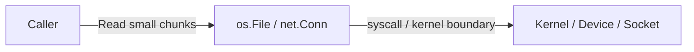
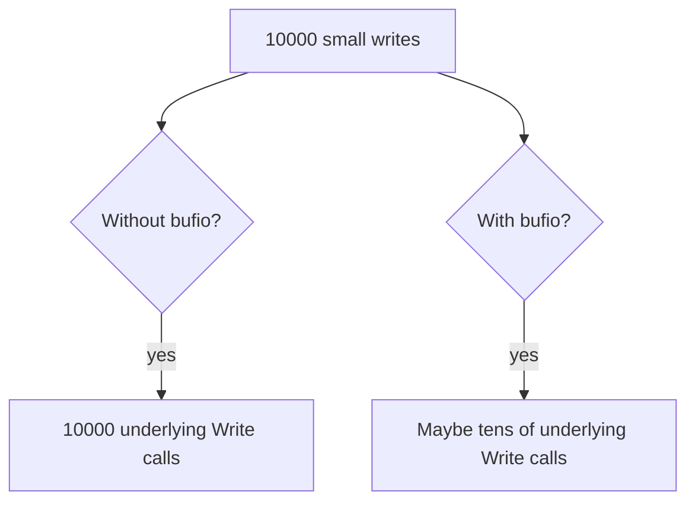
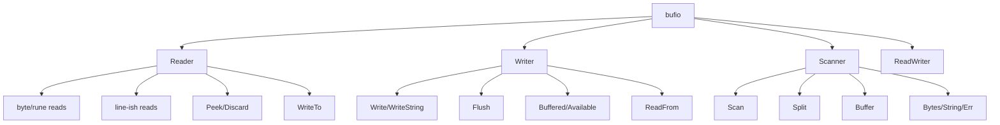
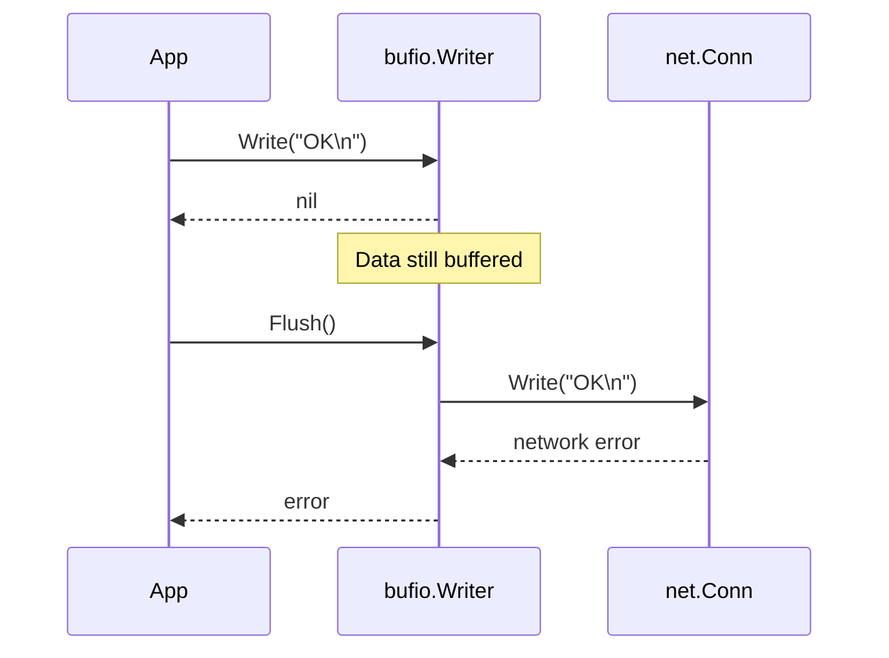
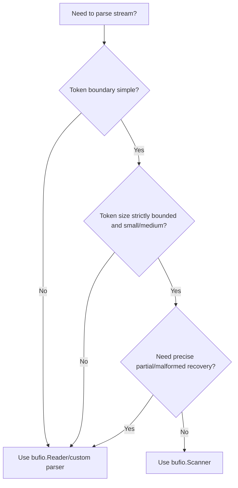
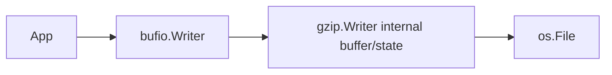

# learn-go-io-buffer-byte-stream-file-network-data-transfer-part-005.md

# Part 005 — `bufio` Deep Dive: Buffered Reader/Writer, Scanner, Tokenization, dan Flush Discipline

> Series: `learn-go-io-buffer-byte-stream-file-network-data-transfer`  
> Target: Go 1.26.x  
> Audience: Java software engineer yang ingin menguasai Go IO sampai level production/internal engineering handbook  
> Prerequisite internal: Part 000–004

---

## 0. Posisi Part Ini dalam Series

Di part sebelumnya kita sudah membangun beberapa fondasi:

- **Part 001**: data movement model — byte, slice, stream, descriptor, file, socket.
- **Part 002**: kontrak inti `io.Reader`, `io.Writer`, `Closer`, `Seeker`, `ReaderAt`, `WriterAt`.
- **Part 003**: advanced `io` composition — `Copy`, `CopyBuffer`, `LimitReader`, `TeeReader`, `Pipe`, dll.
- **Part 004**: buffer fundamentals — `[]byte`, `bytes.Buffer`, `bytes.Reader`, `strings.Reader`, ownership, aliasing.

Part ini fokus pada `bufio`.

`bufio` sering terlihat sederhana: bungkus `Reader`/`Writer`, lalu operasi IO jadi lebih cepat. Itu benar, tetapi tidak cukup. Untuk sistem production, `bufio` harus dilihat sebagai **boundary shaper**:

```text
underlying IO boundary:    file/socket/stdin/stdout/pipe/etc
caller API boundary:       Read/Write/ReadString/Scanner/Flush/etc
buffered boundary:         tempat data ditahan sementara di memory
semantic boundary:         kapan data benar-benar terlihat oleh downstream
failure boundary:          kapan error baru muncul ke caller
```

Dengan kata lain, `bufio` bukan hanya optimasi. `bufio` mengubah:

1. **Jumlah syscall / underlying read-write operation**.
2. **Latency visibility**: data bisa tertahan di buffer sebelum benar-benar keluar.
3. **Error timing**: write error bisa baru terlihat saat `Flush`.
4. **Memory profile**: token besar, line besar, buffer besar bisa menjadi attack/failure vector.
5. **Protocol correctness**: `Peek`, `UnreadByte`, `ReadSlice`, `Flush`, CRLF handling bisa menentukan benar/salahnya parser.
6. **Backpressure behavior**: buffering bisa menyembunyikan lambatnya downstream sampai buffer penuh.

Dokumentasi resmi Go menjelaskan bahwa package `bufio` membungkus `io.Reader` atau `io.Writer` dan menyediakan buffering serta bantuan untuk textual IO. Itu deskripsi yang ringkas, tetapi implikasinya besar untuk engineering sistem nyata.

---

## 1. Tujuan Pembelajaran

Setelah part ini, Anda harus mampu:

1. Menjelaskan kapan buffering meningkatkan throughput, kapan merusak latency, dan kapan menyembunyikan error.
2. Memilih antara:
   - `bufio.Reader`
   - `bufio.Writer`
   - `bufio.Scanner`
   - `ReadString`
   - `ReadSlice`
   - custom loop dengan `Read`
   - `io.Copy` / `io.CopyBuffer`
3. Mendesain line protocol reader yang aman terhadap input besar/malformed.
4. Mendesain writer yang tidak kehilangan data karena lupa `Flush`.
5. Mengerti perbedaan `Scanner` untuk token kecil vs parser manual untuk record besar.
6. Mengerti ownership hasil `ReadSlice`, `Peek`, `Bytes`, dan kapan harus copy.
7. Menghindari bug klasik seperti:
   - lupa `Flush`
   - memakai `Scanner` untuk file arbitrarily large line
   - menyimpan slice dari buffer internal terlalu lama
   - menganggap `Write` ke `bufio.Writer` berarti data sudah sampai ke socket/file
   - double buffering tanpa alasan
   - memproses protocol text tanpa limit
8. Membuat policy buffer sizing yang berbasis measurement, bukan angka magis.

---

## 2. Mental Model Utama: `bufio` sebagai “Holding Area”

Tanpa buffering eksplisit:



Dengan `bufio.Reader`:


Dengan `bufio.Writer`:


Inti konseptualnya:

- `bufio.Reader` **mengambil lebih banyak daripada yang diminta caller**, lalu menyimpan sisanya.
- `bufio.Writer` **menerima lebih cepat daripada underlying writer**, lalu mengirim nanti.
- `bufio.Scanner` **mengubah stream menjadi token**, dengan batas token dan split function.

Ini mirip Java `BufferedInputStream`, `BufferedReader`, dan `BufferedWriter`, tetapi Go punya perbedaan gaya penting:

| Area | Java | Go |
|---|---|---|
| Interface utama | `InputStream`, `Reader`, `OutputStream`, `Writer` | `io.Reader`, `io.Writer` |
| Byte vs char | Banyak API dibedakan byte/char | Umumnya byte stream; UTF-8/text diperlakukan explicit |
| Buffered text line | `BufferedReader.readLine()` | `bufio.Reader.ReadString('\n')`, `ReadSlice`, `Scanner` |
| Scanner | `java.util.Scanner` sering regex-heavy | `bufio.Scanner` token-oriented, simple, bounded |
| Flush | `BufferedWriter.flush()` | `bufio.Writer.Flush()` |
| Error style | exception | explicit `error` return |
| Ownership slice | mostly hidden by objects | explicit: slice bisa menunjuk internal buffer |

Di Java, abstraction sering menyembunyikan buffer ownership. Di Go, beberapa method `bufio` sengaja mengekspos slice yang menunjuk buffer internal untuk efisiensi. Itu kuat, tetapi mudah salah jika mental model-nya belum matang.

---

## 3. Kenapa Buffering Ada?

### 3.1 Mengurangi overhead per operasi

Underlying IO sering mahal relatif terhadap operasi memory lokal.

Contoh:

- `read(2)`/`write(2)` syscall melewati boundary user-space ↔ kernel-space.
- Network write kecil-kecil bisa menyebabkan packetization overhead, TLS framing overhead, atau flush terlalu sering.
- Disk/file write kecil-kecil bisa menambah syscall count dan metadata pressure.
- Terminal/stdout write kecil bisa mahal jika dilakukan per karakter/per field.

Buffering mengubah banyak operasi kecil menjadi sedikit operasi besar.



Tetapi jangan berhenti di “lebih cepat”. Buffering juga mengubah kapan data keluar.

### 3.2 Throughput vs latency

Buffering biasanya meningkatkan throughput dengan menunda pengiriman sampai cukup data terkumpul.

Trade-off:

| Goal | Efek buffering |
|---|---|
| Throughput tinggi | Biasanya membaik karena batching |
| Latency rendah | Bisa memburuk jika data menunggu buffer penuh/flush |
| Error cepat terlihat | Bisa memburuk karena error tertunda sampai flush |
| Memory rendah | Bisa memburuk jika banyak connection masing-masing punya buffer besar |
| Protocol interaktif | Harus flush pada boundary message/prompt |

Contoh buruk:

```go
w := bufio.NewWriter(conn)
fmt.Fprintln(w, "READY")
// lupa Flush
// client menunggu "READY", server menunggu request client -> deadlock aplikasi
```

Untuk protocol request/response interaktif, flush bukan detail kecil. Flush adalah bagian dari correctness.

---

## 4. Peta API `bufio`

Package `bufio` punya tiga bentuk utama:



Ringkasan pilihan:

| Kebutuhan | API yang biasanya cocok |
|---|---|
| Membaca byte demi byte tanpa syscall per byte | `bufio.Reader.ReadByte` |
| Membaca rune UTF-8 | `ReadRune` |
| Peek header/protocol prefix tanpa consume | `Peek` |
| Skip sejumlah byte | `Discard` |
| Membaca line kecil/sedang | `ReadString('\n')` atau `Scanner` |
| Token sederhana ukuran bounded | `Scanner` |
| Token/record arbitrarily large | `Reader.ReadSlice` loop atau custom parser |
| Menulis banyak fragment kecil | `bufio.Writer` |
| Protocol interaktif | `bufio.Writer` + explicit `Flush` pada boundary |
| Gabungan buffered reader/writer | `bufio.ReadWriter` |

---

## 5. `bufio.Reader`: Kontrak dan Cara Berpikir

`bufio.Reader` membungkus `io.Reader` dan menyimpan data di internal buffer. Caller bisa membaca dari buffer itu tanpa selalu memanggil underlying reader.

Contoh dasar:

```go
package main

import (
    "bufio"
    "fmt"
    "os"
)

func main() {
    r := bufio.NewReader(os.Stdin)

    line, err := r.ReadString('\n')
    if err != nil {
        // err bisa io.EOF setelah sebagian data terbaca.
        // Jangan otomatis buang line.
        fmt.Fprintf(os.Stderr, "read: %v\n", err)
    }

    fmt.Printf("got: %q\n", line)
}
```

Hal penting: pada Go IO, data dan error bisa muncul bersama. Misalnya `ReadString('\n')` bisa mengembalikan sebagian data dan `io.EOF`. Production code tidak boleh langsung discard data hanya karena `err != nil`.

### 5.1 `NewReader` vs `NewReaderSize`

```go
r1 := bufio.NewReader(src)
r2 := bufio.NewReaderSize(src, 64*1024)
```

`NewReader` memakai ukuran default. `NewReaderSize` memberi kontrol ukuran buffer.

Jangan membesarkan buffer secara buta. Ukuran buffer adalah trade-off:

| Buffer | Dampak |
|---|---|
| Terlalu kecil | Banyak underlying read, overhead tinggi |
| Terlalu besar | Memory per connection/file reader meningkat |
| Banyak connection | Total memory = buffer size × connection count |
| File sequential besar | Buffer lebih besar kadang membantu, tetapi OS page cache juga bekerja |
| Network latency-bound | Buffer besar belum tentu mempercepat |
| Parser token kecil | Buffer besar mungkin sia-sia |

Rule yang lebih sehat:

```text
Start with default.
Measure syscall count, throughput, latency, memory.
Change buffer size only for workload yang jelas.
```

### 5.2 `Read(p []byte)`

`bufio.Reader.Read` tetap mengikuti kontrak `io.Reader`:

```go
n, err := r.Read(p)
```

Artinya:

- `n` bisa lebih kecil dari `len(p)` tanpa error fatal.
- `n > 0` harus diproses sebelum `err` diputuskan fatal.
- `err == io.EOF` berarti tidak ada data lagi setelah data yang dikembalikan.

`bufio.Reader` bisa mengisi `p` dari internal buffer dulu. Jika buffer kosong, ia bisa membaca dari underlying reader.

Loop canonical:

```go
buf := make([]byte, 32*1024)
for {
    n, err := r.Read(buf)
    if n > 0 {
        process(buf[:n])
    }
    if err != nil {
        if errors.Is(err, io.EOF) {
            break
        }
        return err
    }
}
```

Jangan menulis:

```go
n, err := r.Read(buf)
if err != nil {
    return err // BUG: bisa membuang buf[:n]
}
process(buf[:n])
```

### 5.3 `ReadByte` dan `UnreadByte`

`ReadByte` membaca satu byte dengan efisien karena mengambil dari internal buffer.

```go
b, err := r.ReadByte()
if err != nil {
    return err
}
```

`UnreadByte` mengembalikan byte terakhir yang dibaca agar bisa dibaca ulang. Ini berguna untuk parser sederhana.

```go
b, err := r.ReadByte()
if err != nil {
    return err
}

if b != '{' {
    if err := r.UnreadByte(); err != nil {
        return err
    }
}
```

Tetapi `UnreadByte` bukan stack tak terbatas. Secara mental, treat sebagai “satu langkah mundur” yang valid hanya setelah read operation yang sesuai. Untuk parser kompleks, desain cursor/parser state yang jelas lebih aman.

### 5.4 `ReadRune` dan `UnreadRune`

`ReadRune` membaca UTF-8 rune.

```go
ch, size, err := r.ReadRune()
if err != nil {
    return err
}
fmt.Printf("rune=%q size=%d\n", ch, size)
```

Gunakan saat semantics Anda memang karakter Unicode, bukan byte protocol.

Peringatan:

- Banyak protocol jaringan berbasis byte, bukan rune.
- HTTP, Redis RESP, SMTP, textproto-style protocol punya delimiters byte-level seperti `\r\n`.
- Menggunakan rune parser pada byte protocol bisa memperumit malformed byte handling.

### 5.5 `Peek(n)`

`Peek(n)` melihat `n` byte berikutnya tanpa memajukan reader.

```go
hdr, err := r.Peek(4)
if err != nil {
    return err
}
if string(hdr) == "HTTP" {
    // route as HTTP-ish
}
```

Ini powerful untuk protocol detection, magic number, sniffing, dan parser lookahead.

Tetapi hasil `Peek` menunjuk internal buffer. Jangan simpan lama atau modifikasi.

```go
p, err := r.Peek(8)
if err != nil {
    return err
}

stable := append([]byte(nil), p...) // copy jika perlu disimpan
```

Kesalahan umum:

```go
p, _ := r.Peek(8)
storeForLater(p) // BUG potensial: p menunjuk internal buffer yang bisa berubah
```

### 5.6 `Discard(n)`

`Discard(n)` melewati `n` byte.

```go
if _, err := r.Discard(4); err != nil {
    return err
}
```

Ini berguna setelah `Peek`:

```go
hdr, err := r.Peek(4)
if err != nil {
    return err
}

if !bytes.Equal(hdr, []byte("MAGC")) {
    return fmt.Errorf("invalid magic")
}

if _, err := r.Discard(4); err != nil {
    return err
}
```

### 5.7 `Buffered()` dan `Size()`

`Buffered()` memberi jumlah byte yang sudah ada di internal buffer dan bisa dibaca tanpa underlying read baru.

`Size()` memberi ukuran buffer.

Ini jarang dipakai untuk business logic. Pakai untuk observability/debugging atau parser optimization tertentu, bukan untuk membuat protocol semantics bergantung pada isi buffer.

Anti-pattern:

```go
if r.Buffered() == 0 {
    // menganggap koneksi idle / request selesai
}
```

`Buffered() == 0` hanya berarti buffer internal kosong, bukan berarti socket/file tidak punya data lagi.

---

## 6. Membaca Line: `ReadString`, `ReadBytes`, `ReadSlice`, `ReadLine`

Line-oriented IO terlihat sederhana, tetapi banyak bug production berawal dari line parsing.

### 6.1 `ReadString(delim)`

```go
line, err := r.ReadString('\n')
```

Karakteristik:

- Mengembalikan string sampai delimiter termasuk delimiter.
- Jika EOF terjadi sebelum delimiter, mengembalikan data parsial dan error.
- Mengalokasikan string.
- Cocok untuk line sederhana ukuran wajar.

Pattern aman:

```go
for {
    line, err := r.ReadString('\n')
    if len(line) > 0 {
        handle(line)
    }
    if err != nil {
        if errors.Is(err, io.EOF) {
            break
        }
        return err
    }
}
```

Tetapi untuk untrusted input, `ReadString` tanpa limit bisa buruk. Jika line tidak pernah berisi newline, memory bisa tumbuh sampai OOM.

### 6.2 `ReadBytes(delim)`

Mirip `ReadString`, tetapi mengembalikan `[]byte`.

```go
line, err := r.ReadBytes('\n')
```

Karakteristik:

- Mengalokasikan slice baru.
- Cocok saat downstream byte-oriented.
- Tetap perlu limit untuk untrusted input.

### 6.3 `ReadSlice(delim)`

`ReadSlice` membaca sampai delimiter dan mengembalikan slice yang menunjuk internal buffer.

```go
frag, err := r.ReadSlice('\n')
```

Karakteristik penting:

- Lebih hemat allocation.
- Hasil invalid setelah read berikutnya.
- Jika buffer penuh sebelum delimiter, bisa mengembalikan `ErrBufferFull` dengan fragment parsial.
- Cocok untuk parser manual yang mau mengontrol memory.

Pattern untuk line besar bounded:

```go
func readLineBounded(r *bufio.Reader, max int) ([]byte, error) {
    var out []byte

    for {
        frag, err := r.ReadSlice('\n')
        if len(frag) > 0 {
            if len(out)+len(frag) > max {
                return nil, fmt.Errorf("line too large: limit=%d", max)
            }
            out = append(out, frag...)
        }

        if err == nil {
            return out, nil
        }

        if errors.Is(err, bufio.ErrBufferFull) {
            continue
        }

        if errors.Is(err, io.EOF) {
            if len(out) > 0 {
                return out, io.EOF
            }
            return nil, io.EOF
        }

        return nil, err
    }
}
```

Kenapa tidak langsung `ReadString`? Karena Anda tidak bisa membatasi line sebelum allocation membesar. Untuk input dari jaringan atau user, boundedness adalah safety property.

### 6.4 `ReadLine`

`ReadLine` adalah low-level line reader. Ia bisa mengembalikan prefix jika line terlalu panjang untuk buffer. Banyak code modern lebih mudah memakai `ReadSlice` atau `Scanner` tergantung kebutuhan.

Mental model:

- Untuk line kecil/token kecil: `Scanner` bisa nyaman.
- Untuk line protocol production dengan limit ketat: manual `ReadSlice` loop sering lebih explicit.
- Untuk trusted config kecil: `ReadString`/`Scanner` cukup.

---

## 7. `bufio.Writer`: Kontrak dan Bahaya Terbesarnya

`bufio.Writer` membungkus `io.Writer` dan menahan data sampai:

1. buffer penuh,
2. `Flush()` dipanggil,
3. operasi tertentu memaksa pengiriman,
4. writer di-reset atau program berakhir — tetapi jangan mengandalkan ini.

Contoh dasar:

```go
w := bufio.NewWriter(os.Stdout)

fmt.Fprintln(w, "hello")
fmt.Fprintln(w, "world")

if err := w.Flush(); err != nil {
    return err
}
```

### 7.1 `Write` ke `bufio.Writer` bukan berarti data sudah sampai

```go
n, err := w.Write(payload)
```

Jika `err == nil`, data sudah diterima oleh buffer, bukan pasti sudah sampai ke file/socket.

Error underlying writer bisa baru muncul saat `Flush`.



Kesalahan fatal:

```go
func send(w io.Writer, msg string) error {
    bw := bufio.NewWriter(w)
    fmt.Fprintln(bw, msg)
    return nil // BUG: data mungkin belum dikirim
}
```

Benar:

```go
func send(w io.Writer, msg string) error {
    bw := bufio.NewWriter(w)
    if _, err := fmt.Fprintln(bw, msg); err != nil {
        return err
    }
    return bw.Flush()
}
```

### 7.2 `Flush` adalah bagian dari protocol

Untuk batch file output, flush bisa dilakukan di akhir.

Untuk protocol interaktif, flush harus dilakukan pada boundary message.

Contoh server protocol sederhana:

```go
func handle(conn net.Conn) error {
    defer conn.Close()

    r := bufio.NewReader(conn)
    w := bufio.NewWriter(conn)

    if _, err := w.WriteString("READY\n"); err != nil {
        return err
    }
    if err := w.Flush(); err != nil {
        return err
    }

    for {
        line, err := r.ReadString('\n')
        if len(line) > 0 {
            if _, werr := fmt.Fprintf(w, "ECHO %s", line); werr != nil {
                return werr
            }
            if ferr := w.Flush(); ferr != nil {
                return ferr
            }
        }
        if err != nil {
            if errors.Is(err, io.EOF) {
                return nil
            }
            return err
        }
    }
}
```

`Flush` di sini bukan optimasi. Tanpa `Flush`, client mungkin tidak menerima prompt/response.

### 7.3 `Available`, `Buffered`, `Size`

`Buffered()` memberi jumlah byte yang sedang menunggu flush.

`Available()` memberi sisa kapasitas buffer sebelum perlu flush.

`Size()` memberi ukuran buffer.

Contoh observability:

```go
func writeRecord(w *bufio.Writer, rec []byte) error {
    before := w.Buffered()
    if _, err := w.Write(rec); err != nil {
        return err
    }
    after := w.Buffered()

    _ = before
    _ = after
    return nil
}
```

Jangan membangun correctness berdasarkan `Available()` kecuali Anda sedang menulis encoder yang benar-benar butuh layout buffer detail.

### 7.4 `WriteByte`, `WriteRune`, `WriteString`

API ini membantu menghindari allocation/copy yang tidak perlu.

```go
w.WriteByte('[')
w.WriteString("status")
w.WriteByte(']')
w.WriteByte('\n')
```

Untuk string-heavy output, `WriteString` sering lebih natural daripada convert ke `[]byte`.

Tetapi tetap cek error.

```go
if _, err := w.WriteString("hello\n"); err != nil {
    return err
}
```

### 7.5 `Reset`

`Reset` membuat writer menggunakan underlying writer baru dan membuang buffered data yang belum di-flush.

Ini berbahaya jika dipakai tanpa discipline.

```go
bw.Reset(newWriter) // buffered data lama hilang jika belum Flush
```

Safe pattern:

```go
if err := bw.Flush(); err != nil {
    return err
}
bw.Reset(next)
```

---

## 8. Flush Discipline: Aturan Production

Flush discipline adalah kebiasaan desain untuk menentukan **kapan data harus benar-benar keluar dari buffer** dan **bagaimana error flush ditangani**.

### 8.1 Rule 1 — Setiap fungsi yang membuat `bufio.Writer` harus bertanggung jawab flush

Buruk:

```go
func writeReport(dst io.Writer, rows []Row) error {
    w := bufio.NewWriter(dst)
    for _, row := range rows {
        fmt.Fprintln(w, row)
    }
    return nil // BUG
}
```

Baik:

```go
func writeReport(dst io.Writer, rows []Row) error {
    w := bufio.NewWriter(dst)
    for _, row := range rows {
        if _, err := fmt.Fprintln(w, row); err != nil {
            return err
        }
    }
    return w.Flush()
}
```

### 8.2 Rule 2 — Jangan hanya `defer Flush()` jika error perlu dikembalikan

Buruk:

```go
func writeReport(dst io.Writer, rows []Row) error {
    w := bufio.NewWriter(dst)
    defer w.Flush() // error ignored

    for _, row := range rows {
        if _, err := fmt.Fprintln(w, row); err != nil {
            return err
        }
    }
    return nil
}
```

Lebih baik:

```go
func writeReport(dst io.Writer, rows []Row) (err error) {
    w := bufio.NewWriter(dst)
    defer func() {
        if ferr := w.Flush(); err == nil && ferr != nil {
            err = ferr
        }
    }()

    for _, row := range rows {
        if _, err := fmt.Fprintln(w, row); err != nil {
            return err
        }
    }
    return nil
}
```

Tetapi untuk code sederhana, explicit `return w.Flush()` di akhir sering lebih jelas.

### 8.3 Rule 3 — Flush pada message boundary, bukan sembarang titik

Untuk file batch:

```text
write many rows -> flush once at end
```

Untuk network protocol:

```text
write complete response -> flush -> wait next request
```

Untuk terminal prompt:

```text
write prompt -> flush -> read stdin
```

Contoh prompt:

```go
func ask(r io.Reader, out io.Writer, prompt string) (string, error) {
    br := bufio.NewReader(r)
    bw := bufio.NewWriter(out)

    if _, err := bw.WriteString(prompt); err != nil {
        return "", err
    }
    if err := bw.Flush(); err != nil {
        return "", err
    }

    line, err := br.ReadString('\n')
    if err != nil && !errors.Is(err, io.EOF) {
        return "", err
    }
    return strings.TrimRight(line, "\r\n"), nil
}
```

### 8.4 Rule 4 — Jangan menganggap `Close` akan flush `bufio.Writer`

`bufio.Writer` tidak memiliki `Close`. Jika underlying writer adalah file/conn, menutup underlying object tidak menggantikan kewajiban flush buffered writer.

Salah:

```go
f, _ := os.Create("out.txt")
w := bufio.NewWriter(f)
w.WriteString("hello")
f.Close() // data di bufio.Writer bisa belum pernah ditulis ke file
```

Benar:

```go
f, err := os.Create("out.txt")
if err != nil {
    return err
}
defer f.Close()

w := bufio.NewWriter(f)
if _, err := w.WriteString("hello"); err != nil {
    return err
}
if err := w.Flush(); err != nil {
    return err
}
if err := f.Close(); err != nil {
    return err
}
```

Nanti pada part durable writes, kita akan membahas bahwa `Flush` ke `os.File` juga belum sama dengan durable-on-disk. Untuk durability, perlu disk/fsync semantics. Di sini cukup pahami levelnya:

```text
bufio.Flush -> data diserahkan ke underlying writer
file.Sync   -> data diminta durable ke storage layer
Close       -> release resource, bisa juga melaporkan error tertentu
```

---

## 9. `bufio.Scanner`: Kapan Nyaman, Kapan Berbahaya

`Scanner` adalah tool untuk membaca token dari stream.

Contoh line scanner:

```go
scanner := bufio.NewScanner(file)
for scanner.Scan() {
    line := scanner.Text()
    handle(line)
}
if err := scanner.Err(); err != nil {
    return err
}
```

Default split function adalah `ScanLines`.

Scanner cocok untuk:

- file konfigurasi kecil/sedang,
- input CLI token sederhana,
- line kecil yang bounded,
- log line ukuran reasonable,
- CSV-like sederhana jika bukan CSV penuh,
- tests/golden file sederhana.

Scanner tidak cocok untuk:

- record arbitrarily large,
- file/protocol dengan line bisa MB/GB,
- binary protocol kompleks,
- parser yang perlu recovery detail,
- stream yang harus membedakan EOF parsial dengan malformed record secara kaya,
- high-performance parser yang ingin mengontrol allocation penuh.

### 9.1 Default token limit

`Scanner` punya batas ukuran token default. Jika token terlalu besar, scanning berhenti dengan error. Ini bagus sebagai safety default, tetapi bisa mengejutkan jika Anda membaca file dengan line besar.

Untuk menaikkan limit:

```go
scanner := bufio.NewScanner(r)
buf := make([]byte, 0, 64*1024)
scanner.Buffer(buf, 10*1024*1024) // max token 10 MiB
```

Tetapi menaikkan limit bukan selalu jawaban. Untuk untrusted input, menaikkan limit berarti menaikkan potensi memory usage per scanner.

Lebih baik bertanya:

```text
Apakah token 10 MiB valid secara domain?
Apakah kita ingin reject token lebih besar?
Apakah parser harus streaming record besar tanpa menampung seluruh token?
Berapa concurrent scanner maksimum?
Apakah attacker bisa membuka banyak connection?
```

### 9.2 `Text()` vs `Bytes()`

```go
line := scanner.Text()  // string
b := scanner.Bytes()    // []byte
```

`Text()` memberi string. `Bytes()` memberi slice yang valid hanya sampai `Scan` berikutnya.

Jika perlu menyimpan hasil `Bytes()`:

```go
tok := append([]byte(nil), scanner.Bytes()...)
store(tok)
```

Jangan:

```go
store(scanner.Bytes()) // BUG potensial jika store menyimpan reference
```

### 9.3 Custom split function

Scanner bisa memakai split function custom.

Signature:

```go
type SplitFunc func(data []byte, atEOF bool) (advance int, token []byte, err error)
```

Makna return:

- `advance`: berapa byte dikonsumsi dari buffer.
- `token`: token yang dikembalikan ke caller; nil berarti butuh data lagi.
- `err`: error scanning.

Contoh split comma sederhana:

```go
func ScanComma(data []byte, atEOF bool) (advance int, token []byte, err error) {
    if i := bytes.IndexByte(data, ','); i >= 0 {
        return i + 1, data[:i], nil
    }
    if atEOF && len(data) > 0 {
        return len(data), data, nil
    }
    return 0, nil, nil
}
```

Pemakaian:

```go
scanner := bufio.NewScanner(r)
scanner.Split(ScanComma)

for scanner.Scan() {
    fmt.Printf("token=%q\n", scanner.Text())
}
if err := scanner.Err(); err != nil {
    return err
}
```

Bahaya custom split:

1. Return `advance == 0`, `token != nil` berkali-kali bisa membuat behavior buruk.
2. Tidak consume data saat sudah ada error condition.
3. Tidak handle `atEOF`.
4. Tidak membatasi token.
5. Mengembalikan token yang semantics-nya ambigu terhadap delimiter.

### 9.4 Custom split dengan limit domain

Walaupun scanner punya max token, split function tetap sebaiknya punya domain rules.

```go
func ScanUntilPipe(max int) bufio.SplitFunc {
    return func(data []byte, atEOF bool) (advance int, token []byte, err error) {
        if len(data) > max {
            return 0, nil, fmt.Errorf("token exceeds max size %d", max)
        }

        if i := bytes.IndexByte(data, '|'); i >= 0 {
            return i + 1, data[:i], nil
        }

        if atEOF {
            if len(data) == 0 {
                return 0, nil, nil
            }
            return len(data), data, nil
        }

        return 0, nil, nil
    }
}
```

Catatan: karena scanner juga punya buffer max, set `scanner.Buffer` konsisten dengan domain `max`.

---

## 10. `Scanner` vs `Reader`: Decision Framework

Gunakan pertanyaan ini.



Tabel praktis:

| Situasi | Pilihan |
|---|---|
| CLI input per line | `Scanner` atau `ReadString` |
| Config file line kecil | `Scanner` |
| Log file line bounded | `Scanner` dengan `Buffer` limit eksplisit |
| HTTP-like header lines | `Reader` + line limit; atau package protocol khusus |
| Redis-like protocol | `Reader` + parser byte/line manual |
| Large JSONL dengan line bisa besar | `Reader.ReadSlice` loop dengan limit; atau streaming JSON decoder per record |
| Binary length-prefixed protocol | `Reader` + `io.ReadFull` |
| Need no-copy token transient | `ReadSlice`/`Peek` hati-hati |

Scanner sangat nyaman, tetapi production systems sering butuh lebih banyak kontrol.

---

## 11. Bounded Text Reader: Pattern Aman untuk Protocol Line

Banyak protocol punya line delimiter:

- SMTP-style commands
- Redis RESP simple strings/errors
- custom admin socket
- CLI protocol
- text gateway
- CSV-ish ingestion
- log ingestion

Masalah: attacker bisa kirim line tanpa newline.

Pattern aman:

```go
var ErrLineTooLong = errors.New("line too long")

func ReadLineLimited(r *bufio.Reader, limit int) ([]byte, error) {
    if limit <= 0 {
        return nil, fmt.Errorf("invalid limit: %d", limit)
    }

    var line []byte
    for {
        frag, err := r.ReadSlice('\n')
        if len(frag) > 0 {
            if len(line)+len(frag) > limit {
                return nil, ErrLineTooLong
            }
            line = append(line, frag...)
        }

        switch {
        case err == nil:
            return line, nil
        case errors.Is(err, bufio.ErrBufferFull):
            continue
        case errors.Is(err, io.EOF):
            if len(line) > 0 {
                return line, io.EOF
            }
            return nil, io.EOF
        default:
            return nil, err
        }
    }
}
```

Kemudian normalisasi CRLF:

```go
func TrimLineEnding(line []byte) []byte {
    line = bytes.TrimSuffix(line, []byte("\n"))
    line = bytes.TrimSuffix(line, []byte("\r"))
    return line
}
```

Penting: Jangan `strings.TrimSpace` untuk protocol line kecuali semantics-nya memang membuang semua whitespace. `TrimSpace` bisa menghapus spasi/tab yang valid sebagai payload.

---

## 12. Buffered IO pada Network Protocol

Network protocol punya karakteristik yang membuat `bufio` sering berguna:

- data datang fragmentary,
- caller ingin membaca token/line/frame,
- syscall per byte mahal,
- perlu lookahead,
- response sering terdiri dari banyak fragment kecil.

Skeleton server:

```go
func serveConn(conn net.Conn) error {
    defer conn.Close()

    r := bufio.NewReaderSize(conn, 32*1024)
    w := bufio.NewWriterSize(conn, 32*1024)

    for {
        if err := conn.SetReadDeadline(time.Now().Add(30 * time.Second)); err != nil {
            return err
        }

        line, err := ReadLineLimited(r, 8*1024)
        if len(line) > 0 {
            resp, handleErr := handleCommand(TrimLineEnding(line))
            if handleErr != nil {
                resp = []byte("ERR " + handleErr.Error() + "\n")
            }

            if err := conn.SetWriteDeadline(time.Now().Add(10 * time.Second)); err != nil {
                return err
            }
            if _, werr := w.Write(resp); werr != nil {
                return werr
            }
            if ferr := w.Flush(); ferr != nil {
                return ferr
            }
        }

        if err != nil {
            if errors.Is(err, io.EOF) {
                return nil
            }
            return err
        }
    }
}
```

Ada beberapa hal sengaja terlihat di sini:

1. `bufio.Reader` untuk parsing line.
2. `bufio.Writer` untuk response fragment/batching.
3. Read deadline dan write deadline tetap di `net.Conn`, bukan di `bufio`.
4. Limit line eksplisit.
5. Flush setelah response complete.
6. `len(line) > 0` diproses bahkan jika `err == io.EOF`.

### 12.1 Deadline dan buffer internal

Jika `bufio.Reader` sudah memiliki data di buffer, read dari buffer bisa sukses tanpa menyentuh `net.Conn`, sehingga deadline underlying tidak relevan untuk byte yang sudah buffered.

Ini biasanya baik, tetapi penting untuk mental model observability:

```text
SetReadDeadline membatasi underlying network read,
bukan konsumsi data yang sudah berada di bufio.Reader buffer.
```

### 12.2 Buffering bisa menyembunyikan backpressure

`bufio.Writer.Write` bisa sukses walaupun client lambat karena data baru masuk ke memory buffer. Backpressure baru terlihat ketika:

- buffer penuh dan harus write ke conn,
- `Flush` dipanggil,
- underlying conn write block/error.

Karena itu server protocol yang ingin fairness harus flush pada boundary dan punya write deadline.

---

## 13. Buffered IO pada File Processing

File sequential processing sering menggunakan buffering, tetapi OS juga sudah punya page cache. Jadi `bufio` bukan selalu otomatis meningkatkan performa besar.

### 13.1 Banyak write kecil ke file

Cocok memakai `bufio.Writer`:

```go
func writeLines(path string, lines []string) error {
    f, err := os.Create(path)
    if err != nil {
        return err
    }
    defer f.Close()

    w := bufio.NewWriterSize(f, 128*1024)
    for _, line := range lines {
        if _, err := w.WriteString(line); err != nil {
            return err
        }
        if err := w.WriteByte('\n'); err != nil {
            return err
        }
    }
    if err := w.Flush(); err != nil {
        return err
    }
    return f.Close()
}
```

Catatan: `f.Close()` dipanggil explicit agar error close bisa tertangkap. Jika juga memakai `defer`, perlu hati-hati agar tidak double close tanpa sengaja. Di code production, biasanya dibuat helper yang menangani close error dengan jelas.

### 13.2 Membaca file line-by-line

Untuk file trusted kecil:

```go
scanner := bufio.NewScanner(f)
for scanner.Scan() {
    handle(scanner.Text())
}
if err := scanner.Err(); err != nil {
    return err
}
```

Untuk file ingestion eksternal:

```go
scanner := bufio.NewScanner(f)
scanner.Buffer(make([]byte, 0, 64*1024), 4*1024*1024)

for scanner.Scan() {
    line := scanner.Bytes()
    if err := handleLine(line); err != nil {
        return err
    }
}
if err := scanner.Err(); err != nil {
    return err
}
```

Untuk line yang bisa sangat besar atau perlu precise control, pakai `ReadLineLimited` atau parser chunked.

---

## 14. Double Buffering: Kapan Normal, Kapan Sia-sia

Double buffering terjadi saat beberapa layer sama-sama punya buffer.

Contoh:

```go
bw := bufio.NewWriter(gzip.NewWriter(file)) // salah urutan? tergantung goal
```

atau:

```go
gz := gzip.NewWriter(bufio.NewWriter(file))
```

Nanti compression dibahas lebih dalam, tapi mental model-nya:



Banyak standard library encoder/compressor sudah buffering/stateful. Menambah `bufio` bisa tetap berguna jika app menulis fragment sangat kecil, tetapi bisa juga tidak ada manfaat besar.

Pertanyaan desain:

1. Layer mana yang menerima banyak write kecil?
2. Layer mana yang sudah batching?
3. Layer mana yang perlu flush untuk protocol semantic?
4. Apakah flush outer layer juga flush inner layer?
5. Apakah close/finish compressor sudah dipanggil?
6. Di mana error final muncul?

Contoh prinsip:

- Untuk `gzip.Writer`, Anda harus `Close` gzip writer agar trailer ditulis.
- Untuk `bufio.Writer`, Anda harus `Flush` agar buffered byte keluar.
- Urutan finalisasi matters.

Generic shape:

```go
bw := bufio.NewWriter(file)
gz := gzip.NewWriter(bw)

// write to gz

if err := gz.Close(); err != nil { // finish gzip stream into bw
    return err
}
if err := bw.Flush(); err != nil { // flush compressed bytes to file
    return err
}
```

---

## 15. Interaction dengan `io.Copy`

`io.Copy` memiliki optimasi: jika source mengimplementasikan `WriterTo`, atau destination mengimplementasikan `ReaderFrom`, implementasi khusus bisa dipakai.

`bufio.Reader` dan `bufio.Writer` punya method yang bisa berinteraksi dengan mekanisme ini.

Praktisnya:

- Jangan otomatis membungkus semua `io.Copy` dengan `bufio`.
- Untuk copy file/socket besar, `io.Copy` bisa sudah optimal tergantung underlying type.
- `bufio` berguna saat Anda melakukan banyak operasi kecil atau perlu API parsing/writing textual.
- Jika Anda sudah memakai `io.CopyBuffer`, buffer external bisa cukup.

Contoh yang sering tidak perlu:

```go
r := bufio.NewReader(src)
w := bufio.NewWriter(dst)
_, err := io.Copy(w, r)
if err != nil {
    return err
}
return w.Flush()
```

Ini tidak selalu salah, tetapi belum tentu lebih cepat dari:

```go
_, err := io.Copy(dst, src)
return err
```

Untuk large transfer, benchmark dengan workload nyata.

---

## 16. Error Model Detail

### 16.1 Reader error

Pada read path, selalu proses `n > 0` atau data returned sebelum handling error final.

Untuk `ReadString`:

```go
line, err := r.ReadString('\n')
if len(line) > 0 {
    process(line)
}
if err != nil {
    // EOF/error setelah partial data
}
```

Untuk `Scanner`, model-nya berbeda: token hanya tersedia saat `Scan()` true; error dicek setelah loop.

```go
for scanner.Scan() {
    process(scanner.Bytes())
}
if err := scanner.Err(); err != nil {
    return err
}
```

Scanner menyederhanakan loop, tetapi juga menyembunyikan beberapa detail partial read.

### 16.2 Writer error

Pada write path, error bisa muncul saat:

1. `Write` ke buffer jika input terlalu besar dan underlying write dipicu.
2. `Flush`.
3. Underlying `Close`.
4. Encoder/compressor `Close`.

Production finalization sering punya beberapa tahap:

```go
if err := encoder.Close(); err != nil {
    return err
}
if err := buffered.Flush(); err != nil {
    return err
}
if err := file.Sync(); err != nil {
    return err
}
if err := file.Close(); err != nil {
    return err
}
```

Tidak semua use case perlu `Sync`, tetapi write pipeline harus tahu di mana boundary-nya.

---

## 17. Security Lens: Boundedness dan Injection Surface

Buffered text IO sering menjadi pintu masuk untrusted input. Risiko utama:

| Risiko | Contoh | Mitigasi |
|---|---|---|
| Unbounded line | client kirim 10GB tanpa newline | line/token limit |
| Slowloris | client kirim 1 byte per menit | read deadline |
| Memory amplification | banyak conn × buffer besar | buffer size policy, conn limit |
| Protocol smuggling | CRLF handling salah | strict delimiter parser |
| Truncation confusion | EOF dengan partial data | explicit partial policy |
| Hidden write failure | lupa flush | flush discipline |
| Log injection | line ending di payload | sanitize/escape saat log |

### 17.1 Jangan parse untrusted line tanpa limit

Buruk:

```go
line, err := r.ReadString('\n')
```

Lebih baik:

```go
line, err := ReadLineLimited(r, 8*1024)
```

### 17.2 Jangan pakai `Scanner` limit besar tanpa concurrency budget

Jika max token 10 MiB dan concurrent connection 10.000, theoretical memory pressure bisa besar.

```text
10 MiB × 10.000 = 100 GiB potential pressure
```

Tentu tidak semua scanner langsung memakai maksimum, tetapi threat model harus dihitung.

### 17.3 CRLF strictness

Untuk protocol yang mensyaratkan CRLF, jangan menerima semua variasi secara diam-diam jika itu membuka ambiguity.

```go
func trimCRLF(line []byte) ([]byte, error) {
    if !bytes.HasSuffix(line, []byte("\r\n")) {
        return nil, fmt.Errorf("line must end with CRLF")
    }
    return line[:len(line)-2], nil
}
```

Untuk CLI lokal, `\n` dan `\r\n` fleksibel mungkin OK. Untuk network protocol, strictness sering lebih aman.

---

## 18. Performance Lens

### 18.1 Apa yang harus diukur?

Untuk buffered IO, ukur minimal:

1. throughput bytes/sec,
2. latency per message,
3. syscall count,
4. allocations/op,
5. bytes allocated/op,
6. max RSS / heap live,
7. p99 write flush duration,
8. number of blocked goroutines,
9. file descriptor count,
10. error rate pada timeout/flush.

### 18.2 Benchmark sederhana buffer size

```go
func BenchmarkWriteBuffered(b *testing.B) {
    payload := []byte("hello,world\n")

    for _, size := range []int{4096, 16 * 1024, 64 * 1024, 256 * 1024} {
        b.Run(fmt.Sprintf("size=%d", size), func(b *testing.B) {
            for i := 0; i < b.N; i++ {
                var dst bytes.Buffer
                w := bufio.NewWriterSize(&dst, size)
                for j := 0; j < 10000; j++ {
                    if _, err := w.Write(payload); err != nil {
                        b.Fatal(err)
                    }
                }
                if err := w.Flush(); err != nil {
                    b.Fatal(err)
                }
            }
        })
    }
}
```

Tetapi benchmark dengan `bytes.Buffer` tidak mengukur syscall. Untuk file/socket, buat benchmark/integration yang sesuai.

### 18.3 Allocation traps

`Scanner.Text()` membuat string. Jika Anda hanya butuh transient bytes, `Scanner.Bytes()` bisa mengurangi allocation. Tetapi jangan simpan bytes tanpa copy.

`ReadString` mengembalikan string dan bisa allocate.

`ReadBytes` mengembalikan slice baru.

`ReadSlice` bisa no-copy tetapi lifetime pendek.

Ringkasan:

| API | Allocation tendency | Lifetime result |
|---|---:|---|
| `Scanner.Text()` | string allocation | stable string |
| `Scanner.Bytes()` | lower | valid until next Scan |
| `ReadString` | string allocation | stable string |
| `ReadBytes` | byte allocation | stable slice |
| `ReadSlice` | low/no allocation | invalid after next read |
| `Peek` | low/no allocation | invalid after next read |

---

## 19. Observability: Apa yang Perlu Dilihat dari Buffered IO

Buffered IO bisa menyembunyikan masalah. Tambahkan observability pada boundary yang benar.

### 19.1 Metrics yang berguna

Untuk reader:

- bytes read dari underlying source,
- records/tokens parsed,
- malformed record count,
- line too long count,
- EOF partial count,
- read timeout count,
- parse duration.

Untuk writer:

- bytes accepted by buffer,
- flush count,
- flush error count,
- flush latency histogram,
- buffered bytes before flush,
- short write/error count.

Untuk scanner:

- tokens processed,
- scanner error count,
- token too long count,
- max observed token length.

### 19.2 Logging

Jangan log payload mentah tanpa limit.

Buruk:

```go
log.Printf("bad line: %s", line)
```

Lebih aman:

```go
func safePreview(b []byte, max int) string {
    if len(b) > max {
        b = b[:max]
    }
    return strconv.QuoteToASCII(string(b))
}

log.Printf("bad line len=%d preview=%s", len(line), safePreview(line, 256))
```

---

## 20. Testing Patterns untuk `bufio`

Karena `bufio` bekerja di atas `io.Reader`/`io.Writer`, testing bisa sangat enak.

### 20.1 Test reader dengan `strings.Reader`

```go
func TestReadLineLimited(t *testing.T) {
    r := bufio.NewReader(strings.NewReader("hello\nworld\n"))

    line, err := ReadLineLimited(r, 100)
    if err != nil {
        t.Fatal(err)
    }
    if got := string(line); got != "hello\n" {
        t.Fatalf("got %q", got)
    }
}
```

### 20.2 Test line too long

```go
func TestReadLineLimitedTooLong(t *testing.T) {
    r := bufio.NewReaderSize(strings.NewReader("abcdef\n"), 2)

    _, err := ReadLineLimited(r, 3)
    if !errors.Is(err, ErrLineTooLong) {
        t.Fatalf("expected ErrLineTooLong, got %v", err)
    }
}
```

### 20.3 Test flush required

```go
func TestWriterNeedsFlush(t *testing.T) {
    var dst bytes.Buffer
    w := bufio.NewWriter(&dst)

    if _, err := w.WriteString("hello"); err != nil {
        t.Fatal(err)
    }
    if dst.Len() != 0 {
        t.Fatalf("expected underlying buffer empty before flush")
    }

    if err := w.Flush(); err != nil {
        t.Fatal(err)
    }
    if dst.String() != "hello" {
        t.Fatalf("got %q", dst.String())
    }
}
```

### 20.4 Fault-injection writer

```go
type failWriter struct {
    failAfter int
    written   int
}

func (w *failWriter) Write(p []byte) (int, error) {
    if w.written >= w.failAfter {
        return 0, errors.New("injected write failure")
    }
    n := len(p)
    if w.written+n > w.failAfter {
        n = w.failAfter - w.written
    }
    w.written += n
    if n < len(p) {
        return n, errors.New("injected partial write")
    }
    return n, nil
}
```

Gunakan untuk memastikan `Flush` error tidak hilang.

---

## 21. Common Anti-Patterns

### 21.1 Lupa `Flush`

```go
w := bufio.NewWriter(conn)
w.WriteString("OK\n")
return nil
```

Dampak:

- client tidak menerima response,
- file output kosong/terpotong,
- error underlying tidak terlihat.

### 21.2 Mengabaikan error `Flush`

```go
defer w.Flush()
```

Dampak:

- write failure hilang,
- caller mengira operasi sukses.

### 21.3 Pakai `Scanner` untuk data tidak bounded

```go
scanner := bufio.NewScanner(conn)
for scanner.Scan() { ... }
```

Tanpa limit domain, deadline, dan error handling yang sesuai, ini bisa menjadi DoS vector atau gagal pada token besar.

### 21.4 Menyimpan slice internal

```go
line, _ := r.ReadSlice('\n')
cache = append(cache, line) // BUG: line menunjuk internal buffer
```

Benar:

```go
stable := append([]byte(nil), line...)
cache = append(cache, stable)
```

### 21.5 Menggunakan `TrimSpace` untuk protocol

```go
cmd := strings.TrimSpace(line)
```

Ini bisa menghapus whitespace payload yang valid. Untuk protocol, trim delimiter secara eksplisit.

### 21.6 Double buffering tanpa measurement

```go
io.Copy(bufio.NewWriter(dst), bufio.NewReader(src))
```

Belum tentu salah, tetapi jangan diasumsikan optimal.

### 21.7 Buffer size sangat besar per connection

```go
r := bufio.NewReaderSize(conn, 4*1024*1024)
w := bufio.NewWriterSize(conn, 4*1024*1024)
```

Jika ada 10.000 connection, desain ini tidak realistis.

---

## 22. Design Recipes

### 22.1 Recipe: Safe command protocol reader

```go
type CommandReader struct {
    r     *bufio.Reader
    limit int
}

func NewCommandReader(src io.Reader, bufferSize, lineLimit int) *CommandReader {
    return &CommandReader{
        r:     bufio.NewReaderSize(src, bufferSize),
        limit: lineLimit,
    }
}

func (cr *CommandReader) ReadCommand() ([]byte, error) {
    line, err := ReadLineLimited(cr.r, cr.limit)
    if len(line) > 0 {
        line = TrimLineEnding(line)
    }
    if err != nil {
        if len(line) > 0 && errors.Is(err, io.EOF) {
            // Domain decision: partial command without newline rejected.
            return nil, fmt.Errorf("partial command at EOF")
        }
        return nil, err
    }
    return line, nil
}
```

### 22.2 Recipe: Safe response writer

```go
type ResponseWriter struct {
    w *bufio.Writer
}

func NewResponseWriter(dst io.Writer, bufferSize int) *ResponseWriter {
    return &ResponseWriter{w: bufio.NewWriterSize(dst, bufferSize)}
}

func (rw *ResponseWriter) WriteResponse(status string, payload []byte) error {
    if _, err := rw.w.WriteString(status); err != nil {
        return err
    }
    if err := rw.w.WriteByte(' '); err != nil {
        return err
    }
    if _, err := rw.w.Write(payload); err != nil {
        return err
    }
    if err := rw.w.WriteByte('\n'); err != nil {
        return err
    }
    return rw.w.Flush()
}
```

### 22.3 Recipe: Scanner for bounded config

```go
func ReadConfigLines(r io.Reader, maxLine int) ([]string, error) {
    scanner := bufio.NewScanner(r)
    scanner.Buffer(make([]byte, 0, 4*1024), maxLine)

    var lines []string
    for scanner.Scan() {
        line := scanner.Text()
        if strings.HasPrefix(line, "#") || strings.TrimSpace(line) == "" {
            continue
        }
        lines = append(lines, line)
    }
    if err := scanner.Err(); err != nil {
        return nil, err
    }
    return lines, nil
}
```

Untuk config, `TrimSpace` mungkin valid. Untuk protocol, belum tentu.

---

## 23. Case Study: Why a Server “Randomly Hangs”

Gejala:

- Server menerima TCP connection.
- Server menulis `READY\n`.
- Client menunggu `READY\n` sebelum mengirim request.
- Server menunggu request.
- Dua-duanya hang.

Kode server:

```go
func handle(conn net.Conn) error {
    r := bufio.NewReader(conn)
    w := bufio.NewWriter(conn)

    fmt.Fprintln(w, "READY") // no Flush

    req, err := r.ReadString('\n')
    if err != nil {
        return err
    }
    _ = req
    return nil
}
```

Root cause:

```text
READY hanya masuk ke bufio.Writer internal buffer.
Client tidak menerima READY.
Client tidak mengirim request.
Server menunggu request.
```

Fix:

```go
if _, err := fmt.Fprintln(w, "READY"); err != nil {
    return err
}
if err := w.Flush(); err != nil {
    return err
}
```

Postmortem lesson:

- Buffered writer mengubah visibility boundary.
- Dalam protocol interaktif, flush adalah correctness.
- Integration test perlu mensimulasikan client-server handshake.

---

## 24. Case Study: Scanner Fails on Production Data

Gejala:

- Local test dengan sample kecil sukses.
- Production ingestion berhenti di file tertentu.
- Error: token too long / scanner error.

Kode:

```go
scanner := bufio.NewScanner(file)
for scanner.Scan() {
    process(scanner.Text())
}
return scanner.Err()
```

Root cause:

- Default scanner token limit tidak sesuai dengan data production.
- Format data ternyata punya record panjang.

Kemungkinan fix:

### Fix A — Jika record panjang valid tetapi bounded

```go
scanner := bufio.NewScanner(file)
scanner.Buffer(make([]byte, 0, 64*1024), 8*1024*1024)
```

### Fix B — Jika record panjang harus ditolak dengan error domain jelas

```go
scanner := bufio.NewScanner(file)
scanner.Buffer(make([]byte, 0, 64*1024), 256*1024)
```

Lalu error dibungkus:

```go
if err := scanner.Err(); err != nil {
    return fmt.Errorf("read input line: %w", err)
}
```

### Fix C — Jika record bisa sangat besar dan perlu streaming

Jangan pakai scanner; desain parser streaming/chunked.

Postmortem lesson:

```text
Scanner is a tokenizer, not an arbitrary large record ingestion engine.
```

---

## 25. Engineering Checklist

Sebelum memakai `bufio.Reader`:

- [ ] Apakah input trusted atau untrusted?
- [ ] Apakah token/line punya max size?
- [ ] Apakah perlu deadline/cancellation?
- [ ] Apakah hasil `Peek`/`ReadSlice` akan disimpan?
- [ ] Apakah parser perlu byte-level atau rune-level?
- [ ] Apakah EOF dengan partial data valid atau error?
- [ ] Apakah delimiter harus `\n`, `\r\n`, atau binary marker?

Sebelum memakai `bufio.Writer`:

- [ ] Siapa yang bertanggung jawab memanggil `Flush`?
- [ ] Kapan flush dilakukan?
- [ ] Apakah flush error dikembalikan?
- [ ] Apakah underlying writer juga perlu `Close`/`Sync`?
- [ ] Apakah response protocol perlu flush per message?
- [ ] Apakah buffer size realistis untuk concurrency?
- [ ] Apakah ada encoder/compressor layer yang juga harus ditutup?

Sebelum memakai `bufio.Scanner`:

- [ ] Apakah token boundary sederhana?
- [ ] Apakah token max size eksplisit?
- [ ] Apakah default split function sesuai?
- [ ] Apakah `Text()` vs `Bytes()` dipilih sadar?
- [ ] Apakah hasil `Bytes()` tidak disimpan tanpa copy?
- [ ] Apakah error `scanner.Err()` dicek?
- [ ] Apakah scanner cocok untuk data production, bukan hanya sample?

---

## 26. Latihan

### Latihan 1 — Safe line reader

Implementasikan:

```go
func ReadCRLFLine(r *bufio.Reader, max int) ([]byte, error)
```

Requirement:

1. Menerima hanya line yang berakhir `\r\n`.
2. Mengembalikan payload tanpa `\r\n`.
3. Reject jika line melebihi `max`.
4. Jika EOF dengan partial line, return error domain `ErrPartialLine`.
5. Jangan memakai `ReadString` tanpa limit.

### Latihan 2 — Prompt writer

Implementasikan:

```go
func Prompt(in io.Reader, out io.Writer, question string) (string, error)
```

Requirement:

1. Tulis question ke `out`.
2. Flush sebelum baca input.
3. Baca satu line dari `in`.
4. Trim hanya line ending.
5. Return error flush jika prompt gagal dikirim.

### Latihan 3 — Scanner custom split

Buat split function untuk token format:

```text
token;token;token;
```

Requirement:

1. Delimiter `;`.
2. Token kosong invalid.
3. Token max 1024 byte.
4. EOF tanpa delimiter terakhir dianggap error.

### Latihan 4 — Flush failure test

Buat `io.Writer` palsu yang gagal setelah N byte. Test bahwa fungsi Anda mengembalikan error dari `Flush`, bukan menghilangkannya.

### Latihan 5 — Buffer size benchmark

Benchmark output 1 juta line pendek dengan:

1. tanpa `bufio.Writer`,
2. `bufio.NewWriter`,
3. `bufio.NewWriterSize` 64 KiB,
4. `bufio.NewWriterSize` 256 KiB.

Bandingkan:

- ns/op,
- B/op,
- allocs/op,
- output correctness.

---

## 27. Summary Mental Model

`bufio` adalah package kecil dengan konsekuensi besar.

Formula mental:

```text
bufio.Reader = fewer underlying reads + parsing convenience + internal slice lifetime risk
bufio.Writer = fewer underlying writes + higher throughput + delayed visibility/error
bufio.Scanner = convenient tokenizer + bounded token model + less parser control
```

Production rule:

```text
Buffering is not only performance.
Buffering changes semantics.
```

Checklist ringkas:

| Concern | Reader | Writer | Scanner |
|---|---|---|---|
| Throughput | reduce read calls | reduce write calls | convenient token loop |
| Latency | can prefetch | can delay output | depends on token boundary |
| Error timing | partial data + error | error often at Flush | error after Scan loop |
| Memory | buffer + line assembly | buffer per writer | token buffer limit |
| Security | line/token bound | flush/backpressure | max token |
| Ownership | `Peek`/`ReadSlice` internal | caller input copied/consumed | `Bytes` internal |

---

## 28. Koneksi ke Part Berikutnya

Part berikutnya adalah:

```text
learn-go-io-buffer-byte-stream-file-network-data-transfer-part-006.md
```

Topik:

```text
Text IO: UTF-8, rune boundary, line protocol, CRLF, malformed input
```

Part 006 akan melanjutkan dari `bufio` ke pertanyaan yang lebih dalam:

- Kapan stream harus diperlakukan sebagai byte, kapan sebagai text?
- Bagaimana Go melihat UTF-8 dan rune?
- Apa bedanya byte length, rune count, dan display width?
- Bagaimana menangani malformed UTF-8?
- Kenapa protocol text sering tetap byte-oriented?
- Bagaimana CRLF, newline normalization, dan delimiter ambiguity bisa menjadi bug/security issue?

---

## 29. References

Referensi utama:

1. Go `bufio` package documentation — https://pkg.go.dev/bufio
2. Go `io` package documentation — https://pkg.go.dev/io
3. Go 1.26 release notes — https://go.dev/doc/go1.26
4. Go release history — https://go.dev/doc/devel/release
5. Go `net` package documentation — https://pkg.go.dev/net
6. Go `os` package documentation — https://pkg.go.dev/os

---

## 30. Status Series

Part ini adalah:

```text
Part 005 dari 034
```

Status:

```text
Seri belum selesai.
```

<!-- NAVIGATION_FOOTER -->
<div class="page-nav">
<a href="./learn-go-io-buffer-byte-stream-file-network-data-transfer-part-004.md">⬅️ Part 004 — Buffer Fundamentals: `bytes.Buffer`, `bytes.Reader`, `strings.Reader`, dan Slice-Backed IO</a>
<a href="./index.md">📚 Kategori</a>
<a href="../../index.md">🏠 Home</a>
<a href="./learn-go-io-buffer-byte-stream-file-network-data-transfer-part-006.md">Part 006 — Text IO: UTF-8, Rune Boundary, Line Protocol, CRLF, dan Malformed Input ➡️</a>
</div>
