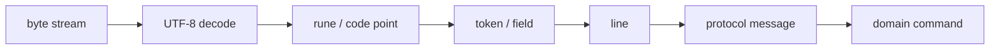
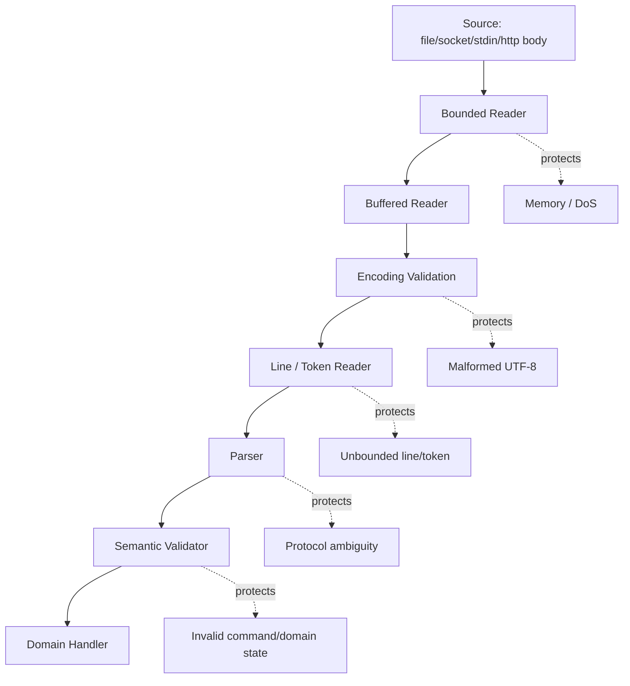
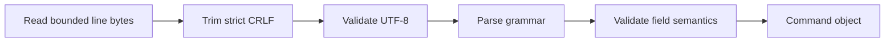
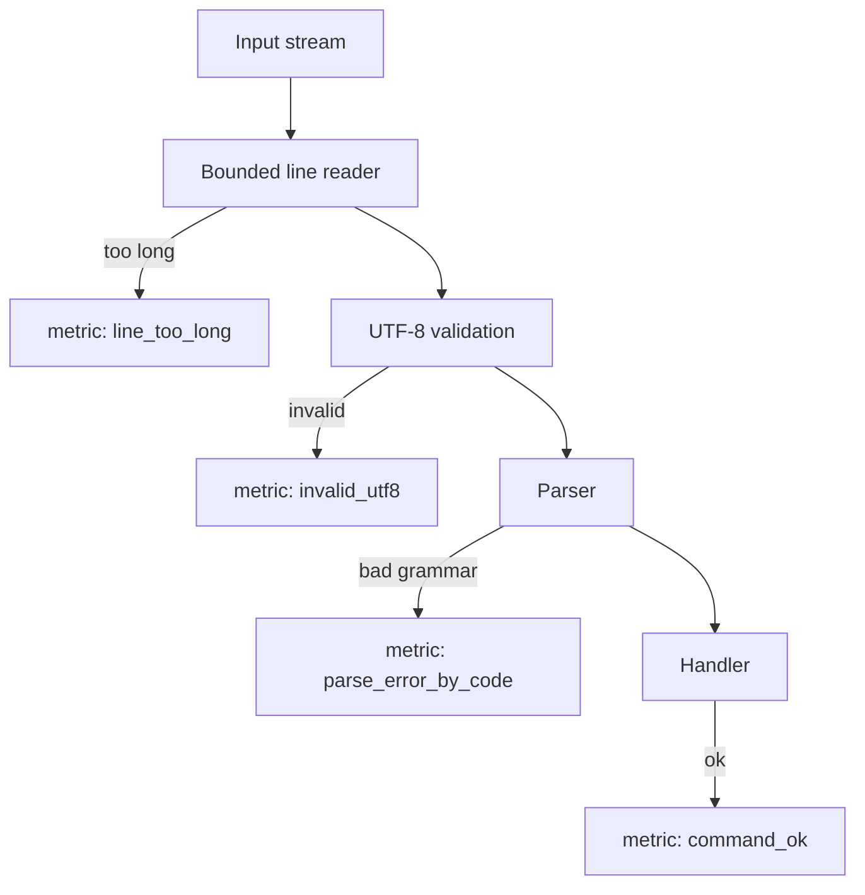

# learn-go-io-buffer-byte-stream-file-network-data-transfer-part-006.md

# Part 006 — Text IO: UTF-8, Rune Boundary, Line Protocol, CRLF, dan Malformed Input

> Series: **Go IO, Buffer, Byte & Stream, Serialization, Console IO, File & FileSystem, Compression, Networking, Data Transfer**
>
> Target pembaca: **Java software engineer** yang ingin membangun mental model Go IO secara production-grade.
>
> Target Go: **Go 1.26.x**
>
> Fokus part ini: memahami bahwa “text” di Go tetap bergerak sebagai **byte stream**, tetapi diinterpretasikan sebagai UTF-8, rune, line, token, field, command, header, payload, atau protocol frame.

---

## 0. Posisi Part Ini dalam Seri

Kita sudah membangun fondasi:

- Part 001: data movement model.
- Part 002: kontrak `io.Reader`, `io.Writer`, `Closer`, `Seeker`, `ReaderAt`, `WriterAt`.
- Part 003: komposisi advanced `io`.
- Part 004: buffer fundamentals.
- Part 005: `bufio` deep dive.

Part 006 masuk ke pertanyaan yang sering terlihat sederhana tetapi sering menjadi sumber bug production:

> “Kalau input saya text, apakah saya cukup baca per line?”

Jawabannya: **tidak selalu**.

Text IO tampak mudah karena manusia membacanya sebagai karakter, kata, baris, header, command, atau JSON. Tetapi sistem melihatnya sebagai **urutan byte**. Dari byte menuju text ada banyak boundary:



Setiap panah bisa gagal:

- byte belum lengkap;
- UTF-8 invalid;
- rune valid tapi bukan karakter yang diharapkan;
- line terlalu panjang;
- delimiter tidak datang;
- CRLF/LF tidak konsisten;
- whitespace ambigu;
- normalization berbeda;
- parser terlalu permisif;
- input malicious membuat memory membengkak.

Part ini membahas cara berpikir dan cara menulis Text IO yang aman, predictable, dan mudah dioperasikan.

---

## 1. Mental Model: Text Adalah Byte dengan Interpretasi

Di Go:

- `string` adalah sequence byte yang biasanya berisi UTF-8, tetapi secara tipe tidak memaksa valid UTF-8.
- `[]byte` adalah mutable byte slice.
- `rune` adalah alias untuk `int32`, biasanya merepresentasikan Unicode code point.
- `io.Reader` membaca byte, bukan karakter.
- `bufio.Reader` membantu membaca byte, line, dan rune, tetapi tetap berada di atas byte stream.
- `bufio.Scanner` membantu tokenization, tetapi punya batas token default dan bukan alat untuk semua input.

Go documentation untuk `strings` menyatakan package tersebut berisi fungsi manipulasi string UTF-8, dan `unicode/utf8` menyediakan fungsi untuk translasi antara rune dan UTF-8 byte sequence. `bufio` membungkus `io.Reader`/`io.Writer` dengan buffering dan bantuan untuk textual IO.

Dari perspektif engineering:

```text
text != string only
text = bytes + encoding + delimiter + grammar + semantic constraints
```

Contoh:

```text
"HELLO\n" as bytes:
48 45 4c 4c 4f 0a

"é\n" as UTF-8 bytes:
c3 a9 0a

"🙂\n" as UTF-8 bytes:
f0 9f 99 82 0a
```

Satu “karakter tampilan” bisa terdiri dari beberapa byte. Bahkan satu grapheme cluster bisa terdiri dari beberapa rune. Untuk kebanyakan sistem backend, kita jarang perlu memproses grapheme cluster secara penuh, tetapi kita perlu tahu kapan byte indexing berbahaya.

---

## 2. Java Engineer Translation: Go String vs Java String

Java:

- `String` adalah sequence UTF-16 code units.
- `char` adalah 16-bit code unit, bukan selalu Unicode code point.
- Banyak API text Java berbasis `Reader`, `Writer`, `Charset`, `InputStreamReader`, `BufferedReader`.

Go:

- `string` adalah immutable byte sequence.
- UTF-8 adalah encoding dominan dan literal string Go biasanya UTF-8.
- `rune` adalah Unicode code point.
- Go tidak punya `Reader` text terpisah seperti Java `java.io.Reader`; Go `io.Reader` tetap byte reader.
- Encoding selain UTF-8 biasanya butuh package tambahan, misalnya `golang.org/x/text/encoding`, tetapi seri ini fokus standard library kecuali disebut eksplisit.

Perbandingan mental model:

| Konsep | Java | Go |
|---|---|---|
| Raw byte stream | `InputStream` | `io.Reader` |
| Text reader | `Reader`, `BufferedReader` | tetap `io.Reader` + decoding/token logic |
| String internal | UTF-16-ish code units | immutable bytes |
| Character-ish | `char` atau code point `int` | `rune` |
| Encoding boundary | explicit `Charset` sering dipakai | UTF-8 biasanya default, tetapi validasi tetap perlu |
| Line read | `BufferedReader.readLine()` | `bufio.Reader.ReadString('\n')`, `ReadBytes`, `Scanner`, custom reader |
| Invalid encoding | decoder behavior tergantung charset decoder | `range` over string menghasilkan replacement rune untuk invalid UTF-8 |

Konsekuensinya:

> Di Go, jangan langsung membawa asumsi Java bahwa “text stream” adalah abstraction layer terpisah. Biasanya text parsing adalah policy di atas byte IO.

---

## 3. Layer Text IO

Text IO production-grade biasanya punya layer seperti ini:



Layer penting:

1. **Bounded reader**  
   Membatasi total input. Contoh: max request body, max config file size, max protocol message size.

2. **Buffered reader**  
   Mengurangi syscall atau read call kecil-kecil dan menyediakan helper textual IO.

3. **Encoding validation**  
   Memastikan byte adalah text yang kita dukung.

4. **Line/token parsing**  
   Memisahkan input menjadi unit grammar.

5. **Semantic validation**  
   Mengecek meaning: command allowed, field required, numeric range valid, enum dikenal.

Bug sering terjadi karena layer 3–5 dicampur menjadi satu fungsi besar.

---

## 4. Byte Boundary vs Rune Boundary

### 4.1 Byte indexing

Go mengizinkan indexing string per byte:

```go
s := "é"
fmt.Println(len(s))    // 2 bytes
fmt.Println(s[0])      // first byte, not the whole character
fmt.Println([]byte(s)) // [195 169]
```

Kalau kita memotong string berdasarkan byte tanpa memperhatikan UTF-8 boundary, kita bisa menghasilkan string invalid:

```go
s := "éclair"
bad := s[:1] // invalid UTF-8 fragment
fmt.Println(bad)
```

Ini tidak panic, karena Go string bisa berisi byte arbitrary. Tetapi output, logs, JSON encoding, atau downstream validation bisa berubah perilakunya.

### 4.2 Rune iteration

`range` pada string mendecode UTF-8:

```go
s := "é🙂A"

for i, r := range s {
    fmt.Printf("byteOffset=%d rune=%q codepoint=%U\n", i, r, r)
}
```

`i` adalah byte offset, bukan ordinal karakter. `r` adalah rune hasil decode.

### 4.3 Invalid UTF-8 saat range

Jika string berisi invalid UTF-8, `range` menghasilkan Unicode replacement rune `U+FFFD`.

```go
s := string([]byte{0xff, 'A'})

for i, r := range s {
    fmt.Printf("%d %U\n", i, r)
}
```

Ini berguna untuk toleransi display, tetapi tidak selalu cocok untuk parser strict. Protocol parser sering harus menolak invalid UTF-8 secara eksplisit.

### 4.4 Kapan byte-level benar?

Byte-level benar untuk:

- binary protocol;
- delimiter ASCII single byte seperti `\n`, `:`, `,` jika grammar memang byte-oriented;
- hashing/checksum;
- exact payload preservation;
- network framing;
- storage record.

Rune-level benar untuk:

- validasi text;
- menghitung batas karakter code point;
- memastikan tidak memotong UTF-8;
- parsing grammar berbasis Unicode class;
- filtering control characters.

Tetapi hati-hati: “rune count” bukan “jumlah karakter yang terlihat manusia”. Emoji, combining mark, dan grapheme cluster lebih kompleks. Untuk backend protocol, biasanya yang dibutuhkan bukan grapheme-perfect UI behavior, melainkan **valid UTF-8 + grammar jelas + bounded length**.

---

## 5. UTF-8 Validation

### 5.1 `utf8.Valid`

Untuk input yang harus valid UTF-8:

```go
package textio

import "unicode/utf8"

func ValidateUTF8(b []byte) error {
    if !utf8.Valid(b) {
        return ErrInvalidUTF8
    }
    return nil
}
```

Untuk string:

```go
if !utf8.ValidString(s) {
    return fmt.Errorf("invalid utf-8")
}
```

Penting:

- `string(b)` tidak otomatis membuat UTF-8 valid.
- `[]byte(s)` tidak menjamin valid jika `s` berasal dari arbitrary bytes.
- `range` dapat menyembunyikan invalid input melalui replacement rune.

### 5.2 Strict vs tolerant policy

Ada dua policy umum:

| Policy | Cocok Untuk | Behavior |
|---|---|---|
| Strict | protocol, config, auth metadata, IDs, filenames policy, API input | reject invalid UTF-8 |
| Tolerant | logs display, diagnostic UI, best-effort preview | replace invalid bytes atau escape |

Production-grade system biasanya memakai strict di ingestion, tolerant di observability output.

### 5.3 Validasi streaming

Untuk payload besar, `utf8.Valid` atas seluruh input berarti input harus berada di memory. Untuk streaming, validasi perlu stateful karena UTF-8 sequence bisa terpotong di chunk boundary.

Contoh masalah:

```text
chunk1: c3
chunk2: a9
```

Byte `c3 a9` adalah `é`, tetapi chunk pertama sendiri belum valid.

Untuk parser line-based, validasi per-line masuk akal jika line size bounded. Untuk truly streaming arbitrary text, kita perlu decoder incremental. Standard library `unicode/utf8` menyediakan primitive, tetapi decoder streaming yang lengkap sering lebih mudah dibuat dengan `bufio.Reader.ReadRune` atau package `transform` dari `golang.org/x/text` jika harus menangani encoding/transform non-trivial.

Dalam seri ini, prinsipnya:

> Jangan validasi UTF-8 dengan asumsi chunk boundary sama dengan character boundary.

---

## 6. Line Boundary: LF, CRLF, dan EOF

Line-oriented input umum di:

- CLI;
- config sederhana;
- CSV-like format;
- log processing;
- Redis-like text protocol;
- SMTP/HTTP-ish protocols;
- admin command socket.

Ada beberapa terminator:

| Terminator | Bytes | Umum di |
|---|---:|---|
| LF | `\n` | Unix, Go logs, banyak file |
| CRLF | `\r\n` | HTTP/1, SMTP, beberapa internet protocol |
| CR | `\r` | legacy Mac, jarang |

### 6.1 `ReadString('\n')`

```go
line, err := r.ReadString('\n')
if err != nil {
    if errors.Is(err, io.EOF) && len(line) > 0 {
        // last line without trailing newline
    } else {
        return err
    }
}
```

Kontrak penting:

- Jika delimiter ditemukan, line termasuk delimiter.
- Jika EOF terjadi setelah partial data, data dikembalikan bersama error `io.EOF`.
- Caller harus memproses data jika `len(line) > 0`, bahkan ketika error non-nil sesuai konteks.
- Untuk line untrusted, ini bisa memory grow jika delimiter tidak pernah datang.

### 6.2 `ReadBytes('\n')`

Mirip `ReadString`, tetapi menghasilkan `[]byte`.

Gunakan `ReadBytes` bila:

- ingin menghindari konversi ke string terlalu cepat;
- perlu validasi byte/UTF-8 dulu;
- ingin parsing delimiter dan trimming manual;
- ingin preserve exact bytes.

### 6.3 `ReadSlice('\n')`

`ReadSlice` mengembalikan slice yang menunjuk ke buffer internal `bufio.Reader`.

Kelebihan:

- minim allocation.

Risiko:

- data invalid setelah read berikutnya;
- jika line lebih panjang dari buffer, error `bufio.ErrBufferFull`;
- caller harus segera copy jika data perlu disimpan.

Pattern aman:

```go
frag, err := br.ReadSlice('\n')
if err == nil {
    line := append([]byte(nil), frag...) // copy if needed beyond next read
    _ = line
}
```

### 6.4 `Scanner`

`bufio.Scanner` simple untuk line/token kecil:

```go
scanner := bufio.NewScanner(r)
for scanner.Scan() {
    line := scanner.Text()
    process(line)
}
if err := scanner.Err(); err != nil {
    return err
}
```

Tetapi `Scanner` punya default maximum token size. Jika line bisa besar, gunakan `Scanner.Buffer` atau jangan gunakan Scanner.

```go
scanner := bufio.NewScanner(r)
buf := make([]byte, 0, 64*1024)
scanner.Buffer(buf, 1024*1024) // max token 1 MiB
```

Kapan `Scanner` cocok:

- CLI input kecil;
- config sederhana;
- log file line bounded;
- tests;
- admin commands sederhana.

Kapan tidak cocok:

- large upload;
- binary stream;
- protocol yang perlu precise partial read;
- line bisa sangat panjang;
- butuh retain exact delimiter;
- butuh custom error classification detail.

---

## 7. Normalisasi Line Ending

Untuk line protocol, harus jelas apakah `\r\n` wajib, opsional, atau ditolak.

### 7.1 Trimming newline

Salah satu helper:

```go
func trimLineEnding(line []byte) []byte {
    if len(line) > 0 && line[len(line)-1] == '\n' {
        line = line[:len(line)-1]
    }
    if len(line) > 0 && line[len(line)-1] == '\r' {
        line = line[:len(line)-1]
    }
    return line
}
```

Ini menerima LF dan CRLF.

Untuk protocol strict CRLF:

```go
func trimStrictCRLF(line []byte) ([]byte, error) {
    if len(line) < 2 || line[len(line)-2] != '\r' || line[len(line)-1] != '\n' {
        return nil, fmt.Errorf("line must end with CRLF")
    }
    return line[:len(line)-2], nil
}
```

### 7.2 Kenapa ini penting?

Misalnya command socket:

```text
SET key value\r\n
```

Jika parser menerima `SET key value\n`, mungkin baik untuk dev UX. Tetapi jika protocol mengikuti internet standard strict, terlalu permisif bisa membuka ambiguity.

Contoh HTTP/1 historically sensitive terhadap line parsing ambiguity. Part HTTP akan membahas ini lebih dalam, tetapi mental modelnya dimulai di sini:

> Text protocol bukan “string split biasa”; ia adalah grammar dengan delimiter dan security boundary.

---

## 8. Bounded Line Reader

Salah satu anti-pattern paling sering:

```go
line, err := br.ReadString('\n') // unbounded
```

Jika attacker mengirim stream tanpa newline, memory bisa tumbuh.

### 8.1 Bounded reader per line

Contoh helper yang membaca sampai newline dengan max line length:

```go
package textio

import (
    "bufio"
    "bytes"
    "errors"
    "fmt"
    "io"
)

var (
    ErrLineTooLong = errors.New("line too long")
)

func ReadLineBounded(br *bufio.Reader, max int) ([]byte, error) {
    if max <= 0 {
        return nil, fmt.Errorf("max must be positive")
    }

    var out bytes.Buffer

    for {
        frag, err := br.ReadSlice('\n')

        if len(frag) > 0 {
            if out.Len()+len(frag) > max {
                return nil, ErrLineTooLong
            }
            _, _ = out.Write(frag)
        }

        if err == nil {
            return out.Bytes(), nil
        }

        if errors.Is(err, bufio.ErrBufferFull) {
            continue
        }

        if errors.Is(err, io.EOF) {
            if out.Len() > 0 {
                return out.Bytes(), io.EOF
            }
            return nil, io.EOF
        }

        return nil, err
    }
}
```

Catatan:

- Ini masih menyalin ke `bytes.Buffer`, tetapi bounded.
- Untuk max kecil, sederhana dan aman.
- Untuk performance ekstrem, bisa memakai preallocated slice.
- Policy `io.EOF` dengan partial line harus diputuskan sesuai protocol.

### 8.2 Drain strategy saat line terlalu panjang

Jika line terlalu panjang pada network protocol, pilihan:

1. close connection;
2. drain sampai delimiter lalu return error;
3. enter protocol error state;
4. reject current message but keep session.

Untuk banyak protocol sederhana, **close connection** adalah pilihan paling aman.

Kenapa? Karena setelah parser gagal menemukan boundary, state stream sudah tidak bisa dipercaya.

---

## 9. Tokenization: Split Itu Policy, Bukan Sekadar Utility

Go punya package `strings` dengan helper seperti:

- `Split`
- `SplitN`
- `Cut`
- `Fields`
- `TrimSpace`
- `TrimPrefix`
- `Contains`
- `HasPrefix`
- `HasSuffix`

Tetapi pemilihan fungsi adalah keputusan grammar.

### 9.1 `strings.Split` vs `strings.Cut`

Misalnya command:

```text
AUTH username password with spaces?
```

Jika password boleh mengandung spasi, `Fields` salah.

Gunakan grammar:

```text
AUTH <username> <password>
```

Kalau password tidak boleh spasi:

```go
fields := strings.Fields(line)
if len(fields) != 3 {
    return error
}
```

Kalau value boleh mengandung spasi:

```go
cmd, rest, ok := strings.Cut(line, " ")
if !ok {
    return error
}

key, value, ok := strings.Cut(rest, " ")
if !ok {
    return error
}
```

`Cut` sering lebih expressive untuk protocol karena membagi “prefix grammar” dan “remaining payload”.

### 9.2 `TrimSpace` bisa terlalu permisif

`strings.TrimSpace` menghapus Unicode whitespace.

Untuk config manusia, ini mungkin bagus.

Untuk protocol strict, ini bisa buruk.

Contoh:

```go
line = strings.TrimSpace(line)
```

Ini bisa menghapus `\r\n`, tab, non-breaking spaces, dan whitespace lain yang mungkin seharusnya invalid.

Lebih aman untuk protocol:

```go
line = strings.TrimSuffix(line, "\n")
line = strings.TrimSuffix(line, "\r")
```

Atau strict CRLF seperti sebelumnya.

### 9.3 Case folding

Untuk command ASCII:

```go
switch strings.ToUpper(cmd) {
case "GET":
case "SET":
}
```

Untuk Unicode case-insensitive matching, case folding lebih kompleks. Banyak protocol backend lebih baik mendefinisikan token command sebagai ASCII-only.

Policy yang sering production-safe:

- command: ASCII uppercase/lowercase only;
- key: restricted char set;
- value: UTF-8 validated payload dengan limit;
- delimiter: ASCII byte.

---

## 10. Control Characters dan Sanitization

Text yang valid UTF-8 belum tentu aman.

Contoh:

```text
hello\u0000world
hello\x1b[31mred terminal escape
line1\nline2
```

Risiko:

- log injection;
- terminal escape injection;
- CSV formula injection;
- header injection;
- filename trick;
- multiline audit corruption;
- invisible control char.

### 10.1 Validasi printable-ish

Untuk protocol field tertentu:

```go
func isSafeTokenASCII(s string) bool {
    if s == "" {
        return false
    }
    for i := 0; i < len(s); i++ {
        c := s[i]
        switch {
        case c >= 'a' && c <= 'z':
        case c >= 'A' && c <= 'Z':
        case c >= '0' && c <= '9':
        case c == '_' || c == '-' || c == '.':
        default:
            return false
        }
    }
    return true
}
```

Mengapa ASCII token sering baik?

- predictable;
- tidak perlu Unicode normalization;
- aman untuk map keys, metric labels, log tags;
- mudah di-debug;
- cocok untuk protocol command/key.

Untuk human text payload, validasi berbeda:

```go
func rejectNUL(s string) error {
    if strings.ContainsRune(s, '\x00') {
        return fmt.Errorf("NUL byte not allowed")
    }
    return nil
}
```

### 10.2 Log escaping

Jangan log raw untrusted text tanpa escaping.

Lebih aman:

```go
log.Printf("received command=%q", cmd)
```

`%q` membantu memperlihatkan control characters.

Untuk structured logging, pastikan sink tidak menafsirkan escape terminal atau multi-line secara membingungkan.

---

## 11. Normalization: Code Point yang Berbeda Bisa Terlihat Sama

Unicode normalization adalah sumber bug yang sering tersembunyi.

Contoh konseptual:

- `é` bisa berupa satu code point `U+00E9`
- atau `e` + combining acute accent

Secara visual mirip, byte berbeda, rune sequence berbeda.

Dampak:

- key lookup gagal;
- duplicate username terlihat sama;
- audit search membingungkan;
- authorization/resource matching salah;
- cache key mismatch.

Standard library Go tidak menyediakan full Unicode normalization di package inti; biasanya memakai `golang.org/x/text/unicode/norm`.

Dalam seri ini, prinsip desain:

| Field Type | Rekomendasi |
|---|---|
| machine token / ID / command | restrict ke ASCII safe set |
| human display name | valid UTF-8, allow Unicode, jangan dipakai sebagai identity key |
| filename from user | validasi ketat, normalize policy, reject path separator/control |
| security-sensitive identifier | canonical form harus eksplisit |

Rule:

> Jangan menjadikan human text bebas sebagai primary identity key tanpa canonicalization policy.

---

## 12. Text Protocol Mini: Dari Line ke Command

Mari desain protocol sederhana:

```text
PING\r\n
ECHO <text>\r\n
SET <key> <value>\r\n
GET <key>\r\n
QUIT\r\n
```

Constraint:

- line max 8 KiB;
- delimiter wajib CRLF;
- command ASCII;
- key ASCII safe token max 128;
- value valid UTF-8 max 4 KiB;
- malformed input menutup connection.

### 12.1 Parser structure

```go
type Command interface {
    isCommand()
}

type PingCommand struct{}
type EchoCommand struct{ Text string }
type SetCommand struct {
    Key   string
    Value string
}
type GetCommand struct{ Key string }
type QuitCommand struct{}

func (PingCommand) isCommand() {}
func (EchoCommand) isCommand() {}
func (SetCommand) isCommand()  {}
func (GetCommand) isCommand()  {}
func (QuitCommand) isCommand() {}
```

### 12.2 Read one command

```go
func ReadCommand(br *bufio.Reader) (Command, error) {
    raw, err := ReadLineBounded(br, 8*1024)
    if err != nil {
        return nil, err
    }

    body, err := trimStrictCRLF(raw)
    if err != nil {
        return nil, err
    }

    if !utf8.Valid(body) {
        return nil, fmt.Errorf("invalid utf-8")
    }

    return parseCommand(string(body))
}
```

### 12.3 Parse command

```go
func parseCommand(line string) (Command, error) {
    cmd, rest, hasRest := strings.Cut(line, " ")

    switch cmd {
    case "PING":
        if hasRest {
            return nil, fmt.Errorf("PING takes no arguments")
        }
        return PingCommand{}, nil

    case "QUIT":
        if hasRest {
            return nil, fmt.Errorf("QUIT takes no arguments")
        }
        return QuitCommand{}, nil

    case "GET":
        if !hasRest || rest == "" {
            return nil, fmt.Errorf("GET requires key")
        }
        if strings.Contains(rest, " ") {
            return nil, fmt.Errorf("GET key must not contain spaces")
        }
        if !isSafeTokenASCII(rest) {
            return nil, fmt.Errorf("invalid key")
        }
        return GetCommand{Key: rest}, nil

    case "ECHO":
        if !hasRest {
            return nil, fmt.Errorf("ECHO requires text")
        }
        if len(rest) > 4*1024 {
            return nil, fmt.Errorf("text too long")
        }
        if strings.ContainsRune(rest, '\x00') {
            return nil, fmt.Errorf("NUL not allowed")
        }
        return EchoCommand{Text: rest}, nil

    case "SET":
        if !hasRest {
            return nil, fmt.Errorf("SET requires key and value")
        }
        key, value, ok := strings.Cut(rest, " ")
        if !ok || key == "" {
            return nil, fmt.Errorf("SET requires key and value")
        }
        if !isSafeTokenASCII(key) || len(key) > 128 {
            return nil, fmt.Errorf("invalid key")
        }
        if len(value) > 4*1024 {
            return nil, fmt.Errorf("value too long")
        }
        if strings.ContainsRune(value, '\x00') {
            return nil, fmt.Errorf("NUL not allowed")
        }
        return SetCommand{Key: key, Value: value}, nil

    default:
        return nil, fmt.Errorf("unknown command")
    }
}
```

### 12.4 Kenapa parser ini dipisah?

Karena ada boundary jelas:



Benefit:

- bisa test parser tanpa network;
- bisa fuzz parser;
- bisa instrument error type;
- bisa reuse parser untuk file/stdin/socket;
- protocol grammar tidak tersebar di handler.

---

## 13. Console Text IO

Console IO terlihat sederhana tetapi punya edge case:

- input bisa EOF;
- input bisa line tanpa newline;
- user bisa paste multiline;
- terminal bisa mengirim control sequences;
- stdout bisa dipipe ke file;
- stderr harus dipisah dari data output;
- prompt harus flush jika memakai buffered writer.

### 13.1 CLI prompt dengan `bufio.Reader`

```go
func AskLine(in io.Reader, out io.Writer, prompt string) (string, error) {
    br := bufio.NewReader(in)

    if _, err := fmt.Fprint(out, prompt); err != nil {
        return "", err
    }

    line, err := br.ReadString('\n')
    if err != nil {
        if errors.Is(err, io.EOF) && len(line) > 0 {
            return strings.TrimRight(line, "\r\n"), nil
        }
        return "", err
    }

    return strings.TrimRight(line, "\r\n"), nil
}
```

Namun ada masalah: jika `out` dibuffer, prompt mungkin tidak muncul.

### 13.2 Prompt dengan explicit flush

```go
func AskLineBuffered(in io.Reader, out io.Writer, prompt string) (string, error) {
    br := bufio.NewReader(in)
    bw := bufio.NewWriter(out)

    if _, err := bw.WriteString(prompt); err != nil {
        return "", err
    }
    if err := bw.Flush(); err != nil {
        return "", err
    }

    line, err := br.ReadString('\n')
    if err != nil {
        if errors.Is(err, io.EOF) && len(line) > 0 {
            return strings.TrimRight(line, "\r\n"), nil
        }
        return "", err
    }

    return strings.TrimRight(line, "\r\n"), nil
}
```

### 13.3 stdout vs stderr

Untuk CLI yang output-nya dipakai pipeline:

- data machine-readable ke stdout;
- progress, prompt, warning, diagnostic ke stderr.

Contoh:

```text
mytool list-users > users.json
```

Jika progress log ditulis ke stdout, file JSON rusak.

---

## 14. File Text IO

File text IO punya problem berbeda:

- file bisa besar;
- encoding bisa invalid;
- last line mungkin tidak punya newline;
- line ending bisa campur;
- file bisa berubah saat dibaca;
- permission/error berbeda tiap OS;
- path dan newline policy harus jelas.

### 14.1 Membaca file line by line

```go
func ProcessLines(r io.Reader, maxLine int, fn func([]byte) error) error {
    br := bufio.NewReader(r)

    for {
        line, err := ReadLineBounded(br, maxLine)
        if len(line) > 0 {
            line = trimLineEnding(line)
            if !utf8.Valid(line) {
                return fmt.Errorf("invalid utf-8")
            }
            if err2 := fn(line); err2 != nil {
                return err2
            }
        }

        if errors.Is(err, io.EOF) {
            return nil
        }

        if err != nil {
            return err
        }
    }
}
```

### 14.2 Last line without newline

Banyak parser production harus memilih:

| Policy | Behavior |
|---|---|
| Accept final partial line | cocok untuk config/log umum |
| Reject missing newline | cocok untuk strict protocol file |
| Warn but accept | cocok untuk human-maintained config |

Jangan biarkan behavior implicit tanpa test.

---

## 15. Network Text IO

Network text IO adalah text parsing + unreliable peer + blocking stream.

Tambahan concern:

- peer bisa slow;
- peer bisa kirim byte satu per satu;
- peer bisa tidak pernah kirim newline;
- peer bisa close setelah partial command;
- deadline harus dipasang;
- read error harus diklasifikasikan;
- protocol state harus reset/close saat malformed.

### 15.1 Conn handling skeleton

```go
func ServeConn(conn net.Conn, handler func(Command) error) {
    defer conn.Close()

    br := bufio.NewReaderSize(conn, 16*1024)
    bw := bufio.NewWriterSize(conn, 16*1024)
    defer bw.Flush()

    for {
        _ = conn.SetReadDeadline(time.Now().Add(30 * time.Second))

        cmd, err := ReadCommand(br)
        if err != nil {
            if errors.Is(err, io.EOF) {
                return
            }
            fmt.Fprintf(bw, "ERR %q\r\n", err.Error())
            _ = bw.Flush()
            return // close on protocol error
        }

        _ = conn.SetWriteDeadline(time.Now().Add(30 * time.Second))

        if err := handler(cmd); err != nil {
            fmt.Fprintf(bw, "ERR %q\r\n", err.Error())
            _ = bw.Flush()
            return
        }

        if _, err := bw.WriteString("OK\r\n"); err != nil {
            return
        }
        if err := bw.Flush(); err != nil {
            return
        }
    }
}
```

Catatan:

- deadline menghindari goroutine stuck selamanya;
- close on protocol error menjaga state;
- response error di-quote;
- flush setelah response penting untuk interactive protocol.

Part TCP akan membahas connection lifecycle lebih dalam. Di sini fokusnya text boundary.

---

## 16. HTTP Text-ish IO

HTTP sering terlihat seperti text protocol, tetapi di Go kita biasanya tidak parse raw HTTP sendiri. `net/http` menangani parsing request line, headers, chunking, body, dan connection reuse.

Namun text IO tetap relevan:

- request body bisa JSON/text/CSV;
- response body bisa streaming line;
- headers adalah text-ish metadata dengan aturan khusus;
- multipart boundary;
- Server-Sent Events;
- reverse proxy rewriting.

Prinsip:

```text
Do not parse HTTP by hand unless you are building HTTP infrastructure.
Use net/http, then parse body according to content type and limit.
```

Contoh bounded body:

```go
func handleText(w http.ResponseWriter, r *http.Request) {
    r.Body = http.MaxBytesReader(w, r.Body, 1<<20)
    defer r.Body.Close()

    br := bufio.NewReader(r.Body)

    err := ProcessLines(br, 64*1024, func(line []byte) error {
        // process validated line
        return nil
    })
    if err != nil {
        http.Error(w, err.Error(), http.StatusBadRequest)
        return
    }

    w.WriteHeader(http.StatusNoContent)
}
```

Penting:

- body harus dibatasi;
- body harus ditutup;
- streaming parsing menghindari load-all;
- error semantic harus jelas.

---

## 17. `fmt.Fscan` dan Kapan Tidak Dipakai

Go punya `fmt.Fscan`, `Fscanf`, `Fscanln`.

Contoh:

```go
var name string
var age int
_, err := fmt.Fscan(r, &name, &age)
```

Cocok untuk:

- competitive programming;
- quick CLI;
- trusted simple input;
- prototypes.

Kurang cocok untuk:

- protocol production;
- error diagnostic detail;
- malicious input;
- field dengan spaces;
- strict delimiter;
- bounded line enforcement;
- performance-sensitive parser.

Kenapa?

`fmt` parsing fleksibel tetapi opaque. Production parser sering butuh kontrol atas:

- max length;
- delimiter exact;
- UTF-8 policy;
- error code;
- partial progress;
- logging context;
- rejection behavior.

---

## 18. Text Output: Writer Discipline

Membuat text output juga punya contract:

- encoding harus jelas;
- delimiter harus konsisten;
- flush harus dilakukan bila buffered;
- error write harus dicek;
- partial write harus ditangani oleh writer abstraction;
- output untrusted harus escaped;
- jangan campur protocol output dengan logs.

### 18.1 Response writer helper

```go
type LineWriter struct {
    bw *bufio.Writer
}

func NewLineWriter(w io.Writer, size int) *LineWriter {
    if size <= 0 {
        size = 4096
    }
    return &LineWriter{bw: bufio.NewWriterSize(w, size)}
}

func (lw *LineWriter) WriteLine(s string) error {
    if !utf8.ValidString(s) {
        return fmt.Errorf("invalid utf-8 output")
    }
    if strings.ContainsAny(s, "\r\n") {
        return fmt.Errorf("line contains newline")
    }
    if _, err := lw.bw.WriteString(s); err != nil {
        return err
    }
    if _, err := lw.bw.WriteString("\r\n"); err != nil {
        return err
    }
    return nil
}

func (lw *LineWriter) Flush() error {
    return lw.bw.Flush()
}
```

Ini terlihat “terlalu defensif”, tetapi untuk line protocol bagus karena:

- output tidak bisa inject extra line;
- delimiter konsisten;
- flush explicit.

### 18.2 Streaming output

Untuk streaming HTTP:

```go
func streamLines(w http.ResponseWriter, lines <-chan string) {
    flusher, ok := w.(http.Flusher)
    if !ok {
        http.Error(w, "streaming unsupported", http.StatusInternalServerError)
        return
    }

    w.Header().Set("Content-Type", "text/plain; charset=utf-8")

    for line := range lines {
        if strings.ContainsAny(line, "\r\n") {
            continue // or error
        }
        if _, err := fmt.Fprintf(w, "%s\n", line); err != nil {
            return
        }
        flusher.Flush()
    }
}
```

Caution:

- every flush can reduce throughput;
- no flush can increase latency;
- choose batch/flush policy.

---

## 19. Parser Error Taxonomy

Untuk production, error text IO sebaiknya tidak semuanya `fmt.Errorf("bad input")`.

Kita butuh taxonomy:

| Error Type | Meaning | Common Response |
|---|---|---|
| `ErrLineTooLong` | delimiter tidak datang dalam limit | close/reject 413/400 |
| `ErrInvalidUTF8` | encoding invalid | reject 400 |
| `ErrBadLineEnding` | delimiter tidak sesuai protocol | reject/close |
| `ErrUnknownCommand` | grammar command tidak dikenal | protocol error |
| `ErrBadField` | field invalid | client error |
| timeout | peer slow/stalled | close/408 |
| EOF partial | peer closed mid-message | close, maybe no log noisy |
| internal write error | sink failed | abort transfer |

Contoh typed-ish error:

```go
type ParseError struct {
    Code string
    Msg  string
}

func (e *ParseError) Error() string {
    return e.Code + ": " + e.Msg
}

func NewParseError(code, msg string) error {
    return &ParseError{Code: code, Msg: msg}
}
```

Pemakaian:

```go
return nil, NewParseError("INVALID_UTF8", "line is not valid UTF-8")
```

Benefit:

- response mapping jelas;
- metrics bisa by code;
- tests bisa assert code;
- logs tidak bergantung string matching.

---

## 20. Observability untuk Text IO

Minimal signal:

- bytes read;
- lines read;
- parse failures by code;
- line too long count;
- invalid UTF-8 count;
- read timeout count;
- write timeout count;
- current active connections;
- average line length;
- max observed line length;
- rejected input sample count, tetapi jangan log raw sensitive payload.

Mermaid failure visibility:



Logging guideline:

```go
log.Printf("parse_failed code=%s remote=%s line_len=%d sample=%q",
    code,
    remote,
    len(line),
    sampleForLog(line, 128),
)
```

Sample helper:

```go
func sampleForLog(b []byte, max int) string {
    if len(b) > max {
        b = b[:max]
    }
    return fmt.Sprintf("%q", b)
}
```

Caution:

- jangan log full secret;
- jangan log unbounded line;
- escape raw bytes;
- jangan jadikan log sebagai parser side-channel.

---

## 21. Testing Text IO

### 21.1 Table-driven parser tests

```go
func TestParseCommand(t *testing.T) {
    tests := []struct {
        name    string
        input   string
        wantErr bool
    }{
        {"ping", "PING", false},
        {"ping args rejected", "PING x", true},
        {"get", "GET user-1", false},
        {"bad key", "GET ../../etc/passwd", true},
        {"echo spaces", "ECHO hello world", false},
        {"unknown", "BOOM", true},
    }

    for _, tt := range tests {
        t.Run(tt.name, func(t *testing.T) {
            _, err := parseCommand(tt.input)
            if (err != nil) != tt.wantErr {
                t.Fatalf("err=%v wantErr=%v", err, tt.wantErr)
            }
        })
    }
}
```

### 21.2 Boundary tests

Test wajib:

- empty input;
- line only newline;
- CRLF;
- LF rejected if strict;
- line exactly max length;
- line max+1;
- invalid UTF-8;
- missing final newline;
- embedded NUL;
- huge value;
- command lowercase if not allowed;
- key with Unicode lookalike;
- slow reader;
- reader returning 1 byte at a time.

### 21.3 One-byte-at-a-time reader

```go
type slowByteReader struct {
    data []byte
}

func (r *slowByteReader) Read(p []byte) (int, error) {
    if len(r.data) == 0 {
        return 0, io.EOF
    }
    p[0] = r.data[0]
    r.data = r.data[1:]
    return 1, nil
}
```

Gunanya memastikan parser tidak bergantung pada chunk boundary.

### 21.4 Fault reader

```go
type errAfterReader struct {
    data []byte
    n    int
    err  error
}

func (r *errAfterReader) Read(p []byte) (int, error) {
    if r.n <= 0 {
        return 0, r.err
    }
    if len(r.data) == 0 {
        return 0, io.EOF
    }
    p[0] = r.data[0]
    r.data = r.data[1:]
    r.n--
    return 1, nil
}
```

Gunanya:

- menguji partial line + error;
- memastikan data tidak hilang;
- memastikan error tidak ditelan.

### 21.5 Fuzzing parser

Go punya native fuzzing. Parser text adalah target bagus.

```go
func FuzzParseCommand(f *testing.F) {
    seeds := []string{
        "PING",
        "GET key",
        "SET key value",
        "ECHO hello",
        "\xff",
    }

    for _, s := range seeds {
        f.Add(s)
    }

    f.Fuzz(func(t *testing.T, s string) {
        _, _ = parseCommand(s)
    })
}
```

Initial target fuzzing:

- parser tidak panic;
- parser tidak hang;
- parser tidak allocate berlebihan untuk bounded input;
- valid command roundtrip jika ada encoder.

---

## 22. Performance Model Text IO

Text IO performance dipengaruhi:

- jumlah allocation per line;
- konversi `[]byte` ↔ `string`;
- buffer size;
- scanner token copy;
- regex;
- `fmt` parsing;
- logging raw input;
- UTF-8 validation full vs targeted;
- line length distribution;
- syscall count;
- flush frequency.

### 22.1 Hindari conversion berulang

Anti-pattern:

```go
line := string(b)
if strings.HasPrefix(string(b), "GET ") { // convert lagi
}
```

Lebih baik:

```go
line := string(b)
if strings.HasPrefix(line, "GET ") {
}
```

Atau byte-level untuk ASCII delimiter:

```go
if bytes.HasPrefix(b, []byte("GET ")) {
}
```

### 22.2 Regex bukan default parser

Regex berguna, tetapi untuk protocol hot path:

- lebih banyak allocation;
- error sulit dikontrol;
- grammar kecil lebih jelas dengan `Cut`, indexing, atau state machine.

Bukan berarti regex dilarang. Tetapi untuk top-tier production parser, default-nya adalah grammar eksplisit.

### 22.3 Flush batching

```text
Flush per line:
+ low latency
- lower throughput

Flush every N lines / interval:
+ better throughput
- higher latency
- more complex failure handling
```

Decision:

| Use Case | Flush Policy |
|---|---|
| interactive CLI/socket | flush after response |
| log file writer | buffered + periodic/close flush |
| HTTP streaming | flush per event or batch |
| bulk export | large buffer, flush at end/chunk |

---

## 23. Security Lens

Text IO security issue umum:

1. **Unbounded input**
   - line tanpa newline;
   - huge body;
   - scanner max token panic-like operational failure.

2. **Injection**
   - log injection;
   - terminal escape;
   - header injection;
   - command injection ke downstream;
   - CSV formula injection.

3. **Ambiguous parsing**
   - CRLF vs LF;
   - duplicate fields;
   - whitespace permissive;
   - Unicode lookalike;
   - normalization mismatch.

4. **Data corruption**
   - invalid UTF-8 accepted lalu diganti;
   - byte slice reused;
   - line ending stripped salah;
   - output tidak flush.

5. **Protocol desync**
   - parser gagal tapi connection tetap dipakai;
   - too-long line tidak didrain/close;
   - partial command diproses.

Security principle:

```text
Text input should be:
bounded, decoded, validated, parsed by grammar, semantically checked, and safely logged.
```

---

## 24. Production Checklist

Sebelum menerima text input:

- [ ] Apakah total input size dibatasi?
- [ ] Apakah max line/token dibatasi?
- [ ] Apakah encoding policy jelas?
- [ ] Apakah invalid UTF-8 ditolak atau ditoleransi secara sadar?
- [ ] Apakah line ending policy jelas?
- [ ] Apakah final line tanpa newline diterima?
- [ ] Apakah delimiter bisa muncul di value?
- [ ] Apakah whitespace policy eksplisit?
- [ ] Apakah command/key restricted?
- [ ] Apakah control characters ditolak untuk field sensitif?
- [ ] Apakah parser bisa diuji tanpa network/file?
- [ ] Apakah parser tahan input 1 byte per read?
- [ ] Apakah error taxonomy jelas?
- [ ] Apakah raw input di-log secara aman?
- [ ] Apakah output delimiter konsisten?
- [ ] Apakah buffered writer selalu di-flush?
- [ ] Apakah malformed input menutup session jika state tidak bisa dipulihkan?

---

## 25. Anti-Patterns

### 25.1 `ReadAll` untuk input text untrusted

```go
b, err := io.ReadAll(r)
```

Boleh untuk bounded/trusted/small input. Berbahaya untuk untrusted stream tanpa limit.

Gunakan:

```go
limited := io.LimitReader(r, maxBytes)
b, err := io.ReadAll(limited)
```

Atau streaming parser.

### 25.2 `Scanner` tanpa memahami max token

```go
scanner := bufio.NewScanner(r)
```

Jika line besar, scan berhenti dengan error. Ini sering baru muncul di production saat ada payload/log long line.

### 25.3 `strings.TrimSpace` untuk protocol strict

Terlalu permisif dan bisa menyembunyikan input salah.

### 25.4 Log raw input

```go
log.Printf("bad input: %s", line)
```

Gunakan escaped, truncated, classified.

### 25.5 Menganggap `len(s)` jumlah karakter

`len(s)` adalah byte length.

### 25.6 Memotong string berdasarkan byte untuk display limit

```go
s = s[:100]
```

Bisa memotong UTF-8 sequence.

Untuk safe truncate by rune:

```go
func truncateRunes(s string, max int) string {
    if max < 0 {
        max = 0
    }
    count := 0
    for i := range s {
        if count == max {
            return s[:i]
        }
        count++
    }
    return s
}
```

Tetap ingat: ini rune, bukan grapheme cluster.

---

## 26. Case Study: Log Processor yang Awalnya Simple

### 26.1 Versi naïve

```go
func ProcessLog(r io.Reader) error {
    scanner := bufio.NewScanner(r)
    for scanner.Scan() {
        parts := strings.Split(scanner.Text(), " ")
        handle(parts)
    }
    return scanner.Err()
}
```

Problem:

- line terlalu panjang gagal;
- split semua field walau hanya butuh beberapa;
- whitespace multiple menghasilkan empty fields;
- invalid UTF-8 tidak divalidasi;
- no line length metric;
- malformed line mungkin panic di `handle`;
- tidak ada error taxonomy.

### 26.2 Versi lebih defensif

```go
func ProcessLog(r io.Reader, handle func(LogRecord) error) error {
    br := bufio.NewReaderSize(r, 64*1024)

    for {
        line, err := ReadLineBounded(br, 1024*1024)
        if len(line) > 0 {
            body := trimLineEnding(line)

            if !utf8.Valid(body) {
                return NewParseError("INVALID_UTF8", "log line contains invalid UTF-8")
            }

            rec, parseErr := parseLogLine(string(body))
            if parseErr != nil {
                return parseErr
            }

            if err2 := handle(rec); err2 != nil {
                return err2
            }
        }

        if errors.Is(err, io.EOF) {
            return nil
        }
        if err != nil {
            return err
        }
    }
}
```

### 26.3 Lesson

Text IO production-grade sering bukan soal API yang lebih canggih, tetapi soal explicit boundary:

```text
max size -> line -> UTF-8 -> grammar -> semantic record -> handler
```

---

## 27. Small Reference Implementation

Berikut contoh file tunggal untuk text command parser minimal. Ini bukan framework; ini model.

```go
package textproto

import (
    "bufio"
    "bytes"
    "errors"
    "fmt"
    "io"
    "strings"
    "unicode/utf8"
)

var (
    ErrLineTooLong  = errors.New("line too long")
    ErrBadLineEnd   = errors.New("bad line ending")
    ErrInvalidUTF8  = errors.New("invalid utf-8")
    ErrUnknown      = errors.New("unknown command")
    ErrBadArguments = errors.New("bad arguments")
)

type Command struct {
    Name  string
    Key   string
    Value string
}

func ReadCommand(br *bufio.Reader, maxLine int) (Command, error) {
    line, err := readLineBounded(br, maxLine)
    if err != nil {
        return Command{}, err
    }

    body, err := trimCRLF(line)
    if err != nil {
        return Command{}, err
    }

    if !utf8.Valid(body) {
        return Command{}, ErrInvalidUTF8
    }

    return parseCommand(string(body))
}

func readLineBounded(br *bufio.Reader, max int) ([]byte, error) {
    var out bytes.Buffer

    for {
        frag, err := br.ReadSlice('\n')
        if len(frag) > 0 {
            if out.Len()+len(frag) > max {
                return nil, ErrLineTooLong
            }
            _, _ = out.Write(frag)
        }

        switch {
        case err == nil:
            return out.Bytes(), nil
        case errors.Is(err, bufio.ErrBufferFull):
            continue
        case errors.Is(err, io.EOF):
            if out.Len() > 0 {
                return nil, ErrBadLineEnd
            }
            return nil, io.EOF
        default:
            return nil, err
        }
    }
}

func trimCRLF(line []byte) ([]byte, error) {
    if len(line) < 2 {
        return nil, ErrBadLineEnd
    }
    if line[len(line)-2] != '\r' || line[len(line)-1] != '\n' {
        return nil, ErrBadLineEnd
    }
    return line[:len(line)-2], nil
}

func parseCommand(line string) (Command, error) {
    name, rest, hasRest := strings.Cut(line, " ")

    switch name {
    case "PING":
        if hasRest {
            return Command{}, ErrBadArguments
        }
        return Command{Name: "PING"}, nil

    case "GET":
        if !hasRest || rest == "" || strings.Contains(rest, " ") || !safeToken(rest) {
            return Command{}, ErrBadArguments
        }
        return Command{Name: "GET", Key: rest}, nil

    case "SET":
        if !hasRest {
            return Command{}, ErrBadArguments
        }
        key, value, ok := strings.Cut(rest, " ")
        if !ok || key == "" || !safeToken(key) {
            return Command{}, ErrBadArguments
        }
        if len(value) > 4096 || strings.ContainsRune(value, '\x00') {
            return Command{}, ErrBadArguments
        }
        return Command{Name: "SET", Key: key, Value: value}, nil

    default:
        return Command{}, fmt.Errorf("%w: %s", ErrUnknown, name)
    }
}

func safeToken(s string) bool {
    if s == "" || len(s) > 128 {
        return false
    }
    for i := 0; i < len(s); i++ {
        c := s[i]
        switch {
        case c >= 'a' && c <= 'z':
        case c >= 'A' && c <= 'Z':
        case c >= '0' && c <= '9':
        case c == '_' || c == '-' || c == '.':
        default:
            return false
        }
    }
    return true
}
```

---

## 28. Design Review Questions

Saat review PR yang memproses text IO, tanyakan:

1. Apa sumber input?
2. Apakah input trusted?
3. Apa batas total byte?
4. Apa batas per line/token?
5. Encoding apa yang diterima?
6. Apa yang terjadi pada invalid UTF-8?
7. Apa delimiter grammar?
8. Apakah CRLF/LF policy eksplisit?
9. Apakah parser bisa desync?
10. Apakah error bisa dipetakan ke response?
11. Apakah output bisa injection?
12. Apakah logs aman?
13. Apakah test mencakup malformed input?
14. Apakah parser bergantung pada chunk boundary?
15. Apakah ada deadline untuk network text IO?

Jika jawaban tidak jelas, implementasi belum production-grade.

---

## 29. Latihan

### Latihan 1 — Bounded Config Reader

Buat parser config format:

```text
name = value
```

Requirement:

- max file 1 MiB;
- max line 8 KiB;
- `#` sebagai comment hanya jika di awal setelah trim left ASCII spaces;
- key ASCII `[A-Za-z0-9_.-]`;
- value valid UTF-8;
- duplicate key rejected;
- final line tanpa newline diterima;
- error menyebut line number.

### Latihan 2 — Strict CRLF Command Parser

Implement protocol:

```text
LOGIN <username>\r\n
MSG <room> <text>\r\n
JOIN <room>\r\n
LEAVE <room>\r\n
```

Requirement:

- strict CRLF;
- username/room ASCII token;
- text valid UTF-8;
- text boleh space;
- reject control characters selain tab jika policy mengizinkan;
- max line 16 KiB;
- malformed input closes connection.

### Latihan 3 — Safe Log Sampler

Buat helper:

```go
func SafeSample(b []byte, max int) string
```

Requirement:

- tidak panic untuk invalid UTF-8;
- truncate max byte;
- output escaped;
- menandai truncated;
- tidak mengembalikan raw newline.

### Latihan 4 — Fuzz Parser

Tambahkan fuzzing untuk parser command.

Target:

- tidak panic;
- tidak hang;
- tidak menerima command dengan newline embedded;
- tidak menerima invalid key;
- tidak menerima invalid UTF-8.

---

## 30. Ringkasan

Text IO di Go bukan layer magis di atas byte. Ia adalah rangkaian keputusan eksplisit:

```text
byte stream
  -> buffering
  -> boundary
  -> UTF-8 validation
  -> delimiter policy
  -> tokenization
  -> grammar
  -> semantic validation
  -> safe output/logging
```

Hal paling penting:

1. `string` di Go adalah bytes, bukan guaranteed-valid text.
2. `len(s)` adalah byte length.
3. `range s` mendecode rune dan mengganti invalid sequence dengan replacement rune.
4. `Scanner` nyaman tetapi punya token limit dan bukan universal parser.
5. `ReadString`/`ReadBytes` bisa unbounded jika delimiter tidak datang.
6. CRLF/LF adalah bagian dari protocol semantics.
7. `TrimSpace` bisa terlalu permisif untuk protocol.
8. Text valid UTF-8 belum tentu aman.
9. Parser production harus bounded, strict, testable, observable.
10. Malformed network text sering lebih aman ditutup daripada dipulihkan secara setengah hati.

---

## 31. Preview Part 007

Part berikutnya:

```text
learn-go-io-buffer-byte-stream-file-network-data-transfer-part-007.md
```

Topik:

# Console IO: stdin/stdout/stderr, terminal behavior, prompts, CLI data streams

Yang akan dibahas:

- `os.Stdin`, `os.Stdout`, `os.Stderr`;
- `fmt.Fprint` vs buffered writer;
- CLI sebagai data pipeline;
- stdout untuk data, stderr untuk diagnostic;
- prompt dan flush;
- EOF behavior;
- pipe/redirection;
- interactive vs non-interactive;
- exit code;
- password/secret input caveat;
- testing CLI IO dengan injected reader/writer;
- design CLI tool yang aman dipakai dalam shell pipeline.

---

## Referensi

- Go 1.26 Release Notes — `https://go.dev/doc/go1.26`
- Go package `io` — `https://pkg.go.dev/io`
- Go package `bufio` — `https://pkg.go.dev/bufio`
- Go package `bytes` — `https://pkg.go.dev/bytes`
- Go package `strings` — `https://pkg.go.dev/strings`
- Go package `unicode/utf8` — `https://pkg.go.dev/unicode/utf8`
- Go package `unicode` — `https://pkg.go.dev/unicode`
- Go package `net` — `https://pkg.go.dev/net`
- Go package `net/http` — `https://pkg.go.dev/net/http`

<!-- NAVIGATION_FOOTER -->
<div class="page-nav">
<a href="./learn-go-io-buffer-byte-stream-file-network-data-transfer-part-005.md">⬅️ Part 005 — `bufio` Deep Dive: Buffered Reader/Writer, Scanner, Tokenization, dan Flush Discipline</a>
<a href="./index.md">📚 Kategori</a>
<a href="../../index.md">🏠 Home</a>
<a href="./learn-go-io-buffer-byte-stream-file-network-data-transfer-part-007.md">Part 007 — Console IO: stdin, stdout, stderr, Terminal Behavior, Prompt, dan CLI Data Streams ➡️</a>
</div>
