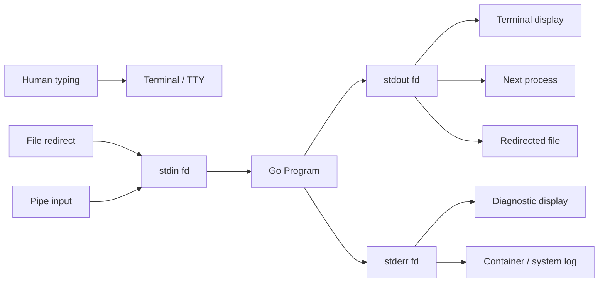
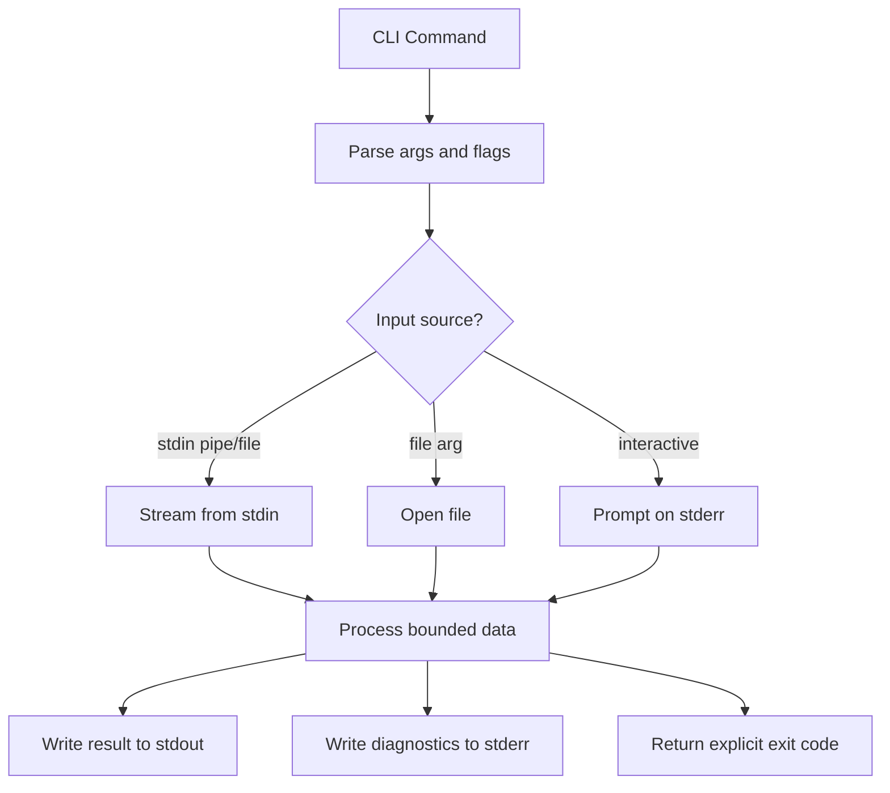
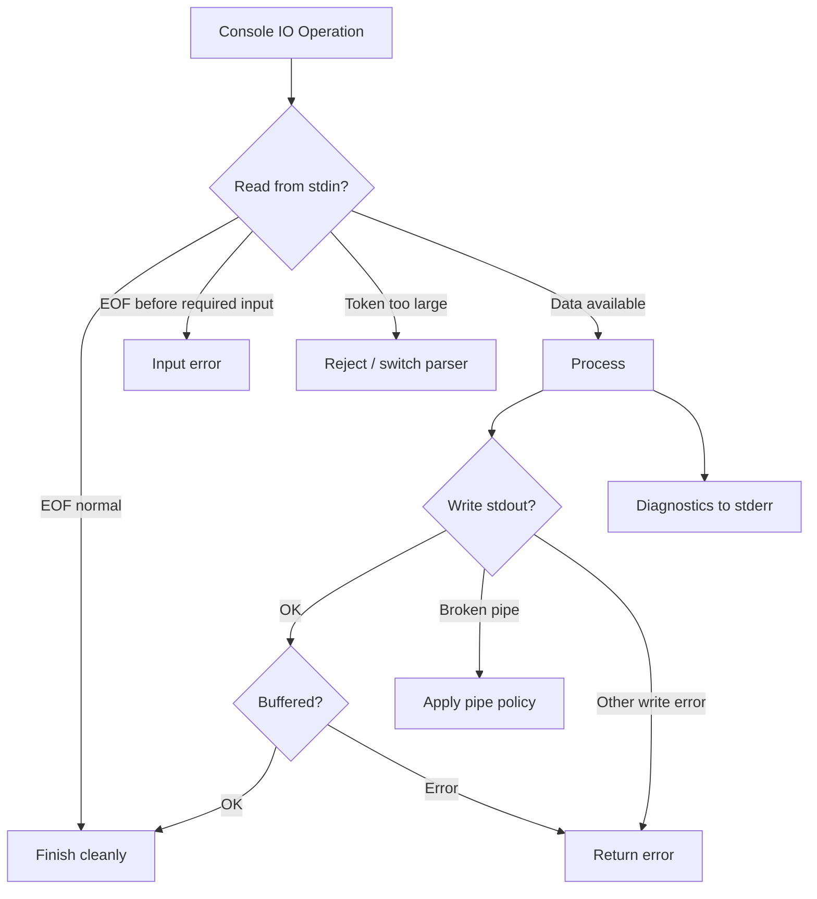

# learn-go-io-buffer-byte-stream-file-network-data-transfer-part-007.md

# Part 007 — Console IO: stdin, stdout, stderr, Terminal Behavior, Prompt, dan CLI Data Streams

> Target pembaca: Java software engineer yang ingin memahami Go Console IO bukan sebagai `println`, tetapi sebagai bagian dari sistem data transfer yang production-grade.
>
> Fokus part ini: bagaimana program Go membaca dari console, menulis ke console, memisahkan data output dari diagnostic output, menangani prompt, pipe, redirect, stream besar, error, dan terminal behavior.
>
> Versi target: Go 1.26.x.

---

## 0. Posisi Part Ini dalam Series

Sampai part sebelumnya, kita sudah membangun fondasi:

1. **Part 001**: data bergerak sebagai byte, slice, buffer, stream, file descriptor, file, socket.
2. **Part 002**: kontrak `io.Reader`, `io.Writer`, `io.Closer`, `io.Seeker`, `io.ReaderAt`, `io.WriterAt`.
3. **Part 003**: komposisi `io`: `Copy`, `LimitReader`, `TeeReader`, `MultiReader`, `Pipe`, dan sejenisnya.
4. **Part 004**: buffer berbasis memory: `bytes.Buffer`, `bytes.Reader`, `strings.Reader`, ownership, aliasing.
5. **Part 005**: `bufio`: buffered reader/writer/scanner, tokenization, flush discipline.
6. **Part 006**: Text IO: UTF-8, rune, line protocol, CRLF, malformed input.

Part ini menerapkan semua mental model itu ke **console IO**.

Console IO sering terlihat sederhana:

```go
fmt.Println("hello")
```

Namun pada sistem nyata, console IO adalah boundary penting untuk:

- CLI tools.
- Batch jobs.
- Unix-style pipeline.
- Kubernetes container logs.
- CI/CD commands.
- Migration scripts.
- Operational tooling.
- Debug utility.
- Data export/import.
- Human prompt.
- Machine-readable output.

Kesalahan kecil di console IO dapat membuat tool sulit dipakai, sulit dites, sulit diobservasi, dan berbahaya saat dipakai dalam automation.

---

## 1. Mental Model Utama: Console IO adalah Stream, Bukan UI

Di Go, standard input/output/error adalah file-like stream.

Dari perspektif program:

```text
stdin   -> io.Reader
stdout  -> io.Writer
stderr  -> io.Writer
```

Secara konkret, package `os` menyediakan:

```go
os.Stdin
os.Stdout
os.Stderr
```

Ketiganya bertipe `*os.File`. Dokumentasi Go menyatakan bahwa `Stdin`, `Stdout`, dan `Stderr` adalah open files yang menunjuk ke file descriptor standard input, standard output, dan standard error.

Artinya, console IO bukan kasus khusus di level API. Ia hanya salah satu bentuk `io.Reader` dan `io.Writer`.



Konsekuensinya:

- Jangan menganggap stdin selalu keyboard.
- Jangan menganggap stdout selalu terminal layar.
- Jangan menganggap stderr selalu terlihat manusia.
- Jangan menganggap output hanya dibaca manusia.
- Jangan mencampur data machine-readable dengan progress log.

CLI production-grade harus berpikir seperti data pipeline.

---

## 2. Perbandingan dengan Java

Java engineer biasanya mengenal:

```java
System.in
System.out
System.err
Scanner
BufferedReader
PrintWriter
Console
```

Di Go, konsepnya mirip tetapi lebih eksplisit pada interface `io`.

| Java | Go | Catatan |
|---|---|---|
| `System.in` | `os.Stdin` | `*os.File`, implements `io.Reader` |
| `System.out` | `os.Stdout` | `*os.File`, implements `io.Writer` |
| `System.err` | `os.Stderr` | diagnostic writer |
| `BufferedReader` | `bufio.Reader` | buffered text/binary reader |
| `Scanner` | `bufio.Scanner` / `fmt.Fscan` | hati-hati token limit scanner |
| `PrintWriter` | `fmt.Fprint`, `bufio.Writer`, custom writer | error handling lebih eksplisit di Go |
| `Console.readPassword` | `golang.org/x/term.ReadPassword` | bukan standard library utama, tetapi official x package |
| stream composition | `io.Reader`/`io.Writer` composition | idiom Go sangat kuat di sini |

Perbedaan penting:

Java sering mendorong class-based abstraction. Go mendorong interface kecil:

```go
type Runner struct {
    In  io.Reader
    Out io.Writer
    Err io.Writer
}
```

Dengan bentuk ini, CLI Anda bisa berjalan dengan `os.Stdin`/`os.Stdout`/`os.Stderr` di production, tetapi memakai `strings.Reader` dan `bytes.Buffer` di test.

---

## 3. Tiga Channel Standard: stdin, stdout, stderr

### 3.1 stdin

`stdin` adalah input stream utama.

Sumbernya bisa:

- Keyboard interaktif.
- File redirect: `tool < input.txt`.
- Pipe: `cat input.txt | tool`.
- Here document.
- Process lain.
- CI secret injection.

Contoh basic:

```go
package main

import (
    "bufio"
    "fmt"
    "os"
    "strings"
)

func main() {
    r := bufio.NewReader(os.Stdin)

    line, err := r.ReadString('\n')
    if err != nil {
        fmt.Fprintf(os.Stderr, "read input: %v\n", err)
        os.Exit(1)
    }

    line = strings.TrimRight(line, "\r\n")
    fmt.Fprintf(os.Stdout, "received: %s\n", line)
}
```

Hal yang harus dipahami:

- `ReadString('\n')` menunggu delimiter atau error.
- Input mungkin tidak diakhiri newline.
- Input bisa sangat besar.
- Input bisa binary, bukan text.
- Input bisa berhenti di tengah karena pipe upstream mati.

### 3.2 stdout

`stdout` adalah output data utama.

Gunakan stdout untuk:

- Hasil command.
- Data yang akan dipipe ke command lain.
- JSON/CSV/line output.
- File content hasil transformasi.

Jangan gunakan stdout untuk:

- Progress bar.
- Debug log.
- Warning.
- Error message.
- Prompt interaktif saat stdout mungkin dipipe.

Contoh benar:

```go
fmt.Fprintln(os.Stdout, `{"status":"ok"}`)
fmt.Fprintln(os.Stderr, "processed 1000 records")
```

Dengan begitu:

```bash
tool > result.json
```

`result.json` tetap bersih.

### 3.3 stderr

`stderr` adalah channel diagnostic.

Gunakan stderr untuk:

- Error message.
- Warning.
- Progress.
- Human-oriented diagnostic.
- Prompt interaktif, jika tool mendukung non-piped mode.

Contoh:

```go
fmt.Fprintf(os.Stderr, "warning: skipped invalid row %d\n", row)
```

Pemisahan stdout/stderr adalah invariant penting CLI yang mature.

---

## 4. Invariant CLI Production-Grade

CLI yang baik memiliki invariant berikut:

| Invariant | Makna |
|---|---|
| stdout is data | Output utama harus bisa dipipe dan diparse |
| stderr is diagnostic | Progress/error/warning tidak mengotori output data |
| stdin may be non-interactive | Jangan selalu prompt user |
| output may be non-terminal | Jangan selalu emit warna/progress bar |
| errors carry exit status | Automation perlu membedakan sukses/gagal |
| input is bounded | Jangan `ReadAll` untrusted input tanpa limit |
| prompt is explicit | Prompt hanya saat memang mode interaktif |
| writer errors matter | Broken pipe, disk full redirect, closed fd harus dipertimbangkan |
| test via interfaces | Jangan hardcode `os.Stdin/Stdout/Stderr` di core logic |

Diagram:



---

## 5. Jangan Hardcode Standard Streams di Core Logic

Anti-pattern:

```go
func Run() error {
    fmt.Println("starting")
    scanner := bufio.NewScanner(os.Stdin)
    for scanner.Scan() {
        fmt.Println(strings.ToUpper(scanner.Text()))
    }
    return scanner.Err()
}
```

Masalah:

- Sulit dites.
- stdout bercampur data dan log.
- Tidak bisa reuse di HTTP handler, batch process, atau test.
- Tidak bisa inject faulty reader/writer.
- Tidak bisa capture output tanpa mengganti global file descriptor.

Pattern lebih baik:

```go
type App struct {
    In  io.Reader
    Out io.Writer
    Err io.Writer
}

func (a App) Run() error {
    scanner := bufio.NewScanner(a.In)
    for scanner.Scan() {
        fmt.Fprintln(a.Out, strings.ToUpper(scanner.Text()))
    }
    if err := scanner.Err(); err != nil {
        return fmt.Errorf("scan input: %w", err)
    }
    return nil
}

func main() {
    app := App{
        In:  os.Stdin,
        Out: os.Stdout,
        Err: os.Stderr,
    }
    if err := app.Run(); err != nil {
        fmt.Fprintf(os.Stderr, "error: %v\n", err)
        os.Exit(1)
    }
}
```

Test menjadi mudah:

```go
func TestAppRun(t *testing.T) {
    in := strings.NewReader("hello\nworld\n")
    var out bytes.Buffer
    var errOut bytes.Buffer

    app := App{In: in, Out: &out, Err: &errOut}

    if err := app.Run(); err != nil {
        t.Fatalf("Run() error = %v", err)
    }

    got := out.String()
    want := "HELLO\nWORLD\n"
    if got != want {
        t.Fatalf("output mismatch\ngot:  %q\nwant: %q", got, want)
    }
}
```

Ini adalah salah satu perbedaan maturity antara script kecil dan tool engineering-grade.

---

## 6. Membaca dari stdin: Pilihan API

Ada beberapa cara membaca dari stdin. Pilih berdasarkan semantics, bukan preferensi.

### 6.1 `io.Copy`: untuk pass-through stream

Jika program hanya meneruskan input ke output:

```go
if _, err := io.Copy(os.Stdout, os.Stdin); err != nil {
    fmt.Fprintf(os.Stderr, "copy: %v\n", err)
    os.Exit(1)
}
```

Cocok untuk:

- Binary-safe copying.
- Large stream.
- Tidak butuh line parsing.
- Tidak butuh load-all.

### 6.2 `bufio.Reader`: untuk line/protocol reader fleksibel

```go
r := bufio.NewReader(os.Stdin)
for {
    line, err := r.ReadString('\n')
    if len(line) > 0 {
        // process partial line too
    }
    if err == io.EOF {
        break
    }
    if err != nil {
        return err
    }
}
```

Cocok untuk:

- Line-based protocol.
- Perlu handle line panjang.
- Perlu `Peek`, `ReadSlice`, `UnreadByte`, atau kontrol detail.

### 6.3 `bufio.Scanner`: nyaman, tetapi punya batas token

```go
scanner := bufio.NewScanner(os.Stdin)
for scanner.Scan() {
    line := scanner.Text()
    fmt.Fprintln(os.Stdout, line)
}
if err := scanner.Err(); err != nil {
    fmt.Fprintf(os.Stderr, "scan: %v\n", err)
    os.Exit(1)
}
```

Cocok untuk:

- Input line-based kecil/sedang.
- Tokenisasi sederhana.
- CLI human input.

Tidak cocok untuk:

- Line sangat panjang tanpa menaikkan buffer.
- Binary stream.
- Protocol yang butuh precise framing.
- Input untrusted tanpa limit eksplisit.

Jika tetap memakai scanner untuk line lebih panjang:

```go
scanner := bufio.NewScanner(os.Stdin)
scanner.Buffer(make([]byte, 0, 64*1024), 10*1024*1024) // max token 10 MiB
```

Namun hati-hati: menaikkan max token berarti memperbesar potensi memory pressure. Batas harus punya alasan domain.

### 6.4 `fmt.Fscan`: untuk token typed sederhana

```go
var name string
var age int
if _, err := fmt.Fscan(os.Stdin, &name, &age); err != nil {
    fmt.Fprintf(os.Stderr, "invalid input: %v\n", err)
    os.Exit(1)
}
fmt.Fprintf(os.Stdout, "%s is %d\n", name, age)
```

Cocok untuk:

- Competitive-programming-style input.
- Internal simple tool.
- Typed whitespace-separated tokens.

Kurang cocok untuk:

- UX CLI yang baik.
- Error reporting detail.
- Complex grammar.
- High-performance parser.

### 6.5 `io.ReadAll`: hanya untuk input bounded/trusted

```go
data, err := io.ReadAll(io.LimitReader(os.Stdin, 1<<20)) // max 1 MiB
if err != nil {
    return err
}
```

`io.ReadAll` memang makin efisien di Go 1.26 untuk input besar, tetapi prinsip production tetap sama: jangan load untrusted stream tanpa limit. Optimisasi runtime/library tidak mengganti threat model.

---

## 7. Menulis ke stdout/stderr: Error Tidak Boleh Diabaikan Sembarangan

Banyak contoh Go menulis begini:

```go
fmt.Println("hello")
```

Untuk tutorial kecil, itu cukup. Untuk tool production-grade, writer error bisa penting.

Contoh error nyata:

- `stdout` dipipe ke process lain yang berhenti lebih awal.
- Output diarahkan ke file dan disk penuh.
- File descriptor ditutup parent process.
- Network-mounted filesystem error saat redirect.
- CI runner menghentikan stream.

Contoh explicit write:

```go
func writeLine(w io.Writer, s string) error {
    if _, err := fmt.Fprintln(w, s); err != nil {
        return fmt.Errorf("write line: %w", err)
    }
    return nil
}
```

Main:

```go
if err := writeLine(os.Stdout, "result"); err != nil {
    fmt.Fprintf(os.Stderr, "error: %v\n", err)
    os.Exit(1)
}
```

Pada banyak CLI Unix, broken pipe bisa diperlakukan khusus agar tidak menampilkan error noisy saat user melakukan:

```bash
tool | head -n 10
```

Secara desain, Anda perlu memutuskan:

- Apakah broken pipe dianggap normal consumer cancellation?
- Apakah tool harus exit non-zero?
- Apakah error harus disembunyikan jika downstream sengaja berhenti?

Kita akan membahas detail syscall/error spesifik lebih dalam di part file/network, tetapi mental model-nya dimulai di sini.

---

## 8. Buffering stdout: Kapan Pakai `bufio.Writer`

`os.Stdout` bisa langsung ditulis, tetapi banyak write kecil dapat memperbanyak syscall.

Anti-pattern:

```go
for _, row := range rows {
    fmt.Fprintf(os.Stdout, "%s,%d\n", row.Name, row.Count)
}
```

Lebih baik untuk output besar:

```go
bw := bufio.NewWriterSize(os.Stdout, 256*1024)
defer bw.Flush() // lihat catatan error di bawah

for _, row := range rows {
    if _, err := fmt.Fprintf(bw, "%s,%d\n", row.Name, row.Count); err != nil {
        fmt.Fprintf(os.Stderr, "write row: %v\n", err)
        os.Exit(1)
    }
}

if err := bw.Flush(); err != nil {
    fmt.Fprintf(os.Stderr, "flush stdout: %v\n", err)
    os.Exit(1)
}
```

Catatan penting: `defer bw.Flush()` saja sering tidak cukup karena error flush hilang. Untuk production, flush error harus diamati.

Pattern lebih baik:

```go
func run(out io.Writer) error {
    bw := bufio.NewWriter(out)

    for i := 0; i < 1000; i++ {
        if _, err := fmt.Fprintf(bw, "%d\n", i); err != nil {
            return fmt.Errorf("write output: %w", err)
        }
    }

    if err := bw.Flush(); err != nil {
        return fmt.Errorf("flush output: %w", err)
    }
    return nil
}
```

Rule praktis:

| Situasi | Writer |
|---|---|
| Sedikit output human-readable | langsung `fmt.Fprintln(os.Stdout, ...)` cukup |
| Banyak line kecil | `bufio.Writer` |
| Binary copy besar | `io.Copy` / `io.CopyBuffer` |
| Butuh immediate display | direct write atau flush periodik |
| Progress bar | stderr, bukan stdout |

---

## 9. Prompt: Jangan Merusak Pipeline

Prompt adalah tricky karena prompt adalah output untuk manusia, bukan data output.

Anti-pattern:

```go
fmt.Print("Enter name: ") // stdout
fmt.Scanln(&name)
fmt.Println(name)        // stdout
```

Jika user menjalankan:

```bash
tool > output.txt
```

Maka prompt ikut masuk ke file output.

Lebih baik:

```go
fmt.Fprint(os.Stderr, "Enter name: ")
```

Prompt masuk stderr, hasil tetap stdout.

Contoh testable prompt:

```go
func promptLine(in io.Reader, promptOut io.Writer, prompt string) (string, error) {
    if _, err := fmt.Fprint(promptOut, prompt); err != nil {
        return "", fmt.Errorf("write prompt: %w", err)
    }

    r := bufio.NewReader(in)
    line, err := r.ReadString('\n')
    if err != nil && err != io.EOF {
        return "", fmt.Errorf("read prompt input: %w", err)
    }
    if err == io.EOF && len(line) == 0 {
        return "", io.EOF
    }

    return strings.TrimRight(line, "\r\n"), nil
}
```

Use:

```go
name, err := promptLine(os.Stdin, os.Stderr, "Name: ")
```

Kenapa prompt ke stderr?

Karena stdout harus tetap machine-readable.

---

## 10. Interaktif vs Non-Interaktif

Program CLI harus membedakan dua mode:

1. **Interactive mode**: stdin/stdout/stderr terhubung ke terminal.
2. **Non-interactive mode**: stdin/stdout dipipe/redirect.

Contoh:

```bash
# interactive
mytool

# non-interactive stdin
cat input.txt | mytool

# non-interactive stdout
mytool > output.json

# full automation
cat input.txt | mytool --json > output.json 2> errors.log
```

Mengapa penting?

- Jangan prompt jika stdin dari pipe.
- Jangan emit progress bar jika stdout bukan terminal.
- Jangan emit ANSI color ke file output kecuali diminta.
- Jangan membaca password dengan echo jika terminal tidak tersedia.

Package standard library tidak menyediakan semua fitur terminal detection secara high-level. Package `golang.org/x/term` menyediakan fungsi terminal support seperti raw mode dan `ReadPassword`, dan umum dipakai untuk kebutuhan terminal yang lebih spesifik.

Contoh konsep dengan `x/term`:

```go
import "golang.org/x/term"

if term.IsTerminal(int(os.Stdout.Fd())) {
    // safe to emit human terminal formatting
}
```

Password prompt:

```go
fmt.Fprint(os.Stderr, "Password: ")
password, err := term.ReadPassword(int(os.Stdin.Fd()))
fmt.Fprintln(os.Stderr)
if err != nil {
    return fmt.Errorf("read password: %w", err)
}
_ = password
```

Catatan:

- `golang.org/x/term` bukan package standard library, tetapi merupakan package resmi dari Go extended repositories.
- Jangan menulis secret ke stdout/stderr/log.
- Jangan menyimpan password sebagai string lebih lama dari perlu, karena string immutable dan lebih sulit dihapus dari memory.

---

## 11. Console Output Format: Human vs Machine

CLI yang matang biasanya punya dua kelas output:

1. Human-readable.
2. Machine-readable.

Contoh mode human:

```text
User imported successfully.
Rows processed: 1200
Rows skipped: 3
```

Contoh mode JSON:

```json
{"status":"ok","processed":1200,"skipped":3}
```

Prinsip:

- Machine-readable output harus stabil.
- Human-readable output boleh berubah.
- Jangan parsing human output di automation.
- Kalau output akan dipakai sistem lain, sediakan `--json`, `--csv`, atau line-delimited format.

Contoh desain:

```go
type OutputFormat string

const (
    OutputHuman OutputFormat = "human"
    OutputJSON  OutputFormat = "json"
)

type Result struct {
    Status    string `json:"status"`
    Processed int    `json:"processed"`
    Skipped   int    `json:"skipped"`
}

func writeResult(w io.Writer, format OutputFormat, r Result) error {
    switch format {
    case OutputHuman:
        _, err := fmt.Fprintf(w, "Status: %s\nProcessed: %d\nSkipped: %d\n", r.Status, r.Processed, r.Skipped)
        return err
    case OutputJSON:
        enc := json.NewEncoder(w)
        return enc.Encode(r)
    default:
        return fmt.Errorf("unsupported output format %q", format)
    }
}
```

---

## 12. Exit Code adalah Bagian dari IO Contract

CLI tidak hanya berkomunikasi lewat stdout/stderr, tetapi juga lewat exit code.

Umum:

| Exit Code | Makna Umum |
|---:|---|
| 0 | sukses |
| 1 | generic failure |
| 2 | usage/flag/input error, banyak CLI memakai ini |
| 126/127 | convention shell untuk command tidak executable/tidak ditemukan |
| 130 | terminated by Ctrl-C/SIGINT convention |

Go tidak memaksa taxonomy ini. Anda harus mendesainnya.

Pattern:

```go
type ExitError struct {
    Code int
    Err  error
}

func (e ExitError) Error() string {
    return e.Err.Error()
}

func exitCode(err error) int {
    if err == nil {
        return 0
    }
    var ee ExitError
    if errors.As(err, &ee) {
        return ee.Code
    }
    return 1
}

func main() {
    if err := run(os.Stdin, os.Stdout, os.Stderr, os.Args[1:]); err != nil {
        fmt.Fprintf(os.Stderr, "error: %v\n", err)
        os.Exit(exitCode(err))
    }
}
```

Jangan panggil `os.Exit` jauh di dalam business logic karena:

- `defer` tidak berjalan.
- Sulit dites.
- Sulit compose.
- Resource cleanup bisa terlewat.

Letakkan `os.Exit` di `main` boundary.

---

## 13. `flag`: Console IO Dimulai dari Argumen

Console IO bukan hanya stdin/stdout. Command-line arguments juga bagian dari interaction boundary.

Package `flag` di standard library menyediakan command-line flag parsing.

Contoh:

```go
func run(in io.Reader, out io.Writer, errOut io.Writer, args []string) error {
    fs := flag.NewFlagSet("mytool", flag.ContinueOnError)
    fs.SetOutput(errOut)

    format := fs.String("format", "human", "output format: human or json")
    limit := fs.Int64("limit", 10<<20, "maximum bytes to read from stdin")

    if err := fs.Parse(args); err != nil {
        return ExitError{Code: 2, Err: err}
    }

    _ = format
    _ = limit
    _ = in
    _ = out
    return nil
}
```

Poin penting:

- Gunakan `flag.NewFlagSet`, bukan global `flag.CommandLine`, untuk testability.
- Arahkan usage/error ke `errOut`, bukan stdout.
- Return error, jangan langsung exit di parser.
- Pisahkan parse args dari process data.

---

## 14. Console IO dalam Unix Pipeline

Go sangat cocok untuk Unix-style tools jika stdout/stderr dijaga benar.

Contoh pipeline:

```bash
cat access.log \
  | myfilter --status=500 \
  | mycount --group-by endpoint \
  > report.json
```

Agar pipeline seperti ini kuat:

- Program harus streaming input, bukan selalu load-all.
- Program harus menjaga stdout hanya data.
- Program harus menggunakan stderr untuk progress/error.
- Program harus handle EOF normal.
- Program harus punya bounded memory.
- Program harus memberi exit code benar.

Contoh line filter:

```go
func filterLines(in io.Reader, out io.Writer, contains string) error {
    scanner := bufio.NewScanner(in)
    scanner.Buffer(make([]byte, 0, 64*1024), 4*1024*1024)

    bw := bufio.NewWriter(out)
    defer bw.Flush()

    for scanner.Scan() {
        line := scanner.Text()
        if strings.Contains(line, contains) {
            if _, err := fmt.Fprintln(bw, line); err != nil {
                return fmt.Errorf("write filtered line: %w", err)
            }
        }
    }
    if err := scanner.Err(); err != nil {
        return fmt.Errorf("scan input: %w", err)
    }
    if err := bw.Flush(); err != nil {
        return fmt.Errorf("flush output: %w", err)
    }
    return nil
}
```

Catatan: `defer bw.Flush()` di atas berguna sebagai best-effort, tetapi explicit flush tetap dilakukan untuk menangkap error.

---

## 15. Progress Output

Progress adalah diagnostic, bukan data.

Anti-pattern:

```go
fmt.Fprintf(os.Stdout, "processed %d rows\r", n)
```

Jika stdout dipipe ke parser, progress akan merusak data.

Lebih baik:

```go
fmt.Fprintf(os.Stderr, "processed %d rows\r", n)
```

Namun progress dengan carriage return `\r` juga harus dipakai hati-hati:

- Cocok untuk terminal interaktif.
- Tidak cocok untuk log collector.
- Dalam container logs, `\r` bisa menjadi noise.
- Dalam CI, progress terlalu sering bisa membanjiri log.

Pattern lebih aman:

```go
type Progress struct {
    W           io.Writer
    Interactive bool
    Every       int
}

func (p Progress) Report(n int) {
    if p.W == nil || p.Every <= 0 || n%p.Every != 0 {
        return
    }
    if p.Interactive {
        fmt.Fprintf(p.W, "processed %d rows\r", n)
    } else {
        fmt.Fprintf(p.W, "processed %d rows\n", n)
    }
}
```

---

## 16. ANSI Color dan Terminal Formatting

Warna dapat membantu manusia, tetapi merusak machine-readable output jika tidak dikontrol.

Prinsip:

- Jangan emit ANSI color ke stdout data mode.
- Aktifkan color hanya jika target adalah terminal atau user memaksa `--color=always`.
- Dukung `--color=auto|always|never` jika CLI serius.
- Matikan color untuk JSON/CSV.

Contoh policy:

```go
type ColorMode string

const (
    ColorAuto   ColorMode = "auto"
    ColorAlways ColorMode = "always"
    ColorNever  ColorMode = "never"
)

func useColor(mode ColorMode, isTerminal bool) bool {
    switch mode {
    case ColorAlways:
        return true
    case ColorNever:
        return false
    default:
        return isTerminal
    }
}
```

Ini bukan soal estetika. Ini soal compatibility dengan pipe, file, CI, log collector, dan automation.

---

## 17. Signal dan Ctrl-C

Interactive CLI harus memperhatikan Ctrl-C.

Secara OS, Ctrl-C biasanya mengirim signal interrupt. Di Go, package `os/signal` bisa dipakai untuk menangani signal.

Contoh sederhana:

```go
ctx, stop := signal.NotifyContext(context.Background(), os.Interrupt)
defer stop()

if err := runWithContext(ctx, os.Stdin, os.Stdout, os.Stderr); err != nil {
    fmt.Fprintf(os.Stderr, "error: %v\n", err)
    os.Exit(1)
}
```

Dengan context:

```go
func runWithContext(ctx context.Context, in io.Reader, out io.Writer, errOut io.Writer) error {
    done := make(chan error, 1)
    go func() {
        _, err := io.Copy(out, in)
        done <- err
    }()

    select {
    case <-ctx.Done():
        return ctx.Err()
    case err := <-done:
        return err
    }
}
```

Catatan penting:

- Tidak semua blocking IO otomatis berhenti hanya karena context canceled.
- Untuk file/terminal/stdin, cancellation bisa butuh mekanisme lain seperti menutup descriptor atau desain goroutine khusus.
- Detail ini akan dibahas lebih dalam pada part networking dan graceful shutdown.

Untuk sekarang, pahami bahwa console IO juga punya lifecycle dan cancellation boundary.

---

## 18. Raw Mode vs Cooked Mode

Terminal biasanya berjalan dalam cooked/canonical mode:

- Input line-buffered oleh terminal.
- User bisa edit dengan backspace.
- Program menerima input setelah Enter.
- Ctrl-C ditangani terminal/OS sebagai signal.

Raw mode berbeda:

- Program menerima key press lebih langsung.
- Terminal tidak otomatis echo/edit line.
- Cocok untuk TUI, password, key-by-key input.
- Harus restore terminal state.

Dengan `golang.org/x/term`:

```go
oldState, err := term.MakeRaw(int(os.Stdin.Fd()))
if err != nil {
    return err
}
defer term.Restore(int(os.Stdin.Fd()), oldState)
```

Raw mode adalah resource state. Jika tidak dipulihkan, terminal user bisa rusak sementara.

Production rule:

- Selalu `defer Restore` setelah `MakeRaw` sukses.
- Jangan masuk raw mode jika stdin bukan terminal.
- Handle panic/error path agar terminal tetap dipulihkan.
- Jangan gunakan raw mode untuk CLI biasa.

---

## 19. Secret Input

Secret input berbeda dari text input biasa.

Masalah:

- Jangan echo ke terminal.
- Jangan log.
- Jangan print ulang dalam error.
- Jangan simpan dalam config file tanpa enkripsi/permission benar.
- Jangan kirim ke stdout.
- Hati-hati string immutable.

Contoh:

```go
func readSecret(promptOut io.Writer, fd int) ([]byte, error) {
    if _, err := fmt.Fprint(promptOut, "Password: "); err != nil {
        return nil, err
    }
    secret, err := term.ReadPassword(fd)
    fmt.Fprintln(promptOut)
    if err != nil {
        return nil, err
    }
    return secret, nil
}
```

Jangan:

```go
fmt.Printf("password=%s\n", password)
```

Bahkan dalam debug.

---

## 20. Console IO dan Container/Kubernetes

Dalam container, stdout/stderr sering menjadi log stream.

Konsekuensi:

- stdout/stderr bisa dikumpulkan oleh container runtime.
- Log collector dapat memisahkan stdout dan stderr atau menggabungkannya.
- Progress bar dengan `\r` bisa buruk di log.
- JSON log line lebih mudah diproses.
- Long-running service sebaiknya log structured ke stdout/stderr sesuai platform convention.

Namun untuk CLI data tool di container:

- stdout tetap bisa dipakai sebagai data output.
- stderr untuk diagnostic.
- Jangan anggap warna tersedia.
- Jangan prompt dalam batch job.

Contoh mode batch:

```bash
kubectl exec job-pod -- mytool --format=json < input.json > output.json 2> diagnostics.log
```

Jika tool mencampur progress ke stdout, output JSON rusak.

---

## 21. Console IO dan Security

Console IO adalah trust boundary.

Input dari stdin bisa malicious:

- Sangat besar.
- Tidak newline-terminated.
- Mengandung escape sequence.
- Mengandung control character.
- Mengandung invalid UTF-8.
- Mengandung path traversal jika dipakai sebagai path.
- Mengandung JSON/XML bomb jika diparse lanjut.
- Mengandung terminal escape injection.

### 21.1 Terminal escape injection

Jika program mencetak input user mentah ke terminal, input dapat berisi ANSI escape sequence.

Contoh berbahaya secara UX/log:

```text
\x1b[2J\x1b[Hfake clean screen
```

Jika dicetak ke terminal, dapat membersihkan layar atau memanipulasi tampilan.

Mitigasi:

- Escape/control sanitize untuk human display.
- Untuk log, gunakan quoted output `%q` atau JSON encoding.
- Jangan print untrusted bytes sebagai terminal control.

Contoh:

```go
fmt.Fprintf(os.Stderr, "invalid input: %q\n", value)
```

### 21.2 Unbounded stdin

Anti-pattern:

```go
data, err := io.ReadAll(os.Stdin)
```

Lebih aman:

```go
const maxInput = 16 << 20 // 16 MiB
lr := io.LimitReader(os.Stdin, maxInput+1)
data, err := io.ReadAll(lr)
if err != nil {
    return err
}
if int64(len(data)) > maxInput {
    return fmt.Errorf("input too large: limit %d bytes", maxInput)
}
```

Untuk stream besar, jangan load-all. Stream processing lebih baik.

---

## 22. Testing Console IO

Design yang testable menggunakan dependency injection:

```go
func run(in io.Reader, out io.Writer, errOut io.Writer, args []string) error
```

Test stdout:

```go
func TestRunOutput(t *testing.T) {
    in := strings.NewReader("alpha\nbeta\n")
    var out bytes.Buffer
    var errOut bytes.Buffer

    err := run(in, &out, &errOut, []string{"--upper"})
    if err != nil {
        t.Fatalf("run: %v", err)
    }

    if got, want := out.String(), "ALPHA\nBETA\n"; got != want {
        t.Fatalf("stdout\ngot:  %q\nwant: %q", got, want)
    }
    if errOut.Len() != 0 {
        t.Fatalf("stderr should be empty, got %q", errOut.String())
    }
}
```

Test stderr pada error:

```go
func TestRunInvalidFlag(t *testing.T) {
    var out bytes.Buffer
    var errOut bytes.Buffer

    err := run(strings.NewReader(""), &out, &errOut, []string{"--bad"})
    if err == nil {
        t.Fatal("expected error")
    }
    if out.Len() != 0 {
        t.Fatalf("stdout should be empty, got %q", out.String())
    }
    if errOut.Len() == 0 {
        t.Fatal("expected usage/error on stderr")
    }
}
```

Test writer failure:

```go
type failingWriter struct{}

func (f failingWriter) Write(p []byte) (int, error) {
    return 0, errors.New("write failed")
}

func TestRunWriteFailure(t *testing.T) {
    err := run(strings.NewReader("x\n"), failingWriter{}, io.Discard, nil)
    if err == nil {
        t.Fatal("expected write error")
    }
}
```

Tanpa abstraction, test seperti ini hampir mustahil tanpa manipulasi global process state.

---

## 23. Golden File vs Inline Expected Output

Untuk CLI, test output bisa menggunakan:

1. Inline expected string.
2. Golden file.
3. JSON decode compare.
4. Snapshot-style output.

Rule:

- Untuk output pendek, inline lebih jelas.
- Untuk output panjang/stabil, golden file bisa membantu.
- Untuk JSON, decode dan compare struct/map agar tidak rapuh terhadap whitespace.
- Untuk human output, golden file boleh, tetapi jangan jadikan format human sebagai API stabil kecuali memang dijanjikan.

Contoh JSON compare:

```go
var got Result
if err := json.Unmarshal(out.Bytes(), &got); err != nil {
    t.Fatalf("invalid json: %v", err)
}
if got.Processed != 10 {
    t.Fatalf("processed = %d", got.Processed)
}
```

---

## 24. Console IO Failure Model

Console IO punya failure mode yang sering diremehkan.

| Failure | Contoh | Dampak | Mitigasi |
|---|---|---|---|
| EOF before input | pipe kosong | no data | treat EOF explicitly |
| partial line | file tanpa newline akhir | last record hilang jika salah handle | process `len(line)>0` before EOF break |
| scanner token too long | line log 10 MiB | scan error | configure buffer or use reader |
| broken pipe | `tool | head` | write error | decide policy |
| disk full redirect | `tool > /full/file` | flush/write fail | check write/flush error |
| prompt in pipe mode | CI hang | stuck job | detect/require explicit flag |
| progress in stdout | JSON corrupted | downstream fail | progress to stderr |
| ANSI in logs | unreadable logs | poor ops | color policy |
| raw mode not restored | broken terminal | bad UX | defer restore |
| secret printed | credential leak | security incident | never log secrets |
| unbounded read | memory OOM | crash/DoS | limit or stream |

Diagram:



---

## 25. A Production-Grade Mini CLI Skeleton

Berikut skeleton CLI yang lebih matang.

```go
package main

import (
    "bufio"
    "encoding/json"
    "errors"
    "flag"
    "fmt"
    "io"
    "os"
    "strings"
)

type ExitError struct {
    Code int
    Err  error
}

func (e ExitError) Error() string { return e.Err.Error() }
func (e ExitError) Unwrap() error { return e.Err }

type Config struct {
    Format string
    Upper  bool
    Limit  int64
}

type Result struct {
    Lines int `json:"lines"`
}

func main() {
    if err := run(os.Stdin, os.Stdout, os.Stderr, os.Args[1:]); err != nil {
        fmt.Fprintf(os.Stderr, "error: %v\n", err)
        os.Exit(codeOf(err))
    }
}

func codeOf(err error) int {
    if err == nil {
        return 0
    }
    var ee ExitError
    if errors.As(err, &ee) {
        return ee.Code
    }
    return 1
}

func run(in io.Reader, out io.Writer, errOut io.Writer, args []string) error {
    cfg, err := parseArgs(errOut, args)
    if err != nil {
        return err
    }

    limited := io.LimitReader(in, cfg.Limit+1)
    scanner := bufio.NewScanner(limited)
    scanner.Buffer(make([]byte, 0, 64*1024), 4*1024*1024)

    bw := bufio.NewWriter(out)

    result := Result{}
    for scanner.Scan() {
        result.Lines++
        line := scanner.Text()
        if cfg.Upper {
            line = strings.ToUpper(line)
        }
        if cfg.Format == "text" {
            if _, err := fmt.Fprintln(bw, line); err != nil {
                return fmt.Errorf("write output: %w", err)
            }
        }
    }
    if err := scanner.Err(); err != nil {
        return fmt.Errorf("scan input: %w", err)
    }

    if cfg.Format == "json" {
        if err := json.NewEncoder(bw).Encode(result); err != nil {
            return fmt.Errorf("encode result: %w", err)
        }
    }

    if err := bw.Flush(); err != nil {
        return fmt.Errorf("flush output: %w", err)
    }

    fmt.Fprintf(errOut, "processed %d lines\n", result.Lines)
    return nil
}

func parseArgs(errOut io.Writer, args []string) (Config, error) {
    fs := flag.NewFlagSet("mini", flag.ContinueOnError)
    fs.SetOutput(errOut)

    cfg := Config{}
    fs.StringVar(&cfg.Format, "format", "text", "output format: text or json")
    fs.BoolVar(&cfg.Upper, "upper", false, "uppercase text output")
    fs.Int64Var(&cfg.Limit, "limit", 64<<20, "maximum input bytes")

    if err := fs.Parse(args); err != nil {
        return Config{}, ExitError{Code: 2, Err: err}
    }
    switch cfg.Format {
    case "text", "json":
    default:
        return Config{}, ExitError{Code: 2, Err: fmt.Errorf("invalid format %q", cfg.Format)}
    }
    if cfg.Limit <= 0 {
        return Config{}, ExitError{Code: 2, Err: fmt.Errorf("limit must be positive")}
    }
    return cfg, nil
}
```

Kualitas skeleton ini:

- Core logic menerima `io.Reader`/`io.Writer`.
- stdout dan stderr terpisah.
- `flag.FlagSet` testable.
- Input dibatasi.
- Output buffered.
- Flush error ditangkap.
- Exit code dipisah dari business logic.
- JSON output tersedia sebagai machine-readable mode.

Kelemahan yang sengaja belum diselesaikan di part ini:

- LimitReader tidak membedakan input tepat limit vs melebihi limit tanpa pembacaan sentinel khusus.
- Scanner masih line/token based dengan max token tertentu.
- Belum ada terminal detection.
- Belum ada broken pipe policy spesifik.
- Belum ada signal-aware cancellation penuh.

Ini akan menjadi bahan lanjutan di part berikutnya.

---

## 26. Checklist Desain CLI IO

Sebelum menganggap CLI siap production, tanyakan:

1. Apakah stdout hanya berisi data output?
2. Apakah diagnostic selalu ke stderr?
3. Apakah usage/help/error flag tidak mengotori stdout?
4. Apakah stdin bisa berasal dari pipe/file?
5. Apakah tool tidak prompt saat non-interactive automation?
6. Apakah input punya limit atau diproses streaming?
7. Apakah scanner token limit sesuai domain?
8. Apakah write error dan flush error ditangani?
9. Apakah exit code bermakna?
10. Apakah core logic testable tanpa real terminal?
11. Apakah secret tidak pernah masuk log/output?
12. Apakah ANSI/progress hanya muncul dalam mode yang tepat?
13. Apakah output machine-readable stabil?
14. Apakah partial line/EOF diproses benar?
15. Apakah Ctrl-C/cancellation punya behavior yang jelas?

---

## 27. Anti-Pattern yang Sering Muncul

### 27.1 `fmt.Println` di library code

Buruk:

```go
func Process() {
    fmt.Println("processing")
}
```

Lebih baik:

```go
func Process(logw io.Writer) {
    fmt.Fprintln(logw, "processing")
}
```

Atau gunakan logger yang diinjeksi, tergantung konteks.

### 27.2 Prompt di stdout

Buruk:

```go
fmt.Print("Password: ")
```

Lebih baik:

```go
fmt.Fprint(os.Stderr, "Password: ")
```

### 27.3 Mengabaikan flush error

Buruk:

```go
bw := bufio.NewWriter(os.Stdout)
defer bw.Flush()
```

Lebih baik:

```go
if err := bw.Flush(); err != nil {
    return err
}
```

### 27.4 `io.ReadAll(os.Stdin)` tanpa limit

Buruk untuk untrusted input.

Lebih baik:

```go
r := io.LimitReader(os.Stdin, max+1)
```

Atau stream line/chunk.

### 27.5 Parsing human output di automation

Buruk:

```bash
count=$(tool | grep "Rows" | awk '{print $3}')
```

Lebih baik:

```bash
count=$(tool --format=json | jq '.processed')
```

---

## 28. Design Exercise

### Exercise 1 — Safe line transformer

Buat CLI:

```bash
upper < input.txt > output.txt
```

Requirement:

- Membaca stdin line by line.
- Menulis uppercase ke stdout.
- Progress setiap 10.000 line ke stderr.
- Input line max 4 MiB.
- stdout write/flush error harus ditangani.
- Bisa dites dengan `strings.Reader` dan `bytes.Buffer`.

### Exercise 2 — JSON mode

Tambahkan flag:

```bash
upper --summary=json
```

Output data utama tetap transformed text, tetapi summary harus ke stderr atau file terpisah. Diskusikan apakah summary boleh stdout. Jawaban engineering yang baik: tergantung contract command. Kalau stdout adalah transformed data stream, summary jangan stdout.

### Exercise 3 — Prompt-safe command

Buat command:

```bash
create-user --name alice
```

Jika `--name` tidak diberikan:

- Dalam interactive mode, prompt ke stderr.
- Dalam non-interactive mode, error dengan exit code usage.

### Exercise 4 — Writer failure

Buat custom writer yang gagal setelah N bytes. Pastikan CLI mengembalikan error dan tidak menganggap sukses.

---

## 29. Ringkasan Mental Model

Console IO di Go adalah penerapan langsung dari model besar IO:

```text
stdin  = input stream  = io.Reader
stdout = data stream   = io.Writer
stderr = diagnostic    = io.Writer
```

Hal paling penting:

1. Console IO adalah stream, bukan sekadar UI.
2. stdout harus diperlakukan sebagai data contract.
3. stderr harus dipakai untuk diagnostic, prompt, warning, progress.
4. Core logic harus menerima `io.Reader`/`io.Writer`, bukan hardcode global stream.
5. Prompt hanya aman jika mode interaktif jelas.
6. Buffered writer harus di-flush dan flush error harus ditangani.
7. Input dari stdin harus dianggap untrusted dan potentially unbounded.
8. Exit code adalah bagian dari API CLI.
9. Testing console IO harus dilakukan lewat injected streams.
10. Console IO yang buruk merusak automation, pipeline, CI/CD, dan observability.

---

## 30. Hubungan ke Part Berikutnya

Part berikutnya adalah:

```text
learn-go-io-buffer-byte-stream-file-network-data-transfer-part-008.md
```

Topik:

```text
Error semantics in IO: partial read/write, EOF, short write, timeout, cancellation
```

Di part ini kita sudah melihat error console IO secara praktis. Part 008 akan masuk lebih dalam ke kontrak error yang berlaku lintas semua IO:

- `n > 0` dengan `err != nil`.
- `io.EOF` sebagai terminal condition.
- short read vs short write.
- `io.ErrUnexpectedEOF`.
- timeout dan temporary error.
- cancellation semantics.
- kapan retry aman dan kapan berbahaya.
- bagaimana membangun loop read/write yang benar.

---

## Referensi Resmi

- Go `os` package: https://pkg.go.dev/os
- Go `fmt` package: https://pkg.go.dev/fmt
- Go `bufio` package: https://pkg.go.dev/bufio
- Go `io` package: https://pkg.go.dev/io
- Go `flag` package: https://pkg.go.dev/flag
- Go `os/exec` package: https://pkg.go.dev/os/exec
- Go `golang.org/x/term` package: https://pkg.go.dev/golang.org/x/term
- Go 1.26 Release Notes: https://go.dev/doc/go1.26
- Go Release History: https://go.dev/doc/devel/release

---

## Status Seri

Seri belum selesai.

Progress saat ini:

```text
Part 000 selesai
Part 001 selesai
Part 002 selesai
Part 003 selesai
Part 004 selesai
Part 005 selesai
Part 006 selesai
Part 007 selesai  <-- posisi saat ini
Part 008 berikutnya
...
Part 034 terakhir
```

<!-- NAVIGATION_FOOTER -->
<div class="page-nav">
<a href="./learn-go-io-buffer-byte-stream-file-network-data-transfer-part-006.md">⬅️ Part 006 — Text IO: UTF-8, Rune Boundary, Line Protocol, CRLF, dan Malformed Input</a>
<a href="./index.md">📚 Kategori</a>
<a href="../../index.md">🏠 Home</a>
<a href="./learn-go-io-buffer-byte-stream-file-network-data-transfer-part-008.md">Part 008 — Error Semantics in IO: Partial Progress, EOF, Short Write, Timeout, Cancellation ➡️</a>
</div>
