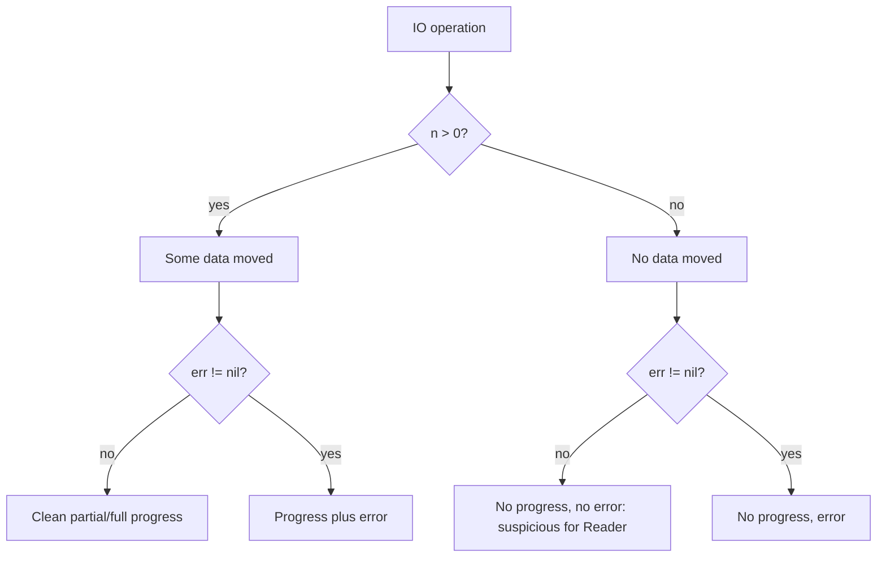
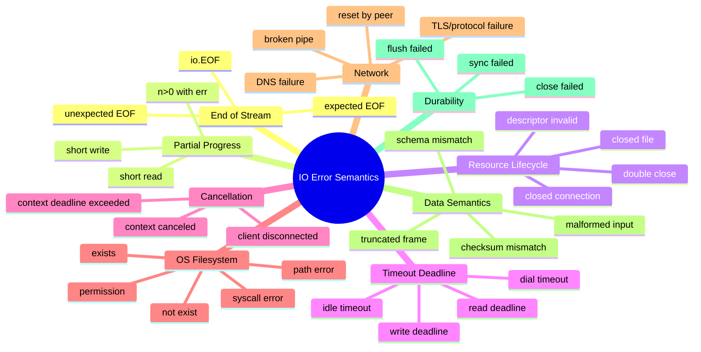
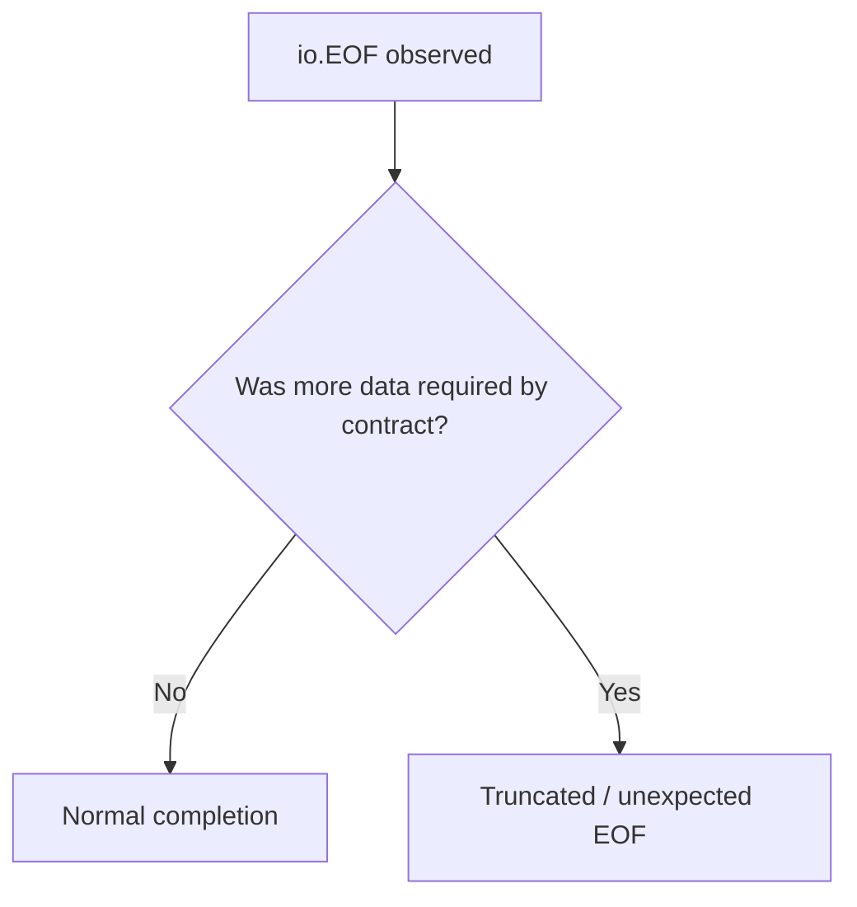
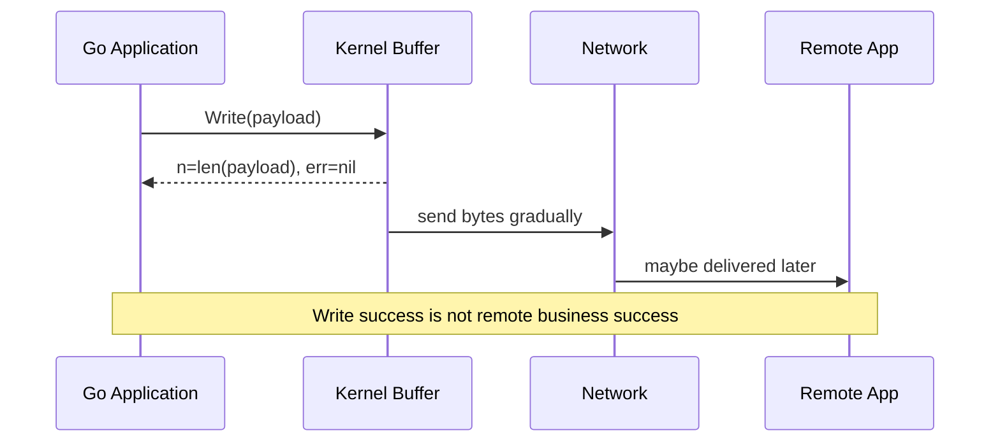
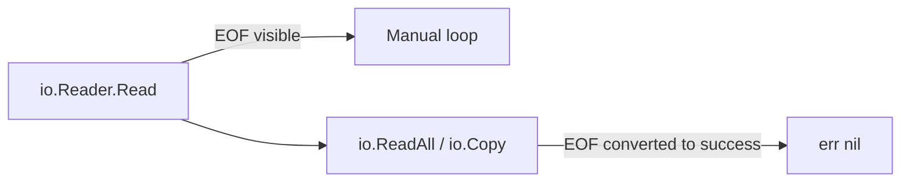
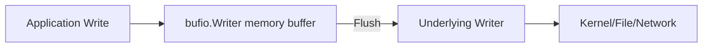
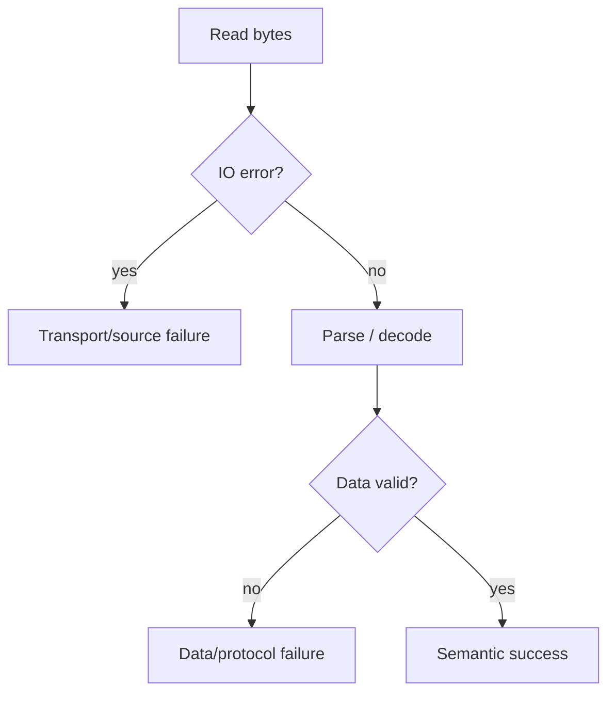

# learn-go-io-buffer-byte-stream-file-network-data-transfer-part-008

# Part 008 — Error Semantics in IO: Partial Progress, EOF, Short Write, Timeout, Cancellation

> Seri: `learn-go-io-buffer-byte-stream-file-network-data-transfer`  
> Target: Go 1.26.x  
> Audiens: Java software engineer yang ingin naik ke level production/system engineering Go  
> Fokus part ini: memahami **makna error dalam IO**, bukan hanya `if err != nil`

---

## 0. Posisi Part Ini Dalam Series

Pada part sebelumnya kita sudah membangun fondasi:

- Part 001: data movement model.
- Part 002: kontrak inti `io.Reader`, `io.Writer`, `Closer`, `Seeker`, `ReaderAt`, `WriterAt`.
- Part 003: advanced `io` composition.
- Part 004: buffer fundamentals.
- Part 005: `bufio`.
- Part 006: text IO.
- Part 007: console IO.

Part ini membahas salah satu area yang sering memisahkan engineer yang hanya “bisa memakai API” dari engineer yang mampu membuat sistem IO production-grade: **error semantics**.

Di Go, error IO bukan sekadar sinyal gagal. Error IO sering membawa informasi tentang:

1. apakah ada byte yang sudah berhasil diproses,
2. apakah stream sudah selesai secara normal,
3. apakah operasi bisa diulang,
4. apakah resource masih valid,
5. apakah caller harus retry, abort, flush, close, rollback, atau commit,
6. apakah data yang sudah terkirim masih bisa dianggap aman,
7. apakah failure terjadi sebelum, saat, atau setelah side effect.

Kalau satu hal saja perlu diingat dari part ini:

> Dalam IO, `err != nil` tidak selalu berarti “tidak ada progress”, dan `err == nil` tidak selalu berarti “seluruh operasi bisnis sudah aman”.

---

## 1. Mental Model: IO Error Adalah Status Transisi Data

Di banyak kode aplikasi, error diperlakukan seperti boolean:

```go
n, err := r.Read(buf)
if err != nil {
    return err
}
process(buf[:n])
```

Untuk IO, pola ini bisa salah.

Kontrak umum Go IO adalah:

```go
n, err := r.Read(p)
```

atau:

```go
n, err := w.Write(p)
```

Return value-nya punya dua dimensi:

```text
n   = jumlah byte yang berhasil dipindahkan
err = kondisi yang terjadi selama / setelah attempt pemindahan
```

Artinya hasil operasi bukan 2 state, tetapi kombinasi.



Hasil paling berbahaya adalah:

```go
n > 0 && err != nil
```

Karena engineer yang terlalu cepat `return err` bisa membuang data yang sudah valid.

Contoh:

```go
n, err := r.Read(buf)
if err != nil {
    return err // BUG: mungkin n > 0 dan byte itu harus diproses dulu
}
consume(buf[:n])
```

Pola yang lebih benar:

```go
n, err := r.Read(buf)
if n > 0 {
    consume(buf[:n])
}
if err != nil {
    return err
}
```

Namun pola ini juga belum selalu cukup, karena `err == io.EOF` sering bukan failure, sedangkan timeout sering perlu diputuskan berdasarkan konteks bisnis.

---

## 2. Perbandingan Dengan Java IO/NIO

Sebagai Java engineer, kamu mungkin terbiasa dengan pola:

```java
int n = input.read(buffer);
if (n == -1) {
    // EOF
}
```

Di Go:

```go
n, err := r.Read(buf)
if err == io.EOF {
    // EOF
}
```

Perbedaan penting:

| Aspek | Java `InputStream` | Go `io.Reader` |
|---|---|---|
| EOF | `read()` return `-1` | `err == io.EOF` |
| Data + EOF | Biasanya EOF sebagai read berikutnya | Reader boleh return `n > 0, err == io.EOF` |
| Partial write | Banyak API hide detail | `Write` return `(n, err)` eksplisit |
| Checked exception | `IOException` checked | `error` value eksplisit |
| Timeout | API-specific exception | sering error yang bisa di-test dengan `net.Error`, `os.ErrDeadlineExceeded`, `context` |
| Composition | class hierarchy / decorator | small interfaces + functions |

Implikasi desain:

- Di Java, exception sering memotong control flow.
- Di Go, error adalah value yang harus diklasifikasi.
- Dalam Go IO, jumlah byte yang berhasil bergerak adalah bagian dari kontrak utama.

Go memaksa engineer berpikir seperti ini:

```text
What happened to the bytes?
Where are they now?
Can I safely retry?
Can I safely discard?
Did I already produce side effects?
```

---

## 3. Taxonomy Error IO

Untuk production system, jangan klasifikasi error hanya dengan `err != nil`. Gunakan taxonomy.



Secara praktis, error IO bisa dikelompokkan menjadi:

1. **normal completion signal** — `io.EOF` pada stream read.
2. **protocol/data error** — malformed frame, invalid UTF-8, invalid JSON.
3. **resource error** — file closed, connection reset, permission denied.
4. **capacity error** — no space left, too large, memory limit, quota.
5. **time error** — deadline exceeded, timeout.
6. **cancellation error** — caller membatalkan operation.
7. **partial side-effect error** — sebagian data sudah tertulis/terkirim.
8. **durability error** — write tampak sukses tapi sync/close gagal.

---

## 4. EOF: Bukan Error Bisnis, Tapi Sinyal Stream Selesai

`io.EOF` adalah error value khusus yang berarti tidak ada input lagi.

Dalam loop read manual:

```go
for {
    n, err := r.Read(buf)
    if n > 0 {
        process(buf[:n])
    }
    if err == io.EOF {
        break
    }
    if err != nil {
        return err
    }
}
```

Ini pola dasar yang benar.

### 4.1 EOF normal vs EOF abnormal

Tidak semua EOF bermakna sama.

| Situasi | EOF normal? | Contoh |
|---|---:|---|
| Membaca file sampai habis | Ya | log scanner |
| Membaca HTTP body sampai selesai | Ya | body fully consumed |
| Membaca line optional terakhir tanpa newline | Tergantung parser | config file |
| Membaca fixed 4-byte length prefix tapi hanya dapat 2 byte | Tidak | truncated protocol |
| Membaca gzip stream yang terpotong | Tidak | corrupt transfer |
| Membaca JSON streaming array belum selesai | Tidak | malformed input |

EOF hanya berarti “source tidak memberi byte lagi”. Apakah itu sukses atau gagal bergantung pada ekspektasi protocol.



### 4.2 `io.EOF` vs `io.ErrUnexpectedEOF`

Gunakan mental model:

```text
io.EOF              = stream ended at a boundary where ending may be normal
io.ErrUnexpectedEOF = stream ended before required bytes/structure completed
```

Contoh fixed-size header:

```go
var header [8]byte
_, err := io.ReadFull(r, header[:])
if err != nil {
    return fmt.Errorf("read header: %w", err)
}
```

`io.ReadFull` akan mengubah kondisi “kurang byte” menjadi error yang lebih bermakna seperti `io.ErrUnexpectedEOF`.

### 4.3 Salah kaprah umum

Salah:

```go
for {
    n, err := r.Read(buf)
    if err != nil {
        return err
    }
    process(buf[:n])
}
```

Bug:

- EOF dianggap failure.
- `n > 0 && err == io.EOF` kehilangan data.
- loop tidak punya completion path.

Benar:

```go
for {
    n, err := r.Read(buf)
    if n > 0 {
        if e := process(buf[:n]); e != nil {
            return e
        }
    }
    if err == io.EOF {
        return nil
    }
    if err != nil {
        return err
    }
}
```

---

## 5. Partial Read

`Read(p)` boleh mengisi kurang dari `len(p)` walaupun tidak error.

Contoh:

```go
n, err := r.Read(buf) // n can be 1 even if len(buf) is 4096
```

Ini bukan bug. Ini bagian dari kontrak.

Alasan partial read:

- network packet/data belum lengkap,
- pipe writer menulis chunk kecil,
- buffered reader hanya punya data tertentu,
- OS syscall return lebih sedikit,
- stream boundary tidak sama dengan buffer boundary,
- Reader sengaja membatasi per-call.

### 5.1 Konsekuensi untuk parser

Parser yang membutuhkan exact length tidak boleh mengasumsikan satu `Read` cukup.

Salah:

```go
header := make([]byte, 8)
n, err := r.Read(header)
if err != nil {
    return err
}
if n != 8 {
    return fmt.Errorf("short header")
}
```

Lebih tepat:

```go
header := make([]byte, 8)
if _, err := io.ReadFull(r, header); err != nil {
    return fmt.Errorf("read header: %w", err)
}
```

### 5.2 `ReadFull` bukan untuk semua kasus

`io.ReadFull` cocok saat kamu memang butuh byte exact.

Cocok:

- fixed-size header,
- length-prefixed frame,
- checksum field,
- magic bytes,
- binary record fixed width.

Tidak cocok:

- log streaming tanpa ukuran pasti,
- HTTP body chunked tanpa framing custom,
- console input interaktif,
- file text line-by-line,
- unbounded stream.

### 5.3 Invariant partial read

Untuk setiap code yang memanggil `Read`, tanyakan:

```text
Can this code handle n < len(buf)?
Can this code handle n > 0 && err != nil?
Can this code distinguish normal EOF from truncated record?
```

Jika jawabannya tidak, code tersebut belum production-ready.

---

## 6. Partial Write dan Short Write

`Write(p)` mengembalikan jumlah byte yang berhasil ditulis.

```go
n, err := w.Write(p)
```

Kontrak penting:

- Jika `n < len(p)`, seharusnya `err != nil`.
- `n > 0 && err != nil` mungkin terjadi.
- Caller harus memutuskan apakah akan melanjutkan sisa byte atau abort.

Contoh bug fatal:

```go
_, err := w.Write(payload)
return err
```

Kode ini tidak memeriksa apakah seluruh payload tertulis.

Lebih defensif:

```go
func writeAll(w io.Writer, p []byte) error {
    for len(p) > 0 {
        n, err := w.Write(p)
        if n > 0 {
            p = p[n:]
        }
        if err != nil {
            return err
        }
        if n == 0 {
            return io.ErrShortWrite
        }
    }
    return nil
}
```

Namun hati-hati: retry write di level ini tidak selalu aman untuk protocol yang punya side effect.

### 6.1 Write retry: aman atau tidak?

Retry partial write pada `io.Writer` sederhana bisa aman kalau writer menerima byte stream kontinu dan kamu melanjutkan sisa byte.

Aman:

```text
write first 100 bytes succeeded
write remaining bytes 101..end
```

Tidak aman:

```text
send request to remote service
unknown whether remote committed operation
retry whole request
duplicate side effect
```

### 6.2 File write vs network write

Pada file:

- partial write bisa terjadi karena disk full, quota, interrupt, filesystem error.
- retry sisa bytes mungkin tetap gagal.
- write success belum berarti durable sebelum `Sync` jika durability dibutuhkan.

Pada network:

- write success berarti data masuk kernel/socket buffer, bukan berarti remote application sudah membaca/commit.
- write timeout dengan `n > 0` berarti sebagian byte mungkin sudah keluar.
- retry whole message bisa menghasilkan corrupted stream kalau framing tidak diperhatikan.



---

## 7. `io.ErrShortWrite`

`io.ErrShortWrite` adalah sentinel error untuk kondisi write menerima byte kurang dari yang diminta tanpa error spesifik yang lebih baik.

Gunakan saat:

```go
n, err := w.Write(p)
if err == nil && n < len(p) {
    err = io.ErrShortWrite
}
```

Ini sering muncul di wrapper writer, encoder, atau code yang ingin menjamin seluruh buffer tertulis.

Contoh encoder defensif:

```go
func writeFrame(w io.Writer, frame []byte) error {
    n, err := w.Write(frame)
    if err != nil {
        return fmt.Errorf("write frame: %w", err)
    }
    if n != len(frame) {
        return fmt.Errorf("write frame: %w", io.ErrShortWrite)
    }
    return nil
}
```

Namun jika writer adalah raw network connection, biasanya lebih baik pakai loop `writeAll` atau `io.Copy`, bukan satu call `Write`.

---

## 8. `ReadAll`, `Copy`, dan EOF Treatment

Beberapa helper Go sengaja menyembunyikan EOF normal.

Contoh `io.ReadAll`:

```go
b, err := io.ReadAll(r)
```

Jika berhasil membaca sampai EOF, `err == nil`, bukan `io.EOF`.

Demikian juga `io.Copy`:

```go
n, err := io.Copy(dst, src)
```

Jika copy selesai karena source EOF normal, `err == nil`.

Mental model:

```text
low-level Read sees EOF
high-level consume-until-EOF treats EOF as success
```



### 8.1 Jangan salah pakai `ReadAll`

Go 1.26 membuat `io.ReadAll` lebih efisien dari sisi allocation untuk input besar, tetapi itu tidak mengubah prinsip desain:

> Jangan `ReadAll` terhadap input yang tidak dipercaya atau tidak berbatas.

Tetap gunakan `io.LimitReader`, content-length validation, atau streaming parser.

Contoh bounded read:

```go
func readSmall(r io.Reader, max int64) ([]byte, error) {
    limited := io.LimitReader(r, max+1)
    b, err := io.ReadAll(limited)
    if err != nil {
        return nil, err
    }
    if int64(len(b)) > max {
        return nil, fmt.Errorf("input too large: max=%d", max)
    }
    return b, nil
}
```

---

## 9. Timeout, Deadline, dan Cancellation

Dalam IO network/file tertentu, operasi bisa block.

Go memberi beberapa mechanism:

1. deadline pada resource (`SetReadDeadline`, `SetWriteDeadline`, `SetDeadline`),
2. context pada API tertentu (`http.Request`, `net.Dialer.DialContext`),
3. close dari goroutine lain,
4. wrapper custom yang menghentikan pipeline.

### 9.1 Deadline adalah absolute time

Deadline bukan duration per operation. Deadline adalah waktu absolut.

```go
conn.SetReadDeadline(time.Now().Add(5 * time.Second))
```

Jika kamu ingin idle timeout, deadline perlu diperbarui setelah progress.

```go
for {
    _ = conn.SetReadDeadline(time.Now().Add(30 * time.Second))
    n, err := conn.Read(buf)
    if n > 0 {
        process(buf[:n])
    }
    if err != nil {
        return err
    }
}
```

### 9.2 Timeout tidak selalu berarti tidak ada data

Untuk write deadline, operasi bisa timeout setelah sebagian byte tertulis.

```go
n, err := conn.Write(payload)
if err != nil {
    // n may be > 0
}
```

Jadi setelah timeout, pertanyaan pentingnya:

```text
Was the stream boundary corrupted?
Can I continue writing remaining bytes?
Should I close and reconnect?
Can remote parse partial frame?
```

Pada banyak protocol request/response, setelah write timeout, opsi paling aman adalah close connection dan retry pada level message jika operation idempotent.

### 9.3 Cara mendeteksi timeout

Beberapa pendekatan:

```go
if errors.Is(err, os.ErrDeadlineExceeded) {
    // deadline exceeded
}
```

atau:

```go
var ne net.Error
if errors.As(err, &ne) && ne.Timeout() {
    // timeout-like network error
}
```

Namun jangan terlalu bergantung pada `Temporary()` sebagai policy. Dalam praktik modern, `Temporary` bukan klasifikasi retry policy yang cukup kuat. Retry harus ditentukan berdasarkan operasi bisnis, idempotency, dan progress.

### 9.4 Context cancellation

Context cancellation sering muncul di HTTP client/server, dialer, dan pipeline custom.

Error umum:

```go
context.Canceled
context.DeadlineExceeded
```

Klasifikasi:

| Error | Makna umum | Biasanya action |
|---|---|---|
| `context.Canceled` | caller membatalkan | stop work, cleanup |
| `context.DeadlineExceeded` | budget waktu habis | stop or return timeout |
| `os.ErrDeadlineExceeded` | resource deadline exceeded | classify as timeout |
| `net.Error.Timeout()` | network timeout-like | inspect context, maybe retry |

Contoh:

```go
select {
case <-ctx.Done():
    return ctx.Err()
default:
}
```

Namun jangan hanya cek context sebelum operasi panjang. Pastikan operasi blocking juga punya deadline atau API context-aware.

---

## 10. Error Wrapping dan Classification

Go error handling modern mengandalkan wrapping:

```go
return fmt.Errorf("copy request body: %w", err)
```

Caller bisa melakukan:

```go
if errors.Is(err, io.EOF) {
    // ...
}
```

atau:

```go
var pathErr *os.PathError
if errors.As(err, &pathErr) {
    // inspect pathErr.Op, pathErr.Path, pathErr.Err
}
```

### 10.1 Jangan hilangkan identity error

Salah:

```go
return fmt.Errorf("read failed: %v", err)
```

Benar:

```go
return fmt.Errorf("read failed: %w", err)
```

Kalau menggunakan `%v`, caller tidak bisa lagi `errors.Is` / `errors.As`.

### 10.2 Contextual wrapping yang baik

Error message harus menjawab:

```text
operation apa?
resource apa?
phase apa?
berapa progress?
apa error asal?
```

Contoh baik:

```go
return fmt.Errorf("copy upload to temp file after %d bytes: %w", written, err)
```

Lebih baik daripada:

```go
return err
```

atau:

```go
return fmt.Errorf("failed")
```

---

## 11. OS Error: `*os.PathError`, `*os.LinkError`, `*os.SyscallError`

Banyak operasi filesystem membungkus error OS dengan tipe yang memberi konteks.

### 11.1 `*os.PathError`

Umum untuk operasi pada satu path.

```go
f, err := os.Open(name)
if err != nil {
    var pe *os.PathError
    if errors.As(err, &pe) {
        fmt.Println(pe.Op, pe.Path, pe.Err)
    }
    return err
}
defer f.Close()
```

Field mental model:

| Field | Makna |
|---|---|
| `Op` | operasi, misalnya `open`, `stat`, `read` |
| `Path` | path terkait |
| `Err` | underlying error |

### 11.2 Sentinel OS errors

Gunakan helper:

```go
if errors.Is(err, os.ErrNotExist) {
    // not found
}

if errors.Is(err, os.ErrPermission) {
    // permission issue
}

if errors.Is(err, os.ErrExist) {
    // already exists
}
```

Atau helper historis:

```go
if os.IsNotExist(err) { ... }
```

Namun `errors.Is` lebih idiomatis untuk wrapped error modern.

### 11.3 Jangan parse string error

Salah:

```go
if strings.Contains(err.Error(), "no such file") {
    // fragile
}
```

Masalah:

- beda OS,
- beda locale,
- beda syscall,
- wrapper bisa berubah,
- tidak reliable untuk policy.

Benar:

```go
if errors.Is(err, os.ErrNotExist) {
    // portable intent
}
```

---

## 12. Network Error: Connection Reset, Broken Pipe, Timeout, DNS

Network error sulit karena remote side dan kernel ikut bermain.

Contoh kategori:

| Error | Arti umum | Risiko |
|---|---|---|
| connection reset by peer | remote force close | request may or may not be processed |
| broken pipe | write ke connection yang sudah putus | partial send possible |
| timeout | no progress until deadline | partial progress possible |
| DNS failure | name resolution fail | maybe temporary, maybe config |
| TLS handshake error | security/protocol fail | usually no retry same config |
| EOF | peer closed gracefully | depends protocol state |

### 12.1 EOF pada network

Pada TCP stream, EOF biasanya berarti peer menutup write side.

Tapi secara protocol:

- EOF setelah full response: normal.
- EOF saat header belum lengkap: error.
- EOF saat frame body belum selesai: truncated.
- EOF sebelum handshake selesai: protocol failure.

Jangan hanya:

```go
if err == io.EOF { return nil }
```

Tanpa tahu state parser.

### 12.2 Connection after error

Setelah error network tertentu, connection sering tidak boleh dipakai lagi.

Rule sederhana:

```text
If protocol state is uncertain, close the connection.
```

Terutama jika:

- write timeout,
- read timeout di tengah frame,
- parse error,
- unexpected EOF,
- partial write,
- TLS/protocol error,
- response boundary tidak jelas.

Connection pooling harus hanya menyimpan connection yang state-nya bersih.

---

## 13. Close Error: Jangan Selalu Diabaikan

Banyak kode Go melakukan:

```go
defer f.Close()
```

Ini umum dan sering benar untuk read-only file. Tapi untuk writer, close bisa membawa error penting.

Contoh:

- buffered writer gagal flush saat close,
- file system error muncul saat close,
- network protocol membutuhkan close notify,
- gzip writer menulis footer/checksum saat close,
- tar/zip writer finalize metadata saat close.

### 13.1 Pattern close untuk reader

Read-only file:

```go
f, err := os.Open(name)
if err != nil {
    return err
}
defer f.Close()
```

Biasanya cukup.

### 13.2 Pattern close untuk writer

Writer yang menghasilkan output harus memperhatikan close/flush error.

```go
func writeFile(path string, data []byte) (err error) {
    f, err := os.Create(path)
    if err != nil {
        return err
    }

    defer func() {
        closeErr := f.Close()
        if err == nil && closeErr != nil {
            err = closeErr
        }
    }()

    if _, err = f.Write(data); err != nil {
        return err
    }
    return nil
}
```

Untuk durability:

```go
if err := f.Sync(); err != nil {
    return fmt.Errorf("sync file: %w", err)
}
```

Nanti durability dibahas detail di part 014.

### 13.3 Close ordering pada stacked writers

Contoh gzip over file:

```go
f, err := os.Create(path)
if err != nil {
    return err
}

gz := gzip.NewWriter(f)

_, err = gz.Write(payload)
if err != nil {
    gz.Close()
    f.Close()
    return err
}

if err := gz.Close(); err != nil {
    f.Close()
    return fmt.Errorf("close gzip: %w", err)
}
if err := f.Close(); err != nil {
    return fmt.Errorf("close file: %w", err)
}
return nil
```

Order penting:

```text
gzip writer close -> writes footer to file
file close        -> releases file descriptor and may report FS errors
```

Kalau file ditutup dulu, gzip tidak bisa finalize dengan benar.

---

## 14. Buffered Error: Error Bisa Tertunda

Dengan `bufio.Writer`, `Write` mungkin hanya menulis ke memory buffer, bukan underlying writer.

```go
bw := bufio.NewWriter(w)
_, err := bw.Write(data) // may succeed in memory
err = bw.Flush()         // actual underlying write may fail here
```

Konsekuensi:

- `Write` success belum berarti data keluar.
- `Flush` error wajib diperiksa.
- Jika `Flush` gagal, writer state mungkin tidak recoverable.

Pattern:

```go
bw := bufio.NewWriter(w)
if _, err := bw.Write(data); err != nil {
    return err
}
if err := bw.Flush(); err != nil {
    return fmt.Errorf("flush buffered writer: %w", err)
}
```

Untuk pipeline:



Error bisa terjadi di setiap boundary.

---

## 15. Parser Error: Error IO vs Error Data

Saat membaca data, ada dua kelas error:

1. transport/source error,
2. data/protocol error.

Contoh JSON:

```go
var v Payload
if err := json.NewDecoder(r).Decode(&v); err != nil {
    return err
}
```

Error bisa berarti:

- source read error,
- invalid JSON syntax,
- type mismatch,
- unexpected EOF,
- trailing data policy violation.

Untuk production, wrapping harus memberi phase:

```go
if err := dec.Decode(&v); err != nil {
    return fmt.Errorf("decode request payload: %w", err)
}
```

Tetapi policy harus jelas:

| Error | HTTP response example |
|---|---|
| invalid syntax | 400 Bad Request |
| body too large | 413 Payload Too Large |
| read timeout | 408 / 504 depending layer |
| client canceled | often log at low severity |
| internal disk write failed | 500 |

Jangan satukan semua menjadi 500.

---

## 16. Retry Semantics: Jangan Retry Sebelum Tahu Progress

Retry adalah area paling berbahaya dalam IO.

Pertanyaan wajib sebelum retry:

```text
1. Apakah operasi punya side effect?
2. Apakah byte/message sudah terkirim sebagian?
3. Apakah remote mungkin sudah commit?
4. Apakah operation idempotent?
5. Apakah ada idempotency key / sequence number?
6. Apakah retry dilakukan pada level byte, frame, request, atau transaction?
```

### 16.1 Level retry

| Level | Contoh | Risiko |
|---|---|---|
| Byte-level | lanjutkan sisa bytes | stream corruption jika state uncertain |
| Frame-level | resend frame | duplicate frame jika remote sudah terima |
| Request-level | resend HTTP request | duplicate side effect |
| Transaction-level | retry whole workflow | perlu idempotency key |

### 16.2 Retry decision matrix

| Operation | Timeout before write? | Timeout after partial write? | Safe retry? |
|---|---:|---:|---:|
| GET idempotent | Ya | Mungkin | biasanya ya dengan new connection |
| POST create tanpa idempotency key | Mungkin | Tidak aman | tidak |
| PUT replace resource | Mungkin | Mungkin | jika semantic idempotent |
| file write temp local | retry sisa mungkin | tergantung error | hati-hati |
| append log | tidak jelas | duplicate risk | butuh sequence/checksum |
| TCP custom protocol | tergantung framing | high risk | close + resync |

### 16.3 Idempotency key

Untuk data transfer/API yang mungkin retry, desain harus punya idempotency.

```text
client_request_id = stable unique ID
server stores result per ID
retry returns same result instead of duplicating work
```

Tanpa ini, network retry hanya memindahkan risiko dari availability ke correctness.

---

## 17. Cancellation dan Cleanup

Jika operasi dibatalkan, resource harus dibersihkan.

Contoh copy dengan context:

```go
func copyWithContext(ctx context.Context, dst io.Writer, src io.Reader, buf []byte) (int64, error) {
    var written int64
    for {
        select {
        case <-ctx.Done():
            return written, ctx.Err()
        default:
        }

        n, rerr := src.Read(buf)
        if n > 0 {
            wn, werr := dst.Write(buf[:n])
            written += int64(wn)
            if werr != nil {
                return written, werr
            }
            if wn != n {
                return written, io.ErrShortWrite
            }
        }
        if rerr == io.EOF {
            return written, nil
        }
        if rerr != nil {
            return written, rerr
        }
    }
}
```

Catatan:

- Ini tidak bisa menghentikan `src.Read` yang sedang block jika source tidak context-aware.
- Untuk network, gunakan deadline atau close connection.
- Untuk HTTP, gunakan request context.
- Untuk file biasa, read biasanya tidak context-aware.

### 17.1 Cleanup partial output

Jika copy ke file gagal di tengah, apa yang dilakukan?

Pilihan:

1. hapus partial file,
2. simpan `.partial` untuk resume,
3. mark sebagai corrupt,
4. rollback metadata,
5. commit hanya setelah checksum sukses.

Production file transfer tidak boleh meninggalkan partial output seolah-olah final output.

---

## 18. Data Integrity Error

IO success tidak sama dengan data valid.

Contoh:

```text
read succeeded
JSON parsed
but checksum mismatch
```

atau:

```text
file copied fully
but byte count differs from expected
```

Validation layer perlu berbeda dari transport layer.



Checklist integrity:

- expected length,
- checksum/hash,
- magic bytes,
- version field,
- frame length sanity,
- compression footer validation,
- trailing data policy,
- schema validation,
- duplicate detection.

---

## 19. Designing Error Types for IO Components

Untuk library internal, jangan expose semua error sebagai string.

Contoh error type:

```go
type TransferPhase string

const (
    PhaseReadSource   TransferPhase = "read_source"
    PhaseWriteTarget  TransferPhase = "write_target"
    PhaseFlushTarget  TransferPhase = "flush_target"
    PhaseVerifyDigest TransferPhase = "verify_digest"
)

type TransferError struct {
    Phase   TransferPhase
    Offset  int64
    Op      string
    Err     error
}

func (e *TransferError) Error() string {
    return fmt.Sprintf("%s at offset %d: %v", e.Phase, e.Offset, e.Err)
}

func (e *TransferError) Unwrap() error { return e.Err }
```

Pemakai bisa:

```go
var te *TransferError
if errors.As(err, &te) {
    log.Printf("phase=%s offset=%d", te.Phase, te.Offset)
}
```

Design principle:

```text
Error should preserve machine-readable classification and human-readable context.
```

---

## 20. Observability: Log Error IO Dengan Progress dan Phase

Log seperti ini kurang berguna:

```text
copy failed: read tcp reset by peer
```

Lebih berguna:

```text
copy failed phase=write_target bytes_written=10485760 source=s3://... target=/data/x.part err="broken pipe"
```

Field penting:

| Field | Mengapa penting |
|---|---|
| phase | tahu boundary yang gagal |
| bytes_read | progress source |
| bytes_written | progress sink |
| expected_bytes | detect truncation |
| duration | timeout/latency diagnosis |
| operation_id | correlation |
| retry_attempt | retry policy debug |
| remote_addr | network failure diagnosis |
| path | filesystem failure diagnosis |
| classification | timeout/canceled/eof/short_write |

### 20.1 Error severity

Tidak semua error IO harus `ERROR`.

| Error | Severity umum |
|---|---|
| client canceled upload | debug/info |
| timeout due slow upstream | warn/error depending SLA |
| disk full | error/critical |
| malformed user input | info/warn |
| unexpected EOF from internal service | warn/error |
| permission denied config file | error |
| checksum mismatch | error/security depending context |

Observability yang buruk membuat production incident terlihat seperti random failure.

---

## 21. Testing Error Semantics

IO code harus diuji dengan fake reader/writer yang bisa menghasilkan failure spesifik.

### 21.1 Reader yang return `n > 0 && err != nil`

```go
type dataThenErrReader struct {
    data []byte
    err  error
    done bool
}

func (r *dataThenErrReader) Read(p []byte) (int, error) {
    if r.done {
        return 0, io.EOF
    }
    r.done = true
    n := copy(p, r.data)
    return n, r.err
}
```

Test:

```go
r := &dataThenErrReader{data: []byte("abc"), err: io.EOF}
```

Pastikan code memproses `abc` dulu sebelum menganggap EOF selesai.

### 21.2 Writer short write

```go
type shortWriter struct{}

func (shortWriter) Write(p []byte) (int, error) {
    if len(p) == 0 {
        return 0, nil
    }
    return len(p) / 2, nil // intentionally invalid writer behavior
}
```

Code defensif harus mengubah ini menjadi `io.ErrShortWrite` atau error jelas.

### 21.3 Writer fail after N bytes

```go
type failAfterWriter struct {
    limit int
    seen  int
}

func (w *failAfterWriter) Write(p []byte) (int, error) {
    remain := w.limit - w.seen
    if remain <= 0 {
        return 0, errors.New("injected write failure")
    }
    if len(p) > remain {
        w.seen += remain
        return remain, errors.New("injected partial write failure")
    }
    w.seen += len(p)
    return len(p), nil
}
```

Gunakan untuk menguji:

- apakah bytes_written tercatat benar,
- apakah partial output dibersihkan,
- apakah retry tidak menggandakan data,
- apakah error context cukup jelas.

---

## 22. Anti-Patterns

### 22.1 Mengabaikan `n`

```go
_, err := r.Read(buf)
if err != nil { return err }
```

Jika tidak memakai `n`, kamu tidak tahu byte mana yang valid.

### 22.2 Menganggap `Read` mengisi penuh buffer

```go
r.Read(header[:])
```

Gunakan `io.ReadFull` jika butuh exact bytes.

### 22.3 Menganggap `Write` selalu menulis penuh

```go
w.Write(payload)
```

Periksa `n`, `err`, atau pakai helper yang menjamin write all.

### 22.4 Menganggap EOF selalu error

EOF bisa menjadi completion signal.

### 22.5 Menganggap EOF selalu sukses

EOF di tengah frame adalah data truncation.

### 22.6 Mengabaikan `Flush` dan `Close`

Buffered/compressed/archive writer sering melaporkan error di `Flush`/`Close`.

### 22.7 Retry tanpa idempotency

Ini bisa menciptakan duplicate transaction.

### 22.8 Parse string error

Gunakan `errors.Is` dan `errors.As`.

### 22.9 Hilangkan wrapping identity

`fmt.Errorf("%v", err)` menghancurkan kemampuan classification.

### 22.10 Tidak memberi phase di error

`return err` dari pipeline multi-stage membuat incident sulit dianalisis.

---

## 23. Production Checklist

Sebelum merge IO code, cek:

- [ ] Apakah semua `Read` memakai `n` sebelum memproses `err`?
- [ ] Apakah `n > 0 && err != nil` ditangani?
- [ ] Apakah EOF normal dibedakan dari unexpected EOF?
- [ ] Apakah exact-length read memakai `io.ReadFull`?
- [ ] Apakah semua `Write` memeriksa `n` dan `err`?
- [ ] Apakah short write tidak diam-diam dianggap sukses?
- [ ] Apakah `Flush` diperiksa?
- [ ] Apakah `Close` writer penting diperiksa?
- [ ] Apakah timeout/cancellation diklasifikasikan?
- [ ] Apakah retry hanya dilakukan pada boundary aman?
- [ ] Apakah operation non-idempotent punya idempotency key?
- [ ] Apakah partial output ditandai, dihapus, atau bisa resume?
- [ ] Apakah error di-wrap dengan `%w`?
- [ ] Apakah caller masih bisa `errors.Is` / `errors.As`?
- [ ] Apakah logs mencatat phase dan bytes progress?
- [ ] Apakah tests mencakup partial read/write, EOF, timeout, injected failure?

---

## 24. Case Study: Upload ke Temp File Lalu Commit

Bayangkan service menerima upload dan menyimpan ke disk.

Naive:

```go
func save(path string, body io.Reader) error {
    f, err := os.Create(path)
    if err != nil {
        return err
    }
    defer f.Close()

    _, err = io.Copy(f, body)
    return err
}
```

Masalah:

- partial file bisa terlihat sebagai final file,
- close error diabaikan,
- sync tidak ada jika durability penting,
- size limit tidak ada,
- checksum tidak ada,
- cancellation tidak diklasifikasi,
- error tidak punya phase/progress.

Lebih production-minded:

```go
func saveUpload(finalPath string, body io.Reader, maxBytes int64) (err error) {
    dir := filepath.Dir(finalPath)

    tmp, err := os.CreateTemp(dir, ".upload-*.part")
    if err != nil {
        return fmt.Errorf("create temp upload file: %w", err)
    }

    tmpPath := tmp.Name()
    committed := false

    defer func() {
        closeErr := tmp.Close()
        if err == nil && closeErr != nil {
            err = fmt.Errorf("close temp upload file: %w", closeErr)
        }
        if !committed {
            _ = os.Remove(tmpPath)
        }
    }()

    limited := io.LimitReader(body, maxBytes+1)
    written, copyErr := io.Copy(tmp, limited)
    if copyErr != nil {
        return fmt.Errorf("copy upload body to temp file after %d bytes: %w", written, copyErr)
    }
    if written > maxBytes {
        return fmt.Errorf("upload too large: limit=%d", maxBytes)
    }

    if err := tmp.Sync(); err != nil {
        return fmt.Errorf("sync temp upload file: %w", err)
    }
    if err := tmp.Close(); err != nil {
        return fmt.Errorf("close temp upload file before rename: %w", err)
    }

    if err := os.Rename(tmpPath, finalPath); err != nil {
        return fmt.Errorf("commit upload file: %w", err)
    }
    committed = true
    return nil
}
```

Catatan: detail atomic/durable rename dan directory sync akan dibahas lebih dalam di part file durability.

---

## 25. Case Study: Length-Prefixed Protocol Reader

Protocol:

```text
4 bytes big-endian length
N bytes payload
```

Kesalahan umum:

```go
header := make([]byte, 4)
r.Read(header) // wrong: partial read possible
```

Lebih benar:

```go
func readFrame(r io.Reader, max uint32) ([]byte, error) {
    var hdr [4]byte
    if _, err := io.ReadFull(r, hdr[:]); err != nil {
        if errors.Is(err, io.EOF) {
            return nil, err // clean stream end before new frame
        }
        return nil, fmt.Errorf("read frame header: %w", err)
    }

    n := binary.BigEndian.Uint32(hdr[:])
    if n > max {
        return nil, fmt.Errorf("frame too large: size=%d max=%d", n, max)
    }

    payload := make([]byte, n)
    if _, err := io.ReadFull(r, payload); err != nil {
        return nil, fmt.Errorf("read frame payload size=%d: %w", n, err)
    }
    return payload, nil
}
```

Policy detail:

- EOF before header can mean normal end.
- EOF in the middle of header means truncated stream.
- EOF in payload means corrupted/incomplete frame.
- frame size must be bounded before allocation.

---

## 26. Decision Table: How to React

| Condition | Process bytes first? | Return nil? | Retry? | Close resource? |
|---|---:|---:|---:|---:|
| `n > 0, err == nil` | Ya | Tidak otomatis | Tidak | Tidak |
| `n > 0, err == io.EOF` | Ya | Biasanya setelah process | Tidak | source done |
| `n == 0, err == io.EOF` | Tidak | Ya jika EOF expected | Tidak | source done |
| `n > 0, err != nil` | Ya, jika bytes valid | Tidak | tergantung | sering ya |
| short write | N/A | Tidak | lanjut sisa jika safe | tergantung |
| read timeout | mungkin | Tidak | tergantung idempotency | sering ya |
| write timeout | maybe partial | Tidak | high risk | biasanya ya |
| context canceled | stop | Tidak sebagai sukses | Tidak | cleanup |
| malformed input | Tidak lanjut | Tidak | Tidak | mungkin close |
| checksum mismatch | data invalid | Tidak | maybe re-fetch | discard output |
| close writer failed | output uncertain | Tidak | tergantung | sudah closing |

---

## 27. Mini Exercise

### Exercise 1 — Manual read loop

Buat function:

```go
func CountBytes(r io.Reader) (int64, error)
```

Requirement:

- menggunakan buffer 32 KiB,
- memproses `n > 0` sebelum error,
- EOF normal return nil,
- error lain di-wrap dengan progress.

### Exercise 2 — Safe write all

Buat function:

```go
func WriteAll(w io.Writer, p []byte) error
```

Requirement:

- handle short write,
- handle `n > 0 && err != nil`,
- tidak infinite loop jika `n == 0 && err == nil`.

### Exercise 3 — Fault injection

Buat test table untuk:

- reader returns data + EOF,
- reader returns data + injected error,
- writer short writes,
- writer fails after N bytes.

### Exercise 4 — Classify error

Buat helper:

```go
type IOClass string

func ClassifyIOError(err error) IOClass
```

Class minimal:

- `eof`,
- `timeout`,
- `canceled`,
- `not_exist`,
- `permission`,
- `short_write`,
- `unknown`.

---

## 28. Ringkasan Mental Model

Go IO error handling harus selalu memegang lima pertanyaan:

```text
1. Did bytes move?
2. Where did they move?
3. Is stream/protocol state still valid?
4. Is it safe to retry?
5. What should be observable for debugging?
```

Aturan praktis:

- `Read` dapat menghasilkan data dan error bersamaan.
- EOF adalah completion signal pada stream, tapi bisa menjadi corruption signal pada protocol.
- `Write` success bukan remote success.
- Short write harus dianggap serius.
- Timeout bisa terjadi setelah partial progress.
- Cancellation bukan failure yang sama dengan corruption.
- Close/Flush error bisa menjadi error utama untuk writer.
- Retry tanpa idempotency adalah correctness bug.
- Error harus tetap bisa diklasifikasi dengan `errors.Is` / `errors.As`.
- Log IO error tanpa progress/phase hampir tidak cukup untuk production incident.

---

## 29. Referensi Resmi

- Go `io` package: https://pkg.go.dev/io
- Go `os` package: https://pkg.go.dev/os
- Go `net` package: https://pkg.go.dev/net
- Go `errors` package: https://pkg.go.dev/errors
- Go `bufio` package: https://pkg.go.dev/bufio
- Go 1.26 Release Notes: https://go.dev/doc/go1.26
- Go Release History: https://go.dev/doc/devel/release

---

## 30. Apa Berikutnya?

Part berikutnya:

```text
learn-go-io-buffer-byte-stream-file-network-data-transfer-part-009.md
```

Topik:

```text
File basics: os.File, open flags, permissions, lifecycle, descriptor ownership
```

Kita akan masuk ke filesystem level: bagaimana `os.File` merepresentasikan handle OS, bagaimana open flags menentukan semantic, bagaimana permission dan lifecycle bekerja, kapan `defer Close` cukup, kapan tidak, dan bagaimana memahami file descriptor sebagai resource terbatas.

---

## Status Series

- Part ini: **008 dari 034**
- Status: **belum selesai**
- Masih tersisa: **026 part**

<!-- NAVIGATION_FOOTER -->
<div class="page-nav">
<a href="./learn-go-io-buffer-byte-stream-file-network-data-transfer-part-007.md">⬅️ Part 007 — Console IO: stdin, stdout, stderr, Terminal Behavior, Prompt, dan CLI Data Streams</a>
<a href="./index.md">📚 Kategori</a>
<a href="../../index.md">🏠 Home</a>
<a href="./learn-go-io-buffer-byte-stream-file-network-data-transfer-part-009.md">Part 009 — File Basics: `os.File`, Open Flags, Permission, Lifecycle, dan Descriptor Ownership ➡️</a>
</div>
