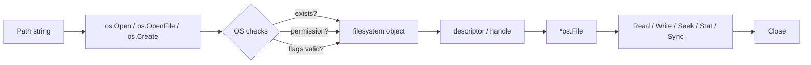
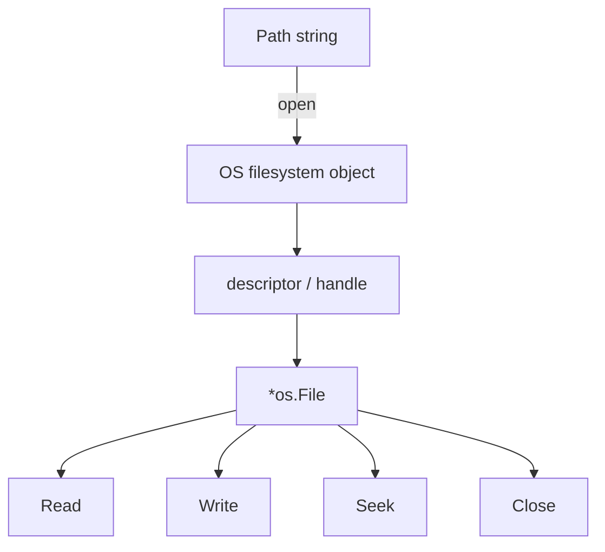
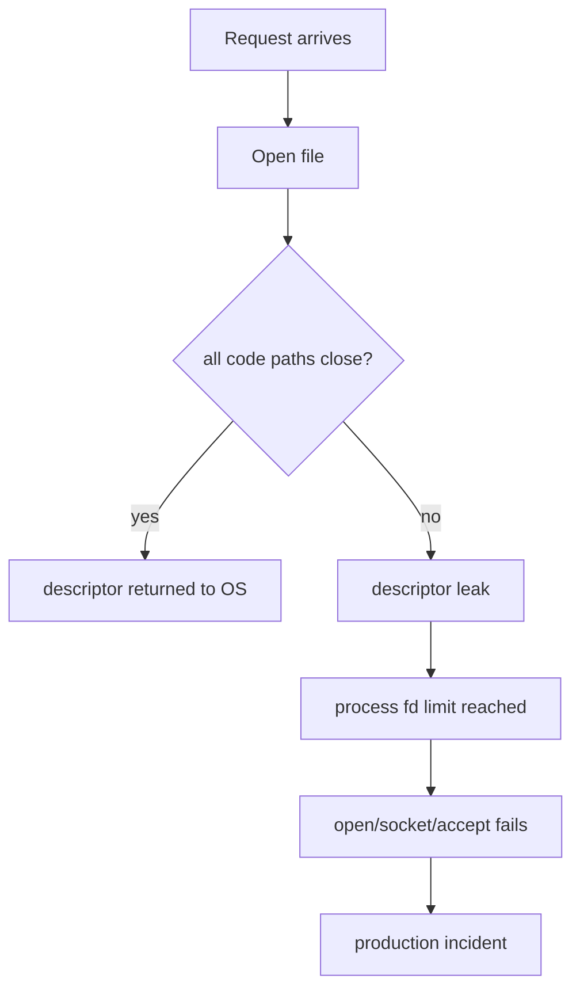
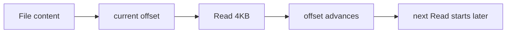
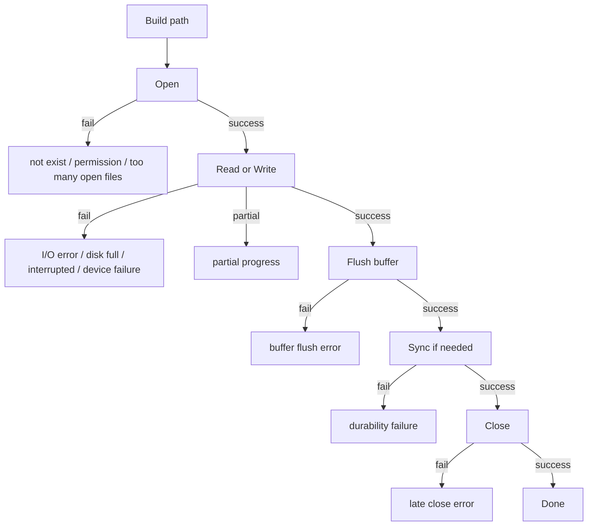
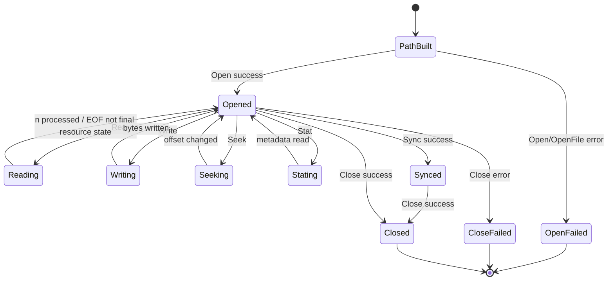

# learn-go-io-buffer-byte-stream-file-network-data-transfer-part-009.md

# Part 009 — File Basics: `os.File`, Open Flags, Permission, Lifecycle, dan Descriptor Ownership

> Seri: **Go IO, Buffer, Byte & Stream, Serialization, Console IO, File & FileSystem, Compression, Networking, Data Transfer**  
> Target versi: **Go 1.26.x**  
> Target pembaca: **Java software engineer yang ingin memahami Go IO sampai level production engineering**  
> Status seri: **Part 009 dari 034 — belum selesai**

---

## 0. Posisi Part Ini dalam Seri

Kita sudah membangun fondasi berikut:

1. **Part 000** — orientasi mental model Go IO.
2. **Part 001** — data movement model: byte, slice, buffer, descriptor, file, socket.
3. **Part 002** — kontrak inti `io.Reader`, `io.Writer`, `Closer`, `Seeker`, `ReaderAt`, `WriterAt`.
4. **Part 003** — advanced `io` composition seperti `Copy`, `LimitReader`, `TeeReader`, `Pipe`.
5. **Part 004** — buffer fundamentals.
6. **Part 005** — `bufio` deep dive.
7. **Part 006** — text IO, UTF-8, line protocol.
8. **Part 007** — console IO.
9. **Part 008** — error semantics dalam IO.

Sekarang kita masuk ke boundary pertama yang sangat nyata: **file**.

Di Java, Anda mungkin terbiasa berpikir melalui:

- `java.io.File`
- `FileInputStream`
- `FileOutputStream`
- `RandomAccessFile`
- `java.nio.file.Path`
- `Files.readAllBytes`
- `Files.newBufferedReader`
- `FileChannel`
- `StandardOpenOption`
- `AsynchronousFileChannel`

Di Go, entry point paling fundamental adalah:

```go
*os.File
```

Tetapi jangan salah menilai: `*os.File` bukan sekadar “class file”. Ia adalah **handle terhadap resource OS**.

Mental model part ini:

```text
Path string  --open syscall-->  OS descriptor/handle  --wrapped by-->  *os.File
```

`*os.File` adalah object Go yang mengelola resource OS. File path hanya nama. Descriptor adalah resource hidup. `*os.File` adalah wrapper yang membawa method seperti `Read`, `Write`, `Close`, `Seek`, `Stat`, `Sync`, dan sebagainya.

---

## 1. Learning Objectives

Setelah part ini, Anda harus mampu:

1. Membedakan **path**, **file**, **file descriptor/handle**, dan **`*os.File`**.
2. Memahami kapan memakai `os.Open`, `os.Create`, `os.OpenFile`, `os.ReadFile`, dan `os.WriteFile`.
3. Memilih open flags dengan sadar: `O_RDONLY`, `O_WRONLY`, `O_RDWR`, `O_CREATE`, `O_EXCL`, `O_APPEND`, `O_TRUNC`, `O_SYNC`.
4. Memahami permission bits seperti `0o644`, `0o600`, `0o755`, dan efek `umask`.
5. Mengelola lifecycle file dengan benar: open → use → flush/sync bila perlu → close.
6. Menangani error file secara idiomatis memakai `errors.Is`, `*os.PathError`, dan wrapping.
7. Menghindari descriptor leak, truncate accident, append race, close error loss, dan misuse `Fd()`.
8. Membedakan sequential IO, random access IO, append-only IO, dan convenience all-at-once IO.
9. Mengetahui perbedaan penting antara regular file, directory, pipe, device, socket, stdin/stdout, dan temp file.
10. Menulis wrapper file API yang production-grade, testable, dan aman untuk failure model nyata.

---

## 2. Big Picture: File IO Bukan Sekadar Membaca Path

Ketika program membaca file, operasi yang sebenarnya terjadi bukan:

```text
program reads filename
```

Yang lebih tepat:

```text
program asks OS to open a path
OS validates permissions, existence, flags, filesystem state
OS returns a descriptor/handle
program reads/writes through descriptor
program closes descriptor
```

Diagram:



Konsekuensi penting:

- Path bukan file.
- Path bisa berubah setelah file dibuka.
- Descriptor tetap menunjuk object yang dibuka, walaupun path diganti oleh proses lain, tergantung OS dan filesystem semantics.
- Permission dicek saat open, tetapi beberapa error bisa muncul saat read/write/sync/close.
- `Close` adalah bagian dari correctness, bukan formalitas.

---

## 3. Java vs Go: Mapping Mental Model

| Java | Go | Catatan |
|---|---|---|
| `FileInputStream` | `*os.File` opened read-only | Go memakai satu tipe utama untuk read/write/seek. |
| `FileOutputStream` | `*os.File` opened write-only/read-write | Mode ditentukan oleh open flags. |
| `RandomAccessFile` | `*os.File` + `Seek`, `ReadAt`, `WriteAt` | Go memisahkan current-offset IO dan offset-based IO. |
| `Files.readAllBytes` | `os.ReadFile` | Convenience, cocok untuk file kecil/terpercaya. |
| `Files.write` | `os.WriteFile` | Tidak atomic; failure mid-operation bisa meninggalkan partial file. |
| `Path` | `string` + `path/filepath` | Go memakai string path, tapi part path portability dibahas lebih detail di Part 011. |
| `FileChannel.force` | `(*os.File).Sync` | Durability boundary, bukan sekadar flush user-space buffer. |
| `try-with-resources` | `defer f.Close()` | Go explicit error handling; close error perlu dipertimbangkan. |
| `StandardOpenOption` | `os.OpenFile` flags | Go memakai bitwise OR flags. |

Perbedaan desain yang penting:

Java cenderung punya banyak class spesifik. Go cenderung punya satu handle sederhana (`*os.File`) yang memenuhi banyak interface:

```go
io.Reader
io.Writer
io.Closer
io.Seeker
io.ReaderAt
io.WriterAt
io.ReaderFrom
io.WriterTo
```

Ini membuat file langsung dapat dipakai dalam pipeline `io.Copy`, `bufio.NewReader`, encoder/decoder, compressor, HTTP body, dan seterusnya.

---

## 4. Apa Itu `*os.File`?

Secara konseptual:

```go
type File struct {
    // internal fields hidden
}
```

`*os.File` merepresentasikan **open file descriptor** atau **handle**. Dokumentasi Go menyebut method `File` aman untuk concurrent use, tetapi bukan berarti semua semantic operasi otomatis aman untuk desain aplikasi Anda.

Contoh:

```go
f, err := os.Open("data.txt")
if err != nil {
    return err
}
defer f.Close()

buf := make([]byte, 4096)
n, err := f.Read(buf)
_ = n
_ = err
```

Hal yang terlihat sederhana ini menyembunyikan beberapa fakta:

1. `os.Open` membuka file dengan mode read-only.
2. `f` memegang descriptor OS.
3. `Read` membaca dari current file offset.
4. Offset berubah setelah read.
5. `Close` melepaskan descriptor.
6. Kalau `Close` tidak dipanggil, descriptor bisa bocor sampai GC/finalizer atau proses berakhir.
7. Bergantung finalizer untuk melepas resource OS adalah desain buruk.

---

## 5. Path, File Object, Descriptor, dan Handle

Empat istilah ini sering tercampur.

### 5.1 Path

Path adalah nama/logical address dalam filesystem namespace.

Contoh:

```text
/var/log/app/access.log
C:\\Users\\fajar\\data.txt
./config/app.yaml
```

Path bisa menunjuk:

- regular file
- directory
- symlink
- device
- named pipe
- socket file
- mount point
- object yang berubah saat runtime

Path bukan resource yang terbuka. Path hanya input untuk operasi OS.

### 5.2 File Object di Filesystem

Ini adalah entity yang disimpan filesystem: inode di Unix-like system, file record/object di filesystem lain, dan setara platform-specific lainnya.

Ia punya metadata:

- mode/permission
- owner/group
- size
- modification time
- link count
- type
- platform-specific attributes

### 5.3 Descriptor / Handle

Descriptor adalah capability yang diberikan OS kepada proses setelah open berhasil.

Di Unix-like OS, sering berupa integer file descriptor.

Di Windows, berupa handle.

Descriptor membawa state:

- access mode: read/write/read-write
- append behavior
- current offset
- flags
- close-on-exec behavior internal
- OS-specific state

### 5.4 `*os.File`

`*os.File` adalah wrapper Go di atas descriptor/handle.

Diagram ownership:



Ingat invariant:

```text
Whoever opens a file owns the responsibility to close it,
unless ownership is explicitly transferred.
```

---

## 6. Entry Point Utama File IO

Package `os` menyediakan beberapa level API.

| API | Cocok untuk | Catatan |
|---|---|---|
| `os.Open(name)` | Read-only file | Shortcut untuk open read-only. |
| `os.Create(name)` | Create/truncate then read-write | Berbahaya jika tidak sengaja truncate. |
| `os.OpenFile(name, flag, perm)` | Control penuh | API utama untuk flags/permissions. |
| `os.ReadFile(name)` | File kecil/terpercaya dibaca seluruhnya | Bukan untuk unbounded input. |
| `os.WriteFile(name, data, perm)` | File kecil ditulis seluruhnya | Tidak atomic; failure bisa partial. |
| `os.CreateTemp(dir, pattern)` | Temp file aman | Dibuat mode `0o600` sebelum umask. |
| `os.NewFile(fd, name)` | Wrap descriptor existing | Hati-hati ownership descriptor. |

---

## 7. `os.Open`: Read-Only Default

`os.Open` membuka file untuk dibaca.

```go
f, err := os.Open("config.json")
if err != nil {
    return fmt.Errorf("open config: %w", err)
}
defer f.Close()
```

Secara konseptual mirip:

```go
os.OpenFile("config.json", os.O_RDONLY, 0)
```

Karakteristik:

- File harus ada.
- Descriptor read-only.
- Jika gagal, biasanya error bertipe `*os.PathError`.
- `perm` tidak relevan karena tidak create.

Gunakan ini untuk:

- config file
- input file
- template file
- static local data
- file yang tidak perlu ditulis

Jangan gunakan `os.OpenFile` jika `os.Open` sudah cukup. API yang lebih sempit lebih aman.

---

## 8. `os.Create`: Convenience yang Bisa Berbahaya

`os.Create` membuat atau men-truncate file.

```go
f, err := os.Create("output.txt")
if err != nil {
    return err
}
defer f.Close()
```

Secara konseptual mirip:

```go
os.OpenFile("output.txt", os.O_RDWR|os.O_CREATE|os.O_TRUNC, 0o666)
```

Karakteristik penting:

- Jika file belum ada, dibuat.
- Jika file sudah ada, isinya dipotong menjadi kosong.
- Descriptor dibuka read-write.
- Permission saat create adalah `0o666` sebelum umask.

Production warning:

```text
os.Create is destructive when the file exists.
```

Anti-pattern:

```go
// Berbahaya: bisa mengosongkan file penting sebelum validasi selesai.
f, err := os.Create(path)
if err != nil {
    return err
}
```

Lebih aman bila Anda benar-benar ingin overwrite dengan strategi durability:

1. Tulis ke temp file di directory yang sama.
2. Flush buffer.
3. `Sync` file.
4. `Close` file.
5. Rename temp file ke target.
6. Sync directory bila durability metadata diperlukan.

Detail crash-consistent write akan dibahas lebih dalam di Part 014.

---

## 9. `os.OpenFile`: API Utama untuk Control

Signature:

```go
func OpenFile(name string, flag int, perm fs.FileMode) (*os.File, error)
```

Tiga argumen:

1. `name`: path.
2. `flag`: access mode + behavior flags.
3. `perm`: permission saat file dibuat dengan `O_CREATE`.

Contoh:

```go
f, err := os.OpenFile("access.log", os.O_APPEND|os.O_CREATE|os.O_WRONLY, 0o644)
if err != nil {
    return fmt.Errorf("open access log: %w", err)
}
defer f.Close()
```

Makna:

- Buka `access.log`.
- Kalau tidak ada, buat.
- Tulis hanya di akhir file.
- Tidak boleh read.
- Permission create: owner read/write, group read, others read, sebelum umask.

---

## 10. Open Flags: Access Mode

Exactly one dari tiga access mode ini harus dipilih:

| Flag | Makna | Contoh use case |
|---|---|---|
| `os.O_RDONLY` | read-only | config, input, static data |
| `os.O_WRONLY` | write-only | output file, log append |
| `os.O_RDWR` | read-write | random access update, temp file read-back |

Contoh:

```go
// read-only
f, err := os.OpenFile("input.dat", os.O_RDONLY, 0)

// write-only
f, err := os.OpenFile("output.dat", os.O_WRONLY|os.O_CREATE|os.O_TRUNC, 0o644)

// read-write
f, err := os.OpenFile("index.dat", os.O_RDWR|os.O_CREATE, 0o644)
```

Design principle:

```text
Open with the minimum capability required.
```

Jika hanya membaca, jangan pakai `O_RDWR`. Jika hanya menulis, jangan pakai `O_RDWR`. Capability yang terlalu luas memperbesar blast radius bug.

---

## 11. Open Flags: Behavior Modifier

Modifier flags dapat di-OR dengan access mode.

| Flag | Makna | Risiko |
|---|---|---|
| `os.O_APPEND` | Semua write append ke akhir file | `Seek` + write behavior tidak sesuai intuisi. |
| `os.O_CREATE` | Buat file bila tidak ada | `perm` berlaku hanya saat create. |
| `os.O_EXCL` | Dengan `O_CREATE`, gagal jika file sudah ada | Berguna untuk exclusive create. |
| `os.O_SYNC` | Synchronous IO | Lebih durable, tapi lebih lambat. |
| `os.O_TRUNC` | Truncate file regular writable saat open | Sangat destruktif. |

### 11.1 `O_APPEND`

```go
f, err := os.OpenFile("app.log", os.O_APPEND|os.O_CREATE|os.O_WRONLY, 0o644)
```

Use case:

- log file sederhana
- append-only audit-ish local record
- output yang tidak boleh overwrite bagian awal

Caveat:

- `WriteAt` akan error jika file dibuka dengan `O_APPEND`.
- `Seek` pada file `O_APPEND` tidak memberikan semantic write yang bisa diandalkan.
- Append atomicity detail bergantung OS/filesystem dan ukuran write; jangan desain distributed log correctness hanya berdasarkan asumsi append lokal.

### 11.2 `O_CREATE`

```go
f, err := os.OpenFile("new.txt", os.O_CREATE|os.O_WRONLY, 0o644)
```

Jika file tidak ada, dibuat dengan permission `perm` sebelum umask.

Jika file sudah ada:

- file dibuka sesuai flags,
- permission existing tidak diubah,
- isi tidak dipotong kecuali ada `O_TRUNC`.

### 11.3 `O_EXCL`

```go
f, err := os.OpenFile("job.lock", os.O_CREATE|os.O_EXCL|os.O_WRONLY, 0o600)
if err != nil {
    if errors.Is(err, fs.ErrExist) {
        return ErrAlreadyRunning
    }
    return err
}
defer f.Close()
```

Use case:

- create marker file hanya jika belum ada
- simple local coordination
- avoid accidental overwrite

Caveat:

- Bukan pengganti distributed lock.
- Semantic bisa berbeda pada network filesystem tertentu.
- File lock serius membutuhkan primitive locking OS atau external coordinator.

### 11.4 `O_TRUNC`

```go
f, err := os.OpenFile("data.txt", os.O_WRONLY|os.O_TRUNC, 0)
```

Ini memotong file menjadi kosong saat open berhasil.

Bahaya:

```text
Open succeeded, truncate happened, then write failed.
```

Akibat: file lama sudah hilang.

Untuk config/state penting, hindari overwrite langsung memakai `O_TRUNC`; pakai temp-write-rename.

### 11.5 `O_SYNC`

```go
f, err := os.OpenFile("journal.dat", os.O_WRONLY|os.O_CREATE|os.O_APPEND|os.O_SYNC, 0o600)
```

`O_SYNC` meminta write disinkronkan lebih kuat ke storage. Ini relevan untuk durability, tapi dapat menurunkan throughput signifikan.

Caveat:

- Durability semantics tetap dipengaruhi OS/filesystem/storage.
- `O_SYNC` bukan pengganti desain record framing, checksum, recovery, dan idempotent replay.
- Untuk banyak aplikasi, pattern write + `Sync()` pada boundary tertentu lebih fleksibel.

---

## 12. Permission Bits: `0o644`, `0o600`, `0o755`

Go 1.13+ mendukung prefix octal modern `0o`.

Contoh:

```go
0o644
0o600
0o755
```

Lebih jelas daripada gaya lama:

```go
0644
0600
0755
```

Permission umum:

| Mode | Makna | Use case |
|---|---|---|
| `0o600` | owner read/write | secret, token, temp sensitive file |
| `0o644` | owner read/write, group/others read | config non-secret, output biasa |
| `0o666` | read/write untuk semua sebelum umask | default create-style file; umask biasanya membatasi |
| `0o700` | owner rwx | private directory executable/traversable |
| `0o755` | owner rwx, others rx | executable atau directory publik |

### 12.1 Permission Hanya Berlaku Saat Create

```go
f, err := os.OpenFile("data.txt", os.O_CREATE|os.O_WRONLY, 0o600)
```

Jika `data.txt` sudah ada, mode existing tidak otomatis berubah menjadi `0o600`.

Ini sering mengejutkan engineer yang mengira `perm` selalu diterapkan.

Invariant:

```text
OpenFile perm is creation mode, not an always-set mode.
```

Kalau ingin mengubah permission existing, gunakan `Chmod` dengan hati-hati.

### 12.2 Umask

Pada Unix-like system, mode create dipengaruhi umask process.

Contoh konseptual:

```text
requested: 0o666
umask:    0o022
actual:   0o644
```

Akibat:

- Jangan mengasumsikan actual mode sama persis dengan perm.
- Untuk secret, minta mode ketat seperti `0o600`.
- Untuk compliance/security, verifikasi mode setelah create jika benar-benar penting.

### 12.3 Directory Execute Bit

Untuk directory, execute bit berarti ability untuk traverse.

Mode directory umum:

```go
0o755 // public readable/traversable
0o700 // private
```

Walaupun part directory detail akan masuk Part 010, basic ini penting karena file create akan gagal jika containing directory tidak ada atau tidak bisa ditraverse.

---

## 13. Lifecycle: Open → Use → Close

Pattern dasar:

```go
f, err := os.Open(path)
if err != nil {
    return err
}
defer f.Close()

// use f
```

Untuk read-only sederhana, ini sering cukup. Untuk write, close error lebih penting.

### 13.1 Close Error Jangan Selalu Dibuang

`Close` bisa mengembalikan error. Untuk file yang ditulis, error close dapat menunjukkan failure yang baru terlihat saat flush/close.

Pattern named return:

```go
func writeData(path string, data []byte) (err error) {
    f, err := os.OpenFile(path, os.O_CREATE|os.O_WRONLY|os.O_TRUNC, 0o644)
    if err != nil {
        return fmt.Errorf("open %s: %w", path, err)
    }

    defer func() {
        if closeErr := f.Close(); closeErr != nil && err == nil {
            err = fmt.Errorf("close %s: %w", path, closeErr)
        }
    }()

    if _, err := f.Write(data); err != nil {
        return fmt.Errorf("write %s: %w", path, err)
    }

    return nil
}
```

Namun, pattern ini belum crash-safe karena memakai `O_TRUNC`. Itu akan diperbaiki dalam Part 014.

### 13.2 Jika Write Gagal, Close Error Biasanya Sekunder

Pattern:

```go
if _, err := f.Write(data); err != nil {
    _ = f.Close() // write error lebih penting
    return err
}

if err := f.Close(); err != nil {
    return err
}
```

Kenapa?

Jika write sudah gagal, close error biasanya tidak menambah informasi yang lebih actionable. Tetapi untuk observability, Anda boleh log close error sebagai suppressed/secondary error.

### 13.3 Jangan Menunggu GC untuk Close

`*os.File` bisa punya finalizer internal, tetapi production code tidak boleh bergantung pada GC untuk melepas descriptor.

Alasan:

- GC tidak deterministic.
- Descriptor limit OS bisa habis sebelum GC jalan.
- File lock/handle bisa tertahan terlalu lama.
- Windows deletion/rename behavior bisa terganggu jika handle masih terbuka.
- Long-running service akan mengalami leak bertahap.

---

## 14. Descriptor Leak: Bug Kecil yang Menjadi Outage

Descriptor leak terjadi saat file dibuka tetapi tidak ditutup.

Contoh buruk:

```go
func loadMany(paths []string) error {
    for _, p := range paths {
        f, err := os.Open(p)
        if err != nil {
            return err
        }
        // BUG: f.Close() tidak pernah dipanggil
        _ = f
    }
    return nil
}
```

Dalam service:

```text
traffic increases
  ↓
more files opened
  ↓
not closed on every path
  ↓
file descriptors exhausted
  ↓
new opens fail
  ↓
network sockets may also fail
  ↓
service outage
```

Diagram:



Correct pattern inside loop:

```go
func loadMany(paths []string) error {
    for _, p := range paths {
        if err := loadOne(p); err != nil {
            return err
        }
    }
    return nil
}

func loadOne(path string) error {
    f, err := os.Open(path)
    if err != nil {
        return fmt.Errorf("open %s: %w", path, err)
    }
    defer f.Close()

    // process f
    return nil
}
```

Kenapa helper function lebih baik?

Karena `defer` dalam loop panjang baru dieksekusi saat function return. Jika Anda membuka ribuan file dalam satu function dan `defer f.Close()` di dalam loop, descriptor tetap terbuka sampai loop selesai.

Anti-pattern:

```go
for _, path := range paths {
    f, err := os.Open(path)
    if err != nil {
        return err
    }
    defer f.Close() // close tertunda sampai function outer selesai
}
```

Pattern lebih baik:

```go
for _, path := range paths {
    if err := func() error {
        f, err := os.Open(path)
        if err != nil {
            return err
        }
        defer f.Close()
        return process(f)
    }(); err != nil {
        return err
    }
}
```

Atau lebih clean: ekstrak `processPath`.

---

## 15. Current Offset vs Offset-Based IO

`*os.File` memiliki current offset untuk operasi `Read` dan `Write` biasa.

```go
f.Read(buf)  // reads from current offset, advances offset
f.Write(buf) // writes at current offset, advances offset
f.Seek(...)  // changes current offset
```

Diagram:



### 15.1 Sequential Read

```go
for {
    n, err := f.Read(buf)
    if n > 0 {
        consume(buf[:n])
    }
    if errors.Is(err, io.EOF) {
        break
    }
    if err != nil {
        return err
    }
}
```

### 15.2 Random Access dengan `ReadAt`

`ReadAt` membaca dari offset tertentu tanpa mengubah current offset.

```go
buf := make([]byte, 4096)
n, err := f.ReadAt(buf, 8192)
```

Gunakan untuk:

- index file
- file format parser
- block storage
- parallel range read
- resumable processing

Caveat:

- `ReadAt` mengembalikan error non-nil jika `n < len(buf)`.
- Di EOF, error adalah `io.EOF`.
- Caller tetap harus memproses `n > 0`.

### 15.3 Random Access dengan `WriteAt`

```go
_, err := f.WriteAt(page, pageOffset)
```

Gunakan untuk:

- fixed-size page update
- sparse file tertentu
- index segment
- preallocated output

Caveat:

- `WriteAt` error jika file dibuka dengan `O_APPEND`.
- Partial write tetap mungkin.
- Consistency multi-page tetap tanggung jawab desain Anda.

### 15.4 Concurrency Implication

Walaupun method `File` safe for concurrent use, current-offset IO bisa membuat semantic kacau jika banyak goroutine membaca/menulis handle yang sama dengan `Read`/`Write`.

Buruk:

```go
// Dua goroutine membaca dari current offset yang sama-sama bergerak.
go io.Copy(dst1, f)
go io.Copy(dst2, f)
```

Lebih deterministik:

```go
go readRange(f, 0, size/2)
go readRange(f, size/2, size-size/2)
```

Dengan `ReadAt`/`SectionReader`.

Rule:

```text
Use Read/Write for sequential ownership of offset.
Use ReadAt/WriteAt for explicit offset ownership.
```

---

## 16. `Seek`: Powerful tapi Mudah Disalahgunakan

`Seek` mengatur offset berikutnya.

```go
off, err := f.Seek(0, io.SeekStart)
```

Whence:

| Constant | Makna |
|---|---|
| `io.SeekStart` | relative dari awal file |
| `io.SeekCurrent` | relative dari current offset |
| `io.SeekEnd` | relative dari akhir file |

Contoh:

```go
// rewind ke awal
if _, err := f.Seek(0, io.SeekStart); err != nil {
    return err
}
```

Caveat:

- Tidak semua `*os.File` seekable. Pipe, socket, stdin tertentu, device tertentu bisa gagal.
- `Seek` pada file dengan `O_APPEND` punya behavior write yang tidak boleh diandalkan.
- `Seek` + concurrent `Read`/`Write` pada handle yang sama dapat menyebabkan race semantic walaupun tidak data race Go.

Design alternative:

- Untuk parser fixed-offset: gunakan `ReadAt`.
- Untuk subset file sebagai reader: gunakan `io.NewSectionReader` dengan object yang memenuhi `io.ReaderAt`.
- Untuk rewindable small input: buffer ke memory atau temp file.

---

## 17. Convenience API: `os.ReadFile`

`os.ReadFile` membaca seluruh file ke memory.

```go
data, err := os.ReadFile("config.json")
if err != nil {
    return err
}
```

Cocok untuk:

- config kecil
- fixture test
- template kecil
- metadata lokal yang bounded

Tidak cocok untuk:

- upload user
- file besar
- log besar
- input dari path tidak terpercaya
- pipeline streaming

Anti-pattern:

```go
// Buruk untuk file tidak bounded.
data, err := os.ReadFile(userProvidedPath)
```

Kenapa?

Karena seluruh file masuk memory. Go 1.26 mengoptimalkan `io.ReadAll`, tetapi optimasi allocation tidak mengubah risiko fundamental: unbounded input tetap unbounded.

Pattern defensif:

```go
func ReadSmallFile(path string, maxBytes int64) ([]byte, error) {
    f, err := os.Open(path)
    if err != nil {
        return nil, fmt.Errorf("open %s: %w", path, err)
    }
    defer f.Close()

    lr := io.LimitReader(f, maxBytes+1)
    data, err := io.ReadAll(lr)
    if err != nil {
        return nil, fmt.Errorf("read %s: %w", path, err)
    }
    if int64(len(data)) > maxBytes {
        return nil, fmt.Errorf("%s: file too large: limit=%d", path, maxBytes)
    }
    return data, nil
}
```

---

## 18. Convenience API: `os.WriteFile`

`os.WriteFile` menulis seluruh byte slice ke file.

```go
err := os.WriteFile("out.txt", []byte("hello"), 0o644)
```

Karakteristik:

- Jika file tidak ada, dibuat dengan permission `perm` sebelum umask.
- Jika file ada, file di-truncate sebelum ditulis.
- Membutuhkan beberapa system call.
- Jika gagal di tengah, file bisa partial.

Ini penting:

```text
os.WriteFile is convenient, not atomic.
```

Cocok untuk:

- test output kecil
- cache disposable
- file yang boleh partial/overwrite
- generated artifact non-critical

Tidak cocok langsung untuk:

- config critical
- state machine durable state
- checkpoint penting
- file yang harus selalu valid setelah crash

Untuk atomic-ish replace, gunakan temp-write-rename pattern yang akan dibahas Part 014.

---

## 19. `CreateTemp`: Temp File yang Lebih Aman

`os.CreateTemp` membuat file temporary baru, open read-write, dengan nama random.

```go
f, err := os.CreateTemp("", "upload-*.tmp")
if err != nil {
    return err
}
defer func() {
    f.Close()
    os.Remove(f.Name())
}()
```

Karakteristik:

- Jika `dir == ""`, memakai default temp dir OS.
- Pattern boleh mengandung `*`.
- File dibuat mode `0o600` sebelum umask.
- Mengurangi risiko name collision.

Use case:

- spool upload besar
- intermediate compression
- generated file sebelum rename
- temporary transform output

Caveat:

- Anda tetap harus close.
- Anda tetap harus remove jika tidak lagi diperlukan.
- Jangan letakkan temp file sensitive di directory yang tidak dipercaya.
- Untuk atomic rename target, temp file sebaiknya berada di filesystem/directory yang sama dengan target.

---

## 20. Error Model File IO

File operation error di Go umumnya bisa dianalisis dengan:

- `errors.Is`
- `errors.As`
- `*os.PathError`
- `fs.ErrNotExist`
- `fs.ErrExist`
- `fs.ErrPermission`
- `os.ErrClosed`

### 20.1 `errors.Is`

```go
_, err := os.Open(path)
if err != nil {
    switch {
    case errors.Is(err, fs.ErrNotExist):
        return fmt.Errorf("missing file %s: %w", path, err)
    case errors.Is(err, fs.ErrPermission):
        return fmt.Errorf("permission denied %s: %w", path, err)
    default:
        return fmt.Errorf("open %s: %w", path, err)
    }
}
```

Gunakan `errors.Is`, jangan string matching.

Buruk:

```go
if strings.Contains(err.Error(), "no such file") {
    // fragile
}
```

### 20.2 `*os.PathError`

`*os.PathError` membawa operasi, path, dan error underlying.

```go
var pe *os.PathError
if errors.As(err, &pe) {
    log.Printf("op=%s path=%s err=%v", pe.Op, pe.Path, pe.Err)
}
```

Useful untuk observability:

- op: `open`, `read`, `write`, `close`, dll.
- path: path terkait.
- err: underlying OS/platform error.

### 20.3 Jangan Hilangkan Context

Buruk:

```go
return err
```

Lebih baik:

```go
return fmt.Errorf("open config file %q: %w", path, err)
```

Tapi jangan berlebihan hingga membocorkan secret path atau tenant-sensitive path ke log publik.

---

## 21. File Type: Tidak Semua `*os.File` adalah Regular File

`*os.File` bisa merepresentasikan:

- regular file
- directory
- pipe
- terminal
- device
- socket-like object tertentu
- stdin/stdout/stderr
- platform-specific handle

Karena itu jangan asumsi semua file:

- bisa `Seek`,
- punya size meaningful,
- bisa `Sync`,
- bisa deadline,
- punya regular file semantics,
- bisa `ReadAt`/`WriteAt` dengan cara yang Anda harapkan.

### 21.1 Cek Regular File

```go
info, err := f.Stat()
if err != nil {
    return err
}
if !info.Mode().IsRegular() {
    return fmt.Errorf("not a regular file: %s", f.Name())
}
```

Gunakan untuk:

- file parser yang butuh size stabil
- binary file format
- random access
- safe upload source tertentu

### 21.2 Directory sebagai File

Di Unix-like OS, directory juga bisa dibuka sebagai descriptor. Di Go, `ReadDir` pada `*os.File` directory memungkinkan iterasi directory.

```go
d, err := os.Open(".")
if err != nil {
    return err
}
defer d.Close()

entries, err := d.ReadDir(100)
```

Detail directory operation dibahas Part 010.

---

## 22. `Stat`, `Lstat`, dan Metadata Dasar

`f.Stat()` mengambil metadata file dari open file.

```go
info, err := f.Stat()
if err != nil {
    return err
}

fmt.Println(info.Name())
fmt.Println(info.Size())
fmt.Println(info.Mode())
fmt.Println(info.ModTime())
fmt.Println(info.IsDir())
```

`os.Stat(path)` mengambil metadata dari path dan mengikuti symlink.

`os.Lstat(path)` mengambil metadata path tanpa mengikuti symlink.

Perbedaan ini penting untuk keamanan path traversal dan symlink race, tetapi detailnya akan masuk Part 011.

Basic rule:

```text
Stat on path answers: what does this path currently point to?
Stat on open file answers: what is this open handle referencing?
```

---

## 23. `Fd()` dan `SyscallConn()`: Jangan Sembarangan Turun ke Raw Descriptor

`f.Fd()` mengembalikan descriptor/handle mentah sebagai `uintptr`.

```go
fd := f.Fd()
_ = fd
```

Ini tempting untuk low-level operation, tetapi berbahaya.

Risiko:

1. Jangan close descriptor yang dikembalikan `Fd()` sendiri.
2. Closing raw descriptor dapat membuat `f.Close()` nanti menutup descriptor lain yang kebetulan reused OS.
3. Pada beberapa platform, memanggil `Fd()` dapat mengubah integrasi runtime polling/deadline.
4. Descriptor bisa invalid setelah file close atau garbage collected.

Rule:

```text
Prefer high-level os.File methods.
If raw syscall access is necessary, prefer SyscallConn.
```

Contoh shape:

```go
raw, err := f.SyscallConn()
if err != nil {
    return err
}

err = raw.Control(func(fd uintptr) {
    // platform-specific syscall here
})
```

Gunakan raw syscall hanya ketika benar-benar perlu, dan isolate dalam package kecil yang punya test per platform.

---

## 24. Deadlines pada `*os.File`

`*os.File` punya method:

```go
SetDeadline(t time.Time) error
SetReadDeadline(t time.Time) error
SetWriteDeadline(t time.Time) error
```

Namun hanya file yang pollable mendukung deadline.

Artinya:

- socket/pipe/terminal tertentu mungkin mendukung,
- regular disk file biasanya tidak punya timeout model yang sama,
- support bergantung OS dan descriptor.

Jangan mendesain file disk IO timeout dengan asumsi `SetDeadline` selalu berhasil. Untuk operation cancellation di file processing, biasanya Anda memakai:

- `context.Context` dicek antar chunk,
- worker cancellation,
- close file dari goroutine lain dengan hati-hati,
- OS/platform-specific async IO bila memang perlu.

Pattern chunk cancellation:

```go
func copyFileWithContext(ctx context.Context, dst io.Writer, src *os.File) error {
    buf := make([]byte, 128*1024)
    for {
        select {
        case <-ctx.Done():
            return ctx.Err()
        default:
        }

        n, err := src.Read(buf)
        if n > 0 {
            if _, werr := dst.Write(buf[:n]); werr != nil {
                return werr
            }
        }
        if errors.Is(err, io.EOF) {
            return nil
        }
        if err != nil {
            return err
        }
    }
}
```

---

## 25. Write Correctness: `Write`, `Sync`, `Close`

Untuk write biasa:

```go
n, err := f.Write(data)
if err != nil {
    return err
}
if n != len(data) {
    return io.ErrShortWrite
}
```

Dokumentasi `os.File.Write` menyatakan error non-nil jika `n != len(b)`, tetapi mental model short write tetap penting.

### 25.1 `Sync`

```go
if err := f.Sync(); err != nil {
    return fmt.Errorf("sync %s: %w", path, err)
}
```

`Sync` meminta OS commit current contents ke stable storage. Biasanya ini berarti flush filesystem in-memory copy ke disk/storage.

Caveat:

- `Sync` mahal.
- `Sync` semantics dipengaruhi filesystem/storage/hardware.
- `Sync` file tidak selalu cukup untuk metadata directory durability setelah rename; detail Part 014.
- `Sync` bukan validasi logical data integrity.

### 25.2 Layered Buffering

Jika Anda memakai `bufio.Writer`:

```go
bw := bufio.NewWriter(f)
if _, err := bw.Write(data); err != nil {
    return err
}
if err := bw.Flush(); err != nil {
    return err
}
if err := f.Sync(); err != nil {
    return err
}
if err := f.Close(); err != nil {
    return err
}
```

Urutan penting:

```text
application buffer → bufio buffer → OS page cache → storage
      Write              Flush            Sync          media
```

Diagram:


Jika Anda lupa `Flush`, data bisa tidak pernah sampai ke `os.File`.

Jika Anda lupa `Sync`, data mungkin sudah terlihat oleh read lain tetapi belum durable terhadap crash.

Jika Anda lupa `Close`, descriptor bocor dan late errors hilang.

---

## 26. Read Patterns: Small, Streaming, Random Access

### 26.1 Small File

```go
func LoadConfig(path string) ([]byte, error) {
    data, err := os.ReadFile(path)
    if err != nil {
        return nil, fmt.Errorf("read config %s: %w", path, err)
    }
    return data, nil
}
```

Syarat:

- file bounded,
- source trusted,
- memory impact acceptable,
- bukan hot path file besar.

### 26.2 Streaming File

```go
func CopyFile(dst io.Writer, path string) error {
    f, err := os.Open(path)
    if err != nil {
        return fmt.Errorf("open %s: %w", path, err)
    }
    defer f.Close()

    if _, err := io.Copy(dst, f); err != nil {
        return fmt.Errorf("copy %s: %w", path, err)
    }
    return nil
}
```

Syarat:

- data besar,
- downstream bisa menerima stream,
- memory harus bounded,
- partial progress harus ditangani.

### 26.3 Random Access

```go
func ReadHeader(path string) ([]byte, error) {
    f, err := os.Open(path)
    if err != nil {
        return nil, err
    }
    defer f.Close()

    header := make([]byte, 64)
    n, err := f.ReadAt(header, 0)
    if err != nil && !errors.Is(err, io.EOF) {
        return nil, err
    }
    return header[:n], nil
}
```

Syarat:

- format berbasis offset,
- file seekable/regular,
- caller tahu expected size.

---

## 27. Write Patterns: Create, Append, Exclusive Create

### 27.1 Overwrite Disposable Output

```go
func WriteDisposable(path string, data []byte) error {
    return os.WriteFile(path, data, 0o644)
}
```

Gunakan untuk artifact yang boleh ditulis ulang dan tidak critical.

### 27.2 Append Log Lokal

```go
func AppendLine(path string, line string) error {
    f, err := os.OpenFile(path, os.O_APPEND|os.O_CREATE|os.O_WRONLY, 0o644)
    if err != nil {
        return fmt.Errorf("open append %s: %w", path, err)
    }
    defer f.Close()

    if _, err := f.WriteString(line); err != nil {
        return fmt.Errorf("append %s: %w", path, err)
    }
    if _, err := f.WriteString("\n"); err != nil {
        return fmt.Errorf("append newline %s: %w", path, err)
    }
    return nil
}
```

Production improvement:

- one writer goroutine,
- buffered writer,
- batch flush,
- log rotation strategy,
- handle disk full,
- avoid multi-process log corruption.

### 27.3 Exclusive Create

```go
func CreateNew(path string, data []byte) error {
    f, err := os.OpenFile(path, os.O_WRONLY|os.O_CREATE|os.O_EXCL, 0o644)
    if err != nil {
        if errors.Is(err, fs.ErrExist) {
            return fmt.Errorf("refuse overwrite %s: %w", path, err)
        }
        return fmt.Errorf("create %s: %w", path, err)
    }

    err = func() error {
        defer f.Close()
        _, err := f.Write(data)
        return err
    }()
    if err != nil {
        return fmt.Errorf("write new %s: %w", path, err)
    }
    return nil
}
```

Caveat: if write fails after create, partially-created file may remain. Decide cleanup policy.

---

## 28. Cleanup Policy Setelah Failure

Saat create/write gagal, apa yang harus dilakukan terhadap file partial?

Tidak ada jawaban universal. Pilihan desain:

| Policy | Cocok untuk | Risiko |
|---|---|---|
| Leave partial | debugging, resumable write | consumer bisa membaca partial jika tidak diberi marker |
| Remove partial | generated disposable file | bisa menghapus evidence diagnostik |
| Rename to `.partial` | resumable/recovery | perlu cleanup lifecycle |
| Write temp then rename | durable replacement | lebih kompleks tapi aman |

Contoh cleanup untuk file baru:

```go
func WriteNewAndCleanupOnFailure(path string, data []byte) (err error) {
    f, err := os.OpenFile(path, os.O_WRONLY|os.O_CREATE|os.O_EXCL, 0o644)
    if err != nil {
        return err
    }

    created := true
    defer func() {
        if closeErr := f.Close(); closeErr != nil && err == nil {
            err = closeErr
        }
        if err != nil && created {
            _ = os.Remove(path)
        }
    }()

    if _, err := f.Write(data); err != nil {
        return err
    }
    return nil
}
```

Caveat:

- Cleanup remove juga bisa gagal.
- Jika file path bisa diserang symlink race, cleanup path-based bisa berbahaya. Detail path safety Part 011.
- Untuk durable write, gunakan temp file + rename.

---

## 29. Descriptor Ownership Transfer

File ownership perlu eksplisit.

### 29.1 Function yang Membuka dan Menutup Sendiri

```go
func ProcessPath(path string) error {
    f, err := os.Open(path)
    if err != nil {
        return err
    }
    defer f.Close()
    return ProcessReader(f)
}
```

Caller tidak perlu tahu file dibuka.

### 29.2 Function Menerima `io.Reader` Tidak Boleh Close

```go
func ProcessReader(r io.Reader) error {
    // tidak close r karena tidak memilikinya
    _, err := io.Copy(io.Discard, r)
    return err
}
```

Rule:

```text
If you accept io.Reader, do not close it.
If you accept io.ReadCloser, document whether you close it.
```

### 29.3 Function Menerima `*os.File`

Jika function menerima `*os.File`, ownership ambiguous.

Buruk:

```go
func ProcessFile(f *os.File) error {
    defer f.Close() // caller mungkin tidak menyangka
    return nil
}
```

Lebih jelas:

```go
func ProcessOpenFile(f *os.File) error {
    // caller owns close
    return nil
}

func ProcessAndCloseFile(f *os.File) error {
    defer f.Close()
    return nil
}
```

Naming dan documentation penting.

---

## 30. `os.File` dan Interfaces: Desain API yang Lebih Bersih

Jangan menerima `*os.File` jika Anda hanya butuh `io.Reader`.

Buruk:

```go
func DecodeConfig(f *os.File) (*Config, error) {
    return decode(f)
}
```

Lebih baik:

```go
func DecodeConfig(r io.Reader) (*Config, error) {
    return decode(r)
}
```

Manfaat:

- bisa test dengan `strings.Reader`, `bytes.Buffer`, custom faulty reader,
- bisa decode dari network, memory, embedded file, compressed stream,
- tidak memaksa caller punya file,
- ownership close lebih jelas.

Tetapi jika butuh file-specific capability, pakai interface yang tepat:

```go
type ReaderAtSeeker interface {
    io.ReaderAt
    io.Seeker
}
```

Atau:

```go
type StatReader interface {
    io.Reader
    Stat() (fs.FileInfo, error)
}
```

Prinsip:

```text
Accept the smallest interface that represents the required capability.
```

---

## 31. File API Capability Matrix

| Capability | Go method/interface | Notes |
|---|---|---|
| sequential read | `Read`, `io.Reader` | current offset advances |
| sequential write | `Write`, `io.Writer` | current offset advances |
| close | `Close`, `io.Closer` | releases resource |
| seek | `Seek`, `io.Seeker` | not all files support |
| random read | `ReadAt`, `io.ReaderAt` | explicit offset |
| random write | `WriteAt`, `io.WriterAt` | incompatible with `O_APPEND` |
| metadata | `Stat` | file info |
| durability | `Sync` | storage flush request |
| directory read | `ReadDir` | if file is directory |
| raw syscall | `SyscallConn` | advanced/platform-specific |

---

## 32. Security Lens: File Basics

File IO adalah security boundary.

Risiko umum:

1. Path traversal.
2. Symlink race.
3. Overwrite file yang salah.
4. Permission terlalu longgar.
5. Secret ditulis ke temp directory publik.
6. File partial dibaca consumer.
7. Log injection melalui filename/error output.
8. Descriptor leak menyebabkan DoS.
9. Unbounded `ReadFile` menyebabkan memory exhaustion.
10. Cleanup path-based menghapus target yang diswap attacker.

Part 011 akan membahas path safety lebih dalam, tetapi basic discipline sudah perlu:

- jangan trust user path,
- gunakan allowlist directory,
- batasi ukuran file,
- gunakan permission minimal,
- gunakan `O_EXCL` untuk avoid accidental overwrite,
- jangan `O_TRUNC` sebelum validasi,
- jangan log path sensitive tanpa sanitasi,
- close semua descriptor,
- prefer `OpenInRoot`/rooted access untuk containment pada Go modern saat cocok.

---

## 33. Production Failure Model File IO

File IO bisa gagal di banyak titik.



Checklist failure:

| Stage | Failure | Handling |
|---|---|---|
| path build | invalid path | validate, normalize carefully, reject ambiguous input |
| open | not exists | decide create vs fail |
| open | permission denied | fail clearly, do not retry blindly |
| open | too many open files | find leak/backpressure; retry rarely helps alone |
| read | partial read | process `n > 0` before err |
| read | EOF | normal completion if expected |
| write | short write | treat as failure unless fully handled |
| write | disk full | surface clearly; cleanup/partial policy |
| flush | buffered data failed | return error |
| sync | durability not guaranteed | return error for durable operation |
| close | late error | preserve if no earlier error |
| cleanup | remove failed | log/return depending severity |

---

## 34. Observability untuk File IO

Minimal useful fields:

- operation: `open`, `read`, `write`, `sync`, `close`, `rename`, `remove`
- path category, bukan selalu full path sensitive
- file size
- bytes read/written
- duration
- error class
- retry count bila ada
- partial cleanup result
- descriptor count/process resource gauge bila tersedia

Contoh logging structured:

```go
start := time.Now()
f, err := os.Open(path)
if err != nil {
    slog.Error("file open failed",
        "op", "open",
        "path", safePathForLog(path),
        "duration_ms", time.Since(start).Milliseconds(),
        "error", err,
    )
    return err
}
```

Jangan log:

- secret file content,
- token path dengan tenant/user sensitive ID tanpa redaction,
- raw untrusted filename ke terminal/log tanpa escaping jika bisa menjadi injection vector.

Metrics contoh:

```text
file_open_total{result="ok|error"}
file_read_bytes_total
file_write_bytes_total
file_operation_duration_seconds{op="open|read|write|sync|close"}
file_partial_write_total
file_cleanup_failure_total
file_descriptor_in_use
```

---

## 35. Testing File IO

### 35.1 Gunakan `t.TempDir()`

```go
func TestWriteFile(t *testing.T) {
    dir := t.TempDir()
    path := filepath.Join(dir, "out.txt")

    err := os.WriteFile(path, []byte("hello"), 0o644)
    if err != nil {
        t.Fatal(err)
    }

    got, err := os.ReadFile(path)
    if err != nil {
        t.Fatal(err)
    }
    if string(got) != "hello" {
        t.Fatalf("got %q", got)
    }
}
```

### 35.2 Test Error Path

Contoh test file not exists:

```go
func TestOpenMissing(t *testing.T) {
    _, err := os.Open(filepath.Join(t.TempDir(), "missing.txt"))
    if !errors.Is(err, fs.ErrNotExist) {
        t.Fatalf("expected not exist, got %v", err)
    }
}
```

### 35.3 Test Permission dengan Hati-hati

Permission behavior berbeda antar OS, user privilege, container, Windows, filesystem, dan CI environment. Jangan membuat test yang fragile.

Untuk library, sering lebih baik test error handling dengan fake `io.Reader`/`io.Writer` dibanding memaksa OS permission edge.

### 35.4 Fault Injection

Untuk code yang menerima `io.Reader`/`io.Writer`, Anda bisa test partial/failing behavior tanpa filesystem.

```go
type failWriter struct {
    after int
    seen  int
}

func (w *failWriter) Write(p []byte) (int, error) {
    if w.seen >= w.after {
        return 0, errors.New("injected write failure")
    }
    n := min(len(p), w.after-w.seen)
    w.seen += n
    return n, errors.New("injected partial failure")
}
```

Ini alasan desain API berbasis interface lebih testable daripada hard-coded `*os.File`.

---

## 36. Common Anti-Patterns

### 36.1 `os.ReadFile` untuk Input Tidak Terbatas

```go
// buruk
data, err := os.ReadFile(userPath)
```

Gunakan streaming + limit.

### 36.2 `os.Create` untuk State Penting

```go
// buruk: truncate dulu, valid write belum tentu berhasil
f, err := os.Create("state.json")
```

Gunakan temp-write-rename.

### 36.3 Mengabaikan Close Error pada Write

```go
f.Write(data)
f.Close() // return ignored
```

Preserve close error jika belum ada error sebelumnya.

### 36.4 `defer Close` dalam Loop Besar

```go
for _, p := range paths {
    f, _ := os.Open(p)
    defer f.Close()
}
```

Close per iteration, bukan nanti setelah ribuan descriptor terbuka.

### 36.5 Menerima `*os.File` Padahal Cukup `io.Reader`

```go
func Parse(f *os.File) error
```

Lebih baik:

```go
func Parse(r io.Reader) error
```

### 36.6 Menggunakan `Fd()` Lalu Menutup Raw Descriptor

```go
fd := f.Fd()
syscall.Close(int(fd)) // berbahaya
```

Jangan.

### 36.7 Mengasumsikan File Size Stabil

```go
info, _ := f.Stat()
buf := make([]byte, info.Size())
f.Read(buf)
```

File bisa berubah oleh proses lain. Untuk file tidak trusted, tetap handle partial/EOF/extra data.

### 36.8 Menganggap Permission `perm` Selalu Diterapkan

```go
os.OpenFile(path, os.O_CREATE|os.O_WRONLY, 0o600)
```

Jika file sudah ada, mode existing tidak berubah.

---

## 37. Production Design Example: Safe Small Config Load

Tujuan:

- baca config kecil,
- limit ukuran,
- pastikan regular file,
- preserve context error,
- close descriptor.

```go
package configio

import (
    "errors"
    "fmt"
    "io"
    "io/fs"
    "os"
)

const MaxConfigBytes int64 = 1 << 20 // 1 MiB

func ReadConfigFile(path string) ([]byte, error) {
    f, err := os.Open(path)
    if err != nil {
        if errors.Is(err, fs.ErrNotExist) {
            return nil, fmt.Errorf("config file does not exist %q: %w", path, err)
        }
        return nil, fmt.Errorf("open config file %q: %w", path, err)
    }
    defer f.Close()

    info, err := f.Stat()
    if err != nil {
        return nil, fmt.Errorf("stat config file %q: %w", path, err)
    }
    if !info.Mode().IsRegular() {
        return nil, fmt.Errorf("config path %q is not a regular file", path)
    }
    if info.Size() > MaxConfigBytes {
        return nil, fmt.Errorf("config file %q too large: size=%d limit=%d", path, info.Size(), MaxConfigBytes)
    }

    data, err := io.ReadAll(io.LimitReader(f, MaxConfigBytes+1))
    if err != nil {
        return nil, fmt.Errorf("read config file %q: %w", path, err)
    }
    if int64(len(data)) > MaxConfigBytes {
        return nil, fmt.Errorf("config file %q exceeded limit while reading", path)
    }
    return data, nil
}
```

Kenapa tetap pakai `LimitReader` setelah `Stat`?

Karena metadata bisa stale atau file bisa berubah setelah stat. Defense in depth.

---

## 38. Production Design Example: Append Event Record

Tujuan:

- append event record,
- tidak overwrite file,
- permission reasonable,
- close error ditangani,
- newline-delimited record.

```go
package eventlog

import (
    "fmt"
    "os"
)

func AppendRecord(path string, record []byte) (err error) {
    f, err := os.OpenFile(path, os.O_APPEND|os.O_CREATE|os.O_WRONLY, 0o644)
    if err != nil {
        return fmt.Errorf("open event log %q: %w", path, err)
    }
    defer func() {
        if closeErr := f.Close(); closeErr != nil && err == nil {
            err = fmt.Errorf("close event log %q: %w", path, closeErr)
        }
    }()

    if len(record) == 0 || record[len(record)-1] != '\n' {
        record = append(append([]byte(nil), record...), '\n')
    }

    if _, err := f.Write(record); err != nil {
        return fmt.Errorf("append event log %q: %w", path, err)
    }
    return nil
}
```

Catatan desain:

- `append([]byte(nil), record...)` mencegah mutasi underlying input ketika menambah newline.
- Untuk throughput tinggi, jangan open/close per record; gunakan long-lived writer dengan lifecycle jelas.
- Untuk durability per record, perlu `Sync`, tetapi itu mahal.
- Untuk audit-grade log, perlu checksum/framing/rotation/recovery strategy.

---

## 39. Production Design Example: Explicit Ownership API

Desain API yang jelas:

```go
package fileprocessor

import (
    "fmt"
    "io"
    "os"
)

func ProcessPath(path string) error {
    f, err := os.Open(path)
    if err != nil {
        return fmt.Errorf("open input %q: %w", path, err)
    }
    defer f.Close()

    return ProcessReader(f)
}

func ProcessReader(r io.Reader) error {
    // Caller owns closing if r is also a Closer.
    _, err := io.Copy(io.Discard, r)
    if err != nil {
        return fmt.Errorf("process reader: %w", err)
    }
    return nil
}
```

Ini clean karena:

- `ProcessPath` owns file lifecycle.
- `ProcessReader` tidak close karena hanya menerima `io.Reader`.
- Test bisa memakai `strings.NewReader`.
- Production bisa pass file, network body, gzip reader, atau memory buffer.

---

## 40. Cross-Platform Notes

Go package `os` memberi interface platform-independent, tetapi OS semantics tetap berbeda.

Area yang perlu hati-hati:

| Area | Unix-like | Windows | Design note |
|---|---|---|---|
| path separator | `/` | `\\` | gunakan `filepath` untuk OS path |
| deletion open file | often unlink allowed | open handle can block delete/rename depending sharing | close lifecycle penting |
| permission bits | native-ish | partly mapped | jangan asumsikan Unix permission penuh di Windows |
| symlink | common | depends privilege/settings | handle error path |
| file handle | fd integer | handle | jangan abuse `Fd()` |
| async/poll | different model | IOCP/overlapped | deadlines support berbeda |

Go 1.26 menambah kemampuan di Windows: `OpenFile` dapat menerima kombinasi Windows-specific file flags untuk kontrol caching behavior, access modes, dan special-purpose flags. Ini advanced dan OS-specific; jangan dipakai kecuali Anda benar-benar membutuhkan semantics Windows tertentu.

Prinsip:

```text
Use portable os APIs by default.
Isolate platform-specific file behavior behind small, tested packages.
```

---

## 41. Mermaid Summary: File Lifecycle State Machine



---

## 42. Decision Table: API Mana yang Dipakai?

| Situation | API | Reason |
|---|---|---|
| Baca config kecil trusted | `os.ReadFile` atau bounded open+read | convenience vs safety |
| Baca file besar | `os.Open` + streaming | memory bounded |
| Tulis disposable small output | `os.WriteFile` | sederhana |
| Tulis state penting | temp file + sync + rename | crash consistency |
| Append log sederhana | `os.OpenFile(...O_APPEND...)` | avoid overwrite |
| Create hanya jika belum ada | `O_CREATE|O_EXCL` | avoid accidental overwrite |
| Random read | `ReadAt` | explicit offset |
| Random write | `WriteAt` | explicit offset |
| Butuh file metadata setelah open | `f.Stat()` | handle-based metadata |
| Butuh path metadata | `os.Stat`/`os.Lstat` | path-based metadata |
| Need raw syscall | `SyscallConn` | safer than raw `Fd()` |

---

## 43. Checklist Production-Grade File Basics

Sebelum merge code file IO, cek:

- [ ] Apakah API menerima interface terkecil (`io.Reader`, `io.Writer`) jika tidak butuh `*os.File`?
- [ ] Apakah semua `Open`/`Create` punya `Close` pada semua path?
- [ ] Apakah `defer Close` di dalam loop besar dihindari?
- [ ] Apakah close error write path dipertimbangkan?
- [ ] Apakah `O_TRUNC` hanya dipakai untuk data disposable atau setelah desain aman?
- [ ] Apakah permission create minimal?
- [ ] Apakah secret memakai `0o600` atau lebih ketat?
- [ ] Apakah `perm` tidak diasumsikan mengubah existing file?
- [ ] Apakah untrusted file dibatasi ukurannya?
- [ ] Apakah `ReadFile`/`ReadAll` tidak dipakai untuk unbounded input?
- [ ] Apakah `ReadAt`/`WriteAt` dipakai untuk concurrent offset-based access?
- [ ] Apakah error dibungkus dengan operation + path context yang aman?
- [ ] Apakah `errors.Is` dipakai untuk not-exist/permission/exist?
- [ ] Apakah raw `Fd()` dihindari?
- [ ] Apakah cleanup partial file punya policy jelas?
- [ ] Apakah observability mencatat bytes, duration, operation, dan error class?
- [ ] Apakah test memakai `t.TempDir()`?
- [ ] Apakah cross-platform behavior dipertimbangkan jika library akan jalan di Windows/Linux/macOS?

---

## 44. Latihan

### Latihan 1 — Bounded File Reader

Buat function:

```go
func ReadBoundedRegularFile(path string, maxBytes int64) ([]byte, error)
```

Requirement:

- buka read-only,
- close selalu,
- reject non-regular file,
- reject file lebih besar dari `maxBytes`,
- tetap pakai `LimitReader(maxBytes+1)` untuk defense-in-depth,
- error harus preserve context,
- pakai `errors.Is` untuk not exists dan permission.

### Latihan 2 — Exclusive Create

Buat function:

```go
func WriteNewFile(path string, data []byte, perm fs.FileMode) error
```

Requirement:

- gagal jika file sudah ada,
- tidak overwrite,
- cleanup partial jika write gagal,
- close error dipertimbangkan,
- test dengan `t.TempDir()`.

### Latihan 3 — Append Writer dengan Explicit Close

Buat type:

```go
type AppendWriter struct {
    // internal
}
```

API:

```go
func NewAppendWriter(path string) (*AppendWriter, error)
func (w *AppendWriter) WriteLine(line []byte) error
func (w *AppendWriter) Close() error
```

Requirement:

- open sekali,
- append mode,
- buffered writer,
- `Close` harus flush lalu close,
- double close harus aman atau terdefinisi,
- test write beberapa line.

### Latihan 4 — Offset-Based Parallel Read

Buat function:

```go
func ReadRanges(path string, ranges []Range) ([][]byte, error)
```

Dengan:

```go
type Range struct {
    Off int64
    Len int64
}
```

Requirement:

- open satu file,
- gunakan `ReadAt`, bukan `Seek` shared,
- handle EOF partial dengan benar,
- batasi total memory,
- return result sesuai order input.

---

## 45. Mini Case Study: Kenapa File Output Sering Corrupt di Production?

Skenario:

```go
func SaveState(path string, state []byte) error {
    return os.WriteFile(path, state, 0o644)
}
```

Di dev, aman.

Di production:

- proses crash saat write,
- disk full,
- node restart,
- container killed,
- filesystem latency spike,
- concurrent reader membaca file saat sedang ditulis.

Kemungkinan hasil:

- file kosong,
- file partial,
- JSON invalid,
- old state hilang,
- service gagal start karena state corrupt.

Root cause:

```text
WriteFile convenience was treated as durable atomic replacement.
```

Correct mental model:

```text
Writing bytes and publishing a valid new version are different operations.
```

Solusi akan dibahas detail di Part 014, tetapi preview:

```text
serialize complete data
  ↓
write temp file in same dir
  ↓
flush user buffer
  ↓
sync temp file
  ↓
close temp file
  ↓
rename temp → target
  ↓
sync directory when needed
```

---

## 46. Key Takeaways

1. `*os.File` adalah wrapper atas descriptor/handle OS, bukan sekadar path.
2. Path hanya nama; descriptor adalah resource hidup.
3. Siapa yang open, harus jelas siapa yang close.
4. `os.Open` adalah read-only; `os.Create` create/truncate; `os.OpenFile` memberi control penuh.
5. `O_TRUNC` berbahaya untuk data penting.
6. `O_APPEND` cocok untuk append, tetapi bukan silver bullet distributed correctness.
7. Permission `perm` hanya berlaku saat file dibuat dan masih dipengaruhi umask.
8. `os.ReadFile` dan `os.WriteFile` adalah convenience API, bukan solusi universal.
9. `Close`, `Flush`, dan `Sync` adalah boundary berbeda.
10. `Read`/`Write` memakai current offset; `ReadAt`/`WriteAt` memakai explicit offset.
11. `*os.File` safe for concurrent use, tetapi semantic current offset tetap harus didesain.
12. Jangan abuse `Fd()`; prefer `SyscallConn` jika harus low-level.
13. File IO production harus punya failure model: partial, late error, leak, permission, disk full, crash, cleanup.
14. Desain API berbasis `io.Reader`/`io.Writer` membuat code lebih composable dan testable.
15. Crash-safe file update adalah topik berbeda dari basic write; akan dibahas lebih dalam di Part 014.

---

## 47. Preview Part 010

Part berikutnya: **Filesystem Operations**.

Kita akan membahas:

- `Stat`, `Lstat`, `ReadDir`, `WalkDir`
- create directory dengan `Mkdir`/`MkdirAll`
- remove/rename semantics
- temp directory
- atomic replace overview
- directory traversal
- sorting and streaming directory entries
- filesystem race
- cross-platform behavior
- safe cleanup
- operational checklist untuk aplikasi yang banyak bekerja dengan filesystem

---

## 48. Referensi Resmi

- Go `os` package: <https://pkg.go.dev/os>
- Go `io` package: <https://pkg.go.dev/io>
- Go `io/fs` package: <https://pkg.go.dev/io/fs>
- Go `path/filepath` package: <https://pkg.go.dev/path/filepath>
- Go 1.26 Release Notes: <https://go.dev/doc/go1.26>
- Go Release History: <https://go.dev/doc/devel/release>

---

**Status:** Part 009 selesai. Seri belum selesai — lanjut ke Part 010.

<!-- NAVIGATION_FOOTER -->
<div class="page-nav">
<a href="./learn-go-io-buffer-byte-stream-file-network-data-transfer-part-008.md">⬅️ Part 008 — Error Semantics in IO: Partial Progress, EOF, Short Write, Timeout, Cancellation</a>
<a href="./index.md">📚 Kategori</a>
<a href="../../index.md">🏠 Home</a>
<a href="./learn-go-io-buffer-byte-stream-file-network-data-transfer-part-010.md">Part 010 — Filesystem Operations: Metadata, Directory Traversal, Temp Files, Atomic Replace, and Rename Semantics ➡️</a>
</div>
