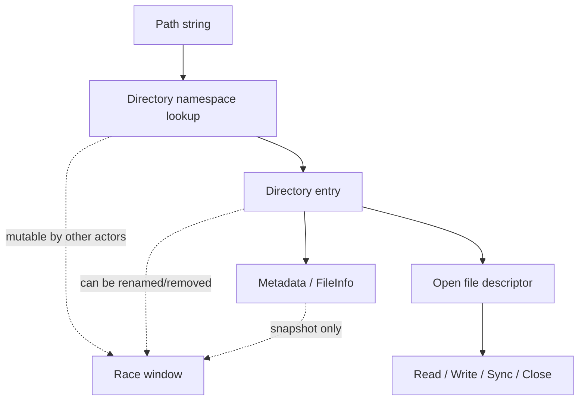
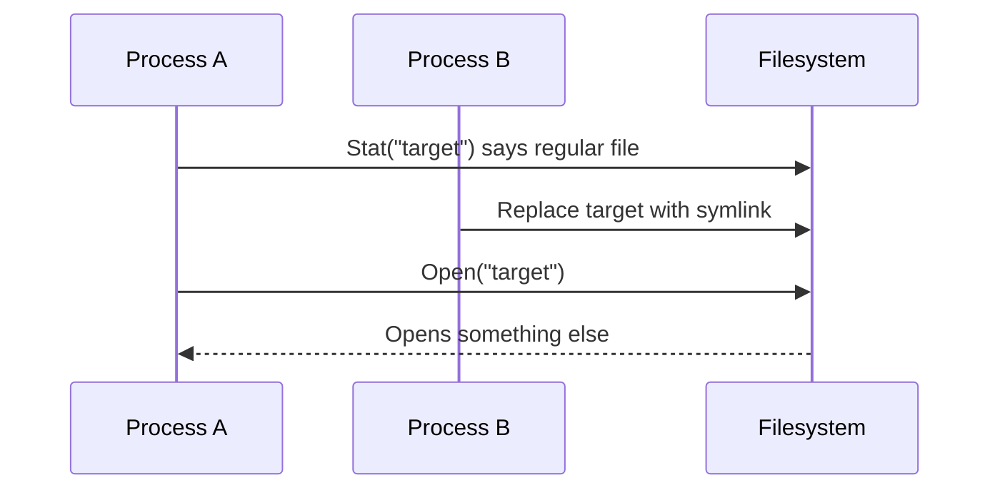
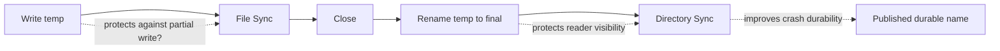
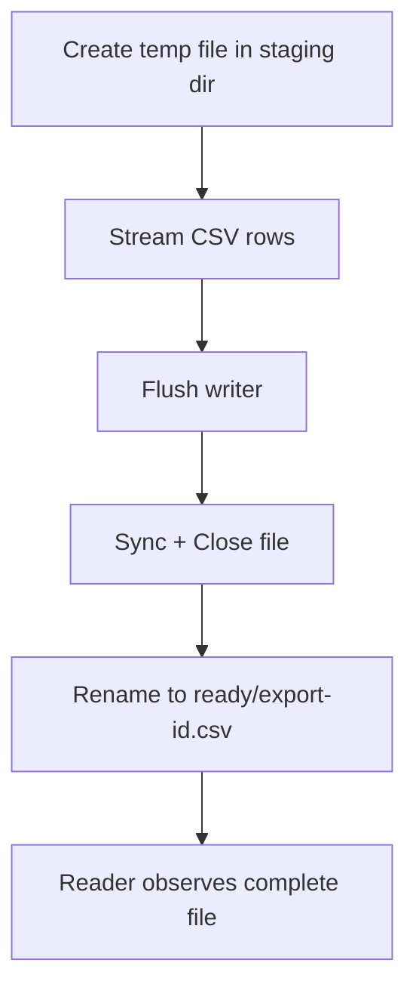
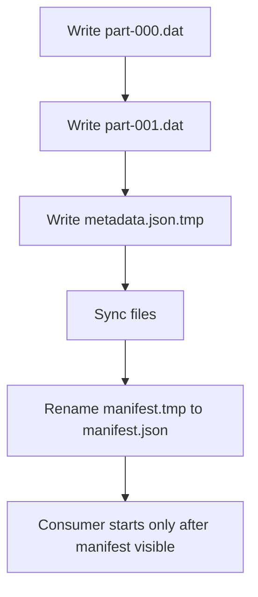
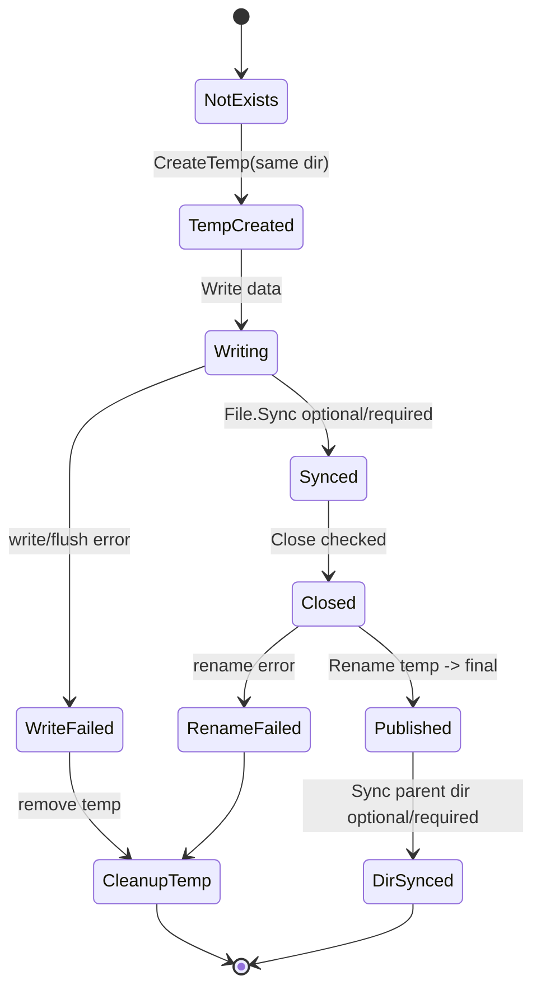
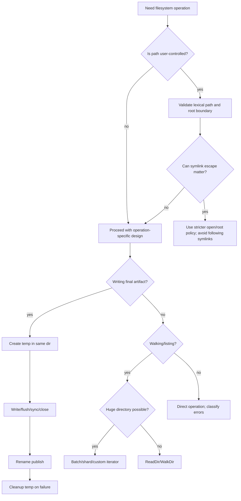

# learn-go-io-buffer-byte-stream-file-network-data-transfer-part-010.md

# Part 010 — Filesystem Operations: Metadata, Directory Traversal, Temp Files, Atomic Replace, and Rename Semantics

> Series: `learn-go-io-buffer-byte-stream-file-network-data-transfer`  
> Target Go version: Go 1.26.x  
> Audience: Java engineer moving toward production-grade Go IO/system engineering  
> Status: Part 010 of 034

---

## 0. Posisi Part Ini Dalam Series

Part sebelumnya membahas **file basics**: `os.File`, open flags, permissions, descriptor ownership, `Close`, offset, dan lifecycle open file.

Part ini naik satu layer: dari **file descriptor** ke **filesystem operations**.

Di Go, filesystem operation berarti operasi terhadap **namespace** dan **metadata**:

- mengecek metadata file/directory;
- membaca isi directory;
- membuat directory;
- menghapus file/tree;
- membuat temporary file/directory;
- rename/move;
- mengganti file secara aman;
- walking tree;
- menangani symlink;
- menangani error lintas OS;
- mendesain operasi file yang tahan crash, race, dan partial failure.

Yang penting: filesystem bukan sekadar “storage API”. Filesystem adalah **shared mutable namespace** yang diakses oleh proses lain, user lain, container runtime, antivirus, backup agent, log shipper, sidecar, scheduler, dan OS sendiri.

Mental model yang salah:

```text
path -> file exists -> operate -> done
```

Mental model yang benar:

```text
path is a name in a mutable namespace
metadata is a snapshot
existence can change immediately
operations can partially succeed
atomicity depends on operation + OS + filesystem + directory boundary
```

---

## 1. Learning Objectives

Setelah part ini, kamu harus mampu:

1. Membedakan operasi berbasis **path**, **directory entry**, dan **open file descriptor**.
2. Memahami `os.Stat`, `os.Lstat`, `FileInfo`, `FileMode`, `DirEntry`, dan `ReadDir`.
3. Mendesain directory traversal yang deterministic, bounded, dan aman terhadap symlink/race.
4. Menggunakan `MkdirTemp` dan `CreateTemp` dengan cleanup dan security model yang benar.
5. Memahami `Rename` sebagai tool untuk atomic publish, tetapi juga batasannya.
6. Mendesain atomic replace pattern yang lebih benar daripada `os.WriteFile(path, data, perm)` langsung.
7. Mengenali TOCTOU bug: check-then-act terhadap path yang bisa berubah.
8. Membuat file operation yang observability-friendly dan testable.
9. Menerapkan checklist production-grade untuk cache files, config snapshots, upload staging, export jobs, dan local persistence.

---

## 2. Java Engineer Mapping

| Java | Go | Catatan |
|---|---|---|
| `java.io.File` | path string + `os` funcs | Go tidak punya object `File` untuk path metadata seperti Java lama; path biasanya string. |
| `java.nio.file.Path` | string + `path/filepath` | Go path OS-native memakai string; validasi/clean/join explicit. |
| `Files.exists(path)` | `os.Stat` + `errors.Is(err, os.ErrNotExist)` | Jangan jadikan pre-check sebelum open/write jika bisa langsung operate. |
| `Files.isDirectory(path)` | `FileInfo.IsDir()` / `DirEntry.IsDir()` | `DirEntry` lebih murah untuk listing. |
| `Files.walk(path)` | `filepath.WalkDir` / `fs.WalkDir` | Callback-style, lexical order, tidak follow symlink secara default. |
| `Files.createTempFile` | `os.CreateTemp` | File mode 0600 sebelum umask. Caller cleanup. |
| `Files.createTempDirectory` | `os.MkdirTemp` | Directory mode 0700 sebelum umask. Caller cleanup. |
| `Files.move(..., ATOMIC_MOVE)` | `os.Rename` | Go tidak expose ATOMIC_MOVE flag standar; semantics OS-specific. |
| `FileChannel.force(true)` | `File.Sync()` + directory fsync via lower-level/open directory where supported | Durable publish but platform differences matter. |

Go cenderung memberi primitive tipis dan membuat kamu explicit terhadap:

- kapan path dicek;
- kapan file dibuka;
- kapan directory dibaca;
- kapan metadata dianggap stale;
- kapan error diabaikan atau fatal;
- kapan operasi harus atomic;
- kapan operasi harus durable.

---

## 3. Filesystem as Namespace, Not Just Storage

Filesystem memiliki dua dimensi:

1. **Data plane**: byte content dari file.
2. **Namespace/metadata plane**: nama, directory entry, mode, ownership, size, mtime, symlink, hard link, device/inode, dan struktur tree.

Part ini terutama membahas plane kedua.



Path bukan file. Path adalah **route** untuk mencari entry di namespace. Setelah file dibuka, descriptor/handle bisa tetap menunjuk file lama walaupun path-nya di-rename atau dihapus, tergantung OS/filesystem semantics.

Contoh penting:

```go
f, err := os.Open("data/current.json")
// process lain rename data/current.json -> data/old.json
// f tetap bisa membaca file yang sudah dibuka pada Unix-like OS.
```

Implikasi desain:

- Path operation rentan race.
- Open descriptor lebih stabil untuk data IO.
- Metadata snapshot tidak boleh dianggap kebenaran permanen.
- Rename mengubah namespace, bukan content yang sudah dibuka.

---

## 4. API Map

Package utama:

```go
import (
    "errors"
    "io/fs"
    "os"
    "path/filepath"
)
```

| Kebutuhan | API utama |
|---|---|
| Metadata path | `os.Stat`, `os.Lstat` |
| Metadata open file | `f.Stat()` |
| Directory listing all entries | `os.ReadDir` |
| Directory listing streaming-ish | `(*os.File).ReadDir(n)` |
| Directory tree walk OS path | `filepath.WalkDir` |
| Directory tree walk abstract FS | `fs.WalkDir` |
| Make directory | `os.Mkdir`, `os.MkdirAll` |
| Temporary file | `os.CreateTemp` |
| Temporary directory | `os.MkdirTemp` |
| Remove file/empty dir | `os.Remove` |
| Remove recursive tree | `os.RemoveAll` |
| Rename/move | `os.Rename` |
| Symlink read | `os.Readlink` |
| Symlink create | `os.Symlink` |
| Same file identity | `os.SameFile` |
| Path construction | `filepath.Join`, `Clean`, `Abs`, `Rel`, `EvalSymlinks` |

---

## 5. `Stat`, `Lstat`, and `FileInfo`

### 5.1 `os.Stat`

`os.Stat(name)` returns metadata about the named file.

```go
info, err := os.Stat("config.yaml")
if err != nil {
    if errors.Is(err, os.ErrNotExist) {
        // file does not exist at the time of lookup
    }
    return err
}

fmt.Println(info.Name())
fmt.Println(info.Size())
fmt.Println(info.Mode())
fmt.Println(info.ModTime())
fmt.Println(info.IsDir())
```

Important: `Stat` follows symlinks. If `config.yaml` is a symlink to another file, `Stat` describes the target.

### 5.2 `os.Lstat`

`os.Lstat(name)` returns metadata about the named path itself. If the path is a symlink, metadata describes the symlink, not the target.

```go
info, err := os.Lstat("config.yaml")
if err != nil {
    return err
}

if info.Mode()&fs.ModeSymlink != 0 {
    target, err := os.Readlink("config.yaml")
    if err != nil {
        return err
    }
    fmt.Println("symlink ->", target)
}
```

Use `Lstat` when:

- you are writing backup/archive tools;
- you must detect symlink before opening;
- you need to prevent symlink traversal;
- you are implementing security-sensitive directory handling;
- you care about the directory entry itself.

Use `Stat` when:

- you want logical target metadata;
- symlink should behave as file target;
- user-facing behavior should follow shell-like semantics.

### 5.3 `FileInfo` Is a Snapshot

`fs.FileInfo` exposes:

```go
type FileInfo interface {
    Name() string
    Size() int64
    Mode() FileMode
    ModTime() time.Time
    IsDir() bool
    Sys() any
}
```

Snapshot means:

```go
info, _ := os.Stat("a.txt")
// another process may replace a.txt here
fmt.Println(info.Size()) // size of old observation, not guaranteed current
```

Never use metadata as a lock or permanent truth.

---

## 6. FileMode: Type Bits vs Permission Bits

`FileMode` contains:

1. type bits: directory, symlink, named pipe, socket, device, irregular;
2. permission bits: Unix-style `rwx` bits.

```go
mode := info.Mode()

switch {
case mode.IsRegular():
    fmt.Println("regular file")
case mode.IsDir():
    fmt.Println("directory")
case mode&fs.ModeSymlink != 0:
    fmt.Println("symlink")
case mode&fs.ModeNamedPipe != 0:
    fmt.Println("named pipe")
case mode&fs.ModeSocket != 0:
    fmt.Println("socket")
}

perm := mode.Perm()
fmt.Printf("perm: %o\n", perm)
```

Production rule:

> Do not assume every filesystem entry is either a regular file or directory.

Real systems contain:

- symlink;
- socket;
- FIFO;
- device;
- mount point;
- deleted-but-open file;
- cloud-mounted file with unusual behavior;
- Windows reparse point;
- network filesystem entry with stale metadata.

---

## 7. Existence Check Is Usually the Wrong Primitive

Common beginner pattern:

```go
if _, err := os.Stat(path); err == nil {
    // exists, now open/write/delete
} else {
    // does not exist
}
```

Problem: between check and use, another actor can change the path.



This is TOCTOU: **time-of-check to time-of-use**.

Better principle:

> Perform the operation directly, then classify the returned error.

Example: create only if absent.

```go
f, err := os.OpenFile(path, os.O_WRONLY|os.O_CREATE|os.O_EXCL, 0600)
if err != nil {
    if errors.Is(err, os.ErrExist) {
        return fmt.Errorf("refusing to overwrite existing file: %w", err)
    }
    return err
}
defer f.Close()
```

Example: open if exists.

```go
f, err := os.Open(path)
if err != nil {
    if errors.Is(err, os.ErrNotExist) {
        return nil // optional file absent
    }
    return err
}
defer f.Close()
```

Use `Stat` for observation, display, optimization, or validation, not as the primary concurrency-control mechanism.

---

## 8. Directory Listing: `os.ReadDir`

`os.ReadDir(name)` reads all directory entries and returns them sorted by filename.

```go
entries, err := os.ReadDir(".")
if err != nil {
    return err
}

for _, e := range entries {
    fmt.Println(e.Name(), e.IsDir(), e.Type())
}
```

### 8.1 `DirEntry` vs `FileInfo`

`DirEntry` is cheaper than `FileInfo` because directory listing may already know name and type bits.

```go
type DirEntry interface {
    Name() string
    IsDir() bool
    Type() FileMode
    Info() (FileInfo, error)
}
```

Use `DirEntry` methods first:

```go
entries, err := os.ReadDir(root)
if err != nil {
    return err
}

for _, e := range entries {
    if e.IsDir() {
        continue
    }
    if e.Type().IsRegular() {
        // Type bits may be enough for some decisions.
    }
}
```

Call `Info()` only when you need size, mod time, full mode, or system metadata.

```go
info, err := e.Info()
if err != nil {
    // Entry may have been removed/renamed after ReadDir.
    continue
}
fmt.Println(info.Size())
```

### 8.2 Partial Success

Directory listing can partially succeed. `os.ReadDir` can return entries already read plus an error.

For high-quality tooling, decide explicitly:

- fail entire operation;
- process partial entries and report warning;
- retry;
- skip inaccessible directory;
- emit diagnostic result per path.

Do not silently ignore `err`.

### 8.3 All-at-once Listing Has Memory Cost

`os.ReadDir` loads all entries. For directory with millions of files, this is not free.

For large directories, use `(*os.File).ReadDir(n)`:

```go
func processLargeDir(path string, batch int, fn func(os.DirEntry) error) error {
    d, err := os.Open(path)
    if err != nil {
        return err
    }
    defer d.Close()

    for {
        entries, err := d.ReadDir(batch)
        for _, e := range entries {
            if err2 := fn(e); err2 != nil {
                return err2
            }
        }
        if err != nil {
            if errors.Is(err, io.EOF) {
                return nil
            }
            return err
        }
    }
}
```

This pattern bounds memory, but order may be filesystem order, not guaranteed lexical sorting like `os.ReadDir` all-at-once behavior.

---

## 9. Recursive Traversal: `filepath.WalkDir`

`filepath.WalkDir(root, fn)` recursively walks a directory tree using OS-native path separators.

```go
err := filepath.WalkDir(root, func(path string, d fs.DirEntry, err error) error {
    if err != nil {
        // Walk could not access this path.
        // Decide: skip, stop, or log and continue.
        return err
    }

    if d.IsDir() && d.Name() == ".git" {
        return filepath.SkipDir
    }

    if d.Type().IsRegular() {
        fmt.Println(path)
    }
    return nil
})
```

Properties:

- deterministic lexical order;
- does not follow symlink directories by default;
- reads an entire directory before walking it;
- callback receives `err` for paths that cannot be accessed;
- return `filepath.SkipDir` to skip a directory;
- return `filepath.SkipAll` to stop all walking.

### 9.1 Why Lexical Order Is Both Good and Bad

Good:

- deterministic output;
- stable tests;
- reproducible archive manifests;
- easier debugging.

Bad:

- entire directory must be read before descending;
- huge directories cause memory/time spike;
- sorting adds overhead;
- first result is delayed until directory listing completes.

For normal application directories, `WalkDir` is excellent. For huge object-store-like local directories, design a custom iterator.

### 9.2 Handling Walk Errors Correctly

Bad:

```go
filepath.WalkDir(root, func(path string, d fs.DirEntry, err error) error {
    // panic: d may be nil when err != nil
    if d.IsDir() {
        return nil
    }
    return nil
})
```

Good:

```go
filepath.WalkDir(root, func(path string, d fs.DirEntry, err error) error {
    if err != nil {
        return fmt.Errorf("walk %s: %w", path, err)
    }
    if d.IsDir() {
        return nil
    }
    return nil
})
```

Or permissive scanner:

```go
type WalkIssue struct {
    Path string
    Err  error
}

func collectRegularFiles(root string) ([]string, []WalkIssue, error) {
    var files []string
    var issues []WalkIssue

    err := filepath.WalkDir(root, func(path string, d fs.DirEntry, err error) error {
        if err != nil {
            issues = append(issues, WalkIssue{Path: path, Err: err})
            return nil // continue walking where possible
        }
        if d.Type().IsRegular() {
            files = append(files, path)
        }
        return nil
    })
    if err != nil {
        return nil, issues, err
    }
    return files, issues, nil
}
```

This model is better for admin/reporting tools where partial visibility is acceptable.

---

## 10. `io/fs` vs `path/filepath`

There are two traversal worlds:

| API | Path style | Backend |
|---|---|---|
| `filepath.WalkDir` | OS-native separator | real OS filesystem |
| `fs.WalkDir` | slash-separated path | any `fs.FS` abstraction |

Use `filepath.WalkDir` for actual OS paths.

Use `fs.WalkDir` for:

- `embed.FS`;
- `os.DirFS`;
- test filesystem;
- virtual filesystem;
- zip-backed or custom FS;
- package APIs that should not require real disk.

Example:

```go
func ListFiles(fsys fs.FS, root string) ([]string, error) {
    var out []string
    err := fs.WalkDir(fsys, root, func(path string, d fs.DirEntry, err error) error {
        if err != nil {
            return err
        }
        if d.Type().IsRegular() {
            out = append(out, path)
        }
        return nil
    })
    return out, err
}
```

Call with OS filesystem:

```go
files, err := ListFiles(os.DirFS("/var/app/data"), ".")
```

Call with embedded FS:

```go
//go:embed migrations/*.sql
var migrations embed.FS

files, err := ListFiles(migrations, "migrations")
```

Important security footnote: `os.DirFS(root)` itself does not magically sandbox against all path tricks when used with untrusted paths and symlinks. Treat it as an abstraction convenience, not a complete security boundary. Use path validation and open-in-root style APIs/patterns where security requires confinement.

---

## 11. Directory Creation: `Mkdir` and `MkdirAll`

### 11.1 `os.Mkdir`

```go
err := os.Mkdir("data", 0750)
if err != nil {
    if errors.Is(err, os.ErrExist) {
        // already exists; but is it a directory?
    }
    return err
}
```

If you need to tolerate existing directory:

```go
func ensureDir(path string, perm fs.FileMode) error {
    err := os.Mkdir(path, perm)
    if err == nil {
        return nil
    }
    if !errors.Is(err, os.ErrExist) {
        return err
    }

    info, statErr := os.Stat(path)
    if statErr != nil {
        return statErr
    }
    if !info.IsDir() {
        return fmt.Errorf("%s exists but is not a directory", path)
    }
    return nil
}
```

This still has a race if another actor changes the path after validation. For normal app initialization, acceptable. For hostile directories, insufficient.

### 11.2 `os.MkdirAll`

```go
if err := os.MkdirAll("data/cache/images", 0750); err != nil {
    return err
}
```

`MkdirAll` creates parent directories as needed and returns nil if path already exists as directory.

Use cases:

- application data directory initialization;
- export job staging root;
- log directory creation;
- test fixture setup.

Caveats:

- permission is subject to umask;
- parent directories may be created with same permission bits;
- symlink/path traversal semantics can be surprising in security-sensitive contexts;
- concurrent creators are usually fine, but still handle errors.

---

## 12. Temporary Files and Directories

Temporary files are not just convenience. They are part of safe write protocols.

### 12.1 `os.CreateTemp`

```go
f, err := os.CreateTemp("", "upload-*.tmp")
if err != nil {
    return err
}
name := f.Name()

cleanup := true
defer func() {
    if cleanup {
        _ = os.Remove(name)
    }
}()

defer f.Close()
```

Properties:

- creates a new unique file;
- opens it read/write;
- mode `0600` before umask;
- caller is responsible for remove;
- safe for concurrent callers.

### 12.2 `os.MkdirTemp`

```go
dir, err := os.MkdirTemp("", "job-*")
if err != nil {
    return err
}
defer os.RemoveAll(dir)
```

Properties:

- creates unique directory;
- mode `0700` before umask;
- caller cleanup;
- excellent for job staging.

### 12.3 Why Temp File Should Usually Be in Same Directory as Destination

For atomic replace using `Rename`, temp file should be in the same directory as final destination.

Bad:

```go
f, _ := os.CreateTemp("", "config-*.tmp")
os.Rename(f.Name(), "/etc/myapp/config.json")
```

Problems:

- temp dir may be on different filesystem;
- cross-device rename may fail;
- permission/ownership/SELinux context may differ;
- atomicity assumptions become weaker.

Better:

```go
dir := filepath.Dir(dst)
f, err := os.CreateTemp(dir, "."+filepath.Base(dst)+"-*.tmp")
```

---

## 13. Atomic Replace Pattern

Naive write:

```go
err := os.WriteFile("config.json", data, 0644)
```

Potential failure modes:

- process crashes after truncating but before full write;
- partial content visible to readers;
- existing file corrupted;
- reader sees half-written JSON;
- close/flush error ignored;
- permissions unexpectedly changed.

Better pattern:

1. Create temp file in same directory.
2. Write full content.
3. Flush buffered writer if any.
4. Sync file if durability matters.
5. Close file and check error.
6. Rename temp file to destination.
7. Optionally sync parent directory for crash durability.
8. Cleanup temp file on failure.

### 13.1 Implementation: Atomic Publish Helper

```go
package atomicfile

import (
    "fmt"
    "os"
    "path/filepath"
)

func WriteFileReplace(path string, data []byte, perm os.FileMode) error {
    dir := filepath.Dir(path)
    base := filepath.Base(path)

    tmp, err := os.CreateTemp(dir, "."+base+"-*.tmp")
    if err != nil {
        return fmt.Errorf("create temp for %s: %w", path, err)
    }
    tmpName := tmp.Name()

    committed := false
    defer func() {
        if !committed {
            _ = os.Remove(tmpName)
        }
    }()

    if err := tmp.Chmod(perm); err != nil {
        _ = tmp.Close()
        return fmt.Errorf("chmod temp %s: %w", tmpName, err)
    }

    if _, err := tmp.Write(data); err != nil {
        _ = tmp.Close()
        return fmt.Errorf("write temp %s: %w", tmpName, err)
    }

    if err := tmp.Sync(); err != nil {
        _ = tmp.Close()
        return fmt.Errorf("sync temp %s: %w", tmpName, err)
    }

    if err := tmp.Close(); err != nil {
        return fmt.Errorf("close temp %s: %w", tmpName, err)
    }

    if err := os.Rename(tmpName, path); err != nil {
        return fmt.Errorf("rename %s -> %s: %w", tmpName, path, err)
    }
    committed = true

    // Best-effort directory sync. See platform caveats below.
    _ = syncDir(dir)

    return nil
}

func syncDir(dir string) error {
    d, err := os.Open(dir)
    if err != nil {
        return err
    }
    defer d.Close()
    return d.Sync()
}
```

This pattern protects readers from seeing partial file contents, assuming rename replacement semantics hold for the platform/filesystem combination.

### 13.2 Atomic Visibility vs Durable Persistence

Atomic visibility means readers see either old file or new file, not half file.

Durable persistence means data survives crash/power loss after operation returns.

They are not the same.



In many apps, atomic visibility is mandatory. Full crash durability depends on OS/filesystem and whether directory sync is supported.

---

## 14. `os.Rename`: What It Does and Does Not Promise

`os.Rename(oldpath, newpath)` renames/moves `oldpath` to `newpath`.

Important documented behavior:

- if `newpath` exists and is not a directory, `Rename` replaces it;
- if `newpath` exists and is a directory, `Rename` returns error;
- OS-specific restrictions may apply across directories;
- on non-Unix platforms, even within same directory, rename may not be atomic;
- errors are generally `*os.LinkError`.

### 14.1 Use Cases

Good use cases:

- publish completed file;
- rotate logs;
- swap generated manifest;
- move upload from staging to ready directory;
- atomic config snapshot update.

Risky use cases:

- cross-filesystem move;
- replacing file currently open by another process on Windows;
- replacing directory trees;
- publishing across mount boundaries;
- assuming crash durability without fsync.

### 14.2 Rename Is Namespace Operation

`Rename` does not copy file bytes. It changes directory entries.

That is why it is often fast even for large files.

But when source and destination are on different filesystems/devices, a true atomic rename may not be possible. Some higher-level tools implement copy+delete fallback, but `os.Rename` does not promise to do safe copy fallback for you.

### 14.3 Do Not Implement Atomic Replace With Copy+Delete

Bad:

```go
copyFile(tmp, dst)
os.Remove(tmp)
```

This can expose partial destination content. It is not atomic publish.

If cross-filesystem movement is required, treat it as a different protocol:

1. copy to temp in destination filesystem;
2. sync temp;
3. rename temp to final;
4. cleanup source after publish;
5. tolerate duplicate source/destination during recovery.

---

## 15. Remove and RemoveAll

### 15.1 `os.Remove`

Removes named file or empty directory.

```go
if err := os.Remove(path); err != nil {
    if errors.Is(err, os.ErrNotExist) {
        return nil
    }
    return err
}
```

### 15.2 `os.RemoveAll`

Removes path and any children.

```go
if err := os.RemoveAll(stagingDir); err != nil {
    return fmt.Errorf("cleanup staging dir: %w", err)
}
```

Documented behavior includes returning nil if path does not exist.

Production caution:

- Never call `RemoveAll` on a path built from untrusted input without strict validation.
- Never call it on empty string accidentally.
- Never use it with a broad root from config without safety guard.
- Beware symlink semantics and platform differences.
- Log what root is being removed.

Safer wrapper:

```go
func removeJobDir(root, jobID string) error {
    if jobID == "" || strings.Contains(jobID, string(filepath.Separator)) {
        return fmt.Errorf("invalid job id")
    }

    path := filepath.Join(root, jobID)
    cleanRoot, err := filepath.Abs(root)
    if err != nil {
        return err
    }
    cleanPath, err := filepath.Abs(path)
    if err != nil {
        return err
    }

    rel, err := filepath.Rel(cleanRoot, cleanPath)
    if err != nil {
        return err
    }
    if rel == "." || strings.HasPrefix(rel, "..") || filepath.IsAbs(rel) {
        return fmt.Errorf("refusing to remove outside root: %s", cleanPath)
    }

    return os.RemoveAll(cleanPath)
}
```

This is not a complete defense against all symlink races in hostile directories, but it prevents many accidental disasters.

---

## 16. Symlinks: Useful, Dangerous, and Often Misunderstood

A symlink is a directory entry pointing to another path.

```go
if err := os.Symlink("/real/target", "link-name"); err != nil {
    return err
}

target, err := os.Readlink("link-name")
```

### 16.1 `Stat` vs `Lstat` With Symlink

```text
link -> target.txt

os.Stat("link")  => target.txt metadata
os.Lstat("link") => link metadata
```

### 16.2 Symlink Attack Pattern

Suppose an app writes temp file into a shared writable directory.

```go
path := "/tmp/myapp/output"
os.WriteFile(path, data, 0644)
```

If attacker can replace `output` with a symlink to sensitive file, write may target something unexpected depending on permissions and OS behavior.

Safer practices:

- use private temp directory with `0700`;
- use `CreateTemp` not predictable names;
- avoid following symlinks in security-sensitive traversal;
- validate path relative to trusted root;
- prefer opening relative to trusted directory where APIs support it;
- do not put privileged outputs in globally writable directories.

### 16.3 Walk Does Not Follow Symlink Directories by Default

`filepath.WalkDir` does not follow symlink directories. That prevents infinite cycles and many traversal surprises.

If you choose to follow symlinks manually, you must handle:

- cycles;
- visited identity tracking;
- max depth;
- path escape;
- permission errors;
- broken links;
- race between `Readlink` and `Open`.

Default advice: do not follow symlink directories unless your product explicitly needs it.

---

## 17. Same File Identity: `os.SameFile`

`os.SameFile(fi1, fi2)` checks whether two `FileInfo` values from `os.Stat` describe the same file.

```go
fi1, err := os.Stat("a")
if err != nil { return err }
fi2, err := os.Stat("b")
if err != nil { return err }

if os.SameFile(fi1, fi2) {
    fmt.Println("same underlying file")
}
```

Use cases:

- detect hard links;
- avoid copying file onto itself;
- validate source and destination are not same file;
- deduplicate traversal result.

Caveats:

- depends on metadata available from OS;
- only applies to results returned by `os.Stat` per documentation;
- not a security boundary by itself due to race after check.

---

## 18. Race Models in Filesystem Code

### 18.1 Rename Race

```go
info, err := os.Stat(path)
// file can change here
f, err := os.Open(path)
```

### 18.2 Delete Race

```go
entries, _ := os.ReadDir(dir)
for _, e := range entries {
    info, err := e.Info() // may fail: entry removed
}
```

### 18.3 Type Change Race

```go
info, _ := os.Lstat(path) // says regular file
// other process replaces with directory/symlink
f, _ := os.Open(path)
```

### 18.4 Permission Race

```go
// directory permissions change between walk and open
```

### 18.5 Mount/Volume Race

```go
// container volume remounted, network FS stale, NFS error, Windows handle lock
```

Production design should ask:

- Is the directory trusted?
- Is another process modifying it?
- Is partial result acceptable?
- Is the path user-controlled?
- Is symlink traversal allowed?
- Is rename expected to be atomic?
- Is durability required after crash?

---

## 19. Error Classification

Filesystem functions usually return rich errors such as:

- `*os.PathError` for path operation failures;
- `*os.LinkError` for link/rename operation failures;
- wrapped syscall errors underneath.

Use `errors.Is` for portable checks:

```go
if err != nil {
    switch {
    case errors.Is(err, os.ErrNotExist):
        // absent
    case errors.Is(err, os.ErrExist):
        // already exists
    case errors.Is(err, os.ErrPermission):
        // permission denied
    default:
        return err
    }
}
```

Use `errors.As` when you need operation/path details:

```go
var pe *os.PathError
if errors.As(err, &pe) {
    fmt.Printf("op=%s path=%s err=%v\n", pe.Op, pe.Path, pe.Err)
}

var le *os.LinkError
if errors.As(err, &le) {
    fmt.Printf("op=%s old=%s new=%s err=%v\n", le.Op, le.Old, le.New, le.Err)
}
```

Do not string-match error messages. They vary by OS and localization.

---

## 20. Path Validation Belongs With Filesystem Operation

Part 011 will go deep into path handling, but filesystem operations cannot ignore path safety.

Minimum rules:

- never concatenate path strings manually with `/` for OS paths;
- use `filepath.Join`;
- reject empty path where dangerous;
- validate user-controlled path is relative when expected;
- reject `..` escape when operating inside root;
- beware symlink escape;
- log canonical root and requested relative path separately;
- do not trust `Clean` as a full security boundary.

Bad:

```go
path := root + "/" + userInput
return os.RemoveAll(path)
```

Better baseline:

```go
func joinUnderRoot(root, name string) (string, error) {
    if name == "" {
        return "", fmt.Errorf("empty name")
    }
    if filepath.IsAbs(name) {
        return "", fmt.Errorf("absolute path not allowed")
    }

    clean := filepath.Clean(name)
    if clean == "." || clean == ".." || strings.HasPrefix(clean, ".."+string(filepath.Separator)) {
        return "", fmt.Errorf("path escapes root")
    }

    return filepath.Join(root, clean), nil
}
```

Again: this protects against lexical escape, not every symlink race.

---

## 21. Case Study 1: Safe Export Job

Problem:

A service exports a large CSV file, then another process picks files from `ready/`.

Bad design:

```go
os.WriteFile("ready/export.csv", data, 0644)
```

Reader may pick partial file.

Better design:



Implementation sketch:

```go
func PublishExport(readyDir, exportID string, write func(io.Writer) error) error {
    if exportID == "" || strings.ContainsAny(exportID, `/\`) {
        return fmt.Errorf("invalid export id")
    }

    if err := os.MkdirAll(readyDir, 0750); err != nil {
        return err
    }

    final := filepath.Join(readyDir, exportID+".csv")
    tmp, err := os.CreateTemp(readyDir, "."+exportID+"-*.tmp")
    if err != nil {
        return err
    }
    tmpName := tmp.Name()
    committed := false
    defer func() {
        if !committed {
            _ = os.Remove(tmpName)
        }
    }()

    bw := bufio.NewWriterSize(tmp, 256*1024)
    if err := write(bw); err != nil {
        _ = tmp.Close()
        return err
    }
    if err := bw.Flush(); err != nil {
        _ = tmp.Close()
        return err
    }
    if err := tmp.Sync(); err != nil {
        _ = tmp.Close()
        return err
    }
    if err := tmp.Close(); err != nil {
        return err
    }
    if err := os.Rename(tmpName, final); err != nil {
        return err
    }
    committed = true
    return nil
}
```

Note: This publishes complete file visibility. Directory sync can be added if crash durability is required.

---

## 22. Case Study 2: Cache Directory Cleaner

Problem:

Clean files older than TTL in cache directory.

Danger:

- recursively deleting outside root;
- following symlink accidentally;
- deleting active temp file;
- millions of files causing memory spike;
- clock skew or mtime weirdness;
- permission errors stopping entire cleanup.

Design:

- only delete regular files;
- skip symlinks;
- skip active temp suffix/prefix;
- collect metrics;
- tolerate partial failure;
- bound work per run.

```go
type CleanerStats struct {
    Scanned int
    Removed int
    Skipped int
    Failed  int
}

func CleanCache(root string, olderThan time.Duration, maxDeletes int) (CleanerStats, error) {
    cutoff := time.Now().Add(-olderThan)
    var st CleanerStats

    err := filepath.WalkDir(root, func(path string, d fs.DirEntry, err error) error {
        if err != nil {
            st.Failed++
            return nil // best-effort cleaner
        }
        if path == root {
            return nil
        }
        if d.IsDir() {
            return nil
        }
        st.Scanned++

        if d.Type()&fs.ModeSymlink != 0 {
            st.Skipped++
            return nil
        }
        if !d.Type().IsRegular() {
            st.Skipped++
            return nil
        }
        if strings.HasSuffix(d.Name(), ".tmp") {
            st.Skipped++
            return nil
        }

        info, err := d.Info()
        if err != nil {
            st.Failed++
            return nil
        }
        if info.ModTime().After(cutoff) {
            return nil
        }

        if maxDeletes > 0 && st.Removed >= maxDeletes {
            return filepath.SkipAll
        }

        if err := os.Remove(path); err != nil {
            if !errors.Is(err, os.ErrNotExist) {
                st.Failed++
            }
            return nil
        }
        st.Removed++
        return nil
    })

    return st, err
}
```

Production improvement:

- shard cache directories;
- avoid giant single directory;
- add lock/lease for active files;
- use atomic rename into trash before delete if slow deletion affects readers;
- rate-limit delete operations on network filesystems.

---

## 23. Case Study 3: Config Snapshot Reader

Problem:

A service reads `current.json` periodically while another process updates it.

Writer should use atomic replace:

```text
tmp -> write -> sync -> close -> rename current.json
```

Reader should open then read from descriptor:

```go
func ReadConfig(path string, maxSize int64) ([]byte, error) {
    f, err := os.Open(path)
    if err != nil {
        return nil, err
    }
    defer f.Close()

    return io.ReadAll(io.LimitReader(f, maxSize+1))
}
```

Better reader validates max size:

```go
func ReadBoundedFile(path string, maxSize int64) ([]byte, error) {
    f, err := os.Open(path)
    if err != nil {
        return nil, err
    }
    defer f.Close()

    r := io.LimitReader(f, maxSize+1)
    data, err := io.ReadAll(r)
    if err != nil {
        return nil, err
    }
    if int64(len(data)) > maxSize {
        return nil, fmt.Errorf("file too large: %s", path)
    }
    return data, nil
}
```

Do not read based only on `Stat().Size()` because file may change between stat and open/read. Open first; if size check needed, use descriptor `f.Stat()` and still enforce bounded read.

---

## 24. Filesystem Operation Invariants

Production code should make these invariants explicit.

### 24.1 Ownership Invariants

- Who owns path?
- Who may delete it?
- Who may rename it?
- Who cleans temp files?
- Who owns permission mode?

### 24.2 Visibility Invariants

- Can readers see partial output?
- Is temp file hidden by name convention?
- Is final file only published after complete write?
- Are directories watched by another system?

### 24.3 Durability Invariants

- Is data allowed to vanish after process crash?
- Is data allowed to vanish after OS crash?
- Is file sync required?
- Is directory sync required?

### 24.4 Security Invariants

- Is path user-controlled?
- Is directory shared/writable by others?
- Are symlinks allowed?
- Can operation escape root?
- Is recursive delete scoped?

### 24.5 Performance Invariants

- How many entries can directory contain?
- Does traversal need deterministic order?
- Is all-at-once listing acceptable?
- Is network filesystem involved?
- What are expected syscall counts?

---

## 25. Observability for Filesystem Operations

Good filesystem observability includes:

- operation name: `stat`, `read_dir`, `walk`, `create_temp`, `rename`, `remove_all`;
- root path category, not always full sensitive path;
- duration;
- bytes when relevant;
- number of entries scanned;
- number of files removed;
- number of errors skipped;
- error class: not_exist, exists, permission, invalid, cross_device, unknown;
- whether operation was best-effort or fatal;
- temp cleanup failure count;
- descriptor leak signal;
- disk full / quota / read-only filesystem detection.

Example wrapper:

```go
type FSOp struct {
    Op       string
    PathKind string
    Start    time.Time
}

func observeFS(op, pathKind string, fn func() error) error {
    start := time.Now()
    err := fn()
    duration := time.Since(start)

    status := "ok"
    if err != nil {
        status = classifyFSError(err)
    }

    log.Printf("fs_op=%s path_kind=%s status=%s duration_ms=%d",
        op, pathKind, status, duration.Milliseconds())
    return err
}

func classifyFSError(err error) string {
    switch {
    case err == nil:
        return "ok"
    case errors.Is(err, os.ErrNotExist):
        return "not_exist"
    case errors.Is(err, os.ErrExist):
        return "exists"
    case errors.Is(err, os.ErrPermission):
        return "permission"
    default:
        return "error"
    }
}
```

Security note: avoid logging raw user path if it may contain secrets, tenant IDs, personal identifiers, or traversal payloads. Log normalized categories and request IDs.

---

## 26. Testing Filesystem Operations

### 26.1 Use `t.TempDir()`

```go
func TestPublishExport(t *testing.T) {
    dir := t.TempDir()

    err := PublishExport(dir, "job-1", func(w io.Writer) error {
        _, err := w.Write([]byte("a,b\n1,2\n"))
        return err
    })
    if err != nil {
        t.Fatal(err)
    }

    data, err := os.ReadFile(filepath.Join(dir, "job-1.csv"))
    if err != nil {
        t.Fatal(err)
    }
    if string(data) != "a,b\n1,2\n" {
        t.Fatalf("unexpected content: %q", data)
    }
}
```

`t.TempDir()` automatically cleans up after test. Prefer it over manually picking `/tmp/...`.

### 26.2 Test Error Paths

Examples:

- destination parent missing;
- destination is directory;
- input path does not exist;
- permission denied where supported;
- cleanup after writer failure;
- no temp file left after failure;
- symlink entry skipped;
- traversal continues after one inaccessible path;
- huge directory behavior with batches.

### 26.3 Testing Atomic Replace Semantics

Test that old file remains if writer fails before rename:

```go
func TestWriteFileReplaceKeepsOldOnWriteError(t *testing.T) {
    dir := t.TempDir()
    dst := filepath.Join(dir, "current.txt")

    if err := os.WriteFile(dst, []byte("old"), 0644); err != nil {
        t.Fatal(err)
    }

    // Instead of injecting through WriteFileReplace(data), create variant that accepts writer callback.
    err := WriteFileReplaceFunc(dst, 0644, func(w io.Writer) error {
        _, _ = w.Write([]byte("new partial"))
        return errors.New("boom")
    })
    if err == nil {
        t.Fatal("expected error")
    }

    data, err := os.ReadFile(dst)
    if err != nil {
        t.Fatal(err)
    }
    if string(data) != "old" {
        t.Fatalf("old file was not preserved: %q", data)
    }
}
```

This requires designing production code to accept writer callback, not only `[]byte`.

---

## 27. Performance Model

Filesystem operation cost comes from:

- syscall overhead;
- directory entry count;
- metadata lookup cost;
- storage latency;
- network filesystem latency;
- sorting directory entries;
- memory allocation for entry lists;
- path normalization;
- antivirus/security scanning on Windows/corporate machines;
- container overlay filesystem overhead;
- sync/fsync latency.

### 27.1 Avoid Per-file `Stat` if `DirEntry` Is Enough

Bad:

```go
entries, _ := os.ReadDir(dir)
for _, e := range entries {
    info, _ := os.Stat(filepath.Join(dir, e.Name()))
    _ = info
}
```

Better:

```go
entries, _ := os.ReadDir(dir)
for _, e := range entries {
    if e.Type().IsRegular() {
        // no full stat needed yet
    }
}
```

Call `Info` lazily only when required.

### 27.2 Avoid Giant Flat Directories

If your application creates millions of files, shard:

```text
cache/
  ab/
    cd/
      abcdef123...
```

Benefits:

- faster listing;
- lower per-directory memory spike;
- fewer lock/contention issues in filesystem;
- better cleanup batching;
- easier partial scan.

### 27.3 Fsync Is Expensive But Sometimes Mandatory

`File.Sync()` can be expensive because it asks OS to commit data to stable storage. Use based on data criticality.

| Data | Sync needed? |
|---|---|
| rebuildable cache | usually no |
| exported report can be regenerated | maybe no or async |
| audit log | often yes or batched durability protocol |
| config snapshot | usually yes before rename if correctness matters |
| local queue / outbox | yes, or accept data loss explicitly |
| temp processing scratch | no |

---

## 28. Security Model

Filesystem security bugs often come from treating path as trusted.

### 28.1 Threats

- path traversal: `../../etc/passwd`;
- absolute path injection;
- symlink escape;
- race between check and open;
- recursive delete outside intended root;
- predictable temp filename;
- unsafe archive extraction;
- permission too broad;
- leaking secret files through logs;
- replacing file via shared writable directory;
- Windows special path semantics/reparse points.

### 28.2 Defensive Defaults

- private app data dir, not world-writable shared dir;
- `MkdirTemp` with 0700 for staging;
- `CreateTemp` with 0600 for sensitive temp;
- never predictable temp names;
- avoid check-then-act;
- use `O_EXCL` for create-if-absent;
- reject absolute and parent escaping paths;
- do not follow symlinks in hostile roots;
- hide temp files from ready consumers;
- fail closed on ambiguous path.

### 28.3 Multi-tenant Systems

For SaaS/regulatory systems, path design should include tenant boundary.

Bad:

```text
/exports/{userProvidedFileName}
```

Better:

```text
/exports/{tenantID}/{jobID}/data.tmp
/exports/{tenantID}/{jobID}/ready.json
```

And IDs are generated/validated by the system, not raw user filenames.

---

## 29. Production Patterns

### 29.1 Staging Directory Pattern

```text
jobs/
  running/
    job-123/
      data.tmp
      manifest.tmp
  ready/
    job-123.manifest
  failed/
    job-123.error
```

Rules:

- running dir is private to writer;
- ready dir contains only complete manifests;
- consumers only scan ready dir;
- cleanup scans running dirs older than TTL;
- failed state is explicit.

### 29.2 Manifest Publish Pattern

For multi-file output, publish manifest last.



Consumers ignore directory until manifest appears.

### 29.3 Write-Ahead Local Queue Pattern

For local durable queue:

```text
queue/
  pending/
    000001.msg
  inflight/
    000001.msg
  done/
```

Move files between states with rename. But if you require crash-consistent queue, you need stronger protocol: fsync file and directories, idempotent processing, recovery scanner, and duplicate-safe downstream behavior.

### 29.4 Tombstone Pattern

Instead of deleting immediately:

```text
active/item-123
trash/item-123.deleted-at-2026...
```

Benefits:

- recovery window;
- auditability;
- async cleanup;
- avoids slow delete on hot path.

---

## 30. Anti-patterns

### 30.1 Treating `Stat` as Lock

```go
if _, err := os.Stat(path); errors.Is(err, os.ErrNotExist) {
    os.WriteFile(path, data, 0644)
}
```

Use `O_EXCL` or write temp + rename depending on intent.

### 30.2 Writing Directly to Final File

```go
os.WriteFile("ready.json", data, 0644)
```

Can expose partial or truncated file. Use temp + rename.

### 30.3 Ignoring Close/Flush/Sync Errors

```go
f.Write(data)
f.Close() // error ignored
```

Close can report writeback errors. Check it when writing important data.

### 30.4 Recursive Delete Without Guard

```go
os.RemoveAll(filepath.Join(root, userInput))
```

Validate and scope first.

### 30.5 Following Symlinks Accidentally

```go
info, _ := os.Stat(path) // follows symlink
```

Use `Lstat` if symlink itself matters.

### 30.6 Huge `ReadDir` on Unbounded Directory

```go
entries, _ := os.ReadDir(uploadRoot)
```

May allocate huge memory. Batch or shard.

### 30.7 Assuming Linux Semantics Everywhere

Windows, macOS, Linux, container overlayfs, NFS, SMB, and cloud-mounted volumes have different behavior around rename, open file replacement, permissions, locking, and sync.

---

## 31. Design Review Checklist

Before approving filesystem-heavy code, ask:

### Correctness

- Does it operate directly instead of check-then-act where possible?
- Are partial errors handled?
- Does it distinguish absent/exist/permission/invalid?
- Does it check close/flush errors on writes?
- Does it preserve old file on failure?

### Atomicity

- Can readers see partial output?
- Is temp file in same directory as final file?
- Is `Rename` used for publish?
- Are cross-device moves handled explicitly?
- Are multi-file outputs published by manifest?

### Durability

- Is `Sync` required?
- Is parent directory sync required?
- What happens after process crash?
- What happens after OS crash?
- Is recovery scanner defined?

### Security

- Is path user-controlled?
- Are absolute/parent paths rejected?
- Are symlinks allowed?
- Is `RemoveAll` scoped?
- Are temp names unpredictable?
- Are permissions minimal?

### Performance

- Could directory contain millions of entries?
- Does traversal need lexical order?
- Are metadata calls minimized?
- Is fsync on hot path justified?
- Is cleanup bounded/rate-limited?

### Operations

- Are errors observable?
- Are cleanup failures logged?
- Are stuck temp files recoverable?
- Are metrics emitted?
- Is disk-full behavior tested?

---

## 32. Mermaid Summary: Atomic File Lifecycle



---

## 33. Mermaid Summary: Filesystem Operation Decision Tree



---

## 34. Exercises

### Exercise 1 — Safe Config Writer

Implement:

```go
func WriteConfig(path string, data []byte) error
```

Requirements:

- temp file in same directory;
- permission `0640`;
- preserve old file on failure;
- `Sync` file before rename;
- cleanup temp file;
- include useful wrapped errors.

### Exercise 2 — Bounded Directory Scanner

Implement:

```go
func ScanDir(path string, maxEntries int) ([]string, error)
```

Requirements:

- use `(*os.File).ReadDir(n)`;
- return error if more than `maxEntries`;
- skip directories;
- skip symlinks;
- return regular file names only.

### Exercise 3 — Safe Recursive Cleanup

Implement:

```go
func CleanupJob(root, jobID string) error
```

Requirements:

- reject empty job ID;
- reject path separators in job ID;
- ensure target remains lexically under root;
- call `RemoveAll` only after validation;
- log path category, not raw user input.

### Exercise 4 — Walk With Partial Errors

Implement a scanner that returns:

```go
type ScanResult struct {
    Files  []string
    Issues []Issue
}

type Issue struct {
    Path string
    Err  error
}
```

Requirements:

- continue on inaccessible paths;
- record error;
- skip `.git`, `node_modules`, and `vendor`;
- do not follow symlinks;
- only include regular files.

### Exercise 5 — Cross-device Publish Protocol

Design a protocol for publishing a file when source temp may be on different filesystem than destination.

Expected answer:

- copy to temp in destination dir;
- flush/sync/close destination temp;
- rename destination temp to final;
- cleanup source after publish;
- recovery process handles duplicate source and destination temp.

---

## 35. Practical Mini-project

Build a small package:

```text
safeio/
  atomic_write.go
  scan.go
  cleanup.go
  path_guard.go
  atomic_write_test.go
  scan_test.go
```

Required API:

```go
package safeio

func WriteFileAtomic(path string, data []byte, perm fs.FileMode) error
func WriteFileAtomicFunc(path string, perm fs.FileMode, fn func(io.Writer) error) error
func ListRegularFiles(root string, opts ListOptions) ([]string, []Issue, error)
func RemoveChild(root, child string) error
```

Design goals:

- no direct write to final path;
- no unbounded recursive delete;
- no full metadata lookup unless necessary;
- test with `t.TempDir`;
- table tests for invalid path;
- verify old file preserved on write failure;
- verify temp cleanup.

---

## 36. Key Takeaways

1. Path is not file; path is a mutable namespace lookup.
2. Metadata is a snapshot; it can become stale immediately.
3. Avoid check-then-act when direct operation can encode intent.
4. Use `DirEntry` to avoid unnecessary metadata syscalls.
5. `ReadDir` and `WalkDir` are convenient but can read whole directories into memory.
6. Temp file should usually be created in the same directory as final file.
7. Atomic replace means write temp, flush/sync/close, then rename.
8. Atomic visibility and crash durability are different requirements.
9. `Rename` is powerful but semantics vary by OS/filesystem, especially outside Unix assumptions.
10. `RemoveAll` is dangerous unless path is tightly scoped.
11. Symlink handling must be explicit in security-sensitive code.
12. Production filesystem code needs observability, cleanup strategy, recovery plan, and tests for failure paths.

---

## 37. References

- Go `os` package documentation: https://pkg.go.dev/os
- Go `io/fs` package documentation: https://pkg.go.dev/io/fs
- Go `path/filepath` package documentation: https://pkg.go.dev/path/filepath
- Go 1.26 Release Notes: https://go.dev/doc/go1.26
- Go Blog: Go 1.26 is released: https://go.dev/blog/go1.26

---

## 38. Next Part

Next:

```text
learn-go-io-buffer-byte-stream-file-network-data-transfer-part-011.md
```

Topic:

```text
Path handling: path, filepath, portability, traversal safety, canonicalization
```

Part 011 will go deeper into path manipulation itself: `path` vs `filepath`, `Clean`, `Join`, `Abs`, `Rel`, `EvalSymlinks`, slash vs OS separator, Windows path traps, root confinement, canonicalization limits, and path traversal defense.

<!-- NAVIGATION_FOOTER -->
<div class="page-nav">
<a href="./learn-go-io-buffer-byte-stream-file-network-data-transfer-part-009.md">⬅️ Part 009 — File Basics: `os.File`, Open Flags, Permission, Lifecycle, dan Descriptor Ownership</a>
<a href="./index.md">📚 Kategori</a>
<a href="../../index.md">🏠 Home</a>
<a href="./learn-go-io-buffer-byte-stream-file-network-data-transfer-part-011.md">Part 011 — Path Handling: `path`, `filepath`, Portability, Traversal Safety, Canonicalization ➡️</a>
</div>
