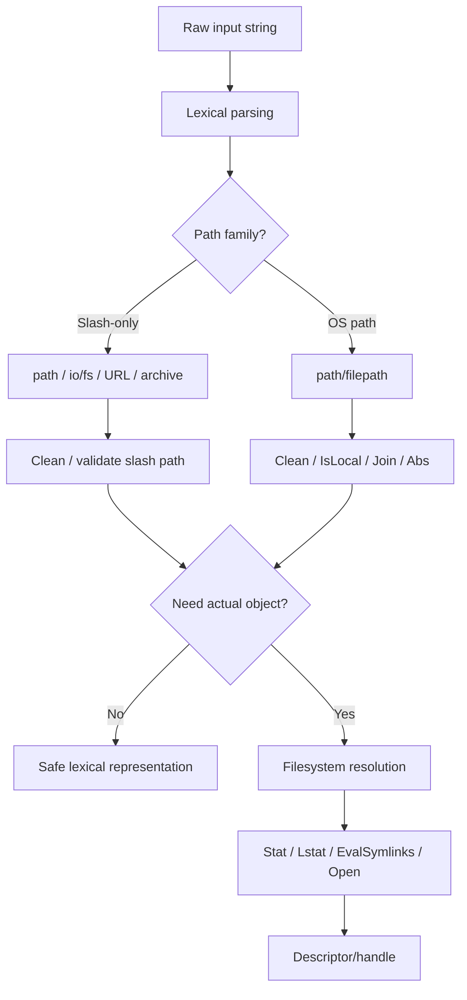
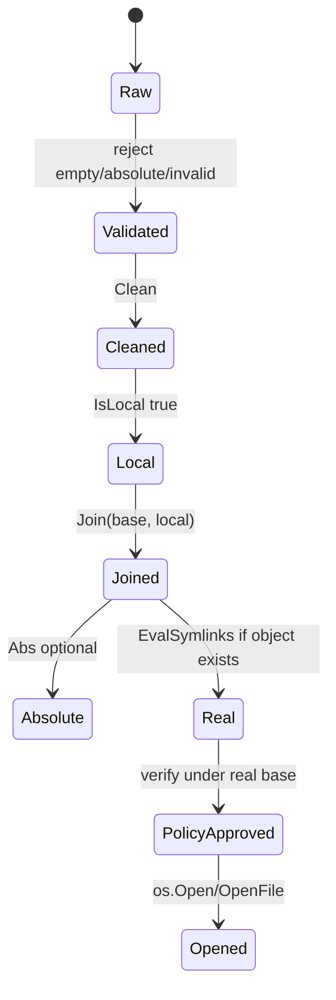
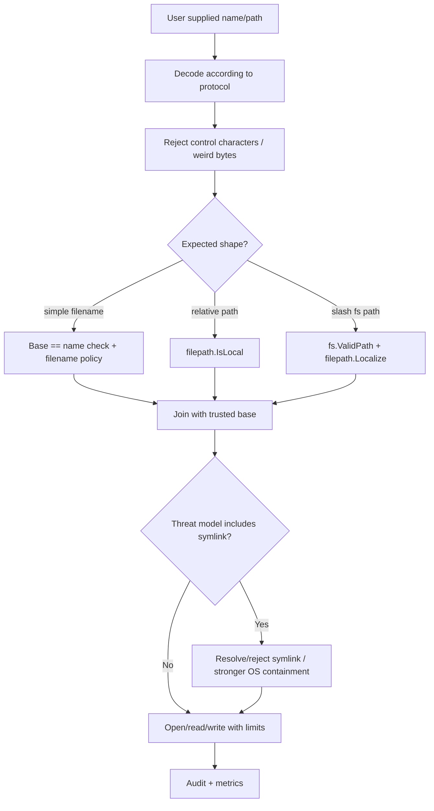

# learn-go-io-buffer-byte-stream-file-network-data-transfer-part-011.md

# Part 011 — Path Handling: `path`, `filepath`, Portability, Traversal Safety, Canonicalization

> Seri: **Go IO, Buffer, Byte & Stream, Serialization, Console IO, File & FileSystem, Compression, Networking, Data Transfer**  
> Target: **Go 1.26.x**  
> Level: **Advanced / Internal Engineering Handbook**  
> Pembaca: **Java Software Engineer yang ingin menguasai Go IO secara production-grade**

---

## Status Seri

Ini adalah **Part 011 dari 034**.

Seri **belum selesai**.

Part sebelumnya:

- Part 000 — Orientation: mental model IO Go untuk Java engineer
- Part 001 — Data movement model: byte, slice, stream, descriptor, socket, file
- Part 002 — Core IO contracts: `io.Reader`, `io.Writer`, `Closer`, `Seeker`, `ReaderAt`, `WriterAt`
- Part 003 — Advanced `io`: `Copy`, `CopyBuffer`, `LimitReader`, `MultiReader`, `TeeReader`, `Pipe`
- Part 004 — Buffer fundamentals: `bytes.Buffer`, `bytes.Reader`, `strings.Reader`, slice-backed IO
- Part 005 — `bufio` deep dive
- Part 006 — Text IO
- Part 007 — Console IO
- Part 008 — Error semantics in IO
- Part 009 — File basics
- Part 010 — Filesystem operations

Part ini:

- Part 011 — **Path handling: `path`, `filepath`, portability, traversal safety, canonicalization**

Part berikutnya:

- Part 012 — Filesystem abstraction: `io/fs`, `embed.FS`, test FS, virtual FS, layered FS

---

## 1. Kenapa Path Handling Layak Menjadi Satu Bab Sendiri?

Banyak engineer menganggap path hanya string.

Itu asumsi yang berbahaya.

Path memang direpresentasikan sebagai `string`, tetapi **secara sistemik path adalah address expression untuk object di namespace filesystem atau namespace virtual**.

Bedanya besar:

```text
string biasa:
  "abc/../x"
  hanya sequence byte/UTF-8-ish text

path:
  "abc/../x"
  punya semantic terhadap directory, separator, root, volume, symlink,
  current working directory, permission, filesystem, OS, mount, container,
  dan policy security aplikasi
```

Di Java, Anda mungkin terbiasa dengan:

- `java.io.File`
- `java.nio.file.Path`
- `Paths.get(...)`
- `Files.*`
- `Path.normalize()`
- `Path.toRealPath()`
- `Path.resolve()`
- `Path.relativize()`

Di Go, path handling tersebar ke beberapa package:

| Kebutuhan | Go package/function |
|---|---|
| Slash-only path, seperti URL path, archive path, import path, `io/fs` path | `path` |
| OS filesystem path | `path/filepath` |
| File operation aktual | `os` |
| Filesystem abstraction | `io/fs` |
| URL parsing | `net/url` |
| Archive path safety | `archive/zip`, `archive/tar`, plus validation sendiri |

Part ini tidak hanya menjelaskan API. Tujuannya adalah membangun mental model agar Anda tahu:

1. Kapan path hanya boleh diproses secara lexical.
2. Kapan harus menyentuh filesystem.
3. Kapan `Clean` cukup.
4. Kapan `EvalSymlinks` diperlukan.
5. Kapan `Abs` misleading.
6. Kenapa prefix check string adalah bug.
7. Kenapa path traversal tidak selesai hanya dengan `filepath.Clean`.
8. Kenapa `path` dan `filepath` tidak boleh ditukar sembarangan.
9. Bagaimana mendesain API yang menerima user-supplied path.
10. Bagaimana membuat file service, upload service, unzip service, static file server, dan CLI yang aman lintas platform.

---

## 2. Core Mental Model: Path Bukan Lokasi, Path Adalah Ekspresi Resolusi

Path tidak selalu langsung menunjuk object yang unik.

Contoh:

```text
./data/report.csv
../data/report.csv
/tmp/app/../app/report.csv
/var/app/current/report.csv
/var/app/releases/2026-06-23/report.csv
```

Beberapa path dapat menunjuk object yang sama, tetapi tidak selalu bisa dibuktikan hanya dari string.

Kenapa?

Karena resolusi path bisa dipengaruhi oleh:

- current working directory
- symlink
- hard link
- mount point
- bind mount
- case sensitivity filesystem
- Windows drive/volume semantics
- permission
- race condition antar proses
- container/chroot namespace
- network filesystem
- virtual filesystem abstraction

Diagram mental:



Key point:

> Lexical path processing menjawab pertanyaan tentang bentuk string path. Filesystem resolution menjawab pertanyaan tentang object nyata yang dirujuk path.

Dua hal ini tidak boleh dicampur.

---

## 3. Dua Dunia Path di Go: `path` vs `path/filepath`

Go sengaja memisahkan dua jenis path:

## 3.1 `path`: Slash-Separated Logical Path

Package `path` untuk path yang selalu menggunakan `/`.

Contoh domain:

- URL path: `/api/v1/users`
- archive internal name: `dir/file.txt`
- `io/fs` path: `templates/index.html`
- module/import-ish logical path
- object storage key yang distandarisasi pakai slash
- protocol path yang OS-independent

Contoh:

```go
package main

import (
	"fmt"
	"path"
)

func main() {
	fmt.Println(path.Clean("/api//v1/../v2/users"))
	fmt.Println(path.Join("assets", "css", "main.css"))
	fmt.Println(path.Base("templates/pages/index.html"))
}
```

Output konseptual:

```text
/api/v2/users
assets/css/main.css
index.html
```

`path` tidak peduli Windows drive letter, backslash, UNC path, atau OS separator.

```go
fmt.Println(path.Clean(`C:\temp\..\secret.txt`))
```

Bagi `path`, backslash hanyalah karakter biasa, bukan separator.

## 3.2 `path/filepath`: OS Filesystem Path

Package `filepath` untuk path filesystem lokal sesuai OS target.

Contoh domain:

- file lokal
- directory traversal lokal
- temp file path
- config file path
- CLI argument path
- volume path Windows
- Unix absolute path
- path hasil `os.ReadDir`

Contoh:

```go
package main

import (
	"fmt"
	"path/filepath"
)

func main() {
	fmt.Println(filepath.Join("data", "tenant-123", "report.csv"))
	fmt.Println(filepath.Clean("data//tenant-123/../tenant-456/report.csv"))
}
```

Di Unix output memakai `/`. Di Windows output memakai `\`.

## 3.3 Rule of Thumb

| Input/Output | Gunakan |
|---|---|
| URL path | `path`, `net/url` |
| `io/fs` path | `path`, `fs.ValidPath`, `filepath.Localize` saat perlu ke OS path |
| Local OS file path | `path/filepath` |
| Zip/tar member name | Slash path validation dahulu; jangan langsung `filepath.Join` tanpa validasi |
| Object storage key | Biasanya `path`, bukan `filepath` |
| CLI argument yang menunjuk file lokal | `filepath` |
| HTTP route path | `path`, bukan `filepath` |
| Cross-platform config path | `filepath` setelah base directory ditentukan |

Kesalahan umum:

```go
// SALAH untuk URL/path logical.
urlPath := filepath.Join("/api", "v1", "users")
```

Di Windows, ini dapat menghasilkan backslash. URL path tidak boleh ikut separator OS.

Gunakan:

```go
urlPath := path.Join("/api", "v1", "users")
```

Kesalahan sebaliknya:

```go
// SALAH untuk path lokal lintas OS.
filePath := path.Join(baseDir, tenantID, "report.csv")
```

Gunakan:

```go
filePath := filepath.Join(baseDir, tenantID, "report.csv")
```

---

## 4. Java Mapping: `Path.normalize()` vs Go `Clean`

Di Java:

```java
Path p = Paths.get("a/../b").normalize();
```

Di Go:

```go
p := filepath.Clean("a/../b")
```

Tetapi hati-hati. Baik Java `normalize()` maupun Go `Clean()` bersifat lexical.

Lexical berarti:

- tidak membuka filesystem
- tidak mengecek file ada atau tidak
- tidak resolve symlink
- tidak mengecek permission
- tidak menjamin path final berada di directory tertentu jika symlink ikut bermain

Contoh:

```text
safe-root/
  public -> /etc
```

Input:

```text
public/passwd
```

Secara lexical:

```text
public/passwd
```

Tampak local.

Namun secara filesystem:

```text
safe-root/public/passwd -> /etc/passwd
```

Itulah kenapa lexical safety dan real filesystem safety adalah dua lapis berbeda.

---

## 5. Taxonomy Path: Raw, Cleaned, Absolute, Real, Local, Canonical

Istilah sering dicampur. Di production engineering, bedakan jelas.

| Istilah | Arti | Go operation | Menyentuh FS? | Catatan |
|---|---|---|---:|---|
| Raw path | String input sebelum validasi | none | Tidak | Tidak boleh dipercaya |
| Cleaned path | Path lexical disederhanakan | `filepath.Clean`, `path.Clean` | Tidak | Tidak resolve symlink |
| Joined path | Path hasil gabung element | `filepath.Join`, `path.Join` | Tidak | Biasanya juga cleaned |
| Absolute path | Path dibuat absolute dari CWD jika perlu | `filepath.Abs` | Biasanya hanya butuh CWD | Tidak unik |
| Local path | Path lexical aman relatif terhadap base | `filepath.IsLocal` | Tidak | Tidak memperhitungkan symlink |
| Localized path | `io/fs` slash path menjadi OS path | `filepath.Localize` | Tidak | Return selalu local menurut `IsLocal` |
| Real path | Path setelah symlink dievaluasi | `filepath.EvalSymlinks` | Ya | Bisa gagal jika path belum ada |
| Canonical path | Sering berarti normalized + resolved + policy-approved | Kombinasi | Bisa ya | Definisi harus eksplisit |

Mental model:



---

## 6. `Clean`: Berguna, Tapi Bukan Security Boundary Lengkap

`filepath.Clean(path)` mengubah path menjadi bentuk terpendek yang lexical-equivalent menurut aturan path OS.

Contoh:

```go
fmt.Println(filepath.Clean("a//b/./c"))
fmt.Println(filepath.Clean("a/b/../c"))
fmt.Println(filepath.Clean(""))
```

Konseptual:

```text
a/b/c
a/c
.
```

Untuk slash path:

```go
fmt.Println(path.Clean("/api//v1/../v2"))
```

Konseptual:

```text
/api/v2
```

## 6.1 Apa yang `Clean` Lakukan

`Clean`:

- menghapus separator berulang
- menghapus `.`
- menyederhanakan `x/..`
- mengembalikan `.` untuk input kosong
- bersifat lexical

## 6.2 Apa yang `Clean` Tidak Lakukan

`Clean` tidak:

- memvalidasi path berasal dari user baik-baik saja
- menolak absolute path
- menolak `..` di semua konteks
- resolve symlink
- memastikan path ada
- memastikan object berada di base directory setelah symlink
- mengecek permission
- mencegah TOCTOU race

Contoh bug:

```go
func unsafeJoin(base, userPath string) string {
	return filepath.Join(base, filepath.Clean(userPath))
}
```

Kelihatannya aman. Tetapi input absolute dapat bermasalah tergantung bentuk join dan OS semantics. Bahkan jika lexical aman, symlink tetap bisa escape.

Lebih baik validasi eksplisit.

---

## 7. `Join`: Gabung Element, Bukan Security Approval

`filepath.Join(elem...)` menggabungkan path elements dengan separator OS dan membersihkan hasilnya.

Contoh:

```go
p := filepath.Join("/var/app/data", "tenant-1", "../tenant-2", "report.csv")
fmt.Println(p)
```

Konseptual Unix:

```text
/var/app/data/tenant-2/report.csv
```

`Join` bagus untuk membangun path dari komponen terpercaya.

Tetapi user input bukan komponen terpercaya.

Anti-pattern:

```go
// userFile berasal dari HTTP query: ?file=../../etc/passwd
p := filepath.Join(baseDir, userFile)
return os.ReadFile(p)
```

Benar:

```go
func safeJoinLocal(baseDir, userPath string) (string, error) {
	if !filepath.IsLocal(userPath) {
		return "", fmt.Errorf("path must be local: %q", userPath)
	}
	return filepath.Join(baseDir, userPath), nil
}
```

Namun ini masih lexical. Jika base tree berisi symlink ke luar, perlu lapis tambahan.

---

## 8. `IsLocal`: Guard Lexical untuk User-Supplied Relative Path

`filepath.IsLocal(path)` menjawab: secara lexical, apakah path ini local/relative dan tidak escape dari directory tempat dia dievaluasi?

Property penting:

- tidak absolute
- tidak empty
- tidak keluar subtree secara lexical
- di Windows, menolak reserved name tertentu seperti `NUL`
- tidak memperhitungkan symlink

Contoh:

```go
cases := []string{
	"report.csv",
	"tenant-1/report.csv",
	"../secret.txt",
	"/etc/passwd",
	"",
	".",
}

for _, c := range cases {
	fmt.Printf("%q local=%v clean=%q\n", c, filepath.IsLocal(c), filepath.Clean(c))
}
```

Kenapa `IsLocal` penting?

Karena banyak engineer mencoba melakukan sendiri:

```go
clean := filepath.Clean(userPath)
if strings.HasPrefix(clean, "..") {
	return errors.New("bad path")
}
```

Ini rapuh:

- path boundary salah
- Windows reserved/device name terlupakan
- absolute path terlupakan
- separator beda OS terlupakan
- case-insensitive filesystem terlupakan
- edge case kosong/`.` terlupakan

Gunakan primitive standar bila tersedia.

## 8.1 Validasi Lexical Safe Join

```go
package safeio

import (
	"fmt"
	"path/filepath"
)

func JoinLocal(baseDir, userPath string) (string, error) {
	if !filepath.IsLocal(userPath) {
		return "", fmt.Errorf("unsafe local path %q", userPath)
	}
	return filepath.Join(baseDir, userPath), nil
}
```

Ini cocok untuk:

- tenant object path lexical
- generated file under known base
- simple file lookup jika base tree tidak mengandung symlink berbahaya
- archive member extraction tahap awal

Tidak cukup untuk:

- hostile filesystem tree
- directory writable oleh attacker
- symlink attack
- privilege boundary
- setuid-like helper
- multi-tenant shared directory dengan untrusted writers

---

## 9. `Localize`: Bridge dari `io/fs` Path ke OS Path

`io/fs` menggunakan slash-separated path, bukan OS separator.

Contoh valid `io/fs` path:

```text
templates/index.html
static/css/main.css
```

Bukan:

```text
/templates/index.html
../secret.txt
static\css\main.css
```

Untuk mengubah path slash-based valid menjadi OS path, gunakan:

```go
local, err := filepath.Localize("templates/index.html")
if err != nil {
	return err
}
fmt.Println(local)
```

Di Unix:

```text
templates/index.html
```

Di Windows:

```text
templates\index.html
```

Kenapa bukan `filepath.FromSlash` saja?

`FromSlash` hanya mengganti slash menjadi separator OS. `Localize` lebih semantically strict: input harus valid menurut `io/fs.ValidPath`, dan output dijamin local menurut `filepath.IsLocal`.

Contoh wrapper:

```go
package safeio

import (
	"fmt"
	"path/filepath"
)

func JoinFSPath(baseDir, fsPath string) (string, error) {
	local, err := filepath.Localize(fsPath)
	if err != nil {
		return "", fmt.Errorf("invalid fs path %q: %w", fsPath, err)
	}
	return filepath.Join(baseDir, local), nil
}
```

Cocok untuk:

- serving embedded assets to disk
- extracting logical slash paths into local directory
- mapping virtual FS names to OS paths
- controlled static asset pipeline

---

## 10. `Abs`: Useful for Diagnostics, Not Identity

`filepath.Abs(path)` membuat path absolute. Jika input relative, ia digabung dengan current working directory lalu dibersihkan.

Contoh:

```go
abs, err := filepath.Abs("data/report.csv")
if err != nil {
	return err
}
fmt.Println(abs)
```

Tetapi absolute path tidak berarti canonical identity.

Dokumentasi Go sendiri menyatakan absolute path untuk file tertentu tidak dijamin unik.

Kenapa?

Karena:

- symlink
- hard link
- bind mount
- case-insensitive filesystem
- network mount
- Windows short names/long names
- container namespace

Contoh:

```text
/app/current/config.yaml
/app/releases/2026-06-23/config.yaml
```

Jika `current` symlink ke `releases/2026-06-23`, keduanya menunjuk object yang sama tetapi string absolute berbeda.

Gunakan `Abs` untuk:

- logging yang lebih jelas
- resolving relative CLI input terhadap CWD
- diagnostics
- cache key lexical bila Anda tahu invariant-nya

Jangan gunakan `Abs` sendiri untuk:

- security containment
- deduplicating physical files
- proving identity
- avoiding symlink escape

---

## 11. `EvalSymlinks`: Real Path Resolution dengan Trade-Off

`filepath.EvalSymlinks(path)` mengevaluasi symlink dalam path dan mengembalikan path yang sudah dibersihkan.

Contoh:

```go
realPath, err := filepath.EvalSymlinks(candidate)
if err != nil {
	return err
}
fmt.Println(realPath)
```

Ini menyentuh filesystem.

Konsekuensi:

- bisa gagal jika komponen tidak ada
- bisa gagal karena permission
- tergantung current FS state
- bisa race dengan perubahan filesystem setelah check
- tidak cocok untuk path yang belum dibuat
- bisa mahal jika dipakai banyak kali di hot path

## 11.1 Real Base Verification

Untuk aplikasi yang harus memastikan file berada di base directory setelah symlink, pattern umum:

```go
func ResolveExistingUnderBase(baseDir, userPath string) (string, error) {
	if !filepath.IsLocal(userPath) {
		return "", fmt.Errorf("unsafe path %q", userPath)
	}

	baseReal, err := filepath.EvalSymlinks(baseDir)
	if err != nil {
		return "", fmt.Errorf("resolve base: %w", err)
	}

	candidate := filepath.Join(baseReal, userPath)
	candidateReal, err := filepath.EvalSymlinks(candidate)
	if err != nil {
		return "", fmt.Errorf("resolve candidate: %w", err)
	}

	rel, err := filepath.Rel(baseReal, candidateReal)
	if err != nil {
		return "", fmt.Errorf("rel check: %w", err)
	}
	if !filepath.IsLocal(rel) {
		return "", fmt.Errorf("path escapes base after symlink resolution")
	}

	return candidateReal, nil
}
```

Catatan penting:

- Ini cocok untuk membaca object yang sudah ada.
- Ini belum sepenuhnya menghapus TOCTOU race jika attacker bisa mengganti path setelah check sebelum open.
- Untuk threat model kuat, perlu desain berbasis directory file descriptor / openat-like primitive, sandbox, mount namespace, atau permission model OS.

Go standard library tidak menyediakan high-level secure open-under-directory API lintas OS yang menyelesaikan semua symlink race. Jadi threat model harus jujur.

---

## 12. `Rel`: Boundary Check yang Lebih Baik daripada `HasPrefix`

Jangan gunakan string prefix untuk containment path.

Bug klasik:

```go
base := "/var/app/data"
candidate := "/var/app/data-evil/file.txt"

if strings.HasPrefix(candidate, base) {
	// BUG: true, padahal bukan child dari /var/app/data
}
```

Gunakan `filepath.Rel` lalu cek local.

```go
func IsWithin(base, candidate string) bool {
	rel, err := filepath.Rel(base, candidate)
	if err != nil {
		return false
	}
	return filepath.IsLocal(rel)
}
```

Namun perhatikan:

- Jika `base` dan `candidate` belum real path, ini lexical containment.
- Jika symlink penting, resolve real path dahulu.
- Jika filesystem case-insensitive, string comparison bisa tricky. `Rel` mengikuti aturan path OS, tetapi identity fisik tetap bukan hanya string.

## 12.1 Kenapa `filepath.HasPrefix` Deprecated

`filepath.HasPrefix` ada untuk kompatibilitas historis, tetapi tidak boleh dipakai karena tidak respect path boundary dan tidak menangani case sensitivity yang diperlukan.

Gunakan `Rel` + `IsLocal`.

---

## 13. Extension, Base Name, Directory Name: Berguna tetapi Jangan Overclaim

`filepath.Base`, `filepath.Dir`, `filepath.Ext`, `filepath.Split` berguna untuk operasi lexical.

Contoh:

```go
p := "/var/app/data/report.final.csv"
fmt.Println(filepath.Dir(p))  // /var/app/data
fmt.Println(filepath.Base(p)) // report.final.csv
fmt.Println(filepath.Ext(p))  // .csv
```

Caveat:

- `Ext` hanya extension terakhir.
- `.tar.gz` dianggap `.gz` oleh `filepath.Ext`.
- `.env` extension-nya bisa mengejutkan tergantung logic yang Anda harapkan.
- Base name bukan validasi filename aman.
- Dir name bukan proof containment.

Untuk upload validation, jangan cukup:

```go
if filepath.Ext(name) == ".jpg" { allow }
```

Karena:

- content bisa bukan JPEG
- case bisa berbeda
- filename bisa mengandung control chars
- path bisa escape
- double extension bisa menipu user
- MIME sniffing juga punya risiko jika over-trusted

Gunakan layered validation:

```text
path safety
  + filename policy
  + size limit
  + content validation
  + storage policy
  + serving policy
```

---

## 14. Separator dan List Separator

Go menyediakan:

```go
filepath.Separator
filepath.ListSeparator
```

Biasanya:

| OS | Separator | List Separator |
|---|---|---|
| Unix | `/` | `:` |
| Windows | `\` | `;` |

Gunakan `filepath.SplitList` untuk environment variable seperti `PATH`.

```go
for _, dir := range filepath.SplitList(os.Getenv("PATH")) {
	fmt.Println(dir)
}
```

Jangan split manual pakai `strings.Split(pathEnv, ":")` karena Windows memakai `;`, dan drive letter seperti `C:\` mengandung colon.

---

## 15. `ToSlash`, `FromSlash`, dan Bahaya Konversi Naif

`filepath.ToSlash` mengubah separator OS menjadi `/`.

`filepath.FromSlash` mengubah `/` menjadi separator OS.

Contoh:

```go
local := filepath.Join("static", "css", "main.css")
logical := filepath.ToSlash(local)
fmt.Println(logical)
```

Cocok untuk:

- menyimpan path di metadata internal yang ingin OS-independent
- logging normalized untuk comparison lintas OS
- test expectation yang slash-based
- mapping local path ke archive path dengan validasi tambahan

Tetapi `FromSlash` bukan validasi.

```go
p := filepath.FromSlash("../secret.txt")
```

Masih path traversal.

Gunakan `filepath.Localize` untuk `io/fs` valid path atau `filepath.IsLocal` untuk local path.

---

## 16. URL Path Bukan File Path

URL path punya semantic berbeda:

```text
https://example.com/a/b/../c?x=1
```

Komponen URL:

- scheme
- host
- path
- query
- fragment

Filesystem path:

- root/volume
- separator OS
- directory entries
- symlink
- permission

Jangan lakukan:

```go
// SALAH: URL path tidak boleh pakai filepath.Join.
u.Path = filepath.Join(u.Path, "v1", "users")
```

Gunakan:

```go
u.Path = path.Join(u.Path, "v1", "users")
```

Namun hati-hati: `path.Join` membersihkan dan bisa menghapus trailing slash. Untuk route semantics tertentu, trailing slash mungkin penting.

Contoh:

```go
fmt.Println(path.Join("/api/", "/v1/"))
```

Output:

```text
/api/v1
```

Jika trailing slash semantic, jangan asal `Join`.

---

## 17. Archive Path: Zip Slip dan Tar Slip

Archive member names sering slash-based.

Serangan klasik:

```text
../../etc/passwd
/absolute/path
C:\Windows\System32\drivers\etc\hosts
subdir/../../escape.txt
safe/link -> /etc
safe/link/passwd
```

Bug unzip naif:

```go
func unsafeExtract(base string, name string, r io.Reader) error {
	p := filepath.Join(base, name)
	return writeFile(p, r)
}
```

Ini bisa menulis keluar base directory.

## 17.1 Safe Extraction Minimal Lexical

```go
func safeArchiveTarget(baseDir, memberName string) (string, error) {
	// Archive names should be slash-separated logical names.
	// Reject backslash explicitly to avoid Windows ambiguity.
	if strings.Contains(memberName, `\`) {
		return "", fmt.Errorf("archive member contains backslash: %q", memberName)
	}

	// For io/fs-style paths, reject invalid slash path.
	// fs.ValidPath accepts "." as special root-ish path; for extraction file name,
	// you may want to reject "." separately.
	if memberName == "." || !fs.ValidPath(memberName) {
		return "", fmt.Errorf("invalid archive member path: %q", memberName)
	}

	local, err := filepath.Localize(memberName)
	if err != nil {
		return "", fmt.Errorf("localize archive path: %w", err)
	}

	return filepath.Join(baseDir, local), nil
}
```

Imports:

```go
import (
	"fmt"
	"io/fs"
	"path/filepath"
	"strings"
)
```

Tambahkan:

- limit ukuran total ekstraksi
- limit jumlah file
- reject symlink/hardlink jika tidak perlu
- permission sanitization
- temp directory staging
- atomic publish
- fsync bila durability penting
- tidak preserve owner/group dari archive untrusted
- observability untuk rejected member

## 17.2 Symlink di Archive

Even jika member path lexical aman, archive bisa mengandung symlink:

```text
safe/link -> /etc
safe/link/passwd
```

Jika extractor membuat symlink dulu lalu menulis file berikutnya, bisa escape.

Policy aman:

- default reject symlink untuk untrusted archive
- atau ekstrak symlink hanya sebagai inert metadata
- atau resolve secara ketat setelah staging
- jangan follow symlink saat create file jika threat model kuat

---

## 18. Static File Serving dan Path Traversal

Static file server sering menerima URL path lalu map ke directory.

Danger zone:

```go
func unsafeStatic(root string, urlPath string) ([]byte, error) {
	p := filepath.Join(root, urlPath)
	return os.ReadFile(p)
}
```

Masalah:

- URL encoded traversal: `%2e%2e%2f`
- slash vs backslash
- double slash
- symlink escape
- hidden files
- directory listing policy
- content type sniffing
- cache poisoning

Better approach:

- parse URL pakai `net/http`/`net/url`
- treat URL path as slash path
- clean URL path using `path.Clean`
- reject path escaping root
- map to OS path via controlled local path conversion
- enforce policy: no dotfiles, no directories, no symlinks if necessary
- open then stream with correct headers

Minimal lexical mapper:

```go
func urlPathToLocal(root, rawPath string) (string, error) {
	// URL path should be slash-based. Make it relative for fs.ValidPath style.
	clean := path.Clean("/" + rawPath)
	clean = strings.TrimPrefix(clean, "/")

	if clean == "." || clean == "" {
		clean = "index.html"
	}
	if !fs.ValidPath(clean) {
		return "", fmt.Errorf("invalid URL path")
	}

	local, err := filepath.Localize(clean)
	if err != nil {
		return "", err
	}
	return filepath.Join(root, local), nil
}
```

Tetap tambahkan symlink policy jika root bisa dimodifikasi attacker.

---

## 19. Tenant Path Design: Jangan Biarkan Tenant Mengontrol Struktur Storage

Misalnya service menyimpan file per tenant:

```text
/data/{tenantID}/{objectID}
```

Jangan langsung:

```go
p := filepath.Join(dataRoot, tenantID, objectName)
```

Jika `tenantID` atau `objectName` berasal dari user, Anda perlu policy.

## 19.1 Prefer Identifier, Bukan Path

Daripada menerima:

```json
{
  "path": "tenant-a/invoices/2026/06/report.pdf"
}
```

Lebih aman:

```json
{
  "tenant_id": "tenant-a",
  "object_id": "01J...",
  "filename": "report.pdf"
}
```

Mapping internal:

```go
func tenantObjectPath(root, tenantID, objectID string) (string, error) {
	if !validTenantID(tenantID) {
		return "", fmt.Errorf("invalid tenant id")
	}
	if !validObjectID(objectID) {
		return "", fmt.Errorf("invalid object id")
	}
	return filepath.Join(root, tenantID, objectID[:2], objectID), nil
}
```

Policy:

```go
func validTenantID(s string) bool {
	if len(s) < 1 || len(s) > 64 {
		return false
	}
	for _, r := range s {
		if r >= 'a' && r <= 'z' || r >= '0' && r <= '9' || r == '-' {
			continue
		}
		return false
	}
	return true
}
```

Jangan jadikan arbitrary path sebagai primary identifier jika Anda bisa memakai opaque ID.

---

## 20. Current Working Directory: Global Mutable Context

Relative path di-resolve terhadap current working directory.

CWD adalah process-level context.

Implikasi:

- library tidak boleh diam-diam bergantung pada CWD kecuali eksplisit
- test bisa flaky jika menjalankan `os.Chdir`
- service production sebaiknya resolve config directory saat startup
- CLI boleh menerima relative path, tetapi log absolute path untuk diagnosa
- goroutine lain bisa terdampak jika `Chdir` dipakai

Anti-pattern library:

```go
func LoadConfig() ([]byte, error) {
	return os.ReadFile("config.yaml")
}
```

Better:

```go
type Loader struct {
	BaseDir string
}

func (l Loader) LoadConfig(name string) ([]byte, error) {
	if !filepath.IsLocal(name) {
		return nil, fmt.Errorf("invalid config name")
	}
	return os.ReadFile(filepath.Join(l.BaseDir, name))
}
```

Untuk CLI:

```go
func resolveCLIPath(p string) (string, error) {
	if p == "" {
		return "", fmt.Errorf("empty path")
	}
	return filepath.Abs(p)
}
```

---

## 21. Case Sensitivity, Unicode, dan Normalization

Path comparison tidak portable hanya dengan string compare.

Contoh real-world:

| Issue | Contoh |
|---|---|
| Case sensitivity | `Report.csv` vs `report.csv` |
| Unicode normalization | composed vs decomposed accents |
| Reserved names Windows | `CON`, `NUL`, `AUX` |
| Trailing dots/spaces Windows | `file.` / `file ` |
| Separator ambiguity | `/` vs `\` |
| Volume/drive | `C:\`, `D:\`, `\\server\share` |

Go standard library membantu sebagian, tetapi tidak membuat path identity portable secara sempurna.

Engineering rule:

> Jangan desain storage semantics yang bergantung pada case-sensitive uniqueness kecuali filesystem dan deployment policy Anda mengunci itu.

Untuk multi-platform application, gunakan restricted filename alphabet.

Contoh safe-ish filename policy:

```text
allowed:
  a-z A-Z 0-9 . _ -

rejected:
  slash, backslash, colon, control chars, NUL, leading dash optional,
  reserved names, extremely long names
```

Contoh Go:

```go
func validSimpleFilename(name string) bool {
	if name == "" || name == "." || name == ".." || len(name) > 255 {
		return false
	}
	for _, r := range name {
		switch {
		case r >= 'a' && r <= 'z':
		case r >= 'A' && r <= 'Z':
		case r >= '0' && r <= '9':
		case r == '.', r == '_', r == '-':
		default:
			return false
		}
	}
	if strings.ContainsAny(name, `/\`) {
		return false
	}
	return true
}
```

Untuk Windows reserved names, gunakan `filepath.IsLocal(name)` sebagai lapis tambahan.

---

## 22. NUL Byte dan Control Characters

Go string bisa mengandung `\x00`, tetapi OS path API biasanya menolak NUL atau memperlakukannya sebagai terminator di level native.

Contoh input berbahaya:

```text
safe.txt\x00.jpg
```

Di Go modern, `os.Open` akan mengembalikan error untuk invalid argument jika path mengandung NUL. Namun policy aplikasi sebaiknya reject control characters lebih awal agar error dan audit jelas.

Contoh:

```go
func containsControl(s string) bool {
	for _, r := range s {
		if r < 0x20 || r == 0x7f {
			return true
		}
	}
	return false
}
```

Gunakan untuk:

- user-visible filename
- uploaded filename
- archive member name
- log-safe path display

---

## 23. Path in Logs: Jangan Bocorkan Data Sensitif

Path sering mengandung:

- tenant ID
- username
- email
- case number
- document title
- temporary token
- generated random directory
- business category

Logging raw path bisa bocor data.

Better:

```go
logger.Info("file opened",
	"base", "tenant-storage",
	"tenant_hash", hashTenant(tenantID),
	"ext", filepath.Ext(name),
	"op", "read",
)
```

Untuk debugging dev, raw path boleh dengan log level dan environment control.

Production policy:

| Log field | Aman? | Catatan |
|---|---:|---|
| full absolute path | Kadang tidak | Bisa bocor deployment layout |
| tenant raw path | Biasanya tidak | Bisa bocor identifier |
| extension | Relatif aman | Tetap bisa sensitif untuk domain tertentu |
| normalized relative path | Tergantung | Redact bila user-controlled |
| hash path | Lebih aman | Berguna untuk correlation |

---

## 24. API Design: Jangan Terima `string` Kalau Maksudnya Policy Object

Karena path adalah string, API gampang menjadi terlalu permisif.

Bad API:

```go
func Download(path string) ([]byte, error)
```

Pertanyaan tidak terjawab:

- path relatif atau absolute?
- slash path atau OS path?
- boleh `..`?
- boleh symlink?
- base directory apa?
- path user-supplied atau internal?
- encoding apa?
- policy filename apa?

Better API:

```go
type LocalPath struct {
	value string
}

func ParseLocalPath(s string) (LocalPath, error) {
	if !filepath.IsLocal(s) {
		return LocalPath{}, fmt.Errorf("not local")
	}
	return LocalPath{value: filepath.Clean(s)}, nil
}

func (p LocalPath) Join(base string) string {
	return filepath.Join(base, p.value)
}
```

Atau untuk slash path:

```go
type FSPath struct {
	value string
}

func ParseFSPath(s string) (FSPath, error) {
	if s == "." || !fs.ValidPath(s) {
		return FSPath{}, fmt.Errorf("invalid fs path")
	}
	return FSPath{value: s}, nil
}

func (p FSPath) Localize() (string, error) {
	return filepath.Localize(p.value)
}
```

Tujuannya bukan over-engineering. Tujuannya membuat boundary eksplisit.

---

## 25. Security Model untuk User-Supplied Path

Saat menerima path dari user, tanyakan:

1. Apakah user boleh menentukan directory?
2. Apakah user hanya boleh menentukan filename?
3. Apakah path harus relative?
4. Apakah symlink boleh diikuti?
5. Apakah base directory writable oleh user lain?
6. Apakah operasi read atau write?
7. Apakah file harus sudah ada?
8. Apakah attacker bisa race mengganti file?
9. Apakah running process punya privilege lebih tinggi dari user?
10. Apakah OS target termasuk Windows?

## 25.1 Risk Matrix

| Scenario | Lexical check cukup? | Butuh symlink resolution? | Butuh stronger OS primitive? |
|---|---:|---:|---:|
| CLI membaca file yang user sendiri sebut | Biasanya tidak perlu containment | Tidak | Tidak |
| Web download dari managed storage read-only | Ya, jika tree trusted | Mungkin | Jarang |
| Web download dari shared writable directory | Tidak | Ya | Mungkin |
| Upload menulis file baru ke tenant dir | Ya untuk name policy | Mungkin | Mungkin |
| Extract untrusted zip/tar | Tidak cukup | Ya/reject symlink | Sering |
| Privileged daemon membuka path dari unprivileged client | Tidak | Ya | Ya |
| Static server dari embedded FS | Ya | Tidak ada OS symlink | Tidak |
| Static server dari local disk admin-managed | Ya | Tergantung | Jarang |

---

## 26. Robust Path Validation Patterns

## 26.1 Accept Only Simple Filename

Untuk upload display name atau config filename:

```go
func CleanSimpleFilename(name string) (string, error) {
	if containsControl(name) {
		return "", fmt.Errorf("filename contains control character")
	}
	if !validSimpleFilename(name) {
		return "", fmt.Errorf("invalid filename")
	}
	if !filepath.IsLocal(name) {
		return "", fmt.Errorf("filename is not local")
	}
	if filepath.Base(name) != name {
		return "", fmt.Errorf("filename must not contain directory")
	}
	return name, nil
}
```

Use case:

- original upload filename metadata
- generated export filename
- report download name

Jangan gunakan filename sebagai physical storage key utama. Gunakan object ID.

## 26.2 Accept Relative Local Path

Untuk controlled directory structure:

```go
func CleanRelativePath(s string) (string, error) {
	if containsControl(s) {
		return "", fmt.Errorf("path contains control character")
	}
	if !filepath.IsLocal(s) {
		return "", fmt.Errorf("path is not local")
	}
	return filepath.Clean(s), nil
}
```

Use case:

- admin-managed asset path
- internal tenant subpath
- non-hostile relative path

## 26.3 Accept `io/fs` Slash Path

```go
func CleanFSPath(s string) (string, error) {
	if s == "." || !fs.ValidPath(s) {
		return "", fmt.Errorf("invalid fs path")
	}
	return s, nil
}
```

Use case:

- embedded templates
- virtual FS resource name
- archive internal path after policy

---

## 27. Writing Files Safely Under a Base Directory

A common service operation:

```text
write uploaded content under /data/tenant/{tenantID}/{objectID}
```

Use generated IDs rather than user path.

```go
func ObjectPath(root, tenantID, objectID string) (string, error) {
	if !validTenantID(tenantID) {
		return "", fmt.Errorf("invalid tenant id")
	}
	if !validObjectID(objectID) {
		return "", fmt.Errorf("invalid object id")
	}
	return filepath.Join(root, tenantID, objectID[:2], objectID), nil
}
```

Object ID validation:

```go
func validObjectID(s string) bool {
	if len(s) != 32 {
		return false
	}
	for _, r := range s {
		if r >= 'a' && r <= 'f' || r >= '0' && r <= '9' {
			continue
		}
		return false
	}
	return true
}
```

For write path:

- create parent with `MkdirAll`
- write temp file in same directory
- `fsync` file if durability needed
- close and check error
- rename into final path
- maybe fsync directory
- never trust original filename for physical path

This detailed durable write pattern was introduced in Part 010 and will be revisited in data transfer capstone.

---

## 28. Reading Files Safely Under a Base Directory

For read operation where user gives relative path:

```go
func ReadLocalFile(baseDir, userPath string, maxBytes int64) ([]byte, error) {
	clean, err := CleanRelativePath(userPath)
	if err != nil {
		return nil, err
	}

	p := filepath.Join(baseDir, clean)

	f, err := os.Open(p)
	if err != nil {
		return nil, err
	}
	defer f.Close()

	return io.ReadAll(io.LimitReader(f, maxBytes+1))
}
```

But note the bug: this reads `maxBytes+1` but does not reject too-large payload yet.

Better:

```go
func ReadLocalFileBounded(baseDir, userPath string, maxBytes int64) ([]byte, error) {
	clean, err := CleanRelativePath(userPath)
	if err != nil {
		return nil, err
	}

	p := filepath.Join(baseDir, clean)

	f, err := os.Open(p)
	if err != nil {
		return nil, err
	}
	defer f.Close()

	data, err := io.ReadAll(io.LimitReader(f, maxBytes+1))
	if err != nil {
		return nil, err
	}
	if int64(len(data)) > maxBytes {
		return nil, fmt.Errorf("file too large")
	}
	return data, nil
}
```

For streaming, do not `ReadAll`. Use `io.Copy` with size/accounting.

---

## 29. Path Traversal Defense Layers

No single function solves all path traversal cases.

Layered model:



Practical rule:

- For user-visible names: accept only simple filename.
- For storage keys: generate opaque IDs.
- For archive extraction: validate slash path + reject symlink by default.
- For filesystem reads: use lexical containment + symlink policy.
- For privileged services: do not rely only on string operations.

---

## 30. Glob and Match: Pattern Matching Is Not Authorization

`filepath.Glob` finds files matching pattern.

```go
matches, err := filepath.Glob(filepath.Join(root, "*.csv"))
if err != nil {
	return err
}
for _, m := range matches {
	fmt.Println(m)
}
```

Caveats:

- `Glob` ignores filesystem errors while reading directories.
- It returns malformed pattern error, not all IO errors.
- Pattern from user can be expensive or reveal structure.
- Glob result is a list of path strings, not stable object handles.
- Files can change between glob and open.

Do not use glob as an authorization boundary:

```go
// BAD: "if it matched this pattern then it must be allowed"
```

Instead:

- derive allowed root
- validate path
- open each candidate safely
- handle disappearance/race
- limit match count
- log rejected/failed entries

---

## 31. WalkDir and Path Semantics

`filepath.WalkDir` was covered in Part 010, but path handling matters:

- traversal path is OS path
- order is lexical
- symlink is not followed by default
- callback path is string
- returned `SkipDir`/`SkipAll` controls traversal

Example filtering relative paths:

```go
func ListRelativeFiles(root string) ([]string, error) {
	var out []string
	err := filepath.WalkDir(root, func(p string, d fs.DirEntry, err error) error {
		if err != nil {
			return err
		}
		if d.IsDir() {
			return nil
		}
		rel, err := filepath.Rel(root, p)
		if err != nil {
			return err
		}
		if !filepath.IsLocal(rel) {
			return fmt.Errorf("unexpected non-local relative path: %q", rel)
		}
		out = append(out, filepath.ToSlash(rel))
		return nil
	})
	return out, err
}
```

Why `ToSlash`?

If you return logical resource names from a walk result, slash-based names are often more portable than OS paths. But make this explicit in API docs.

---

## 32. Windows-Specific Path Pitfalls

Even if your production runs Linux, advanced Go engineer should not write accidental Windows bugs unless intentionally scoped.

Windows path examples:

```text
C:\Users\alice\file.txt
C:relative\to\drive\cwd
\\server\share\file.txt
NUL
CON
COM1
file.txt:stream
```

Pitfalls:

- drive-relative path is not the same as absolute path
- backslash is separator
- slash often accepted by Windows APIs but semantics differ
- reserved device names matter
- case-insensitivity common
- trailing spaces/dots can be special
- colon can indicate drive or alternate data stream

Use standard library primitives:

- `filepath.IsAbs`
- `filepath.VolumeName`
- `filepath.IsLocal`
- `filepath.Localize`
- `filepath.Join`
- `filepath.Clean`

Do not roll your own path parser unless absolutely necessary.

---

## 33. Linux/Unix-Specific Path Pitfalls

Unix path looks simpler, but still has traps:

- symlink escape
- hard link identity
- bind mounts
- deleted-but-open files
- permission checked at open time
- path length limits vary
- filename can contain almost any byte except `/` and NUL
- newline in filename can poison logs/scripts
- leading dash can affect shell commands
- hidden file convention is just name prefix `.`

Never pass user path to shell command without strong quoting or, better, avoid shell.

Bad:

```go
exec.Command("sh", "-c", "cat "+userPath)
```

Better:

```go
exec.Command("cat", "--", userPath)
```

Better still: open/read file directly in Go if possible.

---

## 34. Container and Kubernetes Path Reality

Inside containers, absolute path is relative to container filesystem namespace, not host.

Examples:

```text
/app/config.yaml
/var/run/secrets/kubernetes.io/serviceaccount/token
/tmp
/mnt/data
```

Risks:

- mounted secret path is file-backed by Kubernetes volume
- config map update may use symlink swap semantics
- emptyDir lifecycle tied to pod
- hostPath can expose host filesystem
- read-only root filesystem changes write path assumptions
- working directory can differ between image and runtime

Production guidance:

- resolve important base dirs at startup
- validate they exist and have expected mode/owner if relevant
- do not write to arbitrary CWD
- use explicit writable directories
- avoid following symlinks in secret/config scanning unless intended
- include base dir in health diagnostics, but avoid sensitive raw path leakage

---

## 35. Designing Path Policy Objects

For large codebases, define policy types.

Example:

```go
package paths

import (
	"fmt"
	"io/fs"
	"path/filepath"
	"strings"
)

type FSPath struct {
	value string
}

func ParseFSPath(s string) (FSPath, error) {
	if s == "." || !fs.ValidPath(s) {
		return FSPath{}, fmt.Errorf("invalid fs path")
	}
	return FSPath{value: s}, nil
}

func (p FSPath) String() string {
	return p.value
}

func (p FSPath) Local() (string, error) {
	return filepath.Localize(p.value)
}

type SimpleFilename struct {
	value string
}

func ParseSimpleFilename(s string) (SimpleFilename, error) {
	if !validSimpleFilename(s) || strings.ContainsAny(s, `/\\`) {
		return SimpleFilename{}, fmt.Errorf("invalid filename")
	}
	if !filepath.IsLocal(s) || filepath.Base(s) != s {
		return SimpleFilename{}, fmt.Errorf("not a simple filename")
	}
	return SimpleFilename{value: s}, nil
}

func (n SimpleFilename) String() string {
	return n.value
}
```

Benefit:

- validation happens once at boundary
- internal functions cannot accidentally accept raw string
- docs become type-level
- tests become easier
- security review becomes simpler

---

## 36. Example: Secure-ish Document Download Handler

Scenario:

- HTTP API menerima `doc` path relatif.
- File berada di managed root.
- Root tidak writable oleh attacker.
- Symlink tidak dipakai.
- File harus dibatasi ukuran stream.

```go
package documents

import (
	"errors"
	"fmt"
	"io"
	"net/http"
	"os"
	"path/filepath"
)

type Server struct {
	Root     string
	MaxBytes int64
}

func (s Server) ServeHTTP(w http.ResponseWriter, r *http.Request) {
	name := r.URL.Query().Get("doc")
	if name == "" {
		http.Error(w, "missing doc", http.StatusBadRequest)
		return
	}

	p, err := s.resolve(name)
	if err != nil {
		http.Error(w, "invalid doc", http.StatusBadRequest)
		return
	}

	f, err := os.Open(p)
	if err != nil {
		if errors.Is(err, os.ErrNotExist) {
			http.NotFound(w, r)
			return
		}
		http.Error(w, "open failed", http.StatusInternalServerError)
		return
	}
	defer f.Close()

	info, err := f.Stat()
	if err != nil {
		http.Error(w, "stat failed", http.StatusInternalServerError)
		return
	}
	if info.IsDir() {
		http.Error(w, "not a file", http.StatusBadRequest)
		return
	}
	if info.Size() > s.MaxBytes {
		http.Error(w, "file too large", http.StatusRequestEntityTooLarge)
		return
	}

	w.Header().Set("Content-Type", "application/octet-stream")
	w.Header().Set("Content-Disposition", `attachment; filename="download.bin"`)
	_, _ = io.Copy(w, io.LimitReader(f, s.MaxBytes))
}

func (s Server) resolve(userPath string) (string, error) {
	if !filepath.IsLocal(userPath) {
		return "", fmt.Errorf("not local")
	}
	return filepath.Join(s.Root, userPath), nil
}
```

Notes:

- `Content-Disposition` filename is not derived from raw path.
- Response does not reveal raw path.
- `LimitReader` protects stream size, though `Stat` already checked size.
- This is lexical containment only; if root is hostile/writable, add symlink policy.

---

## 37. Example: Upload with Original Filename Metadata

Physical storage key should be generated, not original filename.

```go
package upload

import (
	"fmt"
	"io"
	"os"
	"path/filepath"
)

type Store struct {
	Root string
}

type UploadResult struct {
	ObjectID         string
	OriginalFilename string
	Path             string
}

func (s Store) Save(tenantID, objectID, originalName string, r io.Reader) (UploadResult, error) {
	cleanName, err := CleanSimpleFilename(originalName)
	if err != nil {
		return UploadResult{}, err
	}
	if !validTenantID(tenantID) || !validObjectID(objectID) {
		return UploadResult{}, fmt.Errorf("invalid identity")
	}

	dir := filepath.Join(s.Root, tenantID, objectID[:2])
	if err := os.MkdirAll(dir, 0o750); err != nil {
		return UploadResult{}, err
	}

	finalPath := filepath.Join(dir, objectID)
	tmpPath := finalPath + ".tmp"

	f, err := os.OpenFile(tmpPath, os.O_CREATE|os.O_EXCL|os.O_WRONLY, 0o640)
	if err != nil {
		return UploadResult{}, err
	}

	copyErr := func() error {
		defer f.Close()
		_, err := io.Copy(f, r)
		if err != nil {
			return err
		}
		return f.Sync()
	}()
	if copyErr != nil {
		_ = os.Remove(tmpPath)
		return UploadResult{}, copyErr
	}

	if err := os.Rename(tmpPath, finalPath); err != nil {
		_ = os.Remove(tmpPath)
		return UploadResult{}, err
	}

	return UploadResult{
		ObjectID:          objectID,
		OriginalFilename: cleanName,
		Path:              finalPath,
	}, nil
}
```

Key principle:

> Original filename is metadata, not authority over storage layout.

---

## 38. Testing Path Logic

Path bugs are mostly edge case bugs. Test table-driven.

```go
func TestCleanRelativePath(t *testing.T) {
	tests := []struct {
		name string
		in   string
		ok   bool
	}{
		{"simple", "report.csv", true},
		{"nested", "tenant/report.csv", true},
		{"parent", "../secret", false},
		{"absolute", "/etc/passwd", false},
		{"empty", "", false},
		{"dot", ".", true},
		{"parent after clean", "a/../../secret", false},
	}

	for _, tt := range tests {
		t.Run(tt.name, func(t *testing.T) {
			_, err := CleanRelativePath(tt.in)
			if (err == nil) != tt.ok {
				t.Fatalf("ok=%v err=%v", tt.ok, err)
			}
		})
	}
}
```

For cross-platform behavior, consider tests with `filepath` behavior on target OS, and separate pure slash path tests for `path`/`io/fs` behavior.

## 38.1 Fuzz Path Parsing

```go
func FuzzCleanRelativePath(f *testing.F) {
	seeds := []string{
		"report.csv",
		"../secret",
		"/etc/passwd",
		"a/b/c",
		"a/../../x",
		"",
		".",
		"NUL",
	}
	for _, s := range seeds {
		f.Add(s)
	}

	f.Fuzz(func(t *testing.T, s string) {
		p, err := CleanRelativePath(s)
		if err != nil {
			return
		}
		if !filepath.IsLocal(p) {
			t.Fatalf("accepted non-local path: in=%q out=%q", s, p)
		}
	})
}
```

---

## 39. Common Anti-Patterns

## 39.1 Using `strings.HasPrefix` for Containment

```go
if strings.HasPrefix(candidate, base) { ... }
```

Bug:

```text
base:      /var/app/data
candidate: /var/app/data-evil/file
```

Use `filepath.Rel` + `filepath.IsLocal`.

## 39.2 Cleaning After Joining User Input Without Validation

```go
p := filepath.Clean(filepath.Join(base, userInput))
```

Still ambiguous. Validate input shape first.

## 39.3 Treating `Abs` as Security

```go
abs, _ := filepath.Abs(userPath)
```

Absolute is not safe, not unique, not symlink-free.

## 39.4 Using `filepath` for URL Path

```go
u.Path = filepath.Join(u.Path, "v1")
```

Wrong on Windows.

## 39.5 Using Original Upload Filename as Storage Path

```go
path := filepath.Join(uploadDir, header.Filename)
```

Original filename is user input.

## 39.6 Trusting Archive Member Names

```go
filepath.Join(dest, zipFile.Name)
```

Zip slip risk.

## 39.7 Ignoring Symlink Threat Model

Lexical validation does not stop symlink escape.

## 39.8 Logging Raw Path Everywhere

Path can leak user/business data.

---

## 40. Production Checklist

For any code accepting a path-like value:

```text
[ ] Is this OS path, URL path, archive path, or io/fs path?
[ ] Is the path user-supplied, internal, or generated?
[ ] Should it be a simple filename instead of path?
[ ] Are absolute paths allowed?
[ ] Are parent directory references allowed?
[ ] Are backslashes allowed?
[ ] Are control characters allowed?
[ ] Are Windows reserved names considered?
[ ] Is symlink escape in threat model?
[ ] Is base directory trusted and not writable by attacker?
[ ] Is containment checked using Rel/IsLocal, not string prefix?
[ ] Is original filename separated from physical storage key?
[ ] Are path errors logged without leaking sensitive data?
[ ] Are tests covering traversal, absolute path, empty path, dot, backslash, Windows-ish names?
[ ] Are limits enforced for file size/count/depth when path is used for traversal/extraction?
```

---

## 41. Decision Table

| Goal | Recommended primitive |
|---|---|
| Join trusted local filesystem elements | `filepath.Join` |
| Clean local filesystem path lexical | `filepath.Clean` |
| Check user path is relative/local | `filepath.IsLocal` |
| Convert valid `io/fs` path to OS path | `filepath.Localize` |
| Convert OS path to slash display/logical path | `filepath.ToSlash` |
| Convert slash to OS separator only | `filepath.FromSlash` |
| Build URL path | `path.Join` or explicit URL logic |
| Clean URL-ish slash path | `path.Clean` |
| Get absolute diagnostic path | `filepath.Abs` |
| Resolve symlink for existing path | `filepath.EvalSymlinks` |
| Check containment lexical | `filepath.Rel` + `filepath.IsLocal` |
| Split PATH env var | `filepath.SplitList` |
| Validate virtual FS path | `fs.ValidPath` |
| Walk local directory | `filepath.WalkDir` |

---

## 42. Mini Case Study: Export Service

Requirement:

- User can download report by report ID.
- Report files stored under `/data/reports/{tenantID}/{reportID}.csv`.
- User may request display filename.
- Service runs in Linux container today, but code should not assume Windows impossible for tests/dev.

Bad design:

```go
GET /download?path=tenant-a/../../secret.csv&filename=../../evil.csv
```

Good design:

```text
GET /download?report_id=01ab...&filename=monthly-report.csv
```

Path derivation:

```go
func reportPath(root, tenantID, reportID string) (string, error) {
	if !validTenantID(tenantID) {
		return "", fmt.Errorf("invalid tenant")
	}
	if !validObjectID(reportID) {
		return "", fmt.Errorf("invalid report")
	}
	return filepath.Join(root, tenantID, reportID+".csv"), nil
}
```

Display filename:

```go
name, err := CleanSimpleFilename(requestedFilename)
if err != nil {
	name = "report.csv"
}
```

Security wins:

- user cannot choose storage path
- filename not used as storage key
- tenant boundary enforced by authorization and deterministic path derivation
- path logic testable
- extension is generated, not trusted

---

## 43. Mini Case Study: Template Loader

Requirement:

- Load template by logical name from embedded FS during production.
- During development, optionally load from disk.
- Same logical path should work in both mode.

Use slash path as API:

```go
type TemplateName struct {
	value string
}

func ParseTemplateName(s string) (TemplateName, error) {
	if s == "." || !fs.ValidPath(s) {
		return TemplateName{}, fmt.Errorf("invalid template name")
	}
	if !strings.HasSuffix(s, ".tmpl") {
		return TemplateName{}, fmt.Errorf("template must end with .tmpl")
	}
	return TemplateName{value: s}, nil
}
```

Embedded:

```go
func LoadEmbedded(fsys fs.FS, name TemplateName) ([]byte, error) {
	return fs.ReadFile(fsys, name.value)
}
```

Disk:

```go
func LoadDisk(root string, name TemplateName) ([]byte, error) {
	local, err := filepath.Localize(name.value)
	if err != nil {
		return nil, err
	}
	return os.ReadFile(filepath.Join(root, local))
}
```

This design keeps API OS-independent while still allowing local disk implementation.

---

## 44. What Top Engineers Internalize

A strong Go engineer does not ask only:

> Which function joins path strings?

They ask:

> What namespace is this path in, what policy does this path obey, and at what moment does this string become authority over an OS object?

The best mental split:

```text
Representation:
  raw string
  slash logical path
  OS path
  absolute path
  real path

Policy:
  user path allowed?
  relative only?
  simple filename only?
  symlink allowed?
  base trusted?

Operation:
  lexical transform
  filesystem resolution
  open descriptor
  read/write stream

Threat:
  traversal
  symlink escape
  race
  path confusion
  metadata leakage
```

When those four layers are explicit, path handling becomes much less error-prone.

---

## 45. Exercises

## Exercise 1 — Implement Safe Static Mapper

Implement:

```go
func MapURLPathToFile(root, urlPath string) (string, error)
```

Requirements:

- URL path uses `/`.
- Empty or `/` maps to `index.html`.
- Reject path traversal.
- Reject backslash.
- Return local OS path under root.
- Do not open file.

Test with:

```text
/
/index.html
/css/main.css
/../secret
/%2e%2e/secret       // after URL decoding if applicable
/a//b/./c
/a/b/../../c
/a\b
```

## Exercise 2 — Implement Archive Member Validator

Implement:

```go
func ValidateArchiveMember(name string) (local string, err error)
```

Requirements:

- slash path only
- reject absolute
- reject `..`
- reject backslash
- reject empty and `.`
- return OS-local path using `filepath.Localize`

## Exercise 3 — Implement Containment Check

Implement:

```go
func ExistingPathWithinBase(base, candidate string) (bool, error)
```

Requirements:

- resolve symlinks for both paths
- use `Rel` + `IsLocal`
- handle missing path error explicitly

## Exercise 4 — Review Existing Code

Search your codebase for:

```text
strings.HasPrefix(...path...)
filepath.Join(base, userInput)
filepath.Clean(userInput)
header.Filename
zipFile.Name
tarHeader.Name
filepath.Abs(userInput)
```

For each occurrence, classify:

- safe
- safe because input is internal
- needs validation
- vulnerable

---

## 46. Summary

Path handling in Go is deceptively simple because path values are strings. Production-grade code treats them as policy-bearing address expressions.

Key takeaways:

1. Use `path` for slash-separated logical paths such as URL paths, archive paths, and `io/fs` paths.
2. Use `path/filepath` for OS filesystem paths.
3. `Clean` is lexical; it does not resolve symlinks or prove security.
4. `Abs` is useful for diagnostics but does not prove unique identity.
5. `EvalSymlinks` resolves existing filesystem paths but introduces errors and race considerations.
6. `IsLocal` is the right primitive for lexical local path validation.
7. `Localize` bridges valid `io/fs` paths to OS paths safely.
8. Never use string prefix as path containment check.
9. Original upload filenames should be metadata, not storage authority.
10. Archive extraction and static serving need layered path traversal defense.
11. Symlink threat model must be explicit.
12. Strong API design distinguishes raw string, simple filename, slash path, local path, and resolved path.

---

## 47. References

Primary references:

- Go `path/filepath` package documentation: https://pkg.go.dev/path/filepath
- Go `path` package documentation: https://pkg.go.dev/path
- Go `io/fs` package documentation: https://pkg.go.dev/io/fs
- Go `os` package documentation: https://pkg.go.dev/os
- Go 1.26 release notes: https://go.dev/doc/go1.26

Relevant concepts from previous parts:

- Part 008 — partial progress and error semantics
- Part 009 — file descriptor ownership and lifecycle
- Part 010 — filesystem operations, atomic replace, traversal, temp files

---

# End of Part 011

Seri belum selesai. Lanjut ke:

```text
learn-go-io-buffer-byte-stream-file-network-data-transfer-part-012.md
```

Topik berikutnya:

```text
Filesystem abstraction: io/fs, embed.FS, test FS, virtual FS, layered FS
```

<!-- NAVIGATION_FOOTER -->
<div class="page-nav">
<a href="./learn-go-io-buffer-byte-stream-file-network-data-transfer-part-010.md">⬅️ Part 010 — Filesystem Operations: Metadata, Directory Traversal, Temp Files, Atomic Replace, and Rename Semantics</a>
<a href="./index.md">📚 Kategori</a>
<a href="../../index.md">🏠 Home</a>
<a href="./learn-go-io-buffer-byte-stream-file-network-data-transfer-part-012.md">Part 012 — Filesystem Abstraction: `io/fs`, `embed.FS`, Test FS, Virtual FS, dan Layered FS ➡️</a>
</div>
