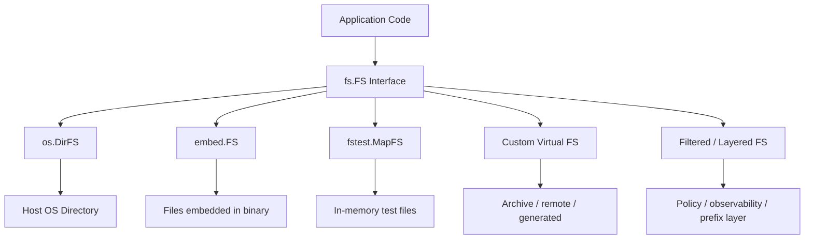
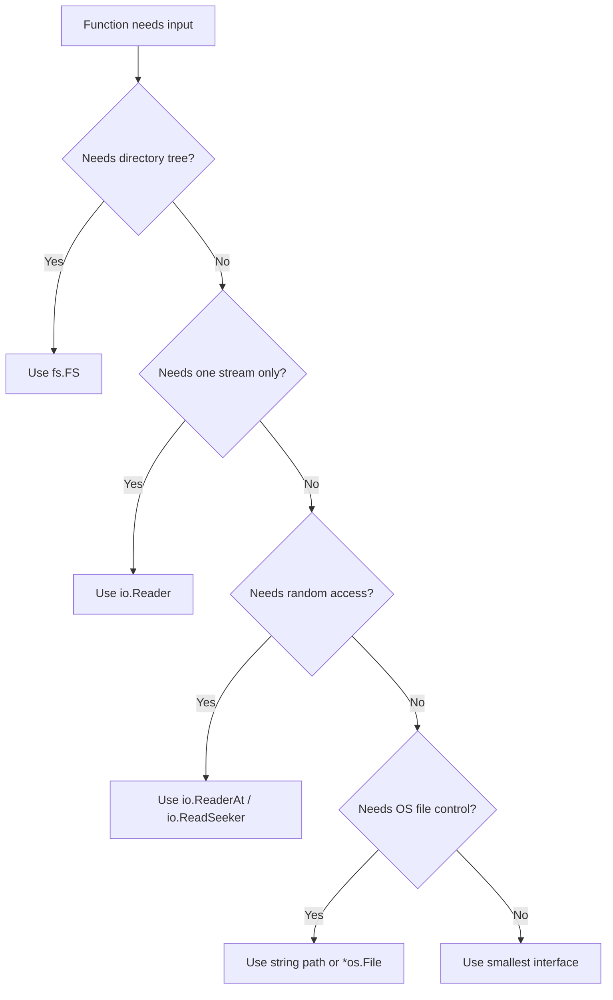

# learn-go-io-buffer-byte-stream-file-network-data-transfer-part-012

# Part 012 — Filesystem Abstraction: `io/fs`, `embed.FS`, Test FS, Virtual FS, dan Layered FS

> Series: **learn-go-io-buffer-byte-stream-file-network-data-transfer**  
> Target: Go **1.26.x**  
> Context pembaca: Java software engineer yang ingin memahami Go IO pada level internal engineering handbook.

---

## 0. Posisi Part Ini dalam Series

Pada part sebelumnya kita sudah membahas:

- file sebagai handle OS (`os.File`),
- operasi filesystem (`Stat`, `ReadDir`, `WalkDir`, `Rename`, `Remove`, temp file),
- path handling (`path`, `filepath`, canonicalization, traversal safety).

Part ini sengaja mengangkat level abstraksi:

> Bagaimana membuat kode yang bekerja terhadap “filesystem” tanpa selalu bergantung pada filesystem OS?

Di Go, jawabannya sebagian besar adalah package **`io/fs`**.

Package `io/fs` mendefinisikan interface dasar untuk filesystem. Filesystem bisa berasal dari OS, tetapi juga bisa berasal dari package lain, seperti embedded assets, test memory filesystem, archive-backed filesystem, remote-backed filesystem, atau virtual filesystem buatan sendiri.

Mental shift-nya besar:

```text
Sebelum:
    fungsi menerima string path lalu langsung os.Open(path)

Sesudah:
    fungsi menerima fs.FS + nama file relatif
    lalu membaca lewat fs.Open / fs.ReadFile / fs.WalkDir
```

Efeknya:

- kode lebih testable,
- kode lebih reusable,
- dependency ke OS filesystem berkurang,
- embedded assets bisa diperlakukan seperti file biasa,
- policy akses bisa dibungkus sebagai layer,
- traversal dan path handling bisa dibuat lebih eksplisit,
- library tidak memaksakan cara storage kepada caller.

---

## 1. Kenapa Filesystem Abstraction Penting?

Banyak engineer awalnya menganggap filesystem abstraction hanya berguna untuk testing. Itu benar, tetapi terlalu kecil.

Di production, abstraction ini berguna untuk:

1. **Configuration loading**  
   Sama API untuk membaca config dari disk, embedded default config, atau test fixture.

2. **Static asset serving**  
   Bisa serve dari `embed.FS`, OS directory, atau filtered filesystem.

3. **Template loading**  
   Template dapat dibaca dari embedded binary saat production dan dari disk saat development.

4. **Migration file loading**  
   SQL migration bisa berasal dari embedded FS, folder lokal, atau generated artifact.

5. **Plugin/resource loading**  
   Library dapat menerima resource tree tanpa tahu storage aktual.

6. **Testing tanpa disk**  
   Unit test bisa menggunakan `testing/fstest.MapFS` tanpa membuat file fisik.

7. **Policy enforcement**  
   Layer FS bisa melarang path tertentu, menyembunyikan file, enforce extension, enforce tenant prefix, atau instrument akses.

8. **Packaging single binary**  
   Dengan `embed.FS`, asset dapat ikut masuk ke binary.

9. **Portability**  
   Library tidak harus mengerti detail path Windows vs Unix sejauh ia bekerja pada `fs.FS` path.

10. **Security boundary**  
   Caller bisa memberi view terbatas terhadap resource, bukan seluruh filesystem host.

---

## 2. Dari Java ke Go: Perbandingan Mental Model

Sebagai Java engineer, mungkin familiar dengan:

- `java.io.File`,
- `java.nio.file.Path`,
- `java.nio.file.Files`,
- `FileSystem`,
- `FileSystemProvider`,
- classpath resources,
- `InputStream`,
- resource loading via `ClassLoader.getResourceAsStream`,
- Jimfs atau in-memory FS untuk testing.

Go mengambil pendekatan yang lebih kecil dan komposisional.

| Concern | Java | Go |
|---|---|---|
| File object | `File`, `Path` | `os.File`, path string |
| Filesystem provider | `FileSystemProvider` | `fs.FS` interface kecil |
| Read file helper | `Files.readAllBytes` | `fs.ReadFile`, `os.ReadFile` |
| Directory traversal | `Files.walk` | `fs.WalkDir`, `filepath.WalkDir` |
| Classpath resource | `ClassLoader` resource | `embed.FS` |
| In-memory test FS | Jimfs/custom | `testing/fstest.MapFS` |
| Abstraction style | richer object model | small interfaces |
| Path model | `Path` object | slash-separated `fs.ValidPath` names |

Go tidak mencoba membuat satu object model filesystem yang sangat kaya. Go menyediakan interface kecil yang cukup untuk banyak skenario.

Prinsip Go:

```text
Prefer small contracts.
Let implementation decide storage.
Let caller decide policy.
```

---

## 3. Konsep Dasar `fs.FS`

Interface inti:

```go
package fs

type FS interface {
    Open(name string) (File, error)
}
```

Sekilas terlalu sederhana. Tetapi justru itu kekuatannya.

Sebuah `fs.FS` hanya harus bisa membuka file berdasarkan nama.

Nama yang digunakan di `io/fs` bukan path OS mentah. Ia menggunakan format path dengan slash `/`, tidak diawali slash, dan mengikuti constraint `fs.ValidPath` untuk banyak API.

Contoh nama valid:

```text
.
config/app.yaml
templates/index.html
static/css/main.css
```

Contoh yang bermasalah untuk banyak API `io/fs`:

```text
/config/app.yaml
../secret.txt
config\app.yaml
config//app.yaml
```

Poin penting:

> `fs.FS` path adalah path logis di dalam filesystem abstraction, bukan selalu path OS.

---

## 4. Mermaid: Model `fs.FS`



Abstraksi ini memisahkan **consumer** dari **storage provider**.

---

## 5. `fs.File`: File dalam Abstraksi FS

Interface dasar:

```go
type File interface {
    Stat() (FileInfo, error)
    Read([]byte) (int, error)
    Close() error
}
```

Ini mirip subset dari `os.File`, tetapi tidak sama dengan `os.File`.

`fs.File` adalah file yang bisa:

- dibaca,
- ditutup,
- diambil metadata-nya.

Tidak ada `Write` di interface dasar.

Artinya:

> `io/fs` pada dasarnya berorientasi pada read-only filesystem abstraction.

Ini disengaja. Banyak use case abstraction FS adalah resource loading, embedded assets, template, config, static files, dan test fixture. Write semantics jauh lebih sulit karena perlu permission, durability, atomicity, locking, OS-specific behavior, dan transactional consistency.

Kalau butuh write, biasanya jangan dipaksakan ke `fs.FS`. Buat abstraction domain sendiri.

Contoh:

```go
type ObjectStore interface {
    Get(ctx context.Context, name string) (io.ReadCloser, error)
    Put(ctx context.Context, name string, r io.Reader) error
    Delete(ctx context.Context, name string) error
}
```

Atau untuk file repository:

```go
type BlobRepository interface {
    Open(ctx context.Context, key string) (io.ReadCloser, error)
    Store(ctx context.Context, key string, r io.Reader) error
    Exists(ctx context.Context, key string) (bool, error)
}
```

Jangan mengubah `fs.FS` menjadi semua hal.

---

## 6. Interface Tambahan dalam `io/fs`

Selain `FS` dan `File`, ada interface opsional.

### 6.1 `fs.ReadFileFS`

```go
type ReadFileFS interface {
    FS
    ReadFile(name string) ([]byte, error)
}
```

Jika filesystem bisa membaca file lebih efisien langsung sebagai `[]byte`, ia dapat implement interface ini.

Helper `fs.ReadFile(fsys, name)` akan memakai optimasi jika tersedia, kalau tidak akan fallback ke `Open` + read.

### 6.2 `fs.ReadDirFS`

```go
type ReadDirFS interface {
    FS
    ReadDir(name string) ([]DirEntry, error)
}
```

Untuk membaca isi directory.

### 6.3 `fs.StatFS`

```go
type StatFS interface {
    FS
    Stat(name string) (FileInfo, error)
}
```

Untuk metadata tanpa harus manual `Open` lalu `Stat`.

### 6.4 `fs.SubFS`

```go
type SubFS interface {
    FS
    Sub(dir string) (FS, error)
}
```

Untuk mendapatkan view subdirectory sebagai filesystem baru.

### 6.5 `fs.GlobFS`

```go
type GlobFS interface {
    FS
    Glob(pattern string) ([]string, error)
}
```

Untuk matching pattern.

---

## 7. Helper Function: API Ergonomics

Package `io/fs` menyediakan helper:

- `fs.ReadFile(fsys, name)`
- `fs.ReadDir(fsys, name)`
- `fs.Stat(fsys, name)`
- `fs.Sub(fsys, dir)`
- `fs.Glob(fsys, pattern)`
- `fs.WalkDir(fsys, root, fn)`
- `fs.ValidPath(name)`

Pattern umumnya:

```go
content, err := fs.ReadFile(fsys, "config/app.yaml")
if err != nil {
    return err
}
```

Bandingkan dengan:

```go
content, err := os.ReadFile("config/app.yaml")
if err != nil {
    return err
}
```

Perbedaannya besar:

- `os.ReadFile` selalu filesystem OS.
- `fs.ReadFile` bisa OS directory, embedded FS, test FS, custom FS.

---

## 8. `os.DirFS`: Bridge dari OS Directory ke `fs.FS`

`os.DirFS(dir)` mengembalikan `fs.FS` yang rooted pada directory tertentu.

Contoh:

```go
func LoadConfig(fsys fs.FS) ([]byte, error) {
    return fs.ReadFile(fsys, "app.yaml")
}

func main() {
    data, err := LoadConfig(os.DirFS("./config"))
    if err != nil {
        log.Fatal(err)
    }
    fmt.Println(string(data))
}
```

Kalau file aktualnya:

```text
./config/app.yaml
```

Maka nama di dalam `fs.FS` adalah:

```text
app.yaml
```

Bukan:

```text
./config/app.yaml
```

### 8.1 Peringatan Security `os.DirFS`

`os.DirFS("/safe/root")` bukan sandbox absolut terhadap semua serangan.

Kenapa?

- Symlink di dalam root bisa menunjuk keluar root.
- Race condition bisa terjadi jika struktur filesystem berubah saat operasi berjalan.
- `DirFS` tidak otomatis melakukan chroot OS-level.
- Path yang diberikan masih harus dianggap input yang perlu divalidasi.

Jadi jangan berpikir:

```text
os.DirFS(root) == secure sandbox
```

Lebih tepat:

```text
os.DirFS(root) == convenient filesystem view over root directory
```

Untuk security boundary kuat, perlu policy tambahan, validasi path, symlink policy, permission OS, container isolation, atau mekanisme openat/no-follow yang lebih spesifik pada level OS.

---

## 9. `embed.FS`: Filesystem yang Masuk ke Binary

Package `embed` memungkinkan file dimasukkan ke binary saat compile dengan directive `//go:embed`.

Contoh:

```go
package main

import (
    "embed"
    "fmt"
    "io/fs"
    "log"
)

//go:embed templates/*.html static/*
var assets embed.FS

func main() {
    data, err := fs.ReadFile(assets, "templates/index.html")
    if err != nil {
        log.Fatal(err)
    }
    fmt.Println(string(data))
}
```

`embed.FS` adalah read-only filesystem.

Use case:

- static web assets,
- default config,
- SQL migrations,
- email templates,
- HTML templates,
- CLI help docs,
- schema files,
- policy files,
- test fixtures.

### 9.1 Embed Single File sebagai `string` atau `[]byte`

Go juga mendukung embedding langsung ke `string` atau `[]byte`.

```go
//go:embed version.txt
var versionText string

//go:embed schema.json
var schemaBytes []byte
```

Kapan pakai `embed.FS`?

- Banyak file.
- Butuh directory tree.
- Butuh dipass ke API yang menerima `fs.FS`.
- Butuh `fs.WalkDir`, `fs.ReadDir`, atau `template.ParseFS`.

Kapan pakai `string`/`[]byte`?

- Satu file kecil.
- Akses langsung sederhana.
- Tidak perlu filesystem abstraction.

### 9.2 Embed dan Deployment

Keuntungan:

- single binary,
- tidak perlu copy asset terpisah,
- mengurangi runtime missing file,
- deployment lebih sederhana,
- reproducibility lebih tinggi.

Trade-off:

- binary lebih besar,
- asset berubah berarti perlu rebuild,
- tidak cocok untuk asset yang harus diedit runtime,
- secret tidak boleh diembed,
- hot reload development perlu strategi lain.

Rule:

> Embed untuk resource statis, bukan mutable state dan bukan secret.

---

## 10. `testing/fstest.MapFS`: Filesystem untuk Test

`testing/fstest` menyediakan `MapFS`, sebuah filesystem in-memory untuk testing.

Contoh:

```go
func LoadTemplateNames(fsys fs.FS) ([]string, error) {
    entries, err := fs.ReadDir(fsys, "templates")
    if err != nil {
        return nil, err
    }

    names := make([]string, 0, len(entries))
    for _, e := range entries {
        if e.IsDir() {
            continue
        }
        names = append(names, e.Name())
    }
    return names, nil
}
```

Test:

```go
func TestLoadTemplateNames(t *testing.T) {
    fsys := fstest.MapFS{
        "templates/index.html": {Data: []byte("index")},
        "templates/user.html":  {Data: []byte("user")},
        "README.md":            {Data: []byte("ignored")},
    }

    got, err := LoadTemplateNames(fsys)
    if err != nil {
        t.Fatal(err)
    }

    want := []string{"index.html", "user.html"}
    if !reflect.DeepEqual(got, want) {
        t.Fatalf("got %v, want %v", got, want)
    }
}
```

Keuntungan:

- test cepat,
- tidak perlu temp directory,
- tidak tergantung permission OS,
- tidak perlu cleanup,
- mudah membuat edge case,
- cocok untuk logic yang hanya membaca resource.

### 10.1 Kapan Jangan Pakai `MapFS`?

Jangan pakai `MapFS` kalau yang ingin diuji adalah:

- permission OS,
- symlink behavior,
- rename atomicity,
- filesystem case sensitivity,
- file lock,
- hard link,
- disk full,
- fsync behavior,
- platform-specific path behavior,
- real directory traversal dengan metadata OS.

Untuk itu pakai `t.TempDir()` dan filesystem nyata.

Rule:

```text
MapFS tests logic.
TempDir tests OS interaction.
```

---

## 11. `fstest.TestFS`: Menguji Implementasi FS

Jika membuat custom `fs.FS`, gunakan `fstest.TestFS` untuk memvalidasi perilaku dasar.

Contoh:

```go
func TestMyFS(t *testing.T) {
    fsys := NewMyFS(...)

    if err := fstest.TestFS(fsys, "a.txt", "dir/b.txt"); err != nil {
        t.Fatal(err)
    }
}
```

`TestFS` berjalan di tree filesystem dan memeriksa file dapat dibuka serta berperilaku sesuai contract dasar.

Ini bukan formal proof, tapi berguna untuk menangkap implementasi FS yang melanggar ekspektasi umum.

---

## 12. API Design: Terima `fs.FS`, Bukan Path Mentah

Bad library API:

```go
func LoadRulesFromDir(dir string) ([]Rule, error) {
    files, err := os.ReadDir(dir)
    // ...
}
```

Masalah:

- hanya bisa OS filesystem,
- sulit dites tanpa temp dir,
- tidak bisa pakai embed.FS,
- caller tidak bisa memberi filtered view,
- path policy bercampur dengan loading logic.

Better:

```go
func LoadRules(fsys fs.FS, dir string) ([]Rule, error) {
    entries, err := fs.ReadDir(fsys, dir)
    if err != nil {
        return nil, fmt.Errorf("read rules dir %q: %w", dir, err)
    }

    var rules []Rule
    for _, e := range entries {
        if e.IsDir() || filepath.Ext(e.Name()) != ".json" {
            continue
        }

        name := path.Join(dir, e.Name())
        data, err := fs.ReadFile(fsys, name)
        if err != nil {
            return nil, fmt.Errorf("read rule %q: %w", name, err)
        }

        rule, err := parseRule(data)
        if err != nil {
            return nil, fmt.Errorf("parse rule %q: %w", name, err)
        }
        rules = append(rules, rule)
    }

    return rules, nil
}
```

Catatan penting: untuk path di dalam `fs.FS`, gunakan package `path`, bukan `filepath`.

Kenapa?

- `fs.FS` path menggunakan slash `/`.
- `filepath` mengikuti OS separator.
- Pada Windows, `filepath.Join` dapat menghasilkan backslash, yang bukan format ideal untuk `io/fs` names.

Jadi:

```go
name := path.Join(dir, e.Name())       // benar untuk fs.FS
name := filepath.Join(dir, e.Name())   // benar untuk OS path
```

---

## 13. Function Boundary: Kapan Pakai `fs.FS`, Kapan Pakai `string`?

Gunakan `fs.FS` jika fungsi:

- membaca resource tree,
- membaca template,
- membaca config fixture,
- membaca static files,
- membaca migration files,
- ingin testable tanpa disk,
- tidak perlu write,
- tidak perlu OS-specific metadata mendalam,
- tidak perlu path absolut host.

Gunakan `string path` atau `*os.File` jika fungsi:

- memang mengelola file OS,
- butuh write,
- butuh `fsync`,
- butuh lock,
- butuh permission detail,
- butuh symlink/lstat semantics,
- butuh atomic rename,
- butuh file descriptor control,
- butuh mmap atau syscall-specific behavior.

Gunakan `io.Reader` jika fungsi:

- hanya butuh membaca isi satu stream,
- tidak peduli nama file,
- tidak butuh directory traversal,
- tidak butuh metadata.

Gunakan `io.ReadSeeker` atau `io.ReaderAt` jika fungsi:

- butuh random access,
- butuh retry parse dari offset,
- butuh inspect header lalu kembali,
- butuh archive parser tertentu.

---

## 14. Mermaid: Memilih Abstraksi Input



Rule praktis:

> Terima abstraction yang paling kecil yang masih cukup untuk kebutuhan semantic.

---

## 15. `fs.Sub`: Membuat Root Baru

`fs.Sub(fsys, dir)` membuat filesystem baru yang root-nya berada pada subdirectory.

Contoh:

```go
sub, err := fs.Sub(assets, "templates")
if err != nil {
    return err
}

content, err := fs.ReadFile(sub, "index.html")
```

Tanpa `Sub`:

```go
content, err := fs.ReadFile(assets, "templates/index.html")
```

Dengan `Sub`, consumer tidak perlu tahu prefix fisik/logis.

Use case:

- expose hanya `static/` ke HTTP file server,
- expose hanya `migrations/` ke migration loader,
- expose hanya tenant-specific directory,
- membuat library menerima root view yang bersih.

### 15.1 Sub sebagai Capability Boundary

Misalnya binary punya embedded assets:

```text
assets/
  static/
  templates/
  internal/
```

Jika HTTP static server diberi seluruh `assets`, bug route mungkin bisa mengekspos file yang tidak seharusnya.

Lebih aman:

```go
staticFS, err := fs.Sub(assets, "assets/static")
```

Lalu hanya pass `staticFS` ke static server.

Ini bukan security boundary absolut terhadap semua bug, tapi memperkecil capability.

---

## 16. `http.FS`: Bridge ke HTTP File Server

Package `net/http` menyediakan `http.FS` untuk mengadaptasi `fs.FS` menjadi `http.FileSystem`.

Contoh:

```go
//go:embed static/*
var assets embed.FS

func main() {
    static, err := fs.Sub(assets, "static")
    if err != nil {
        log.Fatal(err)
    }

    handler := http.FileServer(http.FS(static))
    log.Fatal(http.ListenAndServe(":8080", handler))
}
```

Important:

- `http.FileServer` punya behavior sendiri terkait directory listing, index files, path cleaning, dan error response.
- Jangan expose FS lebih luas dari kebutuhan.
- Untuk production, pertimbangkan cache headers, ETag, compression, immutable assets, dan route prefix.

Route prefix example:

```go
mux := http.NewServeMux()
mux.Handle("/static/", http.StripPrefix("/static/", http.FileServer(http.FS(static))))
```

---

## 17. Template Loading dengan `fs.FS`

Standard library template mendukung parsing dari FS.

Contoh HTML template:

```go
//go:embed templates/*.html
var templateFS embed.FS

func LoadTemplates() (*template.Template, error) {
    return template.ParseFS(templateFS, "templates/*.html")
}
```

Untuk test:

```go
func TestLoadTemplates(t *testing.T) {
    fsys := fstest.MapFS{
        "templates/base.html": {
            Data: []byte(`{{define "base"}}hello {{.Name}}{{end}}`),
        },
    }

    tmpl, err := template.ParseFS(fsys, "templates/*.html")
    if err != nil {
        t.Fatal(err)
    }

    var out bytes.Buffer
    if err := tmpl.ExecuteTemplate(&out, "base", map[string]string{"Name": "Go"}); err != nil {
        t.Fatal(err)
    }
}
```

Ini adalah pattern kuat:

```text
production: embed.FS
unit test: fstest.MapFS
development: os.DirFS
same loader code
```

---

## 18. Layered FS: Menambahkan Policy di Atas FS

Karena `fs.FS` kecil, kita bisa membungkusnya.

Misalnya logging layer:

```go
type LoggingFS struct {
    Base fs.FS
    Log  *log.Logger
}

func (l LoggingFS) Open(name string) (fs.File, error) {
    start := time.Now()
    f, err := l.Base.Open(name)
    l.Log.Printf("fs.open name=%q duration=%s err=%v", name, time.Since(start), err)
    return f, err
}
```

Policy layer untuk extension:

```go
type ExtensionAllowFS struct {
    Base       fs.FS
    Extensions map[string]bool
}

func (e ExtensionAllowFS) Open(name string) (fs.File, error) {
    if name != "." && !e.Extensions[path.Ext(name)] {
        return nil, &fs.PathError{Op: "open", Path: name, Err: fs.ErrPermission}
    }
    return e.Base.Open(name)
}
```

### 18.1 Caveat Layering

Kalau wrapper hanya implement `Open`, helper seperti `fs.ReadDir` masih bisa bekerja lewat fallback jika file yang dibuka adalah directory yang mendukung `ReadDirFile`. Tetapi wrapper bisa kehilangan optimasi opsional seperti `ReadFileFS`, `ReadDirFS`, `StatFS`, atau `SubFS` jika tidak di-forward.

Contoh masalah:

```go
type MyFS struct {
    Base fs.FS
}

func (m MyFS) Open(name string) (fs.File, error) {
    return m.Base.Open(name)
}
```

Jika `Base` punya implementasi efisien `ReadFile`, wrapper ini tidak otomatis punya `ReadFile`.

Untuk library serius, pertimbangkan forwarding optional interfaces.

---

## 19. Forwarding Optional Interfaces

Contoh wrapper yang juga implement `ReadFile` bila base mendukung.

```go
type InstrumentedFS struct {
    Base fs.FS
    Observe func(op, name string, d time.Duration, err error)
}

func (i InstrumentedFS) Open(name string) (fs.File, error) {
    start := time.Now()
    f, err := i.Base.Open(name)
    i.observe("open", name, start, err)
    return f, err
}

func (i InstrumentedFS) ReadFile(name string) ([]byte, error) {
    start := time.Now()

    if rffs, ok := i.Base.(fs.ReadFileFS); ok {
        b, err := rffs.ReadFile(name)
        i.observe("read_file", name, start, err)
        return b, err
    }

    b, err := fs.ReadFile(i.Base, name)
    i.observe("read_file", name, start, err)
    return b, err
}

func (i InstrumentedFS) observe(op, name string, start time.Time, err error) {
    if i.Observe != nil {
        i.Observe(op, name, time.Since(start), err)
    }
}
```

Catatan: hati-hati menghindari recursion. Di `ReadFile`, jangan panggil `fs.ReadFile(i, name)` karena akan memanggil `i.ReadFile` lagi.

---

## 20. Membuat Read-Only Virtual FS Sederhana

Contoh virtual FS dari map.

Untuk production, lebih baik gunakan `fstest.MapFS` untuk testing saja. Tetapi membuat custom FS membantu memahami contract.

```go
type MemoryFS struct {
    files map[string][]byte
}

func NewMemoryFS(files map[string][]byte) MemoryFS {
    copied := make(map[string][]byte, len(files))
    for k, v := range files {
        vv := append([]byte(nil), v...)
        copied[k] = vv
    }
    return MemoryFS{files: copied}
}

func (m MemoryFS) Open(name string) (fs.File, error) {
    if !fs.ValidPath(name) {
        return nil, &fs.PathError{Op: "open", Path: name, Err: fs.ErrInvalid}
    }

    data, ok := m.files[name]
    if !ok {
        return nil, &fs.PathError{Op: "open", Path: name, Err: fs.ErrNotExist}
    }

    return &memoryFile{
        name: name,
        r:    bytes.NewReader(data),
        size: int64(len(data)),
    }, nil
}

type memoryFile struct {
    name string
    r    *bytes.Reader
    size int64
}

func (f *memoryFile) Stat() (fs.FileInfo, error) {
    return fileInfo{name: path.Base(f.name), size: f.size}, nil
}

func (f *memoryFile) Read(p []byte) (int, error) {
    return f.r.Read(p)
}

func (f *memoryFile) Close() error {
    return nil
}

type fileInfo struct {
    name string
    size int64
}

func (fi fileInfo) Name() string       { return fi.name }
func (fi fileInfo) Size() int64        { return fi.size }
func (fi fileInfo) Mode() fs.FileMode  { return 0444 }
func (fi fileInfo) ModTime() time.Time { return time.Time{} }
func (fi fileInfo) IsDir() bool        { return false }
func (fi fileInfo) Sys() any           { return nil }
```

Implementasi ini belum mendukung directory. Untuk FS serius, directory semantics harus diperhatikan.

---

## 21. Directory Semantics dalam Custom FS

Agar `fs.ReadDir` dan `fs.WalkDir` bekerja baik, FS perlu bisa membuka directory dan file directory tersebut harus mendukung `fs.ReadDirFile`.

Interface:

```go
type ReadDirFile interface {
    File
    ReadDir(n int) ([]DirEntry, error)
}
```

Ini mulai lebih kompleks:

- directory entry harus stabil,
- sorting behavior harus jelas,
- `ReadDir(n)` harus memperhatikan incremental read,
- error handling harus sesuai contract,
- `.` root perlu dipikirkan,
- directory vs file conflict perlu diputuskan.

Karena itu, untuk test sering lebih aman memakai `fstest.MapFS`, bukan membuat sendiri.

Untuk custom production FS, pakai `fstest.TestFS` dan banyak test tambahan.

---

## 22. `fs.ValidPath`: Validasi Nama FS

`fs.ValidPath(name)` mengecek apakah nama path valid untuk digunakan oleh `fs.FS` convention.

Valid:

```text
.
a
a/b
a/b/c.txt
```

Tidak valid:

```text

/a
a//b
a/./b
a/../b
../x
a/b/
a\b
```

Namun, jangan salah paham:

```text
fs.ValidPath is not full security validation.
```

Ia membantu menjaga format path logis. Ia tidak:

- resolve symlink,
- mengecek permission OS,
- memastikan file tidak berubah,
- mencegah semua race condition,
- membuktikan tenant authorization,
- menggantikan business policy.

Pattern:

```go
func safeOpen(fsys fs.FS, name string) (fs.File, error) {
    if !fs.ValidPath(name) {
        return nil, &fs.PathError{Op: "open", Path: name, Err: fs.ErrInvalid}
    }
    return fsys.Open(name)
}
```

---

## 23. `fs.FileInfo` vs `fs.DirEntry`

`fs.FileInfo` adalah metadata file:

- name,
- size,
- mode,
- mod time,
- is dir,
- sys.

`fs.DirEntry` adalah entry directory yang lebih ringan:

- name,
- is dir,
- type,
- info.

Kenapa ada dua?

Karena membaca directory tidak selalu perlu seluruh metadata. Pada beberapa filesystem, memanggil `Info()` mungkin lebih mahal karena perlu stat tambahan.

Pattern efficient:

```go
entries, err := fs.ReadDir(fsys, dir)
if err != nil {
    return err
}

for _, e := range entries {
    if e.IsDir() {
        continue
    }

    if path.Ext(e.Name()) != ".json" {
        continue
    }

    // Only call Info if size/modtime/mode is needed.
    info, err := e.Info()
    if err != nil {
        return err
    }
    _ = info.Size()
}
```

Rule:

> Jangan call metadata mahal kalau tidak perlu.

---

## 24. `fs.WalkDir`: Traversal dengan FS Abstraction

`fs.WalkDir` berjalan di filesystem abstraction.

Contoh:

```go
func CollectJSONFiles(fsys fs.FS, root string) ([]string, error) {
    var out []string

    err := fs.WalkDir(fsys, root, func(name string, d fs.DirEntry, err error) error {
        if err != nil {
            return fmt.Errorf("visit %q: %w", name, err)
        }

        if d.IsDir() {
            if d.Name() == ".git" || d.Name() == "node_modules" {
                return fs.SkipDir
            }
            return nil
        }

        if path.Ext(name) == ".json" {
            out = append(out, name)
        }
        return nil
    })
    if err != nil {
        return nil, err
    }

    return out, nil
}
```

Important:

- path menggunakan slash,
- callback mendapat error traversal,
- caller menentukan apakah lanjut atau berhenti,
- `fs.SkipDir` bisa skip directory,
- `fs.SkipAll` bisa stop seluruh traversal.

### 24.1 Failure Model Traversal

Saat traversal, error bisa muncul dari:

- root tidak ada,
- directory tidak bisa dibaca,
- file hilang saat traversal,
- permission denied,
- custom FS backend gagal,
- path invalid,
- symlink policy tergantung FS,
- directory entry metadata gagal.

Jangan abaikan parameter `err` di callback.

Bad:

```go
fs.WalkDir(fsys, root, func(name string, d fs.DirEntry, err error) error {
    if d.IsDir() { // panic if d nil when err != nil
        return nil
    }
    return nil
})
```

Good:

```go
fs.WalkDir(fsys, root, func(name string, d fs.DirEntry, err error) error {
    if err != nil {
        return err
    }
    if d.IsDir() {
        return nil
    }
    return nil
})
```

---

## 25. Layered FS Pattern: Prefix FS

Kadang ingin menambahkan prefix otomatis.

```go
type PrefixFS struct {
    Base   fs.FS
    Prefix string
}

func (p PrefixFS) Open(name string) (fs.File, error) {
    if !fs.ValidPath(name) {
        return nil, &fs.PathError{Op: "open", Path: name, Err: fs.ErrInvalid}
    }

    full := path.Join(p.Prefix, name)
    return p.Base.Open(full)
}
```

Tetapi hati-hati:

- `path.Join("prefix", ".")` menghasilkan `prefix`.
- Jika name `.` harus mewakili root view, behavior harus dipikirkan.
- Optional interfaces belum otomatis forward.
- Directory traversal harus tetap benar.

Lebih sering, `fs.Sub` lebih baik daripada custom PrefixFS.

---

## 26. Layered FS Pattern: Overlay FS

Overlay FS mencoba membaca dari satu FS, lalu fallback ke FS lain.

Use case:

- development override assets dari disk,
- fallback ke embedded defaults,
- tenant-specific template override,
- theme override.

Contoh sederhana:

```go
type OverlayFS struct {
    Upper fs.FS
    Lower fs.FS
}

func (o OverlayFS) Open(name string) (fs.File, error) {
    f, err := o.Upper.Open(name)
    if err == nil {
        return f, nil
    }
    if errors.Is(err, fs.ErrNotExist) {
        return o.Lower.Open(name)
    }
    return nil, err
}
```

Caveat besar:

- directory merge sulit,
- `ReadDir` harus menggabungkan entries,
- konflik file/directory perlu policy,
- ordering harus stabil,
- metadata berasal dari layer mana,
- deletion tombstone tidak tersedia kecuali didesain,
- security policy harus konsisten.

Jadi OverlayFS mudah untuk `Open`, tetapi sulit untuk filesystem lengkap.

---

## 27. Layered FS Pattern: Tenant FS

Misalnya ada embedded templates:

```text
templates/
  default/
    invoice.html
  tenant-a/
    invoice.html
  tenant-b/
    invoice.html
```

Kita ingin tenant hanya bisa membaca subtree-nya.

```go
func TenantTemplateFS(all fs.FS, tenantID string) (fs.FS, error) {
    if !isSafeTenantID(tenantID) {
        return nil, fmt.Errorf("invalid tenant id")
    }
    return fs.Sub(all, path.Join("templates", tenantID))
}
```

Validation tenant ID sebaiknya tidak hanya `fs.ValidPath`, tapi whitelist karakter domain:

```go
func isSafeTenantID(s string) bool {
    if s == "" || len(s) > 64 {
        return false
    }
    for _, r := range s {
        switch {
        case r >= 'a' && r <= 'z':
        case r >= '0' && r <= '9':
        case r == '-':
        default:
            return false
        }
    }
    return true
}
```

Kenapa stricter?

Karena tenant ID adalah identity/input security boundary, bukan sekadar path segment.

---

## 28. Runtime Config: `fs.FS` sebagai Dependency Injection

Daripada global variable:

```go
var configDir = "./config"

func Load() error {
    data, err := os.ReadFile(filepath.Join(configDir, "app.yaml"))
    // ...
}
```

Gunakan dependency injection:

```go
type ConfigLoader struct {
    FS fs.FS
}

func (l ConfigLoader) Load(name string) (*Config, error) {
    if l.FS == nil {
        return nil, errors.New("nil config filesystem")
    }

    data, err := fs.ReadFile(l.FS, name)
    if err != nil {
        return nil, fmt.Errorf("read config %q: %w", name, err)
    }
    return parseConfig(data)
}
```

Production:

```go
loader := ConfigLoader{FS: os.DirFS("/etc/myapp")}
```

Test:

```go
loader := ConfigLoader{FS: fstest.MapFS{
    "app.yaml": {Data: []byte("port: 8080")},
}}
```

Embed default:

```go
//go:embed defaults/*.yaml
var defaultFS embed.FS
```

---

## 29. Avoiding Hidden Global Filesystem Dependencies

Hidden dependency:

```go
func RenderEmail(templateName string, data any) (string, error) {
    content, err := os.ReadFile("templates/" + templateName)
    // ...
}
```

Masalah:

- working directory sensitif,
- production path dan test path beda,
- sulit embed,
- sulit inject tenant templates,
- sulit observability,
- sulit security review.

Better:

```go
type EmailRenderer struct {
    Templates fs.FS
}

func (r EmailRenderer) Render(templateName string, data any) (string, error) {
    if !isSafeTemplateName(templateName) {
        return "", fmt.Errorf("invalid template name")
    }

    content, err := fs.ReadFile(r.Templates, templateName)
    if err != nil {
        return "", fmt.Errorf("read template %q: %w", templateName, err)
    }

    return renderTemplate(content, data)
}
```

---

## 30. Security: Path Traversal dalam `fs.FS`

Meskipun `fs.FS` memakai path logis, input user tetap harus diperlakukan berbahaya.

Bad:

```go
func Download(fsys fs.FS, userPath string) ([]byte, error) {
    return fs.ReadFile(fsys, userPath)
}
```

Better:

```go
func Download(fsys fs.FS, userPath string) ([]byte, error) {
    name, err := safePublicPath(userPath)
    if err != nil {
        return nil, err
    }
    return fs.ReadFile(fsys, name)
}

func safePublicPath(input string) (string, error) {
    input = strings.TrimPrefix(input, "/")
    clean := path.Clean(input)

    if clean == "." || !fs.ValidPath(clean) {
        return "", fmt.Errorf("invalid path")
    }

    if strings.HasPrefix(clean, "private/") {
        return "", fmt.Errorf("forbidden path")
    }

    return clean, nil
}
```

Catatan:

- `path.Clean` lexical.
- `fs.ValidPath` format validation.
- Business policy tetap perlu.
- Symlink tetap perlu dipikirkan jika backend OS.
- Jangan expose raw error terlalu detail ke user.

---

## 31. Security: Embedded Secrets Anti-Pattern

Jangan lakukan ini:

```go
//go:embed secrets/prod-private-key.pem
var privateKey []byte
```

Kenapa berbahaya?

- secret masuk binary,
- binary mudah tersebar,
- rotation sulit,
- scanning artifact bisa menemukan secret,
- semua environment bisa membawa secret yang sama,
- incident response menjadi berat.

Embed cocok untuk:

- schema,
- templates,
- static assets,
- public certificates jika memang public,
- default config non-secret,
- migration files.

Secret gunakan secret manager, environment injection, mounted secret, KMS, SSM, Vault, atau mekanisme runtime yang sesuai.

---

## 32. Error Model `io/fs`

Package `io/fs` mendefinisikan error sentinel:

- `fs.ErrInvalid`
- `fs.ErrPermission`
- `fs.ErrExist`
- `fs.ErrNotExist`
- `fs.ErrClosed`

Biasanya error dibungkus dalam `*fs.PathError`:

```go
return nil, &fs.PathError{
    Op:   "open",
    Path: name,
    Err:  fs.ErrNotExist,
}
```

Caller sebaiknya pakai `errors.Is`:

```go
_, err := fs.ReadFile(fsys, name)
if errors.Is(err, fs.ErrNotExist) {
    // handle missing
}
```

Jangan terlalu bergantung pada string error.

Bad:

```go
if strings.Contains(err.Error(), "not found") {
    // fragile
}
```

Good:

```go
if errors.Is(err, fs.ErrNotExist) {
    // stable semantic
}
```

---

## 33. Designing Domain-Specific Errors di Atas FS

Jangan bocorkan detail filesystem ke domain secara mentah.

Misalnya config loader:

```go
var ErrConfigNotFound = errors.New("config not found")

func LoadRequiredConfig(fsys fs.FS, name string) (*Config, error) {
    data, err := fs.ReadFile(fsys, name)
    if err != nil {
        if errors.Is(err, fs.ErrNotExist) {
            return nil, fmt.Errorf("%w: %s", ErrConfigNotFound, name)
        }
        return nil, fmt.Errorf("read config %q: %w", name, err)
    }

    cfg, err := parseConfig(data)
    if err != nil {
        return nil, fmt.Errorf("parse config %q: %w", name, err)
    }
    return cfg, nil
}
```

Layering:

```text
OS/custom FS error -> fs semantic error -> domain error -> API/user response
```

---

## 34. Boundedness: `fs.ReadFile` Masih Membaca Semua ke Memory

`fs.ReadFile` convenient, tapi membaca seluruh file ke memory.

Jangan pakai untuk untrusted atau besar tanpa limit.

Bad:

```go
data, err := fs.ReadFile(uploadFS, userFile)
```

Better:

```go
func ReadSmallFile(fsys fs.FS, name string, max int64) ([]byte, error) {
    f, err := fsys.Open(name)
    if err != nil {
        return nil, err
    }
    defer f.Close()

    r := io.LimitReader(f, max+1)
    data, err := io.ReadAll(r)
    if err != nil {
        return nil, err
    }
    if int64(len(data)) > max {
        return nil, fmt.Errorf("file too large")
    }
    return data, nil
}
```

Kalau filesystem support `Stat`, bisa cek size dulu, tetapi tetap jangan hanya bergantung pada size untuk hostile/racy FS.

```go
info, err := fs.Stat(fsys, name)
if err == nil && info.Size() > max {
    return nil, fmt.Errorf("file too large")
}
```

Rule:

```text
Convenience read-all API needs explicit trust and size assumptions.
```

---

## 35. Streaming dari `fs.FS`

Untuk file besar, gunakan stream:

```go
func CopyFileFromFS(dst io.Writer, fsys fs.FS, name string) error {
    f, err := fsys.Open(name)
    if err != nil {
        return fmt.Errorf("open %q: %w", name, err)
    }
    defer f.Close()

    if _, err := io.Copy(dst, f); err != nil {
        return fmt.Errorf("copy %q: %w", name, err)
    }
    return nil
}
```

Dengan limit:

```go
func CopyLimitedFromFS(dst io.Writer, fsys fs.FS, name string, max int64) error {
    f, err := fsys.Open(name)
    if err != nil {
        return err
    }
    defer f.Close()

    lr := &io.LimitedReader{R: f, N: max + 1}
    n, err := io.Copy(dst, lr)
    if err != nil {
        return err
    }
    if n > max || lr.N == 0 {
        return fmt.Errorf("file exceeds max size")
    }
    return nil
}
```

Note:

- `io.LimitReader` tidak memberi tahu sendiri apakah limit terlampaui.
- Untuk deteksi, baca `max+1` byte atau gunakan `io.LimitedReader` langsung.

---

## 36. Observability untuk FS Access

Filesystem abstraction memudahkan instrumentation.

Metrics yang berguna:

- open count,
- read file count,
- stat count,
- read dir count,
- error count by class,
- latency by operation,
- bytes read,
- file size distribution,
- cache hit/miss jika ada layer cache,
- denied path count,
- not found count,
- path validation failure count.

Logging yang berguna:

```text
op=fs.read_file name=templates/index.html bytes=1234 duration_ms=2 err=null
op=fs.open name=../../secret err=invalid_path
op=fs.walk root=migrations entries=41 duration_ms=8 err=null
```

Jangan log:

- secret file content,
- full sensitive tenant path jika mengandung PII,
- raw user path tanpa sanitization di public logs,
- embedded secret candidate.

---

## 37. Caching di Atas `fs.FS`

Untuk template atau config kecil, caching bisa berguna.

Namun caching FS punya risiko:

- stale content,
- memory growth,
- invalidation sulit,
- error caching salah,
- large file accidentally cached,
- permission/policy berubah tapi cache masih serve lama.

Pattern aman:

- cache hanya file kecil,
- ada max total bytes,
- ada max file size,
- explicit warmup,
- expose reload operation,
- avoid caching errors kecuali dengan TTL pendek,
- log cache behavior.

Contoh loader cache domain-level:

```go
type TemplateCache struct {
    FS    fs.FS
    mu    sync.RWMutex
    cache map[string][]byte
}

func (c *TemplateCache) Read(name string) ([]byte, error) {
    c.mu.RLock()
    data, ok := c.cache[name]
    c.mu.RUnlock()
    if ok {
        return append([]byte(nil), data...), nil
    }

    data, err := ReadSmallFile(c.FS, name, 1<<20) // 1 MiB
    if err != nil {
        return nil, err
    }

    c.mu.Lock()
    if c.cache == nil {
        c.cache = make(map[string][]byte)
    }
    c.cache[name] = append([]byte(nil), data...)
    c.mu.Unlock()

    return append([]byte(nil), data...), nil
}
```

Kenapa copy saat return?

Agar caller tidak bisa mutate cached bytes.

---

## 38. `embed.FS` vs Runtime Directory: Development Pattern

Sering ada kebutuhan:

- production pakai embedded assets,
- development pakai file lokal agar bisa edit tanpa rebuild.

Pattern:

```go
type AssetConfig struct {
    DevDir string
    UseDev bool
}

func NewAssets(cfg AssetConfig, embedded fs.FS) (fs.FS, error) {
    if cfg.UseDev {
        if cfg.DevDir == "" {
            return nil, fmt.Errorf("dev dir required")
        }
        return os.DirFS(cfg.DevDir), nil
    }
    return embedded, nil
}
```

Better dengan sub root:

```go
//go:embed assets/*
var embeddedAssets embed.FS

func ProductionAssets() (fs.FS, error) {
    return fs.Sub(embeddedAssets, "assets")
}
```

Development:

```go
assets := os.DirFS("./assets")
```

Consumer tidak berubah.

---

## 39. Migration Loader Pattern

SQL migration cocok untuk `fs.FS`.

```go
type Migration struct {
    Name string
    SQL  string
}

func LoadMigrations(fsys fs.FS, root string) ([]Migration, error) {
    entries, err := fs.ReadDir(fsys, root)
    if err != nil {
        return nil, fmt.Errorf("read migrations dir %q: %w", root, err)
    }

    var migrations []Migration
    for _, e := range entries {
        if e.IsDir() || path.Ext(e.Name()) != ".sql" {
            continue
        }

        name := path.Join(root, e.Name())
        data, err := ReadSmallFile(fsys, name, 10<<20) // 10 MiB
        if err != nil {
            return nil, fmt.Errorf("read migration %q: %w", name, err)
        }

        migrations = append(migrations, Migration{
            Name: e.Name(),
            SQL:  string(data),
        })
    }

    sort.Slice(migrations, func(i, j int) bool {
        return migrations[i].Name < migrations[j].Name
    })

    return migrations, nil
}
```

Test:

```go
func TestLoadMigrations(t *testing.T) {
    fsys := fstest.MapFS{
        "migrations/001_init.sql": {Data: []byte("create table users(id int);")},
        "migrations/002_add.sql":  {Data: []byte("alter table users add name text;")},
    }

    got, err := LoadMigrations(fsys, "migrations")
    if err != nil {
        t.Fatal(err)
    }
    if len(got) != 2 {
        t.Fatalf("got %d migrations", len(got))
    }
}
```

---

## 40. Template Override Pattern: Disk Upper + Embed Lower

Contoh development/tenant override:

```go
type TemplateSource struct {
    FS fs.FS
}

func NewTemplateSource(devDir string, embedded fs.FS) TemplateSource {
    if devDir != "" {
        return TemplateSource{FS: OverlayFS{
            Upper: os.DirFS(devDir),
            Lower: embedded,
        }}
    }
    return TemplateSource{FS: embedded}
}
```

Caveat:

- simple `OverlayFS.Open` cukup untuk read direct file,
- tetapi `template.ParseFS` dengan glob butuh directory/glob behavior yang benar,
- overlay lengkap perlu `ReadDir` merge,
- jangan menganggap overlay simple sudah cukup untuk semua package.

---

## 41. Implementing `ReadDir` Merge untuk Overlay FS

Sketsa konsep:

```go
func (o OverlayFS) ReadDir(name string) ([]fs.DirEntry, error) {
    upperEntries, upperErr := fs.ReadDir(o.Upper, name)
    lowerEntries, lowerErr := fs.ReadDir(o.Lower, name)

    if upperErr != nil && !errors.Is(upperErr, fs.ErrNotExist) {
        return nil, upperErr
    }
    if lowerErr != nil && !errors.Is(lowerErr, fs.ErrNotExist) {
        return nil, lowerErr
    }
    if errors.Is(upperErr, fs.ErrNotExist) && errors.Is(lowerErr, fs.ErrNotExist) {
        return nil, &fs.PathError{Op: "readdir", Path: name, Err: fs.ErrNotExist}
    }

    byName := map[string]fs.DirEntry{}
    for _, e := range lowerEntries {
        byName[e.Name()] = e
    }
    for _, e := range upperEntries {
        byName[e.Name()] = e
    }

    out := make([]fs.DirEntry, 0, len(byName))
    for _, e := range byName {
        out = append(out, e)
    }
    sort.Slice(out, func(i, j int) bool {
        return out[i].Name() < out[j].Name()
    })
    return out, nil
}
```

Masih belum lengkap:

- file/directory conflict,
- tombstone/delete marker,
- `Sub`, `Glob`, `Stat`, `ReadFile`,
- directory open behavior,
- metadata semantics.

Point-nya:

> Begitu filesystem abstraction harus meniru filesystem nyata, complexity naik cepat.

---

## 42. Anti-Pattern: Menerima `fs.FS` tetapi Tetap Pakai `os`

Bad:

```go
func Load(fsys fs.FS, name string) ([]byte, error) {
    return os.ReadFile(name)
}
```

Ini menipu caller. API terlihat abstract, implementation tetap global OS.

Better:

```go
func Load(fsys fs.FS, name string) ([]byte, error) {
    return fs.ReadFile(fsys, name)
}
```

Anti-pattern lain:

```go
func Load(fsys fs.FS, name string) ([]byte, error) {
    path := filepath.Clean(name)
    return fs.ReadFile(fsys, path)
}
```

Gunakan `path.Clean`, bukan `filepath.Clean`, untuk `fs.FS` names.

---

## 43. Anti-Pattern: Menggunakan `fs.FS` untuk Mutable Storage Serius

`fs.FS` tidak punya write contract.

Jangan paksa:

```go
type WritableFS interface {
    fs.FS
    WriteFile(name string, data []byte, perm fs.FileMode) error
}
```

Ini mungkin valid untuk internal kecil, tetapi untuk production mutable storage biasanya terlalu lemah.

Pertanyaan yang tidak terjawab:

- Apakah write atomic?
- Apakah overwrite allowed?
- Apakah directory auto-created?
- Apakah fsync dilakukan?
- Apa behavior partial write?
- Bagaimana locking?
- Bagaimana concurrent writer?
- Apa consistency guarantee?
- Apa permission model?
- Apa failure recovery?

Lebih baik desain contract domain yang eksplisit.

Contoh:

```go
type DurableFileStore interface {
    PutAtomic(ctx context.Context, name string, r io.Reader, opts PutOptions) error
    Open(ctx context.Context, name string) (io.ReadCloser, ObjectInfo, error)
    Delete(ctx context.Context, name string) error
}

type PutOptions struct {
    MaxBytes int64
    Replace  bool
    Sync     bool
}
```

---

## 44. Custom FS Backed by Archive

Archive-backed FS berguna untuk zip/tar viewer, plugin bundle, package reader.

Namun design concern:

- path normalization,
- zip-slip/tar-slip,
- duplicate entries,
- directory entry synthesis,
- metadata trust,
- compressed file bomb,
- random access vs streaming,
- max file size,
- max total uncompressed size,
- close lifecycle,
- concurrent reads,
- checksum validation.

Package `archive/zip` punya `Reader` yang dapat berinteraksi dengan FS-like patterns, tetapi archive security tetap harus didesain.

Rule:

> Archive FS must treat archive content as hostile unless proven otherwise.

---

## 45. Remote-Backed FS: Kenapa Harus Hati-Hati

Bisa saja membuat `fs.FS` yang membaca dari S3, HTTP, database, atau object storage.

Tetapi `fs.FS` tidak menerima `context.Context` pada `Open`.

Ini berarti:

- cancellation sulit,
- timeout harus ditanam di implementation,
- request-scoped auth sulit,
- observability context sulit,
- per-request deadline tidak natural,
- retry policy tersembunyi.

Untuk remote storage production, biasanya lebih baik membuat interface domain dengan context:

```go
type RemoteObjects interface {
    Open(ctx context.Context, key string) (io.ReadCloser, ObjectInfo, error)
    List(ctx context.Context, prefix string) ([]ObjectInfo, error)
}
```

Gunakan `fs.FS` untuk resource lokal/logis yang relatif ringan. Jangan memaksakan `fs.FS` menjadi abstraction untuk semua distributed storage.

---

## 46. Concurrency Semantics

`fs.FS` interface tidak otomatis menjamin thread-safety untuk semua implementation.

Standard usage sering aman untuk concurrent reads pada implementation read-only seperti `embed.FS`, tetapi custom FS harus mendokumentasikan:

- apakah `Open` concurrent-safe,
- apakah file object hasil `Open` bisa dibaca concurrent,
- apakah directory traversal stabil saat concurrent mutation,
- apakah internal cache protected,
- apakah returned `[]byte` copy atau shared,
- apakah Close idempotent.

Rule:

```text
FS object may be shared only if implementation says it is safe or is immutable by design.
File object should usually be treated as single-consumer unless documented otherwise.
```

---

## 47. Ownership Semantics

Saat menerima `fs.FS`, function tidak memiliki lifecycle untuk menutup FS.

`fs.FS` tidak punya `Close`.

Saat membuka file:

```go
f, err := fsys.Open(name)
```

caller yang membuka file bertanggung jawab menutup file:

```go
defer f.Close()
```

Jika `fs.ReadFile` digunakan, helper akan mengelola open/close internal.

Ownership rules:

| Object | Siapa yang close? |
|---|---|
| `fs.FS` | Tidak ada contract `Close` |
| `fs.File` dari `Open` | Caller yang memanggil `Open` |
| `io.ReadCloser` yang dikembalikan ke caller | Caller penerima biasanya close |
| `[]byte` dari `ReadFile` | Caller memiliki slice hasil |

---

## 48. Testing Strategy

Gunakan tiga level test.

### 48.1 Unit Test dengan `fstest.MapFS`

Untuk logic murni:

- file selection,
- parsing,
- filtering,
- sorting,
- validation,
- error missing file.

### 48.2 Integration Test dengan `t.TempDir`

Untuk OS behavior:

- permission,
- symlink,
- path separator,
- rename,
- real stat,
- directory walking dengan file nyata,
- case sensitivity jika relevan.

### 48.3 Contract Test dengan `fstest.TestFS`

Untuk custom FS:

- open behavior,
- read behavior,
- stat behavior,
- directory behavior dasar.

---

## 49. Fault Injection FS

Membuat FS yang gagal membantu test error path.

```go
type FailFS struct {
    Err error
}

func (f FailFS) Open(name string) (fs.File, error) {
    return nil, &fs.PathError{Op: "open", Path: name, Err: f.Err}
}
```

Test:

```go
func TestLoadConfigOpenError(t *testing.T) {
    loader := ConfigLoader{FS: FailFS{Err: fs.ErrPermission}}

    _, err := loader.Load("app.yaml")
    if !errors.Is(err, fs.ErrPermission) {
        t.Fatalf("expected permission error, got %v", err)
    }
}
```

Partial failure directory FS:

```go
type BrokenReadDirFS struct {
    fs.FS
}

func (b BrokenReadDirFS) ReadDir(name string) ([]fs.DirEntry, error) {
    return nil, &fs.PathError{Op: "readdir", Path: name, Err: fs.ErrPermission}
}
```

Gunanya:

- memastikan error tidak diabaikan,
- memastikan wrapping benar,
- memastikan fallback tidak salah,
- memastikan observability mencatat failure.

---

## 50. Golden Files dengan `fs.FS`

Golden file test biasanya memakai file nyata. Tetapi loader bisa menerima `fs.FS`.

Pattern:

```go
func TestParserGolden(t *testing.T) {
    fsys := os.DirFS("testdata")

    inputs, err := fs.ReadDir(fsys, "cases")
    if err != nil {
        t.Fatal(err)
    }

    for _, e := range inputs {
        if e.IsDir() || path.Ext(e.Name()) != ".in" {
            continue
        }

        name := strings.TrimSuffix(e.Name(), ".in")
        t.Run(name, func(t *testing.T) {
            in, err := fs.ReadFile(fsys, path.Join("cases", name+".in"))
            if err != nil {
                t.Fatal(err)
            }
            want, err := fs.ReadFile(fsys, path.Join("cases", name+".golden"))
            if err != nil {
                t.Fatal(err)
            }

            got := ParseAndRender(in)
            if !bytes.Equal(got, want) {
                t.Fatalf("mismatch")
            }
        })
    }
}
```

Keuntungan: function bisa diganti ke embed FS jika ingin golden assets dikompilasi.

---

## 51. Working Directory Trap

Banyak test gagal karena asumsi working directory.

Bad:

```go
data, err := os.ReadFile("config/app.yaml")
```

Problem:

- test package working dir bisa berbeda,
- binary dijalankan dari directory lain,
- container working dir berubah,
- systemd working dir berbeda,
- cron working dir berbeda.

Better:

```go
func NewApp(configFS fs.FS) *App {
    return &App{ConfigFS: configFS}
}
```

Caller menentukan root:

```go
app := NewApp(os.DirFS("/etc/myapp"))
```

Untuk CLI, path dari flag dapat dibuat jelas:

```text
myapp --config-dir=/etc/myapp
```

---

## 52. Case Sensitivity dan Portability

`fs.FS` tidak menjamin case sensitivity universal.

- `embed.FS` mengikuti nama file embed secara exact.
- `fstest.MapFS` map key case-sensitive.
- `os.DirFS` di Linux biasanya case-sensitive.
- `os.DirFS` di Windows/macOS tertentu bisa case-insensitive tergantung filesystem.

Jika resource harus portable, jangan punya dua file yang hanya berbeda case:

```text
Config.yaml
config.yaml
```

Bad practice untuk cross-platform project.

Testing:

- test di OS target,
- gunakan CI matrix jika path behavior penting,
- buat validator resource name jika perlu.

---

## 53. File Mode dan Metadata dalam Abstraction

`fs.FileMode` tersedia, tetapi jangan mengasumsikan semua FS punya metadata kaya.

Untuk `embed.FS`, metadata seperti mod time bisa tidak bermakna seperti OS file.

Untuk `fstest.MapFS`, metadata sesuai yang diset di map.

Untuk custom FS, metadata bisa sintetis.

Jangan gunakan `ModTime` dari arbitrary `fs.FS` sebagai sumber kebenaran bisnis kecuali implementation dikontrol.

Bad:

```go
if info.ModTime().Before(cutoff) {
    deleteCandidate = true
}
```

Pada `fs.FS`, delete pun tidak tersedia. Jika retention policy bergantung metadata OS, gunakan OS-specific storage abstraction.

---

## 54. Resource Name Convention

Untuk project besar, buat convention.

Contoh:

```text
migrations/
  0001_init.sql
  0002_add_user.sql

templates/
  email/
    welcome.html
    reset_password.html

schemas/
  user.v1.json
  order.v1.json

static/
  app.css
  app.js
```

Convention rules:

- lowercase,
- no spaces,
- no backslash,
- no hidden runtime secret,
- versioned schema names,
- prefix by domain,
- deterministic ordering,
- avoid case-only differences,
- avoid user-controlled names without validation.

---

## 55. Example: Production-Ready Resource Loader

Berikut contoh loader yang:

- menerima `fs.FS`,
- validasi nama,
- limit ukuran,
- wrap error,
- expose domain operation.

```go
package resources

import (
    "errors"
    "fmt"
    "io"
    "io/fs"
    "path"
    "strings"
)

var (
    ErrInvalidResourceName = errors.New("invalid resource name")
    ErrResourceTooLarge    = errors.New("resource too large")
)

type Loader struct {
    FS       fs.FS
    Root     string
    MaxBytes int64
}

func (l Loader) Read(name string) ([]byte, error) {
    if l.FS == nil {
        return nil, errors.New("nil filesystem")
    }
    if l.MaxBytes <= 0 {
        return nil, errors.New("max bytes must be positive")
    }

    clean, err := cleanResourceName(name)
    if err != nil {
        return nil, err
    }

    full := clean
    if l.Root != "" && l.Root != "." {
        if !fs.ValidPath(l.Root) {
            return nil, fmt.Errorf("invalid root %q", l.Root)
        }
        full = path.Join(l.Root, clean)
    }

    data, err := readLimited(l.FS, full, l.MaxBytes)
    if err != nil {
        return nil, fmt.Errorf("read resource %q: %w", full, err)
    }
    return data, nil
}

func cleanResourceName(name string) (string, error) {
    name = strings.TrimPrefix(name, "/")
    name = path.Clean(name)

    if name == "." || !fs.ValidPath(name) {
        return "", fmt.Errorf("%w: %q", ErrInvalidResourceName, name)
    }
    return name, nil
}

func readLimited(fsys fs.FS, name string, max int64) ([]byte, error) {
    f, err := fsys.Open(name)
    if err != nil {
        return nil, err
    }
    defer f.Close()

    lr := &io.LimitedReader{R: f, N: max + 1}
    data, err := io.ReadAll(lr)
    if err != nil {
        return nil, err
    }
    if int64(len(data)) > max {
        return nil, ErrResourceTooLarge
    }
    return data, nil
}
```

Test dengan `fstest.MapFS`:

```go
func TestLoaderRead(t *testing.T) {
    loader := Loader{
        FS: fstest.MapFS{
            "docs/readme.md": {Data: []byte("hello")},
        },
        Root:     "docs",
        MaxBytes: 1024,
    }

    got, err := loader.Read("readme.md")
    if err != nil {
        t.Fatal(err)
    }
    if string(got) != "hello" {
        t.Fatalf("got %q", got)
    }
}
```

---

## 56. Example: Static Asset Server dengan Embedded FS

```go
package main

import (
    "embed"
    "io/fs"
    "log"
    "net/http"
)

//go:embed static/*
var embedded embed.FS

func main() {
    static, err := fs.Sub(embedded, "static")
    if err != nil {
        log.Fatal(err)
    }

    fileServer := http.FileServer(http.FS(static))

    mux := http.NewServeMux()
    mux.Handle("/static/", http.StripPrefix("/static/", fileServer))

    srv := &http.Server{
        Addr:    ":8080",
        Handler: mux,
    }

    log.Fatal(srv.ListenAndServe())
}
```

Production hardening yang belum ada di contoh:

- cache headers,
- content security policy,
- no directory listing jika tidak diinginkan,
- immutable fingerprinted assets,
- gzip/brotli precompressed assets,
- access logs,
- max header/read timeout di HTTP server,
- route-specific policy.

---

## 57. Example: No Directory Listing Wrapper

Jika ingin mencegah directory open:

```go
type NoDirFS struct {
    Base fs.FS
}

func (n NoDirFS) Open(name string) (fs.File, error) {
    f, err := n.Base.Open(name)
    if err != nil {
        return nil, err
    }

    info, err := f.Stat()
    if err != nil {
        f.Close()
        return nil, err
    }

    if info.IsDir() {
        f.Close()
        return nil, &fs.PathError{Op: "open", Path: name, Err: fs.ErrPermission}
    }

    return f, nil
}
```

Caveat:

- `http.FileServer` mungkin butuh directory untuk index behavior.
- Better configure handler behavior sesuai kebutuhan.
- Wrapper ini hanya policy sederhana.

---

## 58. Example: Extension Allowlist FS

```go
type AllowExtFS struct {
    Base fs.FS
    Ext  map[string]struct{}
}

func (a AllowExtFS) Open(name string) (fs.File, error) {
    if name != "." {
        ext := path.Ext(name)
        if _, ok := a.Ext[ext]; !ok {
            return nil, &fs.PathError{Op: "open", Path: name, Err: fs.ErrPermission}
        }
    }
    return a.Base.Open(name)
}
```

Use case:

- only `.html` templates,
- only `.sql` migrations,
- only `.json` schema files.

Tetapi ingat:

- extension bukan content validation,
- MIME sniffing bisa berbeda,
- attacker bisa memberi file `.json` berisi payload aneh,
- parser tetap harus defensif.

---

## 59. Production Checklist untuk `fs.FS` Usage

Sebelum menerima `fs.FS` di API:

- [ ] Apakah function hanya perlu read-only access?
- [ ] Apakah directory tree dibutuhkan, atau cukup `io.Reader`?
- [ ] Apakah path input tervalidasi?
- [ ] Apakah menggunakan `path`, bukan `filepath`, untuk FS names?
- [ ] Apakah untrusted file dibatasi ukurannya?
- [ ] Apakah error dibungkus dengan operation dan name?
- [ ] Apakah `errors.Is` tetap bisa bekerja?
- [ ] Apakah file hasil `Open` selalu di-close?
- [ ] Apakah directory traversal menangani callback `err`?
- [ ] Apakah test menggunakan `fstest.MapFS` untuk logic?
- [ ] Apakah behavior OS-specific tetap diuji dengan `t.TempDir`?
- [ ] Apakah embedded assets tidak mengandung secret?
- [ ] Apakah static serving tidak mengekspos root terlalu luas?
- [ ] Apakah optional interface forwarding dibutuhkan untuk wrapper?
- [ ] Apakah observability mencatat open/read/stat/readDir failure?

---

## 60. Common Failure Modes

| Failure | Penyebab | Mitigasi |
|---|---|---|
| Test sulit | Fungsi langsung `os.ReadFile` | Terima `fs.FS` |
| Path tidak portable | Pakai `filepath.Join` untuk FS name | Pakai `path.Join` |
| Asset hilang di production | Runtime file tidak ikut deploy | Gunakan `embed.FS` untuk static resource |
| Secret bocor | Secret diembed ke binary | Secret harus runtime-managed |
| Memory spike | `fs.ReadFile` pada file besar | Streaming + limit |
| Traversal bug | User path dipakai langsung | Clean + `fs.ValidPath` + policy |
| Wrapper kehilangan optimasi | Optional interface tidak forward | Implement forwarding bila perlu |
| Directory listing bocor | Expose root FS terlalu luas | `fs.Sub` + handler policy |
| Remote FS hang | `fs.FS` tidak punya context | Pakai domain interface dengan context |
| Overlay tidak lengkap | Hanya override `Open` | Implement `ReadDir`, `Stat`, `Glob` sesuai kebutuhan |

---

## 61. Design Heuristics: Internal Engineering Level

### 61.1 Library Jangan Mengambil Keputusan Storage Terlalu Cepat

Library parser template tidak perlu tahu file ada di disk.

Better:

```go
func ParseTemplates(fsys fs.FS, patterns ...string) (*template.Template, error)
```

Bukan:

```go
func ParseTemplatesFromDir(dir string) (*template.Template, error)
```

Kecuali memang API tersebut khusus OS directory.

### 61.2 Jangan Over-Abstraction

Jika function hanya membaca satu body request, pakai `io.Reader`, bukan `fs.FS`.

Bad:

```go
func ParseRequestBody(fsys fs.FS, name string) error
```

Good:

```go
func ParseRequestBody(r io.Reader) error
```

### 61.3 Use Capability-Oriented API

Jangan berikan akses lebih luas dari kebutuhan.

Bad:

```go
renderer := NewRenderer(allAssets)
```

Good:

```go
templates, _ := fs.Sub(allAssets, "templates")
renderer := NewRenderer(templates)
```

### 61.4 Bound Every Read-All Operation

Read-all boleh jika input trusted dan kecil. Jika tidak, limit.

### 61.5 Treat FS as Read Model, Not Storage Engine

Untuk storage engine mutable, desain interface sendiri dengan durability dan consistency semantics.

---

## 62. Latihan Praktis

### Latihan 1 — Refactor Loader

Refactor fungsi berikut agar menerima `fs.FS`:

```go
func LoadSchemas(dir string) (map[string][]byte, error) {
    entries, err := os.ReadDir(dir)
    if err != nil {
        return nil, err
    }

    out := map[string][]byte{}
    for _, e := range entries {
        if strings.HasSuffix(e.Name(), ".json") {
            data, err := os.ReadFile(filepath.Join(dir, e.Name()))
            if err != nil {
                return nil, err
            }
            out[e.Name()] = data
        }
    }
    return out, nil
}
```

Target:

- gunakan `fs.ReadDir`,
- gunakan `fs.ReadFile` atau bounded read,
- gunakan `path.Join`,
- test dengan `fstest.MapFS`,
- error wrapping.

### Latihan 2 — Embedded Static Server

Buat server static:

- embed folder `static/`,
- expose hanya `/static/`,
- gunakan `fs.Sub`,
- pastikan root lain tidak bisa diakses.

### Latihan 3 — Config Loader dengan Fallback

Buat loader config:

- pertama baca dari runtime `os.DirFS`,
- kalau tidak ada, fallback ke embedded defaults,
- bedakan `ErrNotExist` dari error lain,
- limit file max 1 MiB.

### Latihan 4 — Instrumented FS

Buat wrapper yang mencatat:

- op,
- name,
- duration,
- error class.

Pastikan wrapper tidak menyebabkan recursion pada `ReadFile`.

### Latihan 5 — Contract Test Custom FS

Buat custom read-only map FS sederhana, lalu jalankan `fstest.TestFS`.

---

## 63. Ringkasan Mental Model

`io/fs` bukan sekadar package kecil. Ia adalah cara Go menyatakan:

> Banyak kode tidak butuh “filesystem OS”; banyak kode hanya butuh tree resource read-only.

Core model:

```text
fs.FS
  -> Open(name)
  -> fs.File
  -> Read / Stat / Close
```

Dengan helper:

```text
fs.ReadFile
fs.ReadDir
fs.Stat
fs.WalkDir
fs.Sub
fs.Glob
```

Provider umum:

```text
os.DirFS       -> OS directory view
embed.FS       -> files embedded in binary
fstest.MapFS   -> in-memory test filesystem
custom FS      -> virtual/layered/policy filesystem
```

Rules paling penting:

1. `fs.FS` path memakai slash-separated logical names.
2. Gunakan `path`, bukan `filepath`, untuk names di dalam FS.
3. `fs.FS` cocok untuk read-only resource tree.
4. Jangan pakai `fs.FS` sebagai abstraction distributed storage besar tanpa context.
5. `embed.FS` bagus untuk static resources, bukan secret.
6. `fstest.MapFS` bagus untuk logic test, bukan OS behavior test.
7. `fs.ReadFile` tetap read-all; batasi untrusted input.
8. `fs.Sub` adalah cara bagus untuk mengecilkan capability.
9. Wrapper FS harus memperhatikan optional interfaces.
10. Filesystem abstraction adalah design boundary, bukan security magic.

---

## 64. Preview Part 013

Part berikutnya akan masuk ke:

# Part 013 — Large File Processing

Fokus:

- membaca file besar tanpa memory spike,
- chunking,
- streaming parser,
- resumable read,
- seek dan random access,
- checkpoint offset,
- hash/checksum incremental,
- file splitting,
- bounded memory pipeline,
- design untuk log processing, import data besar, backup/restore, dan data transfer.

---

## Referensi Utama

- Go package `io/fs`: https://pkg.go.dev/io/fs
- Go package `embed`: https://pkg.go.dev/embed
- Go package `testing/fstest`: https://pkg.go.dev/testing/fstest
- Go package `os`: https://pkg.go.dev/os
- Go package `net/http`: https://pkg.go.dev/net/http
- Go 1.16 release notes, introduction of `embed` and `io/fs`: https://go.dev/doc/go1.16
- Go 1.26 release notes: https://go.dev/doc/go1.26
- Go release history: https://go.dev/doc/devel/release


<!-- NAVIGATION_FOOTER -->
<div class="page-nav">
<a href="./learn-go-io-buffer-byte-stream-file-network-data-transfer-part-011.md">⬅️ Part 011 — Path Handling: `path`, `filepath`, Portability, Traversal Safety, Canonicalization</a>
<a href="./index.md">📚 Kategori</a>
<a href="../../index.md">🏠 Home</a>
<a href="./learn-go-io-buffer-byte-stream-file-network-data-transfer-part-013.md">Part 013 — Large File Processing: Chunking, Streaming, Seek, Random Access, dan Resumable Reads ➡️</a>
</div>
