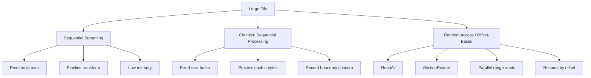
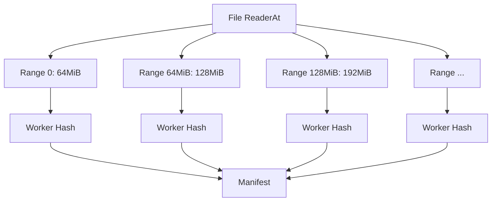
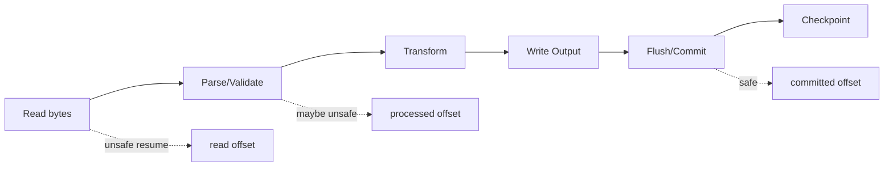
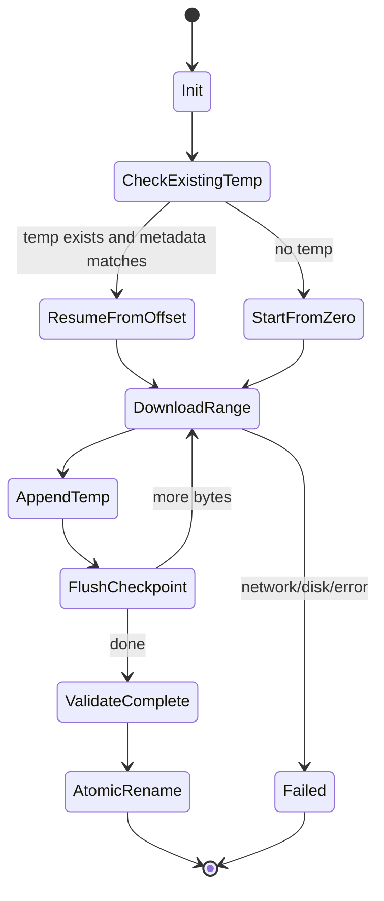
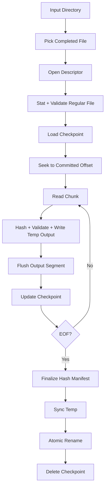

# learn-go-io-buffer-byte-stream-file-network-data-transfer-part-013.md

# Part 013 — Large File Processing: Chunking, Streaming, Seek, Random Access, dan Resumable Reads

> Target pembaca: Java software engineer yang ingin membangun mental model Go IO untuk file besar secara production-grade.
>
> Fokus bagian ini: bagaimana memproses file besar tanpa memindahkan problem dari disk/network ke memory, bagaimana membaca secara sequential maupun random access, bagaimana menjaga correctness ketika read bersifat partial, dan bagaimana mendesain pipeline yang dapat dilanjutkan kembali setelah gagal.

---

## 0. Posisi Part Ini dalam Series

Kita sudah membangun fondasi:

- Part 001: data movement model.
- Part 002: kontrak `io.Reader`, `io.Writer`, `io.Seeker`, `io.ReaderAt`, `io.WriterAt`.
- Part 003: komposisi `io.Copy`, `io.LimitReader`, `io.Pipe`, `io.SectionReader`, dan utilitas `io` lain.
- Part 004: buffer fundamentals.
- Part 005: `bufio`.
- Part 006: Text IO.
- Part 007: Console IO.
- Part 008: IO error semantics.
- Part 009: file basics.
- Part 010: filesystem operations.
- Part 011: path handling.
- Part 012: filesystem abstraction.

Part 013 mulai masuk ke kasus yang lebih realistis: **file besar**.

File besar di sini tidak selalu berarti terabyte. Dalam production, file 50 MB pun dapat menjadi “besar” bila:

- dibaca oleh banyak request secara paralel,
- di-load penuh ke memory,
- diproses di container dengan memory limit kecil,
- berasal dari user tidak tepercaya,
- diproses sebagai bagian dari batch pipeline,
- harus di-resume setelah failure,
- harus di-transfer lewat network lambat,
- atau harus di-hash, di-parse, dikompresi, dan di-upload sekaligus.

Mental model utama:

```text
Large file processing is not about file size only.
It is about boundedness, progress, replayability, observability, and failure recovery.
```

---

## 1. Problem Framing: Apa yang Membuat File Processing Menjadi Sulit?

Di level API, membaca file tampak sederhana:

```go
b, err := os.ReadFile(path)
```

Tetapi pendekatan ini punya asumsi besar:

1. Ukuran file aman dimuat ke memory.
2. Caller percaya pada ukuran input.
3. Tidak perlu progress reporting.
4. Tidak perlu resume.
5. Tidak perlu early cancellation.
6. Tidak perlu backpressure.
7. Tidak perlu memproses record sebelum seluruh file selesai dibaca.
8. Tidak ada risiko memory pressure dari concurrency.

Untuk file kecil, asumsi itu sering valid. Untuk file besar, asumsi itu berbahaya.

### 1.1 Large File Processing Bukan Sekadar “Read in Chunks”

Banyak engineer menyederhanakan masalah menjadi:

```text
Jangan pakai ReadAll, pakai chunk.
```

Itu benar, tapi belum cukup. Chunking hanya satu mekanisme. Yang perlu didesain adalah:

| Pertanyaan | Mengapa Penting |
|---|---|
| Apakah input bounded? | Melindungi memory dan disk dari input tak terbatas. |
| Apakah format record-based atau byte-stream? | Menentukan apakah chunk dapat diproses langsung atau harus reassemble. |
| Apakah offset penting? | Dibutuhkan untuk resume, random access, dan parallel read. |
| Apakah file immutable selama dibaca? | Menentukan apakah `Stat` awal dapat dipercaya. |
| Apakah processing idempotent? | Menentukan apakah retry aman. |
| Apakah output incremental? | Menentukan strategi commit/checkpoint. |
| Apakah failure bisa terjadi di tengah? | Hampir selalu iya. |
| Apakah perlu progress? | Hampir selalu untuk batch/transfer besar. |

### 1.2 Analogi Java

Dalam Java, pilihan umum:

- `InputStream` untuk sequential stream.
- `BufferedInputStream` untuk buffering.
- `Files.readAllBytes` untuk load-all.
- `RandomAccessFile` untuk seek/read offset.
- `FileChannel` untuk NIO, transfer, dan random access.
- `MappedByteBuffer` untuk memory-mapped file.
- `Files.lines` untuk line streaming.

Dalam Go, bentuknya lebih kecil dan komposisional:

| Java | Go |
|---|---|
| `InputStream` | `io.Reader` |
| `OutputStream` | `io.Writer` |
| `BufferedInputStream` | `bufio.Reader` |
| `Files.readAllBytes` | `os.ReadFile` / `io.ReadAll` |
| `RandomAccessFile` / `FileChannel.read(buf, pos)` | `io.ReaderAt` / `os.File.ReadAt` |
| `SeekableByteChannel` | `io.Seeker` |
| `FileChannel.transferTo` | `io.Copy`, `sendfile`-optimized paths when supported internally |
| `MappedByteBuffer` | no direct standard library equivalent; OS-specific packages needed |

Perbedaan penting: Go cenderung mendorong desain berbasis interface kecil (`Reader`, `Writer`, `ReaderAt`) daripada class hierarchy besar.

---

## 2. Tiga Mode Utama Membaca File Besar

Secara praktis, file besar bisa diproses dalam tiga mode:



### 2.1 Sequential Streaming

Cocok untuk:

- copy file,
- hashing,
- compression,
- upload/download streaming,
- line-by-line parsing,
- transform pipeline,
- scanning format yang linear.

Bentuk mentalnya:

```text
read some bytes → process/write → read more → process/write → ... → EOF
```

Kelebihan:

- memory bounded,
- latency bisa lebih rendah karena output bisa dimulai sebelum input selesai,
- cocok untuk pipeline.

Kekurangan:

- sulit lompat ke posisi tertentu,
- retry dari tengah butuh checkpoint,
- parser harus menangani boundary antar chunk.

### 2.2 Chunked Sequential Processing

Ini adalah bentuk konkret dari sequential streaming dengan buffer eksplisit:

```go
buf := make([]byte, 1024*1024) // 1 MiB
for {
    n, err := f.Read(buf)
    if n > 0 {
        process(buf[:n])
    }
    if err == io.EOF {
        break
    }
    if err != nil {
        return err
    }
}
```

Aturan wajib:

```text
Only process buf[:n], never the whole buf.
```

Kesalahan klasik:

```go
// Salah: process seluruh buffer, termasuk stale bytes dari iterasi sebelumnya.
process(buf)
```

Jika read terakhir hanya 200 byte dari buffer 1 MiB, `buf[200:]` masih berisi data lama atau zero-value yang tidak boleh dianggap sebagai input valid.

### 2.3 Random Access / Offset-Based

Cocok untuk:

- resume download/upload,
- parallel range processing,
- indexed file format,
- reading file footer/header,
- partial extraction,
- validating specific segment,
- rebuilding corrupt segment,
- serving HTTP range request.

Go menyediakan:

- `(*os.File).ReadAt`.
- `io.ReaderAt`.
- `io.NewSectionReader`.
- `(*os.File).Seek`.

Perbedaan penting:

| API | Menggunakan shared cursor? | Aman untuk parallel range? | Cocok Untuk |
|---|---:|---:|---|
| `Read` | Ya | Tidak tanpa koordinasi | sequential scan |
| `Seek` + `Read` | Ya | Tidak tanpa lock | single cursor random navigation |
| `ReadAt` | Tidak | Ya, jika source mendukung | offset-based read |
| `SectionReader` | Cursor lokal di section | Bisa untuk section terpisah | bounded view atas `ReaderAt` |

---

## 3. Kontrak `Read` untuk File Besar

Bagian ini mengulang sedikit Part 008, tapi dalam konteks file besar.

Kontrak penting:

```go
n, err := r.Read(buf)
```

Kemungkinan hasil:

| `n` | `err` | Arti |
|---:|---|---|
| `> 0` | `nil` | Ada data, lanjut. |
| `> 0` | `io.EOF` atau error lain | Ada data yang harus diproses dulu, lalu tangani error. |
| `0` | `io.EOF` | End of stream normal. |
| `0` | non-nil | Gagal tanpa data baru. |
| `0` | `nil` | Tidak ideal; caller harus defensif agar tidak infinite loop. |

Pola robust:

```go
func consume(r io.Reader, buf []byte, handle func([]byte) error) error {
    if len(buf) == 0 {
        return fmt.Errorf("buffer must not be empty")
    }

    for {
        n, err := r.Read(buf)
        if n > 0 {
            if handle(buf[:n]) != nil {
                return fmt.Errorf("handle chunk: %w", err)
            }
        }

        if err == io.EOF {
            return nil
        }
        if err != nil {
            return err
        }
        if n == 0 {
            return fmt.Errorf("reader returned n=0, err=nil")
        }
    }
}
```

Ada bug kecil di contoh di atas: `handle(buf[:n]) != nil` memanggil `handle` tetapi membuang error konkretnya. Versi benar:

```go
func consume(r io.Reader, buf []byte, handle func([]byte) error) error {
    if len(buf) == 0 {
        return fmt.Errorf("buffer must not be empty")
    }

    for {
        n, readErr := r.Read(buf)
        if n > 0 {
            if err := handle(buf[:n]); err != nil {
                return fmt.Errorf("handle chunk: %w", err)
            }
        }

        if readErr == io.EOF {
            return nil
        }
        if readErr != nil {
            return fmt.Errorf("read: %w", readErr)
        }
        if n == 0 {
            return fmt.Errorf("reader returned n=0, err=nil")
        }
    }
}
```

Mengapa perlu defensive `n == 0 && err == nil`?

Karena interface `io.Reader` bisa diimplementasikan oleh kode custom. Untuk `os.File`, kasus ini biasanya bukan concern utama, tetapi library production yang menerima `io.Reader` dari caller harus defensif.

---

## 4. Chunk Size: 4 KiB, 32 KiB, 64 KiB, 1 MiB, atau Lebih?

Tidak ada satu ukuran terbaik untuk semua kasus.

Chunk size adalah kompromi antara:

- syscall overhead,
- cache locality,
- memory footprint,
- latency per chunk,
- downstream processing cost,
- compression block behavior,
- network write behavior,
- object allocation,
- progress granularity.

### 4.1 Heuristic Awal

| Use Case | Starting Chunk Size | Catatan |
|---|---:|---|
| General file copy | 32 KiB–256 KiB | `io.Copy` sudah punya default strategy; jangan custom tanpa alasan. |
| Hashing large file | 128 KiB–1 MiB | Ukur dengan benchmark. |
| Compression streaming | 32 KiB–256 KiB | Compressor punya internal buffer juga. |
| Parsing record text | `bufio.Reader` + bounded line | Boundary record lebih penting dari chunk size. |
| Upload/download | 32 KiB–1 MiB | Tergantung transport dan backpressure. |
| Parallel range processing | 1 MiB–64 MiB per range | Per range lebih besar agar overhead scheduling kecil. |
| Memory constrained container | 32 KiB–128 KiB | Total memory = chunk size × concurrency. |

### 4.2 Jangan Optimasi Sebelum Tahu Bottleneck

Pola buruk:

```go
buf := make([]byte, 64*1024*1024) // "biar cepat"
```

Masalah:

- 64 MiB × 100 concurrent jobs = 6.4 GiB buffer saja.
- GC pressure meningkat jika buffer sering dialokasi.
- Latency per chunk lebih tinggi.
- Downstream bisa tertahan lama sebelum menerima data.

Pola lebih baik:

```go
const defaultChunkSize = 256 * 1024 // 256 KiB
```

Kemudian ukur:

- throughput bytes/sec,
- allocation/op,
- syscalls/sec,
- p95/p99 latency,
- memory RSS,
- GC pause,
- CPU utilization,
- disk utilization,
- downstream blocking.

### 4.3 Formula Memory Sederhana

```text
peak_buffer_memory ≈ active_workers × buffers_per_worker × chunk_size
```

Contoh:

```text
200 workers × 2 buffers × 1 MiB = 400 MiB
```

Belum termasuk:

- parser state,
- output buffers,
- compression buffers,
- HTTP client/server buffers,
- goroutine stacks,
- OS page cache,
- application heap lain.

---

## 5. `io.Copy` vs Manual Read Loop

### 5.1 Gunakan `io.Copy` untuk Transfer Sederhana

Jika tujuannya hanya memindahkan bytes dari source ke destination:

```go
func copyFile(dstPath, srcPath string) error {
    src, err := os.Open(srcPath)
    if err != nil {
        return fmt.Errorf("open source: %w", err)
    }
    defer src.Close()

    dst, err := os.Create(dstPath)
    if err != nil {
        return fmt.Errorf("create destination: %w", err)
    }
    defer dst.Close()

    if _, err := io.Copy(dst, src); err != nil {
        return fmt.Errorf("copy: %w", err)
    }
    if err := dst.Sync(); err != nil {
        return fmt.Errorf("sync destination: %w", err)
    }
    if err := dst.Close(); err != nil {
        return fmt.Errorf("close destination: %w", err)
    }
    return nil
}
```

Catatan: contoh di atas punya masalah subtle: `defer dst.Close()` lalu `dst.Close()` eksplisit. `Close` kedua akan error. Versi production lebih rapi:

```go
func copyFileDurable(dstPath, srcPath string) (retErr error) {
    src, err := os.Open(srcPath)
    if err != nil {
        return fmt.Errorf("open source: %w", err)
    }
    defer func() {
        if err := src.Close(); retErr == nil && err != nil {
            retErr = fmt.Errorf("close source: %w", err)
        }
    }()

    dst, err := os.OpenFile(dstPath, os.O_CREATE|os.O_WRONLY|os.O_TRUNC, 0o644)
    if err != nil {
        return fmt.Errorf("open destination: %w", err)
    }

    closed := false
    closeDst := func() error {
        if closed {
            return nil
        }
        closed = true
        return dst.Close()
    }
    defer func() {
        if err := closeDst(); retErr == nil && err != nil {
            retErr = fmt.Errorf("close destination: %w", err)
        }
    }()

    if _, err := io.Copy(dst, src); err != nil {
        return fmt.Errorf("copy: %w", err)
    }
    if err := dst.Sync(); err != nil {
        return fmt.Errorf("sync destination: %w", err)
    }
    if err := closeDst(); err != nil {
        return fmt.Errorf("close destination: %w", err)
    }
    return nil
}
```

Part 014 akan membahas durable writes lebih dalam, termasuk temp-write-rename dan directory sync.

### 5.2 Kapan Manual Read Loop?

Gunakan manual loop bila perlu:

- progress per chunk,
- hashing/transformation,
- throttling,
- cancellation check,
- custom retry/checkpoint,
- partial validation,
- record-aware parsing,
- metrics detail,
- buffer ownership khusus,
- limit per stage.

Contoh manual copy dengan progress:

```go
type ProgressFunc func(done int64)

func copyWithProgress(dst io.Writer, src io.Reader, buf []byte, progress ProgressFunc) (int64, error) {
    if len(buf) == 0 {
        return 0, fmt.Errorf("buffer must not be empty")
    }

    var total int64
    for {
        n, readErr := src.Read(buf)
        if n > 0 {
            written, writeErr := writeFull(dst, buf[:n])
            total += int64(written)
            if progress != nil {
                progress(total)
            }
            if writeErr != nil {
                return total, fmt.Errorf("write after %d bytes: %w", total, writeErr)
            }
        }

        if readErr == io.EOF {
            return total, nil
        }
        if readErr != nil {
            return total, fmt.Errorf("read after %d bytes: %w", total, readErr)
        }
        if n == 0 {
            return total, fmt.Errorf("reader returned no data and no error")
        }
    }
}

func writeFull(w io.Writer, p []byte) (int, error) {
    total := 0
    for len(p) > 0 {
        n, err := w.Write(p)
        if n > 0 {
            total += n
            p = p[n:]
        }
        if err != nil {
            return total, err
        }
        if n == 0 {
            return total, io.ErrShortWrite
        }
    }
    return total, nil
}
```

Mengapa `writeFull`?

Karena `io.Writer` tidak menjamin sekali `Write(p)` menulis seluruh `p` kecuali implementasinya mendokumentasikan demikian. `os.File.Write` mengembalikan error jika `n != len(b)`, tetapi code generic terhadap `io.Writer` sebaiknya tetap defensif.

---

## 6. Bounded Input: Jangan Percaya Ukuran File Saja

Untuk file lokal yang dibuat sistem sendiri, `Stat().Size()` mungkin cukup berguna. Untuk input dari user, upload, network mount, symlink target, atau file yang bisa berubah selama diproses, `Size()` adalah sinyal, bukan jaminan total safety.

### 6.1 `Stat` untuk Preflight

```go
func openRegularFile(path string, maxSize int64) (*os.File, int64, error) {
    f, err := os.Open(path)
    if err != nil {
        return nil, 0, fmt.Errorf("open: %w", err)
    }

    info, err := f.Stat()
    if err != nil {
        f.Close()
        return nil, 0, fmt.Errorf("stat: %w", err)
    }
    if !info.Mode().IsRegular() {
        f.Close()
        return nil, 0, fmt.Errorf("not a regular file: %s", path)
    }
    if info.Size() > maxSize {
        f.Close()
        return nil, 0, fmt.Errorf("file too large: %d > %d", info.Size(), maxSize)
    }
    return f, info.Size(), nil
}
```

Tetapi ada caveat:

- file bisa berubah setelah `Stat`,
- path bisa diganti jika tidak memegang descriptor yang benar,
- symlink dan hardlink bisa membuat reasoning lebih rumit,
- sparse file punya logical size besar tetapi physical blocks kecil,
- special file bisa tidak punya size meaningful.

### 6.2 `io.LimitReader` untuk Runtime Bound

Preflight saja tidak cukup. Tambahkan runtime bound:

```go
func readSmallConfig(path string, maxBytes int64) ([]byte, error) {
    f, _, err := openRegularFile(path, maxBytes)
    if err != nil {
        return nil, err
    }
    defer f.Close()

    lr := io.LimitReader(f, maxBytes+1)
    data, err := io.ReadAll(lr)
    if err != nil {
        return nil, fmt.Errorf("read: %w", err)
    }
    if int64(len(data)) > maxBytes {
        return nil, fmt.Errorf("input exceeds limit %d", maxBytes)
    }
    return data, nil
}
```

Mengapa `maxBytes+1`?

Agar kita bisa membedakan:

- input dengan ukuran tepat `maxBytes`, valid,
- input lebih besar dari `maxBytes`, invalid.

Kalau limit tepat `maxBytes`, `ReadAll` hanya berhenti di limit dan tampak seperti EOF normal.

---

## 7. Record Boundary: Chunk Bukan Record

Kesalahan besar dalam large file processing adalah menganggap satu chunk sama dengan satu record.

Contoh file line-based:

```text
record-1\n
record-2 panjang sekali ... [terpotong di tengah chunk]
record-3\n
```

Jika membaca 4 KiB per chunk, satu line bisa:

- berada penuh dalam satu chunk,
- terpecah ke beberapa chunk,
- lebih besar dari batas memory yang diperbolehkan,
- mengandung CRLF,
- tidak diakhiri newline,
- mengandung malformed UTF-8.

### 7.1 Pola Salah

```go
buf := make([]byte, 4096)
for {
    n, err := f.Read(buf)
    if n > 0 {
        lines := strings.Split(string(buf[:n]), "\n")
        for _, line := range lines {
            handle(line)
        }
    }
    if err == io.EOF {
        break
    }
    if err != nil {
        return err
    }
}
```

Bug:

- line yang terpotong dianggap record penuh,
- `string(buf[:n])` mengalokasikan per chunk,
- CRLF mungkin tersisa `\r`,
- line sangat panjang dapat membuat memory naik bila ditangani salah,
- boundary UTF-8 bisa terpotong.

### 7.2 Pola Lebih Baik: Bounded Line Reader

`bufio.Scanner` nyaman, tetapi punya token size limit default dan tidak ideal untuk semua file besar. Untuk production line protocol, sering lebih baik menggunakan `bufio.Reader.ReadSlice`/`ReadString` dengan batas eksplisit.

```go
func readLinesBounded(r io.Reader, maxLine int, handle func([]byte) error) error {
    if maxLine <= 0 {
        return fmt.Errorf("maxLine must be positive")
    }

    br := bufio.NewReader(r)
    var line []byte

    for {
        frag, err := br.ReadSlice('\n')
        if len(frag) > 0 {
            line = append(line, frag...)
            if len(line) > maxLine {
                return fmt.Errorf("line exceeds max size %d", maxLine)
            }
        }

        if err == nil {
            normalized := bytes.TrimSuffix(line, []byte("\n"))
            normalized = bytes.TrimSuffix(normalized, []byte("\r"))
            if err := handle(normalized); err != nil {
                return err
            }
            line = line[:0]
            continue
        }

        if errors.Is(err, bufio.ErrBufferFull) {
            continue
        }

        if err == io.EOF {
            if len(line) > 0 {
                normalized := bytes.TrimSuffix(line, []byte("\r"))
                if err := handle(normalized); err != nil {
                    return err
                }
            }
            return nil
        }

        return fmt.Errorf("read line: %w", err)
    }
}
```

Catatan ownership:

- `frag` dari `ReadSlice` hanya valid sampai operasi read berikutnya.
- Karena line bisa terpecah, kita append ke buffer milik kita.
- Jika line lengkap dalam satu fragment dan ingin optimasi copy, bisa desain fast path, tetapi hati-hati lifetime.

---

## 8. Random Access dengan `ReadAt`

`ReadAt` membaca pada offset tertentu tanpa memindahkan shared cursor.

```go
func readHeader(path string) ([]byte, error) {
    f, err := os.Open(path)
    if err != nil {
        return nil, err
    }
    defer f.Close()

    header := make([]byte, 512)
    n, err := f.ReadAt(header, 0)
    if err != nil && err != io.EOF {
        return nil, err
    }
    return header[:n], nil
}
```

Tetapi untuk header fixed-size yang wajib lengkap:

```go
func readFixedHeader(path string) ([512]byte, error) {
    var header [512]byte

    f, err := os.Open(path)
    if err != nil {
        return header, err
    }
    defer f.Close()

    n, err := f.ReadAt(header[:], 0)
    if err != nil {
        return header, fmt.Errorf("read header: got %d/%d bytes: %w", n, len(header), err)
    }
    return header, nil
}
```

`ReadAt` convention:

- membaca `len(p)` bytes mulai dari offset,
- jika `n < len(p)`, error non-nil,
- EOF di tengah fixed-size region adalah error penting,
- tidak memengaruhi current seek offset,
- bisa dipakai untuk parallel range read.

### 8.1 Parallel Range Reads

Misal file 10 GiB ingin di-hash per segment untuk integrity manifest.



Skeleton:

```go
type Range struct {
    Index int
    Off   int64
    Size  int64
}

type RangeHash struct {
    Index int
    Off   int64
    Size  int64
    Sum   [32]byte
}

func hashRange(r io.ReaderAt, rg Range, buf []byte) (RangeHash, error) {
    h := sha256.New()
    sr := io.NewSectionReader(r, rg.Off, rg.Size)

    if _, err := io.CopyBuffer(h, sr, buf); err != nil {
        return RangeHash{}, fmt.Errorf("hash range %d off=%d size=%d: %w", rg.Index, rg.Off, rg.Size, err)
    }

    var sum [32]byte
    copy(sum[:], h.Sum(nil))
    return RangeHash{Index: rg.Index, Off: rg.Off, Size: rg.Size, Sum: sum}, nil
}
```

Catatan:

- `SectionReader` memberi view terbatas dari `ReaderAt`.
- Setiap worker sebaiknya punya buffer sendiri atau meminjam dari pool dengan disiplin ketat.
- Jangan share `[]byte` buffer antar worker tanpa ownership jelas.
- Jangan pakai `Seek` + `Read` paralel pada file yang sama tanpa lock karena shared cursor akan bertabrakan.

### 8.2 Membuat Ranges

```go
func splitRanges(size int64, partSize int64) ([]Range, error) {
    if size < 0 {
        return nil, fmt.Errorf("negative size")
    }
    if partSize <= 0 {
        return nil, fmt.Errorf("partSize must be positive")
    }

    var ranges []Range
    for off, idx := int64(0), 0; off < size; idx++ {
        n := partSize
        if remaining := size - off; remaining < n {
            n = remaining
        }
        ranges = append(ranges, Range{Index: idx, Off: off, Size: n})
        off += n
    }
    return ranges, nil
}
```

Edge cases:

- size 0 menghasilkan no range atau satu empty range tergantung kebutuhan.
- Jangan gunakan `int` untuk offset file besar; gunakan `int64`.
- Waspadai overflow saat menghitung `off + size`.

---

## 9. `Seek` vs `ReadAt`

`Seek` mengubah current offset file.

```go
_, err := f.Seek(1024, io.SeekStart)
if err != nil {
    return err
}
n, err := f.Read(buf)
```

`ReadAt` tidak mengubah current offset.

```go
n, err := f.ReadAt(buf, 1024)
```

### 9.1 Kapan `Seek` Cocok?

- parser single-thread yang navigasi file format,
- membaca header lalu footer lalu kembali ke body,
- interactive inspection tool,
- compatibility dengan API yang butuh `io.ReadSeeker`.

### 9.2 Kapan `ReadAt` Lebih Baik?

- parallel range processing,
- resumable transfer,
- deterministic offset reads,
- worker pool,
- serving arbitrary byte ranges,
- avoiding shared cursor bugs.

### 9.3 Anti-Pattern: Parallel `Seek` + `Read`

```go
// Buruk: dua goroutine mengubah offset file yang sama.
go func() {
    f.Seek(0, io.SeekStart)
    f.Read(bufA)
}()

go func() {
    f.Seek(1024*1024, io.SeekStart)
    f.Read(bufB)
}()
```

Meskipun metode `os.File` safe for concurrent use, shared seek offset tetap semantic hazard. “Data race” mungkin tidak terjadi di Go race detector, tetapi **logical race** terjadi pada file cursor.

Gunakan:

```go
go func() {
    f.ReadAt(bufA, 0)
}()

go func() {
    f.ReadAt(bufB, 1024*1024)
}()
```

---

## 10. Resumable Reads dan Checkpoint

Resumable processing berarti sistem bisa melanjutkan dari posisi terakhir yang aman setelah crash, restart, timeout, atau deployment.

### 10.1 Checkpoint Bukan Sekadar Offset Terakhir Dibaca

Ada tiga offset berbeda:

| Offset | Arti |
|---|---|
| read offset | byte terakhir yang sudah dibaca dari source |
| processed offset | byte terakhir yang sudah diproses secara valid |
| committed offset | byte terakhir yang output/side-effect-nya sudah durable/idempotent |

Untuk resume, yang biasanya aman adalah **committed offset**, bukan read offset.



Jika process crash setelah membaca 100 MB tetapi baru menulis durable output sampai 90 MB, resume dari 100 MB akan kehilangan 10 MB data.

### 10.2 Checkpoint Granularity

| Granularity | Kelebihan | Kekurangan |
|---|---|---|
| per byte offset | presisi tinggi | sering tidak align dengan record |
| per chunk | sederhana | bisa reprocess partial records |
| per record | semantic paling baik | butuh parser record-aware |
| per segment | cocok untuk parallel transfer | manifest lebih kompleks |

Untuk structured text/CSV/log, checkpoint sebaiknya record-aware.

Untuk binary fixed-block, offset-based checkpoint bisa aman.

### 10.3 Contoh Checkpoint Model

```go
type Checkpoint struct {
    Path         string    `json:"path"`
    FileSize     int64     `json:"file_size"`
    ModTimeUnix  int64     `json:"mod_time_unix"`
    InodeHint    uint64    `json:"inode_hint,omitempty"`
    Offset       int64     `json:"offset"`
    RecordNumber int64     `json:"record_number"`
    UpdatedAt    time.Time `json:"updated_at"`
}
```

Catatan:

- `Path` saja tidak cukup untuk memastikan file yang sama.
- `Size` dan `ModTime` membantu, tapi tidak sempurna.
- Inode/device info OS-specific.
- Untuk object storage, gunakan ETag/generation/version ID jika tersedia.
- Untuk file lokal mutable, pertimbangkan lock atau copy snapshot.

### 10.4 Resume dengan `Seek`

```go
func resumeSequential(path string, offset int64, handle func([]byte) error) error {
    f, err := os.Open(path)
    if err != nil {
        return err
    }
    defer f.Close()

    if _, err := f.Seek(offset, io.SeekStart); err != nil {
        return fmt.Errorf("seek to checkpoint %d: %w", offset, err)
    }

    buf := make([]byte, 256*1024)
    return consume(f, buf, handle)
}
```

Ini aman hanya bila `offset` berada pada boundary yang benar. Untuk line-based file, offset harus berada di awal line, bukan di tengah UTF-8 rune atau tengah record.

### 10.5 Resume dengan `SectionReader`

```go
func processRange(path string, off, size int64, handle func([]byte) error) error {
    f, err := os.Open(path)
    if err != nil {
        return err
    }
    defer f.Close()

    sr := io.NewSectionReader(f, off, size)
    buf := make([]byte, 256*1024)
    return consume(sr, buf, handle)
}
```

Kelebihan:

- reader otomatis berhenti di batas section,
- tidak perlu manual stop saat offset mencapai batas,
- cocok untuk segment processing.

---

## 11. Designing a Large File Processor

Mari desain processor yang membaca file besar secara sequential, menghitung hash, menghitung progress, dan memanggil handler per chunk.

### 11.1 API Design

```go
type LargeFileProcessor struct {
    ChunkSize int
    MaxSize   int64
}

type FileProgress struct {
    Path      string
    DoneBytes int64
    SizeBytes int64
}

type ChunkHandler func(ctx context.Context, chunk []byte, absoluteOffset int64) error

type ProgressHandler func(FileProgress)
```

### 11.2 Implementation

```go
func (p LargeFileProcessor) Process(
    ctx context.Context,
    path string,
    handle ChunkHandler,
    progress ProgressHandler,
) (sum [32]byte, err error) {
    if handle == nil {
        return sum, fmt.Errorf("handle must not be nil")
    }

    chunkSize := p.ChunkSize
    if chunkSize <= 0 {
        chunkSize = 256 * 1024
    }
    if chunkSize > 16*1024*1024 {
        return sum, fmt.Errorf("chunk size too large: %d", chunkSize)
    }

    f, err := os.Open(path)
    if err != nil {
        return sum, fmt.Errorf("open: %w", err)
    }
    defer func() {
        if closeErr := f.Close(); err == nil && closeErr != nil {
            err = fmt.Errorf("close: %w", closeErr)
        }
    }()

    info, err := f.Stat()
    if err != nil {
        return sum, fmt.Errorf("stat: %w", err)
    }
    if !info.Mode().IsRegular() {
        return sum, fmt.Errorf("not regular file")
    }
    if p.MaxSize > 0 && info.Size() > p.MaxSize {
        return sum, fmt.Errorf("file too large: %d > %d", info.Size(), p.MaxSize)
    }

    h := sha256.New()
    buf := make([]byte, chunkSize)

    var off int64
    for {
        if err := ctx.Err(); err != nil {
            return sum, err
        }

        n, readErr := f.Read(buf)
        if n > 0 {
            chunk := buf[:n]

            if _, err := h.Write(chunk); err != nil {
                return sum, fmt.Errorf("hash: %w", err)
            }
            if err := handle(ctx, chunk, off); err != nil {
                return sum, fmt.Errorf("handle offset=%d len=%d: %w", off, n, err)
            }

            off += int64(n)
            if progress != nil {
                progress(FileProgress{Path: path, DoneBytes: off, SizeBytes: info.Size()})
            }
        }

        if readErr == io.EOF {
            copy(sum[:], h.Sum(nil))
            return sum, nil
        }
        if readErr != nil {
            return sum, fmt.Errorf("read offset=%d: %w", off, readErr)
        }
        if n == 0 {
            return sum, fmt.Errorf("read returned n=0 err=nil at offset=%d", off)
        }
    }
}
```

### 11.3 Critical Ownership Warning

`chunk` is only valid until the next read iteration.

Handler tidak boleh menyimpan `chunk` tanpa copy.

Jika handler perlu menyimpan:

```go
func retainingHandler(ctx context.Context, chunk []byte, off int64) error {
    owned := bytes.Clone(chunk)
    _ = owned
    return nil
}
```

Desain API bisa memperjelas:

```go
// ChunkHandler receives a borrowed chunk. It must not retain chunk after returning.
type ChunkHandler func(ctx context.Context, chunk []byte, absoluteOffset int64) error
```

Ini mirip dengan memory ownership documentation di high-performance systems.

---

## 12. File Mutation During Processing

Apa yang terjadi jika file berubah saat sedang dibaca?

Kemungkinan:

- file bertambah,
- file dipotong/truncate,
- file diganti lewat rename,
- content berubah di tengah,
- path menunjuk ke file lain,
- network filesystem memberi view yang tidak konsisten.

### 12.1 Descriptor vs Path

Jika sudah `os.Open(path)`, operasi `Read` membaca dari descriptor/handle yang terbuka, bukan membuka ulang path tiap chunk.

Tetapi:

- jika file ditulis oleh proses lain, descriptor bisa melihat perubahan tergantung OS/filesystem,
- jika path diganti via rename, descriptor lama biasanya tetap menunjuk ke file lama di Unix-like OS,
- behavior lintas OS/filesystem bisa berbeda.

### 12.2 Stabilitas Input

Untuk pipeline yang membutuhkan input immutable:

- proses file di staging directory setelah writer selesai,
- gunakan atomic rename dari `.partial` ke final name,
- jangan scan file yang masih ditulis,
- gunakan manifest/sidecar done file,
- validasi size/hash sebelum dan sesudah,
- gunakan file lock jika ecosystem mendukung dan benar-benar diperlukan,
- untuk object storage, gunakan object version/generation.

### 12.3 Pre/Post Stat Validation

```go
func validateStableRead(f *os.File, before os.FileInfo, bytesRead int64) error {
    after, err := f.Stat()
    if err != nil {
        return fmt.Errorf("post stat: %w", err)
    }
    if after.Size() != before.Size() {
        return fmt.Errorf("file size changed during read: before=%d after=%d", before.Size(), after.Size())
    }
    if !after.ModTime().Equal(before.ModTime()) {
        return fmt.Errorf("file mtime changed during read")
    }
    if bytesRead != before.Size() {
        return fmt.Errorf("bytes read mismatch: read=%d size=%d", bytesRead, before.Size())
    }
    return nil
}
```

Ini tidak sempurna, tetapi lebih baik daripada diam-diam menerima input yang berubah.

---

## 13. Sparse Files dan Logical Size

Sparse file bisa punya logical size besar tetapi physical disk blocks kecil.

Contoh:

```text
logical size: 100 GiB
actual allocated blocks: 10 MiB
```

Jika processor hanya melihat `Stat().Size()`, ia mungkin menganggap file terlalu besar. Kadang itu benar; kadang tidak.

Untuk production:

- tentukan apakah limit berdasarkan logical bytes atau physical blocks,
- jangan menganggap holes sebagai “tidak ada data” kecuali format/OS-aware,
- sequential read holes biasanya menghasilkan zero bytes,
- copying sparse file dengan naive write bisa membuat destination menjadi non-sparse dan menghabiskan storage.

Go standard library tidak menyediakan portable high-level sparse file abstraction. Jika sparse preservation penting, gunakan OS-specific syscall dengan desain eksplisit dan test lintas platform.

---

## 14. Memory Mapping: Mengapa Tidak Langsung `mmap`?

Java engineer mungkin terbiasa dengan `MappedByteBuffer`. Di Go standard library, tidak ada high-level portable `mmap` API.

`mmap` bisa berguna untuk:

- random read besar,
- index file,
- database/storage engine,
- read-mostly binary format,
- avoiding explicit read syscall per chunk.

Tetapi `mmap` punya risiko:

- page fault latency sulit diprediksi,
- SIGBUS jika file berubah/truncate pada beberapa OS,
- lifecycle mapping harus sangat hati-hati,
- memory accounting tidak selalu jelas di container,
- portability rendah,
- interaction dengan GC bukan seperti normal Go heap,
- writable mapping punya durability semantics kompleks.

Rule of thumb:

```text
Use standard Reader/ReaderAt first.
Use mmap only when profiling proves it is needed and you can own the OS-specific failure model.
```

Untuk seri ini, kita tetap fokus pada standard library path.

---

## 15. Large File Hashing

Hashing adalah contoh ideal sequential streaming.

```go
func sha256File(path string) ([32]byte, int64, error) {
    var out [32]byte

    f, err := os.Open(path)
    if err != nil {
        return out, 0, fmt.Errorf("open: %w", err)
    }
    defer f.Close()

    h := sha256.New()
    n, err := io.Copy(h, f)
    if err != nil {
        return out, n, fmt.Errorf("hash copy: %w", err)
    }

    copy(out[:], h.Sum(nil))
    return out, n, nil
}
```

Dengan progress:

```go
type progressReader struct {
    r     io.Reader
    total int64
    cb    func(int64)
}

func (p *progressReader) Read(b []byte) (int, error) {
    n, err := p.r.Read(b)
    if n > 0 {
        p.total += int64(n)
        if p.cb != nil {
            p.cb(p.total)
        }
    }
    return n, err
}

func sha256FileWithProgress(path string, cb func(int64)) ([32]byte, error) {
    var out [32]byte

    f, err := os.Open(path)
    if err != nil {
        return out, err
    }
    defer f.Close()

    pr := &progressReader{r: f, cb: cb}
    h := sha256.New()
    if _, err := io.Copy(h, pr); err != nil {
        return out, err
    }
    copy(out[:], h.Sum(nil))
    return out, nil
}
```

Catatan:

- `hash.Hash` adalah `io.Writer`.
- `io.Copy(h, f)` membuat pipeline sederhana.
- Tidak perlu memuat file ke memory.

---

## 16. Large File Transform: Reader → Transformer → Writer

Contoh transform sederhana: uppercase ASCII stream. Ini bukan Unicode-correct, hanya contoh byte transform.

```go
type upperASCIIReader struct {
    r io.Reader
}

func (u *upperASCIIReader) Read(p []byte) (int, error) {
    n, err := u.r.Read(p)
    for i := 0; i < n; i++ {
        if p[i] >= 'a' && p[i] <= 'z' {
            p[i] -= 'a' - 'A'
        }
    }
    return n, err
}
```

Pipeline:

```go
func transformFile(dstPath, srcPath string) error {
    src, err := os.Open(srcPath)
    if err != nil {
        return err
    }
    defer src.Close()

    dst, err := os.Create(dstPath)
    if err != nil {
        return err
    }
    defer dst.Close()

    tr := &upperASCIIReader{r: src}
    _, err = io.Copy(dst, tr)
    return err
}
```

Tetapi untuk text Unicode, transform harus rune-aware dan boundary-aware. Jangan memanipulasi bytes jika semantic-nya character-level.

---

## 17. Large File Upload/Download Preparation

Walaupun HTTP detail ada di Part 027–029, large file processing perlu memahami transfer boundary.

### 17.1 Upload dari File

Pola buruk:

```go
body, _ := os.ReadFile(path)
http.Post(url, "application/octet-stream", bytes.NewReader(body))
```

Masalah:

- memory = file size,
- tidak bisa stream progress dengan baik,
- file besar bisa OOM,
- retry body butuh memory besar.

Pola lebih baik:

```go
f, err := os.Open(path)
if err != nil {
    return err
}
defer f.Close()

req, err := http.NewRequestWithContext(ctx, http.MethodPut, url, f)
if err != nil {
    return err
}

info, err := f.Stat()
if err != nil {
    return err
}
req.ContentLength = info.Size()
```

Untuk retry, file harus bisa di-seek ke awal atau request body harus dibuat ulang:

```go
func newUploadRequest(ctx context.Context, url, path string) (*http.Request, *os.File, error) {
    f, err := os.Open(path)
    if err != nil {
        return nil, nil, err
    }

    info, err := f.Stat()
    if err != nil {
        f.Close()
        return nil, nil, err
    }

    req, err := http.NewRequestWithContext(ctx, http.MethodPut, url, f)
    if err != nil {
        f.Close()
        return nil, nil, err
    }
    req.ContentLength = info.Size()
    return req, f, nil
}
```

Caller harus close `f` setelah request selesai.

### 17.2 Download ke File

Pola minimal:

```go
resp, err := http.Get(url)
if err != nil {
    return err
}
defer resp.Body.Close()

out, err := os.Create(path)
if err != nil {
    return err
}
defer out.Close()

_, err = io.Copy(out, resp.Body)
return err
```

Production concern:

- status code harus dicek,
- size limit harus diterapkan,
- temp file lalu rename,
- hash/ETag validation,
- context timeout,
- partial file cleanup,
- disk space error,
- close/sync error,
- decompression bomb jika response compressed,
- rate limit/backpressure.

---

## 18. Resumable Download Model

Resumable download biasanya menggunakan range request di HTTP, tapi konsepnya sama untuk source `ReaderAt`.

State:

```go
type DownloadCheckpoint struct {
    URL           string
    Destination   string
    TempPath      string
    ExpectedSize  int64
    CompletedSize int64
    EntityTag     string
    UpdatedAt     time.Time
}
```

Flow:



Critical invariant:

```text
checkpoint.completed_size must never exceed bytes durably written to temp file.
```

---

## 19. Rate Limiting dan Throttling

Kadang file processing harus dibatasi agar tidak mengganggu service utama.

Contoh simple throttled reader:

```go
type ThrottledReader struct {
    R          io.Reader
    BytesPerSec int64
    last       time.Time
}

func (t *ThrottledReader) Read(p []byte) (int, error) {
    if t.BytesPerSec <= 0 {
        return t.R.Read(p)
    }

    max := int(t.BytesPerSec / 10) // target 100ms worth of data
    if max <= 0 {
        max = 1
    }
    if len(p) > max {
        p = p[:max]
    }

    if !t.last.IsZero() {
        elapsed := time.Since(t.last)
        if elapsed < 100*time.Millisecond {
            time.Sleep(100*time.Millisecond - elapsed)
        }
    }
    t.last = time.Now()

    return t.R.Read(p)
}
```

Ini contoh sederhana, bukan token bucket sempurna. Untuk production berat, gunakan rate limiter yang lebih formal dan context-aware.

---

## 20. Cancellation

File biasa pada banyak OS tidak selalu bisa dibatalkan dengan context di tengah blocking read seperti network connection. Tetapi processing loop tetap harus cek context antar chunk.

```go
func copyWithContext(ctx context.Context, dst io.Writer, src io.Reader, buf []byte) (int64, error) {
    var total int64
    for {
        if err := ctx.Err(); err != nil {
            return total, err
        }

        n, readErr := src.Read(buf)
        if n > 0 {
            wn, writeErr := writeFull(dst, buf[:n])
            total += int64(wn)
            if writeErr != nil {
                return total, writeErr
            }
        }
        if readErr == io.EOF {
            return total, nil
        }
        if readErr != nil {
            return total, readErr
        }
        if n == 0 {
            return total, fmt.Errorf("no progress")
        }
    }
}
```

Jika source adalah network/file pipe yang support deadline, cancellation bisa dihubungkan ke close/deadline oleh wrapper khusus. Untuk ordinary file, check antar chunk biasanya cukup karena read lokal cepat, tetapi network filesystem bisa berbeda.

---

## 21. Observability untuk Large File Processing

Minimal metrics:

| Metric | Tipe | Arti |
|---|---|---|
| `files_processed_total` | counter | jumlah file sukses |
| `files_failed_total` | counter | jumlah file gagal |
| `bytes_read_total` | counter | total bytes dibaca |
| `bytes_written_total` | counter | total bytes ditulis |
| `processing_duration_seconds` | histogram | durasi file |
| `chunk_duration_seconds` | histogram | durasi per chunk |
| `active_file_processors` | gauge | job aktif |
| `checkpoint_lag_bytes` | gauge | read/processed vs committed gap |
| `file_size_bytes` | histogram | distribusi ukuran file |
| `read_errors_total` | counter | error baca |
| `write_errors_total` | counter | error tulis |

Log event penting:

- start processing: path, file size, job id,
- progress periodic: offset, percent, throughput,
- checkpoint update: committed offset,
- failure: offset, operation, wrapped error,
- completion: bytes, duration, throughput, hash.

Jangan log:

- seluruh path sensitif tanpa sanitasi,
- isi file,
- PII dari payload,
- token/secret dalam filename atau URL.

### 21.1 Throughput Calculation

```go
type Throughput struct {
    StartedAt time.Time
    Bytes     int64
}

func (t Throughput) BytesPerSecond(now time.Time) float64 {
    d := now.Sub(t.StartedAt).Seconds()
    if d <= 0 {
        return 0
    }
    return float64(t.Bytes) / d
}
```

Progress log sebaiknya tidak per chunk jika chunk kecil dan file besar. Gunakan interval:

```go
type PeriodicProgress struct {
    Every time.Duration
    last  time.Time
}

func (p *PeriodicProgress) ShouldLog(now time.Time) bool {
    if p.last.IsZero() || now.Sub(p.last) >= p.Every {
        p.last = now
        return true
    }
    return false
}
```

---

## 22. Testing Large File Processing

### 22.1 Jangan Selalu Butuh File Besar Asli

Banyak behavior bisa dites dengan fake reader:

```go
type flakyReader struct {
    chunks [][]byte
    errAt  int
    idx    int
}

func (f *flakyReader) Read(p []byte) (int, error) {
    if f.idx == f.errAt {
        return 0, errors.New("injected read error")
    }
    if f.idx >= len(f.chunks) {
        return 0, io.EOF
    }
    n := copy(p, f.chunks[f.idx])
    f.idx++
    return n, nil
}
```

Test cases:

- empty file,
- file smaller than buffer,
- file exactly buffer size,
- file one byte larger than buffer,
- read returns `n > 0, err == io.EOF`,
- read returns `n > 0, err != nil`,
- reader returns `0, nil`,
- handler fails after some chunks,
- context canceled mid-processing,
- max size exceeded,
- line longer than max.

### 22.2 Test Partial Write

```go
type shortWriter struct {
    max int
}

func (s shortWriter) Write(p []byte) (int, error) {
    if len(p) == 0 {
        return 0, nil
    }
    n := s.max
    if n > len(p) {
        n = len(p)
    }
    if n <= 0 {
        n = 1
    }
    return n, nil
}
```

Gunakan untuk memastikan `writeFull` tidak menganggap satu `Write` selalu selesai.

### 22.3 Test dengan `t.TempDir`

```go
func TestProcessLargeFile(t *testing.T) {
    dir := t.TempDir()
    path := filepath.Join(dir, "input.bin")

    data := bytes.Repeat([]byte("abc123\n"), 100_000)
    if err := os.WriteFile(path, data, 0o644); err != nil {
        t.Fatal(err)
    }

    var got int64
    p := LargeFileProcessor{ChunkSize: 4096}
    _, err := p.Process(context.Background(), path, func(ctx context.Context, chunk []byte, off int64) error {
        got += int64(len(chunk))
        return nil
    }, nil)
    if err != nil {
        t.Fatal(err)
    }
    if got != int64(len(data)) {
        t.Fatalf("got %d bytes, want %d", got, len(data))
    }
}
```

### 22.4 Synthetic Large File Tanpa Menulis Banyak Data

Untuk beberapa test, gunakan fake `ReaderAt` atau `io.LimitReader` dengan repeated bytes.

```go
type zeroReaderAt struct{}

func (zeroReaderAt) ReadAt(p []byte, off int64) (int, error) {
    clear(p)
    return len(p), nil
}
```

Tetapi hati-hati: ini tidak menguji filesystem behavior nyata seperti disk full, permissions, rename, sync, dan descriptor lifecycle.

---

## 23. Benchmarking

Benchmark sederhana:

```go
func BenchmarkHashFile(b *testing.B) {
    dir := b.TempDir()
    path := filepath.Join(dir, "data.bin")

    data := bytes.Repeat([]byte("0123456789abcdef"), 1024*1024) // 16 MiB
    if err := os.WriteFile(path, data, 0o644); err != nil {
        b.Fatal(err)
    }

    b.SetBytes(int64(len(data)))
    b.ResetTimer()

    for i := 0; i < b.N; i++ {
        if _, _, err := sha256File(path); err != nil {
            b.Fatal(err)
        }
    }
}
```

Yang perlu diamati:

- `B/op`,
- `allocs/op`,
- `MB/s`,
- CPU profile,
- block profile,
- syscall count jika memakai tool OS,
- effect OS page cache.

Caveat:

- Benchmark file IO sering dipengaruhi OS page cache.
- Hasil cold cache vs warm cache bisa sangat berbeda.
- Benchmark di laptop tidak selalu representatif untuk container/Kubernetes/volume network.
- Jangan menyimpulkan chunk size terbaik tanpa workload nyata.

---

## 24. Security Lens

Large file processing adalah attack surface.

### 24.1 Risiko Umum

| Risiko | Contoh |
|---|---|
| memory exhaustion | `ReadAll` pada file/upload besar |
| disk exhaustion | download/temp file tanpa limit |
| decompression bomb | file kecil compressed menjadi sangat besar |
| path traversal | output path dari archive/user input |
| symlink attack | write ke path yang diganti symlink |
| infinite stream | reader tidak pernah EOF |
| slow input | pipeline worker tertahan lama |
| malformed record | parser crash atau memory spike |
| partial output | output corrupt dianggap valid |
| checkpoint tampering | resume dari offset salah |

### 24.2 Minimum Controls

- Max file size.
- Max record size.
- Max processing time.
- Max temp disk usage.
- Max concurrency.
- Input type validation.
- Path confinement.
- Atomic output publish.
- Hash/checksum validation.
- Explicit cleanup on failure.
- Metrics and alerting.

---

## 25. Production Checklist

Sebelum large file processor dianggap production-ready:

### Input

- [ ] Reject non-regular file jika tidak didukung.
- [ ] Batasi logical size.
- [ ] Batasi runtime read dengan `LimitReader` bila applicable.
- [ ] Validasi file tidak berubah jika immutability diperlukan.
- [ ] Jangan percaya extension filename sebagai format.

### Memory

- [ ] Tidak memakai `ReadAll` untuk unbounded input.
- [ ] Chunk size configurable dengan default masuk akal.
- [ ] Total buffer memory dihitung berdasarkan concurrency.
- [ ] Buffer ownership terdokumentasi.
- [ ] Handler tidak retain borrowed chunk tanpa copy.

### Correctness

- [ ] Selalu proses `buf[:n]`.
- [ ] Tangani `n > 0` sebelum error.
- [ ] Bedakan EOF normal vs unexpected EOF.
- [ ] Record boundary tidak diasumsikan sama dengan chunk boundary.
- [ ] Offset menggunakan `int64`.

### Failure

- [ ] Error menyertakan operation dan offset.
- [ ] Partial output tidak dipublish sebagai final.
- [ ] Checkpoint hanya setelah commit durable.
- [ ] Retry idempotent atau punya deduplication.
- [ ] Cleanup temp file jelas.

### Observability

- [ ] Bytes processed metric.
- [ ] Duration metric.
- [ ] Error classification.
- [ ] Progress log periodic.
- [ ] Job correlation id.

### Testing

- [ ] Empty/small/exact/large tests.
- [ ] Fault injection reader/writer.
- [ ] Context cancellation.
- [ ] Long record.
- [ ] Partial read/write.
- [ ] Resume from checkpoint.

---

## 26. Anti-Patterns

### 26.1 `ReadAll` karena “File Biasanya Kecil”

```go
data, err := os.ReadFile(userProvidedPath)
```

Jika path berasal dari user atau file bisa besar, ini risk.

### 26.2 Menggunakan `int` untuk File Offset

```go
var off int
```

Gunakan `int64`. File size dan offset bisa melampaui `int` di beberapa platform/arsitektur.

### 26.3 Menganggap `Read` Mengisi Buffer Penuh

```go
f.Read(buf)
process(buf)
```

Harus:

```go
n, err := f.Read(buf)
process(buf[:n])
```

### 26.4 Checkpoint Setelah Read, Sebelum Commit

```text
read chunk → checkpoint → process/write
```

Jika crash setelah checkpoint tetapi sebelum write, data hilang saat resume.

Harus:

```text
read → process → write/commit → checkpoint
```

### 26.5 Parallel `Seek` pada Satu File

Gunakan `ReadAt`.

### 26.6 Progress Log per Chunk Kecil

Untuk chunk 4 KiB dan file 100 GiB, log akan meledak. Gunakan interval atau persentase.

### 26.7 Mengabaikan Close Error pada Writer

Beberapa error write bisa muncul saat flush/close. Untuk output penting, tangani close/sync error.

---

## 27. Case Study: Processing 100 GB Regulatory Evidence Export

Misal sistem regulatory case management mengekspor evidence bundle 100 GB dari storage internal untuk proses archival/transfer.

Requirements:

- file tidak boleh dimuat ke memory,
- harus menghasilkan SHA-256,
- harus bisa resume,
- harus mencatat progress,
- output manifest harus durable,
- jika gagal, downstream tidak boleh melihat file final corrupt,
- processing berjalan di container 1 GiB memory,
- maksimal 4 concurrent files,
- setiap file bisa 1 MB sampai 100 GB.

Desain:



Key invariants:

1. Input file selected only after writer publishes done marker.
2. Processor never uses `ReadAll`.
3. Output final path appears only after complete validation.
4. Checkpoint offset reflects durable committed output.
5. Hash manifest includes file size, hash, chunk size, and source identity.
6. On restart, processor validates checkpoint metadata before resume.

---

## 28. Practical Exercise

Buat program:

```text
largecat <input> <output>
```

Requirements:

1. Copy file dengan chunked loop.
2. Jangan pakai `io.Copy` dulu.
3. Tampilkan progress setiap 1 detik ke stderr.
4. Tulis output ke `<output>.partial`.
5. Setelah sukses, rename ke `<output>`.
6. Hitung SHA-256 input selama copy.
7. Batasi input maksimal 10 GiB.
8. Tangani partial read/write.
9. Jangan publish file final jika gagal.
10. Test dengan file kosong, kecil, dan besar.

Stretch:

1. Tambahkan checkpoint.
2. Bisa resume dari `.partial`.
3. Validasi output size sebelum rename.
4. Tambahkan `--chunk-size`.
5. Tambahkan `--max-size`.

---

## 29. Ringkasan Mental Model

Large file processing di Go bukan tentang hafalan package. Ini tentang menjaga beberapa invariant:

```text
Memory is bounded.
Progress is explicit.
Partial IO is expected.
Chunk is not record.
Offset is semantic state.
Checkpoint follows durable commit.
Final output appears only after validation.
```

Kapan pakai apa:

| Kebutuhan | Pilihan Utama |
|---|---|
| Copy biasa | `io.Copy` |
| Copy dengan progress/throttle | manual loop atau progress wrapper |
| Baca file kecil bounded | `io.LimitReader` + `io.ReadAll` |
| Baca file besar sequential | `Read` loop / `io.CopyBuffer` |
| Baca line besar | `bufio.Reader` dengan max line |
| Random access | `ReadAt` |
| Section/range | `io.NewSectionReader` |
| Parallel range | `ReaderAt` + ranges |
| Resume | checkpoint committed offset |
| Upload besar | stream `*os.File` sebagai request body |
| Download besar | stream response body ke temp file |

---

## 30. Koneksi ke Part Berikutnya

Part 014 akan membahas **durable writes**:

- `fsync`,
- `File.Sync`,
- temp-write-rename,
- crash consistency,
- append-only file,
- close error,
- directory sync,
- partial output,
- atomic publish,
- dan bagaimana membuat output file yang tidak corrupt walaupun process mati di tengah.

Part 013 fokus pada membaca dan memproses file besar. Part 014 fokus pada memastikan hasil tulisnya aman.

---

## Referensi Resmi

- Go `io` package: https://pkg.go.dev/io
- Go `os` package: https://pkg.go.dev/os
- Go `bufio` package: https://pkg.go.dev/bufio
- Go `net/http` package: https://pkg.go.dev/net/http
- Go 1.26 Release Notes: https://go.dev/doc/go1.26
- Go Release History: https://go.dev/doc/devel/release

---

## Status Series

- Part ini: **013 dari 034**.
- Status: **belum selesai**.


<!-- NAVIGATION_FOOTER -->
<div class="page-nav">
<a href="./learn-go-io-buffer-byte-stream-file-network-data-transfer-part-012.md">⬅️ Part 012 — Filesystem Abstraction: `io/fs`, `embed.FS`, Test FS, Virtual FS, dan Layered FS</a>
<a href="./index.md">📚 Kategori</a>
<a href="../../index.md">🏠 Home</a>
<a href="./learn-go-io-buffer-byte-stream-file-network-data-transfer-part-014.md">Part 014 — Durable Writes: fsync, Temp-Write-Rename, Crash Consistency, Append-Only Files ➡️</a>
</div>
