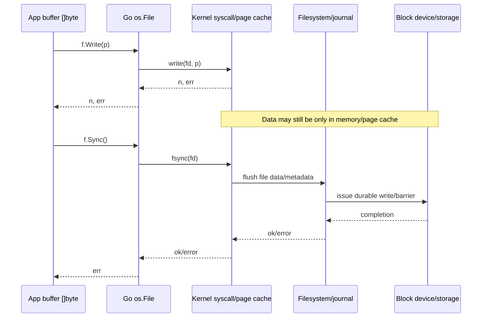
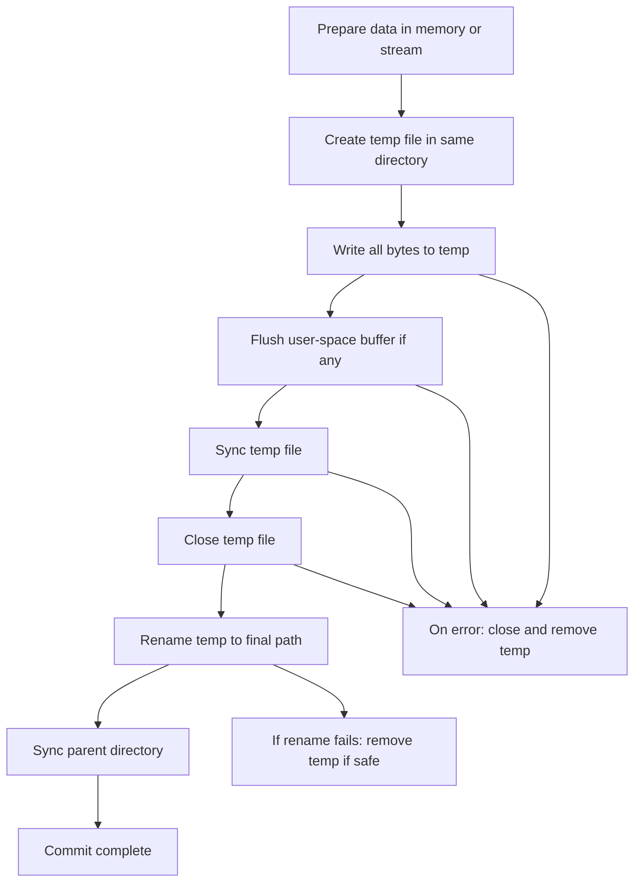
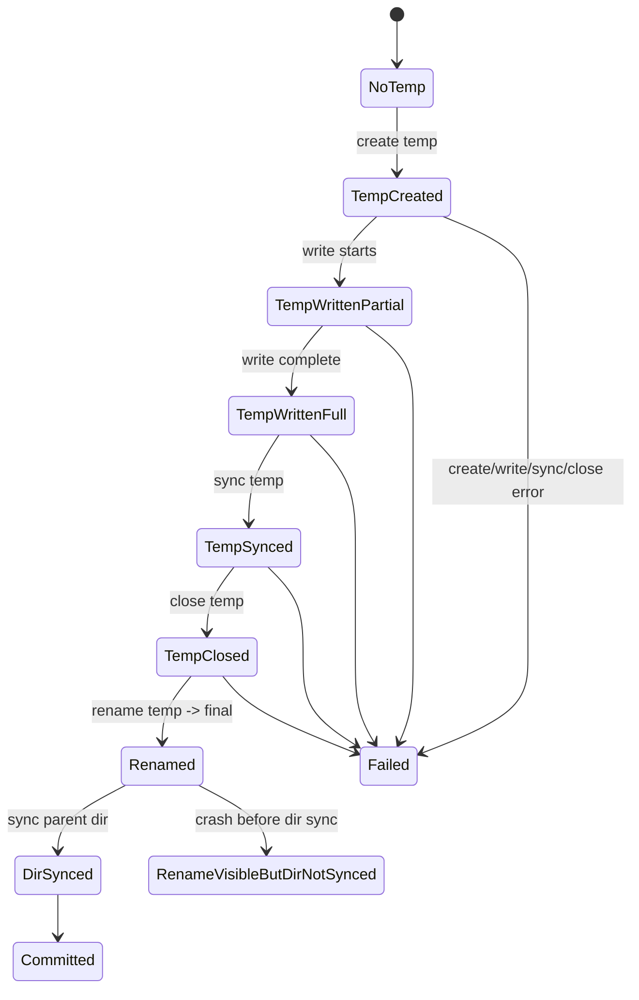
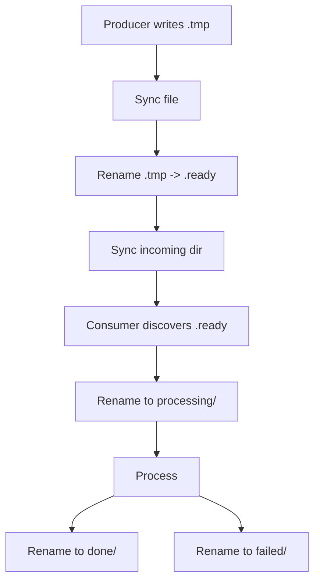
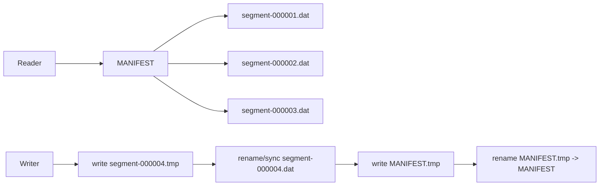
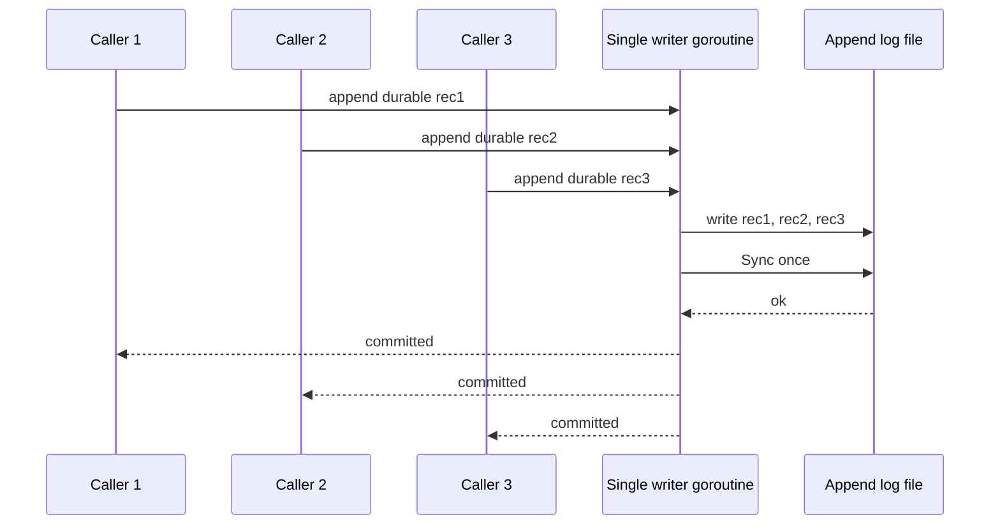
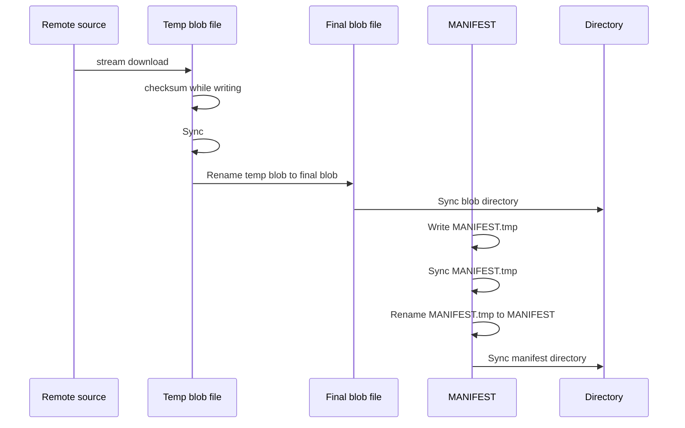

# learn-go-io-buffer-byte-stream-file-network-data-transfer-part-014.md

# Part 014 — Durable Writes: fsync, Temp-Write-Rename, Crash Consistency, Append-Only Files

> Target pembaca: Java software engineer yang ingin memahami Go IO pada level engineering handbook.
>
> Target Go: Go 1.26.x.
>
> Fokus: bukan sekadar "menulis file", tetapi memastikan data yang sudah dianggap berhasil benar-benar punya durability semantics yang sesuai kebutuhan sistem.

---

## 0. Posisi Part Ini Dalam Series

Pada part sebelumnya kita sudah membahas:

1. `os.File` sebagai handle/descriptor ke OS.
2. Operasi filesystem seperti `Stat`, `ReadDir`, `WalkDir`, `Rename`, temp files.
3. Path handling dan filesystem abstraction.
4. Large file processing dan streaming.

Sekarang kita masuk ke pertanyaan yang lebih keras:

> Setelah program memanggil `Write`, apakah data benar-benar aman?

Jawaban pendeknya: **belum tentu**.

Di Go, seperti di Java dan hampir semua runtime modern, operasi write melewati banyak lapisan:


`Write` yang sukses biasanya berarti data berhasil diserahkan ke OS, **bukan otomatis berarti data sudah persisted ke stable storage**.

Part ini membahas durable write sebagai desain sistem:

- kapan `Write` cukup;
- kapan perlu `Sync`;
- kapan perlu temp-write-rename;
- kapan rename saja tidak cukup;
- kapan perlu directory fsync;
- kapan append-only log lebih baik;
- bagaimana menangani crash di tengah write;
- bagaimana mendesain file format yang recoverable;
- bagaimana menguji durability tanpa berpura-pura semua storage ideal.

---

## 1. Core Mental Model: Visibility != Durability != Atomicity

Banyak bug filesystem muncul karena tiga konsep ini dicampur:

| Konsep | Arti | Contoh |
|---|---|---|
| Visibility | Apakah data terlihat oleh proses lain? | File hasil `Rename` muncul di path final |
| Durability | Apakah data tetap ada setelah crash/power loss? | Setelah reboot, file tetap berisi data benar |
| Atomicity | Apakah observer melihat old state atau new state, bukan half state? | Rename dari temp ke final |

Operasi bisa visible tapi belum durable.

Operasi bisa atomic secara namespace tapi data file belum durable.

Operasi bisa durable tapi tidak atomic bagi reader.

Contoh:

```go
err := os.WriteFile("config.json", data, 0o644)
```

Kode ini sederhana, dan sering cukup untuk file non-critical. Namun untuk data penting, operasi ini punya beberapa risiko:

1. File dapat terpotong/truncated lebih dulu.
2. Crash di tengah write bisa meninggalkan file partial.
3. Data mungkin belum sampai stable storage.
4. Tidak ada directory fsync setelah perubahan nama/metadata.
5. Reader lain bisa melihat state intermediate tergantung pola akses.

Mental model yang benar:

```text
Write success        = bytes accepted by file object / kernel boundary
Flush success        = user-space buffer pushed to underlying writer
File Sync success    = file content/metadata flushed to stable storage boundary
Rename success       = namespace switched, often atomic in same filesystem
Directory sync       = directory entry persisted
Application commit   = semua langkah yang dibutuhkan invariant sistem sudah selesai
```

Jadi pertanyaan production bukan "apakah `Write` return nil?", melainkan:

> Invariant apa yang harus tetap benar jika process crash, machine reboot, container restart, disk penuh, atau storage lambat tepat di tengah operasi?

---

## 2. Java Engineer Mapping

Kalau Anda datang dari Java, mapping kasar:

| Java | Go | Catatan |
|---|---|---|
| `FileOutputStream.write` | `(*os.File).Write` | Write ke file descriptor, belum tentu durable |
| `BufferedOutputStream.flush` | `bufio.Writer.Flush` | Flush user-space buffer, bukan disk sync |
| `FileDescriptor.sync` | `(*os.File).Sync` | Meminta OS flush ke stable storage |
| `Files.move(..., ATOMIC_MOVE)` | `os.Rename` | Atomicity bergantung OS/filesystem; Go API portable tapi semantics tetap OS-specific |
| `RandomAccessFile` | `os.File` + `Seek` / `ReadAt` / `WriteAt` | Offset management harus hati-hati |
| `FileChannel.force` | `(*os.File).Sync` | Mirip durability boundary |
| WAL / append log | custom append-only file | Perlu record framing + checksum + recovery |

Perbedaan penting:

Go tidak menyembunyikan kontrak IO di hierarchy besar seperti Java IO/NIO. Di Go, durability biasanya dirakit dari primitive kecil:

```text
OpenFile -> Write/WriteString -> Flush? -> Sync -> Close -> Rename -> Sync parent dir
```

Artinya programmer bertanggung jawab penuh memilih semantic boundary.

---

## 3. Paket dan API yang Relevan

Part ini terutama memakai package standar:

| Package | Peran |
|---|---|
| `os` | open file, write, sync, rename, remove, chmod, temp file |
| `io` | copy, writer abstraction, full write semantics via helper custom |
| `bufio` | buffering user-space, flush discipline |
| `path/filepath` | temp path, same-directory temp file, path joining |
| `errors` | classify error dengan `errors.Is` |
| `syscall` / `golang.org/x/sys` | OS-specific durability jika perlu lebih dalam |
| `encoding/binary` | append-only record format |
| `hash/crc32` | checksum record untuk recovery |

Dokumentasi resmi `os.File.Sync` menyatakan bahwa `Sync` commits current contents of the file to stable storage, biasanya dengan flushing filesystem in-memory copy dari recent writes ke disk. Ini adalah primitive utama durable write di Go.

---

## 4. Write Path: Dari Memory ke Storage

Mari pecah write path lebih rinci.



Poin penting:

1. `Write` bisa partial.
2. `Write` bisa berhasil tapi data masih di page cache.
3. `Close` bisa mengembalikan error; jangan abaikan untuk file penting.
4. `bufio.Writer.Flush` hanya flush buffer user-space ke underlying writer.
5. `Sync` mahal, tetapi itu harga durability.
6. `Rename` mengubah namespace, bukan otomatis men-sync content file.
7. Directory entry juga metadata yang bisa perlu persistence.

---

## 5. Basic Write: Kapan Cukup?

Untuk data non-critical, `os.WriteFile` sering cukup:

```go
package main

import (
    "log"
    "os"
)

func main() {
    data := []byte("hello\n")
    if err := os.WriteFile("out.txt", data, 0o644); err != nil {
        log.Fatal(err)
    }
}
```

Cocok untuk:

- cache yang bisa dibangun ulang;
- file temporary;
- export manual yang bisa diulang;
- test fixture;
- non-critical local output.

Tidak cukup untuk:

- konfigurasi yang tidak boleh corrupt;
- index database;
- checkpoint job;
- metadata object storage lokal;
- append-only audit trail;
- file transaksi;
- queue spool;
- manifest deployment;
- resume state yang harus recoverable.

Production heuristic:

```text
Jika file bisa hilang/corrupt tanpa melanggar invariant sistem -> simple write mungkin cukup.
Jika file menentukan correctness setelah restart -> butuh durability protocol.
```

---

## 6. Anti-Pattern: Truncate and Rewrite In Place

Pola ini sering terlihat:

```go
func SaveConfigBad(path string, data []byte) error {
    return os.WriteFile(path, data, 0o644)
}
```

Masalahnya bukan `os.WriteFile` buruk. Masalahnya semantic-nya tidak cukup untuk file critical.

Kemungkinan failure:

| Waktu crash | Hasil setelah restart |
|---|---|
| Setelah truncate sebelum write selesai | File kosong/partial |
| Setelah sebagian write | File berisi JSON rusak |
| Setelah write return nil tapi sebelum flush disk | Old/new/partial tergantung FS/storage |
| Saat disk full | File final bisa rusak jika in-place |

Untuk file konfigurasi, manifest, checkpoint, metadata kecil, biasanya lebih aman memakai:

```text
write temp file in same directory
sync temp file
close temp file
rename temp -> final
sync parent directory
```

---

## 7. Temp-Write-Rename Pattern

Ini pola utama untuk atomic replacement.



Kenapa temp file harus di directory yang sama?

1. Rename dalam filesystem yang sama biasanya atomic.
2. Menghindari cross-device rename failure.
3. Permission, mount option, dan storage boundary lebih konsisten.
4. Parent directory sync menarget directory yang benar.

Contoh implementasi sederhana:

```go
package durable

import (
    "errors"
    "fmt"
    "os"
    "path/filepath"
)

// WriteFileAtomicDurable replaces path with data using a temp-write-rename protocol.
//
// Semantic target:
//   - readers should see either the old file or the new file name, not an in-progress file;
//   - written file content is synced before rename;
//   - parent directory is synced after rename on platforms/filesystems that support it.
//
// This function is conservative and intended for small/medium critical files such as
// config, checkpoint, manifest, and metadata. It is not a universal database substitute.
func WriteFileAtomicDurable(path string, data []byte, perm os.FileMode) error {
    dir := filepath.Dir(path)
    base := filepath.Base(path)

    tmp, err := os.CreateTemp(dir, "."+base+".tmp-*")
    if err != nil {
        return fmt.Errorf("create temp file: %w", err)
    }

    tmpName := tmp.Name()
    committed := false

    defer func() {
        if !committed {
            _ = os.Remove(tmpName)
        }
    }()

    // Apply target permission before publishing. On Unix, final permissions are still
    // affected by umask at creation; Chmod makes intent explicit.
    if err := tmp.Chmod(perm); err != nil {
        _ = tmp.Close()
        return fmt.Errorf("chmod temp file: %w", err)
    }

    if _, err := tmp.Write(data); err != nil {
        _ = tmp.Close()
        return fmt.Errorf("write temp file: %w", err)
    }

    if err := tmp.Sync(); err != nil {
        _ = tmp.Close()
        return fmt.Errorf("sync temp file: %w", err)
    }

    if err := tmp.Close(); err != nil {
        return fmt.Errorf("close temp file: %w", err)
    }

    if err := os.Rename(tmpName, path); err != nil {
        return fmt.Errorf("rename temp file: %w", err)
    }

    if err := syncDir(dir); err != nil {
        return fmt.Errorf("sync parent directory: %w", err)
    }

    committed = true
    return nil
}

func syncDir(dir string) error {
    d, err := os.Open(dir)
    if err != nil {
        return fmt.Errorf("open directory: %w", err)
    }
    defer d.Close()

    if err := d.Sync(); err != nil {
        // On some platforms/filesystems, syncing a directory may be unsupported.
        // Do not silently ignore in a generic durable-write primitive. Let caller
        // decide whether this is fatal for its durability contract.
        return err
    }
    return nil
}

var ErrUnsupportedDurability = errors.New("durability operation unsupported")
```

Catatan:

- Ini bukan solusi universal lintas semua OS/filesystem/storage.
- Di Windows, rename behavior punya restriction berbeda jika target sedang dibuka oleh process lain.
- Di network filesystem, guarantee bisa berbeda.
- Di container, backing storage bisa overlay filesystem dengan durability semantics yang berbeda.
- Directory sync bisa unsupported di sebagian platform.

Tetapi pattern ini jauh lebih kuat daripada truncate-write langsung untuk banyak file critical.

---

## 8. Kenapa `Rename` Saja Tidak Cukup?

`Rename` membantu atomicity namespace:

```text
reader sees old file OR new file
not half-written temp file
```

Namun rename tidak otomatis menjawab:

```text
Apakah isi temp file sudah durable sebelum rename?
Apakah directory entry hasil rename sudah durable?
```

Crash windows:

| Langkah terakhir sebelum crash | Kemungkinan setelah restart |
|---|---|
| temp write belum sync | temp mungkin hilang/partial |
| temp sync, belum rename | final lama masih ada, temp mungkin ada |
| rename berhasil, parent dir belum sync | final bisa terlihat atau metadata rename bisa hilang tergantung FS/storage |
| parent dir sync berhasil | peluang commit durable jauh lebih kuat |

Jadi protocol yang lebih lengkap:

```text
write temp
sync temp
close temp
rename
sync directory
```

---

## 9. Close Error Tidak Boleh Selalu Diabaikan

Banyak contoh Go memakai:

```go
defer f.Close()
```

Untuk read-only file, ini biasanya baik.

Untuk write-critical file, error saat `Close` dapat membawa informasi penting. Sebagian filesystem/storage melaporkan delayed write errors saat close/sync.

Pola buruk:

```go
func SaveBad(path string, data []byte) error {
    f, err := os.Create(path)
    if err != nil {
        return err
    }
    defer f.Close() // error ignored

    _, err = f.Write(data)
    return err
}
```

Pola lebih baik:

```go
func SaveBetter(path string, data []byte) (err error) {
    f, err := os.Create(path)
    if err != nil {
        return err
    }

    defer func() {
        closeErr := f.Close()
        if err == nil && closeErr != nil {
            err = closeErr
        }
    }()

    if _, err := f.Write(data); err != nil {
        return err
    }
    if err := f.Sync(); err != nil {
        return err
    }
    return nil
}
```

Namun untuk atomic replace, jangan menulis langsung ke final path; pakai temp-write-rename.

---

## 10. `bufio.Writer`: Flush Bukan Durability

`bufio.Writer` sering dipakai untuk efisiensi:

```go
w := bufio.NewWriter(f)
w.WriteString("record\n")
w.Flush()
f.Sync()
```

Urutan penting:

```text
bufio.Writer.Flush -> pushes buffered bytes to os.File.Write
os.File.Sync       -> asks OS to persist file contents
os.File.Close      -> releases descriptor and may report delayed errors
```

Anti-pattern:

```go
w := bufio.NewWriter(f)
w.Write(data)
f.Sync()    // BUG: data may still be in bufio buffer
w.Flush()
```

Urutan benar:

```go
if err := w.Flush(); err != nil {
    return err
}
if err := f.Sync(); err != nil {
    return err
}
```

Mental model:


Flush mengubah **visibility ke underlying writer**.

Sync mengubah **durability boundary**.

---

## 11. Full Write Loop: `Write` Bisa Partial

`(*os.File).Write` biasanya menulis semua bytes atau error untuk regular file, tetapi kontrak umum `io.Writer` tetap memperbolehkan partial write.

Untuk reusable function yang menerima `io.Writer`, jangan asumsikan one write = all bytes written.

```go
func WriteFull(w io.Writer, p []byte) error {
    for len(p) > 0 {
        n, err := w.Write(p)
        if n > 0 {
            p = p[n:]
        }
        if err != nil {
            return err
        }
        if n == 0 {
            return io.ErrShortWrite
        }
    }
    return nil
}
```

Untuk `os.File`, `Write` sendiri sudah mendeteksi short write sebagai error non-nil. Namun untuk abstraction umum, explicit loop memperjelas intent.

Jika Anda memakai `io.Copy`, Go akan menangani loop read/write untuk Anda, tetapi durability tetap harus Anda tambahkan setelah copy selesai:

```go
if _, err := io.Copy(dst, src); err != nil {
    return err
}
if err := dst.Sync(); err != nil {
    return err
}
```

---

## 12. Durable Streaming Write ke Temp File

Untuk data besar, jangan `ReadAll` ke memory hanya untuk atomic write. Stream ke temp file.

```go
func CopyToFileAtomicDurable(path string, src io.Reader, perm os.FileMode) error {
    dir := filepath.Dir(path)
    base := filepath.Base(path)

    tmp, err := os.CreateTemp(dir, "."+base+".tmp-*")
    if err != nil {
        return fmt.Errorf("create temp: %w", err)
    }
    tmpName := tmp.Name()
    committed := false
    defer func() {
        if !committed {
            _ = os.Remove(tmpName)
        }
    }()

    if err := tmp.Chmod(perm); err != nil {
        _ = tmp.Close()
        return fmt.Errorf("chmod temp: %w", err)
    }

    buf := make([]byte, 256*1024)
    if _, err := io.CopyBuffer(tmp, src, buf); err != nil {
        _ = tmp.Close()
        return fmt.Errorf("copy to temp: %w", err)
    }

    if err := tmp.Sync(); err != nil {
        _ = tmp.Close()
        return fmt.Errorf("sync temp: %w", err)
    }

    if err := tmp.Close(); err != nil {
        return fmt.Errorf("close temp: %w", err)
    }

    if err := os.Rename(tmpName, path); err != nil {
        return fmt.Errorf("rename: %w", err)
    }

    if err := syncDir(dir); err != nil {
        return fmt.Errorf("sync dir: %w", err)
    }

    committed = true
    return nil
}
```

Use case:

- download artifact ke local cache;
- replace manifest besar;
- generate report besar;
- materialize snapshot;
- write object blob ke spool directory.

---

## 13. Metadata: Permission, Ownership, Timestamp

Durable write bukan hanya content. Kadang metadata juga invariant.

Contoh invariant:

```text
File final harus readable oleh service user.
File final tidak boleh world-writable.
File final harus punya extension/mtime tertentu.
File final harus executable.
```

Langkah metadata ideal dilakukan **sebelum rename** jika metadata harus terlihat bersama content baru:

```go
if err := tmp.Chmod(0o640); err != nil {
    return err
}
if err := tmp.Sync(); err != nil {
    return err
}
if err := tmp.Close(); err != nil {
    return err
}
if err := os.Rename(tmpName, final); err != nil {
    return err
}
```

Jika Anda melakukan `Chmod` setelah rename, reader bisa sempat melihat file dengan permission intermediate.

Namun metadata semantics berbeda lintas OS. Di Windows, permission bits Go tidak punya arti penuh seperti Unix. Jadi jangan desain security invariant portabel hanya dari mode bit jika target platform termasuk Windows.

---

## 14. Directory Sync

Kenapa parent directory perlu sync?

Karena `rename`, `create`, dan `unlink/remove` mengubah directory entry. File content sync memastikan isi file temp tersimpan. Tetapi rename mengubah metadata directory.

Pattern:

```go
func syncDir(dir string) error {
    d, err := os.Open(dir)
    if err != nil {
        return err
    }
    defer d.Close()
    return d.Sync()
}
```

Caveat:

1. Directory sync bisa unsupported di beberapa platform/filesystem.
2. Di Windows, behavior berbeda.
3. Di network filesystem, semantics bergantung server/protocol.
4. Di container overlay filesystem, behavior dapat berbeda dari filesystem host.

Policy engineering:

| Sistem | Directory sync failure |
|---|---|
| Database/WAL/checkpoint | fatal untuk commit |
| Local cache | log warning, continue mungkin cukup |
| Config management critical | fatal lebih aman |
| Temporary export | mungkin ignore dengan metrics |

Jangan menulis helper `AtomicWrite` yang diam-diam mengabaikan directory sync error kecuali semantic-nya jelas di nama/dokumentasi.

---

## 15. Append-Only Files: Mental Model

Atomic replace cocok untuk file state kecil/menengah.

Untuk event stream, audit, queue, atau log transaksi, sering lebih cocok append-only file.

Append-only file menyimpan sequence record:

```text
record 1
record 2
record 3
...
```

Kelebihan:

- tidak rewrite seluruh file;
- recovery bisa truncate record terakhir yang partial;
- cocok untuk WAL, audit, queue spool;
- sequential write biasanya efisien;
- bisa batch fsync.

Risiko:

- perlu framing record;
- perlu checksum;
- perlu recovery scanner;
- file tumbuh terus;
- compaction/snapshot dibutuhkan;
- append atomicity tidak otomatis untuk multi-writer;
- `O_APPEND` behavior OS-specific untuk concurrent writes.

---

## 16. Append-Only Record Format

Jangan membuat append-only file sebagai newline JSON mentah untuk data critical kecuali corruption model sudah diterima.

Format minimal:

```text
magic/version? | length | checksum | payload
```

Contoh record:

```text
uint32 length      // little endian
uint32 crc32       // checksum payload
payload bytes
```

Diagram:


Dengan format ini, recovery bisa:

1. baca length;
2. validasi length reasonable;
3. baca payload;
4. cek checksum;
5. jika EOF di tengah record, truncate ke offset record terakhir valid;
6. jika checksum mismatch, truncate ke offset record terakhir valid atau fail sesuai policy.

---

## 17. Implementasi Append Record

Contoh writer sederhana:

```go
package durable

import (
    "encoding/binary"
    "fmt"
    "hash/crc32"
    "io"
    "os"
)

const maxRecordSize = 64 << 20 // 64 MiB safety limit

type AppendLog struct {
    f *os.File
}

func OpenAppendLog(path string) (*AppendLog, error) {
    f, err := os.OpenFile(path, os.O_CREATE|os.O_APPEND|os.O_WRONLY, 0o640)
    if err != nil {
        return nil, fmt.Errorf("open append log: %w", err)
    }
    return &AppendLog{f: f}, nil
}

func (l *AppendLog) Append(payload []byte) error {
    if len(payload) > maxRecordSize {
        return fmt.Errorf("record too large: %d", len(payload))
    }

    var header [8]byte
    binary.LittleEndian.PutUint32(header[0:4], uint32(len(payload)))
    binary.LittleEndian.PutUint32(header[4:8], crc32.ChecksumIEEE(payload))

    if err := WriteFull(l.f, header[:]); err != nil {
        return fmt.Errorf("write header: %w", err)
    }
    if err := WriteFull(l.f, payload); err != nil {
        return fmt.Errorf("write payload: %w", err)
    }
    return nil
}

func (l *AppendLog) Sync() error {
    return l.f.Sync()
}

func (l *AppendLog) Close() error {
    return l.f.Close()
}

func WriteFull(w io.Writer, p []byte) error {
    for len(p) > 0 {
        n, err := w.Write(p)
        if n > 0 {
            p = p[n:]
        }
        if err != nil {
            return err
        }
        if n == 0 {
            return io.ErrShortWrite
        }
    }
    return nil
}
```

Catatan:

- Ini belum safe untuk multi-goroutine tanpa lock.
- Header dan payload ditulis dalam dua write; jika crash di tengah, recovery harus bisa truncate.
- Untuk batching, panggil `Sync` setelah beberapa record sesuai durability policy.
- Untuk strict per-record durability, panggil `Sync` setelah setiap append, tapi mahal.

---

## 18. Recovery Scanner Append Log

Recovery harus bisa membedakan:

| Kondisi | Tindakan |
|---|---|
| EOF tepat di boundary record | valid |
| EOF saat header partial | truncate ke last good offset |
| EOF saat payload partial | truncate ke last good offset |
| length terlalu besar | corrupt; truncate/fail |
| checksum mismatch | corrupt; truncate/fail |
| unexpected read error | fail |

Contoh scanner:

```go
func RecoverAppendLog(path string) (lastGoodOffset int64, err error) {
    f, err := os.Open(path)
    if err != nil {
        if os.IsNotExist(err) {
            return 0, nil
        }
        return 0, err
    }
    defer f.Close()

    var offset int64
    var header [8]byte

    for {
        n, err := io.ReadFull(f, header[:])
        if err == io.EOF {
            return offset, nil
        }
        if err == io.ErrUnexpectedEOF {
            return offset, nil
        }
        if err != nil {
            return offset, fmt.Errorf("read header at %d after %d bytes: %w", offset, n, err)
        }

        length := binary.LittleEndian.Uint32(header[0:4])
        wantCRC := binary.LittleEndian.Uint32(header[4:8])
        if length > maxRecordSize {
            return offset, nil
        }

        payload := make([]byte, int(length))
        n, err = io.ReadFull(f, payload)
        if err == io.ErrUnexpectedEOF || err == io.EOF {
            return offset, nil
        }
        if err != nil {
            return offset, fmt.Errorf("read payload at %d after %d bytes: %w", offset+8, n, err)
        }

        gotCRC := crc32.ChecksumIEEE(payload)
        if gotCRC != wantCRC {
            return offset, nil
        }

        offset += 8 + int64(length)
    }
}
```

Truncate ke last good offset:

```go
func TruncateAppendLogToLastGood(path string) error {
    off, err := RecoverAppendLog(path)
    if err != nil {
        return err
    }
    f, err := os.OpenFile(path, os.O_RDWR, 0)
    if err != nil {
        return err
    }
    defer f.Close()

    if err := f.Truncate(off); err != nil {
        return err
    }
    return f.Sync()
}
```

Recovery rule harus eksplisit:

```text
Option A: truncate damaged tail and continue.
Option B: fail startup and require operator action.
Option C: move corrupt file aside and start new log.
```

Untuk audit/security log, auto-truncate bisa berbahaya jika corruption sendiri adalah sinyal penting. Untuk local queue spool, truncate damaged tail mungkin reasonable.

---

## 19. Fsync Policy: Every Record vs Batch

`Sync` mahal karena memaksa boundary ke storage. Memanggil `Sync` setiap record bisa menurunkan throughput drastis.

Policy umum:

| Policy | Durability loss window | Throughput | Cocok untuk |
|---|---:|---:|---|
| sync every record | 0/near-0 committed records | rendah | ledger, payment, critical metadata |
| sync every N records | hingga N records | sedang | job checkpoint, queue spool |
| sync every T milliseconds | hingga T window | tinggi | analytics buffer, logs |
| sync on graceful shutdown | besar | sangat tinggi | cache, non-critical telemetry |
| never explicit sync | bergantung OS | tinggi | disposable files |

Contoh batch sync:

```go
const syncEvery = 100

var pending int
for _, rec := range records {
    if err := log.Append(rec); err != nil {
        return err
    }
    pending++
    if pending >= syncEvery {
        if err := log.Sync(); err != nil {
            return err
        }
        pending = 0
    }
}
if pending > 0 {
    if err := log.Sync(); err != nil {
        return err
    }
}
```

Pertanyaan desain:

```text
Jika process mati setelah Append return nil tetapi sebelum Sync, apakah caller boleh menganggap record committed?
```

Jawaban harus tercermin di API.

Lebih baik punya API eksplisit:

```go
type CommitMode int

const (
    CommitBuffered CommitMode = iota
    CommitDurable
)

func (l *AppendLog) Append(payload []byte, mode CommitMode) error {
    // write record
    // if mode == CommitDurable { Sync }
    return nil
}
```

---

## 20. API Design: Jangan Bohong Tentang Durability

Nama function harus mencerminkan semantic.

Buruk:

```go
func Save(path string, data []byte) error
```

Lebih jelas:

```go
func WriteFileBestEffort(path string, data []byte, perm os.FileMode) error
func WriteFileAtomic(path string, data []byte, perm os.FileMode) error
func WriteFileAtomicDurable(path string, data []byte, perm os.FileMode) error
func AppendBuffered(record []byte) error
func AppendDurable(record []byte) error
```

Bedakan:

| Nama | Janji |
|---|---|
| `WriteFileBestEffort` | convenience, tidak crash-safe |
| `WriteFileAtomic` | visibility atomic, belum tentu durable after crash |
| `WriteFileAtomicDurable` | berusaha content + namespace durable |
| `AppendBuffered` | record sudah ditulis ke stream, belum fsync |
| `AppendDurable` | record tidak return success sebelum sync success |

Di internal engineering handbook, API harus mencegah caller mengambil asumsi salah.

---

## 21. Failure Matrix Temp-Write-Rename

Desain durable write harus dianalisis sebagai state machine.



Recovery expectation:

| State saat crash | Invariant yang diharapkan |
|---|---|
| before rename | final lama masih valid; temp boleh dibersihkan |
| after rename before dir sync | final mungkin baru, tetapi durability namespace belum pasti |
| after dir sync | final baru committed |

Cleanup temp files:

```go
func CleanupStaleTemps(dir, base string) error {
    pattern := filepath.Join(dir, "."+base+".tmp-*")
    matches, err := filepath.Glob(pattern)
    if err != nil {
        return err
    }
    for _, m := range matches {
        // In production, consider age threshold and ownership marker.
        _ = os.Remove(m)
    }
    return nil
}
```

Jangan hapus sembarang temp file tanpa convention jelas. Bisa jadi file sedang ditulis process lain.

---

## 22. Locking dan Multi-Process Writers

Temp-write-rename tidak otomatis menyelesaikan masalah dua process menulis file final yang sama.

Race:

```text
P1 writes temp A
P2 writes temp B
P1 renames A -> final
P2 renames B -> final
Final = P2, P1 lost update
```

Jika hanya ada single writer, aman secara desain.

Jika multi-writer, butuh coordination:

- file lock;
- compare-and-swap via version file;
- central coordinator;
- per-writer unique file + manifest;
- database;
- append-only log dengan single writer goroutine;
- OS-specific locking via `x/sys`.

Untuk file config local, single-writer assumption sering valid.

Untuk queue spool multi-process, jangan mengandalkan rename saja tanpa protocol ownership.

---

## 23. Safe Spool Directory Pattern

Spool directory umum dipakai untuk data transfer:

```text
spool/
  incoming/
  processing/
  done/
  failed/
```

Writer membuat file di staging:

```text
incoming/.job-123.tmp
```

Setelah full write + sync + close:

```text
incoming/job-123.ready
```

Consumer hanya memproses `*.ready`.

State machine:



Keuntungan:

- consumer tidak membaca partial file;
- rename menjadi publish signal;
- recovery bisa scan directory;
- state terlihat oleh operator;
- cocok untuk batch transfer.

Risiko:

- perlu cleanup stale `.tmp`;
- perlu idempotency jika process mati saat `processing`;
- rename antar directory harus dalam filesystem sama;
- directory sync di setiap transisi bila durability penting.

---

## 24. Durable Checkpoint Pattern

Checkpoint menyimpan progress job:

```json
{
  "job_id": "import-2026-06-23",
  "source": "s3://bucket/path/file.csv",
  "offset": 104857600,
  "records_processed": 981234,
  "updated_at": "2026-06-23T10:00:00Z"
}
```

Karakteristik:

- file kecil;
- update berkala;
- harus valid setelah restart;
- old checkpoint lebih baik daripada corrupt checkpoint;
- atomic replace cocok.

Pattern:

```go
func SaveCheckpoint(path string, cp Checkpoint) error {
    data, err := json.MarshalIndent(cp, "", "  ")
    if err != nil {
        return err
    }
    data = append(data, '\n')
    return WriteFileAtomicDurable(path, data, 0o640)
}
```

Tambahkan version dan checksum jika checkpoint sangat critical:

```json
{
  "version": 1,
  "payload": {...},
  "checksum": "..."
}
```

Atau gunakan two-file manifest:

```text
checkpoint-000001.json
checkpoint-000002.json
CURRENT
```

`CURRENT` di-atomic replace menunjuk checkpoint terbaru. Ini pola yang mirip dipakai banyak storage engine.

---

## 25. Manifest + Immutable Files Pattern

Untuk dataset besar, jangan rewrite satu file besar setiap commit. Gunakan immutable file + manifest kecil.

```text
data/
  segment-000001.dat
  segment-000002.dat
  segment-000003.dat
  MANIFEST
```

Commit flow:

1. tulis segment baru;
2. sync segment;
3. tulis manifest temp;
4. sync manifest temp;
5. rename manifest temp ke `MANIFEST`;
6. sync directory.

Reader selalu mulai dari `MANIFEST`.

Manfaat:

- commit atomic hanya file kecil;
- file besar immutable, lebih mudah verify;
- recovery scan lebih sederhana;
- garbage collection bisa hapus segment yang tidak direferensikan manifest.

Diagram:



Ini lebih scalable daripada rewrite snapshot besar.

---

## 26. Crash Consistency vs Application Consistency

Crash consistency berarti filesystem state tidak berada di tengah operasi yang merusak invariant rendah.

Application consistency berarti data yang terbaca tetap valid menurut domain aplikasi.

Contoh:

```text
orders.dat synced
payments.dat not synced
manifest points to both
```

Filesystem mungkin crash-consistent, tetapi aplikasi inconsistent.

Untuk multi-file transaction, Anda butuh commit protocol:

```text
write all new files
sync all new files
write commit marker/manifest
sync commit marker
rename manifest atomically
sync directory
```

Atau gunakan database jika transaction semantics kompleks.

Jangan memaksa filesystem biasa menjadi database jika invariants Anda sudah transactional multi-entity.

---

## 27. Handling Disk Full and Quota Errors

Disk full bisa muncul saat:

- create temp file;
- write sebagian data;
- flush buffered writer;
- sync;
- close;
- rename metadata update;
- directory sync.

Jangan hanya menganggap write error muncul di `Write`.

Pattern:

```go
if _, err := io.Copy(tmp, src); err != nil {
    return fmt.Errorf("copy: %w", err)
}
if err := tmp.Sync(); err != nil {
    return fmt.Errorf("sync: %w", err)
}
if err := tmp.Close(); err != nil {
    return fmt.Errorf("close: %w", err)
}
```

Error classification:

```go
if errors.Is(err, os.ErrPermission) {
    // permission issue
}
if errors.Is(err, os.ErrNotExist) {
    // path issue
}
```

Untuk disk full (`ENOSPC`) dan quota (`EDQUOT`), Anda sering perlu platform-specific check via `syscall` atau `x/sys/unix` jika ingin classification presisi.

Operational response:

| Error | Response |
|---|---|
| permission denied | fail fast, config/ops issue |
| no such dir | create dir if expected, else fail |
| disk full | stop accepting writes, alert, preserve temp for diagnosis? |
| sync unsupported | degrade only if policy allows |
| rename cross-device | bug in temp dir selection |
| file busy | retry? only with bounded policy |

---

## 28. Observability Untuk Durable Writes

Durable write adalah IO latency hotspot. `Sync` dapat lambat dan punya tail latency tinggi.

Metrics penting:

| Metric | Makna |
|---|---|
| `durable_write_total` | jumlah write attempt |
| `durable_write_success_total` | commit berhasil |
| `durable_write_error_total{op}` | error by op: create/write/sync/close/rename/sync_dir |
| `durable_write_bytes_total` | volume data |
| `durable_write_duration_seconds` | end-to-end latency |
| `durable_write_sync_duration_seconds` | file sync latency |
| `durable_write_rename_duration_seconds` | rename latency |
| `durable_write_dir_sync_duration_seconds` | dir sync latency |
| `append_log_recovery_truncated_bytes_total` | tail corruption recovered |
| `append_log_last_good_offset` | recovery checkpoint |
| `stale_temp_files_total` | cleanup signal |

Log structured:

```json
{
  "event": "durable_write_failed",
  "path": "/var/lib/app/MANIFEST",
  "op": "sync_dir",
  "bytes": 12345,
  "duration_ms": 41,
  "error": "invalid argument"
}
```

Jangan log payload sensitive. Path juga bisa sensitive jika mengandung tenant/user id; sanitize sesuai kebutuhan.

---

## 29. Testing Durable Writes

Unit test biasa tidak bisa membuktikan power-loss durability. Tetapi bisa membuktikan state machine dan error handling.

### 29.1 Fault-injecting Writer

```go
type failAfterWriter struct {
    w     io.Writer
    limit int
    seen  int
}

func (f *failAfterWriter) Write(p []byte) (int, error) {
    if f.seen >= f.limit {
        return 0, errors.New("injected write failure")
    }
    remaining := f.limit - f.seen
    if len(p) > remaining {
        n, _ := f.w.Write(p[:remaining])
        f.seen += n
        return n, errors.New("injected partial write failure")
    }
    n, err := f.w.Write(p)
    f.seen += n
    return n, err
}
```

### 29.2 Verify Temp Cleanup

Test cases:

- create fails;
- write fails;
- sync fails;
- close fails;
- rename fails;
- dir sync fails;
- success removes temp;
- failure keeps/removes temp sesuai policy.

### 29.3 Recovery Scanner Test

Input file variants:

1. empty file;
2. one complete record;
3. many complete records;
4. partial header;
5. partial payload;
6. huge length field;
7. checksum mismatch;
8. garbage after valid records.

### 29.4 Integration Test

Gunakan `t.TempDir()`:

```go
func TestWriteFileAtomicDurable(t *testing.T) {
    dir := t.TempDir()
    path := filepath.Join(dir, "config.json")

    if err := WriteFileAtomicDurable(path, []byte(`{"v":1}`), 0o640); err != nil {
        t.Fatal(err)
    }

    got, err := os.ReadFile(path)
    if err != nil {
        t.Fatal(err)
    }
    if string(got) != `{"v":1}` {
        t.Fatalf("unexpected content: %q", got)
    }
}
```

Catatan: test ini membuktikan logic normal path, bukan durability power-loss.

---

## 30. Simulasi Crash: Apa yang Bisa dan Tidak Bisa Dibuktikan

Anda bisa mensimulasikan process crash:

- kill process setelah write sebelum sync;
- kill setelah sync sebelum rename;
- kill setelah rename sebelum dir sync;
- restart dan recovery scan.

Tetapi simulasi process crash tidak sama dengan power loss. Kernel masih bisa flush page cache setelah process mati.

Untuk menguji power-loss durability secara serius, Anda butuh environment khusus:

- VM dengan snapshot dan forced poweroff;
- filesystem test harness;
- block device fault injection;
- storage-specific testing;
- database-style crash monkey.

Untuk aplikasi biasa, cukup desain konservatif + integration test + metrics + operational playbook.

---

## 31. Performance Model

Durable write mahal karena memaksa koordinasi dengan storage.

Biaya utama:

| Operation | Biaya |
|---|---|
| many small writes | syscall overhead + fragmentation |
| `bufio.Flush` | write burst ke OS |
| `Sync` | storage barrier, tail latency |
| directory sync | metadata durability latency |
| rename | metadata operation |
| checksum | CPU proportional payload |
| compression before write | CPU + latency, bisa hemat IO |

Optimization yang benar:

1. Batch records sebelum sync.
2. Group commit beberapa caller.
3. Pakai append-only log untuk high frequency events.
4. Pakai manifest kecil untuk commit dataset besar.
5. Hindari sync untuk cache rebuildable.
6. Pakai buffer besar untuk streaming copy.
7. Pisahkan durability class per data type.

Optimization yang salah:

1. Menghapus `Sync` pada data critical demi benchmark.
2. Menganggap SSD selalu durable tanpa fsync.
3. Menggunakan `ReadAll` untuk file besar.
4. Menulis langsung ke final file agar lebih simple.
5. Mengabaikan close error.
6. Mengabaikan dir sync error tanpa policy.

---

## 32. Group Commit Pattern

Untuk append log high-throughput, banyak request bisa digabung dalam satu sync.



Ini mempertahankan semantic durable per caller, tetapi mengurangi fsync count.

Sketch:

```go
type appendRequest struct {
    payload []byte
    done    chan error
}

type GroupCommitLog struct {
    reqs chan appendRequest
}

func (g *GroupCommitLog) AppendDurable(payload []byte) error {
    done := make(chan error, 1)
    g.reqs <- appendRequest{payload: payload, done: done}
    return <-done
}
```

Writer goroutine mengumpulkan batch berdasarkan ukuran/waktu, write semua, sync sekali, lalu notify semua caller.

Detail concurrency sudah dibahas di series concurrency, jadi di sini fokusnya semantic:

```text
Caller only receives nil after batch sync succeeded.
If sync fails, all requests in batch fail.
```

---

## 33. File Format Design Untuk Crash Safety

Durability tidak cukup jika file format tidak recoverable.

Checklist file format:

| Aspek | Pertanyaan |
|---|---|
| Magic | Bisa membedakan file valid dari random bytes? |
| Version | Bisa evolve format? |
| Length | Bisa skip/read record dengan jelas? |
| Checksum | Bisa deteksi torn/corrupt record? |
| Commit marker | Bisa tahu record benar-benar committed? |
| Footer | Apakah footer membuat streaming/recovery sulit? |
| Endianness | Dinyatakan eksplisit? |
| Max size | Ada limit untuk mencegah OOM? |
| Compatibility | Reader lama tahu cara fail? |

Contoh header file:

```text
magic: 4 bytes  "GLOG"
version: uint16
flags: uint16
header_crc: uint32
```

Untuk append-only log, jangan mengandalkan footer tunggal sebagai satu-satunya source of truth karena crash bisa terjadi sebelum footer update.

Untuk snapshot immutable, footer bisa berguna jika file tidak dianggap visible sebelum full write + sync + rename.

---

## 34. Security Lens

Durable write bersentuhan dengan security:

1. Temp file name harus tidak predictable secara unsafe.
2. Temp file harus dibuat di directory yang sama dan trusted.
3. Jangan follow symlink user-controlled untuk target sensitive.
4. Permission harus minimal.
5. Jangan menulis secret ke world-readable file.
6. Jangan log secret path/payload.
7. Jangan extract archive lalu atomic replace tanpa path validation.
8. Jangan cleanup temp file berbasis glob terlalu luas.
9. Jangan expose partial file ke consumer.
10. Jangan percaya network filesystem semantics tanpa validasi.

Untuk path user-controlled, gabungkan dengan teknik dari Part 011:

- lexical validation;
- root-contained open jika tersedia;
- reject absolute path;
- reject traversal;
- avoid symlink race jika threat model mencakup local attacker.

---

## 35. Container dan Cloud Storage Reality

Di Kubernetes/container, filesystem sering bukan disk lokal biasa.

Kemungkinan backing:

- container writable layer;
- emptyDir;
- hostPath;
- PVC block storage;
- network filesystem;
- object storage mounted via FUSE;
- ephemeral storage dengan eviction policy.

Durability assumption berubah:

| Storage | Catatan |
|---|---|
| container writable layer | hilang saat container recreated; jangan untuk state critical |
| `emptyDir` | lifetime pod; node crash bisa hilang tergantung medium |
| PVC block | lebih cocok untuk state, tapi fsync latency penting |
| NFS/EFS-like | semantics dan latency berbeda |
| FUSE object mount | rename/fsync semantics bisa mengejutkan |
| object storage API | bukan POSIX filesystem; butuh multipart/etag/commit model |

Jangan menyimpulkan dari local dev machine ke production.

Operational question:

```text
Apa backing storage path /var/lib/myapp di production?
Apakah fsync meaningful?
Apakah rename atomic?
Apakah directory sync supported?
Apa yang terjadi saat pod rescheduled?
```

---

## 36. Practical Decision Matrix

| Use case | Pattern recommended |
|---|---|
| temporary scratch | `os.CreateTemp`, best-effort cleanup |
| local cache rebuildable | simple write atau atomic non-durable |
| config file | temp-write-sync-close-rename-syncdir |
| checkpoint | atomic durable write, versioned payload |
| job spool | temp `.tmp` then rename `.ready`, sync transitions |
| audit event | append-only log + checksum + sync policy |
| high-throughput queue | single writer + group commit + recovery |
| dataset snapshot | immutable files + manifest atomic durable replace |
| multi-file transaction | manifest/commit marker or database |
| object/blob store | content-addressed immutable blobs + durable manifest |

---

## 37. Production-Grade Durable Write Helper

Berikut versi helper yang lebih lengkap dengan option.

```go
package durable

import (
    "fmt"
    "io"
    "os"
    "path/filepath"
)

type WriteOptions struct {
    Perm          os.FileMode
    SyncFile      bool
    SyncDirectory bool
    BufferSize    int
}

func DefaultDurableWriteOptions() WriteOptions {
    return WriteOptions{
        Perm:          0o640,
        SyncFile:      true,
        SyncDirectory: true,
        BufferSize:    256 * 1024,
    }
}

func ReplaceFileFromReader(path string, src io.Reader, opt WriteOptions) error {
    if opt.Perm == 0 {
        opt.Perm = 0o640
    }
    if opt.BufferSize <= 0 {
        opt.BufferSize = 256 * 1024
    }

    dir := filepath.Dir(path)
    base := filepath.Base(path)

    tmp, err := os.CreateTemp(dir, "."+base+".tmp-*")
    if err != nil {
        return fmt.Errorf("create temp: %w", err)
    }

    tmpName := tmp.Name()
    committed := false

    defer func() {
        if !committed {
            _ = os.Remove(tmpName)
        }
    }()

    if err := tmp.Chmod(opt.Perm); err != nil {
        _ = tmp.Close()
        return fmt.Errorf("chmod temp: %w", err)
    }

    buf := make([]byte, opt.BufferSize)
    if _, err := io.CopyBuffer(tmp, src, buf); err != nil {
        _ = tmp.Close()
        return fmt.Errorf("copy temp: %w", err)
    }

    if opt.SyncFile {
        if err := tmp.Sync(); err != nil {
            _ = tmp.Close()
            return fmt.Errorf("sync temp: %w", err)
        }
    }

    if err := tmp.Close(); err != nil {
        return fmt.Errorf("close temp: %w", err)
    }

    if err := os.Rename(tmpName, path); err != nil {
        return fmt.Errorf("rename temp to final: %w", err)
    }

    if opt.SyncDirectory {
        if err := syncDir(dir); err != nil {
            return fmt.Errorf("sync parent directory: %w", err)
        }
    }

    committed = true
    return nil
}
```

Design choice:

- `SyncFile` dan `SyncDirectory` dibuat eksplisit.
- Default konservatif.
- Nama `ReplaceFileFromReader` menjelaskan semantic replace.
- Caller bisa memilih best-effort dengan option, bukan helper diam-diam downgrade.

---

## 38. Case Study: Durable Local Manifest Untuk File Transfer Service

Bayangkan service melakukan transfer file besar:

```text
remote object -> local staging -> verified blob -> manifest update
```

Invariant:

1. Consumer tidak boleh membaca blob partial.
2. Manifest tidak boleh menunjuk blob yang belum durable.
3. Setelah restart, service bisa melanjutkan atau cleanup.
4. Old manifest tetap valid jika update gagal.

Protocol:



Failure handling:

| Failure | Recovery |
|---|---|
| temp blob exists | delete if stale |
| final blob exists but not in manifest | garbage collect later |
| manifest old | use old valid state |
| manifest corrupt | fall back to previous version if available |
| checksum mismatch | discard blob |

Ini pattern yang jauh lebih kuat daripada:

```text
download directly to final path
update manifest with simple WriteFile
```

---

## 39. Common Anti-Patterns

### 39.1 `defer f.Close()` untuk writer critical tanpa cek error

Masalah: close error hilang.

### 39.2 `bufio.Flush` dianggap sama dengan durable

Masalah: flush hanya user-space buffer.

### 39.3 `os.WriteFile` untuk overwrite config critical

Masalah: partial/corrupt file setelah crash.

### 39.4 Temp file di `/tmp`, final di mount lain

Masalah: rename cross-device gagal atau tidak atomic.

### 39.5 Rename tanpa sync file

Masalah: namespace atomic, content belum tentu durable.

### 39.6 Rename tanpa sync directory untuk critical commit

Masalah: directory entry durability belum kuat.

### 39.7 Append log tanpa checksum

Masalah: cannot distinguish valid tail from torn/corrupt tail.

### 39.8 Infinite retry on disk full

Masalah: memperburuk pressure dan menyembunyikan incident.

### 39.9 Silent downgrade saat fsync unsupported

Masalah: caller mengira durable padahal tidak.

### 39.10 Satu helper `Save` untuk semua data class

Masalah: cache, config, audit, checkpoint punya durability need berbeda.

---

## 40. Checklist Desain Durable Write

Gunakan checklist ini sebelum menulis file critical.

### Data Classification

- [ ] Apakah file bisa diregenerate?
- [ ] Apakah corruption acceptable?
- [ ] Apakah old state lebih baik daripada partial new state?
- [ ] Apakah record loss window boleh ada?
- [ ] Apakah multi-file consistency dibutuhkan?

### Write Protocol

- [ ] Apakah menulis ke temp file di directory yang sama?
- [ ] Apakah semua bytes ditulis penuh?
- [ ] Apakah user-space buffer di-flush?
- [ ] Apakah file di-sync sebelum publish?
- [ ] Apakah file di-close dan close error dicek?
- [ ] Apakah rename dilakukan setelah content siap?
- [ ] Apakah parent directory di-sync jika critical?
- [ ] Apakah temp file dibersihkan saat gagal?

### Recovery

- [ ] Apa yang terjadi jika crash sebelum rename?
- [ ] Apa yang terjadi jika crash setelah rename sebelum dir sync?
- [ ] Apa yang terjadi jika ada stale temp file?
- [ ] Apakah reader bisa membedakan complete vs partial file?
- [ ] Apakah append log bisa truncate damaged tail?

### Observability

- [ ] Ada metric sync latency?
- [ ] Ada metric error per operation?
- [ ] Ada log op-level tanpa payload sensitive?
- [ ] Ada alert disk full/quota?
- [ ] Ada startup recovery log?

### Platform

- [ ] Apakah filesystem lokal, network, overlay, FUSE, object mount?
- [ ] Apakah directory sync supported?
- [ ] Apakah rename semantic sesuai?
- [ ] Apakah permission bits meaningful di OS target?
- [ ] Apakah container storage persistent?

---

## 41. Latihan

### Latihan 1 — Atomic Config Writer

Buat package:

```go
package configstore

func SaveJSON(path string, v any) error
func LoadJSON(path string, v any) error
```

Syarat:

- marshal JSON dengan newline;
- write atomic durable;
- reject file lebih besar dari limit saat load;
- preserve old valid file jika save gagal;
- test write failure injection.

### Latihan 2 — Append Log Dengan Recovery

Buat append log:

```go
type Log struct { ... }
func Open(path string) (*Log, error)
func (l *Log) Append(payload []byte) error
func (l *Log) AppendDurable(payload []byte) error
func Recover(path string) error
```

Syarat:

- record length + crc32;
- max record size;
- recovery truncate tail partial;
- test partial header/payload/checksum mismatch.

### Latihan 3 — Spool Directory

Buat spooler:

```go
func Publish(dir string, name string, src io.Reader) error
func ListReady(dir string) ([]string, error)
func Claim(dir string, name string) error
func MarkDone(dir string, name string) error
func MarkFailed(dir string, name string, reason error) error
```

Syarat:

- producer publish via `.tmp` -> `.ready`;
- consumer claim via rename ke `processing`;
- no partial read;
- startup cleanup stale temp;
- bounded retries.

### Latihan 4 — Manifest Dataset

Buat layout:

```text
dataset/
  objects/
  manifests/
  CURRENT
```

Commit new version dengan:

1. write object immutable;
2. write manifest versioned;
3. atomic durable replace `CURRENT`.

Diskusikan recovery jika object ada tapi manifest belum menunjuknya.

---

## 42. Ringkasan Mental Model

Durable write bukan satu API. Durable write adalah protocol.

```text
Correctness = write protocol + file format + recovery + platform assumptions + observability
```

Prinsip utama:

1. `Write` bukan durability.
2. `Flush` bukan durability.
3. `Sync` adalah durability boundary file.
4. `Rename` memberi atomic namespace replacement, bukan otomatis full durability.
5. Directory entry juga perlu dipikirkan.
6. Close error penting untuk writer critical.
7. Append-only butuh framing + checksum + recovery.
8. API harus jujur soal commit semantics.
9. Data class berbeda butuh durability policy berbeda.
10. Jangan mendesain filesystem protocol tanpa failure matrix.

---

## 43. Preview Part 015

Part berikutnya akan masuk ke:

```text
Binary encoding: endian, varint, fixed-width fields, framing, versioned records
```

Kita akan membahas bagaimana mendesain format binary yang:

- deterministic;
- portable;
- streaming-friendly;
- versioned;
- bounded;
- recoverable;
- aman dari malformed input;
- cocok untuk file, network protocol, WAL, dan data transfer.

Part 014 selesai. Series belum selesai.

<!-- NAVIGATION_FOOTER -->
<div class="page-nav">
<a href="./learn-go-io-buffer-byte-stream-file-network-data-transfer-part-013.md">⬅️ Part 013 — Large File Processing: Chunking, Streaming, Seek, Random Access, dan Resumable Reads</a>
<a href="./index.md">📚 Kategori</a>
<a href="../../index.md">🏠 Home</a>
<a href="./learn-go-io-buffer-byte-stream-file-network-data-transfer-part-015.md">Part 015 — Binary Encoding: Endian, Varint, Fixed-Width Fields, Framing, dan Versioned Records ➡️</a>
</div>
