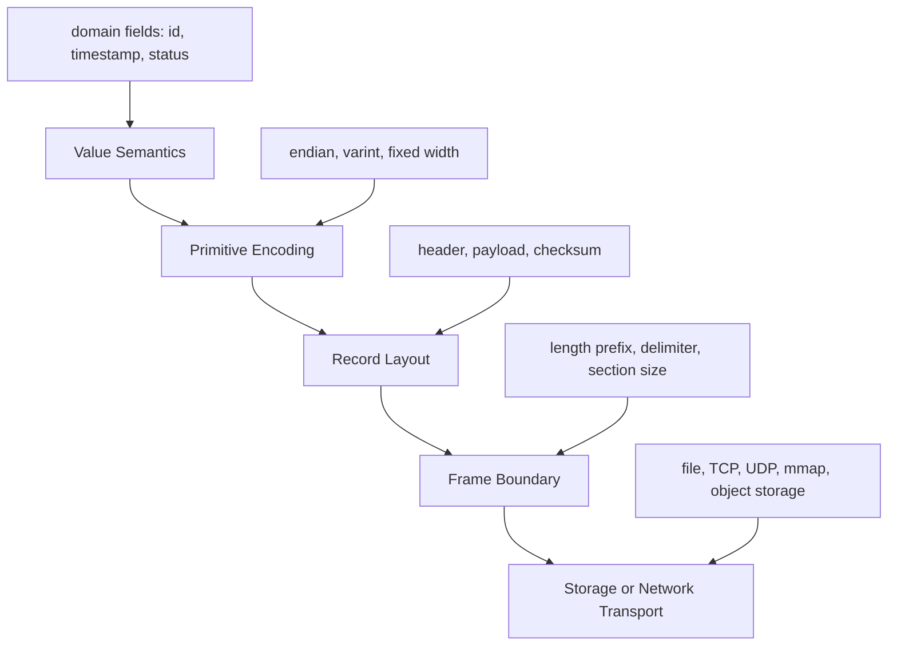
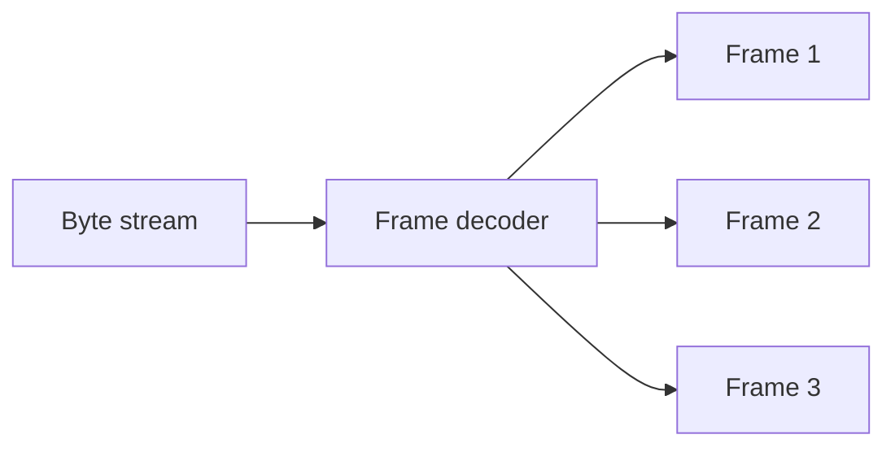
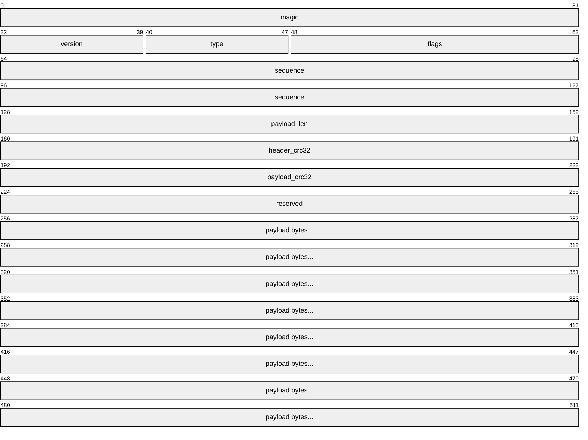
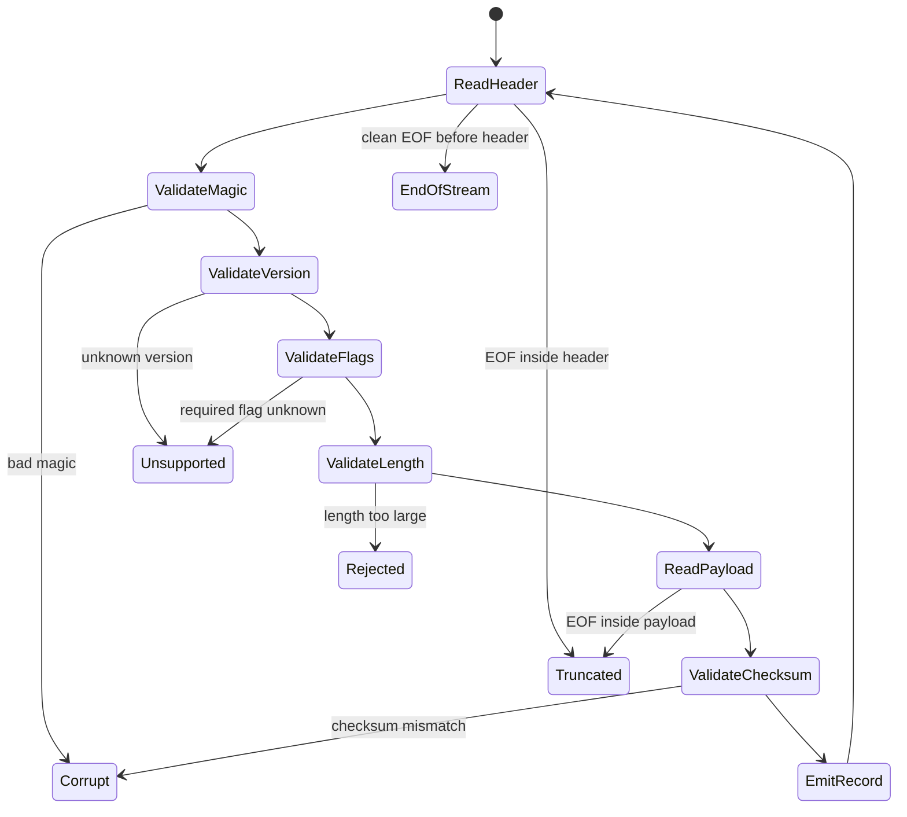
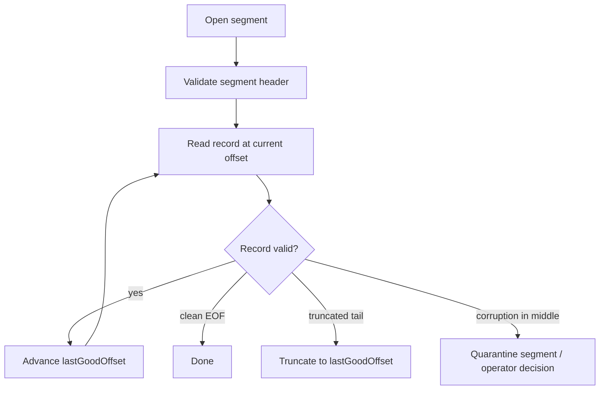

# learn-go-io-buffer-byte-stream-file-network-data-transfer-part-015.md

# Part 015 — Binary Encoding: Endian, Varint, Fixed-Width Fields, Framing, dan Versioned Records

> Target: Go 1.26.x  
> Audience: Java software engineer yang ingin memahami Go IO sampai level internal engineering handbook.  
> Posisi dalam seri: setelah large file processing dan durable writes; sebelum standard serialization (`json`, `xml`, `csv`, `gob`, `binary`, `base64`, `hex`) dan protocol design.

---

## 0. Tujuan Part Ini

Part sebelumnya membahas file besar dan durable write. Di sana kita sudah melihat bahwa data yang ditulis ke file atau dikirim ke socket tidak boleh diperlakukan sebagai “object magically serialized”. Pada boundary IO, semua berubah menjadi byte.

Part ini menjawab pertanyaan yang lebih rendah level:

> Kalau kita harus menyimpan atau mengirim data sebagai byte, bagaimana kita merancang format binary yang stabil, efisien, aman, dan bisa berevolusi?

Di Java, Anda mungkin pernah memakai `ByteBuffer`, `DataInputStream`, `DataOutputStream`, Netty `ByteBuf`, Protobuf, Avro, Kryo, Java serialization, custom WAL record, atau binary protocol. Di Go, mental modelnya lebih eksplisit:

```text
value in memory
  ↓ encode
byte sequence
  ↓ frame / persist / transfer
file / socket / buffer
  ↓ parse / validate
value in memory
```

Part ini bukan hanya membahas `encoding/binary`. Kita akan membahas desain format binary: endian, varint, fixed-width fields, framing, checksum, versioning, compatibility, defensive parsing, dan test strategy.

---

## 1. Apa Itu Binary Encoding?

Binary encoding adalah proses mengubah nilai menjadi representasi byte yang punya aturan tetap.

Contoh nilai:

```text
UserID       = 42
CreatedAtNs  = 1712345678123456789
Status       = 3
Payload      = []byte("hello")
```

Bisa di-encode menjadi layout binary:

```text
+--------+------------+--------+--------------+---------+
| magic  | version    | userID | payload_len  | payload |
| 4 byte | 1 byte     | 8 byte | 4 byte       | N byte  |
+--------+------------+--------+--------------+---------+
```

Yang penting: binary encoding bukan hanya “convert struct to bytes”. Binary encoding adalah **contract**.

Contract itu harus menjawab:

1. Urutan field apa?
2. Ukuran setiap field berapa?
3. Endian apa?
4. Nilai signed pakai representasi apa?
5. String/payload panjangnya ditentukan bagaimana?
6. Versi format disimpan di mana?
7. Bagaimana parser tahu record selesai?
8. Bagaimana parser tahu data corrupt?
9. Bagaimana field baru ditambahkan tanpa memecahkan reader lama?
10. Bagaimana parser menolak input hostile tanpa OOM atau infinite loop?

---

## 2. Binary Encoding vs Serialization Framework

Jangan campuradukkan dua level ini.

| Level | Contoh | Fokus |
|---|---|---|
| Primitive binary encoding | endian integer, varint, length-prefix | byte-level correctness |
| Record layout | header, body, checksum, tombstone | storage/protocol structure |
| Serialization framework | JSON, Protobuf, CBOR, Avro, Gob | schema/value mapping |
| Transfer protocol | HTTP, TCP frame, WAL, replication frame | message boundary + operational semantics |

Part ini fokus pada dua level pertama.

Serialization framework akan masuk part 016 dan 017. Protocol design lebih luas akan masuk part 018.

---

## 3. Kenapa Binary Format Sulit?

Karena binary format jarang gagal secara bersih.

Text format sering gagal seperti:

```text
invalid JSON at byte 23
```

Binary format bisa gagal seperti:

```text
read length = 3_221_225_472
allocate 3GB
OOM
process killed
```

Atau:

```text
reader lama membaca field baru sebagai length
parser offset bergeser
semua record berikutnya terlihat corrupt
```

Atau:

```text
little endian writer dibaca big endian reader
length 64 menjadi 1_073_741_824
```

Binary format production-grade harus berpikir seperti filesystem, network protocol, dan security parser sekaligus.

---

## 4. Mental Model Utama

Binary format terdiri dari empat lapisan:



Kalau format rusak, debug harus bisa menjawab di lapisan mana rusaknya:

| Gejala | Kemungkinan lapisan rusak |
|---|---|
| field angka salah besar | endian / signedness |
| parser stuck | frame boundary |
| EOF tengah record | transport/storage partial write |
| reader lama gagal baca file baru | versioning / compatibility |
| OOM saat decode | length validation |
| checksum mismatch | corruption / wrong bytes / torn write |
| record setelah satu record corrupt ikut gagal | resynchronization design buruk |

---

## 5. Go Package Map untuk Binary Encoding

Paket standar yang relevan:

| Package | Peran |
|---|---|
| `encoding/binary` | fixed-size number encoding, byte order, varint |
| `bytes` | in-memory byte buffer/reader |
| `io` | stream abstraction, `ReadFull`, `LimitReader`, `ReaderAt`, `SectionReader` |
| `hash/crc32`, `hash/crc64` | checksum non-cryptographic |
| `crypto/hmac`, `crypto/sha256` | integrity/authenticity bila threat model membutuhkan tamper detection |
| `compress/*` | compression layer, dibahas lebih lanjut part 019 |
| `encoding/base64`, `encoding/hex` | textual representation dari bytes, dibahas part 016 |

`encoding/binary` adalah package utama part ini. Package tersebut menyediakan translasi sederhana antara number dan byte sequence, termasuk fixed-size values dan varints.

---

## 6. Fixed-Width Encoding

Fixed-width berarti ukuran field selalu sama.

Contoh:

| Type | Ukuran |
|---|---:|
| `uint8` | 1 byte |
| `uint16` | 2 byte |
| `uint32` | 4 byte |
| `uint64` | 8 byte |
| `int64` | 8 byte |
| `float64` | 8 byte |

Contoh record sederhana:

```text
Offset  Size  Field
0       4     magic
4       1     version
5       1     flags
6       2     header_len
8       8     created_at_unix_ns
16      8     user_id
24      4     payload_len
28      N     payload
```

Keunggulan fixed-width:

1. Cepat dibaca.
2. Offset bisa dihitung langsung.
3. Cocok untuk random access.
4. Cocok untuk index file, page format, WAL header, network fixed header.
5. Lebih mudah dianalisis dengan hex dump.

Kekurangan:

1. Boros untuk angka kecil.
2. Perlu reserved bytes jika ingin evolusi format.
3. Field optional sulit tanpa presence bitmap/flags.
4. Layout harus sangat disiplin.

---

## 7. Endianness

Endian menentukan urutan byte untuk angka multi-byte.

Misal `uint32(0x01020304)`:

```text
BigEndian:    01 02 03 04
LittleEndian: 04 03 02 01
```

Go menyediakan:

```go
binary.BigEndian
binary.LittleEndian
binary.NativeEndian
```

Untuk file/protocol yang harus portable, pilih eksplisit `BigEndian` atau `LittleEndian`. Jangan memakai native endian untuk format yang keluar dari satu proses/mesin, karena native endian mengikat format ke arsitektur runtime.

### 7.1 Big Endian

Big endian sering disebut network byte order. Banyak protocol jaringan historis memakai big endian.

Kelebihan:

1. Natural untuk dibaca di hex dump karena byte paling signifikan muncul dulu.
2. Umum untuk protocol network.
3. Lexicographic ordering kadang cocok untuk encoded unsigned integer fixed-width.

Contoh:

```go
var b [8]byte
binary.BigEndian.PutUint64(b[:], 42)
```

### 7.2 Little Endian

Little endian umum di CPU modern seperti x86-64.

Kelebihan:

1. Cocok dengan banyak mesin modern.
2. Sering digunakan dalam file format modern/performance-oriented.
3. Bisa lebih natural untuk beberapa operasi low-level lokal.

Contoh:

```go
var b [8]byte
binary.LittleEndian.PutUint64(b[:], 42)
```

### 7.3 Rule of Thumb

| Format | Rekomendasi |
|---|---|
| Network protocol custom | Big endian atau dokumentasikan little endian secara eksplisit |
| File format internal satu sistem | Little endian boleh, asalkan dikunci di spec |
| Cross-language file format | Hindari native endian; pilih satu dan test lintas bahasa |
| Key encoding untuk sorted byte order | Big endian untuk unsigned fixed-width jika perlu lexical order |
| Performance-only local scratch | Little endian bisa masuk akal, tapi tetap tulis di spec |

### 7.4 Kesalahan Umum

Kesalahan paling fatal bukan memilih big/little. Kesalahan fatal adalah **tidak menyebutkan endian dalam spec**.

---

## 8. Manual Encoding dengan `PutUint*`

Untuk hot path, sering lebih jelas memakai fixed buffer dan `PutUint*`.

```go
package record

import (
    "encoding/binary"
    "errors"
)

const HeaderSize = 24

const Magic uint32 = 0x4b56344a // "KV4J" as an example marker

type Header struct {
    Version   uint8
    Flags     uint8
    HeaderLen uint16
    Timestamp uint64
    PayloadN  uint32
    CRC32     uint32
}

func EncodeHeader(dst []byte, h Header) error {
    if len(dst) < HeaderSize {
        return errors.New("record header: destination too small")
    }

    binary.BigEndian.PutUint32(dst[0:4], Magic)
    dst[4] = h.Version
    dst[5] = h.Flags
    binary.BigEndian.PutUint16(dst[6:8], h.HeaderLen)
    binary.BigEndian.PutUint64(dst[8:16], h.Timestamp)
    binary.BigEndian.PutUint32(dst[16:20], h.PayloadN)
    binary.BigEndian.PutUint32(dst[20:24], h.CRC32)
    return nil
}

func DecodeHeader(src []byte) (Header, error) {
    if len(src) < HeaderSize {
        return Header{}, errors.New("record header: source too small")
    }
    if got := binary.BigEndian.Uint32(src[0:4]); got != Magic {
        return Header{}, errors.New("record header: bad magic")
    }

    h := Header{
        Version:   src[4],
        Flags:     src[5],
        HeaderLen: binary.BigEndian.Uint16(src[6:8]),
        Timestamp: binary.BigEndian.Uint64(src[8:16]),
        PayloadN:  binary.BigEndian.Uint32(src[16:20]),
        CRC32:     binary.BigEndian.Uint32(src[20:24]),
    }
    return h, nil
}
```

Keunggulan pendekatan ini:

1. Tidak ada reflection.
2. Layout terlihat jelas.
3. Offset eksplisit.
4. Mudah diaudit.
5. Mudah dibuat kompatibel lintas bahasa.
6. Cocok untuk parser defensif.

Kekurangan:

1. Offset manual rawan salah.
2. Butuh test golden hex.
3. Evolusi format perlu discipline.

---

## 9. `binary.Read` dan `binary.Write`

`encoding/binary` juga menyediakan `Read`/`Write` untuk fixed-size values.

Contoh:

```go
type FileHeader struct {
    Magic     uint32
    Version   uint16
    Flags     uint16
    CreatedNs uint64
}

func writeHeader(w io.Writer, h FileHeader) error {
    return binary.Write(w, binary.BigEndian, h)
}

func readHeader(r io.Reader) (FileHeader, error) {
    var h FileHeader
    if err := binary.Read(r, binary.BigEndian, &h); err != nil {
        return FileHeader{}, err
    }
    return h, nil
}
```

Namun, untuk production binary format, ada beberapa caveat.

### 9.1 Struct Layout Go Bukan Wire Spec

Walaupun `binary.Write` bisa menulis struct fixed-size, jangan jadikan struct memory layout sebagai spec tanpa berpikir.

Alasannya:

1. Field order memang mengikuti struct field order, tetapi wire spec tetap harus eksplisit.
2. Padding Go tidak otomatis menjadi “contract bisnis”.
3. Field bool/array/struct punya aturan fixed-size tertentu.
4. Field non-fixed-size seperti slice/string tidak bisa langsung diperlakukan seperti fixed field.
5. Evolusi struct bisa tidak sengaja mengubah wire format.

Untuk format jangka panjang, lebih aman menulis encoder/decoder eksplisit dengan offset.

### 9.2 Kapan `binary.Read/Write` Masuk Akal?

| Use case | Cocok? | Catatan |
|---|---:|---|
| Tooling internal sementara | Ya | cepat dibuat |
| Membaca header fixed dari spec eksternal | Kadang | pastikan field fixed-size dan test golden |
| Hot path storage engine | Biasanya tidak | manual offset lebih predictable |
| Network protocol public | Hindari sebagai spec utama | tulis explicit encoder |
| Test helper | Ya | asal tidak menyembunyikan wire contract |

---

## 10. Varint

Varint menyimpan integer dengan jumlah byte variabel. Angka kecil memakai sedikit byte; angka besar memakai lebih banyak.

Go menyediakan fungsi seperti:

```go
binary.PutUvarint
binary.Uvarint
binary.ReadUvarint
binary.PutVarint
binary.Varint
binary.ReadVarint
```

### 10.1 Uvarint

Unsigned varint cocok untuk:

1. Length.
2. ID yang non-negative.
3. Count.
4. Offset jika nilainya tidak terlalu besar.
5. Field number/tag dalam TLV-like format.

Contoh:

```go
func AppendUvarint(dst []byte, x uint64) []byte {
    var buf [binary.MaxVarintLen64]byte
    n := binary.PutUvarint(buf[:], x)
    return append(dst, buf[:n]...)
}
```

Decode dari byte slice:

```go
func DecodeUvarint(src []byte) (value uint64, consumed int, err error) {
    v, n := binary.Uvarint(src)
    switch {
    case n > 0:
        return v, n, nil
    case n == 0:
        return 0, 0, io.ErrUnexpectedEOF
    default:
        return 0, 0, errors.New("uvarint overflow")
    }
}
```

Di `binary.Uvarint`, nilai `n == 0` berarti buffer terlalu kecil; `n < 0` berarti overflow.

### 10.2 Signed Varint

Signed varint Go memakai encoding untuk signed integer. Jika Anda mendesain format lintas bahasa, jangan hanya menulis “varint”. Tulis detail:

```text
signed integer is encoded with Go-compatible binary.PutVarint / binary.Varint semantics
```

Atau pilih format eksplisit seperti ZigZag varint jika ingin kompatibilitas dengan ekosistem Protobuf-like.

### 10.3 Varint Trade-Off

| Aspek | Fixed-width | Varint |
|---|---:|---:|
| Ukuran angka kecil | Lebih besar | Lebih kecil |
| Decode speed | Sangat predictable | Loop per byte |
| Random offset | Mudah | Sulit |
| Corruption recovery | Lebih mudah | Bisa sulit |
| Hex inspection | Mudah | Sedang |
| Branching | Rendah | Lebih tinggi |
| Cocok untuk length? | Ya | Ya, asal bounded |
| Cocok untuk index page? | Ya | Kadang, tergantung layout |

### 10.4 Varint Security Rule

Varint length dari input tidak boleh langsung dipakai untuk allocate.

Buruk:

```go
n, err := binary.ReadUvarint(r)
if err != nil {
    return err
}
buf := make([]byte, n) // dangerous: attacker controls n
_, err = io.ReadFull(r, buf)
```

Lebih aman:

```go
const MaxPayload = 16 << 20 // 16 MiB

n, err := binary.ReadUvarint(r)
if err != nil {
    return err
}
if n > MaxPayload {
    return fmt.Errorf("payload too large: %d > %d", n, MaxPayload)
}
buf := make([]byte, int(n))
_, err = io.ReadFull(r, buf)
```

---

## 11. Fixed Header + Variable Payload

Banyak format production memakai pola:

```text
fixed header
variable payload
optional checksum/footer
```

Contoh:

```text
+-----------------+-----------------+-----------------+
| fixed header    | payload         | optional footer |
+-----------------+-----------------+-----------------+
```

Header fixed membuat parser bisa mengambil keputusan sebelum membaca payload.

Header biasanya berisi:

| Field | Fungsi |
|---|---|
| magic | identifikasi format |
| version | kompatibilitas |
| flags | optional behavior |
| header_len | extensible header |
| payload_len | bounded read |
| type | jenis record/message |
| sequence | ordering/dedup/replay |
| checksum | corruption detection |

---

## 12. Magic Number

Magic number adalah marker awal format.

Contoh:

```text
"KVIO" = 4b 56 49 4f
```

Gunanya:

1. Cepat mendeteksi file/protocol salah.
2. Membantu debugging hex dump.
3. Membantu resync saat parsing stream corrupt.
4. Mencegah reader lama membaca format yang tidak dikenal sebagai data valid.

Magic sebaiknya:

1. Cukup panjang, umumnya 4 atau 8 byte.
2. Unik untuk format Anda.
3. Tidak mudah tertukar dengan payload umum.
4. Terdokumentasi dalam hex dan ASCII.

Contoh:

```go
const Magic uint32 = 0x4b56494f // KVIO
```

---

## 13. Version Field

Version field menentukan aturan decode.

Ada beberapa model versioning.

### 13.1 Single Format Version

```text
version = 1
```

Sederhana, cocok untuk format kecil.

Masalah: setiap perubahan harus ditentukan apakah breaking atau compatible.

### 13.2 Major/Minor Version

```text
major = 1
minor = 3
```

Aturan umum:

| Perubahan | Version |
|---|---|
| tambah optional field yang bisa di-skip | minor |
| ubah makna field lama | major |
| ubah endian/layout | major |
| tambah record type baru | minor jika reader lama bisa skip |

### 13.3 Feature Flags

```text
flags bit 0 = compressed
flags bit 1 = encrypted
flags bit 2 = has extension section
```

Feature flags cocok jika variasi behavior orthogonal.

Namun flags harus dibagi:

| Jenis flag | Reader lama boleh? |
|---|---|
| optional/ignorable | boleh skip |
| critical/required | harus fail jika tidak mengerti |

Pattern umum:

```text
required_flags
optional_flags
```

Reader harus gagal jika `required_flags` mengandung bit yang tidak dikenal.

---

## 14. Length Prefix

Length prefix menyimpan ukuran payload sebelum payload.

```text
+-------------+---------+
| length = 5  | hello   |
+-------------+---------+
```

Length bisa fixed-width atau varint.

### 14.1 Fixed-Length Prefix

```text
uint32 payload_len big endian
```

Kelebihan:

1. Cepat.
2. Fixed offset.
3. Mudah pakai `ReadFull`.
4. Mudah debug.

Kekurangan:

1. Boros untuk payload kecil.
2. Harus pilih ukuran maksimum dari awal.

### 14.2 Varint Length Prefix

Kelebihan:

1. Hemat untuk payload kecil.
2. Umum dalam message encoding modern.

Kekurangan:

1. Decode length butuh loop.
2. Bisa overflow.
3. Offset payload tidak fixed.
4. Perlu batas jumlah byte varint.

---

## 15. Defensive Length Parsing

Jangan pernah percaya length dari input.

Parser harus melakukan:

1. Baca length secara bounded.
2. Cek maksimum konfigurasi.
3. Cek overflow saat convert ke `int`.
4. Cek apakah remaining bytes cukup jika parsing dari slice.
5. Gunakan `io.LimitReader` atau `io.ReadFull` sesuai kebutuhan.
6. Batasi nested length.

Contoh helper:

```go
package binio

import (
    "encoding/binary"
    "errors"
    "fmt"
    "io"
    "math"
)

var ErrFrameTooLarge = errors.New("frame too large")

func ReadUvarintLength(r io.ByteReader, max uint64) (int, error) {
    n, err := binary.ReadUvarint(r)
    if err != nil {
        return 0, err
    }
    if n > max {
        return 0, fmt.Errorf("%w: %d > %d", ErrFrameTooLarge, n, max)
    }
    if n > uint64(math.MaxInt) {
        return 0, fmt.Errorf("length overflows int: %d", n)
    }
    return int(n), nil
}
```

Catatan: `binary.ReadUvarint` membutuhkan `io.ByteReader`, bukan hanya `io.Reader`. `bufio.Reader` mengimplementasikan `ReadByte`, sehingga sering dipakai sebagai wrapper.

---

## 16. Framing: Mengubah Stream Menjadi Message

TCP dan file adalah byte stream. Mereka tidak punya message boundary bawaan.

Jika writer mengirim:

```text
message A
message B
message C
```

Reader bisa menerima byte dalam potongan apa saja:

```text
mess
age Amessag
e Bmessage C
```

Framing adalah aturan untuk tahu satu message selesai di mana.



Binary framing umum:

| Model | Contoh | Kelebihan | Risiko |
|---|---|---|---|
| fixed-size frame | page 4KiB | simple, random access | waste, inflexible |
| length-prefix | uint32 length + body | umum, efisien | length abuse |
| delimiter | newline/NUL | simple text-ish | escaping ambiguity |
| TLV | type-length-value | extensible | parser lebih kompleks |
| chunked | many chunks + end marker | streaming payload besar | state machine lebih rumit |

Part ini fokus pada length-prefix dan TLV dasar. Part 018 akan membahas protocol design lebih luas.

---

## 17. Length-Prefixed Frame Codec

Contoh format:

```text
+------------+-------------+
| len uint32 | payload     |
+------------+-------------+
```

Encoder:

```go
package frame

import (
    "encoding/binary"
    "fmt"
    "io"
)

const MaxFrameSize = 16 << 20 // 16 MiB

func WriteFrame(w io.Writer, payload []byte) error {
    if len(payload) > MaxFrameSize {
        return fmt.Errorf("frame too large: %d > %d", len(payload), MaxFrameSize)
    }

    var hdr [4]byte
    binary.BigEndian.PutUint32(hdr[:], uint32(len(payload)))

    if _, err := w.Write(hdr[:]); err != nil {
        return err
    }
    if _, err := w.Write(payload); err != nil {
        return err
    }
    return nil
}
```

Decoder:

```go
func ReadFrame(r io.Reader) ([]byte, error) {
    var hdr [4]byte
    if _, err := io.ReadFull(r, hdr[:]); err != nil {
        return nil, err
    }

    n := binary.BigEndian.Uint32(hdr[:])
    if n > MaxFrameSize {
        return nil, fmt.Errorf("frame too large: %d > %d", n, MaxFrameSize)
    }

    payload := make([]byte, int(n))
    if _, err := io.ReadFull(r, payload); err != nil {
        return nil, err
    }
    return payload, nil
}
```

Hal penting:

1. `ReadFull` dipakai karena `Read` boleh partial.
2. Length divalidasi sebelum allocation.
3. `uint32 -> int` aman karena sudah dibatasi di bawah `MaxFrameSize`.
4. EOF saat header vs EOF saat body perlu dibedakan oleh caller.

---

## 18. Partial Frame Failure Model

Frame parser harus tahu state kegagalan.

| Posisi gagal | Arti |
|---|---|
| EOF sebelum baca header byte pertama | stream cleanly ended, jika format mengizinkan |
| EOF di tengah header | corrupt/truncated stream |
| EOF di tengah payload | truncated frame |
| length > max | malicious/wrong peer/corrupt |
| checksum mismatch | corrupt/tampered/wrong key/wrong compression |
| unknown required flag | unsupported format |

Untuk file append-only, EOF di tengah frame bisa berarti crash saat write. Recovery mungkin truncate ke last good offset.

Untuk network protocol, EOF di tengah frame berarti connection broken; frame harus dibuang.

---

## 19. `ReadFull` sebagai Boundary Tool

`io.ReadFull` sangat penting dalam binary parser karena binary field punya ukuran pasti.

Buruk:

```go
var hdr [4]byte
_, err := r.Read(hdr[:]) // wrong: may read only 1, 2, or 3 bytes
```

Benar:

```go
var hdr [4]byte
_, err := io.ReadFull(r, hdr[:])
```

Kontrak mental:

```text
Read means: give me whatever is available.
ReadFull means: I need exactly this many bytes or a failure.
```

---

## 20. `ReaderAt` untuk Binary File Format

Untuk file format yang punya index/table, `io.ReaderAt` sangat berguna.

Contoh layout:

```text
+--------+---------+---------+---------+
| header | index   | data    | footer  |
+--------+---------+---------+---------+
```

Jika footer menyimpan offset index, reader bisa:

1. Baca footer dari akhir file.
2. Ambil offset index.
3. Baca index dengan `ReadAt`.
4. Baca data section secara random access.

`ReaderAt` tidak memakai shared current offset, sehingga cocok untuk concurrent random reads.

Contoh:

```go
func ReadHeaderAt(r io.ReaderAt, off int64) (Header, error) {
    var buf [HeaderSize]byte
    if _, err := r.ReadAt(buf[:], off); err != nil {
        return Header{}, err
    }
    return DecodeHeader(buf[:])
}
```

---

## 21. Checksums

Checksum mendeteksi accidental corruption, bukan serangan aktif.

Contoh non-cryptographic checksum:

```go
import "hash/crc32"

func CRC32(payload []byte) uint32 {
    return crc32.ChecksumIEEE(payload)
}
```

Checksum cocok untuk:

1. File corruption.
2. Torn write detection.
3. Network accidental corruption tambahan di atas transport.
4. Record boundary verification.
5. Backup/archive validation.

Checksum tidak cukup untuk:

1. Tamper-resistant protocol.
2. Authentication.
3. Adversarial modification.

Untuk tamper detection, gunakan HMAC/signature dengan key management yang benar.

### 21.1 Checksum Scope

Tentukan apa yang masuk checksum.

Pilihan umum:

```text
checksum(payload only)
checksum(header without checksum + payload)
checksum(canonical frame bytes excluding checksum field)
```

Rekomendasi:

```text
checksum should cover every byte whose corruption would change interpretation.
```

Kalau checksum hanya payload, corruption pada `flags` atau `payload_len` bisa tidak terdeteksi oleh checksum.

---

## 22. Record Format Production Example

Kita desain format record append-only.

### 22.1 Spec

```text
Record v1

Byte order: BigEndian

Header size: 32 bytes

Offset  Size  Field
0       4     magic = "GBR1"
4       1     version = 1
5       1     type
6       2     flags
8       8     sequence
16      4     payload_len
20      4     header_crc32
24      4     payload_crc32
28      4     reserved = 0
32      N     payload
```

Rules:

1. `payload_len <= MaxPayload`.
2. Unknown required flag fails decode.
3. Reserved bytes must be zero in v1.
4. `header_crc32` covers bytes `[0:20] + [24:32]` or an explicitly zeroed checksum field representation.
5. `payload_crc32` covers payload bytes.
6. Reader may skip unknown record `type` if flags do not mark it required.
7. EOF between records is clean; EOF inside record is truncation.

### 22.2 Diagram



Jika Mermaid renderer tidak mendukung `packet-beta`, gunakan diagram text di atas sebagai source of truth.

---

## 23. Implementasi Record Codec

```go
package gbr

import (
    "encoding/binary"
    "errors"
    "fmt"
    "hash/crc32"
    "io"
)

const (
    Magic      uint32 = 0x47425231 // "GBR1"
    Version    uint8  = 1
    HeaderSize        = 32
    MaxPayload        = 16 << 20 // 16 MiB
)

var (
    ErrBadMagic      = errors.New("bad magic")
    ErrBadVersion    = errors.New("bad version")
    ErrFrameTooLarge = errors.New("frame too large")
    ErrBadChecksum   = errors.New("bad checksum")
)

type Record struct {
    Type     uint8
    Flags    uint16
    Sequence uint64
    Payload  []byte
}

func WriteRecord(w io.Writer, rec Record) error {
    if len(rec.Payload) > MaxPayload {
        return fmt.Errorf("%w: %d > %d", ErrFrameTooLarge, len(rec.Payload), MaxPayload)
    }

    var hdr [HeaderSize]byte
    binary.BigEndian.PutUint32(hdr[0:4], Magic)
    hdr[4] = Version
    hdr[5] = rec.Type
    binary.BigEndian.PutUint16(hdr[6:8], rec.Flags)
    binary.BigEndian.PutUint64(hdr[8:16], rec.Sequence)
    binary.BigEndian.PutUint32(hdr[16:20], uint32(len(rec.Payload)))

    payloadCRC := crc32.ChecksumIEEE(rec.Payload)
    binary.BigEndian.PutUint32(hdr[24:28], payloadCRC)
    // hdr[28:32] reserved zero

    headerCRC := checksumHeader(hdr)
    binary.BigEndian.PutUint32(hdr[20:24], headerCRC)

    if _, err := w.Write(hdr[:]); err != nil {
        return err
    }
    if _, err := w.Write(rec.Payload); err != nil {
        return err
    }
    return nil
}

func ReadRecord(r io.Reader) (Record, error) {
    var hdr [HeaderSize]byte
    if _, err := io.ReadFull(r, hdr[:]); err != nil {
        return Record{}, err
    }

    if got := binary.BigEndian.Uint32(hdr[0:4]); got != Magic {
        return Record{}, ErrBadMagic
    }
    if got := hdr[4]; got != Version {
        return Record{}, fmt.Errorf("%w: %d", ErrBadVersion, got)
    }

    expectedHeaderCRC := binary.BigEndian.Uint32(hdr[20:24])
    if actual := checksumHeader(hdr); actual != expectedHeaderCRC {
        return Record{}, fmt.Errorf("%w: header", ErrBadChecksum)
    }

    payloadLen := binary.BigEndian.Uint32(hdr[16:20])
    if payloadLen > MaxPayload {
        return Record{}, fmt.Errorf("%w: %d > %d", ErrFrameTooLarge, payloadLen, MaxPayload)
    }

    payload := make([]byte, int(payloadLen))
    if _, err := io.ReadFull(r, payload); err != nil {
        return Record{}, err
    }

    expectedPayloadCRC := binary.BigEndian.Uint32(hdr[24:28])
    if actual := crc32.ChecksumIEEE(payload); actual != expectedPayloadCRC {
        return Record{}, fmt.Errorf("%w: payload", ErrBadChecksum)
    }

    return Record{
        Type:     hdr[5],
        Flags:    binary.BigEndian.Uint16(hdr[6:8]),
        Sequence: binary.BigEndian.Uint64(hdr[8:16]),
        Payload:  payload,
    }, nil
}

func checksumHeader(hdr [HeaderSize]byte) uint32 {
    tmp := hdr
    // Zero checksum field before computing checksum.
    tmp[20], tmp[21], tmp[22], tmp[23] = 0, 0, 0, 0
    return crc32.ChecksumIEEE(tmp[:])
}
```

Catatan production:

1. `WriteRecord` memakai dua `Write`, sehingga network/file writer bisa partial pada write kedua. Jika butuh atomic-ish local append, gabungkan header+payload atau gunakan WAL recovery.
2. Untuk buffered writer, caller harus `Flush` dan mungkin `Sync` jika durability dibutuhkan.
3. Untuk network, caller harus memakai deadline/context di layer connection.
4. Checksum helper meng-copy header kecil; hot path bisa optimize manual streaming checksum.

---

## 24. Append-Oriented Encoding

Di Go modern, pattern append-based encoding sering lebih baik daripada membuat temporary buffer besar.

Contoh:

```go
func AppendHeader(dst []byte, h Header) []byte {
    dst = binary.BigEndian.AppendUint32(dst, Magic)
    dst = append(dst, h.Version)
    dst = append(dst, h.Flags)
    dst = binary.BigEndian.AppendUint16(dst, h.HeaderLen)
    dst = binary.BigEndian.AppendUint64(dst, h.Timestamp)
    dst = binary.BigEndian.AppendUint32(dst, h.PayloadN)
    dst = binary.BigEndian.AppendUint32(dst, h.CRC32)
    return dst
}
```

Append-based style cocok untuk:

1. Membuat frame di memory.
2. Menghindari `bytes.Buffer` jika size sudah bisa diprediksi.
3. Mengurangi intermediate allocation.
4. Integrasi dengan `encoding.BinaryAppender` style API.

Namun untuk payload besar, jangan append seluruh payload hanya untuk mengirim ke writer jika bisa streaming.

---

## 25. Zero-Copy vs Correctness

Dalam binary IO, sering muncul godaan “zero-copy”. Hati-hati.

Zero-copy internal bisa berarti:

1. Decode header dari slice tanpa allocation.
2. Return payload slice yang menunjuk ke buffer input.
3. Gunakan `ReaderAt` untuk section tanpa copy.
4. Gunakan `io.Reader` pipeline tanpa materialize payload.

Risikonya:

1. Slice aliasing: caller mengubah buffer setelah decode.
2. Lifetime: payload view menunjuk buffer pool yang sudah dikembalikan.
3. Retention: slice kecil menahan backing array besar.
4. Security: parser memercayai mutable external buffer.
5. API confusion: caller tidak tahu ownership.

Rule:

```text
If you return []byte, document ownership.
If you keep []byte, copy unless caller explicitly transfers ownership.
If you pool []byte, never return views whose lifetime outlives the call.
```

---

## 26. API Design: Encode/Decode vs Append/Parse

Ada beberapa style API.

### 26.1 Encode ke `io.Writer`

```go
func Encode(w io.Writer, v Value) error
```

Cocok untuk streaming.

Kelemahan: sulit tahu ukuran total sebelum menulis; error bisa muncul setelah partial write.

### 26.2 Encode ke `[]byte`

```go
func Marshal(v Value) ([]byte, error)
```

Cocok untuk message kecil.

Kelemahan: allocation; tidak cocok payload besar.

### 26.3 Append ke `[]byte`

```go
func Append(dst []byte, v Value) ([]byte, error)
```

Cocok untuk high-performance library.

Kelemahan: caller harus paham capacity/ownership.

### 26.4 Parse dari `[]byte`

```go
func Parse(src []byte) (Value, int, error)
```

Cocok untuk frame yang sudah ada di memory.

Harus jelas apakah `Value` menyimpan reference ke `src` atau copy.

### 26.5 Decode dari `io.Reader`

```go
func Decode(r io.Reader) (Value, error)
```

Cocok untuk stream.

Harus bounded dan memakai `ReadFull` untuk field fixed-size.

---

## 27. Versioned Records

Format yang baik punya rencana evolusi.

### 27.1 Anti-Pattern: Positional Struct Tanpa Extension

```text
v1: user_id, status
v2: user_id, status, email
```

Reader v1 tidak tahu cara skip email jika tidak ada length/header. Reader v2 mungkin tidak tahu file v1 selesai di mana jika tidak ada version.

### 27.2 Pattern: Header Len + Payload Len

```text
magic
version
header_len
payload_len
known header fields
extension header bytes
payload
```

Reader lama:

1. Baca fixed prefix.
2. Validasi version major.
3. Jika `header_len > knownHeaderSize`, skip extension bytes.
4. Baca payload berdasarkan `payload_len`.

### 27.3 Pattern: TLV Extension

TLV = Type-Length-Value.

```text
+------+--------+-------+
| type | length | value |
+------+--------+-------+
```

Keunggulan:

1. Field bisa ditambah.
2. Unknown field bisa diskip.
3. Bisa ada repeated field.
4. Cocok untuk metadata.

Risiko:

1. Parser lebih kompleks.
2. Unknown required field butuh critical bit.
3. Length validation wajib.
4. Field order perlu aturan jika canonical encoding diperlukan.

---

## 28. TLV Minimal

Contoh TLV sederhana:

```text
field_type: uint16
field_len:  uint32
field_body: N bytes
```

Encoder:

```go
func WriteTLV(w io.Writer, typ uint16, value []byte) error {
    if len(value) > MaxPayload {
        return ErrFrameTooLarge
    }
    var hdr [6]byte
    binary.BigEndian.PutUint16(hdr[0:2], typ)
    binary.BigEndian.PutUint32(hdr[2:6], uint32(len(value)))
    if _, err := w.Write(hdr[:]); err != nil {
        return err
    }
    _, err := w.Write(value)
    return err
}
```

Decoder:

```go
type TLV struct {
    Type  uint16
    Value []byte
}

func ReadTLV(r io.Reader) (TLV, error) {
    var hdr [6]byte
    if _, err := io.ReadFull(r, hdr[:]); err != nil {
        return TLV{}, err
    }
    typ := binary.BigEndian.Uint16(hdr[0:2])
    n := binary.BigEndian.Uint32(hdr[2:6])
    if n > MaxPayload {
        return TLV{}, ErrFrameTooLarge
    }
    value := make([]byte, int(n))
    if _, err := io.ReadFull(r, value); err != nil {
        return TLV{}, err
    }
    return TLV{Type: typ, Value: value}, nil
}
```

Production extension:

1. Add critical bit in type.
2. Enforce max number of fields.
3. Enforce max total metadata bytes.
4. Reject duplicate singleton fields.
5. Define canonical order if signing/hashing.

---

## 29. Signedness and Integer Width

Never write “int” in binary format spec.

In Go:

```go
int
uint
uintptr
```

are machine-sized and should not be used as wire format fields.

Use explicit widths:

```go
uint8
uint16
uint32
uint64
int32
int64
```

Spec should say:

```text
field payload_len is unsigned 32-bit integer encoded BigEndian.
field delta_ms is signed 64-bit integer encoded BigEndian two's complement.
```

### 29.1 Overflow During Decode

Example bug:

```go
n64 := binary.BigEndian.Uint64(buf)
b := make([]byte, int(n64))
```

On 32-bit platforms or huge values, this can overflow. Even on 64-bit, it can OOM.

Safer:

```go
if n64 > MaxPayload || n64 > uint64(math.MaxInt) {
    return error
}
n := int(n64)
```

---

## 30. Float Encoding

`encoding/binary` can encode fixed-size floating point fields through `binary.Write`, but manual encoding usually uses `math.Float32bits` or `math.Float64bits`.

```go
func PutFloat64BE(dst []byte, f float64) {
    binary.BigEndian.PutUint64(dst, math.Float64bits(f))
}

func Float64BE(src []byte) float64 {
    return math.Float64frombits(binary.BigEndian.Uint64(src))
}
```

Caveat:

1. NaN has many bit representations.
2. Cross-language canonicalization can matter.
3. Float comparison in golden tests can be tricky.
4. Financial values should not use binary float.
5. For deterministic hashing/signature, define canonical NaN handling or avoid floats.

---

## 31. Time Encoding

Do not serialize `time.Time` by dumping internal representation.

Pick explicit representation:

| Representation | Pros | Cons |
|---|---|---|
| Unix seconds `int64` | simple | low precision |
| Unix milliseconds `int64` | common | loses ns |
| Unix nanoseconds `int64` | precise | range trade-off |
| RFC3339 string | human-readable | larger, text parsing |
| seconds + nanos | protobuf-like | two fields |

For binary format, common choice:

```text
created_at_unix_ns: int64 BigEndian
```

But document timezone semantics:

```text
Timestamp is UTC Unix time in nanoseconds. It does not preserve location name or monotonic clock component.
```

Go `time.Time` can carry monotonic clock reading internally; that should not become persistent/wire format.

---

## 32. Strings in Binary Format

String encoding needs two decisions:

1. Character encoding: usually UTF-8.
2. Length basis: bytes, not runes.

Recommended spec:

```text
name_len: uvarint, number of bytes in UTF-8 encoded name
name: exactly name_len bytes, must be valid UTF-8, must not exceed MaxNameBytes
```

Parser:

```go
func ReadString(r io.Reader, n int) (string, error) {
    if n < 0 || n > MaxStringBytes {
        return "", ErrFrameTooLarge
    }
    b := make([]byte, n)
    if _, err := io.ReadFull(r, b); err != nil {
        return "", err
    }
    if !utf8.Valid(b) {
        return "", errors.New("invalid utf-8")
    }
    return string(b), nil
}
```

Do not use NUL-terminated strings unless integrating with a legacy C-like format. Length-prefix is usually safer.

---

## 33. Byte Slice Fields

Byte slice fields are simpler than strings but still need bounds.

Spec:

```text
blob_len: uint32 BigEndian
blob: blob_len bytes
```

Questions:

1. Can blob be empty?
2. Can blob be nil? Wire format usually only has empty bytes, not nil distinction unless explicit flag.
3. Maximum size?
4. Is blob compressed/encrypted?
5. Is checksum before or after compression?
6. Is length compressed length or uncompressed length?

For compressed payload, often store:

```text
uncompressed_len
compressed_len
compression_type
compressed_payload
checksum_of_uncompressed_or_compressed_bytes
```

The checksum scope must be explicit.

---

## 34. Alignment and Padding

CPU structs care about alignment. Wire format should care about explicit offsets.

Do not rely on Go struct padding for file format unless you intentionally specify padding bytes.

If you need future expansion, add reserved bytes explicitly:

```text
reserved[4] = all zero in v1; readers MUST reject non-zero reserved bytes unless a future version defines them.
```

Why reject non-zero reserved bytes?

Because it prevents silent misinterpretation of future data by older readers.

Alternative:

```text
reserved[4] ignored by v1 readers.
```

This is more forward-compatible but can hide incompatible data. Choose consciously.

---

## 35. Canonical Encoding

Canonical encoding means one semantic value has exactly one byte representation.

This matters for:

1. Hashing.
2. Signing.
3. Deduplication.
4. Caching by encoded bytes.
5. Consensus/replication logs.
6. Golden tests.

Rules for canonical binary format:

1. Field order fixed.
2. No duplicate singleton fields.
3. Unknown fields either forbidden or ordered deterministically.
4. Varint must use shortest representation.
5. Reserved bytes must be zero.
6. Map fields sorted by key.
7. Floating point NaN either forbidden or canonicalized.
8. String normalization policy explicit if relevant.

Without canonical rules, two byte sequences can mean the same value, which can break signatures and dedup.

---

## 36. Cross-Language Compatibility

If Java and Go must read the same format:

| Concern | Go | Java |
|---|---|---|
| signed byte | `byte` alias `uint8` | `byte` signed -128..127 |
| endian | explicit via `binary.BigEndian` | `ByteBuffer.order(...)` |
| int width | `int` machine-sized | `int` 32-bit |
| long | `int64` | `long` 64-bit |
| unsigned | native unsigned types | no unsigned primitive except helpers |
| UTF-8 | string bytes explicit | `StandardCharsets.UTF_8` |
| EOF | `io.EOF` | `EOFException` / -1 depending API |
| partial read | normal | normal in stream APIs |

Critical: Java signed `byte` often confuses hex/debug. Always compare bytes as unsigned using masking:

```java
int x = b & 0xff;
```

In Go:

```go
x := uint8(b)
```

---

## 37. Binary Format Specification Template

Untuk setiap custom format, tulis spec minimal seperti ini.

```text
Format Name: GBR Record Format
Version: 1
Byte Order: BigEndian
Character Encoding: UTF-8 for string fields
Integer Signedness: explicit per field
Maximum Frame Size: 16 MiB
Checksum: CRC32 IEEE over header-with-zero-checksum-field and payload separately

Record Layout:
Offset  Size  Name          Type      Description
0       4     magic         uint32    0x47425231
4       1     version       uint8     must be 1
5       1     type          uint8     record type
6       2     flags         uint16    required/optional flags
8       8     sequence      uint64    monotonically increasing sequence
16      4     payload_len   uint32    number of payload bytes
20      4     header_crc32  uint32    checksum of header with this field zeroed
24      4     payload_crc32 uint32    checksum of payload
28      4     reserved      uint32    must be zero
32      N     payload       bytes     N = payload_len

Decode Rules:
- Reject unknown required flags.
- Reject payload_len > 16 MiB.
- Reject reserved != 0.
- Reject checksum mismatch.
- EOF before header byte 0 means no next record if reading append log.
- EOF inside header or payload means truncated record.
```

Tanpa spec seperti ini, format binary akan menjadi tribal knowledge.

---

## 38. Parser State Machine

Binary parser yang bagus bisa dijelaskan sebagai state machine.



State machine membantu membedakan:

1. Clean end of stream.
2. Corruption.
3. Unsupported version.
4. Malicious length.
5. Truncated write.
6. Temporary IO error.

---

## 39. Append Log Recovery

Untuk append-only file, format binary sering dipakai sebagai WAL/event log/spool.

Recovery strategy:

1. Mulai dari offset 0.
2. Baca record satu per satu.
3. Simpan `lastGoodOffset` setelah record valid.
4. Jika EOF clean setelah record, selesai.
5. Jika EOF/corrupt di tengah record terakhir, truncate ke `lastGoodOffset` jika policy mengizinkan.
6. Jika corrupt di tengah file, stop dan escalate; jangan auto-truncate tanpa policy kuat.

Pseudo-code:

```go
func RecoverLog(f *os.File) (lastGood int64, err error) {
    var off int64
    for {
        rec, n, err := ReadRecordAt(f, off)
        if err == nil {
            off += int64(n)
            lastGood = off
            _ = rec // apply or index
            continue
        }
        if errors.Is(err, io.EOF) {
            return lastGood, nil
        }
        if errors.Is(err, io.ErrUnexpectedEOF) {
            return lastGood, fmt.Errorf("truncated at offset %d after last good %d: %w", off, lastGood, err)
        }
        return lastGood, fmt.Errorf("corrupt at offset %d after last good %d: %w", off, lastGood, err)
    }
}
```

Agar ini mungkin, decoder perlu bisa melaporkan jumlah byte record atau offset berikutnya.

---

## 40. Streaming Large Payload

Jangan selalu materialize payload besar.

Untuk payload besar, desain decoder yang mengembalikan reader terbatas:

```go
type FrameHeader struct {
    Type       uint8
    PayloadLen uint64
}

type Frame struct {
    Header FrameHeader
    Body   io.Reader // limited to PayloadLen
}
```

Namun ada konsekuensi:

1. Caller harus membaca body sampai habis sebelum frame berikutnya.
2. Jika caller berhenti di tengah, stream offset kacau.
3. Close/drain policy harus jelas.
4. Checksum payload baru bisa diverifikasi setelah body dibaca.
5. Error checksum muncul late.

Pattern HTTP body mirip: body adalah stream yang harus dibaca/ditutup sesuai contract.

---

## 41. Decode Modes: Strict vs Lenient

Production parser sering butuh mode.

| Mode | Behavior |
|---|---|
| strict | reject unknown/reserved/duplicate/non-canonical |
| lenient | accept older/non-critical variations |
| recovery | scan for magic, skip corrupt tail |
| forensic | collect errors and offsets, do not mutate data |

Untuk security boundary, default harus strict.

Untuk migration tool, lenient bisa berguna.

Untuk WAL recovery, recovery mode harus sangat hati-hati dan tidak boleh silently drop committed data.

---

## 42. Unknown Field Strategy

Ada tiga strategi utama.

### 42.1 Reject Unknown

Paling aman, paling tidak fleksibel.

Cocok untuk:

1. Internal storage engine.
2. Security-sensitive format.
3. Format dengan deployment lockstep.

### 42.2 Skip Unknown

Lebih fleksibel.

Syarat:

1. Field punya length.
2. Unknown field tidak required.
3. Total unknown bytes dibatasi.
4. Parser preserve unknown fields jika harus round-trip.

### 42.3 Preserve Unknown

Reader menyimpan unknown fields agar saat re-encode tidak hilang.

Cocok untuk:

1. Config/binary metadata editor.
2. Cross-version proxy.
3. Protocol gateway.

Lebih kompleks karena ownership dan canonical ordering harus didefinisikan.

---

## 43. Compression Interaction

Compression akan dibahas di part 019, tapi binary format harus siap.

Pertanyaan desain:

1. Apakah header ikut compressed?
2. Di mana compression flag disimpan?
3. Length yang disimpan compressed length atau uncompressed length?
4. Checksum atas compressed atau uncompressed bytes?
5. Bagaimana mencegah decompression bomb?
6. Apakah stream bisa skip compressed payload tanpa decompress?

Umum:

```text
header uncompressed
payload compressed optionally
compressed_len stored
uncompressed_len stored
checksum over uncompressed payload or compressed payload explicitly stated
```

Jika ingin skip cepat, simpan compressed length.

Jika ingin pre-allocation aman, simpan dan batasi uncompressed length.

---

## 44. Encryption / Authentication Interaction

Encryption bukan fokus part ini, tetapi binary format harus tahu boundary.

Pertanyaan:

1. Header plaintext atau encrypted?
2. Field apa yang authenticated additional data?
3. Nonce/IV disimpan di mana?
4. Tag disimpan di footer/header?
5. Versioning crypto algorithm bagaimana?
6. Compression sebelum atau sesudah encryption?

Rule umum:

```text
compress before encrypt; authenticate header fields that control decode behavior.
```

Jangan membuat parser membaca untrusted encrypted/compressed payload tanpa authenticated header jika threat model adversarial.

---

## 45. Observability Binary Parser

Binary parser harus log dengan hati-hati.

Jangan log payload raw secara default.

Log yang berguna:

| Field | Manfaat |
|---|---|
| offset | lokasi corrupt |
| magic | format mismatch |
| version | unsupported version |
| frame length | detect abuse |
| record type | isolate feature |
| sequence | replication/debug |
| checksum expected/actual | corruption debugging |
| peer/file name | source |
| bytes consumed | recovery |

Contoh error:

```text
read record: offset=1048576 type=3 seq=992 payload_len=4096: checksum mismatch: expected=0x12345678 actual=0x9abcdef0
```

Jangan:

```text
payload=...full PII bytes...
```

---

## 46. Testing Binary Encoding

Testing binary format harus lebih ketat daripada testing normal business logic.

### 46.1 Golden Bytes

```go
func TestEncodeHeaderGolden(t *testing.T) {
    h := Header{
        Version:   1,
        Flags:     0,
        HeaderLen: HeaderSize,
        Timestamp: 42,
        PayloadN:  5,
        CRC32:     0x01020304,
    }
    var got [HeaderSize]byte
    if err := EncodeHeader(got[:], h); err != nil {
        t.Fatal(err)
    }

    wantHex := "4b56344a01000018000000000000002a0000000501020304"
    if hex.EncodeToString(got[:]) != wantHex {
        t.Fatalf("header hex mismatch\n got %s\nwant %s", hex.EncodeToString(got[:]), wantHex)
    }
}
```

Golden hex catches accidental offset/endian changes.

### 46.2 Round Trip

```go
func TestRecordRoundTrip(t *testing.T) {
    in := Record{Type: 2, Sequence: 99, Payload: []byte("hello")}
    var buf bytes.Buffer
    if err := WriteRecord(&buf, in); err != nil {
        t.Fatal(err)
    }
    out, err := ReadRecord(&buf)
    if err != nil {
        t.Fatal(err)
    }
    if !reflect.DeepEqual(in, out) {
        t.Fatalf("mismatch: %#v != %#v", in, out)
    }
}
```

Round trip alone is not enough. Encoder and decoder can share the same bug.

### 46.3 Negative Tests

Test minimal:

1. Bad magic.
2. Bad version.
3. Unknown required flag.
4. Length too large.
5. EOF in header.
6. EOF in payload.
7. Header checksum mismatch.
8. Payload checksum mismatch.
9. Reserved non-zero.
10. Varint overflow.
11. Non-canonical varint if format requires canonical.

### 46.4 Fuzzing

Go fuzzing sangat cocok untuk parser binary.

```go
func FuzzReadRecord(f *testing.F) {
    f.Add([]byte{})
    f.Add([]byte("GBR1"))

    f.Fuzz(func(t *testing.T, data []byte) {
        r := bytes.NewReader(data)
        _, _ = ReadRecord(r)
        // Requirement: no panic, no unbounded allocation beyond parser max.
    })
}
```

Fuzz target harus memastikan parser:

1. Tidak panic.
2. Tidak OOM.
3. Tidak infinite loop.
4. Tidak accept invalid reserved fields.
5. Tidak read beyond declared bounds.

---

## 47. Benchmarking Binary Encoding

Benchmark yang relevan:

1. Encode header only.
2. Decode header only.
3. Encode full frame small payload.
4. Decode full frame small payload.
5. Decode invalid length.
6. Decode corrupted checksum.
7. Streaming large payload.
8. Append vs bytes.Buffer vs binary.Write.

Contoh:

```go
func BenchmarkEncodeHeader(b *testing.B) {
    h := Header{Version: 1, HeaderLen: HeaderSize, Timestamp: 42, PayloadN: 1024}
    var dst [HeaderSize]byte
    b.ReportAllocs()
    for i := 0; i < b.N; i++ {
        if err := EncodeHeader(dst[:], h); err != nil {
            b.Fatal(err)
        }
    }
}
```

Target hot path header encode/decode idealnya 0 alloc.

---

## 48. Hex Dump Debugging

Binary engineer harus nyaman membaca hex.

Contoh header:

```text
4b 56 49 4f  01 02 00 00  00 00 00 00 00 00 00 2a
00 00 00 05  12 34 56 78  9a bc de f0  00 00 00 00
```

Interpretasi:

```text
4b56494f       magic "KVIO"
01             version
02             type
0000           flags
000000000000002a sequence = 42
00000005       payload_len = 5
12345678       header_crc32
9abcdef0       payload_crc32
00000000       reserved
```

Tools:

```bash
xxd file.bin | head
hexdump -C file.bin | head
```

Di Go test:

```go
t.Logf("frame:\n%s", hex.Dump(data))
```

---

## 49. Anti-Patterns

### 49.1 `unsafe` Struct Dump

Buruk:

```go
// Do not design durable/network format like this.
bytes := unsafe.Slice((*byte)(unsafe.Pointer(&header)), unsafe.Sizeof(header))
```

Masalah:

1. Padding.
2. Alignment.
3. Endian.
4. Go version/compiler assumptions.
5. Architecture assumptions.
6. Security and portability.

### 49.2 `int` di Wire Format

Buruk:

```go
type Header struct {
    Length int
}
```

Gunakan `uint32` atau `uint64` dengan batas jelas.

### 49.3 Unbounded `ReadAll`

Buruk:

```go
b, err := io.ReadAll(r)
```

Untuk untrusted binary input, gunakan length bound atau `LimitReader`.

### 49.4 Decode Tanpa Consumed Bytes

Parser slice yang tidak mengembalikan jumlah byte consumed membuat composition sulit.

Lebih baik:

```go
func ParseRecord(src []byte) (Record, int, error)
```

### 49.5 Silent Unknown Critical Field

Jika writer menandai data encrypted/compressed tetapi reader lama mengabaikan flag, hasilnya corrupt atau insecure.

### 49.6 Reusing Buffer After Returning View

Buruk:

```go
payload := pooledBuf[:n]
pool.Put(pooledBuf)
return payload
```

Payload menunjuk memory yang sudah dipakai ulang.

---

## 50. Binary Design Checklist

Sebelum membuat custom binary format, jawab:

### Identity

- [ ] Ada magic number?
- [ ] Ada version?
- [ ] Ada byte order eksplisit?
- [ ] Ada spec tertulis?

### Boundary

- [ ] Ada frame boundary?
- [ ] Ada maximum frame size?
- [ ] EOF behavior jelas?
- [ ] Partial record behavior jelas?

### Fields

- [ ] Semua integer punya width eksplisit?
- [ ] Signedness jelas?
- [ ] String encoding jelas?
- [ ] Time representation jelas?
- [ ] Reserved bytes/flags jelas?

### Safety

- [ ] Length divalidasi sebelum allocation?
- [ ] Varint overflow ditolak?
- [ ] Unknown required flags ditolak?
- [ ] Checksum/integrity scope jelas?
- [ ] Parser tidak panic pada random bytes?

### Evolution

- [ ] Reader lama bisa skip field baru jika dimaksudkan?
- [ ] Breaking changes punya major version?
- [ ] Optional vs required extension jelas?
- [ ] Canonical encoding diperlukan atau tidak?

### Operations

- [ ] Error menyertakan offset/type/sequence?
- [ ] Ada golden test?
- [ ] Ada fuzz test?
- [ ] Ada benchmark?
- [ ] Ada recovery/truncate policy jika append log?

---

## 51. Java Engineer Translation

Jika Anda datang dari Java:

| Java Concept | Go Equivalent / Approach |
|---|---|
| `ByteBuffer` | `[]byte` + `encoding/binary` manual offsets |
| `ByteBuffer.order(ByteOrder.BIG_ENDIAN)` | `binary.BigEndian` |
| `DataInputStream.readInt()` | `io.ReadFull` + `binary.BigEndian.Uint32` atau `binary.Read` |
| `DataOutputStream.writeLong()` | `binary.BigEndian.PutUint64` + `Writer.Write` |
| Netty `ByteBuf` | custom buffer abstraction atau `[]byte` + reader index manually |
| `InputStream.readNBytes` | `io.ReadFull` |
| `EOFException` | `io.EOF` / `io.ErrUnexpectedEOF` depending context |
| Java serialization | avoid for durable/public format; use explicit format or framework |

Go style biasanya lebih eksplisit dan lebih kecil abstraksinya. Itu membuat correctness lebih terlihat, tetapi juga membuat Anda harus mendesain boundary sendiri.

---

## 52. Mini Case Study: Durable Queue Segment

Bayangkan kita membuat file segment untuk queue lokal.

Requirements:

1. Append messages.
2. Recover after crash.
3. Detect torn write.
4. Skip unsupported optional metadata.
5. Read sequentially.
6. Cap message size to 8 MiB.

Format:

```text
Segment Header:
magic "GQS1"          4 bytes
version               1 byte
header_len            2 bytes
created_at_unix_ns    8 bytes
segment_id            8 bytes
reserved              9 bytes
header_crc32          4 bytes

Record:
magic "QREC"          4 bytes
type                  1 byte
flags                 1 byte
header_len            2 bytes
sequence              8 bytes
payload_len           4 bytes
payload_crc32         4 bytes
header_crc32          4 bytes
reserved              4 bytes
extension             header_len - 32 bytes
payload               payload_len bytes
```

Recovery:



Why this works:

1. Segment header identifies file.
2. Record magic helps resync/diagnostics.
3. Header len allows future extension.
4. Payload len allows skip/read.
5. Checksums detect torn/corrupt write.
6. Sequence supports ordering.
7. Max payload prevents OOM.

---

## 53. Mini Exercise

Buat format binary untuk audit event:

Fields:

```text
tenant_id       string UTF-8 max 128 bytes
actor_id        string UTF-8 max 128 bytes
action          enum uint16
resource_type   enum uint16
resource_id     string UTF-8 max 256 bytes
created_at      unix ns int64
metadata_json   bytes max 64 KiB
```

Tugas:

1. Tentukan layout v1.
2. Tentukan endian.
3. Tentukan max frame size.
4. Tentukan checksum scope.
5. Tentukan apakah string length pakai varint atau uint16.
6. Tentukan bagaimana menambah `correlation_id` di v2 tanpa merusak reader v1.
7. Tulis golden hex untuk satu event kecil.
8. Tulis negative test untuk length abuse.

Jawaban yang baik harus punya spec, bukan hanya kode.

---

## 54. Invariants yang Harus Diingat

1. Binary format adalah contract, bukan implementation detail.
2. Endian harus eksplisit.
3. Integer width harus eksplisit.
4. Length dari input selalu hostile sampai divalidasi.
5. `Read` boleh partial; binary field fixed harus pakai `ReadFull`.
6. Varint hemat ukuran tetapi menambah kompleksitas parser.
7. Checksum mendeteksi corruption, bukan authentication.
8. Versioning harus didesain dari awal.
9. Unknown field hanya bisa di-skip jika punya length.
10. Golden byte test wajib untuk format durable/public.
11. Fuzzing parser binary bukan optional untuk boundary untrusted.
12. Jangan return slice view tanpa ownership contract.
13. Jangan pakai `int`, native endian, atau unsafe struct dump untuk wire/durable format.
14. Parser harus bisa membedakan EOF clean, unexpected EOF, corrupt, unsupported, dan rejected.
15. Jika format akan hidup lama, spec lebih penting daripada kode pertama.

---

## 55. Hubungan dengan Part Berikutnya

Part ini membahas primitive binary format dan record design. Part berikutnya akan memperluas ke standard serialization package di Go:

```text
encoding/json
encoding/xml
encoding/csv
encoding/gob
encoding/binary
encoding/base64
encoding/hex
```

Perbedaannya:

- Part 015: bagaimana format byte dirancang dari bawah.
- Part 016: kapan memakai encoder standar, apa contract-nya, dan bagaimana failure/performance/security modelnya.

---

## 56. Referensi

- Go `encoding/binary`: https://pkg.go.dev/encoding/binary
- Go `io`: https://pkg.go.dev/io
- Go `bytes`: https://pkg.go.dev/bytes
- Go `hash/crc32`: https://pkg.go.dev/hash/crc32
- Go 1.26 Release Notes: https://go.dev/doc/go1.26
- Go Release History: https://go.dev/doc/devel/release

---

## 57. Status Seri

Part ini adalah **Part 015 dari 034**.

Seri **belum selesai**.

<!-- NAVIGATION_FOOTER -->
<div class="page-nav">
<a href="./learn-go-io-buffer-byte-stream-file-network-data-transfer-part-014.md">⬅️ Part 014 — Durable Writes: fsync, Temp-Write-Rename, Crash Consistency, Append-Only Files</a>
<a href="./index.md">📚 Kategori</a>
<a href="../../index.md">🏠 Home</a>
<a href="./learn-go-io-buffer-byte-stream-file-network-data-transfer-part-016.md">Part 016 — Standard Serialization di Go: JSON, XML, CSV, Gob, Binary, Base64, Hex ➡️</a>
</div>
