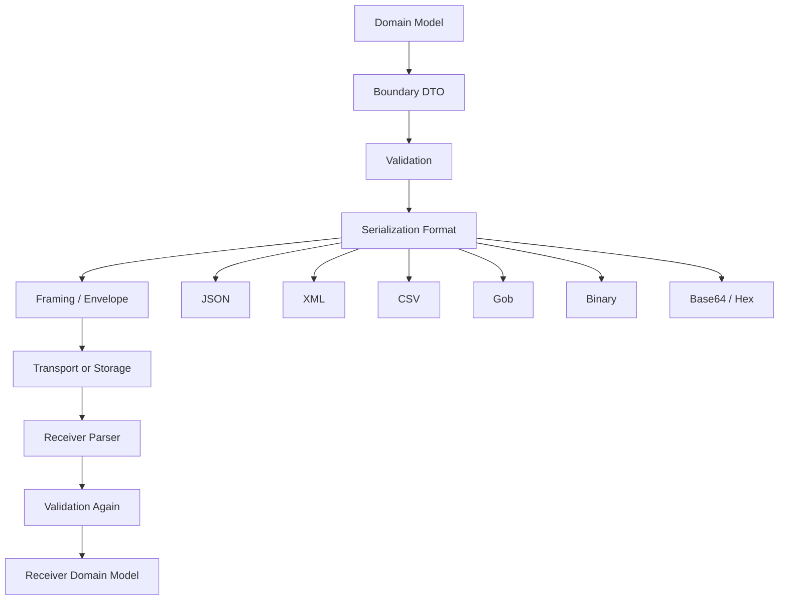
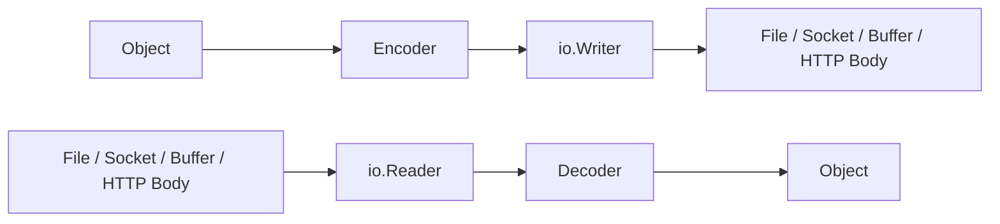
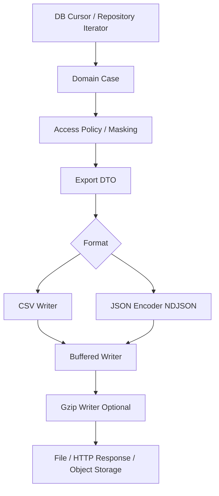

# learn-go-io-buffer-byte-stream-file-network-data-transfer-part-016.md

# Part 016 — Standard Serialization di Go: JSON, XML, CSV, Gob, Binary, Base64, Hex

> Seri: `learn-go-io-buffer-byte-stream-file-network-data-transfer`  
> Bagian: `016 / 034`  
> Target Go: `Go 1.26.x`  
> Target pembaca: Java software engineer yang ingin memahami Go IO/data-transfer di level internal engineering handbook.

---

## 0. Posisi Part Ini Dalam Seri

Di part sebelumnya kita sudah membangun fondasi:

- byte, slice, buffer, stream;
- kontrak `io.Reader` / `io.Writer`;
- buffered IO;
- text IO;
- console IO;
- error semantics;
- file dan filesystem;
- large file processing;
- durable write;
- binary encoding fundamentals.

Part ini mulai masuk ke lapisan yang lebih dekat dengan aplikasi: **serialization**.

Serialization adalah proses mengubah struktur data internal program menjadi representasi byte/text yang bisa:

- disimpan ke file;
- dikirim lewat network;
- dikirim lewat message broker;
- ditulis ke log/audit trail;
- digunakan dalam CLI pipeline;
- dipakai sebagai cache payload;
- dikirim ke sistem lain yang mungkin bukan Go.

Di Go, serialization standard library tersebar di beberapa package:

| Package | Fungsi utama |
|---|---|
| `encoding/json` | JSON text encoding/decoding |
| `encoding/xml` | XML token/value encoding/decoding |
| `encoding/csv` | CSV row-oriented text format |
| `encoding/gob` | Go-specific binary stream format |
| `encoding/binary` | primitive binary number encoding |
| `encoding/base64` | representasi binary sebagai ASCII base64 |
| `encoding/hex` | representasi binary sebagai hexadecimal text |
| `encoding` | shared interfaces untuk marshaling/unmarshaling |

Kita tidak akan membahas semua format eksternal seperti Protobuf, Avro, MessagePack, Parquet, CBOR, ASN.1, PEM, YAML, TOML secara detail di part ini. Fokus part ini adalah **standard library serialization toolbox** yang perlu benar-benar dikuasai sebelum memilih library eksternal.

---

## 1. Mental Model: Serialization Bukan “Convert Struct ke String”

Cara berpikir pemula:

```text
struct -> JSON string
struct -> XML string
[][]string -> CSV
```

Cara berpikir production-grade:

```text
in-memory domain object
  -> boundary DTO
  -> semantic validation
  -> representation format
  -> framing / transport / storage boundary
  -> parser behavior on receiver
  -> compatibility contract over time
  -> security and failure model
```

Serialization bukan hanya bentuk data. Serialization adalah **kontrak antar boundary**.

Boundary itu bisa berupa:

- service A ke service B;
- batch job ke file output;
- API client ke server;
- process lama ke process baru;
- versi aplikasi lama ke versi aplikasi baru;
- tenant A ke shared storage;
- untrusted user input ke internal model.

Jika boundary salah dirancang, bug-nya biasanya bukan compile error. Bug-nya muncul sebagai:

- field hilang diam-diam;
- numeric precision berubah;
- duplicate key diproses berbeda oleh sistem lain;
- unknown field diterima padahal seharusnya ditolak;
- CSV formula injection;
- XML entity/namespace mismatch;
- payload tidak bounded lalu memory spike;
- `gob` tidak bisa dibaca oleh sistem non-Go;
- base64 decoder menerima newline dan menghasilkan partial bytes;
- hex decoder gagal karena odd-length input;
- schema drift antar versi.

---

## 2. Serialization Layer Map



Ingat: format seperti JSON/XML/CSV hanya satu lapisan. Format tidak menyelesaikan sendiri masalah:

- message boundary;
- authentication;
- authorization;
- checksum;
- compression;
- encryption;
- replay protection;
- compatibility policy;
- bounded memory;
- retry/idempotency.

Itu sebabnya part 017, 018, 019, dan 020 nanti akan masuk lebih dalam ke JSON production pattern, protocol design, compression, dan archive.

---

## 3. Tiga Model Serialization di Go

Go standard library mendukung tiga gaya utama.

### 3.1 Whole-value serialization

Contoh:

```go
b, err := json.Marshal(v)
err = json.Unmarshal(b, &v)
```

Cocok untuk:

- payload kecil;
- config file kecil;
- response API kecil;
- test fixture;
- internal representation yang sudah bounded.

Risiko:

- seluruh payload harus ada di memory;
- mudah lupa membatasi input;
- error baru muncul setelah seluruh payload dibaca;
- tidak cocok untuk stream besar.

### 3.2 Stream serialization

Contoh:

```go
enc := json.NewEncoder(w)
err := enc.Encode(v)

 dec := json.NewDecoder(r)
err := dec.Decode(&v)
```

Cocok untuk:

- request/response body;
- file besar berisi banyak record;
- network stream;
- pipeline;
- log/event stream.

Risiko:

- perlu jelas boundary antar value;
- perlu menangani trailing data;
- perlu membatasi ukuran;
- perlu lifecycle close/flush.

### 3.3 Token/event-based parsing

Contoh:

```go
dec := json.NewDecoder(r)
tok, err := dec.Token()
```

atau XML:

```go
dec := xml.NewDecoder(r)
tok, err := dec.Token()
```

Cocok untuk:

- payload besar;
- selective parsing;
- streaming transform;
- parser yang perlu menghindari materialisasi seluruh tree;
- gateway/filter.

Risiko:

- state machine lebih kompleks;
- error handling lebih rumit;
- developer harus menjaga nesting dan boundary sendiri.

---

## 4. Decision Matrix: Pilih Format Dengan Benar

| Kebutuhan | Format yang biasanya masuk akal | Catatan |
|---|---|---|
| Public HTTP API | JSON | Human-readable, ecosystem luas |
| Enterprise legacy/integration | XML | Banyak sistem lama/regulatory masih XML |
| Spreadsheet/export/import | CSV | Row-oriented, tapi schema lemah |
| Go-to-Go internal stream | Gob | Cepat untuk Go-only, bukan format publik |
| Fixed protocol/storage record | `encoding/binary` | Perlu desain framing/versioning sendiri |
| Binary di JSON/URL/header | Base64 | Lebih compact dari hex, perlu pilih alphabet |
| Human debug ID/hash bytes | Hex | Sederhana, deterministic, 2x ukuran binary |
| Long-term cross-language contract | Biasanya bukan gob | Gunakan JSON/Protobuf/Avro/etc sesuai kebutuhan |
| Huge record stream | JSON Lines / CSV / custom frame | Hindari `ReadAll` |
| Need strict schema | Format + validator | Standard JSON/XML decoder tidak otomatis menjamin strict schema |

Rule of thumb:

```text
Choose a format by boundary, not by personal preference.
```

Jika boundary-nya manusia dan sistem heterogen, JSON/CSV/XML sering menang.  
Jika boundary-nya Go-only dan ephemeral, gob bisa masuk akal.  
Jika boundary-nya storage/protocol performance-critical, binary custom atau Protobuf lebih masuk akal.  
Jika boundary-nya text-safe transport untuk binary, base64/hex adalah representation layer, bukan object serialization layer.

---

## 5. `encoding` Package: Shared Interfaces

Package `encoding` mendefinisikan interface bersama seperti:

- `BinaryMarshaler`
- `BinaryUnmarshaler`
- `TextMarshaler`
- `TextUnmarshaler`

Banyak package encoding memeriksa interface ini.

Contoh value object yang punya text encoding stabil:

```go
package example

import (
    "fmt"
    "strconv"
    "strings"
)

type UserID struct {
    shard uint16
    seq   uint64
}

func (id UserID) MarshalText() ([]byte, error) {
    return []byte(fmt.Sprintf("u%d-%d", id.shard, id.seq)), nil
}

func (id *UserID) UnmarshalText(text []byte) error {
    s := string(text)
    if !strings.HasPrefix(s, "u") {
        return fmt.Errorf("invalid user id prefix")
    }

    parts := strings.SplitN(s[1:], "-", 2)
    if len(parts) != 2 {
        return fmt.Errorf("invalid user id shape")
    }

    shard64, err := strconv.ParseUint(parts[0], 10, 16)
    if err != nil {
        return fmt.Errorf("invalid shard: %w", err)
    }

    seq, err := strconv.ParseUint(parts[1], 10, 64)
    if err != nil {
        return fmt.Errorf("invalid sequence: %w", err)
    }

    id.shard = uint16(shard64)
    id.seq = seq
    return nil
}
```

Jika tipe ini dipakai dalam JSON sebagai map key atau field tertentu, package terkait bisa memanfaatkan text marshaling.

Mental model:

```text
Custom type should own its own stable representation when representation is part of its domain contract.
```

Namun jangan semua tipe diberi custom marshal/unmarshal. Terlalu banyak custom encoding bisa membuat sistem sulit diprediksi.

---

## 6. JSON di Go: `encoding/json`

JSON adalah format paling umum dalam HTTP API dan integration layer modern.

Package `encoding/json` menyediakan:

- `Marshal`
- `Unmarshal`
- `NewEncoder`
- `NewDecoder`
- `RawMessage`
- custom `Marshaler` / `Unmarshaler`
- token stream via `Decoder.Token`
- options seperti `DisallowUnknownFields`, `UseNumber`, `SetEscapeHTML`

### 6.1 Basic marshal/unmarshal

```go
package main

import (
    "encoding/json"
    "fmt"
)

type User struct {
    ID    string `json:"id"`
    Name  string `json:"name"`
    Email string `json:"email,omitempty"`
}

func main() {
    u := User{ID: "u-123", Name: "Fajar"}

    b, err := json.Marshal(u)
    if err != nil {
        panic(err)
    }

    fmt.Println(string(b))

    var decoded User
    if err := json.Unmarshal(b, &decoded); err != nil {
        panic(err)
    }

    fmt.Printf("%+v\n", decoded)
}
```

### 6.2 Struct tags are boundary contract

```go
type Invoice struct {
    ID          string `json:"id"`
    AmountCents int64  `json:"amount_cents"`
    Currency    string `json:"currency"`
}
```

Tag bukan cosmetic. Tag adalah contract. Mengubah tag berarti mengubah API/storage payload.

Anti-pattern:

```go
type Invoice struct {
    ID          string
    AmountCents int64
    Currency    string
}
```

Tanpa tag, field JSON mengikuti exported field name. Itu boleh untuk internal tool kecil, tetapi kurang baik untuk external contract.

### 6.3 `omitempty` bukan selalu harmless

```go
type PatchUserRequest struct {
    Name string `json:"name,omitempty"`
}
```

Masalah: `omitempty` membuat empty string tidak terkirim. Untuk PATCH semantics, ini bisa membedakan:

- field absent: jangan ubah;
- field present empty: set menjadi empty.

Solusi umum: pointer atau custom optional type.

```go
type PatchUserRequest struct {
    Name *string `json:"name"`
}
```

Dengan pointer:

- `nil` berarti absent/null tergantung decode;
- non-nil `""` berarti present empty string.

Namun pointer juga tidak selalu cukup membedakan absent vs explicit `null`. Untuk itu dibutuhkan optional wrapper yang melacak presence.

### 6.4 Streaming JSON dengan Encoder/Decoder

```go
func writeEvents(w io.Writer, events []Event) error {
    enc := json.NewEncoder(w)

    for _, ev := range events {
        if err := enc.Encode(ev); err != nil {
            return fmt.Errorf("encode event %s: %w", ev.ID, err)
        }
    }

    return nil
}
```

`Encoder.Encode` menulis satu JSON value dan newline. Pattern ini cocok untuk **NDJSON / JSON Lines** style output.

Untuk membaca:

```go
func readEvents(r io.Reader, handle func(Event) error) error {
    dec := json.NewDecoder(r)

    for {
        var ev Event
        err := dec.Decode(&ev)
        if errors.Is(err, io.EOF) {
            return nil
        }
        if err != nil {
            return fmt.Errorf("decode event: %w", err)
        }

        if err := handle(ev); err != nil {
            return fmt.Errorf("handle event %s: %w", ev.ID, err)
        }
    }
}
```

### 6.5 Bounded JSON input

Do not do this for untrusted input:

```go
b, err := io.ReadAll(r)
```

Better:

```go
func decodeBoundedJSON(r io.Reader, maxBytes int64, dst any) error {
    limited := io.LimitReader(r, maxBytes+1)
    dec := json.NewDecoder(limited)
    dec.DisallowUnknownFields()

    if err := dec.Decode(dst); err != nil {
        return fmt.Errorf("decode json: %w", err)
    }

    // Try reading one more token/value to detect trailing garbage.
    var extra any
    err := dec.Decode(&extra)
    if err == nil {
        return fmt.Errorf("json contains trailing value")
    }
    if !errors.Is(err, io.EOF) {
        return fmt.Errorf("decode trailing json: %w", err)
    }

    return nil
}
```

Namun `io.LimitReader` sendiri tidak memberi tahu apakah limit terlampaui. Untuk strict size limit, biasanya gunakan custom max reader atau cek HTTP `MaxBytesReader` di server HTTP.

### 6.6 Security behavior: duplicate keys, case-insensitive struct matching

`encoding/json` punya beberapa behavior yang penting untuk security/interoperability:

- duplicate object keys diproses dalam order kemunculan;
- matching ke struct field bersifat case-insensitive;
- beberapa behavior lama dipertahankan karena compatibility promise.

Konsekuensinya:

```json
{"role":"user","role":"admin"}
```

Parser berbeda bisa mengambil nilai berbeda atau punya semantics berbeda.

Untuk security-sensitive payload:

- hindari mengandalkan JSON parser default semata;
- definisikan canonicalization policy;
- reject duplicate keys jika perlu dengan tokenizer/custom parser;
- gunakan signature atas canonical form yang jelas;
- validasi lagi setelah decode;
- jangan mencampur beberapa parser berbeda tanpa memahami behavior masing-masing.

### 6.7 JSON number problem

Default JSON decoder ke `interface{}` memakai `float64` untuk number.

```go
var v any
_ = json.Unmarshal([]byte(`{"id":9007199254740993}`), &v)
```

Nilai integer besar bisa kehilangan presisi jika masuk ke `float64`.

Gunakan `UseNumber`:

```go
func decodeGenericJSON(r io.Reader) (any, error) {
    dec := json.NewDecoder(r)
    dec.UseNumber()

    var v any
    if err := dec.Decode(&v); err != nil {
        return nil, err
    }
    return v, nil
}
```

Lalu parse `json.Number` sesuai kebutuhan.

### 6.8 `json.RawMessage`

`RawMessage` berguna untuk delayed decode atau polymorphic envelope.

```go
type Envelope struct {
    Type string          `json:"type"`
    Data json.RawMessage `json:"data"`
}

type UserCreated struct {
    UserID string `json:"user_id"`
}

type InvoicePaid struct {
    InvoiceID string `json:"invoice_id"`
}

func decodeEnvelope(b []byte) (any, error) {
    var env Envelope
    if err := json.Unmarshal(b, &env); err != nil {
        return nil, err
    }

    switch env.Type {
    case "user.created":
        var ev UserCreated
        if err := json.Unmarshal(env.Data, &ev); err != nil {
            return nil, err
        }
        return ev, nil
    case "invoice.paid":
        var ev InvoicePaid
        if err := json.Unmarshal(env.Data, &ev); err != nil {
            return nil, err
        }
        return ev, nil
    default:
        return nil, fmt.Errorf("unknown event type %q", env.Type)
    }
}
```

Good use:

- event envelope;
- versioned payload;
- selective decode.

Bad use:

- menyimpan semua data sebagai `RawMessage` karena malas desain schema;
- membiarkan validation delay terlalu lama;
- tidak membatasi ukuran raw payload.

### 6.9 JSON v2/jsontext watchlist

Go modern memiliki experimental JSON v2/jsontext work. Untuk seri ini, baseline production tetap menggunakan `encoding/json` stabil, kecuali organisasi Anda secara sadar mengevaluasi experimental API dengan compatibility/testing policy khusus.

Yang penting: jangan membangun long-term critical contract di atas API yang masih experimental tanpa migration plan.

---

## 7. XML di Go: `encoding/xml`

XML masih penting di banyak domain:

- regulatory filing;
- SOAP-ish legacy integration;
- document exchange;
- finance/government systems;
- enterprise middleware;
- config lama;
- signed document envelope.

Package `encoding/xml` menyediakan:

- `Marshal`
- `Unmarshal`
- `Encoder`
- `Decoder`
- token model: `StartElement`, `EndElement`, `CharData`, `Comment`, `ProcInst`, `Directive`
- custom `MarshalXML` / `UnmarshalXML`

### 7.1 XML is not JSON with angle brackets

XML punya konsep:

- element;
- attribute;
- namespace;
- character data;
- comments;
- processing instruction;
- mixed content;
- token stream;
- order sensitivity.

Contoh:

```xml
<invoice id="inv-1" currency="SGD">
  <amount>1000</amount>
  <note>Paid by bank transfer</note>
</invoice>
```

Model Go:

```go
type Invoice struct {
    XMLName  xml.Name `xml:"invoice"`
    ID       string   `xml:"id,attr"`
    Currency string   `xml:"currency,attr"`
    Amount   int64    `xml:"amount"`
    Note     string   `xml:"note"`
}
```

### 7.2 Basic encode/decode

```go
func encodeInvoice(w io.Writer, inv Invoice) error {
    enc := xml.NewEncoder(w)
    enc.Indent("", "  ")

    if err := enc.Encode(inv); err != nil {
        return fmt.Errorf("encode invoice xml: %w", err)
    }

    if err := enc.Close(); err != nil {
        return fmt.Errorf("close xml encoder: %w", err)
    }

    return nil
}
```

`Encoder.Close` penting karena XML bisa invalid jika ada unclosed element atau buffered token belum selesai.

### 7.3 Token streaming

XML token stream berguna untuk file besar.

```go
func countElements(r io.Reader, element string) (int, error) {
    dec := xml.NewDecoder(r)
    count := 0

    for {
        tok, err := dec.Token()
        if errors.Is(err, io.EOF) {
            return count, nil
        }
        if err != nil {
            return 0, fmt.Errorf("xml token: %w", err)
        }

        switch t := tok.(type) {
        case xml.StartElement:
            if t.Name.Local == element {
                count++
            }
        }
    }
}
```

### 7.4 XML namespace reality

XML namespace sering menjadi sumber bug.

```xml
<cea:Application xmlns:cea="https://example.gov/cea">
  <cea:ID>A-123</cea:ID>
</cea:Application>
```

Go `xml.Name` punya:

```go
type Name struct {
    Space string
    Local string
}
```

Untuk sistem enterprise, jangan hanya cocokkan `Local` jika namespace penting untuk security/contract. Dua element dengan local name sama tapi namespace berbeda bisa punya semantics berbeda.

### 7.5 XML security notes

Beberapa risiko XML umum:

- entity expansion attack;
- external entity / XXE di parser tertentu;
- namespace confusion;
- signature wrapping;
- oversized document;
- deep nesting;
- mixed content yang tidak terduga.

Go `encoding/xml` tidak sama dengan full validating XML parser. Jangan asumsikan XSD validation otomatis ada.

Production stance:

- batasi ukuran input;
- batasi depth jika perlu;
- validasi semantic setelah decode;
- jangan abaikan namespace pada payload security-sensitive;
- jangan decode langsung ke domain object tanpa boundary DTO;
- log error dengan lokasi/element, tapi jangan leak full payload sensitif.

### 7.6 XML vs Java mental model

Di Java, Anda mungkin familiar dengan:

- JAXB;
- StAX;
- SAX;
- DOM;
- Jackson XML;
- JAXP.

Go `encoding/xml` lebih dekat ke kombinasi:

- struct mapping sederhana seperti JAXB;
- token stream mirip StAX;
- tanpa DOM builder standard besar;
- tanpa schema validation built-in level enterprise.

Jadi untuk XML kompleks, Anda sering perlu explicit parser state machine.

---

## 8. CSV di Go: `encoding/csv`

CSV tampak sederhana, tapi di production sering berbahaya karena schema-nya lemah dan variasinya banyak.

Package `encoding/csv` menyediakan:

- `Reader`
- `Writer`
- delimiter configurable via `Comma`
- comment char;
- `FieldsPerRecord`;
- `LazyQuotes`;
- `TrimLeadingSpace`;
- `ReuseRecord`;
- field position info.

### 8.1 CSV is row-oriented, not object-oriented

CSV adalah stream record:

```text
id,name,email
u-1,Alice,alice@example.com
u-2,Bob,bob@example.com
```

Di Go:

```go
func readUsersCSV(r io.Reader, handle func(User) error) error {
    cr := csv.NewReader(r)
    cr.FieldsPerRecord = -1

    header, err := cr.Read()
    if err != nil {
        return fmt.Errorf("read header: %w", err)
    }

    idx, err := buildHeaderIndex(header, []string{"id", "name", "email"})
    if err != nil {
        return err
    }

    rowNum := 1
    for {
        row, err := cr.Read()
        if errors.Is(err, io.EOF) {
            return nil
        }
        if err != nil {
            return fmt.Errorf("read csv row %d: %w", rowNum+1, err)
        }
        rowNum++

        user := User{
            ID:    row[idx["id"]],
            Name:  row[idx["name"]],
            Email: row[idx["email"]],
        }

        if err := validateUser(user); err != nil {
            return fmt.Errorf("invalid csv row %d: %w", rowNum, err)
        }

        if err := handle(user); err != nil {
            return fmt.Errorf("handle csv row %d: %w", rowNum, err)
        }
    }
}
```

### 8.2 Header handling

Never assume column order unless contract says fixed positional schema.

Better:

```go
func buildHeaderIndex(header []string, required []string) (map[string]int, error) {
    index := make(map[string]int, len(header))
    for i, name := range header {
        name = strings.TrimSpace(name)
        if _, exists := index[name]; exists {
            return nil, fmt.Errorf("duplicate header %q", name)
        }
        index[name] = i
    }

    for _, name := range required {
        if _, ok := index[name]; !ok {
            return nil, fmt.Errorf("missing required header %q", name)
        }
    }

    return index, nil
}
```

### 8.3 CSV writer flush discipline

```go
func writeUsersCSV(w io.Writer, users []User) error {
    cw := csv.NewWriter(w)

    if err := cw.Write([]string{"id", "name", "email"}); err != nil {
        return err
    }

    for _, u := range users {
        if err := cw.Write([]string{u.ID, u.Name, u.Email}); err != nil {
            return err
        }
    }

    cw.Flush()
    if err := cw.Error(); err != nil {
        return fmt.Errorf("flush csv: %w", err)
    }

    return nil
}
```

`csv.Writer` buffered. `Flush` tidak return error langsung; cek `Error()`.

### 8.4 CSV injection

Jika CSV dibuka di spreadsheet, cell yang dimulai dengan karakter tertentu bisa dieksekusi sebagai formula:

```text
=HYPERLINK("http://evil", "click")
+cmd
@SUM(1,2)
```

Untuk export yang kemungkinan dibuka manusia di Excel/Sheets, pertimbangkan sanitasi field yang dimulai dengan:

- `=`
- `+`
- `-`
- `@`
- tab
- carriage return

Contoh defensive escaping:

```go
func safeSpreadsheetCell(s string) string {
    if s == "" {
        return s
    }
    switch s[0] {
    case '=', '+', '-', '@', '\t', '\r':
        return "'" + s
    default:
        return s
    }
}
```

Ini bukan aturan universal. Ia adalah policy untuk CSV yang akan dibuka sebagai spreadsheet.

### 8.5 CSV record reuse

`Reader.ReuseRecord = true` bisa mengurangi allocation, tetapi record slice akan reused.

```go
cr := csv.NewReader(r)
cr.ReuseRecord = true

for {
    row, err := cr.Read()
    if errors.Is(err, io.EOF) {
        break
    }
    if err != nil {
        return err
    }

    // Do not store row directly if ReuseRecord=true.
    rowCopy := append([]string(nil), row...)
    _ = rowCopy
}
```

Jika Anda menyimpan `row` langsung ke slice global, nilainya bisa berubah pada iterasi berikutnya.

---

## 9. Gob di Go: `encoding/gob`

Gob adalah format binary Go-specific.

Karakteristik:

- stream of typed values;
- self-describing type information;
- efficient jika satu encoder dipakai untuk banyak value;
- cocok untuk Go-to-Go internal communication atau cache sementara;
- tidak cocok sebagai public cross-language API;
- bukan format schema governance enterprise.

### 9.1 Basic gob encode/decode

```go
type Session struct {
    UserID string
    Roles  []string
}

func encodeSession(w io.Writer, s Session) error {
    enc := gob.NewEncoder(w)
    if err := enc.Encode(s); err != nil {
        return fmt.Errorf("encode session gob: %w", err)
    }
    return nil
}

func decodeSession(r io.Reader) (Session, error) {
    dec := gob.NewDecoder(r)

    var s Session
    if err := dec.Decode(&s); err != nil {
        return Session{}, fmt.Errorf("decode session gob: %w", err)
    }

    return s, nil
}
```

### 9.2 Gob stream efficiency

Gob compiles/communicates type information. Jika mengirim banyak values, gunakan encoder yang sama untuk amortisasi cost.

Good:

```go
enc := gob.NewEncoder(w)
for _, item := range items {
    if err := enc.Encode(item); err != nil {
        return err
    }
}
```

Less ideal:

```go
for _, item := range items {
    var buf bytes.Buffer
    enc := gob.NewEncoder(&buf)
    _ = enc.Encode(item)
    _, _ = w.Write(buf.Bytes())
}
```

### 9.3 Gob compatibility model

Gob bisa tolerate beberapa perubahan field, tetapi jangan treat sebagai magic long-term schema system.

Risky changes:

- mengubah semantic field tanpa versi;
- mengubah nama tipe/package dalam cara yang memutus decode;
- menggunakan interface tanpa register type dengan jelas;
- menyimpan gob permanen selama bertahun-tahun tanpa migration test.

Jika gob dipakai untuk persistent storage:

- tulis version byte/envelope di luar gob;
- punya migration test dengan fixture lama;
- hindari menyimpan domain object langsung;
- gunakan DTO khusus;
- dokumentasikan bahwa format hanya untuk Go runtime family tertentu.

### 9.4 Gob and untrusted input

Jangan menerima gob dari untrusted public client kecuali Anda punya threat model jelas. Gob decoder bisa mengalokasikan memory berdasarkan input. Walaupun bukan code execution otomatis, format binary self-describing dari pihak tak dipercaya tetap harus dibatasi.

Gunakan:

- size limit;
- deadline;
- DTO sempit;
- validation setelah decode;
- quota per connection/request;
- fuzz test decoder path.

---

## 10. `encoding/binary`: Primitive Binary Translation

Part 015 sudah membahas binary encoding lebih dalam. Di sini kita tempatkan `encoding/binary` sebagai bagian dari standard serialization toolbox.

Package `encoding/binary` cocok untuk:

- angka fixed-width;
- endian conversion;
- varint;
- header kecil;
- record metadata;
- custom protocol fields.

Contoh fixed header:

```go
type Header struct {
    Magic   [4]byte
    Version uint16
    Flags   uint16
    Length  uint32
}

func writeHeader(w io.Writer, h Header) error {
    if _, err := w.Write(h.Magic[:]); err != nil {
        return err
    }
    if err := binary.Write(w, binary.BigEndian, h.Version); err != nil {
        return err
    }
    if err := binary.Write(w, binary.BigEndian, h.Flags); err != nil {
        return err
    }
    if err := binary.Write(w, binary.BigEndian, h.Length); err != nil {
        return err
    }
    return nil
}
```

Namun untuk high-performance hot path, manual `PutUintXX` sering lebih jelas dan lebih efisien:

```go
func encodeHeader(dst []byte, version uint16, flags uint16, length uint32) error {
    if len(dst) < 12 {
        return io.ErrShortBuffer
    }

    copy(dst[0:4], []byte{'G', 'D', 'T', '1'})
    binary.BigEndian.PutUint16(dst[4:6], version)
    binary.BigEndian.PutUint16(dst[6:8], flags)
    binary.BigEndian.PutUint32(dst[8:12], length)
    return nil
}
```

### 10.1 Big endian vs little endian

Rule:

- network protocol: biasanya big endian/network byte order;
- local storage internal: boleh little endian jika documented;
- cross-language: tulis explicit;
- jangan gunakan native endian implicit.

### 10.2 Varint

Varint cocok untuk angka kecil yang sering kecil tapi punya upper bound besar.

```go
buf := make([]byte, binary.MaxVarintLen64)
n := binary.PutUvarint(buf, value)
_, err := w.Write(buf[:n])
```

Saat decode, selalu handle malformed/too-long varint.

---

## 11. Base64: Binary-to-Text Encoding

Base64 bukan object serialization. Ia mengubah binary bytes menjadi text-safe bytes.

Digunakan untuk:

- binary field dalam JSON;
- token dalam URL;
- PEM/MIME-ish data;
- HTTP header value;
- compact text representation.

### 11.1 Standard vs URL encoding

```go
encoded := base64.StdEncoding.EncodeToString(data)
urlSafe := base64.RawURLEncoding.EncodeToString(data)
```

Pilihan umum:

| Encoding | Kapan dipakai |
|---|---|
| `StdEncoding` | MIME/general base64 dengan `+`, `/`, padding `=` |
| `URLEncoding` | URL/file-name safe dengan `-`, `_`, padding |
| `RawURLEncoding` | URL token tanpa padding, umum untuk token/id |
| `RawStdEncoding` | Std alphabet tanpa padding |

Untuk token di URL, `RawURLEncoding` sering lebih praktis.

### 11.2 Streaming base64

```go
func encodeBase64Stream(dst io.Writer, src io.Reader) error {
    enc := base64.NewEncoder(base64.StdEncoding, dst)

    if _, err := io.Copy(enc, src); err != nil {
        _ = enc.Close()
        return fmt.Errorf("copy to base64 encoder: %w", err)
    }

    if err := enc.Close(); err != nil {
        return fmt.Errorf("close base64 encoder: %w", err)
    }

    return nil
}
```

`Close` penting untuk flush partial block.

### 11.3 Decoding with partial data

```go
func decodeBase64String(s string, maxDecoded int) ([]byte, error) {
    if maxDecoded < 0 {
        return nil, fmt.Errorf("invalid max decoded")
    }

    // Conservative upper bound for padded base64.
    if base64.StdEncoding.DecodedLen(len(s)) > maxDecoded {
        return nil, fmt.Errorf("base64 payload too large")
    }

    b, err := base64.StdEncoding.DecodeString(s)
    if err != nil {
        return nil, fmt.Errorf("invalid base64: %w", err)
    }
    if len(b) > maxDecoded {
        return nil, fmt.Errorf("decoded payload too large")
    }

    return b, nil
}
```

### 11.4 Base64 size overhead

Base64 kira-kira menambah ukuran 33%.

```text
3 bytes binary -> 4 bytes base64
```

Konsekuensi:

- jangan base64 encode file besar jika bisa transfer binary langsung;
- jangan menaruh file besar base64 di JSON kecuali memang dibutuhkan;
- untuk HTTP upload, multipart/binary body sering lebih baik.

---

## 12. Hex: Binary-to-Human-Readable Text

Hex lebih besar daripada base64, tetapi sangat nyaman untuk:

- hash digest;
- byte debugging;
- binary ID kecil;
- log correlation ID;
- deterministic lower-case representation;
- protocol dump.

### 12.1 Basic hex

```go
sum := sha256.Sum256(data)
hexStr := hex.EncodeToString(sum[:])
```

Decode:

```go
b, err := hex.DecodeString(hexStr)
if err != nil {
    return fmt.Errorf("invalid hex: %w", err)
}
```

### 12.2 Hex size overhead

Hex selalu 2x ukuran binary.

```text
1 byte -> 2 hex chars
32-byte SHA-256 -> 64 hex chars
```

### 12.3 Streaming hex

```go
func writeHexDump(w io.Writer, data []byte) error {
    hw := hex.NewEncoder(w)
    _, err := hw.Write(data)
    return err
}
```

Hex encoder tidak butuh `Close`, berbeda dengan base64 encoder stream.

### 12.4 Hex for logs

Good:

```go
logger.Info("checksum computed", "sha256", hex.EncodeToString(sum[:]))
```

Bad:

```go
logger.Info("payload", "hex", hex.EncodeToString(entirePayload))
```

Jangan dump payload besar atau sensitif hanya karena bisa di-hex.

---

## 13. Serialization and IO Composition

Pola utama Go:



Karena encoder menerima `io.Writer` dan decoder menerima `io.Reader`, format bisa dikombinasikan dengan:

- gzip;
- buffering;
- base64;
- checksum writer;
- limited reader;
- tee reader;
- network connection;
- file;
- HTTP request/response body.

Contoh pipeline:

```go
func writeCompressedJSON(w io.Writer, v any) error {
    gz := gzip.NewWriter(w)
    defer gz.Close()

    enc := json.NewEncoder(gz)
    if err := enc.Encode(v); err != nil {
        _ = gz.Close()
        return fmt.Errorf("encode json: %w", err)
    }

    if err := gz.Close(); err != nil {
        return fmt.Errorf("close gzip writer: %w", err)
    }

    return nil
}
```

Close order matters.

Untuk pipeline:

```text
object -> json encoder -> gzip writer -> file writer
```

Close/flush harus dari inner transform ke outer sink:

```text
json encode complete
close gzip writer
sync/close file if durable
```

---

## 14. DTO Boundary: Jangan Serialize Domain Object Langsung

Domain object biasanya punya:

- method;
- invariant internal;
- cached field;
- unexported field;
- data yang tidak boleh keluar;
- relation graph;
- lazy-loaded state;
- concurrency primitive;
- internal enum yang belum cocok untuk public API.

Boundary DTO harus eksplisit.

Bad:

```go
type User struct {
    ID           string
    Name         string
    PasswordHash []byte
    InternalNote string
    Roles        []Role
}

json.NewEncoder(w).Encode(user)
```

Good:

```go
type UserResponse struct {
    ID    string   `json:"id"`
    Name  string   `json:"name"`
    Roles []string `json:"roles"`
}

func NewUserResponse(u User) UserResponse {
    return UserResponse{
        ID:    u.ID,
        Name:  u.Name,
        Roles: roleNames(u.Roles),
    }
}
```

Manfaat DTO:

- mencegah data leak;
- menjaga compatibility;
- memberi tempat validation/mapping;
- memisahkan domain evolution dari API evolution;
- mempermudah testing contract.

---

## 15. Unknown Fields, Extra Fields, and Schema Drift

Schema drift terjadi ketika producer dan consumer tidak berada pada versi yang sama.

Kemungkinan:

| Perubahan | JSON default | Risiko |
|---|---|---|
| tambah field baru | consumer lama biasanya ignore | aman jika additive |
| hapus field | consumer bisa zero value | semantic bug |
| rename field | field lama hilang | breaking |
| ubah tipe | decode error atau silent issue | breaking |
| ubah semantics | tidak terlihat dari format | paling berbahaya |

Untuk public API:

- additive change biasanya aman;
- rename/hapus/ubah tipe adalah breaking;
- ubah semantic harus versi baru;
- unknown field policy harus jelas.

Untuk strict command/request:

```go
dec := json.NewDecoder(r)
dec.DisallowUnknownFields()
```

Untuk event stream jangka panjang, terlalu strict terhadap unknown fields bisa menghambat forward compatibility. Jadi policy tergantung boundary.

---

## 16. Null, Zero Value, Missing Field

Di Go, zero value sering nyaman. Di serialization boundary, zero value bisa ambigu.

JSON contoh:

```json
{}
{"limit":0}
{"limit":null}
```

Ketiganya bisa punya semantics berbeda:

- missing: pakai default;
- zero: explicit zero;
- null: clear/unset.

Dengan field biasa:

```go
type Request struct {
    Limit int `json:"limit"`
}
```

Anda tidak bisa membedakan missing dan `0`.

Dengan pointer:

```go
type Request struct {
    Limit *int `json:"limit"`
}
```

Anda bisa membedakan missing/null-ish dari number, tetapi missing dan explicit null sama-sama menjadi nil pada default decode.

Jika benar-benar butuh presence tracking, gunakan custom optional type.

```go
type OptionalInt struct {
    Set   bool
    Valid bool
    Value int
}

func (o *OptionalInt) UnmarshalJSON(b []byte) error {
    o.Set = true
    if string(b) == "null" {
        o.Valid = false
        o.Value = 0
        return nil
    }

    var v int
    if err := json.Unmarshal(b, &v); err != nil {
        return err
    }

    o.Valid = true
    o.Value = v
    return nil
}
```

---

## 17. Time Serialization

Time is a trap.

Go `time.Time` has built-in JSON behavior, generally RFC3339-ish representation.

```go
type Event struct {
    OccurredAt time.Time `json:"occurred_at"`
}
```

Design decisions:

- UTC or local time?
- include timezone offset?
- accept date-only?
- precision: seconds, millis, nanos?
- reject zero time?
- monotonic component stripped?
- compatibility with Java `Instant`, `OffsetDateTime`, `LocalDate`?

Recommended for distributed systems:

- use UTC instants for machine events;
- avoid local timezone unless domain requires it;
- use explicit date type for date-only domain;
- validate zero time;
- document precision.

Example boundary DTO:

```go
type AuditEventDTO struct {
    ID         string    `json:"id"`
    OccurredAt time.Time `json:"occurred_at"`
}

func (e AuditEventDTO) Validate() error {
    if e.ID == "" {
        return fmt.Errorf("id is required")
    }
    if e.OccurredAt.IsZero() {
        return fmt.Errorf("occurred_at is required")
    }
    return nil
}
```

---

## 18. Numeric Serialization

Numeric fields need explicit thinking.

Questions:

- Is it count, money, ratio, duration, percentage?
- Can it be negative?
- What is max?
- Is decimal precision needed?
- Does Java side use `BigDecimal`, `long`, `double`?
- Does JSON consumer parse into JavaScript number?

Money example:

Bad:

```go
type Payment struct {
    Amount float64 `json:"amount"`
}
```

Better:

```go
type Payment struct {
    AmountCents int64  `json:"amount_cents"`
    Currency    string `json:"currency"`
}
```

If decimal is required, use string representation with explicit decimal parser or a decimal library.

```go
type Payment struct {
    Amount   string `json:"amount"` // "123.45"
    Currency string `json:"currency"`
}
```

---

## 19. Error Reporting Strategy

Serialization errors should be contextual but not noisy.

Bad:

```go
return err
```

Better:

```go
return fmt.Errorf("decode create user request json: %w", err)
```

For batch/CSV:

```go
return fmt.Errorf("row %d column %q: invalid email: %w", rowNum, "email", err)
```

For XML:

```go
return fmt.Errorf("xml token at offset %d: %w", dec.InputOffset(), err)
```

Be careful logging payload:

- log length;
- log content type;
- log schema/version;
- log row number;
- log field name;
- log checksum/correlation id;
- do not log PII/secrets/full raw payload by default.

---

## 20. Streaming Multiple Records

A common problem: one file or connection contains many records.

Options:

| Format | Multi-record approach |
|---|---|
| JSON | array, NDJSON, custom envelope |
| XML | repeated elements under root |
| CSV | natural rows |
| Gob | repeated `Encode` on same stream |
| Binary | length-prefixed frames |

### 20.1 JSON array streaming

```json
[
  {"id":"1"},
  {"id":"2"}
]
```

Can be streamed using tokens, but more complex.

### 20.2 NDJSON

```text
{"id":"1"}
{"id":"2"}
```

Easy with `Encoder.Encode` and repeated `Decoder.Decode`.

Trade-off:

- easy append;
- easy line-based processing;
- cannot represent pretty multi-line JSON per record;
- record boundary is newline convention.

### 20.3 CSV rows

Natural for tabular records but weak for nested data.

### 20.4 Gob repeated values

Works well Go-to-Go, but not portable.

---

## 21. Serialization With Compression

Compression usually wraps byte stream after serialization.

```text
object -> json/xml/csv/gob/binary -> gzip/zlib/flate -> writer
```

Not:

```text
object -> gzip each field -> json
```

Unless there is a very specific reason.

Serialization before compression preserves global redundancy.

Example:

```go
func writeGzipJSONL(w io.Writer, events []Event) error {
    gz := gzip.NewWriter(w)
    enc := json.NewEncoder(gz)

    for _, ev := range events {
        if err := enc.Encode(ev); err != nil {
            _ = gz.Close()
            return fmt.Errorf("encode event %s: %w", ev.ID, err)
        }
    }

    if err := gz.Close(); err != nil {
        return fmt.Errorf("close gzip: %w", err)
    }
    return nil
}
```

Potential issue: if downstream needs random access per record, whole-stream compression makes random access harder. Use block compression or indexed format if needed.

---

## 22. Serialization With Checksum

For storage or transfer, checksum should usually be computed over the exact bytes persisted/transferred.

```go
type checksumWriter struct {
    w io.Writer
    h hash.Hash
}

func (cw *checksumWriter) Write(p []byte) (int, error) {
    n, err := cw.w.Write(p)
    if n > 0 {
        _, _ = cw.h.Write(p[:n])
    }
    return n, err
}
```

Important: update checksum only for bytes actually written if underlying writer can short-write.

Pipeline:

```text
json encoder -> gzip writer -> checksum writer -> file
```

Checksum here covers compressed bytes.

If you want checksum over logical JSON before compression:

```text
json encoder -> tee/checksum -> gzip -> file
```

Decide and document.

---

## 23. Safe Decoder Boundary Pattern

A good decoder boundary often has this shape:

```go
type DecodeOptions struct {
    MaxBytes              int64
    DisallowUnknownFields bool
}

func DecodeCreateUserRequest(r io.Reader, opt DecodeOptions) (CreateUserRequest, error) {
    if opt.MaxBytes <= 0 {
        return CreateUserRequest{}, fmt.Errorf("MaxBytes must be positive")
    }

    r = io.LimitReader(r, opt.MaxBytes+1)

    dec := json.NewDecoder(r)
    if opt.DisallowUnknownFields {
        dec.DisallowUnknownFields()
    }

    var req CreateUserRequest
    if err := dec.Decode(&req); err != nil {
        return CreateUserRequest{}, fmt.Errorf("decode create user request: %w", err)
    }

    if err := ensureSingleJSONValue(dec); err != nil {
        return CreateUserRequest{}, err
    }

    if err := req.Validate(); err != nil {
        return CreateUserRequest{}, fmt.Errorf("validate create user request: %w", err)
    }

    return req, nil
}

func ensureSingleJSONValue(dec *json.Decoder) error {
    var extra any
    err := dec.Decode(&extra)
    if err == nil {
        return fmt.Errorf("unexpected trailing json value")
    }
    if errors.Is(err, io.EOF) {
        return nil
    }
    return fmt.Errorf("decode trailing json: %w", err)
}
```

Note: this pattern is conceptual; for exact max-size enforcement, use a reader that reports limit exceeded, not only `LimitReader`.

---

## 24. Safe Encoder Boundary Pattern

Encoder boundary should have:

- DTO mapping;
- validation if output has invariant;
- explicit content type;
- deterministic field naming;
- no accidental secrets;
- error wrapping;
- flush/close discipline.

```go
func WriteUserResponse(w io.Writer, u User) error {
    dto := NewUserResponse(u)

    enc := json.NewEncoder(w)
    enc.SetEscapeHTML(true)

    if err := enc.Encode(dto); err != nil {
        return fmt.Errorf("encode user response: %w", err)
    }

    return nil
}
```

For CSV:

```go
func WriteUserExport(w io.Writer, users []User) error {
    cw := csv.NewWriter(w)

    if err := cw.Write([]string{"id", "name", "email"}); err != nil {
        return fmt.Errorf("write csv header: %w", err)
    }

    for _, u := range users {
        row := []string{
            safeSpreadsheetCell(u.ID),
            safeSpreadsheetCell(u.Name),
            safeSpreadsheetCell(u.Email),
        }
        if err := cw.Write(row); err != nil {
            return fmt.Errorf("write csv row for user %s: %w", u.ID, err)
        }
    }

    cw.Flush()
    if err := cw.Error(); err != nil {
        return fmt.Errorf("flush user export csv: %w", err)
    }

    return nil
}
```

---

## 25. Versioned Serialization

For anything persisted or exchanged long-term, include version.

### 25.1 JSON version field

```go
type EventEnvelope struct {
    Version int             `json:"version"`
    Type    string          `json:"type"`
    ID      string          `json:"id"`
    Data    json.RawMessage `json:"data"`
}
```

### 25.2 Binary magic/version header

```text
magic:   4 bytes
version: 2 bytes
flags:   2 bytes
length:  4 bytes
payload: N bytes
```

### 25.3 CSV schema version

Options:

- filename includes version: `users-v2.csv`;
- first comment line if supported by reader;
- sidecar manifest file;
- header column changes documented.

CSV has no native schema mechanism, so you must provide one outside or through header discipline.

---

## 26. Determinism and Canonical Serialization

Sometimes you need deterministic bytes:

- signature;
- hash;
- cache key;
- equality test;
- reproducible artifact;
- audit trail.

Problem: not all encoders guarantee canonical form suitable for signing.

Questions:

- Are map keys sorted?
- Are floats formatted consistently?
- Are insignificant spaces normalized?
- Are duplicate fields rejected?
- Is Unicode normalized?
- Are timestamps normalized?

For security signatures:

```text
Do not sign "whatever json.Marshal produced today" unless you have a documented canonicalization policy.
```

For audit hash:

- define canonical DTO;
- define field order or canonical JSON approach;
- define time format;
- define numeric format;
- reject duplicate keys on input if input is signed;
- store algorithm version.

---

## 27. Java Interoperability Notes

As Java engineer, map these ideas carefully.

| Java world | Go equivalent / note |
|---|---|
| Jackson `ObjectMapper` | `encoding/json`, less feature-rich but simple |
| Jackson streaming parser | `json.Decoder.Token` |
| JAXB | `encoding/xml` struct tags, less enterprise-heavy |
| StAX | `xml.Decoder.Token` |
| Java serialization | `encoding/gob` only loosely analogous; avoid public use |
| `ByteBuffer` endian | `encoding/binary.ByteOrder` |
| `Base64.getUrlEncoder().withoutPadding()` | `base64.RawURLEncoding` |
| `HexFormat` | `encoding/hex` |
| `BigDecimal` JSON | usually string/custom decimal in Go |
| `Optional<T>` | pointer/custom optional type in Go DTO |

Important difference:

Go standard library intentionally avoids becoming a huge enterprise serialization framework. You compose small packages and own your boundary semantics.

---

## 28. Security Checklist Per Format

### JSON

- Limit input size.
- Detect/reject trailing value if request expects single JSON value.
- Consider `DisallowUnknownFields` for command/request DTO.
- Use `UseNumber` for generic numeric decode.
- Be aware of duplicate keys and case-insensitive matching.
- Validate semantic invariants after decode.
- Do not decode directly into domain aggregate with secrets/internal fields.

### XML

- Limit input size.
- Validate namespaces if meaningful.
- Do not assume schema validation.
- Watch deep nesting and huge text nodes.
- Use token stream for large documents.
- Be careful with signed XML patterns; signature wrapping is a domain-specific risk.

### CSV

- Validate header.
- Reject duplicate header.
- Validate row length.
- Track row numbers.
- Sanitize spreadsheet formulas for human export.
- Do not trust CSV types; every field is string until parsed.
- Avoid storing reused row slices if `ReuseRecord=true`.

### Gob

- Use only for Go-to-Go trusted/internal boundaries unless explicitly threat-modeled.
- Limit input size.
- Avoid public API use.
- Version persistent payloads externally.
- Test migration with old fixtures.

### Binary

- Define endian.
- Define version and magic.
- Validate length before allocation.
- Validate checksum if applicable.
- Treat malformed input as normal operational event, not panic.

### Base64/Hex

- Choose correct alphabet/padding policy.
- Bound decoded size before allocation.
- Close base64 stream encoder.
- Do not log large/sensitive payload as encoded text.

---

## 29. Performance Model

Serialization cost comes from:

- reflection;
- allocation;
- map iteration/sorting/canonicalization;
- string/byte conversion;
- escape/unescape;
- buffering;
- syscalls if writing small chunks directly;
- compression layered after serialization;
- validation/parsing.

### 29.1 Avoid premature micro-optimization

Usually first wins:

1. Use streaming instead of `ReadAll` for large/untrusted payload.
2. Reuse encoder/decoder in stream where appropriate.
3. Avoid building intermediate strings.
4. Avoid map-heavy generic `map[string]any` if struct DTO works.
5. Add buffer around small writes.
6. Benchmark realistic payload.
7. Profile allocations.

### 29.2 `json.Marshal` vs `Encoder.Encode`

`Marshal` returns `[]byte`; `Encoder` writes to `io.Writer`.

Use `Marshal` when:

- you need bytes for hash/signature/cache;
- payload small;
- you need to inspect/transform bytes;
- test fixture.

Use `Encoder` when:

- writing to HTTP response/file/socket;
- streaming multiple values;
- avoiding extra intermediate buffer;
- combining with gzip/checksum writer.

### 29.3 Avoid `map[string]any` as default DTO

Bad:

```go
payload := map[string]any{
    "id": user.ID,
    "name": user.Name,
}
```

Better:

```go
type UserDTO struct {
    ID   string `json:"id"`
    Name string `json:"name"`
}
```

Struct DTO gives:

- compile-time shape;
- easier validation;
- lower dynamic type ambiguity;
- more stable contract.

---

## 30. Testing Serialization

### 30.1 Golden files

Golden files are useful for stable output contracts.

```go
func TestUserResponseJSON(t *testing.T) {
    dto := UserResponse{ID: "u-1", Name: "Alice"}

    got, err := json.MarshalIndent(dto, "", "  ")
    if err != nil {
        t.Fatal(err)
    }

    want := readGolden(t, "testdata/user_response.json")
    if diff := cmpDiff(string(want), string(got)); diff != "" {
        t.Fatalf("json mismatch:\n%s", diff)
    }
}
```

Golden files are good for:

- public API representation;
- CSV export format;
- XML document shape;
- migration compatibility.

But do not overuse golden tests for fields where ordering is intentionally irrelevant.

### 30.2 Round-trip tests

```go
func TestEventRoundTrip(t *testing.T) {
    in := Event{ID: "e-1", Type: "user.created"}

    b, err := json.Marshal(in)
    if err != nil {
        t.Fatal(err)
    }

    var out Event
    if err := json.Unmarshal(b, &out); err != nil {
        t.Fatal(err)
    }

    if !reflect.DeepEqual(in, out) {
        t.Fatalf("roundtrip mismatch: in=%+v out=%+v", in, out)
    }
}
```

Round-trip tests are not enough. A bad encoder and bad decoder can agree with each other while violating external contract.

Use both:

- golden tests for contract;
- round-trip tests for internal consistency;
- negative tests for malformed input;
- fuzz tests for parser robustness;
- migration tests with old payloads.

### 30.3 Fuzz decode

```go
func FuzzDecodeUser(f *testing.F) {
    f.Add([]byte(`{"id":"u-1","name":"Alice"}`))
    f.Add([]byte(`{}`))
    f.Add([]byte(`{"id":123}`))

    f.Fuzz(func(t *testing.T, data []byte) {
        var u UserResponse
        _ = json.Unmarshal(data, &u)
    })
}
```

Fuzz goal:

- no panic;
- no unbounded allocation within test constraints;
- errors are acceptable;
- parser remains stable.

### 30.4 Compatibility fixture test

```text
testdata/events/v1/user-created.json
testdata/events/v2/user-created.json
testdata/events/v3/user-created.json
```

Every new version must prove it can still read supported old versions.

---

## 31. Observability for Serialization

Track:

- decode failures by format/type;
- encode failures by format/type;
- payload size distribution;
- decode latency;
- encode latency;
- rejected unknown fields;
- CSV row error counts;
- XML namespace mismatch;
- base64/hex invalid input;
- schema version distribution;
- old producer versions still active;
- top payload types by bytes.

Example log fields:

```text
format=json
schema=create_user_request
version=2
bytes=1432
decode_ms=1.7
error=unknown_field
field=foo
correlation_id=...
```

Avoid:

```text
payload={entire raw user request with PII}
```

---

## 32. Common Anti-Patterns

### Anti-pattern 1: Decode directly into database entity

```go
var user UserEntity
json.NewDecoder(r).Decode(&user)
```

Problem:

- client can set fields they should not set;
- DB model leaks to API;
- migration painful;
- validation unclear.

### Anti-pattern 2: `map[string]any` everywhere

Problem:

- no compile-time contract;
- numeric precision issues;
- type assertions everywhere;
- validation scattered;
- schema drift invisible.

### Anti-pattern 3: `io.ReadAll` on untrusted body

Problem:

- memory attack;
- latency spike;
- no streaming;
- hard to enforce per-tenant quota.

### Anti-pattern 4: CSV without row/column context

```go
return err
```

Problem: operator cannot fix data.

Better: include row number, column, expected type.

### Anti-pattern 5: Gob as public API

Problem:

- Go-specific;
- unstable as public integration contract;
- difficult for non-Go consumers;
- weak governance story.

### Anti-pattern 6: Base64 large file inside JSON

Problem:

- 33% overhead;
- memory pressure;
- slower parsing;
- poor streaming;
- harder retry/resume.

Use multipart or binary upload unless contract requires JSON-only.

### Anti-pattern 7: Ignoring encoder close/flush

Examples:

- `base64.NewEncoder` not closed;
- `csv.Writer.Flush` not called;
- `xml.Encoder.Close` not called;
- gzip writer not closed.

Symptoms:

- truncated output;
- missing final bytes;
- invalid document;
- silent data loss.

---

## 33. Production Patterns

### 33.1 Request DTO pattern

```go
type CreateCaseRequest struct {
    ApplicantID string `json:"applicant_id"`
    Category    string `json:"category"`
    Description string `json:"description"`
}

func (r CreateCaseRequest) Validate() error {
    if r.ApplicantID == "" {
        return fmt.Errorf("applicant_id is required")
    }
    if r.Category == "" {
        return fmt.Errorf("category is required")
    }
    if len(r.Description) > 10_000 {
        return fmt.Errorf("description too long")
    }
    return nil
}
```

### 33.2 Response DTO pattern

```go
type CaseResponse struct {
    ID          string    `json:"id"`
    Status      string    `json:"status"`
    CreatedAt   time.Time `json:"created_at"`
    LastUpdated time.Time `json:"last_updated"`
}
```

### 33.3 Event envelope pattern

```go
type EventEnvelope struct {
    ID            string          `json:"id"`
    Type          string          `json:"type"`
    Version       int             `json:"version"`
    OccurredAt    time.Time       `json:"occurred_at"`
    CorrelationID string          `json:"correlation_id,omitempty"`
    Data          json.RawMessage `json:"data"`
}
```

### 33.4 CSV import pattern

```text
open file
  -> limit size
  -> csv.Reader
  -> read header
  -> validate header
  -> per row parse into DTO
  -> validate DTO
  -> collect row errors or fail-fast
  -> transactional apply / staged apply
  -> import summary
```

### 33.5 Binary envelope pattern

```text
magic
version
flags
content-type
payload-length
payload-checksum
payload
```

Use when you need explicit framing around serialized payload.

---

## 34. Case Study: Export Regulatory Cases to CSV and JSONL

Scenario:

A regulatory system needs to export case data for downstream analytics.

Requirements:

- million-row export;
- operator can open sample in spreadsheet;
- downstream pipeline can stream process;
- PII must be masked depending on role;
- failures need row-level context;
- no full dataset in memory.

Design:



CSV writer:

```go
func ExportCasesCSV(w io.Writer, cases CaseIterator, policy ExportPolicy) error {
    cw := csv.NewWriter(w)

    header := []string{"case_id", "status", "created_at", "applicant_name"}
    if err := cw.Write(header); err != nil {
        return fmt.Errorf("write csv header: %w", err)
    }

    rowNum := 1
    for cases.Next() {
        rowNum++

        c := cases.Case()
        dto := NewCaseExportDTO(c, policy)

        row := []string{
            safeSpreadsheetCell(dto.CaseID),
            safeSpreadsheetCell(dto.Status),
            dto.CreatedAt.Format(time.RFC3339),
            safeSpreadsheetCell(dto.ApplicantName),
        }

        if err := cw.Write(row); err != nil {
            return fmt.Errorf("write csv row %d case %s: %w", rowNum, dto.CaseID, err)
        }
    }

    if err := cases.Err(); err != nil {
        return fmt.Errorf("iterate cases: %w", err)
    }

    cw.Flush()
    if err := cw.Error(); err != nil {
        return fmt.Errorf("flush cases csv: %w", err)
    }

    return nil
}
```

JSONL writer:

```go
func ExportCasesJSONL(w io.Writer, cases CaseIterator, policy ExportPolicy) error {
    enc := json.NewEncoder(w)

    for cases.Next() {
        c := cases.Case()
        dto := NewCaseExportDTO(c, policy)

        if err := enc.Encode(dto); err != nil {
            return fmt.Errorf("encode case %s jsonl: %w", dto.CaseID, err)
        }
    }

    if err := cases.Err(); err != nil {
        return fmt.Errorf("iterate cases: %w", err)
    }

    return nil
}
```

Key decisions:

- no `[]Case` full materialization;
- DTO mapping with masking;
- CSV injection defense;
- per-row context;
- streaming output;
- optional gzip outside format writer;
- JSONL for downstream streaming.

---

## 35. Practical Exercises

### Exercise 1 — Strict JSON request decoder

Buat function:

```go
func DecodeStrictJSON[T any](r io.Reader, maxBytes int64, dst *T) error
```

Requirements:

- reject payload over limit;
- use `DisallowUnknownFields`;
- reject trailing second JSON value;
- wrap error with context;
- no panic.

### Exercise 2 — CSV import with row errors

Buat CSV importer untuk:

```text
id,email,age
```

Requirements:

- validate header;
- reject duplicate header;
- age must be integer 0..130;
- email must contain `@` minimally;
- collect max 100 row errors then stop;
- do not load all rows.

### Exercise 3 — Gob internal cache format

Buat cache file format:

```text
magic: "GOC1"
version: uint16
payload: gob encoded value
```

Requirements:

- reject wrong magic;
- reject unsupported version;
- limit payload size;
- test migration from v1 fixture.

### Exercise 4 — Base64 token parser

Buat parser token:

```go
func ParseToken(s string) ([]byte, error)
```

Requirements:

- use raw URL-safe base64;
- decoded length must be exactly 32 bytes;
- reject padded token;
- error should not reveal token content.

### Exercise 5 — XML streaming counter

Buat function yang menghitung jumlah element tertentu dalam XML besar tanpa decode seluruh document.

Requirements:

- use `xml.Decoder.Token`;
- limit input bytes;
- include namespace option;
- return parse offset in error.

---

## 36. Checklist Review Sebelum Memilih Format

Sebelum memilih serialization format, jawab:

1. Siapa producer dan consumer?
2. Apakah consumer selalu Go?
3. Apakah payload public contract atau internal ephemeral?
4. Apakah perlu human-readable?
5. Apakah perlu streaming?
6. Apakah ukuran payload bounded?
7. Apakah field bisa bertambah?
8. Apakah schema perlu strict?
9. Apakah numeric precision penting?
10. Apakah time precision/timezone penting?
11. Apakah duplicate key/field ambiguity berbahaya?
12. Apakah output akan dibuka di spreadsheet?
13. Apakah payload perlu ditandatangani/hash?
14. Apakah perlu compression?
15. Apakah perlu random access?
16. Apakah perlu cross-version migration?
17. Apakah data mengandung PII/secrets?
18. Bagaimana error dilaporkan ke operator?
19. Bagaimana metrics decode failure dikumpulkan?
20. Bagaimana test fixture lama disimpan?

---

## 37. Part Summary

Key takeaways:

1. Serialization adalah boundary contract, bukan sekadar convert struct ke text.
2. Go standard library memberi building blocks kecil yang bisa dikomposisi dengan `io.Reader`/`io.Writer`.
3. JSON cocok untuk API umum, tetapi punya behavior security/interoperability yang harus dipahami.
4. XML tetap penting di enterprise/regulatory integration, tetapi namespace dan token model harus dihormati.
5. CSV mudah dipakai tetapi schema lemah dan punya spreadsheet injection risk.
6. Gob bagus untuk Go-to-Go internal stream, bukan public/cross-language contract.
7. `encoding/binary` adalah primitive layer; framing/versioning tetap tanggung jawab Anda.
8. Base64 dan hex adalah binary-to-text representation, bukan object serialization penuh.
9. DTO boundary, validation, bounded input, flush/close discipline, dan compatibility tests adalah hal wajib.
10. Untuk production, format harus dipilih berdasarkan boundary, lifecycle, threat model, dan evolusi schema.

---

## 38. Preview Part 017

Part berikutnya akan masuk lebih dalam ke:

# Part 017 — JSON Production Patterns

Topik yang akan dibahas:

- streaming JSON decoder;
- unknown fields;
- duplicate keys;
- optional fields;
- null vs missing vs zero value;
- schema drift;
- versioned JSON;
- JSON Lines;
- JSON envelope;
- canonical JSON;
- API request/response DTO;
- error taxonomy;
- validation boundary;
- large JSON payload;
- performance and profiling;
- JSON fuzz testing;
- interoperability dengan Java/Jackson/JavaScript.

---

## 39. Referensi Resmi

- Go `encoding/json`: https://pkg.go.dev/encoding/json
- Go `encoding/xml`: https://pkg.go.dev/encoding/xml
- Go `encoding/csv`: https://pkg.go.dev/encoding/csv
- Go `encoding/gob`: https://pkg.go.dev/encoding/gob
- Go `encoding/binary`: https://pkg.go.dev/encoding/binary
- Go `encoding/base64`: https://pkg.go.dev/encoding/base64
- Go `encoding/hex`: https://pkg.go.dev/encoding/hex
- Go `encoding`: https://pkg.go.dev/encoding
- Go 1.26 Release Notes: https://go.dev/doc/go1.26
- Go Release History: https://go.dev/doc/devel/release
- Go blog JSON v2 experiment: https://go.dev/blog/jsonv2-exp

---

## Status Seri

Seri belum selesai.

Progress saat ini:

```text
Part 000 sampai Part 016 selesai.
Part 017 sampai Part 034 belum dibuat.
```


<!-- NAVIGATION_FOOTER -->
<div class="page-nav">
<a href="./learn-go-io-buffer-byte-stream-file-network-data-transfer-part-015.md">⬅️ Part 015 — Binary Encoding: Endian, Varint, Fixed-Width Fields, Framing, dan Versioned Records</a>
<a href="./index.md">📚 Kategori</a>
<a href="../../index.md">🏠 Home</a>
<a href="./learn-go-io-buffer-byte-stream-file-network-data-transfer-part-017.md">Part 017 — JSON Production Patterns: Streaming Decoder, Unknown Fields, Optional Semantics, Schema Drift, Numeric Precision, and Defensive Parsing ➡️</a>
</div>
