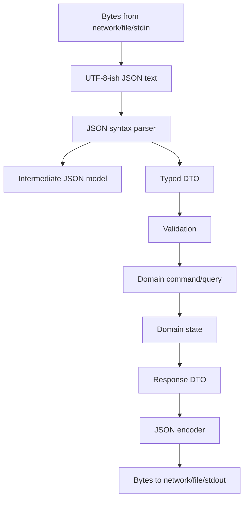
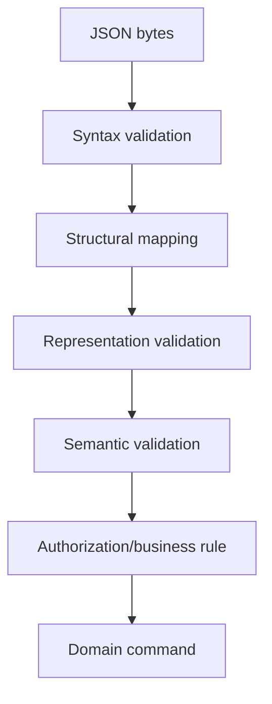
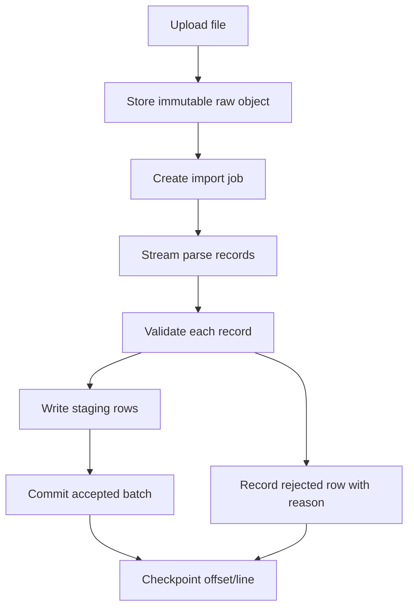

# learn-go-io-buffer-byte-stream-file-network-data-transfer-part-017.md

# Part 017 — JSON Production Patterns: Streaming Decoder, Unknown Fields, Optional Semantics, Schema Drift, Numeric Precision, and Defensive Parsing

> Series: `learn-go-io-buffer-byte-stream-file-network-data-transfer`  
> Part: `017 / 034`  
> Target Go version: Go `1.26.x`  
> Audience: Java software engineer moving toward top-tier Go IO/data-transfer engineering  
> Prerequisites: Parts 000–016, especially `io.Reader`/`io.Writer`, buffering, text IO, error semantics, large-file processing, and standard serialization.

---

## 0. Why This Part Exists

Part 016 introduced standard serialization broadly: JSON, XML, CSV, gob, binary, base64, and hex. This part narrows the lens to **JSON as a production boundary format**.

JSON is deceptively simple. Most teams start with:

```go
var req CreateUserRequest
if err := json.NewDecoder(r.Body).Decode(&req); err != nil {
    return err
}
```

That is fine for demos. It is incomplete for production.

Real JSON systems fail because of things like:

- body size is unbounded;
- unknown fields are silently ignored;
- duplicate fields appear and the last value wins;
- numeric values lose precision;
- `null`, missing field, empty value, and zero value collapse into one ambiguous state;
- decoder accepts one JSON value but trailing garbage remains unread;
- request DTO is accidentally reused as domain model;
- streaming parser is replaced with `io.ReadAll` on untrusted input;
- schema evolution happens implicitly instead of deliberately;
- logs expose PII because raw JSON body is dumped on failure;
- API accepts invalid state because validation is done after lossy unmarshalling;
- backward compatibility is broken by renaming fields without migration logic;
- JSON Lines pipeline breaks because a single malformed line aborts the whole export/import without checkpointing.

A top-tier engineer does not treat JSON as “just serialization”. JSON is a **contract boundary** with correctness, security, compatibility, performance, and observability consequences.

---

## 1. Core Mental Model

JSON in Go is not one thing. It is at least five different activities:



The important boundaries are:

| Boundary | Question |
|---|---|
| Byte boundary | How many bytes are allowed? Where do they come from? |
| Syntax boundary | Is the input valid JSON? Is there trailing data? |
| Shape boundary | Does the JSON object match the expected structure? |
| Type boundary | Are the fields representable in Go without precision loss? |
| Semantic boundary | Is the request valid in the business/domain sense? |
| Compatibility boundary | Can old/new clients and servers coexist? |
| Output boundary | Is the emitted JSON stable, safe, and intentionally shaped? |

A common production bug is skipping directly from **bytes** to **domain state**.

Bad model:

```text
JSON body -> domain object -> business logic
```

Better model:

```text
JSON body -> bounded syntax parse -> DTO -> structural validation -> semantic validation -> domain command
```

---

## 2. Java-to-Go Translation

As a Java engineer, you may be used to Jackson, Gson, Jakarta JSON-B, JSON-P, Spring MVC deserialization, Bean Validation, and object mappers that integrate deeply with framework lifecycle.

In Go, the standard model is more explicit:

| Java ecosystem habit | Go production equivalent |
|---|---|
| Controller method takes DTO automatically | Handler explicitly decodes body |
| Jackson object mapper global config | Local `json.Decoder` / `json.Encoder` policy |
| Bean Validation annotations | Explicit validation function/method |
| `Optional<T>` | pointer, custom optional type, or explicit presence map |
| `BigDecimal` | `json.Number`, string decimal, custom decimal type |
| Exception thrown during deserialize | explicit `error` return |
| DTO often reused as domain object | DTO should be translated into domain command |
| Object mapper can be globally hardened | Each boundary must be deliberately hardened |

This explicitness is a strength. It forces you to decide what each JSON boundary is allowed to accept.

---

## 3. Important Facts About Go `encoding/json`

The stable default package is:

```go
import "encoding/json"
```

It supports:

- `json.Marshal`
- `json.Unmarshal`
- `json.NewEncoder(io.Writer)`
- `json.NewDecoder(io.Reader)`
- `json.RawMessage`
- `json.Number`
- `Marshaler` / `Unmarshaler`
- streaming tokens via `Decoder.Token`
- options like `Decoder.DisallowUnknownFields` and `Decoder.UseNumber`

There is also an experimental JSON implementation available under `GOEXPERIMENT=jsonv2`, including `encoding/json/v2` and `encoding/json/jsontext`. It is not the default stable production API and is not subject to the Go 1 compatibility promise in the same way as ordinary standard library APIs. For this series, the main baseline is stable `encoding/json`, while experimental JSON v2 is discussed only as a forward-looking option.

---

## 4. First Production Rule: Bound the Input Before Decoding

Never decode untrusted JSON directly from an unlimited reader.

Bad:

```go
func DecodeCreateUser(r io.Reader) (CreateUserRequest, error) {
    var req CreateUserRequest
    err := json.NewDecoder(r).Decode(&req)
    return req, err
}
```

Why bad?

- Reader may be an HTTP body with no practical size bound.
- A malicious client can send a huge JSON value.
- A huge string field may allocate memory before validation.
- Decoder can block waiting for more input.
- Error message may not contain enough operational context.

Better:

```go
func DecodeCreateUser(r io.Reader, maxBytes int64) (CreateUserRequest, error) {
    limited := io.LimitReader(r, maxBytes+1)

    var req CreateUserRequest
    dec := json.NewDecoder(limited)
    dec.DisallowUnknownFields()

    if err := dec.Decode(&req); err != nil {
        return CreateUserRequest{}, fmt.Errorf("decode create user request: %w", err)
    }

    // Check if there is a second JSON value or trailing non-whitespace garbage.
    if dec.Decode(&struct{}{}) != io.EOF {
        return CreateUserRequest{}, fmt.Errorf("decode create user request: trailing data")
    }

    if err := req.Validate(); err != nil {
        return CreateUserRequest{}, fmt.Errorf("validate create user request: %w", err)
    }

    return req, nil
}
```

However, `io.LimitReader(maxBytes+1)` alone does not automatically tell you whether the input exceeded the limit unless you detect it carefully. For HTTP handlers, `http.MaxBytesReader` is usually better because it actively enforces a limit and integrates with the response writer/body handling.

A robust standalone pattern:

```go
type CountingLimitReader struct {
    R        io.Reader
    Limit    int64
    consumed int64
}

func (r *CountingLimitReader) Read(p []byte) (int, error) {
    if r.consumed >= r.Limit {
        return 0, fmt.Errorf("input exceeds limit of %d bytes", r.Limit)
    }

    remaining := r.Limit - r.consumed
    if int64(len(p)) > remaining {
        p = p[:remaining]
    }

    n, err := r.R.Read(p)
    r.consumed += int64(n)
    return n, err
}
```

Use bounded input for:

- HTTP request bodies;
- CLI input from stdin;
- file imports from users;
- message payloads from queues;
- JSON config files in shared environments;
- compressed input after decompression, not only before decompression.

---

## 5. Second Production Rule: Decode Exactly One JSON Value

`Decoder.Decode(&v)` reads one JSON value. It does not automatically guarantee that the stream contains only one JSON value.

Example malicious or accidental input:

```json
{"name":"alice"} {"admin":true}
```

If your code decodes once and ignores the rest, you may accept a body that downstream tools see differently.

Production pattern:

```go
func DecodeOne[T any](r io.Reader, dst *T, configure func(*json.Decoder)) error {
    dec := json.NewDecoder(r)
    if configure != nil {
        configure(dec)
    }

    if err := dec.Decode(dst); err != nil {
        return fmt.Errorf("decode json value: %w", err)
    }

    var extra struct{}
    if err := dec.Decode(&extra); err != io.EOF {
        if err == nil {
            return fmt.Errorf("decode json value: multiple JSON values")
        }
        return fmt.Errorf("decode json value: trailing invalid data: %w", err)
    }

    return nil
}
```

Usage:

```go
var req CreateUserRequest
err := DecodeOne(r, &req, func(dec *json.Decoder) {
    dec.DisallowUnknownFields()
    dec.UseNumber()
})
```

Why decode into `struct{}` for the second decode?

Because you only need to know whether a second value exists. You do not need to allocate a map or parse a full application structure.

---

## 6. Unknown Fields: Strict vs Lenient Policy

By default, Go ignores unknown object fields when unmarshalling into a struct.

Example:

```go
type CreateUserRequest struct {
    Email string `json:"email"`
}
```

Input:

```json
{
  "email": "a@example.com",
  "role": "admin"
}
```

Default behavior: `role` is ignored.

That may be okay for forward-compatible internal consumers. It is dangerous for command APIs where the client may think a field was accepted.

Enable strict mode:

```go
dec := json.NewDecoder(r)
dec.DisallowUnknownFields()
```

Decision matrix:

| Context | Unknown field policy |
|---|---|
| Public create/update command API | Usually reject |
| Internal event consumer | Often tolerate but observe |
| Config file | Usually reject; typo should fail fast |
| Analytics ingestion | Usually tolerate, preserve raw if needed |
| Webhook receiver | Depends on provider; usually tolerate unknowns |
| Security-sensitive permission input | Reject |

Important nuance: strict unknown field rejection is not a replacement for validation. It only says “field names are known”. It does not say “values are valid”.

---

## 7. Duplicate Fields: The Subtle Contract Problem

JSON allows object member names to appear multiple times syntactically, but different parsers disagree on semantics. Many parsers use “last value wins”. Go's stable `encoding/json` also processes object fields in observed order, and later duplicates can override earlier values for normal struct/map decoding.

Example:

```json
{
  "role": "user",
  "role": "admin"
}
```

This matters when JSON crosses security or compliance boundaries.

Risk cases:

- reverse proxy validates first occurrence but backend uses last occurrence;
- WAF and app disagree;
- audit log stores normalized object but original had duplicate ambiguity;
- signature verification canonicalizes differently from business parser;
- API gateway rejects/accepts differently from service.

Stable `encoding/json` v1 does not provide a simple built-in `RejectDuplicateNames` toggle. Production options:

1. Accept duplicate field behavior deliberately and document it.
2. Use a token-level pre-scan for security-sensitive inputs.
3. Use JSON schema validation tooling that rejects duplicates if supported.
4. Use experimental JSON v2/jsontext only with deliberate adoption policy.
5. Use canonical signed formats where duplicate handling is explicitly defined.

Example simplified duplicate detector for one object level:

```go
func RejectDuplicateTopLevelObjectFields(r io.Reader) error {
    dec := json.NewDecoder(r)

    tok, err := dec.Token()
    if err != nil {
        return fmt.Errorf("read first token: %w", err)
    }

    d, ok := tok.(json.Delim)
    if !ok || d != '{' {
        return fmt.Errorf("expected object")
    }

    seen := map[string]struct{}{}

    for dec.More() {
        keyTok, err := dec.Token()
        if err != nil {
            return fmt.Errorf("read object key: %w", err)
        }

        key, ok := keyTok.(string)
        if !ok {
            return fmt.Errorf("expected object key")
        }

        if _, exists := seen[key]; exists {
            return fmt.Errorf("duplicate JSON field %q", key)
        }
        seen[key] = struct{}{}

        var raw json.RawMessage
        if err := dec.Decode(&raw); err != nil {
            return fmt.Errorf("skip value for key %q: %w", key, err)
        }
    }

    end, err := dec.Token()
    if err != nil {
        return fmt.Errorf("read object end: %w", err)
    }
    if d, ok := end.(json.Delim); !ok || d != '}' {
        return fmt.Errorf("expected object end")
    }

    return nil
}
```

This example is intentionally limited. A full duplicate detector must recurse through nested objects and arrays.

---

## 8. Optional, Missing, Null, Empty, and Zero

This is one of the most important JSON production topics.

The following are not the same:

```json
{}
```

```json
{"name": null}
```

```json
{"name": ""}
```

```json
{"name": "alice"}
```

But if you decode into:

```go
type PatchUserRequest struct {
    Name string `json:"name"`
}
```

Then missing, null, and empty string may collapse into a zero value in ways that are not semantically sufficient for PATCH/update APIs.

### 8.1 Use Pointer for Simple Optional Fields

```go
type PatchUserRequest struct {
    Name *string `json:"name"`
}
```

Interpretation:

| Input | Go value |
|---|---|
| `{}` | `Name == nil` |
| `{"name":"alice"}` | `Name != nil && *Name == "alice"` |
| `{"name":""}` | `Name != nil && *Name == ""` |
| `{"name":null}` | `Name == nil` |

Pointer distinguishes missing vs present non-null. It does **not** distinguish missing vs explicit null.

### 8.2 Use Custom Optional Type to Distinguish Missing vs Null

For PATCH semantics, explicit null may mean “clear this field”, while missing means “leave unchanged”.

```go
type OptionalString struct {
    Set   bool
    Null  bool
    Value string
}

func (o *OptionalString) UnmarshalJSON(b []byte) error {
    o.Set = true

    if string(b) == "null" {
        o.Null = true
        o.Value = ""
        return nil
    }

    var s string
    if err := json.Unmarshal(b, &s); err != nil {
        return err
    }

    o.Null = false
    o.Value = s
    return nil
}
```

Usage:

```go
type PatchUserRequest struct {
    Name OptionalString `json:"name"`
}
```

But there is a catch: for non-pointer struct fields, if the field is missing, `UnmarshalJSON` is not called. That is useful here because `Set` remains false.

Interpretation:

| Input | `Set` | `Null` | `Value` |
|---|---:|---:|---|
| `{}` | false | false | `""` |
| `{"name":null}` | true | true | `""` |
| `{"name":""}` | true | false | `""` |
| `{"name":"alice"}` | true | false | `"alice"` |

This is the minimal production pattern for PATCH DTOs.

### 8.3 Do Not Use Pointer Everywhere Blindly

Pointers have cost:

- nil checks everywhere;
- unclear semantics if overused;
- more allocation possibilities;
- awkward validation;
- accidental sharing if reused.

Use pointers/custom optionals where semantics require presence tracking.

For create commands, required fields usually should not be pointers unless `null` vs missing matters.

---

## 9. DTO Boundary: Do Not Decode Directly Into Domain Model

Bad:

```go
type User struct {
    ID       string
    Email    string
    Role     string
    Disabled bool
}

func CreateUserHandler(w http.ResponseWriter, r *http.Request) {
    var user User
    _ = json.NewDecoder(r.Body).Decode(&user)
    save(user)
}
```

Why bad?

- Client can send internal fields like `id`, `role`, `disabled` if tags expose them.
- Domain invariants are bypassed.
- Persistence shape leaks into API shape.
- Future field additions become security risk.
- Input validation gets mixed with domain behavior.

Better:

```go
type CreateUserRequest struct {
    Email string `json:"email"`
    Name  string `json:"name"`
}

func (r CreateUserRequest) Validate() error {
    if strings.TrimSpace(r.Email) == "" {
        return fmt.Errorf("email is required")
    }
    if strings.TrimSpace(r.Name) == "" {
        return fmt.Errorf("name is required")
    }
    return nil
}

type CreateUserCommand struct {
    Email string
    Name  string
}

func (r CreateUserRequest) Command() (CreateUserCommand, error) {
    if err := r.Validate(); err != nil {
        return CreateUserCommand{}, err
    }
    return CreateUserCommand{
        Email: strings.TrimSpace(strings.ToLower(r.Email)),
        Name:  strings.TrimSpace(r.Name),
    }, nil
}
```

Boundary rule:

```text
JSON DTO is an integration contract.
Domain model is an invariant boundary.
Never let external JSON directly become internal truth.
```

---

## 10. Numeric Precision

JSON has one numeric syntax. Go has many numeric types.

Potential problems:

- JavaScript clients may lose precision beyond 53-bit safe integer range.
- Go decoding into `float64` may lose integer precision.
- Decoding into `interface{}` defaults numbers to `float64` unless `UseNumber` is set.
- Monetary values should not be represented as float.
- IDs encoded as numbers may break cross-language clients.

Bad:

```go
var v map[string]any
_ = json.Unmarshal(body, &v)
id := v["id"].(float64)
```

Better when using dynamic maps:

```go
dec := json.NewDecoder(r)
dec.UseNumber()

var v map[string]any
if err := dec.Decode(&v); err != nil {
    return err
}

n, ok := v["id"].(json.Number)
if !ok {
    return fmt.Errorf("id must be number")
}

id, err := n.Int64()
if err != nil {
    return fmt.Errorf("invalid id: %w", err)
}
```

For money:

```json
{"amount":"1234.56","currency":"SGD"}
```

or integer minor units:

```json
{"amount_cents":123456,"currency":"SGD"}
```

For IDs, prefer string if cross-language safety matters:

```json
{"case_id":"9223372036854775808"}
```

Decision table:

| Data | Recommended JSON representation |
|---|---|
| database ID | string if large/cross-language; int64 only if controlled |
| money | string decimal or integer minor unit |
| percentage/rate | string decimal or fixed-point integer if exactness matters |
| scientific measurement | number/float acceptable if approximation is intended |
| counter | integer with explicit range validation |
| timestamp | RFC3339 string unless protocol explicitly uses epoch |

---

## 11. Time Fields

Go's `time.Time` marshals to JSON string in RFC3339Nano-like format by default. That can be convenient, but production APIs should still define policy.

Questions to answer:

- Is timezone required?
- Is UTC required?
- Is date-only allowed?
- Is local time allowed?
- Is offset preserved or normalized?
- What precision is accepted: seconds, milliseconds, nanoseconds?
- Is zero time valid?
- How is missing/null time represented?

Example DTO:

```go
type ScheduleRequest struct {
    StartsAt time.Time `json:"starts_at"`
}

func (r ScheduleRequest) Validate() error {
    if r.StartsAt.IsZero() {
        return fmt.Errorf("starts_at is required")
    }
    return nil
}
```

If you need date-only semantics, do not overload `time.Time` without clear custom type.

```go
type Date struct {
    time.Time
}

func (d *Date) UnmarshalJSON(b []byte) error {
    var s string
    if err := json.Unmarshal(b, &s); err != nil {
        return err
    }

    t, err := time.Parse("2006-01-02", s)
    if err != nil {
        return fmt.Errorf("date must be YYYY-MM-DD: %w", err)
    }

    d.Time = t
    return nil
}
```

Keep domain meaning separate:

| Field | Type idea |
|---|---|
| exact instant | `time.Time` normalized to UTC |
| local business date | custom `Date` |
| local clock time | custom `LocalTime` |
| duration | string duration or integer seconds/millis |

---

## 12. Streaming JSON: Decoder vs Unmarshal

`json.Unmarshal` requires the full byte slice in memory.

```go
var rows []Row
if err := json.Unmarshal(body, &rows); err != nil {
    return err
}
```

`json.Decoder` reads from an `io.Reader` incrementally.

```go
dec := json.NewDecoder(r)
for dec.More() {
    var row Row
    if err := dec.Decode(&row); err != nil {
        return err
    }
    process(row)
}
```

But correct streaming array parsing requires token handling.

### 12.1 Streaming an Array

Input:

```json
[
  {"id":1,"name":"a"},
  {"id":2,"name":"b"}
]
```

Parser:

```go
func ProcessJSONArray[T any](r io.Reader, process func(T) error) error {
    dec := json.NewDecoder(r)
    dec.DisallowUnknownFields()
    dec.UseNumber()

    tok, err := dec.Token()
    if err != nil {
        return fmt.Errorf("read array start: %w", err)
    }

    d, ok := tok.(json.Delim)
    if !ok || d != '[' {
        return fmt.Errorf("expected JSON array")
    }

    index := 0
    for dec.More() {
        var item T
        if err := dec.Decode(&item); err != nil {
            return fmt.Errorf("decode item %d: %w", index, err)
        }
        if err := process(item); err != nil {
            return fmt.Errorf("process item %d: %w", index, err)
        }
        index++
    }

    tok, err = dec.Token()
    if err != nil {
        return fmt.Errorf("read array end: %w", err)
    }
    d, ok = tok.(json.Delim)
    if !ok || d != ']' {
        return fmt.Errorf("expected JSON array end")
    }

    if err := dec.Decode(&struct{}{}); err != io.EOF {
        return fmt.Errorf("trailing JSON data")
    }

    return nil
}
```

Why this matters:

- memory stays bounded;
- errors can be reported by record index;
- processing can checkpoint progress;
- large arrays can be imported without loading all rows;
- backpressure can be applied by the `process` function.

### 12.2 JSON Lines / NDJSON

JSON Lines is often better for large exports/imports than a single giant JSON array.

Example:

```jsonl
{"id":1,"name":"a"}
{"id":2,"name":"b"}
{"id":3,"name":"c"}
```

Benefits:

- append-friendly;
- record-level error handling;
- checkpoint by byte offset or line number;
- works well with log pipelines;
- no need to keep array brackets consistent across partial writes.

A simple scanner-based implementation:

```go
func ProcessJSONLines[T any](r io.Reader, maxLineBytes int, process func(line int, item T) error) error {
    scanner := bufio.NewScanner(r)
    scanner.Buffer(make([]byte, 0, 64*1024), maxLineBytes)

    lineNo := 0
    for scanner.Scan() {
        lineNo++
        line := scanner.Bytes()
        if len(bytes.TrimSpace(line)) == 0 {
            continue
        }

        var item T
        dec := json.NewDecoder(bytes.NewReader(line))
        dec.DisallowUnknownFields()
        dec.UseNumber()

        if err := dec.Decode(&item); err != nil {
            return fmt.Errorf("decode line %d: %w", lineNo, err)
        }
        if err := dec.Decode(&struct{}{}); err != io.EOF {
            return fmt.Errorf("decode line %d: trailing data", lineNo)
        }

        if err := process(lineNo, item); err != nil {
            return fmt.Errorf("process line %d: %w", lineNo, err)
        }
    }

    if err := scanner.Err(); err != nil {
        return fmt.Errorf("scan JSON lines: %w", err)
    }

    return nil
}
```

Important: scanner has a token limit. Always set it deliberately if line size can exceed the default.

---

## 13. `json.RawMessage`: Delayed Decoding and Envelope Patterns

`json.RawMessage` stores raw encoded JSON bytes.

Use it when the outer envelope decides how the inner payload should be parsed.

Example:

```json
{
  "type": "user.created",
  "version": 2,
  "payload": {
    "user_id": "u-123",
    "email": "a@example.com"
  }
}
```

Go:

```go
type EventEnvelope struct {
    Type    string          `json:"type"`
    Version int             `json:"version"`
    Payload json.RawMessage `json:"payload"`
}

type UserCreatedV2 struct {
    UserID string `json:"user_id"`
    Email  string `json:"email"`
}

func DecodeEvent(r io.Reader) error {
    var env EventEnvelope
    if err := DecodeOne(r, &env, func(dec *json.Decoder) {
        dec.DisallowUnknownFields()
        dec.UseNumber()
    }); err != nil {
        return err
    }

    switch env.Type {
    case "user.created":
        switch env.Version {
        case 2:
            var payload UserCreatedV2
            if err := json.Unmarshal(env.Payload, &payload); err != nil {
                return fmt.Errorf("decode user.created v2 payload: %w", err)
            }
            return handleUserCreatedV2(payload)
        default:
            return fmt.Errorf("unsupported user.created version %d", env.Version)
        }
    default:
        return fmt.Errorf("unsupported event type %q", env.Type)
    }
}
```

Use cases:

- event envelopes;
- webhook payload dispatch;
- versioned command payloads;
- partial parsing of large documents;
- audit logging original payload portion;
- forward-compatible storage where unknown subtype payload should be preserved.

Caution:

- `RawMessage` still stores bytes in memory.
- It is not a streaming solution by itself.
- Validate payload after subtype selection.
- Avoid logging raw payload if it may contain secrets or PII.

---

## 14. Custom Marshal/Unmarshal

Use custom `UnmarshalJSON` for boundary-specific parsing.

Good use cases:

- date-only type;
- decimal string type;
- enum validation;
- base64-encoded binary field;
- custom optional presence/null type;
- rejecting invalid lexical forms before domain validation;
- compatibility adapters for legacy API shapes.

Example enum:

```go
type UserStatus string

const (
    UserStatusActive   UserStatus = "active"
    UserStatusDisabled UserStatus = "disabled"
)

func (s *UserStatus) UnmarshalJSON(b []byte) error {
    var raw string
    if err := json.Unmarshal(b, &raw); err != nil {
        return err
    }

    switch UserStatus(raw) {
    case UserStatusActive, UserStatusDisabled:
        *s = UserStatus(raw)
        return nil
    default:
        return fmt.Errorf("invalid user status %q", raw)
    }
}
```

But avoid custom unmarshal when simple validation after decode is enough. Custom unmarshal should handle representation-level constraints, not business workflow constraints.

Bad custom unmarshal:

```go
func (r *CreateCaseRequest) UnmarshalJSON(b []byte) error {
    // Bad: calls database, checks user permission, mutates global state.
    return nil
}
```

Keep `UnmarshalJSON` pure and deterministic.

---

## 15. Validation Layering

Separate validation into layers.



| Layer | Example |
|---|---|
| Syntax | valid JSON, one value only |
| Structural | known fields, correct JSON types |
| Representation | email string not empty, enum allowed, date format |
| Semantic | end date after start date, amount positive |
| Authorization | caller may set this field/action |
| Domain invariant | state transition allowed |

Do not collapse all validation into tags or unmarshal methods. JSON validation is not domain validation.

---

## 16. Response Encoding

For responses, prefer streaming directly to `io.Writer` when possible:

```go
func WriteJSON(w io.Writer, v any) error {
    enc := json.NewEncoder(w)
    enc.SetEscapeHTML(true)
    return enc.Encode(v)
}
```

`Encoder.Encode` writes a JSON value followed by a newline. That newline is usually fine for HTTP/CLI/log-like output, but know that it exists.

For HTTP responses:

```go
func WriteHTTPJSON(w http.ResponseWriter, status int, v any) {
    w.Header().Set("Content-Type", "application/json; charset=utf-8")
    w.WriteHeader(status)

    if err := json.NewEncoder(w).Encode(v); err != nil {
        // At this point the status/header may already be sent.
        // Log internally; do not try to send another JSON error body.
        log.Printf("write json response: %v", err)
    }
}
```

Important: once headers/body are written, error recovery is limited. If encoding can fail due to application data, consider encoding into a small buffer first for error responses.

```go
func WriteSmallHTTPJSON(w http.ResponseWriter, status int, v any) {
    var buf bytes.Buffer
    enc := json.NewEncoder(&buf)
    if err := enc.Encode(v); err != nil {
        http.Error(w, "internal error", http.StatusInternalServerError)
        return
    }

    w.Header().Set("Content-Type", "application/json; charset=utf-8")
    w.WriteHeader(status)
    _, _ = w.Write(buf.Bytes())
}
```

Trade-off:

| Approach | Pro | Con |
|---|---|---|
| encode directly to response | low memory, streaming | encoding error after headers are sent |
| encode to buffer first | can fail before response commit | memory proportional to response |
| stream array manually | bounded memory | more complex failure semantics |

---

## 17. Streaming JSON Responses

For large result sets, do not build a giant slice just to marshal it.

Bad:

```go
rows := loadAllRows()
json.NewEncoder(w).Encode(rows)
```

Better streaming array:

```go
func WriteJSONArray[T any](w io.Writer, rows func(yield func(T) error) error) error {
    bw := bufio.NewWriter(w)
    defer bw.Flush()

    if _, err := bw.WriteString("["); err != nil {
        return err
    }

    first := true
    enc := json.NewEncoder(bw)

    err := rows(func(row T) error {
        if !first {
            if _, err := bw.WriteString(","); err != nil {
                return err
            }
        }
        first = false

        if err := enc.Encode(row); err != nil {
            return err
        }
        return nil
    })
    if err != nil {
        return err
    }

    if _, err := bw.WriteString("]"); err != nil {
        return err
    }

    return bw.Flush()
}
```

Caution: `Encoder.Encode` adds newline after each value. That is valid whitespace in JSON arrays after each object, but if you require compact output, use `json.Marshal` per row or a custom encoder strategy. For huge rows, per-row marshal may still be acceptable because memory is bounded to one row.

JSON Lines response is often operationally simpler:

```go
func WriteJSONLines[T any](w io.Writer, rows func(yield func(T) error) error) error {
    bw := bufio.NewWriter(w)
    defer bw.Flush()

    enc := json.NewEncoder(bw)
    if err := rows(func(row T) error {
        return enc.Encode(row)
    }); err != nil {
        return err
    }

    return bw.Flush()
}
```

JSON Lines is not a single JSON array, so clients must agree on the format.

---

## 18. HTML Escaping

`encoding/json` escapes certain characters by default to make JSON safer when embedded in HTML contexts. `Encoder.SetEscapeHTML(false)` disables that behavior.

Default escaping is usually fine. Disable it only if:

- you own the consumer;
- you care about exact textual output or readability;
- you are not embedding the JSON inside HTML/script context;
- your security review accepts the risk.

```go
enc := json.NewEncoder(w)
enc.SetEscapeHTML(false)
```

For API JSON over HTTP, either can be acceptable, but consistency matters. Do not change it accidentally in a compatibility-sensitive API.

---

## 19. Stable Output and Compatibility

JSON object field order should not be treated as semantically meaningful. But stable output can matter for:

- tests;
- cache keys;
- signatures;
- diffs;
- audit snapshots;
- reproducible artifacts.

Go's map iteration order is deliberately not stable. If stable output matters, do not marshal raw maps as contract output.

Bad for stable output:

```go
json.Marshal(map[string]any{
    "b": 2,
    "a": 1,
})
```

Better:

```go
type Response struct {
    A int `json:"a"`
    B int `json:"b"`
}
```

For canonical JSON/signature use cases, standard `encoding/json` alone is usually not enough. You need explicit canonicalization rules.

---

## 20. Schema Evolution and Drift

JSON schemas drift over time. Production systems must design for evolution intentionally.

Types of change:

| Change | Usually compatible? | Notes |
|---|---:|---|
| Add optional response field | yes | Old clients ignore if tolerant |
| Add required request field | no | Breaks old clients |
| Remove response field | maybe no | Clients may depend on it |
| Rename field | no | Treat as add new + deprecate old |
| Change type string→number | no | Breaks parsers |
| Widen numeric range | maybe | Cross-language precision risk |
| Add enum value | maybe no | Strict clients may reject |
| Make nullable non-null | maybe | Depends on clients |
| Make non-null nullable | maybe no | Clients may not handle null |

### 20.1 Versioning Strategies

| Strategy | Use when |
|---|---|
| URI version `/v1/...` | Public API major changes |
| media type version | API gateway/content negotiation maturity exists |
| envelope version | event/message protocols |
| field-level compatibility | most internal DTO evolution |
| dual-read dual-write | migrations |

### 20.2 Dual Field Decode

Legacy input:

```json
{"userName":"alice"}
```

New input:

```json
{"user_name":"alice"}
```

Adapter DTO:

```go
type UserRequest struct {
    UserName    string `json:"user_name"`
    LegacyName  string `json:"userName"`
}

func (r UserRequest) NormalizedName() (string, error) {
    if r.UserName != "" && r.LegacyName != "" && r.UserName != r.LegacyName {
        return "", fmt.Errorf("user_name and userName conflict")
    }
    if r.UserName != "" {
        return r.UserName, nil
    }
    return r.LegacyName, nil
}
```

This is boring but reliable. Do not rely on magical aliases without conflict detection.

---

## 21. Partial Updates: PATCH Semantics

PATCH endpoints are where JSON semantics become tricky.

Example request:

```json
{
  "display_name": null,
  "phone": "+6512345678"
}
```

Possible meaning:

- `display_name: null` means clear display name;
- `phone` means update phone;
- absent `email` means leave email unchanged.

DTO:

```go
type Optional[T any] struct {
    Set   bool
    Null  bool
    Value T
}

func (o *Optional[T]) UnmarshalJSON(b []byte) error {
    o.Set = true
    if string(b) == "null" {
        o.Null = true
        var zero T
        o.Value = zero
        return nil
    }

    var v T
    if err := json.Unmarshal(b, &v); err != nil {
        return err
    }
    o.Value = v
    o.Null = false
    return nil
}

type PatchProfileRequest struct {
    DisplayName Optional[string] `json:"display_name"`
    Phone       Optional[string] `json:"phone"`
}
```

Apply logic:

```go
func (r PatchProfileRequest) ApplyTo(p *Profile) error {
    if r.DisplayName.Set {
        if r.DisplayName.Null {
            p.DisplayName = ""
        } else {
            name := strings.TrimSpace(r.DisplayName.Value)
            if len(name) > 100 {
                return fmt.Errorf("display_name too long")
            }
            p.DisplayName = name
        }
    }

    if r.Phone.Set {
        if r.Phone.Null {
            p.Phone = ""
        } else {
            p.Phone = strings.TrimSpace(r.Phone.Value)
        }
    }

    return nil
}
```

This is explicit, auditable, and testable.

---

## 22. Error Reporting Without Leaking Data

Bad error response:

```json
{
  "error": "json: cannot unmarshal string into Go struct field Payment.card_number of type int"
}
```

Potential problems:

- exposes internal Go type/field names;
- may reveal model structure;
- inconsistent user experience;
- may include sensitive context if you wrapped poorly.

Better operational split:

| Audience | Detail |
|---|---|
| Client | stable error code, field path if safe, concise message |
| Logs | internal error with request ID, safe metadata |
| Metrics | error class and endpoint |
| Trace | sanitized event attributes |

Example:

```go
type APIError struct {
    Code    string `json:"code"`
    Message string `json:"message"`
    Field   string `json:"field,omitempty"`
}
```

Client response:

```json
{
  "code": "invalid_json",
  "message": "Request body must be valid JSON."
}
```

For validation:

```json
{
  "code": "validation_failed",
  "message": "Request body is invalid.",
  "field": "email"
}
```

Log internally:

```go
logger.Warn("decode request failed",
    "request_id", requestID,
    "endpoint", "POST /users",
    "error_class", "invalid_json",
    "err", err,
)
```

Do not log raw body by default.

---

## 23. JSON and Security

Security risks:

| Risk | Mitigation |
|---|---|
| oversized body | max byte limit |
| deeply nested JSON | depth-aware parser/pre-scan for high-risk input |
| unknown fields | strict mode where appropriate |
| duplicate fields | reject or define policy for security boundaries |
| numeric precision | `UseNumber`, string IDs, fixed-point money |
| mass assignment | DTO boundary, no domain decode |
| path injection in JSON fields | validate after decode using path safety rules |
| SQL/command injection | parameterize downstream; JSON validation is not enough |
| log leakage | sanitize; avoid raw body logs |
| compressed JSON bomb | limit decompressed bytes |
| polymorphic payload abuse | envelope type allowlist |
| prototype pollution in JS clients | avoid unsafe map merge patterns downstream |

JSON itself is not “safe” or “unsafe”. It is a syntax. Safety comes from boundary controls.

---

## 24. HTTP Request Decoder Pattern

Production helper:

```go
type JSONDecodeOptions struct {
    MaxBytes              int64
    DisallowUnknownFields bool
    UseNumber             bool
}

func DecodeJSONRequest[T any](w http.ResponseWriter, r *http.Request, opts JSONDecodeOptions) (T, error) {
    var zero T

    if opts.MaxBytes > 0 {
        r.Body = http.MaxBytesReader(w, r.Body, opts.MaxBytes)
    }
    defer r.Body.Close()

    dec := json.NewDecoder(r.Body)
    if opts.DisallowUnknownFields {
        dec.DisallowUnknownFields()
    }
    if opts.UseNumber {
        dec.UseNumber()
    }

    var dst T
    if err := dec.Decode(&dst); err != nil {
        return zero, fmt.Errorf("decode JSON request: %w", err)
    }

    if err := dec.Decode(&struct{}{}); err != io.EOF {
        if err == nil {
            return zero, fmt.Errorf("decode JSON request: multiple JSON values")
        }
        return zero, fmt.Errorf("decode JSON request: trailing data: %w", err)
    }

    return dst, nil
}
```

Handler:

```go
func CreateUserHandler(w http.ResponseWriter, r *http.Request) {
    req, err := DecodeJSONRequest[CreateUserRequest](w, r, JSONDecodeOptions{
        MaxBytes:              1 << 20, // 1 MiB
        DisallowUnknownFields: true,
        UseNumber:             true,
    })
    if err != nil {
        WriteHTTPJSON(w, http.StatusBadRequest, APIError{
            Code:    "invalid_json",
            Message: "Request body must be valid JSON.",
        })
        return
    }

    cmd, err := req.Command()
    if err != nil {
        WriteHTTPJSON(w, http.StatusBadRequest, APIError{
            Code:    "validation_failed",
            Message: "Request body is invalid.",
        })
        return
    }

    result, err := service.CreateUser(r.Context(), cmd)
    if err != nil {
        // map domain/application errors intentionally
        WriteHTTPJSON(w, http.StatusInternalServerError, APIError{
            Code:    "internal_error",
            Message: "Internal error.",
        })
        return
    }

    WriteHTTPJSON(w, http.StatusCreated, result)
}
```

Note: generic helpers are convenient, but do not hide policy. Each endpoint should still choose limits and strictness deliberately.

---

## 25. JSON Configuration Files

Config JSON should usually be stricter than API JSON.

Why?

- Typos should fail fast.
- Unknown fields often mean operator error.
- Silent fallback can cause outages.
- Config changes are infrequent enough that strict validation is acceptable.

Pattern:

```go
func LoadConfig(path string) (Config, error) {
    f, err := os.Open(path)
    if err != nil {
        return Config{}, fmt.Errorf("open config: %w", err)
    }
    defer f.Close()

    limited := io.LimitReader(f, 10<<20) // 10 MiB

    dec := json.NewDecoder(limited)
    dec.DisallowUnknownFields()

    var cfg Config
    if err := dec.Decode(&cfg); err != nil {
        return Config{}, fmt.Errorf("decode config: %w", err)
    }
    if err := dec.Decode(&struct{}{}); err != io.EOF {
        return Config{}, fmt.Errorf("decode config: trailing data")
    }

    if err := cfg.Validate(); err != nil {
        return Config{}, fmt.Errorf("validate config: %w", err)
    }

    return cfg, nil
}
```

For config, include field-level context in errors where safe. Operator-facing errors should be actionable.

---

## 26. JSON Imports and Batch Processing

For imports, choose the shape deliberately.

| Shape | Pros | Cons |
|---|---|---|
| giant array | valid single JSON document | hard to recover/checkpoint |
| JSON Lines | record-level handling | not a single JSON document |
| envelope + array | metadata plus records | may still be large |
| chunk files | easier retry/checkpoint | file management complexity |

Production import design:



Do not process large uploaded JSON directly inside an HTTP request if it can take minutes. Store first, process asynchronously, checkpoint progress.

---

## 27. Interoperability With Java Systems

When Go talks to Java systems, define JSON contract explicitly.

Common Java/Go mismatch areas:

| Topic | Java tendency | Go tendency | Risk |
|---|---|---|---|
| decimal | `BigDecimal` | no std decimal | precision loss |
| time | Jackson configurable | `time.Time` RFC3339 | timezone/format mismatch |
| optional | `Optional`, nullable | pointer/custom optional | missing vs null confusion |
| enum | class enum | string custom type | unknown value handling |
| unknown fields | mapper config | decoder option | inconsistent strictness |
| large int | `Long`, `BigInteger` | `int64`, `json.Number` | overflow/precision |
| naming | camelCase | snake_case common in APIs | migration issue |

Contract recommendations:

- Decide field names once and test them.
- Use explicit DTOs on both sides.
- Use contract tests with golden JSON samples.
- Avoid floats for money.
- Avoid numeric IDs if JavaScript clients exist.
- Specify timezone and precision.
- Include examples for null/missing behavior.
- Version event envelopes.

---

## 28. Testing JSON Boundaries

Test categories:

### 28.1 Golden Tests

```go
func TestCreateUserRequestDecode(t *testing.T) {
    input := `{"email":"a@example.com","name":"Alice"}`

    var req CreateUserRequest
    err := DecodeOne(strings.NewReader(input), &req, func(dec *json.Decoder) {
        dec.DisallowUnknownFields()
    })
    if err != nil {
        t.Fatalf("decode: %v", err)
    }

    if req.Email != "a@example.com" || req.Name != "Alice" {
        t.Fatalf("unexpected request: %+v", req)
    }
}
```

### 28.2 Negative Tests

Test:

- malformed JSON;
- unknown field;
- duplicate field if you reject it;
- wrong type;
- missing required field;
- explicit null;
- empty string;
- too large body;
- trailing data;
- multiple JSON values;
- numeric overflow;
- invalid enum;
- invalid time format.

### 28.3 Round-Trip Tests

Useful for internal DTOs:

```go
func TestResponseRoundTrip(t *testing.T) {
    original := UserResponse{ID: "u-1", Email: "a@example.com"}

    b, err := json.Marshal(original)
    if err != nil {
        t.Fatalf("marshal: %v", err)
    }

    var decoded UserResponse
    if err := json.Unmarshal(b, &decoded); err != nil {
        t.Fatalf("unmarshal: %v", err)
    }

    if !reflect.DeepEqual(original, decoded) {
        t.Fatalf("round trip mismatch: %#v != %#v", original, decoded)
    }
}
```

Do not overuse round-trip tests for external APIs. They may miss compatibility issues because the same code encodes and decodes both sides.

### 28.4 Fuzz Tests

Fuzz JSON decoders that are security-sensitive.

```go
func FuzzDecodeCreateUser(f *testing.F) {
    f.Add([]byte(`{"email":"a@example.com","name":"Alice"}`))
    f.Add([]byte(`{}`))
    f.Add([]byte(`{"email":null}`))

    f.Fuzz(func(t *testing.T, data []byte) {
        r := bytes.NewReader(data)
        _, _ = DecodeCreateUser(r, 1<<20)
    })
}
```

Fuzz target should not assert every malformed input is accepted/rejected in a specific way unless that is the property being tested. The first property is often: no panic, no unbounded work, no inconsistent state.

---

## 29. Benchmarking JSON

Benchmark what matters:

- decode small request DTO;
- decode large array streaming;
- encode response DTO;
- encode JSON Lines export;
- dynamic map decode with `UseNumber`;
- custom unmarshal type;
- allocation count.

Example:

```go
func BenchmarkDecodeCreateUser(b *testing.B) {
    input := []byte(`{"email":"a@example.com","name":"Alice"}`)

    b.ReportAllocs()
    for i := 0; i < b.N; i++ {
        var req CreateUserRequest
        dec := json.NewDecoder(bytes.NewReader(input))
        dec.DisallowUnknownFields()
        if err := dec.Decode(&req); err != nil {
            b.Fatal(err)
        }
    }
}
```

Important: do not optimize JSON prematurely by swapping libraries before you have:

- measured actual bottleneck;
- bounded input size;
- removed avoidable `map[string]any` usage;
- avoided unnecessary `io.ReadAll`;
- reduced reflection-heavy hot paths where possible;
- designed streaming correctly;
- checked network/database cost relative to JSON cost.

Many API services are not JSON-CPU-bound. They are usually waiting on network, database, locks, downstream services, or allocation from poor request lifecycle design.

---

## 30. Observability for JSON IO

Track JSON boundary metrics:

| Metric | Why |
|---|---|
| request body bytes | detect abuse and size drift |
| decode duration | detect parser/backpressure issues |
| decode error count by class | identify client/schema problems |
| validation error count by field/code | product/API feedback |
| response encode duration | detect huge responses |
| response bytes | capacity planning |
| import line/record count | batch progress |
| malformed record count | data quality |
| unknown field count if tolerated | schema drift detection |
| truncation/rejection count | security signal |

Do not use raw JSON as metric label. Labels must be low-cardinality and sanitized.

Good labels:

```text
endpoint="POST /users"
error_class="unknown_field"
client="partner-a"
```

Bad labels:

```text
raw_error="json: unknown field \"some-user-controlled-field-name\""
email="alice@example.com"
body="{...}"
```

---

## 31. JSON Anti-Patterns

### 31.1 `map[string]any` Everywhere

Useful for dynamic data, but dangerous as default.

Problems:

- numeric values become `float64` unless `UseNumber`;
- no compile-time field names;
- validation becomes scattered;
- refactoring is unsafe;
- output contract becomes unstable;
- domain logic receives weakly typed data.

Use typed DTOs at boundaries unless dynamic structure is genuinely required.

### 31.2 Decode Directly Into Persistence Entity

This is mass-assignment risk and invariant leakage.

### 31.3 `ReadAll` on Untrusted Body

Even with Go 1.26 `io.ReadAll` improvements, this is still a boundary design issue.

### 31.4 Ignoring Encoder Errors

Bad:

```go
json.NewEncoder(w).Encode(v)
```

Better:

```go
if err := json.NewEncoder(w).Encode(v); err != nil {
    return fmt.Errorf("encode response: %w", err)
}
```

### 31.5 `omitempty` Without Contract Thinking

`omitempty` can make zero values disappear.

```go
type Response struct {
    Count int `json:"count,omitempty"`
}
```

If `count=0` is meaningful, this is wrong.

### 31.6 Inconsistent Field Names

Do not casually mix:

```json
{"userID":"..."}
{"user_id":"..."}
{"userid":"..."}
```

Choose and enforce.

### 31.7 Silent Unknown Field Acceptance in Config

Typos should not silently change runtime behavior.

### 31.8 Using JSON for Everything

JSON is not ideal for all cases. For very high-throughput internal binary protocols, huge numeric arrays, or strict schema evolution, consider other formats. That decision belongs to a later architecture discussion, but the key point is: do not choose JSON by inertia.

---

## 32. Capstone Example: Hardened JSON API Boundary

```go
package api

import (
    "encoding/json"
    "errors"
    "fmt"
    "io"
    "net/http"
    "strings"
)

type APIError struct {
    Code    string `json:"code"`
    Message string `json:"message"`
    Field   string `json:"field,omitempty"`
}

type CreateCaseRequest struct {
    Title       string `json:"title"`
    Description string `json:"description"`
    Priority    string `json:"priority"`
}

func (r CreateCaseRequest) Validate() error {
    if strings.TrimSpace(r.Title) == "" {
        return FieldError{Field: "title", Message: "title is required"}
    }
    if len(r.Title) > 200 {
        return FieldError{Field: "title", Message: "title is too long"}
    }
    switch r.Priority {
    case "low", "medium", "high":
    default:
        return FieldError{Field: "priority", Message: "priority is invalid"}
    }
    return nil
}

type CreateCaseCommand struct {
    Title       string
    Description string
    Priority    string
}

func (r CreateCaseRequest) Command() (CreateCaseCommand, error) {
    if err := r.Validate(); err != nil {
        return CreateCaseCommand{}, err
    }
    return CreateCaseCommand{
        Title:       strings.TrimSpace(r.Title),
        Description: strings.TrimSpace(r.Description),
        Priority:    r.Priority,
    }, nil
}

type FieldError struct {
    Field   string
    Message string
}

func (e FieldError) Error() string { return e.Message }

type JSONDecodeOptions struct {
    MaxBytes              int64
    DisallowUnknownFields bool
    UseNumber             bool
}

func DecodeJSONRequest[T any](w http.ResponseWriter, r *http.Request, opts JSONDecodeOptions) (T, error) {
    var zero T

    if opts.MaxBytes > 0 {
        r.Body = http.MaxBytesReader(w, r.Body, opts.MaxBytes)
    }
    defer r.Body.Close()

    dec := json.NewDecoder(r.Body)
    if opts.DisallowUnknownFields {
        dec.DisallowUnknownFields()
    }
    if opts.UseNumber {
        dec.UseNumber()
    }

    var dst T
    if err := dec.Decode(&dst); err != nil {
        return zero, fmt.Errorf("decode JSON request: %w", err)
    }

    if err := dec.Decode(&struct{}{}); err != io.EOF {
        if err == nil {
            return zero, fmt.Errorf("decode JSON request: multiple JSON values")
        }
        return zero, fmt.Errorf("decode JSON request: trailing data: %w", err)
    }

    return dst, nil
}

func WriteJSON(w http.ResponseWriter, status int, v any) {
    w.Header().Set("Content-Type", "application/json; charset=utf-8")
    w.WriteHeader(status)
    if err := json.NewEncoder(w).Encode(v); err != nil {
        // In real code, log with request id/context.
        return
    }
}

func CreateCaseHandler(svc CaseService) http.HandlerFunc {
    return func(w http.ResponseWriter, r *http.Request) {
        req, err := DecodeJSONRequest[CreateCaseRequest](w, r, JSONDecodeOptions{
            MaxBytes:              1 << 20,
            DisallowUnknownFields: true,
            UseNumber:             true,
        })
        if err != nil {
            WriteJSON(w, http.StatusBadRequest, APIError{
                Code:    "invalid_json",
                Message: "Request body must be valid JSON.",
            })
            return
        }

        cmd, err := req.Command()
        if err != nil {
            var fieldErr FieldError
            if errors.As(err, &fieldErr) {
                WriteJSON(w, http.StatusBadRequest, APIError{
                    Code:    "validation_failed",
                    Message: "Request body is invalid.",
                    Field:   fieldErr.Field,
                })
                return
            }

            WriteJSON(w, http.StatusBadRequest, APIError{
                Code:    "validation_failed",
                Message: "Request body is invalid.",
            })
            return
        }

        out, err := svc.CreateCase(r.Context(), cmd)
        if err != nil {
            WriteJSON(w, http.StatusInternalServerError, APIError{
                Code:    "internal_error",
                Message: "Internal error.",
            })
            return
        }

        WriteJSON(w, http.StatusCreated, out)
    }
}

type CaseService interface {
    CreateCase(ctx context.Context, cmd CreateCaseCommand) (CreateCaseResponse, error)
}

type CreateCaseResponse struct {
    ID string `json:"id"`
}
```

The key design qualities:

- bounded body;
- strict unknown fields;
- exact-one JSON value;
- DTO separated from command;
- validation separated from decoding;
- sanitized client errors;
- typed response;
- no raw body logging;
- clear max size per endpoint.

---

## 33. Design Checklist

Before adding a JSON endpoint or processor, answer:

1. What is the maximum input size?
2. Is input one JSON object, array, JSON Lines, or envelope?
3. Are unknown fields rejected or tolerated?
4. Are duplicate fields accepted, rejected, or documented?
5. Are multiple JSON values rejected?
6. Are trailing bytes rejected?
7. Which fields are required?
8. Which fields distinguish missing vs null?
9. Which numeric fields require exact precision?
10. Which string fields need trimming or normalization?
11. Are time fields timezone-safe?
12. Is the DTO separate from domain/persistence model?
13. Is validation layered?
14. Are client errors sanitized?
15. Are internal logs safe from PII/secrets?
16. Is schema evolution documented?
17. Are golden/negative/fuzz tests present?
18. Are metrics low-cardinality?
19. Is response encoding error handled?
20. Is streaming needed for large responses/imports?

---

## 34. What “Top 1%” Looks Like Here

A top-tier Go engineer does not merely know that `json.NewDecoder` exists.

They can reason about:

- **contract semantics**: what input means, not just how it parses;
- **memory bounds**: where allocation can explode;
- **compatibility**: how clients evolve without breaking;
- **security**: unknowns, duplicates, mass assignment, logs, precision;
- **streaming**: when array vs JSON Lines vs envelope is the right shape;
- **failure model**: malformed record, partial import, bad response write;
- **observability**: how to see schema drift and decode error classes;
- **testing**: golden, negative, fuzz, benchmark, contract tests;
- **interoperability**: Java/Go/JS differences in time, decimal, nullable, enum, and large number semantics.

The deepest insight:

```text
JSON parsing is not the contract.
JSON parsing only turns bytes into values.
The contract is the set of intentional decisions around shape, presence, type, meaning, evolution, and failure.
```

---

## 35. Exercises

### Exercise 1 — Harden a Request Decoder

Write a generic helper that:

- limits request body to configurable bytes;
- rejects unknown fields;
- uses `UseNumber`;
- rejects multiple JSON values;
- rejects trailing non-whitespace data;
- returns sanitized error classes.

### Exercise 2 — PATCH DTO

Implement a PATCH request with three fields:

- `display_name`: missing = no change, null = clear, string = update;
- `email`: missing = no change, null = invalid, string = update;
- `marketing_opt_in`: missing = no change, boolean = update.

Write table tests for all combinations.

### Exercise 3 — JSON Lines Import

Build a JSON Lines processor that:

- accepts max line size;
- decodes strict DTOs;
- reports line number;
- continues on invalid records up to a threshold;
- writes rejected records to a separate JSON Lines file.

### Exercise 4 — Numeric Precision

Create tests showing the difference between:

- decode into `map[string]any` without `UseNumber`;
- decode into `map[string]any` with `UseNumber`;
- decode into typed struct with `int64`;
- decode huge integer into string.

### Exercise 5 — Schema Evolution

Design a DTO that accepts both `caseId` and `case_id`, rejects conflict, emits only `case_id`, and records a metric when legacy field is used.

---

## 36. Summary

You now have the JSON production mental model:

- Bound input before parsing.
- Decode exactly one JSON value unless the format explicitly allows streams.
- Reject unknown fields where correctness matters.
- Treat duplicate fields as a security/contract decision.
- Distinguish missing, null, empty, and zero where semantics require it.
- Do not decode external JSON into domain or persistence models.
- Use `UseNumber` and explicit decimal/string policies for precision-sensitive values.
- Prefer streaming for large arrays/imports/exports.
- Use `RawMessage` for envelopes and delayed decoding.
- Separate decode, validation, authorization, and domain invariants.
- Sanitize errors and logs.
- Test negative cases, fuzz hostile inputs, and benchmark real payloads.

In the next part, we move from JSON object contracts into **protocol design**: framing, length-prefixing, delimiters, checksums, envelopes, metadata, and how to design byte-stream protocols that survive partial reads, corruption, retries, and version evolution.

---

## 37. References

- Go `encoding/json` package documentation: https://pkg.go.dev/encoding/json
- Go `io` package documentation: https://pkg.go.dev/io
- Go `bufio` package documentation: https://pkg.go.dev/bufio
- Go `net/http` package documentation: https://pkg.go.dev/net/http
- Go 1.26 Release Notes: https://go.dev/doc/go1.26
- Go 1.25 Release Notes, experimental `encoding/json/v2`: https://go.dev/doc/go1.25
- Go blog, experimental JSON v2: https://go.dev/blog/jsonv2-exp
- Go release history: https://go.dev/doc/devel/release

---

## 38. Status

Seri belum selesai.

- Selesai: Part 000–017
- Berikutnya: Part 018 — Protocol Design: Framing, Length-Prefix, Delimiters, Checksums, Envelopes, Metadata

<!-- NAVIGATION_FOOTER -->
<div class="page-nav">
<a href="./learn-go-io-buffer-byte-stream-file-network-data-transfer-part-016.md">⬅️ Part 016 — Standard Serialization di Go: JSON, XML, CSV, Gob, Binary, Base64, Hex</a>
<a href="./index.md">📚 Kategori</a>
<a href="../../index.md">🏠 Home</a>
<a href="./learn-go-io-buffer-byte-stream-file-network-data-transfer-part-018.md">Part 018 — Protocol Design: Framing, Length-Prefix, Delimiters, Checksums, Envelopes, Metadata ➡️</a>
</div>
