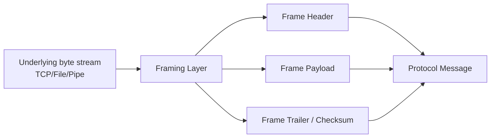
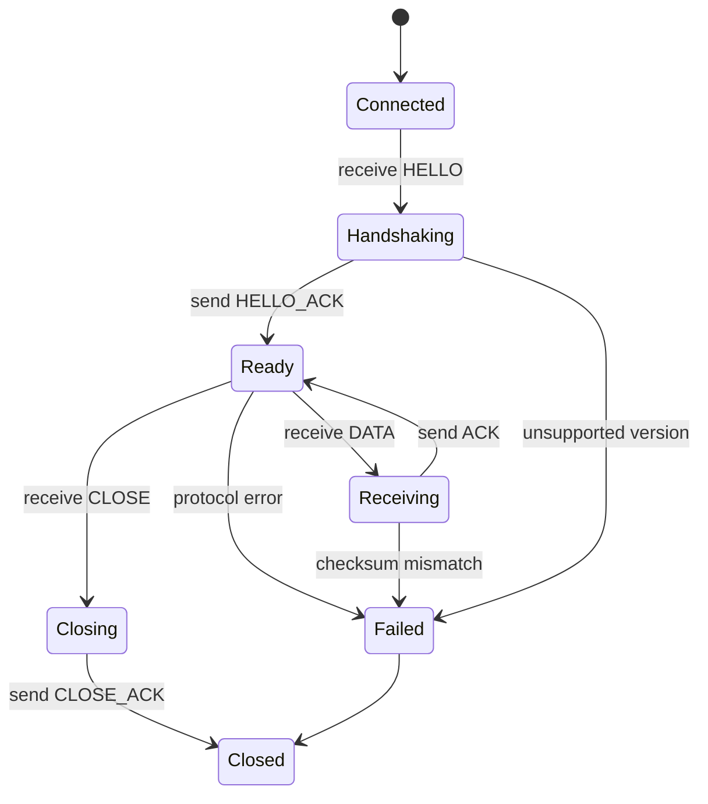
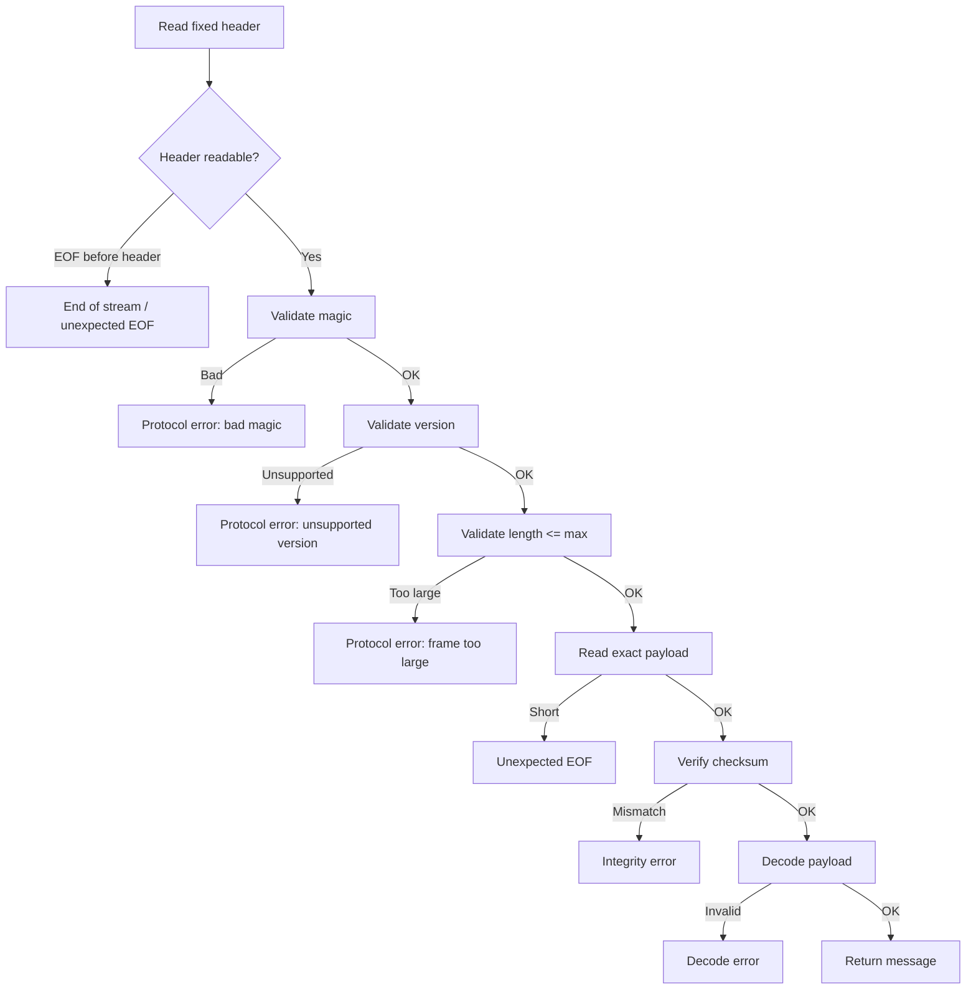
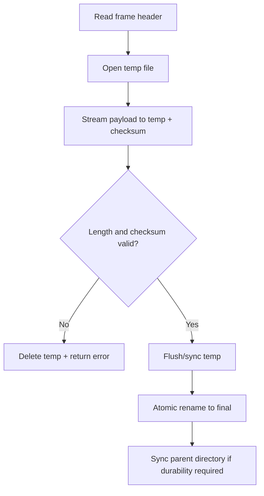
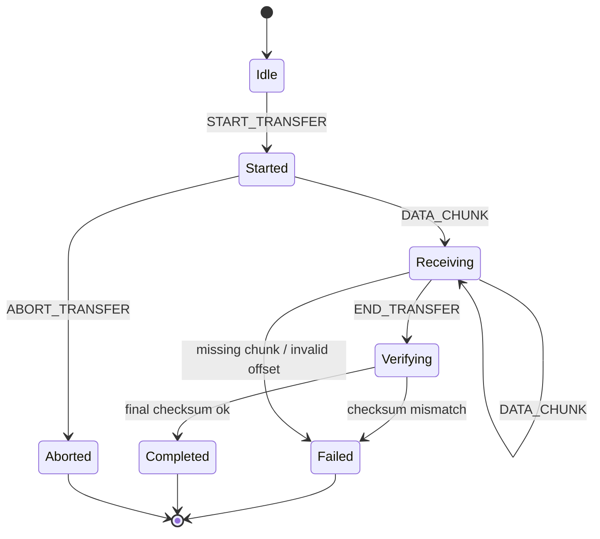
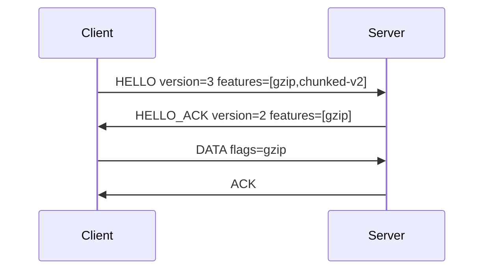
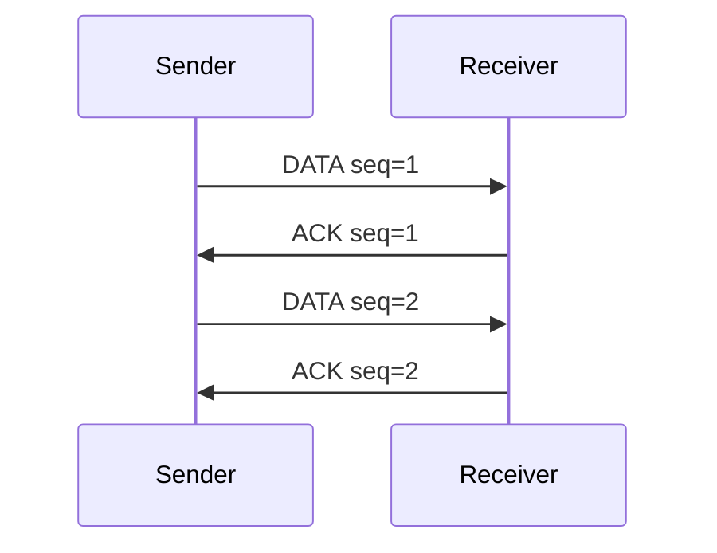
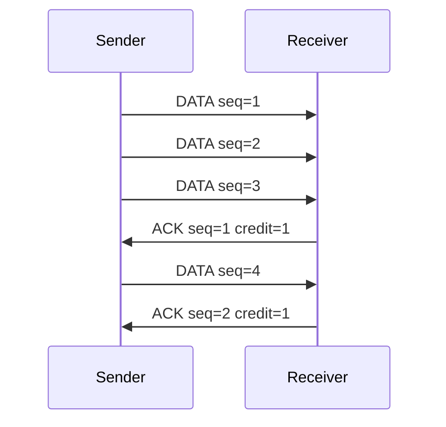
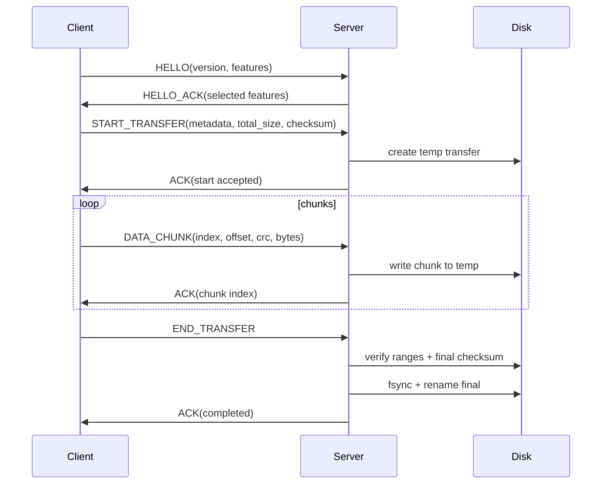

# learn-go-io-buffer-byte-stream-file-network-data-transfer-part-018.md

# Part 018 — Protocol Design: Framing, Length-Prefix, Delimiters, Checksums, Envelopes, Metadata

> Target pembaca: Java software engineer yang ingin memahami desain protokol data-transfer di Go secara production-grade.
>
> Target Go: Go 1.26.x.
>
> Posisi dalam series: setelah memahami byte/buffer/stream/file/serialization, sekarang kita masuk ke pertanyaan yang lebih sistemik: **bagaimana byte stream dibuat menjadi protokol yang bisa diparse, divalidasi, diobservasi, dievolusi, dan dipulihkan ketika gagal.**

---

## 0. Ringkasan Eksekutif

Protokol bukan sekadar format data.

Protokol adalah **kontrak perilaku antara dua endpoint** mengenai:

1. bagaimana pesan dimulai,
2. bagaimana panjang pesan diketahui,
3. bagaimana pesan diakhiri,
4. bagaimana payload diinterpretasikan,
5. bagaimana error dikembalikan,
6. bagaimana versi berubah,
7. bagaimana partial transfer ditangani,
8. bagaimana corrupted data dideteksi,
9. bagaimana resource dilindungi,
10. bagaimana sistem tetap bisa di-debug saat production incident.

Di Go, desain protokol hampir selalu berdiri di atas primitive kecil:

```go
type Reader interface {
    Read(p []byte) (n int, err error)
}

type Writer interface {
    Write(p []byte) (n int, err error)
}
```

Namun jangan tertipu oleh kecilnya interface. `io.Reader` dan `io.Writer` hanya memberi aliran byte. Mereka **tidak memberi batas pesan**. Mereka tidak tahu “satu request selesai di mana”. Mereka tidak tahu payload valid atau tidak. Mereka tidak tahu apakah pesan bisa di-retry. Semua itu adalah tanggung jawab desain protokol.

Kalimat penting:

> A stream gives you bytes. A protocol gives those bytes meaning, boundary, order, and failure semantics.

---

## 1. Mental Model: Stream Tidak Punya Message Boundary

### 1.1 Masalah fundamental

Ketika memakai file, TCP connection, stdin, pipe, atau compressed stream, yang terlihat di Go biasanya hanya `io.Reader`.

Masalahnya:

```text
Reader.Read(p)
```

tidak berarti:

```text
read one full message
```

Melainkan:

```text
read up to len(p) bytes that are currently available or can be produced
```

Satu pesan logis bisa datang dalam beberapa read:

```text
Message:  [HEADER........PAYLOAD................]

Read #1:  [HEA]
Read #2:  [DER........PAY]
Read #3:  [LOAD................]
```

Atau beberapa pesan bisa datang dalam satu read:

```text
Read #1: [MSG1][MSG2][MSG3-partial]
```

Inilah alasan kita butuh **framing**.

### 1.2 Framing

Framing adalah aturan untuk menjawab:

> Dari stream byte kontinu ini, bagian mana yang merupakan satu message?

Tanpa framing, parser hanya menebak. Dalam production system, parser yang menebak akan menjadi sumber bug, security issue, memory spike, deadlock, atau data corruption.

### 1.3 Diagram



---

## 2. Apa Itu Protokol?

Dalam konteks IO/data-transfer, protokol adalah gabungan dari:

| Komponen | Pertanyaan yang Dijawab |
|---|---|
| Transport | Byte lewat mana? TCP, file, pipe, HTTP body, Unix socket? |
| Framing | Batas satu message di mana? |
| Encoding | Field direpresentasikan sebagai apa? binary, JSON, CSV, XML? |
| Schema | Field apa saja? Tipe apa? Optional atau required? |
| Semantics | Message berarti apa? command, event, chunk, ack, error? |
| Ordering | Apakah urutan penting? |
| Integrity | Bagaimana mendeteksi corrupt/truncated data? |
| Flow control | Bagaimana mencegah sender mengirim terlalu cepat? |
| Error model | Bagaimana receiver menyatakan reject/retry/fatal? |
| Compatibility | Bagaimana versi baru tetap bisa bicara dengan versi lama? |
| Security | Bagaimana membatasi input jahat? |
| Observability | Bagaimana melihat protocol behavior tanpa membaca payload sensitif? |

---

## 3. Java Engineer Lens: Perbedaan Cara Berpikir

Di Java, Anda mungkin terbiasa dengan:

- `InputStream` / `OutputStream`
- `DataInputStream` / `DataOutputStream`
- `BufferedInputStream`
- `ByteBuffer`
- `SocketChannel`
- Netty `ByteBuf`
- Servlet request body
- Jackson streaming parser

Di Go, mapping mentalnya kira-kira:

| Java | Go | Catatan |
|---|---|---|
| `InputStream` | `io.Reader` | Stream byte pull-based |
| `OutputStream` | `io.Writer` | Stream byte push-based |
| `BufferedInputStream` | `bufio.Reader` | Buffering + helper textual IO |
| `BufferedOutputStream` | `bufio.Writer` | Perlu `Flush()` |
| `DataInputStream` | `encoding/binary` + custom parser | Go lebih eksplisit |
| `ByteBuffer` | `[]byte`, `bytes.Buffer`, `bytes.Reader` | Tidak ada satu abstraction tunggal |
| Netty decoder | custom frame decoder | Umumnya dibangun manual dengan `io.ReadFull` |
| Jackson streaming | `json.Decoder` | Untuk JSON stream/sequence |
| NIO channel | `net.Conn`, `os.File`, `ReaderAt`, `WriterAt` | Go API lebih interface-oriented |

Perbedaan besar:

> Go mendorong explicit protocol boundary. Anda sendiri yang menulis read header, validate length, limit payload, decode payload, verify checksum, dan map error.

Ini awalnya terasa lebih low-level, tetapi memberi kontrol besar atas failure model.

---

## 4. Tiga Bentuk Framing Utama

Secara praktis, mayoritas protokol custom menggunakan salah satu dari ini:

1. delimiter-based framing,
2. length-prefixed framing,
3. fixed-size framing.

Ada juga variasi:

4. self-describing container,
5. chunked framing,
6. sentinel + escape framing,
7. header + payload + trailer,
8. multiplexed frame.

---

# 5. Delimiter-Based Framing

## 5.1 Konsep

Delimiter-based framing memakai byte atau sequence tertentu sebagai penanda akhir message.

Contoh:

```text
COMMAND arg1 arg2\r\n
```

atau:

```text
{"event":"x"}\n
{"event":"y"}\n
```

Contoh umum:

| Format | Delimiter |
|---|---|
| Line protocol | `\n` atau `\r\n` |
| CSV line | line break, dengan quoting rules |
| Redis RESP simple strings | `\r\n` |
| SMTP-like text | line-based |
| JSONL | `\n` per JSON object |

## 5.2 Kelebihan

Delimiter framing bagus ketika:

- data berbasis teks,
- manusia perlu membaca traffic/log,
- message relatif kecil,
- payload tidak banyak mengandung delimiter,
- debugging via `nc`, `telnet`, atau log mudah,
- protokol command-response sederhana.

## 5.3 Kekurangan

Risiko delimiter framing:

1. delimiter bisa muncul dalam payload,
2. line terlalu panjang bisa membuat memory spike,
3. parser harus menangani CRLF/LF,
4. partial line harus dibatasi,
5. encoding text bisa malformed,
6. escaping/quoting bisa kompleks,
7. framing error bisa menyebabkan desync.

## 5.4 Contoh bug delimiter

Misalnya protokol:

```text
SEND <recipient>\n<body>\n
```

Jika body bisa mengandung newline, parser tidak tahu body selesai di mana.

Solusi:

- body di-length-prefix,
- body di-base64,
- body memakai dot-stuffing seperti SMTP,
- body memakai escaping,
- protocol diubah menjadi envelope + length.

## 5.5 Go implementation sederhana: bounded line reader

```go
package protocol

import (
	"bufio"
	"errors"
	"fmt"
	"io"
)

var ErrLineTooLong = errors.New("protocol: line too long")

func ReadLineBounded(r *bufio.Reader, max int) (string, error) {
	if max <= 0 {
		return "", fmt.Errorf("invalid max line length: %d", max)
	}

	var out []byte

	for {
		part, isPrefix, err := r.ReadLine()
		if err != nil {
			if len(out) > 0 && errors.Is(err, io.EOF) {
				return "", io.ErrUnexpectedEOF
			}
			return "", err
		}

		if len(out)+len(part) > max {
			return "", ErrLineTooLong
		}

		out = append(out, part...)

		if !isPrefix {
			return string(out), nil
		}
	}
}
```

Catatan penting:

- `bufio.Reader.ReadLine` bisa mengembalikan `isPrefix=true` jika line terlalu panjang untuk buffer internal.
- Jangan memakai `ReadString('\n')` terhadap input untrusted tanpa limit.
- Jangan menganggap satu `Read` sama dengan satu line.

## 5.6 Saat delimiter cocok

Gunakan delimiter jika:

| Kondisi | Cocok? |
|---|---|
| Command kecil berbasis teks | Ya |
| Payload besar binary | Tidak |
| Butuh human-debuggable | Ya |
| Payload bisa arbitrary bytes | Tidak tanpa escaping |
| Butuh strict memory bound | Bisa, tapi wajib bounded reader |
| Butuh high-throughput binary transfer | Biasanya tidak |

---

# 6. Length-Prefixed Framing

## 6.1 Konsep

Length-prefix menyimpan panjang payload sebelum payload.

Contoh:

```text
[length: 4 bytes][payload: length bytes]
```

Misalnya:

```text
00 00 00 05 68 65 6c 6c 6f
```

Artinya:

```text
length = 5
payload = "hello"
```

## 6.2 Kelebihan

Length-prefix bagus karena:

- payload boleh arbitrary bytes,
- parser tahu persis berapa byte harus dibaca,
- bisa memakai `io.ReadFull`,
- mudah membuat memory limit,
- cocok untuk binary protocol,
- cocok untuk compression/encryption layer,
- cocok untuk multiplexing.

## 6.3 Kekurangan

Risiko:

1. malicious length bisa sangat besar,
2. corrupted length bisa membuat parser salah baca,
3. endian harus disepakati,
4. integer overflow harus dicegah,
5. incomplete payload harus menjadi `unexpected EOF`,
6. perlu recovery strategy jika stream desync.

## 6.4 Basic frame layout

```text
0                   4                   8
+-------------------+-------------------+
| Magic/version     | Payload length    |
+-------------------+-------------------+
| Payload bytes ...                     |
+---------------------------------------+
```

Contoh lebih production-grade:

```text
+---------+---------+----------+----------+----------+------------+
| magic   | version | flags    | type     | length   | checksum   |
| 4 bytes | 1 byte  | 1 byte   | 2 bytes  | 4 bytes  | 4 bytes    |
+---------+---------+----------+----------+----------+------------+
| payload length bytes                                           |
+----------------------------------------------------------------+
```

## 6.5 Go implementation: minimal length-prefixed frame

```go
package protocol

import (
	"encoding/binary"
	"errors"
	"fmt"
	"io"
)

const MaxFrameSize = 16 << 20 // 16 MiB

var (
	ErrFrameTooLarge = errors.New("protocol: frame too large")
	ErrBadFrameSize = errors.New("protocol: bad frame size")
)

func ReadFrame(r io.Reader) ([]byte, error) {
	var hdr [4]byte

	if _, err := io.ReadFull(r, hdr[:]); err != nil {
		if errors.Is(err, io.EOF) {
			return nil, err
		}
		return nil, fmt.Errorf("read frame length: %w", err)
	}

	n := binary.BigEndian.Uint32(hdr[:])
	if n == 0 {
		return nil, ErrBadFrameSize
	}
	if n > MaxFrameSize {
		return nil, ErrFrameTooLarge
	}

	payload := make([]byte, int(n))
	if _, err := io.ReadFull(r, payload); err != nil {
		return nil, fmt.Errorf("read frame payload: %w", err)
	}

	return payload, nil
}

func WriteFrame(w io.Writer, payload []byte) error {
	if len(payload) == 0 {
		return ErrBadFrameSize
	}
	if len(payload) > MaxFrameSize {
		return ErrFrameTooLarge
	}

	var hdr [4]byte
	binary.BigEndian.PutUint32(hdr[:], uint32(len(payload)))

	if _, err := w.Write(hdr[:]); err != nil {
		return fmt.Errorf("write frame length: %w", err)
	}
	if _, err := w.Write(payload); err != nil {
		return fmt.Errorf("write frame payload: %w", err)
	}

	return nil
}
```

## 6.6 Kenapa `io.ReadFull` penting?

Karena `Read` boleh mengembalikan kurang dari yang diminta. Untuk header fixed-size, Anda ingin:

```text
read exactly 4 bytes or fail
```

Bukan:

```text
read whatever is currently available
```

`io.ReadFull` membuat intent eksplisit.

## 6.7 Partial write caveat

Kode `w.Write(payload)` di atas terlihat sederhana, tetapi untuk `io.Writer` umum, `Write` bisa menulis sebagian dan mengembalikan error. Untuk interface generic production, Anda bisa memakai helper `writeFull`:

```go
func writeFull(w io.Writer, p []byte) error {
	for len(p) > 0 {
		n, err := w.Write(p)
		if n > 0 {
			p = p[n:]
		}
		if err != nil {
			return err
		}
		if n == 0 {
			return io.ErrShortWrite
		}
	}
	return nil
}
```

Lalu:

```go
if err := writeFull(w, hdr[:]); err != nil { ... }
if err := writeFull(w, payload); err != nil { ... }
```

Banyak writer standar akan menulis penuh atau error, tetapi library boundary yang defensif sebaiknya tidak bergantung pada asumsi itu.

---

# 7. Fixed-Size Framing

## 7.1 Konsep

Setiap message punya ukuran tetap.

```text
[record 64 bytes][record 64 bytes][record 64 bytes]
```

## 7.2 Cocok untuk

- telemetry fixed-width,
- memory-mapped records,
- binary index,
- ring buffer,
- embedded/simple protocol,
- high-throughput log dengan field fixed-size.

## 7.3 Kelebihan

- sangat mudah diparse,
- offset bisa dihitung langsung,
- cocok untuk random access,
- tidak perlu length field,
- allocation bisa rendah.

## 7.4 Kekurangan

- boros jika payload bervariasi,
- evolusi schema sulit,
- optional field awkward,
- string variable-length perlu padding/truncation,
- compatibility harus dirancang sejak awal.

## 7.5 Go parsing

```go
const RecordSize = 64

type Record struct {
	ID        uint64
	Timestamp uint64
	Type      uint16
	Flags     uint16
	Amount    int64
}

func ParseRecord(p []byte) (Record, error) {
	if len(p) != RecordSize {
		return Record{}, fmt.Errorf("record size: got %d want %d", len(p), RecordSize)
	}

	return Record{
		ID:        binary.BigEndian.Uint64(p[0:8]),
		Timestamp: binary.BigEndian.Uint64(p[8:16]),
		Type:      binary.BigEndian.Uint16(p[16:18]),
		Flags:     binary.BigEndian.Uint16(p[18:20]),
		Amount:    int64(binary.BigEndian.Uint64(p[20:28])),
	}, nil
}
```

Jangan decode binary protocol production dengan `unsafe` struct overlay jika format harus portable. Padding, alignment, endian, dan architecture detail bisa merusak compatibility.

---

# 8. Header Design

Header adalah metadata minimal yang dibutuhkan sebelum membaca payload.

Header biasanya menjawab:

1. apakah ini benar protocol kita?
2. versi berapa?
3. message type apa?
4. payload berapa panjang?
5. apakah payload compressed?
6. apakah payload encrypted?
7. apakah ada checksum?
8. request/response correlation id?
9. flags apa yang aktif?

## 8.1 Header minimal

```text
magic       4 bytes
version     1 byte
type        1 byte
length      4 bytes
```

## 8.2 Header production-grade

```text
magic             4 bytes
header_version    1 byte
protocol_version  1 byte
flags             2 bytes
message_type      2 bytes
header_length     2 bytes
payload_length    4/8 bytes
request_id        16 bytes
sequence_no       8 bytes
checksum_type     1 byte
checksum          4/8/16/32 bytes
reserved          N bytes
```

Tidak semua field perlu ada. Over-design bisa membunuh simplicity. Tetapi untuk data-transfer service yang panjang umur, beberapa field sangat membantu.

## 8.3 Magic number

Magic number mencegah parser memproses file/protocol salah.

Contoh:

```text
"KV4J"
"ACE1"
"GIO1"
```

Tanpa magic, corrupted stream bisa terlihat seperti length valid.

## 8.4 Version

Jangan hanya punya satu version jika sistem panjang umur. Pertimbangkan:

| Field | Arti |
|---|---|
| header version | Layout header |
| protocol version | Semantics protocol |
| payload schema version | Schema payload |
| compression version | Algoritma compression/options |

Untuk awal, satu `version` cukup. Namun pahami bahwa versi bisa punya beberapa dimensi.

## 8.5 Flags

Flags biasanya bitmask:

```text
bit 0 = compressed
bit 1 = encrypted
bit 2 = checksum present
bit 3 = response required
bit 4 = end of stream
```

Di Go:

```go
type Flags uint16

const (
	FlagCompressed Flags = 1 << iota
	FlagChecksum
	FlagResponseRequired
	FlagEndOfStream
)

func (f Flags) Has(x Flags) bool {
	return f&x != 0
}
```

## 8.6 Reserved bytes

Reserved bytes bukan pemborosan jika format perlu hidup lama. Tetapi reserved bytes harus punya aturan:

- sender harus set zero,
- receiver harus ignore jika zero,
- receiver harus reject jika non-zero pada version tertentu,
- atau receiver harus ignore unknown flags jika desainnya extensible.

Jangan biarkan ambiguous.

---

# 9. Payload Design

Payload bisa berupa:

1. binary custom,
2. JSON,
3. XML,
4. CSV,
5. protobuf-like binary,
6. compressed bytes,
7. file chunk,
8. nested envelope.

Pertanyaan desain payload:

| Pertanyaan | Dampak |
|---|---|
| Apakah payload self-describing? | Debuggability dan compatibility |
| Apakah payload bisa besar? | Streaming vs buffering |
| Apakah payload arbitrary bytes? | Delimiter tidak aman |
| Apakah payload cross-language? | Endian/schema/canonical rules |
| Apakah payload perlu partial parse? | Streaming decoder |
| Apakah payload perlu checksum? | Trailer/header checksum |
| Apakah payload sensitif? | Logging/redaction/encryption |

---

# 10. Envelope Pattern

Envelope memisahkan metadata protocol dari business payload.

Contoh:

```json
{
  "type": "DocumentUploaded",
  "version": 3,
  "trace_id": "01J...",
  "tenant_id": "cea",
  "payload": {
    "document_id": "D-123",
    "size": 1048576
  }
}
```

Untuk binary protocol:

```text
[protocol header][envelope metadata][payload]
```

## 10.1 Kenapa envelope penting?

Envelope membuat protocol bisa:

- menambahkan correlation id,
- menambahkan tenant id,
- menambahkan auth context,
- menambahkan schema version,
- menambahkan compression flag,
- menambahkan retry/idempotency key,
- menambahkan checksum,
- menambahkan message type tanpa mengubah payload domain.

## 10.2 Anti-pattern: metadata dicampur ke payload domain

Buruk:

```json
{
  "document_id": "D-123",
  "name": "x.pdf",
  "trace_id": "abc",
  "protocol_version": 2,
  "compressed": true,
  "retry_count": 3
}
```

Masalah:

- domain object tercampur transport concern,
- schema domain berubah karena protocol,
- sulit reuse payload,
- logging/redaction lebih rumit.

Lebih baik:

```json
{
  "meta": {
    "trace_id": "abc",
    "protocol_version": 2,
    "compressed": true,
    "retry_count": 3
  },
  "payload": {
    "document_id": "D-123",
    "name": "x.pdf"
  }
}
```

---

# 11. Checksums and Integrity

## 11.1 Apa yang dicek checksum?

Checksum menjawab:

> Apakah byte yang diterima sama dengan byte yang dikirim/disimpan?

Checksum bukan encryption. Checksum bukan authentication. Checksum bukan authorization.

Checksum mendeteksi accidental corruption. Untuk serangan aktif, gunakan MAC/signature/encryption layer yang tepat. Seri ini tidak masuk full cryptography karena itu seri security, tetapi protocol designer harus tahu batas checksum.

## 11.2 Checksum placement

Ada beberapa opsi.

### Option A — Header contains payload checksum

```text
[header including checksum][payload]
```

Kelebihan:

- receiver tahu expected checksum sebelum baca payload,
- header fixed-size.

Kekurangan:

- sender harus menghitung checksum sebelum menulis header,
- untuk streaming payload, sender mungkin harus buffer atau two-pass.

### Option B — Trailer contains checksum

```text
[header][payload][checksum trailer]
```

Kelebihan:

- cocok untuk streaming,
- sender bisa compute checksum while writing payload.

Kekurangan:

- receiver baru tahu checksum setelah payload selesai,
- jika payload langsung diproses side-effect, rollback harus dipikirkan.

### Option C — Per-chunk checksum

```text
[chunk header][chunk payload][chunk checksum]
[chunk header][chunk payload][chunk checksum]
```

Kelebihan:

- corruption localized,
- cocok untuk resumable transfer,
- memory bound lebih baik.

Kekurangan:

- overhead lebih besar,
- protocol lebih kompleks.

## 11.3 CRC32 di Go

```go
import "hash/crc32"

func Checksum(payload []byte) uint32 {
	return crc32.ChecksumIEEE(payload)
}
```

Untuk stream:

```go
h := crc32.NewIEEE()

if _, err := io.Copy(h, r); err != nil {
	return 0, err
}

sum := h.Sum32()
```

## 11.4 Checksum order dengan compression/encryption

Urutan penting:

```text
original payload
  ↓ serialize
  ↓ compress
  ↓ encrypt
  ↓ transmit
```

Checksum bisa dihitung pada beberapa level:

| Checksum atas | Mendeteksi |
|---|---|
| Original payload | semantic content corruption setelah decode |
| Compressed bytes | transfer/storage corruption sebelum decompress |
| Encrypted bytes | ciphertext corruption |
| Per-chunk bytes | localized corruption |

Untuk banyak sistem transfer file, checksum atas **wire bytes** berguna untuk mendeteksi transfer corruption, dan checksum atas **logical content** berguna untuk end-to-end validation. Jangan campur tanpa naming yang jelas.

## 11.5 Checksum bukan keamanan

Jangan menulis:

```text
CRC valid berarti file terpercaya.
```

Yang benar:

```text
CRC valid berarti payload kemungkinan tidak rusak secara accidental sesuai algoritma CRC.
```

Untuk authenticity/integrity terhadap malicious actor, pakai MAC/signature yang proper.

---

# 12. Message Type and State Machine

Protokol bukan hanya format. Ia punya state.

Contoh message type:

```go
type MessageType uint16

const (
	MsgHello MessageType = 1
	MsgData  MessageType = 2
	MsgAck   MessageType = 3
	MsgError MessageType = 4
	MsgClose MessageType = 5
)
```

## 12.1 State machine sederhana



## 12.2 Kenapa state machine penting?

Tanpa state machine, parser cenderung menerima message yang tidak valid di fase yang salah.

Contoh bug:

- receiver menerima `DATA` sebelum `HELLO`,
- client mengirim `ACK` padahal server belum mengirim data,
- `CLOSE` diproses saat masih ada chunk pending,
- retry diterima tanpa idempotency key,
- error response masuk tapi stream tetap dipakai.

State machine membuat protocol defensible.

## 12.3 Protocol error vs transport error

| Jenis Error | Contoh | Dampak |
|---|---|---|
| Transport error | TCP reset, EOF, timeout | Connection biasanya ditutup |
| Framing error | invalid magic, length too large | Connection ditutup |
| Integrity error | checksum mismatch | Frame reject; mungkin connection ditutup |
| Semantic error | unknown command, invalid field | Bisa return error frame |
| Authorization error | forbidden tenant | Return error frame / close |
| Backpressure error | too many inflight | Return retryable error / throttle |

Jangan semua error diperlakukan sama.

---

# 13. Parser Design

## 13.1 Parser harus deterministic

Parser production harus:

1. membaca header fixed-size,
2. validate magic/version/type/flags/length,
3. enforce maximum length,
4. read payload exactly,
5. verify checksum jika ada,
6. decode payload,
7. validate semantic constraints,
8. return typed message atau typed error.

## 13.2 Diagram parser



## 13.3 Typed parse result

```go
type Frame struct {
	Type      MessageType
	Flags     Flags
	RequestID [16]byte
	Payload   []byte
}

type DecodeErrorKind string

const (
	DecodeErrBadMagic           DecodeErrorKind = "bad_magic"
	DecodeErrUnsupportedVersion DecodeErrorKind = "unsupported_version"
	DecodeErrFrameTooLarge      DecodeErrorKind = "frame_too_large"
	DecodeErrChecksumMismatch   DecodeErrorKind = "checksum_mismatch"
	DecodeErrUnexpectedEOF      DecodeErrorKind = "unexpected_eof"
	DecodeErrMalformedPayload   DecodeErrorKind = "malformed_payload"
)

type DecodeError struct {
	Kind DecodeErrorKind
	Msg  string
	Err  error
}

func (e *DecodeError) Error() string {
	if e.Err != nil {
		return string(e.Kind) + ": " + e.Msg + ": " + e.Err.Error()
	}
	return string(e.Kind) + ": " + e.Msg
}

func (e *DecodeError) Unwrap() error {
	return e.Err
}
```

Typed errors penting untuk:

- observability,
- metrics,
- retry decision,
- test assertions,
- security response,
- client compatibility.

---

# 14. Production-Grade Binary Frame Example

Bagian ini membuat contoh frame format yang cukup realistis tetapi tetap sederhana.

## 14.1 Layout

```text
Offset Size Field
0      4    magic = "GIO1"
4      1    version
5      1    header length
6      2    flags
8      2    message type
10     2    reserved
12     4    payload length
16     4    payload CRC32
20     16   request id
36     ...  payload
```

Header size: 36 bytes.

## 14.2 Constants

```go
package protocol

import (
	"encoding/binary"
	"errors"
	"fmt"
	"hash/crc32"
	"io"
)

const (
	HeaderSize      = 36
	ProtocolVersion = 1
	MaxPayloadSize  = 64 << 20 // 64 MiB
)

var Magic = [4]byte{'G', 'I', 'O', '1'}

type MessageType uint16

const (
	MsgUnknown MessageType = 0
	MsgHello   MessageType = 1
	MsgData    MessageType = 2
	MsgAck     MessageType = 3
	MsgError   MessageType = 4
	MsgClose   MessageType = 5
)

type Flags uint16

const (
	FlagNone Flags = 0
	FlagCompressed Flags = 1 << iota
	FlagEndOfStream
)
```

## 14.3 Encoder

```go
type Frame struct {
	Type      MessageType
	Flags     Flags
	RequestID [16]byte
	Payload   []byte
}

func WriteFrame(w io.Writer, f Frame) error {
	if f.Type == MsgUnknown {
		return errors.New("protocol: message type required")
	}
	if len(f.Payload) > MaxPayloadSize {
		return fmt.Errorf("protocol: payload too large: %d > %d", len(f.Payload), MaxPayloadSize)
	}

	var hdr [HeaderSize]byte

	copy(hdr[0:4], Magic[:])
	hdr[4] = ProtocolVersion
	hdr[5] = HeaderSize

	binary.BigEndian.PutUint16(hdr[6:8], uint16(f.Flags))
	binary.BigEndian.PutUint16(hdr[8:10], uint16(f.Type))
	binary.BigEndian.PutUint16(hdr[10:12], 0) // reserved
	binary.BigEndian.PutUint32(hdr[12:16], uint32(len(f.Payload)))
	binary.BigEndian.PutUint32(hdr[16:20], crc32.ChecksumIEEE(f.Payload))
	copy(hdr[20:36], f.RequestID[:])

	if err := writeFull(w, hdr[:]); err != nil {
		return fmt.Errorf("write header: %w", err)
	}
	if err := writeFull(w, f.Payload); err != nil {
		return fmt.Errorf("write payload: %w", err)
	}

	return nil
}

func writeFull(w io.Writer, p []byte) error {
	for len(p) > 0 {
		n, err := w.Write(p)
		if n > 0 {
			p = p[n:]
		}
		if err != nil {
			return err
		}
		if n == 0 {
			return io.ErrShortWrite
		}
	}
	return nil
}
```

## 14.4 Decoder

```go
var (
	ErrBadMagic           = errors.New("protocol: bad magic")
	ErrUnsupportedVersion = errors.New("protocol: unsupported version")
	ErrBadHeaderLength    = errors.New("protocol: bad header length")
	ErrFrameTooLarge      = errors.New("protocol: frame too large")
	ErrChecksumMismatch   = errors.New("protocol: checksum mismatch")
	ErrReservedNonZero    = errors.New("protocol: reserved field non-zero")
)

func ReadFrame(r io.Reader) (Frame, error) {
	var hdr [HeaderSize]byte

	if _, err := io.ReadFull(r, hdr[:]); err != nil {
		if errors.Is(err, io.EOF) {
			return Frame{}, err
		}
		return Frame{}, fmt.Errorf("read header: %w", err)
	}

	if string(hdr[0:4]) != string(Magic[:]) {
		return Frame{}, ErrBadMagic
	}

	if hdr[4] != ProtocolVersion {
		return Frame{}, fmt.Errorf("%w: %d", ErrUnsupportedVersion, hdr[4])
	}

	if hdr[5] != HeaderSize {
		return Frame{}, fmt.Errorf("%w: %d", ErrBadHeaderLength, hdr[5])
	}

	flags := Flags(binary.BigEndian.Uint16(hdr[6:8]))
	msgType := MessageType(binary.BigEndian.Uint16(hdr[8:10]))
	reserved := binary.BigEndian.Uint16(hdr[10:12])
	if reserved != 0 {
		return Frame{}, ErrReservedNonZero
	}

	payloadLen := binary.BigEndian.Uint32(hdr[12:16])
	expectedCRC := binary.BigEndian.Uint32(hdr[16:20])

	if payloadLen > MaxPayloadSize {
		return Frame{}, fmt.Errorf("%w: %d > %d", ErrFrameTooLarge, payloadLen, MaxPayloadSize)
	}

	var requestID [16]byte
	copy(requestID[:], hdr[20:36])

	payload := make([]byte, int(payloadLen))
	if _, err := io.ReadFull(r, payload); err != nil {
		return Frame{}, fmt.Errorf("read payload: %w", err)
	}

	actualCRC := crc32.ChecksumIEEE(payload)
	if actualCRC != expectedCRC {
		return Frame{}, fmt.Errorf("%w: expected=%08x actual=%08x", ErrChecksumMismatch, expectedCRC, actualCRC)
	}

	return Frame{
		Type:      msgType,
		Flags:     flags,
		RequestID: requestID,
		Payload:   payload,
	}, nil
}
```

## 14.5 Apa yang sudah bagus?

Contoh di atas:

- punya magic,
- punya version,
- punya header length,
- punya type,
- punya flags,
- punya reserved field,
- punya payload length,
- punya max payload size,
- membaca header fixed-size dengan `io.ReadFull`,
- membaca payload exact-size dengan `io.ReadFull`,
- punya CRC32,
- punya request id,
- menangani short write,
- return error yang cukup jelas.

## 14.6 Apa yang belum production-complete?

Belum mencakup:

- compression layer,
- streaming payload besar tanpa allocation penuh,
- checksum trailer untuk streaming,
- context/deadline,
- connection state machine,
- authentication/authorization,
- replay/idempotency,
- multiplexing,
- flow-control,
- feature negotiation,
- structured error response,
- observability hooks.

Ini disengaja agar contoh tetap fokus.

---

# 15. Streaming Payload Besar

Contoh sebelumnya membaca seluruh payload ke memory:

```go
payload := make([]byte, int(payloadLen))
io.ReadFull(r, payload)
```

Untuk payload besar, ini tidak ideal.

## 15.1 Problem

Payload 1 GiB tidak boleh dibaca seluruhnya ke memory hanya untuk diproses.

Better:

```text
read header
validate length
wrap reader with LimitReader/SectionReader-like boundary
stream payload to destination while hashing
verify trailer/checksum
commit result only after validation
```

## 15.2 Header + payload reader

```go
type FrameStream struct {
	Type      MessageType
	Flags     Flags
	RequestID [16]byte
	Length    int64
	Body      io.Reader
}
```

Namun ada jebakan: jika `Body` hanya `io.LimitReader` langsung dari underlying stream, caller **harus mengonsumsi body sampai selesai** sebelum frame berikutnya bisa dibaca. Ini sama seperti HTTP request body.

## 15.3 Streaming decoder pattern

```go
func ReadFrameHeader(r io.Reader) (FrameHeader, error) {
	var hdr [HeaderSize]byte
	if _, err := io.ReadFull(r, hdr[:]); err != nil {
		return FrameHeader{}, err
	}
	// validate...
	return parsed, nil
}

func CopyFramePayload(dst io.Writer, src io.Reader, length int64, expectedCRC uint32) error {
	lr := io.LimitReader(src, length)

	h := crc32.NewIEEE()
	mw := io.MultiWriter(dst, h)

	n, err := io.Copy(mw, lr)
	if err != nil {
		return fmt.Errorf("copy payload: %w", err)
	}
	if n != length {
		return io.ErrUnexpectedEOF
	}
	if h.Sum32() != expectedCRC {
		return ErrChecksumMismatch
	}
	return nil
}
```

## 15.4 Commit after verify

Untuk file receive:

Buruk:

```text
stream directly to final path
then verify checksum
```

Jika checksum gagal, final path sudah berisi corrupt file.

Lebih baik:

```text
stream to temp file
fsync temp file if durable needed
verify checksum
rename temp to final
sync directory if needed
```

Diagram:



---

# 16. Chunked Protocol

## 16.1 Kenapa chunking?

Chunking berguna saat:

- payload sangat besar,
- transfer perlu resumable,
- progress perlu dilaporkan,
- checksum per bagian diperlukan,
- memory harus bounded,
- network unreliable,
- receiver ingin commit per segment,
- flow-control dibutuhkan.

## 16.2 Chunk message types

```text
START_TRANSFER
DATA_CHUNK
END_TRANSFER
ABORT_TRANSFER
ACK
ERROR
```

## 16.3 Chunk layout

```text
transfer_id    16 bytes
chunk_index    8 bytes
offset         8 bytes
length         4 bytes
chunk_crc32    4 bytes
payload        length bytes
```

## 16.4 State machine



## 16.5 Resumable transfer metadata

Receiver should track:

| Field | Purpose |
|---|---|
| transfer_id | identity |
| total_size | expected total bytes |
| received_ranges | resume/gap detection |
| chunk_size | validation |
| logical_checksum | final validation |
| chunk_checksums | localized validation |
| temp_path | staging |
| status | state machine |
| created_at/updated_at | cleanup |
| idempotency_key | duplicate start handling |

## 16.6 Idempotency

Sender retry can duplicate chunks.

Receiver must decide:

| Scenario | Recommended Behavior |
|---|---|
| same chunk index, same offset, same checksum | accept as duplicate / ACK |
| same chunk index, different checksum | protocol error |
| overlapping range | reject unless protocol supports sparse repair |
| chunk beyond total size | reject |
| END before all bytes received | reject |
| duplicate START same transfer id | resume or reject based on idempotency policy |

---

# 17. Delimiter + Length Hybrid

Many protocols mix text headers and binary body.

Example:

```text
PUT /files/a.pdf\r\n
Content-Length: 1048576\r\n
Checksum: crc32=abcd1234\r\n
\r\n
[binary body]
```

This is conceptually similar to HTTP.

## 17.1 Why hybrid?

Advantages:

- headers human-readable,
- payload arbitrary binary,
- metadata extensible,
- easier debugging,
- body can be streamed.

## 17.2 Risks

- header parsing must be bounded,
- duplicate headers need policy,
- header canonicalization matters,
- content-length conflicts need handling,
- chunked/body encoding interactions can be complex,
- CRLF injection risk,
- metadata can leak sensitive info.

## 17.3 Go standard hint: `net/textproto`

Go has `net/textproto` for generic text-based request/response protocol support in HTTP/NNTP/SMTP style. It is useful to study, but do not blindly expose it to untrusted traffic without understanding bounds and semantics. Build explicit limits around header size and line size.

---

# 18. Metadata Design

Metadata is not “extra fields”. Metadata is protocol behavior control.

Common metadata:

| Field | Purpose |
|---|---|
| request_id | correlation |
| trace_id | distributed tracing |
| idempotency_key | safe retry |
| tenant_id | isolation |
| schema_version | payload compatibility |
| content_type | payload decoder |
| content_encoding | compression |
| content_length | framing |
| checksum | integrity |
| timestamp | replay/debug |
| deadline_ms | timeout propagation |
| priority | scheduling |
| source | audit/debug |
| auth_context_id | authorization lookup |

## 18.1 Metadata anti-patterns

Bad:

- putting secrets in metadata,
- logging all metadata by default,
- trusting tenant id from client without auth binding,
- using timestamp as ordering guarantee,
- using request id as idempotency key,
- allowing arbitrary metadata size,
- allowing duplicate/conflicting metadata without policy.

## 18.2 Metadata size limit

Set limits:

```text
max header size = 16 KiB
max metadata entries = 64
max key length = 64 bytes
max value length = 1024 bytes
```

Do not allow unbounded metadata map.

## 18.3 Canonical key policy

For textual headers:

- case-insensitive or case-sensitive?
- duplicate allowed?
- whitespace trimming?
- allowed characters?
- UTF-8 required?
- maximum length?
- canonical representation for signing/checksum?

Decide explicitly.

---

# 19. Versioning and Compatibility

Protocol versioning is not just adding `version int`.

## 19.1 Compatibility directions

| Direction | Meaning |
|---|---|
| backward compatible reader | new reader can read old data |
| forward compatible reader | old reader can skip unknown new data |
| backward compatible writer | new writer can emit old-compatible data |
| rolling upgrade compatible | mixed old/new nodes can communicate |
| archival compatible | data written today readable years later |

## 19.2 Rules for evolvable protocol

1. Never reuse message type ID.
2. Never change meaning of existing field silently.
3. Prefer adding optional fields over changing required fields.
4. Define unknown field behavior.
5. Define unknown flag behavior.
6. Define unsupported version behavior.
7. Add reserved fields if binary fixed header.
8. Keep canonical test vectors.
9. Document wire format.
10. Build downgrade/negotiation if needed.

## 19.3 Feature negotiation

Handshake:

```text
Client HELLO:
  protocol_version = 3
  supported_features = compression,zstd,chunked-v2

Server HELLO_ACK:
  protocol_version = 2
  enabled_features = compression
```

State machine:



## 19.4 Avoid false compatibility

Bad compatibility:

```text
version == 1 or version == 2 accepted,
but message semantics changed.
```

Better:

```text
version 2 reader explicitly maps v1 semantics to internal model,
and rejects ambiguous combinations.
```

---

# 20. Error Response Design

A protocol should not only fail locally. It should be able to tell the peer what happened.

## 20.1 Error frame

```text
type = ERROR
code = FRAME_TOO_LARGE
retryable = false
message = "payload length exceeds max"
request_id = same as request
```

## 20.2 Error code taxonomy

| Code | Retry? | Meaning |
|---|---:|---|
| BAD_MAGIC | No | Not our protocol |
| UNSUPPORTED_VERSION | Maybe after downgrade | Version not supported |
| FRAME_TOO_LARGE | No | Policy violation |
| CHECKSUM_MISMATCH | Maybe | Corrupt transfer |
| MALFORMED_PAYLOAD | No | Decode failed |
| UNAUTHORIZED | No | Auth failed |
| BUSY | Yes | Server overloaded |
| TIMEOUT | Maybe | Operation deadline |
| DUPLICATE | Depends | Idempotency conflict |
| INTERNAL | Maybe | Server error |

## 20.3 Retryability must be explicit

Do not infer retry from HTTP-like code alone unless your protocol defines it.

Good:

```json
{
  "code": "BUSY",
  "retryable": true,
  "retry_after_ms": 500
}
```

Bad:

```json
{
  "error": "try again later"
}
```

---

# 21. Backpressure and Flow Control

## 21.1 Why protocol-level flow control?

`io.Writer.Write` blocking is a form of backpressure, but it is not always enough.

If sender can enqueue 10 GB before receiver catches up, you need application/protocol limits.

## 21.2 Flow control strategies

| Strategy | Description |
|---|---|
| blocking write | rely on OS/socket buffer |
| bounded queue | reject or block when queue full |
| ACK per message | sender waits confirmation |
| window size | allow N in-flight bytes/messages |
| credit-based | receiver grants credits |
| rate limit | sender limited per second |
| chunk ACK | receiver confirms ranges |

## 21.3 Simple ACK protocol



Safe, simple, slower.

## 21.4 Windowed protocol



Higher throughput, more state.

---

# 22. Deadlines, Timeouts, and Cancellation

Protocol design must define time.

Questions:

1. Timeout per read?
2. Timeout per full message?
3. Timeout per idle connection?
4. Timeout per transfer?
5. Timeout per response?
6. Who closes connection on timeout?
7. Can timeout be retried?
8. Is server allowed to continue work after client timeout?

In Go networking, `net.Conn` has deadline methods. For generic `io.Reader`, context is not part of the interface. If you need context-aware IO, use transport-specific APIs, wrappers, goroutine coordination, or deadlines.

## 22.1 Timeout taxonomy

| Timeout | Meaning |
|---|---|
| dial timeout | establishing connection |
| handshake timeout | protocol negotiation |
| header read timeout | peer too slow before frame known |
| payload read timeout | peer too slow during body |
| idle timeout | no activity |
| response timeout | request not answered |
| transfer timeout | whole operation too long |

Do not use one timeout value for all.

---

# 23. Security Model

Protocol parsers are attack surfaces.

## 23.1 Threats

| Threat | Example |
|---|---|
| memory exhaustion | length = 4 GiB |
| CPU exhaustion | deeply nested JSON |
| parser desync | malformed length/delimiter |
| injection | CRLF in metadata |
| path traversal | filename in payload |
| zip-slip | archive extraction |
| compression bomb | tiny compressed data expands huge |
| log injection | payload inserted into logs |
| tenant spoofing | metadata tenant_id trusted |
| replay | old message resent |
| downgrade | forced old protocol version |
| unknown flags | feature confusion |
| checksum confusion | CRC treated as auth |

## 23.2 Defensive rules

1. Limit everything.
2. Validate before allocate.
3. Validate before side-effect.
4. Stage before commit.
5. Separate protocol metadata from trust claims.
6. Redact logs.
7. Use typed errors.
8. Reject unknown critical flags.
9. Ignore unknown non-critical extension only if designed.
10. Fuzz parsers.

## 23.3 Limit table example

```go
type Limits struct {
	MaxHeaderBytes   int
	MaxPayloadBytes  int64
	MaxMetadataKeys  int
	MaxMetadataKey   int
	MaxMetadataValue int
	MaxFrameRate     int
	MaxInflightBytes int64
}
```

---

# 24. Observability

A production protocol must be observable without leaking sensitive payload.

## 24.1 Metrics

Track:

| Metric | Labels |
|---|---|
| frames_received_total | type, result |
| frames_sent_total | type, result |
| frame_decode_errors_total | kind |
| bytes_received_total | type |
| bytes_sent_total | type |
| payload_size_bytes | type histogram |
| frame_latency_seconds | type |
| checksum_failures_total | type |
| protocol_version_total | version |
| active_connections | peer class |
| inflight_transfers | tenant/operation |
| backpressure_events_total | reason |

## 24.2 Logs

Good protocol log:

```json
{
  "event": "protocol_frame_rejected",
  "peer": "10.0.1.5:44321",
  "request_id": "01J...",
  "protocol_version": 1,
  "message_type": "DATA",
  "error_kind": "frame_too_large",
  "payload_length": 104857600,
  "max_payload_length": 67108864
}
```

Bad log:

```text
failed frame: payload=<entire sensitive payload>
```

## 24.3 Trace

Trace boundaries:

- connect,
- handshake,
- send frame,
- receive frame,
- decode payload,
- checksum verify,
- write temp file,
- commit,
- ACK.

---

# 25. Testing Protocols

## 25.1 Test categories

| Test | Purpose |
|---|---|
| golden vector | compatibility |
| roundtrip | encode-decode consistency |
| malformed header | parser defense |
| boundary length | limits |
| partial reader | short read correctness |
| partial writer | short write correctness |
| checksum mismatch | integrity behavior |
| unknown version | compatibility |
| unknown flags | extension policy |
| fuzz test | parser robustness |
| cross-language test | Java/Go compatibility |

## 25.2 Partial reader

```go
type oneByteReader struct {
	r io.Reader
}

func (r oneByteReader) Read(p []byte) (int, error) {
	if len(p) > 1 {
		p = p[:1]
	}
	return r.r.Read(p)
}
```

Use it to prove your decoder does not assume full read.

## 25.3 Short writer

```go
type shortWriter struct {
	w io.Writer
}

func (w shortWriter) Write(p []byte) (int, error) {
	if len(p) > 1 {
		p = p[:1]
	}
	return w.w.Write(p)
}
```

Use it to prove encoder handles partial write if you support arbitrary writer.

## 25.4 Golden test vector

A golden vector includes:

- human-readable description,
- hex bytes,
- decoded expected fields,
- expected error or success,
- protocol version,
- generated-by version,
- timestamp optional.

Example:

```text
name: hello-v1-empty
hex:
  47 49 4f 31 01 24 00 00 00 01 00 00
  00 00 00 00 00 00 00 00
  00 00 00 00 00 00 00 00 00 00 00 00 00 00 00 00
expected:
  type: HELLO
  flags: 0
  payload_length: 0
```

Golden vectors are crucial for Java/Go interoperability.

---

# 26. Fuzzing Protocol Parsers

Protocol parsers are excellent fuzz targets.

```go
func FuzzReadFrame(f *testing.F) {
	f.Add([]byte{
		'G', 'I', 'O', '1',
		1, HeaderSize,
		0, 0,
		0, 1,
		0, 0,
		0, 0, 0, 0,
		0, 0, 0, 0,
		0, 0, 0, 0, 0, 0, 0, 0, 0, 0, 0, 0, 0, 0, 0, 0,
	})

	f.Fuzz(func(t *testing.T, data []byte) {
		_, _ = ReadFrame(bytes.NewReader(data))
	})
}
```

Fuzz invariant:

- must not panic,
- must not allocate unbounded memory,
- must terminate,
- must return success only for valid frames,
- must reject invalid length before allocate large payload.

For fuzzing length fields, your `MaxPayloadSize` is non-negotiable.

---

# 27. Performance Model

Protocol performance depends on:

1. copy count,
2. syscall count,
3. allocation count,
4. buffer size,
5. checksum cost,
6. compression cost,
7. parse branch complexity,
8. write batching,
9. flush frequency,
10. lock contention,
11. network round trip,
12. ACK/window strategy.

## 27.1 Copy budget

For a simple read:

```text
kernel socket buffer
  -> Go read buffer
  -> payload allocation
  -> decoder output object
```

For file transfer:

```text
source file
  -> user buffer
  -> checksum hash
  -> destination writer
```

Use `io.CopyBuffer` when you need controlled reusable buffer. But never optimize copies before fixing protocol correctness and bounds.

## 27.2 Header allocation

A fixed header should usually use stack array:

```go
var hdr [HeaderSize]byte
```

Avoid:

```go
hdr := make([]byte, HeaderSize)
```

inside hot loop if stack array is possible.

## 27.3 Payload allocation

For small payload protocol, allocation per frame may be acceptable.

For high-throughput protocol:

- reuse buffers carefully,
- pool only when ownership is clear,
- avoid returning pooled buffer to caller without lifecycle contract,
- consider streaming body,
- consider per-connection scratch buffer,
- benchmark realistic payload distribution.

## 27.4 Batching

Writing header and payload as two writes can create two syscalls depending on writer.

Options:

1. small message: combine header + payload into one buffer,
2. buffered writer: write header/payload then flush,
3. `net.Buffers` scatter-gather for network writes,
4. protocol-level batching of multiple frames.

Do not batch if it breaks latency expectations.

---

# 28. Protocol Design Checklist

Before implementing protocol, answer these.

## 28.1 Boundary

- Is the transport stream-oriented or message-oriented?
- How is one message delimited?
- Can payload contain delimiter?
- Is payload length known before sending?
- Can payload be streamed?

## 28.2 Size

- Max header size?
- Max payload size?
- Max metadata size?
- Max batch size?
- Max in-flight bytes?
- Max line length?

## 28.3 Encoding

- Binary or text?
- Endian?
- Integer width?
- Varint or fixed?
- UTF-8 required?
- Field canonicalization?
- Time format?

## 28.4 Compatibility

- Magic number?
- Version field?
- Unknown field behavior?
- Unknown flag behavior?
- Reserved bytes?
- Feature negotiation?
- Golden vectors?

## 28.5 Integrity

- Checksum?
- What bytes are checksummed?
- Header checksum?
- Payload checksum?
- Per-chunk checksum?
- Is cryptographic integrity needed?

## 28.6 Failure

- EOF before header?
- EOF during payload?
- Invalid magic?
- Unsupported version?
- Oversized payload?
- Checksum mismatch?
- Unknown type?
- Duplicate message?
- Retry behavior?
- Connection close behavior?

## 28.7 Security

- Limits before allocation?
- Metadata validation?
- Log redaction?
- Compression bomb handling?
- Path traversal handling?
- Tenant/auth binding?
- Downgrade protection?

## 28.8 Operations

- Metrics?
- Structured logs?
- Trace ids?
- Error codes?
- Debug dump tools?
- Protocol version dashboard?
- Backward compatibility tests?

---

# 29. Common Anti-Patterns

## 29.1 Assuming `Read` returns a full message

Bad:

```go
buf := make([]byte, 4096)
n, _ := conn.Read(buf)
handleMessage(buf[:n])
```

Why bad:

- message can be partial,
- multiple messages can be coalesced,
- parser state lost.

## 29.2 Unbounded `ReadAll`

Bad:

```go
b, _ := io.ReadAll(conn)
```

For connection protocol, this often waits until EOF and can consume unbounded memory.

## 29.3 No max length

Bad:

```go
n := binary.BigEndian.Uint32(hdr[:])
payload := make([]byte, n)
```

An attacker sends `n = 4GB`.

## 29.4 Logging payload on parse error

Bad:

```go
log.Printf("bad payload: %s", payload)
```

Risk:

- PII leak,
- log injection,
- huge logs,
- binary garbage.

## 29.5 Treating checksum as authentication

Bad:

```go
if crcOK {
    trustSender()
}
```

Checksum is not trust.

## 29.6 Version field unused

Bad:

```go
if version > 0 {
    // ok
}
```

Version must have defined compatibility behavior.

## 29.7 Unknown flags ignored silently

If flags change semantics, silently ignoring unknown flags can corrupt data.

Design:

- critical flags: reject if unknown,
- non-critical extensions: ignore if documented safe.

## 29.8 Side-effect before validation

Bad:

```go
writeToFinalFile(payload)
then verify checksum
```

Better:

```go
write temp
verify
commit
```

---

# 30. Case Study: Internal File Transfer Protocol

## 30.1 Requirements

Design protocol for internal service:

- transfer files up to 20 GiB,
- support resume,
- Go client and Java client,
- run over TCP or HTTP body,
- preserve metadata,
- detect corruption,
- avoid loading full file to memory,
- support tenant isolation,
- support audit trace,
- allow rolling upgrade,
- expose metrics.

## 30.2 Proposed design

Transport:

- HTTP for ease of ops, auth, proxy, observability; or raw TCP for controlled internal high-throughput.
- Protocol framing usable over any `io.Reader`/`io.Writer`.

Framing:

- binary header,
- chunk messages,
- length-prefix per chunk,
- CRC32C/CRC32 per chunk for accidental corruption,
- optional final SHA-256 or stronger content digest if required by security policy.

Message types:

```text
HELLO
HELLO_ACK
START_TRANSFER
DATA_CHUNK
ACK
END_TRANSFER
ERROR
ABORT
```

Metadata:

```text
transfer_id
tenant_id
file_name_safe
content_type
total_size
chunk_size
logical_checksum
schema_version
trace_id
idempotency_key
```

Receiver:

```text
validate HELLO
validate START
create transfer record
create temp file
for each DATA_CHUNK:
  validate offset/index/length/checksum
  write at offset or append depending protocol
  update received ranges
  ack chunk
on END:
  verify all ranges
  verify final checksum
  fsync temp
  rename final
  sync directory if required
  emit audit event
```

## 30.3 Diagram



## 30.4 Why not one giant length-prefixed message?

Because:

- 20 GiB cannot be held in memory,
- retry from byte zero is expensive,
- corruption should be localized,
- progress and resume matter,
- receiver needs staging,
- backpressure is easier per chunk.

---

# 31. Minimal Lab

Buat package:

```text
internal/protocol/
  frame.go
  frame_test.go
```

Implement:

1. `WriteFrame(w io.Writer, f Frame) error`
2. `ReadFrame(r io.Reader) (Frame, error)`
3. max payload 1 MiB
4. magic `"GIO1"`
5. version `1`
6. header size `36`
7. CRC32 payload
8. golden roundtrip test
9. partial reader test
10. short writer test
11. fuzz test

## 31.1 Expected invariants

- invalid magic rejected,
- unsupported version rejected,
- payload larger than max rejected before allocation,
- truncated header returns error,
- truncated payload returns error,
- checksum mismatch rejected,
- encoded frame decodes exactly,
- random bytes never panic.

---

# 32. Practical Heuristics

## 32.1 Choose delimiter when

- protocol is command-like,
- message is small,
- human debugging matters,
- payload is line-safe,
- max line length is enforced.

## 32.2 Choose length-prefix when

- payload is arbitrary bytes,
- binary payload possible,
- exact payload size known,
- streaming not too large or body can be limited,
- parser correctness matters.

## 32.3 Choose chunking when

- payload is large,
- resume matters,
- partial commit matters,
- progress matters,
- corruption should be localized,
- backpressure/ACK needed.

## 32.4 Choose self-describing JSON when

- interoperability matters,
- payload is small/medium,
- schema drift is expected,
- human debugging matters.

## 32.5 Choose binary custom when

- throughput matters,
- message volume high,
- schema stable,
- strict size/layout control needed,
- cross-language test vectors are maintained.

---

# 33. Summary

Part ini adalah jembatan dari IO primitive menuju system-level data transfer.

Poin utama:

1. `io.Reader` adalah stream byte, bukan stream message.
2. Framing adalah kebutuhan fundamental.
3. Delimiter mudah dibaca manusia tetapi harus bounded dan hati-hati terhadap delimiter dalam payload.
4. Length-prefix cocok untuk arbitrary bytes tetapi wajib max length.
5. Fixed-size frame cepat dan sederhana tetapi sulit berevolusi.
6. Header harus memuat minimal metadata untuk validasi awal.
7. Envelope memisahkan protocol metadata dari domain payload.
8. Checksum mendeteksi accidental corruption, bukan malicious tampering.
9. Parser harus deterministic, bounded, dan typed-error friendly.
10. Payload besar sebaiknya di-stream atau di-chunk, bukan di-buffer penuh.
11. Protocol harus punya state machine.
12. Compatibility harus didesain, bukan ditambahkan belakangan.
13. Observability dan testing adalah bagian dari protocol, bukan afterthought.
14. Golden vectors dan fuzzing sangat penting untuk protokol jangka panjang.

---

# 34. Preview Part 019

Part berikutnya akan membahas:

```text
Compression:
gzip, zlib, flate, lzw,
streaming compression,
ratio vs latency,
compression level,
flush behavior,
dictionary,
compression bomb,
checksum placement,
HTTP content-encoding,
file/archive transfer,
and production tuning.
```

Kita akan melihat bahwa compression bukan sekadar:

```go
gzip.NewWriter(w)
```

Melainkan keputusan antara:

- CPU vs bandwidth,
- latency vs ratio,
- memory vs throughput,
- streaming vs buffering,
- per-message vs per-connection compression,
- checksum before/after compression,
- compression bomb defense,
- compatibility across services.

---

# 35. Referensi

Referensi utama:

- Go `io` package documentation — `Reader`, `Writer`, `ReadFull`, `Copy`, `LimitReader`, `Pipe`.
- Go `encoding/binary` package documentation — fixed-size values, byte order, varint.
- Go `hash/crc32` package documentation — CRC-32 checksum support.
- Go `bufio` package documentation — buffered IO and textual IO helpers.
- Go `net` package documentation — network IO primitives.
- Go `net/textproto` package documentation — text-based request/response protocol support in HTTP/NNTP/SMTP style.
- Go 1.26 release notes — compatibility and standard library updates relevant to IO/network.


<!-- NAVIGATION_FOOTER -->
<div class="page-nav">
<a href="./learn-go-io-buffer-byte-stream-file-network-data-transfer-part-017.md">⬅️ Part 017 — JSON Production Patterns: Streaming Decoder, Unknown Fields, Optional Semantics, Schema Drift, Numeric Precision, and Defensive Parsing</a>
<a href="./index.md">📚 Kategori</a>
<a href="../../index.md">🏠 Home</a>
<a href="./learn-go-io-buffer-byte-stream-file-network-data-transfer-part-019.md">Part 019 — Compression: gzip, zlib, flate, lzw, Streaming Compression, Ratio vs Latency ➡️</a>
</div>
