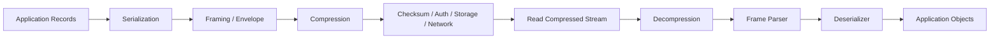
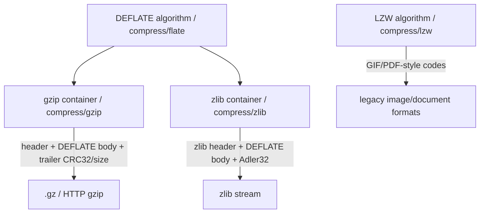
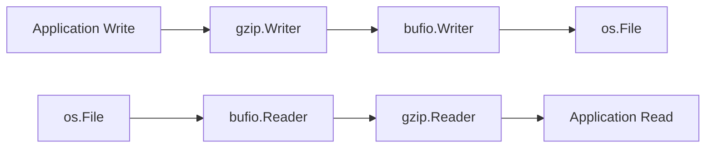
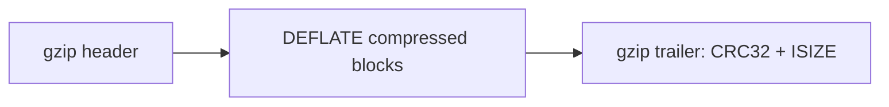
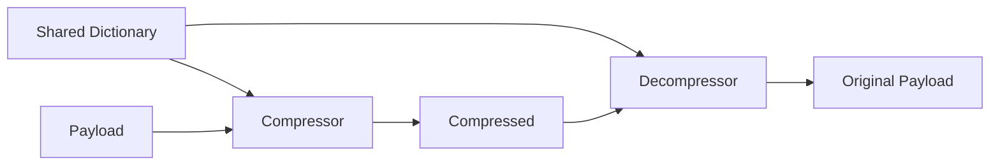
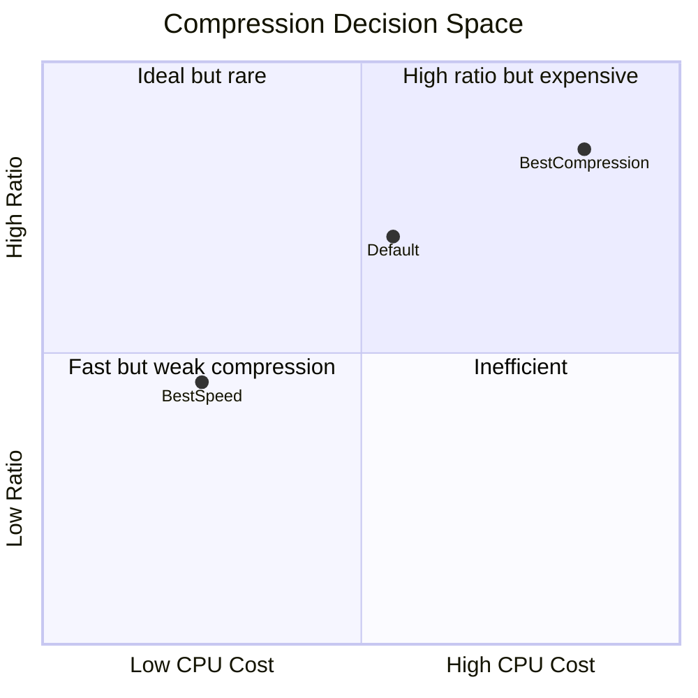
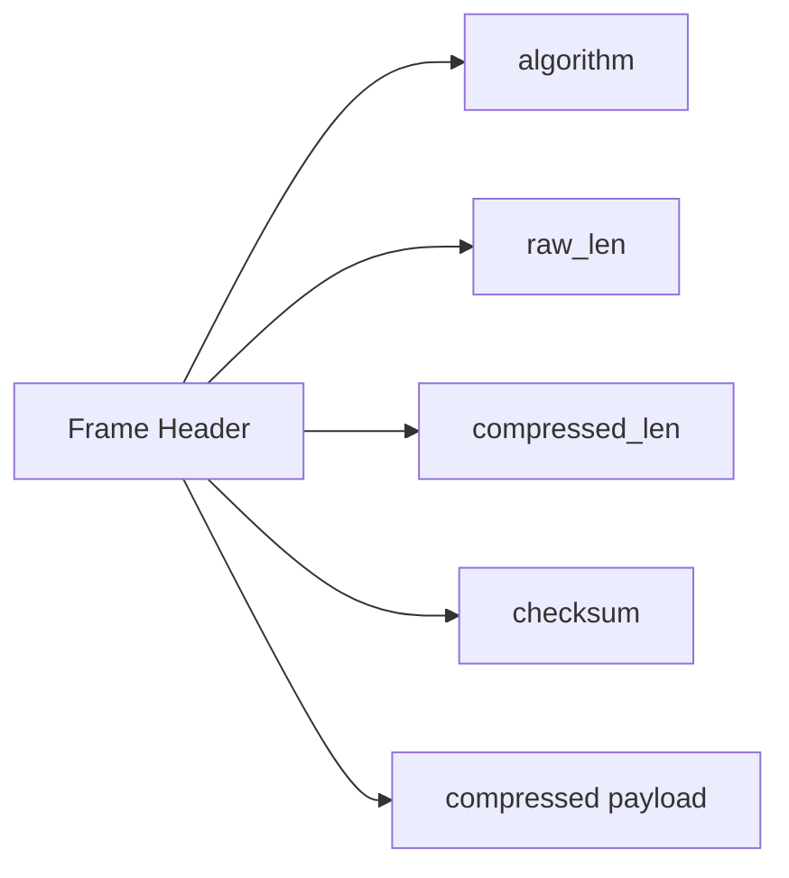
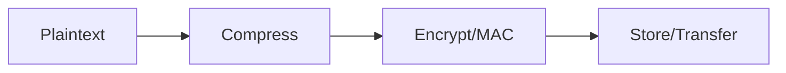
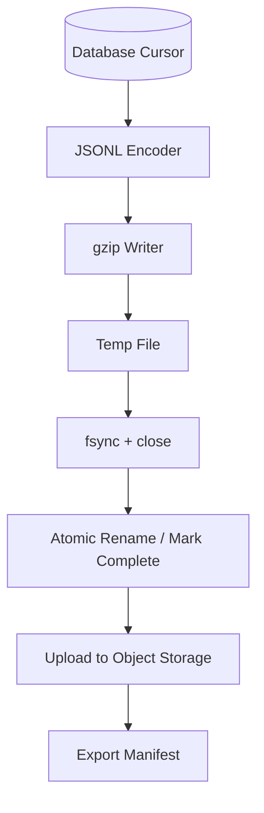
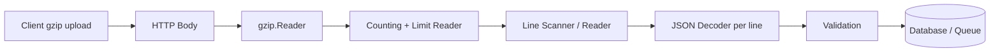

# learn-go-io-buffer-byte-stream-file-network-data-transfer-part-019.md

# Part 019 — Compression: gzip, zlib, flate, lzw, Streaming Compression, Ratio vs Latency

> Series: `learn-go-io-buffer-byte-stream-file-network-data-transfer`  
> Part: `019 / 034`  
> Target Go version: Go 1.26.x  
> Audience: Java software engineer yang ingin berpikir seperti engineer platform/systems ketika merancang data transfer, file pipeline, HTTP gateway, dan storage pipeline di Go.

---

## 0. Tujuan Bagian Ini

Di part sebelumnya kita sudah membangun pondasi:

1. byte, slice, buffer, stream;
2. `io.Reader` / `io.Writer` contracts;
3. file, filesystem, durable write;
4. binary encoding dan serialization;
5. protocol design: framing, envelope, metadata, checksum.

Sekarang kita masuk ke **compression**.

Compression sering terlihat seperti fitur sederhana:

```go
w := gzip.NewWriter(dst)
w.Write(data)
w.Close()
```

Tetapi di sistem production, compression adalah **keputusan arsitektur**. Ia mengubah bentuk, ukuran, latency, CPU cost, memory pressure, failure mode, observability, retry behavior, streaming semantics, dan bahkan security exposure.

Tujuan utama part ini:

- memahami compression sebagai bagian dari **data movement pipeline**;
- membedakan gzip, zlib, flate, dan lzw di standard library Go;
- memahami hubungan antara format container dan compression algorithm;
- memahami streaming compression, `Flush`, `Close`, trailer, dan error boundary;
- bisa memilih compression level berdasarkan ratio, latency, CPU, dan use case;
- bisa melindungi sistem dari decompression bomb, unbounded output, corrupted stream, dan resource exhaustion;
- bisa mendesain pipeline compression yang testable, observable, cancellable, dan production-grade.

---

## 1. Mental Model: Compression Bukan Sekadar “Mengecilkan Data”

Compression adalah transformasi:

```text
uncompressed bytes -> compressor -> compressed bytes
compressed bytes   -> decompressor -> uncompressed bytes
```

Namun transformasi ini memiliki karakteristik penting:

| Properti | Implikasi |
|---|---|
| Stateful | Compressor/decompressor menyimpan dictionary/window internal. |
| Streaming | Data bisa diproses bertahap, tidak harus seluruhnya di memory. |
| Buffered | Output tidak selalu muncul setelah setiap `Write`. |
| Finalized | Beberapa format butuh trailer/checksum pada `Close`. |
| CPU-heavy | Menghemat bandwidth/storage dengan membayar CPU. |
| Data-dependent | Data random bisa tidak compressible; text/log/JSON biasanya compressible. |
| Failure-prone | Corruption sering baru terdeteksi saat read sampai akhir stream. |
| Security-sensitive | Compressed input kecil bisa expand menjadi output sangat besar. |

Diagram besar:



Compression jarang berdiri sendiri. Ia biasanya berada di antara:

- serializer dan transport;
- file writer dan durable storage;
- HTTP response body dan network socket;
- archive entry dan archive container;
- log/event stream dan object storage.

Kesalahan umum: menganggap compression hanya “utility function”. Dalam production, compression harus punya policy:

```text
what is compressed?
when is it compressed?
where is the boundary?
how is it bounded?
who closes it?
who observes it?
what happens when compression/decompression fails?
```

---

## 2. Standard Library Go untuk Compression

Go standard library menyediakan package compression utama:

| Package | Fungsi | Format / Algorithm | Catatan |
|---|---|---|---|
| `compress/flate` | DEFLATE raw stream | RFC 1951 | Algorithm dasar yang dipakai gzip dan zlib. |
| `compress/gzip` | gzip format | RFC 1952 + DEFLATE | Umum untuk file `.gz`, HTTP `Content-Encoding: gzip`. |
| `compress/zlib` | zlib format | RFC 1950 + DEFLATE | Umum di beberapa binary format/protocol/library lama. |
| `compress/lzw` | LZW variant | GIF/PDF-style LZW | Specialized; bukan pilihan umum untuk transfer modern. |

Relasinya:



Poin penting:

- `flate` adalah **algorithm-level**.
- `gzip` dan `zlib` adalah **format/container-level** di atas DEFLATE.
- File `.gz` bukan raw DEFLATE; ia punya header dan trailer.
- zlib stream bukan gzip stream; keduanya sama-sama DEFLATE-based tetapi format wrapper berbeda.
- LZW berbeda keluarga, dan di Go standard library terutama relevan untuk GIF/PDF-style use case.

---

## 3. Compression dalam Pipeline IO Go

Go sangat cocok untuk compression karena semua package compression mengikuti bentuk `io.Reader` / `io.Writer`.

### 3.1 Compress saat menulis

```text
application data -> gzip.Writer -> destination writer
```

```go
var out bytes.Buffer

gz := gzip.NewWriter(&out)
_, err := gz.Write([]byte("hello hello hello\n"))
if err != nil {
    return err
}
if err := gz.Close(); err != nil {
    return err
}

compressed := out.Bytes()
```

`gzip.Writer` menerima uncompressed bytes dan menulis compressed bytes ke writer di bawahnya.

### 3.2 Decompress saat membaca

```text
compressed source reader -> gzip.Reader -> application reader
```

```go
gr, err := gzip.NewReader(src)
if err != nil {
    return err
}
defer gr.Close()

_, err = io.Copy(dst, gr)
if err != nil {
    return err
}
```

`gzip.Reader` menerima compressed bytes dari reader di bawahnya dan menghasilkan uncompressed bytes saat dibaca.

### 3.3 Composition chain



Ordering matters.

Jika menulis:

```text
app -> gzip -> bufio -> file
```

Close/flush order harus dari layer paling atas ke bawah:

```text
gzip.Close()
bufio.Flush()
file.Sync()    // jika butuh durability
file.Close()
```

Jika salah urutan, trailer gzip bisa belum tertulis, buffer bisa belum flush, file bisa tampak selesai padahal corrupt.

---

## 4. Core Invariant Compression

Untuk production-grade compression, pegang invariant berikut.

### 4.1 `Write` ke compressor bukan berarti semua compressed bytes sudah keluar

Compressor bisa menahan data untuk mencari pattern lebih baik.

```go
_, _ = gz.Write(payload)
// compressed output mungkin belum lengkap di underlying writer
```

Bahkan jika `Write` sukses, format belum complete sampai `Close`.

### 4.2 `Close` pada compressor adalah bagian dari data protocol

Untuk gzip/zlib/flate writer, `Close` bukan hanya resource cleanup. Ia bisa:

- menulis pending compressed block;
- menulis footer/trailer;
- menulis checksum/size;
- mengembalikan error dari writer di bawahnya.

Karena itu:

```go
if err := gz.Close(); err != nil {
    return err
}
```

bukan opsional.

### 4.3 `Flush` bukan pengganti `Close`

`Flush` membantu mendorong output sementara, tetapi stream belum final. Untuk format yang punya trailer, `Close` tetap wajib.

### 4.4 Decompression error bisa muncul terlambat

Compressed stream dapat tampak valid di awal, lalu gagal di tengah/akhir:

- checksum mismatch;
- truncated stream;
- invalid code;
- unexpected EOF;
- corrupted trailer;
- unsupported header.

Maka validasi decompression tidak selesai sampai `Read` mencapai EOF.

### 4.5 Compressed size tidak membatasi uncompressed size

Input 1 MB bisa expand ke ratusan MB atau lebih. Jangan pernah decompress untrusted data tanpa output limit.

---

## 5. gzip Deep Dive

`compress/gzip` mengimplementasikan gzip format. gzip umum untuk:

- file `.gz`;
- HTTP `Content-Encoding: gzip`;
- log compression;
- stream export;
- data transfer antar service;
- backup sederhana.

### 5.1 gzip container

gzip bukan hanya DEFLATE. Secara konseptual:

```text
+--------+-------------------+---------+
| header | DEFLATE data      | trailer |
+--------+-------------------+---------+
```

Header dapat berisi metadata seperti:

- name;
- comment;
- modification time;
- OS;
- extra fields.

Trailer biasanya memuat:

- CRC32 uncompressed data;
- uncompressed size modulo 2^32.

Diagram:



### 5.2 gzip writer basic

```go
package compressutil

import (
    "compress/gzip"
    "io"
)

func WriteGzip(dst io.Writer, src io.Reader) error {
    gz := gzip.NewWriter(dst)

    if _, err := io.Copy(gz, src); err != nil {
        // Even when Copy fails, Close may still return useful flush/trailer/underlying errors.
        closeErr := gz.Close()
        if closeErr != nil {
            return errors.Join(err, closeErr)
        }
        return err
    }

    if err := gz.Close(); err != nil {
        return err
    }
    return nil
}
```

Versi yang benar perlu import `errors`:

```go
import (
    "compress/gzip"
    "errors"
    "io"
)
```

Kenapa `Close` tetap dicek?

Karena `Close` adalah saat beberapa data terakhir dan trailer ditulis.

### 5.3 gzip writer dengan level

```go
func WriteGzipLevel(dst io.Writer, src io.Reader, level int) error {
    gz, err := gzip.NewWriterLevel(dst, level)
    if err != nil {
        return err
    }

    if _, err := io.Copy(gz, src); err != nil {
        closeErr := gz.Close()
        if closeErr != nil {
            return errors.Join(err, closeErr)
        }
        return err
    }

    return gz.Close()
}
```

Level gzip mengikuti level DEFLATE:

| Level | Makna | Biasanya Cocok Untuk |
|---|---|---|
| `gzip.NoCompression` / `flate.NoCompression` | framing tanpa compression berarti | testing/protocol compatibility tertentu |
| `gzip.BestSpeed` | lebih cepat, ratio lebih rendah | HTTP response latency-sensitive, streaming API |
| `gzip.BestCompression` | lebih lambat, ratio lebih tinggi | offline archive, batch export, object storage |
| `gzip.DefaultCompression` | default balance | general-purpose |
| `gzip.HuffmanOnly` | Huffman-only | niche data pattern, latency-sensitive tertentu |

Catatan: level terbaik harus diukur terhadap data asli sistem, bukan ditebak.

### 5.4 gzip header metadata

```go
func WriteNamedGzip(dst io.Writer, src io.Reader, name string) error {
    gz := gzip.NewWriter(dst)
    gz.Name = name
    gz.Comment = "exported by my-service"
    gz.ModTime = time.Now().UTC()

    if _, err := io.Copy(gz, src); err != nil {
        closeErr := gz.Close()
        if closeErr != nil {
            return errors.Join(err, closeErr)
        }
        return err
    }
    return gz.Close()
}
```

Namun metadata bisa menjadi privacy leak.

Untuk reproducible build/export, hindari metadata yang berubah-ubah:

```go
gz.Name = ""
gz.Comment = ""
gz.ModTime = time.Time{}
```

### 5.5 gzip reader basic dengan output limit

Jangan lakukan:

```go
b, err := io.ReadAll(gzReader)
```

pada input tidak dipercaya tanpa limit.

Gunakan limit:

```go
func GunzipToWriter(dst io.Writer, src io.Reader, maxUncompressed int64) error {
    gr, err := gzip.NewReader(src)
    if err != nil {
        return err
    }
    defer gr.Close()

    limited := io.LimitReader(gr, maxUncompressed+1)
    n, err := io.Copy(dst, limited)
    if err != nil {
        return err
    }
    if n > maxUncompressed {
        return fmt.Errorf("gzip output too large: limit=%d", maxUncompressed)
    }
    return nil
}
```

Lebih tepat lagi, kalau ingin memastikan output tidak melewati limit saat write, gunakan `limitedWriter`.

```go
type LimitedWriter struct {
    W io.Writer
    N int64
}

func (w *LimitedWriter) Write(p []byte) (int, error) {
    if w.N <= 0 {
        return 0, fmt.Errorf("write limit exceeded")
    }
    if int64(len(p)) > w.N {
        p = p[:w.N]
    }
    n, err := w.W.Write(p)
    w.N -= int64(n)
    if err != nil {
        return n, err
    }
    if n < len(p) {
        return n, io.ErrShortWrite
    }
    return n, nil
}
```

Usage:

```go
func GunzipBounded(dst io.Writer, src io.Reader, maxUncompressed int64) error {
    gr, err := gzip.NewReader(src)
    if err != nil {
        return err
    }
    defer gr.Close()

    lw := &LimitedWriter{W: dst, N: maxUncompressed}
    if _, err := io.Copy(lw, gr); err != nil {
        return err
    }
    return nil
}
```

### 5.6 gzip concatenated streams

gzip format dapat memiliki concatenated members. Go gzip reader historically mendukung multistream behavior. Dalam production, tentukan policy:

- Apakah menerima banyak gzip member?
- Apakah hanya satu gzip member valid?
- Apakah trailing bytes harus ditolak?

Untuk protocol internal, biasanya lebih aman punya format envelope sendiri:

```text
magic + version + compressedLen + uncompressedLen + compressionAlgo + checksum + compressedPayload
```

Daripada menerima gzip stream bebas tanpa boundary.

---

## 6. zlib Deep Dive

`compress/zlib` mengimplementasikan zlib format. zlib juga DEFLATE-based, tetapi wrapper-nya berbeda dari gzip.

### 6.1 gzip vs zlib

| Aspek | gzip | zlib |
|---|---|---|
| RFC | RFC 1952 | RFC 1950 |
| Body | DEFLATE | DEFLATE |
| Header | gzip header | zlib header |
| Checksum | CRC32 | Adler-32 |
| Umum dipakai untuk | `.gz`, HTTP gzip, log transfer | embedded/binary formats, protocol/library tertentu |
| File extension umum | `.gz` | jarang sendiri |

### 6.2 zlib writer

```go
func WriteZlib(dst io.Writer, src io.Reader) error {
    zw := zlib.NewWriter(dst)

    if _, err := io.Copy(zw, src); err != nil {
        closeErr := zw.Close()
        if closeErr != nil {
            return errors.Join(err, closeErr)
        }
        return err
    }

    return zw.Close()
}
```

### 6.3 zlib reader

```go
func ReadZlib(dst io.Writer, src io.Reader, maxUncompressed int64) error {
    zr, err := zlib.NewReader(src)
    if err != nil {
        return err
    }
    defer zr.Close()

    lw := &LimitedWriter{W: dst, N: maxUncompressed}
    _, err = io.Copy(lw, zr)
    return err
}
```

### 6.4 Kapan pakai zlib?

Gunakan zlib jika:

- format/protocol eksternal meminta zlib;
- compatibility dengan sistem lama;
- file format tertentu mensyaratkan zlib wrapper;
- Anda memang perlu zlib header/checksum, bukan gzip.

Jangan pilih zlib hanya karena “lebih rendah level” kalau tujuan Anda adalah `.gz` file atau HTTP `gzip`.

---

## 7. flate Deep Dive

`compress/flate` adalah package untuk DEFLATE raw data format.

DEFLATE menggabungkan dua ide besar:

1. LZ77-style back references: mengganti pengulangan dengan `(length, distance)`;
2. Huffman coding: memberi code lebih pendek untuk simbol yang sering muncul.

Secara mental:

```text
"hello hello hello"
      ↓
literal "hello " + reference back to previous bytes
      ↓
Huffman encoded block
```

### 7.1 Kapan pakai raw flate?

Pakai `compress/flate` jika:

- Anda sedang membuat format sendiri yang memang menggunakan raw DEFLATE;
- Anda mengimplementasikan protocol/file format yang mensyaratkan raw flate;
- Anda perlu dictionary support level flate;
- Anda tahu wrapper gzip/zlib tidak diinginkan.

Untuk kebanyakan aplikasi biasa:

- pilih gzip untuk file/HTTP umum;
- pilih zlib untuk protocol yang mensyaratkan zlib;
- jangan raw flate kecuali format Anda jelas.

### 7.2 flate writer

```go
func WriteFlate(dst io.Writer, src io.Reader, level int) error {
    fw, err := flate.NewWriter(dst, level)
    if err != nil {
        return err
    }

    if _, err := io.Copy(fw, src); err != nil {
        closeErr := fw.Close()
        if closeErr != nil {
            return errors.Join(err, closeErr)
        }
        return err
    }

    return fw.Close()
}
```

### 7.3 flate reader

```go
func ReadFlate(dst io.Writer, src io.Reader, maxUncompressed int64) error {
    fr := flate.NewReader(src)
    defer fr.Close()

    lw := &LimitedWriter{W: dst, N: maxUncompressed}
    _, err := io.Copy(lw, fr)
    return err
}
```

### 7.4 Dictionary compression

Dictionary compression membantu jika payload kecil tetapi punya pola domain yang stabil.

Contoh:

- event logs dengan field names berulang;
- JSON payload kecil dengan schema sama;
- protocol messages yang punya kata kunci stabil;
- telemetry dengan label/metric names sama.

Compression dictionary adalah shared prior knowledge antara compressor dan decompressor.



Contoh flate dictionary:

```go
var dict = []byte(`{"tenant_id":,"case_id":,"status":,"created_at":,"updated_at":`)

func CompressWithDict(dst io.Writer, src io.Reader) error {
    fw, err := flate.NewWriterDict(dst, flate.BestSpeed, dict)
    if err != nil {
        return err
    }
    if _, err := io.Copy(fw, src); err != nil {
        closeErr := fw.Close()
        if closeErr != nil {
            return errors.Join(err, closeErr)
        }
        return err
    }
    return fw.Close()
}

func DecompressWithDict(dst io.Writer, src io.Reader, maxUncompressed int64) error {
    fr := flate.NewReaderDict(src, dict)
    defer fr.Close()

    lw := &LimitedWriter{W: dst, N: maxUncompressed}
    _, err := io.Copy(lw, fr)
    return err
}
```

Caution:

- Dictionary harus sama persis di dua sisi.
- Dictionary versioning harus dimasukkan ke envelope/protocol.
- Salah dictionary bisa menghasilkan error atau output invalid.
- Jangan gunakan dictionary rahasia bersama data attacker-controlled tanpa memahami compression side-channel risk.

---

## 8. LZW Deep Dive

`compress/lzw` mengimplementasikan Lempel-Ziv-Welch variant seperti dipakai GIF dan PDF.

LZW bukan pilihan utama untuk data transfer modern. Ia masuk standard library karena compatibility dengan format tertentu.

### 8.1 Kapan LZW relevan?

Gunakan `compress/lzw` jika:

- Anda membaca/menulis format yang mensyaratkan LZW;
- Anda memproses GIF/PDF-style LZW stream;
- Anda mengimplementasikan interoperabilitas dengan sistem lama.

Jangan gunakan LZW sebagai default untuk:

- HTTP API;
- log compression;
- object storage export;
- backup modern;
- high-throughput network transfer.

### 8.2 LZW writer/reader

```go
func WriteLZW(dst io.Writer, src io.Reader) error {
    lw := lzw.NewWriter(dst, lzw.LSB, 8)
    if _, err := io.Copy(lw, src); err != nil {
        closeErr := lw.Close()
        if closeErr != nil {
            return errors.Join(err, closeErr)
        }
        return err
    }
    return lw.Close()
}

func ReadLZW(dst io.Writer, src io.Reader, maxUncompressed int64) error {
    lr := lzw.NewReader(src, lzw.LSB, 8)
    defer lr.Close()

    lw := &LimitedWriter{W: dst, N: maxUncompressed}
    _, err := io.Copy(lw, lr)
    return err
}
```

Parameter `Order` dan `litWidth` harus cocok dengan format data. Ini bukan “tuning bebas”. Ini bagian dari format compatibility.

---

## 9. Streaming Compression

Streaming compression berarti data diproses bertahap:

```text
read chunk -> compress -> write chunk -> read next chunk -> ...
```

Tanpa load seluruh payload ke memory.

### 9.1 Kapan streaming wajib?

Streaming wajib atau sangat disarankan untuk:

- file besar;
- HTTP upload/download;
- logs/events;
- backup/export;
- proxy/gateway;
- request/response body tidak diketahui size-nya;
- bounded memory service.

### 9.2 Streaming compressor helper

```go
func CompressStream(ctx context.Context, dst io.Writer, src io.Reader, level int) error {
    gz, err := gzip.NewWriterLevel(dst, level)
    if err != nil {
        return err
    }

    buf := make([]byte, 64*1024)
    for {
        if err := ctx.Err(); err != nil {
            closeErr := gz.Close()
            if closeErr != nil {
                return errors.Join(err, closeErr)
            }
            return err
        }

        n, rerr := src.Read(buf)
        if n > 0 {
            if _, werr := gz.Write(buf[:n]); werr != nil {
                closeErr := gz.Close()
                if closeErr != nil {
                    return errors.Join(werr, closeErr)
                }
                return werr
            }
        }

        if rerr != nil {
            if errors.Is(rerr, io.EOF) {
                break
            }
            closeErr := gz.Close()
            if closeErr != nil {
                return errors.Join(rerr, closeErr)
            }
            return rerr
        }
    }

    return gz.Close()
}
```

Catatan:

- Loop manual memberi ruang untuk `ctx.Err()`.
- Tetapi jika `src.Read` sedang blocking, context tidak otomatis membatalkan kecuali reader-nya context-aware, deadline-aware, atau ditutup dari luar.
- Untuk `net.Conn`, gunakan deadline atau close connection.
- Untuk HTTP request, body biasanya terkait context request.

### 9.3 `io.Pipe` untuk bridging streaming goroutine

`io.Pipe` berguna jika API memerlukan `io.Reader`, tetapi Anda menghasilkan compressed data dari writer.

Contoh: streaming upload compressed body.

```go
func GzipReaderFrom(src io.Reader, level int) (io.Reader, <-chan error) {
    pr, pw := io.Pipe()
    errc := make(chan error, 1)

    go func() {
        defer close(errc)

        gz, err := gzip.NewWriterLevel(pw, level)
        if err != nil {
            _ = pw.CloseWithError(err)
            errc <- err
            return
        }

        _, copyErr := io.Copy(gz, src)
        closeErr := gz.Close()

        err = errors.Join(copyErr, closeErr)
        if err != nil {
            _ = pw.CloseWithError(err)
            errc <- err
            return
        }

        errc <- pw.Close()
    }()

    return pr, errc
}
```

Usage:

```go
body, errc := GzipReaderFrom(file, gzip.BestSpeed)
req, err := http.NewRequestWithContext(ctx, http.MethodPost, url, body)
if err != nil {
    return err
}
req.Header.Set("Content-Encoding", "gzip")

resp, err := http.DefaultClient.Do(req)
if err != nil {
    return err
}
defer resp.Body.Close()

if err := <-errc; err != nil {
    return err
}
```

Caution:

- Pipe introduces backpressure: writer blocks until reader consumes.
- Always propagate error using `CloseWithError`.
- Avoid goroutine leak: ensure reader side is closed when request fails.

### 9.4 Streaming decompression with bounded output

```go
func DecompressGzipStream(ctx context.Context, dst io.Writer, src io.Reader, maxUncompressed int64) error {
    gr, err := gzip.NewReader(src)
    if err != nil {
        return err
    }
    defer gr.Close()

    lw := &LimitedWriter{W: dst, N: maxUncompressed}
    buf := make([]byte, 64*1024)

    for {
        if err := ctx.Err(); err != nil {
            return err
        }

        n, rerr := gr.Read(buf)
        if n > 0 {
            if _, werr := lw.Write(buf[:n]); werr != nil {
                return werr
            }
        }

        if rerr != nil {
            if errors.Is(rerr, io.EOF) {
                return nil
            }
            return rerr
        }
    }
}
```

---

## 10. Ratio vs Latency vs CPU vs Memory

Compression selalu trade-off.



### 10.1 Dimensi keputusan

| Dimensi | Pertanyaan |
|---|---|
| Ratio | Berapa persen data mengecil? |
| Compression latency | Berapa lama menulis compressed stream? |
| Decompression latency | Berapa lama membaca kembali? |
| CPU | Berapa core-seconds dikonsumsi? |
| Memory | Berapa buffer/window/object dialokasikan? |
| Tail latency | Apakah P95/P99 request memburuk? |
| Throughput | Apakah bottleneck pindah dari network ke CPU? |
| Streaming behavior | Apakah output segera keluar atau menunggu buffer penuh? |
| Data shape | Apakah data repetitive, textual, binary, encrypted, random? |

### 10.2 Data compressibility

| Data Type | Compressibility | Catatan |
|---|---:|---|
| JSON/XML/CSV | Tinggi | Field names dan whitespace sering repetitive. |
| Logs | Tinggi | Template log berulang. |
| SQL dumps | Tinggi | Banyak pattern berulang. |
| Protobuf | Sedang | Sudah compact tetapi field/value patterns bisa compressible. |
| Images JPEG/PNG/WebP | Rendah | Sudah compressed. |
| Video/audio modern | Rendah | Sudah compressed. |
| Encrypted data | Sangat rendah | Secara desain terlihat random. |
| Random bytes | Sangat rendah | Compression bisa malah membesar. |
| Small payload | Sering tidak worth it | Header + CPU overhead bisa lebih besar dari manfaat. |

### 10.3 Latency-sensitive vs batch

| Use Case | Rekomendasi Awal |
|---|---|
| HTTP API response kecil | Jangan compress di bawah threshold. |
| HTTP API response besar JSON | gzip BestSpeed atau Default; benchmark. |
| Streaming SSE/WebSocket-like text | Hati-hati buffering dan side-channel. |
| Batch export CSV/JSONL | gzip Default/BestCompression, tergantung SLA. |
| Backup offline | BestCompression mungkin masuk akal. |
| Internal RPC kecil | Sering tidak worth it. |
| Object storage archive | Default atau BestCompression; ukur storage vs CPU. |
| Log shipping | BestSpeed/Default; batching penting. |

### 10.4 Compression threshold

Jangan compress semua payload.

Policy umum:

```text
if size < threshold: do not compress
if content already compressed: do not compress
if client does not support encoding: do not compress
if CPU overloaded: degrade compression level or skip
if response is latency-critical: use BestSpeed or skip
```

Contoh threshold:

```go
const minCompressSize = 1024 // start simple; tune from benchmark

func ShouldCompress(contentType string, size int64) bool {
    if size >= 0 && size < minCompressSize {
        return false
    }
    switch contentType {
    case "application/json", "text/plain", "text/csv", "application/xml", "text/xml":
        return true
    default:
        return false
    }
}
```

Real system sebaiknya berbasis metrics:

- compression ratio by content type;
- CPU cost by endpoint;
- P95/P99 latency;
- response body size histogram;
- network egress cost.

---

## 11. HTTP Compression

Compression dalam HTTP memiliki dua arah berbeda:

1. response compression: server mengirim compressed response jika client menerima;
2. request decompression: server menerima compressed request body jika client mengirim `Content-Encoding`.

### 11.1 Header penting

| Header | Makna |
|---|---|
| `Accept-Encoding` | Client menyatakan encoding response yang dapat diterima. |
| `Content-Encoding` | Body message dikodekan dengan compression tertentu. |
| `Content-Length` | Panjang body setelah content encoding, bukan uncompressed size. |
| `Vary: Accept-Encoding` | Cache harus membedakan varian response berdasarkan encoding. |

### 11.2 Server response gzip middleware sederhana

```go
type gzipResponseWriter struct {
    http.ResponseWriter
    gz *gzip.Writer
}

func (w *gzipResponseWriter) Write(p []byte) (int, error) {
    return w.gz.Write(p)
}

func GzipMiddleware(next http.Handler) http.Handler {
    return http.HandlerFunc(func(w http.ResponseWriter, r *http.Request) {
        if !strings.Contains(r.Header.Get("Accept-Encoding"), "gzip") {
            next.ServeHTTP(w, r)
            return
        }

        w.Header().Set("Content-Encoding", "gzip")
        w.Header().Add("Vary", "Accept-Encoding")
        w.Header().Del("Content-Length")

        gz := gzip.NewWriter(w)
        defer gz.Close()

        next.ServeHTTP(&gzipResponseWriter{ResponseWriter: w, gz: gz}, r)
    })
}
```

Ini contoh konsep, belum production-complete. Middleware production perlu menangani:

- status code;
- content-type threshold;
- streaming flush;
- `http.Flusher`;
- `http.Hijacker` jika masih relevan;
- `http.ResponseController`;
- small response buffering;
- already encoded response;
- HEAD request;
- range request;
- error after partial body;
- observability.

### 11.3 Flush dalam HTTP streaming

Jika handler streaming:

```go
for event := range events {
    _, _ = fmt.Fprintf(w, "data: %s\n\n", event)
    flusher.Flush()
}
```

Jika dibungkus gzip, `Flush` HTTP saja belum cukup; gzip writer juga perlu flush.

```go
func (w *gzipResponseWriter) Flush() {
    _ = w.gz.Flush()
    if f, ok := w.ResponseWriter.(http.Flusher); ok {
        f.Flush()
    }
}
```

Namun sering flush compression menurunkan ratio. Streaming low-latency dan compression ratio saling tarik-menarik.

### 11.4 Request body gzip decompression

```go
func GunzipRequestBody(next http.Handler, maxUncompressed int64) http.Handler {
    return http.HandlerFunc(func(w http.ResponseWriter, r *http.Request) {
        if r.Header.Get("Content-Encoding") != "gzip" {
            next.ServeHTTP(w, r)
            return
        }

        gr, err := gzip.NewReader(r.Body)
        if err != nil {
            http.Error(w, "invalid gzip body", http.StatusBadRequest)
            return
        }

        r.Body = struct {
            io.Reader
            io.Closer
        }{
            Reader: io.LimitReader(gr, maxUncompressed+1),
            Closer: multiCloser{gr, r.Body},
        }

        next.ServeHTTP(w, r)
    })
}

type multiCloser []io.Closer

func (m multiCloser) Close() error {
    var err error
    for _, c := range m {
        err = errors.Join(err, c.Close())
    }
    return err
}
```

Tetapi `LimitReader` alone hanya stops after limit; handler harus detect over-limit. Biasanya lebih baik pakai reader wrapper yang mengembalikan explicit error setelah limit.

### 11.5 Go HTTP client automatic gzip

Go `net/http.Transport` memiliki behavior terkait gzip response. Secara umum, jika transport menambahkan `Accept-Encoding: gzip`, ia dapat otomatis decompress response dan mengatur field seperti `Uncompressed`. Jika Anda mengatur `Accept-Encoding` sendiri atau men-disable compression, behavior berubah. Maka untuk client production:

- pahami apakah body yang Anda baca sudah decompressed;
- jangan double-decompress;
- cek `resp.Uncompressed` dan header behavior;
- gunakan `DisableCompression` jika ingin raw compressed bytes;
- saat download `.gz` file, jangan biarkan client layer melakukan transparent decompression jika Anda ingin menyimpan file gzip apa adanya.

Contoh raw download gzip file:

```go
tr := http.DefaultTransport.(*http.Transport).Clone()
tr.DisableCompression = true
client := &http.Client{Transport: tr}

req, err := http.NewRequestWithContext(ctx, http.MethodGet, url, nil)
if err != nil {
    return err
}
// Do not ask transport to transparently decode.
resp, err := client.Do(req)
if err != nil {
    return err
}
defer resp.Body.Close()

// resp.Body should be raw response body.
_, err = io.Copy(file, resp.Body)
return err
```

---

## 12. Compression and Protocol Framing

Compression placement matters.

### 12.1 Compress whole stream

```text
frame1 frame2 frame3 -> gzip stream
```

Pros:

- best ratio because dictionary spans frames;
- simple for file/log archive;
- efficient for batch.

Cons:

- random access difficult;
- corruption can affect later records;
- resume/checkpoint harder;
- need decompress from beginning unless indexed.

### 12.2 Compress per frame

```text
frame1 -> gzip
frame2 -> gzip
frame3 -> gzip
```

Pros:

- independent frames;
- easier retry/resume;
- easier skip corrupted record;
- easier parallel decompression;
- random access possible with index.

Cons:

- worse ratio due to dictionary reset;
- more header/trailer overhead;
- more CPU overhead for many small frames.

### 12.3 Frame with compression metadata

Production envelope:

```text
magic        4 bytes
version      1 byte
flags        1 byte
algorithm    1 byte
level        1 byte
raw_len      u64
compressed_len u64
checksum     u32
payload      compressed_len bytes
```

Mermaid:



With this design, reader can:

- reject unsupported algorithm;
- enforce compressed size limit;
- enforce uncompressed size limit;
- allocate safely or stream safely;
- verify checksum;
- skip unknown frame if length known;
- support future algorithm migration.

### 12.4 Compress before or after checksum?

Ada dua checksum berbeda:

1. checksum compressed bytes: verifies transport/storage payload integrity;
2. checksum uncompressed bytes: verifies logical data integrity after decompression.

gzip already has CRC32 over uncompressed data in trailer. But in custom protocol, you may still want envelope checksum for compressed payload.

```text
Option A:
raw -> checksum(raw) -> compress -> store

Option B:
raw -> compress -> checksum(compressed) -> store

Option C:
raw -> checksum(raw) -> compress -> checksum(compressed) -> store
```

Use case:

| Strategy | Useful When |
|---|---|
| Raw checksum | Need verify logical content independent of compression. |
| Compressed checksum | Need detect storage/network corruption before decompress cost. |
| Both | High-integrity storage/transfer format. |

---

## 13. Decompression Bomb and Resource Exhaustion

Compression creates asymmetry:

```text
small compressed input -> huge uncompressed output
```

This can exhaust:

- memory;
- disk;
- CPU;
- request time;
- goroutines;
- temp storage;
- downstream parser capacity.

### 13.1 Anti-pattern

```go
func UnsafeGunzipAll(src io.Reader) ([]byte, error) {
    gr, err := gzip.NewReader(src)
    if err != nil {
        return nil, err
    }
    defer gr.Close()

    return io.ReadAll(gr) // unsafe for untrusted input
}
```

Even though Go 1.26 optimizes `io.ReadAll`, performance optimization does not make unbounded decompression safe.

### 13.2 Safer bounded read

```go
func GunzipBytes(src io.Reader, maxUncompressed int64) ([]byte, error) {
    gr, err := gzip.NewReader(src)
    if err != nil {
        return nil, err
    }
    defer gr.Close()

    lr := io.LimitReader(gr, maxUncompressed+1)
    b, err := io.ReadAll(lr)
    if err != nil {
        return nil, err
    }
    if int64(len(b)) > maxUncompressed {
        return nil, fmt.Errorf("gzip data exceeds uncompressed limit %d", maxUncompressed)
    }
    return b, nil
}
```

### 13.3 CPU exhaustion

Compressed data can be crafted to be slow to decompress. Defenses:

- context/deadline;
- request timeout;
- max compressed size;
- max uncompressed size;
- max compression ratio;
- worker pool isolation;
- reject nested compression;
- observability on decompression duration.

### 13.4 Compression ratio limit

For protocols with known compressed size:

```go
func CheckRatio(compressed, uncompressed int64, maxRatio float64) error {
    if compressed <= 0 {
        return fmt.Errorf("invalid compressed size")
    }
    ratio := float64(uncompressed) / float64(compressed)
    if ratio > maxRatio {
        return fmt.Errorf("compression ratio too high: %.2f > %.2f", ratio, maxRatio)
    }
    return nil
}
```

For streaming, count both sides:

```go
type CountingReader struct {
    R io.Reader
    N int64
}

func (r *CountingReader) Read(p []byte) (int, error) {
    n, err := r.R.Read(p)
    r.N += int64(n)
    return n, err
}

type CountingWriter struct {
    W io.Writer
    N int64
}

func (w *CountingWriter) Write(p []byte) (int, error) {
    n, err := w.W.Write(p)
    w.N += int64(n)
    return n, err
}
```

Then compute ratio after completion.

---

## 14. Compression and Encryption

Rule of thumb:

```text
compress before encrypt
```

Because encrypted data should look random and will not compress well.



But there is a security caveat.

Compression can leak information when attacker controls part of plaintext and can observe compressed size. This is relevant for:

- web responses with secrets and attacker-controlled reflected input;
- cross-site compression attacks;
- token-bearing pages;
- interactive protocols with secrets;
- shared compression context across tenants/users.

Safe principles:

- Do not compress secrets together with attacker-controlled text if compressed size is observable.
- Avoid shared compression dictionary across security boundaries.
- Disable compression for highly sensitive interactive responses when appropriate.
- Do not mix tenants in one compression stream.
- Do not use secret dictionaries with untrusted input.

Untuk seri ini kita tidak deep dive cryptography, tetapi compression/encryption ordering harus dipahami sebagai boundary.

---

## 15. Compression and Memory Management

Compressor/decompressor objects can allocate internal buffers.

### 15.1 Reuse with `Reset`

Beberapa writer/reader mendukung `Reset` untuk reuse object.

Example gzip writer pool:

```go
var gzipWriterPool = sync.Pool{
    New: func() any {
        w, err := gzip.NewWriterLevel(io.Discard, gzip.BestSpeed)
        if err != nil {
            panic(err)
        }
        return w
    },
}

func WithGzipWriter(dst io.Writer, fn func(*gzip.Writer) error) error {
    gz := gzipWriterPool.Get().(*gzip.Writer)
    gz.Reset(dst)
    defer gzipWriterPool.Put(gz)

    err := fn(gz)
    closeErr := gz.Close()
    return errors.Join(err, closeErr)
}
```

Caution:

- Never put writer back into pool before `Close`.
- Never reuse concurrently.
- Reset must happen before next use.
- Pooling helps high-throughput services, but benchmark first.
- sync.Pool is cache, not lifetime guarantee.

### 15.2 Pooling buffers

`io.CopyBuffer` can reduce allocation if buffer ownership is clear.

```go
var copyBufPool = sync.Pool{
    New: func() any {
        b := make([]byte, 64*1024)
        return &b
    },
}

func copyWithPooledBuffer(dst io.Writer, src io.Reader) (int64, error) {
    bp := copyBufPool.Get().(*[]byte)
    defer copyBufPool.Put(bp)
    return io.CopyBuffer(dst, src, *bp)
}
```

Do not retain pooled buffer after function returns.

### 15.3 Compression context memory

Trade-off:

- higher compression levels can use more CPU and internal search work;
- many concurrent gzip writers can consume significant memory;
- per-connection compression in WebSocket-like systems can multiply memory;
- compression middleware across many concurrent responses can become CPU/memory bottleneck.

Production controls:

- max concurrent compression jobs;
- compression level by endpoint;
- skip compression under CPU pressure;
- response size threshold;
- payload type allowlist;
- pool writers carefully;
- expose metrics.

---

## 16. File Compression Patterns

### 16.1 Compress file to `.gz`

```go
func GzipFile(srcPath, dstPath string, level int) error {
    src, err := os.Open(srcPath)
    if err != nil {
        return err
    }
    defer src.Close()

    tmp := dstPath + ".tmp"
    dst, err := os.OpenFile(tmp, os.O_CREATE|os.O_WRONLY|os.O_TRUNC, 0o644)
    if err != nil {
        return err
    }

    gz, err := gzip.NewWriterLevel(dst, level)
    if err != nil {
        _ = dst.Close()
        _ = os.Remove(tmp)
        return err
    }

    _, copyErr := io.Copy(gz, src)
    closeGzErr := gz.Close()
    syncErr := dst.Sync()
    closeDstErr := dst.Close()

    if err := errors.Join(copyErr, closeGzErr, syncErr, closeDstErr); err != nil {
        _ = os.Remove(tmp)
        return err
    }

    return os.Rename(tmp, dstPath)
}
```

In production, also consider syncing parent directory after rename for crash consistency, as discussed in durable writes part.

### 16.2 Decompress `.gz` to file safely

```go
func GunzipFile(srcPath, dstPath string, maxUncompressed int64) error {
    src, err := os.Open(srcPath)
    if err != nil {
        return err
    }
    defer src.Close()

    gr, err := gzip.NewReader(src)
    if err != nil {
        return err
    }
    defer gr.Close()

    tmp := dstPath + ".tmp"
    dst, err := os.OpenFile(tmp, os.O_CREATE|os.O_WRONLY|os.O_TRUNC, 0o644)
    if err != nil {
        _ = os.Remove(tmp)
        return err
    }

    lw := &LimitedWriter{W: dst, N: maxUncompressed}
    _, copyErr := io.Copy(lw, gr)
    syncErr := dst.Sync()
    closeErr := dst.Close()

    if err := errors.Join(copyErr, syncErr, closeErr); err != nil {
        _ = os.Remove(tmp)
        return err
    }

    return os.Rename(tmp, dstPath)
}
```

### 16.3 Do not infer safety from `.gz` extension

File extension is not a trust boundary.

Always treat compressed files as untrusted if they come from outside your system.

---

## 17. Network Compression Patterns

### 17.1 Compressing TCP stream

```go
func ServeCompressedConn(conn net.Conn) error {
    defer conn.Close()

    gz := gzip.NewWriter(conn)
    defer gz.Close()

    for i := 0; i < 10; i++ {
        if _, err := fmt.Fprintf(gz, "message %d\n", i); err != nil {
            return err
        }
        if err := gz.Flush(); err != nil {
            return err
        }
    }
    return nil
}
```

Flush makes messages visible earlier but hurts ratio.

### 17.2 Framed compressed messages over TCP

Better for most protocols:

```text
[length][compressed payload][length][compressed payload]...
```

Each message independent.

```go
func WriteCompressedFrame(w io.Writer, payload []byte) error {
    var buf bytes.Buffer
    gz := gzip.NewWriter(&buf)
    if _, err := gz.Write(payload); err != nil {
        _ = gz.Close()
        return err
    }
    if err := gz.Close(); err != nil {
        return err
    }

    if buf.Len() > math.MaxUint32 {
        return fmt.Errorf("compressed frame too large")
    }

    var hdr [4]byte
    binary.BigEndian.PutUint32(hdr[:], uint32(buf.Len()))
    if _, err := w.Write(hdr[:]); err != nil {
        return err
    }
    _, err := w.Write(buf.Bytes())
    return err
}
```

But this buffers entire compressed frame. For large frames, use temp file or streaming frame with known length from pre-pass, or chunked protocol.

### 17.3 Streaming compressed frame with unknown length

If length unknown, options:

1. chunked transfer inside protocol;
2. compress to temp file first, then send length;
3. use sentinel/end marker if format allows;
4. dedicate connection close as EOF boundary;
5. use protocol with trailers.

Each choice affects retry/resume/error behavior.

---

## 18. Observability for Compression

Compression needs first-class metrics.

### 18.1 Metrics

| Metric | Meaning |
|---|---|
| `compression_input_bytes_total` | Uncompressed bytes entering compressor. |
| `compression_output_bytes_total` | Compressed bytes emitted. |
| `compression_ratio` | input/output or output/input depending convention. |
| `compression_duration_seconds` | Time spent compressing. |
| `decompression_input_bytes_total` | Compressed bytes read. |
| `decompression_output_bytes_total` | Uncompressed bytes produced. |
| `decompression_duration_seconds` | Time spent decompressing. |
| `compression_errors_total` | Error count by algorithm/reason. |
| `decompression_limit_exceeded_total` | Decompression bomb / size violation. |
| `compression_skipped_total` | Skipped by threshold/type/load. |
| `active_compression_jobs` | Current compression concurrency. |

### 18.2 Logs

Useful log fields:

```text
algorithm=gzip
level=1
content_type=application/json
input_bytes=7340032
output_bytes=812309
ratio=9.04
duration_ms=83
endpoint=/exports/cases
tenant_id=...
request_id=...
limit_bytes=104857600
result=success
```

Do not log raw compressed payload or sensitive decompressed data.

### 18.3 Tracing

Compression can be a span:

```text
span: compress.gzip
attributes:
  compression.algorithm = gzip
  compression.level = 1
  compression.input_bytes = ...
  compression.output_bytes = ...
  compression.ratio = ...
```

In high-throughput systems, avoid per-small-message spans. Use sampling or aggregate metrics.

### 18.4 pprof symptoms

Compression bottleneck may appear as CPU hotspot in:

- `compress/flate`;
- Huffman encoder;
- checksum;
- memory allocation;
- `io.Copy` boundary;
- buffer growth.

Operational questions:

- Is network actually the bottleneck?
- Are we compressing already-compressed data?
- Are we compressing small payloads?
- Is compression level too high?
- Is compression happening on request critical path?
- Can compression be moved to async batch?

---

## 19. Testing Compression Code

Compression test harus mengecek lebih dari “round trip works”.

### 19.1 Round-trip property

```go
func TestGzipRoundTrip(t *testing.T) {
    inputs := [][]byte{
        []byte(""),
        []byte("hello"),
        bytes.Repeat([]byte("abc"), 1000),
        bytes.Repeat([]byte{0}, 1024),
    }

    for _, in := range inputs {
        var compressed bytes.Buffer
        if err := WriteGzip(&compressed, bytes.NewReader(in)); err != nil {
            t.Fatal(err)
        }

        var out bytes.Buffer
        if err := GunzipToWriter(&out, bytes.NewReader(compressed.Bytes()), int64(len(in))); err != nil {
            t.Fatal(err)
        }

        if !bytes.Equal(out.Bytes(), in) {
            t.Fatalf("round trip mismatch")
        }
    }
}
```

### 19.2 Corrupted stream

```go
func TestGunzipRejectsCorruption(t *testing.T) {
    var b bytes.Buffer
    gz := gzip.NewWriter(&b)
    _, _ = gz.Write([]byte("hello world"))
    _ = gz.Close()

    data := b.Bytes()
    data[len(data)-1] ^= 0xff

    var out bytes.Buffer
    err := GunzipToWriter(&out, bytes.NewReader(data), 1<<20)
    if err == nil {
        t.Fatal("expected error for corrupted gzip")
    }
}
```

### 19.3 Truncated stream

```go
func TestGunzipRejectsTruncated(t *testing.T) {
    var b bytes.Buffer
    gz := gzip.NewWriter(&b)
    _, _ = gz.Write(bytes.Repeat([]byte("x"), 1024))
    _ = gz.Close()

    truncated := b.Bytes()[:b.Len()/2]

    var out bytes.Buffer
    err := GunzipToWriter(&out, bytes.NewReader(truncated), 1<<20)
    if err == nil {
        t.Fatal("expected truncated stream error")
    }
}
```

### 19.4 Size limit

```go
func TestGunzipLimit(t *testing.T) {
    input := bytes.Repeat([]byte("a"), 1024*1024)

    var b bytes.Buffer
    if err := WriteGzip(&b, bytes.NewReader(input)); err != nil {
        t.Fatal(err)
    }

    var out bytes.Buffer
    err := GunzipToWriter(&out, bytes.NewReader(b.Bytes()), 1024)
    if err == nil {
        t.Fatal("expected limit error")
    }
}
```

### 19.5 Fault injection writer

```go
type failAfterWriter struct {
    limit int
    n     int
}

func (w *failAfterWriter) Write(p []byte) (int, error) {
    if w.n >= w.limit {
        return 0, fmt.Errorf("injected write failure")
    }
    remaining := w.limit - w.n
    if len(p) > remaining {
        p = p[:remaining]
    }
    w.n += len(p)
    return len(p), nil
}
```

Use it to ensure `Close` errors and partial writes are surfaced.

### 19.6 Fuzz decompressor boundary

```go
func FuzzGunzipBounded(f *testing.F) {
    f.Add([]byte{})
    f.Add([]byte("not gzip"))

    f.Fuzz(func(t *testing.T, data []byte) {
        var out bytes.Buffer
        _ = GunzipToWriter(&out, bytes.NewReader(data), 1<<20)
    })
}
```

Fuzz goal here is not “all inputs succeed”. Goal is:

- no panic;
- no unbounded memory;
- no hang;
- predictable error.

---

## 20. Benchmarking Compression

Benchmark against your real data shape.

### 20.1 Benchmark level

```go
func BenchmarkGzipLevels(b *testing.B) {
    payload := bytes.Repeat([]byte(`{"tenant":"abc","status":"OPEN","description":"hello world"}\n`), 10_000)

    levels := []int{
        gzip.BestSpeed,
        gzip.DefaultCompression,
        gzip.BestCompression,
    }

    for _, level := range levels {
        b.Run(fmt.Sprintf("level_%d", level), func(b *testing.B) {
            b.ReportAllocs()
            b.SetBytes(int64(len(payload)))

            for i := 0; i < b.N; i++ {
                var out bytes.Buffer
                gz, err := gzip.NewWriterLevel(&out, level)
                if err != nil {
                    b.Fatal(err)
                }
                if _, err := gz.Write(payload); err != nil {
                    b.Fatal(err)
                }
                if err := gz.Close(); err != nil {
                    b.Fatal(err)
                }
            }
        })
    }
}
```

### 20.2 Measure ratio too

Benchmark time alone is incomplete.

```go
func compressedSize(payload []byte, level int) (int, error) {
    var out bytes.Buffer
    gz, err := gzip.NewWriterLevel(&out, level)
    if err != nil {
        return 0, err
    }
    if _, err := gz.Write(payload); err != nil {
        _ = gz.Close()
        return 0, err
    }
    if err := gz.Close(); err != nil {
        return 0, err
    }
    return out.Len(), nil
}
```

Record:

```text
level,input_bytes,output_bytes,ratio,ns_per_byte,allocs
1,560000,82000,6.82,...
-1,560000,60000,9.33,...
9,560000,54000,10.37,...
```

### 20.3 Compression decision should be cost model

Example:

```text
Without compression:
  network = 100 MB
  CPU = low
  latency = network-bound

With gzip BestSpeed:
  network = 20 MB
  CPU = medium
  latency = lower if network slow, higher if CPU saturated

With BestCompression:
  network = 15 MB
  CPU = high
  latency = possibly worse
```

The correct answer depends on bottleneck.

---

## 21. Production Compression Policy

A good service should not scatter compression decisions across handlers.

Create a policy object.

```go
type CompressionAlgorithm string

const (
    CompressionNone CompressionAlgorithm = "none"
    CompressionGzip CompressionAlgorithm = "gzip"
)

type CompressionPolicy struct {
    Algorithm       CompressionAlgorithm
    Level           int
    MinSize         int64
    MaxInputSize    int64
    MaxOutputSize   int64
    AllowedTypes    map[string]bool
    DisableOnCPUHot bool
}

func (p CompressionPolicy) ShouldCompress(contentType string, size int64) bool {
    if p.Algorithm == CompressionNone {
        return false
    }
    if size >= 0 && size < p.MinSize {
        return false
    }
    if p.AllowedTypes != nil && !p.AllowedTypes[contentType] {
        return false
    }
    return true
}
```

Policy should be visible in config, metrics, and runbook.

### 21.1 Example policies

| System | Algorithm | Level | Threshold | Notes |
|---|---|---:|---:|---|
| Public JSON API | gzip | BestSpeed | 1–4 KB | protect tail latency |
| Admin CSV export | gzip | Default | 0 | batch, large payload |
| Nightly archive | gzip | BestCompression | 0 | storage optimized |
| Internal low-latency RPC | none/gzip optional | BestSpeed | high | avoid small payload overhead |
| Log shipper | gzip | BestSpeed/Default | batch-based | batch before compress |

---

## 22. Compression Failure Model

| Failure | Where It Appears | Mitigation |
|---|---|---|
| Invalid gzip header | `gzip.NewReader` | Return 400 / reject file. |
| Corrupted body | `Read` | Treat as invalid payload; delete partial output. |
| Truncated stream | `Read` / EOF path | Require full read before commit. |
| Close error | compressor `Close` | Always check close error. |
| Underlying writer fail | `Write` or `Close` | Propagate and remove temp output. |
| Decompression bomb | during `Read` | Limit output, ratio, time. |
| CPU exhaustion | compression/decompression | Worker pool, deadlines, adaptive skip. |
| Memory pressure | many concurrent writers | pooling, concurrency limit, smaller level/threshold. |
| Double compression | design/config | content-type and content-encoding policy. |
| Double decompression | HTTP client/server mismatch | explicit headers and transport config. |
| Wrong wrapper | gzip vs zlib vs flate | magic/header detection or protocol metadata. |
| Wrong dictionary | flate dict | versioned dictionary id. |

---

## 23. Anti-Patterns

### 23.1 Ignoring `Close`

```go
gz := gzip.NewWriter(dst)
io.Copy(gz, src)
// missing gz.Close(): corrupt/incomplete gzip
```

### 23.2 Decompress unbounded

```go
b, _ := io.ReadAll(gzipReader) // unsafe for untrusted input
```

### 23.3 Compressing encrypted/random/already compressed data

Wastes CPU and may grow output.

### 23.4 Compressing every small response

Header + CPU overhead may exceed savings.

### 23.5 Mixing secrets and attacker input under observable compression

Can create side-channel risk.

### 23.6 Hiding compression in utility function without policy

```go
func Compress(b []byte) []byte
```

This loses:

- error handling;
- limit;
- algorithm metadata;
- streaming;
- observability;
- level policy;
- close semantics;
- context/cancellation.

### 23.7 Assuming gzip, zlib, and flate are interchangeable

They are not wire-compatible.

---

## 24. Design Case Study: Regulatory Case Export Service

Scenario:

- export case records as JSONL;
- records can be huge;
- output delivered to object storage;
- user downloads `.jsonl.gz`;
- export should be resumable/retryable;
- data may contain sensitive fields;
- production constraints: memory bounded, durable file staging, observable.

### 24.1 Pipeline



### 24.2 Invariants

- Never load all records into memory.
- Each record must be encoded as one JSON line.
- gzip `Close` must succeed before file is considered complete.
- temp file must be removed on error.
- output must have manifest with:
  - raw record count;
  - compressed bytes;
  - uncompressed bytes;
  - checksum;
  - algorithm;
  - level;
  - schema version;
  - created time;
  - producer version.
- sensitive fields must be filtered before compression.
- compression must not mix tenants in the same stream unless intentionally designed.

### 24.3 Sketch

```go
type ExportManifest struct {
    Algorithm         string `json:"algorithm"`
    Level             int    `json:"level"`
    Records           int64  `json:"records"`
    UncompressedBytes int64  `json:"uncompressed_bytes"`
    CompressedBytes   int64  `json:"compressed_bytes"`
    SchemaVersion     int    `json:"schema_version"`
}

type countingWriter struct {
    W io.Writer
    N int64
}

func (w *countingWriter) Write(p []byte) (int, error) {
    n, err := w.W.Write(p)
    w.N += int64(n)
    return n, err
}

func ExportJSONLGzip(dst io.Writer, records <-chan any, level int) (ExportManifest, error) {
    compressedCounter := &countingWriter{W: dst}

    gz, err := gzip.NewWriterLevel(compressedCounter, level)
    if err != nil {
        return ExportManifest{}, err
    }

    uncompressedCounter := &countingWriter{W: gz}
    enc := json.NewEncoder(uncompressedCounter)

    var count int64
    for rec := range records {
        if err := enc.Encode(rec); err != nil {
            closeErr := gz.Close()
            return ExportManifest{}, errors.Join(err, closeErr)
        }
        count++
    }

    if err := gz.Close(); err != nil {
        return ExportManifest{}, err
    }

    return ExportManifest{
        Algorithm:         "gzip",
        Level:             level,
        Records:           count,
        UncompressedBytes: uncompressedCounter.N,
        CompressedBytes:   compressedCounter.N,
        SchemaVersion:     1,
    }, nil
}
```

### 24.4 Why JSONL before gzip?

JSONL gives record boundary before compression. gzip compresses across all records for better ratio. If random access per record is needed, compress per chunk/frame instead.

### 24.5 Failure handling

If export fails mid-stream:

- partial gzip file must not be published as complete;
- temp artifact can be kept for debugging only if safe;
- manifest not written;
- retry starts new export or resumes from checkpoint if chunked design exists.

---

## 25. Design Case Study: HTTP Upload with gzip Request Body

Scenario:

- clients upload large JSONL gzip file;
- service validates and imports records;
- limit: max 2 GB uncompressed;
- service must reject invalid gzip, corrupted data, too many records, too large output;
- no full buffering.

Pipeline:



Important: `bufio.Scanner` has token limit. For large JSON lines, use `bufio.Reader.ReadSlice`/`ReadBytes` with explicit max line or streaming JSON decoder.

Sketch:

```go
func ImportGzipJSONL(w http.ResponseWriter, r *http.Request) {
    if r.Header.Get("Content-Encoding") != "gzip" {
        http.Error(w, "Content-Encoding gzip required", http.StatusUnsupportedMediaType)
        return
    }

    gr, err := gzip.NewReader(r.Body)
    if err != nil {
        http.Error(w, "invalid gzip", http.StatusBadRequest)
        return
    }
    defer gr.Close()

    const maxUncompressed = int64(2 << 30) // 2 GiB
    cr := &CountingReader{R: gr}
    lr := io.LimitReader(cr, maxUncompressed+1)

    dec := json.NewDecoder(lr)
    count := 0
    for dec.More() {
        var rec map[string]any
        if err := dec.Decode(&rec); err != nil {
            http.Error(w, "invalid json", http.StatusBadRequest)
            return
        }
        count++
        if count > 1_000_000 {
            http.Error(w, "too many records", http.StatusRequestEntityTooLarge)
            return
        }
        // validate + persist
    }

    if cr.N > maxUncompressed {
        http.Error(w, "uncompressed body too large", http.StatusRequestEntityTooLarge)
        return
    }

    w.WriteHeader(http.StatusAccepted)
}
```

This exact decoder loop may need adaptation depending whether body is a JSON array, JSONL, or concatenated JSON values. Do not mix formats ambiguously.

---

## 26. Compression Algorithm Selection Beyond Standard Library

Standard library gives gzip/zlib/flate/lzw. In industry, you will also see:

| Algorithm | Typical Strength | Typical Use |
|---|---|---|
| gzip/DEFLATE | Compatibility | HTTP, `.gz`, logs, archives |
| zstd | Fast + high ratio | modern storage/log/data transfer |
| snappy | Very fast, lower ratio | internal RPC, block storage, stream systems |
| lz4 | Very fast, low CPU | real-time, high-throughput pipelines |
| brotli | web text assets | static web compression |

In Go standard library, zstd/snappy/lz4/brotli are not core `compress/*` packages. Use external libraries only when compatibility, performance, and operational ownership justify it.

Decision rule:

- If maximum interoperability matters: gzip.
- If modern internal service performance matters and dependencies are acceptable: benchmark zstd/snappy/lz4.
- If browser static assets: brotli/gzip depending deployment.
- If standard library only: gzip/flate/zlib.

This series keeps implementation examples in standard library unless a later part explicitly discusses ecosystem trade-offs.

---

## 27. Practical Checklist

Before adding compression to a service, answer these:

### 27.1 Data and format

- What data types are compressed?
- Are they already compressed/encrypted?
- Is the stream one big compressed stream or per-frame compression?
- Is algorithm/version stored in metadata?
- Is uncompressed length known or bounded?
- Is compressed length known or bounded?

### 27.2 Safety

- Is decompression output limited?
- Is compressed input size limited?
- Is compression ratio limited?
- Is CPU time bounded by context/deadline?
- Are corrupted/truncated streams rejected?
- Are temp outputs removed on error?
- Are secrets compressed with attacker-controlled data?

### 27.3 Correctness

- Is compressor `Close` always called and checked?
- Is underlying buffered writer flushed after compressor close?
- Is file synced/renamed only after gzip close success?
- Are HTTP headers correct?
- Is `Content-Length` removed when compressing streaming response?
- Is `Vary: Accept-Encoding` set for cacheable responses?

### 27.4 Performance

- Is compression level benchmarked on real payloads?
- Is threshold configured?
- Is CPU cost monitored?
- Is memory pressure measured under concurrency?
- Is compression skipped for small/already-compressed data?
- Is pooling helpful or unnecessary?

### 27.5 Operations

- Metrics for input/output bytes?
- Ratio distribution?
- Error reason breakdown?
- P95/P99 latency impact?
- Runbook for decompression bomb or CPU saturation?
- Feature flag to disable/degrade compression?

---

## 28. Key Takeaways

1. Compression is a stateful stream transform, not a simple byte-array utility.
2. `gzip` and `zlib` both use DEFLATE but are not wire-compatible.
3. `flate` is raw DEFLATE; use it only when the format/protocol calls for it.
4. `lzw` is mostly compatibility-oriented, not a modern default for data transfer.
5. Compressor `Close` is required for correctness because it finalizes the stream.
6. `Flush` helps latency but can reduce ratio and does not replace `Close`.
7. Decompression must be bounded by uncompressed size, compressed size, ratio, and time.
8. Compression level is a production policy: ratio vs latency vs CPU vs memory.
9. HTTP compression requires correct headers and careful handling of automatic client decompression.
10. Compression placement relative to framing, checksum, encryption, and storage determines recoverability and security.

---

## 29. Latihan

### Latihan 1 — Bounded gunzip utility

Buat function:

```go
func GunzipToFile(src io.Reader, dstPath string, maxUncompressed int64) error
```

Requirements:

- write to temp file;
- enforce max uncompressed size;
- check gzip reader creation error;
- check copy error;
- check destination close error;
- remove temp on failure;
- rename only after success.

### Latihan 2 — Compression benchmark matrix

Benchmark data berikut:

- JSON repetitive 10 MB;
- random bytes 10 MB;
- CSV 10 MB;
- protobuf-like binary synthetic 10 MB;
- already-gzipped data.

Compare:

- BestSpeed;
- DefaultCompression;
- BestCompression.

Report:

```text
input_type,level,input_bytes,output_bytes,ratio,ns_per_byte,allocs_per_op
```

### Latihan 3 — HTTP gzip middleware hardening

Ambil middleware sederhana di atas, lalu tambahkan:

- threshold;
- content-type allowlist;
- `Vary` header;
- remove `Content-Length`;
- skip if response already has `Content-Encoding`;
- support `http.Flusher`;
- metrics.

### Latihan 4 — Frame compression

Rancang binary frame:

```text
magic/version/algo/raw_len/compressed_len/crc32/payload
```

Implement:

```go
func WriteFrame(w io.Writer, payload []byte, algo CompressionAlgorithm) error
func ReadFrame(r io.Reader, maxRaw int64) ([]byte, error)
```

Reject:

- unsupported algorithm;
- raw length too large;
- compressed length too large;
- checksum mismatch;
- trailing garbage if protocol forbids it.

### Latihan 5 — Failure injection

Buat writer yang gagal setelah N bytes dan pastikan compressor Anda:

- mengembalikan error;
- tetap mencoba close dengan benar;
- tidak mempublish output partial sebagai success.

---

## 30. Preview Part Berikutnya

Part berikutnya adalah:

```text
learn-go-io-buffer-byte-stream-file-network-data-transfer-part-020.md
```

Topik:

```text
Archive formats: tar, zip, safe extraction, zip-slip, metadata, large archive handling
```

Di sana kita akan naik satu level dari compression stream ke archive/container format:

- perbedaan compression vs archive;
- tar sebagai sequential archive;
- zip sebagai indexed archive;
- gzip + tar composition;
- safe extraction;
- path traversal defense;
- metadata handling;
- huge archive / many files / nested directory risk;
- streaming vs random access archive.

---

## 31. Referensi Utama

- Go package documentation: `compress/gzip`
- Go package documentation: `compress/zlib`
- Go package documentation: `compress/flate`
- Go package documentation: `compress/lzw`
- Go package documentation: `io`
- Go package documentation: `net/http`
- Go 1.26 Release Notes
- Go Release History, termasuk Go 1.26.x patch line

<!-- NAVIGATION_FOOTER -->
<div class="page-nav">
<a href="./learn-go-io-buffer-byte-stream-file-network-data-transfer-part-018.md">⬅️ Part 018 — Protocol Design: Framing, Length-Prefix, Delimiters, Checksums, Envelopes, Metadata</a>
<a href="./index.md">📚 Kategori</a>
<a href="../../index.md">🏠 Home</a>
<a href="./learn-go-io-buffer-byte-stream-file-network-data-transfer-part-020.md">Part 020 — Archive Formats: TAR, ZIP, Safe Extraction, Metadata, dan Large Archive Handling ➡️</a>
</div>
