# learn-go-io-buffer-byte-stream-file-network-data-transfer-part-020.md

# Part 020 — Archive Formats: TAR, ZIP, Safe Extraction, Metadata, dan Large Archive Handling

> Seri: **Go IO, Buffer, Byte & Stream, Serialization, Console IO, File & FileSystem, Compression, Networking, Data Transfer**  
> Target: **Go 1.26.x**  
> Pembaca: **Java software engineer yang ingin menguasai Go IO secara production-grade**

---

## 0. Posisi Part Ini Dalam Seri

Sampai part sebelumnya, kita sudah membangun fondasi:

1. byte, slice, buffer, stream;
2. kontrak `io.Reader` dan `io.Writer`;
3. `bufio`, text IO, console IO;
4. file dan filesystem operation;
5. path safety;
6. filesystem abstraction;
7. large file processing;
8. durable writes;
9. binary encoding;
10. serialization;
11. protocol design;
12. compression.

Part ini membahas **archive formats**, terutama:

- `archive/tar`
- `archive/zip`
- safe extraction
- zip-slip / tar-slip prevention
- metadata handling
- symlink/hardlink handling
- permission normalization
- streaming archive processing
- large archive handling
- archive as data transfer package
- production-grade validation and observability

Di banyak sistem backend, archive bukan sekadar file `.zip` atau `.tar`. Archive adalah **container format** untuk memindahkan banyak object sekaligus.

Contoh:

- user upload ZIP berisi dokumen compliance;
- internal batch export menjadi TAR.GZ;
- backup job membuat archive folder;
- migration tool mengekstrak package;
- artifact deployment menggunakan archive;
- log bundling untuk support;
- evidence bundle regulatory case management;
- data interchange antar service;
- large file transfer yang dipaketkan dengan manifest.

Kesalahan kecil dalam archive handling bisa menjadi masalah besar:

- path traversal;
- file overwrite di luar destination;
- decompression bomb;
- disk exhaustion;
- symlink attack;
- permission escalation;
- metadata poisoning;
- hidden files;
- duplicate entries;
- archive corruption;
- partial extraction inconsistent state;
- attacker-controlled filenames;
- mismatch checksum;
- resource leak;
- memory spike;
- archive parser hang.

Part ini akan membuat mental model agar kita tidak hanya “bisa unzip”, tetapi mampu mendesain **archive ingestion/extraction/export service** yang defensif.

---

## 1. Mental Model Archive

Archive adalah **filesystem mini** yang diserialisasi ke dalam satu stream/file.

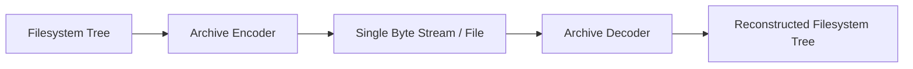

Namun, archive tidak identik dengan filesystem normal.

Archive bisa berisi:

- file regular;
- directory;
- symlink;
- hardlink;
- special file;
- metadata permission;
- owner/group;
- modified time;
- compressed payload;
- duplicate name;
- path aneh;
- absolute path;
- `../` path;
- platform-specific metadata;
- entry size tidak masuk akal;
- entry dengan nama valid menurut format, tetapi berbahaya untuk OS target.

Jadi, saat membaca archive, pertanyaan utamanya bukan:

> “Bagaimana cara extract?”

Tapi:

> “Entry mana yang boleh menjadi file nyata di filesystem saya, dengan nama apa, permission apa, size berapa, dan di bawah policy apa?”

---

## 2. Archive Sebagai Boundary Tidak Terpercaya

Archive dari user, partner, network, object storage, atau external system harus dianggap **untrusted input**.

Artinya:

1. Jangan percaya path entry.
2. Jangan percaya size header sepenuhnya.
3. Jangan percaya tipe file.
4. Jangan percaya permission.
5. Jangan percaya symlink target.
6. Jangan percaya jumlah entry.
7. Jangan percaya compressed ratio.
8. Jangan percaya duplicate entry order.
9. Jangan extract langsung ke directory final tanpa staging.
10. Jangan `defer Close()` di loop besar secara sembarangan.

Archive handling yang aman adalah gabungan dari:

- path validation;
- size limit;
- count limit;
- type allowlist;
- permission normalization;
- atomic/staged extraction;
- checksum/integrity validation;
- observability;
- cleanup on failure.

---

## 3. TAR vs ZIP: Perbedaan Mental Model

### 3.1 TAR

TAR adalah format archive yang secara historis cocok untuk **streaming**.

Karakteristik:

- entry dibaca berurutan;
- cocok digabung dengan compression seperti gzip: `.tar.gz`;
- bagus untuk pipeline `reader -> tar.Reader -> process`;
- tidak butuh central directory;
- metadata file cukup kaya;
- random access tidak natural;
- extraction bisa dilakukan sambil membaca stream.

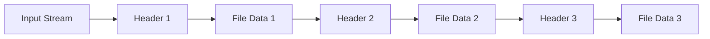

TAR cocok untuk:

- streaming backup;
- server-to-server transfer;
- export pipeline;
- large directory pack;
- `.tar.gz` artifact;
- sequential processing.

### 3.2 ZIP

ZIP adalah archive dengan struktur yang biasanya bergantung pada **central directory** di akhir file.

Karakteristik:

- daftar file tersedia dari central directory;
- lebih natural untuk random access ke entry;
- tiap file bisa dikompresi sendiri;
- umum dipakai user-facing;
- reader biasanya butuh `ReaderAt` dan size untuk membuka archive;
- tidak mendukung disk spanning di package standar Go;
- bisa mendukung ZIP64;
- entry ordering bisa berbeda dengan kebutuhan user.

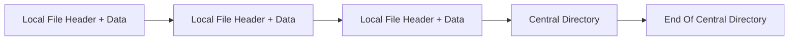

ZIP cocok untuk:

- upload/download user;
- random entry access;
- small-to-medium bundle;
- office-like document container;
- cross-platform distribution.

---

## 4. Package Map di Go

| Package | Fungsi |
|---|---|
| `archive/tar` | Membaca/menulis TAR archive |
| `archive/zip` | Membaca/menulis ZIP archive |
| `compress/gzip` | Membungkus TAR menjadi `.tar.gz` atau membaca gzip stream |
| `compress/flate` | Compression engine yang juga dipakai ZIP deflate |
| `io` | Copy, limit, pipe, reader/writer composition |
| `io/fs` | Path semantics untuk virtual filesystem |
| `os` | File/directory creation, permission, rename, remove |
| `path/filepath` | OS-specific path handling |
| `strings` | Prefix/suffix/cleanup helper |
| `time` | Metadata timestamp normalization |
| `crypto/sha256` / `hash/crc32` | Integrity/checksum, tergantung use case |

Pola penting:

```go
// TAR reading
tr := tar.NewReader(r)
for {
    hdr, err := tr.Next()
    // hdr describes next entry
    // tr is now reader for that entry's data
}
```

```go
// ZIP reading
zr, err := zip.NewReader(readerAt, size)
for _, f := range zr.File {
    rc, err := f.Open()
    // rc is reader for this entry
}
```

Perbedaan besar:

- `tar.Reader` membaca entry **sequentially** dari `io.Reader`.
- `zip.Reader` biasanya membaca archive dari `io.ReaderAt` + size.

Ini berdampak langsung pada desain streaming.

---

## 5. TAR di Go: Core API

### 5.1 Membaca TAR

Contoh minimal:

```go
package archiveutil

import (
    "archive/tar"
    "fmt"
    "io"
)

func ListTar(r io.Reader) error {
    tr := tar.NewReader(r)

    for {
        hdr, err := tr.Next()
        if err == io.EOF {
            return nil
        }
        if err != nil {
            return fmt.Errorf("read tar header: %w", err)
        }

        fmt.Printf("name=%s type=%c size=%d\n", hdr.Name, hdr.Typeflag, hdr.Size)

        // If the current entry has data, tr reads that data.
        // You must consume/copy it before Next advances meaningfully.
    }
}
```

`tar.Reader.Next()` mengembalikan header berikutnya. Setelah `Next()`, `tr` sendiri menjadi reader untuk payload entry tersebut.

Mental model:

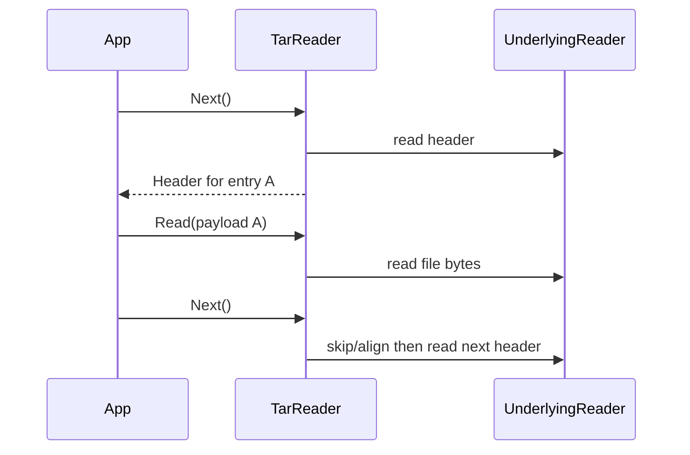

### 5.2 Menulis TAR

```go
package archiveutil

import (
    "archive/tar"
    "fmt"
    "io"
)

func WriteSingleFileTar(w io.Writer, name string, data []byte) error {
    tw := tar.NewWriter(w)
    defer tw.Close()

    hdr := &tar.Header{
        Name: name,
        Mode: 0o644,
        Size: int64(len(data)),
    }

    if err := tw.WriteHeader(hdr); err != nil {
        return fmt.Errorf("write tar header: %w", err)
    }
    if _, err := tw.Write(data); err != nil {
        return fmt.Errorf("write tar data: %w", err)
    }
    if err := tw.Close(); err != nil {
        return fmt.Errorf("close tar writer: %w", err)
    }
    return nil
}
```

Catatan penting: `tw.Close()` penting untuk menyelesaikan archive. Jangan mengabaikan error close.

Versi di atas punya bug kecil: `defer tw.Close()` dan explicit `tw.Close()` bisa double-close. Dalam kode production, gunakan helper close-capture.

Lebih benar:

```go
func WriteSingleFileTarSafe(w io.Writer, name string, data []byte) (err error) {
    tw := tar.NewWriter(w)
    defer func() {
        if closeErr := tw.Close(); err == nil && closeErr != nil {
            err = fmt.Errorf("close tar writer: %w", closeErr)
        }
    }()

    hdr := &tar.Header{
        Name: name,
        Mode: 0o644,
        Size: int64(len(data)),
    }

    if err := tw.WriteHeader(hdr); err != nil {
        return fmt.Errorf("write tar header: %w", err)
    }
    if _, err := tw.Write(data); err != nil {
        return fmt.Errorf("write tar data: %w", err)
    }
    return nil
}
```

---

## 6. TAR + GZIP: `.tar.gz`

TAR tidak selalu compressed. `.tar.gz` berarti:

```text
filesystem tree -> tar stream -> gzip stream -> output file/network
```

Membaca:

```go
func ListTarGz(r io.Reader) error {
    gz, err := gzip.NewReader(r)
    if err != nil {
        return fmt.Errorf("open gzip: %w", err)
    }
    defer gz.Close()

    return ListTar(gz)
}
```

Menulis:

```go
func WriteTarGz(w io.Writer, files map[string][]byte) (err error) {
    gz := gzip.NewWriter(w)
    defer func() {
        if closeErr := gz.Close(); err == nil && closeErr != nil {
            err = fmt.Errorf("close gzip: %w", closeErr)
        }
    }()

    tw := tar.NewWriter(gz)
    defer func() {
        if closeErr := tw.Close(); err == nil && closeErr != nil {
            err = fmt.Errorf("close tar: %w", closeErr)
        }
    }()

    for name, data := range files {
        hdr := &tar.Header{
            Name: name,
            Mode: 0o644,
            Size: int64(len(data)),
        }
        if err := tw.WriteHeader(hdr); err != nil {
            return fmt.Errorf("write header %q: %w", name, err)
        }
        if _, err := tw.Write(data); err != nil {
            return fmt.Errorf("write data %q: %w", name, err)
        }
    }
    return nil
}
```

Close ordering:

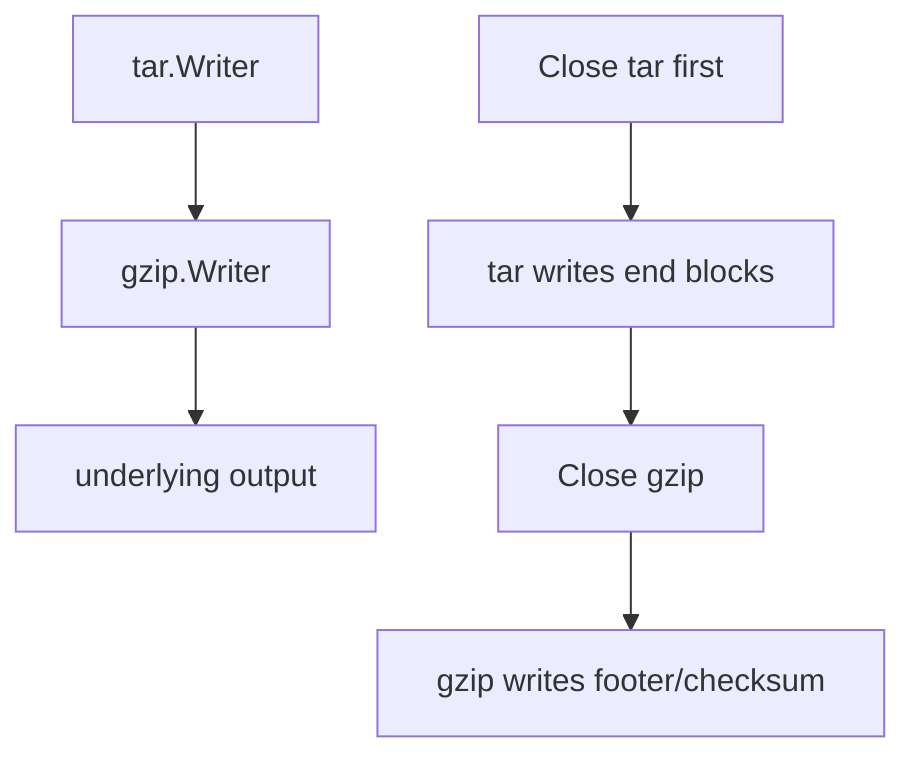

Jika close order salah, archive bisa corrupt.

---

## 7. ZIP di Go: Core API

### 7.1 Membaca ZIP

ZIP reader membutuhkan `io.ReaderAt` dan size.

```go
func ListZip(path string) error {
    zr, err := zip.OpenReader(path)
    if err != nil {
        return fmt.Errorf("open zip: %w", err)
    }
    defer zr.Close()

    for _, f := range zr.File {
        fmt.Printf("name=%s compressed=%d uncompressed=%d\n",
            f.Name,
            f.CompressedSize64,
            f.UncompressedSize64,
        )
    }
    return nil
}
```

Jika archive sudah ada di memory atau file-like object:

```go
func ListZipFromReaderAt(ra io.ReaderAt, size int64) error {
    zr, err := zip.NewReader(ra, size)
    if err != nil {
        return fmt.Errorf("new zip reader: %w", err)
    }

    for _, f := range zr.File {
        fmt.Println(f.Name)
    }
    return nil
}
```

Kenapa `ReaderAt`?

Karena ZIP memiliki central directory yang biasanya dibaca dari akhir file, lalu entry bisa dibuka secara random.

### 7.2 Membaca Isi Entry ZIP

```go
func ReadZipEntry(f *zip.File, maxBytes int64) ([]byte, error) {
    rc, err := f.Open()
    if err != nil {
        return nil, fmt.Errorf("open zip entry %q: %w", f.Name, err)
    }
    defer rc.Close()

    limited := io.LimitReader(rc, maxBytes+1)
    b, err := io.ReadAll(limited)
    if err != nil {
        return nil, fmt.Errorf("read zip entry %q: %w", f.Name, err)
    }
    if int64(len(b)) > maxBytes {
        return nil, fmt.Errorf("zip entry %q too large", f.Name)
    }
    return b, nil
}
```

Jangan membaca entry untrusted dengan `io.ReadAll` tanpa limit.

### 7.3 Menulis ZIP

```go
func WriteZip(w io.Writer, files map[string][]byte) (err error) {
    zw := zip.NewWriter(w)
    defer func() {
        if closeErr := zw.Close(); err == nil && closeErr != nil {
            err = fmt.Errorf("close zip writer: %w", closeErr)
        }
    }()

    for name, data := range files {
        fw, err := zw.Create(name)
        if err != nil {
            return fmt.Errorf("create zip entry %q: %w", name, err)
        }
        if _, err := fw.Write(data); err != nil {
            return fmt.Errorf("write zip entry %q: %w", name, err)
        }
    }
    return nil
}
```

`zip.Writer.Close()` penting karena central directory ditulis saat close.

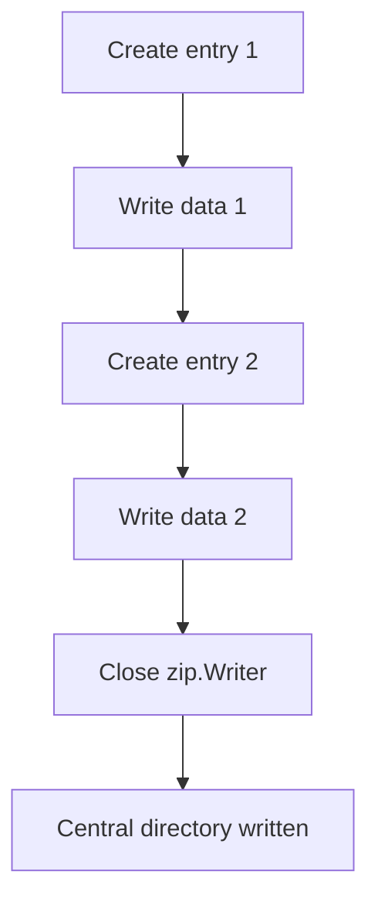

Jika `Close()` gagal atau tidak dipanggil, ZIP bisa tidak valid.

---

## 8. ZIP vs TAR Dalam Desain Sistem

| Kriteria | TAR | ZIP |
|---|---|---|
| Streaming read | Sangat cocok | Tidak se-natural TAR |
| Random access | Lemah | Kuat |
| Compression | Biasanya external wrapper seperti gzip | Per-entry compression |
| User-facing | Kurang umum untuk non-technical user | Sangat umum |
| Metadata Unix | Kuat | Bervariasi |
| Large archive sequential export | Bagus | Bisa, tapi central directory di akhir |
| Entry listing sebelum read data | Tidak tanpa scan sequential | Ya dari central directory |
| Network pipeline | Bagus | Perlu strategi khusus |
| Safe extraction complexity | Tinggi | Tinggi |

Rule of thumb:

- Gunakan **TAR.GZ** untuk streaming server-to-server export/import.
- Gunakan **ZIP** untuk user download/upload multi-file.
- Gunakan **manifest + object store** bila file terlalu besar atau butuh retry/resume kuat.
- Jangan jadikan archive sebagai transactional database.

---

## 9. Threat Model Archive Extraction

Archive extraction adalah operasi berbahaya karena mengubah byte input menjadi file nyata.

Threat model:

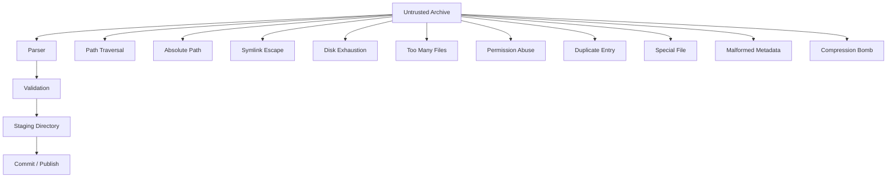

Kita ingin mencegah input seperti:

```text
../../etc/passwd
/var/app/config.yaml
C:\Windows\System32\drivers\etc\hosts
safe/../../evil
safe/link -> /etc
safe/link/overwrite
```

Juga entry seperti:

- symlink;
- hardlink;
- device file;
- FIFO;
- huge file;
- huge count;
- duplicate names;
- path dengan control characters;
- path dengan Unicode spoofing;
- path yang valid di Unix tapi aneh di Windows.

---

## 10. Zip Slip / Tar Slip

**Zip Slip** dan **Tar Slip** adalah class vulnerability saat archive entry name digabung langsung dengan destination path.

Anti-pattern:

```go
outPath := filepath.Join(destDir, entryName)
os.WriteFile(outPath, data, 0o644)
```

Masalah:

```go
filepath.Join("/safe/dest", "../../etc/passwd")
// may resolve outside /safe/dest after cleaning
```

Path traversal tidak selalu terlihat jelas:

```text
../evil.txt
safe/../../evil.txt
./../../evil.txt
/a/../..//evil.txt
```

Prinsip:

> Archive entry path harus divalidasi sebagai **logical archive path** dulu, baru dipetakan ke filesystem target.

---

## 11. Safe Path Policy

Kita butuh policy:

1. Entry name harus relative.
2. Tidak boleh absolute.
3. Tidak boleh kosong.
4. Tidak boleh mengandung `..` segment.
5. Tidak boleh mengandung NUL.
6. Tidak boleh path Windows drive/UNC.
7. Separator dinormalisasi.
8. Output path final harus tetap berada di destination root.
9. Optional: hanya allow extension tertentu.
10. Optional: reject hidden file.

### 11.1 Helper Path Sanitization

```go
package archiveutil

import (
    "fmt"
    "io/fs"
    "path"
    "path/filepath"
    "runtime"
    "strings"
)

type PathPolicy struct {
    RejectHidden       bool
    RejectBackslash    bool
    RejectAbsolute     bool
    RejectWindowsDrive bool
}

func SafeArchiveName(name string, p PathPolicy) (string, error) {
    if name == "" {
        return "", fmt.Errorf("empty archive name")
    }
    if strings.ContainsRune(name, '\x00') {
        return "", fmt.Errorf("archive name contains NUL")
    }

    // ZIP usually uses slash-separated names, but malicious archives may contain backslash.
    if p.RejectBackslash && strings.Contains(name, "\\") {
        return "", fmt.Errorf("archive name contains backslash")
    }

    // Convert backslash to slash only if your policy allows it.
    logical := strings.ReplaceAll(name, "\\", "/")

    if p.RejectAbsolute && strings.HasPrefix(logical, "/") {
        return "", fmt.Errorf("absolute archive path not allowed: %q", name)
    }

    if p.RejectWindowsDrive && looksLikeWindowsAbs(logical) {
        return "", fmt.Errorf("windows absolute archive path not allowed: %q", name)
    }

    cleaned := path.Clean(logical)
    if cleaned == "." {
        return "", fmt.Errorf("invalid archive root entry: %q", name)
    }

    // fs.ValidPath uses slash-separated, unrooted, no dot/dotdot/empty segment.
    if !fs.ValidPath(cleaned) {
        return "", fmt.Errorf("invalid archive path: %q", name)
    }

    if p.RejectHidden {
        for _, elem := range strings.Split(cleaned, "/") {
            if strings.HasPrefix(elem, ".") {
                return "", fmt.Errorf("hidden path element not allowed: %q", elem)
            }
        }
    }

    return cleaned, nil
}

func looksLikeWindowsAbs(s string) bool {
    if len(s) >= 2 && ((s[0] >= 'A' && s[0] <= 'Z') || (s[0] >= 'a' && s[0] <= 'z')) && s[1] == ':' {
        return true
    }
    if strings.HasPrefix(s, "//") {
        return true
    }
    if runtime.GOOS == "windows" && filepath.IsAbs(s) {
        return true
    }
    return false
}
```

### 11.2 Joining to Destination Root

```go
func SafeJoin(destRoot string, archiveName string) (string, error) {
    safeName, err := SafeArchiveName(archiveName, PathPolicy{
        RejectHidden:       false,
        RejectBackslash:    false,
        RejectAbsolute:     true,
        RejectWindowsDrive: true,
    })
    if err != nil {
        return "", err
    }

    rootAbs, err := filepath.Abs(destRoot)
    if err != nil {
        return "", fmt.Errorf("abs root: %w", err)
    }

    outPath := filepath.Join(rootAbs, filepath.FromSlash(safeName))
    outAbs, err := filepath.Abs(outPath)
    if err != nil {
        return "", fmt.Errorf("abs output: %w", err)
    }

    rel, err := filepath.Rel(rootAbs, outAbs)
    if err != nil {
        return "", fmt.Errorf("rel output: %w", err)
    }
    if rel == "." || strings.HasPrefix(rel, ".."+string(filepath.Separator)) || rel == ".." || filepath.IsAbs(rel) {
        return "", fmt.Errorf("archive path escapes destination: %q", archiveName)
    }

    return outAbs, nil
}
```

Catatan penting:

- `fs.ValidPath` cocok untuk logical slash-separated archive path.
- `filepath.Join` cocok untuk OS path.
- `filepath.Rel` check membantu memastikan hasil final tetap di root.
- Ini belum cukup untuk symlink race jika destination mengandung symlink atau attacker bisa memodifikasi staging directory.

---

## 12. Symlink dan Hardlink Policy

Archive bisa membawa symlink/hardlink.

TAR punya type flags seperti:

- regular file;
- directory;
- symlink;
- hardlink;
- character device;
- block device;
- FIFO;
- PAX metadata.

ZIP juga bisa menyimpan metadata eksternal yang mengindikasikan symlink pada platform tertentu.

Production default paling aman:

> Reject symlink, hardlink, device, FIFO, dan special file kecuali use case benar-benar membutuhkannya.

Kenapa?

Karena symlink dapat membuat file tampak berada di destination, tetapi sebenarnya menunjuk keluar.

Contoh attack:

```text
entry 1: safe/link -> /etc
entry 2: safe/link/passwd
```

Jika extractor membuat symlink lalu menulis ke dalamnya, output bisa menulis ke `/etc/passwd`.

Policy yang aman:

| Entry Type | Default Policy |
|---|---|
| Regular file | Allow with size/path limit |
| Directory | Allow with path limit |
| Symlink | Reject by default |
| Hardlink | Reject by default |
| Char/block device | Reject |
| FIFO | Reject |
| Socket | Reject |
| Unknown | Reject |

---

## 13. Safe TAR Extraction

### 13.1 Config

```go
package archiveutil

import (
    "archive/tar"
    "errors"
    "fmt"
    "io"
    "os"
    "path/filepath"
)

type ExtractConfig struct {
    DestDir       string
    MaxFiles      int
    MaxTotalBytes int64
    MaxFileBytes  int64
    FileMode      os.FileMode
    DirMode       os.FileMode
}

func (c ExtractConfig) withDefaults() ExtractConfig {
    if c.MaxFiles <= 0 {
        c.MaxFiles = 10_000
    }
    if c.MaxTotalBytes <= 0 {
        c.MaxTotalBytes = 10 << 30 // 10 GiB default example; tune per system.
    }
    if c.MaxFileBytes <= 0 {
        c.MaxFileBytes = 1 << 30 // 1 GiB default example; tune per system.
    }
    if c.FileMode == 0 {
        c.FileMode = 0o600
    }
    if c.DirMode == 0 {
        c.DirMode = 0o700
    }
    return c
}
```

### 13.2 Extractor

```go
func ExtractTar(r io.Reader, cfg ExtractConfig) error {
    cfg = cfg.withDefaults()

    if cfg.DestDir == "" {
        return errors.New("destination directory required")
    }
    if err := os.MkdirAll(cfg.DestDir, cfg.DirMode); err != nil {
        return fmt.Errorf("create destination: %w", err)
    }

    tr := tar.NewReader(r)

    var files int
    var total int64
    seen := make(map[string]struct{})

    for {
        hdr, err := tr.Next()
        if err == io.EOF {
            return nil
        }
        if err != nil {
            return fmt.Errorf("read tar header: %w", err)
        }

        files++
        if files > cfg.MaxFiles {
            return fmt.Errorf("too many archive entries: max=%d", cfg.MaxFiles)
        }

        safeName, err := SafeArchiveName(hdr.Name, PathPolicy{
            RejectAbsolute:     true,
            RejectWindowsDrive: true,
            RejectBackslash:    false,
        })
        if err != nil {
            return fmt.Errorf("invalid tar entry name %q: %w", hdr.Name, err)
        }

        if _, ok := seen[safeName]; ok {
            return fmt.Errorf("duplicate archive entry: %q", safeName)
        }
        seen[safeName] = struct{}{}

        outPath, err := SafeJoin(cfg.DestDir, safeName)
        if err != nil {
            return fmt.Errorf("unsafe tar output path %q: %w", hdr.Name, err)
        }

        switch hdr.Typeflag {
        case tar.TypeDir:
            if err := os.MkdirAll(outPath, cfg.DirMode); err != nil {
                return fmt.Errorf("create directory %q: %w", safeName, err)
            }

        case tar.TypeReg, tar.TypeRegA:
            if hdr.Size < 0 {
                return fmt.Errorf("negative tar entry size: %q", safeName)
            }
            if hdr.Size > cfg.MaxFileBytes {
                return fmt.Errorf("tar entry too large: %q size=%d max=%d", safeName, hdr.Size, cfg.MaxFileBytes)
            }
            if total+hdr.Size > cfg.MaxTotalBytes {
                return fmt.Errorf("archive total size too large: total=%d next=%d max=%d", total, hdr.Size, cfg.MaxTotalBytes)
            }
            total += hdr.Size

            if err := os.MkdirAll(filepath.Dir(outPath), cfg.DirMode); err != nil {
                return fmt.Errorf("create parent for %q: %w", safeName, err)
            }
            if err := writeRegularFile(outPath, tr, hdr.Size, cfg.FileMode); err != nil {
                return fmt.Errorf("write file %q: %w", safeName, err)
            }

        default:
            return fmt.Errorf("unsupported tar entry type %q for %q", hdr.Typeflag, safeName)
        }
    }
}

func writeRegularFile(path string, r io.Reader, expected int64, mode os.FileMode) error {
    f, err := os.OpenFile(path, os.O_CREATE|os.O_EXCL|os.O_WRONLY, mode)
    if err != nil {
        return err
    }

    written, copyErr := io.CopyN(f, r, expected)
    closeErr := f.Close()

    if copyErr != nil {
        _ = os.Remove(path)
        return fmt.Errorf("copy file data: written=%d expected=%d: %w", written, expected, copyErr)
    }
    if written != expected {
        _ = os.Remove(path)
        return fmt.Errorf("short copy: written=%d expected=%d", written, expected)
    }
    if closeErr != nil {
        _ = os.Remove(path)
        return fmt.Errorf("close file: %w", closeErr)
    }
    return nil
}
```

Key decisions:

- `O_EXCL` mencegah overwrite file existing.
- Duplicate entry ditolak.
- Symlink/special type ditolak.
- Permission dari archive tidak dipercaya.
- Size per file dan total size dibatasi.
- Parent directory dibuat eksplisit.
- File partial dihapus saat gagal.

### 13.3 Keterbatasan

Extractor di atas masih belum sempurna untuk semua threat model:

- jika `DestDir` bisa dimodifikasi attacker concurrent;
- jika parent path berubah menjadi symlink saat extract;
- jika filesystem semantics berbeda;
- jika butuh atomic commit semua entry;
- jika perlu fsync durability.

Production-grade extractor untuk security-critical environment biasanya memakai:

- private staging directory;
- permission ketat;
- no shared writable parent;
- reject symlink;
- final atomic move;
- cleanup on failure;
- optional fsync.

---

## 14. Safe ZIP Extraction

### 14.1 Basic Extractor

```go
func ExtractZip(path string, cfg ExtractConfig) error {
    cfg = cfg.withDefaults()

    zr, err := zip.OpenReader(path)
    if err != nil {
        return fmt.Errorf("open zip: %w", err)
    }
    defer zr.Close()

    if err := os.MkdirAll(cfg.DestDir, cfg.DirMode); err != nil {
        return fmt.Errorf("create destination: %w", err)
    }

    if len(zr.File) > cfg.MaxFiles {
        return fmt.Errorf("too many zip entries: count=%d max=%d", len(zr.File), cfg.MaxFiles)
    }

    var total uint64
    seen := make(map[string]struct{})

    for _, f := range zr.File {
        safeName, err := SafeArchiveName(f.Name, PathPolicy{
            RejectAbsolute:     true,
            RejectWindowsDrive: true,
            RejectBackslash:    false,
        })
        if err != nil {
            return fmt.Errorf("invalid zip entry name %q: %w", f.Name, err)
        }
        if _, ok := seen[safeName]; ok {
            return fmt.Errorf("duplicate zip entry: %q", safeName)
        }
        seen[safeName] = struct{}{}

        outPath, err := SafeJoin(cfg.DestDir, safeName)
        if err != nil {
            return fmt.Errorf("unsafe zip output path %q: %w", f.Name, err)
        }

        if f.FileInfo().IsDir() {
            if err := os.MkdirAll(outPath, cfg.DirMode); err != nil {
                return fmt.Errorf("create directory %q: %w", safeName, err)
            }
            continue
        }

        if !f.FileInfo().Mode().IsRegular() {
            return fmt.Errorf("unsupported zip entry type %q mode=%s", safeName, f.FileInfo().Mode())
        }

        if f.UncompressedSize64 > uint64(cfg.MaxFileBytes) {
            return fmt.Errorf("zip entry too large: %q size=%d max=%d", safeName, f.UncompressedSize64, cfg.MaxFileBytes)
        }
        if total+f.UncompressedSize64 > uint64(cfg.MaxTotalBytes) {
            return fmt.Errorf("zip total size too large")
        }
        total += f.UncompressedSize64

        if err := os.MkdirAll(filepath.Dir(outPath), cfg.DirMode); err != nil {
            return fmt.Errorf("create parent for %q: %w", safeName, err)
        }

        if err := extractZipFile(outPath, f, cfg); err != nil {
            return fmt.Errorf("extract zip entry %q: %w", safeName, err)
        }
    }

    return nil
}

func extractZipFile(outPath string, f *zip.File, cfg ExtractConfig) error {
    rc, err := f.Open()
    if err != nil {
        return fmt.Errorf("open entry: %w", err)
    }
    defer rc.Close()

    out, err := os.OpenFile(outPath, os.O_CREATE|os.O_EXCL|os.O_WRONLY, cfg.FileMode)
    if err != nil {
        return fmt.Errorf("create output: %w", err)
    }

    limited := io.LimitReader(rc, cfg.MaxFileBytes+1)
    written, copyErr := io.Copy(out, limited)
    closeErr := out.Close()

    if copyErr != nil {
        _ = os.Remove(outPath)
        return fmt.Errorf("copy entry: %w", copyErr)
    }
    if written > cfg.MaxFileBytes {
        _ = os.Remove(outPath)
        return fmt.Errorf("entry exceeded max file bytes")
    }
    if uint64(written) != f.UncompressedSize64 {
        // Depending on use case, this can be warning or hard failure.
        _ = os.Remove(outPath)
        return fmt.Errorf("entry size mismatch: written=%d expected=%d", written, f.UncompressedSize64)
    }
    if closeErr != nil {
        _ = os.Remove(outPath)
        return fmt.Errorf("close output: %w", closeErr)
    }
    return nil
}
```

### 14.2 Why Limit Even If ZIP Has UncompressedSize64?

Because archive metadata is untrusted. The parser may validate some aspects, but your application policy should still limit actual bytes copied.

Use both:

- header-based precheck;
- actual read limit.

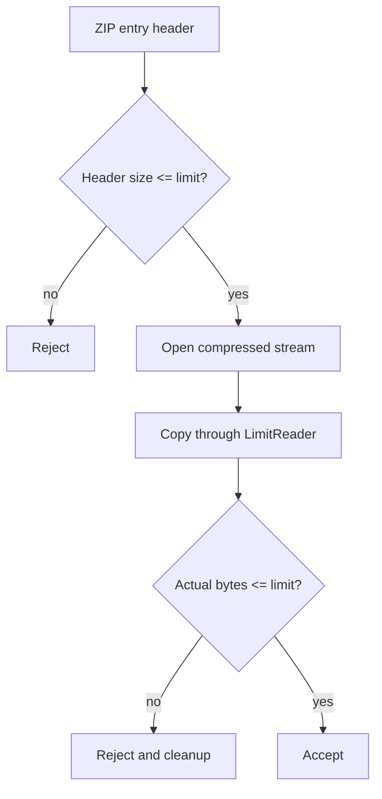

---

## 15. Staged Extraction Pattern

Direct extraction to final location can leave partial state if extraction fails halfway.

Better:

1. create private temp directory near final location;
2. extract into temp;
3. validate extracted tree;
4. optionally fsync files/directories;
5. atomically rename/swap into final location;
6. cleanup temp on failure.

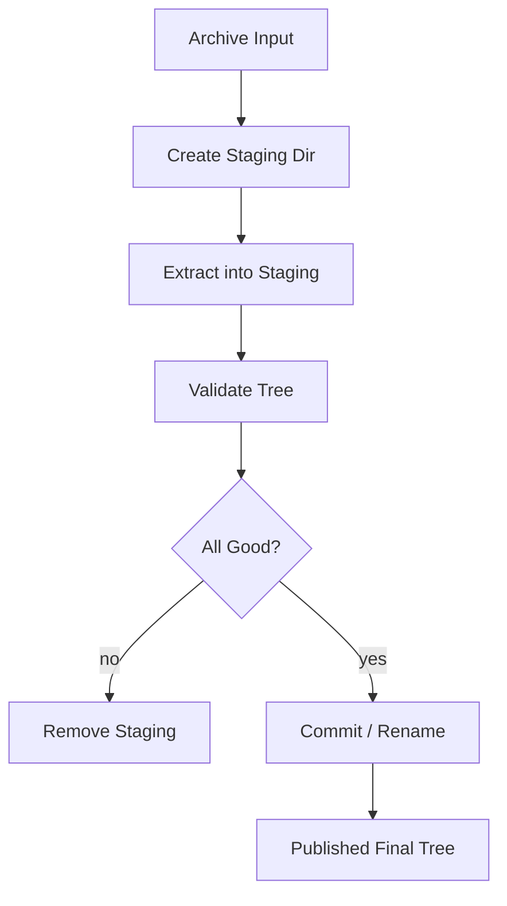

Example:

```go
func ExtractTarStaged(r io.Reader, finalDir string, cfg ExtractConfig) (err error) {
    parent := filepath.Dir(finalDir)
    base := filepath.Base(finalDir)

    staging, err := os.MkdirTemp(parent, "."+base+"-extract-*")
    if err != nil {
        return fmt.Errorf("create staging dir: %w", err)
    }
    committed := false
    defer func() {
        if !committed {
            _ = os.RemoveAll(staging)
        }
    }()

    cfg.DestDir = staging
    if err := ExtractTar(r, cfg); err != nil {
        return fmt.Errorf("extract to staging: %w", err)
    }

    // Optional: validate expected manifest here.

    // This simple commit assumes finalDir does not exist.
    if err := os.Rename(staging, finalDir); err != nil {
        return fmt.Errorf("commit staging: %w", err)
    }
    committed = true
    return nil
}
```

For replacement use cases, durability and atomic swap become more complex:

- rename old to backup;
- rename staging to final;
- cleanup backup;
- handle rollback;
- sync parent directory;
- platform-specific constraints.

---

## 16. Archive Creation From Filesystem

### 16.1 Creating TAR From Directory

```go
func CreateTarFromDir(w io.Writer, root string) (err error) {
    tw := tar.NewWriter(w)
    defer func() {
        if closeErr := tw.Close(); err == nil && closeErr != nil {
            err = fmt.Errorf("close tar: %w", closeErr)
        }
    }()

    rootAbs, err := filepath.Abs(root)
    if err != nil {
        return fmt.Errorf("abs root: %w", err)
    }

    return filepath.WalkDir(rootAbs, func(path string, d os.DirEntry, walkErr error) error {
        if walkErr != nil {
            return walkErr
        }

        rel, err := filepath.Rel(rootAbs, path)
        if err != nil {
            return err
        }
        if rel == "." {
            return nil
        }

        relSlash := filepath.ToSlash(rel)
        info, err := d.Info()
        if err != nil {
            return err
        }

        // Secure default: only regular files and directories.
        if d.Type()&os.ModeSymlink != 0 {
            return fmt.Errorf("symlink not allowed: %s", relSlash)
        }
        if !info.Mode().IsRegular() && !info.IsDir() {
            return fmt.Errorf("unsupported file type: %s mode=%s", relSlash, info.Mode())
        }

        hdr, err := tar.FileInfoHeader(info, "")
        if err != nil {
            return err
        }
        hdr.Name = relSlash

        // Normalize metadata for reproducible archive.
        hdr.Uid = 0
        hdr.Gid = 0
        hdr.Uname = ""
        hdr.Gname = ""
        if info.IsDir() {
            hdr.Mode = 0o755
        } else {
            hdr.Mode = 0o644
        }

        if err := tw.WriteHeader(hdr); err != nil {
            return err
        }

        if info.IsDir() {
            return nil
        }

        f, err := os.Open(path)
        if err != nil {
            return err
        }
        defer f.Close() // Acceptable for small tree? For large tree, close explicitly per iteration.

        if _, err := io.Copy(tw, f); err != nil {
            return err
        }
        return f.Close()
    })
}
```

But note: `defer f.Close()` inside large `WalkDir` loop can accumulate open descriptors. Prefer explicit close:

```go
func copyFileToTar(tw *tar.Writer, path string) error {
    f, err := os.Open(path)
    if err != nil {
        return err
    }
    _, copyErr := io.Copy(tw, f)
    closeErr := f.Close()
    if copyErr != nil {
        return copyErr
    }
    return closeErr
}
```

### 16.2 Creating ZIP From Directory

```go
func CreateZipFromDir(w io.Writer, root string) (err error) {
    zw := zip.NewWriter(w)
    defer func() {
        if closeErr := zw.Close(); err == nil && closeErr != nil {
            err = fmt.Errorf("close zip: %w", closeErr)
        }
    }()

    rootAbs, err := filepath.Abs(root)
    if err != nil {
        return fmt.Errorf("abs root: %w", err)
    }

    return filepath.WalkDir(rootAbs, func(path string, d os.DirEntry, walkErr error) error {
        if walkErr != nil {
            return walkErr
        }
        if path == rootAbs {
            return nil
        }

        info, err := d.Info()
        if err != nil {
            return err
        }
        if d.Type()&os.ModeSymlink != 0 {
            return fmt.Errorf("symlink not allowed: %s", path)
        }
        if !info.Mode().IsRegular() && !info.IsDir() {
            return fmt.Errorf("unsupported type: %s", path)
        }

        rel, err := filepath.Rel(rootAbs, path)
        if err != nil {
            return err
        }
        relSlash := filepath.ToSlash(rel)
        if info.IsDir() {
            relSlash += "/"
        }

        hdr, err := zip.FileInfoHeader(info)
        if err != nil {
            return err
        }
        hdr.Name = relSlash
        hdr.Method = zip.Deflate

        // Normalize permission if reproducibility/security matters.
        if info.IsDir() {
            hdr.SetMode(0o755 | os.ModeDir)
        } else {
            hdr.SetMode(0o644)
        }

        writer, err := zw.CreateHeader(hdr)
        if err != nil {
            return err
        }
        if info.IsDir() {
            return nil
        }

        f, err := os.Open(path)
        if err != nil {
            return err
        }
        _, copyErr := io.Copy(writer, f)
        closeErr := f.Close()
        if copyErr != nil {
            return copyErr
        }
        return closeErr
    })
}
```

---

## 17. `AddFS` and `fs.FS`

Go archive writers support filesystem abstraction patterns.

Using `fs.FS`, archive creation can work from:

- `os.DirFS`;
- `embed.FS`;
- `fstest.MapFS`;
- custom virtual FS.

This is useful for:

- packaging embedded templates;
- testing archive logic without disk;
- exporting virtual report bundle;
- packaging generated files.

Conceptually:

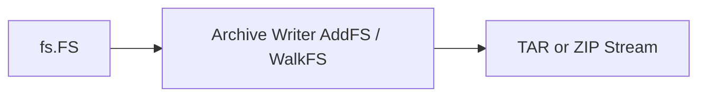

However, production systems often still implement custom walk because they need policy:

- permission normalization;
- reject hidden files;
- reject symlink;
- stable ordering;
- manifest generation;
- compression selection;
- per-entry metadata.

---

## 18. Metadata: What to Preserve, Normalize, or Drop

Archive metadata can include:

- mode/permission;
- owner UID/GID;
- username/group name;
- modified time;
- access/change time via extensions;
- symlink target;
- extended attributes;
- comments;
- compression method;
- OS creator metadata.

Production policy:

| Metadata | Ingest Default | Export Default |
|---|---|---|
| Filename | Validate strictly | Generate from safe logical path |
| Permission | Ignore/archive normalize | Normalize e.g. 0644/0755 |
| Owner UID/GID | Ignore | Usually zero/empty |
| Mtime | Optional preserve | Optional deterministic timestamp |
| Symlink target | Reject | Avoid unless required |
| Special files | Reject | Avoid |
| Comments | Ignore | Avoid sensitive data |
| Extended attributes | Usually drop | Usually drop |

Reproducible archives often require:

- stable file ordering;
- fixed timestamp;
- fixed permissions;
- no owner/group names;
- deterministic compression settings;
- stable manifest.

---

## 19. Duplicate Entries

Archive formats can contain duplicate names.

Example:

```text
config.yaml
config.yaml
```

Risk:

- first one passes validation;
- second overwrites;
- validator and extractor disagree;
- UI displays one file while extractor uses another;
- malicious archive hides payload after benign entry.

Policy:

> Reject duplicate logical archive names by default.

Implementation:

```go
seen := map[string]struct{}{}
if _, ok := seen[safeName]; ok {
    return fmt.Errorf("duplicate archive entry: %q", safeName)
}
seen[safeName] = struct{}{}
```

Normalize before checking duplicates.

These should be considered duplicates under many policies:

```text
a/b.txt
a//b.txt
a/./b.txt
x/../a/b.txt
```

But since `..` should be rejected, not normalized into allowed output, behavior must be explicit.

---

## 20. Size Limits and Decompression Bombs

Archive may be compressed. Compressed input can expand massively.

Example:

```text
10 MB archive -> 10 GB extracted data
```

Limit types:

| Limit | Meaning |
|---|---|
| Max archive compressed bytes | Limit uploaded/archive file size |
| Max entries | Prevent millions of tiny files |
| Max uncompressed per file | Prevent huge single file |
| Max total uncompressed | Prevent disk exhaustion |
| Max path length | Prevent OS/path abuse |
| Max directory depth | Prevent pathological trees |
| Max compression ratio | Optional heuristic |
| Max processing time | Context/deadline outside archive package |

Example config:

```go
type ArchiveLimits struct {
    MaxArchiveBytes      int64
    MaxEntries           int
    MaxFileBytes         int64
    MaxTotalBytes        int64
    MaxPathBytes         int
    MaxDepth             int
    MaxCompressionRatio  float64
}
```

Important:

- ZIP header uncompressed size helps but is not enough.
- TAR header size helps but is not enough against compressed outer layer.
- Always limit actual bytes copied.
- For `.tar.gz`, limit decompressed output through tar entry sizes and total bytes.
- For upload, limit compressed request body before parser.

---

## 21. Large Archive Handling

Large archive problems:

- memory spike from listing all entries;
- disk exhaustion;
- too many file descriptors;
- slow extraction;
- cancellation delay;
- partial state;
- non-idempotent retry;
- poor progress reporting;
- checksum latency;
- archive corruption late in process.

### 21.1 TAR Large Archive

TAR is good for sequential large archive.

Pattern:

```go
for each header:
    validate header
    if directory: create dir
    if file: stream copy to output or object store
    update counters
    check context
```

No need to hold all entries in memory unless duplicate detection across whole archive is required.

Duplicate detection map may still be large. For very large archives:

- reject archive above max entries;
- use disk-backed seen set if needed;
- require manifest first;
- use sorted archive order contract;
- process into object store with deterministic key.

### 21.2 ZIP Large Archive

ZIP central directory gives list upfront but `zip.Reader.File` can be huge.

For large ZIP:

- enforce file count;
- stream each entry body;
- avoid reading all entry payloads;
- close each entry immediately;
- consider staging to object store;
- avoid `defer rc.Close()` inside loop;
- track progress by uncompressed bytes.

Bad:

```go
for _, f := range zr.File {
    rc, _ := f.Open()
    defer rc.Close() // bad for huge archives
    io.Copy(dst, rc)
}
```

Good:

```go
for _, f := range zr.File {
    rc, err := f.Open()
    if err != nil {
        return err
    }
    copyErr := copyOne(rc)
    closeErr := rc.Close()
    if copyErr != nil {
        return copyErr
    }
    if closeErr != nil {
        return closeErr
    }
}
```

---

## 22. Manifest-Based Archive

For production data transfer, archive should often contain a manifest:

```text
manifest.json
files/customer-001.csv
files/customer-002.csv
files/orders-001.csv
```

Manifest can include:

- format version;
- file list;
- expected sizes;
- checksums;
- content types;
- logical dataset name;
- generated timestamp;
- producer version;
- compression method;
- schema version;
- record counts.

Example manifest:

```json
{
  "version": 1,
  "created_at": "2026-06-23T00:00:00Z",
  "files": [
    {
      "path": "files/customers.csv",
      "size": 124203,
      "sha256": "...",
      "content_type": "text/csv",
      "schema": "customer-export-v3"
    }
  ]
}
```

Benefits:

- archive can be validated before commit;
- receiver can detect missing/extra files;
- checksum can detect corruption;
- schema drift becomes explicit;
- retry/resume can reason by file;
- audit trail becomes stronger.

Extraction flow:

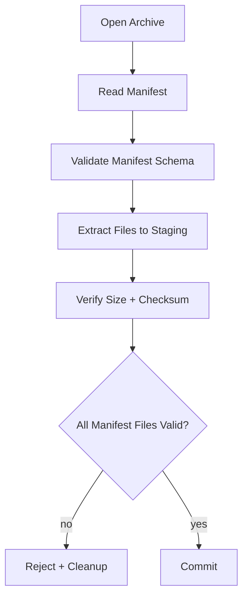

Caveat:

- TAR is sequential. If manifest is not first, you may need two passes or staged validation.
- ZIP can open manifest first if entry known.
- Require manifest entry location by convention.

---

## 23. Archive Over HTTP

Archive download:

```text
server generates archive -> response body -> client downloads
```

Design considerations:

- Can archive be generated streaming?
- Do you know `Content-Length`?
- Is `Content-Disposition` safe?
- What happens if client disconnects?
- Do you need temporary spool file?
- Do you need checksum header?
- Do you need compression?
- Are you double-compressing ZIP/TAR.GZ with HTTP gzip?

### 23.1 Streaming TAR.GZ Response

```go
func ServeTarGz(w http.ResponseWriter, r *http.Request, files []ExportFile) {
    w.Header().Set("Content-Type", "application/gzip")
    w.Header().Set("Content-Disposition", `attachment; filename="export.tar.gz"`)

    gz := gzip.NewWriter(w)
    defer gz.Close()

    tw := tar.NewWriter(gz)
    defer tw.Close()

    for _, file := range files {
        select {
        case <-r.Context().Done():
            return
        default:
        }

        hdr := &tar.Header{
            Name: file.Name,
            Mode: 0o644,
            Size: file.Size,
        }
        if err := tw.WriteHeader(hdr); err != nil {
            return
        }
        if _, err := io.Copy(tw, file.Reader); err != nil {
            return
        }
    }
}
```

In real production:

- log errors;
- avoid writing unsafe filenames;
- handle close errors;
- do not send success audit before close completes;
- account for client cancellation;
- maybe spool if you need exact content-length/checksum before response.

### 23.2 ZIP Response

ZIP can be streamed to `http.ResponseWriter`, but central directory is written at the end. Client gets a valid ZIP only if stream completes successfully.

If you need reliable retry/download:

- generate archive to temp file/object storage first;
- compute checksum;
- store metadata;
- serve static object with content-length;
- cleanup after TTL.

---

## 24. Archive Upload Pipeline

Archive upload ingestion should be staged:

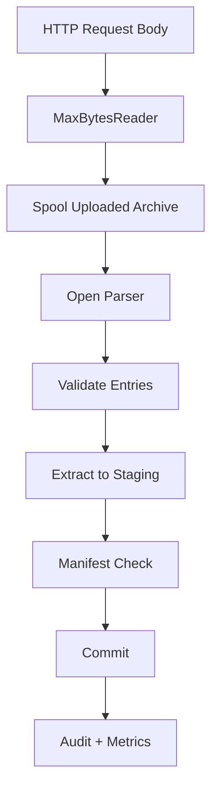

Why spool?

- ZIP needs `ReaderAt` + size.
- Retrying validation is easier.
- You can virus-scan or checksum archive.
- You avoid keeping upload in memory.
- You can enforce compressed size.

For TAR.GZ, direct streaming is possible, but staging still helps with:

- rollback;
- audit;
- retry;
- malware scan;
- asynchronous processing;
- preserving original evidence.

---

## 25. Security Policy Template

A serious archive service should define policy explicitly.

Example:

```go
type ArchivePolicy struct {
    AllowedFormats       []string // zip, tar, targz
    AllowDirectories     bool
    AllowRegularFiles    bool
    AllowSymlinks        bool
    AllowHardlinks       bool
    AllowSpecialFiles    bool
    MaxEntries           int
    MaxFileBytes         int64
    MaxTotalBytes        int64
    MaxPathBytes         int
    MaxDepth             int
    RejectHidden         bool
    RejectDuplicateNames bool
    NormalizePermissions bool
    RequireManifest      bool
    RequireChecksums     bool
}
```

Default for untrusted user upload:

```go
ArchivePolicy{
    AllowedFormats:       []string{"zip"},
    AllowDirectories:     true,
    AllowRegularFiles:    true,
    AllowSymlinks:        false,
    AllowHardlinks:       false,
    AllowSpecialFiles:    false,
    MaxEntries:           1000,
    MaxFileBytes:         100 << 20,
    MaxTotalBytes:        1 << 30,
    MaxPathBytes:         255,
    MaxDepth:             16,
    RejectHidden:         true,
    RejectDuplicateNames: true,
    NormalizePermissions: true,
    RequireManifest:      false,
    RequireChecksums:     false,
}
```

Default for internal batch transfer:

```go
ArchivePolicy{
    AllowedFormats:       []string{"targz"},
    AllowDirectories:     true,
    AllowRegularFiles:    true,
    AllowSymlinks:        false,
    AllowHardlinks:       false,
    AllowSpecialFiles:    false,
    MaxEntries:           100_000,
    MaxFileBytes:         10 << 30,
    MaxTotalBytes:        100 << 30,
    MaxPathBytes:         512,
    MaxDepth:             32,
    RejectDuplicateNames: true,
    NormalizePermissions: true,
    RequireManifest:      true,
    RequireChecksums:     true,
}
```

---

## 26. Permission Handling

Never blindly apply archive permission.

Bad:

```go
os.OpenFile(outPath, os.O_CREATE|os.O_WRONLY, os.FileMode(hdr.Mode))
```

Problems:

- archive can set executable bit;
- archive can set world-writable;
- archive can set setuid/setgid/sticky bits;
- platform semantics differ;
- umask interaction can confuse expectation.

Better:

```go
const regularFileMode = 0o600
const directoryMode = 0o700
```

or if output is meant to be shared:

```go
const regularFileMode = 0o644
const directoryMode = 0o755
```

If preserving executable bit is needed for trusted build artifacts:

```go
func normalizedMode(src os.FileMode) os.FileMode {
    mode := os.FileMode(0o644)
    if src&0o111 != 0 {
        mode = 0o755
    }
    return mode
}
```

Still strip special bits:

```go
mode := normalizedMode(src) & 0o777
```

---

## 27. Time Handling

Archive timestamps can be:

- missing;
- zero;
- local timezone weird;
- far future;
- far past;
- producer-dependent;
- precision-limited.

Policy:

- For ingestion: usually ignore timestamp or store as metadata, not filesystem mtime.
- For export: normalize if reproducibility matters.
- For regulatory/evidence use: preserve original timestamp in manifest, not blindly as filesystem mtime.

Example deterministic timestamp:

```go
var reproducibleTime = time.Unix(0, 0).UTC()
```

---

## 28. Reproducible Archives

Reproducible archive means same input produces same bytes.

Useful for:

- build artifacts;
- caching;
- checksum verification;
- deterministic deployment;
- audit evidence;
- comparing exports.

Requirements:

1. stable file order;
2. stable path format;
3. stable timestamp;
4. stable permissions;
5. stable owner/group;
6. stable compression level;
7. stable metadata;
8. no random comments;
9. no platform-specific leakage.

Example approach:

```go
sort.Strings(paths)
for _, p := range paths {
    hdr.Name = filepath.ToSlash(p)
    hdr.ModTime = reproducibleTime
    hdr.Mode = 0o644
    hdr.Uid = 0
    hdr.Gid = 0
    hdr.Uname = ""
    hdr.Gname = ""
}
```

---

## 29. Integrity: CRC, Hash, and Manifest

ZIP has CRC-32 per file. TAR has no universal built-in content checksum beyond header checksum; `.gz` has stream checksum.

But production integrity often needs stronger application-level checksum.

Recommended:

- SHA-256 per file in manifest;
- optional SHA-256 for whole archive;
- record count for structured files;
- schema version;
- content type;
- total bytes.

Example hash while extracting:

```go
func copyAndHash(dst io.Writer, src io.Reader) (int64, string, error) {
    h := sha256.New()
    mw := io.MultiWriter(dst, h)
    n, err := io.Copy(mw, src)
    if err != nil {
        return n, "", err
    }
    return n, fmt.Sprintf("%x", h.Sum(nil)), nil
}
```

For untrusted archive, checksum must come from trusted metadata or signed manifest. If the manifest is inside the same untrusted archive and not signed, checksum only detects accidental corruption or internal inconsistency, not malicious tampering.

---

## 30. Signed Manifest Pattern

For strong trust boundary:

```text
bundle.tar.gz
  manifest.json
  manifest.sig
  files/...
```

Flow:

1. extract/read manifest;
2. verify signature using trusted public key;
3. validate file list;
4. extract only listed files;
5. verify checksum;
6. commit.

This pattern is common for:

- deployment artifact;
- regulatory evidence bundle;
- inter-agency data transfer;
- offline package distribution;
- supply-chain-sensitive workflows.

This series does not deep-dive cryptographic signing here, but the key design point is:

> Integrity metadata must cross a trust boundary. A checksum from the same attacker-controlled archive is not proof of trust.

---

## 31. Error Semantics

Archive handling has layered errors:

| Layer | Example |
|---|---|
| Transport | upload interrupted |
| Compression | invalid gzip stream |
| Archive parser | malformed tar header |
| Policy | forbidden symlink |
| Filesystem | permission denied / disk full |
| Integrity | checksum mismatch |
| Commit | rename failed |
| Cleanup | failed to remove staging |

Do not collapse all into `bad archive`.

Better taxonomy:

```go
type ArchiveErrorKind string

const (
    ArchiveErrMalformed ArchiveErrorKind = "malformed"
    ArchiveErrPolicy    ArchiveErrorKind = "policy"
    ArchiveErrLimit     ArchiveErrorKind = "limit"
    ArchiveErrIO        ArchiveErrorKind = "io"
    ArchiveErrIntegrity ArchiveErrorKind = "integrity"
)

type ArchiveError struct {
    Kind  ArchiveErrorKind
    Entry string
    Err   error
}

func (e *ArchiveError) Error() string {
    if e.Entry == "" {
        return fmt.Sprintf("archive %s error: %v", e.Kind, e.Err)
    }
    return fmt.Sprintf("archive %s error at %q: %v", e.Kind, e.Entry, e.Err)
}

func (e *ArchiveError) Unwrap() error { return e.Err }
```

This helps:

- HTTP status mapping;
- metrics;
- audit trail;
- user feedback;
- alert severity.

---

## 32. Observability

Archive ingestion/export should emit metrics.

Recommended metrics:

| Metric | Meaning |
|---|---|
| `archive_extract_total` | extraction attempts by format/status |
| `archive_extract_duration_seconds` | latency |
| `archive_entries_total` | number of entries |
| `archive_extracted_bytes_total` | uncompressed bytes |
| `archive_rejected_total` | rejected by reason |
| `archive_malformed_total` | parse errors |
| `archive_limit_exceeded_total` | size/count/depth limit |
| `archive_duplicate_entry_total` | duplicate names |
| `archive_unsupported_type_total` | symlink/special/etc |
| `archive_cleanup_failure_total` | staging cleanup failed |

Logs should include:

- request/job id;
- archive format;
- compressed size;
- uncompressed bytes;
- entry count;
- rejection reason;
- sanitized entry name;
- duration;
- staging path only if safe and non-sensitive;
- checksum if appropriate.

Do not log:

- full user-provided path if it may contain secrets;
- file content;
- archive metadata blindly;
- very long filenames without truncation.

---

## 33. Testing Strategy

### 33.1 Unit Tests

Test path validation:

```go
func TestSafeArchiveNameRejectsTraversal(t *testing.T) {
    cases := []string{
        "../evil.txt",
        "a/../../evil.txt",
        "/absolute.txt",
        "C:/Windows/win.ini",
        "a//b.txt",
        "a/./b.txt",
        "",
        "\x00bad",
    }

    for _, tc := range cases {
        if _, err := SafeArchiveName(tc, PathPolicy{RejectAbsolute: true, RejectWindowsDrive: true}); err == nil {
            t.Fatalf("expected reject for %q", tc)
        }
    }
}
```

Test allowed names:

```go
func TestSafeArchiveNameAllowsNormal(t *testing.T) {
    got, err := SafeArchiveName("docs/report.pdf", PathPolicy{RejectAbsolute: true, RejectWindowsDrive: true})
    if err != nil {
        t.Fatal(err)
    }
    if got != "docs/report.pdf" {
        t.Fatalf("got %q", got)
    }
}
```

### 33.2 Golden Archive Tests

Keep small test archives for:

- normal ZIP;
- normal TAR;
- tar.gz;
- duplicate names;
- traversal path;
- absolute path;
- symlink;
- huge declared size;
- malformed archive.

### 33.3 In-Memory Archive Generation Tests

Generate archive during test:

```go
func makeTestTar(t *testing.T, entries map[string]string) []byte {
    t.Helper()

    var buf bytes.Buffer
    tw := tar.NewWriter(&buf)
    for name, content := range entries {
        b := []byte(content)
        if err := tw.WriteHeader(&tar.Header{Name: name, Mode: 0o644, Size: int64(len(b))}); err != nil {
            t.Fatal(err)
        }
        if _, err := tw.Write(b); err != nil {
            t.Fatal(err)
        }
    }
    if err := tw.Close(); err != nil {
        t.Fatal(err)
    }
    return buf.Bytes()
}
```

### 33.4 Fuzzing

Fuzz:

- path sanitizer;
- tar parser wrapper;
- zip parser wrapper;
- manifest parser;
- extraction policy checker.

Example target:

```go
func FuzzSafeArchiveName(f *testing.F) {
    seeds := []string{"a.txt", "../x", "/x", "a/b/c", "C:/x", "a\\b"}
    for _, s := range seeds {
        f.Add(s)
    }

    f.Fuzz(func(t *testing.T, name string) {
        safe, err := SafeArchiveName(name, PathPolicy{
            RejectAbsolute:     true,
            RejectWindowsDrive: true,
            RejectBackslash:    false,
        })
        if err != nil {
            return
        }
        if !fs.ValidPath(safe) {
            t.Fatalf("returned invalid path: %q", safe)
        }
    })
}
```

---

## 34. Benchmarking Archive Code

Benchmark dimensions:

- archive format;
- compression level;
- number of files;
- file size distribution;
- small files vs large files;
- storage backend;
- buffer size;
- checksum enabled/disabled;
- manifest enabled/disabled;
- fsync enabled/disabled.

Metrics:

- throughput bytes/sec;
- files/sec;
- allocations/op;
- peak RSS;
- CPU profile;
- syscall count;
- compression ratio;
- latency p50/p95/p99;
- cleanup time.

Do not benchmark only one big file. Real archive workloads often differ:

| Workload | Characteristics |
|---|---|
| One huge file | throughput bound |
| Many tiny files | metadata/syscall bound |
| Mixed files | realistic |
| Already-compressed media | compression waste |
| Text CSV/JSON | compression effective |
| Nested archive | policy/security risk |

---

## 35. Anti-Patterns

### 35.1 Blind Extract

```go
out := filepath.Join(dest, f.Name)
```

Wrong because entry name is untrusted.

### 35.2 Trusting Archive Permission

```go
os.Chmod(out, modeFromArchive)
```

Wrong unless archive source is trusted and policy says so.

### 35.3 Allowing Symlink by Default

Wrong for user upload extraction.

### 35.4 `io.ReadAll` Whole Entry Without Limit

Wrong for untrusted entries.

### 35.5 `defer Close` Inside Large Loop

Can leak descriptors until function returns.

### 35.6 Direct Extraction to Final State

Can leave partial state.

### 35.7 No Duplicate Detection

Can cause validator/extractor mismatch.

### 35.8 No Total Size Limit

Allows disk exhaustion.

### 35.9 Compressing ZIP Again by HTTP Gzip

Often wasteful and sometimes harmful.

### 35.10 Treating Checksum as Trust Without Signature

Checksum from attacker-controlled archive is not trust proof.

---

## 36. Production Design: Archive Ingestion Service

Example requirements:

- user uploads ZIP of evidence documents;
- max compressed upload 500 MB;
- max extracted total 2 GB;
- max files 5,000;
- only `.pdf`, `.jpg`, `.png`, `.txt`, `.csv`;
- reject symlink and hidden files;
- extract to staging;
- virus scan each file;
- compute SHA-256;
- store to object storage;
- persist manifest in DB;
- cleanup staging;
- audit all rejection reason.

Architecture:

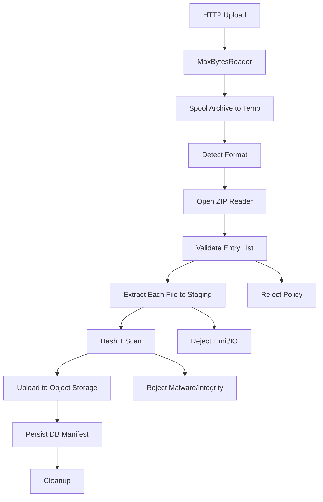

Important invariants:

1. No file path escapes staging.
2. No symlink is created.
3. No file is overwritten.
4. Total extracted bytes bounded.
5. Entry count bounded.
6. Only allowed extensions accepted.
7. Partial extraction never becomes committed state.
8. Every accepted object has checksum.
9. Every reject has reason.
10. Cleanup failure is visible.

---

## 37. Production Design: Archive Export Service

Example requirements:

- export case package as `.tar.gz`;
- include manifest;
- include documents and metadata JSON;
- deterministic ordering;
- checksum per file;
- stream output if smaller than threshold;
- spool output if checksum/content-length required;
- audit generation.

Architecture:

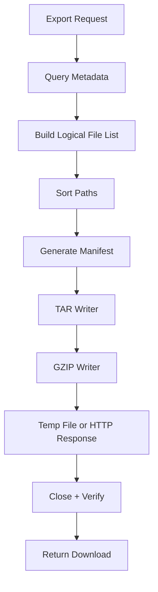

Key decisions:

- If exact `Content-Length` needed: spool first.
- If immediate streaming okay: write to response.
- If audit needs final checksum: hash using `io.MultiWriter`.
- If archive must be reproducible: normalize metadata.
- If export can be large: asynchronous job + object storage is often better than synchronous HTTP.

---

## 38. Java vs Go Perspective

As a Java engineer, familiar APIs might include:

- `java.util.zip.ZipInputStream`
- `java.util.zip.ZipFile`
- `java.util.zip.ZipOutputStream`
- Apache Commons Compress
- `java.nio.file.Path`
- `Files.walk`

Go differences:

1. Go emphasizes `io.Reader`/`io.Writer` composition.
2. TAR is naturally stream-oriented with `tar.Reader`.
3. ZIP reader in Go standard package uses `ReaderAt` + size, similar in spirit to random-access archive reading.
4. Error handling is explicit at every boundary.
5. Close/flush errors matter and must be checked.
6. Path sanitization must be explicitly designed.
7. There is no checked exception forcing you to classify IO errors; you must build that taxonomy yourself.

Mapping:

| Java | Go |
|---|---|
| `InputStream` | `io.Reader` |
| `OutputStream` | `io.Writer` |
| `ZipInputStream` | partly `archive/zip`, but Go ZIP is more random-access oriented |
| `TarArchiveInputStream` from Commons Compress | `archive/tar.Reader` |
| `Files.walk` | `filepath.WalkDir` / `fs.WalkDir` |
| `Path.normalize` | `path.Clean` / `filepath.Clean`, but security requires more |
| try-with-resources | explicit `Close`/defer with error capture |

The most important mindset shift:

> Go archive code is simple to compose, but correctness is not automatic. The policy layer is your responsibility.

---

## 39. Checklist: Safe Archive Extraction

Before extracting untrusted archive, answer:

- [ ] What formats are allowed?
- [ ] What entry types are allowed?
- [ ] Are symlinks/hardlinks rejected?
- [ ] Are special files rejected?
- [ ] Are paths validated as logical archive paths?
- [ ] Are absolute paths rejected?
- [ ] Are `..` paths rejected?
- [ ] Are Windows drive/UNC paths rejected?
- [ ] Is final path verified inside destination root?
- [ ] Is destination a private staging directory?
- [ ] Are duplicate names rejected?
- [ ] Are max entry count and total bytes enforced?
- [ ] Are actual copied bytes limited?
- [ ] Are permissions normalized?
- [ ] Are timestamps normalized/ignored?
- [ ] Is partial output cleaned up on failure?
- [ ] Are close errors checked?
- [ ] Is commit atomic enough for the use case?
- [ ] Is cleanup failure logged/alerted?
- [ ] Are metrics emitted?
- [ ] Are malformed archive tests present?

---

## 40. Checklist: Safe Archive Creation

Before creating archive:

- [ ] Are source files selected explicitly?
- [ ] Are symlinks rejected or handled intentionally?
- [ ] Are special files rejected?
- [ ] Are archive paths slash-separated and relative?
- [ ] Is file order deterministic if needed?
- [ ] Are permissions normalized?
- [ ] Are owner/group fields cleared if not needed?
- [ ] Are timestamps normalized if reproducible output matters?
- [ ] Is manifest included for structured transfer?
- [ ] Are checksums computed?
- [ ] Are writer close errors handled?
- [ ] Is compression level chosen intentionally?
- [ ] Is archive size bounded?
- [ ] Is output written durably if stored on disk?

---

## 41. Practical Lab

Build a package:

```text
internal/archivebundle/
  policy.go
  path.go
  extract_tar.go
  extract_zip.go
  create_tar.go
  create_zip.go
  manifest.go
  errors.go
  metrics.go
  path_test.go
  extract_test.go
  fuzz_path_test.go
```

Features:

1. `SafeArchiveName(name string) (string, error)`.
2. `ExtractZip(path string, dest string, policy Policy) (*Report, error)`.
3. `ExtractTarGz(r io.Reader, dest string, policy Policy) (*Report, error)`.
4. Reject symlinks.
5. Reject duplicate names.
6. Limit total bytes.
7. Limit file count.
8. Generate extraction report.
9. Compute SHA-256 per extracted file.
10. Extract into staging then commit.

Report example:

```go
type Report struct {
    Format       string
    Entries      int
    Files        int
    Directories  int
    Bytes        int64
    SHA256ByPath map[string]string
    Duration     time.Duration
}
```

---

## 42. Key Takeaways

1. Archive is not “just a compressed folder”; it is a serialized filesystem-like object.
2. TAR is stream-friendly; ZIP is central-directory/random-access-friendly.
3. Safe extraction requires policy, not just API calls.
4. Entry names are untrusted input.
5. `filepath.Join(dest, entryName)` is not enough.
6. Reject symlink/hardlink/special files by default.
7. Normalize permission and metadata.
8. Limit compressed input, file count, per-file bytes, total bytes, path length, and depth.
9. Use staging for extraction to avoid partial final state.
10. Check close errors for archive writers.
11. Avoid `defer Close` inside huge loops.
12. Use manifest/checksum for production data transfer.
13. For strong trust, sign the manifest or archive externally.
14. Observability is required for archive ingestion/export because failures are multi-layered.
15. Archive handling is a security-sensitive IO workflow.

---

## 43. Preview Part 021

Part berikutnya akan membahas:

# Part 021 — Data Pipeline Composition: Reader → Transformer → Writer, Fan-in/out Boundaries, Cancellation

Kita akan masuk ke cara membangun pipeline data yang reusable:

- source/transform/sink model;
- `io.Reader` and `io.Writer` as pipeline stages;
- streaming transform;
- cancellation;
- backpressure;
- `io.Pipe`;
- checksum/compression/encryption-style composition;
- fan-in/fan-out boundary;
- worker pool untuk IO;
- error propagation;
- partial output cleanup;
- production pipeline design.

---

## References

- Go `archive/tar` package documentation.
- Go `archive/zip` package documentation.
- Go `io/fs` package documentation.
- Go release history for Go 1.26.x security/bug fix context.
- Go 1.24 release notes for archive writer `AddFS` behavior update.

<!-- NAVIGATION_FOOTER -->
<div class="page-nav">
<a href="./learn-go-io-buffer-byte-stream-file-network-data-transfer-part-019.md">⬅️ Part 019 — Compression: gzip, zlib, flate, lzw, Streaming Compression, Ratio vs Latency</a>
<a href="./index.md">📚 Kategori</a>
<a href="../../index.md">🏠 Home</a>
<a href="./learn-go-io-buffer-byte-stream-file-network-data-transfer-part-021.md">Part 021 — Data Pipeline Composition: Reader → Transformer → Writer, Fan-in/Fan-out Boundaries, Cancellation ➡️</a>
</div>
