# learn-go-io-buffer-byte-stream-file-network-data-transfer-part-021.md

# Part 021 — Data Pipeline Composition: Reader → Transformer → Writer, Fan-in/Fan-out Boundaries, Cancellation

> Seri: **Go IO, Buffer, Byte & Stream, Serialization, Console IO, File & FileSystem, Compression, Networking, Data Transfer**  
> Target: **Go 1.26.x**  
> Perspektif: **Java software engineer menuju top 1% Go engineer**  
> Status: **Part 021 dari 034**  
> Fokus: bagaimana menyusun sistem IO dari komponen kecil menjadi pipeline produksi yang benar, bounded, observable, cancelable, dan tahan failure.

---

## 0. Kenapa Part Ini Penting?

Sampai part sebelumnya, kita sudah membahas banyak primitive:

- `io.Reader`, `io.Writer`, `io.Closer`, `io.Seeker`, `io.ReaderAt`, `io.WriterAt`
- `io.Copy`, `io.CopyBuffer`, `io.Pipe`, `io.TeeReader`, `io.MultiReader`, `io.MultiWriter`
- `bytes.Buffer`, `bytes.Reader`, `strings.Reader`
- `bufio.Reader`, `bufio.Writer`, `bufio.Scanner`
- text IO, console IO, file IO, filesystem abstraction
- large file processing, durable write, binary encoding, serialization, JSON, protocol framing, compression, archive formats

Part ini menggabungkan semua itu menjadi satu mental model:

> **Data pipeline adalah rangkaian stage yang memindahkan byte/record dari source ke sink sambil melakukan transformasi, validasi, observasi, pembatasan, dan propagasi failure.**

Dalam Java, Anda mungkin terbiasa dengan istilah:

- `InputStream` → `OutputStream`
- `Reader` → `Writer`
- `FilterInputStream`, `BufferedInputStream`, `GZIPInputStream`
- `java.nio.channels.Channel`
- `CompletableFuture`, executor pipeline, reactive streams, `Flow.Publisher`
- Spring batch processing
- Kafka Streams style transform

Di Go, mental model-nya lebih sederhana tetapi lebih eksplisit:

```go
source := io.Reader
sink   := io.Writer
_, err := io.Copy(sink, source)
```

Namun sistem produksi jarang hanya `Copy`. Biasanya ada:

- limit ukuran input
- checksum
- compression/decompression
- encryption/decryption
- parsing record
- validation
- filtering
- enrichment
- batching
- writing ke temp file
- atomic commit
- metrics
- context cancellation
- deadline
- retry boundary
- cleanup
- backpressure
- concurrent fan-out/fan-in

Part ini menjawab pertanyaan besar:

> Bagaimana menyusun semua stage itu tanpa memory spike, goroutine leak, data corruption, lost error, deadlock, descriptor leak, atau semantic ambiguity?

---

## 1. Learning Objectives

Setelah part ini, Anda harus mampu:

1. Mendesain pipeline IO berbasis `io.Reader` dan `io.Writer`.
2. Memilih antara sequential composition, streaming composition, buffered composition, dan concurrent composition.
3. Membedakan **data plane** dan **control plane** dalam pipeline.
4. Menangani cancellation, close ordering, flush ordering, dan error propagation.
5. Mendesain transform stage yang tidak diam-diam membaca seluruh input.
6. Menggunakan `io.Pipe` dengan benar tanpa deadlock dan goroutine leak.
7. Mendesain fan-out/fan-in dengan bounded memory dan backpressure.
8. Membuat pipeline yang observable: byte count, record count, latency, throughput, failure reason.
9. Menguji pipeline dengan fake reader/writer, fault injection, dan cancellation test.
10. Membuat checklist production-grade untuk pipeline file/network/data transfer.

---

## 2. Mental Model: Pipeline Adalah Kontrak, Bukan Sekadar Rangkaian Function

Pipeline sering keliru dipahami sebagai:

```text
input → transform → output
```

Itu benar, tetapi terlalu dangkal.

Untuk production system, setiap edge dalam pipeline membawa dua hal:

1. **Data**: bytes, records, frames, chunks.
2. **Control**: error, EOF, cancellation, close, flush, deadline, backpressure.

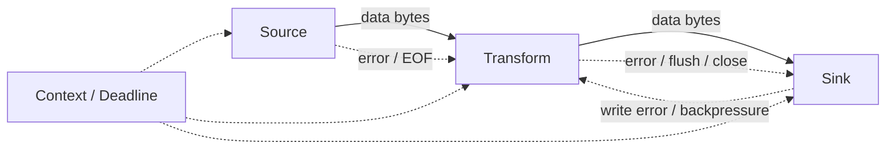

Pipeline yang buruk hanya memikirkan data. Pipeline yang baik memikirkan data dan control signal secara bersamaan.

---

## 3. Data Plane vs Control Plane

### 3.1 Data Plane

Data plane menjawab:

- data berasal dari mana?
- data dibaca dalam unit apa?
- apakah unit-nya byte, line, frame, JSON object, CSV row, file entry, atau domain record?
- apakah data boleh di-buffer?
- apakah data harus preserve order?
- apakah data replayable?
- apakah data seekable?
- apakah data bounded?

Contoh data plane:

```text
HTTP request body
  → gzip decompressor
  → tar reader
  → per-entry validator
  → filesystem writer
```

### 3.2 Control Plane

Control plane menjawab:

- kapan pipeline berhenti?
- siapa yang bisa membatalkan?
- error mana yang menjadi root cause?
- apakah partial output harus dihapus?
- apakah sink perlu `Flush()`?
- apakah file perlu `Sync()`?
- apakah close error harus checked?
- bagaimana timeout diterapkan?
- bagaimana backpressure terjadi?

Contoh control plane:

```text
context canceled
  → stop reading request body
  → close pipe writer with error
  → close temp file
  → remove temp dir
  → return 499/client canceled or internal cancellation status
```

### 3.3 Pipeline Production-Grade = Data Plane + Control Plane

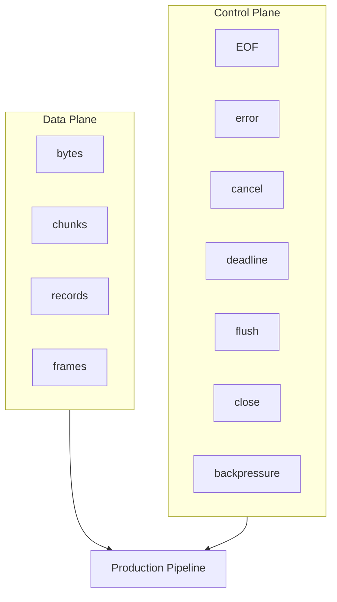

---

## 4. Sequential Composition: Bentuk Paling Aman

Sequential pipeline berarti satu goroutine memindahkan data dari source ke sink melalui wrapper stage.

Contoh:

```go
func CopyLimited(dst io.Writer, src io.Reader, maxBytes int64) (int64, error) {
    limited := io.LimitReader(src, maxBytes)
    return io.Copy(dst, limited)
}
```

Ini sederhana, aman, dan mudah diuji.

### 4.1 Contoh: hash while copy

```go
package pipeline

import (
    "crypto/sha256"
    "hash"
    "io"
)

type CopyHashResult struct {
    Bytes  int64
    SHA256 [32]byte
}

func CopyAndHash(dst io.Writer, src io.Reader) (CopyHashResult, error) {
    h := sha256.New()

    // MultiWriter menulis setiap byte ke dst dan hash.
    // Jika dst gagal, operasi berhenti.
    w := io.MultiWriter(dst, h)

    n, err := io.Copy(w, src)
    if err != nil {
        return CopyHashResult{Bytes: n}, err
    }

    var sum [32]byte
    copy(sum[:], h.Sum(nil))

    return CopyHashResult{
        Bytes:  n,
        SHA256: sum,
    }, nil
}

var _ hash.Hash = sha256.New()
```

Mental model:

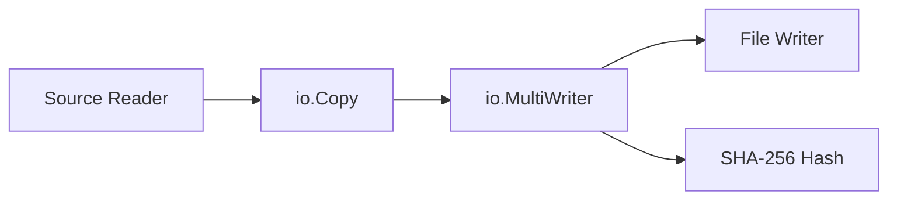

Kelebihan:

- tidak perlu goroutine
- tidak perlu channel
- backpressure natural dari `Write`
- error mudah dipahami
- memory bounded oleh buffer `io.Copy`

Kekurangan:

- satu sink lambat memperlambat semua sink
- cocok untuk transform linear, bukan parallel processing kompleks

---

## 5. Wrapper Stage: Cara Go Membuat Transformasi Tanpa Framework

Di Go, stage sering diwujudkan sebagai wrapper `io.Reader` atau `io.Writer`.

Contoh wrapper reader:

```go
r := gzip.NewReader(src)
```

`r` tetap `io.Reader`, tetapi byte yang keluar sudah decompressed.

Contoh wrapper writer:

```go
gz := gzip.NewWriter(dst)
```

`gz` tetap `io.Writer`, tetapi byte yang ditulis ke `gz` akan dikompresi sebelum masuk ke `dst`.

### 5.1 Reader-side transform

```text
underlying source → transform reader → caller reads transformed data
```

Contoh:

```go
gz, err := gzip.NewReader(src)
if err != nil {
    return err
}
defer gz.Close()

_, err = io.Copy(dst, gz)
```

### 5.2 Writer-side transform

```text
caller writes raw data → transform writer → underlying sink receives transformed data
```

Contoh:

```go
gz := gzip.NewWriter(dst)
_, copyErr := io.Copy(gz, src)
closeErr := gz.Close()

if copyErr != nil {
    return copyErr
}
return closeErr
```

`Close()` pada writer transform sering wajib karena final block/trailer mungkin baru ditulis saat close.

### 5.3 Transform chain

```go
func CompressCopy(dst io.Writer, src io.Reader) error {
    gz := gzip.NewWriter(dst)
    _, copyErr := io.Copy(gz, src)
    closeErr := gz.Close()

    if copyErr != nil {
        return copyErr
    }
    return closeErr
}
```

Diagram:

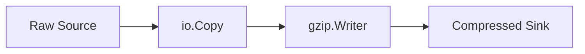

---

## 6. Rule of Thumb: Prefer Linear Composition Before Concurrency

Banyak engineer terlalu cepat memakai goroutine/channel untuk pipeline. Di IO, itu sering membuat sistem lebih rapuh.

Gunakan linear composition kalau:

- stage hanya transform stream secara berurutan
- order harus dipertahankan
- satu error cukup menghentikan semua
- throughput bottleneck ada di disk/network, bukan CPU
- memory harus bounded sederhana
- debugging harus mudah

Gunakan concurrent composition kalau:

- stage CPU-bound dan bisa diparalelkan per record/chunk
- sink/source independen
- fan-out memang diperlukan
- Anda punya bounded queue dan cancellation yang jelas
- Anda siap menangani ordering dan error aggregation

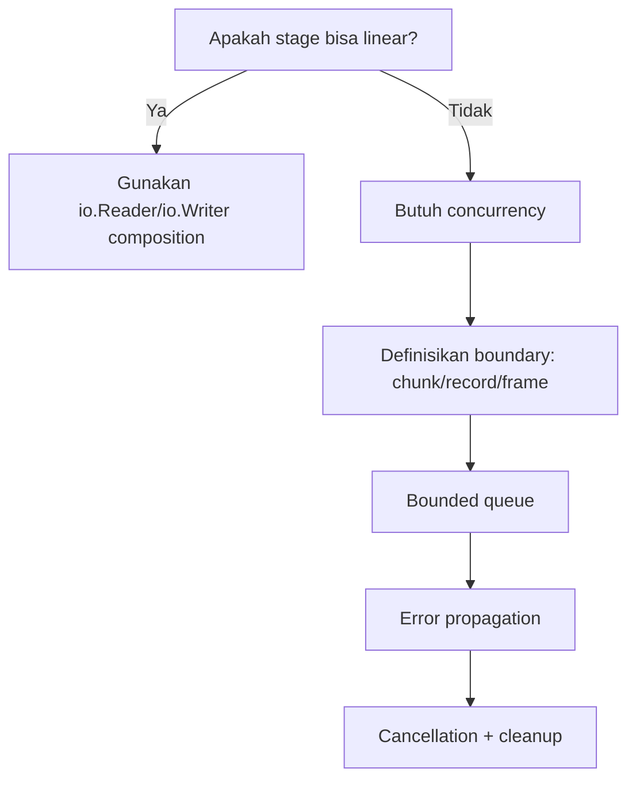

---

## 7. Backpressure: Mekanisme Alami IO

Backpressure berarti producer diperlambat oleh consumer.

Dalam Go IO linear:

```go
_, err := io.Copy(dst, src)
```

`src.Read` hanya dipanggil setelah data sebelumnya berhasil ditulis ke `dst`.

Jika `dst.Write` lambat, `io.Copy` lambat. Producer tidak terus menghasilkan data tanpa batas.

Ini adalah bentuk backpressure paling sederhana.

### 7.1 Backpressure rusak saat queue unbounded

Anti-pattern:

```go
records := make(chan Record, 1_000_000) // terlalu besar; bisa menjadi memory bomb
```

Atau lebih buruk:

```go
var all []Record
for dec.Decode(&r) == nil {
    all = append(all, r)
}
```

Jika source lebih cepat dari sink, memory naik.

### 7.2 Bounded queue

Kalau butuh concurrency, gunakan buffer kecil dan bounded.

```go
records := make(chan Record, 128)
```

Artinya:

- producer hanya boleh unggul 128 record dari consumer
- kalau consumer lambat, producer akan block
- memory upper bound lebih mudah dihitung

### 7.3 Hitung memory budget pipeline

Misal:

```text
channel capacity = 128 records
average record   = 64 KiB
worker count     = 8
per-worker buf   = 256 KiB
```

Estimasi minimum:

```text
queue memory  = 128 × 64 KiB = 8 MiB
worker memory = 8 × 256 KiB  = 2 MiB
base          ≈ 10 MiB + object overhead + output buffers
```

Production engineer harus bisa menghitung ini sebelum deploy.

---

## 8. Cancellation: Context Tidak Otomatis Membatalkan Semua IO

`context.Context` adalah sinyal. Ia tidak secara ajaib menghentikan `Read` yang sedang block pada semua tipe reader.

Contoh:

```go
select {
case <-ctx.Done():
    return ctx.Err()
default:
}

n, err := r.Read(buf)
```

Kalau `r.Read` block, goroutine tetap bisa block sampai `Read` kembali.

### 8.1 Cara umum membuat IO cancelable

Tergantung sumber IO:

| Source/Sink | Cara cancellation umum |
|---|---|
| HTTP request body | request context canceled oleh server/client disconnect |
| `net.Conn` | set deadline atau close connection |
| file biasa | local file read biasanya cepat; context dicek antar chunk |
| pipe | close pipe dengan error |
| custom reader | implement context-aware read loop |
| channel-backed stage | select pada `ctx.Done()` |

### 8.2 Context-aware copy loop

```go
func CopyContext(ctx context.Context, dst io.Writer, src io.Reader, buf []byte) (int64, error) {
    if len(buf) == 0 {
        buf = make([]byte, 32*1024)
    }

    var written int64

    for {
        select {
        case <-ctx.Done():
            return written, ctx.Err()
        default:
        }

        nr, er := src.Read(buf)
        if nr > 0 {
            nw, ew := dst.Write(buf[:nr])
            if nw > 0 {
                written += int64(nw)
            }
            if ew != nil {
                return written, ew
            }
            if nw != nr {
                return written, io.ErrShortWrite
            }
        }

        if er != nil {
            if er == io.EOF {
                return written, nil
            }
            return written, er
        }
    }
}
```

Catatan penting:

- context dicek antar operasi, bukan saat operasi blocking sedang berlangsung
- untuk `net.Conn`, pakai deadline agar blocking read/write punya batas
- untuk `io.Pipe`, close pipe untuk melepas goroutine yang block

---

## 9. `io.Pipe`: Bridge Antara Writer Stage dan Reader Stage

`io.Pipe` membuat pasangan:

- `*io.PipeReader`
- `*io.PipeWriter`

Data yang ditulis ke writer bisa dibaca dari reader.

Ini berguna ketika API A menghasilkan data dengan `io.Writer`, tetapi API B membutuhkan `io.Reader`.

Contoh klasik:

```text
producer writes tar.gz to io.Writer
HTTP client needs io.Reader as request body
```

### 9.1 Mental model `io.Pipe`

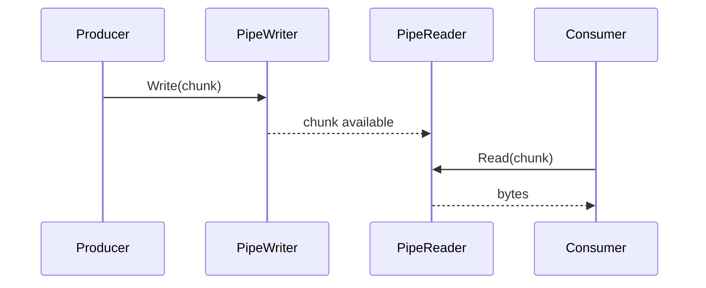

`io.Pipe` bukan buffer besar. Ia melakukan rendezvous antara writer dan reader. Ini bagus untuk backpressure, tetapi bisa deadlock kalau salah close/error handling.

### 9.2 Contoh benar: gzip producer ke consumer reader

```go
func GzipStream(ctx context.Context, src io.Reader) (io.Reader, <-chan error) {
    pr, pw := io.Pipe()
    errc := make(chan error, 1)

    go func() {
        defer close(errc)

        gz := gzip.NewWriter(pw)
        _, copyErr := CopyContext(ctx, gz, src, nil)
        closeErr := gz.Close()

        if copyErr != nil {
            _ = pw.CloseWithError(copyErr)
            errc <- copyErr
            return
        }
        if closeErr != nil {
            _ = pw.CloseWithError(closeErr)
            errc <- closeErr
            return
        }

        err := pw.Close()
        if err != nil {
            errc <- err
            return
        }
    }()

    return pr, errc
}
```

Tapi ada issue: kalau consumer berhenti membaca lebih awal, producer bisa block di `Write`. Karena itu consumer harus close reader, atau pipeline harus punya cancellation.

### 9.3 Contoh pemakaian

```go
r, errc := GzipStream(ctx, src)
_, copyErr := io.Copy(dst, r)
closeErr := r.(io.Closer).Close()
producerErr := <-errc

if copyErr != nil {
    return copyErr
}
if closeErr != nil {
    return closeErr
}
return producerErr
```

Dalam practice, API perlu dirapikan agar ownership jelas.

### 9.4 Golden rule `io.Pipe`

1. Selalu ada goroutine producer dan consumer yang aktif.
2. Selalu close `PipeWriter`.
3. Pakai `CloseWithError` untuk propagasi error producer ke reader.
4. Consumer harus close/cancel kalau berhenti lebih awal.
5. Jangan menulis ke pipe tanpa pembaca.
6. Jangan membaca dari pipe tanpa writer yang akan close.
7. Jangan hilangkan error goroutine producer.

---

## 10. Designing a Pipeline Stage

Sebuah stage yang baik harus menjawab pertanyaan berikut:

| Pertanyaan | Contoh jawaban |
|---|---|
| Input type? | `io.Reader`, `io.ReadCloser`, channel record, file path |
| Output type? | `io.Writer`, `io.Reader`, file path, record stream |
| Unit proses? | byte chunk, line, frame, JSON object, archive entry |
| Bounded? | max bytes, max record, max nesting, max entry size |
| Ownership? | siapa close input/output? |
| Error contract? | partial output dihapus atau dikembalikan? |
| Cancellation? | context check, deadline, close pipe |
| Backpressure? | natural `Write` block atau bounded channel |
| Observability? | byte count, record count, duration, error class |

### 10.1 Template stage sink-style

```go
type TransformOptions struct {
    MaxBytes int64
}

func Transform(ctx context.Context, dst io.Writer, src io.Reader, opt TransformOptions) (int64, error) {
    if opt.MaxBytes <= 0 {
        return 0, fmt.Errorf("MaxBytes must be positive")
    }

    limited := io.LimitReader(src, opt.MaxBytes+1)

    n, err := CopyContext(ctx, dst, limited, make([]byte, 64*1024))
    if err != nil {
        return n, err
    }
    if n > opt.MaxBytes {
        return n, fmt.Errorf("input too large: limit=%d", opt.MaxBytes)
    }

    return n, nil
}
```

### 10.2 Template stage reader-style

```go
type countingReader struct {
    r io.Reader
    n int64
}

func (c *countingReader) Read(p []byte) (int, error) {
    n, err := c.r.Read(p)
    c.n += int64(n)
    return n, err
}

func CountingReader(r io.Reader) (*countingReader, io.Reader) {
    cr := &countingReader{r: r}
    return cr, cr
}
```

Reader-style transform cocok jika caller ingin compose sendiri:

```go
counter, r := CountingReader(src)
_, err := io.Copy(dst, r)
fmt.Println(counter.n, err)
```

### 10.3 Template writer-style

```go
type countingWriter struct {
    w io.Writer
    n int64
}

func (c *countingWriter) Write(p []byte) (int, error) {
    n, err := c.w.Write(p)
    c.n += int64(n)
    return n, err
}
```

Writer-style transform cocok untuk sink instrumentation.

---

## 11. Ownership: Siapa yang Boleh Close?

Salah satu bug pipeline paling sering adalah close ownership tidak jelas.

### 11.1 Rule umum

> Function yang menerima `io.Reader` atau `io.Writer` biasanya tidak menutupnya, kecuali contract eksplisit mengatakan demikian.

Contoh baik:

```go
func Process(dst io.Writer, src io.Reader) error {
    _, err := io.Copy(dst, src)
    return err
}
```

Function ini tidak close `src` atau `dst`.

Kalau butuh close ownership, gunakan tipe eksplisit:

```go
func ProcessAndClose(dst io.WriteCloser, src io.ReadCloser) error {
    defer src.Close()
    defer dst.Close()
    _, err := io.Copy(dst, src)
    return err
}
```

Tetapi production-grade harus handle close error:

```go
func ProcessAndClose(dst io.WriteCloser, src io.ReadCloser) error {
    var err error

    _, err = io.Copy(dst, src)

    if closeSrcErr := src.Close(); err == nil && closeSrcErr != nil {
        err = closeSrcErr
    }
    if closeDstErr := dst.Close(); err == nil && closeDstErr != nil {
        err = closeDstErr
    }

    return err
}
```

### 11.2 Transform writer close ordering

Misal:

```text
src → gzip.Writer → bufio.Writer → file
```

Close/flush order:

1. finish writing to gzip
2. close gzip writer agar trailer ditulis
3. flush buffered writer
4. sync file jika durability dibutuhkan
5. close file

Salah order bisa membuat file tampak ada tetapi corrupt.

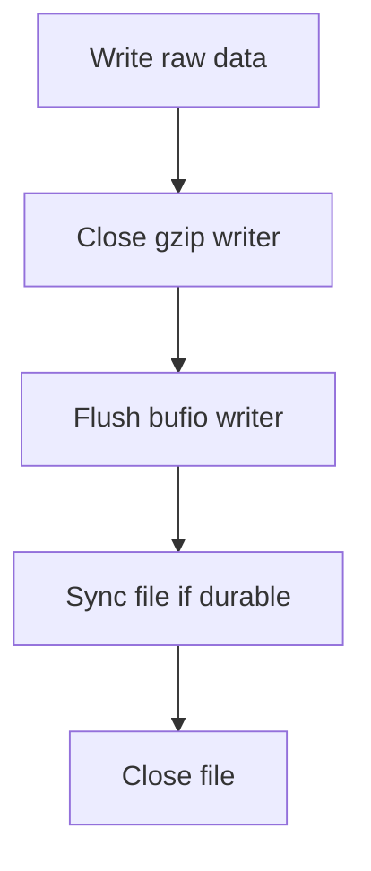

---

## 12. Error Propagation: Jangan Hilangkan Error Stage Belakang

Pipeline linear:

```go
_, err := io.Copy(dst, src)
```

Error berasal dari `Read` atau `Write`.

Tetapi pipeline dengan transform writer punya error tambahan di `Close()`.

```go
gz := gzip.NewWriter(dst)
_, copyErr := io.Copy(gz, src)
closeErr := gz.Close()

if copyErr != nil {
    return copyErr
}
return closeErr
```

Kenapa close error penting?

- gzip trailer gagal ditulis
- buffered bytes gagal flush
- checksum final gagal
- underlying writer gagal setelah copy loop selesai

### 12.1 Error precedence

Biasanya:

1. return data path error lebih dulu
2. jika tidak ada, return flush/close error
3. log suppressed errors jika penting

Contoh helper:

```go
func firstErr(errs ...error) error {
    for _, err := range errs {
        if err != nil {
            return err
        }
    }
    return nil
}
```

Go 1.20+ punya `errors.Join`, tetapi untuk API public, hati-hati karena caller mungkin lebih sulit mengklasifikasikan error gabungan.

```go
return errors.Join(copyErr, closeErr)
```

Gunakan `errors.Join` saat Anda memang ingin menyimpan semua error, bukan hanya root cause utama.

---

## 13. Boundedness: Semua Pipeline Harus Punya Batas

Batas dapat berupa:

- max input bytes
- max output bytes
- max records
- max record size
- max line size
- max frame size
- max archive entries
- max compression ratio
- max processing time
- max concurrency
- max temporary disk usage

### 13.1 Limit input

```go
limited := io.LimitReader(src, maxBytes+1)
n, err := io.Copy(dst, limited)
if err != nil {
    return err
}
if n > maxBytes {
    return ErrTooLarge
}
```

### 13.2 Limit decompressed output

Jangan hanya limit compressed input.

```text
compressed input 10 MiB
  → decompressed output 10 GiB
```

Pattern:

```go
gz, err := gzip.NewReader(src)
if err != nil {
    return err
}
defer gz.Close()

limited := io.LimitReader(gz, maxDecompressed+1)
n, err := io.Copy(dst, limited)
if err != nil {
    return err
}
if n > maxDecompressed {
    return ErrDecompressedTooLarge
}
```

### 13.3 Limit record size

Line-based pipeline:

```go
scanner := bufio.NewScanner(r)
scanner.Buffer(make([]byte, 64*1024), 4*1024*1024)
```

Tetapi scanner cocok untuk token yang wajar. Untuk line protocol production dengan policy custom, sering lebih baik membuat bounded line reader sendiri.

---

## 14. Record Pipeline vs Byte Pipeline

Tidak semua pipeline harus byte-stream terus.

Ada dua model:

1. **Byte pipeline**: transform raw byte stream.
2. **Record pipeline**: parse byte menjadi record, proses record, encode lagi.

### 14.1 Byte pipeline

Contoh:

```text
file → gzip → checksum → network
```

Kelebihan:

- cepat
- memory kecil
- tidak peduli schema
- cocok untuk transfer

Kekurangan:

- sulit melakukan validation domain
- error context terbatas

### 14.2 Record pipeline

Contoh:

```text
JSONL file → decode per line → validate → enrich → encode CSV
```

Kelebihan:

- domain-aware
- bisa reject record tertentu
- bisa count/filter/enrich

Kekurangan:

- parser complexity
- object allocation
- ordering/fan-out lebih sulit

### 14.3 Hybrid pipeline

Contoh archive import:

```text
HTTP body bytes
  → limit compressed bytes
  → gzip decompression
  → limit decompressed bytes
  → tar entries
  → per entry byte pipeline or record pipeline
```

---

## 15. Fan-out: Satu Source ke Banyak Sink

Fan-out berarti satu data stream digunakan oleh beberapa consumer.

### 15.1 Synchronous fan-out dengan `io.MultiWriter`

```go
h := sha256.New()
logFile := auditWriter
mainFile := dst

w := io.MultiWriter(mainFile, h, logFile)
_, err := io.Copy(w, src)
```

Kelebihan:

- simple
- order sama
- error langsung
- backpressure natural

Kekurangan:

- semua sink harus sukses
- satu sink lambat memperlambat semua
- tidak cocok jika sink sekunder best-effort

### 15.2 Tee side-channel dengan `io.TeeReader`

```go
h := sha256.New()
r := io.TeeReader(src, h)
_, err := io.Copy(dst, r)
```

Setiap `Read` dari `r` akan menulis bytes ke hash.

Kelebihan:

- cocok untuk checksum saat membaca
- tidak mengubah sink utama

Kekurangan:

- side write error muncul sebagai read error
- sink side-channel tetap bagian critical path

### 15.3 Asynchronous fan-out

Misal data utama harus ditulis ke file, sedangkan audit best-effort bisa async.

Hati-hati: async fan-out bisa menghilangkan backpressure dan error.

Pattern aman:

- queue bounded
- drop policy eksplisit atau fail policy eksplisit
- metrics untuk dropped events
- cancellation
- close/drain saat shutdown

```go
type AuditEvent struct {
    Offset int64
    Size   int
}

auditCh := make(chan AuditEvent, 1024)
```

Jangan membuat `auditCh` unbounded.

---

## 16. Fan-in: Banyak Source ke Satu Sink

Fan-in berarti beberapa producer mengirim data ke satu sink.

Risiko utama:

- interleaving output corrupt
- ordering hilang
- satu writer tidak thread-safe secara semantic
- error dari salah satu producer terlambat diketahui
- close ordering rumit

### 16.1 Sequential fan-in dengan `io.MultiReader`

```go
r := io.MultiReader(header, body, footer)
_, err := io.Copy(dst, r)
```

Ini aman karena source dibaca satu per satu.

### 16.2 Concurrent fan-in harus punya framing

Kalau banyak worker menulis ke satu `io.Writer` secara concurrent, output bisa bercampur jika writer tidak memberi atomicity per record.

Buruk:

```go
for _, item := range items {
    go func(item Item) {
        fmt.Fprintf(w, "%s\n", item.Value)
    }(item)
}
```

Lebih baik:

- worker menghasilkan record ke channel
- satu goroutine writer menulis record secara berurutan

```go
records := make(chan []byte, 128)

// single writer goroutine owns w
writerErr := make(chan error, 1)
go func() {
    defer close(writerErr)
    for rec := range records {
        if _, err := w.Write(rec); err != nil {
            writerErr <- err
            return
        }
        if _, err := w.Write([]byte("\n")); err != nil {
            writerErr <- err
            return
        }
    }
}()
```

### 16.3 Preserve order or not?

Fan-in design must explicitly choose:

| Requirement | Design |
|---|---|
| preserve source order | sequence number + reorder buffer |
| preserve per-partition order | partitioned writer |
| no order requirement | direct work completion output |
| output must be append-only valid | single writer owns sink |

---

## 17. Worker Pipeline for Records

Untuk record-level CPU work, model umum:

```text
Reader/Decoder → jobs channel → workers → results channel → Writer/Encoder
```

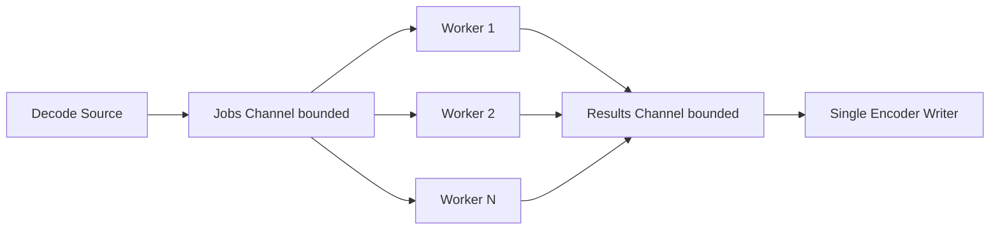

### 17.1 Why single encoder writer?

Karena output stream biasanya harus valid:

- JSON array harus punya commas yang benar
- CSV writer punya buffer dan error state
- gzip writer harus close sekali
- tar writer harus menulis header+body berurutan
- file append harus maintain order atau framing

Maka writer ownership sering lebih aman di satu goroutine.

### 17.2 Minimal record pipeline

```go
type Job struct {
    Index int
    Data  []byte
}

type Result struct {
    Index int
    Data  []byte
}
```

Kalau order tidak penting:

```go
func RunUnorderedRecordPipeline(
    ctx context.Context,
    jobs <-chan Job,
    results chan<- Result,
    workerCount int,
    fn func(context.Context, Job) (Result, error),
) error {
    g, ctx := errgroup.WithContext(ctx)

    for i := 0; i < workerCount; i++ {
        g.Go(func() error {
            for {
                select {
                case <-ctx.Done():
                    return ctx.Err()
                case job, ok := <-jobs:
                    if !ok {
                        return nil
                    }
                    res, err := fn(ctx, job)
                    if err != nil {
                        return err
                    }
                    select {
                    case <-ctx.Done():
                        return ctx.Err()
                    case results <- res:
                    }
                }
            }
        })
    }

    return g.Wait()
}
```

But note: this function does not close `results`; the owner should decide lifecycle.

---

## 18. Error Boundaries in Concurrent Pipelines

Concurrent pipeline harus menjawab:

1. Jika decoder error, apakah workers berhenti?
2. Jika worker error, apakah decoder berhenti?
3. Jika writer error, apakah decoder dan workers berhenti?
4. Siapa close jobs channel?
5. Siapa close results channel?
6. Bagaimana menghindari send ke closed channel?
7. Bagaimana root cause error dipilih?

### 18.1 Common ownership model

```text
producer owns jobs close
workers own results production
coordinator closes results after workers done
writer reads results until closed
errgroup coordinates cancellation
```

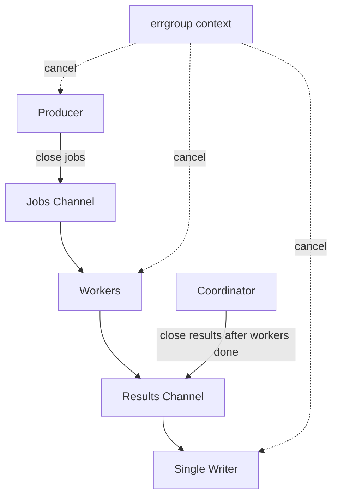

### 18.2 Avoid send to closed channel

Rule:

> Only sender owner closes channel. Never close a channel from receiver side unless receiver is also sole sender owner.

For results channel with multiple workers, workers should not individually close it.

---

## 19. Pipeline With `errgroup`

`golang.org/x/sync/errgroup` is useful because it combines:

- goroutine lifecycle
- first error propagation
- context cancellation

Example structure:

```go
func RunPipeline(ctx context.Context, src io.Reader, dst io.Writer) error {
    g, ctx := errgroup.WithContext(ctx)

    jobs := make(chan Job, 128)
    results := make(chan Result, 128)

    g.Go(func() error {
        defer close(jobs)
        return decodeJobs(ctx, src, jobs)
    })

    workerCount := 8
    for i := 0; i < workerCount; i++ {
        g.Go(func() error {
            return workerLoop(ctx, jobs, results)
        })
    }

    // Close results after workers finish requires separate coordination.
    // A single errgroup cannot directly know "only worker goroutines done"
    // unless separated into two groups or WaitGroup.

    return g.Wait()
}
```

The subtlety: closing `results` after workers finish is non-trivial when all goroutines are in one errgroup. You often need a worker sub-group.

### 19.1 Safer structure with worker group

```go
func RunRecordPipeline(ctx context.Context, src io.Reader, dst io.Writer, workerCount int) error {
    ctx, cancel := context.WithCancel(ctx)
    defer cancel()

    jobs := make(chan Job, 128)
    results := make(chan Result, 128)

    mainGroup, ctx := errgroup.WithContext(ctx)

    mainGroup.Go(func() error {
        defer close(jobs)
        return decodeJobs(ctx, src, jobs)
    })

    workerGroup, workerCtx := errgroup.WithContext(ctx)
    for i := 0; i < workerCount; i++ {
        workerGroup.Go(func() error {
            return workerLoop(workerCtx, jobs, results)
        })
    }

    mainGroup.Go(func() error {
        err := workerGroup.Wait()
        close(results)
        if err != nil {
            cancel()
        }
        return err
    })

    mainGroup.Go(func() error {
        return encodeResults(ctx, dst, results)
    })

    return mainGroup.Wait()
}
```

This is still simplified. Real production code may split decode/worker/write error classes and ensure writer errors cancel producer quickly.

---

## 20. Designing Byte-to-Record Boundaries

A common error is using arbitrary chunk boundaries as if they were record boundaries.

`Read(buf)` can split data anywhere.

Example bad assumption:

```go
buf := make([]byte, 4096)
n, _ := r.Read(buf)
line := string(buf[:n]) // may contain half line or multiple lines
```

Correct design depends on protocol:

| Data format | Boundary strategy |
|---|---|
| newline-delimited text | line reader / scanner with max token |
| length-prefixed binary | read header, then exact payload length |
| JSON stream | `json.Decoder` token/value stream |
| CSV | `csv.Reader` record parser |
| tar | `tar.Reader.Next()` entries |
| zip | central directory based reader |
| fixed-size record | `io.ReadFull` per record |

---

## 21. Pipeline Example: JSONL → Validate → Gzip CSV

Target:

```text
input JSON Lines
  → decode per line
  → validate domain
  → output CSV
  → gzip compress
  → write to sink
```

### 21.1 Data types

```go
type InputRecord struct {
    ID     string `json:"id"`
    Amount int64  `json:"amount"`
}
```

### 21.2 Sequential version

```go
func ExportJSONLToGzipCSV(ctx context.Context, dst io.Writer, src io.Reader) error {
    gz := gzip.NewWriter(dst)
    csvw := csv.NewWriter(gz)

    scanner := bufio.NewScanner(src)
    scanner.Buffer(make([]byte, 64*1024), 4*1024*1024)

    if err := csvw.Write([]string{"id", "amount"}); err != nil {
        _ = gz.Close()
        return err
    }

    lineNo := 0
    for scanner.Scan() {
        select {
        case <-ctx.Done():
            _ = gz.Close()
            return ctx.Err()
        default:
        }

        lineNo++
        line := scanner.Bytes()

        var rec InputRecord
        if err := json.Unmarshal(line, &rec); err != nil {
            _ = gz.Close()
            return fmt.Errorf("line %d: decode json: %w", lineNo, err)
        }
        if rec.ID == "" {
            _ = gz.Close()
            return fmt.Errorf("line %d: id is required", lineNo)
        }

        if err := csvw.Write([]string{rec.ID, strconv.FormatInt(rec.Amount, 10)}); err != nil {
            _ = gz.Close()
            return fmt.Errorf("line %d: write csv: %w", lineNo, err)
        }
    }

    if err := scanner.Err(); err != nil {
        _ = gz.Close()
        return err
    }

    csvw.Flush()
    if err := csvw.Error(); err != nil {
        _ = gz.Close()
        return err
    }

    if err := gz.Close(); err != nil {
        return err
    }

    return nil
}
```

### 21.3 Close/flush order

```text
write CSV rows
  → csv.Writer.Flush()
  → csv.Writer.Error()
  → gzip.Writer.Close()
  → underlying sink handles its own lifecycle
```

This function does not close `dst` because it only receives `io.Writer`.

---

## 22. Pipeline Example: Upload Body → Limit → Hash → Temp File → Atomic Commit

Target:

```text
HTTP body
  → max size limit
  → hash calculation
  → temp file
  → fsync
  → rename to final path
```

This is a pipeline plus durability protocol.

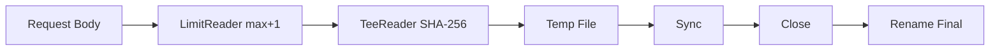

Simplified function:

```go
func StoreUpload(
    ctx context.Context,
    body io.Reader,
    dir string,
    finalName string,
    maxBytes int64,
) ([32]byte, int64, error) {
    var zero [32]byte

    tmp, err := os.CreateTemp(dir, ".upload-*")
    if err != nil {
        return zero, 0, err
    }

    tmpName := tmp.Name()
    committed := false
    defer func() {
        if !committed {
            _ = os.Remove(tmpName)
        }
    }()

    h := sha256.New()
    limited := io.LimitReader(body, maxBytes+1)
    tee := io.TeeReader(limited, h)

    n, copyErr := CopyContext(ctx, tmp, tee, make([]byte, 128*1024))
    if copyErr != nil {
        _ = tmp.Close()
        return zero, n, copyErr
    }
    if n > maxBytes {
        _ = tmp.Close()
        return zero, n, fmt.Errorf("upload too large: limit=%d", maxBytes)
    }

    if err := tmp.Sync(); err != nil {
        _ = tmp.Close()
        return zero, n, err
    }
    if err := tmp.Close(); err != nil {
        return zero, n, err
    }

    finalPath := filepath.Join(dir, finalName)
    if err := os.Rename(tmpName, finalPath); err != nil {
        return zero, n, err
    }

    committed = true

    var sum [32]byte
    copy(sum[:], h.Sum(nil))
    return sum, n, nil
}
```

Important caveat: production code must validate `finalName` against traversal and symlink policy. That was covered in Part 011.

---

## 23. Transform Placement: Reader-side vs Writer-side

Same transform can often be placed either side.

Compression:

```text
Reader-side decompression: compressed source → gzip.Reader → raw bytes
Writer-side compression: raw bytes → gzip.Writer → compressed sink
```

Hashing:

```text
Reader-side hash: TeeReader(src, hash)
Writer-side hash: MultiWriter(dst, hash)
```

Validation:

```text
Reader-side: validating reader returns error on invalid byte
Writer-side: validating writer rejects invalid byte stream
Record-side: decoder validates domain record
```

### 23.1 How to choose?

| Need | Prefer |
|---|---|
| transform source representation | reader wrapper |
| transform output representation | writer wrapper |
| observe input bytes | TeeReader |
| observe output bytes | MultiWriter / writer wrapper |
| produce request body on demand | reader abstraction / io.Pipe |
| write archive/compressed file | writer abstraction |
| parse domain records | decoder stage |

---

## 24. Buffer Strategy in Pipelines

### 24.1 One buffer is usually enough

`io.Copy` has an internal buffer unless source implements `WriterTo` or destination implements `ReaderFrom`.

If you use `io.CopyBuffer`, you control buffer allocation.

```go
buf := make([]byte, 128*1024)
_, err := io.CopyBuffer(dst, src, buf)
```

### 24.2 Too many buffers increase latency/memory

Bad layering:

```text
bufio.Reader
  → gzip.Reader internal buffer
  → bufio.Reader again
  → scanner buffer
  → application buffer
```

Not always wrong, but must be intentional.

Questions:

- which buffer reduces syscall?
- which buffer handles tokenization?
- which buffer hides errors until flush?
- which buffer increases tail latency?
- which buffer must be reset or flushed?

### 24.3 Buffer ownership

Never reuse a buffer while another goroutine may still observe it.

Bad:

```go
for {
    n, err := r.Read(buf)
    jobs <- buf[:n] // wrong if worker processes after next read mutates buf
}
```

Correct options:

1. copy per job
2. use buffer pool with ownership protocol
3. process synchronously
4. split by immutable records

Simple copy:

```go
chunk := append([]byte(nil), buf[:n]...)
jobs <- chunk
```

This allocates but is correct. Optimize later with pooling only when measurable.

---

## 25. Pooling in Pipeline: Useful but Dangerous

`sync.Pool` can reduce allocation for buffers, but it does not solve ownership by itself.

### 25.1 Safe buffer pool pattern

```go
type BufferPool struct {
    pool sync.Pool
    size int
}

func NewBufferPool(size int) *BufferPool {
    return &BufferPool{
        size: size,
        pool: sync.Pool{
            New: func() any {
                b := make([]byte, size)
                return &b
            },
        },
    }
}

func (p *BufferPool) Get() []byte {
    b := p.pool.Get().(*[]byte)
    return (*b)[:p.size]
}

func (p *BufferPool) Put(b []byte) {
    if cap(b) != p.size {
        return
    }
    b = b[:p.size]
    p.pool.Put(&b)
}
```

But the hard part is not code. The hard part is ownership:

```text
Get → exactly one owner → owner stops using → Put
```

Never put a buffer back while another goroutine might read it.

---

## 26. Pipeline APIs: Path-based vs Stream-based

### 26.1 Stream-based API

```go
func Transform(dst io.Writer, src io.Reader) error
```

Kelebihan:

- composable
- testable
- works with file/network/memory
- no filesystem assumption

Kekurangan:

- caller handles open/close/durability
- no access to file metadata/path

### 26.2 Path-based API

```go
func TransformFile(srcPath, dstPath string) error
```

Kelebihan:

- can own open/close/sync/rename
- easier for CLI app
- can implement durability end-to-end

Kekurangan:

- less composable
- harder to test unless using temp files
- path safety burden

### 26.3 Recommended layering

```text
core transform:      io.Reader → io.Writer
file orchestration:  path → open/temp/sync/rename → core transform
HTTP orchestration:  request body/response writer → core transform
CLI orchestration:   stdin/stdout/stderr → core transform
```

```mermaid
flowchart TD
    Core[Stream Core: Transform(dst, src)]
    File[File Adapter] --> Core
    HTTP[HTTP Adapter] --> Core
    CLI[CLI Adapter] --> Core
    Test[Test Adapter: bytes.Buffer/strings.Reader] --> Core
```

This is the key to reusable Go IO systems.

---

## 27. Production Pipeline Design Checklist

Before coding a pipeline, fill this table:

| Dimension | Question | Example |
|---|---|---|
| Source | Where does data come from? | HTTP body, file, socket, archive entry |
| Sink | Where does output go? | temp file, response, object store writer |
| Unit | What is processed? | bytes, line, frame, JSON object |
| Boundary | How are units detected? | length-prefix, newline, decoder |
| Limit | What are max sizes? | 100 MiB input, 1 MiB record |
| Transform | What changes? | gzip, CSV encode, hash, validate |
| Error | What is recoverable? | malformed record maybe skip, corrupt header fail |
| Partial output | Keep or delete? | delete temp file unless committed |
| Cancellation | How stop? | context + close/deadline |
| Backpressure | How bounded? | blocking write, bounded channels |
| Concurrency | Is order required? | yes/no, sequence number |
| Close | Who closes what? | caller owns source/sink except local temp |
| Flush | What must be flushed? | csv writer, gzip writer, bufio writer |
| Durability | Need fsync/rename? | yes for committed file |
| Observability | What metrics/logs? | bytes, records, duration, error class |
| Testing | Faults? | short write, EOF, cancel, malformed input |

---

## 28. Observability for Pipelines

Minimum metrics:

- bytes read
- bytes written
- records processed
- records rejected
- duration
- throughput
- active pipelines
- cancellation count
- timeout count
- error class
- temp file cleanup failure
- compression ratio if compression exists

### 28.1 Counting reader/writer

```go
type CountingReader struct {
    R io.Reader
    N int64
}

func (c *CountingReader) Read(p []byte) (int, error) {
    n, err := c.R.Read(p)
    c.N += int64(n)
    return n, err
}

type CountingWriter struct {
    W io.Writer
    N int64
}

func (c *CountingWriter) Write(p []byte) (int, error) {
    n, err := c.W.Write(p)
    c.N += int64(n)
    return n, err
}
```

### 28.2 Log stage boundaries, not every chunk

Bad:

```text
log every 32 KiB chunk
```

Better:

```text
pipeline started: source_type, sink_type, request_id
pipeline completed: bytes_in, bytes_out, records, duration, checksum
pipeline failed: stage, error_class, bytes_in, bytes_out, duration
```

### 28.3 Error classification

Example classes:

```text
input_too_large
malformed_input
checksum_mismatch
source_timeout
sink_timeout
client_canceled
disk_full
permission_denied
flush_failed
commit_failed
internal_bug
```

Do not expose low-level internal errors directly to untrusted clients. Map them to safe API responses, but keep detailed internal logs.

---

## 29. Testing Pipeline Correctness

### 29.1 Test with in-memory source/sink

```go
func TestCopyAndHash(t *testing.T) {
    src := strings.NewReader("hello")
    var dst bytes.Buffer

    res, err := CopyAndHash(&dst, src)
    if err != nil {
        t.Fatal(err)
    }
    if got := dst.String(); got != "hello" {
        t.Fatalf("dst = %q", got)
    }
    if res.Bytes != 5 {
        t.Fatalf("bytes = %d", res.Bytes)
    }
}
```

### 29.2 Fault-injection reader

```go
type errReader struct {
    data []byte
    err  error
    done bool
}

func (r *errReader) Read(p []byte) (int, error) {
    if !r.done && len(r.data) > 0 {
        r.done = true
        return copy(p, r.data), r.err
    }
    return 0, io.EOF
}
```

This can simulate `n > 0 && err != nil`.

### 29.3 Fault-injection writer

```go
type shortWriter struct{}

func (shortWriter) Write(p []byte) (int, error) {
    if len(p) == 0 {
        return 0, nil
    }
    return len(p) / 2, nil
}
```

Your pipeline should detect `io.ErrShortWrite` when using custom copy loop.

### 29.4 Cancellation test

```go
func TestCopyContextCanceled(t *testing.T) {
    ctx, cancel := context.WithCancel(context.Background())
    cancel()

    var dst bytes.Buffer
    _, err := CopyContext(ctx, &dst, strings.NewReader("hello"), nil)
    if !errors.Is(err, context.Canceled) {
        t.Fatalf("err = %v", err)
    }
}
```

### 29.5 Pipe deadlock test

Pipeline with `io.Pipe` should be tested under early consumer failure.

Scenario:

- producer writes compressed data
- consumer reads first N bytes then closes
- producer should exit, not leak goroutine

Use timeouts in tests to detect leaks/deadlocks, but keep them conservative.

---

## 30. Benchmarking Pipeline

Benchmark questions:

- throughput bytes/sec
- records/sec
- allocation/op
- bytes allocated/op
- latency per record
- compression ratio
- CPU profile hot spots
- syscall count if relevant
- memory peak for large input

Example benchmark:

```go
func BenchmarkCopyBuffer128K(b *testing.B) {
    payload := bytes.Repeat([]byte("x"), 64*1024*1024)
    buf := make([]byte, 128*1024)

    b.SetBytes(int64(len(payload)))
    b.ReportAllocs()

    for i := 0; i < b.N; i++ {
        src := bytes.NewReader(payload)
        dst := io.Discard
        if _, err := io.CopyBuffer(dst, src, buf); err != nil {
            b.Fatal(err)
        }
    }
}
```

Caution:

- benchmark memory source can be unrealistically fast
- disk/network benchmark needs separate methodology
- compression benchmark depends heavily on data entropy
- never generalize one benchmark to all IO workloads

---

## 31. Failure Mode Matrix

| Failure | Symptom | Root cause | Mitigation |
|---|---|---|---|
| memory spike | RSS grows with input size | `ReadAll`, unbounded queue | streaming + limits |
| goroutine leak | test hangs, increasing goroutines | pipe producer/consumer not closed | context + CloseWithError |
| corrupt gzip | decompressor says unexpected EOF | forgot `gzip.Writer.Close()` | close transform writer |
| missing CSV rows | output incomplete | forgot `csv.Writer.Flush()`/`Error()` | flush/error check |
| stuck upload | handler never returns | sink blocked, no deadline/cancel | context/deadline/close body |
| corrupt output | interleaved writes | multiple workers write same stream | single writer owner |
| data loss | file exists but empty/corrupt after crash | no fsync/temp rename | durable write protocol |
| silent truncation | success with partial write | ignored `n`/short write | check write contract |
| decompression bomb | disk/RAM exhaustion | limit compressed only | limit decompressed output |
| lost root cause | generic error | no stage context | wrap with stage labels |

---

## 32. Anti-Patterns

### 32.1 `io.ReadAll` on untrusted input

```go
b, err := io.ReadAll(r)
```

Safe only if input is already bounded by trust or prior limit. For untrusted input, use `LimitReader` or streaming decoder.

### 32.2 Hiding close errors

```go
defer gz.Close()
io.Copy(gz, src)
return nil
```

This can silently produce corrupt gzip output.

### 32.3 Channel as fake stream without backpressure design

```go
chunks := make(chan []byte, 1000000)
```

This is a memory queue, not a stream.

### 32.4 Concurrent writes to structured stream

```go
go json.NewEncoder(w).Encode(a)
go json.NewEncoder(w).Encode(b)
```

This can produce invalid output or racy semantics.

### 32.5 Context checked only before pipeline starts

```go
if err := ctx.Err(); err != nil {
    return err
}
_, err := io.Copy(dst, src)
```

For long-running pipeline, check periodically or use deadline/cancelable underlying IO.

### 32.6 Transforming after buffering everything

```go
all, _ := io.ReadAll(src)
transformed := Transform(all)
w.Write(transformed)
```

This may be acceptable for tiny config files, not for large/untrusted transfer.

---

## 33. Practical Design Patterns

### 33.1 Stream core + adapter shell

```go
func Transform(dst io.Writer, src io.Reader) error
func TransformFile(srcPath, dstPath string) error
func TransformHTTP(w http.ResponseWriter, r *http.Request)
func TransformCLI(stdin io.Reader, stdout, stderr io.Writer) int
```

This keeps business pipeline reusable.

### 33.2 Single owner sink

One goroutine owns structured output writer.

```text
workers produce Result → writer goroutine encodes Result
```

### 33.3 Close-with-error pipe bridge

Use `io.Pipe` only when API mismatch requires it.

```text
writer-style producer → io.Pipe → reader-style consumer
```

Always propagate errors with `CloseWithError`.

### 33.4 Bounded all the way down

```text
limit request body
limit decompressed bytes
limit archive entries
limit entry size
limit record size
limit temp disk usage
limit worker count
limit queue capacity
```

### 33.5 Stage labels in errors

```go
return fmt.Errorf("decode json line %d: %w", lineNo, err)
return fmt.Errorf("compress output: %w", err)
return fmt.Errorf("commit temp file: %w", err)
```

This makes operations debuggable.

---

## 34. Production Example: Transfer Pipeline Architecture

Suppose you build internal transfer service:

```text
Client uploads .tar.gz
Server validates archive
Server extracts allowed entries
Server stores files atomically
Server records manifest + checksum
```

Pipeline:

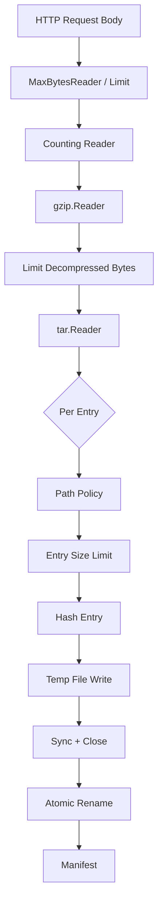

Control plane:

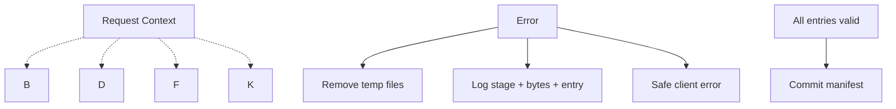

Failure policy:

| Stage | Failure | Policy |
|---|---|---|
| request body | too large | reject, drain/close as appropriate |
| gzip | invalid gzip | reject archive |
| tar | malformed header | reject archive |
| path | traversal/symlink | reject entry/archive based on policy |
| entry | too large | reject archive |
| temp write | disk full | fail request, cleanup |
| sync | storage issue | fail request, cleanup |
| rename | commit fail | fail request, cleanup or recovery |
| manifest | DB fail | decide rollback/compensate |

This is not merely IO code. This is an operational contract.

---

## 35. Java Engineer Translation

| Java concept | Go equivalent / mental model |
|---|---|
| `InputStream` | `io.Reader` |
| `OutputStream` | `io.Writer` |
| `FilterInputStream` | wrapper `io.Reader` |
| `FilterOutputStream` | wrapper `io.Writer` |
| `BufferedInputStream` | `bufio.Reader` |
| `BufferedOutputStream` | `bufio.Writer` |
| `GZIPInputStream` | `gzip.Reader` |
| `GZIPOutputStream` | `gzip.Writer` |
| `try-with-resources` | explicit `Close` with error handling/defer carefully |
| `java.nio.channels` | `os.File`, `net.Conn`, `ReaderAt`, `WriterAt`, lower-level syscall-adjacent APIs |
| Reactive streams backpressure | blocking `Write`, bounded channels, deadlines, context |
| Executor pipeline | goroutine + errgroup + bounded channel |

Big difference:

> Go does not force a heavy pipeline framework. It gives small contracts and expects you to make ownership, cancellation, and error semantics explicit.

---

## 36. Exercises

### Exercise 1 — Counting Copy

Implement:

```go
func CopyWithMetrics(ctx context.Context, dst io.Writer, src io.Reader, bufSize int) (bytes int64, duration time.Duration, err error)
```

Requirements:

- context checked during copy
- detects short write
- supports custom buffer size
- returns duration even on error

### Exercise 2 — Gzip Transform

Implement:

```go
func GzipCopy(dst io.Writer, src io.Reader) error
```

Requirements:

- does not close `dst`
- closes gzip writer
- returns copy error before close error
- test corrupt output if close omitted

### Exercise 3 — Bounded Decompression

Implement:

```go
func GunzipLimited(dst io.Writer, src io.Reader, maxDecompressed int64) error
```

Requirements:

- reject invalid gzip
- reject decompressed output over limit
- close gzip reader
- do not load all data into memory

### Exercise 4 — Pipe Bridge

Implement a function that returns an `io.ReadCloser` producing gzip-compressed bytes from a source reader.

Requirements:

- use `io.Pipe`
- propagate producer errors with `CloseWithError`
- support cancellation
- test early reader close

### Exercise 5 — Record Pipeline

Build JSONL → CSV converter.

Requirements:

- max line size
- reject unknown JSON fields
- count rows
- flush CSV writer
- output valid CSV even with special characters
- test malformed line and oversized line

### Exercise 6 — Ordered Worker Pipeline

Build a pipeline:

```text
decode records → process records concurrently → write output in original order
```

Requirements:

- bounded jobs/results channels
- cancellation on first error
- no goroutine leak
- single writer owns output
- reorder by sequence number

---

## 37. Summary

Data pipeline composition in Go is not about memorizing helper functions. It is about preserving semantic correctness while moving data across boundaries.

Core principles:

1. Prefer `io.Reader`/`io.Writer` composition before frameworks.
2. Treat every stage as data plane + control plane.
3. Keep streams bounded.
4. Prefer linear composition until concurrency is justified.
5. Use blocking writes and bounded channels as backpressure.
6. Do not ignore flush/close errors.
7. Make ownership explicit.
8. Use `io.Pipe` only with clear close/cancel/error protocol.
9. Use single writer ownership for structured streams.
10. Test partial progress, malformed input, cancellation, short write, and early close.

A top-level Go engineer does not ask only:

```text
How do I connect reader to writer?
```

They ask:

```text
What is the unit of data?
What are the bounds?
Who owns lifecycle?
Where can partial progress happen?
How is backpressure applied?
How is cancellation propagated?
How is partial output cleaned up?
How will we debug this at 3 AM?
```

That is the difference between IO code that works in a demo and IO systems that survive production.

---

## 38. References

Primary Go references for this part:

- `io` package: https://pkg.go.dev/io
- `bufio` package: https://pkg.go.dev/bufio
- `context` package: https://pkg.go.dev/context
- `compress/gzip` package: https://pkg.go.dev/compress/gzip
- `encoding/csv` package: https://pkg.go.dev/encoding/csv
- `encoding/json` package: https://pkg.go.dev/encoding/json
- `net/http` package: https://pkg.go.dev/net/http
- `golang.org/x/sync/errgroup`: https://pkg.go.dev/golang.org/x/sync/errgroup
- Go 1.26 release notes: https://go.dev/doc/go1.26
- Go release history: https://go.dev/doc/devel/release

---

## 39. Next Part Preview

Part berikutnya:

```text
learn-go-io-buffer-byte-stream-file-network-data-transfer-part-022.md
```

Topik:

```text
Networking foundation: net.Conn, Listener, Dialer, addresses, DNS, deadlines
```

Kita akan masuk ke boundary network paling dasar di Go:

- `net.Conn`
- `net.Listener`
- `net.Dialer`
- TCP/UDP/Unix address model
- DNS resolution
- deadline vs context
- connection lifecycle
- partial read/write over network
- timeout classification
- production-grade dial/accept model

<!-- NAVIGATION_FOOTER -->
<div class="page-nav">
<a href="./learn-go-io-buffer-byte-stream-file-network-data-transfer-part-020.md">⬅️ Part 020 — Archive Formats: TAR, ZIP, Safe Extraction, Metadata, dan Large Archive Handling</a>
<a href="./index.md">📚 Kategori</a>
<a href="../../index.md">🏠 Home</a>
<a href="./learn-go-io-buffer-byte-stream-file-network-data-transfer-part-022.md">Part 022 — Networking Foundation: `net.Conn`, `Listener`, `Dialer`, Address, DNS, Deadline, dan Failure Model Jaringan ➡️</a>
</div>
