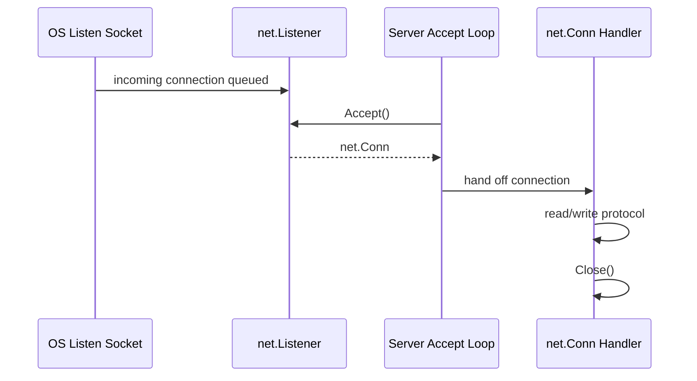
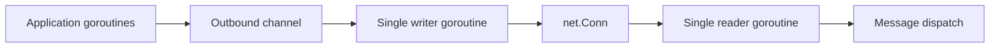

# learn-go-io-buffer-byte-stream-file-network-data-transfer-part-022.md

# Part 022 — Networking Foundation: `net.Conn`, `Listener`, `Dialer`, Address, DNS, Deadline, dan Failure Model Jaringan

> Series: **learn-go-io-buffer-byte-stream-file-network-data-transfer**  
> Target: Go **1.26.x**  
> Audience: Java software engineer yang ingin memahami Go IO/networking pada level production/internal engineering handbook.  
> Status: Part 022 dari 034. Seri **belum selesai**.

---

## 0. Posisi Part Ini Dalam Series

Sampai part 021, kita sudah membangun fondasi:

1. byte, slice, buffer, stream;
2. kontrak `io.Reader` / `io.Writer`;
3. error semantic IO;
4. file dan filesystem;
5. serialization, framing, compression, archive;
6. pipeline composition dan backpressure.

Sekarang kita masuk ke boundary yang lebih tidak deterministik: **network IO**.

File bisa lambat, bisa error, bisa penuh. Tetapi network lebih liar:

- peer bisa diam;
- peer bisa menutup koneksi separuh jalan;
- DNS bisa lambat;
- packet bisa hilang;
- connection bisa reset;
- load balancer bisa idle timeout;
- NAT bisa mengganti mapping;
- TLS handshake bisa gagal;
- deadline bisa terjadi saat sebagian byte sudah terkirim;
- retry bisa menggandakan efek;
- satu koneksi bisa hidup lama, tetapi health-nya berubah kapan saja.

Part ini belum membahas TCP server dan TCP client secara mendalam. Itu akan masuk part 023 dan 024. Fokus part ini adalah **mental model dan primitive dasar package `net`**.

---

## 1. Tujuan Pembelajaran

Setelah part ini, kamu harus bisa:

1. memahami package `net` sebagai perluasan dari model `io.Reader`/`io.Writer`;
2. membedakan `net.Conn`, `net.Listener`, `net.PacketConn`, `net.Dialer`, dan `net.ListenConfig`;
3. memahami address model: `network`, `address`, `net.Addr`, `TCPAddr`, `UDPAddr`, `UnixAddr`, `netip.AddrPort`;
4. memahami DNS resolution di Go dan konsekuensi operasionalnya;
5. mendesain deadline dan timeout yang benar;
6. menghindari bug umum: no timeout, shared deadline salah, goroutine leak, connection leak, unbounded read, retry unsafe;
7. membaca network error secara defensif tanpa over-fitting ke string error;
8. membuat primitive helper network yang testable memakai `net.Pipe`;
9. menyiapkan fondasi untuk TCP server/client production-grade.

---

## 2. Referensi Resmi

Referensi utama:

- Go `net` package: <https://pkg.go.dev/net>
- Go 1.26 release notes: <https://go.dev/doc/go1.26>
- Go `net/netip`: <https://pkg.go.dev/net/netip>
- Go `context`: <https://pkg.go.dev/context>
- Go `io`: <https://pkg.go.dev/io>
- Go `crypto/tls`: <https://pkg.go.dev/crypto/tls>
- Go `net/http`: <https://pkg.go.dev/net/http>

Catatan versi Go 1.26.x:

- Go 1.26 menambah method typed/context-aware pada `net.Dialer`: `DialIP`, `DialTCP`, `DialUDP`, dan `DialUnix`.
- Method baru tersebut menggabungkan context cancellation dengan tipe address yang lebih spesifik seperti `netip.AddrPort` untuk TCP/UDP.
- Go 1.26 tetap berada dalam Go 1 compatibility promise, jadi materi dasar `net.Conn`, `Listener`, deadline, dan error semantic masih kompatibel dengan prinsip Go 1.

---

## 3. Mental Model Utama: Network Adalah Stream/Packet Dengan Peer Tidak Terpercaya

Di Go, koneksi network stream biasa diekspresikan sebagai:

```go
conn, err := net.Dial("tcp", "example.com:80")
if err != nil {
    return err
}
defer conn.Close()

_, err = conn.Write([]byte("GET / HTTP/1.0\r\n\r\n"))
if err != nil {
    return err
}

buf := make([]byte, 4096)
n, err := conn.Read(buf)
```

Secara bentuk, `conn` terlihat seperti `io.Reader` dan `io.Writer`. Tetapi secara semantic, ia lebih berbahaya dari file.

File lokal:

```text
program -> kernel -> filesystem -> storage
```

Network stream:

```text
program -> kernel socket buffer -> NIC -> network path -> peer kernel -> peer program
```

Di tengahnya ada banyak komponen yang tidak kamu kontrol.


Konsekuensinya:

- `Write` sukses bukan berarti peer application sudah memproses data.
- `Read` timeout bukan berarti peer mati.
- `EOF` berarti remote side menutup stream secara orderly, bukan selalu error aplikasi.
- `connection reset` berarti peer/kernel memutus paksa, tetapi penyebab bisnisnya bisa apa saja.
- retry setelah partial write bisa menyebabkan duplicate operation.
- tidak ada message boundary pada TCP.

Kalimat penting:

> Network IO harus dirancang sebagai **partial, blocking, unordered-in-time, externally controlled progress**.

“Unordered-in-time” maksudnya bukan byte stream TCP berubah urutan. TCP menjaga urutan byte. Maksudnya dari sisi aplikasi, event seperti timeout, close, cancellation, partial write, late response, dan retry bisa terjadi dalam urutan yang tidak sesuai asumsi mental manusia.

---

## 4. Java Engineer Mapping: Go Network vs Java IO/NIO

| Konsep | Java | Go |
|---|---|---|
| Blocking TCP socket | `java.net.Socket` | `net.Conn`, `*net.TCPConn` |
| Server socket | `ServerSocket`, `ServerSocketChannel` | `net.Listener`, `*net.TCPListener` |
| Non-blocking/event loop | `Selector`, Netty `EventLoop` | Go runtime netpoller + goroutine per connection |
| Read timeout | `Socket#setSoTimeout` | `SetReadDeadline` / `SetDeadline` |
| Connect timeout | `Socket#connect(addr, timeout)` | `net.Dialer{Timeout: ...}` atau context |
| Async channel | `AsynchronousSocketChannel` | goroutine + blocking-looking API |
| Byte buffer | `ByteBuffer` | `[]byte`, `bytes.Buffer`, `bufio.Reader` |
| Address | `InetSocketAddress` | `net.TCPAddr`, `netip.AddrPort`, string `host:port` |
| DNS | JVM/native resolver behavior | Go resolver: pure Go atau cgo/native tergantung OS/env |
| Half close | `shutdownInput/Output` | `(*net.TCPConn).CloseRead/CloseWrite` |
| Low-level socket option | `StandardSocketOptions` | method spesifik, `SyscallConn`, `Control` |

Perbedaan paling besar:

Java sering memisahkan:

```text
blocking IO model vs non-blocking selector model
```

Go menyembunyikan banyak detail non-blocking di runtime:

```text
blocking-looking Read/Write
    ↓
runtime netpoller
    ↓
OS readiness notification
    ↓
goroutine parked/unparked
```

Artinya, di Go kamu biasanya tidak membuat event loop manual untuk TCP service biasa. Kamu membuat goroutine per connection, tetapi tetap wajib mendesain:

- deadline;
- bounded read;
- cancellation;
- backpressure;
- close ownership;
- resource limit.

---

## 5. Package `net` Dalam Satu Peta

Package `net` menyediakan portable network IO untuk:

- TCP/IP;
- UDP;
- Unix domain socket;
- DNS resolution;
- address parsing;
- listener dan dialer;
- packet connection;
- raw-ish access terbatas lewat `SyscallConn`.

Peta konsep:

```mermaid
flowchart TD
    NET[package net]

    NET --> STREAM[Stream-oriented]
    STREAM --> Conn[net.Conn]
    STREAM --> Listener[net.Listener]
    STREAM --> Dialer[net.Dialer]
    STREAM --> TCPConn[*net.TCPConn]
    STREAM --> UnixConn[*net.UnixConn]

    NET --> PACKET[Packet-oriented]
    PACKET --> PacketConn[net.PacketConn]
    PACKET --> UDPConn[*net.UDPConn]
    PACKET --> IPConn[*net.IPConn]

    NET --> ADDR[Address model]
    ADDR --> Addr[net.Addr]
    ADDR --> TCPAddr[*net.TCPAddr]
    ADDR --> UDPAddr[*net.UDPAddr]
    ADDR --> UnixAddr[*net.UnixAddr]
    ADDR --> Netip[net/netip]

    NET --> DNS[Name resolution]
    DNS --> Resolver[net.Resolver]
    DNS --> Lookup[LookupHost/LookupIP/etc]

    NET --> CONFIG[Configuration]
    CONFIG --> ListenConfig[net.ListenConfig]
    CONFIG --> Dialer2[net.Dialer]
```



Jangan menganggap semua koneksi sebagai TCP. Di Go ada dua keluarga utama:

1. **stream-oriented**: TCP, Unix stream socket;
2. **packet-oriented**: UDP, IP packet, Unix datagram.

Part ini lebih banyak fokus pada stream, karena TCP menjadi dasar part 023/024 dan HTTP part 027/028. UDP akan dibahas khusus di part 025.

---

## 6. `net.Conn`: Interface Pusat Untuk Stream Connection

`net.Conn` adalah interface inti:

```go
type Conn interface {
    Read(b []byte) (n int, err error)
    Write(b []byte) (n int, err error)
    Close() error
    LocalAddr() Addr
    RemoteAddr() Addr
    SetDeadline(t time.Time) error
    SetReadDeadline(t time.Time) error
    SetWriteDeadline(t time.Time) error
}
```

Ini berarti `net.Conn` adalah:

- `io.Reader`;
- `io.Writer`;
- `io.Closer`;
- plus address dan deadline control.

### 6.1 Apa Yang Tidak Dijamin Oleh `net.Conn`

`net.Conn` tidak menjamin:

- satu `Write` dibaca sebagai satu `Read` di peer;
- `Write` sukses berarti peer sudah memproses;
- `Read` memenuhi seluruh buffer;
- timeout berarti koneksi pasti rusak secara permanen;
- close selalu graceful;
- concurrent read/write logic kamu pasti aman;
- protocol message boundary ada secara otomatis.

TCP adalah byte stream:

```text
writer writes: [HELLO][WORLD]
network stream: H E L L O W O R L D
reader may read: [HE][LLOWOR][LD]
```

Maka protocol harus punya framing:

- delimiter;
- length-prefix;
- fixed-size frame;
- higher-level protocol seperti HTTP.

Ini sudah dibahas di part 018, dan akan dipakai lagi di part 023/024.

---

## 7. `Read` Pada Network: Partial, Blocking, Deadline-Aware

Contoh salah:

```go
buf := make([]byte, 1024)
n, err := conn.Read(buf)
if err != nil {
    return err
}
msg := buf[:n]
```

Kode ini tidak selalu salah, tetapi sering salah jika developer mengira `msg` adalah satu pesan lengkap.

`Read` pada `net.Conn`:

- bisa return `n > 0, err == nil`;
- bisa return `n > 0, err != nil`;
- bisa return `0, err != nil`;
- bisa block jika tidak ada data dan tidak ada deadline;
- bisa timeout jika deadline terlampaui.

Pola yang lebih benar tergantung protocol.

### 7.1 Read Fixed-Length Frame

```go
func readExactly(conn net.Conn, size int) ([]byte, error) {
    if size < 0 || size > 16<<20 { // 16 MiB example cap
        return nil, fmt.Errorf("invalid frame size: %d", size)
    }

    buf := make([]byte, size)
    _, err := io.ReadFull(conn, buf)
    if err != nil {
        return nil, err
    }
    return buf, nil
}
```

`io.ReadFull` diperlukan karena satu `Read` tidak menjamin buffer terisi penuh.

### 7.2 Read Line-Based Protocol

```go
func readLine(r *bufio.Reader, maxLine int) (string, error) {
    var out []byte

    for {
        frag, err := r.ReadSlice('\n')
        out = append(out, frag...)

        if len(out) > maxLine {
            return "", fmt.Errorf("line too long")
        }

        if err == nil {
            return string(out), nil
        }
        if errors.Is(err, bufio.ErrBufferFull) {
            continue
        }
        return "", err
    }
}
```

Line protocol harus bounded. Jika tidak, peer bisa mengirim infinite line dan menahan memory.

---

## 8. `Write` Pada Network: Short Write dan Partial Side Effect

`Write` pada `net.Conn` bisa mengembalikan `n < len(p)` dengan error.

Contoh helper:

```go
func writeAll(w io.Writer, p []byte) error {
    for len(p) > 0 {
        n, err := w.Write(p)
        if n > 0 {
            p = p[n:]
        }
        if err != nil {
            return err
        }
        if n == 0 {
            return io.ErrShortWrite
        }
    }
    return nil
}
```

Namun hati-hati: helper ini hanya aman untuk **mengirim semua byte pada satu connection saat connection masih valid**. Jika error terjadi setelah partial write, jangan otomatis buka koneksi baru dan kirim ulang sisa/pesan penuh tanpa memahami idempotency.

### 8.1 Partial Write Sebagai Side Effect

Misalnya request protocol:

```text
TRANSFER account=A amount=100
```

Jika client menulis sebagian byte, lalu timeout:

```text
TRANSFER account=A amou...
```

Peer mungkin:

- belum menerima apa pun;
- menerima sebagian dan menunggu sisa;
- menerima semua tetapi ACK hilang;
- memproses request lalu koneksi putus sebelum response;
- reject karena frame incomplete.

Retry harus dirancang di level protocol/aplikasi, bukan sekadar `for retry Write`.

---

## 9. Address Model: `network` dan `address`

Banyak API `net` menerima dua string:

```go
net.Dial(network, address)
net.Listen(network, address)
```

Contoh:

```go
net.Dial("tcp", "example.com:443")
net.Listen("tcp", ":8080")
net.Listen("unix", "/tmp/app.sock")
net.ListenPacket("udp", ":9000")
```

`network` bukan sekadar label. Ia mengubah transport semantics.

| Network | Makna umum |
|---|---|
| `tcp` | TCP, IPv4 atau IPv6 tergantung resolution |
| `tcp4` | TCP IPv4 |
| `tcp6` | TCP IPv6 |
| `udp` | UDP, IPv4 atau IPv6 |
| `udp4` | UDP IPv4 |
| `udp6` | UDP IPv6 |
| `unix` | Unix domain stream socket |
| `unixgram` | Unix domain datagram socket |
| `unixpacket` | Unix domain sequenced packet socket, OS-dependent |

### 9.1 String Address vs Typed Address

String address nyaman:

```go
conn, err := net.Dial("tcp", "api.internal:443")
```

Typed address lebih eksplisit:

```go
addr, err := net.ResolveTCPAddr("tcp", "127.0.0.1:5432")
if err != nil {
    return err
}

conn, err := net.DialTCP("tcp", nil, addr)
```

Go 1.26 menambah method typed/context-aware pada `net.Dialer`, misalnya:

```go
var d net.Dialer
ctx, cancel := context.WithTimeout(context.Background(), 2*time.Second)
defer cancel()

remote := netip.MustParseAddrPort("127.0.0.1:5432")
conn, err := d.DialTCP(ctx, "tcp", netip.AddrPort{}, remote)
if err != nil {
    return err
}
defer conn.Close()
```

Ini berguna saat endpoint sudah resolved dan kamu ingin:

- context cancellation;
- type-safe address;
- menghindari parsing host:port string berulang;
- menghindari DNS di path itu.

Namun untuk service biasa dengan hostname, `DialContext` tetap umum.

---

## 10. `net.Addr`: Address Yang Dikembalikan Koneksi

`net.Addr` interface:

```go
type Addr interface {
    Network() string
    String() string
}
```

Dari `conn.LocalAddr()` dan `conn.RemoteAddr()`, kamu mendapat `net.Addr`.

```go
log.Printf("local=%s remote=%s", conn.LocalAddr(), conn.RemoteAddr())
```

Hati-hati:

- `String()` untuk logging, bukan format storage/protocol yang selalu stabil;
- jangan parse balik `String()` jika kamu bisa menyimpan typed value;
- beberapa doc Go menyebut address yang dikembalikan dapat shared, jadi jangan dimodifikasi.

Untuk observability, address penting tetapi raw IP dapat menjadi sensitive tergantung domain.

---

## 11. `netip`: Address Modern Yang Lebih Value-Oriented

Package `net/netip` menyediakan tipe address modern:

- `netip.Addr`;
- `netip.AddrPort`;
- `netip.Prefix`.

Dibanding `net.IP`, `netip` lebih value-like, comparable, dan lebih nyaman untuk map key.

Contoh:

```go
ap, err := netip.ParseAddrPort("10.0.0.7:8443")
if err != nil {
    return err
}

fmt.Println(ap.Addr())
fmt.Println(ap.Port())
```

Kapan memilih:

| Use case | Pilihan |
|---|---|
| public API modern internal | `netip.Addr` / `AddrPort` |
| berinteraksi dengan API lama `net` | `net.TCPAddr`, `net.UDPAddr`, `net.IP` |
| string config sederhana | parse ke typed address saat startup |
| hot path dengan endpoint resolved | `netip.AddrPort` |

---

## 12. `net.Dial`, `net.Dialer`, dan Connect Lifecycle

`net.Dial` adalah shortcut:

```go
conn, err := net.Dial("tcp", "example.com:443")
```

Untuk production, biasanya gunakan `net.Dialer`:

```go
d := net.Dialer{
    Timeout:   3 * time.Second,
    KeepAlive: 30 * time.Second,
}

ctx, cancel := context.WithTimeout(context.Background(), 5*time.Second)
defer cancel()

conn, err := d.DialContext(ctx, "tcp", "example.com:443")
if err != nil {
    return err
}
defer conn.Close()
```

Kenapa?

- connect harus punya timeout;
- context memberi cancellation saat request/client operation dibatalkan;
- ada opsi local address, keepalive, resolver, control hook, fallback delay, MPTCP;
- mudah di-inject ke HTTP transport atau custom client.

### 12.1 Dial Timeout vs Context Deadline vs Conn Deadline

Ini sering membingungkan.

| Mechanism | Berlaku untuk | Setelah koneksi sukses? |
|---|---|---|
| `Dialer.Timeout` | proses connect | tidak |
| `Dialer.Deadline` | absolute deadline connect | tidak |
| `DialContext(ctx, ...)` | connect sampai sukses/gagal | context expiry setelah connect tidak otomatis menutup conn |
| `conn.SetDeadline` | read/write conn | ya, untuk operasi future dan pending |
| `conn.SetReadDeadline` | read only | ya |
| `conn.SetWriteDeadline` | write only | ya |

Kalimat penting:

> Context pada `DialContext` membatasi proses membuat koneksi, bukan lifetime seluruh koneksi setelah berhasil.

Kalau ingin operasi read/write mengikuti request context, kamu harus:

- set deadline berdasarkan context;
- menutup connection saat context selesai;
- atau membungkus operasi dengan policy khusus.

---

## 13. `net.Listener`: Server Boundary

`net.Listener` interface:

```go
type Listener interface {
    Accept() (Conn, error)
    Close() error
    Addr() Addr
}
```

Minimal server:

```go
ln, err := net.Listen("tcp", ":9000")
if err != nil {
    return err
}
defer ln.Close()

for {
    conn, err := ln.Accept()
    if err != nil {
        return err
    }
    go handle(conn)
}
```

Ini benar sebagai demo, tapi belum production-grade.

Masalah:

- tidak ada shutdown handling;
- tidak ada accept error classification;
- tidak ada connection limit;
- tidak ada deadline per connection;
- tidak ada panic recovery per handler;
- tidak ada metrics;
- tidak ada backpressure policy;
- goroutine bisa leak.

Part 023 akan membahas accept loop mendalam. Di part ini, pahami dulu: listener adalah **factory connection**.



---

## 14. `net.ListenConfig`: Listener Dengan Context dan Control

`net.Listen` cukup untuk simple server. Untuk production/advanced use, `net.ListenConfig` lebih fleksibel:

```go
lc := net.ListenConfig{}

ctx, cancel := context.WithTimeout(context.Background(), 5*time.Second)
defer cancel()

ln, err := lc.Listen(ctx, "tcp", ":9000")
if err != nil {
    return err
}
defer ln.Close()
```

Use case:

- listen operation dengan context;
- socket control hook sebelum bind/listen;
- MPTCP policy;
- packet listener via `ListenPacket`.

Advanced socket option biasanya lewat `Control`, tetapi ini harus hati-hati karena OS-specific.

```go
lc := net.ListenConfig{
    Control: func(network, address string, c syscall.RawConn) error {
        var controlErr error
        err := c.Control(func(fd uintptr) {
            // OS-specific setsockopt here.
            // Hindari kecuali benar-benar perlu.
        })
        if err != nil {
            return err
        }
        return controlErr
    },
}
```

Default: jangan pakai `Control` kalau belum perlu. Banyak service cukup memakai `net.Listen`/`ListenConfig` tanpa custom socket option.

---

## 15. DNS Resolution Di Go

Ketika kamu dial hostname:

```go
net.Dial("tcp", "api.internal:443")
```

Go harus resolve `api.internal` ke IP.

Package `net` bisa memakai:

1. pure Go resolver;
2. cgo/native resolver;
3. behavior OS-specific.

Pada Unix, pure Go resolver biasanya preferred karena blocked DNS request hanya mengonsumsi goroutine, sedangkan blocked C resolver bisa mengonsumsi OS thread. Tetapi Go bisa memilih cgo resolver dalam kondisi tertentu, misalnya ketika konfigurasi OS membutuhkan fitur resolver yang tidak diimplementasikan pure Go.

Kamu bisa memengaruhi resolver dengan `GODEBUG=netdns=go` atau `GODEBUG=netdns=cgo` untuk debugging/operasional tertentu.

### 15.1 Kenapa DNS Penting Untuk Production

DNS bukan lookup kecil tak berbahaya. DNS bisa menyebabkan:

- connect latency tinggi;
- thread exhaustion jika resolver native blocking masif;
- hasil berbeda antar environment;
- stale endpoint;
- split-horizon DNS behavior;
- IPv4/IPv6 fallback issue;
- timeout error yang terlihat seperti network app error;
- overload resolver internal.

### 15.2 Resolver Explicit

`net.Dialer` punya field `Resolver`.

```go
resolver := &net.Resolver{}

d := net.Dialer{
    Timeout:  3 * time.Second,
    Resolver: resolver,
}

conn, err := d.DialContext(ctx, "tcp", "api.internal:443")
```

`net.Resolver` juga punya method lookup context-aware:

```go
ips, err := net.DefaultResolver.LookupIPAddr(ctx, "example.com")
if err != nil {
    return err
}
for _, ip := range ips {
    fmt.Println(ip.String())
}
```

### 15.3 Jangan Resolve Setiap Request Jika Tidak Perlu

Kadang service membuat koneksi baru per request ke hostname yang sama. Ini bisa menyebabkan DNS pressure dan connection churn.

Solusi tergantung layer:

- untuk HTTP: gunakan `http.Transport` agar pooling berjalan;
- untuk custom TCP: pertimbangkan connection pooling atau persistent connection;
- untuk batch internal: pre-resolve dengan TTL policy jika memang perlu, tetapi hati-hati stale DNS;
- jangan membuat cache DNS manual sembarangan tanpa observability.

---

## 16. Deadline: Konsep Paling Penting Setelah `Conn`

Tanpa deadline, network operation bisa block sangat lama.

```go
err := conn.SetReadDeadline(time.Now().Add(5 * time.Second))
if err != nil {
    return err
}
n, err := conn.Read(buf)
```

Deadline di Go adalah **absolute time**, bukan duration.

```go
conn.SetReadDeadline(time.Now().Add(30 * time.Second))
```

Bukan:

```go
// tidak ada API ini pada net.Conn
conn.SetReadTimeout(30 * time.Second)
```

### 16.1 Deadline Berlaku Untuk Operasi Future dan Pending

Deadline berlaku untuk:

- operasi yang sedang blocked;
- operasi berikutnya;
- sampai deadline diganti atau di-clear.

Clear deadline:

```go
conn.SetDeadline(time.Time{})
```

Jika kamu lupa clear/extend, operasi berikutnya bisa langsung timeout.

### 16.2 Idle Timeout Pattern

Idle timeout artinya: “koneksi boleh hidup lama selama masih ada aktivitas”.

Pattern:

```go
func readLoop(conn net.Conn, idle time.Duration) error {
    buf := make([]byte, 4096)

    for {
        if err := conn.SetReadDeadline(time.Now().Add(idle)); err != nil {
            return err
        }

        n, err := conn.Read(buf)
        if n > 0 {
            // process buf[:n]
        }
        if err != nil {
            return err
        }
    }
}
```

Deadline diperpanjang setelah progress berhasil.

### 16.3 Operation Timeout Pattern

Operation timeout artinya satu request/response harus selesai dalam batas waktu tertentu.

```go
func roundTrip(conn net.Conn, req []byte, max time.Duration) ([]byte, error) {
    deadline := time.Now().Add(max)
    if err := conn.SetDeadline(deadline); err != nil {
        return nil, err
    }
    defer conn.SetDeadline(time.Time{})

    if err := writeFrame(conn, req); err != nil {
        return nil, err
    }
    return readFrame(conn)
}
```

Hati-hati jika connection dipakai concurrent oleh banyak request. Setting deadline pada shared `net.Conn` memengaruhi operasi lain di connection yang sama. Untuk multiplexed protocol, deadline harus didesain di protocol layer atau memakai koneksi berbeda.

---

## 17. Timeout Error: Cara Mengecek

Network error bisa memenuhi interface:

```go
type Error interface {
    error
    Timeout() bool
    Temporary() bool // deprecated semantics
}
```

Jangan terlalu bergantung pada `Temporary()`. Dokumentasi menyatakan temporary error tidak well-defined dan method itu deprecated secara semantic.

Gunakan:

```go
func isTimeout(err error) bool {
    var netErr net.Error
    return errors.As(err, &netErr) && netErr.Timeout()
}
```

Atau cek deadline context jika error wrapping mendukung:

```go
if errors.Is(err, os.ErrDeadlineExceeded) || isTimeout(err) {
    // timeout handling
}
```

Namun jangan jadikan timeout selalu retryable. Timeout bisa terjadi setelah partial write.

---

## 18. Context vs Deadline vs Close

Tiga mekanisme ini berbeda.

### 18.1 Context

Context membawa cancellation signal dari caller.

```go
ctx, cancel := context.WithTimeout(parent, 2*time.Second)
defer cancel()

conn, err := d.DialContext(ctx, "tcp", addr)
```

Context cocok untuk:

- connect/dial cancellation;
- operation orchestration;
- request lifecycle;
- shutdown signal.

Tetapi `net.Conn.Read` tidak menerima context.

### 18.2 Deadline

Deadline dipasang pada connection.

```go
conn.SetReadDeadline(time.Now().Add(2 * time.Second))
```

Cocok untuk:

- read timeout;
- write timeout;
- idle timeout;
- unblocking pending IO.

### 18.3 Close

`Close` memaksa connection ditutup. Pending `Read`/`Write` umumnya unblock dengan error.

Pattern menghubungkan context ke connection:

```go
func closeOnContext(ctx context.Context, conn net.Conn) func() {
    done := make(chan struct{})

    go func() {
        select {
        case <-ctx.Done():
            _ = conn.Close()
        case <-done:
        }
    }()

    return func() { close(done) }
}
```

Gunakan hati-hati. Menutup connection untuk membatalkan satu operasi berarti connection tidak bisa dipakai lagi. Ini cocok untuk connection per operation, bukan shared multiplexed connection.

---

## 19. Close Ownership

Siapa yang membuat connection biasanya bertanggung jawab menutup connection.

```go
func fetch(addr string) error {
    conn, err := net.Dial("tcp", addr)
    if err != nil {
        return err
    }
    defer conn.Close()

    // use conn
    return nil
}
```

Tetapi ketika connection diberikan ke helper, kontrak harus eksplisit.

### 19.1 Helper Tidak Menutup Secara Diam-Diam

Buruk:

```go
func readRequest(conn net.Conn) (*Request, error) {
    defer conn.Close() // hidden ownership violation
    // ...
}
```

Lebih baik:

```go
func readRequest(r io.Reader) (*Request, error) {
    // read only, no close ownership
}
```

Jika helper memang mengambil ownership:

```go
func serveConn(conn net.Conn) {
    defer conn.Close()
    // handler owns lifecycle
}
```

Nama fungsi dan dokumentasi harus jelas.

---

## 20. Concurrent Read/Write Pada `net.Conn`

Secara umum, Go `net.Conn` mendukung multiple goroutine melakukan method secara bersamaan pada connection. Namun “aman secara data race” bukan berarti “benar secara protocol”.

Pattern umum TCP full-duplex:

```text
one goroutine reads frames
one goroutine writes frames from a channel
```



Kenapa single writer sering dipilih?

- menjaga frame tidak interleave;
- memusatkan write deadline;
- memusatkan flush/compression/encryption wrapper jika ada;
- memudahkan close dan error handling.

### 20.1 Bahaya Concurrent Writer Tanpa Framing Lock

```go
go conn.Write([]byte("hello"))
go conn.Write([]byte("world"))
```

Mungkin kernel menerima dalam urutan tertentu, tetapi protocol message kamu bisa interleave jika setiap goroutine menulis header/body terpisah.

Buruk:

```go
func writeFrame(conn net.Conn, payload []byte) error {
    binary.Write(conn, binary.BigEndian, uint32(len(payload)))
    _, err := conn.Write(payload)
    return err
}
```

Jika dua goroutine memanggil `writeFrame` bersamaan, header/body bisa bercampur.

Lebih aman:

```go
type FramedWriter struct {
    mu sync.Mutex
    w  io.Writer
}

func (fw *FramedWriter) WriteFrame(payload []byte) error {
    fw.mu.Lock()
    defer fw.mu.Unlock()

    var hdr [4]byte
    binary.BigEndian.PutUint32(hdr[:], uint32(len(payload)))

    if err := writeAll(fw.w, hdr[:]); err != nil {
        return err
    }
    return writeAll(fw.w, payload)
}
```

---

## 21. `net.Pipe`: Testing Network Logic Tanpa Network

`net.Pipe()` membuat synchronous in-memory full-duplex connection. Kedua endpoint implement `net.Conn`.

```go
c1, c2 := net.Pipe()
defer c1.Close()
defer c2.Close()
```

Use case:

- test protocol parser;
- test read/write deadline;
- test half of client/server logic;
- simulate peer close;
- simulate partial behavior dengan wrapper.

Contoh:

```go
func TestReadFrame(t *testing.T) {
    client, server := net.Pipe()
    defer client.Close()
    defer server.Close()

    go func() {
        defer client.Close()
        _ = writeFrame(client, []byte("hello"))
    }()

    got, err := readFrame(server, 1024)
    if err != nil {
        t.Fatal(err)
    }
    if string(got) != "hello" {
        t.Fatalf("got %q", got)
    }
}
```

Catatan: `net.Pipe` tidak sama dengan TCP kernel socket. Tidak semua behavior OS/network muncul. Tetapi ia sangat bagus untuk protocol-level unit test.

---

## 22. OS Socket Buffer dan Backpressure

Ketika kamu memanggil `Write`, data biasanya masuk ke kernel send buffer. Jika buffer penuh, `Write` bisa block sampai ada ruang atau deadline tercapai.


Backpressure terjadi jika downstream lambat:

- peer tidak membaca;
- network lambat;
- kernel buffer penuh;
- load balancer/windowing membatasi;
- congestion control memperlambat.

Jika tidak ada write deadline, goroutine writer bisa stuck.

### 22.1 Set Buffer Size?

`*net.TCPConn` punya method seperti:

```go
conn.SetReadBuffer(bytes)
conn.SetWriteBuffer(bytes)
```

Jangan menggunakannya sebagai first response untuk performance issue. Buffer socket adalah tuning OS/network workload, bukan pengganti:

- protocol batching;
- backpressure;
- bounded queue;
- deadline;
- efficient serialization;
- avoiding small writes.

---

## 23. Small Writes dan Batching

Banyak small writes bisa mahal:

```go
conn.Write([]byte("H"))
conn.Write([]byte("E"))
conn.Write([]byte("L"))
conn.Write([]byte("L"))
conn.Write([]byte("O"))
```

Lebih baik build frame lalu write sekali:

```go
buf := make([]byte, 0, 4+len(payload))
buf = binary.BigEndian.AppendUint32(buf, uint32(len(payload)))
buf = append(buf, payload...)
err := writeAll(conn, buf)
```

Atau pakai `bufio.Writer` dengan flush discipline:

```go
bw := bufio.NewWriter(conn)
// write multiple parts
_, _ = bw.Write(header)
_, _ = bw.Write(payload)
if err := bw.Flush(); err != nil {
    return err
}
```

Namun ingat: buffering mengubah latency. Jangan lupa `Flush`.

---

## 24. Nagle, TCP_NODELAY, dan Latency

`*net.TCPConn` menyediakan:

```go
conn.SetNoDelay(true)
```

Secara default Go biasanya mengaktifkan no-delay pada TCP connection, tetapi jangan hanya menghafal default. Pahami trade-off:

- Nagle mengurangi small packet dengan menunda pengiriman;
- disabling Nagle bisa mengurangi latency request kecil;
- tetapi terlalu banyak small writes tetap buruk;
- batching aplikasi sering lebih predictable.

Rule praktis:

1. desain framing dan batching dulu;
2. ukur latency dan syscall count;
3. baru tuning socket option.

---

## 25. Keepalive

TCP keepalive membantu mendeteksi dead peer pada koneksi idle dalam jangka waktu panjang. Namun keepalive bukan pengganti application heartbeat.

`net.Dialer` punya `KeepAlive`, dan tipe TCP memiliki keepalive-related method. Go versi modern juga punya `KeepAliveConfig`.

Gunakan keepalive untuk:

- long-lived connection;
- melewati NAT/LB idle behavior tertentu;
- mendeteksi dead peer eventually.

Tetapi untuk protocol internal yang butuh health cepat:

- gunakan application-level ping/pong;
- gunakan read deadline;
- gunakan max idle;
- gunakan reconnect policy.

---

## 26. Half Close: `CloseRead` dan `CloseWrite`

TCP mendukung half-close: satu arah ditutup, arah lain masih bisa berjalan.

Go `*net.TCPConn` menyediakan:

```go
conn.CloseWrite()
conn.CloseRead()
```

Use case:

- client selesai mengirim request body, lalu masih menunggu response;
- protocol streaming satu arah;
- proxy copy dua arah.

Namun half-close sering rumit karena:

- tidak semua wrapper/proxy/LB memperlakukan sama;
- TLS memiliki close semantics sendiri;
- banyak aplikasi lebih sederhana dengan full close;
- salah urutan bisa menyebabkan truncated response.

Untuk HTTP, biasanya jangan kelola half-close manual; gunakan `net/http`.

---

## 27. TLS Boundary

`crypto/tls` membungkus `net.Conn`.

```go
raw, err := net.Dial("tcp", "example.com:443")
if err != nil {
    return err
}

tlsConn := tls.Client(raw, &tls.Config{
    ServerName: "example.com",
})

if err := tlsConn.Handshake(); err != nil {
    raw.Close()
    return err
}
defer tlsConn.Close()
```

TLS tetap terlihat seperti `net.Conn`, tetapi ada semantic tambahan:

- handshake;
- certificate validation;
- encrypted record framing;
- close notify;
- ALPN;
- SNI;
- session resumption;
- TLS-level timeout perlu deadline di underlying connection.

Untuk HTTP, biasanya gunakan `http.Client`/`Transport`, bukan TLS manual.

---

## 28. Error Taxonomy Network

Network error perlu diklasifikasikan untuk logging, metric, retry, dan user-facing response.

| Error class | Contoh | Retry? | Catatan |
|---|---|---|---|
| DNS failure | no such host | kadang | tergantung config/service discovery |
| connect timeout | dial timeout | ya, dengan budget | bisa service down/network issue |
| connection refused | no listener | kadang | service belum up / wrong port |
| read timeout | peer lambat | tergantung | bisa partial request sudah terkirim |
| write timeout | downstream backpressure | hati-hati | partial write risk |
| EOF | peer graceful close | tergantung state | normal jika expected end |
| unexpected EOF | stream putus tengah frame | mungkin | frame incomplete |
| connection reset | RST | mungkin | peer crash/LB/reset |
| broken pipe | write ke closed peer | mungkin | jangan retry unsafe tanpa idempotency |
| too many open files | fd exhaustion | tidak langsung | resource leak/capacity issue |

### 28.1 Jangan Log Error Saja Tanpa State

Buruk:

```go
log.Printf("network error: %v", err)
```

Lebih berguna:

```go
log.Printf("conn error phase=%s local=%s remote=%s bytes_in=%d bytes_out=%d err=%v",
    phase,
    conn.LocalAddr(),
    conn.RemoteAddr(),
    bytesIn,
    bytesOut,
    err,
)
```

Network error perlu **phase**:

- resolve;
- dial;
- handshake;
- read header;
- read body;
- write request;
- flush;
- close;
- idle;
- shutdown.

Tanpa phase, error sulit dimaknai.

---

## 29. Retry Boundary

Retry pada network harus menjawab:

1. operasi sudah sampai peer atau belum?
2. peer mungkin sudah memproses atau belum?
3. operasi idempotent atau tidak?
4. ada request ID/idempotency key?
5. retry budget masih ada?
6. retry akan memperparah overload?
7. apakah koneksi lama masih boleh dipakai?

### 29.1 Safe-ish Retry

Biasanya relatif aman:

- DNS temporary failure sebelum connect;
- connect timeout sebelum connection established;
- connection refused untuk idempotent request;
- read timeout untuk idempotent request dengan idempotency key;
- HTTP GET dengan retry policy benar.

### 29.2 Dangerous Retry

Berbahaya:

- write timeout setelah `n > 0`;
- connection reset setelah request terkirim tetapi sebelum response;
- financial mutation tanpa idempotency key;
- streaming upload tanpa resumable offset;
- protocol tanpa sequence number.

---

## 30. Resource Limits: File Descriptor, Goroutine, Memory

Setiap connection memakai resource:

- file descriptor/socket handle;
- kernel buffers;
- goroutine stack;
- application buffer;
- metrics/log context;
- possibly TLS state.

Failure umum:

```text
accept connection unlimited
    ↓
spawn goroutine unlimited
    ↓
peer idle without timeout
    ↓
fd + goroutine leak
    ↓
too many open files
    ↓
service cannot accept new connection
```

Mitigasi:

- connection limit;
- idle timeout;
- read header timeout;
- max frame size;
- max concurrent handlers;
- bounded outbound queue;
- listener shutdown;
- metrics for active connection;
- alert on fd usage.

---

## 31. Security Lens Network Foundation

Network peer harus dianggap hostile atau buggy.

Checklist:

- semua read untrusted harus bounded;
- semua protocol harus punya max frame/message size;
- semua connection harus punya timeout/deadline;
- semua server harus punya connection limit/backpressure;
- jangan parse hostname/path tanpa validasi;
- jangan expose internal error detail ke peer;
- jangan log secret dari payload;
- jangan retry mutation tanpa idempotency;
- jangan percaya `RemoteAddr` sebagai identity;
- gunakan TLS/mTLS jika network boundary membutuhkan authentication/confidentiality;
- validasi SNI/certificate untuk TLS client;
- beware SSRF saat dialing address dari user input;
- restrict outbound networks untuk user-provided URL/host.

### 31.1 SSRF Pada Dialer

Buruk:

```go
conn, err := net.Dial("tcp", userProvidedHostPort)
```

Jika user bisa mengontrol host, mereka bisa mencoba:

- `127.0.0.1:...`;
- metadata service IP;
- internal service DNS;
- private network ranges;
- IPv6 loopback;
- DNS rebinding.

Mitigasi butuh policy:

- allowlist host/service;
- resolve dan validate IP range;
- block private/link-local/loopback jika public fetcher;
- re-validate after redirects;
- set timeout dan max response;
- log destination class, bukan full sensitive URL.

---

## 32. Observability Untuk Network Foundation

Minimum metrics:

| Metric | Makna |
|---|---|
| `dial_attempts_total` | jumlah dial |
| `dial_errors_total{class}` | error dial by class |
| `dial_duration_seconds` | latency connect termasuk DNS jika path itu melakukan resolve |
| `active_connections` | koneksi aktif |
| `connection_lifetime_seconds` | umur koneksi |
| `bytes_read_total` | throughput read |
| `bytes_written_total` | throughput write |
| `read_errors_total{class}` | error read |
| `write_errors_total{class}` | error write |
| `timeouts_total{phase}` | deadline exceeded |
| `frames_read_total` | jika protocol framed |
| `frames_rejected_total{reason}` | invalid/oversized/checksum error |
| `goroutines` | leak/backpressure symptom |
| `fd_usage` | socket/file descriptor pressure |

Logging fields:

- phase;
- local addr;
- remote addr/IP class;
- connection id;
- request id/correlation id;
- bytes in/out;
- frame count;
- duration;
- deadline/timeout config;
- error class;
- close reason.

Trace spans:

- DNS resolve;
- dial;
- TLS handshake;
- write request;
- wait response/header;
- read response/body;
- close/release.

---

## 33. Testing Strategy

### 33.1 Unit Test Dengan `net.Pipe`

Untuk protocol codec:

```go
func TestProtocolRoundTrip(t *testing.T) {
    c1, c2 := net.Pipe()
    defer c1.Close()
    defer c2.Close()

    errCh := make(chan error, 1)
    go func() {
        errCh <- writeFrame(c1, []byte("abc"))
    }()

    got, err := readFrame(c2, 1024)
    if err != nil {
        t.Fatal(err)
    }
    if string(got) != "abc" {
        t.Fatalf("got %q", got)
    }

    if err := <-errCh; err != nil {
        t.Fatal(err)
    }
}
```

### 33.2 Integration Test Dengan Local Listener

```go
ln, err := net.Listen("tcp", "127.0.0.1:0")
if err != nil {
    t.Fatal(err)
}
defer ln.Close()

addr := ln.Addr().String()
```

`127.0.0.1:0` meminta OS memilih port kosong.

### 33.3 Fault Injection

Buat wrapper `net.Conn` untuk mensimulasikan:

- short read;
- short write;
- timeout;
- close during read;
- malformed frame;
- slow peer;
- partial frame then EOF;
- delayed response;
- write error after N bytes.

Contoh wrapper sederhana:

```go
type flakyWriter struct {
    w       io.Writer
    maxOnce int
}

func (f flakyWriter) Write(p []byte) (int, error) {
    if len(p) > f.maxOnce {
        p = p[:f.maxOnce]
    }
    return f.w.Write(p)
}
```

Untuk `net.Conn`, kamu bisa embed dan override method tertentu:

```go
type slowConn struct {
    net.Conn
    delay time.Duration
}

func (c slowConn) Read(p []byte) (int, error) {
    time.Sleep(c.delay)
    return c.Conn.Read(p)
}
```

---

## 34. Production Helper: Dial Dengan Budget dan Classification

Contoh helper minimal:

```go
type DialConfig struct {
    Timeout   time.Duration
    KeepAlive time.Duration
}

func DialTCP(ctx context.Context, address string, cfg DialConfig) (net.Conn, error) {
    if cfg.Timeout <= 0 {
        cfg.Timeout = 3 * time.Second
    }
    if cfg.KeepAlive == 0 {
        cfg.KeepAlive = 30 * time.Second
    }

    d := net.Dialer{
        Timeout:   cfg.Timeout,
        KeepAlive: cfg.KeepAlive,
    }

    conn, err := d.DialContext(ctx, "tcp", address)
    if err != nil {
        return nil, classifyDialError(address, err)
    }
    return conn, nil
}

func classifyDialError(address string, err error) error {
    var dnsErr *net.DNSError
    if errors.As(err, &dnsErr) {
        return fmt.Errorf("dial %s: dns error: %w", address, err)
    }

    var netErr net.Error
    if errors.As(err, &netErr) && netErr.Timeout() {
        return fmt.Errorf("dial %s: timeout: %w", address, err)
    }

    return fmt.Errorf("dial %s: %w", address, err)
}
```

Catatan:

- Jangan masukkan secret ke `address` jika address bisa mengandung credential.
- Untuk user-provided destination, tambahkan SSRF guard.
- Untuk HTTP, gunakan `http.Transport`, bukan helper TCP custom.

---

## 35. Production Helper: Conn Dengan Idle Timeout

```go
type IdleConn struct {
    net.Conn
    IdleTimeout time.Duration
}

func (c *IdleConn) Read(p []byte) (int, error) {
    if c.IdleTimeout > 0 {
        if err := c.Conn.SetReadDeadline(time.Now().Add(c.IdleTimeout)); err != nil {
            return 0, err
        }
    }
    return c.Conn.Read(p)
}

func (c *IdleConn) Write(p []byte) (int, error) {
    if c.IdleTimeout > 0 {
        if err := c.Conn.SetWriteDeadline(time.Now().Add(c.IdleTimeout)); err != nil {
            return 0, err
        }
    }
    return c.Conn.Write(p)
}
```

Wrapper seperti ini berguna untuk simple protocol. Namun untuk high-performance/multiplexed protocol, deadline management biasanya harus lebih eksplisit agar tidak saling mengganggu antar operasi.

---

## 36. Production Anti-Patterns

### 36.1 No Deadline

```go
conn.Read(buf) // could block forever
```

Selalu punya policy timeout/idle.

### 36.2 `ReadAll` Dari Socket Untrusted

```go
b, err := io.ReadAll(conn)
```

Ini bisa menunggu sampai peer close dan memory unbounded. Gunakan limit/framing.

### 36.3 Menganggap TCP Punya Message Boundary

```go
n, _ := conn.Read(buf)
handleMessage(buf[:n])
```

Salah jika protocol tidak mendefinisikan message boundary.

### 36.4 Retry Setelah Write Timeout Tanpa Idempotency

```go
_, err := conn.Write(req)
if isTimeout(err) {
    retry(req)
}
```

Berbahaya karena sebagian request mungkin sudah diterima.

### 36.5 Concurrent Frame Write Tanpa Lock/Writer Goroutine

Header/body bisa interleave.

### 36.6 Logging Raw Payload

Network payload bisa berisi PII/secret/token.

### 36.7 Menggunakan `RemoteAddr` Sebagai Identity

IP bukan identity yang kuat. Ada proxy, NAT, spoofing pada layer tertentu, shared IP, dan internal topology.

### 36.8 Membiarkan Connection Leak

Tidak `Close` connection membuat FD leak.

### 36.9 Membuka Koneksi Baru Per Operation Tanpa Pooling

Bisa menyebabkan:

- DNS pressure;
- TCP handshake overhead;
- ephemeral port exhaustion;
- latency tinggi;
- downstream overload.

---

## 37. Case Study: Internal Framed TCP Client Foundation

Kita desain client primitive untuk protocol length-prefix.

Requirement:

- connect timeout 2s;
- per operation timeout 5s;
- max frame 8 MiB;
- close ownership jelas;
- no retry di layer transport;
- caller menentukan retry berdasarkan idempotency.

```go
type FramedClient struct {
    conn     net.Conn
    maxFrame uint32
    opTTL    time.Duration
    mu       sync.Mutex // serialize request/response on one conn
}

func NewFramedClient(ctx context.Context, addr string) (*FramedClient, error) {
    d := net.Dialer{
        Timeout:   2 * time.Second,
        KeepAlive: 30 * time.Second,
    }

    conn, err := d.DialContext(ctx, "tcp", addr)
    if err != nil {
        return nil, err
    }

    return &FramedClient{
        conn:     conn,
        maxFrame: 8 << 20,
        opTTL:    5 * time.Second,
    }, nil
}

func (c *FramedClient) Close() error {
    return c.conn.Close()
}

func (c *FramedClient) RoundTrip(payload []byte) ([]byte, error) {
    if len(payload) > int(c.maxFrame) {
        return nil, fmt.Errorf("request too large: %d", len(payload))
    }

    c.mu.Lock()
    defer c.mu.Unlock()

    deadline := time.Now().Add(c.opTTL)
    if err := c.conn.SetDeadline(deadline); err != nil {
        return nil, err
    }
    defer c.conn.SetDeadline(time.Time{})

    if err := writeFrame(c.conn, payload); err != nil {
        return nil, fmt.Errorf("write frame: %w", err)
    }

    resp, err := readFrame(c.conn, c.maxFrame)
    if err != nil {
        return nil, fmt.Errorf("read frame: %w", err)
    }

    return resp, nil
}

func writeFrame(w io.Writer, payload []byte) error {
    if len(payload) > math.MaxUint32 {
        return fmt.Errorf("payload too large")
    }

    var hdr [4]byte
    binary.BigEndian.PutUint32(hdr[:], uint32(len(payload)))

    if err := writeAll(w, hdr[:]); err != nil {
        return err
    }
    return writeAll(w, payload)
}

func readFrame(r io.Reader, max uint32) ([]byte, error) {
    var hdr [4]byte
    if _, err := io.ReadFull(r, hdr[:]); err != nil {
        return nil, err
    }

    n := binary.BigEndian.Uint32(hdr[:])
    if n > max {
        return nil, fmt.Errorf("frame too large: %d > %d", n, max)
    }

    payload := make([]byte, n)
    if _, err := io.ReadFull(r, payload); err != nil {
        return nil, err
    }
    return payload, nil
}
```

Desain ini sengaja sederhana:

- satu outstanding request per connection;
- mutex menjaga request/response tidak interleave;
- deadline per operation;
- no retry;
- max frame;
- close explicit.

Untuk throughput lebih tinggi, part berikutnya akan membahas server/client architecture, pooling, multiplexing trade-off, dan concurrency boundary.

---

## 38. Checklist Desain Network Foundation

Sebelum membuat network client/server, jawab:

1. Transport-nya stream atau packet?
2. Protocol punya framing atau tidak?
3. Max message size berapa?
4. Timeout connect/read/write/idle berapa?
5. Siapa owner `Close`?
6. Apakah connection dipakai single operation, persistent, pooled, atau multiplexed?
7. Apakah write bisa concurrent?
8. Bagaimana menghindari frame interleaving?
9. Apakah retry aman?
10. Apakah operation punya idempotency key?
11. Apakah DNS resolution masuk latency budget?
12. Apakah address berasal dari trusted config atau user input?
13. Apakah perlu TLS/mTLS?
14. Apakah perlu heartbeat?
15. Apa metric untuk dial/read/write/timeout/active conn?
16. Apa log field untuk error phase?
17. Bagaimana test partial read/write?
18. Bagaimana shutdown meng-unblock `Accept`/`Read`?
19. Bagaimana batas FD/goroutine/memory?
20. Apa behavior saat downstream lambat?

---

## 39. Mini Lab

### Lab 1 — TCP Echo Dengan Deadline

Buat server echo sederhana:

- listen `127.0.0.1:0`;
- accept connection;
- setiap connection punya idle read deadline 10s;
- read line max 4 KiB;
- echo kembali line;
- log bytes in/out;
- close connection saat EOF.

Jangan gunakan `io.ReadAll`.

### Lab 2 — Framed Protocol Dengan `net.Pipe`

Implementasi:

- `writeFrame(w, payload)`;
- `readFrame(r, max)`;
- test normal payload;
- test frame terlalu besar;
- test partial frame lalu EOF;
- test concurrent writes dengan dan tanpa lock untuk melihat risiko.

### Lab 3 — Dial Timeout Classification

Buat helper:

- menerima context;
- menggunakan `net.Dialer`;
- mengklasifikasikan DNS error, timeout, refused/other;
- tidak retry otomatis;
- mengembalikan wrapped error.

### Lab 4 — SSRF Guard Thought Exercise

Desain fungsi:

```go
func ValidateOutboundTarget(hostport string) error
```

Policy:

- hanya port 80/443;
- block loopback;
- block private IP;
- block link-local;
- block unspecified;
- resolve hostname dengan timeout;
- semua resolved IP harus allowed;
- output log tidak mengandung full URL path/query.

---

## 40. Ringkasan

Network foundation di Go terlihat sederhana karena `net.Conn` hanya punya `Read`, `Write`, `Close`, address, dan deadline. Tetapi kesederhanaan interface tidak berarti kesederhanaan realitas.

Prinsip utama:

1. TCP adalah byte stream, bukan message stream.
2. Semua network IO bisa partial.
3. Semua network IO harus punya timeout/deadline policy.
4. Context pada dial tidak otomatis mengatur lifetime connection setelah connect sukses.
5. Deadline adalah absolute time dan tetap berlaku sampai diubah.
6. Retry adalah keputusan protocol/aplikasi, bukan refleks transport.
7. `RemoteAddr` bukan identity.
8. DNS adalah bagian dari latency dan failure model.
9. Connection adalah resource mahal: FD, buffer, goroutine, memory.
10. Observability harus mencatat phase, bytes, duration, error class, dan close reason.

Jika part sebelumnya membangun cara membaca/menulis stream, part ini menambahkan kenyataan penting: **stream network punya peer dan path yang tidak kamu kontrol**.

---

## 41. Preview Part 023

Part 023 akan membahas **TCP Servers**:

- accept loop production-grade;
- graceful shutdown;
- connection limit;
- per-connection goroutine model;
- read/write deadline;
- slow client defense;
- panic isolation;
- metrics;
- backpressure;
- half-close;
- protocol handler architecture;
- listener lifecycle;
- test server dengan local listener.

---

## 42. Status Series

Part ini adalah **Part 022 dari 034**.

Seri **belum selesai**.


<!-- NAVIGATION_FOOTER -->
<div class="page-nav">
<a href="./learn-go-io-buffer-byte-stream-file-network-data-transfer-part-021.md">⬅️ Part 021 — Data Pipeline Composition: Reader → Transformer → Writer, Fan-in/Fan-out Boundaries, Cancellation</a>
<a href="./index.md">📚 Kategori</a>
<a href="../../index.md">🏠 Home</a>
<a href="./learn-go-io-buffer-byte-stream-file-network-data-transfer-part-023.md">Part 023 — TCP Servers: Accept Loop, Connection Lifecycle, Half-Close, Slow Client Defense ➡️</a>
</div>
