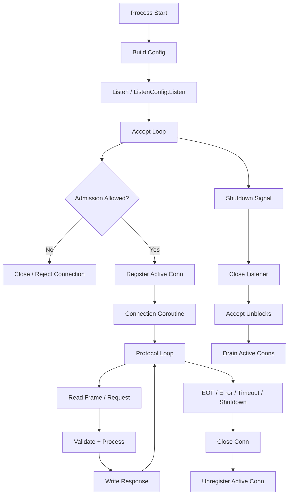
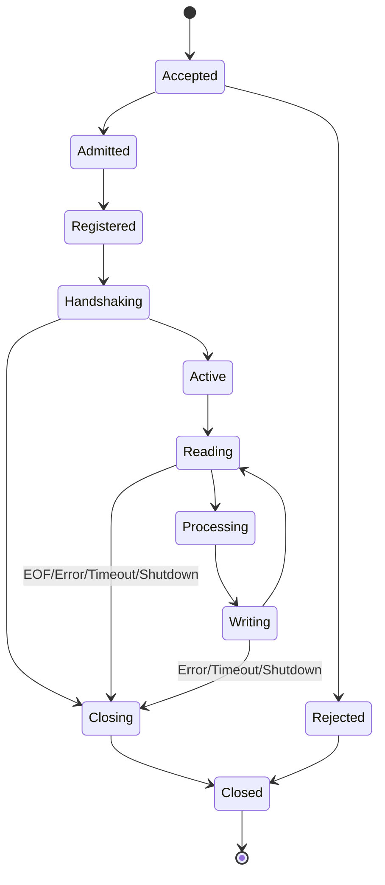
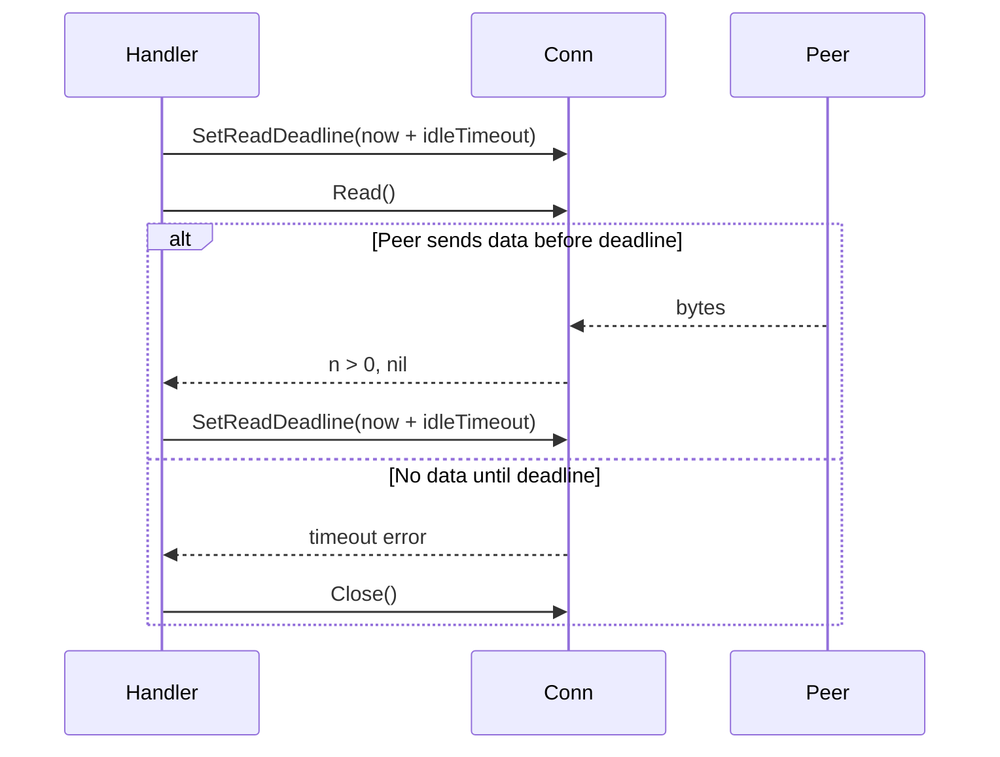
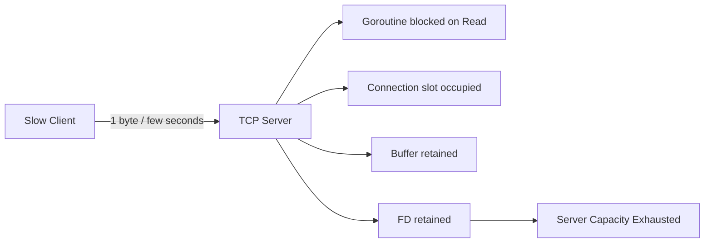
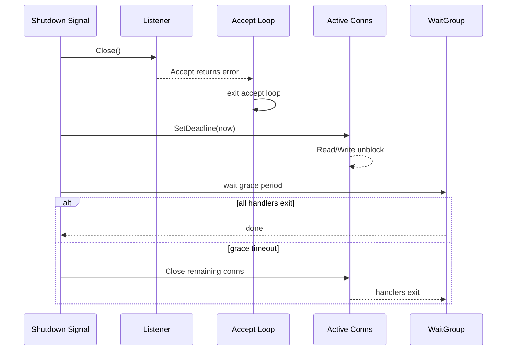
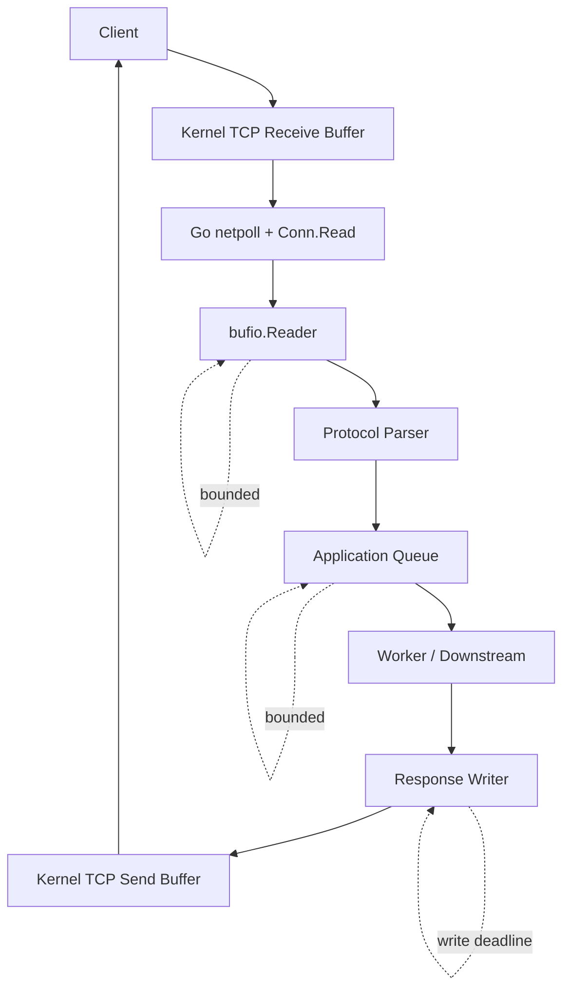

# learn-go-io-buffer-byte-stream-file-network-data-transfer-part-023.md

# Part 023 — TCP Servers: Accept Loop, Connection Lifecycle, Half-Close, Slow Client Defense

> Series: `learn-go-io-buffer-byte-stream-file-network-data-transfer`  
> Target: Go 1.26.x  
> Audience: Java software engineer yang ingin memahami Go IO/networking sampai level production engineering  
> Status seri: **belum selesai** — ini Part 023 dari 034

---

## 0. Posisi Part Ini di Dalam Series

Pada part sebelumnya kita sudah membangun fondasi networking Go:

- `net.Conn` sebagai stream dua arah.
- `net.Listener` sebagai endpoint penerima koneksi.
- `net.Dialer` dan address model.
- DNS, timeout, deadline, context, dan error taxonomy.
- `netip` sebagai model address modern.

Part ini naik satu level: **bagaimana membangun TCP server sendiri secara benar**.

Bukan hanya:

```go
ln, _ := net.Listen("tcp", ":9000")
for {
    conn, _ := ln.Accept()
    go handle(conn)
}
```

Itu contoh minimal. Production server butuh jawaban untuk pertanyaan yang lebih keras:

1. Bagaimana server berhenti dengan rapi?
2. Bagaimana `Accept` keluar saat shutdown?
3. Bagaimana membatasi jumlah connection aktif?
4. Bagaimana melawan slow client?
5. Bagaimana membedakan error normal shutdown vs error operasional?
6. Bagaimana memastikan setiap connection ditutup?
7. Bagaimana memodelkan protocol loop agar tidak hang selamanya?
8. Bagaimana melakukan half-close bila protocol membutuhkan EOF arah tulis?
9. Bagaimana mengobservasi bytes, latency, timeout, EOF, dan active connection?
10. Bagaimana membuat TCP server testable tanpa membuka port publik?

Mental model part ini:

```text
TCP server adalah resource manager.

Bukan sekadar fungsi yang membaca socket.
Ia mengelola:
- listener lifecycle
- accept loop
- connection admission
- per-connection protocol loop
- deadline
- cancellation
- close ordering
- resource accounting
- overload behavior
- observability
```

---

## 1. TCP Server dalam Go: Bentuk Dasar

Package `net` menyediakan interface portable untuk network I/O, termasuk TCP/IP, UDP, DNS, dan Unix domain socket. Untuk server TCP, bentuk dasar yang paling sering dipakai adalah:

```go
ln, err := net.Listen("tcp", ":9000")
if err != nil {
    return err
}
defer ln.Close()

for {
    conn, err := ln.Accept()
    if err != nil {
        return err
    }

    go func() {
        defer conn.Close()
        handle(conn)
    }()
}
```

Komponen utamanya:

| Komponen | Tipe | Peran |
|---|---|---|
| listener | `net.Listener` | menerima connection baru |
| connection | `net.Conn` | stream dua arah per client |
| accept loop | `for { Accept() }` | admission loop |
| handler | function | protocol/application logic |
| goroutine | scheduling unit | concurrency per connection atau per task |
| deadline | `SetDeadline`, `SetReadDeadline`, `SetWriteDeadline` | batas waktu operasi socket |
| close | `Close()` | release descriptor/socket |

Namun bentuk minimal ini punya banyak kelemahan jika langsung dipakai di production:

- connection tak terbatas;
- tidak ada graceful shutdown;
- tidak ada read/write deadline;
- slow client bisa menggantung goroutine;
- error `Accept` tidak diklasifikasikan;
- tidak ada observability;
- handler tidak diberi control plane;
- close error diabaikan total;
- tidak ada policy overload.

---

## 2. Java Engineer Mapping: ServerSocket vs net.Listener

Jika Anda datang dari Java:

| Java | Go | Catatan |
|---|---|---|
| `ServerSocket` | `net.Listener` / `*net.TCPListener` | menerima koneksi masuk |
| `Socket` | `net.Conn` / `*net.TCPConn` | stream dua arah |
| `InputStream` | `io.Reader` via `conn.Read` | read bytes |
| `OutputStream` | `io.Writer` via `conn.Write` | write bytes |
| socket timeout | `SetReadDeadline` / `SetWriteDeadline` | Go deadline berbasis absolute time |
| thread per connection | goroutine per connection | lebih ringan, tapi tetap harus dibatasi |
| `ExecutorService` | semaphore / worker pool / goroutine control | Go tidak otomatis membatasi goroutine |
| `close()` | `Close()` | release OS resource |
| `shutdownOutput()` | `(*net.TCPConn).CloseWrite()` | TCP half-close |
| `shutdownInput()` | `(*net.TCPConn).CloseRead()` | TCP half-close sisi read |

Perbedaan besar:

Di Java klasik, Anda sering membawa mental model “thread mahal, pool wajib”. Di Go, goroutine lebih murah, tapi **bukan gratis**. Connection tetap memakai:

- file descriptor/socket;
- kernel buffer;
- heap object;
- goroutine stack;
- application buffer;
- metric/log cardinality;
- scheduler time;
- mungkin TLS state;
- mungkin session state.

Jadi prinsipnya bukan “hindari goroutine”, melainkan:

```text
Boleh goroutine per connection,
tetapi admission, deadline, memory, dan shutdown harus dikontrol.
```

---

## 3. Arsitektur TCP Server Production-Grade

Gambaran high-level:



Production TCP server biasanya punya dua plane:

| Plane | Isi | Contoh |
|---|---|---|
| data plane | bytes/protocol traffic | `Read`, parse, process, `Write` |
| control plane | lifecycle dan policy | shutdown, deadline, limits, metrics |

Kesalahan umum adalah semua ditaruh dalam handler tanpa control plane yang jelas.

---

## 4. Tiga Boundary Penting: Listener, Admission, Handler

TCP server sehat memiliki tiga boundary eksplisit.

### 4.1 Listener Boundary

Listener menjawab:

- address mana yang dibuka?
- network type apa? `tcp`, `tcp4`, `tcp6`?
- socket option apa?
- kapan listener ditutup?
- bagaimana `Accept` keluar saat shutdown?

### 4.2 Admission Boundary

Admission menjawab:

- apakah connection baru diterima?
- berapa maksimum connection aktif?
- apa yang terjadi saat overload?
- apakah client tertentu diblokir?
- apakah connection perlu pre-read handshake?
- apakah ada rate limit per IP?

### 4.3 Handler Boundary

Handler menjawab:

- bagaimana protocol dibaca?
- deadline apa yang dipasang?
- bagaimana framing divalidasi?
- apakah request bisa diproses paralel?
- kapan connection ditutup?
- error mana yang log level `debug`, `info`, `warn`, atau `error`?

---

## 5. `net.Listen` vs `net.ListenConfig`

Untuk server sederhana:

```go
ln, err := net.Listen("tcp", ":9000")
```

Untuk server yang butuh context dan konfigurasi listen lebih eksplisit:

```go
var lc net.ListenConfig
ln, err := lc.Listen(ctx, "tcp", ":9000")
```

`ListenConfig` berguna untuk:

- membawa `context.Context` ke operasi listen;
- mengatur keepalive behavior melalui field yang tersedia di versi Go modern;
- memakai `Control` untuk konfigurasi socket-level tertentu;
- membuat binding behavior lebih eksplisit.

Namun jangan salah paham:

```text
Context pada ListenConfig.Listen mengontrol operasi listen setup,
bukan otomatis menjadi context untuk semua accepted connections.
```

Context per connection tetap harus Anda desain sendiri.

---

## 6. Listener Type: `net.Listener` vs `*net.TCPListener`

`net.Listen("tcp", addr)` mengembalikan `net.Listener`. Concrete type-nya biasanya `*net.TCPListener` untuk TCP.

Gunakan interface `net.Listener` jika Anda ingin:

- testability;
- abstraction;
- TLS wrapping;
- custom listener;
- dependency injection.

Gunakan concrete `*net.TCPListener` jika Anda perlu method TCP-specific seperti:

- `SetDeadline` pada listener;
- `AcceptTCP`;
- `File` untuk duplicate file descriptor use case khusus.

Contoh type assertion:

```go
tcpLn, ok := ln.(*net.TCPListener)
if !ok {
    return fmt.Errorf("listener is not TCPListener: %T", ln)
}
_ = tcpLn
```

Tetapi jangan melakukan type assertion tanpa alasan. Banyak server cukup memakai `net.Listener`.

---

## 7. Accept Loop yang Benar

Accept loop minimal:

```go
for {
    conn, err := ln.Accept()
    if err != nil {
        return err
    }
    go handle(conn)
}
```

Accept loop production perlu:

1. tahu kapan shutdown;
2. tahu kapan error listener normal;
3. punya backoff untuk error sementara;
4. punya admission control;
5. tidak leak connection bila goroutine gagal dibuat;
6. punya logging/metric yang proporsional.

Contoh accept loop lebih realistis:

```go
func serve(ctx context.Context, ln net.Listener, h func(context.Context, net.Conn)) error {
    var wg sync.WaitGroup
    defer wg.Wait()

    go func() {
        <-ctx.Done()
        _ = ln.Close() // unblock Accept
    }()

    for {
        conn, err := ln.Accept()
        if err != nil {
            if ctx.Err() != nil {
                return nil
            }
            if errors.Is(err, net.ErrClosed) {
                return nil
            }
            return fmt.Errorf("accept: %w", err)
        }

        wg.Add(1)
        go func() {
            defer wg.Done()
            defer conn.Close()
            h(ctx, conn)
        }()
    }
}
```

Catatan penting:

- `ln.Close()` biasanya membuat blocking `Accept` keluar.
- Saat shutdown, error dari `Accept` bukan selalu operational failure.
- `net.ErrClosed` adalah sentinel error yang bisa dipakai dengan `errors.Is` untuk operasi network pada connection/listener yang sudah ditutup.

---

## 8. Accept Error Classification

Error pada `Accept` bisa berarti banyak hal:

| Kondisi | Interpretasi | Respons |
|---|---|---|
| listener ditutup saat shutdown | expected | return nil |
| context canceled lalu listener ditutup | expected | return nil |
| temporary resource issue | mungkin transient | log + backoff |
| file descriptor exhausted | overload / leak / limit rendah | alert + backoff atau fail |
| permission/bind issue saat startup | fatal | fail startup |
| unexpected syscall error | operational issue | log error + policy |

Pattern backoff sederhana:

```go
var tempDelay time.Duration

for {
    conn, err := ln.Accept()
    if err != nil {
        if ctx.Err() != nil || errors.Is(err, net.ErrClosed) {
            return nil
        }

        tempDelay = nextAcceptDelay(tempDelay)
        log.Printf("accept failed: err=%v retry_in=%s", err, tempDelay)

        select {
        case <-time.After(tempDelay):
            continue
        case <-ctx.Done():
            _ = ln.Close()
            return nil
        }
    }

    tempDelay = 0
    _ = conn
}

func nextAcceptDelay(prev time.Duration) time.Duration {
    if prev == 0 {
        return 5 * time.Millisecond
    }
    prev *= 2
    if prev > time.Second {
        return time.Second
    }
    return prev
}
```

Tetapi jangan menggunakan backoff untuk menyembunyikan bug fatal. Jika `Accept` gagal terus karena FD exhausted, server Anda sudah sakit. Backoff hanya mencegah tight error loop.

---

## 9. Admission Control: Jangan Terima Semua Koneksi Tanpa Batas

Anti-pattern:

```go
for {
    conn, _ := ln.Accept()
    go handle(conn)
}
```

Dengan traffic normal, terlihat baik. Dengan traffic abnormal, server bisa:

- kehabisan file descriptor;
- membuat terlalu banyak goroutine;
- mengalokasikan buffer terlalu banyak;
- overload downstream;
- timeout semua connection sehat;
- sulit shutdown.

### 9.1 Semaphore Admission

Pattern paling sederhana:

```go
type ConnLimiter struct {
    sem chan struct{}
}

func NewConnLimiter(max int) *ConnLimiter {
    return &ConnLimiter{sem: make(chan struct{}, max)}
}

func (l *ConnLimiter) TryAcquire() bool {
    select {
    case l.sem <- struct{}{}:
        return true
    default:
        return false
    }
}

func (l *ConnLimiter) Release() {
    <-l.sem
}
```

Dipakai saat accept:

```go
if !limiter.TryAcquire() {
    _ = conn.Close()
    metricsRejected.Inc()
    continue
}

wg.Add(1)
go func() {
    defer wg.Done()
    defer limiter.Release()
    defer conn.Close()
    handle(ctx, conn)
}()
```

Policy overload harus eksplisit:

| Policy | Cocok untuk | Risiko |
|---|---|---|
| close immediately | protocol internal, simple | client melihat reset/EOF |
| write error frame lalu close | framed protocol | butuh deadline write |
| accept but queue | short burst | memory/latency meningkat |
| block accept | backpressure ke kernel backlog | bisa membuat connection timeout |
| rate limit per IP | public service | butuh identity/IP extraction |

### 9.2 Jangan Blocking Admission Terlalu Lama

Jika Anda melakukan:

```go
limiter.Acquire() // blocking
conn, err := ln.Accept()
```

Anda menunda accept saat penuh. Ini bisa menjadi bentuk backpressure, tapi juga bisa memenuhi kernel listen backlog. Untuk banyak service, lebih baik accept lalu reject cepat, atau memakai policy yang jelas.

---

## 10. Connection Lifecycle

Setiap accepted connection sebaiknya punya lifecycle eksplisit:



Checklist setiap connection:

| Step | Harus jelas? | Pertanyaan |
|---|---:|---|
| accepted | yes | dari listener mana? |
| admitted | yes | masuk limit atau ditolak? |
| registered | yes | dihitung sebagai active? |
| deadline set | yes | idle/read/write timeout berapa? |
| protocol loop start | yes | framing apa? |
| shutdown path | yes | context done bereaksi bagaimana? |
| close | yes | siapa owner close? |
| unregister | yes | metric active turun? |
| log summary | recommended | bytes, duration, reason? |

---

## 11. Connection Handler: Bentuk yang Lebih Aman

Handler yang buruk:

```go
func handle(conn net.Conn) {
    buf := make([]byte, 4096)
    for {
        n, err := conn.Read(buf)
        if err != nil {
            return
        }
        conn.Write(buf[:n])
    }
}
```

Masalah:

- tidak ada deadline;
- short write tidak ditangani;
- error write diabaikan;
- shutdown context tidak diperiksa;
- buffer allocation per connection tanpa policy;
- tidak ada max message size;
- protocol tidak punya framing;
- EOF disamakan dengan error fatal;
- no observability.

Handler lebih baik untuk echo-style protocol:

```go
func handleEcho(ctx context.Context, conn net.Conn, cfg ConnConfig) error {
    defer conn.Close()

    r := bufio.NewReaderSize(conn, cfg.ReadBufferSize)
    w := bufio.NewWriterSize(conn, cfg.WriteBufferSize)
    defer w.Flush() // best effort; final error still should be observed in real protocol

    for {
        if err := conn.SetReadDeadline(time.Now().Add(cfg.ReadIdleTimeout)); err != nil {
            return fmt.Errorf("set read deadline: %w", err)
        }

        line, err := readBoundedLine(r, cfg.MaxLineBytes)
        if len(line) > 0 {
            if err := conn.SetWriteDeadline(time.Now().Add(cfg.WriteTimeout)); err != nil {
                return fmt.Errorf("set write deadline: %w", err)
            }

            if _, werr := w.Write(line); werr != nil {
                return fmt.Errorf("write response: %w", werr)
            }
            if ferr := w.Flush(); ferr != nil {
                return fmt.Errorf("flush response: %w", ferr)
            }
        }

        if err != nil {
            if errors.Is(err, io.EOF) {
                return nil
            }
            return err
        }

        select {
        case <-ctx.Done():
            return ctx.Err()
        default:
        }
    }
}
```

Kita akan membahas `readBoundedLine` di bawah.

---

## 12. Deadline adalah Pertahanan Utama terhadap Connection yang Menggantung

Pada TCP, `Read` bisa blocking lama sekali. `Write` juga bisa blocking jika peer tidak membaca atau buffer penuh.

Go menyediakan:

| Method | Efek |
|---|---|
| `SetDeadline(t)` | set deadline read dan write |
| `SetReadDeadline(t)` | set deadline read saja |
| `SetWriteDeadline(t)` | set deadline write saja |

Deadline memakai **absolute time**, bukan duration. Artinya:

```go
conn.SetReadDeadline(time.Now().Add(30 * time.Second))
```

Jika ingin idle timeout, deadline harus diperbarui setiap operasi.



### 12.1 Timeout Bukan Selalu Fatal Secara Global

Timeout pada satu connection biasanya hanya fatal untuk connection itu, bukan server.

| Timeout | Makna umum | Respons |
|---|---|---|
| read idle timeout | client diam terlalu lama | close conn |
| read header timeout | client kirim frame terlalu lambat | close conn |
| write timeout | client/downstream tidak menerima | close conn |
| handshake timeout | initial protocol tidak selesai | close conn |
| server shutdown timeout | drain terlalu lama | force close active conns |

### 12.2 Cara Mengecek Timeout

Umumnya:

```go
if err != nil {
    var ne net.Error
    if errors.As(err, &ne) && ne.Timeout() {
        return fmt.Errorf("connection timeout: %w", err)
    }
    return err
}
```

Jangan hanya string matching `"timeout"`.

---

## 13. Slow Client Defense

Slow client adalah client yang membuka connection tetapi:

- mengirim header/request sangat lambat;
- mengirim body tanpa akhir;
- tidak membaca response;
- membuat server menahan goroutine/buffer;
- melewati rate limit berbasis request karena request tidak pernah selesai.



Defense layer:

| Layer | Defense |
|---|---|
| accept | max active connection |
| handshake | handshake timeout |
| read | read idle deadline |
| protocol | max frame/message size |
| write | write deadline |
| memory | bounded buffer |
| logging | do not log every byte/error loudly |
| metrics | active conns, timeouts, rejects |

### 13.1 Bounded Line Reader

Jika protocol line-based, jangan `ReadString('\n')` tanpa batas untuk untrusted input.

Contoh bounded line reader:

```go
func readBoundedLine(r *bufio.Reader, max int) ([]byte, error) {
    if max <= 0 {
        return nil, fmt.Errorf("invalid max line size: %d", max)
    }

    var out []byte
    for {
        frag, err := r.ReadSlice('\n')
        out = append(out, frag...)

        if len(out) > max {
            return nil, fmt.Errorf("line too large: limit=%d", max)
        }

        if errors.Is(err, bufio.ErrBufferFull) {
            continue
        }
        if err != nil {
            return out, err
        }
        return out, nil
    }
}
```

Untuk high-performance, hindari `append` tak terbatas dan desain parser yang bisa menolak lebih awal. Namun pattern ini cukup menunjukkan prinsip:

```text
Text protocol harus punya batas ukuran.
```

---

## 14. Protocol Loop: Jangan Samakan TCP dengan Message

TCP adalah byte stream, bukan message stream.

Artinya:

- satu `Write` client bisa terbaca sebagai beberapa `Read` server;
- beberapa `Write` client bisa tergabung dalam satu `Read` server;
- boundary message harus dibuat oleh protocol;
- parser harus tahan partial frame.

Bad assumption:

```go
n, _ := conn.Read(buf)
// menganggap buf[:n] adalah satu request lengkap
```

Benar:

```text
TCP gives ordered bytes.
Your protocol defines message boundaries.
```

Boundary dapat berupa:

| Framing | Cocok untuk | Risiko |
|---|---|---|
| newline delimiter | text command sederhana | escaping, long line |
| length-prefix | binary/JSON frame | max length wajib |
| fixed-size frame | telemetry sederhana | tidak fleksibel |
| sentinel delimiter | legacy protocol | delimiter collision |
| chunked frame | large transfer | state machine lebih kompleks |

Part 018 sudah membahas protocol design. Di TCP server, prinsip itu menjadi operasional.

---

## 15. Line-Based TCP Server: Contoh Lengkap yang Lebih Realistis

Contoh ini bukan framework. Tujuannya memperlihatkan struktur server yang bisa dikembangkan.

```go
package tcpserver

import (
    "bufio"
    "context"
    "errors"
    "fmt"
    "io"
    "log/slog"
    "net"
    "sync"
    "time"
)

type Config struct {
    Addr              string
    MaxConns          int
    ReadBufferSize    int
    WriteBufferSize   int
    MaxLineBytes      int
    ReadIdleTimeout   time.Duration
    WriteTimeout      time.Duration
    ShutdownGrace     time.Duration
}

type Server struct {
    cfg Config
    log *slog.Logger

    ln net.Listener

    sem chan struct{}
    wg  sync.WaitGroup

    mu     sync.Mutex
    conns  map[net.Conn]struct{}
    closed bool
}

func New(cfg Config, log *slog.Logger) (*Server, error) {
    if cfg.Addr == "" {
        return nil, fmt.Errorf("addr is required")
    }
    if cfg.MaxConns <= 0 {
        return nil, fmt.Errorf("max conns must be positive")
    }
    if cfg.ReadBufferSize <= 0 {
        cfg.ReadBufferSize = 4096
    }
    if cfg.WriteBufferSize <= 0 {
        cfg.WriteBufferSize = 4096
    }
    if cfg.MaxLineBytes <= 0 {
        cfg.MaxLineBytes = 64 * 1024
    }
    if cfg.ReadIdleTimeout <= 0 {
        cfg.ReadIdleTimeout = 30 * time.Second
    }
    if cfg.WriteTimeout <= 0 {
        cfg.WriteTimeout = 10 * time.Second
    }
    if cfg.ShutdownGrace <= 0 {
        cfg.ShutdownGrace = 10 * time.Second
    }
    if log == nil {
        log = slog.Default()
    }

    return &Server{
        cfg:   cfg,
        log:   log,
        sem:   make(chan struct{}, cfg.MaxConns),
        conns: make(map[net.Conn]struct{}),
    }, nil
}

func (s *Server) ListenAndServe(ctx context.Context) error {
    var lc net.ListenConfig

    ln, err := lc.Listen(ctx, "tcp", s.cfg.Addr)
    if err != nil {
        return fmt.Errorf("listen %s: %w", s.cfg.Addr, err)
    }

    s.mu.Lock()
    if s.closed {
        s.mu.Unlock()
        _ = ln.Close()
        return net.ErrClosed
    }
    s.ln = ln
    s.mu.Unlock()

    s.log.Info("tcp server listening", "addr", ln.Addr().String())

    go func() {
        <-ctx.Done()
        _ = s.Close()
    }()

    err = s.acceptLoop(ctx, ln)
    s.waitForHandlers()
    return err
}

func (s *Server) acceptLoop(ctx context.Context, ln net.Listener) error {
    var tempDelay time.Duration

    for {
        conn, err := ln.Accept()
        if err != nil {
            if ctx.Err() != nil || errors.Is(err, net.ErrClosed) {
                return nil
            }

            tempDelay = nextAcceptDelay(tempDelay)
            s.log.Warn("accept failed", "err", err, "retry_in", tempDelay)

            select {
            case <-time.After(tempDelay):
                continue
            case <-ctx.Done():
                _ = ln.Close()
                return nil
            }
        }

        tempDelay = 0

        if !s.tryAcquire() {
            s.log.Warn("connection rejected: max connections reached", "remote", conn.RemoteAddr().String())
            _ = conn.Close()
            continue
        }

        s.register(conn)

        s.wg.Add(1)
        go func() {
            defer s.wg.Done()
            defer s.release()
            defer s.unregister(conn)
            defer conn.Close()

            started := time.Now()
            err := s.handleConn(ctx, conn)
            duration := time.Since(started)

            if err != nil && !errors.Is(err, io.EOF) && ctx.Err() == nil {
                s.log.Info("connection closed with error",
                    "remote", conn.RemoteAddr().String(),
                    "duration", duration,
                    "err", err,
                )
                return
            }

            s.log.Debug("connection closed",
                "remote", conn.RemoteAddr().String(),
                "duration", duration,
            )
        }()
    }
}

func (s *Server) handleConn(ctx context.Context, conn net.Conn) error {
    r := bufio.NewReaderSize(conn, s.cfg.ReadBufferSize)
    w := bufio.NewWriterSize(conn, s.cfg.WriteBufferSize)

    for {
        if err := conn.SetReadDeadline(time.Now().Add(s.cfg.ReadIdleTimeout)); err != nil {
            return fmt.Errorf("set read deadline: %w", err)
        }

        line, err := readBoundedLine(r, s.cfg.MaxLineBytes)
        if len(line) > 0 {
            response := handleCommand(line)

            if err := conn.SetWriteDeadline(time.Now().Add(s.cfg.WriteTimeout)); err != nil {
                return fmt.Errorf("set write deadline: %w", err)
            }

            if _, werr := w.Write(response); werr != nil {
                return fmt.Errorf("write response: %w", werr)
            }
            if ferr := w.Flush(); ferr != nil {
                return fmt.Errorf("flush response: %w", ferr)
            }
        }

        if err != nil {
            if errors.Is(err, io.EOF) {
                return nil
            }

            var ne net.Error
            if errors.As(err, &ne) && ne.Timeout() {
                return fmt.Errorf("read timeout: %w", err)
            }

            return fmt.Errorf("read request: %w", err)
        }

        select {
        case <-ctx.Done():
            return ctx.Err()
        default:
        }
    }
}

func (s *Server) Close() error {
    s.mu.Lock()
    if s.closed {
        s.mu.Unlock()
        return nil
    }
    s.closed = true
    ln := s.ln
    for conn := range s.conns {
        _ = conn.SetDeadline(time.Now()) // unblock current Read/Write
    }
    s.mu.Unlock()

    if ln != nil {
        return ln.Close()
    }
    return nil
}

func (s *Server) waitForHandlers() {
    done := make(chan struct{})
    go func() {
        s.wg.Wait()
        close(done)
    }()

    select {
    case <-done:
    case <-time.After(s.cfg.ShutdownGrace):
        s.mu.Lock()
        for conn := range s.conns {
            _ = conn.Close()
        }
        s.mu.Unlock()
        <-done
    }
}

func (s *Server) tryAcquire() bool {
    select {
    case s.sem <- struct{}{}:
        return true
    default:
        return false
    }
}

func (s *Server) release() {
    <-s.sem
}

func (s *Server) register(conn net.Conn) {
    s.mu.Lock()
    s.conns[conn] = struct{}{}
    s.mu.Unlock()
}

func (s *Server) unregister(conn net.Conn) {
    s.mu.Lock()
    delete(s.conns, conn)
    s.mu.Unlock()
}

func nextAcceptDelay(prev time.Duration) time.Duration {
    if prev == 0 {
        return 5 * time.Millisecond
    }
    prev *= 2
    if prev > time.Second {
        return time.Second
    }
    return prev
}

func readBoundedLine(r *bufio.Reader, max int) ([]byte, error) {
    var out []byte
    for {
        frag, err := r.ReadSlice('\n')
        out = append(out, frag...)

        if len(out) > max {
            return nil, fmt.Errorf("line too large: limit=%d", max)
        }
        if errors.Is(err, bufio.ErrBufferFull) {
            continue
        }
        return out, err
    }
}

func handleCommand(line []byte) []byte {
    // Contoh sederhana. Production code harus parse command dengan state machine jelas.
    if string(line) == "PING\n" || string(line) == "PING\r\n" {
        return []byte("PONG\n")
    }
    return []byte("ERR unknown command\n")
}
```

Contoh ini masih sederhana, tetapi sudah menunjukkan prinsip:

- listener lifecycle dikontrol;
- accept loop bisa berhenti;
- active connection dibatasi;
- connection diregister untuk shutdown;
- deadline dipasang;
- line size dibatasi;
- write error dicek;
- flush error dicek;
- shutdown punya grace period;
- context dan close saling bekerja.

---

## 16. Close Ordering

Close ordering sering diremehkan.

Pada server:

1. Stop menerima connection baru.
2. Biarkan connection aktif selesai dalam batas waktu.
3. Paksa unblock connection yang masih stuck.
4. Tutup connection tersisa.
5. Tunggu goroutine selesai.
6. Flush log/metrics bila perlu.

Diagram:



Kenapa `SetDeadline(time.Now())` sering dipakai saat shutdown?

Karena handler bisa sedang blocking pada `Read` atau `Write`. Setting deadline ke waktu sekarang membuat operasi tersebut segera timeout/unblock pada banyak implementasi connection. Setelah itu handler bisa melihat context/shutdown dan keluar.

---

## 17. Half-Close: `CloseRead` dan `CloseWrite`

TCP mendukung half-close:

- close write side: “saya selesai mengirim, tapi masih mau membaca”;
- close read side: “saya tidak mau membaca lagi”.

Di Go, `*net.TCPConn` punya:

```go
func (c *TCPConn) CloseRead() error
func (c *TCPConn) CloseWrite() error
```

Use case:

- protocol request body selesai dikirim, tapi response masih ditunggu;
- proxying data satu arah;
- legacy protocol yang memakai EOF sebagai sinyal akhir input;
- graceful TCP shutdown tanpa langsung menutup seluruh socket.

Contoh:

```go
func closeWriteIfTCP(conn net.Conn) error {
    tcp, ok := conn.(*net.TCPConn)
    if !ok {
        return conn.Close()
    }
    return tcp.CloseWrite()
}
```

Hati-hati:

- tidak semua `net.Conn` mendukung half-close;
- `tls.Conn` tidak sama dengan raw `*net.TCPConn` untuk half-close semantics;
- kebanyakan application protocol lebih aman memakai explicit frame/end marker daripada EOF transport;
- half-close bisa membingungkan load balancer/proxy jika tidak dipahami.

Rule praktis:

```text
Gunakan half-close hanya jika protocol memang mensyaratkannya.
Untuk kebanyakan server aplikasi, Close biasa lebih sederhana dan aman.
```

---

## 18. TCP Keepalive Bukan Pengganti Application Timeout

Keepalive membantu mendeteksi peer mati pada level transport dalam beberapa kondisi. Namun keepalive:

- default interval bisa lama;
- tidak memahami application-level idle;
- tidak membatasi request lambat;
- tidak menggantikan read/write deadline;
- berbeda antar OS.

Gunakan keepalive sebagai lapisan tambahan, bukan satu-satunya defense.

| Kebutuhan | Tool utama |
|---|---|
| client tidak kirim request | read deadline |
| client tidak baca response | write deadline |
| peer mati diam-diam | keepalive + deadline |
| overload connection | admission limit |
| protocol body terlalu besar | max frame/body size |

---

## 19. Buffering di TCP Server

`bufio.Reader` dan `bufio.Writer` sering dipakai pada TCP server.

Manfaat:

- mengurangi syscall untuk small reads/writes;
- memudahkan line protocol;
- menyediakan `Peek`, `ReadSlice`, `ReadString`;
- batching response kecil.

Risiko:

- data tertahan jika lupa `Flush`;
- error write mungkin muncul saat `Flush`, bukan saat `Write`;
- buffer per connection bisa memperbesar memory footprint;
- reader bisa membaca lebih banyak dari yang dipakai parser;
- mixing direct conn read dengan bufio reader bisa merusak protocol.

### 19.1 Jangan Campur Direct Read dengan Buffered Read

Anti-pattern:

```go
r := bufio.NewReader(conn)
line, _ := r.ReadString('\n')

// Salah: sebagian bytes mungkin sudah berada di buffer r.
n, _ := conn.Read(buf)
```

Benar:

```go
r := bufio.NewReader(conn)
line, _ := r.ReadString('\n')
n, _ := r.Read(buf)
```

Atau jangan pakai `bufio` sama sekali jika protocol framing manual membutuhkan kontrol penuh.

### 19.2 Memory Budget Buffer

Jika server punya 10.000 connection dan setiap connection punya:

- read buffer 4 KiB;
- write buffer 4 KiB;

maka buffer saja sekitar:

```text
10,000 × 8 KiB = 80 MiB
```

Belum termasuk goroutine stack, protocol state, TLS state, kernel buffer, dan application state.

Jadi buffer size adalah kapasitas, bukan angka dekoratif.

---

## 20. Goroutine per Connection: Kapan Cukup, Kapan Tidak

Go idiom yang umum:

```go
go handle(conn)
```

Ini baik untuk banyak server karena:

- simple;
- isolation per connection;
- cocok dengan blocking IO;
- runtime network poller membuat blocking network IO tidak mengikat OS thread terus-menerus.

Namun perlu kontrol jika:

- connection sangat banyak;
- handler melakukan CPU-heavy processing;
- handler memanggil downstream lambat;
- per-connection memory besar;
- protocol mendukung multiplexing;
- workload butuh fairness antar tenant/client.

Pattern tambahan:

| Problem | Pattern |
|---|---|
| terlalu banyak connection | connection semaphore |
| CPU-heavy request | worker pool downstream |
| per-client abuse | per-IP rate limit |
| slow write | write deadline |
| request lebih cepat dari process | bounded queue / backpressure |
| expensive parser | max size + early reject |

Jangan mengganti semua dengan worker pool hanya karena terbiasa dengan Java. Di Go, worker pool untuk connection sering membuat desain lebih rumit. Yang wajib adalah **boundedness**, bukan selalu pool.

---

## 21. Backpressure Model

TCP sudah punya transport-level backpressure melalui receive window. Tetapi application tetap perlu backpressure sendiri.



Backpressure rusak jika Anda membuat unbounded queue:

```go
requests := make(chan Request) // unbuffered is bounded; large/infinite abstraction is not
```

Atau:

```go
var all []Request
for {
    req := readReq()
    all = append(all, req) // unbounded memory growth
}
```

TCP server yang baik mengalirkan tekanan balik:

- jika downstream lambat, jangan terus baca request tanpa batas;
- jika response tidak bisa dikirim, timeout connection;
- jika queue penuh, reject atau close;
- jika client terlalu cepat, protocol harus punya window/limit.

---

## 22. Logging TCP Server: Jangan Membanjiri Log

Koneksi TCP bisa menghasilkan banyak event. Jika semua error di-log sebagai `ERROR`, production akan noisy.

Classification:

| Event | Level umum |
|---|---|
| normal EOF | debug/none |
| client timeout | info/debug tergantung volume |
| max line exceeded | warn/info tergantung threat model |
| malformed frame | info/warn |
| write timeout | info |
| accept fatal | error |
| listener startup fail | error/fatal |
| FD exhausted | error/alert |
| panic in handler | error |

Log summary lebih berguna daripada log per read:

```text
remote=10.0.1.5:41234 duration=4.2s bytes_in=1204 bytes_out=98 requests=3 close_reason=idle_timeout
```

Hindari:

- log payload sensitif;
- log setiap byte/frame di level info;
- metric label berisi full remote address jika cardinality tinggi;
- stacktrace untuk normal EOF.

---

## 23. Metrics yang Penting

Minimal metrics untuk TCP server:

| Metric | Tipe | Makna |
|---|---|---|
| `tcp_connections_active` | gauge | connection aktif |
| `tcp_connections_total` | counter | connection diterima |
| `tcp_connections_rejected_total` | counter | overload/admission reject |
| `tcp_connection_duration_seconds` | histogram | umur connection |
| `tcp_bytes_read_total` | counter | traffic masuk |
| `tcp_bytes_written_total` | counter | traffic keluar |
| `tcp_read_timeouts_total` | counter | slow/idle client |
| `tcp_write_timeouts_total` | counter | client tidak membaca |
| `tcp_protocol_errors_total` | counter | malformed frame/request |
| `tcp_accept_errors_total` | counter | error pada accept |
| `tcp_shutdown_forced_total` | counter | connection dipaksa close saat shutdown |

Metrics harus dikaitkan dengan SLO:

- Apakah reject meningkat?
- Apakah timeout meningkat?
- Apakah active connection mendekati max?
- Apakah duration connection abnormal?
- Apakah bytes out stagnan sementara active naik?

---

## 24. Instrumented Conn Wrapper

Untuk menghitung bytes read/write, Anda bisa wrap `net.Conn`:

```go
type CountingConn struct {
    net.Conn
    BytesRead    atomic.Int64
    BytesWritten atomic.Int64
}

func (c *CountingConn) Read(p []byte) (int, error) {
    n, err := c.Conn.Read(p)
    if n > 0 {
        c.BytesRead.Add(int64(n))
    }
    return n, err
}

func (c *CountingConn) Write(p []byte) (int, error) {
    n, err := c.Conn.Write(p)
    if n > 0 {
        c.BytesWritten.Add(int64(n))
    }
    return n, err
}
```

Karena `net.Conn` adalah interface, wrapping seperti ini natural di Go.

Hati-hati:

- wrapper harus preserve semantics;
- jangan mengubah partial read/write behavior;
- jangan swallow error;
- jangan menambahkan lock berat di hot path tanpa alasan;
- metric update per byte terlalu mahal; update per call lebih masuk akal.

---

## 25. Panic Containment

Handler connection tidak boleh menjatuhkan seluruh process karena satu bug protocol edge case.

```go
go func() {
    defer wg.Done()
    defer conn.Close()
    defer func() {
        if r := recover(); r != nil {
            log.Error("panic in connection handler", "panic", r)
        }
    }()

    handle(ctx, conn)
}()
```

Namun recover bukan pengganti correctness. Panic di handler harus dianggap bug dan diperbaiki.

Policy:

| Panic source | Respons |
|---|---|
| parser bug | fix + add fuzz test |
| nil state | fix lifecycle invariant |
| downstream bug | isolate + return error |
| programmer error | fail fast in tests, recover in production boundary |

---

## 26. Security Lens TCP Server

TCP server sering menjadi direct attack surface.

Threat model:

| Threat | Defense |
|---|---|
| connection flood | max conns, backlog tuning, firewall/LB |
| slowloris-style TCP client | read/write deadline |
| giant frame | max frame size |
| malformed frame | strict parser + fuzzing |
| protocol confusion | magic/version/handshake |
| unauthenticated command | auth handshake / token / TLS client cert |
| replay request | nonce/idempotency if needed |
| log injection | sanitize control chars |
| resource leak | defer close + active tracking |
| SSRF through proxy server | allowlist outbound target if proxying |
| data exfiltration | no payload logs, redaction |

Checklist per accepted connection:

```text
Before reading untrusted data:
- set deadline
- cap max bytes/frame
- decide auth/handshake requirement
- decide close reason classification
- ensure metrics active count increments/decrements
```

---

## 27. TLS Boundary

TCP server bisa raw TCP atau TLS-wrapped TCP.

Raw:

```go
ln, err := net.Listen("tcp", addr)
```

TLS:

```go
base, err := net.Listen("tcp", addr)
if err != nil {
    return err
}

cfg := &tls.Config{
    MinVersion: tls.VersionTLS12,
    // Certificates, ClientAuth, NextProtos, etc.
}

ln := tls.NewListener(base, cfg)
```

Handler tetap menerima `net.Conn`, tetapi concrete type bisa `*tls.Conn`.

Konsekuensi:

- handshake bisa blocking; butuh deadline;
- peer identity bisa berasal dari certificate;
- half-close raw TCP tidak selalu berlaku sama;
- bytes di app bukan bytes di wire;
- TLS errors harus diklasifikasikan;
- config TLS adalah security-critical.

TLS detail penuh bukan fokus part ini, tapi server lifecycle tetap sama:

```text
Listen -> Accept -> Admission -> Handshake -> Protocol Loop -> Close
```

---

## 28. Testing TCP Server

Testing TCP server sebaiknya memisahkan:

1. handler protocol logic;
2. listener/accept integration;
3. timeout behavior;
4. shutdown behavior;
5. overload behavior.

### 28.1 Test Handler dengan `net.Pipe`

`net.Pipe` membuat pair in-memory `net.Conn`:

```go
func TestHandlePing(t *testing.T) {
    server, client := net.Pipe()
    defer client.Close()

    ctx, cancel := context.WithCancel(context.Background())
    defer cancel()

    done := make(chan error, 1)
    go func() {
        done <- handleEcho(ctx, server, ConnConfig{
            ReadBufferSize:  1024,
            WriteBufferSize: 1024,
            MaxLineBytes:    1024,
            ReadIdleTimeout: time.Second,
            WriteTimeout:    time.Second,
        })
    }()

    _, err := client.Write([]byte("PING\n"))
    if err != nil {
        t.Fatal(err)
    }

    br := bufio.NewReader(client)
    got, err := br.ReadString('\n')
    if err != nil {
        t.Fatal(err)
    }
    if got != "PONG\n" {
        t.Fatalf("got %q", got)
    }

    _ = client.Close()
    <-done
}
```

### 28.2 Test Listener dengan Localhost Port 0

Gunakan `127.0.0.1:0` untuk meminta OS memilih port:

```go
ln, err := net.Listen("tcp", "127.0.0.1:0")
if err != nil {
    t.Fatal(err)
}
defer ln.Close()

addr := ln.Addr().String()
_ = addr
```

Ini cocok untuk integration test.

### 28.3 Test Slow Client

```go
func TestSlowClientTimesOut(t *testing.T) {
    ln, err := net.Listen("tcp", "127.0.0.1:0")
    if err != nil {
        t.Fatal(err)
    }
    defer ln.Close()

    // start server with tiny read idle timeout
    // client connects but does not send full request
    // assert server closes connection within expected bound
}
```

Jangan membuat test berbasis timing yang terlalu ketat. Gunakan duration yang cukup longgar agar tidak flaky.

---

## 29. Fuzzing Parser, Bukan Fuzzing Socket

Untuk protocol parser, pisahkan parser dari socket:

```go
func ParseFrame(r *bufio.Reader, max int) (Frame, error) {
    // parse from reader
}
```

Lalu fuzz:

```go
func FuzzParseFrame(f *testing.F) {
    f.Add([]byte("PING\n"))
    f.Add([]byte(""))
    f.Add([]byte("\xff\xfe\n"))

    f.Fuzz(func(t *testing.T, data []byte) {
        r := bufio.NewReader(bytes.NewReader(data))
        _, _ = ParseFrame(r, 4096)
    })
}
```

Tujuannya:

- parser tidak panic;
- parser tidak membaca unbounded;
- parser tidak infinite loop;
- malformed input menjadi error yang jelas;
- valid input tetap diterima.

---

## 30. Benchmark TCP Server: Apa yang Diukur?

Jangan langsung benchmark server end-to-end tanpa tahu bottleneck.

Layer benchmark:

| Layer | Benchmark |
|---|---|
| parser | bytes → frame |
| encoder | response → bytes |
| handler | request → response tanpa network |
| local TCP | client/server localhost |
| TLS | handshake + transfer |
| concurrency | N clients × M requests |
| overload | reject behavior |
| slow client | timeout behavior |

Metrics saat benchmark:

- throughput request/sec;
- p50/p95/p99 latency;
- allocation/op;
- goroutines;
- file descriptors;
- active connections;
- timeout/reject count;
- CPU profile;
- block profile;
- mutex profile jika ada shared state.

Jangan hanya melihat throughput. TCP server yang cepat tetapi tidak punya timeout adalah bom waktu.

---

## 31. Common Anti-Patterns

### 31.1 Unbounded Goroutine

```go
for {
    conn, _ := ln.Accept()
    go handle(conn)
}
```

Tanpa limit, ini rentan connection flood.

### 31.2 No Deadline

```go
conn.Read(buf) // bisa blocking selamanya
```

### 31.3 Ignoring Write Error

```go
conn.Write(resp) // n dan err diabaikan
```

### 31.4 Assuming One Read Equals One Request

```go
n, _ := conn.Read(buf)
handle(buf[:n])
```

TCP tidak menjaga message boundary.

### 31.5 Unbounded Line Read

```go
line, _ := bufio.NewReader(conn).ReadString('\n')
```

Untuk untrusted client, ini bisa menyebabkan memory growth.

### 31.6 Forgetting `Flush`

```go
w := bufio.NewWriter(conn)
w.Write([]byte("OK\n"))
// response belum tentu terkirim
```

### 31.7 Logging Normal EOF as Error

Normal client disconnect bukan incident.

### 31.8 Close Listener Tanpa Drain Strategy

Jika listener ditutup tetapi active conns dibiarkan tanpa deadline, shutdown bisa hang.

---

## 32. Production Checklist

Sebelum TCP server dianggap layak production:

### Listener

- [ ] address configurable;
- [ ] bind failure jelas;
- [ ] listener closed on shutdown;
- [ ] accept loop handles `net.ErrClosed`;
- [ ] accept error tidak spin-loop;
- [ ] startup log mencantumkan effective address.

### Admission

- [ ] max active connection;
- [ ] overload behavior jelas;
- [ ] rejected connection metric;
- [ ] optional per-IP/user rate limit;
- [ ] active connection gauge.

### Connection

- [ ] `defer conn.Close()` di owner;
- [ ] read deadline;
- [ ] write deadline;
- [ ] protocol max frame/message size;
- [ ] shutdown unblocks read/write;
- [ ] close reason dicatat.

### Protocol

- [ ] framing eksplisit;
- [ ] parser tahan partial frame;
- [ ] malformed input menjadi error;
- [ ] no unbounded buffer;
- [ ] version/magic jika protocol binary/internal;
- [ ] auth/handshake jika perlu.

### Observability

- [ ] active conns;
- [ ] accepted/rejected total;
- [ ] duration histogram;
- [ ] bytes in/out;
- [ ] timeout counters;
- [ ] protocol error counters;
- [ ] accept errors;
- [ ] structured connection summary log.

### Shutdown

- [ ] signal closes listener;
- [ ] active conns get deadline/close;
- [ ] grace period;
- [ ] forced close after timeout;
- [ ] waitgroup ensures goroutine drain;
- [ ] shutdown test exists.

### Security

- [ ] max frame size;
- [ ] slow client defense;
- [ ] no payload log leakage;
- [ ] authentication model if exposed;
- [ ] TLS if crossing trust boundary;
- [ ] fuzz parser;
- [ ] abuse test exists.

---

## 33. Design Exercise: Internal Framed TCP Server

Desain server internal dengan requirement:

- accepts TCP on intranet;
- protocol binary length-prefix;
- max frame 1 MiB;
- command types: `PING`, `UPLOAD_CHUNK`, `COMMIT`;
- max active conns 2,000;
- read idle timeout 30s;
- write timeout 10s;
- graceful shutdown 20s;
- metrics required.

Pertanyaan desain:

1. Apakah connection boleh mengirim banyak request dalam satu connection?
2. Apakah request diproses serial per connection atau parallel?
3. Bagaimana mencegah satu connection mengirim 10.000 pending request?
4. Apakah `UPLOAD_CHUNK` langsung ditulis ke disk atau ditahan di memory?
5. Apakah checksum per chunk atau per file?
6. Bagaimana commit idempotent?
7. Bagaimana client tahu server menolak karena overload?
8. Apa close reason yang dicatat?
9. Apa metric yang membedakan malformed frame vs timeout?
10. Bagaimana fuzz parser length-prefix?

Jawaban yang baik biasanya menyatakan invariant seperti:

```text
Invariant:
- Satu connection maksimal satu in-flight request kecuali protocol mendefinisikan request id dan flow control.
- Frame length harus dibaca fixed 4/8 byte, divalidasi <= maxFrame sebelum allocation.
- Body frame dibaca dengan io.ReadFull ke bounded buffer atau stream target.
- Write response selalu diberi write deadline.
- Connection ditutup pada malformed frame.
- Upload chunk tidak boleh masuk memory seluruh file.
```

---

## 34. Mental Model Final

TCP server Go yang baik bukan yang “bisa menerima socket”. TCP server Go yang baik adalah yang punya **control atas semua resource dan state transition**.

Ringkasan:

```text
Listener menerima koneksi.
Admission menentukan apakah koneksi boleh hidup.
Handler menjalankan protocol loop.
Deadline melindungi dari operasi tak selesai.
Framing mengubah stream byte menjadi message.
Boundedness melindungi memory dan goroutine.
Close ordering melindungi shutdown.
Observability membuat failure terlihat.
Testing/fuzzing membuat parser tahan input liar.
```

Jika satu kalimat harus diingat:

```text
A TCP server is an IO state machine with resource ownership.
If ownership, deadlines, framing, and boundedness are unclear, the server is not production-ready.
```

---

## 35. Hubungan dengan Part Berikutnya

Part 024 akan membahas sisi kebalikan: **TCP clients**.

Kita akan membedah:

- `net.Dialer` secara lebih dalam;
- connect timeout vs request timeout;
- retry boundary;
- reconnection;
- persistent connection;
- pooling;
- half-open connection;
- client-side deadline;
- idempotency;
- backoff;
- protocol client abstraction;
- observability client.

Server dan client harus dipahami bersama karena banyak bug data transfer muncul dari kontrak dua sisi yang tidak sinkron.

---

## References

- Go `net` package documentation: https://pkg.go.dev/net
- Go `net/netip` package documentation: https://pkg.go.dev/net/netip
- Go `bufio` package documentation: https://pkg.go.dev/bufio
- Go `io` package documentation: https://pkg.go.dev/io
- Go `errors` package documentation: https://pkg.go.dev/errors
- Go `context` package documentation: https://pkg.go.dev/context
- Go `crypto/tls` package documentation: https://pkg.go.dev/crypto/tls
- Go 1.26 Release Notes: https://go.dev/doc/go1.26


<!-- NAVIGATION_FOOTER -->
<div class="page-nav">
<a href="./learn-go-io-buffer-byte-stream-file-network-data-transfer-part-022.md">⬅️ Part 022 — Networking Foundation: `net.Conn`, `Listener`, `Dialer`, Address, DNS, Deadline, dan Failure Model Jaringan</a>
<a href="./index.md">📚 Kategori</a>
<a href="../../index.md">🏠 Home</a>
<a href="./learn-go-io-buffer-byte-stream-file-network-data-transfer-part-024.md">Part 024 — TCP Clients: Dial Strategy, Timeout Model, Retry Boundary, Reconnect, Pooling ➡️</a>
</div>
