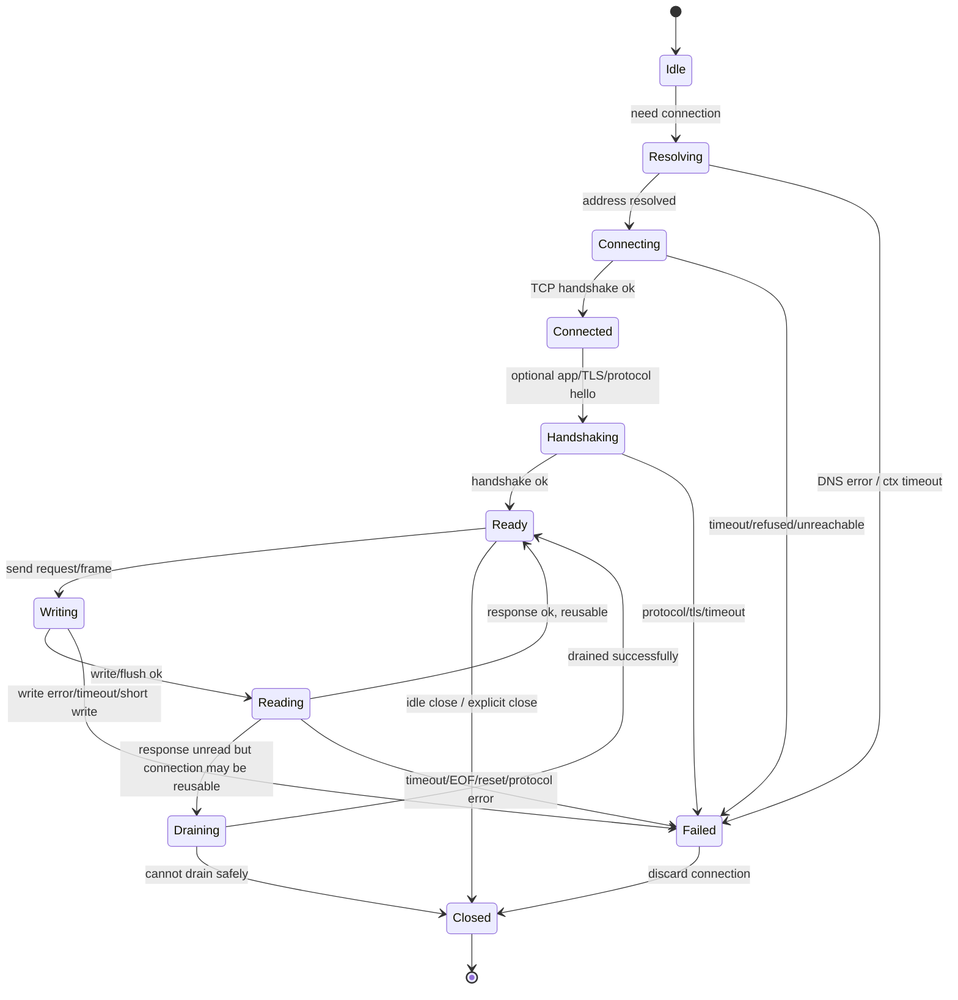
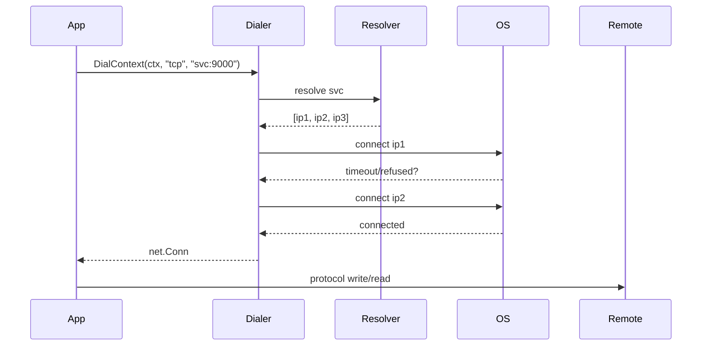
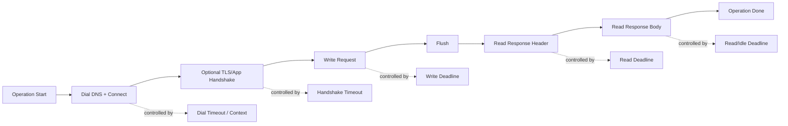
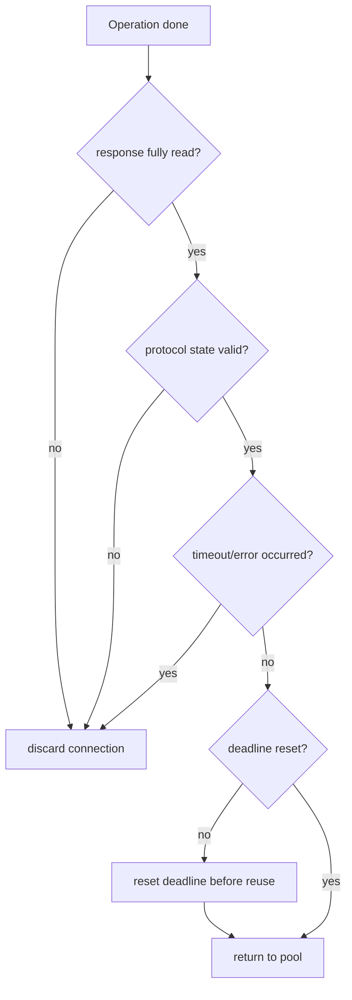
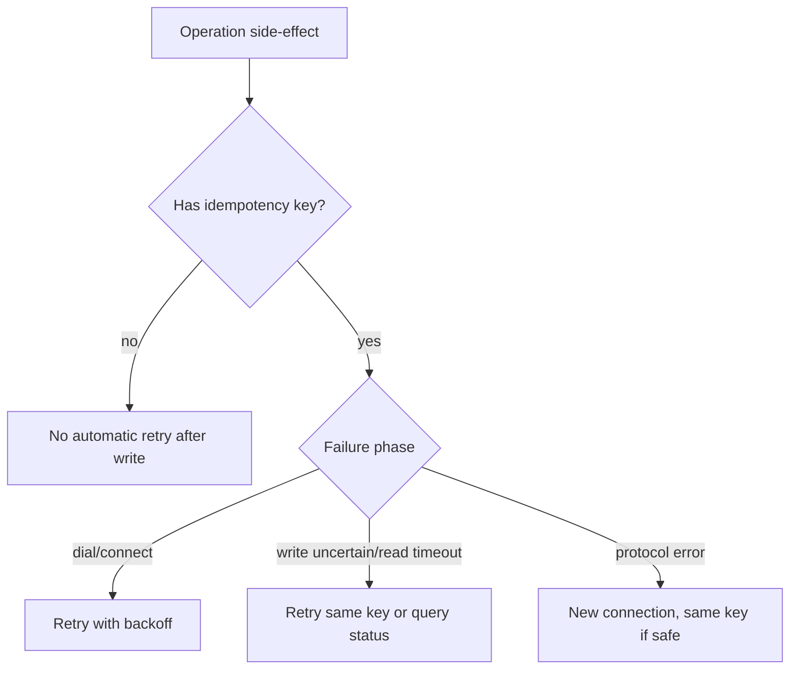
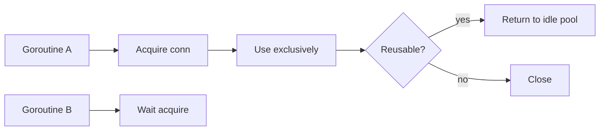
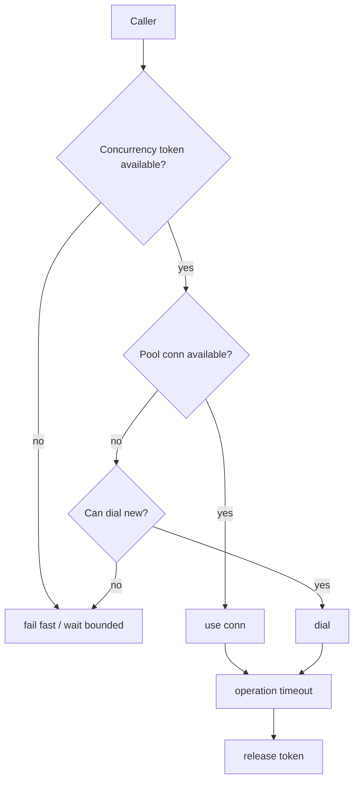
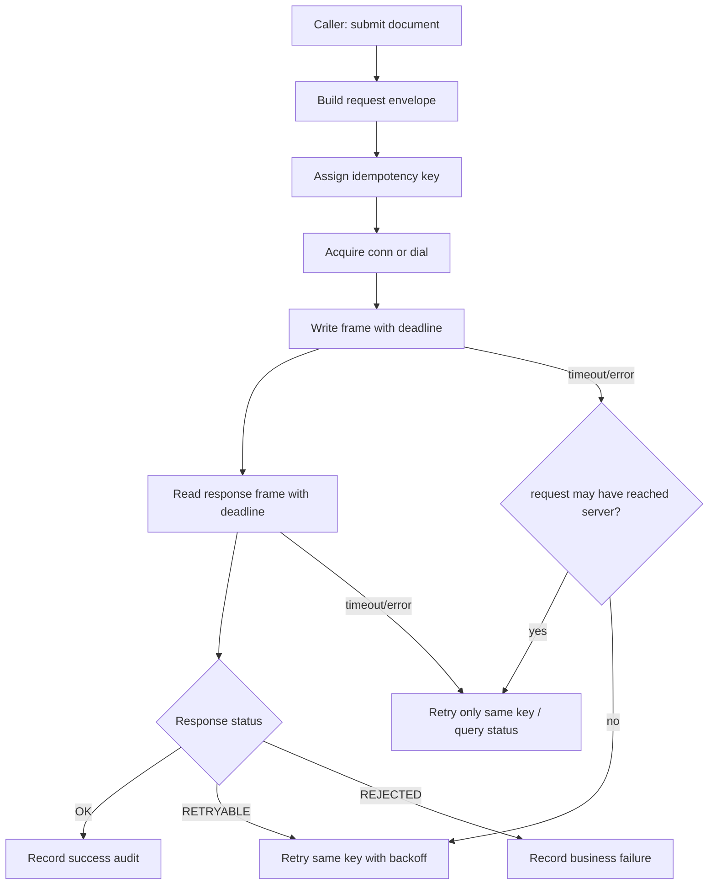

# learn-go-io-buffer-byte-stream-file-network-data-transfer-part-024.md

# Part 024 — TCP Clients: Dial Strategy, Timeout Model, Retry Boundary, Reconnect, Pooling

> Series: `learn-go-io-buffer-byte-stream-file-network-data-transfer`  
> Target Go: Go 1.26.x  
> Audience: Java software engineer yang ingin membangun mental model Go IO production-grade  
> Status: Part 024 dari 034 — seri belum selesai

---

## 0. Posisi Part Ini Dalam Series

Pada part sebelumnya kita membahas **TCP server**: `Listen`, `Accept`, lifecycle koneksi, slow client defense, graceful shutdown, dan desain protocol loop.

Part ini adalah sisi sebaliknya: **TCP client**.

Di production, TCP client sering lebih sulit daripada server karena client harus menghadapi kombinasi masalah berikut:

1. DNS bisa lambat, salah, berubah, atau mengembalikan banyak alamat.
2. Connect bisa timeout, refused, unreachable, atau stuck mengikuti timeout OS.
3. Koneksi yang sudah berhasil bisa mati diam-diam.
4. Write bisa terlihat berhasil di aplikasi tetapi remote belum memproses request.
5. Read bisa timeout, EOF, reset, partial response, atau block tanpa deadline.
6. Retry bisa menyelamatkan request idempotent, tetapi bisa menggandakan transaksi non-idempotent.
7. Pooling bisa mempercepat sistem, tetapi bisa menyimpan stale connection.
8. Reconnect bisa memperbaiki failure, tetapi bisa menciptakan reconnect storm.
9. Deadline yang salah bisa membuat sistem terlihat stabil padahal menggantung.
10. Buffering yang salah bisa membuat data belum terkirim walaupun fungsi `Write` dipanggil.

Jadi fokus part ini bukan hanya “cara pakai `net.Dial`”, melainkan **cara mendesain TCP client yang eksplisit terhadap waktu, ownership, failure, retry, dan lifecycle**.

---

## 1. Learning Objectives

Setelah part ini, kamu harus mampu:

1. Menjelaskan perbedaan `net.Dial`, `net.DialTimeout`, `Dialer.DialContext`, dan typed dialer Go 1.26 seperti `DialTCP`.
2. Mendesain timeout model yang memisahkan:
   - DNS/connect timeout,
   - protocol handshake timeout,
   - write timeout,
   - read timeout,
   - idle timeout,
   - total operation timeout.
3. Memahami bahwa `context` pada `DialContext` hanya mengontrol fase dial, bukan operasi koneksi setelah connect berhasil.
4. Membuat TCP client yang aman dari infinite block dengan `SetReadDeadline` dan `SetWriteDeadline`.
5. Membedakan retry yang aman dan retry yang berbahaya.
6. Mendesain reconnect strategy tanpa reconnect storm.
7. Memutuskan kapan memakai koneksi per request, long-lived connection, atau connection pool.
8. Mengklasifikasikan error jaringan: timeout, EOF, reset, refused, DNS error, protocol error, dan partial progress.
9. Membuat client API yang testable dengan injected `Dialer`/function.
10. Menguji TCP client dengan `net.Pipe`, local listener, fake server, dan fault injection.

---

## 2. Mental Model: TCP Client Adalah State Machine, Bukan Sekadar Socket

Programmer sering menganggap TCP client sebagai objek sederhana:

```text
connect -> write -> read -> close
```

Itu terlalu dangkal. Di production, TCP client adalah state machine:



Koneksi bukan hanya transport. Koneksi membawa **state**:

- apakah sudah handshake,
- apakah sedang ada outstanding request,
- apakah buffer writer sudah flush,
- apakah response sebelumnya sudah dibaca penuh,
- apakah remote sudah half-close,
- apakah deadline lama masih aktif,
- apakah koneksi masih aman dipakai ulang,
- apakah protocol state sinkron atau sudah corrupt.

> Prinsip penting: connection reuse hanya aman bila protocol state masih sinkron.

---

## 3. Perbandingan Mental Model Java vs Go

Untuk Java engineer, kira-kira peta mentalnya seperti ini:

| Java | Go | Catatan |
|---|---|---|
| `Socket` | `net.Conn` / `*net.TCPConn` | `net.Conn` adalah interface umum untuk stream connection. |
| `SocketChannel` | Tidak ada padanan langsung di package `net` level tinggi | Go biasanya memakai goroutine blocking IO dengan scheduler, bukan selector manual. |
| `Socket.connect(timeout)` | `net.Dialer{Timeout: ...}.DialContext(...)` | Timeout dial harus eksplisit. |
| `setSoTimeout` | `SetReadDeadline` / `SetDeadline` | Go memakai absolute deadline, bukan duration timeout per call. |
| `InputStream` | `io.Reader` | Sama-sama stream read contract. |
| `OutputStream` | `io.Writer` | Sama-sama stream write contract. |
| `BufferedInputStream` | `bufio.Reader` | Boundary buffering harus dipahami. |
| `BufferedOutputStream` | `bufio.Writer` | Wajib `Flush`. |
| `SocketException` | `error` + `net.Error` + `errors.Is` | Go mengandalkan explicit error handling. |
| `ExecutorService` per socket | goroutine per connection | Lebih murah, tapi tetap harus dibatasi di level sistem. |

Perbedaan paling penting:

Java sering membuat engineer berpikir dalam bentuk object lifecycle. Go memaksa berpikir dalam bentuk **interface contract + error returned at every boundary**.

---

## 4. Primitive Utama TCP Client di Go

Package `net` menyediakan interface portable untuk network I/O: TCP/IP, UDP, DNS, dan Unix domain socket. Untuk kebanyakan client, primitive utama adalah `Dial`, `Listen`, `Accept`, `Conn`, dan `Listener`.

### 4.1 `net.Conn`

`net.Conn` adalah interface stream connection:

```go
package net

type Conn interface {
    Read(b []byte) (n int, err error)
    Write(b []byte) (n int, err error)
    Close() error
    LocalAddr() Addr
    RemoteAddr() Addr
    SetDeadline(t time.Time) error
    SetReadDeadline(t time.Time) error
    SetWriteDeadline(t time.Time) error
}
```

Hal penting:

1. `Read` dan `Write` mengikuti kontrak `io.Reader`/`io.Writer`.
2. `Read` bisa mengembalikan `n > 0` bersama `err != nil`; proses byte dulu.
3. `Write` bisa partial; `io.WriteString`, `bufio.Writer`, atau helper sendiri harus tetap mengecek error.
4. Deadline adalah **absolute time**, bukan duration.
5. Deadline berlaku untuk operasi sekarang dan berikutnya sampai diganti.
6. `Close` melepaskan resource dan biasanya membuat operasi yang sedang block return error.

### 4.2 `*net.TCPConn`

`*net.TCPConn` adalah implementasi konkret TCP yang punya method tambahan seperti:

- `CloseRead()`
- `CloseWrite()`
- `SetKeepAlive(...)`
- `SetKeepAliveConfig(...)`
- `SetNoDelay(...)`
- `SetLinger(...)`
- `SetReadBuffer(...)`
- `SetWriteBuffer(...)`

Gunakan `*net.TCPConn` bila kamu benar-benar butuh fitur TCP-specific. Untuk mayoritas protocol code, terima `net.Conn` agar testable dan bisa diganti oleh TLS connection, `net.Pipe`, atau wrapper observability.

---

## 5. Cara Dial: Dari Sederhana Sampai Production-Grade

### 5.1 `net.Dial`

Bentuk paling sederhana:

```go
conn, err := net.Dial("tcp", "example.com:12345")
if err != nil {
    return err
}
defer conn.Close()
```

Ini cocok untuk contoh kecil, bukan baseline production.

Masalahnya:

- tidak ada context,
- tidak ada explicit timeout dari aplikasi,
- sulit dibatalkan saat shutdown,
- tidak ada konfigurasi keepalive/local address/resolver/control,
- timeout OS bisa terlalu lama.

### 5.2 `net.DialTimeout`

```go
conn, err := net.DialTimeout("tcp", "example.com:12345", 3*time.Second)
```

Lebih baik karena ada timeout, tapi masih kurang fleksibel:

- tidak menerima `context.Context`,
- timeout hanya dial/connect phase,
- tidak mengatur read/write setelah connect.

### 5.3 `net.Dialer.DialContext`

Baseline production umum:

```go
var d net.Dialer

ctx, cancel := context.WithTimeout(parent, 3*time.Second)
defer cancel()

conn, err := d.DialContext(ctx, "tcp", "example.com:12345")
if err != nil {
    return err
}
```

Hal yang sering salah dipahami:

> Context pada `DialContext` hanya mengontrol proses dial sampai koneksi berhasil. Setelah koneksi established, expiration context tidak otomatis membatalkan `Read`/`Write` di connection.

Artinya setelah connect berhasil, kamu tetap harus memakai:

```go
conn.SetReadDeadline(...)
conn.SetWriteDeadline(...)
```

atau menutup koneksi dari goroutine lain saat context parent canceled.

### 5.4 Go 1.26: Typed Dialer Methods

Go 1.26 menambahkan method baru pada `net.Dialer`:

- `DialIP`
- `DialTCP`
- `DialUDP`
- `DialUnix`

Tujuannya: melakukan dial untuk network type spesifik dengan `context.Context`, tanpa harus selalu kembali sebagai `net.Conn` generik.

Contoh konseptual:

```go
var d net.Dialer
ctx, cancel := context.WithTimeout(context.Background(), 2*time.Second)
defer cancel()

raddr := netip.MustParseAddrPort("127.0.0.1:9000")

conn, err := d.DialTCP(ctx, "tcp", netip.AddrPort{}, raddr)
if err != nil {
    return err
}
defer conn.Close()

_ = conn.SetNoDelay(true)
```

Gunakan typed dial bila:

- kamu butuh `*net.TCPConn` langsung,
- kamu ingin memakai `netip.AddrPort`,
- kamu ingin menghindari type assertion setelah `DialContext`,
- kamu mendesain client TCP-specific, bukan generic stream client.

Namun untuk library umum, menerima `net.Conn` tetap lebih fleksibel.

---

## 6. Anatomy `net.Dialer`

`net.Dialer` adalah pusat konfigurasi client connection.

Field penting:

| Field | Makna | Risiko bila salah |
|---|---|---|
| `Timeout` | Maksimum waktu dial menunggu connect selesai | Tanpa ini, dial bisa terlalu lama bergantung OS. |
| `Deadline` | Absolute time batas dial | Bisa fail lebih awal daripada `Timeout`. |
| `LocalAddr` | Local address untuk source bind | Bisa memicu port exhaustion atau salah interface jika keliru. |
| `FallbackDelay` | Happy Eyeballs IPv6/IPv4 fallback delay | Salah tuning bisa memperlambat dual-stack. |
| `KeepAlive` | Legacy keepalive period | Lebih baik pakai `KeepAliveConfig` untuk kontrol detail. |
| `KeepAliveConfig` | Konfigurasi probe keepalive | OS/protocol dependent; bukan pengganti app heartbeat. |
| `Resolver` | Resolver alternatif | Berguna untuk policy, testing, custom DNS. |
| `Control` | Hook sebelum connect untuk syscall-level control | Power tool; portability risk. |
| `ControlContext` | Context-aware control hook | Lebih cocok untuk konfigurasi modern. |

Contoh konfigurasi baseline:

```go
type TCPClientConfig struct {
    Address        string
    DialTimeout    time.Duration
    ReadTimeout    time.Duration
    WriteTimeout   time.Duration
    IdleTimeout    time.Duration
    KeepAliveIdle  time.Duration
}

func newDialer(cfg TCPClientConfig) *net.Dialer {
    return &net.Dialer{
        Timeout:   cfg.DialTimeout,
        KeepAlive: 30 * time.Second,
        KeepAliveConfig: net.KeepAliveConfig{
            Enable: true,
            Idle:   cfg.KeepAliveIdle,
        },
    }
}
```

Catatan: `KeepAliveConfig` tersedia sejak Go 1.23. Nilai persis probe TCP keepalive tetap tergantung OS dan support protocol.

---

## 7. DNS dan Multi-Address Dialing

Saat address berisi hostname:

```go
d.DialContext(ctx, "tcp", "service.internal:9000")
```

Go perlu melakukan resolusi nama. Package `net` bisa memakai pure Go resolver atau cgo/native resolver, tergantung OS, konfigurasi, environment, dan fitur resolver yang dibutuhkan.

Hal penting:

1. DNS lookup adalah bagian dari dial path.
2. DNS bisa menjadi sumber latency besar.
3. Hostname bisa resolve ke banyak IP.
4. Timeout dial bisa dibagi ke beberapa alamat.
5. DNS result bisa berubah akibat deployment, failover, service discovery, atau load balancing.

Diagram:



### 7.1 DNS Failure Bukan Selalu Remote Service Failure

Jangan campur semua error menjadi `service unavailable` tanpa klasifikasi. DNS failure bisa berarti:

- resolver down,
- `/etc/resolv.conf` salah,
- search domain salah,
- hostname typo,
- split-horizon DNS berbeda antar environment,
- service discovery belum converge,
- network policy memblokir DNS.

Minimal log:

- target host,
- resolved atau tidak,
- error type,
- duration resolve/dial,
- attempt number,
- network (`tcp`, `tcp4`, `tcp6`).

---

## 8. Timeout Model Yang Benar

TCP client yang sehat tidak cukup punya satu timeout. Ia butuh beberapa deadline berbeda.



### 8.1 Timeout Types

| Timeout | Mengontrol | Tool Go |
|---|---|---|
| Dial timeout | DNS/connect phase | `context.WithTimeout`, `net.Dialer.Timeout` |
| Handshake timeout | Protocol hello/login/TLS handshake | `SetDeadline` around handshake or TLS config where applicable |
| Write timeout | Sending request/frame | `SetWriteDeadline` |
| Read timeout | Waiting response | `SetReadDeadline` |
| Idle timeout | Maximum silent interval on reused/live connection | update deadline after progress |
| Total operation timeout | End-to-end operation budget | parent `context.Context` + explicit close/deadline integration |

### 8.2 Absolute Deadline Pitfall

`SetReadDeadline(time.Now().Add(5*time.Second))` bukan “setiap read punya 5 detik selamanya”. Itu deadline absolute.

Jika kamu set sekali:

```go
conn.SetReadDeadline(time.Now().Add(5 * time.Second))
```

lalu operasi berlangsung 4.9 detik, read berikutnya hanya punya 0.1 detik sebelum deadline. Untuk idle timeout, deadline harus diperpanjang setelah progress.

Contoh helper:

```go
func setReadTimeout(conn net.Conn, timeout time.Duration) error {
    if timeout <= 0 {
        return conn.SetReadDeadline(time.Time{})
    }
    return conn.SetReadDeadline(time.Now().Add(timeout))
}

func setWriteTimeout(conn net.Conn, timeout time.Duration) error {
    if timeout <= 0 {
        return conn.SetWriteDeadline(time.Time{})
    }
    return conn.SetWriteDeadline(time.Now().Add(timeout))
}
```

### 8.3 Context Tidak Otomatis Membatalkan Established Conn

Ini salah satu bug umum:

```go
ctx, cancel := context.WithTimeout(context.Background(), 2*time.Second)
defer cancel()

conn, err := d.DialContext(ctx, "tcp", addr)
if err != nil {
    return err
}

// SALAH asumsi: ctx timeout nanti akan membatalkan Read.
_, err = conn.Read(buf)
```

Setelah `DialContext` berhasil, context selesai tugasnya. Untuk operasi berikutnya, pakai deadline atau close connection saat context done.

Pattern bridging context ke conn:

```go
func closeOnContextDone(ctx context.Context, conn net.Conn) func() {
    done := make(chan struct{})
    go func() {
        select {
        case <-ctx.Done():
            _ = conn.Close()
        case <-done:
        }
    }()
    return func() { close(done) }
}
```

Gunakan pattern ini hati-hati. Closing conn untuk cancel berarti koneksi tidak reusable.

---

## 9. Baseline TCP Client API Design

Jangan menyebar `net.Dial` ke seluruh codebase. Bungkus sebagai client dengan konfigurasi eksplisit.

```go
type DialFunc func(ctx context.Context, network, address string) (net.Conn, error)

type Client struct {
    addr         string
    dial         DialFunc
    dialTimeout  time.Duration
    readTimeout  time.Duration
    writeTimeout time.Duration
}

type Config struct {
    Address      string
    DialTimeout  time.Duration
    ReadTimeout  time.Duration
    WriteTimeout time.Duration
}

func NewClient(cfg Config) *Client {
    d := &net.Dialer{
        Timeout:   cfg.DialTimeout,
        KeepAlive: 30 * time.Second,
    }

    return &Client{
        addr:         cfg.Address,
        dial:         d.DialContext,
        dialTimeout:  cfg.DialTimeout,
        readTimeout:  cfg.ReadTimeout,
        writeTimeout: cfg.WriteTimeout,
    }
}
```

Kenapa `DialFunc` penting?

- mudah ditest,
- bisa diganti `net.Pipe`,
- bisa dibungkus metrics,
- bisa diganti TLS dialer,
- bisa di-inject fake dial failure.

---

## 10. Contoh Protocol Client: Request/Response Line Protocol

Misal protocol sederhana:

```text
REQ <payload>\n
OK <payload>\n
ERR <code> <message>\n
```

Ini bukan rekomendasi protocol final, hanya contoh untuk mempelajari client boundary.

### 10.1 Implementasi Satu Request Satu Koneksi

```go
package tcpclient

import (
    "bufio"
    "context"
    "errors"
    "fmt"
    "io"
    "net"
    "strings"
    "time"
)

const maxLineBytes = 64 * 1024

type Client struct {
    addr         string
    dial         func(context.Context, string, string) (net.Conn, error)
    readTimeout  time.Duration
    writeTimeout time.Duration
}

func New(addr string, dialTimeout, readTimeout, writeTimeout time.Duration) *Client {
    d := &net.Dialer{Timeout: dialTimeout, KeepAlive: 30 * time.Second}
    return &Client{
        addr:         addr,
        dial:         d.DialContext,
        readTimeout:  readTimeout,
        writeTimeout: writeTimeout,
    }
}

func (c *Client) Do(ctx context.Context, payload string) (string, error) {
    conn, err := c.dial(ctx, "tcp", c.addr)
    if err != nil {
        return "", fmt.Errorf("dial %s: %w", c.addr, err)
    }
    defer conn.Close()

    stop := closeOnContextDone(ctx, conn)
    defer stop()

    if err := c.writeRequest(conn, payload); err != nil {
        return "", err
    }

    resp, err := c.readResponse(conn)
    if err != nil {
        return "", err
    }
    return resp, nil
}

func (c *Client) writeRequest(conn net.Conn, payload string) error {
    if strings.ContainsAny(payload, "\r\n") {
        return errors.New("payload must not contain line break")
    }

    if err := setWriteTimeout(conn, c.writeTimeout); err != nil {
        return fmt.Errorf("set write deadline: %w", err)
    }

    w := bufio.NewWriter(conn)
    if _, err := fmt.Fprintf(w, "REQ %s\n", payload); err != nil {
        return fmt.Errorf("write request: %w", err)
    }
    if err := w.Flush(); err != nil {
        return fmt.Errorf("flush request: %w", err)
    }
    return nil
}

func (c *Client) readResponse(conn net.Conn) (string, error) {
    if err := setReadTimeout(conn, c.readTimeout); err != nil {
        return "", fmt.Errorf("set read deadline: %w", err)
    }

    r := bufio.NewReaderSize(conn, maxLineBytes)
    line, err := readBoundedLine(r, maxLineBytes)
    if err != nil {
        return "", fmt.Errorf("read response: %w", err)
    }

    line = strings.TrimSuffix(strings.TrimSuffix(line, "\n"), "\r")

    switch {
    case strings.HasPrefix(line, "OK "):
        return strings.TrimPrefix(line, "OK "), nil
    case strings.HasPrefix(line, "ERR "):
        return "", fmt.Errorf("remote error: %s", strings.TrimPrefix(line, "ERR "))
    default:
        return "", fmt.Errorf("protocol error: unexpected response %q", line)
    }
}

func readBoundedLine(r *bufio.Reader, max int) (string, error) {
    var b strings.Builder
    for {
        part, err := r.ReadString('\n')
        b.WriteString(part)

        if b.Len() > max {
            return "", fmt.Errorf("line too large: limit=%d", max)
        }
        if err == nil {
            return b.String(), nil
        }
        if errors.Is(err, io.EOF) {
            if b.Len() > 0 {
                return "", io.ErrUnexpectedEOF
            }
            return "", io.EOF
        }
        return "", err
    }
}

func setReadTimeout(conn net.Conn, timeout time.Duration) error {
    if timeout <= 0 {
        return conn.SetReadDeadline(time.Time{})
    }
    return conn.SetReadDeadline(time.Now().Add(timeout))
}

func setWriteTimeout(conn net.Conn, timeout time.Duration) error {
    if timeout <= 0 {
        return conn.SetWriteDeadline(time.Time{})
    }
    return conn.SetWriteDeadline(time.Now().Add(timeout))
}

func closeOnContextDone(ctx context.Context, conn net.Conn) func() {
    done := make(chan struct{})
    go func() {
        select {
        case <-ctx.Done():
            _ = conn.Close()
        case <-done:
        }
    }()
    return func() { close(done) }
}
```

### 10.2 Kenapa `bufio.Writer.Flush` Wajib?

Karena `bufio.Writer` menulis ke buffer user-space dulu. Tanpa `Flush`, data mungkin belum masuk ke `net.Conn`.

Bug umum:

```go
w := bufio.NewWriter(conn)
w.WriteString("REQ hello\n")
// lupa Flush
resp, _ := r.ReadString('\n') // server belum menerima request, client timeout
```

Dalam file IO, lupa flush bisa kehilangan data. Dalam network IO, lupa flush bisa membuat deadlock request/response.

---

## 11. One Connection Per Request vs Long-Lived Connection

### 11.1 One Connection Per Request

Pattern:

```text
dial -> write request -> read response -> close
```

Kelebihan:

- sederhana,
- protocol state tidak reused,
- failure containment bagus,
- tidak perlu pool,
- cocok untuk volume kecil atau admin command.

Kekurangan:

- TCP handshake overhead,
- TLS handshake overhead bila TLS,
- lebih banyak ephemeral port usage,
- lebih banyak syscall,
- lebih tinggi latency.

### 11.2 Long-Lived Connection

Pattern:

```text
dial -> handshake -> request/response -> request/response -> ... -> close
```

Kelebihan:

- latency lebih rendah,
- reuse handshake,
- cocok untuk high-throughput persistent protocol,
- bisa maintain session/auth state.

Kekurangan:

- stale connection,
- protocol state corruption,
- heartbeat diperlukan,
- reconnect logic lebih kompleks,
- concurrency per connection harus jelas,
- backpressure lebih rumit.

### 11.3 Connection Pool

Pattern:

```text
pool acquire -> use conn -> validate/drain -> release or discard
```

Kelebihan:

- amortize connect cost,
- bounded concurrency,
- control resource usage,
- performa lebih stabil.

Kekurangan:

- harus deteksi broken/stale conn,
- harus tahu apakah protocol mendukung multiplexing atau tidak,
- harus membersihkan deadline sebelum reuse,
- harus menghindari reuse conn dengan unread response,
- fairness dan queue timeout harus didesain.

---

## 12. Reuse Safety: Kapan Koneksi Boleh Dipakai Ulang?

Koneksi boleh dipakai ulang bila semua ini benar:

1. Request sebelumnya sudah terkirim penuh dan flush berhasil.
2. Response sebelumnya sudah dibaca penuh sesuai framing/protocol.
3. Tidak ada protocol error.
4. Tidak ada read/write timeout.
5. Tidak ada EOF/reset.
6. Deadline lama sudah dibersihkan atau diset ulang.
7. Buffer reader/writer tidak menyimpan state yang salah.
8. Koneksi tidak sedang dipakai goroutine lain secara incompatible.

Diagram:



> Rule praktis: jika kamu ragu apakah koneksi masih sinkron, tutup koneksi. TCP connect cost lebih murah daripada data corruption.

---

## 13. Retry Boundary

Retry adalah alat berbahaya. Ia bisa meningkatkan reliability atau menggandakan efek samping.

### 13.1 Retry Aman

Biasanya aman bila:

- operasi idempotent,
- request belum terkirim sama sekali,
- failure terjadi saat dial/connect,
- protocol punya request idempotency key,
- server mendukung deduplication,
- response timeout bisa diverifikasi dengan status query.

Contoh:

- `GET status by id`,
- `PING`,
- `READ object`,
- `PUT object with content hash and idempotency key`,
- `append with monotonic sequence + dedup`.

### 13.2 Retry Berbahaya

Berbahaya bila:

- request mungkin sudah sampai server,
- operasi punya side effect,
- tidak ada idempotency key,
- response timeout terjadi setelah write berhasil,
- server tidak bisa dedup,
- client tidak tahu apakah transaksi committed.

Contoh:

- `CREATE payment`,
- `SUBMIT enforcement action`,
- `APPROVE case`,
- `SEND notification`,
- `INCREMENT counter`.

### 13.3 Failure Phase menentukan Retry Policy

| Phase | Apa yang diketahui client? | Retry default? |
|---|---|---|
| DNS failed | Belum connect | Bisa, dengan backoff, jika transient. |
| Connect refused | Belum kirim request | Bisa, tapi jangan agresif. |
| Write failed sebelum byte terkirim | Request mungkin belum sampai | Bisa jika dapat dipastikan no byte sent; sering sulit. |
| Write timeout setelah partial write | Request mungkin partial/complete di remote | Jangan retry non-idempotent. |
| Read timeout setelah write sukses | Server mungkin sedang memproses atau sudah commit | Jangan retry non-idempotent tanpa idempotency key. |
| EOF before response | Remote close; status operasi tidak selalu diketahui | Tergantung protocol. |
| Protocol error | State corrupt | Jangan retry pada koneksi sama; boleh new conn jika request aman. |

### 13.4 Idempotency Key Pattern

Untuk operasi side-effect, desain protocol dengan idempotency key:

```text
REQ idempotency-key=<uuid> operation=CREATE_CASE payload-len=...
<payload>
```

Server menyimpan hasil untuk key tersebut. Bila client retry dengan key sama, server mengembalikan hasil yang sama, bukan membuat efek baru.

Client retry policy:



---

## 14. Backoff dan Reconnect Strategy

Reconnect tanpa backoff bisa membunuh dependency yang sedang sakit.

### 14.1 Basic Exponential Backoff with Jitter

```go
func backoffDelay(attempt int, base, max time.Duration) time.Duration {
    if attempt < 0 {
        attempt = 0
    }
    d := base << min(attempt, 10)
    if d > max {
        d = max
    }

    // simple jitter: [d/2, d)
    half := d / 2
    if half <= 0 {
        return d
    }
    return half + time.Duration(rand.Int63n(int64(half)))
}

func min(a, b int) int {
    if a < b {
        return a
    }
    return b
}
```

Untuk production library modern, prefer dependency internal atau package yang sudah distandarkan di organisasi. Namun mental modelnya tetap:

- cap maksimal,
- jitter,
- respect context,
- reset attempt setelah success stabil,
- classify non-retryable error.

### 14.2 Reconnect Loop Skeleton

```go
func connectWithRetry(
    ctx context.Context,
    dial func(context.Context) (net.Conn, error),
    maxAttempts int,
) (net.Conn, error) {
    var last error

    for attempt := 0; maxAttempts <= 0 || attempt < maxAttempts; attempt++ {
        conn, err := dial(ctx)
        if err == nil {
            return conn, nil
        }
        last = err

        if !isRetryableDialError(err) {
            return nil, err
        }

        delay := backoffDelay(attempt, 100*time.Millisecond, 3*time.Second)
        timer := time.NewTimer(delay)
        select {
        case <-ctx.Done():
            timer.Stop()
            return nil, fmt.Errorf("connect canceled after %d attempts: %w", attempt+1, ctx.Err())
        case <-timer.C:
        }
    }

    return nil, fmt.Errorf("connect failed: %w", last)
}
```

### 14.3 Reconnect Storm

Reconnect storm terjadi ketika banyak instance client reconnect bersamaan setelah dependency restart.

Mitigasi:

- jitter wajib,
- cap attempt rate,
- circuit breaker atau admission control,
- health endpoint terpisah,
- max in-flight dial per process,
- max global concurrency bila ada service mesh/proxy,
- warmup server sebelum menerima traffic penuh.

---

## 15. Connection Pool Design

Go standard library tidak menyediakan generic TCP pool karena pooling sangat protocol-specific. `net/http.Transport` punya pooling karena HTTP semantics diketahui. Untuk custom TCP protocol, kamu harus mendesain sendiri atau memakai library internal.

### 15.1 Pool Invariants

Pool yang benar harus punya invariants:

1. Maksimum total koneksi.
2. Maksimum idle koneksi.
3. Acquire punya timeout/cancel.
4. Release memvalidasi apakah koneksi reusable.
5. Broken connection dibuang, bukan dikembalikan.
6. Idle connection punya TTL/idle timeout.
7. Deadline lama dibersihkan saat release/acquire.
8. Metrics tersedia: active, idle, waiters, dial errors, discard reason.

### 15.2 Single-Request-At-A-Time Pool

Untuk protocol request/response tanpa multiplexing, satu koneksi hanya boleh dipakai oleh satu goroutine per waktu.



### 15.3 Pool Minimal Skeleton

Skeleton ini edukatif, belum lengkap untuk semua production case:

```go
type pooledConn struct {
    conn      net.Conn
    createdAt time.Time
    lastUsed  time.Time
}

type Pool struct {
    dial    func(context.Context) (net.Conn, error)
    maxIdle int
    idleTTL time.Duration

    mu   sync.Mutex
    idle []*pooledConn
}

func (p *Pool) Acquire(ctx context.Context) (net.Conn, error) {
    now := time.Now()

    p.mu.Lock()
    for len(p.idle) > 0 {
        pc := p.idle[len(p.idle)-1]
        p.idle = p.idle[:len(p.idle)-1]

        if p.idleTTL > 0 && now.Sub(pc.lastUsed) > p.idleTTL {
            p.mu.Unlock()
            _ = pc.conn.Close()
            p.mu.Lock()
            continue
        }

        _ = pc.conn.SetDeadline(time.Time{})
        p.mu.Unlock()
        return pc.conn, nil
    }
    p.mu.Unlock()

    return p.dial(ctx)
}

func (p *Pool) Release(conn net.Conn, reusable bool) {
    if conn == nil {
        return
    }
    if !reusable {
        _ = conn.Close()
        return
    }

    _ = conn.SetDeadline(time.Time{})

    p.mu.Lock()
    if len(p.idle) >= p.maxIdle {
        p.mu.Unlock()
        _ = conn.Close()
        return
    }
    p.idle = append(p.idle, &pooledConn{conn: conn, lastUsed: time.Now()})
    p.mu.Unlock()
}

func (p *Pool) Close() error {
    p.mu.Lock()
    idle := p.idle
    p.idle = nil
    p.mu.Unlock()

    var first error
    for _, pc := range idle {
        if err := pc.conn.Close(); err != nil && first == nil {
            first = err
        }
    }
    return first
}
```

Kekurangan skeleton ini:

- belum membatasi total active connection,
- belum punya wait queue,
- belum health check,
- belum observability,
- belum drain logic,
- belum circuit breaker,
- belum fairness.

Tujuannya hanya menunjukkan invariants dasar.

---

## 16. Protocol Multiplexing vs Pooling

Jangan samakan pooling dengan multiplexing.

| Model | Makna | Contoh |
|---|---|---|
| Pooling | Banyak koneksi, tiap operasi pinjam satu | HTTP/1.1 tanpa pipelining, DB pool |
| Multiplexing | Banyak request concurrent di satu koneksi | HTTP/2, gRPC, custom stream protocol |
| Pipelining | Request dikirim berurutan tanpa menunggu response, response tetap ordered | Beberapa text/binary protocol lama |

Untuk custom TCP protocol, multiplexing butuh:

- frame id/request id,
- concurrent response demux,
- per-stream flow control,
- per-request timeout,
- cancellation frame,
- memory bound per stream,
- fairness.

Jangan membangun multiplexing hanya dengan “pakai satu conn dan banyak goroutine Write/Read”. Itu hampir pasti corrupt tanpa framing/demux yang benar.

---

## 17. Read/Write Concurrency on `net.Conn`

Secara umum, `net.Conn` mendukung operasi concurrent oleh beberapa goroutine. Namun aman secara data race tidak sama dengan benar secara protocol.

Biasanya pattern yang valid:

- satu goroutine read loop,
- satu goroutine write loop,
- channel untuk outgoing frames,
- map request id untuk pending response,
- close/cancel coordination.

Pattern yang berbahaya:

```go
// Goroutine A
conn.Write(reqA)
conn.Read(respA)

// Goroutine B
conn.Write(reqB)
conn.Read(respB)
```

Tanpa protocol framing dan demux, response bisa tertukar.

Untuk simple request-response non-multiplexed protocol, gunakan mutex atau pool agar satu conn hanya dipakai satu operasi.

---

## 18. Half-Close: `CloseWrite` dan `CloseRead`

TCP mendukung half-close: satu arah ditutup, arah lain masih bisa dibaca/ditulis.

Di Go, gunakan `*net.TCPConn`:

```go
tcp, ok := conn.(*net.TCPConn)
if ok {
    _ = tcp.CloseWrite() // signal EOF to peer for write side
}
```

Use case:

- client mengirim request body sampai selesai,
- client memberi sinyal “tidak ada data lagi”,
- client tetap membaca response.

Contoh protocol:

```text
client writes upload stream
client CloseWrite
server reads until EOF
server writes result
client reads result
```

Risiko:

- tidak semua abstraction mempertahankan `*net.TCPConn` setelah wrapping, misal TLS.
- beberapa protocol tidak mengharapkan half-close.
- middlebox/proxy bisa punya behavior berbeda.

Jika protocol punya length-prefix, biasanya half-close tidak diperlukan.

---

## 19. TCP Keepalive vs Application Heartbeat

TCP keepalive dan heartbeat bukan hal yang sama.

| Mechanism | Layer | Tujuan | Keterbatasan |
|---|---|---|---|
| TCP keepalive | Transport | Deteksi peer mati/connection broken | Interval OS-level, lambat, tidak tahu app sehat atau tidak |
| App heartbeat | Protocol | Deteksi app/protocol liveness | Harus didesain, menambah traffic |
| Request timeout | Operation | Batasi satu operasi | Tidak mendeteksi idle conn sebelum digunakan |
| Health check | Client/service layer | Cek dependency readiness | Bisa berbeda dari path real traffic |

Keepalive bukan pengganti read deadline. Ia membantu mendeteksi beberapa broken connection, tetapi tidak menjamin operasi aplikasi tidak menggantung.

---

## 20. Nagle, `SetNoDelay`, Buffer Size, dan Socket Tuning

### 20.1 `SetNoDelay`

`SetNoDelay(true)` menonaktifkan Nagle algorithm. Biasanya default Go untuk TCPConn sudah no-delay enabled, tetapi selalu cek dokumen/behavior saat tuning.

Gunakan concern ini untuk:

- small request/response latency,
- chatty protocol,
- interactive command.

Untuk bulk transfer, batching di application layer biasanya lebih penting daripada micro-tuning Nagle.

### 20.2 Socket Buffer

`SetReadBuffer` dan `SetWriteBuffer` dapat mengatur socket buffer OS-level.

Jangan tuning tanpa measurement. Socket buffer terlalu besar bisa:

- menyembunyikan backpressure,
- menaikkan memory per connection,
- memperparah tail latency saat overload.

Terlalu kecil bisa:

- menurunkan throughput,
- meningkatkan syscall pressure,
- membuat sender sering blocked.

---

## 21. Error Classification

TCP client harus mengklasifikasi error minimal untuk logging, metrics, dan retry policy.

### 21.1 Timeout

```go
func isTimeout(err error) bool {
    if err == nil {
        return false
    }
    if errors.Is(err, os.ErrDeadlineExceeded) {
        return true
    }
    var ne net.Error
    return errors.As(err, &ne) && ne.Timeout()
}
```

Catatan: `Timeout()` true tidak selalu berarti deadline Go yang kamu set. Bisa juga berasal dari OS/network layer. Untuk deadline spesifik, cek `errors.Is(err, os.ErrDeadlineExceeded)` bila tersedia.

### 21.2 EOF

`io.EOF` saat read bisa berarti peer closed cleanly.

Dalam request/response protocol:

- EOF setelah response lengkap mungkin normal.
- EOF sebelum response lengkap adalah `io.ErrUnexpectedEOF` atau protocol error.
- EOF saat idle connection di pool berarti stale; discard.

### 21.3 Connection Refused / Reset / Broken Pipe

Error ini sering muncul sebagai `*net.OpError` yang membungkus error OS-specific. Jangan terlalu bergantung pada string error.

Lebih baik log structured:

- operation: `dial`, `read`, `write`, `flush`, `close`,
- remote address,
- duration,
- bytes written/read,
- error type `%T`,
- retry decision,
- reusable false/true.

### 21.4 DNS Error

```go
var dnsErr *net.DNSError
if errors.As(err, &dnsErr) {
    // dnsErr.IsNotFound, dnsErr.IsTimeout, dnsErr.IsTemporary may be available depending version/details
}
```

DNS error tidak selalu remote service down.

---

## 22. Designing Operation-Level Client Method

Satu method client production-grade harus eksplisit terhadap:

- context,
- operation timeout,
- request id,
- idempotency key,
- bytes in/out,
- retry policy,
- observability,
- reusable connection decision.

Contoh shape:

```go
type Request struct {
    Payload        []byte
    IdempotencyKey string
}

type Response struct {
    Payload []byte
}

type RetryPolicy struct {
    MaxAttempts int
    BaseDelay   time.Duration
    MaxDelay    time.Duration
    Retryable   func(error, AttemptInfo) bool
}

type AttemptInfo struct {
    Attempt      int
    Phase        string
    BytesWritten int64
    BytesRead    int64
}
```

Untuk protocol binary frame, client method kira-kira:

```go
func (c *Client) Do(ctx context.Context, req Request) (Response, error) {
    var last error

    for attempt := 0; attempt < c.retry.MaxAttempts; attempt++ {
        resp, err := c.doOnce(ctx, req)
        if err == nil {
            return resp, nil
        }
        last = err

        info := classifyAttempt(err)
        if !c.retry.Retryable(err, info) {
            return Response{}, err
        }

        delay := backoffDelay(attempt, c.retry.BaseDelay, c.retry.MaxDelay)
        if err := sleepContext(ctx, delay); err != nil {
            return Response{}, fmt.Errorf("retry wait canceled: %w", err)
        }
    }

    return Response{}, fmt.Errorf("all attempts failed: %w", last)
}
```

---

## 23. Sleep Respecting Context

```go
func sleepContext(ctx context.Context, d time.Duration) error {
    if d <= 0 {
        return nil
    }
    t := time.NewTimer(d)
    defer t.Stop()

    select {
    case <-ctx.Done():
        return ctx.Err()
    case <-t.C:
        return nil
    }
}
```

Ini kecil tetapi penting. Backoff yang tidak respect context membuat shutdown lambat.

---

## 24. Framed TCP Client Skeleton

Berikut skeleton binary frame client sederhana.

Frame:

```text
uint32 length big endian
payload bytes
```

Limit:

- max frame 4 MiB,
- write deadline,
- read deadline,
- no reuse after protocol error.

```go
package frameclient

import (
    "context"
    "encoding/binary"
    "errors"
    "fmt"
    "io"
    "net"
    "time"
)

const maxFrameSize = 4 << 20

type Client struct {
    addr         string
    dial         func(context.Context, string, string) (net.Conn, error)
    readTimeout  time.Duration
    writeTimeout time.Duration
}

func New(addr string, dialTimeout, readTimeout, writeTimeout time.Duration) *Client {
    d := &net.Dialer{Timeout: dialTimeout, KeepAlive: 30 * time.Second}
    return &Client{
        addr:         addr,
        dial:         d.DialContext,
        readTimeout:  readTimeout,
        writeTimeout: writeTimeout,
    }
}

func (c *Client) Do(ctx context.Context, payload []byte) ([]byte, error) {
    if len(payload) > maxFrameSize {
        return nil, fmt.Errorf("request too large: got=%d max=%d", len(payload), maxFrameSize)
    }

    conn, err := c.dial(ctx, "tcp", c.addr)
    if err != nil {
        return nil, fmt.Errorf("dial: %w", err)
    }
    defer conn.Close()

    stop := closeOnContextDone(ctx, conn)
    defer stop()

    if err := writeFrame(conn, payload, c.writeTimeout); err != nil {
        return nil, fmt.Errorf("write frame: %w", err)
    }

    resp, err := readFrame(conn, c.readTimeout, maxFrameSize)
    if err != nil {
        return nil, fmt.Errorf("read frame: %w", err)
    }

    return resp, nil
}

func writeFrame(conn net.Conn, payload []byte, timeout time.Duration) error {
    if err := setWriteTimeout(conn, timeout); err != nil {
        return err
    }

    var hdr [4]byte
    binary.BigEndian.PutUint32(hdr[:], uint32(len(payload)))

    if _, err := conn.Write(hdr[:]); err != nil {
        return err
    }
    if len(payload) == 0 {
        return nil
    }
    _, err := conn.Write(payload)
    return err
}

func readFrame(conn net.Conn, timeout time.Duration, max int) ([]byte, error) {
    if err := setReadTimeout(conn, timeout); err != nil {
        return nil, err
    }

    var hdr [4]byte
    if _, err := io.ReadFull(conn, hdr[:]); err != nil {
        return nil, err
    }

    n := binary.BigEndian.Uint32(hdr[:])
    if n > uint32(max) {
        return nil, fmt.Errorf("frame too large: got=%d max=%d", n, max)
    }

    payload := make([]byte, int(n))
    if _, err := io.ReadFull(conn, payload); err != nil {
        if errors.Is(err, io.EOF) {
            return nil, io.ErrUnexpectedEOF
        }
        return nil, err
    }
    return payload, nil
}
```

### 24.1 Subtle Issue: `conn.Write` May Not Write All Bytes?

For `net.Conn`, `Write` returns `(n, err)`. For many cases, successful write writes full buffer, but contract tetap harus diperhatikan. `io.Writer` secara umum boleh partial dengan error. Helper yang lebih strict:

```go
func writeFull(w io.Writer, p []byte) error {
    for len(p) > 0 {
        n, err := w.Write(p)
        if n > 0 {
            p = p[n:]
        }
        if err != nil {
            return err
        }
        if n == 0 {
            return io.ErrShortWrite
        }
    }
    return nil
}
```

Lalu:

```go
if err := writeFull(conn, hdr[:]); err != nil { return err }
if err := writeFull(conn, payload); err != nil { return err }
```

Dalam protocol code critical, helper explicit seperti ini meningkatkan clarity.

---

## 25. Connection Reuse Dengan Framed Protocol

Untuk connection reuse, ubah `Do` agar acquire conn dari pool. Tetapi reusable hanya jika operasi selesai bersih.

Pseudo-flow:

```go
conn, err := pool.Acquire(ctx)
if err != nil { return err }
reusable := false
defer func() { pool.Release(conn, reusable) }()

err = writeFrame(...)
if err != nil { return err }

resp, err = readFrame(...)
if err != nil { return err }

reusable = true
return resp, nil
```

Bila `readFrame` gagal setelah membaca sebagian header/body, connection state tidak sinkron. Jangan return ke pool.

---

## 26. Client-Side Backpressure

Client juga butuh backpressure. Tanpa itu, dependency slow akan membuat:

- goroutine menumpuk,
- memory request menumpuk,
- dial storm,
- latency makin parah,
- queue timeout meningkat,
- cascading failure.

Mechanism:

1. Batas max concurrent operations.
2. Batas pool size.
3. Batas queue wait time.
4. Per-operation timeout.
5. Circuit breaker bila failure rate tinggi.
6. Drop/reject lebih cepat saat overloaded.
7. Retry budget.

Diagram:



---

## 27. Source Port Exhaustion

One-connection-per-request dengan QPS tinggi bisa menghabiskan ephemeral port, terutama jika koneksi sering masuk `TIME_WAIT`.

Gejala:

- dial error sporadis,
- latency connect naik,
- `cannot assign requested address`,
- banyak socket `TIME_WAIT`,
- dependency terlihat sehat tetapi client gagal connect.

Mitigasi:

- reuse connection/pool,
- batasi dial rate,
- keep connection alive,
- tune OS dengan hati-hati,
- gunakan local address/interface dengan sadar,
- hindari retry agresif.

---

## 28. Security Lens untuk TCP Client

### 28.1 SSRF dan Dynamic Target

Jika client menerima target host/port dari input user, itu SSRF risk.

Policy:

- allowlist host/service,
- block private/link-local/metadata IP bila tidak diperlukan,
- validate port,
- resolve dan re-check IP,
- hati-hati DNS rebinding,
- jangan log secret dalam address/query,
- gunakan TLS identity check untuk remote service.

### 28.2 Protocol Injection

Line protocol rentan injection bila payload boleh mengandung newline.

```go
if strings.ContainsAny(payload, "\r\n") {
    return errors.New("invalid payload")
}
```

Binary protocol pun perlu:

- length limit,
- valid enum,
- checksum/MAC bila perlu,
- version validation,
- reject unknown critical flags.

### 28.3 TLS Boundary

Raw TCP tidak memberi:

- confidentiality,
- integrity,
- peer authentication.

Untuk cross-host traffic sensitif, gunakan TLS/mTLS. Di Go, TLS connection tetap mengikuti `net.Conn` contract. Detail TLS akan muncul sebagai boundary di part HTTP/TLS terkait, bukan deep cryptography.

---

## 29. Observability TCP Client

Minimal metrics:

| Metric | Type | Makna |
|---|---|---|
| `tcp_client_dial_total` | counter | Jumlah dial by target/result. |
| `tcp_client_dial_duration_seconds` | histogram | Latency DNS+connect. |
| `tcp_client_operation_duration_seconds` | histogram | End-to-end operation. |
| `tcp_client_bytes_written_total` | counter | Bytes keluar. |
| `tcp_client_bytes_read_total` | counter | Bytes masuk. |
| `tcp_client_errors_total` | counter | Error by phase/class. |
| `tcp_client_retries_total` | counter | Retry attempts. |
| `tcp_client_pool_active` | gauge | Conn aktif. |
| `tcp_client_pool_idle` | gauge | Conn idle. |
| `tcp_client_pool_wait_seconds` | histogram | Waktu menunggu acquire. |
| `tcp_client_conn_discard_total` | counter | Conn dibuang by reason. |

Structured log field:

```text
target_service
remote_addr
network
operation
attempt
phase
request_id
idempotency_key_present
bytes_written
bytes_read
duration_ms
error_type
error_class
retry_decision
conn_reused
conn_discard_reason
```

Tracing span:

```text
client.operation
  ├── dns/connect
  ├── protocol.handshake
  ├── write.request
  ├── read.response
  └── decode.response
```

Jangan trace payload sensitif.

---

## 30. Testing TCP Client

### 30.1 `net.Pipe`

`net.Pipe` membuat in-memory full-duplex connection. Bagus untuk test protocol read/write tanpa OS socket.

Kelebihan:

- cepat,
- deterministic,
- tidak perlu port,
- bisa simulasi partial behavior dengan wrapper.

Keterbatasan:

- bukan TCP real,
- tidak menguji DNS/connect,
- tidak menguji OS socket buffer,
- tidak menguji port exhaustion,
- tidak menguji keepalive.

### 30.2 Local Listener Integration Test

```go
func startTestServer(t *testing.T, handler func(net.Conn)) (addr string, closeFn func()) {
    t.Helper()

    ln, err := net.Listen("tcp", "127.0.0.1:0")
    if err != nil {
        t.Fatalf("listen: %v", err)
    }

    done := make(chan struct{})
    go func() {
        defer close(done)
        for {
            conn, err := ln.Accept()
            if err != nil {
                return
            }
            go handler(conn)
        }
    }()

    return ln.Addr().String(), func() {
        _ = ln.Close()
        <-done
    }
}
```

### 30.3 Fake Slow Server

```go
addr, closeServer := startTestServer(t, func(conn net.Conn) {
    defer conn.Close()
    time.Sleep(2 * time.Second)
})
defer closeServer()

client := New(addr, 500*time.Millisecond, 100*time.Millisecond, 100*time.Millisecond)
_, err := client.Do(context.Background(), "hello")
if err == nil {
    t.Fatal("expected timeout")
}
```

### 30.4 Fault Injection Ideas

Test cases:

1. server accepts then closes immediately,
2. server sends partial header then closes,
3. server sends frame length too large,
4. server never responds,
5. server reads slowly causing write timeout,
6. server returns malformed response,
7. DNS/dial error via injected dialer,
8. context canceled before dial,
9. context canceled during read,
10. pool discards conn after protocol error,
11. retry only happens for safe phase,
12. retry stops when context canceled.

---

## 31. Benchmarking TCP Client

Benchmarking TCP client harus hati-hati karena:

- local loopback tidak merepresentasikan WAN,
- server benchmark bisa menjadi bottleneck,
- DNS bisa cache,
- connection reuse mengubah profil latency,
- buffer size memengaruhi hasil,
- TLS/serialization/compression harus dipisah.

Pisahkan benchmark:

1. encode/decode only,
2. write/read over `net.Pipe`,
3. TCP loopback one-conn-per-request,
4. TCP loopback pooled,
5. remote integration benchmark,
6. failure benchmark: timeout/retry under dependency delay.

Metrics benchmark:

- p50/p95/p99 latency,
- throughput ops/sec,
- bytes/sec,
- allocations/op,
- goroutines active,
- open file descriptors,
- dial/sec,
- connection reuse ratio,
- error rate.

---

## 32. Common Anti-Patterns

### 32.1 No Timeout

```go
conn, _ := net.Dial("tcp", addr)
conn.Read(buf) // can block forever
```

Production rule: no network operation without timeout/deadline/bounded cancellation.

### 32.2 One Global Connection Used Concurrently Without Protocol Design

```go
var conn net.Conn

func Do(req []byte) ([]byte, error) {
    conn.Write(req)
    conn.Read(resp)
}
```

This is protocol corruption waiting to happen.

### 32.3 Retry Non-Idempotent Operation After Read Timeout

```go
// write succeeded, read timed out
// retry create operation blindly -> duplicate
```

Use idempotency key or status reconciliation.

### 32.4 Return Broken Connection to Pool

```go
resp, err := readFrame(conn)
pool.Put(conn) // wrong if err != nil or response unread
```

After uncertain protocol state, discard.

### 32.5 Buffered Writer Without Flush

```go
w := bufio.NewWriter(conn)
w.Write(payload)
// no Flush
```

Data may never be sent.

### 32.6 Context Misuse

```go
ctx, cancel := context.WithTimeout(context.Background(), time.Second)
conn, _ := d.DialContext(ctx, "tcp", addr)
// assume ctx controls conn forever
```

It does not. Use deadlines or close bridge.

---

## 33. Production Checklist

Before shipping TCP client code, answer these:

### Dial

- [ ] Is dial timeout explicit?
- [ ] Is context respected during dial?
- [ ] Is DNS failure classified separately?
- [ ] Is target address validated/allowlisted if user-controlled?
- [ ] Is dial rate bounded?

### Operation

- [ ] Is write deadline set?
- [ ] Is read deadline set?
- [ ] Is total operation timeout enforced?
- [ ] Are partial writes/read errors handled?
- [ ] Is response framing bounded?
- [ ] Is payload size bounded?

### Retry

- [ ] Is retry policy phase-aware?
- [ ] Is retry limited by attempt count/time budget?
- [ ] Is backoff jittered?
- [ ] Are non-idempotent operations protected?
- [ ] Is idempotency key used where needed?

### Reuse/Pool

- [ ] Is connection reuse protocol-safe?
- [ ] Are deadlines reset before reuse?
- [ ] Are broken/stale connections discarded?
- [ ] Is max pool size bounded?
- [ ] Is acquire wait bounded?

### Shutdown

- [ ] Can in-flight dial be canceled?
- [ ] Can in-flight read/write be unblocked?
- [ ] Are idle connections closed?
- [ ] Is close error logged where meaningful?

### Observability

- [ ] Are dial/operation latency measured?
- [ ] Are bytes read/written counted?
- [ ] Are errors labeled by phase/class?
- [ ] Are retry attempts counted?
- [ ] Is pool state observable?

---

## 34. Case Study: Internal Regulatory Data Transfer Client

Bayangkan service Go perlu mengirim dokumen enforcement ke internal downstream service via TCP custom protocol.

Kebutuhan:

- payload bisa besar,
- operation side-effectful,
- downstream kadang restart,
- audit trail harus defensible,
- tidak boleh duplicate submission,
- harus bisa timeout dan retry aman.

Desain:

1. Frame protocol:
   - magic,
   - version,
   - request id,
   - idempotency key,
   - operation type,
   - payload length,
   - checksum.
2. Client timeout:
   - dial 2s,
   - write idle 5s,
   - response header 10s,
   - total operation 30s.
3. Retry:
   - retry dial/connect failure,
   - retry read timeout hanya dengan same idempotency key,
   - no retry on validation/protocol error,
   - max 3 attempts with jitter.
4. Pool:
   - max 16 active connections,
   - max 8 idle,
   - idle TTL 60s,
   - discard after timeout/protocol error.
5. Observability:
   - operation id,
   - idempotency key hash only,
   - phase error,
   - bytes,
   - downstream host,
   - retry count.
6. Audit:
   - request hash,
   - response status,
   - final state,
   - no sensitive payload in logs.

Mermaid design:



---

## 35. Mini Labs

### Lab 1 — Timeout Discipline

Buat TCP client yang:

1. dial ke local test server,
2. server sengaja sleep sebelum response,
3. client harus timeout dengan `SetReadDeadline`,
4. test harus memastikan method tidak block lebih dari budget.

### Lab 2 — Retry Phase Classification

Buat fake dialer yang:

1. gagal dial 2 kali,
2. sukses ke-3,
3. pastikan retry hanya terjadi untuk dial failure,
4. pastikan context cancellation menghentikan retry.

### Lab 3 — Frame Too Large

Buat server yang mengirim header length `1GB`, lalu pastikan client reject sebelum allocation besar.

### Lab 4 — Pool Reuse Safety

Buat pool kecil:

1. request sukses harus return conn ke pool,
2. protocol error harus discard,
3. timeout harus discard,
4. deadline harus reset sebelum reuse.

### Lab 5 — Idempotency

Desain request side-effectful:

1. client timeout saat read response,
2. retry dengan key sama,
3. server mengembalikan result lama,
4. tidak membuat side effect duplikat.

---

## 36. Key Takeaways

1. TCP client adalah state machine, bukan sekadar socket.
2. `DialContext` mengontrol fase dial; setelah connected, gunakan deadline atau explicit close untuk membatalkan operasi.
3. Deadline Go adalah absolute time dan berlaku sampai diganti.
4. Retry harus phase-aware dan idempotency-aware.
5. Connection reuse hanya aman bila protocol state masih sinkron.
6. Pooling adalah protocol-specific; jangan membuat generic pool tanpa invariants.
7. Long-lived connection butuh heartbeat/reconnect/backpressure/observability.
8. `bufio.Writer` wajib `Flush` sebelum menunggu response.
9. Timeout tanpa backoff bisa gagal; retry tanpa jitter bisa menyebabkan storm.
10. Jika ragu koneksi masih sehat, discard.

---

## 37. Preview Part 025

Part berikutnya akan membahas **UDP and Packet IO**:

- datagram model,
- `net.PacketConn`,
- `UDPConn`,
- MTU,
- packet loss,
- duplication,
- ordering,
- idempotence,
- packet protocol design,
- timeout/retry pada packet-level,
- kapan UDP masuk akal dan kapan tidak.

---

## 38. Referensi Resmi

- Go `net` package: https://pkg.go.dev/net
- Go 1.26 Release Notes: https://go.dev/doc/go1.26
- Go `io` package: https://pkg.go.dev/io
- Go `bufio` package: https://pkg.go.dev/bufio
- Go `context` package: https://pkg.go.dev/context
- Go `crypto/tls` package: https://pkg.go.dev/crypto/tls
- Go `net/netip` package: https://pkg.go.dev/net/netip


<!-- NAVIGATION_FOOTER -->
<div class="page-nav">
<a href="./learn-go-io-buffer-byte-stream-file-network-data-transfer-part-023.md">⬅️ Part 023 — TCP Servers: Accept Loop, Connection Lifecycle, Half-Close, Slow Client Defense</a>
<a href="./index.md">📚 Kategori</a>
<a href="../../index.md">🏠 Home</a>
<a href="./learn-go-io-buffer-byte-stream-file-network-data-transfer-part-025.md">Part 025 — UDP dan Packet IO: Datagram Model, MTU, Loss, Idempotence, dan Packet Protocol Design ➡️</a>
</div>
