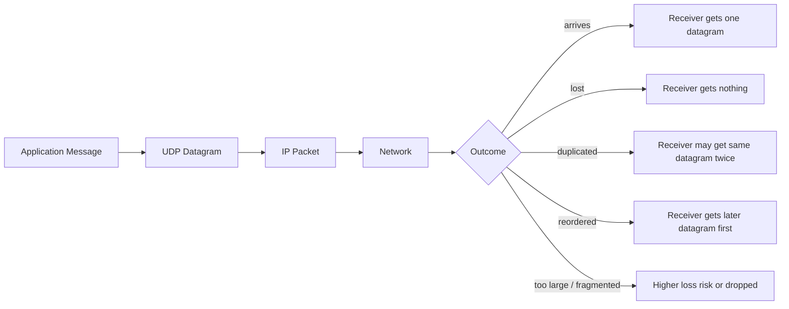
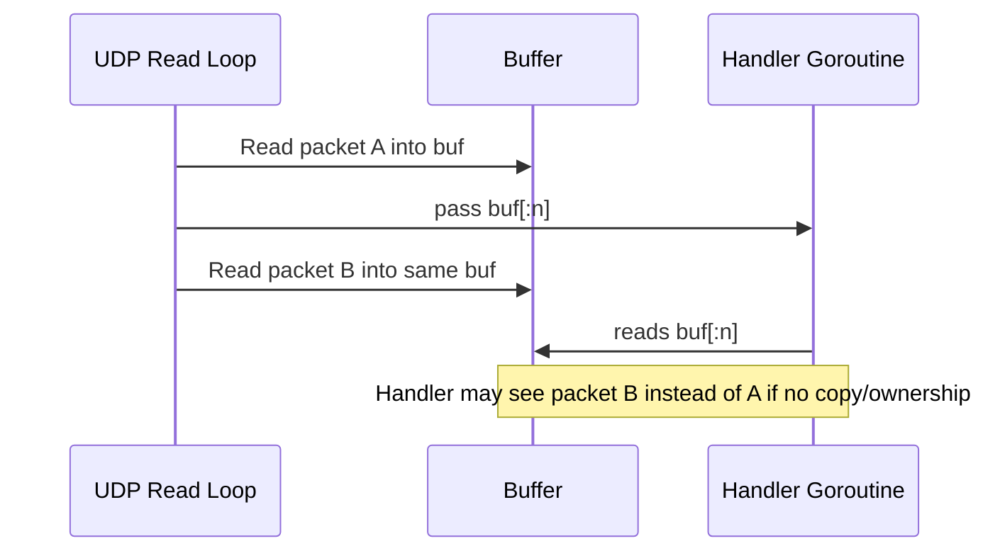
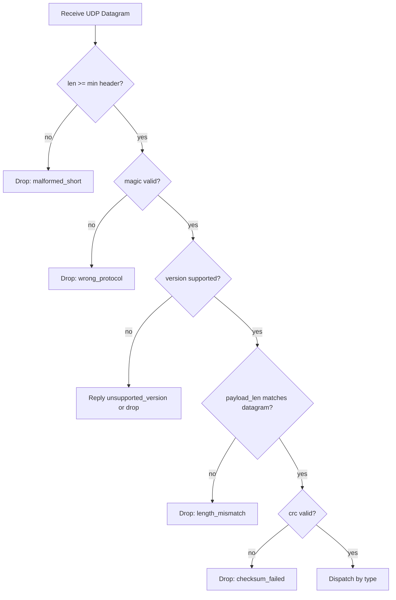
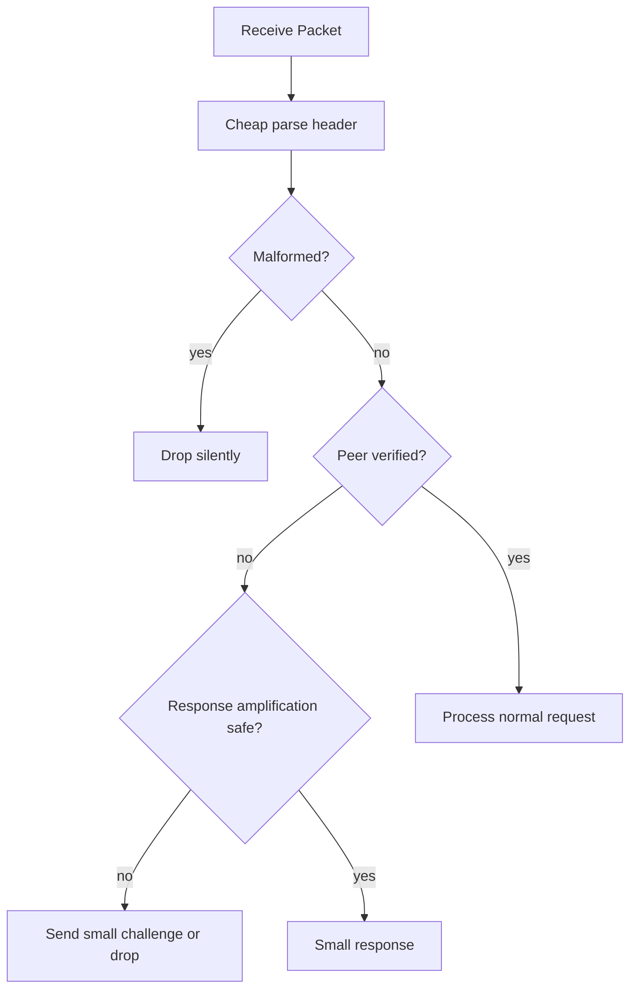
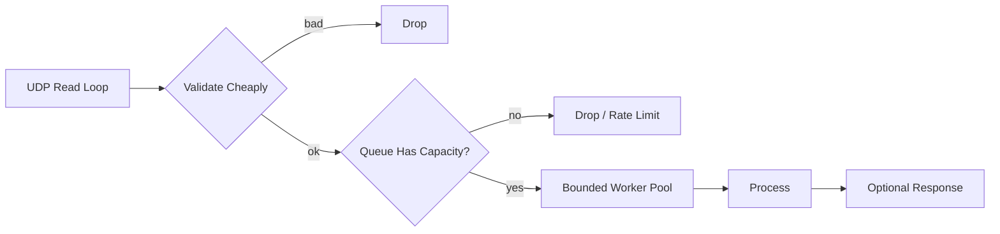

# learn-go-io-buffer-byte-stream-file-network-data-transfer-part-025.md

# Part 025 — UDP dan Packet IO: Datagram Model, MTU, Loss, Idempotence, dan Packet Protocol Design

> Series: `learn-go-io-buffer-byte-stream-file-network-data-transfer`  
> Target Go: Go 1.26.x  
> Untuk: Java software engineer yang ingin memahami Go IO/networking pada level production engineering handbook

---

## 0. Posisi Part Ini Dalam Series

Pada part sebelumnya kita sudah membahas:

- fondasi IO (`io.Reader`, `io.Writer`, buffer, stream),
- file dan filesystem,
- serialization, framing, compression, archive,
- pipeline composition,
- networking foundation,
- TCP server,
- TCP client.

Sekarang kita masuk ke model yang berbeda secara fundamental: **UDP dan packet IO**.

TCP memberi ilusi stream byte yang reliable, ordered, connection-oriented. UDP tidak begitu. UDP memberi kamu **datagram boundary**: satu operasi kirim menghasilkan satu packet/message pada level API, tetapi jaringan tidak menjamin packet itu sampai, berurutan, tidak duplikat, atau tidak terpotong oleh constraint path.

Mental shift terbesar:

```text
TCP:  kamu membaca stream byte dan harus membuat framing sendiri.
UDP:  kamu menerima message/datagram utuh, tetapi harus membuat reliability sendiri bila dibutuhkan.
```

UDP bukan “TCP yang lebih cepat”. UDP adalah kontrak transport yang berbeda.

---

## 1. Learning Goals

Setelah part ini, kamu harus bisa:

1. Menjelaskan perbedaan semantik **stream** vs **datagram**.
2. Mendesain UDP receiver yang benar terhadap truncation, loss, duplication, reordering, dan spoofing.
3. Memilih API Go yang tepat: `net.PacketConn`, `net.UDPConn`, `ListenPacket`, `ListenUDP`, `DialUDP`, `ReadFrom`, `WriteTo`, `ReadMsgUDP`.
4. Memahami kapan UDP cocok dan kapan tidak cocok.
5. Mendesain packet protocol yang bounded, versioned, idempotent, observable, dan defensif.
6. Memahami MTU, fragmentation, packet size limit, dan konsekuensi production-nya.
7. Menghubungkan UDP dengan use case nyata: DNS-like query, telemetry/log firehose, discovery, heartbeat, gaming/realtime, custom transport, local agent protocol.
8. Menulis UDP service di Go yang punya deadline, resource limit, error taxonomy, metrics, dan testability.

---

## 2. Mental Model Utama: Datagram Bukan Stream

### 2.1 TCP Stream

Di TCP:

```text
client Write("hello")
client Write("world")

server Read(buf) bisa menerima:
- "helloworld"
- "hello"
- "hel"
- "lowor"
- dll.
```

TCP tidak menjaga boundary aplikasi. TCP menjaga byte order dan reliability, tetapi **message boundary hilang**.

### 2.2 UDP Datagram

Di UDP:

```text
client send packet A
client send packet B

server receive:
- packet A utuh
- packet B utuh
- atau salah satu hilang
- atau urutan B lalu A
- atau duplikat A
- atau tidak ada sama sekali
```

UDP menjaga boundary message pada API. Satu receive mengambil satu datagram. Tetapi tidak ada jaminan reliability/order.



---

## 3. Java Engineer Bridge: UDP di Java vs Go

Di Java, kamu mungkin mengenal:

- `DatagramSocket`
- `DatagramPacket`
- `DatagramChannel`
- `ByteBuffer`
- `Selector` untuk NIO multiplexing

Di Go, mental model-nya lebih sederhana secara API:

| Concern | Java | Go |
|---|---|---|
| Datagram socket | `DatagramSocket` | `net.PacketConn`, `*net.UDPConn` |
| Packet payload | `byte[]`, `ByteBuffer` | `[]byte` |
| Receive from arbitrary peer | `receive(DatagramPacket)` | `ReadFrom`, `ReadFromUDP`, `ReadFromUDPAddrPort` |
| Send to arbitrary peer | `send(DatagramPacket)` | `WriteTo`, `WriteToUDP`, `WriteToUDPAddrPort` |
| Connected UDP | `connect()` on socket/channel | `DialUDP`, `Dialer.DialUDP`, `UDPConn` with remote addr |
| Timeout | `setSoTimeout`, channel config | `SetReadDeadline`, `SetWriteDeadline`, context for dial |
| Multiplexing | Selector/event loop | goroutines + runtime netpoller |
| Address model | `InetSocketAddress` | `net.UDPAddr`, `netip.AddrPort` |

Go tidak membuat kamu membangun explicit selector loop seperti Java NIO untuk typical server. Kamu biasanya membuat satu goroutine read loop dan memproses packet dengan bounded concurrency atau queue.

Namun kemudahan ini tidak menghapus kewajiban desain:

- buffer harus bounded,
- packet harus divalidasi,
- goroutine tidak boleh dibuat tanpa batas,
- retry/idempotency harus jelas,
- source address tidak boleh langsung dipercaya,
- deadline harus eksplisit.

---

## 4. Paket Go yang Relevan

### 4.1 `net`

Paket utama untuk UDP:

- `net.PacketConn`
- `net.UDPConn`
- `net.UDPAddr`
- `net.ListenPacket`
- `net.ListenUDP`
- `net.DialUDP`
- `net.Dialer`
- `netip.AddrPort`

Go 1.26 menambah method typed dialing pada `net.Dialer`, termasuk `DialUDP`, sehingga kamu bisa menggabungkan context-aware dialing dengan typed address model.

### 4.2 `net/netip`

`netip.Addr`, `netip.AddrPort`, dan `netip.Prefix` adalah representasi IP modern:

- immutable,
- comparable,
- lebih aman sebagai map key,
- tidak bergantung ke slice mutable seperti `net.IP`.

Untuk code baru, gunakan `netip.AddrPort` saat cocok.

### 4.3 `encoding/binary`

Dipakai untuk header packet binary:

- version,
- type,
- flags,
- sequence number,
- timestamp,
- length,
- checksum.

### 4.4 `hash/crc32` / `hash/crc64`

Dipakai untuk checksum payload atau frame.

### 4.5 `context`

Context berguna pada fase dial dan lifecycle service, tetapi operasi `ReadFrom`/`WriteTo` di socket umumnya dikontrol via deadline atau close.

---

## 5. Kontrak `net.PacketConn`

`PacketConn` adalah interface umum untuk packet-oriented network connection.

Secara konseptual:

```go
// simplified mental shape, not exact full docs
type PacketConn interface {
    ReadFrom(p []byte) (n int, addr Addr, err error)
    WriteTo(p []byte, addr Addr) (n int, err error)
    Close() error
    LocalAddr() Addr
    SetDeadline(t time.Time) error
    SetReadDeadline(t time.Time) error
    SetWriteDeadline(t time.Time) error
}
```

Hal penting:

1. `ReadFrom` membaca **satu packet**.
2. `addr` adalah source address packet.
3. `WriteTo` mengirim **satu packet** ke destination address.
4. Deadline berlaku pada operasi IO berikutnya.
5. Jika buffer terlalu kecil, datagram bisa terpotong atau sisa packet dibuang tergantung OS/API behavior. Desain production harus menganggap packet oversized sebagai error protocol.

---

## 6. `net.UDPConn`: Implementasi UDP

`*net.UDPConn` mengimplementasikan:

- `net.Conn` untuk connected UDP,
- `net.PacketConn` untuk packet-oriented usage.

API penting:

```go
func ListenUDP(network string, laddr *UDPAddr) (*UDPConn, error)
func DialUDP(network string, laddr, raddr *UDPAddr) (*UDPConn, error)

func (c *UDPConn) ReadFromUDP(b []byte) (int, *UDPAddr, error)
func (c *UDPConn) WriteToUDP(b []byte, addr *UDPAddr) (int, error)

func (c *UDPConn) ReadFromUDPAddrPort(b []byte) (int, netip.AddrPort, error)
func (c *UDPConn) WriteToUDPAddrPort(b []byte, addr netip.AddrPort) (int, error)
```

Pada code baru, `AddrPort` sering lebih enak untuk identity peer karena comparable.

---

## 7. UDP Server Minimal: Benar Secara Struktur, Belum Production

```go
package main

import (
    "log"
    "net"
)

func main() {
    addr := net.UDPAddr{IP: net.ParseIP("0.0.0.0"), Port: 9000}

    conn, err := net.ListenUDP("udp", &addr)
    if err != nil {
        log.Fatal(err)
    }
    defer conn.Close()

    buf := make([]byte, 1500)

    for {
        n, peer, err := conn.ReadFromUDP(buf)
        if err != nil {
            log.Printf("read udp: %v", err)
            continue
        }

        packet := buf[:n]
        log.Printf("from=%v bytes=%d payload=%q", peer, n, packet)

        _, err = conn.WriteToUDP([]byte("ok"), peer)
        if err != nil {
            log.Printf("write udp to %v: %v", peer, err)
        }
    }
}
```

Ini cukup untuk memahami API, tetapi belum production karena:

- tidak ada deadline,
- tidak ada shutdown path,
- tidak ada packet validation,
- tidak ada max payload semantic,
- tidak ada metrics,
- tidak ada rate limit,
- tidak ada resource/backpressure model,
- buffer dipakai ulang dan tidak boleh di-share async tanpa copy.

---

## 8. Critical Rule: Buffer Reuse dan Ownership

Dalam read loop UDP:

```go
buf := make([]byte, 2048)
for {
    n, addr, err := conn.ReadFromUDPAddrPort(buf)
    packet := buf[:n]
    go handle(packet, addr) // BUG jika handle berjalan setelah buffer berubah
}
```

Bug: `packet` mengarah ke backing array yang sama. Iterasi berikutnya overwrite buffer. Handler async bisa membaca data salah.

Solusi 1: proses synchronous.

```go
for {
    n, addr, err := conn.ReadFromUDPAddrPort(buf)
    if err != nil { continue }
    handle(buf[:n], addr)
}
```

Solusi 2: copy sebelum async.

```go
for {
    n, addr, err := conn.ReadFromUDPAddrPort(buf)
    if err != nil { continue }

    packet := make([]byte, n)
    copy(packet, buf[:n])

    go handle(packet, addr)
}
```

Solusi 3: buffer pool dengan ownership eksplisit.

```go
type Packet struct {
    Addr netip.AddrPort
    Data []byte
}
```

Tetapi pooling harus disiplin: jangan return buffer ke pool sebelum consumer selesai.



---

## 9. UDP Tidak Reliable: Failure Matrix

| Failure | TCP | UDP | Design implication |
|---|---:|---:|---|
| Packet loss | hidden/retransmitted | visible as missing message | app-level retry if needed |
| Duplicate delivery | hidden | possible | idempotency/dedupe |
| Reordering | hidden | possible | sequence number if order matters |
| Congestion control | built in | mostly app responsibility | rate limit/pacing |
| Message boundary | absent | preserved | no stream framing needed, but packet max needed |
| Backpressure | stream write blocks | send may drop later or buffer locally | explicit pacing/drop policy |
| Connection state | yes | no transport connection | app session must be explicit |
| Peer authenticity | connection helps slightly | source address can be spoofed in many contexts | auth/token/challenge if security matters |

---

## 10. Kapan UDP Cocok?

UDP cocok ketika:

1. Message kecil dan self-contained.
2. Data lama cepat basi.
3. Loss lebih baik daripada latency tinggi.
4. App bisa tolerate missing/duplicate/reorder.
5. Kamu ingin query-response sederhana seperti DNS-like protocol.
6. Kamu ingin broadcast/multicast/local discovery.
7. Kamu ingin realtime telemetry/metrics/fire-and-forget dengan sampling.
8. Kamu membangun protocol sendiri yang punya reliability khusus.

UDP buruk ketika:

1. Kamu butuh transfer file reliable tanpa ingin membangun reliability layer.
2. Kamu butuh ordered byte stream.
3. Payload besar.
4. Kamu tidak bisa tolerate loss.
5. Kamu butuh simple security dan connection semantics.
6. Kamu ingin melewati NAT/firewall enterprise tanpa masalah.
7. Kamu tidak siap mengimplementasikan congestion control/backoff.

Rule of thumb:

```text
Jika kamu akan membangun ulang setengah TCP di atas UDP, pakai TCP atau QUIC kecuali ada alasan kuat.
```

---

## 11. MTU dan Packet Size

### 11.1 Apa Itu MTU?

MTU adalah Maximum Transmission Unit: ukuran maksimum frame yang bisa lewat satu link tanpa fragmentasi pada layer bawah.

Ethernet umum: 1500 bytes. Setelah IP/UDP header, payload aman sering lebih kecil.

Rough mental model IPv4:

```text
Ethernet MTU:      1500 bytes
IPv4 header:        20 bytes (minimum)
UDP header:          8 bytes
Safe UDP payload: 1472 bytes (tanpa extra headers)
```

Namun di internet nyata:

- VPN menambah overhead,
- IPv6 header beda,
- tunnels menambah overhead,
- path MTU bisa lebih kecil,
- fragmentasi meningkatkan loss risk,
- firewall bisa drop fragmented packets.

Praktik defensif:

```text
Untuk internet/public network, pilih payload UDP jauh di bawah MTU.
Misalnya 1200 bytes sering dipakai sebagai safe-ish baseline modern transport.
```

Angka 1200 juga familiar dari QUIC/IPv6 minimum MTU considerations, tetapi untuk protocol custom tetap validasi terhadap kebutuhan environment.

### 11.2 Jangan Kirim Payload Besar Langsung

Anti-pattern:

```go
payload := make([]byte, 64*1024)
conn.WriteToUDPAddrPort(payload, peer)
```

Masalah:

- bisa gagal dengan message too long,
- bisa fragmentasi,
- fragment loss berarti seluruh datagram hilang,
- receiver buffer mungkin terlalu kecil,
- amplification risk,
- latency spike.

### 11.3 Batas Packet sebagai Kontrak Protocol

Tentukan batas sejak awal:

```go
const MaxDatagramSize = 1200
```

Jika aplikasi butuh payload lebih besar, desain chunking:

```text
message_id | chunk_index | chunk_count | payload
```

Tetapi chunking UDP langsung membawa banyak complexity:

- reassembly timeout,
- memory bound per peer,
- duplicate chunk,
- missing chunk,
- spoofed chunk,
- checksum full message,
- cleanup state.

Untuk transfer besar, sering lebih baik TCP/HTTP/QUIC.

---

## 12. Connected UDP vs Unconnected UDP

### 12.1 Unconnected UDP

Server umum:

```go
conn, _ := net.ListenUDP("udp", laddr)
n, peer, err := conn.ReadFromUDPAddrPort(buf)
_, err = conn.WriteToUDPAddrPort(resp, peer)
```

Satu socket menerima packet dari banyak peer.

Cocok untuk:

- UDP server,
- discovery,
- stateless query-response,
- metrics collector.

### 12.2 Connected UDP

Client umum:

```go
raddr := net.UDPAddr{IP: net.ParseIP("127.0.0.1"), Port: 9000}
conn, err := net.DialUDP("udp", nil, &raddr)
if err != nil { /* handle */ }
defer conn.Close()

_, err = conn.Write([]byte("ping"))
n, err := conn.Read(buf)
```

Connected UDP tidak berarti transport handshake seperti TCP. Artinya socket dikaitkan dengan remote address tertentu:

- bisa pakai `Read`/`Write`,
- OS bisa filter packet dari peer lain,
- beberapa ICMP errors mungkin lebih visible,
- API lebih sederhana untuk client satu tujuan.

### 12.3 Go 1.26 Typed Dialer

Di Go 1.26, `net.Dialer` punya method typed seperti `DialUDP` dengan context. Ini berguna jika kamu sudah punya `netip.AddrPort` dan ingin context-aware dial tanpa string parsing/dispatch generik.

Secara desain:

```go
var d net.Dialer
ctx, cancel := context.WithTimeout(context.Background(), 2*time.Second)
defer cancel()

// Pseudocode shape; cek signature aktual di docs Go 1.26.x.
conn, err := d.DialUDP(ctx, "udp", localAddrPort, remoteAddrPort)
```

Prinsipnya:

- context mengontrol fase dial,
- setelah connection object terbentuk, operasi read/write tetap perlu deadline/close,
- typed address mengurangi kesalahan parsing string.

---

## 13. Deadline Model di UDP

UDP read bisa block menunggu packet.

Gunakan deadline:

```go
if err := conn.SetReadDeadline(time.Now().Add(5 * time.Second)); err != nil {
    return err
}

n, addr, err := conn.ReadFromUDPAddrPort(buf)
if err != nil {
    if ne, ok := err.(net.Error); ok && ne.Timeout() {
        // timeout
    }
    return err
}
```

Untuk server long-running, biasanya tidak set deadline setiap read kecuali butuh periodic shutdown check. Shutdown bisa dilakukan dengan `Close()` dari goroutine lain.

Pattern:

```go
done := make(chan struct{})

go func() {
    <-ctx.Done()
    _ = conn.Close() // unblock ReadFrom
}()

for {
    n, addr, err := conn.ReadFromUDPAddrPort(buf)
    if err != nil {
        select {
        case <-ctx.Done():
            return ctx.Err()
        default:
            // log transient error
            continue
        }
    }
    handle(buf[:n], addr)
}
```

---

## 14. Production UDP Server Skeleton

```go
package udpserver

import (
    "context"
    "errors"
    "log/slog"
    "net"
    "net/netip"
    "sync"
    "time"
)

const MaxDatagramSize = 1200

type Handler interface {
    HandlePacket(ctx context.Context, peer netip.AddrPort, packet []byte) ([]byte, error)
}

type Server struct {
    Conn    *net.UDPConn
    Handler Handler
    Logger  *slog.Logger

    MaxInFlight int
}

func (s *Server) Serve(ctx context.Context) error {
    if s.Conn == nil {
        return errors.New("nil UDP conn")
    }
    if s.Handler == nil {
        return errors.New("nil handler")
    }
    if s.Logger == nil {
        s.Logger = slog.Default()
    }
    if s.MaxInFlight <= 0 {
        s.MaxInFlight = 1024
    }

    sem := make(chan struct{}, s.MaxInFlight)
    var wg sync.WaitGroup

    go func() {
        <-ctx.Done()
        _ = s.Conn.Close()
    }()

    buf := make([]byte, MaxDatagramSize)

    for {
        n, peer, err := s.Conn.ReadFromUDPAddrPort(buf)
        if err != nil {
            if ctx.Err() != nil {
                wg.Wait()
                return ctx.Err()
            }

            s.Logger.Warn("udp read failed", "error", err)
            continue
        }

        packet := make([]byte, n)
        copy(packet, buf[:n])

        select {
        case sem <- struct{}{}:
        default:
            s.Logger.Warn("udp packet dropped: server overloaded", "peer", peer.String())
            continue
        }

        wg.Add(1)
        go func() {
            defer wg.Done()
            defer func() { <-sem }()

            reqCtx, cancel := context.WithTimeout(ctx, 2*time.Second)
            defer cancel()

            resp, err := s.Handler.HandlePacket(reqCtx, peer, packet)
            if err != nil {
                s.Logger.Warn("udp packet handle failed", "peer", peer.String(), "error", err)
                return
            }
            if len(resp) == 0 {
                return
            }
            if len(resp) > MaxDatagramSize {
                s.Logger.Error("udp response too large", "peer", peer.String(), "bytes", len(resp))
                return
            }

            if err := s.Conn.SetWriteDeadline(time.Now().Add(1 * time.Second)); err != nil {
                s.Logger.Warn("set udp write deadline failed", "error", err)
                return
            }

            _, err = s.Conn.WriteToUDPAddrPort(resp, peer)
            if err != nil {
                s.Logger.Warn("udp write failed", "peer", peer.String(), "error", err)
            }
        }()
    }
}
```

Catatan:

1. Ini copy packet sebelum async handler.
2. Ada `MaxInFlight` untuk admission control.
3. Ada deadline per request.
4. Ada response size check.
5. `Close()` digunakan untuk unblock read saat shutdown.
6. Masih perlu metrics/rate limit/auth tergantung use case.

---

## 15. Packet Protocol Minimal yang Defensif

Misalnya kita ingin protocol binary sederhana:

```text
0                   1                   2                   3
+-------------------+-------------------+-------------------+
| magic[0..1]       | version           | type              |
+-------------------+-------------------+-------------------+
| flags             | header_len        | payload_len       |
+-------------------+-------------------+-------------------+
| request_id uint64                                      ... |
+-----------------------------------------------------------+
| crc32 uint32                                             |
+-----------------------------------------------------------+
| payload bytes                                            |
+-----------------------------------------------------------+
```

Lebih eksplisit:

| Field | Size | Purpose |
|---|---:|---|
| magic | 2 | identify protocol |
| version | 1 | compatibility |
| type | 1 | request/response/event/error |
| flags | 1 | compression/auth/etc |
| header_len | 1 | future extension |
| payload_len | 2 | bounded payload size |
| request_id | 8 | dedupe/correlation |
| crc32 | 4 | corruption/truncation check |
| payload | N | body |

Header size fixed minimal: 20 bytes.



---

## 16. Encoding Packet Header di Go

```go
package packet

import (
    "encoding/binary"
    "errors"
    "hash/crc32"
)

const (
    Magic0        = byte('G')
    Magic1        = byte('P')
    Version1      = byte(1)
    HeaderLen     = 20
    MaxPayloadLen = 1180 // if MaxDatagramSize is 1200
)

type Type byte

const (
    TypePing Type = 1
    TypePong Type = 2
    TypeData Type = 3
    TypeErr  Type = 255
)

type Header struct {
    Version    byte
    Type       Type
    Flags      byte
    RequestID  uint64
    PayloadLen uint16
    CRC32      uint32
}

var (
    ErrShortPacket    = errors.New("short packet")
    ErrBadMagic       = errors.New("bad magic")
    ErrBadVersion     = errors.New("bad version")
    ErrLengthMismatch = errors.New("length mismatch")
    ErrPayloadTooBig  = errors.New("payload too big")
    ErrBadChecksum    = errors.New("bad checksum")
)

func Encode(dst []byte, typ Type, requestID uint64, payload []byte) ([]byte, error) {
    if len(payload) > MaxPayloadLen {
        return nil, ErrPayloadTooBig
    }
    need := HeaderLen + len(payload)
    if cap(dst) < need {
        dst = make([]byte, need)
    }
    dst = dst[:need]

    dst[0] = Magic0
    dst[1] = Magic1
    dst[2] = Version1
    dst[3] = byte(typ)
    dst[4] = 0 // flags
    dst[5] = HeaderLen
    binary.BigEndian.PutUint16(dst[6:8], uint16(len(payload)))
    binary.BigEndian.PutUint64(dst[8:16], requestID)

    copy(dst[HeaderLen:], payload)

    crc := crc32.ChecksumIEEE(dst[HeaderLen:])
    binary.BigEndian.PutUint32(dst[16:20], crc)

    return dst, nil
}

func Decode(packet []byte) (Header, []byte, error) {
    var h Header

    if len(packet) < HeaderLen {
        return h, nil, ErrShortPacket
    }
    if packet[0] != Magic0 || packet[1] != Magic1 {
        return h, nil, ErrBadMagic
    }
    if packet[2] != Version1 {
        return h, nil, ErrBadVersion
    }
    if packet[5] != HeaderLen {
        return h, nil, ErrShortPacket
    }

    h.Version = packet[2]
    h.Type = Type(packet[3])
    h.Flags = packet[4]
    h.PayloadLen = binary.BigEndian.Uint16(packet[6:8])
    h.RequestID = binary.BigEndian.Uint64(packet[8:16])
    h.CRC32 = binary.BigEndian.Uint32(packet[16:20])

    if int(h.PayloadLen) > MaxPayloadLen {
        return h, nil, ErrPayloadTooBig
    }
    if len(packet) != HeaderLen+int(h.PayloadLen) {
        return h, nil, ErrLengthMismatch
    }

    payload := packet[HeaderLen:]
    if crc32.ChecksumIEEE(payload) != h.CRC32 {
        return h, nil, ErrBadChecksum
    }

    return h, payload, nil
}
```

Design notes:

1. Big endian dipilih sebagai network byte order.
2. Magic mencegah salah interpretasi packet asing.
3. Version field wajib untuk evolution.
4. Request ID membantu correlation/dedupe.
5. Payload length dicek terhadap total packet length.
6. CRC hanya mendeteksi corruption, bukan autentikasi.
7. Batas payload ada di protocol, bukan hanya buffer.

---

## 17. Idempotence di UDP

Karena UDP bisa duplicate, handler harus aman.

### 17.1 Non-idempotent Operation Berbahaya

Misalnya packet:

```text
DEBIT account=123 amount=100
```

Jika packet terkirim dua kali atau retry client membuat server menerima dua kali, saldo terdebit dua kali.

Solusi:

- request ID,
- dedupe window,
- idempotency key,
- operation log,
- response cache,
- business-level idempotency.

### 17.2 Dedupe Window Sederhana

```go
type Dedupe struct {
    mu      sync.Mutex
    ttl     time.Duration
    entries map[uint64]time.Time
}

func NewDedupe(ttl time.Duration) *Dedupe {
    return &Dedupe{
        ttl:     ttl,
        entries: make(map[uint64]time.Time),
    }
}

func (d *Dedupe) Seen(id uint64, now time.Time) bool {
    d.mu.Lock()
    defer d.mu.Unlock()

    for k, exp := range d.entries {
        if now.After(exp) {
            delete(d.entries, k)
        }
    }

    if exp, ok := d.entries[id]; ok && now.Before(exp) {
        return true
    }

    d.entries[id] = now.Add(d.ttl)
    return false
}
```

Untuk production besar:

- map global bisa jadi bottleneck,
- perlu shard per hash,
- TTL cleanup harus bounded,
- request ID harus scoped per tenant/client,
- memory limit wajib,
- response cache lebih baik daripada sekadar drop duplicate.

---

## 18. Ordering dan Sequence Number

Jika order penting, UDP membutuhkan sequence number.

Packet:

```text
session_id | seq | payload
```

Receiver policy:

| Policy | Behavior | Cocok untuk |
|---|---|---|
| latest-wins | packet lama di-drop | telemetry state, game position |
| reorder buffer | tahan packet sampai gap datang | media/control stream terbatas |
| request retransmit | minta ulang missing seq | custom reliable protocol |
| accept out-of-order | proses independent event | idempotent events |

Jangan otomatis memilih reorder buffer. Reorder buffer bisa menyebabkan:

- head-of-line blocking,
- memory growth,
- latency spike,
- DoS via missing packet gap.

Untuk banyak real-time system, **latest-wins** lebih baik.

---

## 19. Retry di UDP Client

UDP request-response perlu timeout dan retry.

```go
func Query(ctx context.Context, conn *net.UDPConn, req []byte, maxResp int) ([]byte, error) {
    if len(req) > MaxDatagramSize {
        return nil, errors.New("request too large")
    }

    deadline, ok := ctx.Deadline()
    if ok {
        _ = conn.SetDeadline(deadline)
    }

    if _, err := conn.Write(req); err != nil {
        return nil, err
    }

    buf := make([]byte, maxResp)
    n, err := conn.Read(buf)
    if err != nil {
        return nil, err
    }
    return buf[:n], nil
}
```

Retry loop:

```go
func QueryWithRetry(
    ctx context.Context,
    conn *net.UDPConn,
    buildReq func(attempt int) ([]byte, uint64, error),
    validateResp func(requestID uint64, resp []byte) error,
) ([]byte, error) {
    delays := []time.Duration{100 * time.Millisecond, 250 * time.Millisecond, 500 * time.Millisecond}

    var lastErr error
    for attempt, delay := range delays {
        req, requestID, err := buildReq(attempt)
        if err != nil {
            return nil, err
        }

        perAttemptCtx, cancel := context.WithTimeout(ctx, delay)
        resp, err := Query(perAttemptCtx, conn, req, MaxDatagramSize)
        cancel()

        if err == nil {
            if err := validateResp(requestID, resp); err == nil {
                return resp, nil
            } else {
                lastErr = err
                continue
            }
        }

        lastErr = err

        select {
        case <-ctx.Done():
            return nil, ctx.Err()
        default:
        }
    }

    return nil, lastErr
}
```

Production caveat:

- retry harus hanya untuk idempotent request,
- jangan retry semua client serentak tanpa jitter,
- retry bisa memperparah overload,
- response harus dicocokkan dengan request ID,
- stale response dari attempt lama harus diabaikan.

---

## 20. Rate Limit dan Amplification Defense

UDP rentan amplification attack:

```text
attacker spoofs victim IP
attacker sends small request to server
server sends large response to victim
```

Defensive rules:

1. Response size <= request size sebelum peer tervalidasi.
2. Gunakan stateless cookie/challenge untuk expensive/large response.
3. Rate limit per source prefix/address.
4. Drop malformed packet tanpa response.
5. Jangan kirim detailed error besar ke unauthenticated peer.
6. Jangan melakukan expensive work sebelum basic validation.



---

## 21. Security Model

UDP source address can be spoofed in many network contexts. Do not treat `(ip, port)` as identity by itself.

Security concerns:

| Threat | Explanation | Mitigation |
|---|---|---|
| spoofing | source IP/port may be forged | token/challenge/auth |
| replay | old packet resent | nonce, timestamp, request ID window |
| amplification | small request triggers big response | response cap, cookie, rate limit |
| parsing DoS | malformed packets hit parser | cheap validation, bounded parser |
| state exhaustion | fake peers create sessions | stateless validation first |
| reflection | server used to attack third party | do not send large unauthenticated response |
| information leak | error reveals internals | generic errors/drop |
| checksum confusion | CRC is not auth | use MAC/signature if trust needed |

If packet authenticity matters, use cryptographic authentication:

- HMAC over header+payload,
- nonce/timestamp,
- key rotation,
- constant-time compare for MAC,
- replay window.

Do not confuse CRC32 with security. CRC detects accidental corruption, not malicious tampering.

---

## 22. UDP dan NAT

UDP through NAT is trickier than TCP:

- NAT mapping can expire quickly,
- server sees public endpoint, not private endpoint,
- client may need keepalive,
- peer-to-peer may need STUN/TURN/ICE-like machinery,
- enterprise firewall may block UDP.

For business systems, UDP is usually best for:

- local agent,
- internal datacenter network,
- DNS-like infra protocol,
- telemetry where loss acceptable,
- not core transaction workflows.

---

## 23. Broadcast dan Multicast

UDP supports patterns TCP does not naturally support:

- broadcast within subnet,
- multicast groups,
- service discovery.

However production caveats:

- not all networks allow broadcast/multicast,
- cloud VPC often restricts multicast,
- broadcast can be noisy,
- discovery packets need authentication or at least filtering,
- local network attacks are realistic.

Keep discovery protocol small:

```text
DISCOVER service=my-agent version=1 nonce=...
OFFER service=my-agent addr=... nonce=... signature=...
```

---

## 24. Observability untuk UDP

TCP gives connection lifecycle metrics. UDP does not. Kamu harus membuat sendiri.

Metrics penting:

| Metric | Meaning |
|---|---|
| `udp_packets_received_total` | packet masuk |
| `udp_packets_sent_total` | packet keluar |
| `udp_packets_dropped_total{reason}` | drop by reason |
| `udp_malformed_total{reason}` | parse reject |
| `udp_bytes_received_total` | bytes in |
| `udp_bytes_sent_total` | bytes out |
| `udp_handler_duration_seconds` | processing latency |
| `udp_inflight_handlers` | load |
| `udp_rate_limited_total` | per-peer/prefix limit |
| `udp_duplicate_total` | dedupe hits |
| `udp_timeout_total` | client query timeout |
| `udp_retry_total` | retry count |
| `udp_response_too_large_total` | response contract violation |

Log fields:

- local address,
- peer address/prefix,
- packet type,
- version,
- request ID,
- payload length,
- drop reason,
- latency,
- error class.

Never log raw payload by default. Packet payload may contain secrets or user data.

---

## 25. Testing UDP Code

### 25.1 Unit Test Parser Without Network

Your parser must be testable with `[]byte` only.

```go
func TestDecodeRejectsBadMagic(t *testing.T) {
    packet := make([]byte, HeaderLen)
    packet[0] = 'X'
    packet[1] = 'Y'

    _, _, err := Decode(packet)
    if !errors.Is(err, ErrBadMagic) {
        t.Fatalf("expected bad magic, got %v", err)
    }
}
```

### 25.2 Integration Test With Local UDP

```go
func TestUDPRoundTrip(t *testing.T) {
    serverAddr, err := net.ResolveUDPAddr("udp", "127.0.0.1:0")
    if err != nil {
        t.Fatal(err)
    }

    serverConn, err := net.ListenUDP("udp", serverAddr)
    if err != nil {
        t.Fatal(err)
    }
    defer serverConn.Close()

    done := make(chan struct{})
    go func() {
        defer close(done)
        buf := make([]byte, 1200)
        n, peer, err := serverConn.ReadFromUDP(buf)
        if err != nil {
            return
        }
        _, _ = serverConn.WriteToUDP(buf[:n], peer)
    }()

    clientConn, err := net.DialUDP("udp", nil, serverConn.LocalAddr().(*net.UDPAddr))
    if err != nil {
        t.Fatal(err)
    }
    defer clientConn.Close()

    _ = clientConn.SetDeadline(time.Now().Add(2 * time.Second))

    if _, err := clientConn.Write([]byte("ping")); err != nil {
        t.Fatal(err)
    }

    buf := make([]byte, 1200)
    n, err := clientConn.Read(buf)
    if err != nil {
        t.Fatal(err)
    }
    if got := string(buf[:n]); got != "ping" {
        t.Fatalf("got %q", got)
    }

    <-done
}
```

### 25.3 Test Loss/Duplicate/Reorder at Handler Level

Do not rely only on real network loss. Simulate behavior at protocol layer:

```go
type Event struct {
    Seq  uint64
    Body string
}

func TestLatestWins(t *testing.T) {
    r := NewReceiver()
    r.Apply(Event{Seq: 10, Body: "new"})
    r.Apply(Event{Seq: 9, Body: "old"})

    if got := r.State(); got != "new" {
        t.Fatalf("expected latest state, got %q", got)
    }
}
```

### 25.4 Fuzz Parser

```go
func FuzzDecode(f *testing.F) {
    f.Add([]byte{})
    f.Add([]byte("GP\x01\x01"))

    f.Fuzz(func(t *testing.T, data []byte) {
        _, _, _ = Decode(data)
    })
}
```

Goal fuzzing:

- no panic,
- no unbounded allocation,
- no infinite loop,
- no out-of-range slice,
- expected error taxonomy.

---

## 26. Benchmarking UDP Protocol Code

Benchmark parsing separately from network.

```go
func BenchmarkDecode(b *testing.B) {
    payload := []byte("hello")
    packet, err := Encode(nil, TypePing, 123, payload)
    if err != nil {
        b.Fatal(err)
    }

    b.ReportAllocs()
    b.SetBytes(int64(len(packet)))

    for i := 0; i < b.N; i++ {
        _, _, err := Decode(packet)
        if err != nil {
            b.Fatal(err)
        }
    }
}
```

Benchmark network separately:

- local loopback latency,
- packet per second,
- drop under load,
- CPU per packet,
- allocation per packet,
- response size distribution,
- handler latency.

Important: loopback benchmark does not represent internet behavior.

---

## 27. Performance Engineering

### 27.1 Allocation

Hot UDP loop can receive many packets per second. Avoid allocation in parser.

Bad:

```go
payload := append([]byte(nil), packet[HeaderLen:]...)
```

Sometimes necessary for async ownership, but not in synchronous parser.

Better:

```go
h, payload, err := Decode(packet)
// payload is view into packet; caller must respect ownership
```

### 27.2 Buffer Pool

Pool can reduce allocation, but makes ownership complex.

```go
var packetPool = sync.Pool{
    New: func() any {
        b := make([]byte, MaxDatagramSize)
        return &b
    },
}
```

Use only if profiling shows allocation bottleneck.

Do not pool prematurely if it makes correctness unclear.

### 27.3 Batching

Go standard `net` API is simple per packet. For extreme packet rates, OS-specific batch syscalls may matter, but that moves beyond portable standard library and increases complexity.

Default advice:

1. Start with standard `net.UDPConn`.
2. Measure CPU/syscall/alloc/drop.
3. Only then consider OS-specific optimization.

### 27.4 Goroutine Per Packet Is Often Wrong

UDP packet rate can be very high. Goroutine per packet without bound can overload runtime.

Use:

- synchronous fast handler,
- bounded worker pool,
- bounded queue with drop policy,
- sharded workers by client/session key.



---

## 28. Worker Pool Pattern for UDP

```go
type Job struct {
    Peer netip.AddrPort
    Data []byte
}

type WorkerServer struct {
    Conn    *net.UDPConn
    Jobs    chan Job
    Handler func(context.Context, netip.AddrPort, []byte) ([]byte, error)
}

func (s *WorkerServer) StartWorkers(ctx context.Context, n int) {
    for i := 0; i < n; i++ {
        go func() {
            for {
                select {
                case <-ctx.Done():
                    return
                case job := <-s.Jobs:
                    resp, err := s.Handler(ctx, job.Peer, job.Data)
                    if err != nil || len(resp) == 0 {
                        continue
                    }
                    _ = s.Conn.SetWriteDeadline(time.Now().Add(time.Second))
                    _, _ = s.Conn.WriteToUDPAddrPort(resp, job.Peer)
                }
            }
        }()
    }
}
```

Need improvement for production:

- handle closed channel,
- do not share one context timeout for all jobs,
- metrics,
- response size cap,
- error logging,
- panic recovery policy,
- buffer lifecycle/pool return,
- rate limit per peer.

---

## 29. Per-Peer Rate Limit Design

Simplified token bucket per peer:

```go
type PeerLimiter struct {
    mu       sync.Mutex
    capacity int
    tokens   map[netip.AddrPort]int
    resetAt  map[netip.AddrPort]time.Time
    window   time.Duration
}

func (l *PeerLimiter) Allow(peer netip.AddrPort, now time.Time) bool {
    l.mu.Lock()
    defer l.mu.Unlock()

    if now.After(l.resetAt[peer]) {
        l.tokens[peer] = l.capacity
        l.resetAt[peer] = now.Add(l.window)
    }

    if l.tokens[peer] <= 0 {
        return false
    }
    l.tokens[peer]--
    return true
}
```

Production considerations:

- key by IP prefix, not full port, for public traffic,
- cap number of tracked peers,
- cleanup stale entries,
- shard limiter,
- separate malformed/drop limiter,
- consider authenticated identity after verification.

---

## 30. UDP Error Handling

Common classes:

| Error | Meaning | Response |
|---|---|---|
| timeout | no packet before deadline | retry or fail |
| closed connection | shutdown | stop loop |
| message too long | payload too large | reduce size / protocol error |
| permission denied | firewall/privileged port | config/deploy fix |
| network unreachable | routing issue | retry/backoff/report |
| connection refused | ICMP response on connected UDP maybe visible | peer unavailable |
| temporary/transient | environment-specific | limited retry |

Do not parse error strings as primary logic. Prefer `errors.Is`, `net.Error`, and structured context where available.

---

## 31. UDP and `ReadMsgUDP`

`ReadMsgUDP`/`WriteMsgUDP` expose out-of-band/control messages.

Use cases:

- packet info,
- destination address on multi-homed socket,
- ECN/TOS advanced handling,
- ancillary data,
- low-level network features.

For most application protocols, start with:

- `ReadFromUDPAddrPort`,
- `WriteToUDPAddrPort`.

Only use message-level APIs when you know what control messages you need and are ready for OS-specific behavior.

---

## 32. UDP With Compression?

Usually avoid compression per tiny packet.

Why:

- overhead can exceed savings,
- CPU cost per packet,
- compression bombs if decompressing untrusted input,
- response amplification risk,
- stateful compression across packets is complex and dangerous.

If used:

- only after authentication or strict size cap,
- compress payload before checksum/MAC depending design,
- include uncompressed size limit,
- reject compressed payload whose decompressed size exceeds max,
- benchmark with real payload.

---

## 33. UDP With JSON?

JSON over UDP is okay for small internal protocols, but be honest:

Pros:

- easy debug,
- interoperable,
- simple tooling.

Cons:

- larger payload,
- parse allocation,
- numeric ambiguity,
- harder strict schema,
- max packet risk.

Safer JSON-over-UDP rule:

```text
JSON packet must be small, bounded, one object, no streaming, no huge arrays, no nested untrusted blob.
```

Example envelope:

```json
{
  "v": 1,
  "type": "heartbeat",
  "id": "01HX...",
  "ts": 1710000000000,
  "node": "agent-17",
  "status": "ok"
}
```

Still include max datagram size and decode with bounded buffer.

---

## 34. Design Pattern: Heartbeat Protocol

Use case: local agents send heartbeat to coordinator.

Properties:

- heartbeat is periodic,
- latest state matters,
- losing one packet is acceptable,
- duplicate packet harmless,
- server should not respond with large payload.

Packet fields:

```text
magic | version | type=heartbeat | node_id | seq | timestamp | status | MAC
```

Receiver policy:

- validate MAC,
- parse node ID,
- if seq <= last_seq for node, ignore,
- update last seen,
- emit metric,
- optionally respond small ack.

This is a perfect UDP use case.

---

## 35. Design Pattern: Query-Response Protocol

Use case: DNS-like internal lookup.

Properties:

- request small,
- response small,
- timeout/retry acceptable,
- response matched with request ID,
- duplicate request can return same response.

Client:

```text
send request(id=123)
wait 100ms
if timeout retry id=123 or new attempt id with parent correlation
ignore response whose id != active request
```

Server:

```text
parse cheap
rate limit
lookup bounded
respond <= max response
cache duplicate id briefly
```

---

## 36. Design Pattern: Telemetry Firehose

Use case: high-volume metrics/log event where loss acceptable.

Properties:

- no per-event ack,
- sampling acceptable,
- local aggregation better than raw event flood,
- sequence useful for estimating loss.

Packet:

```text
agent_id | batch_seq | count | compressed? | payload
```

Caveat:

- compression can help batch, but cap decompressed size,
- lossy telemetry should be marked as lossy in dashboard,
- receiver overload should drop rather than collapse.

---

## 37. Anti-Patterns

### 37.1 Treating UDP Like TCP

Bad:

```text
Send file chunks over UDP without checksum, retry, order, or reassembly limits.
```

Consequence:

- corrupt file,
- stuck transfer,
- memory leak,
- impossible debugging.

### 37.2 Unbounded Goroutine Per Packet

Bad:

```go
for {
    n, addr, _ := conn.ReadFromUDPAddrPort(buf)
    packet := append([]byte(nil), buf[:n]...)
    go handle(addr, packet)
}
```

Without limit, attacker can create goroutine explosion.

### 37.3 Trusting Source Address

Bad:

```go
if isAdminIP(addr.Addr()) {
    performAdminOperation(packet)
}
```

IP-based trust is weak, especially with UDP. At minimum use network-level controls plus application authentication.

### 37.4 Sending Big Error Responses

Bad:

```go
conn.WriteToUDPAddrPort([]byte(debugStackTrace), peer)
```

This leaks internals and can amplify attacks.

### 37.5 No Packet Version

Bad:

```text
[type][payload]
```

No version means hard migration later.

---

## 38. Production Checklist

### Protocol

- [ ] Magic/header present.
- [ ] Version present.
- [ ] Type field present.
- [ ] Payload length bounded.
- [ ] Packet size <= safe max.
- [ ] Unknown type policy defined.
- [ ] Unknown version policy defined.
- [ ] Checksum/MAC semantics clear.
- [ ] Request ID/correlation ID present if response exists.
- [ ] Idempotency rule defined.
- [ ] Duplicate/reorder/loss policy defined.

### Server

- [ ] Read buffer size explicit.
- [ ] Buffer ownership safe.
- [ ] Bounded concurrency.
- [ ] Rate limit per peer/prefix.
- [ ] Malformed packet drop cheap.
- [ ] Response size cap.
- [ ] Shutdown unblocks read.
- [ ] Write deadline configured.
- [ ] Metrics by drop reason.
- [ ] Payload not logged raw.

### Client

- [ ] Timeout per attempt.
- [ ] Overall context deadline.
- [ ] Retry only for safe/idempotent operation.
- [ ] Jitter/backoff where needed.
- [ ] Response request ID validation.
- [ ] Stale response ignored.
- [ ] Max response size bounded.

### Security

- [ ] Source address not treated as identity.
- [ ] Amplification defense.
- [ ] Replay defense if authenticated.
- [ ] MAC/signature if tamper resistance needed.
- [ ] State allocation delayed until validation.
- [ ] Peer table bounded.

### Testing

- [ ] Parser unit tests.
- [ ] Fuzz malformed packet.
- [ ] Duplicate packet test.
- [ ] Reorder test.
- [ ] Loss/timeout test.
- [ ] Oversized packet test.
- [ ] Shutdown test.
- [ ] Rate limit test.

---

## 39. Mini Capstone: UDP Health Aggregator

### Requirement

Build local UDP service that receives health packet from agents.

Constraints:

- each packet <= 512 bytes,
- loss acceptable,
- latest heartbeat wins,
- stale/out-of-order sequence ignored,
- no large response,
- malformed packet dropped,
- metrics emitted.

### Protocol

```text
magic:      2 bytes  "GH"
version:    1 byte   1
kind:       1 byte   1 heartbeat
node_id:    8 bytes  uint64
seq:        8 bytes  uint64
unix_ms:    8 bytes  int64
status:     1 byte   0 ok, 1 warn, 2 critical
crc32:      4 bytes  checksum over header without crc + payload? choose consistently
```

### State

```go
type NodeState struct {
    Seq      uint64
    LastSeen time.Time
    Status   byte
}
```

### Update Rule

```text
if seq <= current.Seq:
    drop as stale_or_duplicate
else:
    update node state
```

### Why UDP Fits

- heartbeat is repeated,
- newest state matters,
- missing one heartbeat does not break correctness,
- low overhead,
- simple one-way message.

---

## 40. Decision Framework: UDP vs TCP vs HTTP vs QUIC

| Need | Best default |
|---|---|
| reliable file transfer | HTTP/TCP |
| request-response business API | HTTP/gRPC |
| realtime lossy updates | UDP/QUIC depending needs |
| browser client | HTTP/WebSocket/WebTransport depending platform |
| NAT-friendly secure transport | QUIC/TLS-based protocol |
| local discovery | UDP broadcast/multicast if network allows |
| telemetry lossy local agent | UDP can fit |
| financial transaction | not raw UDP |
| ordered durable event ingestion | TCP/HTTP/Kafka-like protocol |

Blunt engineering conclusion:

```text
Use UDP when the data model naturally tolerates loss/reorder/duplicate,
or when you deliberately build a transport layer above it.
Do not use UDP merely because someone says it is faster.
```

---

## 41. Deep Mental Model: UDP Is Message-Oriented, Not State-Oriented

TCP gives you a connection object that naturally encourages state:

```text
connection -> session -> ordered stream -> lifecycle
```

UDP gives you packets:

```text
packet -> source addr -> payload -> independent decision
```

If your application needs session state, you must design it explicitly:

- session ID,
- handshake,
- cookie,
- expiry,
- replay protection,
- migration policy,
- peer validation,
- resource cap.

No hidden state machine will save you.

---

## 42. Practical Engineering Heuristics

1. Keep UDP payload small.
2. Prefer one logical message per datagram.
3. Make every message self-describing enough to validate independently.
4. Treat duplicate as normal, not exceptional.
5. Treat loss as normal, not exceptional.
6. Avoid app-level “must process every packet” semantics unless you build reliability.
7. Add request ID to every request-response protocol.
8. Add sequence number to every state update stream.
9. Add version from day one.
10. Drop malformed unauthenticated packet silently or with tiny generic error.
11. Never allocate large state before authentication/validation.
12. Do not spawn unbounded goroutines.
13. Observe drop reasons.
14. Test parser more than socket wrapper.
15. Benchmark with real payload and realistic packet rate.

---

## 43. Relation to Upcoming Parts

Part ini memberi dasar packet IO. Part berikutnya akan membahas **Unix sockets dan local IPC**.

Bedanya:

- UDP: network datagram, possibly remote, unreliable.
- Unix socket: local IPC, can be stream or datagram depending mode, with local OS semantics.

Setelah itu kita masuk ke HTTP internals, di mana body kembali menjadi stream, connection pooling kembali penting, dan deadline/cancellation menjadi lebih layered.

---

## 44. Summary

UDP di Go mudah dipakai, tetapi sulit didesain benar jika dipakai untuk sistem production.

Core understanding:

```text
UDP preserves datagram boundary but does not provide reliability.
```

Konsekuensinya:

- packet bisa hilang,
- packet bisa duplikat,
- packet bisa reorder,
- source address tidak cukup sebagai identity,
- payload harus kecil,
- protocol harus bounded,
- handler harus idempotent atau dedupe-aware,
- retry harus sadar idempotency,
- server harus punya rate limit dan amplification defense.

Go API yang perlu kamu kuasai:

- `net.PacketConn`,
- `net.UDPConn`,
- `ListenPacket`,
- `ListenUDP`,
- `DialUDP`,
- `ReadFrom`,
- `WriteTo`,
- `ReadFromUDPAddrPort`,
- `WriteToUDPAddrPort`,
- deadline methods,
- `netip.AddrPort`.

Production-grade UDP bukan tentang membuat echo server. Production-grade UDP adalah tentang membuat packet protocol yang kecil, jelas, aman, bounded, observable, dan jujur terhadap sifat jaringan.

---

## 45. Latihan

### Latihan 1 — Parser

Buat binary packet parser dengan field:

```text
magic(2), version(1), type(1), request_id(8), payload_len(2), crc32(4), payload(N)
```

Requirement:

- reject short packet,
- reject unknown magic,
- reject unknown version,
- reject payload too large,
- reject length mismatch,
- reject checksum mismatch,
- no panic under fuzzing.

### Latihan 2 — UDP Echo dengan Request ID

Buat UDP server yang:

- menerima packet protocol dari latihan 1,
- membalas dengan request ID yang sama,
- membatasi response <= request size untuk unauthenticated peer,
- punya metrics sederhana per drop reason.

### Latihan 3 — Duplicate Handling

Tambahkan dedupe cache TTL 30 detik:

- jika request ID duplicate, return cached response,
- jika cache penuh, evict oldest atau drop dengan metric.

### Latihan 4 — Latest-Wins Heartbeat

Buat heartbeat receiver:

- key: node ID,
- field: seq, status, timestamp,
- jika seq lebih kecil/sama dari current, drop,
- jika lebih besar, update state.

### Latihan 5 — Failure Simulation

Buat test yang mensimulasikan:

- loss,
- duplicate,
- reorder,
- malformed packet,
- oversized packet,
- slow handler,
- shutdown while blocked on read.

---

## 46. Referensi

- Go standard library documentation: `net`
- Go standard library documentation: `net/netip`
- Go standard library documentation: `encoding/binary`
- Go standard library documentation: `hash/crc32`
- Go 1.26 release notes
- Go source: `net/udpsock.go`

<!-- NAVIGATION_FOOTER -->
<div class="page-nav">
<a href="./learn-go-io-buffer-byte-stream-file-network-data-transfer-part-024.md">⬅️ Part 024 — TCP Clients: Dial Strategy, Timeout Model, Retry Boundary, Reconnect, Pooling</a>
<a href="./index.md">📚 Kategori</a>
<a href="../../index.md">🏠 Home</a>
<a href="./learn-go-io-buffer-byte-stream-file-network-data-transfer-part-026.md">Part 026 — Unix Sockets dan Local IPC di Go: Domain Socket, Pipe, Local Transfer Pattern, dan Boundary antar Proses ➡️</a>
</div>
