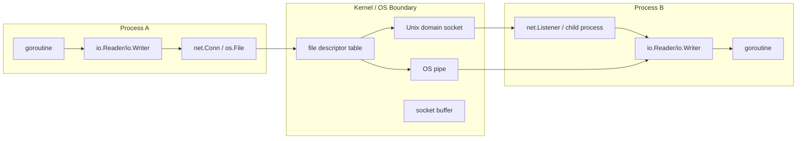
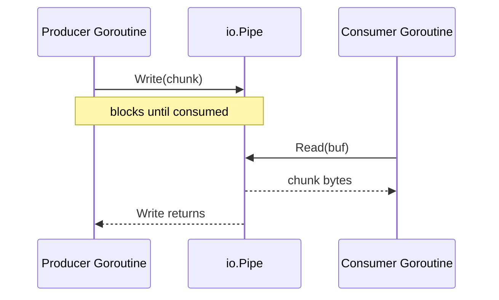
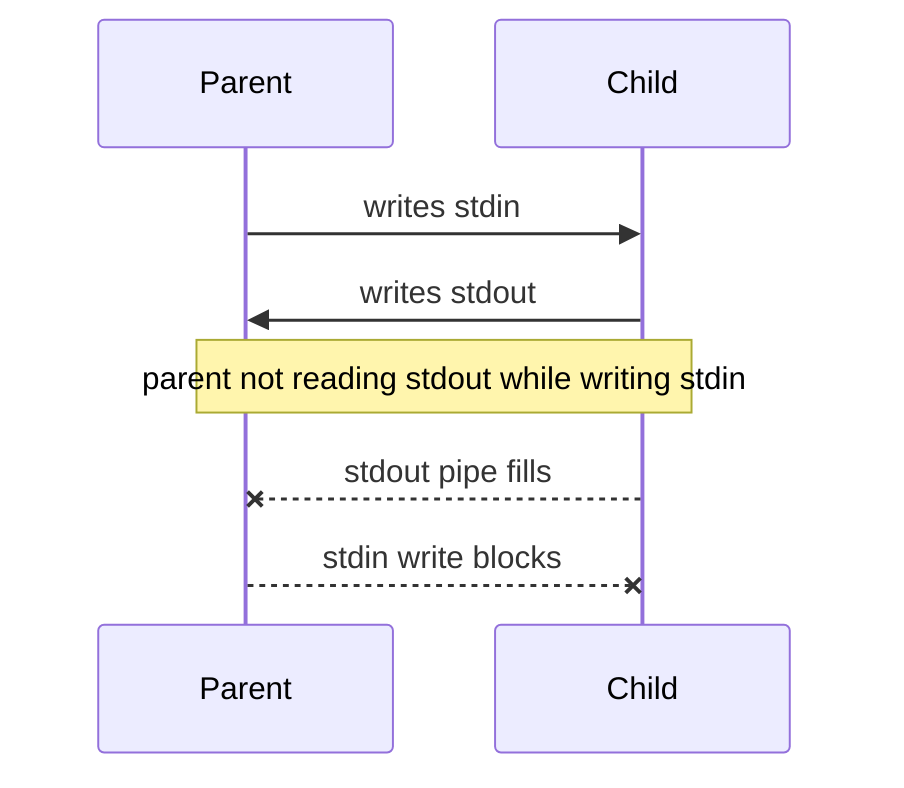
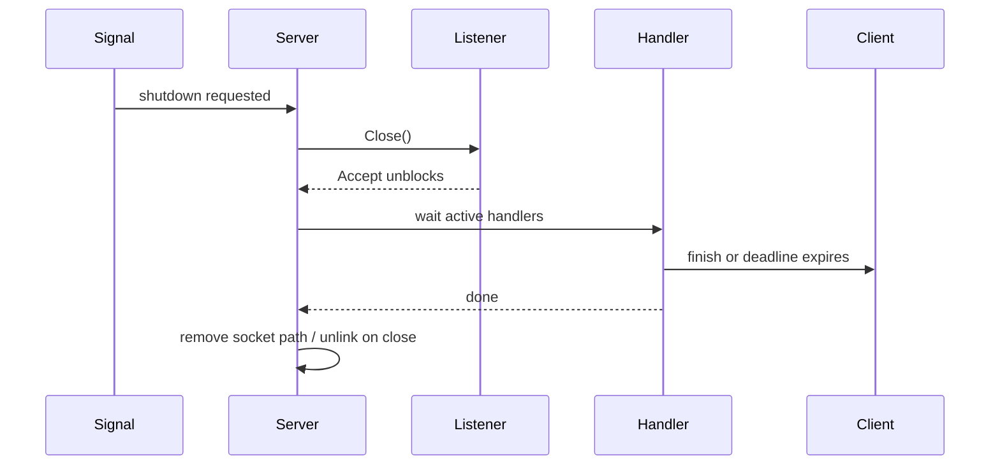

# learn-go-io-buffer-byte-stream-file-network-data-transfer-part-026.md

# Part 026 — Unix Sockets dan Local IPC di Go: Domain Socket, Pipe, Local Transfer Pattern, dan Boundary antar Proses

> Seri: `learn-go-io-buffer-byte-stream-file-network-data-transfer`  
> Target pembaca: Java software engineer yang ingin memahami Go IO sampai level production-grade  
> Target Go: Go 1.26.x  
> Fokus part ini: local inter-process communication, Unix domain socket, pipe, local-only service boundary, descriptor ownership, cleanup, permission, observability, dan failure model.

---

## 0. Posisi Part Ini dalam Seri

Sebelumnya kita sudah membahas:

- data movement model,
- kontrak `io.Reader` / `io.Writer`,
- buffering,
- file dan filesystem,
- serialization,
- compression,
- protocol design,
- TCP server/client,
- UDP packet IO.

Part ini membahas komunikasi **dalam satu host**.

Bukan komunikasi antar mesin.

Bukan API HTTP publik.

Bukan message broker.

Melainkan:

```text
process A  <---- local kernel boundary ---->  process B
```

Di Go, local IPC sering muncul dalam bentuk:

1. Unix domain socket.
2. `io.Pipe` in-memory dalam satu proses.
3. `os.Pipe` OS pipe antar file descriptor.
4. `os/exec` stdin/stdout/stderr pipe ke child process.
5. Local sidecar / agent / daemon pattern.
6. HTTP-over-Unix-socket untuk local API.

Part ini akan membangun mental model yang membedakan:

```text
in-process stream  vs  OS pipe  vs  Unix domain socket  vs  TCP loopback
```

---

## 1. Core Mental Model: IPC Bukan Sekadar “Network Tanpa Network”

Unix domain socket sering disederhanakan sebagai “TCP tapi local”. Itu berguna sebagai intuisi awal, tetapi tidak cukup untuk production design.

Perbedaannya:

| Aspek | TCP loopback | Unix domain socket |
|---|---|---|
| Address | IP + port | filesystem path atau platform-specific local address |
| Scope | network stack local host | local kernel IPC |
| Exposure risk | bisa salah-bind ke interface non-local | umumnya local-only, tapi permission path tetap penting |
| Access control | firewall, bind address, port ownership | filesystem directory/file permissions, process user/group, sometimes peer credential support via OS-specific APIs |
| Service discovery | host:port | socket path |
| Cleanup | port lepas saat listener close | pathname socket bisa stale jika crash |
| Protocol | stream or packet depending network | `unix`, `unixgram`, `unixpacket` where supported |
| Operational fit | local dev, simple API, cross-platform-ish | sidecar/daemon, local privileged broker, reverse proxy upstream, container shared volume |

Package `net` menyediakan interface portable untuk network IO, termasuk TCP/IP, UDP, DNS, dan Unix domain sockets. API dasarnya tetap mengikuti bentuk `Dial`, `Listen`, `Accept`, `net.Conn`, dan `net.Listener`.

Mental model production:

```text
Unix socket adalah endpoint lokal yang tetap berada di kernel boundary.
Ia bukan function call.
Ia tetap bisa blocking, timeout, partial write, EOF, permission denied, stale address, dan leak descriptor.
```

---

## 2. Diagram Besar Local IPC di Go



Kunci desainnya: jangan hanya tanya “pakai socket atau pipe?”, tetapi tanya:

1. Apakah komunikasi ini dalam satu proses, antar proses parent-child, atau antar service local independen?
2. Apakah perlu request/response banyak kali atau one-shot stream?
3. Apakah perlu service discovery via path?
4. Apakah perlu access control berbasis filesystem?
5. Apakah perlu protocol framing?
6. Apakah peer harus bisa reconnect?
7. Apakah endpoint harus survive restart?
8. Apakah komunikasi ini portable ke Windows?

---

## 3. Taxonomy IPC yang Relevan di Go

### 3.1 `io.Pipe`

`io.Pipe` adalah pipe sinkron in-memory dalam **satu proses**.

```go
r, w := io.Pipe()
```

Gunanya:

- menghubungkan producer dan consumer yang sama-sama berbicara `io.Reader` / `io.Writer`,
- streaming transform tanpa menampung semua data di memory,
- menghubungkan encoder ke uploader,
- menghubungkan compressor ke HTTP request body,
- mengubah callback writer menjadi reader stream.

Karakter penting:

- tidak ada internal buffering besar,
- write akan block sampai read mengonsumsi data,
- cocok untuk backpressure natural,
- bukan IPC antar proses,
- deadlock mudah terjadi jika producer/consumer tidak dijalankan paralel.

### 3.2 `os.Pipe`

`os.Pipe` membuat pipe OS berupa sepasang `*os.File`:

```go
r, w, err := os.Pipe()
```

Gunanya:

- komunikasi via file descriptor,
- integrasi dengan child process,
- low-level redirection,
- kasus saat API butuh `*os.File`, bukan sekadar `io.Reader`.

Berbeda dari `io.Pipe`, `os.Pipe` punya boundary OS dan file descriptor.

### 3.3 `os/exec` Pipe

`os/exec` menyediakan helper seperti:

```go
cmd.StdinPipe()
cmd.StdoutPipe()
cmd.StderrPipe()
```

Atau assignment langsung:

```go
cmd.Stdin = r
cmd.Stdout = w
cmd.Stderr = errw
```

Ini untuk child process.

Failure mode-nya lebih kompleks karena melibatkan:

- process exit,
- pipe close,
- goroutine copy loop,
- deadlock jika stdout/stderr tidak dikuras,
- cancellation,
- `Wait` semantics,
- descriptor inherited by child/grandchild.

### 3.4 Unix Domain Socket Stream: `unix`

Network name `unix` adalah stream-oriented Unix domain socket.

Mirip TCP dari sisi `net.Conn`:

```go
ln, err := net.Listen("unix", "/tmp/app.sock")
conn, err := net.Dial("unix", "/tmp/app.sock")
```

Gunanya:

- local daemon API,
- sidecar control plane,
- reverse proxy upstream,
- local admin socket,
- runtime supervisor,
- local-only RPC.

Karakter:

- stream, tidak preserve message boundary,
- butuh framing seperti TCP,
- address sering berupa path,
- socket file perlu cleanup,
- permission directory/socket path penting.

### 3.5 Unix Datagram: `unixgram`

`unixgram` adalah datagram-style Unix domain socket.

Gunanya:

- local packet/log/event kecil,
- message boundary penting,
- fire-and-forget-ish local communication.

Tetap harus mempertimbangkan:

- packet size,
- drop/error behavior,
- receiver lifecycle,
- platform support.

### 3.6 Unix Packet: `unixpacket`

`unixpacket` mempertahankan message boundary dengan connection-oriented semantics, tetapi support berbeda antar platform. Jangan jadikan default portable assumption.

---

## 4. Java Engineer Mapping: Go IPC vs Java

| Konsep | Java | Go |
|---|---|---|
| TCP socket | `Socket`, `ServerSocket`, NIO `SocketChannel` | `net.Conn`, `net.Listener`, `net.TCPConn` |
| Unix domain socket | `UnixDomainSocketAddress`, `SocketChannel` sejak Java 16+ | `net.UnixConn`, `net.UnixListener` |
| In-memory pipe | `PipedInputStream/PipedOutputStream` | `io.Pipe` |
| OS pipe / process IO | `ProcessBuilder`, `Process.getInputStream()` | `os/exec`, `os.Pipe` |
| Stream abstraction | `InputStream`, `OutputStream`, `ReadableByteChannel` | `io.Reader`, `io.Writer`, `net.Conn` |
| Blocking model | blocking threads / NIO selectors | blocking API multiplexed by Go runtime network poller for supported net FDs |
| Deadline | usually socket timeout / channel selector | `SetDeadline`, `SetReadDeadline`, `SetWriteDeadline` |
| Close half | `shutdownInput`, `shutdownOutput` | `CloseRead`, `CloseWrite` on typed conns |

Perbedaan mental model terbesar:

Java engineer sering memisahkan “stream IO” dan “channel/socket”. Go membuat banyak hal tampak seragam lewat `io.Reader`, `io.Writer`, dan `net.Conn`.

Ini powerful, tetapi berbahaya kalau kita lupa bahwa object yang sama-sama `io.Reader` bisa punya failure model sangat berbeda:

```text
bytes.Reader    => deterministic, in-memory, no timeout
os.File         => descriptor, disk/filesystem error, permissions
net.Conn        => remote/local peer, deadline, EOF, partial progress
io.Pipe         => synchronous coordination, deadlock risk
UnixConn        => local kernel IPC, socket path lifecycle, permission
```

---

## 5. Unix Domain Socket di Go

Package `net` menyediakan tipe utama:

```go
type UnixAddr struct {
    Name string
    Net  string
}
```

`UnixAddr` merepresentasikan endpoint Unix domain socket. Method `Network()` mengembalikan network name seperti `"unix"`, `"unixgram"`, atau `"unixpacket"`.

Tipe utama berikutnya:

```go
type UnixConn struct { ... }
type UnixListener struct { ... }
```

`UnixConn` mengimplementasikan `net.Conn` untuk koneksi Unix domain socket.

`UnixListener` mengimplementasikan listener untuk Unix domain socket.

Praktisnya, untuk sebagian besar code, gunakan interface:

```go
net.Conn
net.Listener
```

Bukan tipe konkret:

```go
*net.UnixConn
*net.UnixListener
```

Gunakan tipe konkret hanya saat perlu fitur khusus seperti:

- `CloseRead`,
- `CloseWrite`,
- `ReadMsgUnix`,
- `WriteMsgUnix`,
- `SetUnlinkOnClose`,
- `SyscallConn`,
- `File`.

---

## 6. Minimal Unix Socket Server

Contoh paling sederhana:

```go
package main

import (
    "bufio"
    "errors"
    "fmt"
    "io"
    "log"
    "net"
    "os"
    "time"
)

func main() {
    path := "/tmp/example-go-ipc.sock"

    // Hindari gagal start karena stale socket dari crash sebelumnya.
    // Pattern production perlu validasi lebih ketat, dibahas di bawah.
    _ = os.Remove(path)

    ln, err := net.Listen("unix", path)
    if err != nil {
        log.Fatal(err)
    }
    defer func() {
        if err := ln.Close(); err != nil {
            log.Printf("listener close: %v", err)
        }
        _ = os.Remove(path)
    }()

    log.Printf("listening on unix socket: %s", path)

    for {
        conn, err := ln.Accept()
        if err != nil {
            if errors.Is(err, net.ErrClosed) {
                return
            }
            log.Printf("accept: %v", err)
            continue
        }
        go handle(conn)
    }
}

func handle(conn net.Conn) {
    defer conn.Close()

    _ = conn.SetDeadline(time.Now().Add(30 * time.Second))

    br := bufio.NewReaderSize(conn, 8*1024)
    line, err := br.ReadString('\n')
    if err != nil {
        if !errors.Is(err, io.EOF) {
            log.Printf("read: %v", err)
        }
        return
    }

    _, _ = fmt.Fprintf(conn, "ok: %s", line)
}
```

Ini sengaja sederhana. Namun ada beberapa masalah production:

1. `os.Remove(path)` sebelum bind bisa menghapus file yang bukan socket jika path salah.
2. Permission directory `/tmp` bisa membuka attack surface.
3. Tidak ada graceful shutdown.
4. Tidak ada admission control.
5. Tidak ada per-request deadline reset.
6. Protocol line belum bounded.
7. Log belum punya peer/process identity.
8. Socket path fixed bisa conflict antar instance.

Part ini akan memperbaiki desainnya bertahap.

---

## 7. Minimal Unix Socket Client

```go
package main

import (
    "bufio"
    "fmt"
    "log"
    "net"
    "time"
)

func main() {
    path := "/tmp/example-go-ipc.sock"

    d := net.Dialer{
        Timeout: 2 * time.Second,
    }

    conn, err := d.Dial("unix", path)
    if err != nil {
        log.Fatal(err)
    }
    defer conn.Close()

    _ = conn.SetDeadline(time.Now().Add(5 * time.Second))

    if _, err := fmt.Fprintln(conn, "hello"); err != nil {
        log.Fatal(err)
    }

    resp, err := bufio.NewReader(conn).ReadString('\n')
    if err != nil {
        log.Fatal(err)
    }

    fmt.Print(resp)
}
```

Catatan penting:

- `unix` stream tidak punya message boundary.
- `Fprintln` + `ReadString('\n')` berarti kita membuat line protocol.
- Line protocol harus bounded.
- Deadline tetap diperlukan meskipun local.
- Local IPC tetap bisa hang jika peer stuck.

---

## 8. Network Name: `unix`, `unixgram`, `unixpacket`

Go mengenal beberapa Unix network name:

| Network | Model | Go API umum | Catatan |
|---|---|---|---|
| `unix` | stream | `net.Listen`, `net.Dial`, `net.UnixConn` | paling umum; perlu framing |
| `unixgram` | datagram | `net.ListenPacket`, `net.ListenUnixgram`, `ReadFrom`, `WriteTo` | message boundary; local datagram |
| `unixpacket` | sequenced packet | `net.ListenUnix`, `DialUnix` | tidak portable penuh; support platform berbeda |

Default production untuk local service request/response biasanya `unix`.

Gunakan `unixgram` jika pesan kecil, independent, dan message boundary lebih penting daripada stream.

Jangan pakai `unixpacket` kecuali environment target jelas dan diuji.

---

## 9. Address dan Socket Path

Unix socket stream umumnya menggunakan path:

```text
/run/myapp/control.sock
/var/run/myapp/agent.sock
/tmp/myapp-dev.sock
```

Namun path bukan sekadar string. Path adalah bagian dari security boundary.

### 9.1 Lokasi Path yang Lebih Aman

Prefer:

```text
/run/<service>/<name>.sock
/var/run/<service>/<name>.sock
```

Untuk development:

```text
$XDG_RUNTIME_DIR/<service>.sock
/tmp/<user>/<service>.sock
```

Hindari default production di shared `/tmp` tanpa directory private.

Buruk:

```text
/tmp/myservice.sock
```

Lebih baik:

```text
/run/myservice/control.sock
```

Atau:

```text
/tmp/myservice-<uid>/control.sock
```

Dengan directory permission ketat.

### 9.2 Directory Permission

Socket file berada di directory. Directory permission menentukan siapa bisa membuat, menghapus, atau mengganti path.

Pattern:

```go
if err := os.MkdirAll("/run/myapp", 0o750); err != nil {
    return err
}
```

Lalu buat socket di dalamnya.

Untuk service yang hanya boleh diakses user/group tertentu:

- directory owner = service user,
- group = authorized group,
- mode `0750` atau `0770`,
- socket file mode bisa disesuaikan setelah listen dengan `os.Chmod`.

### 9.3 Stale Socket File

Jika proses crash, socket pathname bisa tertinggal. Start berikutnya bisa gagal:

```text
bind: address already in use
```

Namun solusi naif:

```go
os.Remove(path)
```

punya risiko jika path ternyata file penting atau symlink attack.

Pattern lebih defensif:

1. Pastikan parent directory trusted.
2. `Lstat(path)`.
3. Jika tidak ada, lanjut.
4. Jika ada dan mode menunjukkan socket, coba dial.
5. Jika dial berhasil, berarti service masih hidup; jangan remove.
6. Jika dial gagal dengan connection refused/no listener, remove stale socket.
7. Jika path ada tapi bukan socket, fail hard.

Contoh:

```go
func cleanupStaleUnixSocket(path string) error {
    info, err := os.Lstat(path)
    if err != nil {
        if os.IsNotExist(err) {
            return nil
        }
        return fmt.Errorf("lstat socket path: %w", err)
    }

    if info.Mode()&os.ModeSocket == 0 {
        return fmt.Errorf("refusing to remove non-socket path %q mode=%s", path, info.Mode())
    }

    conn, err := net.DialTimeout("unix", path, 200*time.Millisecond)
    if err == nil {
        _ = conn.Close()
        return fmt.Errorf("socket %q is active", path)
    }

    if err := os.Remove(path); err != nil {
        return fmt.Errorf("remove stale socket %q: %w", path, err)
    }
    return nil
}
```

Production nuance: classify dial errors carefully for your platform. Jangan remove socket milik process lain hanya karena transient permission/network-like error.

---

## 10. Listener Cleanup: `SetUnlinkOnClose`

`*net.UnixListener` punya method:

```go
func (l *UnixListener) SetUnlinkOnClose(unlink bool)
```

Gunanya mengatur apakah underlying socket file dihapus saat listener ditutup.

Default behavior Go: jika listener dan socket file dibuat oleh `Listen` atau `ListenUnix`, maka closing listener akan menghapus socket file; jika listener dibuat dari existing file via `FileListener`, default-nya tidak menghapus.

Tetap, banyak sistem production tetap melakukan cleanup eksplisit agar lifecycle jelas:

```go
ul, ok := ln.(*net.UnixListener)
if ok {
    ul.SetUnlinkOnClose(true)
}
```

Tetapi jangan mengandalkan cleanup normal untuk crash.

Crash tetap bisa meninggalkan pathname.

---

## 11. Production Unix Socket Server Skeleton

Contoh berikut lebih mendekati production shape.

```go
package ipc

import (
    "bufio"
    "context"
    "errors"
    "fmt"
    "io"
    "log/slog"
    "net"
    "os"
    "sync"
    "time"
)

type Server struct {
    Path         string
    SocketMode   os.FileMode
    MaxConns     int
    HeaderLimit  int
    ReadTimeout  time.Duration
    WriteTimeout time.Duration
    Logger       *slog.Logger

    ln     net.Listener
    sem    chan struct{}
    wg     sync.WaitGroup
    closed chan struct{}
}

func (s *Server) Listen() error {
    if s.Path == "" {
        return errors.New("socket path is required")
    }
    if s.MaxConns <= 0 {
        s.MaxConns = 128
    }
    if s.HeaderLimit <= 0 {
        s.HeaderLimit = 64 * 1024
    }
    if s.ReadTimeout <= 0 {
        s.ReadTimeout = 10 * time.Second
    }
    if s.WriteTimeout <= 0 {
        s.WriteTimeout = 10 * time.Second
    }
    if s.Logger == nil {
        s.Logger = slog.Default()
    }

    if err := cleanupStaleUnixSocket(s.Path); err != nil {
        return err
    }

    ln, err := net.Listen("unix", s.Path)
    if err != nil {
        return fmt.Errorf("listen unix %q: %w", s.Path, err)
    }

    if s.SocketMode != 0 {
        if err := os.Chmod(s.Path, s.SocketMode); err != nil {
            _ = ln.Close()
            return fmt.Errorf("chmod socket %q: %w", s.Path, err)
        }
    }

    s.ln = ln
    s.sem = make(chan struct{}, s.MaxConns)
    s.closed = make(chan struct{})
    return nil
}

func (s *Server) Serve() error {
    if s.ln == nil {
        return errors.New("server not listening")
    }
    defer close(s.closed)

    for {
        conn, err := s.ln.Accept()
        if err != nil {
            if errors.Is(err, net.ErrClosed) {
                return nil
            }
            select {
            case <-s.closed:
                return nil
            default:
            }
            s.Logger.Warn("accept failed", "err", err)
            continue
        }

        select {
        case s.sem <- struct{}{}:
        default:
            s.Logger.Warn("connection rejected: max connections reached")
            _ = conn.Close()
            continue
        }

        s.wg.Add(1)
        go func() {
            defer s.wg.Done()
            defer func() { <-s.sem }()
            s.handle(conn)
        }()
    }
}

func (s *Server) Shutdown(ctx context.Context) error {
    if s.ln != nil {
        _ = s.ln.Close()
    }

    done := make(chan struct{})
    go func() {
        s.wg.Wait()
        close(done)
    }()

    select {
    case <-done:
        return nil
    case <-ctx.Done():
        return ctx.Err()
    }
}

func (s *Server) handle(conn net.Conn) {
    defer conn.Close()

    remote := conn.RemoteAddr().String()

    if err := conn.SetReadDeadline(time.Now().Add(s.ReadTimeout)); err != nil {
        s.Logger.Warn("set read deadline failed", "remote", remote, "err", err)
        return
    }

    br := bufio.NewReaderSize(conn, 8*1024)
    line, err := readBoundedLine(br, s.HeaderLimit)
    if err != nil {
        s.Logger.Warn("read request failed", "remote", remote, "err", err)
        return
    }

    if err := conn.SetWriteDeadline(time.Now().Add(s.WriteTimeout)); err != nil {
        s.Logger.Warn("set write deadline failed", "remote", remote, "err", err)
        return
    }

    _, err = fmt.Fprintf(conn, "OK %q\n", line)
    if err != nil {
        s.Logger.Warn("write response failed", "remote", remote, "err", err)
        return
    }
}

func readBoundedLine(r *bufio.Reader, max int) (string, error) {
    if max <= 0 {
        return "", errors.New("invalid max")
    }

    var out []byte
    for {
        frag, err := r.ReadSlice('\n')
        out = append(out, frag...)
        if len(out) > max {
            return "", fmt.Errorf("line too large: limit=%d", max)
        }
        if err == nil {
            return string(out), nil
        }
        if errors.Is(err, bufio.ErrBufferFull) {
            continue
        }
        if errors.Is(err, io.EOF) && len(out) > 0 {
            return string(out), nil
        }
        return "", err
    }
}
```

Skeleton ini menunjukkan beberapa invariants:

1. Socket path lifecycle eksplisit.
2. Listener punya admission control.
3. Connection selalu ditutup.
4. Deadline selalu dipasang.
5. Input dibatasi.
6. Error dilog dengan context.
7. Shutdown menutup listener lalu menunggu handler.
8. Tidak menggunakan `io.ReadAll` terhadap stream tidak terpercaya.

---

## 12. Kenapa Deadline Tetap Perlu pada Local IPC?

Argumen salah:

> “Kan Unix socket local, tidak perlu timeout.”

Faktanya local IPC tetap bisa hang karena:

- peer process deadlock,
- peer process pause karena GC/STW atau CPU starvation,
- socket buffer penuh,
- receiver tidak membaca,
- writer tidak close,
- protocol bug,
- child process mewarisi descriptor dan tidak menutupnya,
- service restart di tengah transfer,
- filesystem/socket path salah arah.

Rule:

```text
Setiap blocking IO boundary butuh timeout/deadline, meskipun local.
```

Untuk request/response:

```go
_ = conn.SetDeadline(time.Now().Add(5 * time.Second))
```

Untuk server loop yang banyak request dalam satu connection:

```go
_ = conn.SetReadDeadline(time.Now().Add(readTimeout))
// read one frame
_ = conn.SetWriteDeadline(time.Now().Add(writeTimeout))
// write response
```

Jangan lupa deadline adalah state pada connection. Jika reusable connection dipakai untuk multiple request, deadline harus di-refresh.

---

## 13. Stream Unix Socket Tetap Butuh Framing

`unix` stream seperti TCP: data adalah byte stream.

Tidak ada message boundary.

Ini salah:

```go
buf := make([]byte, 4096)
n, err := conn.Read(buf)
// assume one Read == one message
```

Karena satu `Read` bisa berisi:

- setengah message,
- satu message,
- beberapa message,
- message + sebagian message berikutnya.

Benar: buat framing.

Pilihan framing:

| Framing | Cocok untuk | Risiko |
|---|---|---|
| newline-delimited | command kecil, text protocol | escaping, max line, CRLF |
| length-prefix | binary/JSON frame | harus validate length |
| fixed header + payload | production binary protocol | lebih kompleks |
| net/rpc/gRPC over Unix socket | RPC internal | dependency/protocol overhead |
| HTTP over Unix socket | reuse HTTP semantics/tooling | overhead text-ish protocol |

Length-prefix sederhana:

```go
func writeFrame(w io.Writer, payload []byte) error {
    if len(payload) > 16<<20 {
        return fmt.Errorf("frame too large: %d", len(payload))
    }
    var hdr [4]byte
    binary.BigEndian.PutUint32(hdr[:], uint32(len(payload)))
    if _, err := w.Write(hdr[:]); err != nil {
        return err
    }
    _, err := w.Write(payload)
    return err
}

func readFrame(r io.Reader, max uint32) ([]byte, error) {
    var hdr [4]byte
    if _, err := io.ReadFull(r, hdr[:]); err != nil {
        return nil, err
    }
    n := binary.BigEndian.Uint32(hdr[:])
    if n > max {
        return nil, fmt.Errorf("frame too large: %d > %d", n, max)
    }
    payload := make([]byte, n)
    if _, err := io.ReadFull(r, payload); err != nil {
        return nil, err
    }
    return payload, nil
}
```

---

## 14. HTTP over Unix Socket

Salah satu pattern paling praktis: expose local control API via HTTP, tetapi transport-nya Unix socket.

Ini umum untuk:

- Docker-like local daemon,
- admin/control socket,
- sidecar agent,
- local privileged broker,
- service mesh local admin,
- supervisor.

### 14.1 Server

```go
srv := &http.Server{
    Handler: mux,
}

_ = os.Remove(sockPath)
ln, err := net.Listen("unix", sockPath)
if err != nil {
    return err
}
defer ln.Close()

if err := os.Chmod(sockPath, 0o660); err != nil {
    _ = ln.Close()
    return err
}

return srv.Serve(ln)
```

### 14.2 Client

```go
transport := &http.Transport{
    DialContext: func(ctx context.Context, network, addr string) (net.Conn, error) {
        var d net.Dialer
        return d.DialContext(ctx, "unix", sockPath)
    },
}

client := &http.Client{
    Transport: transport,
    Timeout:   5 * time.Second,
}

req, err := http.NewRequestWithContext(ctx, http.MethodGet, "http://unix/status", nil)
if err != nil {
    return err
}

resp, err := client.Do(req)
```

Host `unix` di URL hanyalah placeholder untuk HTTP layer. Dialer mengabaikan TCP address dan menggantinya ke Unix socket path.

### 14.3 Kapan Cocok?

Cocok jika:

- butuh request/response structured,
- ingin reuse middleware HTTP,
- ingin metrics/logging familiar,
- ingin client gampang diuji,
- message size moderate,
- API local admin.

Kurang cocok jika:

- latency ultra-low critical,
- payload sangat besar dan custom protocol lebih efisien,
- butuh message-oriented semantics,
- ingin avoid HTTP parsing overhead.

---

## 15. `io.Pipe`: In-Process Streaming Boundary

`io.Pipe` sering terlihat seperti IPC, tapi sebenarnya bukan antar proses.

Ia adalah boundary antar goroutine.



Contoh streaming gzip tanpa menampung semua data:

```go
func compressedReader(src io.Reader) (io.Reader, <-chan error) {
    pr, pw := io.Pipe()
    done := make(chan error, 1)

    go func() {
        gz := gzip.NewWriter(pw)
        _, copyErr := io.Copy(gz, src)
        closeErr := gz.Close()

        if copyErr != nil {
            _ = pw.CloseWithError(copyErr)
            done <- copyErr
            return
        }
        if closeErr != nil {
            _ = pw.CloseWithError(closeErr)
            done <- closeErr
            return
        }
        done <- pw.Close()
    }()

    return pr, done
}
```

Critical detail:

- close gzip writer before closing pipe writer,
- propagate producer error with `CloseWithError`,
- consumer must read until EOF or close reader,
- producer goroutine can leak if consumer stops early and pipe not closed.

Safer pattern when consumer may stop early:

```go
pr, pw := io.Pipe()

go func() {
    defer pw.Close()
    _, err := io.Copy(pw, src)
    if err != nil {
        _ = pw.CloseWithError(err)
    }
}()

// If caller abandons read:
_ = pr.Close()
```

---

## 16. `os.Pipe`: OS File Descriptor Pipe

`os.Pipe` gives:

```go
r, w, err := os.Pipe()
```

Both are `*os.File`.

Use cases:

- API requires file descriptor,
- child process IO,
- redirect stdout/stderr temporarily,
- low-level integration with OS process model.

Example:

```go
r, w, err := os.Pipe()
if err != nil {
    return err
}
defer r.Close()
defer w.Close()

go func() {
    defer w.Close()
    _, _ = w.Write([]byte("hello\n"))
}()

_, err = io.Copy(os.Stdout, r)
```

Difference from `io.Pipe`:

| Aspek | `io.Pipe` | `os.Pipe` |
|---|---|---|
| Boundary | in-process | OS kernel |
| Type | `*io.PipeReader`, `*io.PipeWriter` | `*os.File` |
| Descriptor | no OS fd | yes |
| Use with child process | not directly as fd | yes |
| Buffering | no internal buffering | OS pipe buffer |
| Portability | Go abstraction | OS-dependent behavior |
| Deadlock risk | yes | yes |

---

## 17. `os/exec` Pipe: Child Process IO

Package `os/exec` wraps process execution and makes it easier to remap stdin/stdout, connect IO with pipes, and adjust process IO. It intentionally does not invoke a shell by default, so shell expansions, pipes, redirection, and globbing do not happen unless you explicitly invoke a shell.

### 17.1 Simple stdin/stdout

```go
cmd := exec.Command("tr", "a-z", "A-Z")
cmd.Stdin = strings.NewReader("hello")

var out bytes.Buffer
cmd.Stdout = &out
cmd.Stderr = os.Stderr

if err := cmd.Run(); err != nil {
    return err
}
fmt.Println(out.String())
```

### 17.2 Avoid Deadlock with stdout/stderr

Bad pattern:

```go
cmd := exec.Command("some-command")
stdout, _ := cmd.StdoutPipe()
_ = cmd.Start()
_ = cmd.Wait()
// read stdout later
```

If child writes enough output, pipe buffer fills, child blocks, parent waits, deadlock.

Better:

```go
cmd := exec.CommandContext(ctx, "some-command")
stdout, err := cmd.StdoutPipe()
if err != nil {
    return err
}
stderr, err := cmd.StderrPipe()
if err != nil {
    return err
}

if err := cmd.Start(); err != nil {
    return err
}

var wg sync.WaitGroup
wg.Add(2)

go func() {
    defer wg.Done()
    _, _ = io.Copy(os.Stdout, stdout)
}()
go func() {
    defer wg.Done()
    _, _ = io.Copy(os.Stderr, stderr)
}()

waitErr := cmd.Wait()
wg.Wait()
return waitErr
```

### 17.3 `WaitDelay`

`exec.Cmd` has `WaitDelay` to bound unexpected delay in `Wait`, including cases where a child process exits but leaves IO pipes open. This matters if descendants inherit stdout/stderr descriptors.

Example:

```go
cmd := exec.CommandContext(ctx, "worker")
cmd.Stdout = os.Stdout
cmd.Stderr = os.Stderr
cmd.WaitDelay = 5 * time.Second
```

---

## 18. File Descriptor Ownership

Unix sockets and pipes are descriptors under the hood.

Production bugs often come from unclear ownership.

Rules:

1. Whoever opens/accepts/dials closes.
2. If you call `.File()`, you now own another `*os.File` that must be closed.
3. Closing duplicate file does not necessarily close original connection.
4. Passing descriptors to child process changes lifecycle.
5. Inherited descriptors can keep pipes open and prevent EOF.
6. Always define whether function consumes or borrows an `io.Reader`/`io.Writer`/`net.Conn`.

Example problematic API:

```go
func ServeConn(c net.Conn) error
```

Ambiguous: does it close `c`?

Better:

```go
// ServeConn owns c and always closes it before returning.
func ServeConn(c net.Conn) error
```

Or:

```go
// HandleRequest borrows c; caller remains responsible for lifecycle.
func HandleRequest(c net.Conn) error
```

In Go, lifecycle contract is not visible in type system. You must encode it in naming, documentation, and tests.

---

## 19. Local IPC Security Model

Unix socket is local-only, but not automatically secure.

Threats:

1. Unauthorized local process connects.
2. Socket path replaced before bind.
3. Socket created in world-writable directory.
4. Symlink/path confusion.
5. Stale socket removal deletes wrong file.
6. Local unprivileged user sends malicious payload to privileged daemon.
7. Over-large payload causes memory/disk exhaustion.
8. Protocol parser exploit via malformed input.
9. Credentials assumed but not verified.
10. Confused-deputy behavior: local API performs privileged action for unauthorized client.

### 19.1 Filesystem Permission as Access Control

Use private directory:

```text
/run/mydaemon/
  control.sock
```

With:

```text
drwxr-x--- root mygroup /run/mydaemon
srw-rw---- root mygroup /run/mydaemon/control.sock
```

Then only users in `mygroup` can access the socket.

In Go:

```go
if err := os.MkdirAll("/run/mydaemon", 0o750); err != nil {
    return err
}

ln, err := net.Listen("unix", "/run/mydaemon/control.sock")
if err != nil {
    return err
}

if err := os.Chmod("/run/mydaemon/control.sock", 0o660); err != nil {
    _ = ln.Close()
    return err
}
```

### 19.2 Peer Credentials

Some OSes allow retrieving peer credentials for Unix domain sockets. In Go this usually requires OS-specific syscalls via `SyscallConn` and `golang.org/x/sys/unix` or platform-specific code.

Do not casually make this a portable abstraction.

Design principle:

```text
Use filesystem permissions as first layer.
Use peer credential inspection only when target OS is explicit and tests cover it.
```

### 19.3 Defense in Depth

Even if permission restricts clients:

- validate every frame,
- enforce size limit,
- enforce command authorization,
- log audit events for privileged operations,
- rate-limit expensive operations,
- avoid shell invocation with user input,
- use absolute paths for child commands,
- separate stdout data and stderr diagnostics.

---

## 20. Local IPC vs TCP Loopback

When should you choose Unix socket over TCP loopback?

### Prefer Unix socket when:

- service is only for same-host clients,
- access control maps naturally to filesystem permission,
- you want avoid accidental network exposure,
- service is local agent/daemon/sidecar,
- path-based discovery is acceptable,
- deployment environment is Linux/macOS/Unix-like,
- HTTP-over-UDS is supported by your clients/proxies.

### Prefer TCP loopback when:

- Windows support matters broadly,
- tooling expects host:port,
- Kubernetes/service mesh/proxy integration expects TCP,
- local dev needs curl/browser easily,
- language clients have poor UDS support,
- cross-host migration may happen later.

### Decision Matrix

| Requirement | Better default |
|---|---|
| local admin daemon | Unix socket |
| browser-accessible local UI | TCP loopback |
| privileged local broker | Unix socket |
| cross-platform product | TCP loopback or abstraction |
| sidecar in Linux container | Unix socket or loopback depending platform contract |
| high-throughput local stream | benchmark both; Unix socket often good but not magical |
| needs filesystem permission ACL | Unix socket |
| needs firewall/network policy | TCP |

---

## 21. Unix Socket in Containers and Kubernetes

Unix sockets often appear in containers via shared volumes.

Example:

```text
Pod
├── app container
│   └── /var/run/agent/agent.sock
└── sidecar container
    └── /var/run/agent/agent.sock
```

Shared volume:

```yaml
volumes:
  - name: agent-sock
    emptyDir: {}
```

Both containers mount it:

```yaml
volumeMounts:
  - name: agent-sock
    mountPath: /var/run/agent
```

Operational concerns:

1. Startup ordering: app may dial before sidecar listens.
2. Readiness: socket path existing does not mean service ready.
3. Permission: container UID/GID must match access policy.
4. Restart: sidecar crash may leave stale socket.
5. Volume lifecycle: `emptyDir` resets on pod recreation.
6. Probes: readiness can check actual request, not just file existence.
7. Security: socket may expose privileged action to any container sharing volume.

Pattern:

```text
Client startup:
1. Wait for socket path.
2. Dial with short timeout.
3. Send health request.
4. Retry with bounded backoff.
5. Fail readiness if unavailable.
```

---

## 22. Backpressure in Local IPC

Local does not mean infinite speed.

Unix sockets and OS pipes have kernel buffers.

If receiver stops reading:

```text
sender Write eventually blocks
```

This is good: natural backpressure.

But it can also deadlock if your process waits on the wrong thing.

Example deadlock pattern:



Fix:

- drain stdout/stderr concurrently,
- close stdin when done,
- set context/deadline,
- bound output size,
- avoid unbounded `bytes.Buffer` for untrusted output,
- use spool-to-file for large output.

---

## 23. Handling Large Transfers over Unix Socket

Unix socket can transfer large data, but treat it like any stream:

- use `io.CopyBuffer`,
- enforce max size if protocol expects bounded payload,
- use chunk framing for resumability,
- attach checksum/length metadata,
- avoid `ReadAll`,
- log byte counts,
- set deadlines,
- handle partial progress.

Example copy with limit:

```go
func receiveToFile(conn net.Conn, dstPath string, max int64) (written int64, err error) {
    tmp := dstPath + ".tmp"
    f, err := os.OpenFile(tmp, os.O_CREATE|os.O_TRUNC|os.O_WRONLY, 0o600)
    if err != nil {
        return 0, err
    }
    defer f.Close()

    lr := &io.LimitedReader{R: conn, N: max + 1}
    written, err = io.CopyBuffer(f, lr, make([]byte, 256*1024))
    if err != nil {
        _ = os.Remove(tmp)
        return written, err
    }
    if written > max {
        _ = os.Remove(tmp)
        return written, fmt.Errorf("payload too large: max=%d", max)
    }
    if err := f.Sync(); err != nil {
        _ = os.Remove(tmp)
        return written, err
    }
    if err := f.Close(); err != nil {
        _ = os.Remove(tmp)
        return written, err
    }
    if err := os.Rename(tmp, dstPath); err != nil {
        _ = os.Remove(tmp)
        return written, err
    }
    return written, nil
}
```

This combines previous parts:

- bounded stream,
- temp file,
- durable write,
- atomic-ish rename,
- cleanup on error.

---

## 24. Passing File Descriptors

Unix domain sockets can support passing file descriptors via ancillary data on some platforms. Go exposes lower-level methods like:

```go
ReadMsgUnix
WriteMsgUnix
```

These copy payload and out-of-band data.

This is advanced IPC.

Use cases:

- socket activation,
- supervisor passing listener FD to worker,
- privileged opener passes file FD to unprivileged worker,
- zero-copy-ish handoff of already-open file descriptors,
- process upgrade/restart with inherited listener.

But this area is platform-specific and requires `syscall` or `x/sys/unix` knowledge.

Production advice:

1. Avoid FD passing unless it materially simplifies architecture.
2. Wrap it behind OS-specific files with build tags.
3. Test on every target OS/kernel.
4. Define ownership transfer: who closes FD after send/receive?
5. Avoid leaking sensitive descriptors to untrusted child processes.
6. Document security assumptions.

---

## 25. Error Taxonomy for Local IPC

| Error | Likely Cause | Handling |
|---|---|---|
| `permission denied` | directory/socket mode denies client | fail fast; configuration/security issue |
| `connect: no such file` | server not started, path wrong | retry during startup; fail otherwise |
| `connect: connection refused` | stale socket or listener down | bounded retry; stale cleanup only in owner process |
| `address already in use` | active server or stale socket | dial-check before remove |
| `i/o timeout` | peer not reading/writing | close conn; record timeout metric |
| `broken pipe` | peer closed while writing | safe to close; maybe retry at request boundary |
| `EOF` | peer closed cleanly | normal if expected; error if mid-frame |
| `unexpected EOF` | peer closed mid-frame | protocol error / partial transfer |
| `too many open files` | descriptor leak or load spike | shed load; inspect fd metrics |
| `resource temporarily unavailable` | OS limit/nonblocking detail | classify carefully; usually retry/admission control |

Do not treat all local IPC errors as retryable.

Retry only when request semantics allow it.

---

## 26. Observability for Unix Socket and IPC

Minimum metrics:

```text
ipc_accept_total
ipc_accept_errors_total
ipc_active_connections
ipc_rejected_connections_total
ipc_read_bytes_total
ipc_write_bytes_total
ipc_request_total{status}
ipc_request_duration_seconds
ipc_read_timeout_total
ipc_write_timeout_total
ipc_protocol_errors_total
ipc_oversize_frame_total
ipc_close_errors_total
ipc_fd_count
```

Useful logs:

```json
{
  "event": "ipc_request",
  "transport": "unix",
  "socket_path": "/run/app/control.sock",
  "operation": "reload_config",
  "request_id": "...",
  "bytes_in": 128,
  "bytes_out": 32,
  "duration_ms": 4,
  "status": "ok"
}
```

Avoid logging:

- full untrusted payload,
- secret command arguments,
- tokens,
- sensitive filesystem paths unless needed,
- raw binary frame.

For debugging descriptor leaks:

- inspect `/proc/<pid>/fd` on Linux,
- expose fd count metric,
- use pprof goroutine dump to find blocked `Read`/`Write`,
- track active connection gauge,
- log accept/close lifecycle in debug mode.

---

## 27. Testing Local IPC

### 27.1 Use Temp Directory

```go
dir := t.TempDir()
sock := filepath.Join(dir, "test.sock")
```

Never use fixed `/tmp/mytest.sock` in parallel tests.

### 27.2 Start Server in Test

```go
func TestUnixServer(t *testing.T) {
    dir := t.TempDir()
    sock := filepath.Join(dir, "svc.sock")

    ln, err := net.Listen("unix", sock)
    if err != nil {
        t.Fatal(err)
    }
    defer ln.Close()

    done := make(chan struct{})
    go func() {
        defer close(done)
        conn, err := ln.Accept()
        if err != nil {
            return
        }
        defer conn.Close()
        _, _ = io.Copy(conn, conn)
    }()

    conn, err := net.Dial("unix", sock)
    if err != nil {
        t.Fatal(err)
    }
    defer conn.Close()

    _, err = conn.Write([]byte("ping"))
    if err != nil {
        t.Fatal(err)
    }

    buf := make([]byte, 4)
    _, err = io.ReadFull(conn, buf)
    if err != nil {
        t.Fatal(err)
    }
    if string(buf) != "ping" {
        t.Fatalf("got %q", buf)
    }
}
```

### 27.3 Test Stale Socket Handling

Cases:

1. path absent,
2. path exists as active socket,
3. path exists as stale socket,
4. path exists as regular file,
5. path exists as symlink,
6. parent directory permission denied,
7. too-long path,
8. parallel start race.

### 27.4 Test Protocol with `net.Pipe`

For protocol parser independent of Unix socket filesystem lifecycle:

```go
c1, c2 := net.Pipe()
defer c1.Close()
defer c2.Close()
```

Use real Unix socket tests for lifecycle/permission behavior.

Use `net.Pipe` for deterministic read/write protocol tests.

---

## 28. Benchmarking Local IPC

Benchmark questions:

1. Latency per request?
2. Throughput bytes/sec?
3. Allocations per request?
4. Syscalls per request?
5. Impact of buffer size?
6. Difference vs TCP loopback?
7. Cost of JSON/HTTP vs custom binary frame?
8. Tail latency under slow client?
9. Descriptor/goroutine behavior under connection churn?

Benchmark dimensions:

```text
transport: unix socket / tcp loopback / io.Pipe / os.Pipe
protocol: line / length-prefix / HTTP
payload: 64B / 1KB / 64KB / 1MB
connections: 1 / 16 / 128 / churn
buffer: 4KB / 32KB / 256KB
```

Do not assume Unix socket is always faster than loopback TCP in your exact workload. Measure on your OS, kernel, container runtime, and security profile.

---

## 29. Anti-Patterns

### 29.1 Unbounded Read

Bad:

```go
body, err := io.ReadAll(conn)
```

Why bad:

- waits until EOF,
- peer may never close,
- unbounded memory,
- no frame boundary,
- bad for persistent connection.

Better:

```go
payload, err := readFrame(conn, 16<<20)
```

### 29.2 Fixed Socket in `/tmp`

Bad:

```go
net.Listen("unix", "/tmp/app.sock")
```

Better:

```go
net.Listen("unix", filepath.Join(runtimeDir, "app", "control.sock"))
```

with private directory permission.

### 29.3 Blind Remove

Bad:

```go
_ = os.Remove(sockPath)
ln, _ := net.Listen("unix", sockPath)
```

Better:

- `Lstat`,
- verify socket,
- dial-check,
- fail on non-socket,
- remove only stale socket.

### 29.4 No Deadline Because Local

Bad:

```go
conn.Read(buf)
```

Better:

```go
_ = conn.SetReadDeadline(time.Now().Add(5 * time.Second))
n, err := conn.Read(buf)
```

### 29.5 Assuming One Write == One Read

Bad:

```go
conn.Write(msg)
conn.Read(buf) // assume exactly one response
```

Better:

- length prefix,
- delimiter with limit,
- HTTP,
- explicit frame parser.

### 29.6 Ignoring `exec` stdout/stderr

Bad:

```go
cmd.Run() // child writes huge stderr, parent not draining correctly in custom setup
```

Better:

- wire stdout/stderr,
- drain concurrently,
- bound output,
- set context and `WaitDelay`.

### 29.7 Descriptor Ownership Ambiguity

Bad:

```go
func NewClient(conn net.Conn) *Client
```

No clarity whether client closes conn.

Better:

```go
// NewClient takes ownership of conn. Close closes conn.
func NewClient(conn net.Conn) *Client
```

---

## 30. Local IPC Design Patterns

### 30.1 Local Admin Socket

```text
admin CLI -> /run/service/admin.sock -> daemon
```

Use for:

- reload config,
- health status,
- drain mode,
- debug endpoint,
- local metrics snapshot.

Security:

- group restricted socket,
- audit privileged commands,
- no unbounded output,
- no shell command pass-through.

### 30.2 Sidecar Data Plane

```text
app -> Unix socket -> sidecar agent -> external service
```

Use for:

- secrets agent,
- identity token broker,
- telemetry collector,
- local cache,
- policy agent.

Risks:

- app blocked if sidecar down,
- startup ordering,
- shared volume permission,
- request timeout,
- retry storm.

### 30.3 Privileged File Opener

```text
unprivileged worker -> request path -> privileged local broker -> returns approved content/FD
```

Use carefully.

Better design often avoids returning arbitrary FD and instead exposes constrained operations.

### 30.4 Process Pipeline

```text
Go process -> stdin -> external compressor/converter -> stdout -> Go process
```

Use for integration with battle-tested tools.

Risks:

- command injection if shell used,
- output deadlock,
- missing timeout,
- huge output memory,
- zombie process,
- inherited descriptors.

### 30.5 HTTP-over-UDS Gateway

```text
local HTTP client -> Unix socket -> local HTTP server
```

Good compromise between operational familiarity and local-only exposure.

---

## 31. Graceful Shutdown

For Unix socket server:



Shutdown checklist:

1. Stop accepting new connections.
2. Close listener.
3. Keep active handlers bounded by context/deadline.
4. Close idle connections if you manage them.
5. Wait for handlers.
6. Cleanup socket path if owned.
7. Return error if shutdown exceeded deadline.

---

## 32. Portability Notes

Unix domain socket support differs across OSes.

Go docs note unsupported behavior on JS/WASI/Plan 9, and Windows limitations for `unixgram` and `unixpacket`.

Practical rule:

```text
If your product must support Windows broadly, abstract IPC transport behind an interface.
```

Example:

```go
type DialFunc func(ctx context.Context) (net.Conn, error)

type ListenerFactory interface {
    Listen(ctx context.Context) (net.Listener, error)
}
```

Then implement:

- Unix socket for Linux/macOS,
- TCP loopback for Windows,
- `net.Pipe` for tests.

Use build tags if necessary:

```go
//go:build unix
```

and:

```go
//go:build windows
```

---

## 33. Practical Package Layout

For production code:

```text
internal/ipc/
  listener.go          // transport-neutral listener setup
  unix_listener_unix.go
  tcp_listener.go
  client.go
  protocol.go
  frame.go
  server.go
  errors.go
  metrics.go
  testutil.go
```

Keep protocol independent from transport:

```go
func ServeProtocol(ctx context.Context, rw io.ReadWriter) error
```

Transport adapter owns connection lifecycle:

```go
func ServeConn(ctx context.Context, conn net.Conn) {
    defer conn.Close()
    _ = ServeProtocol(ctx, conn)
}
```

This allows:

- Unix socket in production,
- TCP in dev,
- `net.Pipe` in unit tests,
- fuzzing protocol without OS socket,
- benchmark protocol separately from transport.

---

## 34. Production Checklist

Before shipping Unix socket / local IPC:

- [ ] Socket path is configurable.
- [ ] Parent directory is trusted and has explicit permission.
- [ ] Stale socket cleanup is safe.
- [ ] Active socket is not blindly removed.
- [ ] Socket file mode is set intentionally.
- [ ] Access control is documented.
- [ ] Every connection has deadline/timeouts.
- [ ] Protocol has framing.
- [ ] Frame/message size is bounded.
- [ ] Slow peer defense exists.
- [ ] Admission control exists.
- [ ] Graceful shutdown closes listener and waits active handlers.
- [ ] `Close` errors are considered where meaningful.
- [ ] Descriptor ownership is documented.
- [ ] Child process stdout/stderr are drained when using `os/exec`.
- [ ] No shell invocation with untrusted input.
- [ ] Metrics include active connections, bytes, errors, durations, timeouts.
- [ ] Tests use `t.TempDir()` for socket path.
- [ ] Protocol tests use `net.Pipe` or fake reader/writer.
- [ ] Cross-platform behavior is explicitly handled.

---

## 35. Mini Case Study: Local Policy Agent

Scenario:

```text
Application needs authorization decision from local policy agent.
```

Requirements:

- same host / same pod,
- low latency,
- local-only exposure,
- only app user can call,
- request/response JSON,
- max request 64 KiB,
- timeout 100 ms,
- observable,
- safe restart.

Architecture:

```mermaid
flowchart LR
    App[Application Process]
    Sock[/run/policy-agent/agent.sock]
    Agent[Policy Agent]
    Engine[Policy Engine]

    App -->|HTTP over Unix socket| Sock
    Sock --> Agent
    Agent --> Engine
    Engine --> Agent
    Agent --> Sock
    Sock --> App
```

Recommended design:

- HTTP over Unix socket.
- Directory `/run/policy-agent` mode `0750`.
- Socket file mode `0660`.
- Client `http.Client{Timeout: 100ms}`.
- Server uses `http.MaxBytesReader` or explicit body limit.
- JSON decoder uses strict schema if internal compatibility allows.
- Agent has readiness endpoint.
- App startup retries with bounded backoff.
- Metrics: decision duration, deny/allow/error, timeout, body-too-large.
- Shutdown: agent stops listener first, drains in-flight requests.

Potential failure handling:

| Failure | Handling |
|---|---|
| socket missing at startup | retry bounded; readiness fail |
| timeout | fail closed or configured fallback; record metric |
| body too large | reject 413-style response |
| invalid JSON | reject as client error |
| agent restart | reconnect per request or recreate transport idle conn |
| permission denied | fail fast configuration error |

Design invariant:

```text
Policy decision IPC is local, but it is still a security boundary.
Every request is untrusted until parsed, bounded, authenticated/authorized by transport policy, and audited.
```

---

## 36. Exercises

### Exercise 1 — Safe Unix Socket Listener

Implement:

```go
func ListenUnixSafe(path string, mode os.FileMode) (net.Listener, error)
```

Requirements:

- parent directory must exist,
- existing active socket must not be removed,
- stale socket can be removed,
- non-socket path must fail,
- chmod socket after bind,
- cleanup on error.

### Exercise 2 — Length-Prefix Protocol over Unix Socket

Build server/client with:

```text
4-byte big-endian length
JSON payload
max 1 MiB
request timeout 2s
response timeout 2s
```

Test with:

- normal request,
- partial frame,
- oversized frame,
- client closes mid-frame,
- server slow response,
- concurrent clients.

### Exercise 3 — HTTP over Unix Socket

Create:

```text
GET /healthz
POST /v1/decision
```

Transport: Unix socket.

Constraints:

- body max 64 KiB,
- JSON response,
- client timeout 100ms,
- socket mode `0660`,
- test using `t.TempDir()`.

### Exercise 4 — `os/exec` Deadlock Prevention

Run a command that writes large stdout and stderr.

Implement parent code that:

- drains both concurrently,
- limits captured output to 1 MiB each,
- cancels process after timeout,
- uses `WaitDelay`,
- returns structured error.

### Exercise 5 — Compare Transports

Benchmark echo request/response using:

- `net.Pipe`,
- Unix socket,
- TCP loopback,
- HTTP over Unix socket.

Measure:

- ns/op,
- B/op,
- allocs/op,
- p50/p95/p99 if using custom harness,
- behavior under 128 concurrent clients.

---

## 37. Key Takeaways

1. Unix socket is a local IPC transport, not a function call.
2. Local IPC can still block, timeout, fail partially, leak descriptors, and expose privileged operations.
3. `unix` stream needs framing exactly like TCP.
4. Socket path is part of the security boundary.
5. Stale socket cleanup must not blindly remove arbitrary paths.
6. `io.Pipe` is in-process; `os.Pipe` is OS descriptor based; Unix socket is inter-process local service transport.
7. `os/exec` pipes can deadlock if stdout/stderr are not drained correctly.
8. File descriptor ownership must be explicit.
9. HTTP-over-Unix-socket is often a pragmatic local control API pattern.
10. Tests should separate protocol logic from transport lifecycle.

---

## 38. Preview Part 027

Part berikutnya akan membahas:

```text
HTTP client internals:
Transport, connection pooling, timeouts, streaming body, retry boundary, redirects,
request cancellation, response body lifecycle, idle connections, proxy, TLS boundary,
and production-grade outbound HTTP design.
```

Kita akan bergerak dari local IPC ke salah satu bentuk data transfer paling sering di production Go: `net/http` client.

---

## References

- Go `net` package documentation: https://pkg.go.dev/net
- Go `io` package documentation: https://pkg.go.dev/io
- Go `os` package documentation: https://pkg.go.dev/os
- Go `os/exec` package documentation: https://pkg.go.dev/os/exec
- Go 1.26 Release Notes: https://go.dev/doc/go1.26


<!-- NAVIGATION_FOOTER -->
<div class="page-nav">
<a href="./learn-go-io-buffer-byte-stream-file-network-data-transfer-part-025.md">⬅️ Part 025 — UDP dan Packet IO: Datagram Model, MTU, Loss, Idempotence, dan Packet Protocol Design</a>
<a href="./index.md">📚 Kategori</a>
<a href="../../index.md">🏠 Home</a>
<a href="./learn-go-io-buffer-byte-stream-file-network-data-transfer-part-027.md">Part 027 — HTTP Client Internals: Transport, Connection Pooling, Timeout, Streaming Body, dan Client Production-Grade ➡️</a>
</div>
