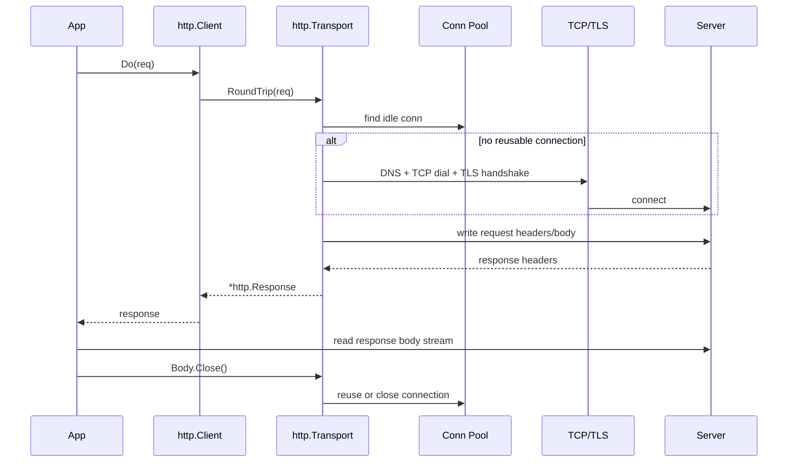
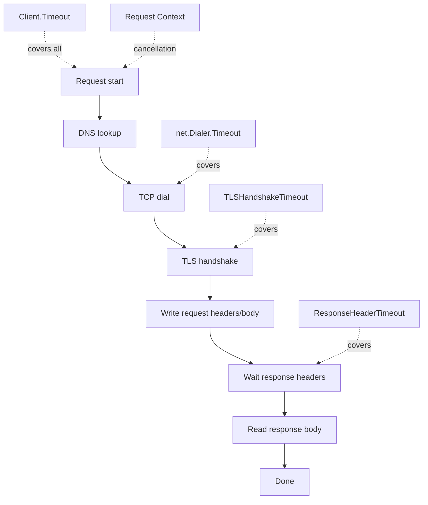

# learn-go-io-buffer-byte-stream-file-network-data-transfer-part-027.md

# Part 027 — HTTP Client Internals: Transport, Connection Pooling, Timeout, Streaming Body, dan Client Production-Grade

> Seri: **Go IO, Buffer, Byte & Stream, Serialization, Console IO, File & FileSystem, Compression, Networking, Data Transfer**
>
> Target pembaca: **Java software engineer** yang ingin memahami Go HTTP client sampai level production engineering.
>
> Target Go: **Go 1.26.x**
>
> Status seri: **Part 027 dari 034 — belum selesai**

---

## 0. Mengapa HTTP Client Layak Dibahas Terpisah?

Di Go, HTTP client sering terlihat sederhana:

```go
resp, err := http.Get("https://example.com")
```

Tetapi di production, HTTP client bukan sekadar fungsi `GET`.

HTTP client adalah **subsystem data transfer** yang menggabungkan:

- DNS lookup
- TCP dial
- TLS handshake
- HTTP protocol negotiation
- connection pooling
- request serialization
- response streaming
- body lifecycle
- timeout
- cancellation
- redirect policy
- retry boundary
- header/cookie handling
- decompression
- observability
- resource cleanup

Kesalahan kecil seperti tidak menutup `resp.Body`, memakai `http.DefaultClient` tanpa timeout, membaca response body tanpa batas, atau retry request non-idempotent bisa berubah menjadi:

- goroutine leak
- file descriptor leak
- connection pool starvation
- memory spike
- request hang tanpa batas
- duplicate write ke remote service
- security vulnerability seperti SSRF
- data corruption pada partial transfer
- cascading failure saat dependency lambat

Part ini membangun mental model HTTP client Go sebagai **stateful transport engine**, bukan hanya utility function.

---

## 1. Posisi Part Ini dalam Seri

Kita sudah membahas:

- byte/slice/buffer model
- `io.Reader` / `io.Writer`
- buffered IO
- EOF, partial read/write, timeout
- file dan filesystem
- serialization
- compression
- protocol framing
- TCP client/server
- UDP dan Unix socket

Sekarang kita masuk ke HTTP client, yang pada dasarnya adalah:

```text
application request
    ↓
HTTP request object
    ↓
headers + optional body stream
    ↓
http.Client
    ↓
http.Transport
    ↓
connection pool
    ↓
TCP / TLS / proxy / HTTP/1.1 / HTTP/2
    ↓
remote server
    ↓
streamed response body
```

HTTP client di Go tetap mengikuti prinsip IO yang sama:

```text
Request.Body  ≈ io.Reader
Response.Body ≈ io.ReadCloser
Transport     ≈ connection + protocol engine
Timeout       ≈ bounded wait
Context       ≈ cancellation signal
Close         ≈ resource release
```

---

## 2. Mental Model Utama: `Client` Bukan `Transport`

Di Go, ada dua level besar:

| Layer | Tanggung jawab |
|---|---|
| `http.Client` | high-level behavior: redirect, cookie jar, total timeout, delegasi ke `RoundTripper` |
| `http.Transport` | low-level transport: connection pooling, proxy, TCP dial, TLS, HTTP/2, keep-alive |

Struktur konseptualnya:

```mermaid
flowchart TD
    App[Application code] --> Client[http.Client]
    Client -->|Do(req)| RT[RoundTripper]
    RT --> Transport[http.Transport]
    Transport --> Pool[Connection Pool]
    Pool --> Conn1[TCP/TLS Conn]
    Pool --> Conn2[HTTP/2 Conn]
    Transport --> Dialer[net.Dialer]
    Dialer --> DNS[DNS]
    Dialer --> TCP[TCP Connect]
    Transport --> TLS[TLS Handshake]
    Conn1 --> Server[Remote Server]
```

### Perbandingan dengan Java

Jika Anda datang dari Java:

| Java | Go |
|---|---|
| `java.net.http.HttpClient` | `http.Client` |
| `HttpRequest` | `http.Request` |
| `HttpResponse<InputStream>` | `http.Response` + `Body io.ReadCloser` |
| connection pool internal | `http.Transport` |
| timeout per request/client | `Client.Timeout`, `Request.Context`, `Transport` timeout fields |
| body publisher/subscriber | `io.Reader` / `io.ReadCloser` |
| interceptor/filter pattern | custom `RoundTripper` chain |

Bedanya: Go secara eksplisit mengekspos **stream body lifecycle** lewat `io.ReadCloser`. Anda harus membaca/menutup body dengan benar.

---

## 3. Core Types yang Harus Dikuasai

### 3.1 `http.Client`

`http.Client` adalah entry point high-level:

```go
type Client struct {
    Transport     RoundTripper
    CheckRedirect func(req *Request, via []*Request) error
    Jar           CookieJar
    Timeout       time.Duration
}
```

Peran utama:

- mengeksekusi request
- mengikuti redirect jika diizinkan
- mengelola cookie jar jika ada
- menerapkan timeout total via `Timeout`
- memanggil `Transport.RoundTrip`

### 3.2 `http.RoundTripper`

`RoundTripper` adalah abstraction untuk satu HTTP transaction:

```go
type RoundTripper interface {
    RoundTrip(*Request) (*Response, error)
}
```

Pola penting:

- custom transport wrapper
- logging
- metrics
- tracing
- header injection
- retry wrapper
- auth wrapper
- circuit breaker boundary

Contoh wrapper sederhana:

```go
type HeaderTransport struct {
    Base  http.RoundTripper
    Name  string
    Value string
}

func (t HeaderTransport) RoundTrip(req *http.Request) (*http.Response, error) {
    clone := req.Clone(req.Context())
    clone.Header.Set(t.Name, t.Value)

    base := t.Base
    if base == nil {
        base = http.DefaultTransport
    }

    return base.RoundTrip(clone)
}
```

Mengapa request di-clone?

Karena `http.Request` membawa map header dan mutable fields. Wrapper yang memodifikasi request sebaiknya tidak mengubah object milik caller secara tidak sengaja.

### 3.3 `http.Transport`

`Transport` adalah implementation default `RoundTripper`.

Tanggung jawab:

- proxy policy
- dial TCP
- TLS handshake
- connection reuse
- idle connection pool
- HTTP/2 integration
- compression handling
- connection limits
- timeout granular

Transport harus dipandang seperti **engine stateful**.

Biasanya:

- satu `Transport` dipakai lama
- satu `Client` dipakai lama
- jangan membuat `Transport` baru per request

---

## 4. Anti-Pattern Paling Berbahaya: Client Per Request

Kode buruk:

```go
func fetch(url string) error {
    client := &http.Client{}
    resp, err := client.Get(url)
    if err != nil {
        return err
    }
    defer resp.Body.Close()
    _, err = io.Copy(io.Discard, resp.Body)
    return err
}
```

Sekilas terlihat aman. Tetapi jika variasinya membuat `Transport` baru per request, connection pool tidak pernah efektif.

Kode lebih buruk:

```go
func fetch(url string) error {
    transport := &http.Transport{}
    client := &http.Client{Transport: transport}

    resp, err := client.Get(url)
    if err != nil {
        return err
    }
    defer resp.Body.Close()

    _, err = io.Copy(io.Discard, resp.Body)
    return err
}
```

Masalah:

- tidak ada reuse pool jangka panjang
- idle connection bisa menumpuk jika tidak ditutup
- TLS handshake berulang
- overhead DNS/TCP/TLS lebih tinggi
- sulit mengontrol resource global

Pattern yang benar:

```go
var sharedHTTPClient = &http.Client{
    Transport: &http.Transport{
        Proxy: http.ProxyFromEnvironment,

        MaxIdleConns:        200,
        MaxIdleConnsPerHost: 50,
        IdleConnTimeout:     90 * time.Second,

        TLSHandshakeTimeout:   10 * time.Second,
        ResponseHeaderTimeout: 15 * time.Second,
        ExpectContinueTimeout: 1 * time.Second,
    },
    Timeout: 30 * time.Second,
}
```

Namun ini belum final untuk semua case. Nilai timeout/pool harus disesuaikan dengan workload.

---

## 5. Lifecycle HTTP Request

Satu request HTTP client memiliki fase:



Poin sangat penting:

`http.Client.Do` mengembalikan response setelah **response headers diterima**, bukan setelah seluruh body selesai dibaca.

Artinya response body adalah stream.

```go
resp, err := client.Do(req)
if err != nil {
    return err
}
defer resp.Body.Close()

// Body baru dibaca di sini.
_, err = io.Copy(dst, resp.Body)
```

---

## 6. `Response.Body`: Stream, Bukan `byte[]`

Di Java, banyak helper membiasakan kita memakai body handler seperti:

```java
HttpResponse<String>
HttpResponse<byte[]>
HttpResponse<InputStream>
```

Di Go, response body default adalah:

```go
Body io.ReadCloser
```

Konsekuensi:

- body harus dibaca jika data dibutuhkan
- body harus ditutup
- body bisa besar
- body bisa lambat
- body bisa hang jika tidak ada timeout/deadline/context
- membaca body bisa mengembalikan partial data dan error
- body adalah resource boundary connection pool

Pattern dasar:

```go
resp, err := client.Do(req)
if err != nil {
    return err
}
defer resp.Body.Close()

if resp.StatusCode < 200 || resp.StatusCode >= 300 {
    return fmt.Errorf("unexpected status: %s", resp.Status)
}

data, err := io.ReadAll(io.LimitReader(resp.Body, 1<<20))
if err != nil {
    return err
}
```

Tetapi `LimitReader` sendiri tidak memberi tahu apakah body terpotong. Untuk API robust, gunakan helper bounded read.

---

## 7. Bounded Response Body Read

Jangan membaca response tak terpercaya tanpa batas.

Helper production-grade:

```go
package httpx

import (
    "bytes"
    "errors"
    "fmt"
    "io"
)

var ErrBodyTooLarge = errors.New("response body too large")

func ReadBounded(r io.Reader, max int64) ([]byte, error) {
    if max < 0 {
        return nil, fmt.Errorf("max must be non-negative")
    }

    var buf bytes.Buffer
    limited := io.LimitReader(r, max+1)

    n, err := buf.ReadFrom(limited)
    if err != nil {
        return nil, err
    }
    if n > max {
        return nil, ErrBodyTooLarge
    }

    return buf.Bytes(), nil
}
```

Pemakaian:

```go
body, err := httpx.ReadBounded(resp.Body, 2<<20) // 2 MiB
if err != nil {
    return err
}
```

Mengapa `max+1`?

Agar bisa membedakan:

- body berukuran tepat `max`
- body melebihi `max`

---

## 8. Menutup Body dan Connection Reuse

Aturan dasar:

> Setiap response non-nil harus ditutup body-nya.

```go
resp, err := client.Do(req)
if err != nil {
    return err
}
defer resp.Body.Close()
```

Tetapi ada detail:

- jika body dibaca sampai EOF, connection lebih mudah direuse
- jika body tidak dibaca dan langsung ditutup, connection mungkin tidak bisa direuse tergantung kondisi/protocol
- membaca error response besar sampai habis bisa membuang bandwidth dan waktu
- draining harus dibatasi

Pattern error response dengan drain terbatas:

```go
func closeResponseBody(resp *http.Response) {
    if resp == nil || resp.Body == nil {
        return
    }

    // Drain kecil untuk membantu reuse connection,
    // tetapi jangan biarkan error body besar menghabiskan bandwidth.
    _, _ = io.CopyN(io.Discard, resp.Body, 64<<10)
    _ = resp.Body.Close()
}
```

Namun `io.CopyN` akan mengembalikan error jika kurang dari N, dan itu normal. Karena kita hanya best effort drain, error bisa diabaikan.

Dalam service high-throughput, policy drain harus eksplisit:

| Situasi | Policy |
|---|---|
| response kecil dan ingin reuse | baca sampai EOF |
| response error besar | drain terbatas lalu close |
| timeout/cancel | close |
| streaming download besar | copy ke sink sampai selesai atau cancel |
| server unreliable | lebih baik close daripada menunggu drain lama |

---

## 9. Timeout Model: Jangan Hanya Satu Timeout

HTTP client timeout di Go berlapis.



### 9.1 `http.Client.Timeout`

```go
client := &http.Client{
    Timeout: 30 * time.Second,
}
```

Ini mencakup total request:

- connect
- redirect
- request body write
- response header wait
- response body read

Kelebihan:

- mudah
- melindungi dari hang total

Kekurangan:

- terlalu kasar untuk streaming download panjang
- bisa memutus transfer valid yang memang lama
- tidak membedakan fase mana yang lambat

### 9.2 `Request.Context`

```go
ctx, cancel := context.WithTimeout(context.Background(), 10*time.Second)
defer cancel()

req, err := http.NewRequestWithContext(ctx, http.MethodGet, url, nil)
if err != nil {
    return err
}
```

Context cocok untuk:

- request scoped timeout
- cancellation saat caller disconnect
- shutdown
- budget propagation antar service

### 9.3 `net.Dialer.Timeout`

```go
dialer := &net.Dialer{
    Timeout:   5 * time.Second,
    KeepAlive: 30 * time.Second,
}
```

Ini fokus ke dial phase.

### 9.4 `Transport.TLSHandshakeTimeout`

```go
TLSHandshakeTimeout: 5 * time.Second
```

Melindungi dari TLS handshake lambat/hang.

### 9.5 `Transport.ResponseHeaderTimeout`

```go
ResponseHeaderTimeout: 10 * time.Second
```

Melindungi dari server yang menerima request tapi lambat mengirim header.

### 9.6 Timeout untuk Streaming Body

Tidak ada field sederhana "read body timeout per chunk" di `http.Client`.

Untuk streaming panjang, biasanya pilih salah satu:

1. `Client.Timeout` cukup besar untuk seluruh transfer
2. context timeout berdasarkan total transfer budget
3. custom transport/connection deadline
4. application-level idle timeout saat membaca body
5. server-side SLA dan chunk heartbeat

---

## 10. Template Client Production-Grade

Baseline realistis untuk microservice HTTP client:

```go
package httpclient

import (
    "net"
    "net/http"
    "time"
)

func New() *http.Client {
    dialer := &net.Dialer{
        Timeout:   5 * time.Second,
        KeepAlive: 30 * time.Second,
    }

    transport := &http.Transport{
        Proxy: http.ProxyFromEnvironment,

        DialContext: dialer.DialContext,

        MaxIdleConns:        200,
        MaxIdleConnsPerHost: 50,
        MaxConnsPerHost:     100,
        IdleConnTimeout:     90 * time.Second,

        TLSHandshakeTimeout:   5 * time.Second,
        ResponseHeaderTimeout: 15 * time.Second,
        ExpectContinueTimeout: 1 * time.Second,

        ForceAttemptHTTP2: true,
    }

    return &http.Client{
        Transport: transport,
        Timeout:   30 * time.Second,
    }
}
```

Catatan:

- `MaxIdleConnsPerHost` terlalu kecil bisa membatasi throughput.
- `MaxConnsPerHost` melindungi dependency dari fan-out berlebihan.
- `Client.Timeout` harus disesuaikan dengan streaming use case.
- `Transport` sebaiknya long-lived.
- Jangan mutate `Transport` aktif setelah dipakai concurrent.

---

## 11. Connection Pooling

HTTP connection pooling terjadi di `Transport`.

### 11.1 Mengapa Pooling Penting?

Tanpa pooling:

- DNS lookup sering
- TCP handshake sering
- TLS handshake sering
- latency naik
- CPU naik
- ephemeral port pressure
- remote server menerima connection churn
- load balancer bisa overload

Dengan pooling:

- connection reuse
- TLS session reuse
- latency turun
- throughput naik
- resource lebih stabil

### 11.2 Field Penting

| Field | Fungsi |
|---|---|
| `MaxIdleConns` | total idle connection global |
| `MaxIdleConnsPerHost` | idle connection per host |
| `MaxConnsPerHost` | total active+idle+dialing per host |
| `IdleConnTimeout` | berapa lama idle connection dipertahankan |
| `DisableKeepAlives` | mematikan reuse connection |
| `CloseIdleConnections()` | menutup idle connection secara eksplisit |

### 11.3 Pool Starvation

Pool starvation dapat terjadi jika:

- response body tidak ditutup
- response body tidak selesai dibaca
- `MaxConnsPerHost` terlalu rendah
- remote server lambat
- request timeout terlalu panjang
- goroutine menunggu connection slot

Gejala:

- latency naik pada fase "get conn"
- goroutine banyak blocked di transport
- idle conn rendah tapi active tinggi
- dependency terlihat lambat walau remote sebenarnya normal

Dengan `httptrace`, Anda bisa melihat fase `GetConn` dan `GotConn`.

---

## 12. HTTP/1.1 vs HTTP/2 dari Sudut Client

### HTTP/1.1

Karakter umum:

- satu request aktif per connection pada waktu tertentu
- pooling membutuhkan banyak connection untuk concurrency
- connection reuse sangat bergantung pada body close/read
- head-of-line blocking per connection

### HTTP/2

Karakter umum:

- multiplexing banyak stream di satu connection
- lebih sedikit TCP connection
- stream concurrency limit dari server/protocol
- flow control per stream/connection
- timeout dan cancellation tetap penting

Di Go modern, `net/http` mendukung HTTP/2 secara native untuk client/server TLS umum. Sebagian besar aplikasi tidak perlu mengimpor `golang.org/x/net/http2` langsung.

Go 1.26 menambahkan beberapa kontrol baru di area HTTP/2, termasuk field `HTTP2Config.StrictMaxConcurrentRequests` dan `Transport.NewClientConn` untuk kasus custom connection management. Namun untuk mayoritas aplikasi, rekomendasinya tetap memakai `Transport.RoundTrip` lewat `http.Client`.

---

## 13. Request Body: Upload Stream

Request body di Go juga stream:

```go
type Request struct {
    Body io.ReadCloser
}
```

Untuk membuat request:

```go
req, err := http.NewRequestWithContext(
    ctx,
    http.MethodPost,
    url,
    bytes.NewReader(payload),
)
if err != nil {
    return err
}
```

`bytes.NewReader` cocok untuk payload kecil/sudah di-memory.

Untuk file upload streaming:

```go
f, err := os.Open(path)
if err != nil {
    return err
}
defer f.Close()

req, err := http.NewRequestWithContext(ctx, http.MethodPut, url, f)
if err != nil {
    return err
}

info, err := f.Stat()
if err != nil {
    return err
}
req.ContentLength = info.Size()

resp, err := client.Do(req)
if err != nil {
    return err
}
defer resp.Body.Close()
```

Poin penting:

- body stream bisa hanya bisa dibaca sekali
- retry otomatis sulit jika body tidak replayable
- set `ContentLength` jika diketahui
- gunakan checksum jika integritas penting
- jangan `ReadAll` file besar hanya untuk upload

---

## 14. Replayability dan Retry

Retry HTTP client adalah topik yang sering salah.

Pertanyaan retry bukan hanya "request gagal", tetapi:

1. apakah request sudah sampai server?
2. apakah server sempat memproses?
3. apakah method idempotent?
4. apakah body bisa dikirim ulang?
5. apakah response partial?
6. apakah remote operation punya idempotency key?
7. apakah retry memperburuk overload?

### 14.1 Method dan Retry Safety

| Method | Secara umum retry-safe? | Catatan |
|---|---:|---|
| GET | ya | selama tidak side-effectful |
| HEAD | ya | mirip GET |
| PUT | biasanya ya | jika semantic replace idempotent |
| DELETE | biasanya ya | tergantung API |
| POST | tidak otomatis | butuh idempotency key |
| PATCH | tidak otomatis | tergantung semantic patch |

### 14.2 Body Replay

Jika body berasal dari `bytes.Reader`, `strings.Reader`, atau file dengan seek, retry bisa dibuat.

Contoh replayable request factory:

```go
type RequestFactory func(ctx context.Context) (*http.Request, error)

func NewJSONRequestFactory(method, url string, body []byte) RequestFactory {
    return func(ctx context.Context) (*http.Request, error) {
        req, err := http.NewRequestWithContext(
            ctx,
            method,
            url,
            bytes.NewReader(body),
        )
        if err != nil {
            return nil, err
        }

        req.Header.Set("Content-Type", "application/json")
        req.ContentLength = int64(len(body))
        return req, nil
    }
}
```

Retry wrapper:

```go
func DoWithRetry(
    ctx context.Context,
    client *http.Client,
    makeReq RequestFactory,
    attempts int,
) (*http.Response, error) {
    var lastErr error

    for i := 0; i < attempts; i++ {
        if err := ctx.Err(); err != nil {
            return nil, err
        }

        req, err := makeReq(ctx)
        if err != nil {
            return nil, err
        }

        resp, err := client.Do(req)
        if err == nil && resp.StatusCode < 500 {
            return resp, nil
        }

        if resp != nil {
            _, _ = io.CopyN(io.Discard, resp.Body, 64<<10)
            _ = resp.Body.Close()
        }

        if err != nil {
            lastErr = err
        } else {
            lastErr = fmt.Errorf("server returned status %s", resp.Status)
        }

        // Simplified. Production code should use jittered exponential backoff.
        timer := time.NewTimer(time.Duration(i+1) * 100 * time.Millisecond)
        select {
        case <-ctx.Done():
            timer.Stop()
            return nil, ctx.Err()
        case <-timer.C:
        }
    }

    return nil, lastErr
}
```

Catatan:

- ini hanya skeleton
- policy retry harus memeriksa method/status/error
- POST butuh idempotency key
- backoff harus pakai jitter
- retry harus punya budget global

---

## 15. Redirect Policy

`http.Client` mengikuti redirect secara default.

Risiko:

- auth header bocor ke domain lain
- POST berubah semantic pada redirect tertentu
- SSRF via redirect ke internal address
- cookie scope berubah
- observability membingungkan jika tidak mencatat redirect chain

Custom redirect:

```go
client := &http.Client{
    Timeout: 10 * time.Second,
    CheckRedirect: func(req *http.Request, via []*http.Request) error {
        if len(via) >= 5 {
            return errors.New("too many redirects")
        }

        if req.URL.Scheme != "https" {
            return errors.New("redirect to non-https rejected")
        }

        return nil
    },
}
```

Untuk service-to-service API, sering lebih aman:

- batasi jumlah redirect
- reject downgrade HTTPS ke HTTP
- reject host berbeda kecuali allowlist
- jangan forward credential lintas host

---

## 16. Header Discipline

Header adalah bagian dari protocol contract.

Pattern:

```go
req.Header.Set("Accept", "application/json")
req.Header.Set("User-Agent", "my-service/1.2.3")
req.Header.Set("X-Request-Id", requestID)
```

Hindari:

- menaruh secret di URL query jika bisa lewat header
- logging full header tanpa redaction
- menerima arbitrary header forwarding tanpa allowlist
- memasukkan user input mentah ke header
- header injection via CRLF

Transport dan `net/http` punya validasi tertentu, tetapi desain aplikasi tetap harus disiplin.

### Header Propagation

Dalam microservice, tidak semua header boleh diteruskan.

| Header type | Policy |
|---|---|
| trace/correlation id | propagate |
| auth credential | explicit policy only |
| user-agent | set service identity |
| hop-by-hop headers | jangan propagate |
| debug/internal headers | allowlist |
| client IP headers | trust only from known proxy |

Hop-by-hop headers seperti `Connection`, `Keep-Alive`, `Transfer-Encoding`, `Upgrade`, dan sejenisnya bukan metadata end-to-end application biasa.

---

## 17. Compression di HTTP Client

Go `Transport` secara default dapat meminta gzip dan mendekompresi response dalam kondisi tertentu. Detailnya bergantung pada konfigurasi seperti `DisableCompression`.

Jika Anda mengatur `Accept-Encoding` sendiri, Anda bertanggung jawab memahami behavior-nya.

Risiko compression:

- decompression bomb
- CPU spike
- body size setelah decompress jauh lebih besar dari compressed size
- timeout membaca body tetap penting
- observability harus membedakan compressed vs uncompressed bytes

Pattern defensif:

```go
resp, err := client.Do(req)
if err != nil {
    return err
}
defer resp.Body.Close()

body, err := ReadBounded(resp.Body, 10<<20)
if err != nil {
    return err
}
```

Batas harus diterapkan terhadap **decoded stream** yang dibaca aplikasi.

---

## 18. JSON HTTP Client Helper

Contoh helper production-oriented:

```go
package httpjson

import (
    "bytes"
    "context"
    "encoding/json"
    "errors"
    "fmt"
    "io"
    "net/http"
)

var ErrResponseTooLarge = errors.New("response too large")

type Client struct {
    HTTP    *http.Client
    BaseURL string
    MaxBody int64
}

func (c Client) DoJSON(
    ctx context.Context,
    method string,
    url string,
    in any,
    out any,
) error {
    var body io.Reader

    if in != nil {
        var buf bytes.Buffer
        enc := json.NewEncoder(&buf)
        enc.SetEscapeHTML(false)

        if err := enc.Encode(in); err != nil {
            return fmt.Errorf("encode request: %w", err)
        }

        body = &buf
    }

    req, err := http.NewRequestWithContext(ctx, method, url, body)
    if err != nil {
        return fmt.Errorf("new request: %w", err)
    }

    req.Header.Set("Accept", "application/json")
    if in != nil {
        req.Header.Set("Content-Type", "application/json")
    }

    client := c.HTTP
    if client == nil {
        client = http.DefaultClient
    }

    resp, err := client.Do(req)
    if err != nil {
        return fmt.Errorf("do request: %w", err)
    }
    defer resp.Body.Close()

    max := c.MaxBody
    if max <= 0 {
        max = 2 << 20
    }

    limited := io.LimitReader(resp.Body, max+1)
    data, err := io.ReadAll(limited)
    if err != nil {
        return fmt.Errorf("read response: %w", err)
    }
    if int64(len(data)) > max {
        return ErrResponseTooLarge
    }

    if resp.StatusCode < 200 || resp.StatusCode >= 300 {
        return fmt.Errorf("unexpected status %d: %s", resp.StatusCode, string(data))
    }

    if out == nil || len(bytes.TrimSpace(data)) == 0 {
        return nil
    }

    dec := json.NewDecoder(bytes.NewReader(data))
    dec.DisallowUnknownFields()

    if err := dec.Decode(out); err != nil {
        return fmt.Errorf("decode response: %w", err)
    }

    if dec.More() {
        return errors.New("unexpected trailing JSON data")
    }

    return nil
}
```

Catatan:

- helper ini cocok untuk response kecil-menengah
- untuk response besar, gunakan streaming decoder
- error response body sebaiknya dibatasi
- jangan selalu `DisallowUnknownFields` untuk public API yang perlu forward compatibility
- response error sebaiknya punya typed error model, bukan string raw saja

---

## 19. Streaming Download

Untuk file besar:

```go
func Download(ctx context.Context, client *http.Client, url string, dst io.Writer) error {
    req, err := http.NewRequestWithContext(ctx, http.MethodGet, url, nil)
    if err != nil {
        return err
    }

    resp, err := client.Do(req)
    if err != nil {
        return err
    }
    defer resp.Body.Close()

    if resp.StatusCode != http.StatusOK {
        _, _ = io.CopyN(io.Discard, resp.Body, 64<<10)
        return fmt.Errorf("unexpected status: %s", resp.Status)
    }

    _, err = io.Copy(dst, resp.Body)
    if err != nil {
        return fmt.Errorf("copy body: %w", err)
    }

    return nil
}
```

Untuk download ke file durable:

```go
func DownloadFile(ctx context.Context, client *http.Client, url, path string) error {
    tmp := path + ".tmp"

    f, err := os.OpenFile(tmp, os.O_CREATE|os.O_TRUNC|os.O_WRONLY, 0o600)
    if err != nil {
        return err
    }

    cleanup := true
    defer func() {
        if cleanup {
            _ = os.Remove(tmp)
        }
    }()

    err = Download(ctx, client, url, f)

    closeErr := f.Close()
    if err != nil {
        return err
    }
    if closeErr != nil {
        return closeErr
    }

    if err := os.Rename(tmp, path); err != nil {
        return err
    }

    cleanup = false
    return nil
}
```

Untuk durability lebih serius, gabungkan dengan `f.Sync()` dan directory sync seperti Part 014.

---

## 20. Streaming Upload

File upload langsung:

```go
func UploadFile(ctx context.Context, client *http.Client, url, path string) error {
    f, err := os.Open(path)
    if err != nil {
        return err
    }
    defer f.Close()

    st, err := f.Stat()
    if err != nil {
        return err
    }

    req, err := http.NewRequestWithContext(ctx, http.MethodPut, url, f)
    if err != nil {
        return err
    }

    req.ContentLength = st.Size()
    req.Header.Set("Content-Type", "application/octet-stream")

    resp, err := client.Do(req)
    if err != nil {
        return err
    }
    defer resp.Body.Close()

    if resp.StatusCode < 200 || resp.StatusCode >= 300 {
        body, _ := ReadBounded(resp.Body, 64<<10)
        return fmt.Errorf("upload failed: %s: %s", resp.Status, string(body))
    }

    return nil
}
```

Perhatikan:

- retry upload ini tidak otomatis aman
- file bisa berubah saat upload jika tidak diproteksi
- checksum/etag lebih baik untuk integritas
- server harus punya batas ukuran
- context timeout harus sesuai ukuran file/bandwidth

---

## 21. Multipart Client

Multipart sering dipakai untuk upload file + metadata.

Untuk file kecil:

```go
var buf bytes.Buffer
mw := multipart.NewWriter(&buf)

field, err := mw.CreateFormFile("file", filepath.Base(path))
if err != nil {
    return err
}

f, err := os.Open(path)
if err != nil {
    return err
}
defer f.Close()

if _, err := io.Copy(field, f); err != nil {
    return err
}

if err := mw.WriteField("kind", "report"); err != nil {
    return err
}

if err := mw.Close(); err != nil {
    return err
}

req, err := http.NewRequestWithContext(ctx, http.MethodPost, url, &buf)
if err != nil {
    return err
}
req.Header.Set("Content-Type", mw.FormDataContentType())
req.ContentLength = int64(buf.Len())
```

Namun ini membaca seluruh multipart ke memory. Untuk file besar, gunakan `io.Pipe`.

```go
pr, pw := io.Pipe()
mw := multipart.NewWriter(pw)

go func() {
    defer pw.Close()
    defer mw.Close()

    part, err := mw.CreateFormFile("file", filepath.Base(path))
    if err != nil {
        _ = pw.CloseWithError(err)
        return
    }

    f, err := os.Open(path)
    if err != nil {
        _ = pw.CloseWithError(err)
        return
    }
    defer f.Close()

    if _, err := io.Copy(part, f); err != nil {
        _ = pw.CloseWithError(err)
        return
    }
}()

req, err := http.NewRequestWithContext(ctx, http.MethodPost, url, pr)
if err != nil {
    return err
}
req.Header.Set("Content-Type", mw.FormDataContentType())
```

Risiko `io.Pipe`:

- writer goroutine bisa blocked jika request tidak berjalan
- error harus dipropagasikan via `CloseWithError`
- cancellation harus diperhatikan
- `ContentLength` biasanya unknown sehingga chunked transfer dipakai untuk HTTP/1.1

---

## 22. Custom `RoundTripper` Chain

Go tidak punya interceptor bawaan seperti beberapa framework Java, tetapi `RoundTripper` mudah dikomposisi.


Contoh metrics wrapper:

```go
type MetricsTransport struct {
    Base http.RoundTripper
}

func (t MetricsTransport) RoundTrip(req *http.Request) (*http.Response, error) {
    start := time.Now()

    base := t.Base
    if base == nil {
        base = http.DefaultTransport
    }

    resp, err := base.RoundTrip(req)
    duration := time.Since(start)

    status := 0
    if resp != nil {
        status = resp.StatusCode
    }

    recordHTTPClientMetrics(req.Method, req.URL.Host, status, duration, err)
    return resp, err
}
```

Jangan baca body di wrapper kecuali benar-benar perlu. Jika wrapper membaca body, ia harus mengganti kembali body untuk caller:

```go
data, err := io.ReadAll(io.LimitReader(resp.Body, max+1))
_ = resp.Body.Close()
resp.Body = io.NopCloser(bytes.NewReader(data))
```

Tetapi ini mengubah streaming menjadi buffering dan bisa merusak performance.

---

## 23. `httptrace`: Melihat Fase Request

`net/http/httptrace` membantu melihat fase request:

- DNS start/done
- connect start/done
- TLS handshake start/done
- got connection
- wrote request
- first response byte

Contoh:

```go
trace := &httptrace.ClientTrace{
    GetConn: func(hostPort string) {
        log.Printf("get conn: %s", hostPort)
    },
    GotConn: func(info httptrace.GotConnInfo) {
        log.Printf("got conn: reused=%v idle=%v", info.Reused, info.WasIdle)
    },
    DNSStart: func(info httptrace.DNSStartInfo) {
        log.Printf("dns start: %s", info.Host)
    },
    DNSDone: func(info httptrace.DNSDoneInfo) {
        log.Printf("dns done: addrs=%v err=%v", info.Addrs, info.Err)
    },
    ConnectStart: func(network, addr string) {
        log.Printf("connect start: %s %s", network, addr)
    },
    ConnectDone: func(network, addr string, err error) {
        log.Printf("connect done: %s %s err=%v", network, addr, err)
    },
    GotFirstResponseByte: func() {
        log.Printf("first response byte")
    },
}

req = req.WithContext(httptrace.WithClientTrace(req.Context(), trace))
```

Ini berguna untuk membedakan:

| Gejala | Kemungkinan |
|---|---|
| lama di `GetConn` | pool limit/starvation |
| lama di DNS | resolver/network issue |
| lama di connect | network/firewall/remote overload |
| lama di TLS | TLS/cert/server CPU |
| lama menunggu first byte | server processing lambat |
| body read lambat | server streaming lambat / network throughput |

---

## 24. Error Classification

HTTP client error bisa berasal dari:

- request construction
- context cancellation
- DNS failure
- dial timeout
- TLS failure
- proxy failure
- request body read error
- server closes connection
- response body read error
- decompression error
- status code non-2xx
- JSON decode error
- application semantic error

Jangan semua error disamakan.

Contoh classification sederhana:

```go
func IsTimeout(err error) bool {
    if err == nil {
        return false
    }

    var ne net.Error
    if errors.As(err, &ne) && ne.Timeout() {
        return true
    }

    return errors.Is(err, context.DeadlineExceeded)
}
```

Status code bukan `error` dari `client.Do`.

```go
resp, err := client.Do(req)
if err != nil {
    return err
}

if resp.StatusCode >= 500 {
    // remote returned a valid HTTP response with server error status.
}
```

Perbedaan ini penting:

| Kondisi | Makna |
|---|---|
| `err != nil` dari `Do` | HTTP transaction gagal di transport/protocol/request |
| `resp.StatusCode >= 500` | remote server menjawab error |
| body decode error | response tidak sesuai kontrak |
| context deadline | budget habis |
| timeout saat read body | transfer tidak selesai tepat waktu |

---

## 25. Status Code Handling

Pattern yang lebih baik:

```go
func require2xx(resp *http.Response, maxErrBody int64) error {
    if resp.StatusCode >= 200 && resp.StatusCode < 300 {
        return nil
    }

    body, _ := ReadBounded(resp.Body, maxErrBody)
    return fmt.Errorf("http status %d: %s", resp.StatusCode, string(body))
}
```

Namun production system biasanya butuh typed error:

```go
type StatusError struct {
    StatusCode int
    Status     string
    Body       []byte
}

func (e *StatusError) Error() string {
    return fmt.Sprintf("http status %s", e.Status)
}
```

Dengan typed error, caller bisa memutuskan:

- 400 tidak retry
- 401 refresh token?
- 403 permission denied
- 404 cache negative?
- 409 conflict handling
- 429 backoff
- 500 retry maybe
- 503 retry maybe
- 504 retry maybe

---

## 26. Rate Limit dan 429 Handling

HTTP 429 biasanya membawa `Retry-After`.

Parsing simplified:

```go
func retryAfter(h http.Header) (time.Duration, bool) {
    v := h.Get("Retry-After")
    if v == "" {
        return 0, false
    }

    if seconds, err := strconv.Atoi(v); err == nil {
        return time.Duration(seconds) * time.Second, true
    }

    if t, err := http.ParseTime(v); err == nil {
        d := time.Until(t)
        if d < 0 {
            d = 0
        }
        return d, true
    }

    return 0, false
}
```

Policy:

- patuhi `Retry-After` jika reasonable
- cap maksimum delay
- gunakan jitter
- jangan semua instance retry bersamaan
- gabungkan dengan client-side rate limiter
- bedakan 429 dependency vs 429 upstream gateway

---

## 27. Security Lens: SSRF

HTTP client yang menerima URL dari user adalah boundary berbahaya.

SSRF dapat terjadi jika aplikasi mengambil URL arbitrary:

```go
GET /fetch?url=http://169.254.169.254/latest/meta-data/
```

Mitigasi:

- allowlist scheme
- allowlist host/domain
- resolve DNS dan validate IP range
- block private/link-local/loopback/multicast
- re-check after redirect
- disable redirect atau enforce redirect allowlist
- set timeout pendek
- limit response body
- block non-http(s)
- jangan forward internal credentials
- audit logs

Contoh skeleton validation:

```go
func validateOutboundURL(u *url.URL) error {
    if u.Scheme != "https" {
        return errors.New("only https allowed")
    }
    if u.User != nil {
        return errors.New("userinfo not allowed")
    }
    if u.Host == "" {
        return errors.New("host required")
    }

    // Production-grade SSRF protection requires DNS resolution policy,
    // IP range validation, redirect validation, and possibly custom DialContext.
    return nil
}
```

Jangan mengandalkan `url.Parse` saja.

---

## 28. Custom Dialer untuk Network Policy

Untuk SSRF protection serius, validasi harus terjadi dekat dial.

Skeleton:

```go
func policyDialer(base *net.Dialer) func(ctx context.Context, network, address string) (net.Conn, error) {
    return func(ctx context.Context, network, address string) (net.Conn, error) {
        host, port, err := net.SplitHostPort(address)
        if err != nil {
            return nil, err
        }

        ips, err := net.DefaultResolver.LookupIPAddr(ctx, host)
        if err != nil {
            return nil, err
        }

        var allowed []net.IPAddr
        for _, ip := range ips {
            if isAllowedOutboundIP(ip.IP) {
                allowed = append(allowed, ip)
            }
        }
        if len(allowed) == 0 {
            return nil, errors.New("no allowed outbound IP")
        }

        // Simplified: choose first allowed IP.
        target := net.JoinHostPort(allowed[0].IP.String(), port)
        return base.DialContext(ctx, network, target)
    }
}
```

Tetapi ini pun punya detail:

- SNI/Host header harus tetap host asli untuk TLS/HTTP
- IP pinning bisa bentrok dengan certificate validation jika tidak hati-hati
- DNS rebinding perlu policy kuat
- proxy environment bisa bypass dialer jika tidak dikontrol
- HTTP redirect harus divalidasi ulang

---

## 29. Proxy Behavior

`http.Transport` punya field `Proxy`.

Default umum:

```go
Proxy: http.ProxyFromEnvironment
```

Ini membaca environment seperti `HTTP_PROXY`, `HTTPS_PROXY`, dan `NO_PROXY`.

Production consideration:

| Lingkungan | Policy |
|---|---|
| server internal | eksplisit: pakai atau tidak pakai proxy |
| container | audit env proxy |
| SSRF-sensitive service | jangan blindly trust proxy env |
| corporate network | proxy mungkin wajib |
| service mesh | proxy behavior perlu diklarifikasi |

Jika Anda tidak ingin proxy dari environment:

```go
transport := &http.Transport{
    Proxy: nil,
}
```

---

## 30. TLS Client Concerns

HTTP client production harus memperhatikan:

- CA trust store
- server name verification
- minimum TLS version policy
- custom root CA untuk internal services
- mTLS jika dibutuhkan
- certificate rotation
- handshake timeout
- insecure skip verify harus dihindari

Contoh custom root CA:

```go
pool, err := x509.SystemCertPool()
if err != nil {
    return err
}

pemBytes, err := os.ReadFile("internal-ca.pem")
if err != nil {
    return err
}
if ok := pool.AppendCertsFromPEM(pemBytes); !ok {
    return errors.New("no certs appended")
}

transport := &http.Transport{
    TLSClientConfig: &tls.Config{
        RootCAs:    pool,
        MinVersion: tls.VersionTLS12,
    },
}
```

`InsecureSkipVerify: true` hanya layak untuk test/lab yang sangat eksplisit, bukan production.

---

## 31. Cookies dan Client State

`http.Client` bisa punya cookie jar:

```go
jar, err := cookiejar.New(nil)
if err != nil {
    return err
}

client := &http.Client{
    Jar: jar,
}
```

Dalam service-to-service client, cookie jar sering tidak diperlukan.

Risiko:

- state tersembunyi antar request
- session leakage antar tenant jika client shared salah desain
- redirect/cookie interaction
- test tidak deterministik

Policy:

| Client type | Cookie jar |
|---|---|
| browser-like automation | mungkin perlu |
| service-to-service API | biasanya tidak |
| multi-tenant outbound | hati-hati, pisahkan state |
| stateless worker | hindari jika tidak perlu |

---

## 32. Request Context Propagation

HTTP outbound dari server handler biasanya memakai context inbound:

```go
func handler(w http.ResponseWriter, r *http.Request) {
    req, err := http.NewRequestWithContext(
        r.Context(),
        http.MethodGet,
        "https://dependency.example/api",
        nil,
    )
    if err != nil {
        http.Error(w, err.Error(), 500)
        return
    }

    resp, err := client.Do(req)
    // ...
}
```

Manfaat:

- jika client disconnect, outbound request bisa dibatalkan
- saat server shutdown, request ikut selesai
- deadline budget bisa dipropagasikan

Namun hati-hati:

- jangan memakai context request untuk background job yang harus tetap lanjut
- jangan menyimpan context melewati lifecycle request
- deadline inbound mungkin terlalu pendek untuk semua downstream call
- buat child context dengan budget yang eksplisit bila perlu

---

## 33. Budgeting: Total SLA vs Dependency Timeout

Misal API Anda punya SLA 2 detik.

Tidak masuk akal memberi dependency timeout 30 detik.

Contoh budget:

```text
Inbound SLA: 2s

- auth check:         150ms
- dependency A:       500ms
- dependency B:       700ms
- local processing:   300ms
- buffer:             350ms
```

HTTP client timeout harus menjadi bagian dari **latency budget**, bukan angka default.

Pattern:

```go
ctx, cancel := context.WithTimeout(parent, 500*time.Millisecond)
defer cancel()
```

Bukan:

```go
context.WithTimeout(parent, 30*time.Second)
```

untuk endpoint yang seharusnya menjawab 2 detik.

---

## 34. Connection Pool Sizing

Pool sizing harus mempertimbangkan:

- QPS
- average latency
- p95 latency
- HTTP/1.1 vs HTTP/2
- remote server capacity
- per-pod concurrency
- number of pods
- retry multiplier
- load balancer behavior

Little's Law simplified:

```text
concurrency ≈ throughput × latency
```

Jika satu pod melakukan 100 req/s ke dependency dan p95 latency 200ms:

```text
100 × 0.2 = 20 concurrent requests
```

Maka `MaxConnsPerHost` 20 mungkin terlalu ketat karena p99, burst, retry, dan slow tail. Mungkin 50 lebih realistis. Tetapi 500 mungkin menyerang dependency saat failure.

Pool config adalah **capacity control**, bukan hanya performance tuning.

---

## 35. Default Client dan Default Transport

`http.DefaultClient` dan package-level helpers seperti `http.Get` mudah dipakai, tetapi production risk:

```go
resp, err := http.Get(url)
```

Masalah:

- default client tidak punya total timeout eksplisit
- sulit mengatur transport
- sulit instrumentasi
- sulit test/mocking
- sulit enforce policy

Gunakan injected client:

```go
type APIClient struct {
    HTTP *http.Client
    BaseURL string
}

func NewAPIClient(httpClient *http.Client, baseURL string) *APIClient {
    if httpClient == nil {
        httpClient = NewProductionHTTPClient()
    }

    return &APIClient{
        HTTP: httpClient,
        BaseURL: baseURL,
    }
}
```

---

## 36. Testing HTTP Client

### 36.1 `httptest.Server`

```go
func TestClient(t *testing.T) {
    srv := httptest.NewServer(http.HandlerFunc(func(w http.ResponseWriter, r *http.Request) {
        if r.URL.Path != "/v1/items" {
            t.Fatalf("unexpected path: %s", r.URL.Path)
        }

        w.Header().Set("Content-Type", "application/json")
        _, _ = w.Write([]byte(`{"ok":true}`))
    }))
    defer srv.Close()

    client := &http.Client{Timeout: 2 * time.Second}

    req, err := http.NewRequest(http.MethodGet, srv.URL+"/v1/items", nil)
    if err != nil {
        t.Fatal(err)
    }

    resp, err := client.Do(req)
    if err != nil {
        t.Fatal(err)
    }
    defer resp.Body.Close()

    if resp.StatusCode != http.StatusOK {
        t.Fatalf("status = %d", resp.StatusCode)
    }
}
```

### 36.2 Slow Server Test

```go
func TestResponseHeaderTimeout(t *testing.T) {
    srv := httptest.NewServer(http.HandlerFunc(func(w http.ResponseWriter, r *http.Request) {
        time.Sleep(200 * time.Millisecond)
        w.WriteHeader(http.StatusOK)
    }))
    defer srv.Close()

    tr := &http.Transport{
        ResponseHeaderTimeout: 50 * time.Millisecond,
    }
    client := &http.Client{
        Transport: tr,
    }

    _, err := client.Get(srv.URL)
    if err == nil {
        t.Fatal("expected timeout")
    }
}
```

### 36.3 Custom RoundTripper Fake

Untuk unit test tanpa server:

```go
type roundTripFunc func(*http.Request) (*http.Response, error)

func (f roundTripFunc) RoundTrip(req *http.Request) (*http.Response, error) {
    return f(req)
}

func TestWithFakeTransport(t *testing.T) {
    client := &http.Client{
        Transport: roundTripFunc(func(req *http.Request) (*http.Response, error) {
            return &http.Response{
                StatusCode: http.StatusOK,
                Header:     make(http.Header),
                Body:       io.NopCloser(strings.NewReader(`{"ok":true}`)),
                Request:    req,
            }, nil
        }),
    }

    _ = client
}
```

Gunakan `httptest.Server` untuk behavior protocol lebih nyata. Gunakan fake `RoundTripper` untuk logic wrapper/client yang sempit.

---

## 37. Observability Metrics

HTTP client metrics minimum:

| Metric | Dimensi |
|---|---|
| request count | method, host, route/logical dependency, status class |
| request duration | method, dependency, status |
| in-flight requests | dependency |
| error count | error class |
| timeout count | phase if known |
| retry count | dependency, reason |
| response body bytes | dependency/status |
| connection reuse | via httptrace sample |
| pool wait latency | via `GetConn` to `GotConn` |
| TLS/DNS/connect latency | via httptrace sample |

Hindari label cardinality tinggi:

- full URL
- query string
- user id
- tenant id kecuali controlled
- raw error string
- request id

Gunakan logical route:

```text
GET /v1/customers/{id}
```

bukan:

```text
GET /v1/customers/123456?token=...
```

---

## 38. Logging Policy

Log yang berguna:

- method
- logical dependency name
- sanitized URL/path
- status code
- duration
- timeout/error class
- retry attempt
- response size
- request id/correlation id

Jangan log:

- Authorization header
- Cookie
- Set-Cookie
- API key
- full query jika mengandung token
- raw body yang mungkin mengandung PII
- signed URL lengkap

Contoh:

```go
log.Printf(
    "http_client dependency=%s method=%s path=%s status=%d duration_ms=%d err_class=%s",
    "payment",
    req.Method,
    req.URL.Path,
    status,
    duration.Milliseconds(),
    classifyErr(err),
)
```

---

## 39. Common Failure Modes

| Failure | Penyebab | Mitigasi |
|---|---|---|
| request hang | no timeout | context/client/transport timeout |
| fd leak | body not closed | always close body |
| pool starvation | unread body / max conns | drain/close + tune pool |
| memory spike | `ReadAll` unbounded | bounded read / streaming |
| duplicate operation | retry POST | idempotency key |
| auth leak | redirect cross-host | redirect policy |
| SSRF | user-controlled URL | allowlist + dial policy |
| slow dependency cascade | huge timeout/retry | budget + backoff + circuit breaker |
| bad observability | no phase timing | httptrace + metrics |
| compressed bomb | unbounded decoded body | decoded-size limit |
| flaky tests | real external HTTP | `httptest.Server` |

---

## 40. Production Checklist HTTP Client

Sebelum HTTP client masuk production, cek:

- [ ] client dan transport long-lived
- [ ] tidak memakai package-level `http.Get` untuk production dependency
- [ ] total/request timeout jelas
- [ ] dial/TLS/header timeout dikonfigurasi
- [ ] response body selalu ditutup
- [ ] response body dibaca bounded atau streaming
- [ ] error response body dibatasi
- [ ] retry hanya untuk kondisi aman
- [ ] POST/PATCH retry memakai idempotency key jika perlu
- [ ] redirect policy eksplisit
- [ ] outbound URL policy jelas
- [ ] SSRF risk dimitigasi bila URL berasal dari input
- [ ] connection pool sizing sesuai workload
- [ ] headers disanitasi
- [ ] secrets tidak dilog
- [ ] metrics tersedia
- [ ] tracing tersedia untuk dependency penting
- [ ] tests memakai `httptest.Server` atau fake `RoundTripper`
- [ ] compression behavior dipahami
- [ ] TLS policy sesuai environment
- [ ] graceful shutdown tidak meninggalkan request liar

---

## 41. Case Study: Client untuk Service Dependency Internal

Misal service `case-management` memanggil `document-service`.

Requirement:

- p95 dependency latency 150ms
- endpoint caller SLA 1.5s
- max response metadata 1 MiB
- file download bisa 500 MiB
- service internal HTTPS
- retry GET metadata maksimal 2 kali
- upload POST harus pakai idempotency key
- metrics wajib

Desain:

```text
DocumentClient
  - shared http.Client
  - Transport:
      MaxConnsPerHost = 100
      MaxIdleConnsPerHost = 50
      ResponseHeaderTimeout = 500ms for metadata
      TLSHandshakeTimeout = 3s
      Dial timeout = 2s
  - Per operation context:
      metadata = 700ms
      download = caller-provided / longer
      upload = caller-provided with idempotency key
  - Read policy:
      metadata = bounded Read 1 MiB
      download = io.Copy to file
      upload = stream file
  - Retry:
      GET metadata only
      429 with Retry-After capped
      5xx with jittered backoff
      POST only with idempotency key
  - Security:
      fixed base URL, no user-controlled host
  - Observability:
      request count/duration/status/error/retry/bytes
```

Object sketch:

```go
type DocumentClient struct {
    baseURL string
    http    *http.Client
}

func (c *DocumentClient) GetMetadata(ctx context.Context, id string) (*Metadata, error) {
    u := c.baseURL + "/v1/documents/" + url.PathEscape(id) + "/metadata"

    makeReq := func(ctx context.Context) (*http.Request, error) {
        req, err := http.NewRequestWithContext(ctx, http.MethodGet, u, nil)
        if err != nil {
            return nil, err
        }
        req.Header.Set("Accept", "application/json")
        req.Header.Set("User-Agent", "case-management/1.0")
        return req, nil
    }

    resp, err := DoWithRetry(ctx, c.http, makeReq, 2)
    if err != nil {
        return nil, err
    }
    defer resp.Body.Close()

    if err := require2xx(resp, 64<<10); err != nil {
        return nil, err
    }

    data, err := ReadBounded(resp.Body, 1<<20)
    if err != nil {
        return nil, err
    }

    var out Metadata
    if err := json.Unmarshal(data, &out); err != nil {
        return nil, err
    }

    return &out, nil
}
```

---

## 42. Hubungan dengan Part Berikutnya

Part ini membahas sisi client.

Part berikutnya akan membahas **HTTP server internals**, yaitu sisi sebaliknya:

```text
client request body
    ↓
server receives headers
    ↓
handler reads body
    ↓
handler writes response headers/body
    ↓
streaming response
    ↓
shutdown / cancellation / backpressure
```

Banyak konsep yang simetris:

| Client side | Server side |
|---|---|
| `Request.Body` upload stream | handler reads `r.Body` |
| `Response.Body` download stream | handler writes to `ResponseWriter` |
| client timeout | server read/write timeout |
| connection pool | listener/connection lifecycle |
| retry boundary | idempotent handler design |
| outbound SSRF | inbound request validation |
| response body close | request body drain/close |

---

## 43. Ringkasan

HTTP client Go adalah kombinasi dari:

- `http.Client` sebagai orchestration layer
- `http.Transport` sebagai connection/protocol engine
- `net.Dialer` sebagai network connection builder
- `io.Reader` untuk request body
- `io.ReadCloser` untuk response body
- `context.Context` untuk cancellation
- timeout fields untuk bounded waiting
- `RoundTripper` untuk extension
- `httptrace` untuk observability

Mental model paling penting:

```text
HTTP client is stream + transport + lifecycle.

Correctness requires:
- bounded time
- bounded memory
- closed body
- explicit retry semantics
- connection reuse awareness
- security policy
- observability
```

Jangan menilai HTTP client dari seberapa pendek kode request-nya. Nilai dari:

- apakah ia berhenti saat dependency hang
- apakah ia tidak leak
- apakah ia tidak membaca input tak terbatas
- apakah ia tidak menggandakan side effect
- apakah ia memberi sinyal observability yang cukup
- apakah ia tetap aman saat URL/header/body berasal dari luar
- apakah ia bisa dites tanpa real external network

---

## 44. Latihan

### Latihan 1 — Bounded GET

Buat helper:

```go
func GetJSON(ctx context.Context, client *http.Client, url string, maxBody int64, out any) error
```

Requirement:

- request memakai context
- status harus 2xx
- response body selalu ditutup
- body dibaca bounded
- JSON decode strict terhadap trailing data
- error response body dibatasi 64 KiB

---

### Latihan 2 — Retry Policy

Buat retry wrapper untuk GET:

- retry hanya untuk timeout, temporary network error, 502, 503, 504, 429
- retry maksimal 3 kali
- exponential backoff + jitter
- patuhi `Retry-After` untuk 429
- total budget tetap dari parent context

---

### Latihan 3 — Streaming Download

Buat downloader:

```go
func DownloadToFile(ctx context.Context, client *http.Client, url, dst string) error
```

Requirement:

- download streaming
- tulis ke temp file
- optional checksum SHA-256
- rename setelah sukses
- hapus temp file jika gagal
- status harus 200
- body always close
- support cancellation

---

### Latihan 4 — HTTP Trace

Tambahkan `httptrace.ClientTrace` untuk mencatat:

- DNS duration
- connect duration
- TLS duration
- time to first byte
- reused connection

Outputkan metric dalam bentuk struct, bukan log string.

---

### Latihan 5 — SSRF Guard

Buat client yang hanya boleh mengakses host tertentu:

```go
allowed.example.internal
api.partner.com
```

Requirement:

- scheme harus HTTPS
- userinfo URL ditolak
- redirect ke host tidak allowlisted ditolak
- response body dibatasi
- proxy environment tidak dipakai kecuali eksplisit
- desain tambahan untuk block private IP dijelaskan

---

## 45. Referensi

Referensi utama:

- Go package documentation: `net/http`
- Go package documentation: `net`
- Go package documentation: `net/http/httptrace`
- Go package documentation: `net/http/httptest`
- Go package documentation: `crypto/tls`
- Go package documentation: `net/url`
- Go release notes 1.26
- Go release history 1.26.x

Referensi konseptual dari seri sebelumnya:

- Part 002 — Core IO contracts
- Part 003 — Advanced `io`
- Part 008 — Error semantics in IO
- Part 018 — Protocol design
- Part 021 — Data pipeline composition
- Part 022 — Networking foundation
- Part 024 — TCP clients

<!-- NAVIGATION_FOOTER -->
<div class="page-nav">
<a href="./learn-go-io-buffer-byte-stream-file-network-data-transfer-part-026.md">⬅️ Part 026 — Unix Sockets dan Local IPC di Go: Domain Socket, Pipe, Local Transfer Pattern, dan Boundary antar Proses</a>
<a href="./index.md">📚 Kategori</a>
<a href="../../index.md">🏠 Home</a>
<a href="./learn-go-io-buffer-byte-stream-file-network-data-transfer-part-028.md">Part 028 — HTTP Server Internals: Request Body, Response Writer, Streaming, Timeout, dan Shutdown-Safe Data Transfer ➡️</a>
</div>
