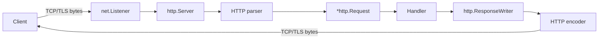
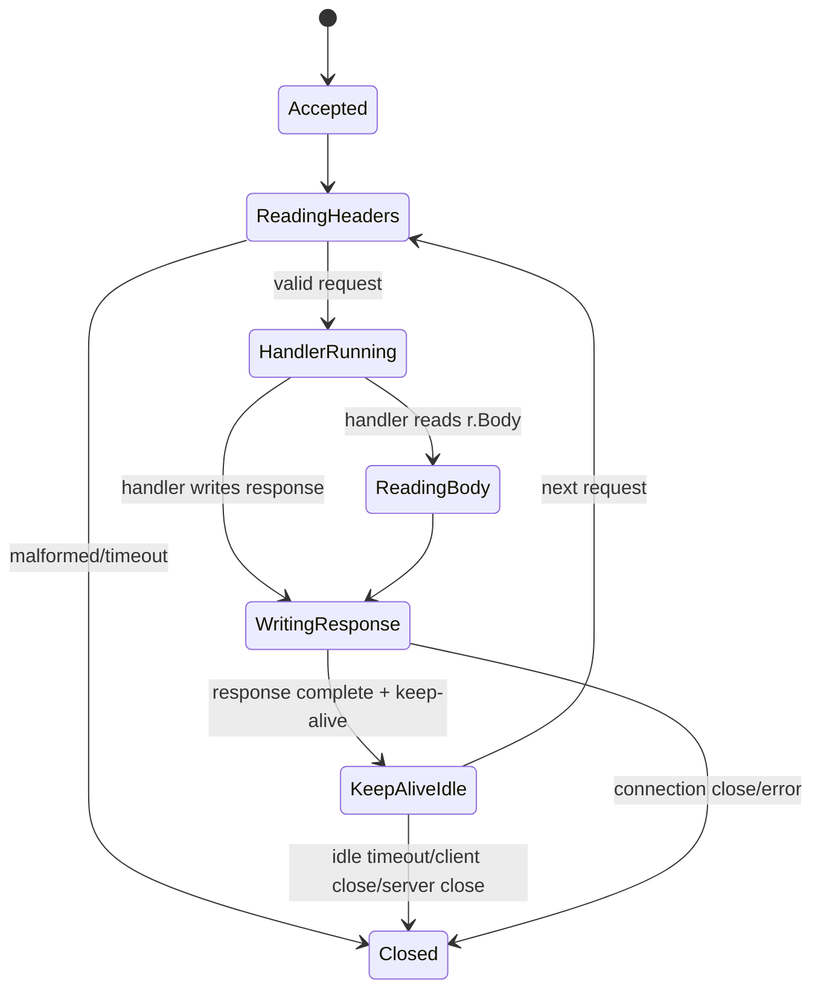
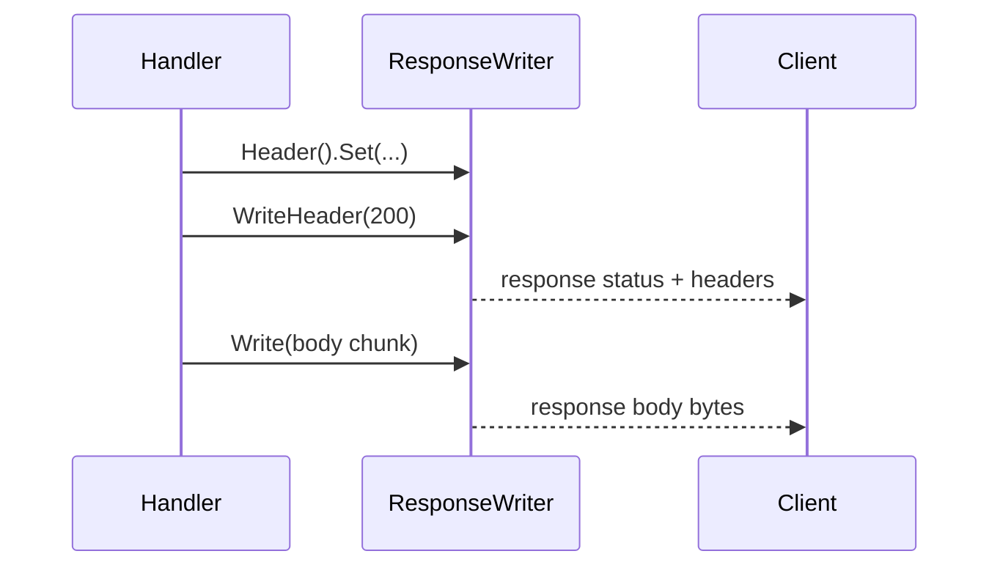
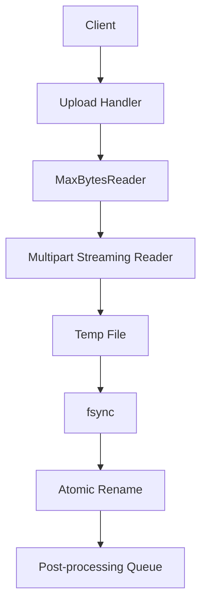
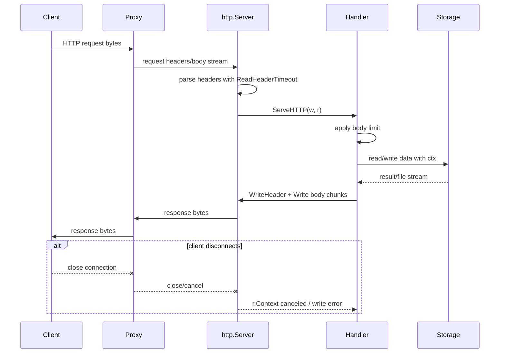

# learn-go-io-buffer-byte-stream-file-network-data-transfer-part-028.md

# Part 028 — HTTP Server Internals: Request Body, Response Writer, Streaming, Timeout, dan Shutdown-Safe Data Transfer

> Target pembaca: Java software engineer yang ingin memahami HTTP server Go bukan hanya dari sisi handler sederhana, tetapi sebagai sistem IO production-grade: data masuk melalui socket, diparsing menjadi request, body dibaca sebagai stream, response dikirim sebagai stream, timeout/deadline membatasi resource, dan shutdown tidak merusak transfer yang sedang berjalan.

---

## 0. Posisi Part Ini dalam Series

Pada part sebelumnya kita sudah membahas:

- `net.Conn`, `net.Listener`, `net.Dialer`, deadline, address, DNS.
- TCP server: accept loop, lifecycle koneksi, slow client defense.
- TCP client: timeout, retry, pooling, reconnect.
- HTTP client internals: `http.Client`, `Transport`, streaming response body, connection reuse.

Part ini membahas sisi server HTTP:

```text
TCP listener
  -> HTTP server accept loop
  -> HTTP parser
  -> http.Request
  -> request body stream
  -> handler
  -> http.ResponseWriter
  -> response stream
  -> connection reuse / close
```

Tujuan part ini bukan membuat CRUD handler. Tujuan part ini adalah membuat Anda paham **HTTP server sebagai sistem data transfer**.

---

## 1. Mental Model: HTTP Server Go Adalah Mesin Stream, Bukan Magic Web Framework

Di Java, Anda mungkin terbiasa dengan Servlet API, Spring MVC, Spring WebFlux, Undertow, Netty, Tomcat, Jetty, atau Jakarta REST. Banyak detail socket, body stream, buffering, timeout, dan connection lifecycle disembunyikan oleh container/framework.

Di Go, `net/http` lebih dekat ke mesin HTTP standar library:

```go
func handler(w http.ResponseWriter, r *http.Request) {
    // r.Body adalah stream input.
    // w adalah stream output + response metadata writer.
}
```

Kesederhanaan ini bisa menipu. Handler terlihat seperti fungsi biasa, tetapi sebenarnya berada di tengah banyak boundary:



Setiap panah adalah tempat terjadinya:

- buffering,
- blocking,
- timeout,
- partial progress,
- error,
- cancellation,
- resource retention,
- security boundary.

Top 1% engineer tidak melihat handler sebagai “function receives request returns response”. Mereka melihatnya sebagai **resource-bound stream processor**.

---

## 2. Kontrak Utama `net/http` Server

Package utama:

```go
import "net/http"
```

Interface paling penting:

```go
type Handler interface {
    ServeHTTP(ResponseWriter, *Request)
}
```

Adapter function:

```go
type HandlerFunc func(ResponseWriter, *Request)
```

Server object:

```go
type Server struct {
    Addr              string
    Handler           Handler
    ReadTimeout       time.Duration
    ReadHeaderTimeout time.Duration
    WriteTimeout      time.Duration
    IdleTimeout       time.Duration
    MaxHeaderBytes    int
    // plus TLS, ErrorLog, BaseContext, ConnContext, etc.
}
```

Minimal server:

```go
srv := &http.Server{
    Addr:    ":8080",
    Handler: mux,
}

if err := srv.ListenAndServe(); err != nil && err != http.ErrServerClosed {
    log.Fatal(err)
}
```

Production server tidak boleh berhenti di situ. Minimal production shape:

```go
srv := &http.Server{
    Addr:              ":8080",
    Handler:           rootHandler,
    ReadHeaderTimeout: 5 * time.Second,
    ReadTimeout:       30 * time.Second,
    WriteTimeout:      60 * time.Second,
    IdleTimeout:       90 * time.Second,
    MaxHeaderBytes:    1 << 20, // 1 MiB, sesuaikan dengan kebutuhan
}
```

Bukan karena angka tersebut selalu benar, tetapi karena setiap angka mewakili keputusan resource governance.

---

## 3. HTTP Server sebagai State Machine

Secara konseptual, satu connection HTTP server melewati state seperti ini:



Hal penting:

1. Request body tidak otomatis dibaca seluruhnya oleh server.
2. Response tidak otomatis “return object” seperti di banyak framework.
3. `ResponseWriter` mulai mengirim response saat header/body ditulis.
4. Koneksi bisa dipakai ulang jika protokol, header, dan body handling memungkinkan.
5. Timeout server memengaruhi fase yang berbeda.
6. Handler yang tidak membaca/menutup body atau tidak mengelola stream bisa menahan resource.

---

## 4. Mapping ke Java Mental Model

| Konsep Java | Go `net/http` | Catatan |
|---|---|---|
| `HttpServletRequest` | `*http.Request` | Metadata + body stream |
| `ServletInputStream` | `Request.Body io.ReadCloser` | Stream body; harus dibaca dengan batas |
| `HttpServletResponse` | `http.ResponseWriter` | Header/status/body writer |
| Servlet filter | Middleware `func(http.Handler) http.Handler` | Composition eksplisit |
| Tomcat connector timeout | `http.Server` timeout fields | Perlu diset eksplisit |
| Spring `@RequestBody` | manual decode / framework decode | Go standar library tidak auto-bind |
| Spring `ResponseEntity` | status/header/body writes | Header harus diset sebelum write |
| Async Servlet/Netty stream | streaming handler + `Flusher` | Harus paham flush/backpressure |
| Container graceful shutdown | `Server.Shutdown(ctx)` | Perlu wiring signal + context |

Perbedaan terbesar: Go standard library memberi primitive, bukan policy framework. Anda sendiri yang harus menentukan:

- body limit,
- decode policy,
- timeout policy,
- error response shape,
- shutdown behavior,
- observability,
- middleware order,
- resource caps.

---

## 5. Anatomy `http.Request` di Server

Handler menerima:

```go
func(w http.ResponseWriter, r *http.Request)
```

Field penting:

```go
r.Method        // GET, POST, PUT, PATCH, DELETE, etc.
r.URL           // parsed URL
r.Proto         // HTTP/1.1, HTTP/2.0
r.Header        // request headers
r.Body          // io.ReadCloser stream
r.ContentLength // declared body length, or -1 if unknown
r.Host          // host header / server host
r.RemoteAddr    // client network address string
r.TLS           // TLS connection state, if HTTPS
r.Context()     // canceled when request is done/client disconnects/server shutdown path
```

### 5.1 Request Body Adalah Stream

`r.Body` bukan `[]byte`.

```go
body, err := io.ReadAll(r.Body) // dangerous without limit
```

Ini hanya aman jika body sudah dibatasi. Untuk untrusted request, gunakan:

```go
r.Body = http.MaxBytesReader(w, r.Body, 10<<20) // 10 MiB
```

Lalu decode:

```go
dec := json.NewDecoder(r.Body)
```

### 5.2 Request Context

```go
ctx := r.Context()
```

Context request akan selesai/cancel ketika:

- client connection close,
- request selesai,
- HTTP/2 request canceled,
- server shutdown path mulai menutup request,
- middleware/handler membuat context turunan dengan timeout.

Gunakan context untuk operasi downstream:

```go
rows, err := db.QueryContext(r.Context(), query, args...)
```

Jangan membuat `context.Background()` di dalam handler kecuali memang sengaja detached work.

---

## 6. Anatomy `http.ResponseWriter`

`ResponseWriter` adalah interface:

```go
type ResponseWriter interface {
    Header() Header
    Write([]byte) (int, error)
    WriteHeader(statusCode int)
}
```

### 6.1 Tiga Fase Response



Aturan penting:

1. Set header sebelum `WriteHeader` atau `Write` pertama.
2. Jika `Write` dipanggil sebelum `WriteHeader`, status default adalah `200 OK`.
3. Setelah header terkirim, sebagian header tidak bisa diubah secara efektif.
4. `WriteHeader` hanya boleh dipanggil sekali untuk final response status.
5. `Write` bisa return error jika client disconnect atau write gagal.

Contoh benar:

```go
w.Header().Set("Content-Type", "application/json")
w.WriteHeader(http.StatusCreated)
_, _ = w.Write(payload)
```

Contoh bug:

```go
_, _ = w.Write([]byte("hello"))
w.WriteHeader(http.StatusInternalServerError) // terlambat, status sudah 200
```

---

## 7. Handler Lifecycle dan Ownership

Kontrak praktis handler:

```text
handler owns the request processing window,
but does not own the underlying connection.
```

Handler boleh:

- membaca `r.Body`,
- menulis response,
- memakai `r.Context()`,
- set header/status,
- melakukan streaming,
- spawn goroutine yang terkait context request dengan hati-hati.

Handler tidak boleh sembarangan:

- menyimpan `ResponseWriter` untuk dipakai setelah handler return,
- membaca `r.Body` setelah handler return,
- menulis response dari goroutine tanpa sinkronisasi dan lifecycle jelas,
- menganggap client masih ada,
- menganggap `Write` pasti berhasil,
- mengabaikan `r.Context().Done()` pada streaming panjang.

---

## 8. Request Body Handling Production-Grade

### 8.1 Rule Pertama: Batasi Body

Untuk endpoint JSON:

```go
const maxJSONBody = 1 << 20 // 1 MiB

func createHandler(w http.ResponseWriter, r *http.Request) {
    if r.Method != http.MethodPost {
        http.Error(w, "method not allowed", http.StatusMethodNotAllowed)
        return
    }

    r.Body = http.MaxBytesReader(w, r.Body, maxJSONBody)
    defer r.Body.Close()

    var req CreateRequest
    dec := json.NewDecoder(r.Body)
    dec.DisallowUnknownFields()

    if err := dec.Decode(&req); err != nil {
        http.Error(w, "invalid json", http.StatusBadRequest)
        return
    }

    // Optional: reject trailing JSON values.
    if dec.Decode(&struct{}{}) != io.EOF {
        http.Error(w, "body must contain exactly one JSON value", http.StatusBadRequest)
        return
    }

    w.WriteHeader(http.StatusNoContent)
}
```

Body limit melindungi dari:

- memory exhaustion,
- CPU exhaustion saat decode,
- disk spill tidak terkendali,
- slow body upload,
- accidental oversized client.

### 8.2 Jangan Mengandalkan `Content-Length` Saja

`Content-Length` berguna untuk pre-check:

```go
if r.ContentLength > maxJSONBody {
    http.Error(w, "request too large", http.StatusRequestEntityTooLarge)
    return
}
```

Tetapi tetap gunakan `MaxBytesReader`, karena:

- `ContentLength` bisa `-1`,
- transfer bisa chunked,
- client bisa bohong/malformed,
- reverse proxy bisa mengubah transfer semantics.

### 8.3 Drain atau Tidak Drain?

Di server, Anda sering perlu memilih:

- baca body sampai selesai agar koneksi bisa reuse,
- atau stop cepat dan tutup response jika body terlalu besar/malformed.

Untuk endpoint kecil, biasanya limit + decode cukup. Untuk body besar/upload, desain protocol harus jelas:

```text
If body invalid early:
  return error response and do not waste CPU reading untrusted huge body.

If connection reuse important and body small bounded:
  drain remaining bounded bytes before returning.
```

Jangan drain body tak terbatas hanya demi keep-alive.

---

## 9. JSON Handler Helper yang Aman

Contoh helper yang cukup production-friendly:

```go
package httputilx

import (
    "encoding/json"
    "errors"
    "fmt"
    "io"
    "net/http"
)

type DecodeOptions struct {
    MaxBytes              int64
    DisallowUnknownFields bool
    RejectTrailingValue   bool
}

func DecodeJSON(w http.ResponseWriter, r *http.Request, dst any, opt DecodeOptions) error {
    if opt.MaxBytes > 0 {
        r.Body = http.MaxBytesReader(w, r.Body, opt.MaxBytes)
    }
    defer r.Body.Close()

    dec := json.NewDecoder(r.Body)
    if opt.DisallowUnknownFields {
        dec.DisallowUnknownFields()
    }

    if err := dec.Decode(dst); err != nil {
        return fmt.Errorf("decode json: %w", err)
    }

    if opt.RejectTrailingValue {
        var extra struct{}
        if err := dec.Decode(&extra); !errors.Is(err, io.EOF) {
            return fmt.Errorf("decode json: trailing data")
        }
    }

    return nil
}
```

Catatan:

- `defer r.Body.Close()` di helper berarti helper mengambil ownership body.
- Jika handler perlu streaming body setelah decode partial, jangan gunakan helper ini.
- Return error internal sebaiknya dipetakan ke error response konsisten di layer handler/middleware.

---

## 10. Response Writing: JSON Response yang Benar

Helper sederhana:

```go
func WriteJSON(w http.ResponseWriter, status int, value any) error {
    w.Header().Set("Content-Type", "application/json; charset=utf-8")
    w.WriteHeader(status)
    enc := json.NewEncoder(w)
    return enc.Encode(value)
}
```

Masalahnya: setelah `WriteHeader(status)`, jika `Encode` gagal, Anda tidak bisa mengubah status menjadi 500.

Untuk response kecil, encode ke buffer dulu:

```go
func WriteJSONBuffered(w http.ResponseWriter, status int, value any) error {
    var buf bytes.Buffer
    enc := json.NewEncoder(&buf)
    if err := enc.Encode(value); err != nil {
        return err
    }

    w.Header().Set("Content-Type", "application/json; charset=utf-8")
    w.Header().Set("Content-Length", strconv.Itoa(buf.Len()))
    w.WriteHeader(status)
    _, err := w.Write(buf.Bytes())
    return err
}
```

Trade-off:

| Approach | Kelebihan | Risiko |
|---|---|---|
| Direct encode to `w` | streaming, low memory | encode error setelah status terkirim |
| Buffer dulu | bisa fail sebelum commit response | memory naik untuk response besar |
| Temp file/spool | aman untuk response besar | kompleksitas + disk IO |
| Streaming JSONL | cocok dataset besar | client harus paham incremental format |

Production rule:

```text
Small response: buffer before commit.
Large response: stream with explicit error/cancellation semantics.
```

---

## 11. Header Commit Semantics

Salah satu bug paling umum:

```go
func handler(w http.ResponseWriter, r *http.Request) {
    fmt.Fprintln(w, "starting")

    if err := doWork(); err != nil {
        http.Error(w, "failed", http.StatusInternalServerError)
        return
    }
}
```

Begitu `Fprintln` memanggil `Write`, server mengirim status 200. Error berikutnya tidak bisa mengubah status.

Desain yang benar:

```go
result, err := doWorkBeforeCommit(r.Context())
if err != nil {
    http.Error(w, "failed", http.StatusInternalServerError)
    return
}

w.Header().Set("Content-Type", "application/json")
w.WriteHeader(http.StatusOK)
_ = json.NewEncoder(w).Encode(result)
```

Untuk streaming, Anda memang commit lebih awal, tetapi harus menerima konsekuensinya:

```text
Once streaming begins, error signaling must move into stream protocol,
not HTTP status code.
```

Contoh:

- SSE event `event: error`,
- JSONL record `{ "type": "error", ... }`,
- trailer header,
- connection close with incomplete frame,
- application-level checksum/footer.

---

## 12. Streaming Response

### 12.1 Basic Streaming

```go
func streamHandler(w http.ResponseWriter, r *http.Request) {
    w.Header().Set("Content-Type", "text/plain; charset=utf-8")
    w.WriteHeader(http.StatusOK)

    flusher, ok := w.(http.Flusher)
    if !ok {
        http.Error(w, "streaming unsupported", http.StatusInternalServerError)
        return
    }

    ticker := time.NewTicker(time.Second)
    defer ticker.Stop()

    for i := 0; i < 10; i++ {
        select {
        case <-r.Context().Done():
            return
        case <-ticker.C:
            if _, err := fmt.Fprintf(w, "tick %d\n", i); err != nil {
                return
            }
            flusher.Flush()
        }
    }
}
```

Bug di atas: `http.Error` setelah `WriteHeader` tidak akan bekerja benar jika `Flusher` tidak tersedia. Cek capability sebelum commit:

```go
func streamHandler(w http.ResponseWriter, r *http.Request) {
    flusher, ok := w.(http.Flusher)
    if !ok {
        http.Error(w, "streaming unsupported", http.StatusInternalServerError)
        return
    }

    w.Header().Set("Content-Type", "text/plain; charset=utf-8")
    w.WriteHeader(http.StatusOK)

    for i := 0; i < 10; i++ {
        select {
        case <-r.Context().Done():
            return
        case <-time.After(time.Second):
            if _, err := fmt.Fprintf(w, "tick %d\n", i); err != nil {
                return
            }
            flusher.Flush()
        }
    }
}
```

### 12.2 Flush Tidak Sama dengan Client Sudah Memproses

`Flush` berarti meminta server/protocol stack mengirim buffered data. Tidak berarti:

- client sudah menerima,
- client sudah membaca,
- proxy tidak menahan,
- browser sudah menampilkan,
- network tidak gagal setelahnya.

Banyak reverse proxy/CDN melakukan buffering. Untuk streaming real-time, konfigurasi proxy juga harus mendukung.

---

## 13. Streaming Download File

Untuk file download besar:

```go
func downloadHandler(w http.ResponseWriter, r *http.Request) {
    f, err := os.Open("/data/export.bin")
    if err != nil {
        http.Error(w, "not found", http.StatusNotFound)
        return
    }
    defer f.Close()

    info, err := f.Stat()
    if err != nil {
        http.Error(w, "stat failed", http.StatusInternalServerError)
        return
    }

    w.Header().Set("Content-Type", "application/octet-stream")
    w.Header().Set("Content-Disposition", `attachment; filename="export.bin"`)
    w.Header().Set("Content-Length", strconv.FormatInt(info.Size(), 10))

    if _, err := io.Copy(w, f); err != nil {
        // client disconnect or write failure; status likely already committed.
        // Log at debug/info depending on operational policy.
        return
    }
}
```

Namun, Go sudah menyediakan:

```go
http.ServeFile(w, r, path)
```

atau:

```go
http.ServeContent(w, r, name, modTime, reader)
```

`ServeContent` berguna bila Anda punya `io.ReadSeeker`, metadata, dan ingin dukungan range/conditional request.

### 13.1 Kapan `ServeContent` Lebih Baik?

| Kebutuhan | Pilihan |
|---|---|
| Static file path sederhana | `http.ServeFile` / `http.FileServer` |
| File dari custom source dengan seek | `http.ServeContent` |
| Generated stream tanpa seek | manual `io.Copy`/encoder |
| Perlu range request | `ServeContent` jika reader seekable |
| Perlu audit/authorization custom | handler wrapper + safe path policy |

---

## 14. Streaming Upload File

Upload handler production-grade perlu menghindari `ParseMultipartForm` sembarangan untuk file besar, karena method ini dapat menyimpan sebagian data di memory dan sisanya di temp file sesuai limit.

Untuk kontrol penuh, gunakan multipart reader streaming:

```go
func uploadHandler(w http.ResponseWriter, r *http.Request) {
    const maxBody = 1 << 30 // 1 GiB
    r.Body = http.MaxBytesReader(w, r.Body, maxBody)
    defer r.Body.Close()

    mr, err := r.MultipartReader()
    if err != nil {
        http.Error(w, "invalid multipart", http.StatusBadRequest)
        return
    }

    for {
        part, err := mr.NextPart()
        if errors.Is(err, io.EOF) {
            break
        }
        if err != nil {
            http.Error(w, "multipart read failed", http.StatusBadRequest)
            return
        }

        if part.FormName() != "file" {
            // Drain or skip bounded part depending on policy.
            continue
        }

        if err := saveUploadedPart(r.Context(), part.FileName(), part); err != nil {
            http.Error(w, "upload failed", http.StatusInternalServerError)
            return
        }
    }

    w.WriteHeader(http.StatusCreated)
}
```

Safe save pattern:

```go
func saveUploadedPart(ctx context.Context, originalName string, src io.Reader) error {
    safeName := sanitizeUploadName(originalName)

    tmp, err := os.CreateTemp("/data/uploads/.tmp", "upload-*")
    if err != nil {
        return err
    }
    tmpName := tmp.Name()
    committed := false
    defer func() {
        _ = tmp.Close()
        if !committed {
            _ = os.Remove(tmpName)
        }
    }()

    h := sha256.New()
    mw := io.MultiWriter(tmp, h)

    if _, err := copyWithContext(ctx, mw, src, 256<<10); err != nil {
        return err
    }
    if err := tmp.Sync(); err != nil {
        return err
    }
    if err := tmp.Close(); err != nil {
        return err
    }

    final := filepath.Join("/data/uploads", safeName)
    if err := os.Rename(tmpName, final); err != nil {
        return err
    }
    committed = true

    _ = h.Sum(nil) // store checksum metadata if needed
    return nil
}
```

`copyWithContext`:

```go
func copyWithContext(ctx context.Context, dst io.Writer, src io.Reader, bufSize int) (int64, error) {
    if bufSize <= 0 {
        bufSize = 32 << 10
    }
    buf := make([]byte, bufSize)
    var written int64

    for {
        select {
        case <-ctx.Done():
            return written, ctx.Err()
        default:
        }

        n, rerr := src.Read(buf)
        if n > 0 {
            wn, werr := dst.Write(buf[:n])
            written += int64(wn)
            if werr != nil {
                return written, werr
            }
            if wn != n {
                return written, io.ErrShortWrite
            }
        }
        if rerr != nil {
            if errors.Is(rerr, io.EOF) {
                return written, nil
            }
            return written, rerr
        }
    }
}
```

---

## 15. Middleware sebagai IO Boundary Policy

Go middleware pattern:

```go
func Middleware(next http.Handler) http.Handler {
    return http.HandlerFunc(func(w http.ResponseWriter, r *http.Request) {
        // before
        next.ServeHTTP(w, r)
        // after
    })
}
```

Middleware bukan sekadar cross-cutting concern. Dalam HTTP IO, middleware sering menentukan:

- body limit,
- request ID,
- logging,
- panic recovery,
- compression,
- authentication,
- timeout,
- metrics,
- CORS,
- security headers,
- response size tracking.

### 15.1 Middleware Order Matters

Contoh order:

```text
recover
  -> request id
  -> access log
  -> metrics
  -> max body
  -> auth
  -> route handler
```

Jika body limit terlalu dalam, auth middleware mungkin membaca body tanpa batas. Jika logging middleware membungkus response writer dengan salah, streaming/flushing bisa rusak.

---

## 16. ResponseWriter Wrapping: Hati-hati Capability Loss

Untuk logging status/bytes, banyak engineer membungkus `ResponseWriter`:

```go
type loggingWriter struct {
    http.ResponseWriter
    status int
    bytes  int64
}

func (lw *loggingWriter) WriteHeader(code int) {
    lw.status = code
    lw.ResponseWriter.WriteHeader(code)
}

func (lw *loggingWriter) Write(p []byte) (int, error) {
    if lw.status == 0 {
        lw.status = http.StatusOK
    }
    n, err := lw.ResponseWriter.Write(p)
    lw.bytes += int64(n)
    return n, err
}
```

Masalah: wrapper ini bisa menyembunyikan optional interfaces:

- `http.Flusher`,
- `http.Hijacker`,
- `http.Pusher` (HTTP/2 server push historically; less used),
- `io.ReaderFrom` optimization,
- newer control mechanisms via `http.ResponseController`.

Jika handler membutuhkan streaming, wrapper harus tetap mendukung `Flush`.

```go
func (lw *loggingWriter) Flush() {
    if f, ok := lw.ResponseWriter.(http.Flusher); ok {
        f.Flush()
    }
}
```

Namun membuat wrapper fully-correct untuk semua capability tidak trivial. Gunakan dengan disiplin dan test capability-sensitive handler.

---

## 17. `http.ResponseController`

Go modern menyediakan `http.NewResponseController(w)` untuk mengakses beberapa operasi response tanpa terlalu bergantung langsung pada type assertion optional interface.

Contoh streaming flush:

```go
func stream(w http.ResponseWriter, r *http.Request) {
    rc := http.NewResponseController(w)

    w.Header().Set("Content-Type", "text/plain")
    w.WriteHeader(http.StatusOK)

    for i := 0; i < 10; i++ {
        if _, err := fmt.Fprintf(w, "line %d\n", i); err != nil {
            return
        }
        if err := rc.Flush(); err != nil {
            return
        }
    }
}
```

Response controller juga dapat berguna untuk setting per-response deadline ketika didukung oleh server/protocol path.

Mental model:

```text
ResponseController = controlled escape hatch for advanced response operations.
```

Tetap desain fallback dan error handling.

---

## 18. Timeout Model HTTP Server

Timeout server HTTP sering disalahpahami. Field yang umum:

```go
srv := &http.Server{
    ReadHeaderTimeout: 5 * time.Second,
    ReadTimeout:       30 * time.Second,
    WriteTimeout:      60 * time.Second,
    IdleTimeout:       90 * time.Second,
}
```

### 18.1 `ReadHeaderTimeout`

Membatasi waktu membaca request headers. Ini pertahanan penting terhadap slowloris.

```text
client sends headers very slowly
  -> connection holds goroutine/fd
  -> ReadHeaderTimeout cuts it
```

### 18.2 `ReadTimeout`

Membatasi pembacaan request secara lebih luas, termasuk body. Cocok untuk server dengan body kecil/menengah. Untuk upload sangat besar, `ReadTimeout` fixed bisa membunuh upload legitimate yang lambat.

### 18.3 `WriteTimeout`

Membatasi waktu menulis response. Bisa bermasalah untuk streaming panjang jika terlalu pendek. Untuk streaming endpoint, Anda mungkin perlu:

- timeout berbeda,
- per-write deadline,
- heartbeat,
- proxy-aware streaming config,
- atau server terpisah.

### 18.4 `IdleTimeout`

Membatasi waktu keep-alive idle antar request pada koneksi yang sama.

### 18.5 Handler Timeout Middleware

`http.TimeoutHandler` bisa membatasi waktu handler, tetapi tidak selalu cocok untuk streaming. Untuk operasi business logic, lebih baik context timeout eksplisit:

```go
func withHandlerTimeout(d time.Duration, next http.Handler) http.Handler {
    return http.HandlerFunc(func(w http.ResponseWriter, r *http.Request) {
        ctx, cancel := context.WithTimeout(r.Context(), d)
        defer cancel()
        next.ServeHTTP(w, r.WithContext(ctx))
    })
}
```

Tetapi context timeout hanya efektif jika downstream menghormatinya.

---

## 19. Slow Client Defense

HTTP server menghadapi slow client pada dua arah:

```text
slow upload:  client sends request body slowly
slow download: client reads response slowly
```

### 19.1 Slow Upload

Defense:

- `ReadHeaderTimeout`,
- `ReadTimeout` untuk endpoint body kecil,
- `MaxBytesReader`,
- reverse proxy body timeout,
- application-level upload deadline,
- rate limit,
- auth sebelum body besar jika memungkinkan,
- resumable upload protocol untuk file besar.

### 19.2 Slow Download

Defense:

- `WriteTimeout`,
- response size limit,
- pagination,
- streaming heartbeat,
- queue/backpressure,
- avoid holding DB transaction while streaming to slow client,
- separate generation phase from download phase.

Bad pattern:

```go
rows, _ := tx.QueryContext(ctx, query)
defer tx.Rollback()

for rows.Next() {
    // write each row to slow client while transaction remains open
}
```

Better pattern depends on size:

- small: fetch then respond,
- medium: cursor with strict timeout,
- large: export job -> file/object storage -> download,
- realtime: streaming protocol with backpressure and cancellation.

---

## 20. Graceful Shutdown

Basic shape:

```go
func main() {
    srv := &http.Server{
        Addr:              ":8080",
        Handler:           routes(),
        ReadHeaderTimeout: 5 * time.Second,
        IdleTimeout:       90 * time.Second,
    }

    errCh := make(chan error, 1)
    go func() {
        if err := srv.ListenAndServe(); err != nil && err != http.ErrServerClosed {
            errCh <- err
            return
        }
        errCh <- nil
    }()

    sigCh := make(chan os.Signal, 1)
    signal.Notify(sigCh, syscall.SIGINT, syscall.SIGTERM)

    select {
    case sig := <-sigCh:
        log.Printf("shutdown signal: %s", sig)
    case err := <-errCh:
        if err != nil {
            log.Fatalf("server failed: %v", err)
        }
        return
    }

    ctx, cancel := context.WithTimeout(context.Background(), 30*time.Second)
    defer cancel()

    if err := srv.Shutdown(ctx); err != nil {
        log.Printf("graceful shutdown failed: %v", err)
        _ = srv.Close()
    }

    if err := <-errCh; err != nil {
        log.Printf("server exit: %v", err)
    }
}
```

### 20.1 Apa yang Dilakukan `Shutdown`?

Secara konseptual:

```text
stop accepting new connections
close idle connections
wait for active handlers until context deadline
then return
```

Active long-running streams bisa membuat shutdown menunggu sampai deadline.

### 20.2 Shutdown-Aware Handler

Handler panjang harus memantau context:

```go
func longStream(w http.ResponseWriter, r *http.Request) {
    ctx := r.Context()

    for {
        select {
        case <-ctx.Done():
            return
        default:
        }

        // produce and write next chunk
    }
}
```

Untuk background jobs yang dimulai oleh request, pisahkan lifecycle:

```text
request context: valid for request/response
server context: valid until process shutting down
job context: explicit lifecycle stored in job manager
```

Jangan gunakan request context untuk job yang harus lanjut setelah response, kecuali memang cancellation by client desired.

---

## 21. HTTP/1.1 vs HTTP/2 Server Implications

`net/http` menyembunyikan banyak detail, tetapi production behavior berbeda.

| Area | HTTP/1.1 | HTTP/2 |
|---|---|---|
| Multiplexing | Satu request aktif per connection umum | Banyak stream per connection |
| Head-of-line | Pada connection level | Berkurang di application layer |
| Flow control | TCP-level | HTTP/2 stream/connection flow control |
| ResponseWriter wrappers | Optional interface nuance | Beberapa capability berbeda |
| Client disconnect | Connection close | Stream cancel bisa lebih granular |
| Timeout effect | Connection-oriented | Stream behavior perlu diperhatikan |

Go 1.26 menambah kontrol terkait HTTP/2 concurrent request behavior di konfigurasi HTTP/2. Untuk kebanyakan server, gunakan default kecuali Anda paham konsekuensi kapasitas dan fairness.

---

## 22. Server-Sent Events / Event Streaming

SSE shape:

```go
func sseHandler(w http.ResponseWriter, r *http.Request) {
    rc := http.NewResponseController(w)

    h := w.Header()
    h.Set("Content-Type", "text/event-stream")
    h.Set("Cache-Control", "no-cache")
    h.Set("Connection", "keep-alive")

    w.WriteHeader(http.StatusOK)

    ticker := time.NewTicker(5 * time.Second)
    defer ticker.Stop()

    for {
        select {
        case <-r.Context().Done():
            return
        case t := <-ticker.C:
            if _, err := fmt.Fprintf(w, "event: heartbeat\ndata: %s\n\n", t.Format(time.RFC3339)); err != nil {
                return
            }
            if err := rc.Flush(); err != nil {
                return
            }
        }
    }
}
```

Production considerations:

- limit concurrent streams,
- heartbeat interval,
- proxy buffering disabled,
- write timeout suitable for long streams,
- auth token expiry policy,
- disconnect metrics,
- event replay/resume if needed.

---

## 23. Trailers

HTTP trailers allow metadata after body. Useful for streaming checksums or final status. But not all clients/proxies handle trailers well.

Conceptual pattern:

```go
w.Header().Set("Trailer", "X-Checksum")
w.Header().Set("Content-Type", "application/octet-stream")
w.WriteHeader(http.StatusOK)

h := sha256.New()
mw := io.MultiWriter(w, h)
_, err := io.Copy(mw, src)
if err != nil {
    return
}

w.Header().Set("X-Checksum", hex.EncodeToString(h.Sum(nil)))
```

Caveat:

```text
Use trailers only when you control client/proxy path or have tested compatibility.
```

For critical transfer integrity, an application-level footer/frame may be more portable.

---

## 24. Panic Recovery Middleware

Without recovery, panic in handler can terminate that request path and be logged by server, but production APIs normally need consistent error response and metrics.

```go
func Recover(next http.Handler) http.Handler {
    return http.HandlerFunc(func(w http.ResponseWriter, r *http.Request) {
        defer func() {
            if v := recover(); v != nil {
                // If response already committed, cannot send clean 500.
                http.Error(w, "internal server error", http.StatusInternalServerError)
            }
        }()
        next.ServeHTTP(w, r)
    })
}
```

But this has a flaw: if response already committed, `http.Error` is too late.

More advanced recovery needs response commit tracking:

```go
type statusRecorder struct {
    http.ResponseWriter
    status    int
    committed bool
}

func (r *statusRecorder) WriteHeader(code int) {
    if r.committed {
        return
    }
    r.status = code
    r.committed = true
    r.ResponseWriter.WriteHeader(code)
}

func (r *statusRecorder) Write(p []byte) (int, error) {
    if !r.committed {
        r.WriteHeader(http.StatusOK)
    }
    return r.ResponseWriter.Write(p)
}
```

Recovery policy:

```text
If response not committed: return 500.
If response committed: abort/log; error must be visible through connection/stream semantics.
```

---

## 25. Error Response Design

Ad-hoc `http.Error` is okay for internal tools, but production APIs need stable error shape.

Example:

```go
type ErrorResponse struct {
    Code      string `json:"code"`
    Message   string `json:"message"`
    RequestID string `json:"request_id,omitempty"`
}

func WriteError(w http.ResponseWriter, status int, code, msg, requestID string) {
    _ = WriteJSONBuffered(w, status, ErrorResponse{
        Code:      code,
        Message:   msg,
        RequestID: requestID,
    })
}
```

Map errors deliberately:

| Error | HTTP Status |
|---|---:|
| malformed JSON | 400 |
| unknown field | 400 / 422 depending policy |
| body too large | 413 |
| unsupported media type | 415 |
| auth missing/invalid | 401 |
| auth valid but forbidden | 403 |
| resource missing | 404 |
| conflict/version mismatch | 409 |
| validation failed | 422 |
| rate limited | 429 |
| downstream timeout | 504 or 503 depending topology |
| internal invariant violated | 500 |

Do not leak internal errors to client.

---

## 26. Routing with `ServeMux`

Go standard library includes `http.ServeMux`. In modern Go, mux pattern support is more capable than older versions.

Simple:

```go
mux := http.NewServeMux()
mux.HandleFunc("GET /healthz", healthHandler)
mux.HandleFunc("POST /uploads", uploadHandler)
```

Use explicit method/path patterns where possible. Good server design does not require heavy framework unless you need ecosystem features.

Routing concerns:

- method not allowed,
- path normalization,
- trailing slash,
- route variable validation,
- auth per route,
- body limit per route,
- metrics label cardinality.

Avoid raw path as metric label:

```text
BAD:  /users/123/orders/999
GOOD: /users/{id}/orders/{order_id}
```

---

## 27. Request ID and Correlation

Middleware:

```go
type ctxKey string

const requestIDKey ctxKey = "request_id"

func RequestID(next http.Handler) http.Handler {
    return http.HandlerFunc(func(w http.ResponseWriter, r *http.Request) {
        id := r.Header.Get("X-Request-ID")
        if id == "" || len(id) > 128 {
            id = generateRequestID()
        }

        w.Header().Set("X-Request-ID", id)
        ctx := context.WithValue(r.Context(), requestIDKey, id)
        next.ServeHTTP(w, r.WithContext(ctx))
    })
}
```

Production notes:

- validate inbound request ID length/characters,
- avoid trusting arbitrary IDs for security decisions,
- propagate to downstream calls,
- log once per request with status, duration, bytes, route, method.

---

## 28. Access Logging Without Breaking Streaming

Bad logging:

```go
log.Printf("request started")
next.ServeHTTP(w, r)
log.Printf("request finished")
```

Better: record status, bytes, duration. But wrapper must preserve capabilities if streaming endpoints exist.

Minimal for non-streaming APIs:

```go
func AccessLog(next http.Handler) http.Handler {
    return http.HandlerFunc(func(w http.ResponseWriter, r *http.Request) {
        start := time.Now()
        rec := &statusRecorder{ResponseWriter: w}

        next.ServeHTTP(rec, r)

        status := rec.status
        if status == 0 {
            status = http.StatusOK
        }

        log.Printf("method=%s path=%s status=%d duration=%s", r.Method, r.URL.Path, status, time.Since(start))
    })
}
```

For production, prefer a tested wrapper or keep streaming routes separate if wrapper correctness is uncertain.

---

## 29. HTTP Server Observability

Metrics to capture:

| Metric | Why |
|---|---|
| requests total by method/route/status | traffic and error rate |
| request duration histogram | latency SLO |
| request body bytes | upload pressure |
| response body bytes | egress pressure |
| in-flight requests | saturation |
| active streams | streaming capacity |
| rejected body too large | abuse/client bug |
| read timeout count | slow upload/slowloris |
| write error/client disconnect | network/client behavior |
| shutdown active duration | graceful drain health |

Log fields:

```text
request_id
method
route_pattern
status
latency_ms
request_bytes
response_bytes
remote_addr or trusted client ip
user_agent maybe sampled
error_code
```

Avoid:

- logging full body by default,
- logging auth tokens/cookies,
- high-cardinality path labels,
- treating all client disconnects as server errors.

---

## 30. Security Lens

HTTP server IO security is mostly resource and boundary security.

Checklist:

1. Set `ReadHeaderTimeout`.
2. Set body limits per endpoint.
3. Validate content type where relevant.
4. Reject unknown fields for strict internal APIs when appropriate.
5. Avoid `io.ReadAll` on untrusted body without limit.
6. Do not expose raw internal error.
7. Normalize and validate path parameters before filesystem use.
8. Do not trust `X-Forwarded-For` unless behind trusted proxy and configured explicitly.
9. Limit upload filename semantics; never write user filename directly as path.
10. Avoid request smuggling assumptions; let standard library parse, and keep proxies patched/configured.
11. Use TLS for external traffic or terminate at trusted proxy boundary.
12. Limit header size with `MaxHeaderBytes`.
13. Rate limit expensive endpoints.
14. Use authentication before expensive body processing where protocol allows.
15. Watch Go security patch releases for `net/http` and related packages.

---

## 31. Reverse Proxy Boundary

Often Go server sits behind nginx, ALB, Envoy, HAProxy, Traefik, or API Gateway.

You must align limits:

| Concern | Proxy | Go Server |
|---|---|---|
| max body size | yes | yes |
| read header timeout | yes | yes |
| idle timeout | yes | yes |
| upload timeout | yes | maybe per route |
| response buffering | maybe | streaming handler |
| client IP | proxy header | trust policy |
| TLS | terminate/mTLS | optional |
| compression | proxy/app | one owner |

Bug pattern:

```text
proxy allows 100 MB
Go handler allows unlimited
=> memory/disk spike possible
```

Or:

```text
Go streams SSE
proxy buffers response
=> client sees nothing until buffer full/closed
```

---

## 32. Testing HTTP Server IO

### 32.1 Handler Unit Test with `httptest.ResponseRecorder`

```go
func TestCreateHandler(t *testing.T) {
    body := strings.NewReader(`{"name":"alice"}`)
    req := httptest.NewRequest(http.MethodPost, "/users", body)
    rec := httptest.NewRecorder()

    createHandler(rec, req)

    res := rec.Result()
    defer res.Body.Close()

    if res.StatusCode != http.StatusCreated {
        t.Fatalf("status = %d", res.StatusCode)
    }
}
```

Good for normal handlers. Less accurate for streaming/network behavior.

### 32.2 Integration Test with `httptest.Server`

```go
func TestStreaming(t *testing.T) {
    srv := httptest.NewServer(http.HandlerFunc(streamHandler))
    defer srv.Close()

    resp, err := http.Get(srv.URL)
    if err != nil {
        t.Fatal(err)
    }
    defer resp.Body.Close()

    scanner := bufio.NewScanner(resp.Body)
    if !scanner.Scan() {
        t.Fatal("expected first line")
    }
}
```

Use `httptest.NewTLSServer` for TLS behavior.

### 32.3 Fault Injection

Test cases:

- body too large,
- malformed JSON,
- unknown field,
- trailing JSON,
- client disconnect during upload,
- client disconnect during download,
- slow body reader,
- handler context canceled,
- response writer returns error,
- panic before response commit,
- panic after response commit,
- shutdown with active request.

Custom slow reader:

```go
type slowReader struct {
    data []byte
    d    time.Duration
}

func (s *slowReader) Read(p []byte) (int, error) {
    time.Sleep(s.d)
    if len(s.data) == 0 {
        return 0, io.EOF
    }
    n := copy(p, s.data[:1])
    s.data = s.data[n:]
    return n, nil
}
```

---

## 33. Benchmarking Server Handlers

Handler benchmark:

```go
func BenchmarkCreateHandler(b *testing.B) {
    payload := []byte(`{"name":"alice"}`)

    for i := 0; i < b.N; i++ {
        req := httptest.NewRequest(http.MethodPost, "/users", bytes.NewReader(payload))
        rec := httptest.NewRecorder()
        createHandler(rec, req)
        if rec.Code != http.StatusCreated {
            b.Fatalf("status=%d", rec.Code)
        }
    }
}
```

Benchmark dimensions:

- allocation per request,
- latency per payload size,
- JSON decode cost,
- response encoding cost,
- middleware overhead,
- body limit behavior,
- streaming chunk size,
- `io.Copy` buffer size,
- compression on/off if applicable.

But microbenchmark is not enough. For HTTP server, also test:

- concurrency,
- slow clients,
- connection reuse,
- HTTP/2,
- reverse proxy path,
- TLS,
- OS file descriptor limits,
- GC pressure.

---

## 34. Production Pattern: Bounded JSON API Server

```go
func main() {
    mux := http.NewServeMux()
    mux.Handle("GET /healthz", http.HandlerFunc(healthz))
    mux.Handle("POST /v1/items", chain(
        http.HandlerFunc(createItem),
        MaxBody(1<<20),
        AccessLog,
        Recover,
        RequestID,
    ))

    srv := &http.Server{
        Addr:              ":8080",
        Handler:           mux,
        ReadHeaderTimeout: 5 * time.Second,
        ReadTimeout:       15 * time.Second,
        WriteTimeout:      30 * time.Second,
        IdleTimeout:       90 * time.Second,
        MaxHeaderBytes:    1 << 20,
    }

    runServerWithShutdown(srv)
}
```

Middleware chain helper:

```go
type Middleware func(http.Handler) http.Handler

func chain(h http.Handler, mws ...Middleware) http.Handler {
    for i := len(mws) - 1; i >= 0; i-- {
        h = mws[i](h)
    }
    return h
}
```

Max body middleware:

```go
func MaxBody(n int64) Middleware {
    return func(next http.Handler) http.Handler {
        return http.HandlerFunc(func(w http.ResponseWriter, r *http.Request) {
            r.Body = http.MaxBytesReader(w, r.Body, n)
            next.ServeHTTP(w, r)
        })
    }
}
```

Important: if multiple middleware read body, ownership must be explicit.

---

## 35. Production Pattern: Export Download Server

Architecture:

```mermaid
flowchart LR
    U[Client] --> API[POST /exports]
    API --> Q[Job Queue]
    Q --> W[Worker]
    W --> F[Durable File/Object]
    U --> D[GET /exports/{id}/download]
    D --> F
```

Why not generate huge export directly inside request?

Because direct generation can hold:

- DB connection,
- DB transaction/cursor,
- HTTP connection,
- memory buffers,
- goroutine,
- client socket,
- server shutdown hostage.

Better:

1. request creates export job,
2. worker writes durable file with checksum,
3. download endpoint streams file,
4. range/resume supported if possible,
5. cleanup policy handles old exports.

Download handler:

```go
func downloadExport(w http.ResponseWriter, r *http.Request) {
    meta, err := findExportMetadata(r.Context(), exportIDFrom(r))
    if err != nil {
        WriteError(w, http.StatusNotFound, "not_found", "export not found", requestID(r))
        return
    }

    f, err := os.Open(meta.Path)
    if err != nil {
        WriteError(w, http.StatusInternalServerError, "open_failed", "download unavailable", requestID(r))
        return
    }
    defer f.Close()

    w.Header().Set("Content-Type", meta.ContentType)
    w.Header().Set("Content-Disposition", contentDispositionAttachment(meta.FileName))
    w.Header().Set("X-Content-SHA256", meta.SHA256)

    http.ServeContent(w, r, meta.FileName, meta.ModTime, f)
}
```

---

## 36. Production Pattern: Upload Ingestion Server

Architecture:



Key invariants:

- body bounded,
- filename sanitized,
- temp file cleaned on failure,
- checksum computed during stream,
- durable write before success response,
- no DB transaction held during slow upload unless absolutely necessary,
- context cancellation stops copy,
- partial file never visible as final file.

---

## 37. Anti-Patterns

### 37.1 `io.ReadAll(r.Body)` Tanpa Limit

```go
body, _ := io.ReadAll(r.Body)
```

Ini membuka memory DoS.

### 37.2 `WriteHeader` Setelah `Write`

```go
w.Write([]byte("ok"))
w.WriteHeader(500)
```

Status sudah committed.

### 37.3 Mengabaikan `Write` Error Saat Streaming

```go
for _, chunk := range chunks {
    w.Write(chunk) // ignored
}
```

Client mungkin sudah disconnect.

### 37.4 Long DB Transaction While Streaming

```text
DB transaction open for minutes because client downloads slowly.
```

Ini bisa mengunci resource DB.

### 37.5 Middleware Wrapper Menghilangkan `Flusher`

Streaming endpoint tiba-tiba tidak flush karena wrapper tidak expose `Flush`.

### 37.6 Timeout Sama untuk Semua Endpoint

Upload 1 GiB dan JSON 1 KiB diberi timeout sama. Ini biasanya salah.

### 37.7 Trust Proxy Headers Tanpa Trust Boundary

```go
clientIP := r.Header.Get("X-Forwarded-For")
```

Header ini bisa dipalsukan jika tidak datang dari proxy tepercaya.

---

## 38. Failure Mode Matrix

| Failure | Symptom | Mitigation |
|---|---|---|
| slow header | fd/goroutine held | `ReadHeaderTimeout` |
| oversized body | memory spike | `MaxBytesReader`, proxy limit |
| malformed JSON | decode error | stable 400 response |
| unknown field | silent compatibility bug | `DisallowUnknownFields` for strict APIs |
| trailing JSON | request smuggling-ish app ambiguity | reject trailing values |
| client disconnect upload | copy error/context cancel | cleanup temp file |
| client disconnect download | write error | stop streaming, log appropriately |
| handler panic before commit | 500 | recovery middleware |
| handler panic after commit | broken stream | log/abort connection semantics |
| shutdown during active stream | delayed shutdown | context-aware stream + max drain time |
| reverse proxy buffers stream | client sees delayed output | proxy config + testing |
| wrapper loses flusher | stream broken | preserve capability/test |
| large export direct request | DB/HTTP resource hostage | async export job |

---

## 39. Mermaid: HTTP Server Data Transfer Lifecycle



---

## 40. Checklist Production HTTP Server

### Server Config

- [ ] `ReadHeaderTimeout` set.
- [ ] `ReadTimeout` evaluated per body type.
- [ ] `WriteTimeout` evaluated per streaming requirement.
- [ ] `IdleTimeout` set.
- [ ] `MaxHeaderBytes` set deliberately.
- [ ] graceful shutdown wired to SIGTERM/SIGINT.
- [ ] TLS/proxy boundary clear.

### Request Handling

- [ ] method validated.
- [ ] content type validated where relevant.
- [ ] body size limited.
- [ ] JSON trailing value rejected for strict endpoints.
- [ ] unknown field policy deliberate.
- [ ] context propagated downstream.
- [ ] body ownership clear.

### Response Handling

- [ ] headers set before write.
- [ ] small response buffered before commit when encoding may fail.
- [ ] streaming response checks write/flush error.
- [ ] content type set.
- [ ] content disposition safe for downloads.
- [ ] error response shape stable.

### Streaming/Transfer

- [ ] upload temp file cleanup on failure.
- [ ] durable write pattern used when success means persistence.
- [ ] large export not generated while client waits unless explicitly acceptable.
- [ ] checksum/integrity model present for large transfer.
- [ ] client disconnect not treated as internal outage by default.

### Middleware

- [ ] middleware order intentional.
- [ ] response writer wrapper tested.
- [ ] flusher/hijacker/controller behavior not broken.
- [ ] panic recovery handles committed response case.
- [ ] access log avoids sensitive data.

### Observability

- [ ] request count/status/duration metrics.
- [ ] body bytes and response bytes tracked.
- [ ] in-flight request metric.
- [ ] active streaming metric.
- [ ] timeout/disconnect counters.
- [ ] high-cardinality labels avoided.

---

## 41. Practice Exercises

### Exercise 1 — Strict JSON Handler

Buat handler `POST /v1/users` dengan syarat:

- max body 1 MiB,
- content type harus `application/json`,
- unknown field ditolak,
- trailing JSON ditolak,
- error response JSON stabil,
- request ID dikembalikan di response header.

### Exercise 2 — Streaming Download

Buat endpoint download file besar:

- validasi path ID, bukan raw filename,
- gunakan metadata dari registry,
- set content type dan content disposition,
- support context cancellation,
- log client disconnect sebagai info/debug, bukan error fatal.

### Exercise 3 — Multipart Upload

Buat upload handler:

- max body 1 GiB,
- streaming multipart,
- simpan ke temp file,
- hitung SHA-256 saat copy,
- `Sync` sebelum rename,
- cleanup partial file,
- return JSON metadata.

### Exercise 4 — Graceful Shutdown Test

Buat test/integration manual:

- server punya endpoint `/slow` yang berjalan 10 detik,
- kirim SIGTERM,
- pastikan server berhenti menerima request baru,
- request aktif diberi waktu selesai,
- jika melewati deadline, server close.

### Exercise 5 — ResponseWriter Wrapper

Buat wrapper untuk status/bytes logging yang tetap mendukung `http.Flusher`. Uji dengan streaming endpoint.

---

## 42. Ringkasan Mental Model

HTTP server Go adalah sistem IO dengan empat boundary besar:

```text
network input -> request body -> handler processing -> response output
```

Prinsip utama:

1. Request body adalah stream tidak tepercaya.
2. Batasi semua input yang berasal dari client.
3. Response status/header committed saat pertama kali header/body ditulis.
4. Untuk response kecil, buffer sebelum commit jika encoding bisa gagal.
5. Untuk response besar, streaming harus punya error protocol sendiri.
6. Timeout harus dimodelkan per fase: header, body, write, idle, handler.
7. Graceful shutdown hanya efektif jika handler menghormati context.
8. Middleware bisa memperbaiki atau merusak IO semantics.
9. Reverse proxy adalah bagian dari sistem transfer, bukan detail deployment terpisah.
10. Observability harus menangkap body bytes, response bytes, timeout, disconnect, active streams, dan latency.

---

## 43. Referensi Resmi

- Go `net/http` package: https://pkg.go.dev/net/http
- Go `net/http/httptest` package: https://pkg.go.dev/net/http/httptest
- Go `io` package: https://pkg.go.dev/io
- Go `encoding/json` package: https://pkg.go.dev/encoding/json
- Go `os` package: https://pkg.go.dev/os
- Go 1.26 Release Notes: https://go.dev/doc/go1.26
- Go Release History: https://go.dev/doc/devel/release

---

## 44. Status Series

Part ini adalah **Part 028 dari 034**.

Seri **belum selesai**. Part berikutnya:

```text
Part 029 — Multipart, MIME, mail-ish protocols, upload/download pipelines
```


<!-- NAVIGATION_FOOTER -->
<div class="page-nav">
<a href="./learn-go-io-buffer-byte-stream-file-network-data-transfer-part-027.md">⬅️ Part 027 — HTTP Client Internals: Transport, Connection Pooling, Timeout, Streaming Body, dan Client Production-Grade</a>
<a href="./index.md">📚 Kategori</a>
<a href="../../index.md">🏠 Home</a>
<a href="./learn-go-io-buffer-byte-stream-file-network-data-transfer-part-029.md">Part 029 — Multipart, MIME, Upload/Download Pipeline, dan Mail-ish Data Transfer ➡️</a>
</div>
