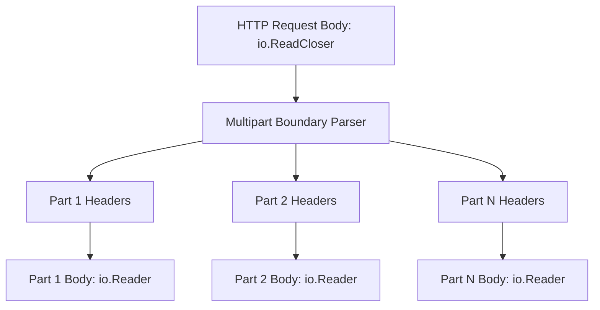
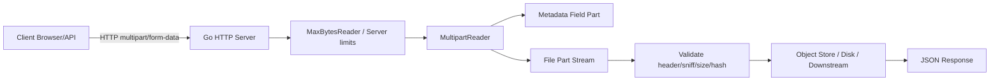
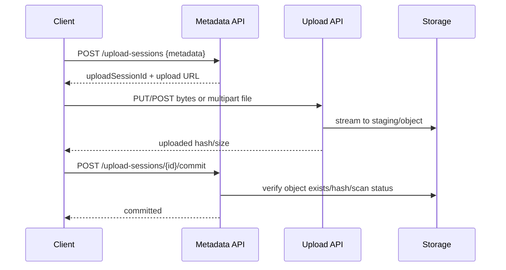
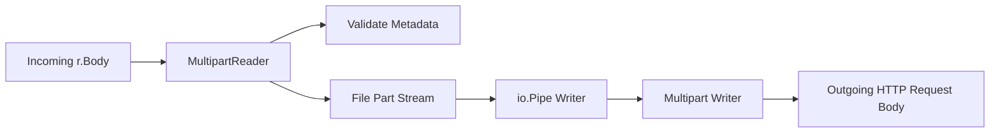
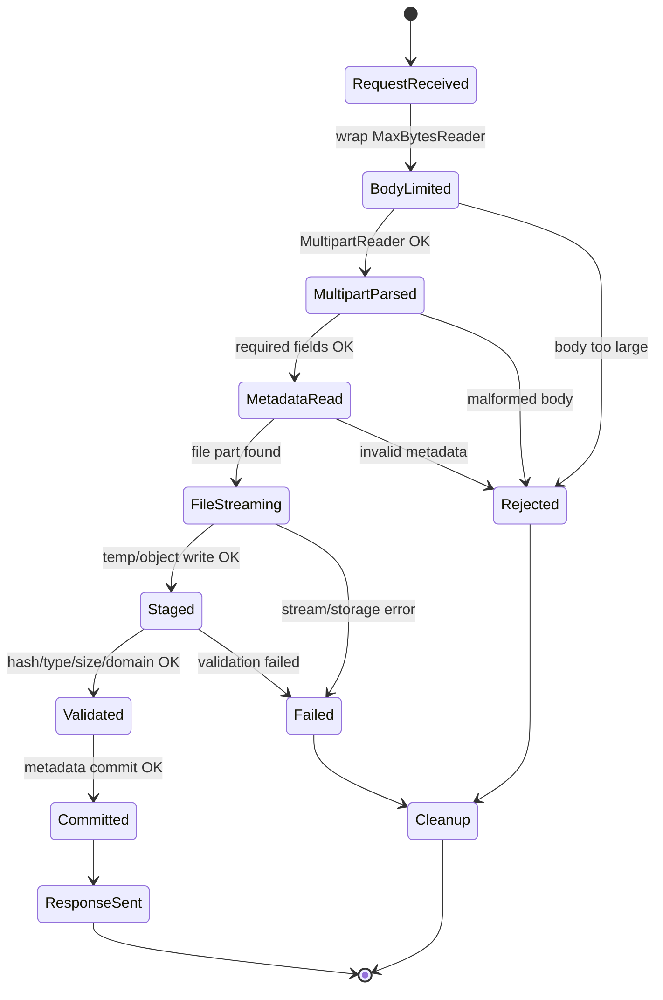
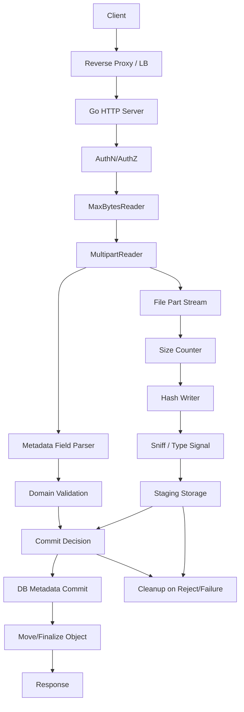
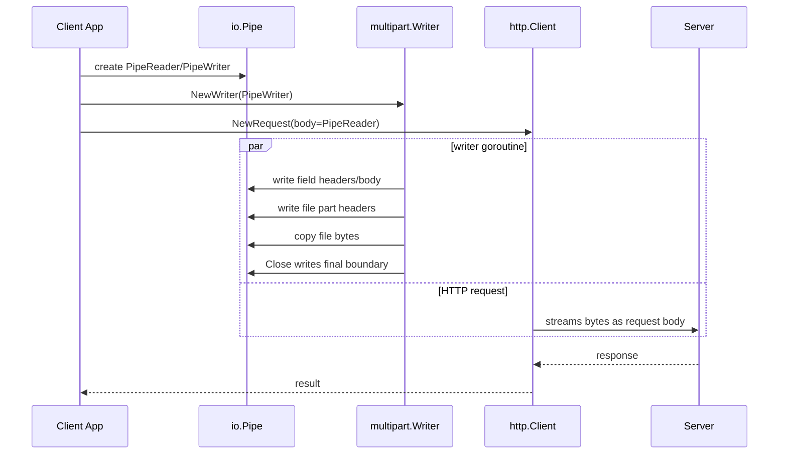

# learn-go-io-buffer-byte-stream-file-network-data-transfer-part-029.md

# Part 029 — Multipart, MIME, Upload/Download Pipeline, dan Mail-ish Data Transfer

> Series: **learn-go-io-buffer-byte-stream-file-network-data-transfer**  
> Target Go: **Go 1.26.x**  
> Fokus: `mime`, `mime/multipart`, `net/http` request body, multipart upload, download response, MIME boundary, streaming, limits, temp-file spillover, dan transfer pipeline production-grade.

---

## 0. Posisi Part Ini dalam Series

Sampai part sebelumnya kita sudah membangun fondasi berikut:

1. `io.Reader` / `io.Writer` sebagai kontrak data stream.
2. Buffering dengan `bytes`, `strings`, dan `bufio`.
3. Error semantics: partial read/write, EOF, timeout, cancellation, close/flush error.
4. File dan filesystem lifecycle.
5. Binary/text/JSON serialization.
6. Compression dan archive.
7. HTTP client/server internals.

Part ini membahas salah satu bentuk data transfer paling sering dipakai di sistem web/API production: **multipart dan MIME-based transfer**.

Dalam aplikasi nyata, multipart muncul pada:

- upload file dari browser,
- upload banyak file dalam satu request,
- request dengan metadata + file,
- email-like message dengan beberapa body part,
- API gateway yang meneruskan file upload,
- document management system,
- report export,
- bulk import,
- backup/restore package,
- integration antar service yang masih memakai `multipart/form-data`,
- request signing yang butuh canonicalization body/part metadata,
- transfer object besar yang tidak boleh dimuat semua ke memory.

Untuk Java engineer, analoginya kira-kira:

| Java / Servlet / Spring | Go |
|---|---|
| `MultipartFile` | `multipart.File`, `*multipart.FileHeader` |
| `HttpServletRequest.getPart()` | `Request.FormFile`, `Request.MultipartReader` |
| `MultipartResolver` | `Request.ParseMultipartForm` / manual `MultipartReader` |
| `InputStream` upload | `io.Reader` part body |
| `OutputStream` response | `http.ResponseWriter` / `io.Writer` |
| temp-file multipart storage | `ReadForm` disk spillover |
| filter body limit | `http.MaxBytesReader` / middleware limit |

Namun, Go lebih eksplisit. Go tidak menyembunyikan stream, ownership, close, limit, dan error handling di framework. Ini membuat kode lebih jujur, tetapi juga lebih mudah salah jika kita memakai helper yang terlalu nyaman tanpa memahami semantiknya.

---

## 1. Core Mental Model

Multipart bukan “upload file API”. Multipart adalah **framing format** di atas stream.

Sebuah HTTP request body multipart kira-kira seperti ini:

```text
POST /upload HTTP/1.1
Content-Type: multipart/form-data; boundary=abc123

--abc123

Content-Disposition: form-data; name="metadata"

Content-Type: application/json


{"caseId":"C-001","source":"portal"}

--abc123

Content-Disposition: form-data; name="document"; filename="evidence.pdf"

Content-Type: application/pdf


... binary bytes ...

--abc123--

```

Jadi struktur sebenarnya:



Setiap part punya:

1. Header part.
2. Body part.
3. Boundary pemisah ke part berikutnya.

Go mengekspresikan ini sebagai:

```go
mr, err := r.MultipartReader()
for {
    part, err := mr.NextPart()
    // part.Header
    // part.FormName()
    // part.FileName()
    // part.Read(...)
}
```

Yang penting: **part body adalah stream**. Kalau part adalah file 10 GB, model production yang benar adalah membaca stream secara bertahap, bukan `io.ReadAll(part)`.

---

## 2. MIME vs Multipart vs HTTP Form

Istilah ini sering tercampur.

### 2.1 MIME

MIME adalah keluarga format metadata content seperti:

```text
Content-Type: application/json; charset=utf-8
Content-Disposition: form-data; name="file"; filename="a.pdf"
Content-Transfer-Encoding: quoted-printable
```

Dalam Go, package `mime` menyediakan fungsi seperti:

```go
mediaType, params, err := mime.ParseMediaType(header)
```

Contoh:

```go
mediaType, params, err := mime.ParseMediaType(
    `multipart/form-data; boundary=abc123`,
)
if err != nil {
    return err
}
fmt.Println(mediaType)          // multipart/form-data
fmt.Println(params["boundary"]) // abc123
```

`mime.ParseMediaType` berguna saat kita harus membaca `Content-Type` atau `Content-Disposition` secara benar, bukan split string manual.

### 2.2 Multipart

Multipart adalah body format yang membungkus beberapa part.

Varian umum:

| Media type | Umum dipakai untuk |
|---|---|
| `multipart/form-data` | browser/API file upload |
| `multipart/mixed` | email-ish multiple body parts |
| `multipart/alternative` | email plain text + HTML alternative |
| `multipart/related` | content dengan resource terkait |

Go package `mime/multipart` fokus pada parsing/generating multipart message. Dokumentasi resminya menyatakan implementasinya cukup untuk HTTP form dan multipart bodies yang dihasilkan browser populer.

### 2.3 HTTP Form Multipart

`multipart/form-data` adalah cara browser mengirim form yang bisa berisi field biasa dan file.

Contoh field biasa:

```text
Content-Disposition: form-data; name="caseId"

C-001
```

Contoh file field:

```text
Content-Disposition: form-data; name="attachment"; filename="evidence.pdf"
Content-Type: application/pdf

... bytes ...
```

Dalam Go, ada dua gaya utama untuk membaca multipart HTTP form:

1. Convenience parsing: `r.ParseMultipartForm(maxMemory)` atau `r.FormFile(...)`.
2. Streaming parsing: `r.MultipartReader()` lalu `NextPart()`.

Keduanya punya trade-off besar.

---

## 3. Package Map

| Package | Peran |
|---|---|
| `mime` | parse/format media type seperti `Content-Type` dan `Content-Disposition` |
| `mime/multipart` | parse/generate multipart message |
| `net/http` | request/response HTTP, upload/download body stream |
| `net/textproto` | canonical MIME-style header map dan text protocol primitives |
| `io` | stream copy, limit, tee, pipe, multiwriter |
| `os` | temp file, durable file write, file handle |
| `path/filepath` | safe destination path handling |
| `crypto/sha256` | hashing uploaded/downloaded bytes |
| `hash/crc32` | lightweight checksum use case tertentu |
| `context` | cancellation boundary |

Peta besar:



---

## 4. Dua Mode Besar: Parse-All vs Stream

### 4.1 Parse-All: `ParseMultipartForm`

`Request.ParseMultipartForm(maxMemory)` membaca seluruh multipart body, menyimpan sebagian file part di memory sampai batas tertentu, dan sisanya ke temporary files.

Contoh dasar:

```go
func uploadSmall(w http.ResponseWriter, r *http.Request) {
    const maxMemory = 32 << 20 // 32 MiB

    if err := r.ParseMultipartForm(maxMemory); err != nil {
        http.Error(w, "invalid multipart form", http.StatusBadRequest)
        return
    }
    defer func() {
        if r.MultipartForm != nil {
            _ = r.MultipartForm.RemoveAll()
        }
    }()

    file, header, err := r.FormFile("file")
    if err != nil {
        http.Error(w, "missing file", http.StatusBadRequest)
        return
    }
    defer file.Close()

    fmt.Fprintf(w, "received %s (%d bytes metadata)\n", header.Filename, header.Size)
}
```

Kelebihan:

- Mudah.
- Cocok untuk form kecil/menengah.
- Akses field dan file lebih nyaman.
- File bisa di-open ulang dari `FileHeader`.

Risiko:

- Seluruh body diparse sebelum handler lanjut.
- Disk temp bisa dipakai besar jika tidak dibatasi total body.
- Memory/disk accounting harus dipahami.
- `FormValue`/`PostFormValue` bisa mengabaikan error parsing; jangan dipakai untuk endpoint yang perlu validasi ketat.
- Perlu cleanup `RemoveAll` untuk temporary files.

### 4.2 Streaming: `MultipartReader`

`Request.MultipartReader()` memberi parser streaming.

Contoh:

```go
func uploadStreaming(w http.ResponseWriter, r *http.Request) {
    mr, err := r.MultipartReader()
    if err != nil {
        http.Error(w, "expected multipart body", http.StatusBadRequest)
        return
    }

    for {
        part, err := mr.NextPart()
        if errors.Is(err, io.EOF) {
            break
        }
        if err != nil {
            http.Error(w, "invalid multipart body", http.StatusBadRequest)
            return
        }

        name := part.FormName()
        filename := part.FileName()

        if filename == "" {
            // ordinary field
            value, err := readSmallTextField(part, 64<<10)
            if err != nil {
                http.Error(w, "invalid field", http.StatusBadRequest)
                return
            }
            _ = name
            _ = value
            continue
        }

        // file part: stream, do not ReadAll
        if err := storeUploadedPart(r.Context(), part, filename); err != nil {
            http.Error(w, "failed to store file", http.StatusBadRequest)
            return
        }
    }

    w.WriteHeader(http.StatusCreated)
}
```

Kelebihan:

- Tidak harus memuat seluruh body.
- Cocok untuk file besar.
- Bisa menghitung hash sambil menyimpan.
- Bisa abort lebih awal saat part invalid.
- Bisa meneruskan stream ke downstream.

Risiko:

- Tidak mudah random-access field setelah lewat.
- Urutan part menjadi penting jika metadata dibutuhkan sebelum file.
- Handler harus mengelola limit, validation, close, hash, error, dan cleanup sendiri.
- Kalau part tidak dikonsumsi dengan benar, parser bisa gagal lanjut ke part berikutnya.

### 4.3 Keputusan Praktis

| Kondisi | Pilihan awal |
|---|---|
| Form kecil, file kecil, admin UI internal | `ParseMultipartForm` dengan body limit |
| Upload file besar | `MultipartReader` streaming |
| Banyak file, perlu per-file validation sebelum accept | `MultipartReader` |
| Perlu random access field dan file kecil | `ParseMultipartForm` |
| Gateway meneruskan body ke downstream | streaming atau reconstruct multipart via `io.Pipe` |
| Endpoint publik/untrusted | selalu limit body + part + size + count |
| Butuh hash/checksum selama upload | streaming |
| Butuh virus scan async | streaming ke quarantine/spool lalu scan |

---

## 5. Critical Invariant untuk Multipart Production

Endpoint upload production harus punya invariants jelas.

### 5.1 Invariant Resource

```text
No request may consume unbounded memory, disk, CPU, goroutines, file descriptors, or network time.
```

Konsekuensi:

- Batasi total request body.
- Batasi jumlah part.
- Batasi ukuran field text.
- Batasi ukuran setiap file.
- Batasi total ukuran semua file.
- Batasi jumlah file.
- Batasi waktu read.
- Batasi concurrency upload.
- Batasi temp directory storage.

### 5.2 Invariant Trust

```text
Client-provided filename, content type, size, and extension are metadata claims, not facts.
```

Konsekuensi:

- Jangan percaya `FileHeader.Filename` sebagai path.
- Jangan percaya `Content-Type` part sebagai bukti file type.
- Jangan percaya `Content-Length` sebagai satu-satunya size limit.
- Jangan simpan langsung dengan nama client.
- Jangan gunakan path dari multipart untuk filesystem destination.

### 5.3 Invariant Atomicity

```text
An upload is not committed until all required validation, persistence, and metadata update succeed.
```

Konsekuensi:

- Simpan ke staging/quarantine terlebih dahulu.
- Hitung hash sambil stream.
- Commit metadata setelah storage berhasil.
- Cleanup staging jika gagal.
- Gunakan idempotency key untuk retry client.

### 5.4 Invariant Observability

```text
Every failed upload should be classifiable: rejected, malformed, too large, timeout, canceled, storage failure, validation failure, downstream failure.
```

Konsekuensi:

- Jangan hanya log `upload failed`.
- Bedakan 400, 413, 415, 422, 499-ish client cancel, 504, 500.
- Metric harus punya failure reason.
- Jangan log filename mentah tanpa sanitization.

---

## 6. HTTP Body Limit: Pertahanan Lapis Pertama

Multipart parser limit bukan pengganti body limit.

Gunakan `http.MaxBytesReader` di handler server untuk membatasi request body.

```go
func uploadHandler(w http.ResponseWriter, r *http.Request) {
    const maxBody = 200 << 20 // 200 MiB
    r.Body = http.MaxBytesReader(w, r.Body, maxBody)
    defer r.Body.Close()

    mr, err := r.MultipartReader()
    if err != nil {
        http.Error(w, "expected multipart/form-data", http.StatusBadRequest)
        return
    }

    _ = mr
}
```

Perbedaan penting:

| Primitive | Batas apa? | Cocok untuk |
|---|---|---|
| `io.LimitReader` | reader biasa, EOF saat limit habis | generic stream local |
| `http.MaxBytesReader` | request body HTTP, error saat melewati limit | server request body |
| `ParseMultipartForm(maxMemory)` | memory untuk file part sebelum spillover | multipart parse-all |
| manual counter | per-part/per-total semantic | streaming multipart |

`MaxBytesReader` lebih cocok untuk server HTTP karena mengembalikan error khusus saat limit dilewati dan dapat memberi sinyal ke server untuk menutup koneksi setelah limit tercapai.

---

## 7. Content-Type Validation

Sebelum membaca body sebagai multipart, validasi `Content-Type`.

```go
func requireMultipartForm(r *http.Request) (boundary string, err error) {
    ct := r.Header.Get("Content-Type")
    if ct == "" {
        return "", fmt.Errorf("missing content-type")
    }

    mediaType, params, err := mime.ParseMediaType(ct)
    if err != nil {
        return "", fmt.Errorf("invalid content-type: %w", err)
    }

    if mediaType != "multipart/form-data" {
        return "", fmt.Errorf("unsupported content-type %q", mediaType)
    }

    boundary = params["boundary"]
    if boundary == "" {
        return "", fmt.Errorf("missing multipart boundary")
    }
    return boundary, nil
}
```

Di HTTP handler, `r.MultipartReader()` sudah melakukan validasi tertentu, tetapi membuat fungsi eksplisit seperti ini berguna ketika:

- ingin error response lebih spesifik,
- ingin audit/security log,
- ingin reject sebelum membungkus flow lain,
- ingin memastikan hanya `multipart/form-data`, bukan `multipart/mixed`.

---

## 8. Streaming Multipart Reader Pattern

Pattern production minimal:

```go
func handleUpload(w http.ResponseWriter, r *http.Request) {
    const (
        maxBody       = 512 << 20 // 512 MiB
        maxTextField  = 64 << 10  // 64 KiB
        maxFileSize   = 100 << 20 // 100 MiB
        maxParts      = 20
        maxFiles      = 5
    )

    r.Body = http.MaxBytesReader(w, r.Body, maxBody)
    defer r.Body.Close()

    mr, err := r.MultipartReader()
    if err != nil {
        http.Error(w, "expected multipart/form-data", http.StatusBadRequest)
        return
    }

    var partCount int
    var fileCount int

    for {
        part, err := mr.NextPart()
        if errors.Is(err, io.EOF) {
            break
        }
        if err != nil {
            http.Error(w, "malformed multipart body", http.StatusBadRequest)
            return
        }

        partCount++
        if partCount > maxParts {
            http.Error(w, "too many parts", http.StatusRequestEntityTooLarge)
            return
        }

        field := part.FormName()
        filename := part.FileName()

        if field == "" {
            http.Error(w, "missing form field name", http.StatusBadRequest)
            return
        }

        if filename == "" {
            value, err := readBoundedString(part, maxTextField)
            if err != nil {
                http.Error(w, "field too large", http.StatusRequestEntityTooLarge)
                return
            }
            _ = value
            continue
        }

        fileCount++
        if fileCount > maxFiles {
            http.Error(w, "too many files", http.StatusRequestEntityTooLarge)
            return
        }

        if err := receiveOneFile(r.Context(), part, ReceiveFileOptions{
            Field:       field,
            ClientName:  filename,
            MaxFileSize: maxFileSize,
        }); err != nil {
            http.Error(w, err.Error(), classifyUploadStatus(err))
            return
        }
    }

    w.WriteHeader(http.StatusCreated)
}
```

Helper bounded string:

```go
func readBoundedString(r io.Reader, max int64) (string, error) {
    lr := io.LimitReader(r, max+1)
    b, err := io.ReadAll(lr)
    if err != nil {
        return "", err
    }
    if int64(len(b)) > max {
        return "", fmt.Errorf("field exceeds %d bytes", max)
    }
    return string(b), nil
}
```

Catatan:

- `max+1` dipakai untuk mendeteksi overflow.
- Jangan gunakan `io.ReadAll(part)` untuk field tanpa batas.
- File part tidak dibaca ke memory; file part di-stream ke storage.

---

## 9. Safe Filename Handling

`part.FileName()` atau `FileHeader.Filename` adalah data dari client. Perlakukan sebagai label, bukan path.

Masalah umum:

```text
../../../etc/passwd
C:\Windows\System32\drivers\etc\hosts
invoice.pdf\x00.png
normal.pdf
résumé.pdf
合同.pdf
very-long-name-...pdf
```

Production rule:

```text
Never use client filename as storage path.
```

Gunakan generated object key:

```go
type StoredFileName struct {
    ObjectKey       string
    DisplayFilename string
    SafeExtension   string
}

func planStoredName(clientFilename string, now time.Time, id string) StoredFileName {
    display := sanitizeDisplayFilename(clientFilename)
    ext := strings.ToLower(filepath.Ext(display))

    if !allowedExt(ext) {
        ext = ".bin"
    }

    return StoredFileName{
        ObjectKey:        fmt.Sprintf("uploads/%s/%s%s", now.Format("2006/01/02"), id, ext),
        DisplayFilename: display,
        SafeExtension:   ext,
    }
}
```

Minimal display sanitization:

```go
func sanitizeDisplayFilename(name string) string {
    name = strings.TrimSpace(name)
    name = filepath.Base(name)

    // filepath.Base on Unix will not treat backslash as separator.
    // Normalize common Windows-style client names too.
    name = path.Base(strings.ReplaceAll(name, `\`, `/`))

    if name == "." || name == "/" || name == "" {
        return "upload.bin"
    }

    // Remove control characters.
    name = strings.Map(func(r rune) rune {
        if r < 32 || r == 127 {
            return -1
        }
        return r
    }, name)

    const maxRunes = 120
    rs := []rune(name)
    if len(rs) > maxRunes {
        name = string(rs[:maxRunes])
    }
    if name == "" {
        return "upload.bin"
    }
    return name
}
```

Untuk storage backend, tetap gunakan `ObjectKey` generated server-side.

---

## 10. Content-Type dan File Type Detection

Multipart part bisa berisi header:

```text
Content-Type: application/pdf
```

Tetapi header ini client-controlled. Untuk upload file, biasanya kita cek beberapa lapis:

1. Declared content type dari part header.
2. File extension dari display filename.
3. Magic bytes / sniffing awal file.
4. Parser/validator domain-specific.
5. Optional malware scan.

Contoh sniffing awal:

```go
func sniffAndCopy(dst io.Writer, src io.Reader, max int64) (written int64, contentType string, err error) {
    var head [512]byte

    n, readErr := io.ReadFull(src, head[:])
    if readErr != nil && !errors.Is(readErr, io.ErrUnexpectedEOF) && !errors.Is(readErr, io.EOF) {
        return 0, "", readErr
    }

    prefix := head[:n]
    contentType = http.DetectContentType(prefix)

    limited := io.MultiReader(bytes.NewReader(prefix), src)
    lr := io.LimitReader(limited, max+1)

    written, err = io.Copy(dst, lr)
    if err != nil {
        return written, contentType, err
    }
    if written > max {
        return written, contentType, fmt.Errorf("file too large")
    }
    return written, contentType, nil
}
```

Caveat:

- `http.DetectContentType` bukan security proof.
- PDF, Office, ZIP-based formats, image polyglots, dan malformed media butuh validator domain-specific jika security requirement tinggi.
- Untuk compliance system, content detection harus diperlakukan sebagai signal, bukan authority tunggal.

---

## 11. Streaming to Disk dengan Hash dan Size Limit

Pattern umum: upload stream → staging file → hash → fsync → metadata commit.

```go
type ReceiveFileOptions struct {
    Field       string
    ClientName  string
    MaxFileSize int64
}

type ReceivedFile struct {
    Field       string
    ClientName  string
    Size        int64
    SHA256Hex   string
    ContentType string
    TempPath    string
}

func receiveToTemp(ctx context.Context, part *multipart.Part, opts ReceiveFileOptions, dir string) (ReceivedFile, error) {
    tmp, err := os.CreateTemp(dir, "upload-*.part")
    if err != nil {
        return ReceivedFile{}, err
    }

    tmpPath := tmp.Name()
    committed := false
    defer func() {
        _ = tmp.Close()
        if !committed {
            _ = os.Remove(tmpPath)
        }
    }()

    h := sha256.New()
    mw := io.MultiWriter(tmp, h)

    // Optional: detect content type while preserving prefix bytes.
    var head [512]byte
    n, readErr := io.ReadFull(part, head[:])
    if readErr != nil && !errors.Is(readErr, io.ErrUnexpectedEOF) && !errors.Is(readErr, io.EOF) {
        return ReceivedFile{}, readErr
    }
    prefix := head[:n]
    contentType := http.DetectContentType(prefix)

    reader := io.MultiReader(bytes.NewReader(prefix), part)
    limited := io.LimitReader(reader, opts.MaxFileSize+1)

    size, err := copyWithContext(ctx, mw, limited)
    if err != nil {
        return ReceivedFile{}, err
    }
    if size > opts.MaxFileSize {
        return ReceivedFile{}, fmt.Errorf("file exceeds %d bytes", opts.MaxFileSize)
    }

    if err := tmp.Sync(); err != nil {
        return ReceivedFile{}, err
    }
    if err := tmp.Close(); err != nil {
        return ReceivedFile{}, err
    }

    committed = true
    return ReceivedFile{
        Field:       opts.Field,
        ClientName:  opts.ClientName,
        Size:        size,
        SHA256Hex:   hex.EncodeToString(h.Sum(nil)),
        ContentType: contentType,
        TempPath:    tmpPath,
    }, nil
}
```

`copyWithContext`:

```go
func copyWithContext(ctx context.Context, dst io.Writer, src io.Reader) (int64, error) {
    buf := make([]byte, 64<<10)
    var written int64

    for {
        select {
        case <-ctx.Done():
            return written, ctx.Err()
        default:
        }

        n, rerr := src.Read(buf)
        if n > 0 {
            nw, werr := dst.Write(buf[:n])
            written += int64(nw)
            if werr != nil {
                return written, werr
            }
            if nw != n {
                return written, io.ErrShortWrite
            }
        }
        if errors.Is(rerr, io.EOF) {
            return written, nil
        }
        if rerr != nil {
            return written, rerr
        }
    }
}
```

Catatan:

- `ctx` tidak selalu menghentikan `Read` yang sedang blocking kecuali request body diputus oleh HTTP server. Namun check context tetap berguna antar iterasi.
- Untuk upload HTTP server, timeout dan server config tetap penting.
- `io.Copy` lebih sederhana, tapi custom copy loop memudahkan context check dan metrics per chunk.

---

## 12. Temp File Spillover dan Cleanup

`ParseMultipartForm(maxMemory)` memakai temp files untuk file parts yang tidak bisa disimpan di memory. Maka wajib cleanup:

```go
if err := r.ParseMultipartForm(32 << 20); err != nil {
    http.Error(w, "bad multipart form", http.StatusBadRequest)
    return
}
defer func() {
    if r.MultipartForm != nil {
        _ = r.MultipartForm.RemoveAll()
    }
}()
```

Jika lupa cleanup:

- disk `/tmp` bisa penuh,
- node Kubernetes bisa kena ephemeral storage pressure,
- request lain gagal,
- service crash/restart loop,
- cleanup OS mungkin tidak sesuai SLA.

Operational rule:

```text
Every code path that calls ParseMultipartForm must have a cleanup decision.
```

Untuk service production:

- set `TMPDIR` khusus upload,
- monitor disk usage temp dir,
- gunakan sidecar/cron cleanup untuk stale temp jika proses crash,
- batasi ephemeral storage pod,
- jangan simpan temp di shared path tanpa ownership model.

---

## 13. Part Count, Header Count, dan Parser Limits

`mime/multipart` punya beberapa limit bawaan untuk melindungi dari input berbahaya. Pada dokumentasi Go saat ini:

- `Reader.NextPart` dan `NextRawPart` membatasi jumlah header dalam satu part.
- `Reader.ReadForm` membatasi total header di semua `FileHeader`.
- `ReadForm` juga membatasi jumlah part form.
- Beberapa limit bisa disesuaikan lewat `GODEBUG` seperti `multipartmaxheaders` dan `multipartmaxparts`.

Namun production service tetap sebaiknya punya semantic limit sendiri:

```go
const (
    maxParts     = 20
    maxFiles     = 5
    maxFieldSize = 64 << 10
    maxFileSize  = 100 << 20
    maxBodySize  = 512 << 20
)
```

Kenapa?

- Limit runtime default bukan domain policy.
- Aplikasi mungkin butuh batas lebih kecil.
- Batas parser tidak tahu jenis field mana yang wajib/opsional.
- Security posture harus bisa diaudit di level service config.

---

## 14. Field Ordering Problem

Streaming parser membaca part berurutan.

Misal client mengirim:

```text
part 1: file besar
part 2: metadata JSON
```

Jika server butuh metadata untuk validasi file, ada beberapa opsi:

### Opsi A — Require Metadata First

Kontrak API menyatakan metadata harus muncul sebelum file.

Kelebihan:

- Streaming tetap sederhana.
- Bisa validasi sebelum menerima file.
- Menghindari spool file yang ternyata tidak valid.

Kekurangan:

- Client harus mengikuti urutan.
- Beberapa library mungkin tidak menjamin urutan jika abstraksi terlalu tinggi.

### Opsi B — Spool File First

Server menerima file ke staging, lalu membaca metadata setelahnya.

Kelebihan:

- Tidak bergantung urutan.
- Cocok untuk client tidak fleksibel.

Kekurangan:

- Bisa menghabiskan disk untuk request yang metadata-nya invalid.
- Butuh cleanup kuat.

### Opsi C — Use Separate Metadata Channel

Metadata dikirim di header/query/path/body JSON sebelum upload URL dibuat.

Kelebihan:

- Model paling bersih untuk upload besar.
- Upload endpoint hanya menangani object stream.
- Metadata sudah ada di DB sebelum transfer.

Kekurangan:

- API flow lebih panjang.
- Butuh idempotency/session upload.

Untuk sistem besar, opsi C sering lebih scalable:



---

## 15. Writing Multipart Requests from Go Client

Untuk client yang mengirim file kecil/menengah, cara sederhana:

```go
func newMultipartRequest(ctx context.Context, url string, fields map[string]string, fileField, filename string, file io.Reader) (*http.Request, error) {
    var body bytes.Buffer
    mw := multipart.NewWriter(&body)

    for k, v := range fields {
        if err := mw.WriteField(k, v); err != nil {
            return nil, err
        }
    }

    fw, err := mw.CreateFormFile(fileField, filename)
    if err != nil {
        return nil, err
    }

    if _, err := io.Copy(fw, file); err != nil {
        return nil, err
    }

    if err := mw.Close(); err != nil {
        return nil, err
    }

    req, err := http.NewRequestWithContext(ctx, http.MethodPost, url, &body)
    if err != nil {
        return nil, err
    }
    req.Header.Set("Content-Type", mw.FormDataContentType())
    req.ContentLength = int64(body.Len())
    return req, nil
}
```

Masalah: ini membangun seluruh body di memory. Untuk file besar, jangan pakai `bytes.Buffer`.

---

## 16. Streaming Multipart Request dengan `io.Pipe`

Untuk upload besar dari Go client:

```go
func newStreamingMultipartRequest(ctx context.Context, url string, filePath string) (*http.Request, error) {
    pr, pw := io.Pipe()
    mw := multipart.NewWriter(pw)

    file, err := os.Open(filePath)
    if err != nil {
        return nil, err
    }

    go func() {
        defer file.Close()

        var err error
        defer func() {
            if err != nil {
                _ = pw.CloseWithError(err)
            } else {
                _ = pw.Close()
            }
        }()

        if err = mw.WriteField("source", "batch-client"); err != nil {
            return
        }

        part, err := mw.CreateFormFile("file", filepath.Base(filePath))
        if err != nil {
            return
        }

        if _, err = io.Copy(part, file); err != nil {
            return
        }

        err = mw.Close()
    }()

    req, err := http.NewRequestWithContext(ctx, http.MethodPost, url, pr)
    if err != nil {
        _ = pr.Close()
        return nil, err
    }
    req.Header.Set("Content-Type", mw.FormDataContentType())
    return req, nil
}
```

Key points:

- `multipart.Writer.Close()` harus dipanggil untuk menulis trailing boundary.
- `io.Pipe` menghubungkan goroutine writer dengan HTTP client reader.
- Jika writer gagal, gunakan `CloseWithError` agar HTTP request melihat error.
- `Content-Length` biasanya tidak diketahui, sehingga request memakai chunked transfer untuk HTTP/1.1.
- Beberapa server/proxy tidak menerima chunked upload; dalam kasus itu perlu menghitung Content-Length atau memakai upload protocol lain.

### 16.1 Content-Length untuk Multipart Streaming

Content-Length multipart sulit jika file stream tidak seekable. Jika file lokal seekable dan fields diketahui, kita bisa:

1. Build multipart header/trailer ke buffer untuk menghitung overhead.
2. Tambahkan ukuran file dari `Stat`.
3. Stream header + file + trailer.

Tetapi implementasinya rawan bug. Sering lebih baik:

- pakai simple `PUT` raw body untuk file besar,
- metadata dikirim terpisah,
- atau pastikan server menerima chunked request.

---

## 17. Download Pipeline

Download bukan multipart upload, tetapi masih bagian data transfer yang sama: stream dari source ke response writer.

Basic safe download:

```go
func downloadFile(w http.ResponseWriter, r *http.Request) {
    f, err := os.Open("/srv/files/report.pdf")
    if err != nil {
        http.Error(w, "not found", http.StatusNotFound)
        return
    }
    defer f.Close()

    st, err := f.Stat()
    if err != nil {
        http.Error(w, "failed to stat", http.StatusInternalServerError)
        return
    }

    w.Header().Set("Content-Type", "application/pdf")
    w.Header().Set("Content-Length", strconv.FormatInt(st.Size(), 10))
    w.Header().Set("Content-Disposition", mime.FormatMediaType("attachment", map[string]string{
        "filename": "report.pdf",
    }))

    if _, err := io.Copy(w, f); err != nil {
        // At this point response may already be committed.
        // Log only; cannot reliably change status.
        return
    }
}
```

Important:

- Once bytes are written, status/header is committed.
- Copy error during response is often client disconnect or network failure.
- Do not log as server bug without classification.
- Use safe `Content-Disposition` formatting. Go 1.25 added `multipart.FileContentDisposition` for multipart part header generation; for HTTP response header, `mime.FormatMediaType` can be used.

### 17.1 `http.ServeContent` and Range Requests

Untuk static/download file dengan range/cache semantics, sering lebih baik gunakan:

```go
http.ServeContent(w, r, displayName, modTime, file)
```

Jika reader mendukung seek, `ServeContent` dapat menangani range request dan beberapa HTTP semantics. Namun, untuk authorization-heavy dynamic storage, kita tetap perlu memastikan:

- path sudah divalidasi,
- permission sudah dicek,
- metadata tidak bocor,
- filename aman,
- storage reader lifecycle benar.

---

## 18. Multipart Response

Kadang server perlu mengirim multipart response, misalnya:

- export metadata + file,
- batch download beberapa dokumen,
- API lama yang butuh `multipart/mixed`,
- response dengan JSON manifest + binary payload.

Contoh:

```go
func multipartDownload(w http.ResponseWriter, r *http.Request) {
    mw := multipart.NewWriter(w)
    defer mw.Close()

    w.Header().Set("Content-Type", "multipart/mixed; boundary="+mw.Boundary())

    metaHeader := textproto.MIMEHeader{}
    metaHeader.Set("Content-Type", "application/json")
    metaPart, err := mw.CreatePart(metaHeader)
    if err != nil {
        return
    }
    _, _ = metaPart.Write([]byte(`{"caseId":"C-001"}`))

    fileHeader := textproto.MIMEHeader{}
    fileHeader.Set("Content-Type", "application/pdf")
    fileHeader.Set("Content-Disposition", mime.FormatMediaType("attachment", map[string]string{
        "filename": "evidence.pdf",
    }))

    filePart, err := mw.CreatePart(fileHeader)
    if err != nil {
        return
    }

    f, err := os.Open("/srv/files/evidence.pdf")
    if err != nil {
        return
    }
    defer f.Close()

    _, _ = io.Copy(filePart, f)
}
```

Caveat:

- Setelah body mulai ditulis, error sulit dikirim sebagai HTTP status.
- `mw.Close()` penting untuk trailing boundary.
- Jika response panjang, pertimbangkan flushing dan client disconnect.
- Banyak client lebih mudah menangani ZIP daripada multipart response untuk batch download.

---

## 19. Mail-ish Parsing

Multipart tidak hanya HTTP form. Email juga memakai MIME multipart.

Contoh parsing sederhana:

```go
func parseMailLikeMessage(raw io.Reader) error {
    msg, err := mail.ReadMessage(raw)
    if err != nil {
        return err
    }

    ct := msg.Header.Get("Content-Type")
    mediaType, params, err := mime.ParseMediaType(ct)
    if err != nil {
        return err
    }

    if !strings.HasPrefix(mediaType, "multipart/") {
        body, err := io.ReadAll(io.LimitReader(msg.Body, 1<<20))
        if err != nil {
            return err
        }
        _ = body
        return nil
    }

    boundary := params["boundary"]
    if boundary == "" {
        return fmt.Errorf("missing boundary")
    }

    mr := multipart.NewReader(msg.Body, boundary)
    for {
        part, err := mr.NextPart()
        if errors.Is(err, io.EOF) {
            return nil
        }
        if err != nil {
            return err
        }
        _ = part.Header.Get("Content-Type")
    }
}
```

Mail-ish parsing caveats:

- Email MIME can be more complex than browser multipart.
- Nested multipart is possible.
- Encodings like quoted-printable/base64 may appear.
- Header canonicalization and internationalized filenames are tricky.
- Do not build full email security pipeline casually; use domain-specific libraries if requirements are serious.

Go `multipart.Reader.NextPart` has special handling for `Content-Transfer-Encoding: quoted-printable`; `NextRawPart` avoids that special decoding. This matters when exact bytes are required for signature verification or archival.

---

## 20. Proxying Multipart Upload

API gateway sering menerima multipart upload lalu meneruskan ke downstream.

Ada dua approach:

### 20.1 Pass-through Raw Body

Jika gateway tidak perlu inspect body:

```go
func proxyUpload(w http.ResponseWriter, r *http.Request) {
    req, err := http.NewRequestWithContext(
        r.Context(),
        http.MethodPost,
        "https://downstream.example/upload",
        r.Body,
    )
    if err != nil {
        http.Error(w, "bad gateway", http.StatusBadGateway)
        return
    }

    req.Header.Set("Content-Type", r.Header.Get("Content-Type"))
    req.ContentLength = r.ContentLength

    resp, err := http.DefaultClient.Do(req)
    if err != nil {
        http.Error(w, "bad gateway", http.StatusBadGateway)
        return
    }
    defer resp.Body.Close()

    copyResponse(w, resp)
}
```

Kelebihan:

- Tidak reserialize multipart.
- Boundary asli tetap valid.
- Memory minimal.

Kekurangan:

- Gateway tidak bisa validate per-part.
- Jika downstream gagal setelah body dikirim, retry sulit.
- Authz based on metadata body tidak bisa dilakukan tanpa parsing.

### 20.2 Inspect and Rebuild

Jika gateway harus validate metadata/file, ia harus parse lalu membuat multipart baru.

Risiko:

- Rebuilding multipart mengubah boundary.
- Header part bisa berubah.
- Filename/content-type harus dipreservasi secara sadar.
- Upload besar butuh `io.Pipe`.
- Error propagation lintas goroutine harus benar.

Sketch:



Untuk production, pertanyakan dulu: apakah gateway benar-benar harus inspect multipart? Jika tidak, pass-through raw body lebih sederhana dan lebih aman secara semantic.

---

## 21. Error Taxonomy untuk Upload

Buat kategori error eksplisit.

```go
type UploadErrorKind string

const (
    UploadErrMalformed       UploadErrorKind = "malformed"
    UploadErrTooLarge        UploadErrorKind = "too_large"
    UploadErrTooManyParts    UploadErrorKind = "too_many_parts"
    UploadErrUnsupportedType UploadErrorKind = "unsupported_type"
    UploadErrValidation      UploadErrorKind = "validation"
    UploadErrCanceled        UploadErrorKind = "canceled"
    UploadErrTimeout         UploadErrorKind = "timeout"
    UploadErrStorage         UploadErrorKind = "storage"
)

type UploadError struct {
    Kind UploadErrorKind
    Msg  string
    Err  error
}

func (e *UploadError) Error() string {
    if e.Msg != "" {
        return e.Msg
    }
    return string(e.Kind)
}

func (e *UploadError) Unwrap() error { return e.Err }
```

HTTP mapping:

| Error kind | HTTP status | Notes |
|---|---:|---|
| malformed multipart | 400 | invalid boundary, malformed part |
| missing required field | 400 | client contract violation |
| too large | 413 | body/file/field too large |
| too many parts/files | 413 | resource defense |
| unsupported file type | 415 | media type not accepted |
| domain validation failed | 422 | syntactically valid but not acceptable |
| client canceled | often no response | log as client/cancel, not 500 |
| timeout | 408/504 depending side | distinguish read timeout vs downstream timeout |
| storage failed | 500/503 | server-side |

---

## 22. Upload State Machine

Production upload should be a state machine, not a one-shot handler blob.



Manfaat:

- Gampang diaudit.
- Gampang dites.
- Gampang dikaitkan ke metrics.
- Gampang menambah virus scan/quarantine.
- Gampang menghindari commit sebagian.

---

## 23. Security Checklist

### 23.1 Request-Level

- Batasi method: hanya `POST`/`PUT` yang diizinkan.
- Wajib authentication dan authorization sebelum body besar dibaca jika memungkinkan.
- Batasi total body dengan `MaxBytesReader`.
- Konfigurasi `http.Server` timeout.
- Gunakan reverse proxy limit juga, misalnya Nginx/ALB/API Gateway body limit.
- Rate limit upload per principal/IP/tenant.
- Concurrency limit upload besar.

### 23.2 Multipart-Level

- Batasi jumlah part.
- Batasi jumlah file.
- Batasi ukuran field.
- Batasi ukuran file.
- Reject missing/duplicate required fields sesuai kontrak.
- Jangan percaya `Content-Type` part.
- Jangan percaya filename.
- Cleanup temp file.

### 23.3 File-Level

- Generate storage key server-side.
- Simpan ke staging/quarantine.
- Hitung hash.
- Validate extension + sniff + parser jika perlu.
- Jangan execute uploaded file.
- Jangan simpan di web-root publik langsung.
- Jika file bisa diunduh kembali, set `Content-Disposition: attachment` untuk jenis berisiko.
- Pertimbangkan antivirus/malware scan.
- Pertimbangkan DLP/PII classification untuk regulatory systems.

### 23.4 Filesystem-Level

- Jangan gunakan client filename sebagai path.
- Hindari path traversal.
- Gunakan directory permission ketat.
- Batasi disk quota.
- Monitor inode usage.
- Cleanup stale staging.

---

## 24. Observability

Upload/download harus punya metrics yang tidak high-cardinality.

Recommended metrics:

| Metric | Type | Labels |
|---|---|---|
| `upload_requests_total` | counter | route, status, reason |
| `upload_bytes_total` | counter | route, tenant_class, result |
| `upload_duration_seconds` | histogram | route, result |
| `upload_file_size_bytes` | histogram | route, file_type, result |
| `upload_rejected_total` | counter | reason |
| `upload_temp_cleanup_total` | counter | result |
| `upload_storage_write_seconds` | histogram | backend, result |
| `download_requests_total` | counter | route, status, reason |
| `download_bytes_total` | counter | route, result |

Avoid labels:

- raw filename,
- user ID if high cardinality,
- exact object key,
- hash,
- request ID as metric label.

Logs should include:

- request ID,
- authenticated subject or tenant ID if policy allows,
- sanitized filename/display name,
- size,
- content type signals,
- hash prefix if safe,
- decision reason,
- storage object ID,
- duration,
- cleanup result.

Example structured log fields:

```json
{
  "event": "upload_completed",
  "request_id": "req-123",
  "tenant": "agency-a",
  "field": "document",
  "display_filename": "evidence.pdf",
  "size": 1048576,
  "detected_content_type": "application/pdf",
  "sha256_prefix": "a1b2c3d4",
  "duration_ms": 842,
  "result": "committed"
}
```

---

## 25. Testing Multipart Handlers

### 25.1 Build Multipart Request in Test

```go
func makeMultipartRequest(t *testing.T, fields map[string]string, fileField, filename string, content []byte) *http.Request {
    t.Helper()

    var body bytes.Buffer
    mw := multipart.NewWriter(&body)

    for k, v := range fields {
        if err := mw.WriteField(k, v); err != nil {
            t.Fatal(err)
        }
    }

    fw, err := mw.CreateFormFile(fileField, filename)
    if err != nil {
        t.Fatal(err)
    }
    if _, err := fw.Write(content); err != nil {
        t.Fatal(err)
    }
    if err := mw.Close(); err != nil {
        t.Fatal(err)
    }

    req := httptest.NewRequest(http.MethodPost, "/upload", &body)
    req.Header.Set("Content-Type", mw.FormDataContentType())
    return req
}
```

### 25.2 Test Missing Boundary

```go
func TestUploadMissingBoundary(t *testing.T) {
    req := httptest.NewRequest(http.MethodPost, "/upload", strings.NewReader("bad"))
    req.Header.Set("Content-Type", "multipart/form-data")

    rr := httptest.NewRecorder()
    handler.ServeHTTP(rr, req)

    if rr.Code != http.StatusBadRequest {
        t.Fatalf("status = %d", rr.Code)
    }
}
```

### 25.3 Test File Too Large

```go
func TestUploadFileTooLarge(t *testing.T) {
    content := bytes.Repeat([]byte("x"), 2<<20)
    req := makeMultipartRequest(t, nil, "file", "big.bin", content)

    rr := httptest.NewRecorder()
    handler := NewUploadHandler(UploadConfig{MaxFileSize: 1 << 20})
    handler.ServeHTTP(rr, req)

    if rr.Code != http.StatusRequestEntityTooLarge {
        t.Fatalf("status = %d", rr.Code)
    }
}
```

### 25.4 Test Malformed Multipart

```go
func TestMalformedMultipart(t *testing.T) {
    body := strings.NewReader("--abc\r\nContent-Disposition: form-data; name=\"file\"\r\n\r\nmissing end")
    req := httptest.NewRequest(http.MethodPost, "/upload", body)
    req.Header.Set("Content-Type", "multipart/form-data; boundary=abc")

    rr := httptest.NewRecorder()
    handler.ServeHTTP(rr, req)

    if rr.Code < 400 {
        t.Fatalf("expected error, got %d", rr.Code)
    }
}
```

### 25.5 Fault Injection Writer

Untuk menguji storage failure:

```go
type failingWriter struct {
    after int64
    n     int64
}

func (w *failingWriter) Write(p []byte) (int, error) {
    if w.n >= w.after {
        return 0, errors.New("injected storage failure")
    }
    remain := w.after - w.n
    if int64(len(p)) > remain {
        w.n += remain
        return int(remain), errors.New("injected storage failure")
    }
    w.n += int64(len(p))
    return len(p), nil
}
```

Test harus memastikan:

- response status benar,
- temp file dibersihkan,
- metadata tidak committed,
- metric failure reason benar,
- error tidak berubah menjadi success karena partial write.

---

## 26. Fuzzing Multipart Parsing

Fuzz target sederhana:

```go
func FuzzMultipartReader(f *testing.F) {
    f.Add("--abc\r\nContent-Disposition: form-data; name=\"x\"\r\n\r\nhello\r\n--abc--\r\n")

    f.Fuzz(func(t *testing.T, body string) {
        r := multipart.NewReader(strings.NewReader(body), "abc")
        for i := 0; i < 10; i++ {
            part, err := r.NextPart()
            if errors.Is(err, io.EOF) {
                return
            }
            if err != nil {
                return
            }
            _, _ = io.Copy(io.Discard, io.LimitReader(part, 1<<20))
        }
    })
}
```

Tujuan fuzzing bukan membuktikan package standar, tetapi menguji wrapper kita:

- apakah panic pada malformed header,
- apakah limit diterapkan,
- apakah loop berhenti,
- apakah part count limit berjalan,
- apakah error classification stabil.

---

## 27. Benchmarking Upload Pipeline

Benchmark parsing saja:

```go
func BenchmarkMultipartStreaming(b *testing.B) {
    payload := buildMultipartPayload(b, 10<<20)

    b.SetBytes(int64(len(payload)))
    b.ReportAllocs()
    b.ResetTimer()

    for i := 0; i < b.N; i++ {
        r := multipart.NewReader(bytes.NewReader(payload), "bench-boundary")
        for {
            part, err := r.NextPart()
            if errors.Is(err, io.EOF) {
                break
            }
            if err != nil {
                b.Fatal(err)
            }
            if _, err := io.Copy(io.Discard, part); err != nil {
                b.Fatal(err)
            }
        }
    }
}
```

Yang perlu diukur:

- throughput bytes/sec,
- allocation/op,
- latency per file size bucket,
- CPU profile,
- disk write throughput jika staging,
- hash overhead,
- memory peak,
- temp file cleanup time.

Jangan benchmark upload production hanya dengan `io.Discard`. Storage backend, checksum, logging, validation, reverse proxy, TLS, dan disk sync bisa mengubah bottleneck total.

---

## 28. Anti-Patterns

### 28.1 `io.ReadAll` pada File Upload

```go
b, err := io.ReadAll(file)
```

Buruk untuk untrusted upload besar karena memory unbounded.

### 28.2 `FormValue` untuk Validasi Ketat

`FormValue` dapat memanggil parser dan mengabaikan error parsing. Untuk endpoint penting, panggil parser eksplisit dan cek error.

### 28.3 Simpan dengan Filename dari Client

```go
os.Create("/uploads/" + header.Filename)
```

Risiko path traversal, overwrite, unicode spoofing, collision, forbidden chars.

### 28.4 Tidak Memanggil `multipart.Writer.Close`

Jika tidak close, trailing boundary tidak tertulis dan server bisa melihat body malformed.

### 28.5 Tidak Cleanup `MultipartForm.RemoveAll`

Bisa menyebabkan temp files menumpuk.

### 28.6 Tidak Membatasi Body Sebelum Parse

`ParseMultipartForm(maxMemory)` bukan total request body limit. Selalu pikirkan total body.

### 28.7 Proxy Rebuild Tanpa Menjaga Header Part

Rebuild multipart bisa mengubah metadata penting dan memecahkan downstream compatibility.

### 28.8 Logging Filename Mentah

Filename bisa mengandung newline/control chars sehingga merusak log atau membuat log injection.

---

## 29. Reference Implementation: Configurable Upload Handler

Berikut skeleton yang lebih mendekati production.

```go
type UploadConfig struct {
    MaxBodySize  int64
    MaxFileSize  int64
    MaxFieldSize int64
    MaxParts     int
    MaxFiles     int
    TempDir      string
}

type UploadHandler struct {
    cfg UploadConfig
}

func NewUploadHandler(cfg UploadConfig) *UploadHandler {
    return &UploadHandler{cfg: cfg}
}

func (h *UploadHandler) ServeHTTP(w http.ResponseWriter, r *http.Request) {
    if r.Method != http.MethodPost {
        http.Error(w, "method not allowed", http.StatusMethodNotAllowed)
        return
    }

    r.Body = http.MaxBytesReader(w, r.Body, h.cfg.MaxBodySize)
    defer r.Body.Close()

    mr, err := r.MultipartReader()
    if err != nil {
        http.Error(w, "expected multipart/form-data", http.StatusBadRequest)
        return
    }

    var (
        partCount int
        fileCount int
        metadata  map[string]string
        files     []ReceivedFile
    )
    metadata = make(map[string]string)

    cleanup := true
    defer func() {
        if cleanup {
            for _, f := range files {
                _ = os.Remove(f.TempPath)
            }
        }
    }()

    for {
        part, err := mr.NextPart()
        if errors.Is(err, io.EOF) {
            break
        }
        if err != nil {
            http.Error(w, "malformed multipart body", http.StatusBadRequest)
            return
        }

        partCount++
        if partCount > h.cfg.MaxParts {
            http.Error(w, "too many multipart parts", http.StatusRequestEntityTooLarge)
            return
        }

        field := part.FormName()
        filename := part.FileName()
        if field == "" {
            http.Error(w, "multipart part missing field name", http.StatusBadRequest)
            return
        }

        if filename == "" {
            value, err := readBoundedString(part, h.cfg.MaxFieldSize)
            if err != nil {
                http.Error(w, "form field too large", http.StatusRequestEntityTooLarge)
                return
            }
            metadata[field] = value
            continue
        }

        fileCount++
        if fileCount > h.cfg.MaxFiles {
            http.Error(w, "too many files", http.StatusRequestEntityTooLarge)
            return
        }

        received, err := receiveToTemp(r.Context(), part, ReceiveFileOptions{
            Field:       field,
            ClientName:  filename,
            MaxFileSize: h.cfg.MaxFileSize,
        }, h.cfg.TempDir)
        if err != nil {
            http.Error(w, "failed to receive file", http.StatusBadRequest)
            return
        }
        files = append(files, received)
    }

    if err := validateUpload(metadata, files); err != nil {
        http.Error(w, "invalid upload", http.StatusUnprocessableEntity)
        return
    }

    // Commit should move temp files to durable storage or object storage and write DB metadata.
    if err := commitUpload(r.Context(), metadata, files); err != nil {
        http.Error(w, "failed to commit upload", http.StatusInternalServerError)
        return
    }

    cleanup = false
    w.Header().Set("Content-Type", "application/json")
    w.WriteHeader(http.StatusCreated)
    _, _ = w.Write([]byte(`{"status":"created"}`))
}
```

Checklist sebelum production:

- `TempDir` punya quota/monitoring.
- `commitUpload` atomic/idempotent.
- `validateUpload` cek required metadata dan file type.
- Handler punya authn/authz sebelum body besar diterima jika mungkin.
- Server timeout dikonfigurasi.
- Reverse proxy upload limit dikonfigurasi.
- Error response tidak bocorkan path/temp details.

---

## 30. Design Choice: Multipart vs Raw Upload vs JSON+Base64

| Approach | Kelebihan | Kekurangan | Cocok untuk |
|---|---|---|---|
| `multipart/form-data` | browser-native, metadata + file dalam satu request | complex parser, boundary, temp/spillover, part limits | UI upload, simple API upload |
| raw `PUT` body | paling streaming-friendly | metadata harus di header/query/session | object upload besar |
| JSON + base64 | mudah secara DTO | overhead besar, memory heavy, buruk untuk file besar | payload kecil, config, embedded small blobs |
| archive upload | banyak file sebagai satu object | extraction security, zip-slip, bomb | batch transfer/offline package |
| resumable protocol | tahan network failure | lebih kompleks | file besar/network unreliable |

Rule praktis:

```text
Use multipart when the natural unit is a form containing fields plus files.
Use raw body when the natural unit is a large object stream.
Use JSON when the natural unit is structured data, not binary transfer.
```

---

## 31. Production Failure Matrix

| Failure | Penyebab | Defense | Status |
|---|---|---|---|
| body too large | client upload melebihi limit | `MaxBytesReader` | 413 |
| too many parts | malicious/buggy client | part counter | 413 |
| huge text field | attacker field non-file sangat besar | bounded field read | 413 |
| temp disk full | high concurrency/upload besar | quota, monitor, staging policy | 503/500 |
| client disconnect | browser/network cancel | context, classify copy error | often no response |
| malformed boundary | bad client/input attack | `MultipartReader` error | 400 |
| missing required metadata | client contract violation | validation state | 400/422 |
| unsupported file | wrong type | sniff + validator | 415/422 |
| storage write fail | disk/object store error | staged write, retry if safe | 500/503 |
| commit fail | DB/storage metadata error | transaction/idempotency | 500 |
| cleanup fail | file locked/permission | log + cleanup job | 500 or internal warning |
| proxy timeout | slow upload/downstream | timeouts/backpressure | 504 |

---

## 32. Mermaid: End-to-End Upload Architecture



---

## 33. Mermaid: Streaming Multipart Client



---

## 34. Practical Review Checklist

Untuk code review endpoint upload/download:

### Upload

- [ ] Method validated.
- [ ] Authentication/authorization before expensive body processing where possible.
- [ ] Total body size limited.
- [ ] Multipart content type validated.
- [ ] Part count limited.
- [ ] File count limited.
- [ ] Field size limited.
- [ ] File size limited.
- [ ] Filename sanitized for display only.
- [ ] Storage key generated server-side.
- [ ] Content type not trusted blindly.
- [ ] Hash calculated if integrity matters.
- [ ] Temporary files cleaned on every failure path.
- [ ] Commit happens only after validation.
- [ ] Client cancellation classified.
- [ ] Metrics/logs have low-cardinality labels.

### Download

- [ ] Authorization checked before opening/streaming file.
- [ ] Path/object key not derived directly from user input.
- [ ] Content-Disposition safely formatted.
- [ ] Content-Type set deliberately.
- [ ] Large file streamed, not loaded into memory.
- [ ] Copy error after response commit logged correctly.
- [ ] Range/cache behavior intentionally supported or disabled.
- [ ] No sensitive metadata leaked in filename/header.

---

## 35. Latihan

### Latihan 1 — Streaming Upload dengan Hash

Buat endpoint `/upload` yang:

- menerima `multipart/form-data`,
- menerima field `caseId`,
- menerima file field `document`,
- maksimal body 100 MiB,
- maksimal file 50 MiB,
- menghitung SHA-256,
- menyimpan ke temp dir,
- mengembalikan JSON `{caseId, filename, size, sha256}`.

Larangan:

- tidak boleh `io.ReadAll` untuk file,
- tidak boleh simpan dengan filename client,
- harus cleanup jika validasi gagal.

### Latihan 2 — Multipart Client Streaming

Buat client CLI yang:

- membaca path file dari argumen,
- mengirim multipart upload dengan `io.Pipe`,
- tidak memuat file ke memory,
- punya timeout,
- mencetak response body maksimal 64 KiB.

### Latihan 3 — Upload Failure Injection

Test handler upload dengan skenario:

- missing boundary,
- file terlalu besar,
- field terlalu besar,
- filename path traversal,
- malformed multipart,
- storage writer gagal setelah 1 MiB,
- request body melewati `MaxBytesReader`.

### Latihan 4 — Download Handler

Buat handler download yang:

- menerima `id`,
- lookup metadata dari fake store,
- stream file dari disk,
- set `Content-Disposition`,
- set `Content-Length`,
- tidak membocorkan path internal,
- test client disconnect dengan writer yang gagal.

---

## 36. Ringkasan

Multipart/MIME di Go harus dipahami sebagai **framed stream**, bukan sekadar helper upload.

Hal yang harus melekat:

1. Multipart body adalah stream dengan boundary.
2. Setiap part punya header dan body stream.
3. `ParseMultipartForm` nyaman, tetapi parse-all dan bisa spill ke disk.
4. `MultipartReader` lebih cocok untuk upload besar dan pipeline streaming.
5. `MaxBytesReader` adalah pertahanan pertama di HTTP server.
6. Filename, content type, dan size dari client adalah klaim, bukan fakta.
7. Upload production butuh limit, staging, validation, commit, cleanup, metrics.
8. Multipart client besar sebaiknya memakai `io.Pipe`, bukan `bytes.Buffer`.
9. Download juga harus diperlakukan sebagai stream dengan authorization, header safety, dan copy error semantics.
10. Untuk file sangat besar, pertimbangkan raw upload/session-based upload daripada memaksa multipart.

---

## 37. Referensi Resmi

- Go `mime/multipart`: https://pkg.go.dev/mime/multipart
- Go `mime`: https://pkg.go.dev/mime
- Go `net/http`: https://pkg.go.dev/net/http
- Go `net/textproto`: https://pkg.go.dev/net/textproto
- Go `io`: https://pkg.go.dev/io
- Go `os`: https://pkg.go.dev/os
- Go 1.26 Release Notes: https://go.dev/doc/go1.26
- Go Release History: https://go.dev/doc/devel/release

---

## 38. Status Series

Part ini adalah **Part 029 dari 034**.

Series **belum selesai**. Lanjut ke:

```text
learn-go-io-buffer-byte-stream-file-network-data-transfer-part-030.md
```

Topik berikutnya: **Reverse Proxy dan Data Transfer Gateway Patterns menggunakan `net/http/httputil`**.


<!-- NAVIGATION_FOOTER -->
<div class="page-nav">
<a href="./learn-go-io-buffer-byte-stream-file-network-data-transfer-part-028.md">⬅️ Part 028 — HTTP Server Internals: Request Body, Response Writer, Streaming, Timeout, dan Shutdown-Safe Data Transfer</a>
<a href="./index.md">📚 Kategori</a>
<a href="../../index.md">🏠 Home</a>
<a href="./learn-go-io-buffer-byte-stream-file-network-data-transfer-part-030.md">Part 030 — Reverse Proxy dan Data Transfer Gateway Patterns dengan `net/http/httputil` ➡️</a>
</div>
